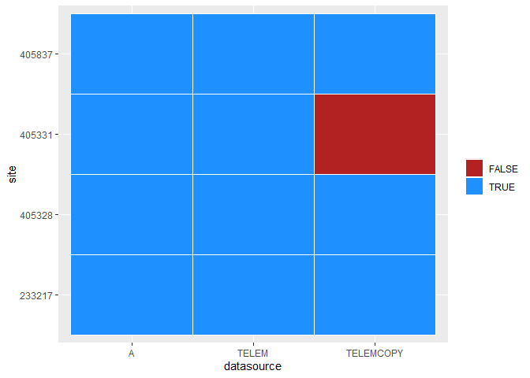
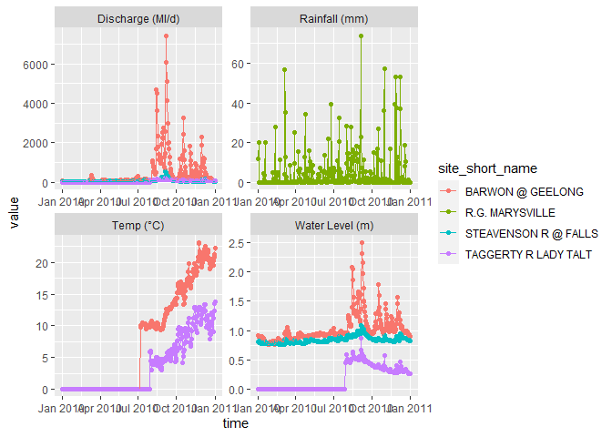
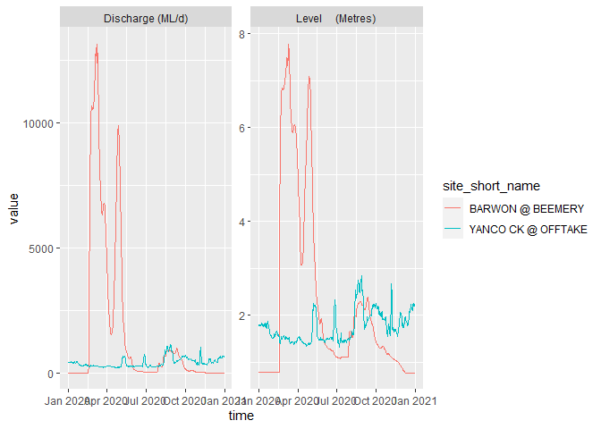
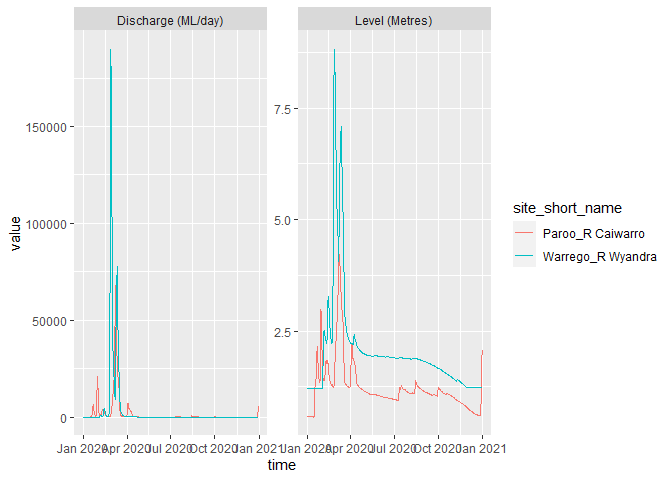

<!-- README.md is generated from README.Rmd. Please edit that file -->

# vicwater

<!-- badges: start -->

[](https://github.com/galenholt/vicwater/actions/workflows/R-CMD-check.yaml)

<!-- badges: end -->

## Purpose

This package is designed to query the [Victorian water
data](https://data.water.vic.gov.au/static.htm) API to pull gauge
information. It does not have complete coverage of the available API
calls, but is under active development to add functionality. Initial
focus has been on identifying what is available to pull and pulling
timeseries.

## Installation

You can install the development version of vicwater from
[GitHub](https://github.com/) with:

``` r
# install.packages("devtools")
devtools::install_github("galenholt/vicwater")
```

## Example

``` r
library(vicwater)
library(ggplot2)
```

This package is designed to query the [Victorian water
data](https://data.water.vic.gov.au/static.htm) API to pull gauge
information. It does not have complete coverage of the available API
calls, but is under active development to add functionality. Initial
focus has been on identifying what is available to pull and pulling
timeseries.

At present, we largely assume the user will have a list of gauges they
want, as the current ability to programatically obtain gauge numbers
according to criteria is limited (but see `get_sites_by_datasource`,
which allows asking for all sites that have a given datasource).

To get the timeseries, the user *should*, but does not need to (see
`get_ts_traces2`), know the available variables. However, finding what
they are can be done through the functions here.

This vignette will proceed with a set of sites chosen to span a range of
characteristics (which we know from test queries).

- The Upper Steavenson (405328) only has flow

- Barwon (233217) has many variables, but their start dates differ

- Taggerty (405331) is no longer in operation- ran 2010-2013

- Marysville golf course (405837) is only rainfall

The functions all require gauges to be their numeric codes as
characters. The API needs a comma-separated string (`"number1, number2"`
) , but the functions here will accept a vector
`c("number1", "number2"`) and decompose it internally. This is typically
easier and reflects more common R workflows such as having a column of
site numbers in a dataframe.

``` r
barwon <- '233217'
steavenson <- '405328'
taggerty <- '405331'
golf <- '405837'
```

## Definitions and available options

I have tried to keep the function argument names the same as in the API,
and the API restricts the options to the function arguments. The API
functions are documented by
[Kisters](https://kisters.com.au/doco/hydllp.htm) (the creators), and
there is a bit more information about options from
[Queensland](https://water-monitoring.information.qld.gov.au/wini/Documents/RDMW_API_doco.pdf),
though there are discrepancies between states.

After quite a lot of digging and testing, an incomplete set of
definitions of common arguments and their potential values follows:

- `site_list` is the gauge number as a character (and the functions here
  accept a vector of these gauge numbers). Can be any gauge number in
  the database. Obtaining them programatically is limited currently,
  except in `get_sites_by_datasource`.

- `datasource` The type of data. Currently aware of `"A"`, `"TELEM"`,
  and `"TELEMCOPY"`, but have done this in a roundabout way and there
  may be others and sites I have not examined. `A` is likely to mean
  ‘archive’, `TELEM` seems to mean ‘telemetry’, and I’m not sure why
  there’s a copy.

  - Some quick testing with `get_sites_by_datasource` shows that there
    are many more sites with `A` than `TELEM`, but that `TELEM` is not a
    subset- there are sites with `TELEM` and not `A`. Initial testing of
    `get_db_info` also finds sites that do not appear with any of these,
    and seem to have no data.

- `var_list` is the type of variable, e.g. rainfall, flow, temp. Should
  be a character of the numeric code, with or without trailing “.00”,
  and can be a vector, e.g. c(“100”, “210.00”).

  - I do not currently have a comprehensive list of possible variables
    and their meaning, but `get_variables_by_site` will provide one for
    a set of sites.

  - The [Queensland
    documentation](https://water-monitoring.information.qld.gov.au/wini/Documents/RDMW_API_doco.pdf)
    gives some more information, but the numbers are not always the
    same.

  - Some variables (typically discharge) are calculated, and *do not
    appear in queries of available variables* such as
    `get_variables_by_site`. Those I’m aware of are “141”- discharge in
    ML, and “140”, discharge in cumecs ($m^3/sec$).

- `start_time` and `end_time` are the start and end times of the period
  requested. The API is strict that these should be 14-digit strings
  “YYYYMMDDHHIIEE”, but the functions here will take them in date
  formats (posix), character, or numeric, and they do not need to be
  14-digits.

  - If not dates, they *should* be at least YYYYMMDD (either character
    or numeric), and the rest will be padded with zeros.

- `interval` is the time interval of the return values for timeseries.
  Options seem to be (base on API error messages)

  - `"year"`, `"month"`, `"day"`, `"hour"`, `"minute"`, `"second"`. I
    don’t think capitalisation matters.

  - Also have not thoroughly tested if only some are available for some
    variables at some sites

- `multiplier` I \*think\* this allows intervals like 5 days, by passing
  `interval = 'day'` and `multiplier = 5`. Not tested other than 1 at
  present.

- `data_type` is the statistic to apply within each interval to get the
  values.

  - Options (from API error messages): `"mean"`, `"max"`, `"min"`,
    `"start"`, `"end"`, `"first"`, `"last"`, `"tot"`, `"maxmin"`,
    `"point"`, `"cum"`. Not all are currently tested.

  - *Warning:* any given API call can only takes one value, which is
    applied to all variables. *This is unlikely to be appropriate if
    asking for many variables.*

  - Two options (both requiring *a priori* knowledge of available
    variables):

    1.  run `get_ts_traces` multiple times, with different subsets of
        `var_type`, each with an appropriate `data_types`.

    2.  Use `get_ts_traces2`, which allows matched vectors of `var_type`
        and `data_type`, effectively automating option 1.

## Finding datasources

To see what datasources are available for a site, use
`get_datasources_by_site`. I’ve largely just been using “A” to test, but
it’s worth looking to see what datasources are available for a target
site(s), and then doing the next step (finding variables) for each, to
see whether the available variables (or timeperiods) differ. I’d like to
automate that, but haven’t yet.

``` r
ds <- get_datasources_by_site(state = 'Vic', 
                              site_list = c(barwon, steavenson, 
                                            taggerty, golf))
```

``` r
ds
```

<div class="kable-table">

| site   | datasource |
|:-------|:-----------|
| 233217 | A          |
| 233217 | TELEM      |
| 233217 | TELEMCOPY  |
| 405328 | A          |
| 405328 | TELEM      |
| 405328 | TELEMCOPY  |
| 405331 | A          |
| 405331 | TELEM      |
| 405837 | A          |
| 405837 | TELEM      |
| 405837 | TELEMCOPY  |

</div>

And we can plot that to get a visualisation. I’m planning to have this
sort of plot for lots of the functions, but for now this is it.

``` r
plot_datasources_by_site(ds)
#> Joining, by = c("site", "datasource")
```



## Finding available variables

Assuming for the moment the user knows the gauge numbers of interest, we
then need to know what variables are available to extract timeseries of.
We use `get_variable_list` to get this information, including both their
names and numbers, as well as other details such as the time period of
record and units.

To demonstrate with the sites above that have a range of variable types
and starts,

``` r
var_info <- get_variable_list(state = 'Vic', 
                              site_list = c(barwon, taggerty, 
                                            steavenson, golf), 
                              datasource = "A")
```

That returns a tibble with information about each gauge and variable. A
few things to note- it gives the names of the gauges, the names and
values of the variables, and a start and end date for each. For example,
the Barwon’s start date for stage (100) is 1961, while the others (pH,
ppm, etc) didn’t start until 2010.

*Note that this does **not** return derived discharge variables (140 and
141)*. If variable 100 (stage height) exists, the other two always seem
to, though I’m not positive.

``` r
var_info
```

<div class="kable-table">

| site   | short_name           | long_name                                       | variable | units                                                  | var_name                | period_start   | period_end     | subdesc               | datasource | timezone |
|:-------|:---------------------|:------------------------------------------------|:---------|:-------------------------------------------------------|:------------------------|:---------------|:---------------|:----------------------|:-----------|:---------|
| 233217 | BARWON @ GEELONG     | BARWON RIVER @ GEELONG                          | 100.00   | metres                                                 | Stream Water Level (m)  | 19610306171500 | 20230202063000 | Available for release | A          | 10.0     |
| 233217 | BARWON @ GEELONG     | BARWON RIVER @ GEELONG                          | 210.00   | pH                                                     | Acidity/Alkalinity (pH) | 20100706123100 | 20230202063000 | Available for release | A          | 10.0     |
| 233217 | BARWON @ GEELONG     | BARWON RIVER @ GEELONG                          | 215.00   | ppm                                                    | Dissolved Oxygen (ppm)  | 20100706123100 | 20230202063000 | Available for release | A          | 10.0     |
| 233217 | BARWON @ GEELONG     | BARWON RIVER @ GEELONG                          | 450.00   | Degrees celsius                                        | Water Temperature (°C)  | 20100706123100 | 20230202063000 | Available for release | A          | 10.0     |
| 233217 | BARWON @ GEELONG     | BARWON RIVER @ GEELONG                          | 810.00   | NTU                                                    | Turbidity (NTU)         | 20100706123100 | 20230202063000 | Available for release | A          | 10.0     |
| 233217 | BARWON @ GEELONG     | BARWON RIVER @ GEELONG                          | 820.00   | <a href="mailto:µS/cm@25" class="email">µS/cm@25</a>°C | Conductivity (µS/cm)    | 20100706123100 | 20230202063000 | Available for release | A          | 10.0     |
| 405331 | TAGGERTY R LADY TALT | TAGGERTY RV @ LADY TALBOT DRIVE NEAR MARYSVILLE | 100.00   | metres                                                 | Stream Water Level (m)  | 20100729122000 | 20130211110700 | Available for release | A          | 10.0     |
| 405331 | TAGGERTY R LADY TALT | TAGGERTY RV @ LADY TALBOT DRIVE NEAR MARYSVILLE | 450.00   | Degrees celsius                                        | Water Temperature (°C)  | 20100729122000 | 20130211110700 | Available for release | A          | 10.0     |
| 405331 | TAGGERTY R LADY TALT | TAGGERTY RV @ LADY TALBOT DRIVE NEAR MARYSVILLE | 810.00   | NTU                                                    | Turbidity (NTU)         | 20100729122000 | 20130211110700 | Available for release | A          | 10.0     |
| 405331 | TAGGERTY R LADY TALT | TAGGERTY RV @ LADY TALBOT DRIVE NEAR MARYSVILLE | 820.00   | <a href="mailto:µS/cm@25" class="email">µS/cm@25</a>°C | Conductivity (µS/cm)    | 20100729122000 | 20130211110700 | Available for release | A          | 10.0     |
| 405328 | STEAVENSON R @ FALLS | STEAVENSON RIVER @ FALLS ROAD MARYSVILLE        | 100.00   | metres                                                 | Stream Water Level (m)  | 20091119170800 | 20230203084840 | Available for release | A          | 10.0     |
| 405837 | R.G. MARYSVILLE      | RAINGAUGE @ MARYSVILLE GOLF CLUB                | 10.00    | mm                                                     | Rainfall (mm)           | 20010621142700 | 20230203090000 | Available for release | A          | 10.0     |

</div>

## Obtaining timeseries

This is the main use of the package, with the other bits getting us to
the point of knowing what to ask for. Specifically, `get_variable_list`
gives us a reference to know what the variables are to ask for and the
relevant timeperiods.

There are a few ways to request the timeseries, and some pitfalls to
avoid.

If we just want a set of variables that all need the same statistic
applied (e.g. daily mean flows), we can pass that in as a vector. For
example, to get daily mean stage height, discharge, and temperature, we
can do that in one call, even for multiple gauges. Asking here for only
5 days to keep the demo reasonable.

``` r
ts_days <- get_ts_traces(state = 'Vic', 
                         site_list = c(barwon, steavenson, taggerty, golf),
                         datasource = "A", 
                         var_list = c("100", "141", "450"),
                         start_time = 20200101,
                         end_time = 20201231,
                         interval = "day",
                         data_type = "mean",
                         multiplier = 1,
                         returnformat = 'df')
#> Warning: executing %dopar% sequentially: no parallel backend registered
```

That returns a tall dataframe, which the user can then split up or plot
how they want. There are other options that return lists of dataframes
if the user does not want all sites and variables combined-

- `returnformat = "varlist"` a list with one tibble per variable

- `returnformat = "sitelist"` a list with one tibble per site

- `returnformat = "sxvlist"` a list with one tibble per site x variable
  combo (including empty lists for missing combos)

``` r
ts_days
```

<div class="kable-table">

| error_num | compressed | timezone | site_short_name      | longitude | site_name                                |  latitude | org_name                             |    value | time       | quality_codes_id | site   | variable_short_name | precision | subdesc               | variable | units           | variable_name           | quality_codes                                                                 | data_type |
|----------:|:-----------|:---------|:---------------------|----------:|:-----------------------------------------|----------:|:-------------------------------------|---------:|:-----------|-----------------:|:-------|:--------------------|:----------|:----------------------|:---------|:----------------|:------------------------|:------------------------------------------------------------------------------|:----------|
|         0 | 0          | 10.0     | BARWON @ GEELONG     |  144.3469 | BARWON RIVER @ GEELONG                   | -38.16361 | Dept. Sustainability and Environment |    0.838 | 2020-01-01 |               15 | 233217 | Water Level (m)     | 0.001000  | Available for release | 100.00   | metres          | Stream Water Level (m)  | Minor editing. +/-11mm - 20mm drift correction                                | mean      |
|         0 | 0          | 10.0     | BARWON @ GEELONG     |  144.3469 | BARWON RIVER @ GEELONG                   | -38.16361 | Dept. Sustainability and Environment |    0.834 | 2020-01-02 |               15 | 233217 | Water Level (m)     | 0.001000  | Available for release | 100.00   | metres          | Stream Water Level (m)  | Minor editing. +/-11mm - 20mm drift correction                                | mean      |
|         0 | 0          | 10.0     | BARWON @ GEELONG     |  144.3469 | BARWON RIVER @ GEELONG                   | -38.16361 | Dept. Sustainability and Environment |    0.827 | 2020-01-03 |               15 | 233217 | Water Level (m)     | 0.001000  | Available for release | 100.00   | metres          | Stream Water Level (m)  | Minor editing. +/-11mm - 20mm drift correction                                | mean      |
|         0 | 0          | 10.0     | BARWON @ GEELONG     |  144.3469 | BARWON RIVER @ GEELONG                   | -38.16361 | Dept. Sustainability and Environment |    0.821 | 2020-01-04 |               15 | 233217 | Water Level (m)     | 0.001000  | Available for release | 100.00   | metres          | Stream Water Level (m)  | Minor editing. +/-11mm - 20mm drift correction                                | mean      |
|         0 | 0          | 10.0     | BARWON @ GEELONG     |  144.3469 | BARWON RIVER @ GEELONG                   | -38.16361 | Dept. Sustainability and Environment |    0.816 | 2020-01-05 |               15 | 233217 | Water Level (m)     | 0.001000  | Available for release | 100.00   | metres          | Stream Water Level (m)  | Minor editing. +/-11mm - 20mm drift correction                                | mean      |
|         0 | 0          | 10.0     | BARWON @ GEELONG     |  144.3469 | BARWON RIVER @ GEELONG                   | -38.16361 | Dept. Sustainability and Environment |    0.814 | 2020-01-06 |               15 | 233217 | Water Level (m)     | 0.001000  | Available for release | 100.00   | metres          | Stream Water Level (m)  | Minor editing. +/-11mm - 20mm drift correction                                | mean      |
|         0 | 0          | 10.0     | BARWON @ GEELONG     |  144.3469 | BARWON RIVER @ GEELONG                   | -38.16361 | Dept. Sustainability and Environment |    0.811 | 2020-01-07 |               15 | 233217 | Water Level (m)     | 0.001000  | Available for release | 100.00   | metres          | Stream Water Level (m)  | Minor editing. +/-11mm - 20mm drift correction                                | mean      |
|         0 | 0          | 10.0     | BARWON @ GEELONG     |  144.3469 | BARWON RIVER @ GEELONG                   | -38.16361 | Dept. Sustainability and Environment |    0.802 | 2020-01-08 |               15 | 233217 | Water Level (m)     | 0.001000  | Available for release | 100.00   | metres          | Stream Water Level (m)  | Minor editing. +/-11mm - 20mm drift correction                                | mean      |
|         0 | 0          | 10.0     | BARWON @ GEELONG     |  144.3469 | BARWON RIVER @ GEELONG                   | -38.16361 | Dept. Sustainability and Environment |    0.791 | 2020-01-09 |               15 | 233217 | Water Level (m)     | 0.001000  | Available for release | 100.00   | metres          | Stream Water Level (m)  | Minor editing. +/-11mm - 20mm drift correction                                | mean      |
|         0 | 0          | 10.0     | BARWON @ GEELONG     |  144.3469 | BARWON RIVER @ GEELONG                   | -38.16361 | Dept. Sustainability and Environment |    0.805 | 2020-01-10 |               15 | 233217 | Water Level (m)     | 0.001000  | Available for release | 100.00   | metres          | Stream Water Level (m)  | Minor editing. +/-11mm - 20mm drift correction                                | mean      |
|         0 | 0          | 10.0     | BARWON @ GEELONG     |  144.3469 | BARWON RIVER @ GEELONG                   | -38.16361 | Dept. Sustainability and Environment |    0.831 | 2020-01-11 |               15 | 233217 | Water Level (m)     | 0.001000  | Available for release | 100.00   | metres          | Stream Water Level (m)  | Minor editing. +/-11mm - 20mm drift correction                                | mean      |
|         0 | 0          | 10.0     | BARWON @ GEELONG     |  144.3469 | BARWON RIVER @ GEELONG                   | -38.16361 | Dept. Sustainability and Environment |    0.824 | 2020-01-12 |               15 | 233217 | Water Level (m)     | 0.001000  | Available for release | 100.00   | metres          | Stream Water Level (m)  | Minor editing. +/-11mm - 20mm drift correction                                | mean      |
|         0 | 0          | 10.0     | BARWON @ GEELONG     |  144.3469 | BARWON RIVER @ GEELONG                   | -38.16361 | Dept. Sustainability and Environment |    0.820 | 2020-01-13 |               15 | 233217 | Water Level (m)     | 0.001000  | Available for release | 100.00   | metres          | Stream Water Level (m)  | Minor editing. +/-11mm - 20mm drift correction                                | mean      |
|         0 | 0          | 10.0     | BARWON @ GEELONG     |  144.3469 | BARWON RIVER @ GEELONG                   | -38.16361 | Dept. Sustainability and Environment |    0.812 | 2020-01-14 |                2 | 233217 | Water Level (m)     | 0.001000  | Available for release | 100.00   | metres          | Stream Water Level (m)  | Good quality data - minimal editing required. +/- 0mm - 10mm Drift correction | mean      |
|         0 | 0          | 10.0     | BARWON @ GEELONG     |  144.3469 | BARWON RIVER @ GEELONG                   | -38.16361 | Dept. Sustainability and Environment |    0.817 | 2020-01-15 |                2 | 233217 | Water Level (m)     | 0.001000  | Available for release | 100.00   | metres          | Stream Water Level (m)  | Good quality data - minimal editing required. +/- 0mm - 10mm Drift correction | mean      |
|         0 | 0          | 10.0     | BARWON @ GEELONG     |  144.3469 | BARWON RIVER @ GEELONG                   | -38.16361 | Dept. Sustainability and Environment |    0.829 | 2020-01-16 |                2 | 233217 | Water Level (m)     | 0.001000  | Available for release | 100.00   | metres          | Stream Water Level (m)  | Good quality data - minimal editing required. +/- 0mm - 10mm Drift correction | mean      |
|         0 | 0          | 10.0     | BARWON @ GEELONG     |  144.3469 | BARWON RIVER @ GEELONG                   | -38.16361 | Dept. Sustainability and Environment |    0.811 | 2020-01-17 |                2 | 233217 | Water Level (m)     | 0.001000  | Available for release | 100.00   | metres          | Stream Water Level (m)  | Good quality data - minimal editing required. +/- 0mm - 10mm Drift correction | mean      |
|         0 | 0          | 10.0     | BARWON @ GEELONG     |  144.3469 | BARWON RIVER @ GEELONG                   | -38.16361 | Dept. Sustainability and Environment |    0.807 | 2020-01-18 |                2 | 233217 | Water Level (m)     | 0.001000  | Available for release | 100.00   | metres          | Stream Water Level (m)  | Good quality data - minimal editing required. +/- 0mm - 10mm Drift correction | mean      |
|         0 | 0          | 10.0     | BARWON @ GEELONG     |  144.3469 | BARWON RIVER @ GEELONG                   | -38.16361 | Dept. Sustainability and Environment |    0.809 | 2020-01-19 |                2 | 233217 | Water Level (m)     | 0.001000  | Available for release | 100.00   | metres          | Stream Water Level (m)  | Good quality data - minimal editing required. +/- 0mm - 10mm Drift correction | mean      |
|         0 | 0          | 10.0     | BARWON @ GEELONG     |  144.3469 | BARWON RIVER @ GEELONG                   | -38.16361 | Dept. Sustainability and Environment |    0.810 | 2020-01-20 |                2 | 233217 | Water Level (m)     | 0.001000  | Available for release | 100.00   | metres          | Stream Water Level (m)  | Good quality data - minimal editing required. +/- 0mm - 10mm Drift correction | mean      |
|         0 | 0          | 10.0     | BARWON @ GEELONG     |  144.3469 | BARWON RIVER @ GEELONG                   | -38.16361 | Dept. Sustainability and Environment |    0.805 | 2020-01-21 |                2 | 233217 | Water Level (m)     | 0.001000  | Available for release | 100.00   | metres          | Stream Water Level (m)  | Good quality data - minimal editing required. +/- 0mm - 10mm Drift correction | mean      |
|         0 | 0          | 10.0     | BARWON @ GEELONG     |  144.3469 | BARWON RIVER @ GEELONG                   | -38.16361 | Dept. Sustainability and Environment |    0.803 | 2020-01-22 |                2 | 233217 | Water Level (m)     | 0.001000  | Available for release | 100.00   | metres          | Stream Water Level (m)  | Good quality data - minimal editing required. +/- 0mm - 10mm Drift correction | mean      |
|         0 | 0          | 10.0     | BARWON @ GEELONG     |  144.3469 | BARWON RIVER @ GEELONG                   | -38.16361 | Dept. Sustainability and Environment |    0.956 | 2020-01-23 |                2 | 233217 | Water Level (m)     | 0.001000  | Available for release | 100.00   | metres          | Stream Water Level (m)  | Good quality data - minimal editing required. +/- 0mm - 10mm Drift correction | mean      |
|         0 | 0          | 10.0     | BARWON @ GEELONG     |  144.3469 | BARWON RIVER @ GEELONG                   | -38.16361 | Dept. Sustainability and Environment |    0.904 | 2020-01-24 |                2 | 233217 | Water Level (m)     | 0.001000  | Available for release | 100.00   | metres          | Stream Water Level (m)  | Good quality data - minimal editing required. +/- 0mm - 10mm Drift correction | mean      |
|         0 | 0          | 10.0     | BARWON @ GEELONG     |  144.3469 | BARWON RIVER @ GEELONG                   | -38.16361 | Dept. Sustainability and Environment |    0.865 | 2020-01-25 |                2 | 233217 | Water Level (m)     | 0.001000  | Available for release | 100.00   | metres          | Stream Water Level (m)  | Good quality data - minimal editing required. +/- 0mm - 10mm Drift correction | mean      |
|         0 | 0          | 10.0     | BARWON @ GEELONG     |  144.3469 | BARWON RIVER @ GEELONG                   | -38.16361 | Dept. Sustainability and Environment |    0.851 | 2020-01-26 |                2 | 233217 | Water Level (m)     | 0.001000  | Available for release | 100.00   | metres          | Stream Water Level (m)  | Good quality data - minimal editing required. +/- 0mm - 10mm Drift correction | mean      |
|         0 | 0          | 10.0     | BARWON @ GEELONG     |  144.3469 | BARWON RIVER @ GEELONG                   | -38.16361 | Dept. Sustainability and Environment |    0.872 | 2020-01-27 |                2 | 233217 | Water Level (m)     | 0.001000  | Available for release | 100.00   | metres          | Stream Water Level (m)  | Good quality data - minimal editing required. +/- 0mm - 10mm Drift correction | mean      |
|         0 | 0          | 10.0     | BARWON @ GEELONG     |  144.3469 | BARWON RIVER @ GEELONG                   | -38.16361 | Dept. Sustainability and Environment |    0.926 | 2020-01-28 |                2 | 233217 | Water Level (m)     | 0.001000  | Available for release | 100.00   | metres          | Stream Water Level (m)  | Good quality data - minimal editing required. +/- 0mm - 10mm Drift correction | mean      |
|         0 | 0          | 10.0     | BARWON @ GEELONG     |  144.3469 | BARWON RIVER @ GEELONG                   | -38.16361 | Dept. Sustainability and Environment |    0.916 | 2020-01-29 |                2 | 233217 | Water Level (m)     | 0.001000  | Available for release | 100.00   | metres          | Stream Water Level (m)  | Good quality data - minimal editing required. +/- 0mm - 10mm Drift correction | mean      |
|         0 | 0          | 10.0     | BARWON @ GEELONG     |  144.3469 | BARWON RIVER @ GEELONG                   | -38.16361 | Dept. Sustainability and Environment |    0.897 | 2020-01-30 |                2 | 233217 | Water Level (m)     | 0.001000  | Available for release | 100.00   | metres          | Stream Water Level (m)  | Good quality data - minimal editing required. +/- 0mm - 10mm Drift correction | mean      |
|         0 | 0          | 10.0     | BARWON @ GEELONG     |  144.3469 | BARWON RIVER @ GEELONG                   | -38.16361 | Dept. Sustainability and Environment |    0.878 | 2020-01-31 |                2 | 233217 | Water Level (m)     | 0.001000  | Available for release | 100.00   | metres          | Stream Water Level (m)  | Good quality data - minimal editing required. +/- 0mm - 10mm Drift correction | mean      |
|         0 | 0          | 10.0     | BARWON @ GEELONG     |  144.3469 | BARWON RIVER @ GEELONG                   | -38.16361 | Dept. Sustainability and Environment |    0.940 | 2020-02-01 |                2 | 233217 | Water Level (m)     | 0.001000  | Available for release | 100.00   | metres          | Stream Water Level (m)  | Good quality data - minimal editing required. +/- 0mm - 10mm Drift correction | mean      |
|         0 | 0          | 10.0     | BARWON @ GEELONG     |  144.3469 | BARWON RIVER @ GEELONG                   | -38.16361 | Dept. Sustainability and Environment |    0.941 | 2020-02-02 |                2 | 233217 | Water Level (m)     | 0.001000  | Available for release | 100.00   | metres          | Stream Water Level (m)  | Good quality data - minimal editing required. +/- 0mm - 10mm Drift correction | mean      |
|         0 | 0          | 10.0     | BARWON @ GEELONG     |  144.3469 | BARWON RIVER @ GEELONG                   | -38.16361 | Dept. Sustainability and Environment |    0.893 | 2020-02-03 |                2 | 233217 | Water Level (m)     | 0.001000  | Available for release | 100.00   | metres          | Stream Water Level (m)  | Good quality data - minimal editing required. +/- 0mm - 10mm Drift correction | mean      |
|         0 | 0          | 10.0     | BARWON @ GEELONG     |  144.3469 | BARWON RIVER @ GEELONG                   | -38.16361 | Dept. Sustainability and Environment |    0.870 | 2020-02-04 |                2 | 233217 | Water Level (m)     | 0.001000  | Available for release | 100.00   | metres          | Stream Water Level (m)  | Good quality data - minimal editing required. +/- 0mm - 10mm Drift correction | mean      |
|         0 | 0          | 10.0     | BARWON @ GEELONG     |  144.3469 | BARWON RIVER @ GEELONG                   | -38.16361 | Dept. Sustainability and Environment |    0.862 | 2020-02-05 |                2 | 233217 | Water Level (m)     | 0.001000  | Available for release | 100.00   | metres          | Stream Water Level (m)  | Good quality data - minimal editing required. +/- 0mm - 10mm Drift correction | mean      |
|         0 | 0          | 10.0     | BARWON @ GEELONG     |  144.3469 | BARWON RIVER @ GEELONG                   | -38.16361 | Dept. Sustainability and Environment |    0.908 | 2020-02-06 |                2 | 233217 | Water Level (m)     | 0.001000  | Available for release | 100.00   | metres          | Stream Water Level (m)  | Good quality data - minimal editing required. +/- 0mm - 10mm Drift correction | mean      |
|         0 | 0          | 10.0     | BARWON @ GEELONG     |  144.3469 | BARWON RIVER @ GEELONG                   | -38.16361 | Dept. Sustainability and Environment |    0.927 | 2020-02-07 |                2 | 233217 | Water Level (m)     | 0.001000  | Available for release | 100.00   | metres          | Stream Water Level (m)  | Good quality data - minimal editing required. +/- 0mm - 10mm Drift correction | mean      |
|         0 | 0          | 10.0     | BARWON @ GEELONG     |  144.3469 | BARWON RIVER @ GEELONG                   | -38.16361 | Dept. Sustainability and Environment |    0.915 | 2020-02-08 |                2 | 233217 | Water Level (m)     | 0.001000  | Available for release | 100.00   | metres          | Stream Water Level (m)  | Good quality data - minimal editing required. +/- 0mm - 10mm Drift correction | mean      |
|         0 | 0          | 10.0     | BARWON @ GEELONG     |  144.3469 | BARWON RIVER @ GEELONG                   | -38.16361 | Dept. Sustainability and Environment |    0.903 | 2020-02-09 |                2 | 233217 | Water Level (m)     | 0.001000  | Available for release | 100.00   | metres          | Stream Water Level (m)  | Good quality data - minimal editing required. +/- 0mm - 10mm Drift correction | mean      |
|         0 | 0          | 10.0     | BARWON @ GEELONG     |  144.3469 | BARWON RIVER @ GEELONG                   | -38.16361 | Dept. Sustainability and Environment |    0.889 | 2020-02-10 |                2 | 233217 | Water Level (m)     | 0.001000  | Available for release | 100.00   | metres          | Stream Water Level (m)  | Good quality data - minimal editing required. +/- 0mm - 10mm Drift correction | mean      |
|         0 | 0          | 10.0     | BARWON @ GEELONG     |  144.3469 | BARWON RIVER @ GEELONG                   | -38.16361 | Dept. Sustainability and Environment |    0.874 | 2020-02-11 |                2 | 233217 | Water Level (m)     | 0.001000  | Available for release | 100.00   | metres          | Stream Water Level (m)  | Good quality data - minimal editing required. +/- 0mm - 10mm Drift correction | mean      |
|         0 | 0          | 10.0     | BARWON @ GEELONG     |  144.3469 | BARWON RIVER @ GEELONG                   | -38.16361 | Dept. Sustainability and Environment |    0.874 | 2020-02-12 |                2 | 233217 | Water Level (m)     | 0.001000  | Available for release | 100.00   | metres          | Stream Water Level (m)  | Good quality data - minimal editing required. +/- 0mm - 10mm Drift correction | mean      |
|         0 | 0          | 10.0     | BARWON @ GEELONG     |  144.3469 | BARWON RIVER @ GEELONG                   | -38.16361 | Dept. Sustainability and Environment |    0.892 | 2020-02-13 |                2 | 233217 | Water Level (m)     | 0.001000  | Available for release | 100.00   | metres          | Stream Water Level (m)  | Good quality data - minimal editing required. +/- 0mm - 10mm Drift correction | mean      |
|         0 | 0          | 10.0     | BARWON @ GEELONG     |  144.3469 | BARWON RIVER @ GEELONG                   | -38.16361 | Dept. Sustainability and Environment |    0.926 | 2020-02-14 |                2 | 233217 | Water Level (m)     | 0.001000  | Available for release | 100.00   | metres          | Stream Water Level (m)  | Good quality data - minimal editing required. +/- 0mm - 10mm Drift correction | mean      |
|         0 | 0          | 10.0     | BARWON @ GEELONG     |  144.3469 | BARWON RIVER @ GEELONG                   | -38.16361 | Dept. Sustainability and Environment |    0.945 | 2020-02-15 |                2 | 233217 | Water Level (m)     | 0.001000  | Available for release | 100.00   | metres          | Stream Water Level (m)  | Good quality data - minimal editing required. +/- 0mm - 10mm Drift correction | mean      |
|         0 | 0          | 10.0     | BARWON @ GEELONG     |  144.3469 | BARWON RIVER @ GEELONG                   | -38.16361 | Dept. Sustainability and Environment |    0.941 | 2020-02-16 |                2 | 233217 | Water Level (m)     | 0.001000  | Available for release | 100.00   | metres          | Stream Water Level (m)  | Good quality data - minimal editing required. +/- 0mm - 10mm Drift correction | mean      |
|         0 | 0          | 10.0     | BARWON @ GEELONG     |  144.3469 | BARWON RIVER @ GEELONG                   | -38.16361 | Dept. Sustainability and Environment |    0.956 | 2020-02-17 |                2 | 233217 | Water Level (m)     | 0.001000  | Available for release | 100.00   | metres          | Stream Water Level (m)  | Good quality data - minimal editing required. +/- 0mm - 10mm Drift correction | mean      |
|         0 | 0          | 10.0     | BARWON @ GEELONG     |  144.3469 | BARWON RIVER @ GEELONG                   | -38.16361 | Dept. Sustainability and Environment |    1.004 | 2020-02-18 |                2 | 233217 | Water Level (m)     | 0.001000  | Available for release | 100.00   | metres          | Stream Water Level (m)  | Good quality data - minimal editing required. +/- 0mm - 10mm Drift correction | mean      |
|         0 | 0          | 10.0     | BARWON @ GEELONG     |  144.3469 | BARWON RIVER @ GEELONG                   | -38.16361 | Dept. Sustainability and Environment |    1.010 | 2020-02-19 |                2 | 233217 | Water Level (m)     | 0.001000  | Available for release | 100.00   | metres          | Stream Water Level (m)  | Good quality data - minimal editing required. +/- 0mm - 10mm Drift correction | mean      |
|         0 | 0          | 10.0     | BARWON @ GEELONG     |  144.3469 | BARWON RIVER @ GEELONG                   | -38.16361 | Dept. Sustainability and Environment |    0.953 | 2020-02-20 |                2 | 233217 | Water Level (m)     | 0.001000  | Available for release | 100.00   | metres          | Stream Water Level (m)  | Good quality data - minimal editing required. +/- 0mm - 10mm Drift correction | mean      |
|         0 | 0          | 10.0     | BARWON @ GEELONG     |  144.3469 | BARWON RIVER @ GEELONG                   | -38.16361 | Dept. Sustainability and Environment |    0.940 | 2020-02-21 |                2 | 233217 | Water Level (m)     | 0.001000  | Available for release | 100.00   | metres          | Stream Water Level (m)  | Good quality data - minimal editing required. +/- 0mm - 10mm Drift correction | mean      |
|         0 | 0          | 10.0     | BARWON @ GEELONG     |  144.3469 | BARWON RIVER @ GEELONG                   | -38.16361 | Dept. Sustainability and Environment |    0.926 | 2020-02-22 |                2 | 233217 | Water Level (m)     | 0.001000  | Available for release | 100.00   | metres          | Stream Water Level (m)  | Good quality data - minimal editing required. +/- 0mm - 10mm Drift correction | mean      |
|         0 | 0          | 10.0     | BARWON @ GEELONG     |  144.3469 | BARWON RIVER @ GEELONG                   | -38.16361 | Dept. Sustainability and Environment |    0.912 | 2020-02-23 |                2 | 233217 | Water Level (m)     | 0.001000  | Available for release | 100.00   | metres          | Stream Water Level (m)  | Good quality data - minimal editing required. +/- 0mm - 10mm Drift correction | mean      |
|         0 | 0          | 10.0     | BARWON @ GEELONG     |  144.3469 | BARWON RIVER @ GEELONG                   | -38.16361 | Dept. Sustainability and Environment |    0.919 | 2020-02-24 |                2 | 233217 | Water Level (m)     | 0.001000  | Available for release | 100.00   | metres          | Stream Water Level (m)  | Good quality data - minimal editing required. +/- 0mm - 10mm Drift correction | mean      |
|         0 | 0          | 10.0     | BARWON @ GEELONG     |  144.3469 | BARWON RIVER @ GEELONG                   | -38.16361 | Dept. Sustainability and Environment |    0.932 | 2020-02-25 |                2 | 233217 | Water Level (m)     | 0.001000  | Available for release | 100.00   | metres          | Stream Water Level (m)  | Good quality data - minimal editing required. +/- 0mm - 10mm Drift correction | mean      |
|         0 | 0          | 10.0     | BARWON @ GEELONG     |  144.3469 | BARWON RIVER @ GEELONG                   | -38.16361 | Dept. Sustainability and Environment |    0.913 | 2020-02-26 |                2 | 233217 | Water Level (m)     | 0.001000  | Available for release | 100.00   | metres          | Stream Water Level (m)  | Good quality data - minimal editing required. +/- 0mm - 10mm Drift correction | mean      |
|         0 | 0          | 10.0     | BARWON @ GEELONG     |  144.3469 | BARWON RIVER @ GEELONG                   | -38.16361 | Dept. Sustainability and Environment |    0.896 | 2020-02-27 |                2 | 233217 | Water Level (m)     | 0.001000  | Available for release | 100.00   | metres          | Stream Water Level (m)  | Good quality data - minimal editing required. +/- 0mm - 10mm Drift correction | mean      |
|         0 | 0          | 10.0     | BARWON @ GEELONG     |  144.3469 | BARWON RIVER @ GEELONG                   | -38.16361 | Dept. Sustainability and Environment |    0.884 | 2020-02-28 |                2 | 233217 | Water Level (m)     | 0.001000  | Available for release | 100.00   | metres          | Stream Water Level (m)  | Good quality data - minimal editing required. +/- 0mm - 10mm Drift correction | mean      |
|         0 | 0          | 10.0     | BARWON @ GEELONG     |  144.3469 | BARWON RIVER @ GEELONG                   | -38.16361 | Dept. Sustainability and Environment |    0.878 | 2020-02-29 |                2 | 233217 | Water Level (m)     | 0.001000  | Available for release | 100.00   | metres          | Stream Water Level (m)  | Good quality data - minimal editing required. +/- 0mm - 10mm Drift correction | mean      |
|         0 | 0          | 10.0     | BARWON @ GEELONG     |  144.3469 | BARWON RIVER @ GEELONG                   | -38.16361 | Dept. Sustainability and Environment |    0.881 | 2020-03-01 |                2 | 233217 | Water Level (m)     | 0.001000  | Available for release | 100.00   | metres          | Stream Water Level (m)  | Good quality data - minimal editing required. +/- 0mm - 10mm Drift correction | mean      |
|         0 | 0          | 10.0     | BARWON @ GEELONG     |  144.3469 | BARWON RIVER @ GEELONG                   | -38.16361 | Dept. Sustainability and Environment |    0.901 | 2020-03-02 |                2 | 233217 | Water Level (m)     | 0.001000  | Available for release | 100.00   | metres          | Stream Water Level (m)  | Good quality data - minimal editing required. +/- 0mm - 10mm Drift correction | mean      |
|         0 | 0          | 10.0     | BARWON @ GEELONG     |  144.3469 | BARWON RIVER @ GEELONG                   | -38.16361 | Dept. Sustainability and Environment |    0.896 | 2020-03-03 |                2 | 233217 | Water Level (m)     | 0.001000  | Available for release | 100.00   | metres          | Stream Water Level (m)  | Good quality data - minimal editing required. +/- 0mm - 10mm Drift correction | mean      |
|         0 | 0          | 10.0     | BARWON @ GEELONG     |  144.3469 | BARWON RIVER @ GEELONG                   | -38.16361 | Dept. Sustainability and Environment |    0.891 | 2020-03-04 |                2 | 233217 | Water Level (m)     | 0.001000  | Available for release | 100.00   | metres          | Stream Water Level (m)  | Good quality data - minimal editing required. +/- 0mm - 10mm Drift correction | mean      |
|         0 | 0          | 10.0     | BARWON @ GEELONG     |  144.3469 | BARWON RIVER @ GEELONG                   | -38.16361 | Dept. Sustainability and Environment |    0.979 | 2020-03-05 |                2 | 233217 | Water Level (m)     | 0.001000  | Available for release | 100.00   | metres          | Stream Water Level (m)  | Good quality data - minimal editing required. +/- 0mm - 10mm Drift correction | mean      |
|         0 | 0          | 10.0     | BARWON @ GEELONG     |  144.3469 | BARWON RIVER @ GEELONG                   | -38.16361 | Dept. Sustainability and Environment |    0.945 | 2020-03-06 |                2 | 233217 | Water Level (m)     | 0.001000  | Available for release | 100.00   | metres          | Stream Water Level (m)  | Good quality data - minimal editing required. +/- 0mm - 10mm Drift correction | mean      |
|         0 | 0          | 10.0     | BARWON @ GEELONG     |  144.3469 | BARWON RIVER @ GEELONG                   | -38.16361 | Dept. Sustainability and Environment |    0.914 | 2020-03-07 |                2 | 233217 | Water Level (m)     | 0.001000  | Available for release | 100.00   | metres          | Stream Water Level (m)  | Good quality data - minimal editing required. +/- 0mm - 10mm Drift correction | mean      |
|         0 | 0          | 10.0     | BARWON @ GEELONG     |  144.3469 | BARWON RIVER @ GEELONG                   | -38.16361 | Dept. Sustainability and Environment |    0.908 | 2020-03-08 |                2 | 233217 | Water Level (m)     | 0.001000  | Available for release | 100.00   | metres          | Stream Water Level (m)  | Good quality data - minimal editing required. +/- 0mm - 10mm Drift correction | mean      |
|         0 | 0          | 10.0     | BARWON @ GEELONG     |  144.3469 | BARWON RIVER @ GEELONG                   | -38.16361 | Dept. Sustainability and Environment |    0.917 | 2020-03-09 |                2 | 233217 | Water Level (m)     | 0.001000  | Available for release | 100.00   | metres          | Stream Water Level (m)  | Good quality data - minimal editing required. +/- 0mm - 10mm Drift correction | mean      |
|         0 | 0          | 10.0     | BARWON @ GEELONG     |  144.3469 | BARWON RIVER @ GEELONG                   | -38.16361 | Dept. Sustainability and Environment |    0.946 | 2020-03-10 |                2 | 233217 | Water Level (m)     | 0.001000  | Available for release | 100.00   | metres          | Stream Water Level (m)  | Good quality data - minimal editing required. +/- 0mm - 10mm Drift correction | mean      |
|         0 | 0          | 10.0     | BARWON @ GEELONG     |  144.3469 | BARWON RIVER @ GEELONG                   | -38.16361 | Dept. Sustainability and Environment |    0.935 | 2020-03-11 |                2 | 233217 | Water Level (m)     | 0.001000  | Available for release | 100.00   | metres          | Stream Water Level (m)  | Good quality data - minimal editing required. +/- 0mm - 10mm Drift correction | mean      |
|         0 | 0          | 10.0     | BARWON @ GEELONG     |  144.3469 | BARWON RIVER @ GEELONG                   | -38.16361 | Dept. Sustainability and Environment |    0.919 | 2020-03-12 |                2 | 233217 | Water Level (m)     | 0.001000  | Available for release | 100.00   | metres          | Stream Water Level (m)  | Good quality data - minimal editing required. +/- 0mm - 10mm Drift correction | mean      |
|         0 | 0          | 10.0     | BARWON @ GEELONG     |  144.3469 | BARWON RIVER @ GEELONG                   | -38.16361 | Dept. Sustainability and Environment |    0.907 | 2020-03-13 |                2 | 233217 | Water Level (m)     | 0.001000  | Available for release | 100.00   | metres          | Stream Water Level (m)  | Good quality data - minimal editing required. +/- 0mm - 10mm Drift correction | mean      |
|         0 | 0          | 10.0     | BARWON @ GEELONG     |  144.3469 | BARWON RIVER @ GEELONG                   | -38.16361 | Dept. Sustainability and Environment |    0.893 | 2020-03-14 |                2 | 233217 | Water Level (m)     | 0.001000  | Available for release | 100.00   | metres          | Stream Water Level (m)  | Good quality data - minimal editing required. +/- 0mm - 10mm Drift correction | mean      |
|         0 | 0          | 10.0     | BARWON @ GEELONG     |  144.3469 | BARWON RIVER @ GEELONG                   | -38.16361 | Dept. Sustainability and Environment |    0.886 | 2020-03-15 |                2 | 233217 | Water Level (m)     | 0.001000  | Available for release | 100.00   | metres          | Stream Water Level (m)  | Good quality data - minimal editing required. +/- 0mm - 10mm Drift correction | mean      |
|         0 | 0          | 10.0     | BARWON @ GEELONG     |  144.3469 | BARWON RIVER @ GEELONG                   | -38.16361 | Dept. Sustainability and Environment |    0.878 | 2020-03-16 |                2 | 233217 | Water Level (m)     | 0.001000  | Available for release | 100.00   | metres          | Stream Water Level (m)  | Good quality data - minimal editing required. +/- 0mm - 10mm Drift correction | mean      |
|         0 | 0          | 10.0     | BARWON @ GEELONG     |  144.3469 | BARWON RIVER @ GEELONG                   | -38.16361 | Dept. Sustainability and Environment |    0.873 | 2020-03-17 |                2 | 233217 | Water Level (m)     | 0.001000  | Available for release | 100.00   | metres          | Stream Water Level (m)  | Good quality data - minimal editing required. +/- 0mm - 10mm Drift correction | mean      |
|         0 | 0          | 10.0     | BARWON @ GEELONG     |  144.3469 | BARWON RIVER @ GEELONG                   | -38.16361 | Dept. Sustainability and Environment |    0.872 | 2020-03-18 |                2 | 233217 | Water Level (m)     | 0.001000  | Available for release | 100.00   | metres          | Stream Water Level (m)  | Good quality data - minimal editing required. +/- 0mm - 10mm Drift correction | mean      |
|         0 | 0          | 10.0     | BARWON @ GEELONG     |  144.3469 | BARWON RIVER @ GEELONG                   | -38.16361 | Dept. Sustainability and Environment |    0.876 | 2020-03-19 |                2 | 233217 | Water Level (m)     | 0.001000  | Available for release | 100.00   | metres          | Stream Water Level (m)  | Good quality data - minimal editing required. +/- 0mm - 10mm Drift correction | mean      |
|         0 | 0          | 10.0     | BARWON @ GEELONG     |  144.3469 | BARWON RIVER @ GEELONG                   | -38.16361 | Dept. Sustainability and Environment |    0.869 | 2020-03-20 |                2 | 233217 | Water Level (m)     | 0.001000  | Available for release | 100.00   | metres          | Stream Water Level (m)  | Good quality data - minimal editing required. +/- 0mm - 10mm Drift correction | mean      |
|         0 | 0          | 10.0     | BARWON @ GEELONG     |  144.3469 | BARWON RIVER @ GEELONG                   | -38.16361 | Dept. Sustainability and Environment |    0.865 | 2020-03-21 |                2 | 233217 | Water Level (m)     | 0.001000  | Available for release | 100.00   | metres          | Stream Water Level (m)  | Good quality data - minimal editing required. +/- 0mm - 10mm Drift correction | mean      |
|         0 | 0          | 10.0     | BARWON @ GEELONG     |  144.3469 | BARWON RIVER @ GEELONG                   | -38.16361 | Dept. Sustainability and Environment |    0.864 | 2020-03-22 |                2 | 233217 | Water Level (m)     | 0.001000  | Available for release | 100.00   | metres          | Stream Water Level (m)  | Good quality data - minimal editing required. +/- 0mm - 10mm Drift correction | mean      |
|         0 | 0          | 10.0     | BARWON @ GEELONG     |  144.3469 | BARWON RIVER @ GEELONG                   | -38.16361 | Dept. Sustainability and Environment |    0.863 | 2020-03-23 |                2 | 233217 | Water Level (m)     | 0.001000  | Available for release | 100.00   | metres          | Stream Water Level (m)  | Good quality data - minimal editing required. +/- 0mm - 10mm Drift correction | mean      |
|         0 | 0          | 10.0     | BARWON @ GEELONG     |  144.3469 | BARWON RIVER @ GEELONG                   | -38.16361 | Dept. Sustainability and Environment |    0.858 | 2020-03-24 |                2 | 233217 | Water Level (m)     | 0.001000  | Available for release | 100.00   | metres          | Stream Water Level (m)  | Good quality data - minimal editing required. +/- 0mm - 10mm Drift correction | mean      |
|         0 | 0          | 10.0     | BARWON @ GEELONG     |  144.3469 | BARWON RIVER @ GEELONG                   | -38.16361 | Dept. Sustainability and Environment |    0.859 | 2020-03-25 |                2 | 233217 | Water Level (m)     | 0.001000  | Available for release | 100.00   | metres          | Stream Water Level (m)  | Good quality data - minimal editing required. +/- 0mm - 10mm Drift correction | mean      |
|         0 | 0          | 10.0     | BARWON @ GEELONG     |  144.3469 | BARWON RIVER @ GEELONG                   | -38.16361 | Dept. Sustainability and Environment |    0.860 | 2020-03-26 |                2 | 233217 | Water Level (m)     | 0.001000  | Available for release | 100.00   | metres          | Stream Water Level (m)  | Good quality data - minimal editing required. +/- 0mm - 10mm Drift correction | mean      |
|         0 | 0          | 10.0     | BARWON @ GEELONG     |  144.3469 | BARWON RIVER @ GEELONG                   | -38.16361 | Dept. Sustainability and Environment |    0.858 | 2020-03-27 |                2 | 233217 | Water Level (m)     | 0.001000  | Available for release | 100.00   | metres          | Stream Water Level (m)  | Good quality data - minimal editing required. +/- 0mm - 10mm Drift correction | mean      |
|         0 | 0          | 10.0     | BARWON @ GEELONG     |  144.3469 | BARWON RIVER @ GEELONG                   | -38.16361 | Dept. Sustainability and Environment |    0.855 | 2020-03-28 |                2 | 233217 | Water Level (m)     | 0.001000  | Available for release | 100.00   | metres          | Stream Water Level (m)  | Good quality data - minimal editing required. +/- 0mm - 10mm Drift correction | mean      |
|         0 | 0          | 10.0     | BARWON @ GEELONG     |  144.3469 | BARWON RIVER @ GEELONG                   | -38.16361 | Dept. Sustainability and Environment |    0.879 | 2020-03-29 |                2 | 233217 | Water Level (m)     | 0.001000  | Available for release | 100.00   | metres          | Stream Water Level (m)  | Good quality data - minimal editing required. +/- 0mm - 10mm Drift correction | mean      |
|         0 | 0          | 10.0     | BARWON @ GEELONG     |  144.3469 | BARWON RIVER @ GEELONG                   | -38.16361 | Dept. Sustainability and Environment |    0.897 | 2020-03-30 |                2 | 233217 | Water Level (m)     | 0.001000  | Available for release | 100.00   | metres          | Stream Water Level (m)  | Good quality data - minimal editing required. +/- 0mm - 10mm Drift correction | mean      |
|         0 | 0          | 10.0     | BARWON @ GEELONG     |  144.3469 | BARWON RIVER @ GEELONG                   | -38.16361 | Dept. Sustainability and Environment |    0.878 | 2020-03-31 |                2 | 233217 | Water Level (m)     | 0.001000  | Available for release | 100.00   | metres          | Stream Water Level (m)  | Good quality data - minimal editing required. +/- 0mm - 10mm Drift correction | mean      |
|         0 | 0          | 10.0     | BARWON @ GEELONG     |  144.3469 | BARWON RIVER @ GEELONG                   | -38.16361 | Dept. Sustainability and Environment |    0.868 | 2020-04-01 |                2 | 233217 | Water Level (m)     | 0.001000  | Available for release | 100.00   | metres          | Stream Water Level (m)  | Good quality data - minimal editing required. +/- 0mm - 10mm Drift correction | mean      |
|         0 | 0          | 10.0     | BARWON @ GEELONG     |  144.3469 | BARWON RIVER @ GEELONG                   | -38.16361 | Dept. Sustainability and Environment |    0.956 | 2020-04-02 |                2 | 233217 | Water Level (m)     | 0.001000  | Available for release | 100.00   | metres          | Stream Water Level (m)  | Good quality data - minimal editing required. +/- 0mm - 10mm Drift correction | mean      |
|         0 | 0          | 10.0     | BARWON @ GEELONG     |  144.3469 | BARWON RIVER @ GEELONG                   | -38.16361 | Dept. Sustainability and Environment |    0.940 | 2020-04-03 |                2 | 233217 | Water Level (m)     | 0.001000  | Available for release | 100.00   | metres          | Stream Water Level (m)  | Good quality data - minimal editing required. +/- 0mm - 10mm Drift correction | mean      |
|         0 | 0          | 10.0     | BARWON @ GEELONG     |  144.3469 | BARWON RIVER @ GEELONG                   | -38.16361 | Dept. Sustainability and Environment |    1.040 | 2020-04-04 |                2 | 233217 | Water Level (m)     | 0.001000  | Available for release | 100.00   | metres          | Stream Water Level (m)  | Good quality data - minimal editing required. +/- 0mm - 10mm Drift correction | mean      |
|         0 | 0          | 10.0     | BARWON @ GEELONG     |  144.3469 | BARWON RIVER @ GEELONG                   | -38.16361 | Dept. Sustainability and Environment |    0.981 | 2020-04-05 |                2 | 233217 | Water Level (m)     | 0.001000  | Available for release | 100.00   | metres          | Stream Water Level (m)  | Good quality data - minimal editing required. +/- 0mm - 10mm Drift correction | mean      |
|         0 | 0          | 10.0     | BARWON @ GEELONG     |  144.3469 | BARWON RIVER @ GEELONG                   | -38.16361 | Dept. Sustainability and Environment |    1.062 | 2020-04-06 |                2 | 233217 | Water Level (m)     | 0.001000  | Available for release | 100.00   | metres          | Stream Water Level (m)  | Good quality data - minimal editing required. +/- 0mm - 10mm Drift correction | mean      |
|         0 | 0          | 10.0     | BARWON @ GEELONG     |  144.3469 | BARWON RIVER @ GEELONG                   | -38.16361 | Dept. Sustainability and Environment |    1.146 | 2020-04-07 |                2 | 233217 | Water Level (m)     | 0.001000  | Available for release | 100.00   | metres          | Stream Water Level (m)  | Good quality data - minimal editing required. +/- 0mm - 10mm Drift correction | mean      |
|         0 | 0          | 10.0     | BARWON @ GEELONG     |  144.3469 | BARWON RIVER @ GEELONG                   | -38.16361 | Dept. Sustainability and Environment |    1.094 | 2020-04-08 |                2 | 233217 | Water Level (m)     | 0.001000  | Available for release | 100.00   | metres          | Stream Water Level (m)  | Good quality data - minimal editing required. +/- 0mm - 10mm Drift correction | mean      |
|         0 | 0          | 10.0     | BARWON @ GEELONG     |  144.3469 | BARWON RIVER @ GEELONG                   | -38.16361 | Dept. Sustainability and Environment |    1.056 | 2020-04-09 |                2 | 233217 | Water Level (m)     | 0.001000  | Available for release | 100.00   | metres          | Stream Water Level (m)  | Good quality data - minimal editing required. +/- 0mm - 10mm Drift correction | mean      |
|         0 | 0          | 10.0     | BARWON @ GEELONG     |  144.3469 | BARWON RIVER @ GEELONG                   | -38.16361 | Dept. Sustainability and Environment |    1.024 | 2020-04-10 |                2 | 233217 | Water Level (m)     | 0.001000  | Available for release | 100.00   | metres          | Stream Water Level (m)  | Good quality data - minimal editing required. +/- 0mm - 10mm Drift correction | mean      |
|         0 | 0          | 10.0     | BARWON @ GEELONG     |  144.3469 | BARWON RIVER @ GEELONG                   | -38.16361 | Dept. Sustainability and Environment |    1.004 | 2020-04-11 |                2 | 233217 | Water Level (m)     | 0.001000  | Available for release | 100.00   | metres          | Stream Water Level (m)  | Good quality data - minimal editing required. +/- 0mm - 10mm Drift correction | mean      |
|         0 | 0          | 10.0     | BARWON @ GEELONG     |  144.3469 | BARWON RIVER @ GEELONG                   | -38.16361 | Dept. Sustainability and Environment |    0.989 | 2020-04-12 |                2 | 233217 | Water Level (m)     | 0.001000  | Available for release | 100.00   | metres          | Stream Water Level (m)  | Good quality data - minimal editing required. +/- 0mm - 10mm Drift correction | mean      |
|         0 | 0          | 10.0     | BARWON @ GEELONG     |  144.3469 | BARWON RIVER @ GEELONG                   | -38.16361 | Dept. Sustainability and Environment |    0.978 | 2020-04-13 |                2 | 233217 | Water Level (m)     | 0.001000  | Available for release | 100.00   | metres          | Stream Water Level (m)  | Good quality data - minimal editing required. +/- 0mm - 10mm Drift correction | mean      |
|         0 | 0          | 10.0     | BARWON @ GEELONG     |  144.3469 | BARWON RIVER @ GEELONG                   | -38.16361 | Dept. Sustainability and Environment |    0.970 | 2020-04-14 |                2 | 233217 | Water Level (m)     | 0.001000  | Available for release | 100.00   | metres          | Stream Water Level (m)  | Good quality data - minimal editing required. +/- 0mm - 10mm Drift correction | mean      |
|         0 | 0          | 10.0     | BARWON @ GEELONG     |  144.3469 | BARWON RIVER @ GEELONG                   | -38.16361 | Dept. Sustainability and Environment |    0.962 | 2020-04-15 |                2 | 233217 | Water Level (m)     | 0.001000  | Available for release | 100.00   | metres          | Stream Water Level (m)  | Good quality data - minimal editing required. +/- 0mm - 10mm Drift correction | mean      |
|         0 | 0          | 10.0     | BARWON @ GEELONG     |  144.3469 | BARWON RIVER @ GEELONG                   | -38.16361 | Dept. Sustainability and Environment |    0.954 | 2020-04-16 |                2 | 233217 | Water Level (m)     | 0.001000  | Available for release | 100.00   | metres          | Stream Water Level (m)  | Good quality data - minimal editing required. +/- 0mm - 10mm Drift correction | mean      |
|         0 | 0          | 10.0     | BARWON @ GEELONG     |  144.3469 | BARWON RIVER @ GEELONG                   | -38.16361 | Dept. Sustainability and Environment |    0.945 | 2020-04-17 |                2 | 233217 | Water Level (m)     | 0.001000  | Available for release | 100.00   | metres          | Stream Water Level (m)  | Good quality data - minimal editing required. +/- 0mm - 10mm Drift correction | mean      |
|         0 | 0          | 10.0     | BARWON @ GEELONG     |  144.3469 | BARWON RIVER @ GEELONG                   | -38.16361 | Dept. Sustainability and Environment |    0.939 | 2020-04-18 |                2 | 233217 | Water Level (m)     | 0.001000  | Available for release | 100.00   | metres          | Stream Water Level (m)  | Good quality data - minimal editing required. +/- 0mm - 10mm Drift correction | mean      |
|         0 | 0          | 10.0     | BARWON @ GEELONG     |  144.3469 | BARWON RIVER @ GEELONG                   | -38.16361 | Dept. Sustainability and Environment |    0.933 | 2020-04-19 |                2 | 233217 | Water Level (m)     | 0.001000  | Available for release | 100.00   | metres          | Stream Water Level (m)  | Good quality data - minimal editing required. +/- 0mm - 10mm Drift correction | mean      |
|         0 | 0          | 10.0     | BARWON @ GEELONG     |  144.3469 | BARWON RIVER @ GEELONG                   | -38.16361 | Dept. Sustainability and Environment |    0.940 | 2020-04-20 |                2 | 233217 | Water Level (m)     | 0.001000  | Available for release | 100.00   | metres          | Stream Water Level (m)  | Good quality data - minimal editing required. +/- 0mm - 10mm Drift correction | mean      |
|         0 | 0          | 10.0     | BARWON @ GEELONG     |  144.3469 | BARWON RIVER @ GEELONG                   | -38.16361 | Dept. Sustainability and Environment |    0.921 | 2020-04-21 |                2 | 233217 | Water Level (m)     | 0.001000  | Available for release | 100.00   | metres          | Stream Water Level (m)  | Good quality data - minimal editing required. +/- 0mm - 10mm Drift correction | mean      |
|         0 | 0          | 10.0     | BARWON @ GEELONG     |  144.3469 | BARWON RIVER @ GEELONG                   | -38.16361 | Dept. Sustainability and Environment |    0.911 | 2020-04-22 |                2 | 233217 | Water Level (m)     | 0.001000  | Available for release | 100.00   | metres          | Stream Water Level (m)  | Good quality data - minimal editing required. +/- 0mm - 10mm Drift correction | mean      |
|         0 | 0          | 10.0     | BARWON @ GEELONG     |  144.3469 | BARWON RIVER @ GEELONG                   | -38.16361 | Dept. Sustainability and Environment |    0.909 | 2020-04-23 |                2 | 233217 | Water Level (m)     | 0.001000  | Available for release | 100.00   | metres          | Stream Water Level (m)  | Good quality data - minimal editing required. +/- 0mm - 10mm Drift correction | mean      |
|         0 | 0          | 10.0     | BARWON @ GEELONG     |  144.3469 | BARWON RIVER @ GEELONG                   | -38.16361 | Dept. Sustainability and Environment |    0.907 | 2020-04-24 |                2 | 233217 | Water Level (m)     | 0.001000  | Available for release | 100.00   | metres          | Stream Water Level (m)  | Good quality data - minimal editing required. +/- 0mm - 10mm Drift correction | mean      |
|         0 | 0          | 10.0     | BARWON @ GEELONG     |  144.3469 | BARWON RIVER @ GEELONG                   | -38.16361 | Dept. Sustainability and Environment |    0.902 | 2020-04-25 |                2 | 233217 | Water Level (m)     | 0.001000  | Available for release | 100.00   | metres          | Stream Water Level (m)  | Good quality data - minimal editing required. +/- 0mm - 10mm Drift correction | mean      |
|         0 | 0          | 10.0     | BARWON @ GEELONG     |  144.3469 | BARWON RIVER @ GEELONG                   | -38.16361 | Dept. Sustainability and Environment |    0.914 | 2020-04-26 |                2 | 233217 | Water Level (m)     | 0.001000  | Available for release | 100.00   | metres          | Stream Water Level (m)  | Good quality data - minimal editing required. +/- 0mm - 10mm Drift correction | mean      |
|         0 | 0          | 10.0     | BARWON @ GEELONG     |  144.3469 | BARWON RIVER @ GEELONG                   | -38.16361 | Dept. Sustainability and Environment |    0.909 | 2020-04-27 |                2 | 233217 | Water Level (m)     | 0.001000  | Available for release | 100.00   | metres          | Stream Water Level (m)  | Good quality data - minimal editing required. +/- 0mm - 10mm Drift correction | mean      |
|         0 | 0          | 10.0     | BARWON @ GEELONG     |  144.3469 | BARWON RIVER @ GEELONG                   | -38.16361 | Dept. Sustainability and Environment |    0.900 | 2020-04-28 |                2 | 233217 | Water Level (m)     | 0.001000  | Available for release | 100.00   | metres          | Stream Water Level (m)  | Good quality data - minimal editing required. +/- 0mm - 10mm Drift correction | mean      |
|         0 | 0          | 10.0     | BARWON @ GEELONG     |  144.3469 | BARWON RIVER @ GEELONG                   | -38.16361 | Dept. Sustainability and Environment |    0.914 | 2020-04-29 |                2 | 233217 | Water Level (m)     | 0.001000  | Available for release | 100.00   | metres          | Stream Water Level (m)  | Good quality data - minimal editing required. +/- 0mm - 10mm Drift correction | mean      |
|         0 | 0          | 10.0     | BARWON @ GEELONG     |  144.3469 | BARWON RIVER @ GEELONG                   | -38.16361 | Dept. Sustainability and Environment |    0.952 | 2020-04-30 |                2 | 233217 | Water Level (m)     | 0.001000  | Available for release | 100.00   | metres          | Stream Water Level (m)  | Good quality data - minimal editing required. +/- 0mm - 10mm Drift correction | mean      |
|         0 | 0          | 10.0     | BARWON @ GEELONG     |  144.3469 | BARWON RIVER @ GEELONG                   | -38.16361 | Dept. Sustainability and Environment |    0.977 | 2020-05-01 |                2 | 233217 | Water Level (m)     | 0.001000  | Available for release | 100.00   | metres          | Stream Water Level (m)  | Good quality data - minimal editing required. +/- 0mm - 10mm Drift correction | mean      |
|         0 | 0          | 10.0     | BARWON @ GEELONG     |  144.3469 | BARWON RIVER @ GEELONG                   | -38.16361 | Dept. Sustainability and Environment |    0.959 | 2020-05-02 |                2 | 233217 | Water Level (m)     | 0.001000  | Available for release | 100.00   | metres          | Stream Water Level (m)  | Good quality data - minimal editing required. +/- 0mm - 10mm Drift correction | mean      |
|         0 | 0          | 10.0     | BARWON @ GEELONG     |  144.3469 | BARWON RIVER @ GEELONG                   | -38.16361 | Dept. Sustainability and Environment |    0.989 | 2020-05-03 |                2 | 233217 | Water Level (m)     | 0.001000  | Available for release | 100.00   | metres          | Stream Water Level (m)  | Good quality data - minimal editing required. +/- 0mm - 10mm Drift correction | mean      |
|         0 | 0          | 10.0     | BARWON @ GEELONG     |  144.3469 | BARWON RIVER @ GEELONG                   | -38.16361 | Dept. Sustainability and Environment |    1.108 | 2020-05-04 |                2 | 233217 | Water Level (m)     | 0.001000  | Available for release | 100.00   | metres          | Stream Water Level (m)  | Good quality data - minimal editing required. +/- 0mm - 10mm Drift correction | mean      |
|         0 | 0          | 10.0     | BARWON @ GEELONG     |  144.3469 | BARWON RIVER @ GEELONG                   | -38.16361 | Dept. Sustainability and Environment |    1.069 | 2020-05-05 |                2 | 233217 | Water Level (m)     | 0.001000  | Available for release | 100.00   | metres          | Stream Water Level (m)  | Good quality data - minimal editing required. +/- 0mm - 10mm Drift correction | mean      |
|         0 | 0          | 10.0     | BARWON @ GEELONG     |  144.3469 | BARWON RIVER @ GEELONG                   | -38.16361 | Dept. Sustainability and Environment |    1.037 | 2020-05-06 |                2 | 233217 | Water Level (m)     | 0.001000  | Available for release | 100.00   | metres          | Stream Water Level (m)  | Good quality data - minimal editing required. +/- 0mm - 10mm Drift correction | mean      |
|         0 | 0          | 10.0     | BARWON @ GEELONG     |  144.3469 | BARWON RIVER @ GEELONG                   | -38.16361 | Dept. Sustainability and Environment |    1.021 | 2020-05-07 |                2 | 233217 | Water Level (m)     | 0.001000  | Available for release | 100.00   | metres          | Stream Water Level (m)  | Good quality data - minimal editing required. +/- 0mm - 10mm Drift correction | mean      |
|         0 | 0          | 10.0     | BARWON @ GEELONG     |  144.3469 | BARWON RIVER @ GEELONG                   | -38.16361 | Dept. Sustainability and Environment |    1.009 | 2020-05-08 |                2 | 233217 | Water Level (m)     | 0.001000  | Available for release | 100.00   | metres          | Stream Water Level (m)  | Good quality data - minimal editing required. +/- 0mm - 10mm Drift correction | mean      |
|         0 | 0          | 10.0     | BARWON @ GEELONG     |  144.3469 | BARWON RIVER @ GEELONG                   | -38.16361 | Dept. Sustainability and Environment |    0.997 | 2020-05-09 |                2 | 233217 | Water Level (m)     | 0.001000  | Available for release | 100.00   | metres          | Stream Water Level (m)  | Good quality data - minimal editing required. +/- 0mm - 10mm Drift correction | mean      |
|         0 | 0          | 10.0     | BARWON @ GEELONG     |  144.3469 | BARWON RIVER @ GEELONG                   | -38.16361 | Dept. Sustainability and Environment |    0.984 | 2020-05-10 |                2 | 233217 | Water Level (m)     | 0.001000  | Available for release | 100.00   | metres          | Stream Water Level (m)  | Good quality data - minimal editing required. +/- 0mm - 10mm Drift correction | mean      |
|         0 | 0          | 10.0     | BARWON @ GEELONG     |  144.3469 | BARWON RIVER @ GEELONG                   | -38.16361 | Dept. Sustainability and Environment |    0.967 | 2020-05-11 |                2 | 233217 | Water Level (m)     | 0.001000  | Available for release | 100.00   | metres          | Stream Water Level (m)  | Good quality data - minimal editing required. +/- 0mm - 10mm Drift correction | mean      |
|         0 | 0          | 10.0     | BARWON @ GEELONG     |  144.3469 | BARWON RIVER @ GEELONG                   | -38.16361 | Dept. Sustainability and Environment |    0.953 | 2020-05-12 |                2 | 233217 | Water Level (m)     | 0.001000  | Available for release | 100.00   | metres          | Stream Water Level (m)  | Good quality data - minimal editing required. +/- 0mm - 10mm Drift correction | mean      |
|         0 | 0          | 10.0     | BARWON @ GEELONG     |  144.3469 | BARWON RIVER @ GEELONG                   | -38.16361 | Dept. Sustainability and Environment |    0.961 | 2020-05-13 |                2 | 233217 | Water Level (m)     | 0.001000  | Available for release | 100.00   | metres          | Stream Water Level (m)  | Good quality data - minimal editing required. +/- 0mm - 10mm Drift correction | mean      |
|         0 | 0          | 10.0     | BARWON @ GEELONG     |  144.3469 | BARWON RIVER @ GEELONG                   | -38.16361 | Dept. Sustainability and Environment |    0.976 | 2020-05-14 |                2 | 233217 | Water Level (m)     | 0.001000  | Available for release | 100.00   | metres          | Stream Water Level (m)  | Good quality data - minimal editing required. +/- 0mm - 10mm Drift correction | mean      |
|         0 | 0          | 10.0     | BARWON @ GEELONG     |  144.3469 | BARWON RIVER @ GEELONG                   | -38.16361 | Dept. Sustainability and Environment |    0.961 | 2020-05-15 |                2 | 233217 | Water Level (m)     | 0.001000  | Available for release | 100.00   | metres          | Stream Water Level (m)  | Good quality data - minimal editing required. +/- 0mm - 10mm Drift correction | mean      |
|         0 | 0          | 10.0     | BARWON @ GEELONG     |  144.3469 | BARWON RIVER @ GEELONG                   | -38.16361 | Dept. Sustainability and Environment |    0.951 | 2020-05-16 |                2 | 233217 | Water Level (m)     | 0.001000  | Available for release | 100.00   | metres          | Stream Water Level (m)  | Good quality data - minimal editing required. +/- 0mm - 10mm Drift correction | mean      |
|         0 | 0          | 10.0     | BARWON @ GEELONG     |  144.3469 | BARWON RIVER @ GEELONG                   | -38.16361 | Dept. Sustainability and Environment |    0.948 | 2020-05-17 |                2 | 233217 | Water Level (m)     | 0.001000  | Available for release | 100.00   | metres          | Stream Water Level (m)  | Good quality data - minimal editing required. +/- 0mm - 10mm Drift correction | mean      |
|         0 | 0          | 10.0     | BARWON @ GEELONG     |  144.3469 | BARWON RIVER @ GEELONG                   | -38.16361 | Dept. Sustainability and Environment |    0.948 | 2020-05-18 |                2 | 233217 | Water Level (m)     | 0.001000  | Available for release | 100.00   | metres          | Stream Water Level (m)  | Good quality data - minimal editing required. +/- 0mm - 10mm Drift correction | mean      |
|         0 | 0          | 10.0     | BARWON @ GEELONG     |  144.3469 | BARWON RIVER @ GEELONG                   | -38.16361 | Dept. Sustainability and Environment |    0.948 | 2020-05-19 |                2 | 233217 | Water Level (m)     | 0.001000  | Available for release | 100.00   | metres          | Stream Water Level (m)  | Good quality data - minimal editing required. +/- 0mm - 10mm Drift correction | mean      |
|         0 | 0          | 10.0     | BARWON @ GEELONG     |  144.3469 | BARWON RIVER @ GEELONG                   | -38.16361 | Dept. Sustainability and Environment |    0.985 | 2020-05-20 |                2 | 233217 | Water Level (m)     | 0.001000  | Available for release | 100.00   | metres          | Stream Water Level (m)  | Good quality data - minimal editing required. +/- 0mm - 10mm Drift correction | mean      |
|         0 | 0          | 10.0     | BARWON @ GEELONG     |  144.3469 | BARWON RIVER @ GEELONG                   | -38.16361 | Dept. Sustainability and Environment |    0.965 | 2020-05-21 |                2 | 233217 | Water Level (m)     | 0.001000  | Available for release | 100.00   | metres          | Stream Water Level (m)  | Good quality data - minimal editing required. +/- 0mm - 10mm Drift correction | mean      |
|         0 | 0          | 10.0     | BARWON @ GEELONG     |  144.3469 | BARWON RIVER @ GEELONG                   | -38.16361 | Dept. Sustainability and Environment |    0.950 | 2020-05-22 |                2 | 233217 | Water Level (m)     | 0.001000  | Available for release | 100.00   | metres          | Stream Water Level (m)  | Good quality data - minimal editing required. +/- 0mm - 10mm Drift correction | mean      |
|         0 | 0          | 10.0     | BARWON @ GEELONG     |  144.3469 | BARWON RIVER @ GEELONG                   | -38.16361 | Dept. Sustainability and Environment |    0.969 | 2020-05-23 |                2 | 233217 | Water Level (m)     | 0.001000  | Available for release | 100.00   | metres          | Stream Water Level (m)  | Good quality data - minimal editing required. +/- 0mm - 10mm Drift correction | mean      |
|         0 | 0          | 10.0     | BARWON @ GEELONG     |  144.3469 | BARWON RIVER @ GEELONG                   | -38.16361 | Dept. Sustainability and Environment |    1.042 | 2020-05-24 |                2 | 233217 | Water Level (m)     | 0.001000  | Available for release | 100.00   | metres          | Stream Water Level (m)  | Good quality data - minimal editing required. +/- 0mm - 10mm Drift correction | mean      |
|         0 | 0          | 10.0     | BARWON @ GEELONG     |  144.3469 | BARWON RIVER @ GEELONG                   | -38.16361 | Dept. Sustainability and Environment |    1.027 | 2020-05-25 |                2 | 233217 | Water Level (m)     | 0.001000  | Available for release | 100.00   | metres          | Stream Water Level (m)  | Good quality data - minimal editing required. +/- 0mm - 10mm Drift correction | mean      |
|         0 | 0          | 10.0     | BARWON @ GEELONG     |  144.3469 | BARWON RIVER @ GEELONG                   | -38.16361 | Dept. Sustainability and Environment |    1.006 | 2020-05-26 |                2 | 233217 | Water Level (m)     | 0.001000  | Available for release | 100.00   | metres          | Stream Water Level (m)  | Good quality data - minimal editing required. +/- 0mm - 10mm Drift correction | mean      |
|         0 | 0          | 10.0     | BARWON @ GEELONG     |  144.3469 | BARWON RIVER @ GEELONG                   | -38.16361 | Dept. Sustainability and Environment |    0.995 | 2020-05-27 |                2 | 233217 | Water Level (m)     | 0.001000  | Available for release | 100.00   | metres          | Stream Water Level (m)  | Good quality data - minimal editing required. +/- 0mm - 10mm Drift correction | mean      |
|         0 | 0          | 10.0     | BARWON @ GEELONG     |  144.3469 | BARWON RIVER @ GEELONG                   | -38.16361 | Dept. Sustainability and Environment |    0.989 | 2020-05-28 |                2 | 233217 | Water Level (m)     | 0.001000  | Available for release | 100.00   | metres          | Stream Water Level (m)  | Good quality data - minimal editing required. +/- 0mm - 10mm Drift correction | mean      |
|         0 | 0          | 10.0     | BARWON @ GEELONG     |  144.3469 | BARWON RIVER @ GEELONG                   | -38.16361 | Dept. Sustainability and Environment |    0.982 | 2020-05-29 |                2 | 233217 | Water Level (m)     | 0.001000  | Available for release | 100.00   | metres          | Stream Water Level (m)  | Good quality data - minimal editing required. +/- 0mm - 10mm Drift correction | mean      |
|         0 | 0          | 10.0     | BARWON @ GEELONG     |  144.3469 | BARWON RIVER @ GEELONG                   | -38.16361 | Dept. Sustainability and Environment |    0.972 | 2020-05-30 |                2 | 233217 | Water Level (m)     | 0.001000  | Available for release | 100.00   | metres          | Stream Water Level (m)  | Good quality data - minimal editing required. +/- 0mm - 10mm Drift correction | mean      |
|         0 | 0          | 10.0     | BARWON @ GEELONG     |  144.3469 | BARWON RIVER @ GEELONG                   | -38.16361 | Dept. Sustainability and Environment |    0.961 | 2020-05-31 |                2 | 233217 | Water Level (m)     | 0.001000  | Available for release | 100.00   | metres          | Stream Water Level (m)  | Good quality data - minimal editing required. +/- 0mm - 10mm Drift correction | mean      |
|         0 | 0          | 10.0     | BARWON @ GEELONG     |  144.3469 | BARWON RIVER @ GEELONG                   | -38.16361 | Dept. Sustainability and Environment |    0.955 | 2020-06-01 |                2 | 233217 | Water Level (m)     | 0.001000  | Available for release | 100.00   | metres          | Stream Water Level (m)  | Good quality data - minimal editing required. +/- 0mm - 10mm Drift correction | mean      |
|         0 | 0          | 10.0     | BARWON @ GEELONG     |  144.3469 | BARWON RIVER @ GEELONG                   | -38.16361 | Dept. Sustainability and Environment |    0.925 | 2020-06-02 |                2 | 233217 | Water Level (m)     | 0.001000  | Available for release | 100.00   | metres          | Stream Water Level (m)  | Good quality data - minimal editing required. +/- 0mm - 10mm Drift correction | mean      |
|         0 | 0          | 10.0     | BARWON @ GEELONG     |  144.3469 | BARWON RIVER @ GEELONG                   | -38.16361 | Dept. Sustainability and Environment |    0.914 | 2020-06-03 |                2 | 233217 | Water Level (m)     | 0.001000  | Available for release | 100.00   | metres          | Stream Water Level (m)  | Good quality data - minimal editing required. +/- 0mm - 10mm Drift correction | mean      |
|         0 | 0          | 10.0     | BARWON @ GEELONG     |  144.3469 | BARWON RIVER @ GEELONG                   | -38.16361 | Dept. Sustainability and Environment |    0.917 | 2020-06-04 |                2 | 233217 | Water Level (m)     | 0.001000  | Available for release | 100.00   | metres          | Stream Water Level (m)  | Good quality data - minimal editing required. +/- 0mm - 10mm Drift correction | mean      |
|         0 | 0          | 10.0     | BARWON @ GEELONG     |  144.3469 | BARWON RIVER @ GEELONG                   | -38.16361 | Dept. Sustainability and Environment |    0.985 | 2020-06-05 |                2 | 233217 | Water Level (m)     | 0.001000  | Available for release | 100.00   | metres          | Stream Water Level (m)  | Good quality data - minimal editing required. +/- 0mm - 10mm Drift correction | mean      |
|         0 | 0          | 10.0     | BARWON @ GEELONG     |  144.3469 | BARWON RIVER @ GEELONG                   | -38.16361 | Dept. Sustainability and Environment |    0.982 | 2020-06-06 |                2 | 233217 | Water Level (m)     | 0.001000  | Available for release | 100.00   | metres          | Stream Water Level (m)  | Good quality data - minimal editing required. +/- 0mm - 10mm Drift correction | mean      |
|         0 | 0          | 10.0     | BARWON @ GEELONG     |  144.3469 | BARWON RIVER @ GEELONG                   | -38.16361 | Dept. Sustainability and Environment |    0.958 | 2020-06-07 |                2 | 233217 | Water Level (m)     | 0.001000  | Available for release | 100.00   | metres          | Stream Water Level (m)  | Good quality data - minimal editing required. +/- 0mm - 10mm Drift correction | mean      |
|         0 | 0          | 10.0     | BARWON @ GEELONG     |  144.3469 | BARWON RIVER @ GEELONG                   | -38.16361 | Dept. Sustainability and Environment |    0.932 | 2020-06-08 |                2 | 233217 | Water Level (m)     | 0.001000  | Available for release | 100.00   | metres          | Stream Water Level (m)  | Good quality data - minimal editing required. +/- 0mm - 10mm Drift correction | mean      |
|         0 | 0          | 10.0     | BARWON @ GEELONG     |  144.3469 | BARWON RIVER @ GEELONG                   | -38.16361 | Dept. Sustainability and Environment |    0.919 | 2020-06-09 |                2 | 233217 | Water Level (m)     | 0.001000  | Available for release | 100.00   | metres          | Stream Water Level (m)  | Good quality data - minimal editing required. +/- 0mm - 10mm Drift correction | mean      |
|         0 | 0          | 10.0     | BARWON @ GEELONG     |  144.3469 | BARWON RIVER @ GEELONG                   | -38.16361 | Dept. Sustainability and Environment |    0.910 | 2020-06-10 |                2 | 233217 | Water Level (m)     | 0.001000  | Available for release | 100.00   | metres          | Stream Water Level (m)  | Good quality data - minimal editing required. +/- 0mm - 10mm Drift correction | mean      |
|         0 | 0          | 10.0     | BARWON @ GEELONG     |  144.3469 | BARWON RIVER @ GEELONG                   | -38.16361 | Dept. Sustainability and Environment |    0.900 | 2020-06-11 |                2 | 233217 | Water Level (m)     | 0.001000  | Available for release | 100.00   | metres          | Stream Water Level (m)  | Good quality data - minimal editing required. +/- 0mm - 10mm Drift correction | mean      |
|         0 | 0          | 10.0     | BARWON @ GEELONG     |  144.3469 | BARWON RIVER @ GEELONG                   | -38.16361 | Dept. Sustainability and Environment |    0.893 | 2020-06-12 |                2 | 233217 | Water Level (m)     | 0.001000  | Available for release | 100.00   | metres          | Stream Water Level (m)  | Good quality data - minimal editing required. +/- 0mm - 10mm Drift correction | mean      |
|         0 | 0          | 10.0     | BARWON @ GEELONG     |  144.3469 | BARWON RIVER @ GEELONG                   | -38.16361 | Dept. Sustainability and Environment |    0.886 | 2020-06-13 |                2 | 233217 | Water Level (m)     | 0.001000  | Available for release | 100.00   | metres          | Stream Water Level (m)  | Good quality data - minimal editing required. +/- 0mm - 10mm Drift correction | mean      |
|         0 | 0          | 10.0     | BARWON @ GEELONG     |  144.3469 | BARWON RIVER @ GEELONG                   | -38.16361 | Dept. Sustainability and Environment |    0.882 | 2020-06-14 |                2 | 233217 | Water Level (m)     | 0.001000  | Available for release | 100.00   | metres          | Stream Water Level (m)  | Good quality data - minimal editing required. +/- 0mm - 10mm Drift correction | mean      |
|         0 | 0          | 10.0     | BARWON @ GEELONG     |  144.3469 | BARWON RIVER @ GEELONG                   | -38.16361 | Dept. Sustainability and Environment |    0.889 | 2020-06-15 |                2 | 233217 | Water Level (m)     | 0.001000  | Available for release | 100.00   | metres          | Stream Water Level (m)  | Good quality data - minimal editing required. +/- 0mm - 10mm Drift correction | mean      |
|         0 | 0          | 10.0     | BARWON @ GEELONG     |  144.3469 | BARWON RIVER @ GEELONG                   | -38.16361 | Dept. Sustainability and Environment |    0.877 | 2020-06-16 |                2 | 233217 | Water Level (m)     | 0.001000  | Available for release | 100.00   | metres          | Stream Water Level (m)  | Good quality data - minimal editing required. +/- 0mm - 10mm Drift correction | mean      |
|         0 | 0          | 10.0     | BARWON @ GEELONG     |  144.3469 | BARWON RIVER @ GEELONG                   | -38.16361 | Dept. Sustainability and Environment |    0.875 | 2020-06-17 |                2 | 233217 | Water Level (m)     | 0.001000  | Available for release | 100.00   | metres          | Stream Water Level (m)  | Good quality data - minimal editing required. +/- 0mm - 10mm Drift correction | mean      |
|         0 | 0          | 10.0     | BARWON @ GEELONG     |  144.3469 | BARWON RIVER @ GEELONG                   | -38.16361 | Dept. Sustainability and Environment |    0.866 | 2020-06-18 |                2 | 233217 | Water Level (m)     | 0.001000  | Available for release | 100.00   | metres          | Stream Water Level (m)  | Good quality data - minimal editing required. +/- 0mm - 10mm Drift correction | mean      |
|         0 | 0          | 10.0     | BARWON @ GEELONG     |  144.3469 | BARWON RIVER @ GEELONG                   | -38.16361 | Dept. Sustainability and Environment |    0.861 | 2020-06-19 |                2 | 233217 | Water Level (m)     | 0.001000  | Available for release | 100.00   | metres          | Stream Water Level (m)  | Good quality data - minimal editing required. +/- 0mm - 10mm Drift correction | mean      |
|         0 | 0          | 10.0     | BARWON @ GEELONG     |  144.3469 | BARWON RIVER @ GEELONG                   | -38.16361 | Dept. Sustainability and Environment |    0.878 | 2020-06-20 |                2 | 233217 | Water Level (m)     | 0.001000  | Available for release | 100.00   | metres          | Stream Water Level (m)  | Good quality data - minimal editing required. +/- 0mm - 10mm Drift correction | mean      |
|         0 | 0          | 10.0     | BARWON @ GEELONG     |  144.3469 | BARWON RIVER @ GEELONG                   | -38.16361 | Dept. Sustainability and Environment |    0.881 | 2020-06-21 |                2 | 233217 | Water Level (m)     | 0.001000  | Available for release | 100.00   | metres          | Stream Water Level (m)  | Good quality data - minimal editing required. +/- 0mm - 10mm Drift correction | mean      |
|         0 | 0          | 10.0     | BARWON @ GEELONG     |  144.3469 | BARWON RIVER @ GEELONG                   | -38.16361 | Dept. Sustainability and Environment |    0.879 | 2020-06-22 |                2 | 233217 | Water Level (m)     | 0.001000  | Available for release | 100.00   | metres          | Stream Water Level (m)  | Good quality data - minimal editing required. +/- 0mm - 10mm Drift correction | mean      |
|         0 | 0          | 10.0     | BARWON @ GEELONG     |  144.3469 | BARWON RIVER @ GEELONG                   | -38.16361 | Dept. Sustainability and Environment |    0.882 | 2020-06-23 |                2 | 233217 | Water Level (m)     | 0.001000  | Available for release | 100.00   | metres          | Stream Water Level (m)  | Good quality data - minimal editing required. +/- 0mm - 10mm Drift correction | mean      |
|         0 | 0          | 10.0     | BARWON @ GEELONG     |  144.3469 | BARWON RIVER @ GEELONG                   | -38.16361 | Dept. Sustainability and Environment |    0.897 | 2020-06-24 |                2 | 233217 | Water Level (m)     | 0.001000  | Available for release | 100.00   | metres          | Stream Water Level (m)  | Good quality data - minimal editing required. +/- 0mm - 10mm Drift correction | mean      |
|         0 | 0          | 10.0     | BARWON @ GEELONG     |  144.3469 | BARWON RIVER @ GEELONG                   | -38.16361 | Dept. Sustainability and Environment |    0.949 | 2020-06-25 |                2 | 233217 | Water Level (m)     | 0.001000  | Available for release | 100.00   | metres          | Stream Water Level (m)  | Good quality data - minimal editing required. +/- 0mm - 10mm Drift correction | mean      |
|         0 | 0          | 10.0     | BARWON @ GEELONG     |  144.3469 | BARWON RIVER @ GEELONG                   | -38.16361 | Dept. Sustainability and Environment |    1.016 | 2020-06-26 |                2 | 233217 | Water Level (m)     | 0.001000  | Available for release | 100.00   | metres          | Stream Water Level (m)  | Good quality data - minimal editing required. +/- 0mm - 10mm Drift correction | mean      |
|         0 | 0          | 10.0     | BARWON @ GEELONG     |  144.3469 | BARWON RIVER @ GEELONG                   | -38.16361 | Dept. Sustainability and Environment |    1.014 | 2020-06-27 |                2 | 233217 | Water Level (m)     | 0.001000  | Available for release | 100.00   | metres          | Stream Water Level (m)  | Good quality data - minimal editing required. +/- 0mm - 10mm Drift correction | mean      |
|         0 | 0          | 10.0     | BARWON @ GEELONG     |  144.3469 | BARWON RIVER @ GEELONG                   | -38.16361 | Dept. Sustainability and Environment |    0.985 | 2020-06-28 |                2 | 233217 | Water Level (m)     | 0.001000  | Available for release | 100.00   | metres          | Stream Water Level (m)  | Good quality data - minimal editing required. +/- 0mm - 10mm Drift correction | mean      |
|         0 | 0          | 10.0     | BARWON @ GEELONG     |  144.3469 | BARWON RIVER @ GEELONG                   | -38.16361 | Dept. Sustainability and Environment |    0.961 | 2020-06-29 |                2 | 233217 | Water Level (m)     | 0.001000  | Available for release | 100.00   | metres          | Stream Water Level (m)  | Good quality data - minimal editing required. +/- 0mm - 10mm Drift correction | mean      |
|         0 | 0          | 10.0     | BARWON @ GEELONG     |  144.3469 | BARWON RIVER @ GEELONG                   | -38.16361 | Dept. Sustainability and Environment |    0.942 | 2020-06-30 |                2 | 233217 | Water Level (m)     | 0.001000  | Available for release | 100.00   | metres          | Stream Water Level (m)  | Good quality data - minimal editing required. +/- 0mm - 10mm Drift correction | mean      |
|         0 | 0          | 10.0     | BARWON @ GEELONG     |  144.3469 | BARWON RIVER @ GEELONG                   | -38.16361 | Dept. Sustainability and Environment |    0.922 | 2020-07-01 |                2 | 233217 | Water Level (m)     | 0.001000  | Available for release | 100.00   | metres          | Stream Water Level (m)  | Good quality data - minimal editing required. +/- 0mm - 10mm Drift correction | mean      |
|         0 | 0          | 10.0     | BARWON @ GEELONG     |  144.3469 | BARWON RIVER @ GEELONG                   | -38.16361 | Dept. Sustainability and Environment |    0.916 | 2020-07-02 |                2 | 233217 | Water Level (m)     | 0.001000  | Available for release | 100.00   | metres          | Stream Water Level (m)  | Good quality data - minimal editing required. +/- 0mm - 10mm Drift correction | mean      |
|         0 | 0          | 10.0     | BARWON @ GEELONG     |  144.3469 | BARWON RIVER @ GEELONG                   | -38.16361 | Dept. Sustainability and Environment |    0.931 | 2020-07-03 |                2 | 233217 | Water Level (m)     | 0.001000  | Available for release | 100.00   | metres          | Stream Water Level (m)  | Good quality data - minimal editing required. +/- 0mm - 10mm Drift correction | mean      |
|         0 | 0          | 10.0     | BARWON @ GEELONG     |  144.3469 | BARWON RIVER @ GEELONG                   | -38.16361 | Dept. Sustainability and Environment |    0.939 | 2020-07-04 |                2 | 233217 | Water Level (m)     | 0.001000  | Available for release | 100.00   | metres          | Stream Water Level (m)  | Good quality data - minimal editing required. +/- 0mm - 10mm Drift correction | mean      |
|         0 | 0          | 10.0     | BARWON @ GEELONG     |  144.3469 | BARWON RIVER @ GEELONG                   | -38.16361 | Dept. Sustainability and Environment |    0.911 | 2020-07-05 |                2 | 233217 | Water Level (m)     | 0.001000  | Available for release | 100.00   | metres          | Stream Water Level (m)  | Good quality data - minimal editing required. +/- 0mm - 10mm Drift correction | mean      |
|         0 | 0          | 10.0     | BARWON @ GEELONG     |  144.3469 | BARWON RIVER @ GEELONG                   | -38.16361 | Dept. Sustainability and Environment |    0.897 | 2020-07-06 |                2 | 233217 | Water Level (m)     | 0.001000  | Available for release | 100.00   | metres          | Stream Water Level (m)  | Good quality data - minimal editing required. +/- 0mm - 10mm Drift correction | mean      |
|         0 | 0          | 10.0     | BARWON @ GEELONG     |  144.3469 | BARWON RIVER @ GEELONG                   | -38.16361 | Dept. Sustainability and Environment |    0.937 | 2020-07-07 |                2 | 233217 | Water Level (m)     | 0.001000  | Available for release | 100.00   | metres          | Stream Water Level (m)  | Good quality data - minimal editing required. +/- 0mm - 10mm Drift correction | mean      |
|         0 | 0          | 10.0     | BARWON @ GEELONG     |  144.3469 | BARWON RIVER @ GEELONG                   | -38.16361 | Dept. Sustainability and Environment |    1.049 | 2020-07-08 |                2 | 233217 | Water Level (m)     | 0.001000  | Available for release | 100.00   | metres          | Stream Water Level (m)  | Good quality data - minimal editing required. +/- 0mm - 10mm Drift correction | mean      |
|         0 | 0          | 10.0     | BARWON @ GEELONG     |  144.3469 | BARWON RIVER @ GEELONG                   | -38.16361 | Dept. Sustainability and Environment |    1.091 | 2020-07-09 |                2 | 233217 | Water Level (m)     | 0.001000  | Available for release | 100.00   | metres          | Stream Water Level (m)  | Good quality data - minimal editing required. +/- 0mm - 10mm Drift correction | mean      |
|         0 | 0          | 10.0     | BARWON @ GEELONG     |  144.3469 | BARWON RIVER @ GEELONG                   | -38.16361 | Dept. Sustainability and Environment |    1.099 | 2020-07-10 |                2 | 233217 | Water Level (m)     | 0.001000  | Available for release | 100.00   | metres          | Stream Water Level (m)  | Good quality data - minimal editing required. +/- 0mm - 10mm Drift correction | mean      |
|         0 | 0          | 10.0     | BARWON @ GEELONG     |  144.3469 | BARWON RIVER @ GEELONG                   | -38.16361 | Dept. Sustainability and Environment |    1.087 | 2020-07-11 |                2 | 233217 | Water Level (m)     | 0.001000  | Available for release | 100.00   | metres          | Stream Water Level (m)  | Good quality data - minimal editing required. +/- 0mm - 10mm Drift correction | mean      |
|         0 | 0          | 10.0     | BARWON @ GEELONG     |  144.3469 | BARWON RIVER @ GEELONG                   | -38.16361 | Dept. Sustainability and Environment |    1.075 | 2020-07-12 |                2 | 233217 | Water Level (m)     | 0.001000  | Available for release | 100.00   | metres          | Stream Water Level (m)  | Good quality data - minimal editing required. +/- 0mm - 10mm Drift correction | mean      |
|         0 | 0          | 10.0     | BARWON @ GEELONG     |  144.3469 | BARWON RIVER @ GEELONG                   | -38.16361 | Dept. Sustainability and Environment |    1.062 | 2020-07-13 |                2 | 233217 | Water Level (m)     | 0.001000  | Available for release | 100.00   | metres          | Stream Water Level (m)  | Good quality data - minimal editing required. +/- 0mm - 10mm Drift correction | mean      |
|         0 | 0          | 10.0     | BARWON @ GEELONG     |  144.3469 | BARWON RIVER @ GEELONG                   | -38.16361 | Dept. Sustainability and Environment |    1.049 | 2020-07-14 |                2 | 233217 | Water Level (m)     | 0.001000  | Available for release | 100.00   | metres          | Stream Water Level (m)  | Good quality data - minimal editing required. +/- 0mm - 10mm Drift correction | mean      |
|         0 | 0          | 10.0     | BARWON @ GEELONG     |  144.3469 | BARWON RIVER @ GEELONG                   | -38.16361 | Dept. Sustainability and Environment |    1.100 | 2020-07-15 |                2 | 233217 | Water Level (m)     | 0.001000  | Available for release | 100.00   | metres          | Stream Water Level (m)  | Good quality data - minimal editing required. +/- 0mm - 10mm Drift correction | mean      |
|         0 | 0          | 10.0     | BARWON @ GEELONG     |  144.3469 | BARWON RIVER @ GEELONG                   | -38.16361 | Dept. Sustainability and Environment |    1.101 | 2020-07-16 |                2 | 233217 | Water Level (m)     | 0.001000  | Available for release | 100.00   | metres          | Stream Water Level (m)  | Good quality data - minimal editing required. +/- 0mm - 10mm Drift correction | mean      |
|         0 | 0          | 10.0     | BARWON @ GEELONG     |  144.3469 | BARWON RIVER @ GEELONG                   | -38.16361 | Dept. Sustainability and Environment |    1.072 | 2020-07-17 |                2 | 233217 | Water Level (m)     | 0.001000  | Available for release | 100.00   | metres          | Stream Water Level (m)  | Good quality data - minimal editing required. +/- 0mm - 10mm Drift correction | mean      |
|         0 | 0          | 10.0     | BARWON @ GEELONG     |  144.3469 | BARWON RIVER @ GEELONG                   | -38.16361 | Dept. Sustainability and Environment |    1.049 | 2020-07-18 |                2 | 233217 | Water Level (m)     | 0.001000  | Available for release | 100.00   | metres          | Stream Water Level (m)  | Good quality data - minimal editing required. +/- 0mm - 10mm Drift correction | mean      |
|         0 | 0          | 10.0     | BARWON @ GEELONG     |  144.3469 | BARWON RIVER @ GEELONG                   | -38.16361 | Dept. Sustainability and Environment |    1.033 | 2020-07-19 |                2 | 233217 | Water Level (m)     | 0.001000  | Available for release | 100.00   | metres          | Stream Water Level (m)  | Good quality data - minimal editing required. +/- 0mm - 10mm Drift correction | mean      |
|         0 | 0          | 10.0     | BARWON @ GEELONG     |  144.3469 | BARWON RIVER @ GEELONG                   | -38.16361 | Dept. Sustainability and Environment |    1.023 | 2020-07-20 |                2 | 233217 | Water Level (m)     | 0.001000  | Available for release | 100.00   | metres          | Stream Water Level (m)  | Good quality data - minimal editing required. +/- 0mm - 10mm Drift correction | mean      |
|         0 | 0          | 10.0     | BARWON @ GEELONG     |  144.3469 | BARWON RIVER @ GEELONG                   | -38.16361 | Dept. Sustainability and Environment |    1.018 | 2020-07-21 |                2 | 233217 | Water Level (m)     | 0.001000  | Available for release | 100.00   | metres          | Stream Water Level (m)  | Good quality data - minimal editing required. +/- 0mm - 10mm Drift correction | mean      |
|         0 | 0          | 10.0     | BARWON @ GEELONG     |  144.3469 | BARWON RIVER @ GEELONG                   | -38.16361 | Dept. Sustainability and Environment |    1.015 | 2020-07-22 |                2 | 233217 | Water Level (m)     | 0.001000  | Available for release | 100.00   | metres          | Stream Water Level (m)  | Good quality data - minimal editing required. +/- 0mm - 10mm Drift correction | mean      |
|         0 | 0          | 10.0     | BARWON @ GEELONG     |  144.3469 | BARWON RIVER @ GEELONG                   | -38.16361 | Dept. Sustainability and Environment |    1.013 | 2020-07-23 |                2 | 233217 | Water Level (m)     | 0.001000  | Available for release | 100.00   | metres          | Stream Water Level (m)  | Good quality data - minimal editing required. +/- 0mm - 10mm Drift correction | mean      |
|         0 | 0          | 10.0     | BARWON @ GEELONG     |  144.3469 | BARWON RIVER @ GEELONG                   | -38.16361 | Dept. Sustainability and Environment |    1.014 | 2020-07-24 |                2 | 233217 | Water Level (m)     | 0.001000  | Available for release | 100.00   | metres          | Stream Water Level (m)  | Good quality data - minimal editing required. +/- 0mm - 10mm Drift correction | mean      |
|         0 | 0          | 10.0     | BARWON @ GEELONG     |  144.3469 | BARWON RIVER @ GEELONG                   | -38.16361 | Dept. Sustainability and Environment |    1.008 | 2020-07-25 |                2 | 233217 | Water Level (m)     | 0.001000  | Available for release | 100.00   | metres          | Stream Water Level (m)  | Good quality data - minimal editing required. +/- 0mm - 10mm Drift correction | mean      |
|         0 | 0          | 10.0     | BARWON @ GEELONG     |  144.3469 | BARWON RIVER @ GEELONG                   | -38.16361 | Dept. Sustainability and Environment |    1.003 | 2020-07-26 |                2 | 233217 | Water Level (m)     | 0.001000  | Available for release | 100.00   | metres          | Stream Water Level (m)  | Good quality data - minimal editing required. +/- 0mm - 10mm Drift correction | mean      |
|         0 | 0          | 10.0     | BARWON @ GEELONG     |  144.3469 | BARWON RIVER @ GEELONG                   | -38.16361 | Dept. Sustainability and Environment |    1.004 | 2020-07-27 |                2 | 233217 | Water Level (m)     | 0.001000  | Available for release | 100.00   | metres          | Stream Water Level (m)  | Good quality data - minimal editing required. +/- 0mm - 10mm Drift correction | mean      |
|         0 | 0          | 10.0     | BARWON @ GEELONG     |  144.3469 | BARWON RIVER @ GEELONG                   | -38.16361 | Dept. Sustainability and Environment |    1.011 | 2020-07-28 |                2 | 233217 | Water Level (m)     | 0.001000  | Available for release | 100.00   | metres          | Stream Water Level (m)  | Good quality data - minimal editing required. +/- 0mm - 10mm Drift correction | mean      |
|         0 | 0          | 10.0     | BARWON @ GEELONG     |  144.3469 | BARWON RIVER @ GEELONG                   | -38.16361 | Dept. Sustainability and Environment |    1.011 | 2020-07-29 |                2 | 233217 | Water Level (m)     | 0.001000  | Available for release | 100.00   | metres          | Stream Water Level (m)  | Good quality data - minimal editing required. +/- 0mm - 10mm Drift correction | mean      |
|         0 | 0          | 10.0     | BARWON @ GEELONG     |  144.3469 | BARWON RIVER @ GEELONG                   | -38.16361 | Dept. Sustainability and Environment |    1.011 | 2020-07-30 |                2 | 233217 | Water Level (m)     | 0.001000  | Available for release | 100.00   | metres          | Stream Water Level (m)  | Good quality data - minimal editing required. +/- 0mm - 10mm Drift correction | mean      |
|         0 | 0          | 10.0     | BARWON @ GEELONG     |  144.3469 | BARWON RIVER @ GEELONG                   | -38.16361 | Dept. Sustainability and Environment |    1.008 | 2020-07-31 |                2 | 233217 | Water Level (m)     | 0.001000  | Available for release | 100.00   | metres          | Stream Water Level (m)  | Good quality data - minimal editing required. +/- 0mm - 10mm Drift correction | mean      |
|         0 | 0          | 10.0     | BARWON @ GEELONG     |  144.3469 | BARWON RIVER @ GEELONG                   | -38.16361 | Dept. Sustainability and Environment |    1.004 | 2020-08-01 |                2 | 233217 | Water Level (m)     | 0.001000  | Available for release | 100.00   | metres          | Stream Water Level (m)  | Good quality data - minimal editing required. +/- 0mm - 10mm Drift correction | mean      |
|         0 | 0          | 10.0     | BARWON @ GEELONG     |  144.3469 | BARWON RIVER @ GEELONG                   | -38.16361 | Dept. Sustainability and Environment |    1.008 | 2020-08-02 |                2 | 233217 | Water Level (m)     | 0.001000  | Available for release | 100.00   | metres          | Stream Water Level (m)  | Good quality data - minimal editing required. +/- 0mm - 10mm Drift correction | mean      |
|         0 | 0          | 10.0     | BARWON @ GEELONG     |  144.3469 | BARWON RIVER @ GEELONG                   | -38.16361 | Dept. Sustainability and Environment |    1.004 | 2020-08-03 |                2 | 233217 | Water Level (m)     | 0.001000  | Available for release | 100.00   | metres          | Stream Water Level (m)  | Good quality data - minimal editing required. +/- 0mm - 10mm Drift correction | mean      |
|         0 | 0          | 10.0     | BARWON @ GEELONG     |  144.3469 | BARWON RIVER @ GEELONG                   | -38.16361 | Dept. Sustainability and Environment |    1.016 | 2020-08-04 |                2 | 233217 | Water Level (m)     | 0.001000  | Available for release | 100.00   | metres          | Stream Water Level (m)  | Good quality data - minimal editing required. +/- 0mm - 10mm Drift correction | mean      |
|         0 | 0          | 10.0     | BARWON @ GEELONG     |  144.3469 | BARWON RIVER @ GEELONG                   | -38.16361 | Dept. Sustainability and Environment |    1.030 | 2020-08-05 |                2 | 233217 | Water Level (m)     | 0.001000  | Available for release | 100.00   | metres          | Stream Water Level (m)  | Good quality data - minimal editing required. +/- 0mm - 10mm Drift correction | mean      |
|         0 | 0          | 10.0     | BARWON @ GEELONG     |  144.3469 | BARWON RIVER @ GEELONG                   | -38.16361 | Dept. Sustainability and Environment |    1.011 | 2020-08-06 |                2 | 233217 | Water Level (m)     | 0.001000  | Available for release | 100.00   | metres          | Stream Water Level (m)  | Good quality data - minimal editing required. +/- 0mm - 10mm Drift correction | mean      |
|         0 | 0          | 10.0     | BARWON @ GEELONG     |  144.3469 | BARWON RIVER @ GEELONG                   | -38.16361 | Dept. Sustainability and Environment |    1.008 | 2020-08-07 |                2 | 233217 | Water Level (m)     | 0.001000  | Available for release | 100.00   | metres          | Stream Water Level (m)  | Good quality data - minimal editing required. +/- 0mm - 10mm Drift correction | mean      |
|         0 | 0          | 10.0     | BARWON @ GEELONG     |  144.3469 | BARWON RIVER @ GEELONG                   | -38.16361 | Dept. Sustainability and Environment |    1.037 | 2020-08-08 |                2 | 233217 | Water Level (m)     | 0.001000  | Available for release | 100.00   | metres          | Stream Water Level (m)  | Good quality data - minimal editing required. +/- 0mm - 10mm Drift correction | mean      |
|         0 | 0          | 10.0     | BARWON @ GEELONG     |  144.3469 | BARWON RIVER @ GEELONG                   | -38.16361 | Dept. Sustainability and Environment |    1.040 | 2020-08-09 |                2 | 233217 | Water Level (m)     | 0.001000  | Available for release | 100.00   | metres          | Stream Water Level (m)  | Good quality data - minimal editing required. +/- 0mm - 10mm Drift correction | mean      |
|         0 | 0          | 10.0     | BARWON @ GEELONG     |  144.3469 | BARWON RIVER @ GEELONG                   | -38.16361 | Dept. Sustainability and Environment |    1.031 | 2020-08-10 |                2 | 233217 | Water Level (m)     | 0.001000  | Available for release | 100.00   | metres          | Stream Water Level (m)  | Good quality data - minimal editing required. +/- 0mm - 10mm Drift correction | mean      |
|         0 | 0          | 10.0     | BARWON @ GEELONG     |  144.3469 | BARWON RIVER @ GEELONG                   | -38.16361 | Dept. Sustainability and Environment |    1.030 | 2020-08-11 |                2 | 233217 | Water Level (m)     | 0.001000  | Available for release | 100.00   | metres          | Stream Water Level (m)  | Good quality data - minimal editing required. +/- 0mm - 10mm Drift correction | mean      |
|         0 | 0          | 10.0     | BARWON @ GEELONG     |  144.3469 | BARWON RIVER @ GEELONG                   | -38.16361 | Dept. Sustainability and Environment |    1.290 | 2020-08-12 |                2 | 233217 | Water Level (m)     | 0.001000  | Available for release | 100.00   | metres          | Stream Water Level (m)  | Good quality data - minimal editing required. +/- 0mm - 10mm Drift correction | mean      |
|         0 | 0          | 10.0     | BARWON @ GEELONG     |  144.3469 | BARWON RIVER @ GEELONG                   | -38.16361 | Dept. Sustainability and Environment |    1.345 | 2020-08-13 |                2 | 233217 | Water Level (m)     | 0.001000  | Available for release | 100.00   | metres          | Stream Water Level (m)  | Good quality data - minimal editing required. +/- 0mm - 10mm Drift correction | mean      |
|         0 | 0          | 10.0     | BARWON @ GEELONG     |  144.3469 | BARWON RIVER @ GEELONG                   | -38.16361 | Dept. Sustainability and Environment |    1.229 | 2020-08-14 |                2 | 233217 | Water Level (m)     | 0.001000  | Available for release | 100.00   | metres          | Stream Water Level (m)  | Good quality data - minimal editing required. +/- 0mm - 10mm Drift correction | mean      |
|         0 | 0          | 10.0     | BARWON @ GEELONG     |  144.3469 | BARWON RIVER @ GEELONG                   | -38.16361 | Dept. Sustainability and Environment |    1.149 | 2020-08-15 |                2 | 233217 | Water Level (m)     | 0.001000  | Available for release | 100.00   | metres          | Stream Water Level (m)  | Good quality data - minimal editing required. +/- 0mm - 10mm Drift correction | mean      |
|         0 | 0          | 10.0     | BARWON @ GEELONG     |  144.3469 | BARWON RIVER @ GEELONG                   | -38.16361 | Dept. Sustainability and Environment |    1.125 | 2020-08-16 |                2 | 233217 | Water Level (m)     | 0.001000  | Available for release | 100.00   | metres          | Stream Water Level (m)  | Good quality data - minimal editing required. +/- 0mm - 10mm Drift correction | mean      |
|         0 | 0          | 10.0     | BARWON @ GEELONG     |  144.3469 | BARWON RIVER @ GEELONG                   | -38.16361 | Dept. Sustainability and Environment |    1.109 | 2020-08-17 |                2 | 233217 | Water Level (m)     | 0.001000  | Available for release | 100.00   | metres          | Stream Water Level (m)  | Good quality data - minimal editing required. +/- 0mm - 10mm Drift correction | mean      |
|         0 | 0          | 10.0     | BARWON @ GEELONG     |  144.3469 | BARWON RIVER @ GEELONG                   | -38.16361 | Dept. Sustainability and Environment |    1.084 | 2020-08-18 |                2 | 233217 | Water Level (m)     | 0.001000  | Available for release | 100.00   | metres          | Stream Water Level (m)  | Good quality data - minimal editing required. +/- 0mm - 10mm Drift correction | mean      |
|         0 | 0          | 10.0     | BARWON @ GEELONG     |  144.3469 | BARWON RIVER @ GEELONG                   | -38.16361 | Dept. Sustainability and Environment |    1.072 | 2020-08-19 |                2 | 233217 | Water Level (m)     | 0.001000  | Available for release | 100.00   | metres          | Stream Water Level (m)  | Good quality data - minimal editing required. +/- 0mm - 10mm Drift correction | mean      |
|         0 | 0          | 10.0     | BARWON @ GEELONG     |  144.3469 | BARWON RIVER @ GEELONG                   | -38.16361 | Dept. Sustainability and Environment |    1.088 | 2020-08-20 |                2 | 233217 | Water Level (m)     | 0.001000  | Available for release | 100.00   | metres          | Stream Water Level (m)  | Good quality data - minimal editing required. +/- 0mm - 10mm Drift correction | mean      |
|         0 | 0          | 10.0     | BARWON @ GEELONG     |  144.3469 | BARWON RIVER @ GEELONG                   | -38.16361 | Dept. Sustainability and Environment |    1.097 | 2020-08-21 |                2 | 233217 | Water Level (m)     | 0.001000  | Available for release | 100.00   | metres          | Stream Water Level (m)  | Good quality data - minimal editing required. +/- 0mm - 10mm Drift correction | mean      |
|         0 | 0          | 10.0     | BARWON @ GEELONG     |  144.3469 | BARWON RIVER @ GEELONG                   | -38.16361 | Dept. Sustainability and Environment |    1.162 | 2020-08-22 |                2 | 233217 | Water Level (m)     | 0.001000  | Available for release | 100.00   | metres          | Stream Water Level (m)  | Good quality data - minimal editing required. +/- 0mm - 10mm Drift correction | mean      |
|         0 | 0          | 10.0     | BARWON @ GEELONG     |  144.3469 | BARWON RIVER @ GEELONG                   | -38.16361 | Dept. Sustainability and Environment |    1.389 | 2020-08-23 |                2 | 233217 | Water Level (m)     | 0.001000  | Available for release | 100.00   | metres          | Stream Water Level (m)  | Good quality data - minimal editing required. +/- 0mm - 10mm Drift correction | mean      |
|         0 | 0          | 10.0     | BARWON @ GEELONG     |  144.3469 | BARWON RIVER @ GEELONG                   | -38.16361 | Dept. Sustainability and Environment |    1.804 | 2020-08-24 |                2 | 233217 | Water Level (m)     | 0.001000  | Available for release | 100.00   | metres          | Stream Water Level (m)  | Good quality data - minimal editing required. +/- 0mm - 10mm Drift correction | mean      |
|         0 | 0          | 10.0     | BARWON @ GEELONG     |  144.3469 | BARWON RIVER @ GEELONG                   | -38.16361 | Dept. Sustainability and Environment |    2.187 | 2020-08-25 |                2 | 233217 | Water Level (m)     | 0.001000  | Available for release | 100.00   | metres          | Stream Water Level (m)  | Good quality data - minimal editing required. +/- 0mm - 10mm Drift correction | mean      |
|         0 | 0          | 10.0     | BARWON @ GEELONG     |  144.3469 | BARWON RIVER @ GEELONG                   | -38.16361 | Dept. Sustainability and Environment |    1.908 | 2020-08-26 |                2 | 233217 | Water Level (m)     | 0.001000  | Available for release | 100.00   | metres          | Stream Water Level (m)  | Good quality data - minimal editing required. +/- 0mm - 10mm Drift correction | mean      |
|         0 | 0          | 10.0     | BARWON @ GEELONG     |  144.3469 | BARWON RIVER @ GEELONG                   | -38.16361 | Dept. Sustainability and Environment |    1.741 | 2020-08-27 |                2 | 233217 | Water Level (m)     | 0.001000  | Available for release | 100.00   | metres          | Stream Water Level (m)  | Good quality data - minimal editing required. +/- 0mm - 10mm Drift correction | mean      |
|         0 | 0          | 10.0     | BARWON @ GEELONG     |  144.3469 | BARWON RIVER @ GEELONG                   | -38.16361 | Dept. Sustainability and Environment |    1.483 | 2020-08-28 |                2 | 233217 | Water Level (m)     | 0.001000  | Available for release | 100.00   | metres          | Stream Water Level (m)  | Good quality data - minimal editing required. +/- 0mm - 10mm Drift correction | mean      |
|         0 | 0          | 10.0     | BARWON @ GEELONG     |  144.3469 | BARWON RIVER @ GEELONG                   | -38.16361 | Dept. Sustainability and Environment |    1.330 | 2020-08-29 |                2 | 233217 | Water Level (m)     | 0.001000  | Available for release | 100.00   | metres          | Stream Water Level (m)  | Good quality data - minimal editing required. +/- 0mm - 10mm Drift correction | mean      |
|         0 | 0          | 10.0     | BARWON @ GEELONG     |  144.3469 | BARWON RIVER @ GEELONG                   | -38.16361 | Dept. Sustainability and Environment |    1.242 | 2020-08-30 |                2 | 233217 | Water Level (m)     | 0.001000  | Available for release | 100.00   | metres          | Stream Water Level (m)  | Good quality data - minimal editing required. +/- 0mm - 10mm Drift correction | mean      |
|         0 | 0          | 10.0     | BARWON @ GEELONG     |  144.3469 | BARWON RIVER @ GEELONG                   | -38.16361 | Dept. Sustainability and Environment |    1.194 | 2020-08-31 |                2 | 233217 | Water Level (m)     | 0.001000  | Available for release | 100.00   | metres          | Stream Water Level (m)  | Good quality data - minimal editing required. +/- 0mm - 10mm Drift correction | mean      |
|         0 | 0          | 10.0     | BARWON @ GEELONG     |  144.3469 | BARWON RIVER @ GEELONG                   | -38.16361 | Dept. Sustainability and Environment |    1.161 | 2020-09-01 |                2 | 233217 | Water Level (m)     | 0.001000  | Available for release | 100.00   | metres          | Stream Water Level (m)  | Good quality data - minimal editing required. +/- 0mm - 10mm Drift correction | mean      |
|         0 | 0          | 10.0     | BARWON @ GEELONG     |  144.3469 | BARWON RIVER @ GEELONG                   | -38.16361 | Dept. Sustainability and Environment |    1.132 | 2020-09-02 |                2 | 233217 | Water Level (m)     | 0.001000  | Available for release | 100.00   | metres          | Stream Water Level (m)  | Good quality data - minimal editing required. +/- 0mm - 10mm Drift correction | mean      |
|         0 | 0          | 10.0     | BARWON @ GEELONG     |  144.3469 | BARWON RIVER @ GEELONG                   | -38.16361 | Dept. Sustainability and Environment |    1.109 | 2020-09-03 |                2 | 233217 | Water Level (m)     | 0.001000  | Available for release | 100.00   | metres          | Stream Water Level (m)  | Good quality data - minimal editing required. +/- 0mm - 10mm Drift correction | mean      |
|         0 | 0          | 10.0     | BARWON @ GEELONG     |  144.3469 | BARWON RIVER @ GEELONG                   | -38.16361 | Dept. Sustainability and Environment |    1.092 | 2020-09-04 |                2 | 233217 | Water Level (m)     | 0.001000  | Available for release | 100.00   | metres          | Stream Water Level (m)  | Good quality data - minimal editing required. +/- 0mm - 10mm Drift correction | mean      |
|         0 | 0          | 10.0     | BARWON @ GEELONG     |  144.3469 | BARWON RIVER @ GEELONG                   | -38.16361 | Dept. Sustainability and Environment |    1.082 | 2020-09-05 |                2 | 233217 | Water Level (m)     | 0.001000  | Available for release | 100.00   | metres          | Stream Water Level (m)  | Good quality data - minimal editing required. +/- 0mm - 10mm Drift correction | mean      |
|         0 | 0          | 10.0     | BARWON @ GEELONG     |  144.3469 | BARWON RIVER @ GEELONG                   | -38.16361 | Dept. Sustainability and Environment |    1.072 | 2020-09-06 |                2 | 233217 | Water Level (m)     | 0.001000  | Available for release | 100.00   | metres          | Stream Water Level (m)  | Good quality data - minimal editing required. +/- 0mm - 10mm Drift correction | mean      |
|         0 | 0          | 10.0     | BARWON @ GEELONG     |  144.3469 | BARWON RIVER @ GEELONG                   | -38.16361 | Dept. Sustainability and Environment |    1.061 | 2020-09-07 |                2 | 233217 | Water Level (m)     | 0.001000  | Available for release | 100.00   | metres          | Stream Water Level (m)  | Good quality data - minimal editing required. +/- 0mm - 10mm Drift correction | mean      |
|         0 | 0          | 10.0     | BARWON @ GEELONG     |  144.3469 | BARWON RIVER @ GEELONG                   | -38.16361 | Dept. Sustainability and Environment |    1.048 | 2020-09-08 |                2 | 233217 | Water Level (m)     | 0.001000  | Available for release | 100.00   | metres          | Stream Water Level (m)  | Good quality data - minimal editing required. +/- 0mm - 10mm Drift correction | mean      |
|         0 | 0          | 10.0     | BARWON @ GEELONG     |  144.3469 | BARWON RIVER @ GEELONG                   | -38.16361 | Dept. Sustainability and Environment |    1.046 | 2020-09-09 |                2 | 233217 | Water Level (m)     | 0.001000  | Available for release | 100.00   | metres          | Stream Water Level (m)  | Good quality data - minimal editing required. +/- 0mm - 10mm Drift correction | mean      |
|         0 | 0          | 10.0     | BARWON @ GEELONG     |  144.3469 | BARWON RIVER @ GEELONG                   | -38.16361 | Dept. Sustainability and Environment |    1.046 | 2020-09-10 |                2 | 233217 | Water Level (m)     | 0.001000  | Available for release | 100.00   | metres          | Stream Water Level (m)  | Good quality data - minimal editing required. +/- 0mm - 10mm Drift correction | mean      |
|         0 | 0          | 10.0     | BARWON @ GEELONG     |  144.3469 | BARWON RIVER @ GEELONG                   | -38.16361 | Dept. Sustainability and Environment |    1.038 | 2020-09-11 |                2 | 233217 | Water Level (m)     | 0.001000  | Available for release | 100.00   | metres          | Stream Water Level (m)  | Good quality data - minimal editing required. +/- 0mm - 10mm Drift correction | mean      |
|         0 | 0          | 10.0     | BARWON @ GEELONG     |  144.3469 | BARWON RIVER @ GEELONG                   | -38.16361 | Dept. Sustainability and Environment |    1.151 | 2020-09-12 |                2 | 233217 | Water Level (m)     | 0.001000  | Available for release | 100.00   | metres          | Stream Water Level (m)  | Good quality data - minimal editing required. +/- 0mm - 10mm Drift correction | mean      |
|         0 | 0          | 10.0     | BARWON @ GEELONG     |  144.3469 | BARWON RIVER @ GEELONG                   | -38.16361 | Dept. Sustainability and Environment |    1.201 | 2020-09-13 |                2 | 233217 | Water Level (m)     | 0.001000  | Available for release | 100.00   | metres          | Stream Water Level (m)  | Good quality data - minimal editing required. +/- 0mm - 10mm Drift correction | mean      |
|         0 | 0          | 10.0     | BARWON @ GEELONG     |  144.3469 | BARWON RIVER @ GEELONG                   | -38.16361 | Dept. Sustainability and Environment |    1.346 | 2020-09-14 |                2 | 233217 | Water Level (m)     | 0.001000  | Available for release | 100.00   | metres          | Stream Water Level (m)  | Good quality data - minimal editing required. +/- 0mm - 10mm Drift correction | mean      |
|         0 | 0          | 10.0     | BARWON @ GEELONG     |  144.3469 | BARWON RIVER @ GEELONG                   | -38.16361 | Dept. Sustainability and Environment |    1.713 | 2020-09-15 |                2 | 233217 | Water Level (m)     | 0.001000  | Available for release | 100.00   | metres          | Stream Water Level (m)  | Good quality data - minimal editing required. +/- 0mm - 10mm Drift correction | mean      |
|         0 | 0          | 10.0     | BARWON @ GEELONG     |  144.3469 | BARWON RIVER @ GEELONG                   | -38.16361 | Dept. Sustainability and Environment |    1.498 | 2020-09-16 |                2 | 233217 | Water Level (m)     | 0.001000  | Available for release | 100.00   | metres          | Stream Water Level (m)  | Good quality data - minimal editing required. +/- 0mm - 10mm Drift correction | mean      |
|         0 | 0          | 10.0     | BARWON @ GEELONG     |  144.3469 | BARWON RIVER @ GEELONG                   | -38.16361 | Dept. Sustainability and Environment |    1.361 | 2020-09-17 |                2 | 233217 | Water Level (m)     | 0.001000  | Available for release | 100.00   | metres          | Stream Water Level (m)  | Good quality data - minimal editing required. +/- 0mm - 10mm Drift correction | mean      |
|         0 | 0          | 10.0     | BARWON @ GEELONG     |  144.3469 | BARWON RIVER @ GEELONG                   | -38.16361 | Dept. Sustainability and Environment |    1.254 | 2020-09-18 |                2 | 233217 | Water Level (m)     | 0.001000  | Available for release | 100.00   | metres          | Stream Water Level (m)  | Good quality data - minimal editing required. +/- 0mm - 10mm Drift correction | mean      |
|         0 | 0          | 10.0     | BARWON @ GEELONG     |  144.3469 | BARWON RIVER @ GEELONG                   | -38.16361 | Dept. Sustainability and Environment |    1.182 | 2020-09-19 |                2 | 233217 | Water Level (m)     | 0.001000  | Available for release | 100.00   | metres          | Stream Water Level (m)  | Good quality data - minimal editing required. +/- 0mm - 10mm Drift correction | mean      |
|         0 | 0          | 10.0     | BARWON @ GEELONG     |  144.3469 | BARWON RIVER @ GEELONG                   | -38.16361 | Dept. Sustainability and Environment |    1.139 | 2020-09-20 |                2 | 233217 | Water Level (m)     | 0.001000  | Available for release | 100.00   | metres          | Stream Water Level (m)  | Good quality data - minimal editing required. +/- 0mm - 10mm Drift correction | mean      |
|         0 | 0          | 10.0     | BARWON @ GEELONG     |  144.3469 | BARWON RIVER @ GEELONG                   | -38.16361 | Dept. Sustainability and Environment |    1.123 | 2020-09-21 |                2 | 233217 | Water Level (m)     | 0.001000  | Available for release | 100.00   | metres          | Stream Water Level (m)  | Good quality data - minimal editing required. +/- 0mm - 10mm Drift correction | mean      |
|         0 | 0          | 10.0     | BARWON @ GEELONG     |  144.3469 | BARWON RIVER @ GEELONG                   | -38.16361 | Dept. Sustainability and Environment |    1.088 | 2020-09-22 |                2 | 233217 | Water Level (m)     | 0.001000  | Available for release | 100.00   | metres          | Stream Water Level (m)  | Good quality data - minimal editing required. +/- 0mm - 10mm Drift correction | mean      |
|         0 | 0          | 10.0     | BARWON @ GEELONG     |  144.3469 | BARWON RIVER @ GEELONG                   | -38.16361 | Dept. Sustainability and Environment |    1.070 | 2020-09-23 |                2 | 233217 | Water Level (m)     | 0.001000  | Available for release | 100.00   | metres          | Stream Water Level (m)  | Good quality data - minimal editing required. +/- 0mm - 10mm Drift correction | mean      |
|         0 | 0          | 10.0     | BARWON @ GEELONG     |  144.3469 | BARWON RIVER @ GEELONG                   | -38.16361 | Dept. Sustainability and Environment |    1.066 | 2020-09-24 |                2 | 233217 | Water Level (m)     | 0.001000  | Available for release | 100.00   | metres          | Stream Water Level (m)  | Good quality data - minimal editing required. +/- 0mm - 10mm Drift correction | mean      |
|         0 | 0          | 10.0     | BARWON @ GEELONG     |  144.3469 | BARWON RIVER @ GEELONG                   | -38.16361 | Dept. Sustainability and Environment |    1.088 | 2020-09-25 |                2 | 233217 | Water Level (m)     | 0.001000  | Available for release | 100.00   | metres          | Stream Water Level (m)  | Good quality data - minimal editing required. +/- 0mm - 10mm Drift correction | mean      |
|         0 | 0          | 10.0     | BARWON @ GEELONG     |  144.3469 | BARWON RIVER @ GEELONG                   | -38.16361 | Dept. Sustainability and Environment |    1.132 | 2020-09-26 |                2 | 233217 | Water Level (m)     | 0.001000  | Available for release | 100.00   | metres          | Stream Water Level (m)  | Good quality data - minimal editing required. +/- 0mm - 10mm Drift correction | mean      |
|         0 | 0          | 10.0     | BARWON @ GEELONG     |  144.3469 | BARWON RIVER @ GEELONG                   | -38.16361 | Dept. Sustainability and Environment |    1.099 | 2020-09-27 |                2 | 233217 | Water Level (m)     | 0.001000  | Available for release | 100.00   | metres          | Stream Water Level (m)  | Good quality data - minimal editing required. +/- 0mm - 10mm Drift correction | mean      |
|         0 | 0          | 10.0     | BARWON @ GEELONG     |  144.3469 | BARWON RIVER @ GEELONG                   | -38.16361 | Dept. Sustainability and Environment |    1.362 | 2020-09-28 |                2 | 233217 | Water Level (m)     | 0.001000  | Available for release | 100.00   | metres          | Stream Water Level (m)  | Good quality data - minimal editing required. +/- 0mm - 10mm Drift correction | mean      |
|         0 | 0          | 10.0     | BARWON @ GEELONG     |  144.3469 | BARWON RIVER @ GEELONG                   | -38.16361 | Dept. Sustainability and Environment |    1.520 | 2020-09-29 |                2 | 233217 | Water Level (m)     | 0.001000  | Available for release | 100.00   | metres          | Stream Water Level (m)  | Good quality data - minimal editing required. +/- 0mm - 10mm Drift correction | mean      |
|         0 | 0          | 10.0     | BARWON @ GEELONG     |  144.3469 | BARWON RIVER @ GEELONG                   | -38.16361 | Dept. Sustainability and Environment |    1.471 | 2020-09-30 |                2 | 233217 | Water Level (m)     | 0.001000  | Available for release | 100.00   | metres          | Stream Water Level (m)  | Good quality data - minimal editing required. +/- 0mm - 10mm Drift correction | mean      |
|         0 | 0          | 10.0     | BARWON @ GEELONG     |  144.3469 | BARWON RIVER @ GEELONG                   | -38.16361 | Dept. Sustainability and Environment |    1.336 | 2020-10-01 |                2 | 233217 | Water Level (m)     | 0.001000  | Available for release | 100.00   | metres          | Stream Water Level (m)  | Good quality data - minimal editing required. +/- 0mm - 10mm Drift correction | mean      |
|         0 | 0          | 10.0     | BARWON @ GEELONG     |  144.3469 | BARWON RIVER @ GEELONG                   | -38.16361 | Dept. Sustainability and Environment |    1.221 | 2020-10-02 |                2 | 233217 | Water Level (m)     | 0.001000  | Available for release | 100.00   | metres          | Stream Water Level (m)  | Good quality data - minimal editing required. +/- 0mm - 10mm Drift correction | mean      |
|         0 | 0          | 10.0     | BARWON @ GEELONG     |  144.3469 | BARWON RIVER @ GEELONG                   | -38.16361 | Dept. Sustainability and Environment |    1.162 | 2020-10-03 |                2 | 233217 | Water Level (m)     | 0.001000  | Available for release | 100.00   | metres          | Stream Water Level (m)  | Good quality data - minimal editing required. +/- 0mm - 10mm Drift correction | mean      |
|         0 | 0          | 10.0     | BARWON @ GEELONG     |  144.3469 | BARWON RIVER @ GEELONG                   | -38.16361 | Dept. Sustainability and Environment |    1.141 | 2020-10-04 |                2 | 233217 | Water Level (m)     | 0.001000  | Available for release | 100.00   | metres          | Stream Water Level (m)  | Good quality data - minimal editing required. +/- 0mm - 10mm Drift correction | mean      |
|         0 | 0          | 10.0     | BARWON @ GEELONG     |  144.3469 | BARWON RIVER @ GEELONG                   | -38.16361 | Dept. Sustainability and Environment |    1.167 | 2020-10-05 |                2 | 233217 | Water Level (m)     | 0.001000  | Available for release | 100.00   | metres          | Stream Water Level (m)  | Good quality data - minimal editing required. +/- 0mm - 10mm Drift correction | mean      |
|         0 | 0          | 10.0     | BARWON @ GEELONG     |  144.3469 | BARWON RIVER @ GEELONG                   | -38.16361 | Dept. Sustainability and Environment |    1.137 | 2020-10-06 |                2 | 233217 | Water Level (m)     | 0.001000  | Available for release | 100.00   | metres          | Stream Water Level (m)  | Good quality data - minimal editing required. +/- 0mm - 10mm Drift correction | mean      |
|         0 | 0          | 10.0     | BARWON @ GEELONG     |  144.3469 | BARWON RIVER @ GEELONG                   | -38.16361 | Dept. Sustainability and Environment |    1.127 | 2020-10-07 |                2 | 233217 | Water Level (m)     | 0.001000  | Available for release | 100.00   | metres          | Stream Water Level (m)  | Good quality data - minimal editing required. +/- 0mm - 10mm Drift correction | mean      |
|         0 | 0          | 10.0     | BARWON @ GEELONG     |  144.3469 | BARWON RIVER @ GEELONG                   | -38.16361 | Dept. Sustainability and Environment |    1.249 | 2020-10-08 |                2 | 233217 | Water Level (m)     | 0.001000  | Available for release | 100.00   | metres          | Stream Water Level (m)  | Good quality data - minimal editing required. +/- 0mm - 10mm Drift correction | mean      |
|         0 | 0          | 10.0     | BARWON @ GEELONG     |  144.3469 | BARWON RIVER @ GEELONG                   | -38.16361 | Dept. Sustainability and Environment |    1.251 | 2020-10-09 |                2 | 233217 | Water Level (m)     | 0.001000  | Available for release | 100.00   | metres          | Stream Water Level (m)  | Good quality data - minimal editing required. +/- 0mm - 10mm Drift correction | mean      |
|         0 | 0          | 10.0     | BARWON @ GEELONG     |  144.3469 | BARWON RIVER @ GEELONG                   | -38.16361 | Dept. Sustainability and Environment |    1.577 | 2020-10-10 |                2 | 233217 | Water Level (m)     | 0.001000  | Available for release | 100.00   | metres          | Stream Water Level (m)  | Good quality data - minimal editing required. +/- 0mm - 10mm Drift correction | mean      |
|         0 | 0          | 10.0     | BARWON @ GEELONG     |  144.3469 | BARWON RIVER @ GEELONG                   | -38.16361 | Dept. Sustainability and Environment |    2.034 | 2020-10-11 |                2 | 233217 | Water Level (m)     | 0.001000  | Available for release | 100.00   | metres          | Stream Water Level (m)  | Good quality data - minimal editing required. +/- 0mm - 10mm Drift correction | mean      |
|         0 | 0          | 10.0     | BARWON @ GEELONG     |  144.3469 | BARWON RIVER @ GEELONG                   | -38.16361 | Dept. Sustainability and Environment |    1.975 | 2020-10-12 |                2 | 233217 | Water Level (m)     | 0.001000  | Available for release | 100.00   | metres          | Stream Water Level (m)  | Good quality data - minimal editing required. +/- 0mm - 10mm Drift correction | mean      |
|         0 | 0          | 10.0     | BARWON @ GEELONG     |  144.3469 | BARWON RIVER @ GEELONG                   | -38.16361 | Dept. Sustainability and Environment |    1.815 | 2020-10-13 |                2 | 233217 | Water Level (m)     | 0.001000  | Available for release | 100.00   | metres          | Stream Water Level (m)  | Good quality data - minimal editing required. +/- 0mm - 10mm Drift correction | mean      |
|         0 | 0          | 10.0     | BARWON @ GEELONG     |  144.3469 | BARWON RIVER @ GEELONG                   | -38.16361 | Dept. Sustainability and Environment |    1.540 | 2020-10-14 |                2 | 233217 | Water Level (m)     | 0.001000  | Available for release | 100.00   | metres          | Stream Water Level (m)  | Good quality data - minimal editing required. +/- 0mm - 10mm Drift correction | mean      |
|         0 | 0          | 10.0     | BARWON @ GEELONG     |  144.3469 | BARWON RIVER @ GEELONG                   | -38.16361 | Dept. Sustainability and Environment |    1.374 | 2020-10-15 |                2 | 233217 | Water Level (m)     | 0.001000  | Available for release | 100.00   | metres          | Stream Water Level (m)  | Good quality data - minimal editing required. +/- 0mm - 10mm Drift correction | mean      |
|         0 | 0          | 10.0     | BARWON @ GEELONG     |  144.3469 | BARWON RIVER @ GEELONG                   | -38.16361 | Dept. Sustainability and Environment |    1.282 | 2020-10-16 |                2 | 233217 | Water Level (m)     | 0.001000  | Available for release | 100.00   | metres          | Stream Water Level (m)  | Good quality data - minimal editing required. +/- 0mm - 10mm Drift correction | mean      |
|         0 | 0          | 10.0     | BARWON @ GEELONG     |  144.3469 | BARWON RIVER @ GEELONG                   | -38.16361 | Dept. Sustainability and Environment |    1.246 | 2020-10-17 |                2 | 233217 | Water Level (m)     | 0.001000  | Available for release | 100.00   | metres          | Stream Water Level (m)  | Good quality data - minimal editing required. +/- 0mm - 10mm Drift correction | mean      |
|         0 | 0          | 10.0     | BARWON @ GEELONG     |  144.3469 | BARWON RIVER @ GEELONG                   | -38.16361 | Dept. Sustainability and Environment |    1.191 | 2020-10-18 |                2 | 233217 | Water Level (m)     | 0.001000  | Available for release | 100.00   | metres          | Stream Water Level (m)  | Good quality data - minimal editing required. +/- 0mm - 10mm Drift correction | mean      |
|         0 | 0          | 10.0     | BARWON @ GEELONG     |  144.3469 | BARWON RIVER @ GEELONG                   | -38.16361 | Dept. Sustainability and Environment |    1.159 | 2020-10-19 |                2 | 233217 | Water Level (m)     | 0.001000  | Available for release | 100.00   | metres          | Stream Water Level (m)  | Good quality data - minimal editing required. +/- 0mm - 10mm Drift correction | mean      |
|         0 | 0          | 10.0     | BARWON @ GEELONG     |  144.3469 | BARWON RIVER @ GEELONG                   | -38.16361 | Dept. Sustainability and Environment |    1.150 | 2020-10-20 |                2 | 233217 | Water Level (m)     | 0.001000  | Available for release | 100.00   | metres          | Stream Water Level (m)  | Good quality data - minimal editing required. +/- 0mm - 10mm Drift correction | mean      |
|         0 | 0          | 10.0     | BARWON @ GEELONG     |  144.3469 | BARWON RIVER @ GEELONG                   | -38.16361 | Dept. Sustainability and Environment |    1.148 | 2020-10-21 |                2 | 233217 | Water Level (m)     | 0.001000  | Available for release | 100.00   | metres          | Stream Water Level (m)  | Good quality data - minimal editing required. +/- 0mm - 10mm Drift correction | mean      |
|         0 | 0          | 10.0     | BARWON @ GEELONG     |  144.3469 | BARWON RIVER @ GEELONG                   | -38.16361 | Dept. Sustainability and Environment |    1.126 | 2020-10-22 |                2 | 233217 | Water Level (m)     | 0.001000  | Available for release | 100.00   | metres          | Stream Water Level (m)  | Good quality data - minimal editing required. +/- 0mm - 10mm Drift correction | mean      |
|         0 | 0          | 10.0     | BARWON @ GEELONG     |  144.3469 | BARWON RIVER @ GEELONG                   | -38.16361 | Dept. Sustainability and Environment |    1.113 | 2020-10-23 |                2 | 233217 | Water Level (m)     | 0.001000  | Available for release | 100.00   | metres          | Stream Water Level (m)  | Good quality data - minimal editing required. +/- 0mm - 10mm Drift correction | mean      |
|         0 | 0          | 10.0     | BARWON @ GEELONG     |  144.3469 | BARWON RIVER @ GEELONG                   | -38.16361 | Dept. Sustainability and Environment |    1.183 | 2020-10-24 |                2 | 233217 | Water Level (m)     | 0.001000  | Available for release | 100.00   | metres          | Stream Water Level (m)  | Good quality data - minimal editing required. +/- 0mm - 10mm Drift correction | mean      |
|         0 | 0          | 10.0     | BARWON @ GEELONG     |  144.3469 | BARWON RIVER @ GEELONG                   | -38.16361 | Dept. Sustainability and Environment |    1.130 | 2020-10-25 |                2 | 233217 | Water Level (m)     | 0.001000  | Available for release | 100.00   | metres          | Stream Water Level (m)  | Good quality data - minimal editing required. +/- 0mm - 10mm Drift correction | mean      |
|         0 | 0          | 10.0     | BARWON @ GEELONG     |  144.3469 | BARWON RIVER @ GEELONG                   | -38.16361 | Dept. Sustainability and Environment |    1.172 | 2020-10-26 |                2 | 233217 | Water Level (m)     | 0.001000  | Available for release | 100.00   | metres          | Stream Water Level (m)  | Good quality data - minimal editing required. +/- 0mm - 10mm Drift correction | mean      |
|         0 | 0          | 10.0     | BARWON @ GEELONG     |  144.3469 | BARWON RIVER @ GEELONG                   | -38.16361 | Dept. Sustainability and Environment |    1.233 | 2020-10-27 |                2 | 233217 | Water Level (m)     | 0.001000  | Available for release | 100.00   | metres          | Stream Water Level (m)  | Good quality data - minimal editing required. +/- 0mm - 10mm Drift correction | mean      |
|         0 | 0          | 10.0     | BARWON @ GEELONG     |  144.3469 | BARWON RIVER @ GEELONG                   | -38.16361 | Dept. Sustainability and Environment |    1.214 | 2020-10-28 |                2 | 233217 | Water Level (m)     | 0.001000  | Available for release | 100.00   | metres          | Stream Water Level (m)  | Good quality data - minimal editing required. +/- 0mm - 10mm Drift correction | mean      |
|         0 | 0          | 10.0     | BARWON @ GEELONG     |  144.3469 | BARWON RIVER @ GEELONG                   | -38.16361 | Dept. Sustainability and Environment |    1.182 | 2020-10-29 |                2 | 233217 | Water Level (m)     | 0.001000  | Available for release | 100.00   | metres          | Stream Water Level (m)  | Good quality data - minimal editing required. +/- 0mm - 10mm Drift correction | mean      |
|         0 | 0          | 10.0     | BARWON @ GEELONG     |  144.3469 | BARWON RIVER @ GEELONG                   | -38.16361 | Dept. Sustainability and Environment |    1.148 | 2020-10-30 |                2 | 233217 | Water Level (m)     | 0.001000  | Available for release | 100.00   | metres          | Stream Water Level (m)  | Good quality data - minimal editing required. +/- 0mm - 10mm Drift correction | mean      |
|         0 | 0          | 10.0     | BARWON @ GEELONG     |  144.3469 | BARWON RIVER @ GEELONG                   | -38.16361 | Dept. Sustainability and Environment |    1.120 | 2020-10-31 |                2 | 233217 | Water Level (m)     | 0.001000  | Available for release | 100.00   | metres          | Stream Water Level (m)  | Good quality data - minimal editing required. +/- 0mm - 10mm Drift correction | mean      |
|         0 | 0          | 10.0     | BARWON @ GEELONG     |  144.3469 | BARWON RIVER @ GEELONG                   | -38.16361 | Dept. Sustainability and Environment |    1.117 | 2020-11-01 |                2 | 233217 | Water Level (m)     | 0.001000  | Available for release | 100.00   | metres          | Stream Water Level (m)  | Good quality data - minimal editing required. +/- 0mm - 10mm Drift correction | mean      |
|         0 | 0          | 10.0     | BARWON @ GEELONG     |  144.3469 | BARWON RIVER @ GEELONG                   | -38.16361 | Dept. Sustainability and Environment |    1.107 | 2020-11-02 |                2 | 233217 | Water Level (m)     | 0.001000  | Available for release | 100.00   | metres          | Stream Water Level (m)  | Good quality data - minimal editing required. +/- 0mm - 10mm Drift correction | mean      |
|         0 | 0          | 10.0     | BARWON @ GEELONG     |  144.3469 | BARWON RIVER @ GEELONG                   | -38.16361 | Dept. Sustainability and Environment |    1.080 | 2020-11-03 |                2 | 233217 | Water Level (m)     | 0.001000  | Available for release | 100.00   | metres          | Stream Water Level (m)  | Good quality data - minimal editing required. +/- 0mm - 10mm Drift correction | mean      |
|         0 | 0          | 10.0     | BARWON @ GEELONG     |  144.3469 | BARWON RIVER @ GEELONG                   | -38.16361 | Dept. Sustainability and Environment |    1.065 | 2020-11-04 |                2 | 233217 | Water Level (m)     | 0.001000  | Available for release | 100.00   | metres          | Stream Water Level (m)  | Good quality data - minimal editing required. +/- 0mm - 10mm Drift correction | mean      |
|         0 | 0          | 10.0     | BARWON @ GEELONG     |  144.3469 | BARWON RIVER @ GEELONG                   | -38.16361 | Dept. Sustainability and Environment |    1.058 | 2020-11-05 |                2 | 233217 | Water Level (m)     | 0.001000  | Available for release | 100.00   | metres          | Stream Water Level (m)  | Good quality data - minimal editing required. +/- 0mm - 10mm Drift correction | mean      |
|         0 | 0          | 10.0     | BARWON @ GEELONG     |  144.3469 | BARWON RIVER @ GEELONG                   | -38.16361 | Dept. Sustainability and Environment |    1.037 | 2020-11-06 |                2 | 233217 | Water Level (m)     | 0.001000  | Available for release | 100.00   | metres          | Stream Water Level (m)  | Good quality data - minimal editing required. +/- 0mm - 10mm Drift correction | mean      |
|         0 | 0          | 10.0     | BARWON @ GEELONG     |  144.3469 | BARWON RIVER @ GEELONG                   | -38.16361 | Dept. Sustainability and Environment |    1.029 | 2020-11-07 |                2 | 233217 | Water Level (m)     | 0.001000  | Available for release | 100.00   | metres          | Stream Water Level (m)  | Good quality data - minimal editing required. +/- 0mm - 10mm Drift correction | mean      |
|         0 | 0          | 10.0     | BARWON @ GEELONG     |  144.3469 | BARWON RIVER @ GEELONG                   | -38.16361 | Dept. Sustainability and Environment |    1.025 | 2020-11-08 |                2 | 233217 | Water Level (m)     | 0.001000  | Available for release | 100.00   | metres          | Stream Water Level (m)  | Good quality data - minimal editing required. +/- 0mm - 10mm Drift correction | mean      |
|         0 | 0          | 10.0     | BARWON @ GEELONG     |  144.3469 | BARWON RIVER @ GEELONG                   | -38.16361 | Dept. Sustainability and Environment |    1.013 | 2020-11-09 |                2 | 233217 | Water Level (m)     | 0.001000  | Available for release | 100.00   | metres          | Stream Water Level (m)  | Good quality data - minimal editing required. +/- 0mm - 10mm Drift correction | mean      |
|         0 | 0          | 10.0     | BARWON @ GEELONG     |  144.3469 | BARWON RIVER @ GEELONG                   | -38.16361 | Dept. Sustainability and Environment |    0.999 | 2020-11-10 |                2 | 233217 | Water Level (m)     | 0.001000  | Available for release | 100.00   | metres          | Stream Water Level (m)  | Good quality data - minimal editing required. +/- 0mm - 10mm Drift correction | mean      |
|         0 | 0          | 10.0     | BARWON @ GEELONG     |  144.3469 | BARWON RIVER @ GEELONG                   | -38.16361 | Dept. Sustainability and Environment |    1.010 | 2020-11-11 |                2 | 233217 | Water Level (m)     | 0.001000  | Available for release | 100.00   | metres          | Stream Water Level (m)  | Good quality data - minimal editing required. +/- 0mm - 10mm Drift correction | mean      |
|         0 | 0          | 10.0     | BARWON @ GEELONG     |  144.3469 | BARWON RIVER @ GEELONG                   | -38.16361 | Dept. Sustainability and Environment |    1.012 | 2020-11-12 |                2 | 233217 | Water Level (m)     | 0.001000  | Available for release | 100.00   | metres          | Stream Water Level (m)  | Good quality data - minimal editing required. +/- 0mm - 10mm Drift correction | mean      |
|         0 | 0          | 10.0     | BARWON @ GEELONG     |  144.3469 | BARWON RIVER @ GEELONG                   | -38.16361 | Dept. Sustainability and Environment |    0.994 | 2020-11-13 |                2 | 233217 | Water Level (m)     | 0.001000  | Available for release | 100.00   | metres          | Stream Water Level (m)  | Good quality data - minimal editing required. +/- 0mm - 10mm Drift correction | mean      |
|         0 | 0          | 10.0     | BARWON @ GEELONG     |  144.3469 | BARWON RIVER @ GEELONG                   | -38.16361 | Dept. Sustainability and Environment |    0.997 | 2020-11-14 |                2 | 233217 | Water Level (m)     | 0.001000  | Available for release | 100.00   | metres          | Stream Water Level (m)  | Good quality data - minimal editing required. +/- 0mm - 10mm Drift correction | mean      |
|         0 | 0          | 10.0     | BARWON @ GEELONG     |  144.3469 | BARWON RIVER @ GEELONG                   | -38.16361 | Dept. Sustainability and Environment |    0.986 | 2020-11-15 |                2 | 233217 | Water Level (m)     | 0.001000  | Available for release | 100.00   | metres          | Stream Water Level (m)  | Good quality data - minimal editing required. +/- 0mm - 10mm Drift correction | mean      |
|         0 | 0          | 10.0     | BARWON @ GEELONG     |  144.3469 | BARWON RIVER @ GEELONG                   | -38.16361 | Dept. Sustainability and Environment |    0.979 | 2020-11-16 |                2 | 233217 | Water Level (m)     | 0.001000  | Available for release | 100.00   | metres          | Stream Water Level (m)  | Good quality data - minimal editing required. +/- 0mm - 10mm Drift correction | mean      |
|         0 | 0          | 10.0     | BARWON @ GEELONG     |  144.3469 | BARWON RIVER @ GEELONG                   | -38.16361 | Dept. Sustainability and Environment |    0.989 | 2020-11-17 |                2 | 233217 | Water Level (m)     | 0.001000  | Available for release | 100.00   | metres          | Stream Water Level (m)  | Good quality data - minimal editing required. +/- 0mm - 10mm Drift correction | mean      |
|         0 | 0          | 10.0     | BARWON @ GEELONG     |  144.3469 | BARWON RIVER @ GEELONG                   | -38.16361 | Dept. Sustainability and Environment |    1.004 | 2020-11-18 |                2 | 233217 | Water Level (m)     | 0.001000  | Available for release | 100.00   | metres          | Stream Water Level (m)  | Good quality data - minimal editing required. +/- 0mm - 10mm Drift correction | mean      |
|         0 | 0          | 10.0     | BARWON @ GEELONG     |  144.3469 | BARWON RIVER @ GEELONG                   | -38.16361 | Dept. Sustainability and Environment |    1.006 | 2020-11-19 |                2 | 233217 | Water Level (m)     | 0.001000  | Available for release | 100.00   | metres          | Stream Water Level (m)  | Good quality data - minimal editing required. +/- 0mm - 10mm Drift correction | mean      |
|         0 | 0          | 10.0     | BARWON @ GEELONG     |  144.3469 | BARWON RIVER @ GEELONG                   | -38.16361 | Dept. Sustainability and Environment |    0.999 | 2020-11-20 |                2 | 233217 | Water Level (m)     | 0.001000  | Available for release | 100.00   | metres          | Stream Water Level (m)  | Good quality data - minimal editing required. +/- 0mm - 10mm Drift correction | mean      |
|         0 | 0          | 10.0     | BARWON @ GEELONG     |  144.3469 | BARWON RIVER @ GEELONG                   | -38.16361 | Dept. Sustainability and Environment |    1.000 | 2020-11-21 |                2 | 233217 | Water Level (m)     | 0.001000  | Available for release | 100.00   | metres          | Stream Water Level (m)  | Good quality data - minimal editing required. +/- 0mm - 10mm Drift correction | mean      |
|         0 | 0          | 10.0     | BARWON @ GEELONG     |  144.3469 | BARWON RIVER @ GEELONG                   | -38.16361 | Dept. Sustainability and Environment |    0.995 | 2020-11-22 |                2 | 233217 | Water Level (m)     | 0.001000  | Available for release | 100.00   | metres          | Stream Water Level (m)  | Good quality data - minimal editing required. +/- 0mm - 10mm Drift correction | mean      |
|         0 | 0          | 10.0     | BARWON @ GEELONG     |  144.3469 | BARWON RIVER @ GEELONG                   | -38.16361 | Dept. Sustainability and Environment |    1.156 | 2020-11-23 |                2 | 233217 | Water Level (m)     | 0.001000  | Available for release | 100.00   | metres          | Stream Water Level (m)  | Good quality data - minimal editing required. +/- 0mm - 10mm Drift correction | mean      |
|         0 | 0          | 10.0     | BARWON @ GEELONG     |  144.3469 | BARWON RIVER @ GEELONG                   | -38.16361 | Dept. Sustainability and Environment |    1.074 | 2020-11-24 |                2 | 233217 | Water Level (m)     | 0.001000  | Available for release | 100.00   | metres          | Stream Water Level (m)  | Good quality data - minimal editing required. +/- 0mm - 10mm Drift correction | mean      |
|         0 | 0          | 10.0     | BARWON @ GEELONG     |  144.3469 | BARWON RIVER @ GEELONG                   | -38.16361 | Dept. Sustainability and Environment |    1.048 | 2020-11-25 |                2 | 233217 | Water Level (m)     | 0.001000  | Available for release | 100.00   | metres          | Stream Water Level (m)  | Good quality data - minimal editing required. +/- 0mm - 10mm Drift correction | mean      |
|         0 | 0          | 10.0     | BARWON @ GEELONG     |  144.3469 | BARWON RIVER @ GEELONG                   | -38.16361 | Dept. Sustainability and Environment |    1.131 | 2020-11-26 |                2 | 233217 | Water Level (m)     | 0.001000  | Available for release | 100.00   | metres          | Stream Water Level (m)  | Good quality data - minimal editing required. +/- 0mm - 10mm Drift correction | mean      |
|         0 | 0          | 10.0     | BARWON @ GEELONG     |  144.3469 | BARWON RIVER @ GEELONG                   | -38.16361 | Dept. Sustainability and Environment |    1.097 | 2020-11-27 |                2 | 233217 | Water Level (m)     | 0.001000  | Available for release | 100.00   | metres          | Stream Water Level (m)  | Good quality data - minimal editing required. +/- 0mm - 10mm Drift correction | mean      |
|         0 | 0          | 10.0     | BARWON @ GEELONG     |  144.3469 | BARWON RIVER @ GEELONG                   | -38.16361 | Dept. Sustainability and Environment |    1.070 | 2020-11-28 |                2 | 233217 | Water Level (m)     | 0.001000  | Available for release | 100.00   | metres          | Stream Water Level (m)  | Good quality data - minimal editing required. +/- 0mm - 10mm Drift correction | mean      |
|         0 | 0          | 10.0     | BARWON @ GEELONG     |  144.3469 | BARWON RIVER @ GEELONG                   | -38.16361 | Dept. Sustainability and Environment |    1.074 | 2020-11-29 |                2 | 233217 | Water Level (m)     | 0.001000  | Available for release | 100.00   | metres          | Stream Water Level (m)  | Good quality data - minimal editing required. +/- 0mm - 10mm Drift correction | mean      |
|         0 | 0          | 10.0     | BARWON @ GEELONG     |  144.3469 | BARWON RIVER @ GEELONG                   | -38.16361 | Dept. Sustainability and Environment |    1.039 | 2020-11-30 |                2 | 233217 | Water Level (m)     | 0.001000  | Available for release | 100.00   | metres          | Stream Water Level (m)  | Good quality data - minimal editing required. +/- 0mm - 10mm Drift correction | mean      |
|         0 | 0          | 10.0     | BARWON @ GEELONG     |  144.3469 | BARWON RIVER @ GEELONG                   | -38.16361 | Dept. Sustainability and Environment |    1.011 | 2020-12-01 |                2 | 233217 | Water Level (m)     | 0.001000  | Available for release | 100.00   | metres          | Stream Water Level (m)  | Good quality data - minimal editing required. +/- 0mm - 10mm Drift correction | mean      |
|         0 | 0          | 10.0     | BARWON @ GEELONG     |  144.3469 | BARWON RIVER @ GEELONG                   | -38.16361 | Dept. Sustainability and Environment |    0.998 | 2020-12-02 |                2 | 233217 | Water Level (m)     | 0.001000  | Available for release | 100.00   | metres          | Stream Water Level (m)  | Good quality data - minimal editing required. +/- 0mm - 10mm Drift correction | mean      |
|         0 | 0          | 10.0     | BARWON @ GEELONG     |  144.3469 | BARWON RIVER @ GEELONG                   | -38.16361 | Dept. Sustainability and Environment |    1.013 | 2020-12-03 |                2 | 233217 | Water Level (m)     | 0.001000  | Available for release | 100.00   | metres          | Stream Water Level (m)  | Good quality data - minimal editing required. +/- 0mm - 10mm Drift correction | mean      |
|         0 | 0          | 10.0     | BARWON @ GEELONG     |  144.3469 | BARWON RIVER @ GEELONG                   | -38.16361 | Dept. Sustainability and Environment |    1.016 | 2020-12-04 |                2 | 233217 | Water Level (m)     | 0.001000  | Available for release | 100.00   | metres          | Stream Water Level (m)  | Good quality data - minimal editing required. +/- 0mm - 10mm Drift correction | mean      |
|         0 | 0          | 10.0     | BARWON @ GEELONG     |  144.3469 | BARWON RIVER @ GEELONG                   | -38.16361 | Dept. Sustainability and Environment |    1.004 | 2020-12-05 |                2 | 233217 | Water Level (m)     | 0.001000  | Available for release | 100.00   | metres          | Stream Water Level (m)  | Good quality data - minimal editing required. +/- 0mm - 10mm Drift correction | mean      |
|         0 | 0          | 10.0     | BARWON @ GEELONG     |  144.3469 | BARWON RIVER @ GEELONG                   | -38.16361 | Dept. Sustainability and Environment |    0.991 | 2020-12-06 |                2 | 233217 | Water Level (m)     | 0.001000  | Available for release | 100.00   | metres          | Stream Water Level (m)  | Good quality data - minimal editing required. +/- 0mm - 10mm Drift correction | mean      |
|         0 | 0          | 10.0     | BARWON @ GEELONG     |  144.3469 | BARWON RIVER @ GEELONG                   | -38.16361 | Dept. Sustainability and Environment |    0.991 | 2020-12-07 |               15 | 233217 | Water Level (m)     | 0.001000  | Available for release | 100.00   | metres          | Stream Water Level (m)  | Minor editing. +/-11mm - 20mm drift correction                                | mean      |
|         0 | 0          | 10.0     | BARWON @ GEELONG     |  144.3469 | BARWON RIVER @ GEELONG                   | -38.16361 | Dept. Sustainability and Environment |    0.984 | 2020-12-08 |               15 | 233217 | Water Level (m)     | 0.001000  | Available for release | 100.00   | metres          | Stream Water Level (m)  | Minor editing. +/-11mm - 20mm drift correction                                | mean      |
|         0 | 0          | 10.0     | BARWON @ GEELONG     |  144.3469 | BARWON RIVER @ GEELONG                   | -38.16361 | Dept. Sustainability and Environment |    0.974 | 2020-12-09 |               15 | 233217 | Water Level (m)     | 0.001000  | Available for release | 100.00   | metres          | Stream Water Level (m)  | Minor editing. +/-11mm - 20mm drift correction                                | mean      |
|         0 | 0          | 10.0     | BARWON @ GEELONG     |  144.3469 | BARWON RIVER @ GEELONG                   | -38.16361 | Dept. Sustainability and Environment |    0.969 | 2020-12-10 |               15 | 233217 | Water Level (m)     | 0.001000  | Available for release | 100.00   | metres          | Stream Water Level (m)  | Minor editing. +/-11mm - 20mm drift correction                                | mean      |
|         0 | 0          | 10.0     | BARWON @ GEELONG     |  144.3469 | BARWON RIVER @ GEELONG                   | -38.16361 | Dept. Sustainability and Environment |    0.967 | 2020-12-11 |               15 | 233217 | Water Level (m)     | 0.001000  | Available for release | 100.00   | metres          | Stream Water Level (m)  | Minor editing. +/-11mm - 20mm drift correction                                | mean      |
|         0 | 0          | 10.0     | BARWON @ GEELONG     |  144.3469 | BARWON RIVER @ GEELONG                   | -38.16361 | Dept. Sustainability and Environment |    0.975 | 2020-12-12 |               15 | 233217 | Water Level (m)     | 0.001000  | Available for release | 100.00   | metres          | Stream Water Level (m)  | Minor editing. +/-11mm - 20mm drift correction                                | mean      |
|         0 | 0          | 10.0     | BARWON @ GEELONG     |  144.3469 | BARWON RIVER @ GEELONG                   | -38.16361 | Dept. Sustainability and Environment |    0.985 | 2020-12-13 |               15 | 233217 | Water Level (m)     | 0.001000  | Available for release | 100.00   | metres          | Stream Water Level (m)  | Minor editing. +/-11mm - 20mm drift correction                                | mean      |
|         0 | 0          | 10.0     | BARWON @ GEELONG     |  144.3469 | BARWON RIVER @ GEELONG                   | -38.16361 | Dept. Sustainability and Environment |    0.978 | 2020-12-14 |               15 | 233217 | Water Level (m)     | 0.001000  | Available for release | 100.00   | metres          | Stream Water Level (m)  | Minor editing. +/-11mm - 20mm drift correction                                | mean      |
|         0 | 0          | 10.0     | BARWON @ GEELONG     |  144.3469 | BARWON RIVER @ GEELONG                   | -38.16361 | Dept. Sustainability and Environment |    0.960 | 2020-12-15 |               15 | 233217 | Water Level (m)     | 0.001000  | Available for release | 100.00   | metres          | Stream Water Level (m)  | Minor editing. +/-11mm - 20mm drift correction                                | mean      |
|         0 | 0          | 10.0     | BARWON @ GEELONG     |  144.3469 | BARWON RIVER @ GEELONG                   | -38.16361 | Dept. Sustainability and Environment |    0.941 | 2020-12-16 |               15 | 233217 | Water Level (m)     | 0.001000  | Available for release | 100.00   | metres          | Stream Water Level (m)  | Minor editing. +/-11mm - 20mm drift correction                                | mean      |
|         0 | 0          | 10.0     | BARWON @ GEELONG     |  144.3469 | BARWON RIVER @ GEELONG                   | -38.16361 | Dept. Sustainability and Environment |    0.929 | 2020-12-17 |               15 | 233217 | Water Level (m)     | 0.001000  | Available for release | 100.00   | metres          | Stream Water Level (m)  | Minor editing. +/-11mm - 20mm drift correction                                | mean      |
|         0 | 0          | 10.0     | BARWON @ GEELONG     |  144.3469 | BARWON RIVER @ GEELONG                   | -38.16361 | Dept. Sustainability and Environment |    0.918 | 2020-12-18 |               15 | 233217 | Water Level (m)     | 0.001000  | Available for release | 100.00   | metres          | Stream Water Level (m)  | Minor editing. +/-11mm - 20mm drift correction                                | mean      |
|         0 | 0          | 10.0     | BARWON @ GEELONG     |  144.3469 | BARWON RIVER @ GEELONG                   | -38.16361 | Dept. Sustainability and Environment |    0.908 | 2020-12-19 |               15 | 233217 | Water Level (m)     | 0.001000  | Available for release | 100.00   | metres          | Stream Water Level (m)  | Minor editing. +/-11mm - 20mm drift correction                                | mean      |
|         0 | 0          | 10.0     | BARWON @ GEELONG     |  144.3469 | BARWON RIVER @ GEELONG                   | -38.16361 | Dept. Sustainability and Environment |    0.903 | 2020-12-20 |               15 | 233217 | Water Level (m)     | 0.001000  | Available for release | 100.00   | metres          | Stream Water Level (m)  | Minor editing. +/-11mm - 20mm drift correction                                | mean      |
|         0 | 0          | 10.0     | BARWON @ GEELONG     |  144.3469 | BARWON RIVER @ GEELONG                   | -38.16361 | Dept. Sustainability and Environment |    0.904 | 2020-12-21 |               15 | 233217 | Water Level (m)     | 0.001000  | Available for release | 100.00   | metres          | Stream Water Level (m)  | Minor editing. +/-11mm - 20mm drift correction                                | mean      |
|         0 | 0          | 10.0     | BARWON @ GEELONG     |  144.3469 | BARWON RIVER @ GEELONG                   | -38.16361 | Dept. Sustainability and Environment |    1.044 | 2020-12-22 |               15 | 233217 | Water Level (m)     | 0.001000  | Available for release | 100.00   | metres          | Stream Water Level (m)  | Minor editing. +/-11mm - 20mm drift correction                                | mean      |
|         0 | 0          | 10.0     | BARWON @ GEELONG     |  144.3469 | BARWON RIVER @ GEELONG                   | -38.16361 | Dept. Sustainability and Environment |    1.023 | 2020-12-23 |               15 | 233217 | Water Level (m)     | 0.001000  | Available for release | 100.00   | metres          | Stream Water Level (m)  | Minor editing. +/-11mm - 20mm drift correction                                | mean      |
|         0 | 0          | 10.0     | BARWON @ GEELONG     |  144.3469 | BARWON RIVER @ GEELONG                   | -38.16361 | Dept. Sustainability and Environment |    0.989 | 2020-12-24 |               15 | 233217 | Water Level (m)     | 0.001000  | Available for release | 100.00   | metres          | Stream Water Level (m)  | Minor editing. +/-11mm - 20mm drift correction                                | mean      |
|         0 | 0          | 10.0     | BARWON @ GEELONG     |  144.3469 | BARWON RIVER @ GEELONG                   | -38.16361 | Dept. Sustainability and Environment |    0.978 | 2020-12-25 |               15 | 233217 | Water Level (m)     | 0.001000  | Available for release | 100.00   | metres          | Stream Water Level (m)  | Minor editing. +/-11mm - 20mm drift correction                                | mean      |
|         0 | 0          | 10.0     | BARWON @ GEELONG     |  144.3469 | BARWON RIVER @ GEELONG                   | -38.16361 | Dept. Sustainability and Environment |    0.973 | 2020-12-26 |               15 | 233217 | Water Level (m)     | 0.001000  | Available for release | 100.00   | metres          | Stream Water Level (m)  | Minor editing. +/-11mm - 20mm drift correction                                | mean      |
|         0 | 0          | 10.0     | BARWON @ GEELONG     |  144.3469 | BARWON RIVER @ GEELONG                   | -38.16361 | Dept. Sustainability and Environment |    1.012 | 2020-12-27 |               15 | 233217 | Water Level (m)     | 0.001000  | Available for release | 100.00   | metres          | Stream Water Level (m)  | Minor editing. +/-11mm - 20mm drift correction                                | mean      |
|         0 | 0          | 10.0     | BARWON @ GEELONG     |  144.3469 | BARWON RIVER @ GEELONG                   | -38.16361 | Dept. Sustainability and Environment |    1.009 | 2020-12-28 |               15 | 233217 | Water Level (m)     | 0.001000  | Available for release | 100.00   | metres          | Stream Water Level (m)  | Minor editing. +/-11mm - 20mm drift correction                                | mean      |
|         0 | 0          | 10.0     | BARWON @ GEELONG     |  144.3469 | BARWON RIVER @ GEELONG                   | -38.16361 | Dept. Sustainability and Environment |    0.986 | 2020-12-29 |               15 | 233217 | Water Level (m)     | 0.001000  | Available for release | 100.00   | metres          | Stream Water Level (m)  | Minor editing. +/-11mm - 20mm drift correction                                | mean      |
|         0 | 0          | 10.0     | BARWON @ GEELONG     |  144.3469 | BARWON RIVER @ GEELONG                   | -38.16361 | Dept. Sustainability and Environment |    0.974 | 2020-12-30 |               15 | 233217 | Water Level (m)     | 0.001000  | Available for release | 100.00   | metres          | Stream Water Level (m)  | Minor editing. +/-11mm - 20mm drift correction                                | mean      |
|         0 | 0          | 10.0     | BARWON @ GEELONG     |  144.3469 | BARWON RIVER @ GEELONG                   | -38.16361 | Dept. Sustainability and Environment |    0.967 | 2020-12-31 |               15 | 233217 | Water Level (m)     | 0.001000  | Available for release | 100.00   | metres          | Stream Water Level (m)  | Minor editing. +/-11mm - 20mm drift correction                                | mean      |
|         0 | 0          | 10.0     | BARWON @ GEELONG     |  144.3469 | BARWON RIVER @ GEELONG                   | -38.16361 | Dept. Sustainability and Environment |   15.930 | 2020-01-01 |              150 | 233217 | Discharge (Ml/d)    | 0.010000  | Available for release | 141.00   | megalitres/day  | Stream Discharge (Ml/d) | Rating extrapolated above 1.5x maximum flow gauged.                           | mean      |
|         0 | 0          | 10.0     | BARWON @ GEELONG     |  144.3469 | BARWON RIVER @ GEELONG                   | -38.16361 | Dept. Sustainability and Environment |   14.110 | 2020-01-02 |              150 | 233217 | Discharge (Ml/d)    | 0.010000  | Available for release | 141.00   | megalitres/day  | Stream Discharge (Ml/d) | Rating extrapolated above 1.5x maximum flow gauged.                           | mean      |
|         0 | 0          | 10.0     | BARWON @ GEELONG     |  144.3469 | BARWON RIVER @ GEELONG                   | -38.16361 | Dept. Sustainability and Environment |   11.230 | 2020-01-03 |              150 | 233217 | Discharge (Ml/d)    | 0.010000  | Available for release | 141.00   | megalitres/day  | Stream Discharge (Ml/d) | Rating extrapolated above 1.5x maximum flow gauged.                           | mean      |
|         0 | 0          | 10.0     | BARWON @ GEELONG     |  144.3469 | BARWON RIVER @ GEELONG                   | -38.16361 | Dept. Sustainability and Environment |    8.810 | 2020-01-04 |              150 | 233217 | Discharge (Ml/d)    | 0.010000  | Available for release | 141.00   | megalitres/day  | Stream Discharge (Ml/d) | Rating extrapolated above 1.5x maximum flow gauged.                           | mean      |
|         0 | 0          | 10.0     | BARWON @ GEELONG     |  144.3469 | BARWON RIVER @ GEELONG                   | -38.16361 | Dept. Sustainability and Environment |    7.520 | 2020-01-05 |              150 | 233217 | Discharge (Ml/d)    | 0.010000  | Available for release | 141.00   | megalitres/day  | Stream Discharge (Ml/d) | Rating extrapolated above 1.5x maximum flow gauged.                           | mean      |
|         0 | 0          | 10.0     | BARWON @ GEELONG     |  144.3469 | BARWON RIVER @ GEELONG                   | -38.16361 | Dept. Sustainability and Environment |    6.750 | 2020-01-06 |              150 | 233217 | Discharge (Ml/d)    | 0.010000  | Available for release | 141.00   | megalitres/day  | Stream Discharge (Ml/d) | Rating extrapolated above 1.5x maximum flow gauged.                           | mean      |
|         0 | 0          | 10.0     | BARWON @ GEELONG     |  144.3469 | BARWON RIVER @ GEELONG                   | -38.16361 | Dept. Sustainability and Environment |    6.090 | 2020-01-07 |              150 | 233217 | Discharge (Ml/d)    | 0.010000  | Available for release | 141.00   | megalitres/day  | Stream Discharge (Ml/d) | Rating extrapolated above 1.5x maximum flow gauged.                           | mean      |
|         0 | 0          | 10.0     | BARWON @ GEELONG     |  144.3469 | BARWON RIVER @ GEELONG                   | -38.16361 | Dept. Sustainability and Environment |    4.130 | 2020-01-08 |              150 | 233217 | Discharge (Ml/d)    | 0.010000  | Available for release | 141.00   | megalitres/day  | Stream Discharge (Ml/d) | Rating extrapolated above 1.5x maximum flow gauged.                           | mean      |
|         0 | 0          | 10.0     | BARWON @ GEELONG     |  144.3469 | BARWON RIVER @ GEELONG                   | -38.16361 | Dept. Sustainability and Environment |    2.480 | 2020-01-09 |              150 | 233217 | Discharge (Ml/d)    | 0.010000  | Available for release | 141.00   | megalitres/day  | Stream Discharge (Ml/d) | Rating extrapolated above 1.5x maximum flow gauged.                           | mean      |
|         0 | 0          | 10.0     | BARWON @ GEELONG     |  144.3469 | BARWON RIVER @ GEELONG                   | -38.16361 | Dept. Sustainability and Environment |    6.880 | 2020-01-10 |              150 | 233217 | Discharge (Ml/d)    | 0.010000  | Available for release | 141.00   | megalitres/day  | Stream Discharge (Ml/d) | Rating extrapolated above 1.5x maximum flow gauged.                           | mean      |
|         0 | 0          | 10.0     | BARWON @ GEELONG     |  144.3469 | BARWON RIVER @ GEELONG                   | -38.16361 | Dept. Sustainability and Environment |   12.640 | 2020-01-11 |              150 | 233217 | Discharge (Ml/d)    | 0.010000  | Available for release | 141.00   | megalitres/day  | Stream Discharge (Ml/d) | Rating extrapolated above 1.5x maximum flow gauged.                           | mean      |
|         0 | 0          | 10.0     | BARWON @ GEELONG     |  144.3469 | BARWON RIVER @ GEELONG                   | -38.16361 | Dept. Sustainability and Environment |    9.870 | 2020-01-12 |              150 | 233217 | Discharge (Ml/d)    | 0.010000  | Available for release | 141.00   | megalitres/day  | Stream Discharge (Ml/d) | Rating extrapolated above 1.5x maximum flow gauged.                           | mean      |
|         0 | 0          | 10.0     | BARWON @ GEELONG     |  144.3469 | BARWON RIVER @ GEELONG                   | -38.16361 | Dept. Sustainability and Environment |    8.420 | 2020-01-13 |              150 | 233217 | Discharge (Ml/d)    | 0.010000  | Available for release | 141.00   | megalitres/day  | Stream Discharge (Ml/d) | Rating extrapolated above 1.5x maximum flow gauged.                           | mean      |
|         0 | 0          | 10.0     | BARWON @ GEELONG     |  144.3469 | BARWON RIVER @ GEELONG                   | -38.16361 | Dept. Sustainability and Environment |    6.450 | 2020-01-14 |              150 | 233217 | Discharge (Ml/d)    | 0.010000  | Available for release | 141.00   | megalitres/day  | Stream Discharge (Ml/d) | Rating extrapolated above 1.5x maximum flow gauged.                           | mean      |
|         0 | 0          | 10.0     | BARWON @ GEELONG     |  144.3469 | BARWON RIVER @ GEELONG                   | -38.16361 | Dept. Sustainability and Environment |    9.740 | 2020-01-15 |              150 | 233217 | Discharge (Ml/d)    | 0.010000  | Available for release | 141.00   | megalitres/day  | Stream Discharge (Ml/d) | Rating extrapolated above 1.5x maximum flow gauged.                           | mean      |
|         0 | 0          | 10.0     | BARWON @ GEELONG     |  144.3469 | BARWON RIVER @ GEELONG                   | -38.16361 | Dept. Sustainability and Environment |   11.980 | 2020-01-16 |              150 | 233217 | Discharge (Ml/d)    | 0.010000  | Available for release | 141.00   | megalitres/day  | Stream Discharge (Ml/d) | Rating extrapolated above 1.5x maximum flow gauged.                           | mean      |
|         0 | 0          | 10.0     | BARWON @ GEELONG     |  144.3469 | BARWON RIVER @ GEELONG                   | -38.16361 | Dept. Sustainability and Environment |    6.240 | 2020-01-17 |              150 | 233217 | Discharge (Ml/d)    | 0.010000  | Available for release | 141.00   | megalitres/day  | Stream Discharge (Ml/d) | Rating extrapolated above 1.5x maximum flow gauged.                           | mean      |
|         0 | 0          | 10.0     | BARWON @ GEELONG     |  144.3469 | BARWON RIVER @ GEELONG                   | -38.16361 | Dept. Sustainability and Environment |    5.130 | 2020-01-18 |              150 | 233217 | Discharge (Ml/d)    | 0.010000  | Available for release | 141.00   | megalitres/day  | Stream Discharge (Ml/d) | Rating extrapolated above 1.5x maximum flow gauged.                           | mean      |
|         0 | 0          | 10.0     | BARWON @ GEELONG     |  144.3469 | BARWON RIVER @ GEELONG                   | -38.16361 | Dept. Sustainability and Environment |    5.650 | 2020-01-19 |              150 | 233217 | Discharge (Ml/d)    | 0.010000  | Available for release | 141.00   | megalitres/day  | Stream Discharge (Ml/d) | Rating extrapolated above 1.5x maximum flow gauged.                           | mean      |
|         0 | 0          | 10.0     | BARWON @ GEELONG     |  144.3469 | BARWON RIVER @ GEELONG                   | -38.16361 | Dept. Sustainability and Environment |    5.890 | 2020-01-20 |              150 | 233217 | Discharge (Ml/d)    | 0.010000  | Available for release | 141.00   | megalitres/day  | Stream Discharge (Ml/d) | Rating extrapolated above 1.5x maximum flow gauged.                           | mean      |
|         0 | 0          | 10.0     | BARWON @ GEELONG     |  144.3469 | BARWON RIVER @ GEELONG                   | -38.16361 | Dept. Sustainability and Environment |    4.800 | 2020-01-21 |              150 | 233217 | Discharge (Ml/d)    | 0.010000  | Available for release | 141.00   | megalitres/day  | Stream Discharge (Ml/d) | Rating extrapolated above 1.5x maximum flow gauged.                           | mean      |
|         0 | 0          | 10.0     | BARWON @ GEELONG     |  144.3469 | BARWON RIVER @ GEELONG                   | -38.16361 | Dept. Sustainability and Environment |    5.400 | 2020-01-22 |              150 | 233217 | Discharge (Ml/d)    | 0.010000  | Available for release | 141.00   | megalitres/day  | Stream Discharge (Ml/d) | Rating extrapolated above 1.5x maximum flow gauged.                           | mean      |
|         0 | 0          | 10.0     | BARWON @ GEELONG     |  144.3469 | BARWON RIVER @ GEELONG                   | -38.16361 | Dept. Sustainability and Environment |  140.730 | 2020-01-23 |              150 | 233217 | Discharge (Ml/d)    | 0.010000  | Available for release | 141.00   | megalitres/day  | Stream Discharge (Ml/d) | Rating extrapolated above 1.5x maximum flow gauged.                           | mean      |
|         0 | 0          | 10.0     | BARWON @ GEELONG     |  144.3469 | BARWON RIVER @ GEELONG                   | -38.16361 | Dept. Sustainability and Environment |   64.540 | 2020-01-24 |              150 | 233217 | Discharge (Ml/d)    | 0.010000  | Available for release | 141.00   | megalitres/day  | Stream Discharge (Ml/d) | Rating extrapolated above 1.5x maximum flow gauged.                           | mean      |
|         0 | 0          | 10.0     | BARWON @ GEELONG     |  144.3469 | BARWON RIVER @ GEELONG                   | -38.16361 | Dept. Sustainability and Environment |   30.230 | 2020-01-25 |              150 | 233217 | Discharge (Ml/d)    | 0.010000  | Available for release | 141.00   | megalitres/day  | Stream Discharge (Ml/d) | Rating extrapolated above 1.5x maximum flow gauged.                           | mean      |
|         0 | 0          | 10.0     | BARWON @ GEELONG     |  144.3469 | BARWON RIVER @ GEELONG                   | -38.16361 | Dept. Sustainability and Environment |   22.190 | 2020-01-26 |              150 | 233217 | Discharge (Ml/d)    | 0.010000  | Available for release | 141.00   | megalitres/day  | Stream Discharge (Ml/d) | Rating extrapolated above 1.5x maximum flow gauged.                           | mean      |
|         0 | 0          | 10.0     | BARWON @ GEELONG     |  144.3469 | BARWON RIVER @ GEELONG                   | -38.16361 | Dept. Sustainability and Environment |   37.790 | 2020-01-27 |              150 | 233217 | Discharge (Ml/d)    | 0.010000  | Available for release | 141.00   | megalitres/day  | Stream Discharge (Ml/d) | Rating extrapolated above 1.5x maximum flow gauged.                           | mean      |
|         0 | 0          | 10.0     | BARWON @ GEELONG     |  144.3469 | BARWON RIVER @ GEELONG                   | -38.16361 | Dept. Sustainability and Environment |   87.840 | 2020-01-28 |                2 | 233217 | Discharge (Ml/d)    | 0.010000  | Available for release | 141.00   | megalitres/day  | Stream Discharge (Ml/d) | Good quality data - minimal editing required. +/- 0mm - 10mm Drift correction | mean      |
|         0 | 0          | 10.0     | BARWON @ GEELONG     |  144.3469 | BARWON RIVER @ GEELONG                   | -38.16361 | Dept. Sustainability and Environment |   75.920 | 2020-01-29 |                2 | 233217 | Discharge (Ml/d)    | 0.010000  | Available for release | 141.00   | megalitres/day  | Stream Discharge (Ml/d) | Good quality data - minimal editing required. +/- 0mm - 10mm Drift correction | mean      |
|         0 | 0          | 10.0     | BARWON @ GEELONG     |  144.3469 | BARWON RIVER @ GEELONG                   | -38.16361 | Dept. Sustainability and Environment |   56.230 | 2020-01-30 |              150 | 233217 | Discharge (Ml/d)    | 0.010000  | Available for release | 141.00   | megalitres/day  | Stream Discharge (Ml/d) | Rating extrapolated above 1.5x maximum flow gauged.                           | mean      |
|         0 | 0          | 10.0     | BARWON @ GEELONG     |  144.3469 | BARWON RIVER @ GEELONG                   | -38.16361 | Dept. Sustainability and Environment |   39.450 | 2020-01-31 |              150 | 233217 | Discharge (Ml/d)    | 0.010000  | Available for release | 141.00   | megalitres/day  | Stream Discharge (Ml/d) | Rating extrapolated above 1.5x maximum flow gauged.                           | mean      |
|         0 | 0          | 10.0     | BARWON @ GEELONG     |  144.3469 | BARWON RIVER @ GEELONG                   | -38.16361 | Dept. Sustainability and Environment |  115.160 | 2020-02-01 |              150 | 233217 | Discharge (Ml/d)    | 0.010000  | Available for release | 141.00   | megalitres/day  | Stream Discharge (Ml/d) | Rating extrapolated above 1.5x maximum flow gauged.                           | mean      |
|         0 | 0          | 10.0     | BARWON @ GEELONG     |  144.3469 | BARWON RIVER @ GEELONG                   | -38.16361 | Dept. Sustainability and Environment |  113.390 | 2020-02-02 |                2 | 233217 | Discharge (Ml/d)    | 0.010000  | Available for release | 141.00   | megalitres/day  | Stream Discharge (Ml/d) | Good quality data - minimal editing required. +/- 0mm - 10mm Drift correction | mean      |
|         0 | 0          | 10.0     | BARWON @ GEELONG     |  144.3469 | BARWON RIVER @ GEELONG                   | -38.16361 | Dept. Sustainability and Environment |   52.730 | 2020-02-03 |              150 | 233217 | Discharge (Ml/d)    | 0.010000  | Available for release | 141.00   | megalitres/day  | Stream Discharge (Ml/d) | Rating extrapolated above 1.5x maximum flow gauged.                           | mean      |
|         0 | 0          | 10.0     | BARWON @ GEELONG     |  144.3469 | BARWON RIVER @ GEELONG                   | -38.16361 | Dept. Sustainability and Environment |   33.340 | 2020-02-04 |              150 | 233217 | Discharge (Ml/d)    | 0.010000  | Available for release | 141.00   | megalitres/day  | Stream Discharge (Ml/d) | Rating extrapolated above 1.5x maximum flow gauged.                           | mean      |
|         0 | 0          | 10.0     | BARWON @ GEELONG     |  144.3469 | BARWON RIVER @ GEELONG                   | -38.16361 | Dept. Sustainability and Environment |   27.990 | 2020-02-05 |              150 | 233217 | Discharge (Ml/d)    | 0.010000  | Available for release | 141.00   | megalitres/day  | Stream Discharge (Ml/d) | Rating extrapolated above 1.5x maximum flow gauged.                           | mean      |
|         0 | 0          | 10.0     | BARWON @ GEELONG     |  144.3469 | BARWON RIVER @ GEELONG                   | -38.16361 | Dept. Sustainability and Environment |   68.830 | 2020-02-06 |              150 | 233217 | Discharge (Ml/d)    | 0.010000  | Available for release | 141.00   | megalitres/day  | Stream Discharge (Ml/d) | Rating extrapolated above 1.5x maximum flow gauged.                           | mean      |
|         0 | 0          | 10.0     | BARWON @ GEELONG     |  144.3469 | BARWON RIVER @ GEELONG                   | -38.16361 | Dept. Sustainability and Environment |   89.550 | 2020-02-07 |                2 | 233217 | Discharge (Ml/d)    | 0.010000  | Available for release | 141.00   | megalitres/day  | Stream Discharge (Ml/d) | Good quality data - minimal editing required. +/- 0mm - 10mm Drift correction | mean      |
|         0 | 0          | 10.0     | BARWON @ GEELONG     |  144.3469 | BARWON RIVER @ GEELONG                   | -38.16361 | Dept. Sustainability and Environment |   75.060 | 2020-02-08 |                2 | 233217 | Discharge (Ml/d)    | 0.010000  | Available for release | 141.00   | megalitres/day  | Stream Discharge (Ml/d) | Good quality data - minimal editing required. +/- 0mm - 10mm Drift correction | mean      |
|         0 | 0          | 10.0     | BARWON @ GEELONG     |  144.3469 | BARWON RIVER @ GEELONG                   | -38.16361 | Dept. Sustainability and Environment |   62.440 | 2020-02-09 |              150 | 233217 | Discharge (Ml/d)    | 0.010000  | Available for release | 141.00   | megalitres/day  | Stream Discharge (Ml/d) | Rating extrapolated above 1.5x maximum flow gauged.                           | mean      |
|         0 | 0          | 10.0     | BARWON @ GEELONG     |  144.3469 | BARWON RIVER @ GEELONG                   | -38.16361 | Dept. Sustainability and Environment |   48.770 | 2020-02-10 |              150 | 233217 | Discharge (Ml/d)    | 0.010000  | Available for release | 141.00   | megalitres/day  | Stream Discharge (Ml/d) | Rating extrapolated above 1.5x maximum flow gauged.                           | mean      |
|         0 | 0          | 10.0     | BARWON @ GEELONG     |  144.3469 | BARWON RIVER @ GEELONG                   | -38.16361 | Dept. Sustainability and Environment |   36.280 | 2020-02-11 |              150 | 233217 | Discharge (Ml/d)    | 0.010000  | Available for release | 141.00   | megalitres/day  | Stream Discharge (Ml/d) | Rating extrapolated above 1.5x maximum flow gauged.                           | mean      |
|         0 | 0          | 10.0     | BARWON @ GEELONG     |  144.3469 | BARWON RIVER @ GEELONG                   | -38.16361 | Dept. Sustainability and Environment |   36.740 | 2020-02-12 |              150 | 233217 | Discharge (Ml/d)    | 0.010000  | Available for release | 141.00   | megalitres/day  | Stream Discharge (Ml/d) | Rating extrapolated above 1.5x maximum flow gauged.                           | mean      |
|         0 | 0          | 10.0     | BARWON @ GEELONG     |  144.3469 | BARWON RIVER @ GEELONG                   | -38.16361 | Dept. Sustainability and Environment |   51.800 | 2020-02-13 |              150 | 233217 | Discharge (Ml/d)    | 0.010000  | Available for release | 141.00   | megalitres/day  | Stream Discharge (Ml/d) | Rating extrapolated above 1.5x maximum flow gauged.                           | mean      |
|         0 | 0          | 10.0     | BARWON @ GEELONG     |  144.3469 | BARWON RIVER @ GEELONG                   | -38.16361 | Dept. Sustainability and Environment |   93.380 | 2020-02-14 |              150 | 233217 | Discharge (Ml/d)    | 0.010000  | Available for release | 141.00   | megalitres/day  | Stream Discharge (Ml/d) | Rating extrapolated above 1.5x maximum flow gauged.                           | mean      |
|         0 | 0          | 10.0     | BARWON @ GEELONG     |  144.3469 | BARWON RIVER @ GEELONG                   | -38.16361 | Dept. Sustainability and Environment |  116.700 | 2020-02-15 |                2 | 233217 | Discharge (Ml/d)    | 0.010000  | Available for release | 141.00   | megalitres/day  | Stream Discharge (Ml/d) | Good quality data - minimal editing required. +/- 0mm - 10mm Drift correction | mean      |
|         0 | 0          | 10.0     | BARWON @ GEELONG     |  144.3469 | BARWON RIVER @ GEELONG                   | -38.16361 | Dept. Sustainability and Environment |  112.290 | 2020-02-16 |                2 | 233217 | Discharge (Ml/d)    | 0.010000  | Available for release | 141.00   | megalitres/day  | Stream Discharge (Ml/d) | Good quality data - minimal editing required. +/- 0mm - 10mm Drift correction | mean      |
|         0 | 0          | 10.0     | BARWON @ GEELONG     |  144.3469 | BARWON RIVER @ GEELONG                   | -38.16361 | Dept. Sustainability and Environment |  137.430 | 2020-02-17 |                2 | 233217 | Discharge (Ml/d)    | 0.010000  | Available for release | 141.00   | megalitres/day  | Stream Discharge (Ml/d) | Good quality data - minimal editing required. +/- 0mm - 10mm Drift correction | mean      |
|         0 | 0          | 10.0     | BARWON @ GEELONG     |  144.3469 | BARWON RIVER @ GEELONG                   | -38.16361 | Dept. Sustainability and Environment |  258.340 | 2020-02-18 |                2 | 233217 | Discharge (Ml/d)    | 0.010000  | Available for release | 141.00   | megalitres/day  | Stream Discharge (Ml/d) | Good quality data - minimal editing required. +/- 0mm - 10mm Drift correction | mean      |
|         0 | 0          | 10.0     | BARWON @ GEELONG     |  144.3469 | BARWON RIVER @ GEELONG                   | -38.16361 | Dept. Sustainability and Environment |  261.020 | 2020-02-19 |                2 | 233217 | Discharge (Ml/d)    | 0.010000  | Available for release | 141.00   | megalitres/day  | Stream Discharge (Ml/d) | Good quality data - minimal editing required. +/- 0mm - 10mm Drift correction | mean      |
|         0 | 0          | 10.0     | BARWON @ GEELONG     |  144.3469 | BARWON RIVER @ GEELONG                   | -38.16361 | Dept. Sustainability and Environment |  130.530 | 2020-02-20 |                2 | 233217 | Discharge (Ml/d)    | 0.010000  | Available for release | 141.00   | megalitres/day  | Stream Discharge (Ml/d) | Good quality data - minimal editing required. +/- 0mm - 10mm Drift correction | mean      |
|         0 | 0          | 10.0     | BARWON @ GEELONG     |  144.3469 | BARWON RIVER @ GEELONG                   | -38.16361 | Dept. Sustainability and Environment |  108.270 | 2020-02-21 |                2 | 233217 | Discharge (Ml/d)    | 0.010000  | Available for release | 141.00   | megalitres/day  | Stream Discharge (Ml/d) | Good quality data - minimal editing required. +/- 0mm - 10mm Drift correction | mean      |
|         0 | 0          | 10.0     | BARWON @ GEELONG     |  144.3469 | BARWON RIVER @ GEELONG                   | -38.16361 | Dept. Sustainability and Environment |   88.650 | 2020-02-22 |                2 | 233217 | Discharge (Ml/d)    | 0.010000  | Available for release | 141.00   | megalitres/day  | Stream Discharge (Ml/d) | Good quality data - minimal editing required. +/- 0mm - 10mm Drift correction | mean      |
|         0 | 0          | 10.0     | BARWON @ GEELONG     |  144.3469 | BARWON RIVER @ GEELONG                   | -38.16361 | Dept. Sustainability and Environment |   72.270 | 2020-02-23 |              150 | 233217 | Discharge (Ml/d)    | 0.010000  | Available for release | 141.00   | megalitres/day  | Stream Discharge (Ml/d) | Rating extrapolated above 1.5x maximum flow gauged.                           | mean      |
|         0 | 0          | 10.0     | BARWON @ GEELONG     |  144.3469 | BARWON RIVER @ GEELONG                   | -38.16361 | Dept. Sustainability and Environment |   79.870 | 2020-02-24 |                2 | 233217 | Discharge (Ml/d)    | 0.010000  | Available for release | 141.00   | megalitres/day  | Stream Discharge (Ml/d) | Good quality data - minimal editing required. +/- 0mm - 10mm Drift correction | mean      |
|         0 | 0          | 10.0     | BARWON @ GEELONG     |  144.3469 | BARWON RIVER @ GEELONG                   | -38.16361 | Dept. Sustainability and Environment |   96.810 | 2020-02-25 |                2 | 233217 | Discharge (Ml/d)    | 0.010000  | Available for release | 141.00   | megalitres/day  | Stream Discharge (Ml/d) | Good quality data - minimal editing required. +/- 0mm - 10mm Drift correction | mean      |
|         0 | 0          | 10.0     | BARWON @ GEELONG     |  144.3469 | BARWON RIVER @ GEELONG                   | -38.16361 | Dept. Sustainability and Environment |   73.020 | 2020-02-26 |              150 | 233217 | Discharge (Ml/d)    | 0.010000  | Available for release | 141.00   | megalitres/day  | Stream Discharge (Ml/d) | Rating extrapolated above 1.5x maximum flow gauged.                           | mean      |
|         0 | 0          | 10.0     | BARWON @ GEELONG     |  144.3469 | BARWON RIVER @ GEELONG                   | -38.16361 | Dept. Sustainability and Environment |   55.390 | 2020-02-27 |              150 | 233217 | Discharge (Ml/d)    | 0.010000  | Available for release | 141.00   | megalitres/day  | Stream Discharge (Ml/d) | Rating extrapolated above 1.5x maximum flow gauged.                           | mean      |
|         0 | 0          | 10.0     | BARWON @ GEELONG     |  144.3469 | BARWON RIVER @ GEELONG                   | -38.16361 | Dept. Sustainability and Environment |   44.170 | 2020-02-28 |              150 | 233217 | Discharge (Ml/d)    | 0.010000  | Available for release | 141.00   | megalitres/day  | Stream Discharge (Ml/d) | Rating extrapolated above 1.5x maximum flow gauged.                           | mean      |
|         0 | 0          | 10.0     | BARWON @ GEELONG     |  144.3469 | BARWON RIVER @ GEELONG                   | -38.16361 | Dept. Sustainability and Environment |   39.500 | 2020-02-29 |              150 | 233217 | Discharge (Ml/d)    | 0.010000  | Available for release | 141.00   | megalitres/day  | Stream Discharge (Ml/d) | Rating extrapolated above 1.5x maximum flow gauged.                           | mean      |
|         0 | 0          | 10.0     | BARWON @ GEELONG     |  144.3469 | BARWON RIVER @ GEELONG                   | -38.16361 | Dept. Sustainability and Environment |   41.590 | 2020-03-01 |              150 | 233217 | Discharge (Ml/d)    | 0.010000  | Available for release | 141.00   | megalitres/day  | Stream Discharge (Ml/d) | Rating extrapolated above 1.5x maximum flow gauged.                           | mean      |
|         0 | 0          | 10.0     | BARWON @ GEELONG     |  144.3469 | BARWON RIVER @ GEELONG                   | -38.16361 | Dept. Sustainability and Environment |   60.380 | 2020-03-02 |              150 | 233217 | Discharge (Ml/d)    | 0.010000  | Available for release | 141.00   | megalitres/day  | Stream Discharge (Ml/d) | Rating extrapolated above 1.5x maximum flow gauged.                           | mean      |
|         0 | 0          | 10.0     | BARWON @ GEELONG     |  144.3469 | BARWON RIVER @ GEELONG                   | -38.16361 | Dept. Sustainability and Environment |   55.400 | 2020-03-03 |              150 | 233217 | Discharge (Ml/d)    | 0.010000  | Available for release | 141.00   | megalitres/day  | Stream Discharge (Ml/d) | Rating extrapolated above 1.5x maximum flow gauged.                           | mean      |
|         0 | 0          | 10.0     | BARWON @ GEELONG     |  144.3469 | BARWON RIVER @ GEELONG                   | -38.16361 | Dept. Sustainability and Environment |   50.090 | 2020-03-04 |              150 | 233217 | Discharge (Ml/d)    | 0.010000  | Available for release | 141.00   | megalitres/day  | Stream Discharge (Ml/d) | Rating extrapolated above 1.5x maximum flow gauged.                           | mean      |
|         0 | 0          | 10.0     | BARWON @ GEELONG     |  144.3469 | BARWON RIVER @ GEELONG                   | -38.16361 | Dept. Sustainability and Environment |  189.870 | 2020-03-05 |              150 | 233217 | Discharge (Ml/d)    | 0.010000  | Available for release | 141.00   | megalitres/day  | Stream Discharge (Ml/d) | Rating extrapolated above 1.5x maximum flow gauged.                           | mean      |
|         0 | 0          | 10.0     | BARWON @ GEELONG     |  144.3469 | BARWON RIVER @ GEELONG                   | -38.16361 | Dept. Sustainability and Environment |  119.150 | 2020-03-06 |                2 | 233217 | Discharge (Ml/d)    | 0.010000  | Available for release | 141.00   | megalitres/day  | Stream Discharge (Ml/d) | Good quality data - minimal editing required. +/- 0mm - 10mm Drift correction | mean      |
|         0 | 0          | 10.0     | BARWON @ GEELONG     |  144.3469 | BARWON RIVER @ GEELONG                   | -38.16361 | Dept. Sustainability and Environment |   73.800 | 2020-03-07 |                2 | 233217 | Discharge (Ml/d)    | 0.010000  | Available for release | 141.00   | megalitres/day  | Stream Discharge (Ml/d) | Good quality data - minimal editing required. +/- 0mm - 10mm Drift correction | mean      |
|         0 | 0          | 10.0     | BARWON @ GEELONG     |  144.3469 | BARWON RIVER @ GEELONG                   | -38.16361 | Dept. Sustainability and Environment |   67.450 | 2020-03-08 |                2 | 233217 | Discharge (Ml/d)    | 0.010000  | Available for release | 141.00   | megalitres/day  | Stream Discharge (Ml/d) | Good quality data - minimal editing required. +/- 0mm - 10mm Drift correction | mean      |
|         0 | 0          | 10.0     | BARWON @ GEELONG     |  144.3469 | BARWON RIVER @ GEELONG                   | -38.16361 | Dept. Sustainability and Environment |   79.090 | 2020-03-09 |              150 | 233217 | Discharge (Ml/d)    | 0.010000  | Available for release | 141.00   | megalitres/day  | Stream Discharge (Ml/d) | Rating extrapolated above 1.5x maximum flow gauged.                           | mean      |
|         0 | 0          | 10.0     | BARWON @ GEELONG     |  144.3469 | BARWON RIVER @ GEELONG                   | -38.16361 | Dept. Sustainability and Environment |  117.810 | 2020-03-10 |                2 | 233217 | Discharge (Ml/d)    | 0.010000  | Available for release | 141.00   | megalitres/day  | Stream Discharge (Ml/d) | Good quality data - minimal editing required. +/- 0mm - 10mm Drift correction | mean      |
|         0 | 0          | 10.0     | BARWON @ GEELONG     |  144.3469 | BARWON RIVER @ GEELONG                   | -38.16361 | Dept. Sustainability and Environment |  100.900 | 2020-03-11 |                2 | 233217 | Discharge (Ml/d)    | 0.010000  | Available for release | 141.00   | megalitres/day  | Stream Discharge (Ml/d) | Good quality data - minimal editing required. +/- 0mm - 10mm Drift correction | mean      |
|         0 | 0          | 10.0     | BARWON @ GEELONG     |  144.3469 | BARWON RIVER @ GEELONG                   | -38.16361 | Dept. Sustainability and Environment |   80.160 | 2020-03-12 |                2 | 233217 | Discharge (Ml/d)    | 0.010000  | Available for release | 141.00   | megalitres/day  | Stream Discharge (Ml/d) | Good quality data - minimal editing required. +/- 0mm - 10mm Drift correction | mean      |
|         0 | 0          | 10.0     | BARWON @ GEELONG     |  144.3469 | BARWON RIVER @ GEELONG                   | -38.16361 | Dept. Sustainability and Environment |   67.040 | 2020-03-13 |              150 | 233217 | Discharge (Ml/d)    | 0.010000  | Available for release | 141.00   | megalitres/day  | Stream Discharge (Ml/d) | Rating extrapolated above 1.5x maximum flow gauged.                           | mean      |
|         0 | 0          | 10.0     | BARWON @ GEELONG     |  144.3469 | BARWON RIVER @ GEELONG                   | -38.16361 | Dept. Sustainability and Environment |   52.160 | 2020-03-14 |              150 | 233217 | Discharge (Ml/d)    | 0.010000  | Available for release | 141.00   | megalitres/day  | Stream Discharge (Ml/d) | Rating extrapolated above 1.5x maximum flow gauged.                           | mean      |
|         0 | 0          | 10.0     | BARWON @ GEELONG     |  144.3469 | BARWON RIVER @ GEELONG                   | -38.16361 | Dept. Sustainability and Environment |   45.440 | 2020-03-15 |              150 | 233217 | Discharge (Ml/d)    | 0.010000  | Available for release | 141.00   | megalitres/day  | Stream Discharge (Ml/d) | Rating extrapolated above 1.5x maximum flow gauged.                           | mean      |
|         0 | 0          | 10.0     | BARWON @ GEELONG     |  144.3469 | BARWON RIVER @ GEELONG                   | -38.16361 | Dept. Sustainability and Environment |   39.660 | 2020-03-16 |              150 | 233217 | Discharge (Ml/d)    | 0.010000  | Available for release | 141.00   | megalitres/day  | Stream Discharge (Ml/d) | Rating extrapolated above 1.5x maximum flow gauged.                           | mean      |
|         0 | 0          | 10.0     | BARWON @ GEELONG     |  144.3469 | BARWON RIVER @ GEELONG                   | -38.16361 | Dept. Sustainability and Environment |   35.610 | 2020-03-17 |              150 | 233217 | Discharge (Ml/d)    | 0.010000  | Available for release | 141.00   | megalitres/day  | Stream Discharge (Ml/d) | Rating extrapolated above 1.5x maximum flow gauged.                           | mean      |
|         0 | 0          | 10.0     | BARWON @ GEELONG     |  144.3469 | BARWON RIVER @ GEELONG                   | -38.16361 | Dept. Sustainability and Environment |   34.740 | 2020-03-18 |              150 | 233217 | Discharge (Ml/d)    | 0.010000  | Available for release | 141.00   | megalitres/day  | Stream Discharge (Ml/d) | Rating extrapolated above 1.5x maximum flow gauged.                           | mean      |
|         0 | 0          | 10.0     | BARWON @ GEELONG     |  144.3469 | BARWON RIVER @ GEELONG                   | -38.16361 | Dept. Sustainability and Environment |   37.660 | 2020-03-19 |              150 | 233217 | Discharge (Ml/d)    | 0.010000  | Available for release | 141.00   | megalitres/day  | Stream Discharge (Ml/d) | Rating extrapolated above 1.5x maximum flow gauged.                           | mean      |
|         0 | 0          | 10.0     | BARWON @ GEELONG     |  144.3469 | BARWON RIVER @ GEELONG                   | -38.16361 | Dept. Sustainability and Environment |   33.150 | 2020-03-20 |              150 | 233217 | Discharge (Ml/d)    | 0.010000  | Available for release | 141.00   | megalitres/day  | Stream Discharge (Ml/d) | Rating extrapolated above 1.5x maximum flow gauged.                           | mean      |
|         0 | 0          | 10.0     | BARWON @ GEELONG     |  144.3469 | BARWON RIVER @ GEELONG                   | -38.16361 | Dept. Sustainability and Environment |   30.120 | 2020-03-21 |              150 | 233217 | Discharge (Ml/d)    | 0.010000  | Available for release | 141.00   | megalitres/day  | Stream Discharge (Ml/d) | Rating extrapolated above 1.5x maximum flow gauged.                           | mean      |
|         0 | 0          | 10.0     | BARWON @ GEELONG     |  144.3469 | BARWON RIVER @ GEELONG                   | -38.16361 | Dept. Sustainability and Environment |   29.670 | 2020-03-22 |              150 | 233217 | Discharge (Ml/d)    | 0.010000  | Available for release | 141.00   | megalitres/day  | Stream Discharge (Ml/d) | Rating extrapolated above 1.5x maximum flow gauged.                           | mean      |
|         0 | 0          | 10.0     | BARWON @ GEELONG     |  144.3469 | BARWON RIVER @ GEELONG                   | -38.16361 | Dept. Sustainability and Environment |   28.570 | 2020-03-23 |              150 | 233217 | Discharge (Ml/d)    | 0.010000  | Available for release | 141.00   | megalitres/day  | Stream Discharge (Ml/d) | Rating extrapolated above 1.5x maximum flow gauged.                           | mean      |
|         0 | 0          | 10.0     | BARWON @ GEELONG     |  144.3469 | BARWON RIVER @ GEELONG                   | -38.16361 | Dept. Sustainability and Environment |   26.040 | 2020-03-24 |              150 | 233217 | Discharge (Ml/d)    | 0.010000  | Available for release | 141.00   | megalitres/day  | Stream Discharge (Ml/d) | Rating extrapolated above 1.5x maximum flow gauged.                           | mean      |
|         0 | 0          | 10.0     | BARWON @ GEELONG     |  144.3469 | BARWON RIVER @ GEELONG                   | -38.16361 | Dept. Sustainability and Environment |   26.590 | 2020-03-25 |              150 | 233217 | Discharge (Ml/d)    | 0.010000  | Available for release | 141.00   | megalitres/day  | Stream Discharge (Ml/d) | Rating extrapolated above 1.5x maximum flow gauged.                           | mean      |
|         0 | 0          | 10.0     | BARWON @ GEELONG     |  144.3469 | BARWON RIVER @ GEELONG                   | -38.16361 | Dept. Sustainability and Environment |   26.930 | 2020-03-26 |              150 | 233217 | Discharge (Ml/d)    | 0.010000  | Available for release | 141.00   | megalitres/day  | Stream Discharge (Ml/d) | Rating extrapolated above 1.5x maximum flow gauged.                           | mean      |
|         0 | 0          | 10.0     | BARWON @ GEELONG     |  144.3469 | BARWON RIVER @ GEELONG                   | -38.16361 | Dept. Sustainability and Environment |   25.800 | 2020-03-27 |              150 | 233217 | Discharge (Ml/d)    | 0.010000  | Available for release | 141.00   | megalitres/day  | Stream Discharge (Ml/d) | Rating extrapolated above 1.5x maximum flow gauged.                           | mean      |
|         0 | 0          | 10.0     | BARWON @ GEELONG     |  144.3469 | BARWON RIVER @ GEELONG                   | -38.16361 | Dept. Sustainability and Environment |   24.260 | 2020-03-28 |              150 | 233217 | Discharge (Ml/d)    | 0.010000  | Available for release | 141.00   | megalitres/day  | Stream Discharge (Ml/d) | Rating extrapolated above 1.5x maximum flow gauged.                           | mean      |
|         0 | 0          | 10.0     | BARWON @ GEELONG     |  144.3469 | BARWON RIVER @ GEELONG                   | -38.16361 | Dept. Sustainability and Environment |   44.200 | 2020-03-29 |              150 | 233217 | Discharge (Ml/d)    | 0.010000  | Available for release | 141.00   | megalitres/day  | Stream Discharge (Ml/d) | Rating extrapolated above 1.5x maximum flow gauged.                           | mean      |
|         0 | 0          | 10.0     | BARWON @ GEELONG     |  144.3469 | BARWON RIVER @ GEELONG                   | -38.16361 | Dept. Sustainability and Environment |   56.380 | 2020-03-30 |              150 | 233217 | Discharge (Ml/d)    | 0.010000  | Available for release | 141.00   | megalitres/day  | Stream Discharge (Ml/d) | Rating extrapolated above 1.5x maximum flow gauged.                           | mean      |
|         0 | 0          | 10.0     | BARWON @ GEELONG     |  144.3469 | BARWON RIVER @ GEELONG                   | -38.16361 | Dept. Sustainability and Environment |   39.080 | 2020-03-31 |              150 | 233217 | Discharge (Ml/d)    | 0.010000  | Available for release | 141.00   | megalitres/day  | Stream Discharge (Ml/d) | Rating extrapolated above 1.5x maximum flow gauged.                           | mean      |
|         0 | 0          | 10.0     | BARWON @ GEELONG     |  144.3469 | BARWON RIVER @ GEELONG                   | -38.16361 | Dept. Sustainability and Environment |   32.120 | 2020-04-01 |              150 | 233217 | Discharge (Ml/d)    | 0.010000  | Available for release | 141.00   | megalitres/day  | Stream Discharge (Ml/d) | Rating extrapolated above 1.5x maximum flow gauged.                           | mean      |
|         0 | 0          | 10.0     | BARWON @ GEELONG     |  144.3469 | BARWON RIVER @ GEELONG                   | -38.16361 | Dept. Sustainability and Environment |  140.490 | 2020-04-02 |              150 | 233217 | Discharge (Ml/d)    | 0.010000  | Available for release | 141.00   | megalitres/day  | Stream Discharge (Ml/d) | Rating extrapolated above 1.5x maximum flow gauged.                           | mean      |
|         0 | 0          | 10.0     | BARWON @ GEELONG     |  144.3469 | BARWON RIVER @ GEELONG                   | -38.16361 | Dept. Sustainability and Environment |  115.660 | 2020-04-03 |                2 | 233217 | Discharge (Ml/d)    | 0.010000  | Available for release | 141.00   | megalitres/day  | Stream Discharge (Ml/d) | Good quality data - minimal editing required. +/- 0mm - 10mm Drift correction | mean      |
|         0 | 0          | 10.0     | BARWON @ GEELONG     |  144.3469 | BARWON RIVER @ GEELONG                   | -38.16361 | Dept. Sustainability and Environment |  333.210 | 2020-04-04 |                2 | 233217 | Discharge (Ml/d)    | 0.010000  | Available for release | 141.00   | megalitres/day  | Stream Discharge (Ml/d) | Good quality data - minimal editing required. +/- 0mm - 10mm Drift correction | mean      |
|         0 | 0          | 10.0     | BARWON @ GEELONG     |  144.3469 | BARWON RIVER @ GEELONG                   | -38.16361 | Dept. Sustainability and Environment |  191.130 | 2020-04-05 |                2 | 233217 | Discharge (Ml/d)    | 0.010000  | Available for release | 141.00   | megalitres/day  | Stream Discharge (Ml/d) | Good quality data - minimal editing required. +/- 0mm - 10mm Drift correction | mean      |
|         0 | 0          | 10.0     | BARWON @ GEELONG     |  144.3469 | BARWON RIVER @ GEELONG                   | -38.16361 | Dept. Sustainability and Environment |  404.260 | 2020-04-06 |                2 | 233217 | Discharge (Ml/d)    | 0.010000  | Available for release | 141.00   | megalitres/day  | Stream Discharge (Ml/d) | Good quality data - minimal editing required. +/- 0mm - 10mm Drift correction | mean      |
|         0 | 0          | 10.0     | BARWON @ GEELONG     |  144.3469 | BARWON RIVER @ GEELONG                   | -38.16361 | Dept. Sustainability and Environment |  622.350 | 2020-04-07 |                2 | 233217 | Discharge (Ml/d)    | 0.010000  | Available for release | 141.00   | megalitres/day  | Stream Discharge (Ml/d) | Good quality data - minimal editing required. +/- 0mm - 10mm Drift correction | mean      |
|         0 | 0          | 10.0     | BARWON @ GEELONG     |  144.3469 | BARWON RIVER @ GEELONG                   | -38.16361 | Dept. Sustainability and Environment |  458.400 | 2020-04-08 |                2 | 233217 | Discharge (Ml/d)    | 0.010000  | Available for release | 141.00   | megalitres/day  | Stream Discharge (Ml/d) | Good quality data - minimal editing required. +/- 0mm - 10mm Drift correction | mean      |
|         0 | 0          | 10.0     | BARWON @ GEELONG     |  144.3469 | BARWON RIVER @ GEELONG                   | -38.16361 | Dept. Sustainability and Environment |  347.300 | 2020-04-09 |                2 | 233217 | Discharge (Ml/d)    | 0.010000  | Available for release | 141.00   | megalitres/day  | Stream Discharge (Ml/d) | Good quality data - minimal editing required. +/- 0mm - 10mm Drift correction | mean      |
|         0 | 0          | 10.0     | BARWON @ GEELONG     |  144.3469 | BARWON RIVER @ GEELONG                   | -38.16361 | Dept. Sustainability and Environment |  258.640 | 2020-04-10 |                2 | 233217 | Discharge (Ml/d)    | 0.010000  | Available for release | 141.00   | megalitres/day  | Stream Discharge (Ml/d) | Good quality data - minimal editing required. +/- 0mm - 10mm Drift correction | mean      |
|         0 | 0          | 10.0     | BARWON @ GEELONG     |  144.3469 | BARWON RIVER @ GEELONG                   | -38.16361 | Dept. Sustainability and Environment |  207.080 | 2020-04-11 |                2 | 233217 | Discharge (Ml/d)    | 0.010000  | Available for release | 141.00   | megalitres/day  | Stream Discharge (Ml/d) | Good quality data - minimal editing required. +/- 0mm - 10mm Drift correction | mean      |
|         0 | 0          | 10.0     | BARWON @ GEELONG     |  144.3469 | BARWON RIVER @ GEELONG                   | -38.16361 | Dept. Sustainability and Environment |  169.230 | 2020-04-12 |                2 | 233217 | Discharge (Ml/d)    | 0.010000  | Available for release | 141.00   | megalitres/day  | Stream Discharge (Ml/d) | Good quality data - minimal editing required. +/- 0mm - 10mm Drift correction | mean      |
|         0 | 0          | 10.0     | BARWON @ GEELONG     |  144.3469 | BARWON RIVER @ GEELONG                   | -38.16361 | Dept. Sustainability and Environment |  143.580 | 2020-04-13 |                2 | 233217 | Discharge (Ml/d)    | 0.010000  | Available for release | 141.00   | megalitres/day  | Stream Discharge (Ml/d) | Good quality data - minimal editing required. +/- 0mm - 10mm Drift correction | mean      |
|         0 | 0          | 10.0     | BARWON @ GEELONG     |  144.3469 | BARWON RIVER @ GEELONG                   | -38.16361 | Dept. Sustainability and Environment |  123.620 | 2020-04-14 |                2 | 233217 | Discharge (Ml/d)    | 0.010000  | Available for release | 141.00   | megalitres/day  | Stream Discharge (Ml/d) | Good quality data - minimal editing required. +/- 0mm - 10mm Drift correction | mean      |
|         0 | 0          | 10.0     | BARWON @ GEELONG     |  144.3469 | BARWON RIVER @ GEELONG                   | -38.16361 | Dept. Sustainability and Environment |  105.620 | 2020-04-15 |                2 | 233217 | Discharge (Ml/d)    | 0.010000  | Available for release | 141.00   | megalitres/day  | Stream Discharge (Ml/d) | Good quality data - minimal editing required. +/- 0mm - 10mm Drift correction | mean      |
|         0 | 0          | 10.0     | BARWON @ GEELONG     |  144.3469 | BARWON RIVER @ GEELONG                   | -38.16361 | Dept. Sustainability and Environment |   90.780 | 2020-04-16 |                2 | 233217 | Discharge (Ml/d)    | 0.010000  | Available for release | 141.00   | megalitres/day  | Stream Discharge (Ml/d) | Good quality data - minimal editing required. +/- 0mm - 10mm Drift correction | mean      |
|         0 | 0          | 10.0     | BARWON @ GEELONG     |  144.3469 | BARWON RIVER @ GEELONG                   | -38.16361 | Dept. Sustainability and Environment |   77.790 | 2020-04-17 |                2 | 233217 | Discharge (Ml/d)    | 0.010000  | Available for release | 141.00   | megalitres/day  | Stream Discharge (Ml/d) | Good quality data - minimal editing required. +/- 0mm - 10mm Drift correction | mean      |
|         0 | 0          | 10.0     | BARWON @ GEELONG     |  144.3469 | BARWON RIVER @ GEELONG                   | -38.16361 | Dept. Sustainability and Environment |   68.150 | 2020-04-18 |                2 | 233217 | Discharge (Ml/d)    | 0.010000  | Available for release | 141.00   | megalitres/day  | Stream Discharge (Ml/d) | Good quality data - minimal editing required. +/- 0mm - 10mm Drift correction | mean      |
|         0 | 0          | 10.0     | BARWON @ GEELONG     |  144.3469 | BARWON RIVER @ GEELONG                   | -38.16361 | Dept. Sustainability and Environment |   60.700 | 2020-04-19 |                2 | 233217 | Discharge (Ml/d)    | 0.010000  | Available for release | 141.00   | megalitres/day  | Stream Discharge (Ml/d) | Good quality data - minimal editing required. +/- 0mm - 10mm Drift correction | mean      |
|         0 | 0          | 10.0     | BARWON @ GEELONG     |  144.3469 | BARWON RIVER @ GEELONG                   | -38.16361 | Dept. Sustainability and Environment |   62.850 | 2020-04-20 |                2 | 233217 | Discharge (Ml/d)    | 0.010000  | Available for release | 141.00   | megalitres/day  | Stream Discharge (Ml/d) | Good quality data - minimal editing required. +/- 0mm - 10mm Drift correction | mean      |
|         0 | 0          | 10.0     | BARWON @ GEELONG     |  144.3469 | BARWON RIVER @ GEELONG                   | -38.16361 | Dept. Sustainability and Environment |   47.100 | 2020-04-21 |                2 | 233217 | Discharge (Ml/d)    | 0.010000  | Available for release | 141.00   | megalitres/day  | Stream Discharge (Ml/d) | Good quality data - minimal editing required. +/- 0mm - 10mm Drift correction | mean      |
|         0 | 0          | 10.0     | BARWON @ GEELONG     |  144.3469 | BARWON RIVER @ GEELONG                   | -38.16361 | Dept. Sustainability and Environment |   39.150 | 2020-04-22 |                2 | 233217 | Discharge (Ml/d)    | 0.010000  | Available for release | 141.00   | megalitres/day  | Stream Discharge (Ml/d) | Good quality data - minimal editing required. +/- 0mm - 10mm Drift correction | mean      |
|         0 | 0          | 10.0     | BARWON @ GEELONG     |  144.3469 | BARWON RIVER @ GEELONG                   | -38.16361 | Dept. Sustainability and Environment |   36.350 | 2020-04-23 |                2 | 233217 | Discharge (Ml/d)    | 0.010000  | Available for release | 141.00   | megalitres/day  | Stream Discharge (Ml/d) | Good quality data - minimal editing required. +/- 0mm - 10mm Drift correction | mean      |
|         0 | 0          | 10.0     | BARWON @ GEELONG     |  144.3469 | BARWON RIVER @ GEELONG                   | -38.16361 | Dept. Sustainability and Environment |   33.430 | 2020-04-24 |                2 | 233217 | Discharge (Ml/d)    | 0.010000  | Available for release | 141.00   | megalitres/day  | Stream Discharge (Ml/d) | Good quality data - minimal editing required. +/- 0mm - 10mm Drift correction | mean      |
|         0 | 0          | 10.0     | BARWON @ GEELONG     |  144.3469 | BARWON RIVER @ GEELONG                   | -38.16361 | Dept. Sustainability and Environment |   30.420 | 2020-04-25 |                2 | 233217 | Discharge (Ml/d)    | 0.010000  | Available for release | 141.00   | megalitres/day  | Stream Discharge (Ml/d) | Good quality data - minimal editing required. +/- 0mm - 10mm Drift correction | mean      |
|         0 | 0          | 10.0     | BARWON @ GEELONG     |  144.3469 | BARWON RIVER @ GEELONG                   | -38.16361 | Dept. Sustainability and Environment |   35.390 | 2020-04-26 |                2 | 233217 | Discharge (Ml/d)    | 0.010000  | Available for release | 141.00   | megalitres/day  | Stream Discharge (Ml/d) | Good quality data - minimal editing required. +/- 0mm - 10mm Drift correction | mean      |
|         0 | 0          | 10.0     | BARWON @ GEELONG     |  144.3469 | BARWON RIVER @ GEELONG                   | -38.16361 | Dept. Sustainability and Environment |   33.200 | 2020-04-27 |                2 | 233217 | Discharge (Ml/d)    | 0.010000  | Available for release | 141.00   | megalitres/day  | Stream Discharge (Ml/d) | Good quality data - minimal editing required. +/- 0mm - 10mm Drift correction | mean      |
|         0 | 0          | 10.0     | BARWON @ GEELONG     |  144.3469 | BARWON RIVER @ GEELONG                   | -38.16361 | Dept. Sustainability and Environment |   29.830 | 2020-04-28 |                2 | 233217 | Discharge (Ml/d)    | 0.010000  | Available for release | 141.00   | megalitres/day  | Stream Discharge (Ml/d) | Good quality data - minimal editing required. +/- 0mm - 10mm Drift correction | mean      |
|         0 | 0          | 10.0     | BARWON @ GEELONG     |  144.3469 | BARWON RIVER @ GEELONG                   | -38.16361 | Dept. Sustainability and Environment |   36.140 | 2020-04-29 |                2 | 233217 | Discharge (Ml/d)    | 0.010000  | Available for release | 141.00   | megalitres/day  | Stream Discharge (Ml/d) | Good quality data - minimal editing required. +/- 0mm - 10mm Drift correction | mean      |
|         0 | 0          | 10.0     | BARWON @ GEELONG     |  144.3469 | BARWON RIVER @ GEELONG                   | -38.16361 | Dept. Sustainability and Environment |   53.420 | 2020-04-30 |                2 | 233217 | Discharge (Ml/d)    | 0.010000  | Available for release | 141.00   | megalitres/day  | Stream Discharge (Ml/d) | Good quality data - minimal editing required. +/- 0mm - 10mm Drift correction | mean      |
|         0 | 0          | 10.0     | BARWON @ GEELONG     |  144.3469 | BARWON RIVER @ GEELONG                   | -38.16361 | Dept. Sustainability and Environment |   70.190 | 2020-05-01 |                2 | 233217 | Discharge (Ml/d)    | 0.010000  | Available for release | 141.00   | megalitres/day  | Stream Discharge (Ml/d) | Good quality data - minimal editing required. +/- 0mm - 10mm Drift correction | mean      |
|         0 | 0          | 10.0     | BARWON @ GEELONG     |  144.3469 | BARWON RIVER @ GEELONG                   | -38.16361 | Dept. Sustainability and Environment |   57.260 | 2020-05-02 |                2 | 233217 | Discharge (Ml/d)    | 0.010000  | Available for release | 141.00   | megalitres/day  | Stream Discharge (Ml/d) | Good quality data - minimal editing required. +/- 0mm - 10mm Drift correction | mean      |
|         0 | 0          | 10.0     | BARWON @ GEELONG     |  144.3469 | BARWON RIVER @ GEELONG                   | -38.16361 | Dept. Sustainability and Environment |   89.980 | 2020-05-03 |                2 | 233217 | Discharge (Ml/d)    | 0.010000  | Available for release | 141.00   | megalitres/day  | Stream Discharge (Ml/d) | Good quality data - minimal editing required. +/- 0mm - 10mm Drift correction | mean      |
|         0 | 0          | 10.0     | BARWON @ GEELONG     |  144.3469 | BARWON RIVER @ GEELONG                   | -38.16361 | Dept. Sustainability and Environment |  293.830 | 2020-05-04 |                2 | 233217 | Discharge (Ml/d)    | 0.010000  | Available for release | 141.00   | megalitres/day  | Stream Discharge (Ml/d) | Good quality data - minimal editing required. +/- 0mm - 10mm Drift correction | mean      |
|         0 | 0          | 10.0     | BARWON @ GEELONG     |  144.3469 | BARWON RIVER @ GEELONG                   | -38.16361 | Dept. Sustainability and Environment |  200.520 | 2020-05-05 |                2 | 233217 | Discharge (Ml/d)    | 0.010000  | Available for release | 141.00   | megalitres/day  | Stream Discharge (Ml/d) | Good quality data - minimal editing required. +/- 0mm - 10mm Drift correction | mean      |
|         0 | 0          | 10.0     | BARWON @ GEELONG     |  144.3469 | BARWON RIVER @ GEELONG                   | -38.16361 | Dept. Sustainability and Environment |  141.490 | 2020-05-06 |                2 | 233217 | Discharge (Ml/d)    | 0.010000  | Available for release | 141.00   | megalitres/day  | Stream Discharge (Ml/d) | Good quality data - minimal editing required. +/- 0mm - 10mm Drift correction | mean      |
|         0 | 0          | 10.0     | BARWON @ GEELONG     |  144.3469 | BARWON RIVER @ GEELONG                   | -38.16361 | Dept. Sustainability and Environment |  116.540 | 2020-05-07 |                2 | 233217 | Discharge (Ml/d)    | 0.010000  | Available for release | 141.00   | megalitres/day  | Stream Discharge (Ml/d) | Good quality data - minimal editing required. +/- 0mm - 10mm Drift correction | mean      |
|         0 | 0          | 10.0     | BARWON @ GEELONG     |  144.3469 | BARWON RIVER @ GEELONG                   | -38.16361 | Dept. Sustainability and Environment |  100.560 | 2020-05-08 |                2 | 233217 | Discharge (Ml/d)    | 0.010000  | Available for release | 141.00   | megalitres/day  | Stream Discharge (Ml/d) | Good quality data - minimal editing required. +/- 0mm - 10mm Drift correction | mean      |
|         0 | 0          | 10.0     | BARWON @ GEELONG     |  144.3469 | BARWON RIVER @ GEELONG                   | -38.16361 | Dept. Sustainability and Environment |   88.010 | 2020-05-09 |                2 | 233217 | Discharge (Ml/d)    | 0.010000  | Available for release | 141.00   | megalitres/day  | Stream Discharge (Ml/d) | Good quality data - minimal editing required. +/- 0mm - 10mm Drift correction | mean      |
|         0 | 0          | 10.0     | BARWON @ GEELONG     |  144.3469 | BARWON RIVER @ GEELONG                   | -38.16361 | Dept. Sustainability and Environment |   75.700 | 2020-05-10 |                2 | 233217 | Discharge (Ml/d)    | 0.010000  | Available for release | 141.00   | megalitres/day  | Stream Discharge (Ml/d) | Good quality data - minimal editing required. +/- 0mm - 10mm Drift correction | mean      |
|         0 | 0          | 10.0     | BARWON @ GEELONG     |  144.3469 | BARWON RIVER @ GEELONG                   | -38.16361 | Dept. Sustainability and Environment |   62.830 | 2020-05-11 |                2 | 233217 | Discharge (Ml/d)    | 0.010000  | Available for release | 141.00   | megalitres/day  | Stream Discharge (Ml/d) | Good quality data - minimal editing required. +/- 0mm - 10mm Drift correction | mean      |
|         0 | 0          | 10.0     | BARWON @ GEELONG     |  144.3469 | BARWON RIVER @ GEELONG                   | -38.16361 | Dept. Sustainability and Environment |   53.860 | 2020-05-12 |                2 | 233217 | Discharge (Ml/d)    | 0.010000  | Available for release | 141.00   | megalitres/day  | Stream Discharge (Ml/d) | Good quality data - minimal editing required. +/- 0mm - 10mm Drift correction | mean      |
|         0 | 0          | 10.0     | BARWON @ GEELONG     |  144.3469 | BARWON RIVER @ GEELONG                   | -38.16361 | Dept. Sustainability and Environment |   59.120 | 2020-05-13 |                2 | 233217 | Discharge (Ml/d)    | 0.010000  | Available for release | 141.00   | megalitres/day  | Stream Discharge (Ml/d) | Good quality data - minimal editing required. +/- 0mm - 10mm Drift correction | mean      |
|         0 | 0          | 10.0     | BARWON @ GEELONG     |  144.3469 | BARWON RIVER @ GEELONG                   | -38.16361 | Dept. Sustainability and Environment |   69.320 | 2020-05-14 |                2 | 233217 | Discharge (Ml/d)    | 0.010000  | Available for release | 141.00   | megalitres/day  | Stream Discharge (Ml/d) | Good quality data - minimal editing required. +/- 0mm - 10mm Drift correction | mean      |
|         0 | 0          | 10.0     | BARWON @ GEELONG     |  144.3469 | BARWON RIVER @ GEELONG                   | -38.16361 | Dept. Sustainability and Environment |   58.540 | 2020-05-15 |                2 | 233217 | Discharge (Ml/d)    | 0.010000  | Available for release | 141.00   | megalitres/day  | Stream Discharge (Ml/d) | Good quality data - minimal editing required. +/- 0mm - 10mm Drift correction | mean      |
|         0 | 0          | 10.0     | BARWON @ GEELONG     |  144.3469 | BARWON RIVER @ GEELONG                   | -38.16361 | Dept. Sustainability and Environment |   52.670 | 2020-05-16 |                2 | 233217 | Discharge (Ml/d)    | 0.010000  | Available for release | 141.00   | megalitres/day  | Stream Discharge (Ml/d) | Good quality data - minimal editing required. +/- 0mm - 10mm Drift correction | mean      |
|         0 | 0          | 10.0     | BARWON @ GEELONG     |  144.3469 | BARWON RIVER @ GEELONG                   | -38.16361 | Dept. Sustainability and Environment |   51.300 | 2020-05-17 |                2 | 233217 | Discharge (Ml/d)    | 0.010000  | Available for release | 141.00   | megalitres/day  | Stream Discharge (Ml/d) | Good quality data - minimal editing required. +/- 0mm - 10mm Drift correction | mean      |
|         0 | 0          | 10.0     | BARWON @ GEELONG     |  144.3469 | BARWON RIVER @ GEELONG                   | -38.16361 | Dept. Sustainability and Environment |   51.350 | 2020-05-18 |                2 | 233217 | Discharge (Ml/d)    | 0.010000  | Available for release | 141.00   | megalitres/day  | Stream Discharge (Ml/d) | Good quality data - minimal editing required. +/- 0mm - 10mm Drift correction | mean      |
|         0 | 0          | 10.0     | BARWON @ GEELONG     |  144.3469 | BARWON RIVER @ GEELONG                   | -38.16361 | Dept. Sustainability and Environment |   50.940 | 2020-05-19 |                2 | 233217 | Discharge (Ml/d)    | 0.010000  | Available for release | 141.00   | megalitres/day  | Stream Discharge (Ml/d) | Good quality data - minimal editing required. +/- 0mm - 10mm Drift correction | mean      |
|         0 | 0          | 10.0     | BARWON @ GEELONG     |  144.3469 | BARWON RIVER @ GEELONG                   | -38.16361 | Dept. Sustainability and Environment |   78.080 | 2020-05-20 |                2 | 233217 | Discharge (Ml/d)    | 0.010000  | Available for release | 141.00   | megalitres/day  | Stream Discharge (Ml/d) | Good quality data - minimal editing required. +/- 0mm - 10mm Drift correction | mean      |
|         0 | 0          | 10.0     | BARWON @ GEELONG     |  144.3469 | BARWON RIVER @ GEELONG                   | -38.16361 | Dept. Sustainability and Environment |   61.240 | 2020-05-21 |                2 | 233217 | Discharge (Ml/d)    | 0.010000  | Available for release | 141.00   | megalitres/day  | Stream Discharge (Ml/d) | Good quality data - minimal editing required. +/- 0mm - 10mm Drift correction | mean      |
|         0 | 0          | 10.0     | BARWON @ GEELONG     |  144.3469 | BARWON RIVER @ GEELONG                   | -38.16361 | Dept. Sustainability and Environment |   52.420 | 2020-05-22 |                2 | 233217 | Discharge (Ml/d)    | 0.010000  | Available for release | 141.00   | megalitres/day  | Stream Discharge (Ml/d) | Good quality data - minimal editing required. +/- 0mm - 10mm Drift correction | mean      |
|         0 | 0          | 10.0     | BARWON @ GEELONG     |  144.3469 | BARWON RIVER @ GEELONG                   | -38.16361 | Dept. Sustainability and Environment |   66.810 | 2020-05-23 |                2 | 233217 | Discharge (Ml/d)    | 0.010000  | Available for release | 141.00   | megalitres/day  | Stream Discharge (Ml/d) | Good quality data - minimal editing required. +/- 0mm - 10mm Drift correction | mean      |
|         0 | 0          | 10.0     | BARWON @ GEELONG     |  144.3469 | BARWON RIVER @ GEELONG                   | -38.16361 | Dept. Sustainability and Environment |  148.770 | 2020-05-24 |                2 | 233217 | Discharge (Ml/d)    | 0.010000  | Available for release | 141.00   | megalitres/day  | Stream Discharge (Ml/d) | Good quality data - minimal editing required. +/- 0mm - 10mm Drift correction | mean      |
|         0 | 0          | 10.0     | BARWON @ GEELONG     |  144.3469 | BARWON RIVER @ GEELONG                   | -38.16361 | Dept. Sustainability and Environment |  124.750 | 2020-05-25 |                2 | 233217 | Discharge (Ml/d)    | 0.010000  | Available for release | 141.00   | megalitres/day  | Stream Discharge (Ml/d) | Good quality data - minimal editing required. +/- 0mm - 10mm Drift correction | mean      |
|         0 | 0          | 10.0     | BARWON @ GEELONG     |  144.3469 | BARWON RIVER @ GEELONG                   | -38.16361 | Dept. Sustainability and Environment |   97.040 | 2020-05-26 |                2 | 233217 | Discharge (Ml/d)    | 0.010000  | Available for release | 141.00   | megalitres/day  | Stream Discharge (Ml/d) | Good quality data - minimal editing required. +/- 0mm - 10mm Drift correction | mean      |
|         0 | 0          | 10.0     | BARWON @ GEELONG     |  144.3469 | BARWON RIVER @ GEELONG                   | -38.16361 | Dept. Sustainability and Environment |   85.370 | 2020-05-27 |                2 | 233217 | Discharge (Ml/d)    | 0.010000  | Available for release | 141.00   | megalitres/day  | Stream Discharge (Ml/d) | Good quality data - minimal editing required. +/- 0mm - 10mm Drift correction | mean      |
|         0 | 0          | 10.0     | BARWON @ GEELONG     |  144.3469 | BARWON RIVER @ GEELONG                   | -38.16361 | Dept. Sustainability and Environment |   79.670 | 2020-05-28 |                2 | 233217 | Discharge (Ml/d)    | 0.010000  | Available for release | 141.00   | megalitres/day  | Stream Discharge (Ml/d) | Good quality data - minimal editing required. +/- 0mm - 10mm Drift correction | mean      |
|         0 | 0          | 10.0     | BARWON @ GEELONG     |  144.3469 | BARWON RIVER @ GEELONG                   | -38.16361 | Dept. Sustainability and Environment |   73.650 | 2020-05-29 |                2 | 233217 | Discharge (Ml/d)    | 0.010000  | Available for release | 141.00   | megalitres/day  | Stream Discharge (Ml/d) | Good quality data - minimal editing required. +/- 0mm - 10mm Drift correction | mean      |
|         0 | 0          | 10.0     | BARWON @ GEELONG     |  144.3469 | BARWON RIVER @ GEELONG                   | -38.16361 | Dept. Sustainability and Environment |   66.260 | 2020-05-30 |                2 | 233217 | Discharge (Ml/d)    | 0.010000  | Available for release | 141.00   | megalitres/day  | Stream Discharge (Ml/d) | Good quality data - minimal editing required. +/- 0mm - 10mm Drift correction | mean      |
|         0 | 0          | 10.0     | BARWON @ GEELONG     |  144.3469 | BARWON RIVER @ GEELONG                   | -38.16361 | Dept. Sustainability and Environment |   58.770 | 2020-05-31 |                2 | 233217 | Discharge (Ml/d)    | 0.010000  | Available for release | 141.00   | megalitres/day  | Stream Discharge (Ml/d) | Good quality data - minimal editing required. +/- 0mm - 10mm Drift correction | mean      |
|         0 | 0          | 10.0     | BARWON @ GEELONG     |  144.3469 | BARWON RIVER @ GEELONG                   | -38.16361 | Dept. Sustainability and Environment |   55.570 | 2020-06-01 |                2 | 233217 | Discharge (Ml/d)    | 0.010000  | Available for release | 141.00   | megalitres/day  | Stream Discharge (Ml/d) | Good quality data - minimal editing required. +/- 0mm - 10mm Drift correction | mean      |
|         0 | 0          | 10.0     | BARWON @ GEELONG     |  144.3469 | BARWON RIVER @ GEELONG                   | -38.16361 | Dept. Sustainability and Environment |   40.190 | 2020-06-02 |                2 | 233217 | Discharge (Ml/d)    | 0.010000  | Available for release | 141.00   | megalitres/day  | Stream Discharge (Ml/d) | Good quality data - minimal editing required. +/- 0mm - 10mm Drift correction | mean      |
|         0 | 0          | 10.0     | BARWON @ GEELONG     |  144.3469 | BARWON RIVER @ GEELONG                   | -38.16361 | Dept. Sustainability and Environment |   35.500 | 2020-06-03 |                2 | 233217 | Discharge (Ml/d)    | 0.010000  | Available for release | 141.00   | megalitres/day  | Stream Discharge (Ml/d) | Good quality data - minimal editing required. +/- 0mm - 10mm Drift correction | mean      |
|         0 | 0          | 10.0     | BARWON @ GEELONG     |  144.3469 | BARWON RIVER @ GEELONG                   | -38.16361 | Dept. Sustainability and Environment |   36.740 | 2020-06-04 |                2 | 233217 | Discharge (Ml/d)    | 0.010000  | Available for release | 141.00   | megalitres/day  | Stream Discharge (Ml/d) | Good quality data - minimal editing required. +/- 0mm - 10mm Drift correction | mean      |
|         0 | 0          | 10.0     | BARWON @ GEELONG     |  144.3469 | BARWON RIVER @ GEELONG                   | -38.16361 | Dept. Sustainability and Environment |   76.900 | 2020-06-05 |                2 | 233217 | Discharge (Ml/d)    | 0.010000  | Available for release | 141.00   | megalitres/day  | Stream Discharge (Ml/d) | Good quality data - minimal editing required. +/- 0mm - 10mm Drift correction | mean      |
|         0 | 0          | 10.0     | BARWON @ GEELONG     |  144.3469 | BARWON RIVER @ GEELONG                   | -38.16361 | Dept. Sustainability and Environment |   74.580 | 2020-06-06 |                2 | 233217 | Discharge (Ml/d)    | 0.010000  | Available for release | 141.00   | megalitres/day  | Stream Discharge (Ml/d) | Good quality data - minimal editing required. +/- 0mm - 10mm Drift correction | mean      |
|         0 | 0          | 10.0     | BARWON @ GEELONG     |  144.3469 | BARWON RIVER @ GEELONG                   | -38.16361 | Dept. Sustainability and Environment |   56.970 | 2020-06-07 |                2 | 233217 | Discharge (Ml/d)    | 0.010000  | Available for release | 141.00   | megalitres/day  | Stream Discharge (Ml/d) | Good quality data - minimal editing required. +/- 0mm - 10mm Drift correction | mean      |
|         0 | 0          | 10.0     | BARWON @ GEELONG     |  144.3469 | BARWON RIVER @ GEELONG                   | -38.16361 | Dept. Sustainability and Environment |   43.460 | 2020-06-08 |                2 | 233217 | Discharge (Ml/d)    | 0.010000  | Available for release | 141.00   | megalitres/day  | Stream Discharge (Ml/d) | Good quality data - minimal editing required. +/- 0mm - 10mm Drift correction | mean      |
|         0 | 0          | 10.0     | BARWON @ GEELONG     |  144.3469 | BARWON RIVER @ GEELONG                   | -38.16361 | Dept. Sustainability and Environment |   37.730 | 2020-06-09 |                2 | 233217 | Discharge (Ml/d)    | 0.010000  | Available for release | 141.00   | megalitres/day  | Stream Discharge (Ml/d) | Good quality data - minimal editing required. +/- 0mm - 10mm Drift correction | mean      |
|         0 | 0          | 10.0     | BARWON @ GEELONG     |  144.3469 | BARWON RIVER @ GEELONG                   | -38.16361 | Dept. Sustainability and Environment |   33.620 | 2020-06-10 |                2 | 233217 | Discharge (Ml/d)    | 0.010000  | Available for release | 141.00   | megalitres/day  | Stream Discharge (Ml/d) | Good quality data - minimal editing required. +/- 0mm - 10mm Drift correction | mean      |
|         0 | 0          | 10.0     | BARWON @ GEELONG     |  144.3469 | BARWON RIVER @ GEELONG                   | -38.16361 | Dept. Sustainability and Environment |   29.720 | 2020-06-11 |                2 | 233217 | Discharge (Ml/d)    | 0.010000  | Available for release | 141.00   | megalitres/day  | Stream Discharge (Ml/d) | Good quality data - minimal editing required. +/- 0mm - 10mm Drift correction | mean      |
|         0 | 0          | 10.0     | BARWON @ GEELONG     |  144.3469 | BARWON RIVER @ GEELONG                   | -38.16361 | Dept. Sustainability and Environment |   27.350 | 2020-06-12 |                2 | 233217 | Discharge (Ml/d)    | 0.010000  | Available for release | 141.00   | megalitres/day  | Stream Discharge (Ml/d) | Good quality data - minimal editing required. +/- 0mm - 10mm Drift correction | mean      |
|         0 | 0          | 10.0     | BARWON @ GEELONG     |  144.3469 | BARWON RIVER @ GEELONG                   | -38.16361 | Dept. Sustainability and Environment |   25.320 | 2020-06-13 |                2 | 233217 | Discharge (Ml/d)    | 0.010000  | Available for release | 141.00   | megalitres/day  | Stream Discharge (Ml/d) | Good quality data - minimal editing required. +/- 0mm - 10mm Drift correction | mean      |
|         0 | 0          | 10.0     | BARWON @ GEELONG     |  144.3469 | BARWON RIVER @ GEELONG                   | -38.16361 | Dept. Sustainability and Environment |   23.940 | 2020-06-14 |                2 | 233217 | Discharge (Ml/d)    | 0.010000  | Available for release | 141.00   | megalitres/day  | Stream Discharge (Ml/d) | Good quality data - minimal editing required. +/- 0mm - 10mm Drift correction | mean      |
|         0 | 0          | 10.0     | BARWON @ GEELONG     |  144.3469 | BARWON RIVER @ GEELONG                   | -38.16361 | Dept. Sustainability and Environment |   26.230 | 2020-06-15 |                2 | 233217 | Discharge (Ml/d)    | 0.010000  | Available for release | 141.00   | megalitres/day  | Stream Discharge (Ml/d) | Good quality data - minimal editing required. +/- 0mm - 10mm Drift correction | mean      |
|         0 | 0          | 10.0     | BARWON @ GEELONG     |  144.3469 | BARWON RIVER @ GEELONG                   | -38.16361 | Dept. Sustainability and Environment |   22.310 | 2020-06-16 |                2 | 233217 | Discharge (Ml/d)    | 0.010000  | Available for release | 141.00   | megalitres/day  | Stream Discharge (Ml/d) | Good quality data - minimal editing required. +/- 0mm - 10mm Drift correction | mean      |
|         0 | 0          | 10.0     | BARWON @ GEELONG     |  144.3469 | BARWON RIVER @ GEELONG                   | -38.16361 | Dept. Sustainability and Environment |   21.930 | 2020-06-17 |                2 | 233217 | Discharge (Ml/d)    | 0.010000  | Available for release | 141.00   | megalitres/day  | Stream Discharge (Ml/d) | Good quality data - minimal editing required. +/- 0mm - 10mm Drift correction | mean      |
|         0 | 0          | 10.0     | BARWON @ GEELONG     |  144.3469 | BARWON RIVER @ GEELONG                   | -38.16361 | Dept. Sustainability and Environment |   19.270 | 2020-06-18 |                2 | 233217 | Discharge (Ml/d)    | 0.010000  | Available for release | 141.00   | megalitres/day  | Stream Discharge (Ml/d) | Good quality data - minimal editing required. +/- 0mm - 10mm Drift correction | mean      |
|         0 | 0          | 10.0     | BARWON @ GEELONG     |  144.3469 | BARWON RIVER @ GEELONG                   | -38.16361 | Dept. Sustainability and Environment |   17.830 | 2020-06-19 |                2 | 233217 | Discharge (Ml/d)    | 0.010000  | Available for release | 141.00   | megalitres/day  | Stream Discharge (Ml/d) | Good quality data - minimal editing required. +/- 0mm - 10mm Drift correction | mean      |
|         0 | 0          | 10.0     | BARWON @ GEELONG     |  144.3469 | BARWON RIVER @ GEELONG                   | -38.16361 | Dept. Sustainability and Environment |   22.760 | 2020-06-20 |                2 | 233217 | Discharge (Ml/d)    | 0.010000  | Available for release | 141.00   | megalitres/day  | Stream Discharge (Ml/d) | Good quality data - minimal editing required. +/- 0mm - 10mm Drift correction | mean      |
|         0 | 0          | 10.0     | BARWON @ GEELONG     |  144.3469 | BARWON RIVER @ GEELONG                   | -38.16361 | Dept. Sustainability and Environment |   23.540 | 2020-06-21 |                2 | 233217 | Discharge (Ml/d)    | 0.010000  | Available for release | 141.00   | megalitres/day  | Stream Discharge (Ml/d) | Good quality data - minimal editing required. +/- 0mm - 10mm Drift correction | mean      |
|         0 | 0          | 10.0     | BARWON @ GEELONG     |  144.3469 | BARWON RIVER @ GEELONG                   | -38.16361 | Dept. Sustainability and Environment |   23.170 | 2020-06-22 |                2 | 233217 | Discharge (Ml/d)    | 0.010000  | Available for release | 141.00   | megalitres/day  | Stream Discharge (Ml/d) | Good quality data - minimal editing required. +/- 0mm - 10mm Drift correction | mean      |
|         0 | 0          | 10.0     | BARWON @ GEELONG     |  144.3469 | BARWON RIVER @ GEELONG                   | -38.16361 | Dept. Sustainability and Environment |   23.820 | 2020-06-23 |                2 | 233217 | Discharge (Ml/d)    | 0.010000  | Available for release | 141.00   | megalitres/day  | Stream Discharge (Ml/d) | Good quality data - minimal editing required. +/- 0mm - 10mm Drift correction | mean      |
|         0 | 0          | 10.0     | BARWON @ GEELONG     |  144.3469 | BARWON RIVER @ GEELONG                   | -38.16361 | Dept. Sustainability and Environment |   29.220 | 2020-06-24 |                2 | 233217 | Discharge (Ml/d)    | 0.010000  | Available for release | 141.00   | megalitres/day  | Stream Discharge (Ml/d) | Good quality data - minimal editing required. +/- 0mm - 10mm Drift correction | mean      |
|         0 | 0          | 10.0     | BARWON @ GEELONG     |  144.3469 | BARWON RIVER @ GEELONG                   | -38.16361 | Dept. Sustainability and Environment |   52.140 | 2020-06-25 |                2 | 233217 | Discharge (Ml/d)    | 0.010000  | Available for release | 141.00   | megalitres/day  | Stream Discharge (Ml/d) | Good quality data - minimal editing required. +/- 0mm - 10mm Drift correction | mean      |
|         0 | 0          | 10.0     | BARWON @ GEELONG     |  144.3469 | BARWON RIVER @ GEELONG                   | -38.16361 | Dept. Sustainability and Environment |  112.340 | 2020-06-26 |                2 | 233217 | Discharge (Ml/d)    | 0.010000  | Available for release | 141.00   | megalitres/day  | Stream Discharge (Ml/d) | Good quality data - minimal editing required. +/- 0mm - 10mm Drift correction | mean      |
|         0 | 0          | 10.0     | BARWON @ GEELONG     |  144.3469 | BARWON RIVER @ GEELONG                   | -38.16361 | Dept. Sustainability and Environment |  107.440 | 2020-06-27 |                2 | 233217 | Discharge (Ml/d)    | 0.010000  | Available for release | 141.00   | megalitres/day  | Stream Discharge (Ml/d) | Good quality data - minimal editing required. +/- 0mm - 10mm Drift correction | mean      |
|         0 | 0          | 10.0     | BARWON @ GEELONG     |  144.3469 | BARWON RIVER @ GEELONG                   | -38.16361 | Dept. Sustainability and Environment |   76.300 | 2020-06-28 |                2 | 233217 | Discharge (Ml/d)    | 0.010000  | Available for release | 141.00   | megalitres/day  | Stream Discharge (Ml/d) | Good quality data - minimal editing required. +/- 0mm - 10mm Drift correction | mean      |
|         0 | 0          | 10.0     | BARWON @ GEELONG     |  144.3469 | BARWON RIVER @ GEELONG                   | -38.16361 | Dept. Sustainability and Environment |   58.920 | 2020-06-29 |                2 | 233217 | Discharge (Ml/d)    | 0.010000  | Available for release | 141.00   | megalitres/day  | Stream Discharge (Ml/d) | Good quality data - minimal editing required. +/- 0mm - 10mm Drift correction | mean      |
|         0 | 0          | 10.0     | BARWON @ GEELONG     |  144.3469 | BARWON RIVER @ GEELONG                   | -38.16361 | Dept. Sustainability and Environment |   48.030 | 2020-06-30 |                2 | 233217 | Discharge (Ml/d)    | 0.010000  | Available for release | 141.00   | megalitres/day  | Stream Discharge (Ml/d) | Good quality data - minimal editing required. +/- 0mm - 10mm Drift correction | mean      |
|         0 | 0          | 10.0     | BARWON @ GEELONG     |  144.3469 | BARWON RIVER @ GEELONG                   | -38.16361 | Dept. Sustainability and Environment |   38.950 | 2020-07-01 |                2 | 233217 | Discharge (Ml/d)    | 0.010000  | Available for release | 141.00   | megalitres/day  | Stream Discharge (Ml/d) | Good quality data - minimal editing required. +/- 0mm - 10mm Drift correction | mean      |
|         0 | 0          | 10.0     | BARWON @ GEELONG     |  144.3469 | BARWON RIVER @ GEELONG                   | -38.16361 | Dept. Sustainability and Environment |   36.270 | 2020-07-02 |                2 | 233217 | Discharge (Ml/d)    | 0.010000  | Available for release | 141.00   | megalitres/day  | Stream Discharge (Ml/d) | Good quality data - minimal editing required. +/- 0mm - 10mm Drift correction | mean      |
|         0 | 0          | 10.0     | BARWON @ GEELONG     |  144.3469 | BARWON RIVER @ GEELONG                   | -38.16361 | Dept. Sustainability and Environment |   43.420 | 2020-07-03 |                2 | 233217 | Discharge (Ml/d)    | 0.010000  | Available for release | 141.00   | megalitres/day  | Stream Discharge (Ml/d) | Good quality data - minimal editing required. +/- 0mm - 10mm Drift correction | mean      |
|         0 | 0          | 10.0     | BARWON @ GEELONG     |  144.3469 | BARWON RIVER @ GEELONG                   | -38.16361 | Dept. Sustainability and Environment |   46.790 | 2020-07-04 |                2 | 233217 | Discharge (Ml/d)    | 0.010000  | Available for release | 141.00   | megalitres/day  | Stream Discharge (Ml/d) | Good quality data - minimal editing required. +/- 0mm - 10mm Drift correction | mean      |
|         0 | 0          | 10.0     | BARWON @ GEELONG     |  144.3469 | BARWON RIVER @ GEELONG                   | -38.16361 | Dept. Sustainability and Environment |   34.080 | 2020-07-05 |                2 | 233217 | Discharge (Ml/d)    | 0.010000  | Available for release | 141.00   | megalitres/day  | Stream Discharge (Ml/d) | Good quality data - minimal editing required. +/- 0mm - 10mm Drift correction | mean      |
|         0 | 0          | 10.0     | BARWON @ GEELONG     |  144.3469 | BARWON RIVER @ GEELONG                   | -38.16361 | Dept. Sustainability and Environment |   28.500 | 2020-07-06 |                2 | 233217 | Discharge (Ml/d)    | 0.010000  | Available for release | 141.00   | megalitres/day  | Stream Discharge (Ml/d) | Good quality data - minimal editing required. +/- 0mm - 10mm Drift correction | mean      |
|         0 | 0          | 10.0     | BARWON @ GEELONG     |  144.3469 | BARWON RIVER @ GEELONG                   | -38.16361 | Dept. Sustainability and Environment |   48.720 | 2020-07-07 |                2 | 233217 | Discharge (Ml/d)    | 0.010000  | Available for release | 141.00   | megalitres/day  | Stream Discharge (Ml/d) | Good quality data - minimal editing required. +/- 0mm - 10mm Drift correction | mean      |
|         0 | 0          | 10.0     | BARWON @ GEELONG     |  144.3469 | BARWON RIVER @ GEELONG                   | -38.16361 | Dept. Sustainability and Environment |  163.500 | 2020-07-08 |                2 | 233217 | Discharge (Ml/d)    | 0.010000  | Available for release | 141.00   | megalitres/day  | Stream Discharge (Ml/d) | Good quality data - minimal editing required. +/- 0mm - 10mm Drift correction | mean      |
|         0 | 0          | 10.0     | BARWON @ GEELONG     |  144.3469 | BARWON RIVER @ GEELONG                   | -38.16361 | Dept. Sustainability and Environment |  249.510 | 2020-07-09 |                2 | 233217 | Discharge (Ml/d)    | 0.010000  | Available for release | 141.00   | megalitres/day  | Stream Discharge (Ml/d) | Good quality data - minimal editing required. +/- 0mm - 10mm Drift correction | mean      |
|         0 | 0          | 10.0     | BARWON @ GEELONG     |  144.3469 | BARWON RIVER @ GEELONG                   | -38.16361 | Dept. Sustainability and Environment |  268.770 | 2020-07-10 |                2 | 233217 | Discharge (Ml/d)    | 0.010000  | Available for release | 141.00   | megalitres/day  | Stream Discharge (Ml/d) | Good quality data - minimal editing required. +/- 0mm - 10mm Drift correction | mean      |
|         0 | 0          | 10.0     | BARWON @ GEELONG     |  144.3469 | BARWON RIVER @ GEELONG                   | -38.16361 | Dept. Sustainability and Environment |  240.600 | 2020-07-11 |                2 | 233217 | Discharge (Ml/d)    | 0.010000  | Available for release | 141.00   | megalitres/day  | Stream Discharge (Ml/d) | Good quality data - minimal editing required. +/- 0mm - 10mm Drift correction | mean      |
|         0 | 0          | 10.0     | BARWON @ GEELONG     |  144.3469 | BARWON RIVER @ GEELONG                   | -38.16361 | Dept. Sustainability and Environment |  212.160 | 2020-07-12 |                2 | 233217 | Discharge (Ml/d)    | 0.010000  | Available for release | 141.00   | megalitres/day  | Stream Discharge (Ml/d) | Good quality data - minimal editing required. +/- 0mm - 10mm Drift correction | mean      |
|         0 | 0          | 10.0     | BARWON @ GEELONG     |  144.3469 | BARWON RIVER @ GEELONG                   | -38.16361 | Dept. Sustainability and Environment |  185.450 | 2020-07-13 |                2 | 233217 | Discharge (Ml/d)    | 0.010000  | Available for release | 141.00   | megalitres/day  | Stream Discharge (Ml/d) | Good quality data - minimal editing required. +/- 0mm - 10mm Drift correction | mean      |
|         0 | 0          | 10.0     | BARWON @ GEELONG     |  144.3469 | BARWON RIVER @ GEELONG                   | -38.16361 | Dept. Sustainability and Environment |  161.070 | 2020-07-14 |                2 | 233217 | Discharge (Ml/d)    | 0.010000  | Available for release | 141.00   | megalitres/day  | Stream Discharge (Ml/d) | Good quality data - minimal editing required. +/- 0mm - 10mm Drift correction | mean      |
|         0 | 0          | 10.0     | BARWON @ GEELONG     |  144.3469 | BARWON RIVER @ GEELONG                   | -38.16361 | Dept. Sustainability and Environment |  274.100 | 2020-07-15 |                2 | 233217 | Discharge (Ml/d)    | 0.010000  | Available for release | 141.00   | megalitres/day  | Stream Discharge (Ml/d) | Good quality data - minimal editing required. +/- 0mm - 10mm Drift correction | mean      |
|         0 | 0          | 10.0     | BARWON @ GEELONG     |  144.3469 | BARWON RIVER @ GEELONG                   | -38.16361 | Dept. Sustainability and Environment |  276.680 | 2020-07-16 |                2 | 233217 | Discharge (Ml/d)    | 0.010000  | Available for release | 141.00   | megalitres/day  | Stream Discharge (Ml/d) | Good quality data - minimal editing required. +/- 0mm - 10mm Drift correction | mean      |
|         0 | 0          | 10.0     | BARWON @ GEELONG     |  144.3469 | BARWON RIVER @ GEELONG                   | -38.16361 | Dept. Sustainability and Environment |  207.640 | 2020-07-17 |                2 | 233217 | Discharge (Ml/d)    | 0.010000  | Available for release | 141.00   | megalitres/day  | Stream Discharge (Ml/d) | Good quality data - minimal editing required. +/- 0mm - 10mm Drift correction | mean      |
|         0 | 0          | 10.0     | BARWON @ GEELONG     |  144.3469 | BARWON RIVER @ GEELONG                   | -38.16361 | Dept. Sustainability and Environment |  161.160 | 2020-07-18 |                2 | 233217 | Discharge (Ml/d)    | 0.010000  | Available for release | 141.00   | megalitres/day  | Stream Discharge (Ml/d) | Good quality data - minimal editing required. +/- 0mm - 10mm Drift correction | mean      |
|         0 | 0          | 10.0     | BARWON @ GEELONG     |  144.3469 | BARWON RIVER @ GEELONG                   | -38.16361 | Dept. Sustainability and Environment |  134.350 | 2020-07-19 |                2 | 233217 | Discharge (Ml/d)    | 0.010000  | Available for release | 141.00   | megalitres/day  | Stream Discharge (Ml/d) | Good quality data - minimal editing required. +/- 0mm - 10mm Drift correction | mean      |
|         0 | 0          | 10.0     | BARWON @ GEELONG     |  144.3469 | BARWON RIVER @ GEELONG                   | -38.16361 | Dept. Sustainability and Environment |  119.310 | 2020-07-20 |                2 | 233217 | Discharge (Ml/d)    | 0.010000  | Available for release | 141.00   | megalitres/day  | Stream Discharge (Ml/d) | Good quality data - minimal editing required. +/- 0mm - 10mm Drift correction | mean      |
|         0 | 0          | 10.0     | BARWON @ GEELONG     |  144.3469 | BARWON RIVER @ GEELONG                   | -38.16361 | Dept. Sustainability and Environment |  111.780 | 2020-07-21 |                2 | 233217 | Discharge (Ml/d)    | 0.010000  | Available for release | 141.00   | megalitres/day  | Stream Discharge (Ml/d) | Good quality data - minimal editing required. +/- 0mm - 10mm Drift correction | mean      |
|         0 | 0          | 10.0     | BARWON @ GEELONG     |  144.3469 | BARWON RIVER @ GEELONG                   | -38.16361 | Dept. Sustainability and Environment |  107.990 | 2020-07-22 |                2 | 233217 | Discharge (Ml/d)    | 0.010000  | Available for release | 141.00   | megalitres/day  | Stream Discharge (Ml/d) | Good quality data - minimal editing required. +/- 0mm - 10mm Drift correction | mean      |
|         0 | 0          | 10.0     | BARWON @ GEELONG     |  144.3469 | BARWON RIVER @ GEELONG                   | -38.16361 | Dept. Sustainability and Environment |  106.170 | 2020-07-23 |                2 | 233217 | Discharge (Ml/d)    | 0.010000  | Available for release | 141.00   | megalitres/day  | Stream Discharge (Ml/d) | Good quality data - minimal editing required. +/- 0mm - 10mm Drift correction | mean      |
|         0 | 0          | 10.0     | BARWON @ GEELONG     |  144.3469 | BARWON RIVER @ GEELONG                   | -38.16361 | Dept. Sustainability and Environment |  106.690 | 2020-07-24 |                2 | 233217 | Discharge (Ml/d)    | 0.010000  | Available for release | 141.00   | megalitres/day  | Stream Discharge (Ml/d) | Good quality data - minimal editing required. +/- 0mm - 10mm Drift correction | mean      |
|         0 | 0          | 10.0     | BARWON @ GEELONG     |  144.3469 | BARWON RIVER @ GEELONG                   | -38.16361 | Dept. Sustainability and Environment |  100.260 | 2020-07-25 |                2 | 233217 | Discharge (Ml/d)    | 0.010000  | Available for release | 141.00   | megalitres/day  | Stream Discharge (Ml/d) | Good quality data - minimal editing required. +/- 0mm - 10mm Drift correction | mean      |
|         0 | 0          | 10.0     | BARWON @ GEELONG     |  144.3469 | BARWON RIVER @ GEELONG                   | -38.16361 | Dept. Sustainability and Environment |   94.760 | 2020-07-26 |                2 | 233217 | Discharge (Ml/d)    | 0.010000  | Available for release | 141.00   | megalitres/day  | Stream Discharge (Ml/d) | Good quality data - minimal editing required. +/- 0mm - 10mm Drift correction | mean      |
|         0 | 0          | 10.0     | BARWON @ GEELONG     |  144.3469 | BARWON RIVER @ GEELONG                   | -38.16361 | Dept. Sustainability and Environment |   95.920 | 2020-07-27 |                2 | 233217 | Discharge (Ml/d)    | 0.010000  | Available for release | 141.00   | megalitres/day  | Stream Discharge (Ml/d) | Good quality data - minimal editing required. +/- 0mm - 10mm Drift correction | mean      |
|         0 | 0          | 10.0     | BARWON @ GEELONG     |  144.3469 | BARWON RIVER @ GEELONG                   | -38.16361 | Dept. Sustainability and Environment |  103.240 | 2020-07-28 |                2 | 233217 | Discharge (Ml/d)    | 0.010000  | Available for release | 141.00   | megalitres/day  | Stream Discharge (Ml/d) | Good quality data - minimal editing required. +/- 0mm - 10mm Drift correction | mean      |
|         0 | 0          | 10.0     | BARWON @ GEELONG     |  144.3469 | BARWON RIVER @ GEELONG                   | -38.16361 | Dept. Sustainability and Environment |  103.820 | 2020-07-29 |                2 | 233217 | Discharge (Ml/d)    | 0.010000  | Available for release | 141.00   | megalitres/day  | Stream Discharge (Ml/d) | Good quality data - minimal editing required. +/- 0mm - 10mm Drift correction | mean      |
|         0 | 0          | 10.0     | BARWON @ GEELONG     |  144.3469 | BARWON RIVER @ GEELONG                   | -38.16361 | Dept. Sustainability and Environment |  103.040 | 2020-07-30 |                2 | 233217 | Discharge (Ml/d)    | 0.010000  | Available for release | 141.00   | megalitres/day  | Stream Discharge (Ml/d) | Good quality data - minimal editing required. +/- 0mm - 10mm Drift correction | mean      |
|         0 | 0          | 10.0     | BARWON @ GEELONG     |  144.3469 | BARWON RIVER @ GEELONG                   | -38.16361 | Dept. Sustainability and Environment |   99.950 | 2020-07-31 |                2 | 233217 | Discharge (Ml/d)    | 0.010000  | Available for release | 141.00   | megalitres/day  | Stream Discharge (Ml/d) | Good quality data - minimal editing required. +/- 0mm - 10mm Drift correction | mean      |
|         0 | 0          | 10.0     | BARWON @ GEELONG     |  144.3469 | BARWON RIVER @ GEELONG                   | -38.16361 | Dept. Sustainability and Environment |   95.190 | 2020-08-01 |                2 | 233217 | Discharge (Ml/d)    | 0.010000  | Available for release | 141.00   | megalitres/day  | Stream Discharge (Ml/d) | Good quality data - minimal editing required. +/- 0mm - 10mm Drift correction | mean      |
|         0 | 0          | 10.0     | BARWON @ GEELONG     |  144.3469 | BARWON RIVER @ GEELONG                   | -38.16361 | Dept. Sustainability and Environment |  100.030 | 2020-08-02 |                2 | 233217 | Discharge (Ml/d)    | 0.010000  | Available for release | 141.00   | megalitres/day  | Stream Discharge (Ml/d) | Good quality data - minimal editing required. +/- 0mm - 10mm Drift correction | mean      |
|         0 | 0          | 10.0     | BARWON @ GEELONG     |  144.3469 | BARWON RIVER @ GEELONG                   | -38.16361 | Dept. Sustainability and Environment |   95.860 | 2020-08-03 |                2 | 233217 | Discharge (Ml/d)    | 0.010000  | Available for release | 141.00   | megalitres/day  | Stream Discharge (Ml/d) | Good quality data - minimal editing required. +/- 0mm - 10mm Drift correction | mean      |
|         0 | 0          | 10.0     | BARWON @ GEELONG     |  144.3469 | BARWON RIVER @ GEELONG                   | -38.16361 | Dept. Sustainability and Environment |  111.860 | 2020-08-04 |                2 | 233217 | Discharge (Ml/d)    | 0.010000  | Available for release | 141.00   | megalitres/day  | Stream Discharge (Ml/d) | Good quality data - minimal editing required. +/- 0mm - 10mm Drift correction | mean      |
|         0 | 0          | 10.0     | BARWON @ GEELONG     |  144.3469 | BARWON RIVER @ GEELONG                   | -38.16361 | Dept. Sustainability and Environment |  128.770 | 2020-08-05 |                2 | 233217 | Discharge (Ml/d)    | 0.010000  | Available for release | 141.00   | megalitres/day  | Stream Discharge (Ml/d) | Good quality data - minimal editing required. +/- 0mm - 10mm Drift correction | mean      |
|         0 | 0          | 10.0     | BARWON @ GEELONG     |  144.3469 | BARWON RIVER @ GEELONG                   | -38.16361 | Dept. Sustainability and Environment |  103.650 | 2020-08-06 |                2 | 233217 | Discharge (Ml/d)    | 0.010000  | Available for release | 141.00   | megalitres/day  | Stream Discharge (Ml/d) | Good quality data - minimal editing required. +/- 0mm - 10mm Drift correction | mean      |
|         0 | 0          | 10.0     | BARWON @ GEELONG     |  144.3469 | BARWON RIVER @ GEELONG                   | -38.16361 | Dept. Sustainability and Environment |  100.130 | 2020-08-07 |                2 | 233217 | Discharge (Ml/d)    | 0.010000  | Available for release | 141.00   | megalitres/day  | Stream Discharge (Ml/d) | Good quality data - minimal editing required. +/- 0mm - 10mm Drift correction | mean      |
|         0 | 0          | 10.0     | BARWON @ GEELONG     |  144.3469 | BARWON RIVER @ GEELONG                   | -38.16361 | Dept. Sustainability and Environment |  141.410 | 2020-08-08 |                2 | 233217 | Discharge (Ml/d)    | 0.010000  | Available for release | 141.00   | megalitres/day  | Stream Discharge (Ml/d) | Good quality data - minimal editing required. +/- 0mm - 10mm Drift correction | mean      |
|         0 | 0          | 10.0     | BARWON @ GEELONG     |  144.3469 | BARWON RIVER @ GEELONG                   | -38.16361 | Dept. Sustainability and Environment |  144.840 | 2020-08-09 |                2 | 233217 | Discharge (Ml/d)    | 0.010000  | Available for release | 141.00   | megalitres/day  | Stream Discharge (Ml/d) | Good quality data - minimal editing required. +/- 0mm - 10mm Drift correction | mean      |
|         0 | 0          | 10.0     | BARWON @ GEELONG     |  144.3469 | BARWON RIVER @ GEELONG                   | -38.16361 | Dept. Sustainability and Environment |  131.440 | 2020-08-10 |                2 | 233217 | Discharge (Ml/d)    | 0.010000  | Available for release | 141.00   | megalitres/day  | Stream Discharge (Ml/d) | Good quality data - minimal editing required. +/- 0mm - 10mm Drift correction | mean      |
|         0 | 0          | 10.0     | BARWON @ GEELONG     |  144.3469 | BARWON RIVER @ GEELONG                   | -38.16361 | Dept. Sustainability and Environment |  129.450 | 2020-08-11 |                2 | 233217 | Discharge (Ml/d)    | 0.010000  | Available for release | 141.00   | megalitres/day  | Stream Discharge (Ml/d) | Good quality data - minimal editing required. +/- 0mm - 10mm Drift correction | mean      |
|         0 | 0          | 10.0     | BARWON @ GEELONG     |  144.3469 | BARWON RIVER @ GEELONG                   | -38.16361 | Dept. Sustainability and Environment |  892.330 | 2020-08-12 |                2 | 233217 | Discharge (Ml/d)    | 0.010000  | Available for release | 141.00   | megalitres/day  | Stream Discharge (Ml/d) | Good quality data - minimal editing required. +/- 0mm - 10mm Drift correction | mean      |
|         0 | 0          | 10.0     | BARWON @ GEELONG     |  144.3469 | BARWON RIVER @ GEELONG                   | -38.16361 | Dept. Sustainability and Environment | 1079.180 | 2020-08-13 |                2 | 233217 | Discharge (Ml/d)    | 0.010000  | Available for release | 141.00   | megalitres/day  | Stream Discharge (Ml/d) | Good quality data - minimal editing required. +/- 0mm - 10mm Drift correction | mean      |
|         0 | 0          | 10.0     | BARWON @ GEELONG     |  144.3469 | BARWON RIVER @ GEELONG                   | -38.16361 | Dept. Sustainability and Environment |  661.210 | 2020-08-14 |                2 | 233217 | Discharge (Ml/d)    | 0.010000  | Available for release | 141.00   | megalitres/day  | Stream Discharge (Ml/d) | Good quality data - minimal editing required. +/- 0mm - 10mm Drift correction | mean      |
|         0 | 0          | 10.0     | BARWON @ GEELONG     |  144.3469 | BARWON RIVER @ GEELONG                   | -38.16361 | Dept. Sustainability and Environment |  404.290 | 2020-08-15 |                2 | 233217 | Discharge (Ml/d)    | 0.010000  | Available for release | 141.00   | megalitres/day  | Stream Discharge (Ml/d) | Good quality data - minimal editing required. +/- 0mm - 10mm Drift correction | mean      |
|         0 | 0          | 10.0     | BARWON @ GEELONG     |  144.3469 | BARWON RIVER @ GEELONG                   | -38.16361 | Dept. Sustainability and Environment |  337.930 | 2020-08-16 |                2 | 233217 | Discharge (Ml/d)    | 0.010000  | Available for release | 141.00   | megalitres/day  | Stream Discharge (Ml/d) | Good quality data - minimal editing required. +/- 0mm - 10mm Drift correction | mean      |
|         0 | 0          | 10.0     | BARWON @ GEELONG     |  144.3469 | BARWON RIVER @ GEELONG                   | -38.16361 | Dept. Sustainability and Environment |  295.480 | 2020-08-17 |                2 | 233217 | Discharge (Ml/d)    | 0.010000  | Available for release | 141.00   | megalitres/day  | Stream Discharge (Ml/d) | Good quality data - minimal editing required. +/- 0mm - 10mm Drift correction | mean      |
|         0 | 0          | 10.0     | BARWON @ GEELONG     |  144.3469 | BARWON RIVER @ GEELONG                   | -38.16361 | Dept. Sustainability and Environment |  233.430 | 2020-08-18 |                2 | 233217 | Discharge (Ml/d)    | 0.010000  | Available for release | 141.00   | megalitres/day  | Stream Discharge (Ml/d) | Good quality data - minimal editing required. +/- 0mm - 10mm Drift correction | mean      |
|         0 | 0          | 10.0     | BARWON @ GEELONG     |  144.3469 | BARWON RIVER @ GEELONG                   | -38.16361 | Dept. Sustainability and Environment |  205.930 | 2020-08-19 |                2 | 233217 | Discharge (Ml/d)    | 0.010000  | Available for release | 141.00   | megalitres/day  | Stream Discharge (Ml/d) | Good quality data - minimal editing required. +/- 0mm - 10mm Drift correction | mean      |
|         0 | 0          | 10.0     | BARWON @ GEELONG     |  144.3469 | BARWON RIVER @ GEELONG                   | -38.16361 | Dept. Sustainability and Environment |  242.600 | 2020-08-20 |                2 | 233217 | Discharge (Ml/d)    | 0.010000  | Available for release | 141.00   | megalitres/day  | Stream Discharge (Ml/d) | Good quality data - minimal editing required. +/- 0mm - 10mm Drift correction | mean      |
|         0 | 0          | 10.0     | BARWON @ GEELONG     |  144.3469 | BARWON RIVER @ GEELONG                   | -38.16361 | Dept. Sustainability and Environment |  266.390 | 2020-08-21 |                2 | 233217 | Discharge (Ml/d)    | 0.010000  | Available for release | 141.00   | megalitres/day  | Stream Discharge (Ml/d) | Good quality data - minimal editing required. +/- 0mm - 10mm Drift correction | mean      |
|         0 | 0          | 10.0     | BARWON @ GEELONG     |  144.3469 | BARWON RIVER @ GEELONG                   | -38.16361 | Dept. Sustainability and Environment |  462.200 | 2020-08-22 |                2 | 233217 | Discharge (Ml/d)    | 0.010000  | Available for release | 141.00   | megalitres/day  | Stream Discharge (Ml/d) | Good quality data - minimal editing required. +/- 0mm - 10mm Drift correction | mean      |
|         0 | 0          | 10.0     | BARWON @ GEELONG     |  144.3469 | BARWON RIVER @ GEELONG                   | -38.16361 | Dept. Sustainability and Environment | 1241.130 | 2020-08-23 |                2 | 233217 | Discharge (Ml/d)    | 0.010000  | Available for release | 141.00   | megalitres/day  | Stream Discharge (Ml/d) | Good quality data - minimal editing required. +/- 0mm - 10mm Drift correction | mean      |
|         0 | 0          | 10.0     | BARWON @ GEELONG     |  144.3469 | BARWON RIVER @ GEELONG                   | -38.16361 | Dept. Sustainability and Environment | 3339.540 | 2020-08-24 |                2 | 233217 | Discharge (Ml/d)    | 0.010000  | Available for release | 141.00   | megalitres/day  | Stream Discharge (Ml/d) | Good quality data - minimal editing required. +/- 0mm - 10mm Drift correction | mean      |
|         0 | 0          | 10.0     | BARWON @ GEELONG     |  144.3469 | BARWON RIVER @ GEELONG                   | -38.16361 | Dept. Sustainability and Environment | 5762.160 | 2020-08-25 |                2 | 233217 | Discharge (Ml/d)    | 0.010000  | Available for release | 141.00   | megalitres/day  | Stream Discharge (Ml/d) | Good quality data - minimal editing required. +/- 0mm - 10mm Drift correction | mean      |
|         0 | 0          | 10.0     | BARWON @ GEELONG     |  144.3469 | BARWON RIVER @ GEELONG                   | -38.16361 | Dept. Sustainability and Environment | 3688.050 | 2020-08-26 |                2 | 233217 | Discharge (Ml/d)    | 0.010000  | Available for release | 141.00   | megalitres/day  | Stream Discharge (Ml/d) | Good quality data - minimal editing required. +/- 0mm - 10mm Drift correction | mean      |
|         0 | 0          | 10.0     | BARWON @ GEELONG     |  144.3469 | BARWON RIVER @ GEELONG                   | -38.16361 | Dept. Sustainability and Environment | 2795.750 | 2020-08-27 |                2 | 233217 | Discharge (Ml/d)    | 0.010000  | Available for release | 141.00   | megalitres/day  | Stream Discharge (Ml/d) | Good quality data - minimal editing required. +/- 0mm - 10mm Drift correction | mean      |
|         0 | 0          | 10.0     | BARWON @ GEELONG     |  144.3469 | BARWON RIVER @ GEELONG                   | -38.16361 | Dept. Sustainability and Environment | 1625.140 | 2020-08-28 |                2 | 233217 | Discharge (Ml/d)    | 0.010000  | Available for release | 141.00   | megalitres/day  | Stream Discharge (Ml/d) | Good quality data - minimal editing required. +/- 0mm - 10mm Drift correction | mean      |
|         0 | 0          | 10.0     | BARWON @ GEELONG     |  144.3469 | BARWON RIVER @ GEELONG                   | -38.16361 | Dept. Sustainability and Environment | 1022.980 | 2020-08-29 |                2 | 233217 | Discharge (Ml/d)    | 0.010000  | Available for release | 141.00   | megalitres/day  | Stream Discharge (Ml/d) | Good quality data - minimal editing required. +/- 0mm - 10mm Drift correction | mean      |
|         0 | 0          | 10.0     | BARWON @ GEELONG     |  144.3469 | BARWON RIVER @ GEELONG                   | -38.16361 | Dept. Sustainability and Environment |  706.010 | 2020-08-30 |                2 | 233217 | Discharge (Ml/d)    | 0.010000  | Available for release | 141.00   | megalitres/day  | Stream Discharge (Ml/d) | Good quality data - minimal editing required. +/- 0mm - 10mm Drift correction | mean      |
|         0 | 0          | 10.0     | BARWON @ GEELONG     |  144.3469 | BARWON RIVER @ GEELONG                   | -38.16361 | Dept. Sustainability and Environment |  549.100 | 2020-08-31 |                2 | 233217 | Discharge (Ml/d)    | 0.010000  | Available for release | 141.00   | megalitres/day  | Stream Discharge (Ml/d) | Good quality data - minimal editing required. +/- 0mm - 10mm Drift correction | mean      |
|         0 | 0          | 10.0     | BARWON @ GEELONG     |  144.3469 | BARWON RIVER @ GEELONG                   | -38.16361 | Dept. Sustainability and Environment |  439.040 | 2020-09-01 |                2 | 233217 | Discharge (Ml/d)    | 0.010000  | Available for release | 141.00   | megalitres/day  | Stream Discharge (Ml/d) | Good quality data - minimal editing required. +/- 0mm - 10mm Drift correction | mean      |
|         0 | 0          | 10.0     | BARWON @ GEELONG     |  144.3469 | BARWON RIVER @ GEELONG                   | -38.16361 | Dept. Sustainability and Environment |  356.400 | 2020-09-02 |                2 | 233217 | Discharge (Ml/d)    | 0.010000  | Available for release | 141.00   | megalitres/day  | Stream Discharge (Ml/d) | Good quality data - minimal editing required. +/- 0mm - 10mm Drift correction | mean      |
|         0 | 0          | 10.0     | BARWON @ GEELONG     |  144.3469 | BARWON RIVER @ GEELONG                   | -38.16361 | Dept. Sustainability and Environment |  296.780 | 2020-09-03 |                2 | 233217 | Discharge (Ml/d)    | 0.010000  | Available for release | 141.00   | megalitres/day  | Stream Discharge (Ml/d) | Good quality data - minimal editing required. +/- 0mm - 10mm Drift correction | mean      |
|         0 | 0          | 10.0     | BARWON @ GEELONG     |  144.3469 | BARWON RIVER @ GEELONG                   | -38.16361 | Dept. Sustainability and Environment |  253.230 | 2020-09-04 |                2 | 233217 | Discharge (Ml/d)    | 0.010000  | Available for release | 141.00   | megalitres/day  | Stream Discharge (Ml/d) | Good quality data - minimal editing required. +/- 0mm - 10mm Drift correction | mean      |
|         0 | 0          | 10.0     | BARWON @ GEELONG     |  144.3469 | BARWON RIVER @ GEELONG                   | -38.16361 | Dept. Sustainability and Environment |  228.840 | 2020-09-05 |                2 | 233217 | Discharge (Ml/d)    | 0.010000  | Available for release | 141.00   | megalitres/day  | Stream Discharge (Ml/d) | Good quality data - minimal editing required. +/- 0mm - 10mm Drift correction | mean      |
|         0 | 0          | 10.0     | BARWON @ GEELONG     |  144.3469 | BARWON RIVER @ GEELONG                   | -38.16361 | Dept. Sustainability and Environment |  207.160 | 2020-09-06 |                2 | 233217 | Discharge (Ml/d)    | 0.010000  | Available for release | 141.00   | megalitres/day  | Stream Discharge (Ml/d) | Good quality data - minimal editing required. +/- 0mm - 10mm Drift correction | mean      |
|         0 | 0          | 10.0     | BARWON @ GEELONG     |  144.3469 | BARWON RIVER @ GEELONG                   | -38.16361 | Dept. Sustainability and Environment |  183.470 | 2020-09-07 |                2 | 233217 | Discharge (Ml/d)    | 0.010000  | Available for release | 141.00   | megalitres/day  | Stream Discharge (Ml/d) | Good quality data - minimal editing required. +/- 0mm - 10mm Drift correction | mean      |
|         0 | 0          | 10.0     | BARWON @ GEELONG     |  144.3469 | BARWON RIVER @ GEELONG                   | -38.16361 | Dept. Sustainability and Environment |  158.900 | 2020-09-08 |                2 | 233217 | Discharge (Ml/d)    | 0.010000  | Available for release | 141.00   | megalitres/day  | Stream Discharge (Ml/d) | Good quality data - minimal editing required. +/- 0mm - 10mm Drift correction | mean      |
|         0 | 0          | 10.0     | BARWON @ GEELONG     |  144.3469 | BARWON RIVER @ GEELONG                   | -38.16361 | Dept. Sustainability and Environment |  155.410 | 2020-09-09 |                2 | 233217 | Discharge (Ml/d)    | 0.010000  | Available for release | 141.00   | megalitres/day  | Stream Discharge (Ml/d) | Good quality data - minimal editing required. +/- 0mm - 10mm Drift correction | mean      |
|         0 | 0          | 10.0     | BARWON @ GEELONG     |  144.3469 | BARWON RIVER @ GEELONG                   | -38.16361 | Dept. Sustainability and Environment |  155.330 | 2020-09-10 |                2 | 233217 | Discharge (Ml/d)    | 0.010000  | Available for release | 141.00   | megalitres/day  | Stream Discharge (Ml/d) | Good quality data - minimal editing required. +/- 0mm - 10mm Drift correction | mean      |
|         0 | 0          | 10.0     | BARWON @ GEELONG     |  144.3469 | BARWON RIVER @ GEELONG                   | -38.16361 | Dept. Sustainability and Environment |  142.590 | 2020-09-11 |                2 | 233217 | Discharge (Ml/d)    | 0.010000  | Available for release | 141.00   | megalitres/day  | Stream Discharge (Ml/d) | Good quality data - minimal editing required. +/- 0mm - 10mm Drift correction | mean      |
|         0 | 0          | 10.0     | BARWON @ GEELONG     |  144.3469 | BARWON RIVER @ GEELONG                   | -38.16361 | Dept. Sustainability and Environment |  437.480 | 2020-09-12 |                2 | 233217 | Discharge (Ml/d)    | 0.010000  | Available for release | 141.00   | megalitres/day  | Stream Discharge (Ml/d) | Good quality data - minimal editing required. +/- 0mm - 10mm Drift correction | mean      |
|         0 | 0          | 10.0     | BARWON @ GEELONG     |  144.3469 | BARWON RIVER @ GEELONG                   | -38.16361 | Dept. Sustainability and Environment |  570.460 | 2020-09-13 |                2 | 233217 | Discharge (Ml/d)    | 0.010000  | Available for release | 141.00   | megalitres/day  | Stream Discharge (Ml/d) | Good quality data - minimal editing required. +/- 0mm - 10mm Drift correction | mean      |
|         0 | 0          | 10.0     | BARWON @ GEELONG     |  144.3469 | BARWON RIVER @ GEELONG                   | -38.16361 | Dept. Sustainability and Environment | 1180.950 | 2020-09-14 |                2 | 233217 | Discharge (Ml/d)    | 0.010000  | Available for release | 141.00   | megalitres/day  | Stream Discharge (Ml/d) | Good quality data - minimal editing required. +/- 0mm - 10mm Drift correction | mean      |
|         0 | 0          | 10.0     | BARWON @ GEELONG     |  144.3469 | BARWON RIVER @ GEELONG                   | -38.16361 | Dept. Sustainability and Environment | 2653.580 | 2020-09-15 |                2 | 233217 | Discharge (Ml/d)    | 0.010000  | Available for release | 141.00   | megalitres/day  | Stream Discharge (Ml/d) | Good quality data - minimal editing required. +/- 0mm - 10mm Drift correction | mean      |
|         0 | 0          | 10.0     | BARWON @ GEELONG     |  144.3469 | BARWON RIVER @ GEELONG                   | -38.16361 | Dept. Sustainability and Environment | 1686.280 | 2020-09-16 |                2 | 233217 | Discharge (Ml/d)    | 0.010000  | Available for release | 141.00   | megalitres/day  | Stream Discharge (Ml/d) | Good quality data - minimal editing required. +/- 0mm - 10mm Drift correction | mean      |
|         0 | 0          | 10.0     | BARWON @ GEELONG     |  144.3469 | BARWON RIVER @ GEELONG                   | -38.16361 | Dept. Sustainability and Environment | 1136.540 | 2020-09-17 |                2 | 233217 | Discharge (Ml/d)    | 0.010000  | Available for release | 141.00   | megalitres/day  | Stream Discharge (Ml/d) | Good quality data - minimal editing required. +/- 0mm - 10mm Drift correction | mean      |
|         0 | 0          | 10.0     | BARWON @ GEELONG     |  144.3469 | BARWON RIVER @ GEELONG                   | -38.16361 | Dept. Sustainability and Environment |  748.420 | 2020-09-18 |                2 | 233217 | Discharge (Ml/d)    | 0.010000  | Available for release | 141.00   | megalitres/day  | Stream Discharge (Ml/d) | Good quality data - minimal editing required. +/- 0mm - 10mm Drift correction | mean      |
|         0 | 0          | 10.0     | BARWON @ GEELONG     |  144.3469 | BARWON RIVER @ GEELONG                   | -38.16361 | Dept. Sustainability and Environment |  505.690 | 2020-09-19 |                2 | 233217 | Discharge (Ml/d)    | 0.010000  | Available for release | 141.00   | megalitres/day  | Stream Discharge (Ml/d) | Good quality data - minimal editing required. +/- 0mm - 10mm Drift correction | mean      |
|         0 | 0          | 10.0     | BARWON @ GEELONG     |  144.3469 | BARWON RIVER @ GEELONG                   | -38.16361 | Dept. Sustainability and Environment |  375.080 | 2020-09-20 |                2 | 233217 | Discharge (Ml/d)    | 0.010000  | Available for release | 141.00   | megalitres/day  | Stream Discharge (Ml/d) | Good quality data - minimal editing required. +/- 0mm - 10mm Drift correction | mean      |
|         0 | 0          | 10.0     | BARWON @ GEELONG     |  144.3469 | BARWON RIVER @ GEELONG                   | -38.16361 | Dept. Sustainability and Environment |  331.700 | 2020-09-21 |                2 | 233217 | Discharge (Ml/d)    | 0.010000  | Available for release | 141.00   | megalitres/day  | Stream Discharge (Ml/d) | Good quality data - minimal editing required. +/- 0mm - 10mm Drift correction | mean      |
|         0 | 0          | 10.0     | BARWON @ GEELONG     |  144.3469 | BARWON RIVER @ GEELONG                   | -38.16361 | Dept. Sustainability and Environment |  244.790 | 2020-09-22 |                2 | 233217 | Discharge (Ml/d)    | 0.010000  | Available for release | 141.00   | megalitres/day  | Stream Discharge (Ml/d) | Good quality data - minimal editing required. +/- 0mm - 10mm Drift correction | mean      |
|         0 | 0          | 10.0     | BARWON @ GEELONG     |  144.3469 | BARWON RIVER @ GEELONG                   | -38.16361 | Dept. Sustainability and Environment |  203.400 | 2020-09-23 |                2 | 233217 | Discharge (Ml/d)    | 0.010000  | Available for release | 141.00   | megalitres/day  | Stream Discharge (Ml/d) | Good quality data - minimal editing required. +/- 0mm - 10mm Drift correction | mean      |
|         0 | 0          | 10.0     | BARWON @ GEELONG     |  144.3469 | BARWON RIVER @ GEELONG                   | -38.16361 | Dept. Sustainability and Environment |  194.200 | 2020-09-24 |                2 | 233217 | Discharge (Ml/d)    | 0.010000  | Available for release | 141.00   | megalitres/day  | Stream Discharge (Ml/d) | Good quality data - minimal editing required. +/- 0mm - 10mm Drift correction | mean      |
|         0 | 0          | 10.0     | BARWON @ GEELONG     |  144.3469 | BARWON RIVER @ GEELONG                   | -38.16361 | Dept. Sustainability and Environment |  244.640 | 2020-09-25 |                2 | 233217 | Discharge (Ml/d)    | 0.010000  | Available for release | 141.00   | megalitres/day  | Stream Discharge (Ml/d) | Good quality data - minimal editing required. +/- 0mm - 10mm Drift correction | mean      |
|         0 | 0          | 10.0     | BARWON @ GEELONG     |  144.3469 | BARWON RIVER @ GEELONG                   | -38.16361 | Dept. Sustainability and Environment |  357.160 | 2020-09-26 |                2 | 233217 | Discharge (Ml/d)    | 0.010000  | Available for release | 141.00   | megalitres/day  | Stream Discharge (Ml/d) | Good quality data - minimal editing required. +/- 0mm - 10mm Drift correction | mean      |
|         0 | 0          | 10.0     | BARWON @ GEELONG     |  144.3469 | BARWON RIVER @ GEELONG                   | -38.16361 | Dept. Sustainability and Environment |  269.240 | 2020-09-27 |                2 | 233217 | Discharge (Ml/d)    | 0.010000  | Available for release | 141.00   | megalitres/day  | Stream Discharge (Ml/d) | Good quality data - minimal editing required. +/- 0mm - 10mm Drift correction | mean      |
|         0 | 0          | 10.0     | BARWON @ GEELONG     |  144.3469 | BARWON RIVER @ GEELONG                   | -38.16361 | Dept. Sustainability and Environment | 1164.140 | 2020-09-28 |                2 | 233217 | Discharge (Ml/d)    | 0.010000  | Available for release | 141.00   | megalitres/day  | Stream Discharge (Ml/d) | Good quality data - minimal editing required. +/- 0mm - 10mm Drift correction | mean      |
|         0 | 0          | 10.0     | BARWON @ GEELONG     |  144.3469 | BARWON RIVER @ GEELONG                   | -38.16361 | Dept. Sustainability and Environment | 1782.770 | 2020-09-29 |                2 | 233217 | Discharge (Ml/d)    | 0.010000  | Available for release | 141.00   | megalitres/day  | Stream Discharge (Ml/d) | Good quality data - minimal editing required. +/- 0mm - 10mm Drift correction | mean      |
|         0 | 0          | 10.0     | BARWON @ GEELONG     |  144.3469 | BARWON RIVER @ GEELONG                   | -38.16361 | Dept. Sustainability and Environment | 1569.720 | 2020-09-30 |                2 | 233217 | Discharge (Ml/d)    | 0.010000  | Available for release | 141.00   | megalitres/day  | Stream Discharge (Ml/d) | Good quality data - minimal editing required. +/- 0mm - 10mm Drift correction | mean      |
|         0 | 0          | 10.0     | BARWON @ GEELONG     |  144.3469 | BARWON RIVER @ GEELONG                   | -38.16361 | Dept. Sustainability and Environment | 1043.030 | 2020-10-01 |                2 | 233217 | Discharge (Ml/d)    | 0.010000  | Available for release | 141.00   | megalitres/day  | Stream Discharge (Ml/d) | Good quality data - minimal editing required. +/- 0mm - 10mm Drift correction | mean      |
|         0 | 0          | 10.0     | BARWON @ GEELONG     |  144.3469 | BARWON RIVER @ GEELONG                   | -38.16361 | Dept. Sustainability and Environment |  637.270 | 2020-10-02 |                2 | 233217 | Discharge (Ml/d)    | 0.010000  | Available for release | 141.00   | megalitres/day  | Stream Discharge (Ml/d) | Good quality data - minimal editing required. +/- 0mm - 10mm Drift correction | mean      |
|         0 | 0          | 10.0     | BARWON @ GEELONG     |  144.3469 | BARWON RIVER @ GEELONG                   | -38.16361 | Dept. Sustainability and Environment |  442.010 | 2020-10-03 |                2 | 233217 | Discharge (Ml/d)    | 0.010000  | Available for release | 141.00   | megalitres/day  | Stream Discharge (Ml/d) | Good quality data - minimal editing required. +/- 0mm - 10mm Drift correction | mean      |
|         0 | 0          | 10.0     | BARWON @ GEELONG     |  144.3469 | BARWON RIVER @ GEELONG                   | -38.16361 | Dept. Sustainability and Environment |  380.950 | 2020-10-04 |                2 | 233217 | Discharge (Ml/d)    | 0.010000  | Available for release | 141.00   | megalitres/day  | Stream Discharge (Ml/d) | Good quality data - minimal editing required. +/- 0mm - 10mm Drift correction | mean      |
|         0 | 0          | 10.0     | BARWON @ GEELONG     |  144.3469 | BARWON RIVER @ GEELONG                   | -38.16361 | Dept. Sustainability and Environment |  459.240 | 2020-10-05 |                2 | 233217 | Discharge (Ml/d)    | 0.010000  | Available for release | 141.00   | megalitres/day  | Stream Discharge (Ml/d) | Good quality data - minimal editing required. +/- 0mm - 10mm Drift correction | mean      |
|         0 | 0          | 10.0     | BARWON @ GEELONG     |  144.3469 | BARWON RIVER @ GEELONG                   | -38.16361 | Dept. Sustainability and Environment |  368.660 | 2020-10-06 |                2 | 233217 | Discharge (Ml/d)    | 0.010000  | Available for release | 141.00   | megalitres/day  | Stream Discharge (Ml/d) | Good quality data - minimal editing required. +/- 0mm - 10mm Drift correction | mean      |
|         0 | 0          | 10.0     | BARWON @ GEELONG     |  144.3469 | BARWON RIVER @ GEELONG                   | -38.16361 | Dept. Sustainability and Environment |  343.250 | 2020-10-07 |                2 | 233217 | Discharge (Ml/d)    | 0.010000  | Available for release | 141.00   | megalitres/day  | Stream Discharge (Ml/d) | Good quality data - minimal editing required. +/- 0mm - 10mm Drift correction | mean      |
|         0 | 0          | 10.0     | BARWON @ GEELONG     |  144.3469 | BARWON RIVER @ GEELONG                   | -38.16361 | Dept. Sustainability and Environment |  728.430 | 2020-10-08 |                2 | 233217 | Discharge (Ml/d)    | 0.010000  | Available for release | 141.00   | megalitres/day  | Stream Discharge (Ml/d) | Good quality data - minimal editing required. +/- 0mm - 10mm Drift correction | mean      |
|         0 | 0          | 10.0     | BARWON @ GEELONG     |  144.3469 | BARWON RIVER @ GEELONG                   | -38.16361 | Dept. Sustainability and Environment |  733.740 | 2020-10-09 |                2 | 233217 | Discharge (Ml/d)    | 0.010000  | Available for release | 141.00   | megalitres/day  | Stream Discharge (Ml/d) | Good quality data - minimal editing required. +/- 0mm - 10mm Drift correction | mean      |
|         0 | 0          | 10.0     | BARWON @ GEELONG     |  144.3469 | BARWON RIVER @ GEELONG                   | -38.16361 | Dept. Sustainability and Environment | 2155.770 | 2020-10-10 |                2 | 233217 | Discharge (Ml/d)    | 0.010000  | Available for release | 141.00   | megalitres/day  | Stream Discharge (Ml/d) | Good quality data - minimal editing required. +/- 0mm - 10mm Drift correction | mean      |
|         0 | 0          | 10.0     | BARWON @ GEELONG     |  144.3469 | BARWON RIVER @ GEELONG                   | -38.16361 | Dept. Sustainability and Environment | 4484.760 | 2020-10-11 |                2 | 233217 | Discharge (Ml/d)    | 0.010000  | Available for release | 141.00   | megalitres/day  | Stream Discharge (Ml/d) | Good quality data - minimal editing required. +/- 0mm - 10mm Drift correction | mean      |
|         0 | 0          | 10.0     | BARWON @ GEELONG     |  144.3469 | BARWON RIVER @ GEELONG                   | -38.16361 | Dept. Sustainability and Environment | 4090.730 | 2020-10-12 |                2 | 233217 | Discharge (Ml/d)    | 0.010000  | Available for release | 141.00   | megalitres/day  | Stream Discharge (Ml/d) | Good quality data - minimal editing required. +/- 0mm - 10mm Drift correction | mean      |
|         0 | 0          | 10.0     | BARWON @ GEELONG     |  144.3469 | BARWON RIVER @ GEELONG                   | -38.16361 | Dept. Sustainability and Environment | 3176.600 | 2020-10-13 |                2 | 233217 | Discharge (Ml/d)    | 0.010000  | Available for release | 141.00   | megalitres/day  | Stream Discharge (Ml/d) | Good quality data - minimal editing required. +/- 0mm - 10mm Drift correction | mean      |
|         0 | 0          | 10.0     | BARWON @ GEELONG     |  144.3469 | BARWON RIVER @ GEELONG                   | -38.16361 | Dept. Sustainability and Environment | 1866.420 | 2020-10-14 |                2 | 233217 | Discharge (Ml/d)    | 0.010000  | Available for release | 141.00   | megalitres/day  | Stream Discharge (Ml/d) | Good quality data - minimal editing required. +/- 0mm - 10mm Drift correction | mean      |
|         0 | 0          | 10.0     | BARWON @ GEELONG     |  144.3469 | BARWON RIVER @ GEELONG                   | -38.16361 | Dept. Sustainability and Environment | 1184.920 | 2020-10-15 |                2 | 233217 | Discharge (Ml/d)    | 0.010000  | Available for release | 141.00   | megalitres/day  | Stream Discharge (Ml/d) | Good quality data - minimal editing required. +/- 0mm - 10mm Drift correction | mean      |
|         0 | 0          | 10.0     | BARWON @ GEELONG     |  144.3469 | BARWON RIVER @ GEELONG                   | -38.16361 | Dept. Sustainability and Environment |  843.810 | 2020-10-16 |                2 | 233217 | Discharge (Ml/d)    | 0.010000  | Available for release | 141.00   | megalitres/day  | Stream Discharge (Ml/d) | Good quality data - minimal editing required. +/- 0mm - 10mm Drift correction | mean      |
|         0 | 0          | 10.0     | BARWON @ GEELONG     |  144.3469 | BARWON RIVER @ GEELONG                   | -38.16361 | Dept. Sustainability and Environment |  718.410 | 2020-10-17 |                2 | 233217 | Discharge (Ml/d)    | 0.010000  | Available for release | 141.00   | megalitres/day  | Stream Discharge (Ml/d) | Good quality data - minimal editing required. +/- 0mm - 10mm Drift correction | mean      |
|         0 | 0          | 10.0     | BARWON @ GEELONG     |  144.3469 | BARWON RIVER @ GEELONG                   | -38.16361 | Dept. Sustainability and Environment |  537.320 | 2020-10-18 |                2 | 233217 | Discharge (Ml/d)    | 0.010000  | Available for release | 141.00   | megalitres/day  | Stream Discharge (Ml/d) | Good quality data - minimal editing required. +/- 0mm - 10mm Drift correction | mean      |
|         0 | 0          | 10.0     | BARWON @ GEELONG     |  144.3469 | BARWON RIVER @ GEELONG                   | -38.16361 | Dept. Sustainability and Environment |  431.290 | 2020-10-19 |                2 | 233217 | Discharge (Ml/d)    | 0.010000  | Available for release | 141.00   | megalitres/day  | Stream Discharge (Ml/d) | Good quality data - minimal editing required. +/- 0mm - 10mm Drift correction | mean      |
|         0 | 0          | 10.0     | BARWON @ GEELONG     |  144.3469 | BARWON RIVER @ GEELONG                   | -38.16361 | Dept. Sustainability and Environment |  406.730 | 2020-10-20 |                2 | 233217 | Discharge (Ml/d)    | 0.010000  | Available for release | 141.00   | megalitres/day  | Stream Discharge (Ml/d) | Good quality data - minimal editing required. +/- 0mm - 10mm Drift correction | mean      |
|         0 | 0          | 10.0     | BARWON @ GEELONG     |  144.3469 | BARWON RIVER @ GEELONG                   | -38.16361 | Dept. Sustainability and Environment |  398.580 | 2020-10-21 |                2 | 233217 | Discharge (Ml/d)    | 0.010000  | Available for release | 141.00   | megalitres/day  | Stream Discharge (Ml/d) | Good quality data - minimal editing required. +/- 0mm - 10mm Drift correction | mean      |
|         0 | 0          | 10.0     | BARWON @ GEELONG     |  144.3469 | BARWON RIVER @ GEELONG                   | -38.16361 | Dept. Sustainability and Environment |  339.820 | 2020-10-22 |                2 | 233217 | Discharge (Ml/d)    | 0.010000  | Available for release | 141.00   | megalitres/day  | Stream Discharge (Ml/d) | Good quality data - minimal editing required. +/- 0mm - 10mm Drift correction | mean      |
|         0 | 0          | 10.0     | BARWON @ GEELONG     |  144.3469 | BARWON RIVER @ GEELONG                   | -38.16361 | Dept. Sustainability and Environment |  305.380 | 2020-10-23 |                2 | 233217 | Discharge (Ml/d)    | 0.010000  | Available for release | 141.00   | megalitres/day  | Stream Discharge (Ml/d) | Good quality data - minimal editing required. +/- 0mm - 10mm Drift correction | mean      |
|         0 | 0          | 10.0     | BARWON @ GEELONG     |  144.3469 | BARWON RIVER @ GEELONG                   | -38.16361 | Dept. Sustainability and Environment |  510.890 | 2020-10-24 |                2 | 233217 | Discharge (Ml/d)    | 0.010000  | Available for release | 141.00   | megalitres/day  | Stream Discharge (Ml/d) | Good quality data - minimal editing required. +/- 0mm - 10mm Drift correction | mean      |
|         0 | 0          | 10.0     | BARWON @ GEELONG     |  144.3469 | BARWON RIVER @ GEELONG                   | -38.16361 | Dept. Sustainability and Environment |  349.310 | 2020-10-25 |                2 | 233217 | Discharge (Ml/d)    | 0.010000  | Available for release | 141.00   | megalitres/day  | Stream Discharge (Ml/d) | Good quality data - minimal editing required. +/- 0mm - 10mm Drift correction | mean      |
|         0 | 0          | 10.0     | BARWON @ GEELONG     |  144.3469 | BARWON RIVER @ GEELONG                   | -38.16361 | Dept. Sustainability and Environment |  481.450 | 2020-10-26 |                2 | 233217 | Discharge (Ml/d)    | 0.010000  | Available for release | 141.00   | megalitres/day  | Stream Discharge (Ml/d) | Good quality data - minimal editing required. +/- 0mm - 10mm Drift correction | mean      |
|         0 | 0          | 10.0     | BARWON @ GEELONG     |  144.3469 | BARWON RIVER @ GEELONG                   | -38.16361 | Dept. Sustainability and Environment |  673.960 | 2020-10-27 |                2 | 233217 | Discharge (Ml/d)    | 0.010000  | Available for release | 141.00   | megalitres/day  | Stream Discharge (Ml/d) | Good quality data - minimal editing required. +/- 0mm - 10mm Drift correction | mean      |
|         0 | 0          | 10.0     | BARWON @ GEELONG     |  144.3469 | BARWON RIVER @ GEELONG                   | -38.16361 | Dept. Sustainability and Environment |  613.900 | 2020-10-28 |                2 | 233217 | Discharge (Ml/d)    | 0.010000  | Available for release | 141.00   | megalitres/day  | Stream Discharge (Ml/d) | Good quality data - minimal editing required. +/- 0mm - 10mm Drift correction | mean      |
|         0 | 0          | 10.0     | BARWON @ GEELONG     |  144.3469 | BARWON RIVER @ GEELONG                   | -38.16361 | Dept. Sustainability and Environment |  505.000 | 2020-10-29 |                2 | 233217 | Discharge (Ml/d)    | 0.010000  | Available for release | 141.00   | megalitres/day  | Stream Discharge (Ml/d) | Good quality data - minimal editing required. +/- 0mm - 10mm Drift correction | mean      |
|         0 | 0          | 10.0     | BARWON @ GEELONG     |  144.3469 | BARWON RIVER @ GEELONG                   | -38.16361 | Dept. Sustainability and Environment |  399.310 | 2020-10-30 |                2 | 233217 | Discharge (Ml/d)    | 0.010000  | Available for release | 141.00   | megalitres/day  | Stream Discharge (Ml/d) | Good quality data - minimal editing required. +/- 0mm - 10mm Drift correction | mean      |
|         0 | 0          | 10.0     | BARWON @ GEELONG     |  144.3469 | BARWON RIVER @ GEELONG                   | -38.16361 | Dept. Sustainability and Environment |  323.940 | 2020-10-31 |                2 | 233217 | Discharge (Ml/d)    | 0.010000  | Available for release | 141.00   | megalitres/day  | Stream Discharge (Ml/d) | Good quality data - minimal editing required. +/- 0mm - 10mm Drift correction | mean      |
|         0 | 0          | 10.0     | BARWON @ GEELONG     |  144.3469 | BARWON RIVER @ GEELONG                   | -38.16361 | Dept. Sustainability and Environment |  317.120 | 2020-11-01 |                2 | 233217 | Discharge (Ml/d)    | 0.010000  | Available for release | 141.00   | megalitres/day  | Stream Discharge (Ml/d) | Good quality data - minimal editing required. +/- 0mm - 10mm Drift correction | mean      |
|         0 | 0          | 10.0     | BARWON @ GEELONG     |  144.3469 | BARWON RIVER @ GEELONG                   | -38.16361 | Dept. Sustainability and Environment |  291.460 | 2020-11-02 |                2 | 233217 | Discharge (Ml/d)    | 0.010000  | Available for release | 141.00   | megalitres/day  | Stream Discharge (Ml/d) | Good quality data - minimal editing required. +/- 0mm - 10mm Drift correction | mean      |
|         0 | 0          | 10.0     | BARWON @ GEELONG     |  144.3469 | BARWON RIVER @ GEELONG                   | -38.16361 | Dept. Sustainability and Environment |  224.110 | 2020-11-03 |                2 | 233217 | Discharge (Ml/d)    | 0.010000  | Available for release | 141.00   | megalitres/day  | Stream Discharge (Ml/d) | Good quality data - minimal editing required. +/- 0mm - 10mm Drift correction | mean      |
|         0 | 0          | 10.0     | BARWON @ GEELONG     |  144.3469 | BARWON RIVER @ GEELONG                   | -38.16361 | Dept. Sustainability and Environment |  191.120 | 2020-11-04 |                2 | 233217 | Discharge (Ml/d)    | 0.010000  | Available for release | 141.00   | megalitres/day  | Stream Discharge (Ml/d) | Good quality data - minimal editing required. +/- 0mm - 10mm Drift correction | mean      |
|         0 | 0          | 10.0     | BARWON @ GEELONG     |  144.3469 | BARWON RIVER @ GEELONG                   | -38.16361 | Dept. Sustainability and Environment |  177.930 | 2020-11-05 |                2 | 233217 | Discharge (Ml/d)    | 0.010000  | Available for release | 141.00   | megalitres/day  | Stream Discharge (Ml/d) | Good quality data - minimal editing required. +/- 0mm - 10mm Drift correction | mean      |
|         0 | 0          | 10.0     | BARWON @ GEELONG     |  144.3469 | BARWON RIVER @ GEELONG                   | -38.16361 | Dept. Sustainability and Environment |  141.160 | 2020-11-06 |                2 | 233217 | Discharge (Ml/d)    | 0.010000  | Available for release | 141.00   | megalitres/day  | Stream Discharge (Ml/d) | Good quality data - minimal editing required. +/- 0mm - 10mm Drift correction | mean      |
|         0 | 0          | 10.0     | BARWON @ GEELONG     |  144.3469 | BARWON RIVER @ GEELONG                   | -38.16361 | Dept. Sustainability and Environment |  127.180 | 2020-11-07 |                2 | 233217 | Discharge (Ml/d)    | 0.010000  | Available for release | 141.00   | megalitres/day  | Stream Discharge (Ml/d) | Good quality data - minimal editing required. +/- 0mm - 10mm Drift correction | mean      |
|         0 | 0          | 10.0     | BARWON @ GEELONG     |  144.3469 | BARWON RIVER @ GEELONG                   | -38.16361 | Dept. Sustainability and Environment |  121.120 | 2020-11-08 |                2 | 233217 | Discharge (Ml/d)    | 0.010000  | Available for release | 141.00   | megalitres/day  | Stream Discharge (Ml/d) | Good quality data - minimal editing required. +/- 0mm - 10mm Drift correction | mean      |
|         0 | 0          | 10.0     | BARWON @ GEELONG     |  144.3469 | BARWON RIVER @ GEELONG                   | -38.16361 | Dept. Sustainability and Environment |  105.350 | 2020-11-09 |                2 | 233217 | Discharge (Ml/d)    | 0.010000  | Available for release | 141.00   | megalitres/day  | Stream Discharge (Ml/d) | Good quality data - minimal editing required. +/- 0mm - 10mm Drift correction | mean      |
|         0 | 0          | 10.0     | BARWON @ GEELONG     |  144.3469 | BARWON RIVER @ GEELONG                   | -38.16361 | Dept. Sustainability and Environment |   90.400 | 2020-11-10 |                2 | 233217 | Discharge (Ml/d)    | 0.010000  | Available for release | 141.00   | megalitres/day  | Stream Discharge (Ml/d) | Good quality data - minimal editing required. +/- 0mm - 10mm Drift correction | mean      |
|         0 | 0          | 10.0     | BARWON @ GEELONG     |  144.3469 | BARWON RIVER @ GEELONG                   | -38.16361 | Dept. Sustainability and Environment |  104.600 | 2020-11-11 |                2 | 233217 | Discharge (Ml/d)    | 0.010000  | Available for release | 141.00   | megalitres/day  | Stream Discharge (Ml/d) | Good quality data - minimal editing required. +/- 0mm - 10mm Drift correction | mean      |
|         0 | 0          | 10.0     | BARWON @ GEELONG     |  144.3469 | BARWON RIVER @ GEELONG                   | -38.16361 | Dept. Sustainability and Environment |  105.820 | 2020-11-12 |                2 | 233217 | Discharge (Ml/d)    | 0.010000  | Available for release | 141.00   | megalitres/day  | Stream Discharge (Ml/d) | Good quality data - minimal editing required. +/- 0mm - 10mm Drift correction | mean      |
|         0 | 0          | 10.0     | BARWON @ GEELONG     |  144.3469 | BARWON RIVER @ GEELONG                   | -38.16361 | Dept. Sustainability and Environment |   84.450 | 2020-11-13 |                2 | 233217 | Discharge (Ml/d)    | 0.010000  | Available for release | 141.00   | megalitres/day  | Stream Discharge (Ml/d) | Good quality data - minimal editing required. +/- 0mm - 10mm Drift correction | mean      |
|         0 | 0          | 10.0     | BARWON @ GEELONG     |  144.3469 | BARWON RIVER @ GEELONG                   | -38.16361 | Dept. Sustainability and Environment |   88.090 | 2020-11-14 |                2 | 233217 | Discharge (Ml/d)    | 0.010000  | Available for release | 141.00   | megalitres/day  | Stream Discharge (Ml/d) | Good quality data - minimal editing required. +/- 0mm - 10mm Drift correction | mean      |
|         0 | 0          | 10.0     | BARWON @ GEELONG     |  144.3469 | BARWON RIVER @ GEELONG                   | -38.16361 | Dept. Sustainability and Environment |   77.460 | 2020-11-15 |                2 | 233217 | Discharge (Ml/d)    | 0.010000  | Available for release | 141.00   | megalitres/day  | Stream Discharge (Ml/d) | Good quality data - minimal editing required. +/- 0mm - 10mm Drift correction | mean      |
|         0 | 0          | 10.0     | BARWON @ GEELONG     |  144.3469 | BARWON RIVER @ GEELONG                   | -38.16361 | Dept. Sustainability and Environment |   71.330 | 2020-11-16 |                2 | 233217 | Discharge (Ml/d)    | 0.010000  | Available for release | 141.00   | megalitres/day  | Stream Discharge (Ml/d) | Good quality data - minimal editing required. +/- 0mm - 10mm Drift correction | mean      |
|         0 | 0          | 10.0     | BARWON @ GEELONG     |  144.3469 | BARWON RIVER @ GEELONG                   | -38.16361 | Dept. Sustainability and Environment |   80.340 | 2020-11-17 |                2 | 233217 | Discharge (Ml/d)    | 0.010000  | Available for release | 141.00   | megalitres/day  | Stream Discharge (Ml/d) | Good quality data - minimal editing required. +/- 0mm - 10mm Drift correction | mean      |
|         0 | 0          | 10.0     | BARWON @ GEELONG     |  144.3469 | BARWON RIVER @ GEELONG                   | -38.16361 | Dept. Sustainability and Environment |   94.910 | 2020-11-18 |                2 | 233217 | Discharge (Ml/d)    | 0.010000  | Available for release | 141.00   | megalitres/day  | Stream Discharge (Ml/d) | Good quality data - minimal editing required. +/- 0mm - 10mm Drift correction | mean      |
|         0 | 0          | 10.0     | BARWON @ GEELONG     |  144.3469 | BARWON RIVER @ GEELONG                   | -38.16361 | Dept. Sustainability and Environment |   97.530 | 2020-11-19 |                2 | 233217 | Discharge (Ml/d)    | 0.010000  | Available for release | 141.00   | megalitres/day  | Stream Discharge (Ml/d) | Good quality data - minimal editing required. +/- 0mm - 10mm Drift correction | mean      |
|         0 | 0          | 10.0     | BARWON @ GEELONG     |  144.3469 | BARWON RIVER @ GEELONG                   | -38.16361 | Dept. Sustainability and Environment |   89.630 | 2020-11-20 |                2 | 233217 | Discharge (Ml/d)    | 0.010000  | Available for release | 141.00   | megalitres/day  | Stream Discharge (Ml/d) | Good quality data - minimal editing required. +/- 0mm - 10mm Drift correction | mean      |
|         0 | 0          | 10.0     | BARWON @ GEELONG     |  144.3469 | BARWON RIVER @ GEELONG                   | -38.16361 | Dept. Sustainability and Environment |   91.240 | 2020-11-21 |                2 | 233217 | Discharge (Ml/d)    | 0.010000  | Available for release | 141.00   | megalitres/day  | Stream Discharge (Ml/d) | Good quality data - minimal editing required. +/- 0mm - 10mm Drift correction | mean      |
|         0 | 0          | 10.0     | BARWON @ GEELONG     |  144.3469 | BARWON RIVER @ GEELONG                   | -38.16361 | Dept. Sustainability and Environment |   86.350 | 2020-11-22 |                2 | 233217 | Discharge (Ml/d)    | 0.010000  | Available for release | 141.00   | megalitres/day  | Stream Discharge (Ml/d) | Good quality data - minimal editing required. +/- 0mm - 10mm Drift correction | mean      |
|         0 | 0          | 10.0     | BARWON @ GEELONG     |  144.3469 | BARWON RIVER @ GEELONG                   | -38.16361 | Dept. Sustainability and Environment |  446.490 | 2020-11-23 |                2 | 233217 | Discharge (Ml/d)    | 0.010000  | Available for release | 141.00   | megalitres/day  | Stream Discharge (Ml/d) | Good quality data - minimal editing required. +/- 0mm - 10mm Drift correction | mean      |
|         0 | 0          | 10.0     | BARWON @ GEELONG     |  144.3469 | BARWON RIVER @ GEELONG                   | -38.16361 | Dept. Sustainability and Environment |  214.120 | 2020-11-24 |                2 | 233217 | Discharge (Ml/d)    | 0.010000  | Available for release | 141.00   | megalitres/day  | Stream Discharge (Ml/d) | Good quality data - minimal editing required. +/- 0mm - 10mm Drift correction | mean      |
|         0 | 0          | 10.0     | BARWON @ GEELONG     |  144.3469 | BARWON RIVER @ GEELONG                   | -38.16361 | Dept. Sustainability and Environment |  161.040 | 2020-11-25 |                2 | 233217 | Discharge (Ml/d)    | 0.010000  | Available for release | 141.00   | megalitres/day  | Stream Discharge (Ml/d) | Good quality data - minimal editing required. +/- 0mm - 10mm Drift correction | mean      |
|         0 | 0          | 10.0     | BARWON @ GEELONG     |  144.3469 | BARWON RIVER @ GEELONG                   | -38.16361 | Dept. Sustainability and Environment |  352.440 | 2020-11-26 |                2 | 233217 | Discharge (Ml/d)    | 0.010000  | Available for release | 141.00   | megalitres/day  | Stream Discharge (Ml/d) | Good quality data - minimal editing required. +/- 0mm - 10mm Drift correction | mean      |
|         0 | 0          | 10.0     | BARWON @ GEELONG     |  144.3469 | BARWON RIVER @ GEELONG                   | -38.16361 | Dept. Sustainability and Environment |  266.630 | 2020-11-27 |                2 | 233217 | Discharge (Ml/d)    | 0.010000  | Available for release | 141.00   | megalitres/day  | Stream Discharge (Ml/d) | Good quality data - minimal editing required. +/- 0mm - 10mm Drift correction | mean      |
|         0 | 0          | 10.0     | BARWON @ GEELONG     |  144.3469 | BARWON RIVER @ GEELONG                   | -38.16361 | Dept. Sustainability and Environment |  202.570 | 2020-11-28 |                2 | 233217 | Discharge (Ml/d)    | 0.010000  | Available for release | 141.00   | megalitres/day  | Stream Discharge (Ml/d) | Good quality data - minimal editing required. +/- 0mm - 10mm Drift correction | mean      |
|         0 | 0          | 10.0     | BARWON @ GEELONG     |  144.3469 | BARWON RIVER @ GEELONG                   | -38.16361 | Dept. Sustainability and Environment |  210.820 | 2020-11-29 |                2 | 233217 | Discharge (Ml/d)    | 0.010000  | Available for release | 141.00   | megalitres/day  | Stream Discharge (Ml/d) | Good quality data - minimal editing required. +/- 0mm - 10mm Drift correction | mean      |
|         0 | 0          | 10.0     | BARWON @ GEELONG     |  144.3469 | BARWON RIVER @ GEELONG                   | -38.16361 | Dept. Sustainability and Environment |  144.320 | 2020-11-30 |                2 | 233217 | Discharge (Ml/d)    | 0.010000  | Available for release | 141.00   | megalitres/day  | Stream Discharge (Ml/d) | Good quality data - minimal editing required. +/- 0mm - 10mm Drift correction | mean      |
|         0 | 0          | 10.0     | BARWON @ GEELONG     |  144.3469 | BARWON RIVER @ GEELONG                   | -38.16361 | Dept. Sustainability and Environment |  103.270 | 2020-12-01 |                2 | 233217 | Discharge (Ml/d)    | 0.010000  | Available for release | 141.00   | megalitres/day  | Stream Discharge (Ml/d) | Good quality data - minimal editing required. +/- 0mm - 10mm Drift correction | mean      |
|         0 | 0          | 10.0     | BARWON @ GEELONG     |  144.3469 | BARWON RIVER @ GEELONG                   | -38.16361 | Dept. Sustainability and Environment |   88.390 | 2020-12-02 |                2 | 233217 | Discharge (Ml/d)    | 0.010000  | Available for release | 141.00   | megalitres/day  | Stream Discharge (Ml/d) | Good quality data - minimal editing required. +/- 0mm - 10mm Drift correction | mean      |
|         0 | 0          | 10.0     | BARWON @ GEELONG     |  144.3469 | BARWON RIVER @ GEELONG                   | -38.16361 | Dept. Sustainability and Environment |  106.040 | 2020-12-03 |                2 | 233217 | Discharge (Ml/d)    | 0.010000  | Available for release | 141.00   | megalitres/day  | Stream Discharge (Ml/d) | Good quality data - minimal editing required. +/- 0mm - 10mm Drift correction | mean      |
|         0 | 0          | 10.0     | BARWON @ GEELONG     |  144.3469 | BARWON RIVER @ GEELONG                   | -38.16361 | Dept. Sustainability and Environment |  108.930 | 2020-12-04 |                2 | 233217 | Discharge (Ml/d)    | 0.010000  | Available for release | 141.00   | megalitres/day  | Stream Discharge (Ml/d) | Good quality data - minimal editing required. +/- 0mm - 10mm Drift correction | mean      |
|         0 | 0          | 10.0     | BARWON @ GEELONG     |  144.3469 | BARWON RIVER @ GEELONG                   | -38.16361 | Dept. Sustainability and Environment |   95.820 | 2020-12-05 |                2 | 233217 | Discharge (Ml/d)    | 0.010000  | Available for release | 141.00   | megalitres/day  | Stream Discharge (Ml/d) | Good quality data - minimal editing required. +/- 0mm - 10mm Drift correction | mean      |
|         0 | 0          | 10.0     | BARWON @ GEELONG     |  144.3469 | BARWON RIVER @ GEELONG                   | -38.16361 | Dept. Sustainability and Environment |   81.690 | 2020-12-06 |                2 | 233217 | Discharge (Ml/d)    | 0.010000  | Available for release | 141.00   | megalitres/day  | Stream Discharge (Ml/d) | Good quality data - minimal editing required. +/- 0mm - 10mm Drift correction | mean      |
|         0 | 0          | 10.0     | BARWON @ GEELONG     |  144.3469 | BARWON RIVER @ GEELONG                   | -38.16361 | Dept. Sustainability and Environment |   81.620 | 2020-12-07 |               15 | 233217 | Discharge (Ml/d)    | 0.010000  | Available for release | 141.00   | megalitres/day  | Stream Discharge (Ml/d) | Minor editing. +/-11mm - 20mm drift correction                                | mean      |
|         0 | 0          | 10.0     | BARWON @ GEELONG     |  144.3469 | BARWON RIVER @ GEELONG                   | -38.16361 | Dept. Sustainability and Environment |   75.400 | 2020-12-08 |               15 | 233217 | Discharge (Ml/d)    | 0.010000  | Available for release | 141.00   | megalitres/day  | Stream Discharge (Ml/d) | Minor editing. +/-11mm - 20mm drift correction                                | mean      |
|         0 | 0          | 10.0     | BARWON @ GEELONG     |  144.3469 | BARWON RIVER @ GEELONG                   | -38.16361 | Dept. Sustainability and Environment |   68.100 | 2020-12-09 |               15 | 233217 | Discharge (Ml/d)    | 0.010000  | Available for release | 141.00   | megalitres/day  | Stream Discharge (Ml/d) | Minor editing. +/-11mm - 20mm drift correction                                | mean      |
|         0 | 0          | 10.0     | BARWON @ GEELONG     |  144.3469 | BARWON RIVER @ GEELONG                   | -38.16361 | Dept. Sustainability and Environment |   64.420 | 2020-12-10 |               15 | 233217 | Discharge (Ml/d)    | 0.010000  | Available for release | 141.00   | megalitres/day  | Stream Discharge (Ml/d) | Minor editing. +/-11mm - 20mm drift correction                                | mean      |
|         0 | 0          | 10.0     | BARWON @ GEELONG     |  144.3469 | BARWON RIVER @ GEELONG                   | -38.16361 | Dept. Sustainability and Environment |   62.430 | 2020-12-11 |               15 | 233217 | Discharge (Ml/d)    | 0.010000  | Available for release | 141.00   | megalitres/day  | Stream Discharge (Ml/d) | Minor editing. +/-11mm - 20mm drift correction                                | mean      |
|         0 | 0          | 10.0     | BARWON @ GEELONG     |  144.3469 | BARWON RIVER @ GEELONG                   | -38.16361 | Dept. Sustainability and Environment |   68.760 | 2020-12-12 |               15 | 233217 | Discharge (Ml/d)    | 0.010000  | Available for release | 141.00   | megalitres/day  | Stream Discharge (Ml/d) | Minor editing. +/-11mm - 20mm drift correction                                | mean      |
|         0 | 0          | 10.0     | BARWON @ GEELONG     |  144.3469 | BARWON RIVER @ GEELONG                   | -38.16361 | Dept. Sustainability and Environment |   76.060 | 2020-12-13 |               15 | 233217 | Discharge (Ml/d)    | 0.010000  | Available for release | 141.00   | megalitres/day  | Stream Discharge (Ml/d) | Minor editing. +/-11mm - 20mm drift correction                                | mean      |
|         0 | 0          | 10.0     | BARWON @ GEELONG     |  144.3469 | BARWON RIVER @ GEELONG                   | -38.16361 | Dept. Sustainability and Environment |   70.490 | 2020-12-14 |               15 | 233217 | Discharge (Ml/d)    | 0.010000  | Available for release | 141.00   | megalitres/day  | Stream Discharge (Ml/d) | Minor editing. +/-11mm - 20mm drift correction                                | mean      |
|         0 | 0          | 10.0     | BARWON @ GEELONG     |  144.3469 | BARWON RIVER @ GEELONG                   | -38.16361 | Dept. Sustainability and Environment |   58.100 | 2020-12-15 |               15 | 233217 | Discharge (Ml/d)    | 0.010000  | Available for release | 141.00   | megalitres/day  | Stream Discharge (Ml/d) | Minor editing. +/-11mm - 20mm drift correction                                | mean      |
|         0 | 0          | 10.0     | BARWON @ GEELONG     |  144.3469 | BARWON RIVER @ GEELONG                   | -38.16361 | Dept. Sustainability and Environment |   47.670 | 2020-12-16 |               15 | 233217 | Discharge (Ml/d)    | 0.010000  | Available for release | 141.00   | megalitres/day  | Stream Discharge (Ml/d) | Minor editing. +/-11mm - 20mm drift correction                                | mean      |
|         0 | 0          | 10.0     | BARWON @ GEELONG     |  144.3469 | BARWON RIVER @ GEELONG                   | -38.16361 | Dept. Sustainability and Environment |   42.050 | 2020-12-17 |               15 | 233217 | Discharge (Ml/d)    | 0.010000  | Available for release | 141.00   | megalitres/day  | Stream Discharge (Ml/d) | Minor editing. +/-11mm - 20mm drift correction                                | mean      |
|         0 | 0          | 10.0     | BARWON @ GEELONG     |  144.3469 | BARWON RIVER @ GEELONG                   | -38.16361 | Dept. Sustainability and Environment |   37.290 | 2020-12-18 |               15 | 233217 | Discharge (Ml/d)    | 0.010000  | Available for release | 141.00   | megalitres/day  | Stream Discharge (Ml/d) | Minor editing. +/-11mm - 20mm drift correction                                | mean      |
|         0 | 0          | 10.0     | BARWON @ GEELONG     |  144.3469 | BARWON RIVER @ GEELONG                   | -38.16361 | Dept. Sustainability and Environment |   32.760 | 2020-12-19 |               15 | 233217 | Discharge (Ml/d)    | 0.010000  | Available for release | 141.00   | megalitres/day  | Stream Discharge (Ml/d) | Minor editing. +/-11mm - 20mm drift correction                                | mean      |
|         0 | 0          | 10.0     | BARWON @ GEELONG     |  144.3469 | BARWON RIVER @ GEELONG                   | -38.16361 | Dept. Sustainability and Environment |   30.930 | 2020-12-20 |               15 | 233217 | Discharge (Ml/d)    | 0.010000  | Available for release | 141.00   | megalitres/day  | Stream Discharge (Ml/d) | Minor editing. +/-11mm - 20mm drift correction                                | mean      |
|         0 | 0          | 10.0     | BARWON @ GEELONG     |  144.3469 | BARWON RIVER @ GEELONG                   | -38.16361 | Dept. Sustainability and Environment |   31.550 | 2020-12-21 |               15 | 233217 | Discharge (Ml/d)    | 0.010000  | Available for release | 141.00   | megalitres/day  | Stream Discharge (Ml/d) | Minor editing. +/-11mm - 20mm drift correction                                | mean      |
|         0 | 0          | 10.0     | BARWON @ GEELONG     |  144.3469 | BARWON RIVER @ GEELONG                   | -38.16361 | Dept. Sustainability and Environment |  159.910 | 2020-12-22 |               15 | 233217 | Discharge (Ml/d)    | 0.010000  | Available for release | 141.00   | megalitres/day  | Stream Discharge (Ml/d) | Minor editing. +/-11mm - 20mm drift correction                                | mean      |
|         0 | 0          | 10.0     | BARWON @ GEELONG     |  144.3469 | BARWON RIVER @ GEELONG                   | -38.16361 | Dept. Sustainability and Environment |  120.440 | 2020-12-23 |               15 | 233217 | Discharge (Ml/d)    | 0.010000  | Available for release | 141.00   | megalitres/day  | Stream Discharge (Ml/d) | Minor editing. +/-11mm - 20mm drift correction                                | mean      |
|         0 | 0          | 10.0     | BARWON @ GEELONG     |  144.3469 | BARWON RIVER @ GEELONG                   | -38.16361 | Dept. Sustainability and Environment |   80.180 | 2020-12-24 |               15 | 233217 | Discharge (Ml/d)    | 0.010000  | Available for release | 141.00   | megalitres/day  | Stream Discharge (Ml/d) | Minor editing. +/-11mm - 20mm drift correction                                | mean      |
|         0 | 0          | 10.0     | BARWON @ GEELONG     |  144.3469 | BARWON RIVER @ GEELONG                   | -38.16361 | Dept. Sustainability and Environment |   70.720 | 2020-12-25 |               15 | 233217 | Discharge (Ml/d)    | 0.010000  | Available for release | 141.00   | megalitres/day  | Stream Discharge (Ml/d) | Minor editing. +/-11mm - 20mm drift correction                                | mean      |
|         0 | 0          | 10.0     | BARWON @ GEELONG     |  144.3469 | BARWON RIVER @ GEELONG                   | -38.16361 | Dept. Sustainability and Environment |   67.740 | 2020-12-26 |               15 | 233217 | Discharge (Ml/d)    | 0.010000  | Available for release | 141.00   | megalitres/day  | Stream Discharge (Ml/d) | Minor editing. +/-11mm - 20mm drift correction                                | mean      |
|         0 | 0          | 10.0     | BARWON @ GEELONG     |  144.3469 | BARWON RIVER @ GEELONG                   | -38.16361 | Dept. Sustainability and Environment |  104.990 | 2020-12-27 |               15 | 233217 | Discharge (Ml/d)    | 0.010000  | Available for release | 141.00   | megalitres/day  | Stream Discharge (Ml/d) | Minor editing. +/-11mm - 20mm drift correction                                | mean      |
|         0 | 0          | 10.0     | BARWON @ GEELONG     |  144.3469 | BARWON RIVER @ GEELONG                   | -38.16361 | Dept. Sustainability and Environment |  101.200 | 2020-12-28 |               15 | 233217 | Discharge (Ml/d)    | 0.010000  | Available for release | 141.00   | megalitres/day  | Stream Discharge (Ml/d) | Minor editing. +/-11mm - 20mm drift correction                                | mean      |
|         0 | 0          | 10.0     | BARWON @ GEELONG     |  144.3469 | BARWON RIVER @ GEELONG                   | -38.16361 | Dept. Sustainability and Environment |   77.520 | 2020-12-29 |               15 | 233217 | Discharge (Ml/d)    | 0.010000  | Available for release | 141.00   | megalitres/day  | Stream Discharge (Ml/d) | Minor editing. +/-11mm - 20mm drift correction                                | mean      |
|         0 | 0          | 10.0     | BARWON @ GEELONG     |  144.3469 | BARWON RIVER @ GEELONG                   | -38.16361 | Dept. Sustainability and Environment |   67.600 | 2020-12-30 |               15 | 233217 | Discharge (Ml/d)    | 0.010000  | Available for release | 141.00   | megalitres/day  | Stream Discharge (Ml/d) | Minor editing. +/-11mm - 20mm drift correction                                | mean      |
|         0 | 0          | 10.0     | BARWON @ GEELONG     |  144.3469 | BARWON RIVER @ GEELONG                   | -38.16361 | Dept. Sustainability and Environment |   62.950 | 2020-12-31 |               15 | 233217 | Discharge (Ml/d)    | 0.010000  | Available for release | 141.00   | megalitres/day  | Stream Discharge (Ml/d) | Minor editing. +/-11mm - 20mm drift correction                                | mean      |
|         0 | 0          | 10.0     | BARWON @ GEELONG     |  144.3469 | BARWON RIVER @ GEELONG                   | -38.16361 | Dept. Sustainability and Environment |   24.800 | 2020-01-01 |                2 | 233217 | Temp (°C)           | 0.100000  | Available for release | 450.00   | Degrees celsius | Water Temperature (°C)  | Good quality data - minimal editing required. +/- 0mm - 10mm Drift correction | mean      |
|         0 | 0          | 10.0     | BARWON @ GEELONG     |  144.3469 | BARWON RIVER @ GEELONG                   | -38.16361 | Dept. Sustainability and Environment |   24.800 | 2020-01-02 |                2 | 233217 | Temp (°C)           | 0.100000  | Available for release | 450.00   | Degrees celsius | Water Temperature (°C)  | Good quality data - minimal editing required. +/- 0mm - 10mm Drift correction | mean      |
|         0 | 0          | 10.0     | BARWON @ GEELONG     |  144.3469 | BARWON RIVER @ GEELONG                   | -38.16361 | Dept. Sustainability and Environment |   24.900 | 2020-01-03 |                2 | 233217 | Temp (°C)           | 0.100000  | Available for release | 450.00   | Degrees celsius | Water Temperature (°C)  | Good quality data - minimal editing required. +/- 0mm - 10mm Drift correction | mean      |
|         0 | 0          | 10.0     | BARWON @ GEELONG     |  144.3469 | BARWON RIVER @ GEELONG                   | -38.16361 | Dept. Sustainability and Environment |   24.700 | 2020-01-04 |                2 | 233217 | Temp (°C)           | 0.100000  | Available for release | 450.00   | Degrees celsius | Water Temperature (°C)  | Good quality data - minimal editing required. +/- 0mm - 10mm Drift correction | mean      |
|         0 | 0          | 10.0     | BARWON @ GEELONG     |  144.3469 | BARWON RIVER @ GEELONG                   | -38.16361 | Dept. Sustainability and Environment |   23.300 | 2020-01-05 |                2 | 233217 | Temp (°C)           | 0.100000  | Available for release | 450.00   | Degrees celsius | Water Temperature (°C)  | Good quality data - minimal editing required. +/- 0mm - 10mm Drift correction | mean      |
|         0 | 0          | 10.0     | BARWON @ GEELONG     |  144.3469 | BARWON RIVER @ GEELONG                   | -38.16361 | Dept. Sustainability and Environment |   22.100 | 2020-01-06 |                2 | 233217 | Temp (°C)           | 0.100000  | Available for release | 450.00   | Degrees celsius | Water Temperature (°C)  | Good quality data - minimal editing required. +/- 0mm - 10mm Drift correction | mean      |
|         0 | 0          | 10.0     | BARWON @ GEELONG     |  144.3469 | BARWON RIVER @ GEELONG                   | -38.16361 | Dept. Sustainability and Environment |   21.500 | 2020-01-07 |                2 | 233217 | Temp (°C)           | 0.100000  | Available for release | 450.00   | Degrees celsius | Water Temperature (°C)  | Good quality data - minimal editing required. +/- 0mm - 10mm Drift correction | mean      |
|         0 | 0          | 10.0     | BARWON @ GEELONG     |  144.3469 | BARWON RIVER @ GEELONG                   | -38.16361 | Dept. Sustainability and Environment |   21.800 | 2020-01-08 |                2 | 233217 | Temp (°C)           | 0.100000  | Available for release | 450.00   | Degrees celsius | Water Temperature (°C)  | Good quality data - minimal editing required. +/- 0mm - 10mm Drift correction | mean      |
|         0 | 0          | 10.0     | BARWON @ GEELONG     |  144.3469 | BARWON RIVER @ GEELONG                   | -38.16361 | Dept. Sustainability and Environment |   22.800 | 2020-01-09 |                2 | 233217 | Temp (°C)           | 0.100000  | Available for release | 450.00   | Degrees celsius | Water Temperature (°C)  | Good quality data - minimal editing required. +/- 0mm - 10mm Drift correction | mean      |
|         0 | 0          | 10.0     | BARWON @ GEELONG     |  144.3469 | BARWON RIVER @ GEELONG                   | -38.16361 | Dept. Sustainability and Environment |   23.200 | 2020-01-10 |                2 | 233217 | Temp (°C)           | 0.100000  | Available for release | 450.00   | Degrees celsius | Water Temperature (°C)  | Good quality data - minimal editing required. +/- 0mm - 10mm Drift correction | mean      |
|         0 | 0          | 10.0     | BARWON @ GEELONG     |  144.3469 | BARWON RIVER @ GEELONG                   | -38.16361 | Dept. Sustainability and Environment |   22.300 | 2020-01-11 |                2 | 233217 | Temp (°C)           | 0.100000  | Available for release | 450.00   | Degrees celsius | Water Temperature (°C)  | Good quality data - minimal editing required. +/- 0mm - 10mm Drift correction | mean      |
|         0 | 0          | 10.0     | BARWON @ GEELONG     |  144.3469 | BARWON RIVER @ GEELONG                   | -38.16361 | Dept. Sustainability and Environment |   21.900 | 2020-01-12 |                2 | 233217 | Temp (°C)           | 0.100000  | Available for release | 450.00   | Degrees celsius | Water Temperature (°C)  | Good quality data - minimal editing required. +/- 0mm - 10mm Drift correction | mean      |
|         0 | 0          | 10.0     | BARWON @ GEELONG     |  144.3469 | BARWON RIVER @ GEELONG                   | -38.16361 | Dept. Sustainability and Environment |   22.300 | 2020-01-13 |                2 | 233217 | Temp (°C)           | 0.100000  | Available for release | 450.00   | Degrees celsius | Water Temperature (°C)  | Good quality data - minimal editing required. +/- 0mm - 10mm Drift correction | mean      |
|         0 | 0          | 10.0     | BARWON @ GEELONG     |  144.3469 | BARWON RIVER @ GEELONG                   | -38.16361 | Dept. Sustainability and Environment |   23.600 | 2020-01-14 |                2 | 233217 | Temp (°C)           | 0.100000  | Available for release | 450.00   | Degrees celsius | Water Temperature (°C)  | Good quality data - minimal editing required. +/- 0mm - 10mm Drift correction | mean      |
|         0 | 0          | 10.0     | BARWON @ GEELONG     |  144.3469 | BARWON RIVER @ GEELONG                   | -38.16361 | Dept. Sustainability and Environment |   23.600 | 2020-01-15 |                2 | 233217 | Temp (°C)           | 0.100000  | Available for release | 450.00   | Degrees celsius | Water Temperature (°C)  | Good quality data - minimal editing required. +/- 0mm - 10mm Drift correction | mean      |
|         0 | 0          | 10.0     | BARWON @ GEELONG     |  144.3469 | BARWON RIVER @ GEELONG                   | -38.16361 | Dept. Sustainability and Environment |   22.900 | 2020-01-16 |                2 | 233217 | Temp (°C)           | 0.100000  | Available for release | 450.00   | Degrees celsius | Water Temperature (°C)  | Good quality data - minimal editing required. +/- 0mm - 10mm Drift correction | mean      |
|         0 | 0          | 10.0     | BARWON @ GEELONG     |  144.3469 | BARWON RIVER @ GEELONG                   | -38.16361 | Dept. Sustainability and Environment |   21.800 | 2020-01-17 |                2 | 233217 | Temp (°C)           | 0.100000  | Available for release | 450.00   | Degrees celsius | Water Temperature (°C)  | Good quality data - minimal editing required. +/- 0mm - 10mm Drift correction | mean      |
|         0 | 0          | 10.0     | BARWON @ GEELONG     |  144.3469 | BARWON RIVER @ GEELONG                   | -38.16361 | Dept. Sustainability and Environment |   21.600 | 2020-01-18 |                2 | 233217 | Temp (°C)           | 0.100000  | Available for release | 450.00   | Degrees celsius | Water Temperature (°C)  | Good quality data - minimal editing required. +/- 0mm - 10mm Drift correction | mean      |
|         0 | 0          | 10.0     | BARWON @ GEELONG     |  144.3469 | BARWON RIVER @ GEELONG                   | -38.16361 | Dept. Sustainability and Environment |   22.500 | 2020-01-19 |                2 | 233217 | Temp (°C)           | 0.100000  | Available for release | 450.00   | Degrees celsius | Water Temperature (°C)  | Good quality data - minimal editing required. +/- 0mm - 10mm Drift correction | mean      |
|         0 | 0          | 10.0     | BARWON @ GEELONG     |  144.3469 | BARWON RIVER @ GEELONG                   | -38.16361 | Dept. Sustainability and Environment |   22.600 | 2020-01-20 |                2 | 233217 | Temp (°C)           | 0.100000  | Available for release | 450.00   | Degrees celsius | Water Temperature (°C)  | Good quality data - minimal editing required. +/- 0mm - 10mm Drift correction | mean      |
|         0 | 0          | 10.0     | BARWON @ GEELONG     |  144.3469 | BARWON RIVER @ GEELONG                   | -38.16361 | Dept. Sustainability and Environment |   22.400 | 2020-01-21 |                2 | 233217 | Temp (°C)           | 0.100000  | Available for release | 450.00   | Degrees celsius | Water Temperature (°C)  | Good quality data - minimal editing required. +/- 0mm - 10mm Drift correction | mean      |
|         0 | 0          | 10.0     | BARWON @ GEELONG     |  144.3469 | BARWON RIVER @ GEELONG                   | -38.16361 | Dept. Sustainability and Environment |   22.000 | 2020-01-22 |                2 | 233217 | Temp (°C)           | 0.100000  | Available for release | 450.00   | Degrees celsius | Water Temperature (°C)  | Good quality data - minimal editing required. +/- 0mm - 10mm Drift correction | mean      |
|         0 | 0          | 10.0     | BARWON @ GEELONG     |  144.3469 | BARWON RIVER @ GEELONG                   | -38.16361 | Dept. Sustainability and Environment |   21.100 | 2020-01-23 |                2 | 233217 | Temp (°C)           | 0.100000  | Available for release | 450.00   | Degrees celsius | Water Temperature (°C)  | Good quality data - minimal editing required. +/- 0mm - 10mm Drift correction | mean      |
|         0 | 0          | 10.0     | BARWON @ GEELONG     |  144.3469 | BARWON RIVER @ GEELONG                   | -38.16361 | Dept. Sustainability and Environment |   20.200 | 2020-01-24 |                2 | 233217 | Temp (°C)           | 0.100000  | Available for release | 450.00   | Degrees celsius | Water Temperature (°C)  | Good quality data - minimal editing required. +/- 0mm - 10mm Drift correction | mean      |
|         0 | 0          | 10.0     | BARWON @ GEELONG     |  144.3469 | BARWON RIVER @ GEELONG                   | -38.16361 | Dept. Sustainability and Environment |   20.800 | 2020-01-25 |                2 | 233217 | Temp (°C)           | 0.100000  | Available for release | 450.00   | Degrees celsius | Water Temperature (°C)  | Good quality data - minimal editing required. +/- 0mm - 10mm Drift correction | mean      |
|         0 | 0          | 10.0     | BARWON @ GEELONG     |  144.3469 | BARWON RIVER @ GEELONG                   | -38.16361 | Dept. Sustainability and Environment |   21.400 | 2020-01-26 |                2 | 233217 | Temp (°C)           | 0.100000  | Available for release | 450.00   | Degrees celsius | Water Temperature (°C)  | Good quality data - minimal editing required. +/- 0mm - 10mm Drift correction | mean      |
|         0 | 0          | 10.0     | BARWON @ GEELONG     |  144.3469 | BARWON RIVER @ GEELONG                   | -38.16361 | Dept. Sustainability and Environment |   21.400 | 2020-01-27 |                2 | 233217 | Temp (°C)           | 0.100000  | Available for release | 450.00   | Degrees celsius | Water Temperature (°C)  | Good quality data - minimal editing required. +/- 0mm - 10mm Drift correction | mean      |
|         0 | 0          | 10.0     | BARWON @ GEELONG     |  144.3469 | BARWON RIVER @ GEELONG                   | -38.16361 | Dept. Sustainability and Environment |   21.800 | 2020-01-28 |                2 | 233217 | Temp (°C)           | 0.100000  | Available for release | 450.00   | Degrees celsius | Water Temperature (°C)  | Good quality data - minimal editing required. +/- 0mm - 10mm Drift correction | mean      |
|         0 | 0          | 10.0     | BARWON @ GEELONG     |  144.3469 | BARWON RIVER @ GEELONG                   | -38.16361 | Dept. Sustainability and Environment |   22.600 | 2020-01-29 |                2 | 233217 | Temp (°C)           | 0.100000  | Available for release | 450.00   | Degrees celsius | Water Temperature (°C)  | Good quality data - minimal editing required. +/- 0mm - 10mm Drift correction | mean      |
|         0 | 0          | 10.0     | BARWON @ GEELONG     |  144.3469 | BARWON RIVER @ GEELONG                   | -38.16361 | Dept. Sustainability and Environment |   23.900 | 2020-01-30 |                2 | 233217 | Temp (°C)           | 0.100000  | Available for release | 450.00   | Degrees celsius | Water Temperature (°C)  | Good quality data - minimal editing required. +/- 0mm - 10mm Drift correction | mean      |
|         0 | 0          | 10.0     | BARWON @ GEELONG     |  144.3469 | BARWON RIVER @ GEELONG                   | -38.16361 | Dept. Sustainability and Environment |   24.800 | 2020-01-31 |                2 | 233217 | Temp (°C)           | 0.100000  | Available for release | 450.00   | Degrees celsius | Water Temperature (°C)  | Good quality data - minimal editing required. +/- 0mm - 10mm Drift correction | mean      |
|         0 | 0          | 10.0     | BARWON @ GEELONG     |  144.3469 | BARWON RIVER @ GEELONG                   | -38.16361 | Dept. Sustainability and Environment |   24.200 | 2020-02-01 |                2 | 233217 | Temp (°C)           | 0.100000  | Available for release | 450.00   | Degrees celsius | Water Temperature (°C)  | Good quality data - minimal editing required. +/- 0mm - 10mm Drift correction | mean      |
|         0 | 0          | 10.0     | BARWON @ GEELONG     |  144.3469 | BARWON RIVER @ GEELONG                   | -38.16361 | Dept. Sustainability and Environment |   22.400 | 2020-02-02 |                2 | 233217 | Temp (°C)           | 0.100000  | Available for release | 450.00   | Degrees celsius | Water Temperature (°C)  | Good quality data - minimal editing required. +/- 0mm - 10mm Drift correction | mean      |
|         0 | 0          | 10.0     | BARWON @ GEELONG     |  144.3469 | BARWON RIVER @ GEELONG                   | -38.16361 | Dept. Sustainability and Environment |   21.500 | 2020-02-03 |                2 | 233217 | Temp (°C)           | 0.100000  | Available for release | 450.00   | Degrees celsius | Water Temperature (°C)  | Good quality data - minimal editing required. +/- 0mm - 10mm Drift correction | mean      |
|         0 | 0          | 10.0     | BARWON @ GEELONG     |  144.3469 | BARWON RIVER @ GEELONG                   | -38.16361 | Dept. Sustainability and Environment |   21.300 | 2020-02-04 |                2 | 233217 | Temp (°C)           | 0.100000  | Available for release | 450.00   | Degrees celsius | Water Temperature (°C)  | Good quality data - minimal editing required. +/- 0mm - 10mm Drift correction | mean      |
|         0 | 0          | 10.0     | BARWON @ GEELONG     |  144.3469 | BARWON RIVER @ GEELONG                   | -38.16361 | Dept. Sustainability and Environment |   21.300 | 2020-02-05 |                2 | 233217 | Temp (°C)           | 0.100000  | Available for release | 450.00   | Degrees celsius | Water Temperature (°C)  | Good quality data - minimal editing required. +/- 0mm - 10mm Drift correction | mean      |
|         0 | 0          | 10.0     | BARWON @ GEELONG     |  144.3469 | BARWON RIVER @ GEELONG                   | -38.16361 | Dept. Sustainability and Environment |   21.500 | 2020-02-06 |                2 | 233217 | Temp (°C)           | 0.100000  | Available for release | 450.00   | Degrees celsius | Water Temperature (°C)  | Good quality data - minimal editing required. +/- 0mm - 10mm Drift correction | mean      |
|         0 | 0          | 10.0     | BARWON @ GEELONG     |  144.3469 | BARWON RIVER @ GEELONG                   | -38.16361 | Dept. Sustainability and Environment |   21.900 | 2020-02-07 |                2 | 233217 | Temp (°C)           | 0.100000  | Available for release | 450.00   | Degrees celsius | Water Temperature (°C)  | Good quality data - minimal editing required. +/- 0mm - 10mm Drift correction | mean      |
|         0 | 0          | 10.0     | BARWON @ GEELONG     |  144.3469 | BARWON RIVER @ GEELONG                   | -38.16361 | Dept. Sustainability and Environment |   21.900 | 2020-02-08 |                2 | 233217 | Temp (°C)           | 0.100000  | Available for release | 450.00   | Degrees celsius | Water Temperature (°C)  | Good quality data - minimal editing required. +/- 0mm - 10mm Drift correction | mean      |
|         0 | 0          | 10.0     | BARWON @ GEELONG     |  144.3469 | BARWON RIVER @ GEELONG                   | -38.16361 | Dept. Sustainability and Environment |   22.000 | 2020-02-09 |                2 | 233217 | Temp (°C)           | 0.100000  | Available for release | 450.00   | Degrees celsius | Water Temperature (°C)  | Good quality data - minimal editing required. +/- 0mm - 10mm Drift correction | mean      |
|         0 | 0          | 10.0     | BARWON @ GEELONG     |  144.3469 | BARWON RIVER @ GEELONG                   | -38.16361 | Dept. Sustainability and Environment |   21.700 | 2020-02-10 |                2 | 233217 | Temp (°C)           | 0.100000  | Available for release | 450.00   | Degrees celsius | Water Temperature (°C)  | Good quality data - minimal editing required. +/- 0mm - 10mm Drift correction | mean      |
|         0 | 0          | 10.0     | BARWON @ GEELONG     |  144.3469 | BARWON RIVER @ GEELONG                   | -38.16361 | Dept. Sustainability and Environment |   21.900 | 2020-02-11 |                2 | 233217 | Temp (°C)           | 0.100000  | Available for release | 450.00   | Degrees celsius | Water Temperature (°C)  | Good quality data - minimal editing required. +/- 0mm - 10mm Drift correction | mean      |
|         0 | 0          | 10.0     | BARWON @ GEELONG     |  144.3469 | BARWON RIVER @ GEELONG                   | -38.16361 | Dept. Sustainability and Environment |   22.000 | 2020-02-12 |                2 | 233217 | Temp (°C)           | 0.100000  | Available for release | 450.00   | Degrees celsius | Water Temperature (°C)  | Good quality data - minimal editing required. +/- 0mm - 10mm Drift correction | mean      |
|         0 | 0          | 10.0     | BARWON @ GEELONG     |  144.3469 | BARWON RIVER @ GEELONG                   | -38.16361 | Dept. Sustainability and Environment |   22.400 | 2020-02-13 |                2 | 233217 | Temp (°C)           | 0.100000  | Available for release | 450.00   | Degrees celsius | Water Temperature (°C)  | Good quality data - minimal editing required. +/- 0mm - 10mm Drift correction | mean      |
|         0 | 0          | 10.0     | BARWON @ GEELONG     |  144.3469 | BARWON RIVER @ GEELONG                   | -38.16361 | Dept. Sustainability and Environment |   23.200 | 2020-02-14 |                2 | 233217 | Temp (°C)           | 0.100000  | Available for release | 450.00   | Degrees celsius | Water Temperature (°C)  | Good quality data - minimal editing required. +/- 0mm - 10mm Drift correction | mean      |
|         0 | 0          | 10.0     | BARWON @ GEELONG     |  144.3469 | BARWON RIVER @ GEELONG                   | -38.16361 | Dept. Sustainability and Environment |   22.500 | 2020-02-15 |                2 | 233217 | Temp (°C)           | 0.100000  | Available for release | 450.00   | Degrees celsius | Water Temperature (°C)  | Good quality data - minimal editing required. +/- 0mm - 10mm Drift correction | mean      |
|         0 | 0          | 10.0     | BARWON @ GEELONG     |  144.3469 | BARWON RIVER @ GEELONG                   | -38.16361 | Dept. Sustainability and Environment |   21.700 | 2020-02-16 |                2 | 233217 | Temp (°C)           | 0.100000  | Available for release | 450.00   | Degrees celsius | Water Temperature (°C)  | Good quality data - minimal editing required. +/- 0mm - 10mm Drift correction | mean      |
|         0 | 0          | 10.0     | BARWON @ GEELONG     |  144.3469 | BARWON RIVER @ GEELONG                   | -38.16361 | Dept. Sustainability and Environment |   21.800 | 2020-02-17 |                2 | 233217 | Temp (°C)           | 0.100000  | Available for release | 450.00   | Degrees celsius | Water Temperature (°C)  | Good quality data - minimal editing required. +/- 0mm - 10mm Drift correction | mean      |
|         0 | 0          | 10.0     | BARWON @ GEELONG     |  144.3469 | BARWON RIVER @ GEELONG                   | -38.16361 | Dept. Sustainability and Environment |   22.200 | 2020-02-18 |                2 | 233217 | Temp (°C)           | 0.100000  | Available for release | 450.00   | Degrees celsius | Water Temperature (°C)  | Good quality data - minimal editing required. +/- 0mm - 10mm Drift correction | mean      |
|         0 | 0          | 10.0     | BARWON @ GEELONG     |  144.3469 | BARWON RIVER @ GEELONG                   | -38.16361 | Dept. Sustainability and Environment |   20.900 | 2020-02-19 |                2 | 233217 | Temp (°C)           | 0.100000  | Available for release | 450.00   | Degrees celsius | Water Temperature (°C)  | Good quality data - minimal editing required. +/- 0mm - 10mm Drift correction | mean      |
|         0 | 0          | 10.0     | BARWON @ GEELONG     |  144.3469 | BARWON RIVER @ GEELONG                   | -38.16361 | Dept. Sustainability and Environment |   20.400 | 2020-02-20 |                2 | 233217 | Temp (°C)           | 0.100000  | Available for release | 450.00   | Degrees celsius | Water Temperature (°C)  | Good quality data - minimal editing required. +/- 0mm - 10mm Drift correction | mean      |
|         0 | 0          | 10.0     | BARWON @ GEELONG     |  144.3469 | BARWON RIVER @ GEELONG                   | -38.16361 | Dept. Sustainability and Environment |   20.400 | 2020-02-21 |                2 | 233217 | Temp (°C)           | 0.100000  | Available for release | 450.00   | Degrees celsius | Water Temperature (°C)  | Good quality data - minimal editing required. +/- 0mm - 10mm Drift correction | mean      |
|         0 | 0          | 10.0     | BARWON @ GEELONG     |  144.3469 | BARWON RIVER @ GEELONG                   | -38.16361 | Dept. Sustainability and Environment |   20.700 | 2020-02-22 |                2 | 233217 | Temp (°C)           | 0.100000  | Available for release | 450.00   | Degrees celsius | Water Temperature (°C)  | Good quality data - minimal editing required. +/- 0mm - 10mm Drift correction | mean      |
|         0 | 0          | 10.0     | BARWON @ GEELONG     |  144.3469 | BARWON RIVER @ GEELONG                   | -38.16361 | Dept. Sustainability and Environment |   21.200 | 2020-02-23 |                2 | 233217 | Temp (°C)           | 0.100000  | Available for release | 450.00   | Degrees celsius | Water Temperature (°C)  | Good quality data - minimal editing required. +/- 0mm - 10mm Drift correction | mean      |
|         0 | 0          | 10.0     | BARWON @ GEELONG     |  144.3469 | BARWON RIVER @ GEELONG                   | -38.16361 | Dept. Sustainability and Environment |   21.400 | 2020-02-24 |                2 | 233217 | Temp (°C)           | 0.100000  | Available for release | 450.00   | Degrees celsius | Water Temperature (°C)  | Good quality data - minimal editing required. +/- 0mm - 10mm Drift correction | mean      |
|         0 | 0          | 10.0     | BARWON @ GEELONG     |  144.3469 | BARWON RIVER @ GEELONG                   | -38.16361 | Dept. Sustainability and Environment |   22.000 | 2020-02-25 |                2 | 233217 | Temp (°C)           | 0.100000  | Available for release | 450.00   | Degrees celsius | Water Temperature (°C)  | Good quality data - minimal editing required. +/- 0mm - 10mm Drift correction | mean      |
|         0 | 0          | 10.0     | BARWON @ GEELONG     |  144.3469 | BARWON RIVER @ GEELONG                   | -38.16361 | Dept. Sustainability and Environment |   21.500 | 2020-02-26 |                2 | 233217 | Temp (°C)           | 0.100000  | Available for release | 450.00   | Degrees celsius | Water Temperature (°C)  | Good quality data - minimal editing required. +/- 0mm - 10mm Drift correction | mean      |
|         0 | 0          | 10.0     | BARWON @ GEELONG     |  144.3469 | BARWON RIVER @ GEELONG                   | -38.16361 | Dept. Sustainability and Environment |   20.300 | 2020-02-27 |                2 | 233217 | Temp (°C)           | 0.100000  | Available for release | 450.00   | Degrees celsius | Water Temperature (°C)  | Good quality data - minimal editing required. +/- 0mm - 10mm Drift correction | mean      |
|         0 | 0          | 10.0     | BARWON @ GEELONG     |  144.3469 | BARWON RIVER @ GEELONG                   | -38.16361 | Dept. Sustainability and Environment |   19.700 | 2020-02-28 |                2 | 233217 | Temp (°C)           | 0.100000  | Available for release | 450.00   | Degrees celsius | Water Temperature (°C)  | Good quality data - minimal editing required. +/- 0mm - 10mm Drift correction | mean      |
|         0 | 0          | 10.0     | BARWON @ GEELONG     |  144.3469 | BARWON RIVER @ GEELONG                   | -38.16361 | Dept. Sustainability and Environment |   20.100 | 2020-02-29 |                2 | 233217 | Temp (°C)           | 0.100000  | Available for release | 450.00   | Degrees celsius | Water Temperature (°C)  | Good quality data - minimal editing required. +/- 0mm - 10mm Drift correction | mean      |
|         0 | 0          | 10.0     | BARWON @ GEELONG     |  144.3469 | BARWON RIVER @ GEELONG                   | -38.16361 | Dept. Sustainability and Environment |   20.500 | 2020-03-01 |                2 | 233217 | Temp (°C)           | 0.100000  | Available for release | 450.00   | Degrees celsius | Water Temperature (°C)  | Good quality data - minimal editing required. +/- 0mm - 10mm Drift correction | mean      |
|         0 | 0          | 10.0     | BARWON @ GEELONG     |  144.3469 | BARWON RIVER @ GEELONG                   | -38.16361 | Dept. Sustainability and Environment |   20.500 | 2020-03-02 |                2 | 233217 | Temp (°C)           | 0.100000  | Available for release | 450.00   | Degrees celsius | Water Temperature (°C)  | Good quality data - minimal editing required. +/- 0mm - 10mm Drift correction | mean      |
|         0 | 0          | 10.0     | BARWON @ GEELONG     |  144.3469 | BARWON RIVER @ GEELONG                   | -38.16361 | Dept. Sustainability and Environment |   20.100 | 2020-03-03 |                2 | 233217 | Temp (°C)           | 0.100000  | Available for release | 450.00   | Degrees celsius | Water Temperature (°C)  | Good quality data - minimal editing required. +/- 0mm - 10mm Drift correction | mean      |
|         0 | 0          | 10.0     | BARWON @ GEELONG     |  144.3469 | BARWON RIVER @ GEELONG                   | -38.16361 | Dept. Sustainability and Environment |   19.900 | 2020-03-04 |                2 | 233217 | Temp (°C)           | 0.100000  | Available for release | 450.00   | Degrees celsius | Water Temperature (°C)  | Good quality data - minimal editing required. +/- 0mm - 10mm Drift correction | mean      |
|         0 | 0          | 10.0     | BARWON @ GEELONG     |  144.3469 | BARWON RIVER @ GEELONG                   | -38.16361 | Dept. Sustainability and Environment |   19.900 | 2020-03-05 |               15 | 233217 | Temp (°C)           | 0.100000  | Available for release | 450.00   | Degrees celsius | Water Temperature (°C)  | Minor editing. +/-11mm - 20mm drift correction                                | mean      |
|         0 | 0          | 10.0     | BARWON @ GEELONG     |  144.3469 | BARWON RIVER @ GEELONG                   | -38.16361 | Dept. Sustainability and Environment |   20.000 | 2020-03-06 |               15 | 233217 | Temp (°C)           | 0.100000  | Available for release | 450.00   | Degrees celsius | Water Temperature (°C)  | Minor editing. +/-11mm - 20mm drift correction                                | mean      |
|         0 | 0          | 10.0     | BARWON @ GEELONG     |  144.3469 | BARWON RIVER @ GEELONG                   | -38.16361 | Dept. Sustainability and Environment |   19.700 | 2020-03-07 |               15 | 233217 | Temp (°C)           | 0.100000  | Available for release | 450.00   | Degrees celsius | Water Temperature (°C)  | Minor editing. +/-11mm - 20mm drift correction                                | mean      |
|         0 | 0          | 10.0     | BARWON @ GEELONG     |  144.3469 | BARWON RIVER @ GEELONG                   | -38.16361 | Dept. Sustainability and Environment |   19.600 | 2020-03-08 |               15 | 233217 | Temp (°C)           | 0.100000  | Available for release | 450.00   | Degrees celsius | Water Temperature (°C)  | Minor editing. +/-11mm - 20mm drift correction                                | mean      |
|         0 | 0          | 10.0     | BARWON @ GEELONG     |  144.3469 | BARWON RIVER @ GEELONG                   | -38.16361 | Dept. Sustainability and Environment |   19.500 | 2020-03-09 |               15 | 233217 | Temp (°C)           | 0.100000  | Available for release | 450.00   | Degrees celsius | Water Temperature (°C)  | Minor editing. +/-11mm - 20mm drift correction                                | mean      |
|         0 | 0          | 10.0     | BARWON @ GEELONG     |  144.3469 | BARWON RIVER @ GEELONG                   | -38.16361 | Dept. Sustainability and Environment |   19.600 | 2020-03-10 |               15 | 233217 | Temp (°C)           | 0.100000  | Available for release | 450.00   | Degrees celsius | Water Temperature (°C)  | Minor editing. +/-11mm - 20mm drift correction                                | mean      |
|         0 | 0          | 10.0     | BARWON @ GEELONG     |  144.3469 | BARWON RIVER @ GEELONG                   | -38.16361 | Dept. Sustainability and Environment |   20.100 | 2020-03-11 |               15 | 233217 | Temp (°C)           | 0.100000  | Available for release | 450.00   | Degrees celsius | Water Temperature (°C)  | Minor editing. +/-11mm - 20mm drift correction                                | mean      |
|         0 | 0          | 10.0     | BARWON @ GEELONG     |  144.3469 | BARWON RIVER @ GEELONG                   | -38.16361 | Dept. Sustainability and Environment |   21.000 | 2020-03-12 |               15 | 233217 | Temp (°C)           | 0.100000  | Available for release | 450.00   | Degrees celsius | Water Temperature (°C)  | Minor editing. +/-11mm - 20mm drift correction                                | mean      |
|         0 | 0          | 10.0     | BARWON @ GEELONG     |  144.3469 | BARWON RIVER @ GEELONG                   | -38.16361 | Dept. Sustainability and Environment |   20.700 | 2020-03-13 |               15 | 233217 | Temp (°C)           | 0.100000  | Available for release | 450.00   | Degrees celsius | Water Temperature (°C)  | Minor editing. +/-11mm - 20mm drift correction                                | mean      |
|         0 | 0          | 10.0     | BARWON @ GEELONG     |  144.3469 | BARWON RIVER @ GEELONG                   | -38.16361 | Dept. Sustainability and Environment |   19.100 | 2020-03-14 |               15 | 233217 | Temp (°C)           | 0.100000  | Available for release | 450.00   | Degrees celsius | Water Temperature (°C)  | Minor editing. +/-11mm - 20mm drift correction                                | mean      |
|         0 | 0          | 10.0     | BARWON @ GEELONG     |  144.3469 | BARWON RIVER @ GEELONG                   | -38.16361 | Dept. Sustainability and Environment |   18.800 | 2020-03-15 |               15 | 233217 | Temp (°C)           | 0.100000  | Available for release | 450.00   | Degrees celsius | Water Temperature (°C)  | Minor editing. +/-11mm - 20mm drift correction                                | mean      |
|         0 | 0          | 10.0     | BARWON @ GEELONG     |  144.3469 | BARWON RIVER @ GEELONG                   | -38.16361 | Dept. Sustainability and Environment |   18.900 | 2020-03-16 |               15 | 233217 | Temp (°C)           | 0.100000  | Available for release | 450.00   | Degrees celsius | Water Temperature (°C)  | Minor editing. +/-11mm - 20mm drift correction                                | mean      |
|         0 | 0          | 10.0     | BARWON @ GEELONG     |  144.3469 | BARWON RIVER @ GEELONG                   | -38.16361 | Dept. Sustainability and Environment |   19.400 | 2020-03-17 |               15 | 233217 | Temp (°C)           | 0.100000  | Available for release | 450.00   | Degrees celsius | Water Temperature (°C)  | Minor editing. +/-11mm - 20mm drift correction                                | mean      |
|         0 | 0          | 10.0     | BARWON @ GEELONG     |  144.3469 | BARWON RIVER @ GEELONG                   | -38.16361 | Dept. Sustainability and Environment |   19.600 | 2020-03-18 |               15 | 233217 | Temp (°C)           | 0.100000  | Available for release | 450.00   | Degrees celsius | Water Temperature (°C)  | Minor editing. +/-11mm - 20mm drift correction                                | mean      |
|         0 | 0          | 10.0     | BARWON @ GEELONG     |  144.3469 | BARWON RIVER @ GEELONG                   | -38.16361 | Dept. Sustainability and Environment |   19.400 | 2020-03-19 |               15 | 233217 | Temp (°C)           | 0.100000  | Available for release | 450.00   | Degrees celsius | Water Temperature (°C)  | Minor editing. +/-11mm - 20mm drift correction                                | mean      |
|         0 | 0          | 10.0     | BARWON @ GEELONG     |  144.3469 | BARWON RIVER @ GEELONG                   | -38.16361 | Dept. Sustainability and Environment |   18.700 | 2020-03-20 |               15 | 233217 | Temp (°C)           | 0.100000  | Available for release | 450.00   | Degrees celsius | Water Temperature (°C)  | Minor editing. +/-11mm - 20mm drift correction                                | mean      |
|         0 | 0          | 10.0     | BARWON @ GEELONG     |  144.3469 | BARWON RIVER @ GEELONG                   | -38.16361 | Dept. Sustainability and Environment |   18.400 | 2020-03-21 |               15 | 233217 | Temp (°C)           | 0.100000  | Available for release | 450.00   | Degrees celsius | Water Temperature (°C)  | Minor editing. +/-11mm - 20mm drift correction                                | mean      |
|         0 | 0          | 10.0     | BARWON @ GEELONG     |  144.3469 | BARWON RIVER @ GEELONG                   | -38.16361 | Dept. Sustainability and Environment |   18.400 | 2020-03-22 |               15 | 233217 | Temp (°C)           | 0.100000  | Available for release | 450.00   | Degrees celsius | Water Temperature (°C)  | Minor editing. +/-11mm - 20mm drift correction                                | mean      |
|         0 | 0          | 10.0     | BARWON @ GEELONG     |  144.3469 | BARWON RIVER @ GEELONG                   | -38.16361 | Dept. Sustainability and Environment |   18.000 | 2020-03-23 |               15 | 233217 | Temp (°C)           | 0.100000  | Available for release | 450.00   | Degrees celsius | Water Temperature (°C)  | Minor editing. +/-11mm - 20mm drift correction                                | mean      |
|         0 | 0          | 10.0     | BARWON @ GEELONG     |  144.3469 | BARWON RIVER @ GEELONG                   | -38.16361 | Dept. Sustainability and Environment |   17.600 | 2020-03-24 |               15 | 233217 | Temp (°C)           | 0.100000  | Available for release | 450.00   | Degrees celsius | Water Temperature (°C)  | Minor editing. +/-11mm - 20mm drift correction                                | mean      |
|         0 | 0          | 10.0     | BARWON @ GEELONG     |  144.3469 | BARWON RIVER @ GEELONG                   | -38.16361 | Dept. Sustainability and Environment |   17.200 | 2020-03-25 |               15 | 233217 | Temp (°C)           | 0.100000  | Available for release | 450.00   | Degrees celsius | Water Temperature (°C)  | Minor editing. +/-11mm - 20mm drift correction                                | mean      |
|         0 | 0          | 10.0     | BARWON @ GEELONG     |  144.3469 | BARWON RIVER @ GEELONG                   | -38.16361 | Dept. Sustainability and Environment |   17.100 | 2020-03-26 |               15 | 233217 | Temp (°C)           | 0.100000  | Available for release | 450.00   | Degrees celsius | Water Temperature (°C)  | Minor editing. +/-11mm - 20mm drift correction                                | mean      |
|         0 | 0          | 10.0     | BARWON @ GEELONG     |  144.3469 | BARWON RIVER @ GEELONG                   | -38.16361 | Dept. Sustainability and Environment |   17.100 | 2020-03-27 |               15 | 233217 | Temp (°C)           | 0.100000  | Available for release | 450.00   | Degrees celsius | Water Temperature (°C)  | Minor editing. +/-11mm - 20mm drift correction                                | mean      |
|         0 | 0          | 10.0     | BARWON @ GEELONG     |  144.3469 | BARWON RIVER @ GEELONG                   | -38.16361 | Dept. Sustainability and Environment |   17.600 | 2020-03-28 |               15 | 233217 | Temp (°C)           | 0.100000  | Available for release | 450.00   | Degrees celsius | Water Temperature (°C)  | Minor editing. +/-11mm - 20mm drift correction                                | mean      |
|         0 | 0          | 10.0     | BARWON @ GEELONG     |  144.3469 | BARWON RIVER @ GEELONG                   | -38.16361 | Dept. Sustainability and Environment |   17.600 | 2020-03-29 |               15 | 233217 | Temp (°C)           | 0.100000  | Available for release | 450.00   | Degrees celsius | Water Temperature (°C)  | Minor editing. +/-11mm - 20mm drift correction                                | mean      |
|         0 | 0          | 10.0     | BARWON @ GEELONG     |  144.3469 | BARWON RIVER @ GEELONG                   | -38.16361 | Dept. Sustainability and Environment |   17.500 | 2020-03-30 |               15 | 233217 | Temp (°C)           | 0.100000  | Available for release | 450.00   | Degrees celsius | Water Temperature (°C)  | Minor editing. +/-11mm - 20mm drift correction                                | mean      |
|         0 | 0          | 10.0     | BARWON @ GEELONG     |  144.3469 | BARWON RIVER @ GEELONG                   | -38.16361 | Dept. Sustainability and Environment |   17.400 | 2020-03-31 |               15 | 233217 | Temp (°C)           | 0.100000  | Available for release | 450.00   | Degrees celsius | Water Temperature (°C)  | Minor editing. +/-11mm - 20mm drift correction                                | mean      |
|         0 | 0          | 10.0     | BARWON @ GEELONG     |  144.3469 | BARWON RIVER @ GEELONG                   | -38.16361 | Dept. Sustainability and Environment |   17.300 | 2020-04-01 |               15 | 233217 | Temp (°C)           | 0.100000  | Available for release | 450.00   | Degrees celsius | Water Temperature (°C)  | Minor editing. +/-11mm - 20mm drift correction                                | mean      |
|         0 | 0          | 10.0     | BARWON @ GEELONG     |  144.3469 | BARWON RIVER @ GEELONG                   | -38.16361 | Dept. Sustainability and Environment |   17.200 | 2020-04-02 |               15 | 233217 | Temp (°C)           | 0.100000  | Available for release | 450.00   | Degrees celsius | Water Temperature (°C)  | Minor editing. +/-11mm - 20mm drift correction                                | mean      |
|         0 | 0          | 10.0     | BARWON @ GEELONG     |  144.3469 | BARWON RIVER @ GEELONG                   | -38.16361 | Dept. Sustainability and Environment |   17.200 | 2020-04-03 |               15 | 233217 | Temp (°C)           | 0.100000  | Available for release | 450.00   | Degrees celsius | Water Temperature (°C)  | Minor editing. +/-11mm - 20mm drift correction                                | mean      |
|         0 | 0          | 10.0     | BARWON @ GEELONG     |  144.3469 | BARWON RIVER @ GEELONG                   | -38.16361 | Dept. Sustainability and Environment |   16.800 | 2020-04-04 |               15 | 233217 | Temp (°C)           | 0.100000  | Available for release | 450.00   | Degrees celsius | Water Temperature (°C)  | Minor editing. +/-11mm - 20mm drift correction                                | mean      |
|         0 | 0          | 10.0     | BARWON @ GEELONG     |  144.3469 | BARWON RIVER @ GEELONG                   | -38.16361 | Dept. Sustainability and Environment |   15.500 | 2020-04-05 |               15 | 233217 | Temp (°C)           | 0.100000  | Available for release | 450.00   | Degrees celsius | Water Temperature (°C)  | Minor editing. +/-11mm - 20mm drift correction                                | mean      |
|         0 | 0          | 10.0     | BARWON @ GEELONG     |  144.3469 | BARWON RIVER @ GEELONG                   | -38.16361 | Dept. Sustainability and Environment |   15.400 | 2020-04-06 |               15 | 233217 | Temp (°C)           | 0.100000  | Available for release | 450.00   | Degrees celsius | Water Temperature (°C)  | Minor editing. +/-11mm - 20mm drift correction                                | mean      |
|         0 | 0          | 10.0     | BARWON @ GEELONG     |  144.3469 | BARWON RIVER @ GEELONG                   | -38.16361 | Dept. Sustainability and Environment |   15.200 | 2020-04-07 |               15 | 233217 | Temp (°C)           | 0.100000  | Available for release | 450.00   | Degrees celsius | Water Temperature (°C)  | Minor editing. +/-11mm - 20mm drift correction                                | mean      |
|         0 | 0          | 10.0     | BARWON @ GEELONG     |  144.3469 | BARWON RIVER @ GEELONG                   | -38.16361 | Dept. Sustainability and Environment |   15.000 | 2020-04-08 |               15 | 233217 | Temp (°C)           | 0.100000  | Available for release | 450.00   | Degrees celsius | Water Temperature (°C)  | Minor editing. +/-11mm - 20mm drift correction                                | mean      |
|         0 | 0          | 10.0     | BARWON @ GEELONG     |  144.3469 | BARWON RIVER @ GEELONG                   | -38.16361 | Dept. Sustainability and Environment |   15.000 | 2020-04-09 |               15 | 233217 | Temp (°C)           | 0.100000  | Available for release | 450.00   | Degrees celsius | Water Temperature (°C)  | Minor editing. +/-11mm - 20mm drift correction                                | mean      |
|         0 | 0          | 10.0     | BARWON @ GEELONG     |  144.3469 | BARWON RIVER @ GEELONG                   | -38.16361 | Dept. Sustainability and Environment |   15.400 | 2020-04-10 |               15 | 233217 | Temp (°C)           | 0.100000  | Available for release | 450.00   | Degrees celsius | Water Temperature (°C)  | Minor editing. +/-11mm - 20mm drift correction                                | mean      |
|         0 | 0          | 10.0     | BARWON @ GEELONG     |  144.3469 | BARWON RIVER @ GEELONG                   | -38.16361 | Dept. Sustainability and Environment |   14.600 | 2020-04-11 |               15 | 233217 | Temp (°C)           | 0.100000  | Available for release | 450.00   | Degrees celsius | Water Temperature (°C)  | Minor editing. +/-11mm - 20mm drift correction                                | mean      |
|         0 | 0          | 10.0     | BARWON @ GEELONG     |  144.3469 | BARWON RIVER @ GEELONG                   | -38.16361 | Dept. Sustainability and Environment |   14.300 | 2020-04-12 |               15 | 233217 | Temp (°C)           | 0.100000  | Available for release | 450.00   | Degrees celsius | Water Temperature (°C)  | Minor editing. +/-11mm - 20mm drift correction                                | mean      |
|         0 | 0          | 10.0     | BARWON @ GEELONG     |  144.3469 | BARWON RIVER @ GEELONG                   | -38.16361 | Dept. Sustainability and Environment |   14.400 | 2020-04-13 |               15 | 233217 | Temp (°C)           | 0.100000  | Available for release | 450.00   | Degrees celsius | Water Temperature (°C)  | Minor editing. +/-11mm - 20mm drift correction                                | mean      |
|         0 | 0          | 10.0     | BARWON @ GEELONG     |  144.3469 | BARWON RIVER @ GEELONG                   | -38.16361 | Dept. Sustainability and Environment |   14.800 | 2020-04-14 |               15 | 233217 | Temp (°C)           | 0.100000  | Available for release | 450.00   | Degrees celsius | Water Temperature (°C)  | Minor editing. +/-11mm - 20mm drift correction                                | mean      |
|         0 | 0          | 10.0     | BARWON @ GEELONG     |  144.3469 | BARWON RIVER @ GEELONG                   | -38.16361 | Dept. Sustainability and Environment |   15.000 | 2020-04-15 |               15 | 233217 | Temp (°C)           | 0.100000  | Available for release | 450.00   | Degrees celsius | Water Temperature (°C)  | Minor editing. +/-11mm - 20mm drift correction                                | mean      |
|         0 | 0          | 10.0     | BARWON @ GEELONG     |  144.3469 | BARWON RIVER @ GEELONG                   | -38.16361 | Dept. Sustainability and Environment |   15.200 | 2020-04-16 |               15 | 233217 | Temp (°C)           | 0.100000  | Available for release | 450.00   | Degrees celsius | Water Temperature (°C)  | Minor editing. +/-11mm - 20mm drift correction                                | mean      |
|         0 | 0          | 10.0     | BARWON @ GEELONG     |  144.3469 | BARWON RIVER @ GEELONG                   | -38.16361 | Dept. Sustainability and Environment |   14.700 | 2020-04-17 |               15 | 233217 | Temp (°C)           | 0.100000  | Available for release | 450.00   | Degrees celsius | Water Temperature (°C)  | Minor editing. +/-11mm - 20mm drift correction                                | mean      |
|         0 | 0          | 10.0     | BARWON @ GEELONG     |  144.3469 | BARWON RIVER @ GEELONG                   | -38.16361 | Dept. Sustainability and Environment |   14.500 | 2020-04-18 |               15 | 233217 | Temp (°C)           | 0.100000  | Available for release | 450.00   | Degrees celsius | Water Temperature (°C)  | Minor editing. +/-11mm - 20mm drift correction                                | mean      |
|         0 | 0          | 10.0     | BARWON @ GEELONG     |  144.3469 | BARWON RIVER @ GEELONG                   | -38.16361 | Dept. Sustainability and Environment |   14.500 | 2020-04-19 |               15 | 233217 | Temp (°C)           | 0.100000  | Available for release | 450.00   | Degrees celsius | Water Temperature (°C)  | Minor editing. +/-11mm - 20mm drift correction                                | mean      |
|         0 | 0          | 10.0     | BARWON @ GEELONG     |  144.3469 | BARWON RIVER @ GEELONG                   | -38.16361 | Dept. Sustainability and Environment |   14.500 | 2020-04-20 |               15 | 233217 | Temp (°C)           | 0.100000  | Available for release | 450.00   | Degrees celsius | Water Temperature (°C)  | Minor editing. +/-11mm - 20mm drift correction                                | mean      |
|         0 | 0          | 10.0     | BARWON @ GEELONG     |  144.3469 | BARWON RIVER @ GEELONG                   | -38.16361 | Dept. Sustainability and Environment |   14.500 | 2020-04-21 |               15 | 233217 | Temp (°C)           | 0.100000  | Available for release | 450.00   | Degrees celsius | Water Temperature (°C)  | Minor editing. +/-11mm - 20mm drift correction                                | mean      |
|         0 | 0          | 10.0     | BARWON @ GEELONG     |  144.3469 | BARWON RIVER @ GEELONG                   | -38.16361 | Dept. Sustainability and Environment |   14.600 | 2020-04-22 |               15 | 233217 | Temp (°C)           | 0.100000  | Available for release | 450.00   | Degrees celsius | Water Temperature (°C)  | Minor editing. +/-11mm - 20mm drift correction                                | mean      |
|         0 | 0          | 10.0     | BARWON @ GEELONG     |  144.3469 | BARWON RIVER @ GEELONG                   | -38.16361 | Dept. Sustainability and Environment |   14.700 | 2020-04-23 |               15 | 233217 | Temp (°C)           | 0.100000  | Available for release | 450.00   | Degrees celsius | Water Temperature (°C)  | Minor editing. +/-11mm - 20mm drift correction                                | mean      |
|         0 | 0          | 10.0     | BARWON @ GEELONG     |  144.3469 | BARWON RIVER @ GEELONG                   | -38.16361 | Dept. Sustainability and Environment |   14.900 | 2020-04-24 |               15 | 233217 | Temp (°C)           | 0.100000  | Available for release | 450.00   | Degrees celsius | Water Temperature (°C)  | Minor editing. +/-11mm - 20mm drift correction                                | mean      |
|         0 | 0          | 10.0     | BARWON @ GEELONG     |  144.3469 | BARWON RIVER @ GEELONG                   | -38.16361 | Dept. Sustainability and Environment |   15.000 | 2020-04-25 |               15 | 233217 | Temp (°C)           | 0.100000  | Available for release | 450.00   | Degrees celsius | Water Temperature (°C)  | Minor editing. +/-11mm - 20mm drift correction                                | mean      |
|         0 | 0          | 10.0     | BARWON @ GEELONG     |  144.3469 | BARWON RIVER @ GEELONG                   | -38.16361 | Dept. Sustainability and Environment |   15.100 | 2020-04-26 |               15 | 233217 | Temp (°C)           | 0.100000  | Available for release | 450.00   | Degrees celsius | Water Temperature (°C)  | Minor editing. +/-11mm - 20mm drift correction                                | mean      |
|         0 | 0          | 10.0     | BARWON @ GEELONG     |  144.3469 | BARWON RIVER @ GEELONG                   | -38.16361 | Dept. Sustainability and Environment |   14.800 | 2020-04-27 |               15 | 233217 | Temp (°C)           | 0.100000  | Available for release | 450.00   | Degrees celsius | Water Temperature (°C)  | Minor editing. +/-11mm - 20mm drift correction                                | mean      |
|         0 | 0          | 10.0     | BARWON @ GEELONG     |  144.3469 | BARWON RIVER @ GEELONG                   | -38.16361 | Dept. Sustainability and Environment |   14.500 | 2020-04-28 |               15 | 233217 | Temp (°C)           | 0.100000  | Available for release | 450.00   | Degrees celsius | Water Temperature (°C)  | Minor editing. +/-11mm - 20mm drift correction                                | mean      |
|         0 | 0          | 10.0     | BARWON @ GEELONG     |  144.3469 | BARWON RIVER @ GEELONG                   | -38.16361 | Dept. Sustainability and Environment |   14.300 | 2020-04-29 |               15 | 233217 | Temp (°C)           | 0.100000  | Available for release | 450.00   | Degrees celsius | Water Temperature (°C)  | Minor editing. +/-11mm - 20mm drift correction                                | mean      |
|         0 | 0          | 10.0     | BARWON @ GEELONG     |  144.3469 | BARWON RIVER @ GEELONG                   | -38.16361 | Dept. Sustainability and Environment |   14.000 | 2020-04-30 |               15 | 233217 | Temp (°C)           | 0.100000  | Available for release | 450.00   | Degrees celsius | Water Temperature (°C)  | Minor editing. +/-11mm - 20mm drift correction                                | mean      |
|         0 | 0          | 10.0     | BARWON @ GEELONG     |  144.3469 | BARWON RIVER @ GEELONG                   | -38.16361 | Dept. Sustainability and Environment |   13.200 | 2020-05-01 |               15 | 233217 | Temp (°C)           | 0.100000  | Available for release | 450.00   | Degrees celsius | Water Temperature (°C)  | Minor editing. +/-11mm - 20mm drift correction                                | mean      |
|         0 | 0          | 10.0     | BARWON @ GEELONG     |  144.3469 | BARWON RIVER @ GEELONG                   | -38.16361 | Dept. Sustainability and Environment |   12.700 | 2020-05-02 |               15 | 233217 | Temp (°C)           | 0.100000  | Available for release | 450.00   | Degrees celsius | Water Temperature (°C)  | Minor editing. +/-11mm - 20mm drift correction                                | mean      |
|         0 | 0          | 10.0     | BARWON @ GEELONG     |  144.3469 | BARWON RIVER @ GEELONG                   | -38.16361 | Dept. Sustainability and Environment |   12.600 | 2020-05-03 |               15 | 233217 | Temp (°C)           | 0.100000  | Available for release | 450.00   | Degrees celsius | Water Temperature (°C)  | Minor editing. +/-11mm - 20mm drift correction                                | mean      |
|         0 | 0          | 10.0     | BARWON @ GEELONG     |  144.3469 | BARWON RIVER @ GEELONG                   | -38.16361 | Dept. Sustainability and Environment |   12.600 | 2020-05-04 |               15 | 233217 | Temp (°C)           | 0.100000  | Available for release | 450.00   | Degrees celsius | Water Temperature (°C)  | Minor editing. +/-11mm - 20mm drift correction                                | mean      |
|         0 | 0          | 10.0     | BARWON @ GEELONG     |  144.3469 | BARWON RIVER @ GEELONG                   | -38.16361 | Dept. Sustainability and Environment |   12.400 | 2020-05-05 |                2 | 233217 | Temp (°C)           | 0.100000  | Available for release | 450.00   | Degrees celsius | Water Temperature (°C)  | Good quality data - minimal editing required. +/- 0mm - 10mm Drift correction | mean      |
|         0 | 0          | 10.0     | BARWON @ GEELONG     |  144.3469 | BARWON RIVER @ GEELONG                   | -38.16361 | Dept. Sustainability and Environment |   12.600 | 2020-05-06 |                2 | 233217 | Temp (°C)           | 0.100000  | Available for release | 450.00   | Degrees celsius | Water Temperature (°C)  | Good quality data - minimal editing required. +/- 0mm - 10mm Drift correction | mean      |
|         0 | 0          | 10.0     | BARWON @ GEELONG     |  144.3469 | BARWON RIVER @ GEELONG                   | -38.16361 | Dept. Sustainability and Environment |   12.500 | 2020-05-07 |                2 | 233217 | Temp (°C)           | 0.100000  | Available for release | 450.00   | Degrees celsius | Water Temperature (°C)  | Good quality data - minimal editing required. +/- 0mm - 10mm Drift correction | mean      |
|         0 | 0          | 10.0     | BARWON @ GEELONG     |  144.3469 | BARWON RIVER @ GEELONG                   | -38.16361 | Dept. Sustainability and Environment |   12.400 | 2020-05-08 |                2 | 233217 | Temp (°C)           | 0.100000  | Available for release | 450.00   | Degrees celsius | Water Temperature (°C)  | Good quality data - minimal editing required. +/- 0mm - 10mm Drift correction | mean      |
|         0 | 0          | 10.0     | BARWON @ GEELONG     |  144.3469 | BARWON RIVER @ GEELONG                   | -38.16361 | Dept. Sustainability and Environment |   12.500 | 2020-05-09 |                2 | 233217 | Temp (°C)           | 0.100000  | Available for release | 450.00   | Degrees celsius | Water Temperature (°C)  | Good quality data - minimal editing required. +/- 0mm - 10mm Drift correction | mean      |
|         0 | 0          | 10.0     | BARWON @ GEELONG     |  144.3469 | BARWON RIVER @ GEELONG                   | -38.16361 | Dept. Sustainability and Environment |   11.900 | 2020-05-10 |                2 | 233217 | Temp (°C)           | 0.100000  | Available for release | 450.00   | Degrees celsius | Water Temperature (°C)  | Good quality data - minimal editing required. +/- 0mm - 10mm Drift correction | mean      |
|         0 | 0          | 10.0     | BARWON @ GEELONG     |  144.3469 | BARWON RIVER @ GEELONG                   | -38.16361 | Dept. Sustainability and Environment |   12.000 | 2020-05-11 |                2 | 233217 | Temp (°C)           | 0.100000  | Available for release | 450.00   | Degrees celsius | Water Temperature (°C)  | Good quality data - minimal editing required. +/- 0mm - 10mm Drift correction | mean      |
|         0 | 0          | 10.0     | BARWON @ GEELONG     |  144.3469 | BARWON RIVER @ GEELONG                   | -38.16361 | Dept. Sustainability and Environment |   12.200 | 2020-05-12 |                2 | 233217 | Temp (°C)           | 0.100000  | Available for release | 450.00   | Degrees celsius | Water Temperature (°C)  | Good quality data - minimal editing required. +/- 0mm - 10mm Drift correction | mean      |
|         0 | 0          | 10.0     | BARWON @ GEELONG     |  144.3469 | BARWON RIVER @ GEELONG                   | -38.16361 | Dept. Sustainability and Environment |   12.300 | 2020-05-13 |                2 | 233217 | Temp (°C)           | 0.100000  | Available for release | 450.00   | Degrees celsius | Water Temperature (°C)  | Good quality data - minimal editing required. +/- 0mm - 10mm Drift correction | mean      |
|         0 | 0          | 10.0     | BARWON @ GEELONG     |  144.3469 | BARWON RIVER @ GEELONG                   | -38.16361 | Dept. Sustainability and Environment |   12.100 | 2020-05-14 |                2 | 233217 | Temp (°C)           | 0.100000  | Available for release | 450.00   | Degrees celsius | Water Temperature (°C)  | Good quality data - minimal editing required. +/- 0mm - 10mm Drift correction | mean      |
|         0 | 0          | 10.0     | BARWON @ GEELONG     |  144.3469 | BARWON RIVER @ GEELONG                   | -38.16361 | Dept. Sustainability and Environment |   11.800 | 2020-05-15 |                2 | 233217 | Temp (°C)           | 0.100000  | Available for release | 450.00   | Degrees celsius | Water Temperature (°C)  | Good quality data - minimal editing required. +/- 0mm - 10mm Drift correction | mean      |
|         0 | 0          | 10.0     | BARWON @ GEELONG     |  144.3469 | BARWON RIVER @ GEELONG                   | -38.16361 | Dept. Sustainability and Environment |   11.800 | 2020-05-16 |                2 | 233217 | Temp (°C)           | 0.100000  | Available for release | 450.00   | Degrees celsius | Water Temperature (°C)  | Good quality data - minimal editing required. +/- 0mm - 10mm Drift correction | mean      |
|         0 | 0          | 10.0     | BARWON @ GEELONG     |  144.3469 | BARWON RIVER @ GEELONG                   | -38.16361 | Dept. Sustainability and Environment |   11.600 | 2020-05-17 |                2 | 233217 | Temp (°C)           | 0.100000  | Available for release | 450.00   | Degrees celsius | Water Temperature (°C)  | Good quality data - minimal editing required. +/- 0mm - 10mm Drift correction | mean      |
|         0 | 0          | 10.0     | BARWON @ GEELONG     |  144.3469 | BARWON RIVER @ GEELONG                   | -38.16361 | Dept. Sustainability and Environment |   11.500 | 2020-05-18 |                2 | 233217 | Temp (°C)           | 0.100000  | Available for release | 450.00   | Degrees celsius | Water Temperature (°C)  | Good quality data - minimal editing required. +/- 0mm - 10mm Drift correction | mean      |
|         0 | 0          | 10.0     | BARWON @ GEELONG     |  144.3469 | BARWON RIVER @ GEELONG                   | -38.16361 | Dept. Sustainability and Environment |   11.400 | 2020-05-19 |                2 | 233217 | Temp (°C)           | 0.100000  | Available for release | 450.00   | Degrees celsius | Water Temperature (°C)  | Good quality data - minimal editing required. +/- 0mm - 10mm Drift correction | mean      |
|         0 | 0          | 10.0     | BARWON @ GEELONG     |  144.3469 | BARWON RIVER @ GEELONG                   | -38.16361 | Dept. Sustainability and Environment |   11.600 | 2020-05-20 |                2 | 233217 | Temp (°C)           | 0.100000  | Available for release | 450.00   | Degrees celsius | Water Temperature (°C)  | Good quality data - minimal editing required. +/- 0mm - 10mm Drift correction | mean      |
|         0 | 0          | 10.0     | BARWON @ GEELONG     |  144.3469 | BARWON RIVER @ GEELONG                   | -38.16361 | Dept. Sustainability and Environment |   11.700 | 2020-05-21 |                2 | 233217 | Temp (°C)           | 0.100000  | Available for release | 450.00   | Degrees celsius | Water Temperature (°C)  | Good quality data - minimal editing required. +/- 0mm - 10mm Drift correction | mean      |
|         0 | 0          | 10.0     | BARWON @ GEELONG     |  144.3469 | BARWON RIVER @ GEELONG                   | -38.16361 | Dept. Sustainability and Environment |   11.500 | 2020-05-22 |                2 | 233217 | Temp (°C)           | 0.100000  | Available for release | 450.00   | Degrees celsius | Water Temperature (°C)  | Good quality data - minimal editing required. +/- 0mm - 10mm Drift correction | mean      |
|         0 | 0          | 10.0     | BARWON @ GEELONG     |  144.3469 | BARWON RIVER @ GEELONG                   | -38.16361 | Dept. Sustainability and Environment |   11.700 | 2020-05-23 |                2 | 233217 | Temp (°C)           | 0.100000  | Available for release | 450.00   | Degrees celsius | Water Temperature (°C)  | Good quality data - minimal editing required. +/- 0mm - 10mm Drift correction | mean      |
|         0 | 0          | 10.0     | BARWON @ GEELONG     |  144.3469 | BARWON RIVER @ GEELONG                   | -38.16361 | Dept. Sustainability and Environment |   11.600 | 2020-05-24 |                2 | 233217 | Temp (°C)           | 0.100000  | Available for release | 450.00   | Degrees celsius | Water Temperature (°C)  | Good quality data - minimal editing required. +/- 0mm - 10mm Drift correction | mean      |
|         0 | 0          | 10.0     | BARWON @ GEELONG     |  144.3469 | BARWON RIVER @ GEELONG                   | -38.16361 | Dept. Sustainability and Environment |   11.400 | 2020-05-25 |                2 | 233217 | Temp (°C)           | 0.100000  | Available for release | 450.00   | Degrees celsius | Water Temperature (°C)  | Good quality data - minimal editing required. +/- 0mm - 10mm Drift correction | mean      |
|         0 | 0          | 10.0     | BARWON @ GEELONG     |  144.3469 | BARWON RIVER @ GEELONG                   | -38.16361 | Dept. Sustainability and Environment |   11.300 | 2020-05-26 |                2 | 233217 | Temp (°C)           | 0.100000  | Available for release | 450.00   | Degrees celsius | Water Temperature (°C)  | Good quality data - minimal editing required. +/- 0mm - 10mm Drift correction | mean      |
|         0 | 0          | 10.0     | BARWON @ GEELONG     |  144.3469 | BARWON RIVER @ GEELONG                   | -38.16361 | Dept. Sustainability and Environment |   11.200 | 2020-05-27 |                2 | 233217 | Temp (°C)           | 0.100000  | Available for release | 450.00   | Degrees celsius | Water Temperature (°C)  | Good quality data - minimal editing required. +/- 0mm - 10mm Drift correction | mean      |
|         0 | 0          | 10.0     | BARWON @ GEELONG     |  144.3469 | BARWON RIVER @ GEELONG                   | -38.16361 | Dept. Sustainability and Environment |   11.400 | 2020-05-28 |                2 | 233217 | Temp (°C)           | 0.100000  | Available for release | 450.00   | Degrees celsius | Water Temperature (°C)  | Good quality data - minimal editing required. +/- 0mm - 10mm Drift correction | mean      |
|         0 | 0          | 10.0     | BARWON @ GEELONG     |  144.3469 | BARWON RIVER @ GEELONG                   | -38.16361 | Dept. Sustainability and Environment |   11.500 | 2020-05-29 |                2 | 233217 | Temp (°C)           | 0.100000  | Available for release | 450.00   | Degrees celsius | Water Temperature (°C)  | Good quality data - minimal editing required. +/- 0mm - 10mm Drift correction | mean      |
|         0 | 0          | 10.0     | BARWON @ GEELONG     |  144.3469 | BARWON RIVER @ GEELONG                   | -38.16361 | Dept. Sustainability and Environment |   11.500 | 2020-05-30 |                2 | 233217 | Temp (°C)           | 0.100000  | Available for release | 450.00   | Degrees celsius | Water Temperature (°C)  | Good quality data - minimal editing required. +/- 0mm - 10mm Drift correction | mean      |
|         0 | 0          | 10.0     | BARWON @ GEELONG     |  144.3469 | BARWON RIVER @ GEELONG                   | -38.16361 | Dept. Sustainability and Environment |   11.400 | 2020-05-31 |                2 | 233217 | Temp (°C)           | 0.100000  | Available for release | 450.00   | Degrees celsius | Water Temperature (°C)  | Good quality data - minimal editing required. +/- 0mm - 10mm Drift correction | mean      |
|         0 | 0          | 10.0     | BARWON @ GEELONG     |  144.3469 | BARWON RIVER @ GEELONG                   | -38.16361 | Dept. Sustainability and Environment |   11.400 | 2020-06-01 |                2 | 233217 | Temp (°C)           | 0.100000  | Available for release | 450.00   | Degrees celsius | Water Temperature (°C)  | Good quality data - minimal editing required. +/- 0mm - 10mm Drift correction | mean      |
|         0 | 0          | 10.0     | BARWON @ GEELONG     |  144.3469 | BARWON RIVER @ GEELONG                   | -38.16361 | Dept. Sustainability and Environment |   11.200 | 2020-06-02 |                2 | 233217 | Temp (°C)           | 0.100000  | Available for release | 450.00   | Degrees celsius | Water Temperature (°C)  | Good quality data - minimal editing required. +/- 0mm - 10mm Drift correction | mean      |
|         0 | 0          | 10.0     | BARWON @ GEELONG     |  144.3469 | BARWON RIVER @ GEELONG                   | -38.16361 | Dept. Sustainability and Environment |   11.300 | 2020-06-03 |                2 | 233217 | Temp (°C)           | 0.100000  | Available for release | 450.00   | Degrees celsius | Water Temperature (°C)  | Good quality data - minimal editing required. +/- 0mm - 10mm Drift correction | mean      |
|         0 | 0          | 10.0     | BARWON @ GEELONG     |  144.3469 | BARWON RIVER @ GEELONG                   | -38.16361 | Dept. Sustainability and Environment |   11.200 | 2020-06-04 |                2 | 233217 | Temp (°C)           | 0.100000  | Available for release | 450.00   | Degrees celsius | Water Temperature (°C)  | Good quality data - minimal editing required. +/- 0mm - 10mm Drift correction | mean      |
|         0 | 0          | 10.0     | BARWON @ GEELONG     |  144.3469 | BARWON RIVER @ GEELONG                   | -38.16361 | Dept. Sustainability and Environment |   10.800 | 2020-06-05 |                2 | 233217 | Temp (°C)           | 0.100000  | Available for release | 450.00   | Degrees celsius | Water Temperature (°C)  | Good quality data - minimal editing required. +/- 0mm - 10mm Drift correction | mean      |
|         0 | 0          | 10.0     | BARWON @ GEELONG     |  144.3469 | BARWON RIVER @ GEELONG                   | -38.16361 | Dept. Sustainability and Environment |   11.100 | 2020-06-06 |                2 | 233217 | Temp (°C)           | 0.100000  | Available for release | 450.00   | Degrees celsius | Water Temperature (°C)  | Good quality data - minimal editing required. +/- 0mm - 10mm Drift correction | mean      |
|         0 | 0          | 10.0     | BARWON @ GEELONG     |  144.3469 | BARWON RIVER @ GEELONG                   | -38.16361 | Dept. Sustainability and Environment |   10.800 | 2020-06-07 |                2 | 233217 | Temp (°C)           | 0.100000  | Available for release | 450.00   | Degrees celsius | Water Temperature (°C)  | Good quality data - minimal editing required. +/- 0mm - 10mm Drift correction | mean      |
|         0 | 0          | 10.0     | BARWON @ GEELONG     |  144.3469 | BARWON RIVER @ GEELONG                   | -38.16361 | Dept. Sustainability and Environment |   10.500 | 2020-06-08 |                2 | 233217 | Temp (°C)           | 0.100000  | Available for release | 450.00   | Degrees celsius | Water Temperature (°C)  | Good quality data - minimal editing required. +/- 0mm - 10mm Drift correction | mean      |
|         0 | 0          | 10.0     | BARWON @ GEELONG     |  144.3469 | BARWON RIVER @ GEELONG                   | -38.16361 | Dept. Sustainability and Environment |   10.500 | 2020-06-09 |                2 | 233217 | Temp (°C)           | 0.100000  | Available for release | 450.00   | Degrees celsius | Water Temperature (°C)  | Good quality data - minimal editing required. +/- 0mm - 10mm Drift correction | mean      |
|         0 | 0          | 10.0     | BARWON @ GEELONG     |  144.3469 | BARWON RIVER @ GEELONG                   | -38.16361 | Dept. Sustainability and Environment |   10.200 | 2020-06-10 |                2 | 233217 | Temp (°C)           | 0.100000  | Available for release | 450.00   | Degrees celsius | Water Temperature (°C)  | Good quality data - minimal editing required. +/- 0mm - 10mm Drift correction | mean      |
|         0 | 0          | 10.0     | BARWON @ GEELONG     |  144.3469 | BARWON RIVER @ GEELONG                   | -38.16361 | Dept. Sustainability and Environment |   10.000 | 2020-06-11 |                2 | 233217 | Temp (°C)           | 0.100000  | Available for release | 450.00   | Degrees celsius | Water Temperature (°C)  | Good quality data - minimal editing required. +/- 0mm - 10mm Drift correction | mean      |
|         0 | 0          | 10.0     | BARWON @ GEELONG     |  144.3469 | BARWON RIVER @ GEELONG                   | -38.16361 | Dept. Sustainability and Environment |    9.700 | 2020-06-12 |                2 | 233217 | Temp (°C)           | 0.100000  | Available for release | 450.00   | Degrees celsius | Water Temperature (°C)  | Good quality data - minimal editing required. +/- 0mm - 10mm Drift correction | mean      |
|         0 | 0          | 10.0     | BARWON @ GEELONG     |  144.3469 | BARWON RIVER @ GEELONG                   | -38.16361 | Dept. Sustainability and Environment |    9.500 | 2020-06-13 |                2 | 233217 | Temp (°C)           | 0.100000  | Available for release | 450.00   | Degrees celsius | Water Temperature (°C)  | Good quality data - minimal editing required. +/- 0mm - 10mm Drift correction | mean      |
|         0 | 0          | 10.0     | BARWON @ GEELONG     |  144.3469 | BARWON RIVER @ GEELONG                   | -38.16361 | Dept. Sustainability and Environment |    9.600 | 2020-06-14 |                2 | 233217 | Temp (°C)           | 0.100000  | Available for release | 450.00   | Degrees celsius | Water Temperature (°C)  | Good quality data - minimal editing required. +/- 0mm - 10mm Drift correction | mean      |
|         0 | 0          | 10.0     | BARWON @ GEELONG     |  144.3469 | BARWON RIVER @ GEELONG                   | -38.16361 | Dept. Sustainability and Environment |   10.200 | 2020-06-15 |                2 | 233217 | Temp (°C)           | 0.100000  | Available for release | 450.00   | Degrees celsius | Water Temperature (°C)  | Good quality data - minimal editing required. +/- 0mm - 10mm Drift correction | mean      |
|         0 | 0          | 10.0     | BARWON @ GEELONG     |  144.3469 | BARWON RIVER @ GEELONG                   | -38.16361 | Dept. Sustainability and Environment |   10.500 | 2020-06-16 |                2 | 233217 | Temp (°C)           | 0.100000  | Available for release | 450.00   | Degrees celsius | Water Temperature (°C)  | Good quality data - minimal editing required. +/- 0mm - 10mm Drift correction | mean      |
|         0 | 0          | 10.0     | BARWON @ GEELONG     |  144.3469 | BARWON RIVER @ GEELONG                   | -38.16361 | Dept. Sustainability and Environment |   10.500 | 2020-06-17 |                2 | 233217 | Temp (°C)           | 0.100000  | Available for release | 450.00   | Degrees celsius | Water Temperature (°C)  | Good quality data - minimal editing required. +/- 0mm - 10mm Drift correction | mean      |
|         0 | 0          | 10.0     | BARWON @ GEELONG     |  144.3469 | BARWON RIVER @ GEELONG                   | -38.16361 | Dept. Sustainability and Environment |    9.900 | 2020-06-18 |                2 | 233217 | Temp (°C)           | 0.100000  | Available for release | 450.00   | Degrees celsius | Water Temperature (°C)  | Good quality data - minimal editing required. +/- 0mm - 10mm Drift correction | mean      |
|         0 | 0          | 10.0     | BARWON @ GEELONG     |  144.3469 | BARWON RIVER @ GEELONG                   | -38.16361 | Dept. Sustainability and Environment |   10.000 | 2020-06-19 |                2 | 233217 | Temp (°C)           | 0.100000  | Available for release | 450.00   | Degrees celsius | Water Temperature (°C)  | Good quality data - minimal editing required. +/- 0mm - 10mm Drift correction | mean      |
|         0 | 0          | 10.0     | BARWON @ GEELONG     |  144.3469 | BARWON RIVER @ GEELONG                   | -38.16361 | Dept. Sustainability and Environment |   10.400 | 2020-06-20 |                2 | 233217 | Temp (°C)           | 0.100000  | Available for release | 450.00   | Degrees celsius | Water Temperature (°C)  | Good quality data - minimal editing required. +/- 0mm - 10mm Drift correction | mean      |
|         0 | 0          | 10.0     | BARWON @ GEELONG     |  144.3469 | BARWON RIVER @ GEELONG                   | -38.16361 | Dept. Sustainability and Environment |   10.400 | 2020-06-21 |                2 | 233217 | Temp (°C)           | 0.100000  | Available for release | 450.00   | Degrees celsius | Water Temperature (°C)  | Good quality data - minimal editing required. +/- 0mm - 10mm Drift correction | mean      |
|         0 | 0          | 10.0     | BARWON @ GEELONG     |  144.3469 | BARWON RIVER @ GEELONG                   | -38.16361 | Dept. Sustainability and Environment |   10.100 | 2020-06-22 |                2 | 233217 | Temp (°C)           | 0.100000  | Available for release | 450.00   | Degrees celsius | Water Temperature (°C)  | Good quality data - minimal editing required. +/- 0mm - 10mm Drift correction | mean      |
|         0 | 0          | 10.0     | BARWON @ GEELONG     |  144.3469 | BARWON RIVER @ GEELONG                   | -38.16361 | Dept. Sustainability and Environment |   10.200 | 2020-06-23 |                2 | 233217 | Temp (°C)           | 0.100000  | Available for release | 450.00   | Degrees celsius | Water Temperature (°C)  | Good quality data - minimal editing required. +/- 0mm - 10mm Drift correction | mean      |
|         0 | 0          | 10.0     | BARWON @ GEELONG     |  144.3469 | BARWON RIVER @ GEELONG                   | -38.16361 | Dept. Sustainability and Environment |   10.100 | 2020-06-24 |                2 | 233217 | Temp (°C)           | 0.100000  | Available for release | 450.00   | Degrees celsius | Water Temperature (°C)  | Good quality data - minimal editing required. +/- 0mm - 10mm Drift correction | mean      |
|         0 | 0          | 10.0     | BARWON @ GEELONG     |  144.3469 | BARWON RIVER @ GEELONG                   | -38.16361 | Dept. Sustainability and Environment |   10.100 | 2020-06-25 |                2 | 233217 | Temp (°C)           | 0.100000  | Available for release | 450.00   | Degrees celsius | Water Temperature (°C)  | Good quality data - minimal editing required. +/- 0mm - 10mm Drift correction | mean      |
|         0 | 0          | 10.0     | BARWON @ GEELONG     |  144.3469 | BARWON RIVER @ GEELONG                   | -38.16361 | Dept. Sustainability and Environment |    9.800 | 2020-06-26 |                2 | 233217 | Temp (°C)           | 0.100000  | Available for release | 450.00   | Degrees celsius | Water Temperature (°C)  | Good quality data - minimal editing required. +/- 0mm - 10mm Drift correction | mean      |
|         0 | 0          | 10.0     | BARWON @ GEELONG     |  144.3469 | BARWON RIVER @ GEELONG                   | -38.16361 | Dept. Sustainability and Environment |    9.800 | 2020-06-27 |                2 | 233217 | Temp (°C)           | 0.100000  | Available for release | 450.00   | Degrees celsius | Water Temperature (°C)  | Good quality data - minimal editing required. +/- 0mm - 10mm Drift correction | mean      |
|         0 | 0          | 10.0     | BARWON @ GEELONG     |  144.3469 | BARWON RIVER @ GEELONG                   | -38.16361 | Dept. Sustainability and Environment |    9.300 | 2020-06-28 |                2 | 233217 | Temp (°C)           | 0.100000  | Available for release | 450.00   | Degrees celsius | Water Temperature (°C)  | Good quality data - minimal editing required. +/- 0mm - 10mm Drift correction | mean      |
|         0 | 0          | 10.0     | BARWON @ GEELONG     |  144.3469 | BARWON RIVER @ GEELONG                   | -38.16361 | Dept. Sustainability and Environment |    8.800 | 2020-06-29 |                2 | 233217 | Temp (°C)           | 0.100000  | Available for release | 450.00   | Degrees celsius | Water Temperature (°C)  | Good quality data - minimal editing required. +/- 0mm - 10mm Drift correction | mean      |
|         0 | 0          | 10.0     | BARWON @ GEELONG     |  144.3469 | BARWON RIVER @ GEELONG                   | -38.16361 | Dept. Sustainability and Environment |    8.700 | 2020-06-30 |                2 | 233217 | Temp (°C)           | 0.100000  | Available for release | 450.00   | Degrees celsius | Water Temperature (°C)  | Good quality data - minimal editing required. +/- 0mm - 10mm Drift correction | mean      |
|         0 | 0          | 10.0     | BARWON @ GEELONG     |  144.3469 | BARWON RIVER @ GEELONG                   | -38.16361 | Dept. Sustainability and Environment |    8.800 | 2020-07-01 |                2 | 233217 | Temp (°C)           | 0.100000  | Available for release | 450.00   | Degrees celsius | Water Temperature (°C)  | Good quality data - minimal editing required. +/- 0mm - 10mm Drift correction | mean      |
|         0 | 0          | 10.0     | BARWON @ GEELONG     |  144.3469 | BARWON RIVER @ GEELONG                   | -38.16361 | Dept. Sustainability and Environment |    8.800 | 2020-07-02 |                2 | 233217 | Temp (°C)           | 0.100000  | Available for release | 450.00   | Degrees celsius | Water Temperature (°C)  | Good quality data - minimal editing required. +/- 0mm - 10mm Drift correction | mean      |
|         0 | 0          | 10.0     | BARWON @ GEELONG     |  144.3469 | BARWON RIVER @ GEELONG                   | -38.16361 | Dept. Sustainability and Environment |    8.800 | 2020-07-03 |                2 | 233217 | Temp (°C)           | 0.100000  | Available for release | 450.00   | Degrees celsius | Water Temperature (°C)  | Good quality data - minimal editing required. +/- 0mm - 10mm Drift correction | mean      |
|         0 | 0          | 10.0     | BARWON @ GEELONG     |  144.3469 | BARWON RIVER @ GEELONG                   | -38.16361 | Dept. Sustainability and Environment |    8.600 | 2020-07-04 |                2 | 233217 | Temp (°C)           | 0.100000  | Available for release | 450.00   | Degrees celsius | Water Temperature (°C)  | Good quality data - minimal editing required. +/- 0mm - 10mm Drift correction | mean      |
|         0 | 0          | 10.0     | BARWON @ GEELONG     |  144.3469 | BARWON RIVER @ GEELONG                   | -38.16361 | Dept. Sustainability and Environment |    9.000 | 2020-07-05 |                2 | 233217 | Temp (°C)           | 0.100000  | Available for release | 450.00   | Degrees celsius | Water Temperature (°C)  | Good quality data - minimal editing required. +/- 0mm - 10mm Drift correction | mean      |
|         0 | 0          | 10.0     | BARWON @ GEELONG     |  144.3469 | BARWON RIVER @ GEELONG                   | -38.16361 | Dept. Sustainability and Environment |    9.100 | 2020-07-06 |                2 | 233217 | Temp (°C)           | 0.100000  | Available for release | 450.00   | Degrees celsius | Water Temperature (°C)  | Good quality data - minimal editing required. +/- 0mm - 10mm Drift correction | mean      |
|         0 | 0          | 10.0     | BARWON @ GEELONG     |  144.3469 | BARWON RIVER @ GEELONG                   | -38.16361 | Dept. Sustainability and Environment |    9.100 | 2020-07-07 |                2 | 233217 | Temp (°C)           | 0.100000  | Available for release | 450.00   | Degrees celsius | Water Temperature (°C)  | Good quality data - minimal editing required. +/- 0mm - 10mm Drift correction | mean      |
|         0 | 0          | 10.0     | BARWON @ GEELONG     |  144.3469 | BARWON RIVER @ GEELONG                   | -38.16361 | Dept. Sustainability and Environment |    8.800 | 2020-07-08 |                2 | 233217 | Temp (°C)           | 0.100000  | Available for release | 450.00   | Degrees celsius | Water Temperature (°C)  | Good quality data - minimal editing required. +/- 0mm - 10mm Drift correction | mean      |
|         0 | 0          | 10.0     | BARWON @ GEELONG     |  144.3469 | BARWON RIVER @ GEELONG                   | -38.16361 | Dept. Sustainability and Environment |    8.800 | 2020-07-09 |                2 | 233217 | Temp (°C)           | 0.100000  | Available for release | 450.00   | Degrees celsius | Water Temperature (°C)  | Good quality data - minimal editing required. +/- 0mm - 10mm Drift correction | mean      |
|         0 | 0          | 10.0     | BARWON @ GEELONG     |  144.3469 | BARWON RIVER @ GEELONG                   | -38.16361 | Dept. Sustainability and Environment |    8.900 | 2020-07-10 |                2 | 233217 | Temp (°C)           | 0.100000  | Available for release | 450.00   | Degrees celsius | Water Temperature (°C)  | Good quality data - minimal editing required. +/- 0mm - 10mm Drift correction | mean      |
|         0 | 0          | 10.0     | BARWON @ GEELONG     |  144.3469 | BARWON RIVER @ GEELONG                   | -38.16361 | Dept. Sustainability and Environment |    8.600 | 2020-07-11 |                2 | 233217 | Temp (°C)           | 0.100000  | Available for release | 450.00   | Degrees celsius | Water Temperature (°C)  | Good quality data - minimal editing required. +/- 0mm - 10mm Drift correction | mean      |
|         0 | 0          | 10.0     | BARWON @ GEELONG     |  144.3469 | BARWON RIVER @ GEELONG                   | -38.16361 | Dept. Sustainability and Environment |    8.700 | 2020-07-12 |                2 | 233217 | Temp (°C)           | 0.100000  | Available for release | 450.00   | Degrees celsius | Water Temperature (°C)  | Good quality data - minimal editing required. +/- 0mm - 10mm Drift correction | mean      |
|         0 | 0          | 10.0     | BARWON @ GEELONG     |  144.3469 | BARWON RIVER @ GEELONG                   | -38.16361 | Dept. Sustainability and Environment |    9.100 | 2020-07-13 |                2 | 233217 | Temp (°C)           | 0.100000  | Available for release | 450.00   | Degrees celsius | Water Temperature (°C)  | Good quality data - minimal editing required. +/- 0mm - 10mm Drift correction | mean      |
|         0 | 0          | 10.0     | BARWON @ GEELONG     |  144.3469 | BARWON RIVER @ GEELONG                   | -38.16361 | Dept. Sustainability and Environment |    9.200 | 2020-07-14 |                2 | 233217 | Temp (°C)           | 0.100000  | Available for release | 450.00   | Degrees celsius | Water Temperature (°C)  | Good quality data - minimal editing required. +/- 0mm - 10mm Drift correction | mean      |
|         0 | 0          | 10.0     | BARWON @ GEELONG     |  144.3469 | BARWON RIVER @ GEELONG                   | -38.16361 | Dept. Sustainability and Environment |    9.000 | 2020-07-15 |                2 | 233217 | Temp (°C)           | 0.100000  | Available for release | 450.00   | Degrees celsius | Water Temperature (°C)  | Good quality data - minimal editing required. +/- 0mm - 10mm Drift correction | mean      |
|         0 | 0          | 10.0     | BARWON @ GEELONG     |  144.3469 | BARWON RIVER @ GEELONG                   | -38.16361 | Dept. Sustainability and Environment |    8.900 | 2020-07-16 |                2 | 233217 | Temp (°C)           | 0.100000  | Available for release | 450.00   | Degrees celsius | Water Temperature (°C)  | Good quality data - minimal editing required. +/- 0mm - 10mm Drift correction | mean      |
|         0 | 0          | 10.0     | BARWON @ GEELONG     |  144.3469 | BARWON RIVER @ GEELONG                   | -38.16361 | Dept. Sustainability and Environment |    8.700 | 2020-07-17 |                2 | 233217 | Temp (°C)           | 0.100000  | Available for release | 450.00   | Degrees celsius | Water Temperature (°C)  | Good quality data - minimal editing required. +/- 0mm - 10mm Drift correction | mean      |
|         0 | 0          | 10.0     | BARWON @ GEELONG     |  144.3469 | BARWON RIVER @ GEELONG                   | -38.16361 | Dept. Sustainability and Environment |    8.600 | 2020-07-18 |                2 | 233217 | Temp (°C)           | 0.100000  | Available for release | 450.00   | Degrees celsius | Water Temperature (°C)  | Good quality data - minimal editing required. +/- 0mm - 10mm Drift correction | mean      |
|         0 | 0          | 10.0     | BARWON @ GEELONG     |  144.3469 | BARWON RIVER @ GEELONG                   | -38.16361 | Dept. Sustainability and Environment |    8.600 | 2020-07-19 |                2 | 233217 | Temp (°C)           | 0.100000  | Available for release | 450.00   | Degrees celsius | Water Temperature (°C)  | Good quality data - minimal editing required. +/- 0mm - 10mm Drift correction | mean      |
|         0 | 0          | 10.0     | BARWON @ GEELONG     |  144.3469 | BARWON RIVER @ GEELONG                   | -38.16361 | Dept. Sustainability and Environment |    8.600 | 2020-07-20 |                2 | 233217 | Temp (°C)           | 0.100000  | Available for release | 450.00   | Degrees celsius | Water Temperature (°C)  | Good quality data - minimal editing required. +/- 0mm - 10mm Drift correction | mean      |
|         0 | 0          | 10.0     | BARWON @ GEELONG     |  144.3469 | BARWON RIVER @ GEELONG                   | -38.16361 | Dept. Sustainability and Environment |    8.700 | 2020-07-21 |                2 | 233217 | Temp (°C)           | 0.100000  | Available for release | 450.00   | Degrees celsius | Water Temperature (°C)  | Good quality data - minimal editing required. +/- 0mm - 10mm Drift correction | mean      |
|         0 | 0          | 10.0     | BARWON @ GEELONG     |  144.3469 | BARWON RIVER @ GEELONG                   | -38.16361 | Dept. Sustainability and Environment |    9.000 | 2020-07-22 |                2 | 233217 | Temp (°C)           | 0.100000  | Available for release | 450.00   | Degrees celsius | Water Temperature (°C)  | Good quality data - minimal editing required. +/- 0mm - 10mm Drift correction | mean      |
|         0 | 0          | 10.0     | BARWON @ GEELONG     |  144.3469 | BARWON RIVER @ GEELONG                   | -38.16361 | Dept. Sustainability and Environment |    9.100 | 2020-07-23 |                2 | 233217 | Temp (°C)           | 0.100000  | Available for release | 450.00   | Degrees celsius | Water Temperature (°C)  | Good quality data - minimal editing required. +/- 0mm - 10mm Drift correction | mean      |
|         0 | 0          | 10.0     | BARWON @ GEELONG     |  144.3469 | BARWON RIVER @ GEELONG                   | -38.16361 | Dept. Sustainability and Environment |    9.100 | 2020-07-24 |                2 | 233217 | Temp (°C)           | 0.100000  | Available for release | 450.00   | Degrees celsius | Water Temperature (°C)  | Good quality data - minimal editing required. +/- 0mm - 10mm Drift correction | mean      |
|         0 | 0          | 10.0     | BARWON @ GEELONG     |  144.3469 | BARWON RIVER @ GEELONG                   | -38.16361 | Dept. Sustainability and Environment |    9.000 | 2020-07-25 |                2 | 233217 | Temp (°C)           | 0.100000  | Available for release | 450.00   | Degrees celsius | Water Temperature (°C)  | Good quality data - minimal editing required. +/- 0mm - 10mm Drift correction | mean      |
|         0 | 0          | 10.0     | BARWON @ GEELONG     |  144.3469 | BARWON RIVER @ GEELONG                   | -38.16361 | Dept. Sustainability and Environment |    8.900 | 2020-07-26 |                2 | 233217 | Temp (°C)           | 0.100000  | Available for release | 450.00   | Degrees celsius | Water Temperature (°C)  | Good quality data - minimal editing required. +/- 0mm - 10mm Drift correction | mean      |
|         0 | 0          | 10.0     | BARWON @ GEELONG     |  144.3469 | BARWON RIVER @ GEELONG                   | -38.16361 | Dept. Sustainability and Environment |    9.400 | 2020-07-27 |                2 | 233217 | Temp (°C)           | 0.100000  | Available for release | 450.00   | Degrees celsius | Water Temperature (°C)  | Good quality data - minimal editing required. +/- 0mm - 10mm Drift correction | mean      |
|         0 | 0          | 10.0     | BARWON @ GEELONG     |  144.3469 | BARWON RIVER @ GEELONG                   | -38.16361 | Dept. Sustainability and Environment |    9.700 | 2020-07-28 |                2 | 233217 | Temp (°C)           | 0.100000  | Available for release | 450.00   | Degrees celsius | Water Temperature (°C)  | Good quality data - minimal editing required. +/- 0mm - 10mm Drift correction | mean      |
|         0 | 0          | 10.0     | BARWON @ GEELONG     |  144.3469 | BARWON RIVER @ GEELONG                   | -38.16361 | Dept. Sustainability and Environment |    9.800 | 2020-07-29 |                2 | 233217 | Temp (°C)           | 0.100000  | Available for release | 450.00   | Degrees celsius | Water Temperature (°C)  | Good quality data - minimal editing required. +/- 0mm - 10mm Drift correction | mean      |
|         0 | 0          | 10.0     | BARWON @ GEELONG     |  144.3469 | BARWON RIVER @ GEELONG                   | -38.16361 | Dept. Sustainability and Environment |    9.800 | 2020-07-30 |                2 | 233217 | Temp (°C)           | 0.100000  | Available for release | 450.00   | Degrees celsius | Water Temperature (°C)  | Good quality data - minimal editing required. +/- 0mm - 10mm Drift correction | mean      |
|         0 | 0          | 10.0     | BARWON @ GEELONG     |  144.3469 | BARWON RIVER @ GEELONG                   | -38.16361 | Dept. Sustainability and Environment |    9.800 | 2020-07-31 |                2 | 233217 | Temp (°C)           | 0.100000  | Available for release | 450.00   | Degrees celsius | Water Temperature (°C)  | Good quality data - minimal editing required. +/- 0mm - 10mm Drift correction | mean      |
|         0 | 0          | 10.0     | BARWON @ GEELONG     |  144.3469 | BARWON RIVER @ GEELONG                   | -38.16361 | Dept. Sustainability and Environment |    9.700 | 2020-08-01 |                2 | 233217 | Temp (°C)           | 0.100000  | Available for release | 450.00   | Degrees celsius | Water Temperature (°C)  | Good quality data - minimal editing required. +/- 0mm - 10mm Drift correction | mean      |
|         0 | 0          | 10.0     | BARWON @ GEELONG     |  144.3469 | BARWON RIVER @ GEELONG                   | -38.16361 | Dept. Sustainability and Environment |    9.800 | 2020-08-02 |                2 | 233217 | Temp (°C)           | 0.100000  | Available for release | 450.00   | Degrees celsius | Water Temperature (°C)  | Good quality data - minimal editing required. +/- 0mm - 10mm Drift correction | mean      |
|         0 | 0          | 10.0     | BARWON @ GEELONG     |  144.3469 | BARWON RIVER @ GEELONG                   | -38.16361 | Dept. Sustainability and Environment |    9.800 | 2020-08-03 |                2 | 233217 | Temp (°C)           | 0.100000  | Available for release | 450.00   | Degrees celsius | Water Temperature (°C)  | Good quality data - minimal editing required. +/- 0mm - 10mm Drift correction | mean      |
|         0 | 0          | 10.0     | BARWON @ GEELONG     |  144.3469 | BARWON RIVER @ GEELONG                   | -38.16361 | Dept. Sustainability and Environment |    9.400 | 2020-08-04 |                2 | 233217 | Temp (°C)           | 0.100000  | Available for release | 450.00   | Degrees celsius | Water Temperature (°C)  | Good quality data - minimal editing required. +/- 0mm - 10mm Drift correction | mean      |
|         0 | 0          | 10.0     | BARWON @ GEELONG     |  144.3469 | BARWON RIVER @ GEELONG                   | -38.16361 | Dept. Sustainability and Environment |    9.000 | 2020-08-05 |                2 | 233217 | Temp (°C)           | 0.100000  | Available for release | 450.00   | Degrees celsius | Water Temperature (°C)  | Good quality data - minimal editing required. +/- 0mm - 10mm Drift correction | mean      |
|         0 | 0          | 10.0     | BARWON @ GEELONG     |  144.3469 | BARWON RIVER @ GEELONG                   | -38.16361 | Dept. Sustainability and Environment |    9.000 | 2020-08-06 |                2 | 233217 | Temp (°C)           | 0.100000  | Available for release | 450.00   | Degrees celsius | Water Temperature (°C)  | Good quality data - minimal editing required. +/- 0mm - 10mm Drift correction | mean      |
|         0 | 0          | 10.0     | BARWON @ GEELONG     |  144.3469 | BARWON RIVER @ GEELONG                   | -38.16361 | Dept. Sustainability and Environment |    9.000 | 2020-08-07 |                2 | 233217 | Temp (°C)           | 0.100000  | Available for release | 450.00   | Degrees celsius | Water Temperature (°C)  | Good quality data - minimal editing required. +/- 0mm - 10mm Drift correction | mean      |
|         0 | 0          | 10.0     | BARWON @ GEELONG     |  144.3469 | BARWON RIVER @ GEELONG                   | -38.16361 | Dept. Sustainability and Environment |    9.200 | 2020-08-08 |                2 | 233217 | Temp (°C)           | 0.100000  | Available for release | 450.00   | Degrees celsius | Water Temperature (°C)  | Good quality data - minimal editing required. +/- 0mm - 10mm Drift correction | mean      |
|         0 | 0          | 10.0     | BARWON @ GEELONG     |  144.3469 | BARWON RIVER @ GEELONG                   | -38.16361 | Dept. Sustainability and Environment |    9.500 | 2020-08-09 |                2 | 233217 | Temp (°C)           | 0.100000  | Available for release | 450.00   | Degrees celsius | Water Temperature (°C)  | Good quality data - minimal editing required. +/- 0mm - 10mm Drift correction | mean      |
|         0 | 0          | 10.0     | BARWON @ GEELONG     |  144.3469 | BARWON RIVER @ GEELONG                   | -38.16361 | Dept. Sustainability and Environment |    9.700 | 2020-08-10 |                2 | 233217 | Temp (°C)           | 0.100000  | Available for release | 450.00   | Degrees celsius | Water Temperature (°C)  | Good quality data - minimal editing required. +/- 0mm - 10mm Drift correction | mean      |
|         0 | 0          | 10.0     | BARWON @ GEELONG     |  144.3469 | BARWON RIVER @ GEELONG                   | -38.16361 | Dept. Sustainability and Environment |    9.900 | 2020-08-11 |                2 | 233217 | Temp (°C)           | 0.100000  | Available for release | 450.00   | Degrees celsius | Water Temperature (°C)  | Good quality data - minimal editing required. +/- 0mm - 10mm Drift correction | mean      |
|         0 | 0          | 10.0     | BARWON @ GEELONG     |  144.3469 | BARWON RIVER @ GEELONG                   | -38.16361 | Dept. Sustainability and Environment |   10.100 | 2020-08-12 |                2 | 233217 | Temp (°C)           | 0.100000  | Available for release | 450.00   | Degrees celsius | Water Temperature (°C)  | Good quality data - minimal editing required. +/- 0mm - 10mm Drift correction | mean      |
|         0 | 0          | 10.0     | BARWON @ GEELONG     |  144.3469 | BARWON RIVER @ GEELONG                   | -38.16361 | Dept. Sustainability and Environment |   10.000 | 2020-08-13 |                2 | 233217 | Temp (°C)           | 0.100000  | Available for release | 450.00   | Degrees celsius | Water Temperature (°C)  | Good quality data - minimal editing required. +/- 0mm - 10mm Drift correction | mean      |
|         0 | 0          | 10.0     | BARWON @ GEELONG     |  144.3469 | BARWON RIVER @ GEELONG                   | -38.16361 | Dept. Sustainability and Environment |   10.200 | 2020-08-14 |                2 | 233217 | Temp (°C)           | 0.100000  | Available for release | 450.00   | Degrees celsius | Water Temperature (°C)  | Good quality data - minimal editing required. +/- 0mm - 10mm Drift correction | mean      |
|         0 | 0          | 10.0     | BARWON @ GEELONG     |  144.3469 | BARWON RIVER @ GEELONG                   | -38.16361 | Dept. Sustainability and Environment |   10.400 | 2020-08-15 |                2 | 233217 | Temp (°C)           | 0.100000  | Available for release | 450.00   | Degrees celsius | Water Temperature (°C)  | Good quality data - minimal editing required. +/- 0mm - 10mm Drift correction | mean      |
|         0 | 0          | 10.0     | BARWON @ GEELONG     |  144.3469 | BARWON RIVER @ GEELONG                   | -38.16361 | Dept. Sustainability and Environment |   10.600 | 2020-08-16 |                2 | 233217 | Temp (°C)           | 0.100000  | Available for release | 450.00   | Degrees celsius | Water Temperature (°C)  | Good quality data - minimal editing required. +/- 0mm - 10mm Drift correction | mean      |
|         0 | 0          | 10.0     | BARWON @ GEELONG     |  144.3469 | BARWON RIVER @ GEELONG                   | -38.16361 | Dept. Sustainability and Environment |   10.700 | 2020-08-17 |                2 | 233217 | Temp (°C)           | 0.100000  | Available for release | 450.00   | Degrees celsius | Water Temperature (°C)  | Good quality data - minimal editing required. +/- 0mm - 10mm Drift correction | mean      |
|         0 | 0          | 10.0     | BARWON @ GEELONG     |  144.3469 | BARWON RIVER @ GEELONG                   | -38.16361 | Dept. Sustainability and Environment |   11.000 | 2020-08-18 |                2 | 233217 | Temp (°C)           | 0.100000  | Available for release | 450.00   | Degrees celsius | Water Temperature (°C)  | Good quality data - minimal editing required. +/- 0mm - 10mm Drift correction | mean      |
|         0 | 0          | 10.0     | BARWON @ GEELONG     |  144.3469 | BARWON RIVER @ GEELONG                   | -38.16361 | Dept. Sustainability and Environment |   10.900 | 2020-08-19 |                2 | 233217 | Temp (°C)           | 0.100000  | Available for release | 450.00   | Degrees celsius | Water Temperature (°C)  | Good quality data - minimal editing required. +/- 0mm - 10mm Drift correction | mean      |
|         0 | 0          | 10.0     | BARWON @ GEELONG     |  144.3469 | BARWON RIVER @ GEELONG                   | -38.16361 | Dept. Sustainability and Environment |   10.800 | 2020-08-20 |                2 | 233217 | Temp (°C)           | 0.100000  | Available for release | 450.00   | Degrees celsius | Water Temperature (°C)  | Good quality data - minimal editing required. +/- 0mm - 10mm Drift correction | mean      |
|         0 | 0          | 10.0     | BARWON @ GEELONG     |  144.3469 | BARWON RIVER @ GEELONG                   | -38.16361 | Dept. Sustainability and Environment |   10.700 | 2020-08-21 |                2 | 233217 | Temp (°C)           | 0.100000  | Available for release | 450.00   | Degrees celsius | Water Temperature (°C)  | Good quality data - minimal editing required. +/- 0mm - 10mm Drift correction | mean      |
|         0 | 0          | 10.0     | BARWON @ GEELONG     |  144.3469 | BARWON RIVER @ GEELONG                   | -38.16361 | Dept. Sustainability and Environment |   10.400 | 2020-08-22 |                2 | 233217 | Temp (°C)           | 0.100000  | Available for release | 450.00   | Degrees celsius | Water Temperature (°C)  | Good quality data - minimal editing required. +/- 0mm - 10mm Drift correction | mean      |
|         0 | 0          | 10.0     | BARWON @ GEELONG     |  144.3469 | BARWON RIVER @ GEELONG                   | -38.16361 | Dept. Sustainability and Environment |   10.500 | 2020-08-23 |                2 | 233217 | Temp (°C)           | 0.100000  | Available for release | 450.00   | Degrees celsius | Water Temperature (°C)  | Good quality data - minimal editing required. +/- 0mm - 10mm Drift correction | mean      |
|         0 | 0          | 10.0     | BARWON @ GEELONG     |  144.3469 | BARWON RIVER @ GEELONG                   | -38.16361 | Dept. Sustainability and Environment |   10.000 | 2020-08-24 |                2 | 233217 | Temp (°C)           | 0.100000  | Available for release | 450.00   | Degrees celsius | Water Temperature (°C)  | Good quality data - minimal editing required. +/- 0mm - 10mm Drift correction | mean      |
|         0 | 0          | 10.0     | BARWON @ GEELONG     |  144.3469 | BARWON RIVER @ GEELONG                   | -38.16361 | Dept. Sustainability and Environment |    8.700 | 2020-08-25 |                2 | 233217 | Temp (°C)           | 0.100000  | Available for release | 450.00   | Degrees celsius | Water Temperature (°C)  | Good quality data - minimal editing required. +/- 0mm - 10mm Drift correction | mean      |
|         0 | 0          | 10.0     | BARWON @ GEELONG     |  144.3469 | BARWON RIVER @ GEELONG                   | -38.16361 | Dept. Sustainability and Environment |    9.100 | 2020-08-26 |                2 | 233217 | Temp (°C)           | 0.100000  | Available for release | 450.00   | Degrees celsius | Water Temperature (°C)  | Good quality data - minimal editing required. +/- 0mm - 10mm Drift correction | mean      |
|         0 | 0          | 10.0     | BARWON @ GEELONG     |  144.3469 | BARWON RIVER @ GEELONG                   | -38.16361 | Dept. Sustainability and Environment |    9.300 | 2020-08-27 |                2 | 233217 | Temp (°C)           | 0.100000  | Available for release | 450.00   | Degrees celsius | Water Temperature (°C)  | Good quality data - minimal editing required. +/- 0mm - 10mm Drift correction | mean      |
|         0 | 0          | 10.0     | BARWON @ GEELONG     |  144.3469 | BARWON RIVER @ GEELONG                   | -38.16361 | Dept. Sustainability and Environment |    9.700 | 2020-08-28 |                2 | 233217 | Temp (°C)           | 0.100000  | Available for release | 450.00   | Degrees celsius | Water Temperature (°C)  | Good quality data - minimal editing required. +/- 0mm - 10mm Drift correction | mean      |
|         0 | 0          | 10.0     | BARWON @ GEELONG     |  144.3469 | BARWON RIVER @ GEELONG                   | -38.16361 | Dept. Sustainability and Environment |   10.100 | 2020-08-29 |                2 | 233217 | Temp (°C)           | 0.100000  | Available for release | 450.00   | Degrees celsius | Water Temperature (°C)  | Good quality data - minimal editing required. +/- 0mm - 10mm Drift correction | mean      |
|         0 | 0          | 10.0     | BARWON @ GEELONG     |  144.3469 | BARWON RIVER @ GEELONG                   | -38.16361 | Dept. Sustainability and Environment |   10.200 | 2020-08-30 |                2 | 233217 | Temp (°C)           | 0.100000  | Available for release | 450.00   | Degrees celsius | Water Temperature (°C)  | Good quality data - minimal editing required. +/- 0mm - 10mm Drift correction | mean      |
|         0 | 0          | 10.0     | BARWON @ GEELONG     |  144.3469 | BARWON RIVER @ GEELONG                   | -38.16361 | Dept. Sustainability and Environment |   10.400 | 2020-08-31 |                2 | 233217 | Temp (°C)           | 0.100000  | Available for release | 450.00   | Degrees celsius | Water Temperature (°C)  | Good quality data - minimal editing required. +/- 0mm - 10mm Drift correction | mean      |
|         0 | 0          | 10.0     | BARWON @ GEELONG     |  144.3469 | BARWON RIVER @ GEELONG                   | -38.16361 | Dept. Sustainability and Environment |   10.100 | 2020-09-01 |                2 | 233217 | Temp (°C)           | 0.100000  | Available for release | 450.00   | Degrees celsius | Water Temperature (°C)  | Good quality data - minimal editing required. +/- 0mm - 10mm Drift correction | mean      |
|         0 | 0          | 10.0     | BARWON @ GEELONG     |  144.3469 | BARWON RIVER @ GEELONG                   | -38.16361 | Dept. Sustainability and Environment |   10.900 | 2020-09-02 |                2 | 233217 | Temp (°C)           | 0.100000  | Available for release | 450.00   | Degrees celsius | Water Temperature (°C)  | Good quality data - minimal editing required. +/- 0mm - 10mm Drift correction | mean      |
|         0 | 0          | 10.0     | BARWON @ GEELONG     |  144.3469 | BARWON RIVER @ GEELONG                   | -38.16361 | Dept. Sustainability and Environment |   10.900 | 2020-09-03 |                2 | 233217 | Temp (°C)           | 0.100000  | Available for release | 450.00   | Degrees celsius | Water Temperature (°C)  | Good quality data - minimal editing required. +/- 0mm - 10mm Drift correction | mean      |
|         0 | 0          | 10.0     | BARWON @ GEELONG     |  144.3469 | BARWON RIVER @ GEELONG                   | -38.16361 | Dept. Sustainability and Environment |   11.000 | 2020-09-04 |                2 | 233217 | Temp (°C)           | 0.100000  | Available for release | 450.00   | Degrees celsius | Water Temperature (°C)  | Good quality data - minimal editing required. +/- 0mm - 10mm Drift correction | mean      |
|         0 | 0          | 10.0     | BARWON @ GEELONG     |  144.3469 | BARWON RIVER @ GEELONG                   | -38.16361 | Dept. Sustainability and Environment |   11.400 | 2020-09-05 |                2 | 233217 | Temp (°C)           | 0.100000  | Available for release | 450.00   | Degrees celsius | Water Temperature (°C)  | Good quality data - minimal editing required. +/- 0mm - 10mm Drift correction | mean      |
|         0 | 0          | 10.0     | BARWON @ GEELONG     |  144.3469 | BARWON RIVER @ GEELONG                   | -38.16361 | Dept. Sustainability and Environment |   11.700 | 2020-09-06 |                2 | 233217 | Temp (°C)           | 0.100000  | Available for release | 450.00   | Degrees celsius | Water Temperature (°C)  | Good quality data - minimal editing required. +/- 0mm - 10mm Drift correction | mean      |
|         0 | 0          | 10.0     | BARWON @ GEELONG     |  144.3469 | BARWON RIVER @ GEELONG                   | -38.16361 | Dept. Sustainability and Environment |   11.700 | 2020-09-07 |                2 | 233217 | Temp (°C)           | 0.100000  | Available for release | 450.00   | Degrees celsius | Water Temperature (°C)  | Good quality data - minimal editing required. +/- 0mm - 10mm Drift correction | mean      |
|         0 | 0          | 10.0     | BARWON @ GEELONG     |  144.3469 | BARWON RIVER @ GEELONG                   | -38.16361 | Dept. Sustainability and Environment |   12.600 | 2020-09-08 |                2 | 233217 | Temp (°C)           | 0.100000  | Available for release | 450.00   | Degrees celsius | Water Temperature (°C)  | Good quality data - minimal editing required. +/- 0mm - 10mm Drift correction | mean      |
|         0 | 0          | 10.0     | BARWON @ GEELONG     |  144.3469 | BARWON RIVER @ GEELONG                   | -38.16361 | Dept. Sustainability and Environment |   12.600 | 2020-09-09 |                2 | 233217 | Temp (°C)           | 0.100000  | Available for release | 450.00   | Degrees celsius | Water Temperature (°C)  | Good quality data - minimal editing required. +/- 0mm - 10mm Drift correction | mean      |
|         0 | 0          | 10.0     | BARWON @ GEELONG     |  144.3469 | BARWON RIVER @ GEELONG                   | -38.16361 | Dept. Sustainability and Environment |   12.800 | 2020-09-10 |                2 | 233217 | Temp (°C)           | 0.100000  | Available for release | 450.00   | Degrees celsius | Water Temperature (°C)  | Good quality data - minimal editing required. +/- 0mm - 10mm Drift correction | mean      |
|         0 | 0          | 10.0     | BARWON @ GEELONG     |  144.3469 | BARWON RIVER @ GEELONG                   | -38.16361 | Dept. Sustainability and Environment |   13.400 | 2020-09-11 |                2 | 233217 | Temp (°C)           | 0.100000  | Available for release | 450.00   | Degrees celsius | Water Temperature (°C)  | Good quality data - minimal editing required. +/- 0mm - 10mm Drift correction | mean      |
|         0 | 0          | 10.0     | BARWON @ GEELONG     |  144.3469 | BARWON RIVER @ GEELONG                   | -38.16361 | Dept. Sustainability and Environment |   13.300 | 2020-09-12 |                2 | 233217 | Temp (°C)           | 0.100000  | Available for release | 450.00   | Degrees celsius | Water Temperature (°C)  | Good quality data - minimal editing required. +/- 0mm - 10mm Drift correction | mean      |
|         0 | 0          | 10.0     | BARWON @ GEELONG     |  144.3469 | BARWON RIVER @ GEELONG                   | -38.16361 | Dept. Sustainability and Environment |   13.000 | 2020-09-13 |                2 | 233217 | Temp (°C)           | 0.100000  | Available for release | 450.00   | Degrees celsius | Water Temperature (°C)  | Good quality data - minimal editing required. +/- 0mm - 10mm Drift correction | mean      |
|         0 | 0          | 10.0     | BARWON @ GEELONG     |  144.3469 | BARWON RIVER @ GEELONG                   | -38.16361 | Dept. Sustainability and Environment |   13.200 | 2020-09-14 |                2 | 233217 | Temp (°C)           | 0.100000  | Available for release | 450.00   | Degrees celsius | Water Temperature (°C)  | Good quality data - minimal editing required. +/- 0mm - 10mm Drift correction | mean      |
|         0 | 0          | 10.0     | BARWON @ GEELONG     |  144.3469 | BARWON RIVER @ GEELONG                   | -38.16361 | Dept. Sustainability and Environment |   13.000 | 2020-09-15 |                2 | 233217 | Temp (°C)           | 0.100000  | Available for release | 450.00   | Degrees celsius | Water Temperature (°C)  | Good quality data - minimal editing required. +/- 0mm - 10mm Drift correction | mean      |
|         0 | 0          | 10.0     | BARWON @ GEELONG     |  144.3469 | BARWON RIVER @ GEELONG                   | -38.16361 | Dept. Sustainability and Environment |   12.700 | 2020-09-16 |                2 | 233217 | Temp (°C)           | 0.100000  | Available for release | 450.00   | Degrees celsius | Water Temperature (°C)  | Good quality data - minimal editing required. +/- 0mm - 10mm Drift correction | mean      |
|         0 | 0          | 10.0     | BARWON @ GEELONG     |  144.3469 | BARWON RIVER @ GEELONG                   | -38.16361 | Dept. Sustainability and Environment |   12.900 | 2020-09-17 |                2 | 233217 | Temp (°C)           | 0.100000  | Available for release | 450.00   | Degrees celsius | Water Temperature (°C)  | Good quality data - minimal editing required. +/- 0mm - 10mm Drift correction | mean      |
|         0 | 0          | 10.0     | BARWON @ GEELONG     |  144.3469 | BARWON RIVER @ GEELONG                   | -38.16361 | Dept. Sustainability and Environment |   13.100 | 2020-09-18 |                2 | 233217 | Temp (°C)           | 0.100000  | Available for release | 450.00   | Degrees celsius | Water Temperature (°C)  | Good quality data - minimal editing required. +/- 0mm - 10mm Drift correction | mean      |
|         0 | 0          | 10.0     | BARWON @ GEELONG     |  144.3469 | BARWON RIVER @ GEELONG                   | -38.16361 | Dept. Sustainability and Environment |   13.800 | 2020-09-19 |                2 | 233217 | Temp (°C)           | 0.100000  | Available for release | 450.00   | Degrees celsius | Water Temperature (°C)  | Good quality data - minimal editing required. +/- 0mm - 10mm Drift correction | mean      |
|         0 | 0          | 10.0     | BARWON @ GEELONG     |  144.3469 | BARWON RIVER @ GEELONG                   | -38.16361 | Dept. Sustainability and Environment |   14.800 | 2020-09-20 |                2 | 233217 | Temp (°C)           | 0.100000  | Available for release | 450.00   | Degrees celsius | Water Temperature (°C)  | Good quality data - minimal editing required. +/- 0mm - 10mm Drift correction | mean      |
|         0 | 0          | 10.0     | BARWON @ GEELONG     |  144.3469 | BARWON RIVER @ GEELONG                   | -38.16361 | Dept. Sustainability and Environment |   14.900 | 2020-09-21 |                2 | 233217 | Temp (°C)           | 0.100000  | Available for release | 450.00   | Degrees celsius | Water Temperature (°C)  | Good quality data - minimal editing required. +/- 0mm - 10mm Drift correction | mean      |
|         0 | 0          | 10.0     | BARWON @ GEELONG     |  144.3469 | BARWON RIVER @ GEELONG                   | -38.16361 | Dept. Sustainability and Environment |   14.700 | 2020-09-22 |                2 | 233217 | Temp (°C)           | 0.100000  | Available for release | 450.00   | Degrees celsius | Water Temperature (°C)  | Good quality data - minimal editing required. +/- 0mm - 10mm Drift correction | mean      |
|         0 | 0          | 10.0     | BARWON @ GEELONG     |  144.3469 | BARWON RIVER @ GEELONG                   | -38.16361 | Dept. Sustainability and Environment |   14.400 | 2020-09-23 |                2 | 233217 | Temp (°C)           | 0.100000  | Available for release | 450.00   | Degrees celsius | Water Temperature (°C)  | Good quality data - minimal editing required. +/- 0mm - 10mm Drift correction | mean      |
|         0 | 0          | 10.0     | BARWON @ GEELONG     |  144.3469 | BARWON RIVER @ GEELONG                   | -38.16361 | Dept. Sustainability and Environment |   14.400 | 2020-09-24 |                2 | 233217 | Temp (°C)           | 0.100000  | Available for release | 450.00   | Degrees celsius | Water Temperature (°C)  | Good quality data - minimal editing required. +/- 0mm - 10mm Drift correction | mean      |
|         0 | 0          | 10.0     | BARWON @ GEELONG     |  144.3469 | BARWON RIVER @ GEELONG                   | -38.16361 | Dept. Sustainability and Environment |   14.100 | 2020-09-25 |                2 | 233217 | Temp (°C)           | 0.100000  | Available for release | 450.00   | Degrees celsius | Water Temperature (°C)  | Good quality data - minimal editing required. +/- 0mm - 10mm Drift correction | mean      |
|         0 | 0          | 10.0     | BARWON @ GEELONG     |  144.3469 | BARWON RIVER @ GEELONG                   | -38.16361 | Dept. Sustainability and Environment |   13.300 | 2020-09-26 |                2 | 233217 | Temp (°C)           | 0.100000  | Available for release | 450.00   | Degrees celsius | Water Temperature (°C)  | Good quality data - minimal editing required. +/- 0mm - 10mm Drift correction | mean      |
|         0 | 0          | 10.0     | BARWON @ GEELONG     |  144.3469 | BARWON RIVER @ GEELONG                   | -38.16361 | Dept. Sustainability and Environment |   13.600 | 2020-09-27 |                2 | 233217 | Temp (°C)           | 0.100000  | Available for release | 450.00   | Degrees celsius | Water Temperature (°C)  | Good quality data - minimal editing required. +/- 0mm - 10mm Drift correction | mean      |
|         0 | 0          | 10.0     | BARWON @ GEELONG     |  144.3469 | BARWON RIVER @ GEELONG                   | -38.16361 | Dept. Sustainability and Environment |   13.400 | 2020-09-28 |                2 | 233217 | Temp (°C)           | 0.100000  | Available for release | 450.00   | Degrees celsius | Water Temperature (°C)  | Good quality data - minimal editing required. +/- 0mm - 10mm Drift correction | mean      |
|         0 | 0          | 10.0     | BARWON @ GEELONG     |  144.3469 | BARWON RIVER @ GEELONG                   | -38.16361 | Dept. Sustainability and Environment |   12.800 | 2020-09-29 |                2 | 233217 | Temp (°C)           | 0.100000  | Available for release | 450.00   | Degrees celsius | Water Temperature (°C)  | Good quality data - minimal editing required. +/- 0mm - 10mm Drift correction | mean      |
|         0 | 0          | 10.0     | BARWON @ GEELONG     |  144.3469 | BARWON RIVER @ GEELONG                   | -38.16361 | Dept. Sustainability and Environment |   12.300 | 2020-09-30 |                2 | 233217 | Temp (°C)           | 0.100000  | Available for release | 450.00   | Degrees celsius | Water Temperature (°C)  | Good quality data - minimal editing required. +/- 0mm - 10mm Drift correction | mean      |
|         0 | 0          | 10.0     | BARWON @ GEELONG     |  144.3469 | BARWON RIVER @ GEELONG                   | -38.16361 | Dept. Sustainability and Environment |   12.200 | 2020-10-01 |                2 | 233217 | Temp (°C)           | 0.100000  | Available for release | 450.00   | Degrees celsius | Water Temperature (°C)  | Good quality data - minimal editing required. +/- 0mm - 10mm Drift correction | mean      |
|         0 | 0          | 10.0     | BARWON @ GEELONG     |  144.3469 | BARWON RIVER @ GEELONG                   | -38.16361 | Dept. Sustainability and Environment |   12.800 | 2020-10-02 |                2 | 233217 | Temp (°C)           | 0.100000  | Available for release | 450.00   | Degrees celsius | Water Temperature (°C)  | Good quality data - minimal editing required. +/- 0mm - 10mm Drift correction | mean      |
|         0 | 0          | 10.0     | BARWON @ GEELONG     |  144.3469 | BARWON RIVER @ GEELONG                   | -38.16361 | Dept. Sustainability and Environment |   14.200 | 2020-10-03 |                2 | 233217 | Temp (°C)           | 0.100000  | Available for release | 450.00   | Degrees celsius | Water Temperature (°C)  | Good quality data - minimal editing required. +/- 0mm - 10mm Drift correction | mean      |
|         0 | 0          | 10.0     | BARWON @ GEELONG     |  144.3469 | BARWON RIVER @ GEELONG                   | -38.16361 | Dept. Sustainability and Environment |   14.600 | 2020-10-04 |                2 | 233217 | Temp (°C)           | 0.100000  | Available for release | 450.00   | Degrees celsius | Water Temperature (°C)  | Good quality data - minimal editing required. +/- 0mm - 10mm Drift correction | mean      |
|         0 | 0          | 10.0     | BARWON @ GEELONG     |  144.3469 | BARWON RIVER @ GEELONG                   | -38.16361 | Dept. Sustainability and Environment |   14.500 | 2020-10-05 |                2 | 233217 | Temp (°C)           | 0.100000  | Available for release | 450.00   | Degrees celsius | Water Temperature (°C)  | Good quality data - minimal editing required. +/- 0mm - 10mm Drift correction | mean      |
|         0 | 0          | 10.0     | BARWON @ GEELONG     |  144.3469 | BARWON RIVER @ GEELONG                   | -38.16361 | Dept. Sustainability and Environment |   14.300 | 2020-10-06 |                2 | 233217 | Temp (°C)           | 0.100000  | Available for release | 450.00   | Degrees celsius | Water Temperature (°C)  | Good quality data - minimal editing required. +/- 0mm - 10mm Drift correction | mean      |
|         0 | 0          | 10.0     | BARWON @ GEELONG     |  144.3469 | BARWON RIVER @ GEELONG                   | -38.16361 | Dept. Sustainability and Environment |   14.300 | 2020-10-07 |                2 | 233217 | Temp (°C)           | 0.100000  | Available for release | 450.00   | Degrees celsius | Water Temperature (°C)  | Good quality data - minimal editing required. +/- 0mm - 10mm Drift correction | mean      |
|         0 | 0          | 10.0     | BARWON @ GEELONG     |  144.3469 | BARWON RIVER @ GEELONG                   | -38.16361 | Dept. Sustainability and Environment |   14.500 | 2020-10-08 |                2 | 233217 | Temp (°C)           | 0.100000  | Available for release | 450.00   | Degrees celsius | Water Temperature (°C)  | Good quality data - minimal editing required. +/- 0mm - 10mm Drift correction | mean      |
|         0 | 0          | 10.0     | BARWON @ GEELONG     |  144.3469 | BARWON RIVER @ GEELONG                   | -38.16361 | Dept. Sustainability and Environment |   14.200 | 2020-10-09 |                2 | 233217 | Temp (°C)           | 0.100000  | Available for release | 450.00   | Degrees celsius | Water Temperature (°C)  | Good quality data - minimal editing required. +/- 0mm - 10mm Drift correction | mean      |
|         0 | 0          | 10.0     | BARWON @ GEELONG     |  144.3469 | BARWON RIVER @ GEELONG                   | -38.16361 | Dept. Sustainability and Environment |   14.300 | 2020-10-10 |                2 | 233217 | Temp (°C)           | 0.100000  | Available for release | 450.00   | Degrees celsius | Water Temperature (°C)  | Good quality data - minimal editing required. +/- 0mm - 10mm Drift correction | mean      |
|         0 | 0          | 10.0     | BARWON @ GEELONG     |  144.3469 | BARWON RIVER @ GEELONG                   | -38.16361 | Dept. Sustainability and Environment |   13.600 | 2020-10-11 |                2 | 233217 | Temp (°C)           | 0.100000  | Available for release | 450.00   | Degrees celsius | Water Temperature (°C)  | Good quality data - minimal editing required. +/- 0mm - 10mm Drift correction | mean      |
|         0 | 0          | 10.0     | BARWON @ GEELONG     |  144.3469 | BARWON RIVER @ GEELONG                   | -38.16361 | Dept. Sustainability and Environment |   13.500 | 2020-10-12 |                2 | 233217 | Temp (°C)           | 0.100000  | Available for release | 450.00   | Degrees celsius | Water Temperature (°C)  | Good quality data - minimal editing required. +/- 0mm - 10mm Drift correction | mean      |
|         0 | 0          | 10.0     | BARWON @ GEELONG     |  144.3469 | BARWON RIVER @ GEELONG                   | -38.16361 | Dept. Sustainability and Environment |   14.400 | 2020-10-13 |                2 | 233217 | Temp (°C)           | 0.100000  | Available for release | 450.00   | Degrees celsius | Water Temperature (°C)  | Good quality data - minimal editing required. +/- 0mm - 10mm Drift correction | mean      |
|         0 | 0          | 10.0     | BARWON @ GEELONG     |  144.3469 | BARWON RIVER @ GEELONG                   | -38.16361 | Dept. Sustainability and Environment |   14.900 | 2020-10-14 |                2 | 233217 | Temp (°C)           | 0.100000  | Available for release | 450.00   | Degrees celsius | Water Temperature (°C)  | Good quality data - minimal editing required. +/- 0mm - 10mm Drift correction | mean      |
|         0 | 0          | 10.0     | BARWON @ GEELONG     |  144.3469 | BARWON RIVER @ GEELONG                   | -38.16361 | Dept. Sustainability and Environment |   15.300 | 2020-10-15 |                2 | 233217 | Temp (°C)           | 0.100000  | Available for release | 450.00   | Degrees celsius | Water Temperature (°C)  | Good quality data - minimal editing required. +/- 0mm - 10mm Drift correction | mean      |
|         0 | 0          | 10.0     | BARWON @ GEELONG     |  144.3469 | BARWON RIVER @ GEELONG                   | -38.16361 | Dept. Sustainability and Environment |   15.700 | 2020-10-16 |                2 | 233217 | Temp (°C)           | 0.100000  | Available for release | 450.00   | Degrees celsius | Water Temperature (°C)  | Good quality data - minimal editing required. +/- 0mm - 10mm Drift correction | mean      |
|         0 | 0          | 10.0     | BARWON @ GEELONG     |  144.3469 | BARWON RIVER @ GEELONG                   | -38.16361 | Dept. Sustainability and Environment |   16.000 | 2020-10-17 |                2 | 233217 | Temp (°C)           | 0.100000  | Available for release | 450.00   | Degrees celsius | Water Temperature (°C)  | Good quality data - minimal editing required. +/- 0mm - 10mm Drift correction | mean      |
|         0 | 0          | 10.0     | BARWON @ GEELONG     |  144.3469 | BARWON RIVER @ GEELONG                   | -38.16361 | Dept. Sustainability and Environment |   15.700 | 2020-10-18 |                2 | 233217 | Temp (°C)           | 0.100000  | Available for release | 450.00   | Degrees celsius | Water Temperature (°C)  | Good quality data - minimal editing required. +/- 0mm - 10mm Drift correction | mean      |
|         0 | 0          | 10.0     | BARWON @ GEELONG     |  144.3469 | BARWON RIVER @ GEELONG                   | -38.16361 | Dept. Sustainability and Environment |   15.400 | 2020-10-19 |                2 | 233217 | Temp (°C)           | 0.100000  | Available for release | 450.00   | Degrees celsius | Water Temperature (°C)  | Good quality data - minimal editing required. +/- 0mm - 10mm Drift correction | mean      |
|         0 | 0          | 10.0     | BARWON @ GEELONG     |  144.3469 | BARWON RIVER @ GEELONG                   | -38.16361 | Dept. Sustainability and Environment |   15.100 | 2020-10-20 |                2 | 233217 | Temp (°C)           | 0.100000  | Available for release | 450.00   | Degrees celsius | Water Temperature (°C)  | Good quality data - minimal editing required. +/- 0mm - 10mm Drift correction | mean      |
|         0 | 0          | 10.0     | BARWON @ GEELONG     |  144.3469 | BARWON RIVER @ GEELONG                   | -38.16361 | Dept. Sustainability and Environment |   15.300 | 2020-10-21 |                2 | 233217 | Temp (°C)           | 0.100000  | Available for release | 450.00   | Degrees celsius | Water Temperature (°C)  | Good quality data - minimal editing required. +/- 0mm - 10mm Drift correction | mean      |
|         0 | 0          | 10.0     | BARWON @ GEELONG     |  144.3469 | BARWON RIVER @ GEELONG                   | -38.16361 | Dept. Sustainability and Environment |   15.600 | 2020-10-22 |                2 | 233217 | Temp (°C)           | 0.100000  | Available for release | 450.00   | Degrees celsius | Water Temperature (°C)  | Good quality data - minimal editing required. +/- 0mm - 10mm Drift correction | mean      |
|         0 | 0          | 10.0     | BARWON @ GEELONG     |  144.3469 | BARWON RIVER @ GEELONG                   | -38.16361 | Dept. Sustainability and Environment |   15.800 | 2020-10-23 |                2 | 233217 | Temp (°C)           | 0.100000  | Available for release | 450.00   | Degrees celsius | Water Temperature (°C)  | Good quality data - minimal editing required. +/- 0mm - 10mm Drift correction | mean      |
|         0 | 0          | 10.0     | BARWON @ GEELONG     |  144.3469 | BARWON RIVER @ GEELONG                   | -38.16361 | Dept. Sustainability and Environment |   16.100 | 2020-10-24 |                2 | 233217 | Temp (°C)           | 0.100000  | Available for release | 450.00   | Degrees celsius | Water Temperature (°C)  | Good quality data - minimal editing required. +/- 0mm - 10mm Drift correction | mean      |
|         0 | 0          | 10.0     | BARWON @ GEELONG     |  144.3469 | BARWON RIVER @ GEELONG                   | -38.16361 | Dept. Sustainability and Environment |   15.100 | 2020-10-25 |                2 | 233217 | Temp (°C)           | 0.100000  | Available for release | 450.00   | Degrees celsius | Water Temperature (°C)  | Good quality data - minimal editing required. +/- 0mm - 10mm Drift correction | mean      |
|         0 | 0          | 10.0     | BARWON @ GEELONG     |  144.3469 | BARWON RIVER @ GEELONG                   | -38.16361 | Dept. Sustainability and Environment |   15.000 | 2020-10-26 |                2 | 233217 | Temp (°C)           | 0.100000  | Available for release | 450.00   | Degrees celsius | Water Temperature (°C)  | Good quality data - minimal editing required. +/- 0mm - 10mm Drift correction | mean      |
|         0 | 0          | 10.0     | BARWON @ GEELONG     |  144.3469 | BARWON RIVER @ GEELONG                   | -38.16361 | Dept. Sustainability and Environment |   14.900 | 2020-10-27 |                2 | 233217 | Temp (°C)           | 0.100000  | Available for release | 450.00   | Degrees celsius | Water Temperature (°C)  | Good quality data - minimal editing required. +/- 0mm - 10mm Drift correction | mean      |
|         0 | 0          | 10.0     | BARWON @ GEELONG     |  144.3469 | BARWON RIVER @ GEELONG                   | -38.16361 | Dept. Sustainability and Environment |   15.400 | 2020-10-28 |                2 | 233217 | Temp (°C)           | 0.100000  | Available for release | 450.00   | Degrees celsius | Water Temperature (°C)  | Good quality data - minimal editing required. +/- 0mm - 10mm Drift correction | mean      |
|         0 | 0          | 10.0     | BARWON @ GEELONG     |  144.3469 | BARWON RIVER @ GEELONG                   | -38.16361 | Dept. Sustainability and Environment |   16.000 | 2020-10-29 |                2 | 233217 | Temp (°C)           | 0.100000  | Available for release | 450.00   | Degrees celsius | Water Temperature (°C)  | Good quality data - minimal editing required. +/- 0mm - 10mm Drift correction | mean      |
|         0 | 0          | 10.0     | BARWON @ GEELONG     |  144.3469 | BARWON RIVER @ GEELONG                   | -38.16361 | Dept. Sustainability and Environment |   16.700 | 2020-10-30 |                2 | 233217 | Temp (°C)           | 0.100000  | Available for release | 450.00   | Degrees celsius | Water Temperature (°C)  | Good quality data - minimal editing required. +/- 0mm - 10mm Drift correction | mean      |
|         0 | 0          | 10.0     | BARWON @ GEELONG     |  144.3469 | BARWON RIVER @ GEELONG                   | -38.16361 | Dept. Sustainability and Environment |   17.300 | 2020-10-31 |                2 | 233217 | Temp (°C)           | 0.100000  | Available for release | 450.00   | Degrees celsius | Water Temperature (°C)  | Good quality data - minimal editing required. +/- 0mm - 10mm Drift correction | mean      |
|         0 | 0          | 10.0     | BARWON @ GEELONG     |  144.3469 | BARWON RIVER @ GEELONG                   | -38.16361 | Dept. Sustainability and Environment |   17.100 | 2020-11-01 |                2 | 233217 | Temp (°C)           | 0.100000  | Available for release | 450.00   | Degrees celsius | Water Temperature (°C)  | Good quality data - minimal editing required. +/- 0mm - 10mm Drift correction | mean      |
|         0 | 0          | 10.0     | BARWON @ GEELONG     |  144.3469 | BARWON RIVER @ GEELONG                   | -38.16361 | Dept. Sustainability and Environment |   17.400 | 2020-11-02 |                2 | 233217 | Temp (°C)           | 0.100000  | Available for release | 450.00   | Degrees celsius | Water Temperature (°C)  | Good quality data - minimal editing required. +/- 0mm - 10mm Drift correction | mean      |
|         0 | 0          | 10.0     | BARWON @ GEELONG     |  144.3469 | BARWON RIVER @ GEELONG                   | -38.16361 | Dept. Sustainability and Environment |   19.100 | 2020-11-03 |                2 | 233217 | Temp (°C)           | 0.100000  | Available for release | 450.00   | Degrees celsius | Water Temperature (°C)  | Good quality data - minimal editing required. +/- 0mm - 10mm Drift correction | mean      |
|         0 | 0          | 10.0     | BARWON @ GEELONG     |  144.3469 | BARWON RIVER @ GEELONG                   | -38.16361 | Dept. Sustainability and Environment |   19.000 | 2020-11-04 |                2 | 233217 | Temp (°C)           | 0.100000  | Available for release | 450.00   | Degrees celsius | Water Temperature (°C)  | Good quality data - minimal editing required. +/- 0mm - 10mm Drift correction | mean      |
|         0 | 0          | 10.0     | BARWON @ GEELONG     |  144.3469 | BARWON RIVER @ GEELONG                   | -38.16361 | Dept. Sustainability and Environment |   17.800 | 2020-11-05 |                2 | 233217 | Temp (°C)           | 0.100000  | Available for release | 450.00   | Degrees celsius | Water Temperature (°C)  | Good quality data - minimal editing required. +/- 0mm - 10mm Drift correction | mean      |
|         0 | 0          | 10.0     | BARWON @ GEELONG     |  144.3469 | BARWON RIVER @ GEELONG                   | -38.16361 | Dept. Sustainability and Environment |   17.300 | 2020-11-06 |                2 | 233217 | Temp (°C)           | 0.100000  | Available for release | 450.00   | Degrees celsius | Water Temperature (°C)  | Good quality data - minimal editing required. +/- 0mm - 10mm Drift correction | mean      |
|         0 | 0          | 10.0     | BARWON @ GEELONG     |  144.3469 | BARWON RIVER @ GEELONG                   | -38.16361 | Dept. Sustainability and Environment |   17.300 | 2020-11-07 |                2 | 233217 | Temp (°C)           | 0.100000  | Available for release | 450.00   | Degrees celsius | Water Temperature (°C)  | Good quality data - minimal editing required. +/- 0mm - 10mm Drift correction | mean      |
|         0 | 0          | 10.0     | BARWON @ GEELONG     |  144.3469 | BARWON RIVER @ GEELONG                   | -38.16361 | Dept. Sustainability and Environment |   18.000 | 2020-11-08 |                2 | 233217 | Temp (°C)           | 0.100000  | Available for release | 450.00   | Degrees celsius | Water Temperature (°C)  | Good quality data - minimal editing required. +/- 0mm - 10mm Drift correction | mean      |
|         0 | 0          | 10.0     | BARWON @ GEELONG     |  144.3469 | BARWON RIVER @ GEELONG                   | -38.16361 | Dept. Sustainability and Environment |   18.500 | 2020-11-09 |                2 | 233217 | Temp (°C)           | 0.100000  | Available for release | 450.00   | Degrees celsius | Water Temperature (°C)  | Good quality data - minimal editing required. +/- 0mm - 10mm Drift correction | mean      |
|         0 | 0          | 10.0     | BARWON @ GEELONG     |  144.3469 | BARWON RIVER @ GEELONG                   | -38.16361 | Dept. Sustainability and Environment |   19.800 | 2020-11-10 |                2 | 233217 | Temp (°C)           | 0.100000  | Available for release | 450.00   | Degrees celsius | Water Temperature (°C)  | Good quality data - minimal editing required. +/- 0mm - 10mm Drift correction | mean      |
|         0 | 0          | 10.0     | BARWON @ GEELONG     |  144.3469 | BARWON RIVER @ GEELONG                   | -38.16361 | Dept. Sustainability and Environment |   20.800 | 2020-11-11 |                2 | 233217 | Temp (°C)           | 0.100000  | Available for release | 450.00   | Degrees celsius | Water Temperature (°C)  | Good quality data - minimal editing required. +/- 0mm - 10mm Drift correction | mean      |
|         0 | 0          | 10.0     | BARWON @ GEELONG     |  144.3469 | BARWON RIVER @ GEELONG                   | -38.16361 | Dept. Sustainability and Environment |   20.200 | 2020-11-12 |                2 | 233217 | Temp (°C)           | 0.100000  | Available for release | 450.00   | Degrees celsius | Water Temperature (°C)  | Good quality data - minimal editing required. +/- 0mm - 10mm Drift correction | mean      |
|         0 | 0          | 10.0     | BARWON @ GEELONG     |  144.3469 | BARWON RIVER @ GEELONG                   | -38.16361 | Dept. Sustainability and Environment |   19.500 | 2020-11-13 |                2 | 233217 | Temp (°C)           | 0.100000  | Available for release | 450.00   | Degrees celsius | Water Temperature (°C)  | Good quality data - minimal editing required. +/- 0mm - 10mm Drift correction | mean      |
|         0 | 0          | 10.0     | BARWON @ GEELONG     |  144.3469 | BARWON RIVER @ GEELONG                   | -38.16361 | Dept. Sustainability and Environment |   19.400 | 2020-11-14 |                2 | 233217 | Temp (°C)           | 0.100000  | Available for release | 450.00   | Degrees celsius | Water Temperature (°C)  | Good quality data - minimal editing required. +/- 0mm - 10mm Drift correction | mean      |
|         0 | 0          | 10.0     | BARWON @ GEELONG     |  144.3469 | BARWON RIVER @ GEELONG                   | -38.16361 | Dept. Sustainability and Environment |   19.400 | 2020-11-15 |                2 | 233217 | Temp (°C)           | 0.100000  | Available for release | 450.00   | Degrees celsius | Water Temperature (°C)  | Good quality data - minimal editing required. +/- 0mm - 10mm Drift correction | mean      |
|         0 | 0          | 10.0     | BARWON @ GEELONG     |  144.3469 | BARWON RIVER @ GEELONG                   | -38.16361 | Dept. Sustainability and Environment |   19.200 | 2020-11-16 |                2 | 233217 | Temp (°C)           | 0.100000  | Available for release | 450.00   | Degrees celsius | Water Temperature (°C)  | Good quality data - minimal editing required. +/- 0mm - 10mm Drift correction | mean      |
|         0 | 0          | 10.0     | BARWON @ GEELONG     |  144.3469 | BARWON RIVER @ GEELONG                   | -38.16361 | Dept. Sustainability and Environment |   19.200 | 2020-11-17 |                2 | 233217 | Temp (°C)           | 0.100000  | Available for release | 450.00   | Degrees celsius | Water Temperature (°C)  | Good quality data - minimal editing required. +/- 0mm - 10mm Drift correction | mean      |
|         0 | 0          | 10.0     | BARWON @ GEELONG     |  144.3469 | BARWON RIVER @ GEELONG                   | -38.16361 | Dept. Sustainability and Environment |   19.600 | 2020-11-18 |                2 | 233217 | Temp (°C)           | 0.100000  | Available for release | 450.00   | Degrees celsius | Water Temperature (°C)  | Good quality data - minimal editing required. +/- 0mm - 10mm Drift correction | mean      |
|         0 | 0          | 10.0     | BARWON @ GEELONG     |  144.3469 | BARWON RIVER @ GEELONG                   | -38.16361 | Dept. Sustainability and Environment |   21.300 | 2020-11-19 |                2 | 233217 | Temp (°C)           | 0.100000  | Available for release | 450.00   | Degrees celsius | Water Temperature (°C)  | Good quality data - minimal editing required. +/- 0mm - 10mm Drift correction | mean      |
|         0 | 0          | 10.0     | BARWON @ GEELONG     |  144.3469 | BARWON RIVER @ GEELONG                   | -38.16361 | Dept. Sustainability and Environment |   21.200 | 2020-11-20 |                2 | 233217 | Temp (°C)           | 0.100000  | Available for release | 450.00   | Degrees celsius | Water Temperature (°C)  | Good quality data - minimal editing required. +/- 0mm - 10mm Drift correction | mean      |
|         0 | 0          | 10.0     | BARWON @ GEELONG     |  144.3469 | BARWON RIVER @ GEELONG                   | -38.16361 | Dept. Sustainability and Environment |   21.100 | 2020-11-21 |                2 | 233217 | Temp (°C)           | 0.100000  | Available for release | 450.00   | Degrees celsius | Water Temperature (°C)  | Good quality data - minimal editing required. +/- 0mm - 10mm Drift correction | mean      |
|         0 | 0          | 10.0     | BARWON @ GEELONG     |  144.3469 | BARWON RIVER @ GEELONG                   | -38.16361 | Dept. Sustainability and Environment |   21.100 | 2020-11-22 |                2 | 233217 | Temp (°C)           | 0.100000  | Available for release | 450.00   | Degrees celsius | Water Temperature (°C)  | Good quality data - minimal editing required. +/- 0mm - 10mm Drift correction | mean      |
|         0 | 0          | 10.0     | BARWON @ GEELONG     |  144.3469 | BARWON RIVER @ GEELONG                   | -38.16361 | Dept. Sustainability and Environment |   21.000 | 2020-11-23 |                2 | 233217 | Temp (°C)           | 0.100000  | Available for release | 450.00   | Degrees celsius | Water Temperature (°C)  | Good quality data - minimal editing required. +/- 0mm - 10mm Drift correction | mean      |
|         0 | 0          | 10.0     | BARWON @ GEELONG     |  144.3469 | BARWON RIVER @ GEELONG                   | -38.16361 | Dept. Sustainability and Environment |   20.000 | 2020-11-24 |                2 | 233217 | Temp (°C)           | 0.100000  | Available for release | 450.00   | Degrees celsius | Water Temperature (°C)  | Good quality data - minimal editing required. +/- 0mm - 10mm Drift correction | mean      |
|         0 | 0          | 10.0     | BARWON @ GEELONG     |  144.3469 | BARWON RIVER @ GEELONG                   | -38.16361 | Dept. Sustainability and Environment |   21.000 | 2020-11-25 |                2 | 233217 | Temp (°C)           | 0.100000  | Available for release | 450.00   | Degrees celsius | Water Temperature (°C)  | Good quality data - minimal editing required. +/- 0mm - 10mm Drift correction | mean      |
|         0 | 0          | 10.0     | BARWON @ GEELONG     |  144.3469 | BARWON RIVER @ GEELONG                   | -38.16361 | Dept. Sustainability and Environment |   21.600 | 2020-11-26 |                2 | 233217 | Temp (°C)           | 0.100000  | Available for release | 450.00   | Degrees celsius | Water Temperature (°C)  | Good quality data - minimal editing required. +/- 0mm - 10mm Drift correction | mean      |
|         0 | 0          | 10.0     | BARWON @ GEELONG     |  144.3469 | BARWON RIVER @ GEELONG                   | -38.16361 | Dept. Sustainability and Environment |   21.600 | 2020-11-27 |                2 | 233217 | Temp (°C)           | 0.100000  | Available for release | 450.00   | Degrees celsius | Water Temperature (°C)  | Good quality data - minimal editing required. +/- 0mm - 10mm Drift correction | mean      |
|         0 | 0          | 10.0     | BARWON @ GEELONG     |  144.3469 | BARWON RIVER @ GEELONG                   | -38.16361 | Dept. Sustainability and Environment |   21.800 | 2020-11-28 |                2 | 233217 | Temp (°C)           | 0.100000  | Available for release | 450.00   | Degrees celsius | Water Temperature (°C)  | Good quality data - minimal editing required. +/- 0mm - 10mm Drift correction | mean      |
|         0 | 0          | 10.0     | BARWON @ GEELONG     |  144.3469 | BARWON RIVER @ GEELONG                   | -38.16361 | Dept. Sustainability and Environment |   20.400 | 2020-11-29 |                2 | 233217 | Temp (°C)           | 0.100000  | Available for release | 450.00   | Degrees celsius | Water Temperature (°C)  | Good quality data - minimal editing required. +/- 0mm - 10mm Drift correction | mean      |
|         0 | 0          | 10.0     | BARWON @ GEELONG     |  144.3469 | BARWON RIVER @ GEELONG                   | -38.16361 | Dept. Sustainability and Environment |   20.500 | 2020-11-30 |                2 | 233217 | Temp (°C)           | 0.100000  | Available for release | 450.00   | Degrees celsius | Water Temperature (°C)  | Good quality data - minimal editing required. +/- 0mm - 10mm Drift correction | mean      |
|         0 | 0          | 10.0     | BARWON @ GEELONG     |  144.3469 | BARWON RIVER @ GEELONG                   | -38.16361 | Dept. Sustainability and Environment |   20.900 | 2020-12-01 |                2 | 233217 | Temp (°C)           | 0.100000  | Available for release | 450.00   | Degrees celsius | Water Temperature (°C)  | Good quality data - minimal editing required. +/- 0mm - 10mm Drift correction | mean      |
|         0 | 0          | 10.0     | BARWON @ GEELONG     |  144.3469 | BARWON RIVER @ GEELONG                   | -38.16361 | Dept. Sustainability and Environment |   20.000 | 2020-12-02 |                2 | 233217 | Temp (°C)           | 0.100000  | Available for release | 450.00   | Degrees celsius | Water Temperature (°C)  | Good quality data - minimal editing required. +/- 0mm - 10mm Drift correction | mean      |
|         0 | 0          | 10.0     | BARWON @ GEELONG     |  144.3469 | BARWON RIVER @ GEELONG                   | -38.16361 | Dept. Sustainability and Environment |   20.200 | 2020-12-03 |                2 | 233217 | Temp (°C)           | 0.100000  | Available for release | 450.00   | Degrees celsius | Water Temperature (°C)  | Good quality data - minimal editing required. +/- 0mm - 10mm Drift correction | mean      |
|         0 | 0          | 10.0     | BARWON @ GEELONG     |  144.3469 | BARWON RIVER @ GEELONG                   | -38.16361 | Dept. Sustainability and Environment |   21.000 | 2020-12-04 |                2 | 233217 | Temp (°C)           | 0.100000  | Available for release | 450.00   | Degrees celsius | Water Temperature (°C)  | Good quality data - minimal editing required. +/- 0mm - 10mm Drift correction | mean      |
|         0 | 0          | 10.0     | BARWON @ GEELONG     |  144.3469 | BARWON RIVER @ GEELONG                   | -38.16361 | Dept. Sustainability and Environment |   20.300 | 2020-12-05 |                2 | 233217 | Temp (°C)           | 0.100000  | Available for release | 450.00   | Degrees celsius | Water Temperature (°C)  | Good quality data - minimal editing required. +/- 0mm - 10mm Drift correction | mean      |
|         0 | 0          | 10.0     | BARWON @ GEELONG     |  144.3469 | BARWON RIVER @ GEELONG                   | -38.16361 | Dept. Sustainability and Environment |   18.900 | 2020-12-06 |                2 | 233217 | Temp (°C)           | 0.100000  | Available for release | 450.00   | Degrees celsius | Water Temperature (°C)  | Good quality data - minimal editing required. +/- 0mm - 10mm Drift correction | mean      |
|         0 | 0          | 10.0     | BARWON @ GEELONG     |  144.3469 | BARWON RIVER @ GEELONG                   | -38.16361 | Dept. Sustainability and Environment |   18.300 | 2020-12-07 |                2 | 233217 | Temp (°C)           | 0.100000  | Available for release | 450.00   | Degrees celsius | Water Temperature (°C)  | Good quality data - minimal editing required. +/- 0mm - 10mm Drift correction | mean      |
|         0 | 0          | 10.0     | BARWON @ GEELONG     |  144.3469 | BARWON RIVER @ GEELONG                   | -38.16361 | Dept. Sustainability and Environment |   18.000 | 2020-12-08 |                2 | 233217 | Temp (°C)           | 0.100000  | Available for release | 450.00   | Degrees celsius | Water Temperature (°C)  | Good quality data - minimal editing required. +/- 0mm - 10mm Drift correction | mean      |
|         0 | 0          | 10.0     | BARWON @ GEELONG     |  144.3469 | BARWON RIVER @ GEELONG                   | -38.16361 | Dept. Sustainability and Environment |   18.900 | 2020-12-09 |                2 | 233217 | Temp (°C)           | 0.100000  | Available for release | 450.00   | Degrees celsius | Water Temperature (°C)  | Good quality data - minimal editing required. +/- 0mm - 10mm Drift correction | mean      |
|         0 | 0          | 10.0     | BARWON @ GEELONG     |  144.3469 | BARWON RIVER @ GEELONG                   | -38.16361 | Dept. Sustainability and Environment |   19.400 | 2020-12-10 |                2 | 233217 | Temp (°C)           | 0.100000  | Available for release | 450.00   | Degrees celsius | Water Temperature (°C)  | Good quality data - minimal editing required. +/- 0mm - 10mm Drift correction | mean      |
|         0 | 0          | 10.0     | BARWON @ GEELONG     |  144.3469 | BARWON RIVER @ GEELONG                   | -38.16361 | Dept. Sustainability and Environment |   19.600 | 2020-12-11 |                2 | 233217 | Temp (°C)           | 0.100000  | Available for release | 450.00   | Degrees celsius | Water Temperature (°C)  | Good quality data - minimal editing required. +/- 0mm - 10mm Drift correction | mean      |
|         0 | 0          | 10.0     | BARWON @ GEELONG     |  144.3469 | BARWON RIVER @ GEELONG                   | -38.16361 | Dept. Sustainability and Environment |   20.000 | 2020-12-12 |                2 | 233217 | Temp (°C)           | 0.100000  | Available for release | 450.00   | Degrees celsius | Water Temperature (°C)  | Good quality data - minimal editing required. +/- 0mm - 10mm Drift correction | mean      |
|         0 | 0          | 10.0     | BARWON @ GEELONG     |  144.3469 | BARWON RIVER @ GEELONG                   | -38.16361 | Dept. Sustainability and Environment |   20.800 | 2020-12-13 |                2 | 233217 | Temp (°C)           | 0.100000  | Available for release | 450.00   | Degrees celsius | Water Temperature (°C)  | Good quality data - minimal editing required. +/- 0mm - 10mm Drift correction | mean      |
|         0 | 0          | 10.0     | BARWON @ GEELONG     |  144.3469 | BARWON RIVER @ GEELONG                   | -38.16361 | Dept. Sustainability and Environment |   21.800 | 2020-12-14 |                2 | 233217 | Temp (°C)           | 0.100000  | Available for release | 450.00   | Degrees celsius | Water Temperature (°C)  | Good quality data - minimal editing required. +/- 0mm - 10mm Drift correction | mean      |
|         0 | 0          | 10.0     | BARWON @ GEELONG     |  144.3469 | BARWON RIVER @ GEELONG                   | -38.16361 | Dept. Sustainability and Environment |   23.800 | 2020-12-15 |                2 | 233217 | Temp (°C)           | 0.100000  | Available for release | 450.00   | Degrees celsius | Water Temperature (°C)  | Good quality data - minimal editing required. +/- 0mm - 10mm Drift correction | mean      |
|         0 | 0          | 10.0     | BARWON @ GEELONG     |  144.3469 | BARWON RIVER @ GEELONG                   | -38.16361 | Dept. Sustainability and Environment |   22.800 | 2020-12-16 |                2 | 233217 | Temp (°C)           | 0.100000  | Available for release | 450.00   | Degrees celsius | Water Temperature (°C)  | Good quality data - minimal editing required. +/- 0mm - 10mm Drift correction | mean      |
|         0 | 0          | 10.0     | BARWON @ GEELONG     |  144.3469 | BARWON RIVER @ GEELONG                   | -38.16361 | Dept. Sustainability and Environment |   22.900 | 2020-12-17 |                2 | 233217 | Temp (°C)           | 0.100000  | Available for release | 450.00   | Degrees celsius | Water Temperature (°C)  | Good quality data - minimal editing required. +/- 0mm - 10mm Drift correction | mean      |
|         0 | 0          | 10.0     | BARWON @ GEELONG     |  144.3469 | BARWON RIVER @ GEELONG                   | -38.16361 | Dept. Sustainability and Environment |   22.100 | 2020-12-18 |                2 | 233217 | Temp (°C)           | 0.100000  | Available for release | 450.00   | Degrees celsius | Water Temperature (°C)  | Good quality data - minimal editing required. +/- 0mm - 10mm Drift correction | mean      |
|         0 | 0          | 10.0     | BARWON @ GEELONG     |  144.3469 | BARWON RIVER @ GEELONG                   | -38.16361 | Dept. Sustainability and Environment |   21.300 | 2020-12-19 |                2 | 233217 | Temp (°C)           | 0.100000  | Available for release | 450.00   | Degrees celsius | Water Temperature (°C)  | Good quality data - minimal editing required. +/- 0mm - 10mm Drift correction | mean      |
|         0 | 0          | 10.0     | BARWON @ GEELONG     |  144.3469 | BARWON RIVER @ GEELONG                   | -38.16361 | Dept. Sustainability and Environment |   21.000 | 2020-12-20 |                2 | 233217 | Temp (°C)           | 0.100000  | Available for release | 450.00   | Degrees celsius | Water Temperature (°C)  | Good quality data - minimal editing required. +/- 0mm - 10mm Drift correction | mean      |
|         0 | 0          | 10.0     | BARWON @ GEELONG     |  144.3469 | BARWON RIVER @ GEELONG                   | -38.16361 | Dept. Sustainability and Environment |   20.600 | 2020-12-21 |                2 | 233217 | Temp (°C)           | 0.100000  | Available for release | 450.00   | Degrees celsius | Water Temperature (°C)  | Good quality data - minimal editing required. +/- 0mm - 10mm Drift correction | mean      |
|         0 | 0          | 10.0     | BARWON @ GEELONG     |  144.3469 | BARWON RIVER @ GEELONG                   | -38.16361 | Dept. Sustainability and Environment |   19.800 | 2020-12-22 |                2 | 233217 | Temp (°C)           | 0.100000  | Available for release | 450.00   | Degrees celsius | Water Temperature (°C)  | Good quality data - minimal editing required. +/- 0mm - 10mm Drift correction | mean      |
|         0 | 0          | 10.0     | BARWON @ GEELONG     |  144.3469 | BARWON RIVER @ GEELONG                   | -38.16361 | Dept. Sustainability and Environment |   19.100 | 2020-12-23 |                2 | 233217 | Temp (°C)           | 0.100000  | Available for release | 450.00   | Degrees celsius | Water Temperature (°C)  | Good quality data - minimal editing required. +/- 0mm - 10mm Drift correction | mean      |
|         0 | 0          | 10.0     | BARWON @ GEELONG     |  144.3469 | BARWON RIVER @ GEELONG                   | -38.16361 | Dept. Sustainability and Environment |   19.100 | 2020-12-24 |                2 | 233217 | Temp (°C)           | 0.100000  | Available for release | 450.00   | Degrees celsius | Water Temperature (°C)  | Good quality data - minimal editing required. +/- 0mm - 10mm Drift correction | mean      |
|         0 | 0          | 10.0     | BARWON @ GEELONG     |  144.3469 | BARWON RIVER @ GEELONG                   | -38.16361 | Dept. Sustainability and Environment |   19.100 | 2020-12-25 |                2 | 233217 | Temp (°C)           | 0.100000  | Available for release | 450.00   | Degrees celsius | Water Temperature (°C)  | Good quality data - minimal editing required. +/- 0mm - 10mm Drift correction | mean      |
|         0 | 0          | 10.0     | BARWON @ GEELONG     |  144.3469 | BARWON RIVER @ GEELONG                   | -38.16361 | Dept. Sustainability and Environment |   19.600 | 2020-12-26 |                2 | 233217 | Temp (°C)           | 0.100000  | Available for release | 450.00   | Degrees celsius | Water Temperature (°C)  | Good quality data - minimal editing required. +/- 0mm - 10mm Drift correction | mean      |
|         0 | 0          | 10.0     | BARWON @ GEELONG     |  144.3469 | BARWON RIVER @ GEELONG                   | -38.16361 | Dept. Sustainability and Environment |   19.800 | 2020-12-27 |                2 | 233217 | Temp (°C)           | 0.100000  | Available for release | 450.00   | Degrees celsius | Water Temperature (°C)  | Good quality data - minimal editing required. +/- 0mm - 10mm Drift correction | mean      |
|         0 | 0          | 10.0     | BARWON @ GEELONG     |  144.3469 | BARWON RIVER @ GEELONG                   | -38.16361 | Dept. Sustainability and Environment |   19.500 | 2020-12-28 |                2 | 233217 | Temp (°C)           | 0.100000  | Available for release | 450.00   | Degrees celsius | Water Temperature (°C)  | Good quality data - minimal editing required. +/- 0mm - 10mm Drift correction | mean      |
|         0 | 0          | 10.0     | BARWON @ GEELONG     |  144.3469 | BARWON RIVER @ GEELONG                   | -38.16361 | Dept. Sustainability and Environment |   19.900 | 2020-12-29 |                2 | 233217 | Temp (°C)           | 0.100000  | Available for release | 450.00   | Degrees celsius | Water Temperature (°C)  | Good quality data - minimal editing required. +/- 0mm - 10mm Drift correction | mean      |
|         0 | 0          | 10.0     | BARWON @ GEELONG     |  144.3469 | BARWON RIVER @ GEELONG                   | -38.16361 | Dept. Sustainability and Environment |   20.300 | 2020-12-30 |                2 | 233217 | Temp (°C)           | 0.100000  | Available for release | 450.00   | Degrees celsius | Water Temperature (°C)  | Good quality data - minimal editing required. +/- 0mm - 10mm Drift correction | mean      |
|         0 | 0          | 10.0     | BARWON @ GEELONG     |  144.3469 | BARWON RIVER @ GEELONG                   | -38.16361 | Dept. Sustainability and Environment |   20.200 | 2020-12-31 |                2 | 233217 | Temp (°C)           | 0.100000  | Available for release | 450.00   | Degrees celsius | Water Temperature (°C)  | Good quality data - minimal editing required. +/- 0mm - 10mm Drift correction | mean      |
|         0 | 0          | 10.0     | STEAVENSON R @ FALLS |  145.7735 | STEAVENSON RIVER @ FALLS ROAD MARYSVILLE | -37.52580 | Victorian Rural Water Corporation    |    0.741 | 2020-01-01 |                2 | 405328 | Water Level (m)     | 0.001000  | Available for release | 100.00   | metres          | Stream Water Level (m)  | Good quality data - minimal editing required. +/- 0mm - 10mm Drift correction | mean      |
|         0 | 0          | 10.0     | STEAVENSON R @ FALLS |  145.7735 | STEAVENSON RIVER @ FALLS ROAD MARYSVILLE | -37.52580 | Victorian Rural Water Corporation    |    0.738 | 2020-01-02 |                2 | 405328 | Water Level (m)     | 0.001000  | Available for release | 100.00   | metres          | Stream Water Level (m)  | Good quality data - minimal editing required. +/- 0mm - 10mm Drift correction | mean      |
|         0 | 0          | 10.0     | STEAVENSON R @ FALLS |  145.7735 | STEAVENSON RIVER @ FALLS ROAD MARYSVILLE | -37.52580 | Victorian Rural Water Corporation    |    0.736 | 2020-01-03 |                2 | 405328 | Water Level (m)     | 0.001000  | Available for release | 100.00   | metres          | Stream Water Level (m)  | Good quality data - minimal editing required. +/- 0mm - 10mm Drift correction | mean      |
|         0 | 0          | 10.0     | STEAVENSON R @ FALLS |  145.7735 | STEAVENSON RIVER @ FALLS ROAD MARYSVILLE | -37.52580 | Victorian Rural Water Corporation    |    0.734 | 2020-01-04 |                2 | 405328 | Water Level (m)     | 0.001000  | Available for release | 100.00   | metres          | Stream Water Level (m)  | Good quality data - minimal editing required. +/- 0mm - 10mm Drift correction | mean      |
|         0 | 0          | 10.0     | STEAVENSON R @ FALLS |  145.7735 | STEAVENSON RIVER @ FALLS ROAD MARYSVILLE | -37.52580 | Victorian Rural Water Corporation    |    0.741 | 2020-01-05 |                2 | 405328 | Water Level (m)     | 0.001000  | Available for release | 100.00   | metres          | Stream Water Level (m)  | Good quality data - minimal editing required. +/- 0mm - 10mm Drift correction | mean      |
|         0 | 0          | 10.0     | STEAVENSON R @ FALLS |  145.7735 | STEAVENSON RIVER @ FALLS ROAD MARYSVILLE | -37.52580 | Victorian Rural Water Corporation    |    0.755 | 2020-01-06 |                2 | 405328 | Water Level (m)     | 0.001000  | Available for release | 100.00   | metres          | Stream Water Level (m)  | Good quality data - minimal editing required. +/- 0mm - 10mm Drift correction | mean      |
|         0 | 0          | 10.0     | STEAVENSON R @ FALLS |  145.7735 | STEAVENSON RIVER @ FALLS ROAD MARYSVILLE | -37.52580 | Victorian Rural Water Corporation    |    0.745 | 2020-01-07 |                2 | 405328 | Water Level (m)     | 0.001000  | Available for release | 100.00   | metres          | Stream Water Level (m)  | Good quality data - minimal editing required. +/- 0mm - 10mm Drift correction | mean      |
|         0 | 0          | 10.0     | STEAVENSON R @ FALLS |  145.7735 | STEAVENSON RIVER @ FALLS ROAD MARYSVILLE | -37.52580 | Victorian Rural Water Corporation    |    0.739 | 2020-01-08 |                2 | 405328 | Water Level (m)     | 0.001000  | Available for release | 100.00   | metres          | Stream Water Level (m)  | Good quality data - minimal editing required. +/- 0mm - 10mm Drift correction | mean      |
|         0 | 0          | 10.0     | STEAVENSON R @ FALLS |  145.7735 | STEAVENSON RIVER @ FALLS ROAD MARYSVILLE | -37.52580 | Victorian Rural Water Corporation    |    0.735 | 2020-01-09 |                2 | 405328 | Water Level (m)     | 0.001000  | Available for release | 100.00   | metres          | Stream Water Level (m)  | Good quality data - minimal editing required. +/- 0mm - 10mm Drift correction | mean      |
|         0 | 0          | 10.0     | STEAVENSON R @ FALLS |  145.7735 | STEAVENSON RIVER @ FALLS ROAD MARYSVILLE | -37.52580 | Victorian Rural Water Corporation    |    0.745 | 2020-01-10 |                2 | 405328 | Water Level (m)     | 0.001000  | Available for release | 100.00   | metres          | Stream Water Level (m)  | Good quality data - minimal editing required. +/- 0mm - 10mm Drift correction | mean      |
|         0 | 0          | 10.0     | STEAVENSON R @ FALLS |  145.7735 | STEAVENSON RIVER @ FALLS ROAD MARYSVILLE | -37.52580 | Victorian Rural Water Corporation    |    0.759 | 2020-01-11 |                2 | 405328 | Water Level (m)     | 0.001000  | Available for release | 100.00   | metres          | Stream Water Level (m)  | Good quality data - minimal editing required. +/- 0mm - 10mm Drift correction | mean      |
|         0 | 0          | 10.0     | STEAVENSON R @ FALLS |  145.7735 | STEAVENSON RIVER @ FALLS ROAD MARYSVILLE | -37.52580 | Victorian Rural Water Corporation    |    0.745 | 2020-01-12 |                2 | 405328 | Water Level (m)     | 0.001000  | Available for release | 100.00   | metres          | Stream Water Level (m)  | Good quality data - minimal editing required. +/- 0mm - 10mm Drift correction | mean      |
|         0 | 0          | 10.0     | STEAVENSON R @ FALLS |  145.7735 | STEAVENSON RIVER @ FALLS ROAD MARYSVILLE | -37.52580 | Victorian Rural Water Corporation    |    0.742 | 2020-01-13 |                2 | 405328 | Water Level (m)     | 0.001000  | Available for release | 100.00   | metres          | Stream Water Level (m)  | Good quality data - minimal editing required. +/- 0mm - 10mm Drift correction | mean      |
|         0 | 0          | 10.0     | STEAVENSON R @ FALLS |  145.7735 | STEAVENSON RIVER @ FALLS ROAD MARYSVILLE | -37.52580 | Victorian Rural Water Corporation    |    0.740 | 2020-01-14 |                2 | 405328 | Water Level (m)     | 0.001000  | Available for release | 100.00   | metres          | Stream Water Level (m)  | Good quality data - minimal editing required. +/- 0mm - 10mm Drift correction | mean      |
|         0 | 0          | 10.0     | STEAVENSON R @ FALLS |  145.7735 | STEAVENSON RIVER @ FALLS ROAD MARYSVILLE | -37.52580 | Victorian Rural Water Corporation    |    0.757 | 2020-01-15 |                2 | 405328 | Water Level (m)     | 0.001000  | Available for release | 100.00   | metres          | Stream Water Level (m)  | Good quality data - minimal editing required. +/- 0mm - 10mm Drift correction | mean      |
|         0 | 0          | 10.0     | STEAVENSON R @ FALLS |  145.7735 | STEAVENSON RIVER @ FALLS ROAD MARYSVILLE | -37.52580 | Victorian Rural Water Corporation    |    0.778 | 2020-01-16 |                2 | 405328 | Water Level (m)     | 0.001000  | Available for release | 100.00   | metres          | Stream Water Level (m)  | Good quality data - minimal editing required. +/- 0mm - 10mm Drift correction | mean      |
|         0 | 0          | 10.0     | STEAVENSON R @ FALLS |  145.7735 | STEAVENSON RIVER @ FALLS ROAD MARYSVILLE | -37.52580 | Victorian Rural Water Corporation    |    0.749 | 2020-01-17 |                2 | 405328 | Water Level (m)     | 0.001000  | Available for release | 100.00   | metres          | Stream Water Level (m)  | Good quality data - minimal editing required. +/- 0mm - 10mm Drift correction | mean      |
|         0 | 0          | 10.0     | STEAVENSON R @ FALLS |  145.7735 | STEAVENSON RIVER @ FALLS ROAD MARYSVILLE | -37.52580 | Victorian Rural Water Corporation    |    0.745 | 2020-01-18 |                2 | 405328 | Water Level (m)     | 0.001000  | Available for release | 100.00   | metres          | Stream Water Level (m)  | Good quality data - minimal editing required. +/- 0mm - 10mm Drift correction | mean      |
|         0 | 0          | 10.0     | STEAVENSON R @ FALLS |  145.7735 | STEAVENSON RIVER @ FALLS ROAD MARYSVILLE | -37.52580 | Victorian Rural Water Corporation    |    0.758 | 2020-01-19 |                2 | 405328 | Water Level (m)     | 0.001000  | Available for release | 100.00   | metres          | Stream Water Level (m)  | Good quality data - minimal editing required. +/- 0mm - 10mm Drift correction | mean      |
|         0 | 0          | 10.0     | STEAVENSON R @ FALLS |  145.7735 | STEAVENSON RIVER @ FALLS ROAD MARYSVILLE | -37.52580 | Victorian Rural Water Corporation    |    0.786 | 2020-01-20 |                2 | 405328 | Water Level (m)     | 0.001000  | Available for release | 100.00   | metres          | Stream Water Level (m)  | Good quality data - minimal editing required. +/- 0mm - 10mm Drift correction | mean      |
|         0 | 0          | 10.0     | STEAVENSON R @ FALLS |  145.7735 | STEAVENSON RIVER @ FALLS ROAD MARYSVILLE | -37.52580 | Victorian Rural Water Corporation    |    0.791 | 2020-01-21 |                2 | 405328 | Water Level (m)     | 0.001000  | Available for release | 100.00   | metres          | Stream Water Level (m)  | Good quality data - minimal editing required. +/- 0mm - 10mm Drift correction | mean      |
|         0 | 0          | 10.0     | STEAVENSON R @ FALLS |  145.7735 | STEAVENSON RIVER @ FALLS ROAD MARYSVILLE | -37.52580 | Victorian Rural Water Corporation    |    0.752 | 2020-01-22 |                2 | 405328 | Water Level (m)     | 0.001000  | Available for release | 100.00   | metres          | Stream Water Level (m)  | Good quality data - minimal editing required. +/- 0mm - 10mm Drift correction | mean      |
|         0 | 0          | 10.0     | STEAVENSON R @ FALLS |  145.7735 | STEAVENSON RIVER @ FALLS ROAD MARYSVILLE | -37.52580 | Victorian Rural Water Corporation    |    0.815 | 2020-01-23 |                2 | 405328 | Water Level (m)     | 0.001000  | Available for release | 100.00   | metres          | Stream Water Level (m)  | Good quality data - minimal editing required. +/- 0mm - 10mm Drift correction | mean      |
|         0 | 0          | 10.0     | STEAVENSON R @ FALLS |  145.7735 | STEAVENSON RIVER @ FALLS ROAD MARYSVILLE | -37.52580 | Victorian Rural Water Corporation    |    0.761 | 2020-01-24 |                2 | 405328 | Water Level (m)     | 0.001000  | Available for release | 100.00   | metres          | Stream Water Level (m)  | Good quality data - minimal editing required. +/- 0mm - 10mm Drift correction | mean      |
|         0 | 0          | 10.0     | STEAVENSON R @ FALLS |  145.7735 | STEAVENSON RIVER @ FALLS ROAD MARYSVILLE | -37.52580 | Victorian Rural Water Corporation    |    0.743 | 2020-01-25 |                2 | 405328 | Water Level (m)     | 0.001000  | Available for release | 100.00   | metres          | Stream Water Level (m)  | Good quality data - minimal editing required. +/- 0mm - 10mm Drift correction | mean      |
|         0 | 0          | 10.0     | STEAVENSON R @ FALLS |  145.7735 | STEAVENSON RIVER @ FALLS ROAD MARYSVILLE | -37.52580 | Victorian Rural Water Corporation    |    0.738 | 2020-01-26 |                2 | 405328 | Water Level (m)     | 0.001000  | Available for release | 100.00   | metres          | Stream Water Level (m)  | Good quality data - minimal editing required. +/- 0mm - 10mm Drift correction | mean      |
|         0 | 0          | 10.0     | STEAVENSON R @ FALLS |  145.7735 | STEAVENSON RIVER @ FALLS ROAD MARYSVILLE | -37.52580 | Victorian Rural Water Corporation    |    0.734 | 2020-01-27 |                2 | 405328 | Water Level (m)     | 0.001000  | Available for release | 100.00   | metres          | Stream Water Level (m)  | Good quality data - minimal editing required. +/- 0mm - 10mm Drift correction | mean      |
|         0 | 0          | 10.0     | STEAVENSON R @ FALLS |  145.7735 | STEAVENSON RIVER @ FALLS ROAD MARYSVILLE | -37.52580 | Victorian Rural Water Corporation    |    0.731 | 2020-01-28 |                2 | 405328 | Water Level (m)     | 0.001000  | Available for release | 100.00   | metres          | Stream Water Level (m)  | Good quality data - minimal editing required. +/- 0mm - 10mm Drift correction | mean      |
|         0 | 0          | 10.0     | STEAVENSON R @ FALLS |  145.7735 | STEAVENSON RIVER @ FALLS ROAD MARYSVILLE | -37.52580 | Victorian Rural Water Corporation    |    0.729 | 2020-01-29 |                2 | 405328 | Water Level (m)     | 0.001000  | Available for release | 100.00   | metres          | Stream Water Level (m)  | Good quality data - minimal editing required. +/- 0mm - 10mm Drift correction | mean      |
|         0 | 0          | 10.0     | STEAVENSON R @ FALLS |  145.7735 | STEAVENSON RIVER @ FALLS ROAD MARYSVILLE | -37.52580 | Victorian Rural Water Corporation    |    0.727 | 2020-01-30 |                2 | 405328 | Water Level (m)     | 0.001000  | Available for release | 100.00   | metres          | Stream Water Level (m)  | Good quality data - minimal editing required. +/- 0mm - 10mm Drift correction | mean      |
|         0 | 0          | 10.0     | STEAVENSON R @ FALLS |  145.7735 | STEAVENSON RIVER @ FALLS ROAD MARYSVILLE | -37.52580 | Victorian Rural Water Corporation    |    0.731 | 2020-01-31 |                2 | 405328 | Water Level (m)     | 0.001000  | Available for release | 100.00   | metres          | Stream Water Level (m)  | Good quality data - minimal editing required. +/- 0mm - 10mm Drift correction | mean      |
|         0 | 0          | 10.0     | STEAVENSON R @ FALLS |  145.7735 | STEAVENSON RIVER @ FALLS ROAD MARYSVILLE | -37.52580 | Victorian Rural Water Corporation    |    0.738 | 2020-02-01 |                2 | 405328 | Water Level (m)     | 0.001000  | Available for release | 100.00   | metres          | Stream Water Level (m)  | Good quality data - minimal editing required. +/- 0mm - 10mm Drift correction | mean      |
|         0 | 0          | 10.0     | STEAVENSON R @ FALLS |  145.7735 | STEAVENSON RIVER @ FALLS ROAD MARYSVILLE | -37.52580 | Victorian Rural Water Corporation    |    0.774 | 2020-02-02 |                2 | 405328 | Water Level (m)     | 0.001000  | Available for release | 100.00   | metres          | Stream Water Level (m)  | Good quality data - minimal editing required. +/- 0mm - 10mm Drift correction | mean      |
|         0 | 0          | 10.0     | STEAVENSON R @ FALLS |  145.7735 | STEAVENSON RIVER @ FALLS ROAD MARYSVILLE | -37.52580 | Victorian Rural Water Corporation    |    0.747 | 2020-02-03 |                2 | 405328 | Water Level (m)     | 0.001000  | Available for release | 100.00   | metres          | Stream Water Level (m)  | Good quality data - minimal editing required. +/- 0mm - 10mm Drift correction | mean      |
|         0 | 0          | 10.0     | STEAVENSON R @ FALLS |  145.7735 | STEAVENSON RIVER @ FALLS ROAD MARYSVILLE | -37.52580 | Victorian Rural Water Corporation    |    0.742 | 2020-02-04 |                2 | 405328 | Water Level (m)     | 0.001000  | Available for release | 100.00   | metres          | Stream Water Level (m)  | Good quality data - minimal editing required. +/- 0mm - 10mm Drift correction | mean      |
|         0 | 0          | 10.0     | STEAVENSON R @ FALLS |  145.7735 | STEAVENSON RIVER @ FALLS ROAD MARYSVILLE | -37.52580 | Victorian Rural Water Corporation    |    0.739 | 2020-02-05 |                2 | 405328 | Water Level (m)     | 0.001000  | Available for release | 100.00   | metres          | Stream Water Level (m)  | Good quality data - minimal editing required. +/- 0mm - 10mm Drift correction | mean      |
|         0 | 0          | 10.0     | STEAVENSON R @ FALLS |  145.7735 | STEAVENSON RIVER @ FALLS ROAD MARYSVILLE | -37.52580 | Victorian Rural Water Corporation    |    0.737 | 2020-02-06 |                2 | 405328 | Water Level (m)     | 0.001000  | Available for release | 100.00   | metres          | Stream Water Level (m)  | Good quality data - minimal editing required. +/- 0mm - 10mm Drift correction | mean      |
|         0 | 0          | 10.0     | STEAVENSON R @ FALLS |  145.7735 | STEAVENSON RIVER @ FALLS ROAD MARYSVILLE | -37.52580 | Victorian Rural Water Corporation    |    0.735 | 2020-02-07 |                2 | 405328 | Water Level (m)     | 0.001000  | Available for release | 100.00   | metres          | Stream Water Level (m)  | Good quality data - minimal editing required. +/- 0mm - 10mm Drift correction | mean      |
|         0 | 0          | 10.0     | STEAVENSON R @ FALLS |  145.7735 | STEAVENSON RIVER @ FALLS ROAD MARYSVILLE | -37.52580 | Victorian Rural Water Corporation    |    0.734 | 2020-02-08 |                2 | 405328 | Water Level (m)     | 0.001000  | Available for release | 100.00   | metres          | Stream Water Level (m)  | Good quality data - minimal editing required. +/- 0mm - 10mm Drift correction | mean      |
|         0 | 0          | 10.0     | STEAVENSON R @ FALLS |  145.7735 | STEAVENSON RIVER @ FALLS ROAD MARYSVILLE | -37.52580 | Victorian Rural Water Corporation    |    0.732 | 2020-02-09 |                2 | 405328 | Water Level (m)     | 0.001000  | Available for release | 100.00   | metres          | Stream Water Level (m)  | Good quality data - minimal editing required. +/- 0mm - 10mm Drift correction | mean      |
|         0 | 0          | 10.0     | STEAVENSON R @ FALLS |  145.7735 | STEAVENSON RIVER @ FALLS ROAD MARYSVILLE | -37.52580 | Victorian Rural Water Corporation    |    0.735 | 2020-02-10 |                2 | 405328 | Water Level (m)     | 0.001000  | Available for release | 100.00   | metres          | Stream Water Level (m)  | Good quality data - minimal editing required. +/- 0mm - 10mm Drift correction | mean      |
|         0 | 0          | 10.0     | STEAVENSON R @ FALLS |  145.7735 | STEAVENSON RIVER @ FALLS ROAD MARYSVILLE | -37.52580 | Victorian Rural Water Corporation    |    0.736 | 2020-02-11 |                2 | 405328 | Water Level (m)     | 0.001000  | Available for release | 100.00   | metres          | Stream Water Level (m)  | Good quality data - minimal editing required. +/- 0mm - 10mm Drift correction | mean      |
|         0 | 0          | 10.0     | STEAVENSON R @ FALLS |  145.7735 | STEAVENSON RIVER @ FALLS ROAD MARYSVILLE | -37.52580 | Victorian Rural Water Corporation    |    0.735 | 2020-02-12 |                2 | 405328 | Water Level (m)     | 0.001000  | Available for release | 100.00   | metres          | Stream Water Level (m)  | Good quality data - minimal editing required. +/- 0mm - 10mm Drift correction | mean      |
|         0 | 0          | 10.0     | STEAVENSON R @ FALLS |  145.7735 | STEAVENSON RIVER @ FALLS ROAD MARYSVILLE | -37.52580 | Victorian Rural Water Corporation    |    0.731 | 2020-02-13 |                2 | 405328 | Water Level (m)     | 0.001000  | Available for release | 100.00   | metres          | Stream Water Level (m)  | Good quality data - minimal editing required. +/- 0mm - 10mm Drift correction | mean      |
|         0 | 0          | 10.0     | STEAVENSON R @ FALLS |  145.7735 | STEAVENSON RIVER @ FALLS ROAD MARYSVILLE | -37.52580 | Victorian Rural Water Corporation    |    0.754 | 2020-02-14 |               15 | 405328 | Water Level (m)     | 0.001000  | Available for release | 100.00   | metres          | Stream Water Level (m)  | Minor editing. +/-11mm - 20mm drift correction                                | mean      |
|         0 | 0          | 10.0     | STEAVENSON R @ FALLS |  145.7735 | STEAVENSON RIVER @ FALLS ROAD MARYSVILLE | -37.52580 | Victorian Rural Water Corporation    |    0.765 | 2020-02-15 |                2 | 405328 | Water Level (m)     | 0.001000  | Available for release | 100.00   | metres          | Stream Water Level (m)  | Good quality data - minimal editing required. +/- 0mm - 10mm Drift correction | mean      |
|         0 | 0          | 10.0     | STEAVENSON R @ FALLS |  145.7735 | STEAVENSON RIVER @ FALLS ROAD MARYSVILLE | -37.52580 | Victorian Rural Water Corporation    |    0.741 | 2020-02-16 |                2 | 405328 | Water Level (m)     | 0.001000  | Available for release | 100.00   | metres          | Stream Water Level (m)  | Good quality data - minimal editing required. +/- 0mm - 10mm Drift correction | mean      |
|         0 | 0          | 10.0     | STEAVENSON R @ FALLS |  145.7735 | STEAVENSON RIVER @ FALLS ROAD MARYSVILLE | -37.52580 | Victorian Rural Water Corporation    |    0.736 | 2020-02-17 |                2 | 405328 | Water Level (m)     | 0.001000  | Available for release | 100.00   | metres          | Stream Water Level (m)  | Good quality data - minimal editing required. +/- 0mm - 10mm Drift correction | mean      |
|         0 | 0          | 10.0     | STEAVENSON R @ FALLS |  145.7735 | STEAVENSON RIVER @ FALLS ROAD MARYSVILLE | -37.52580 | Victorian Rural Water Corporation    |    0.751 | 2020-02-18 |               15 | 405328 | Water Level (m)     | 0.001000  | Available for release | 100.00   | metres          | Stream Water Level (m)  | Minor editing. +/-11mm - 20mm drift correction                                | mean      |
|         0 | 0          | 10.0     | STEAVENSON R @ FALLS |  145.7735 | STEAVENSON RIVER @ FALLS ROAD MARYSVILLE | -37.52580 | Victorian Rural Water Corporation    |    0.796 | 2020-02-19 |                2 | 405328 | Water Level (m)     | 0.001000  | Available for release | 100.00   | metres          | Stream Water Level (m)  | Good quality data - minimal editing required. +/- 0mm - 10mm Drift correction | mean      |
|         0 | 0          | 10.0     | STEAVENSON R @ FALLS |  145.7735 | STEAVENSON RIVER @ FALLS ROAD MARYSVILLE | -37.52580 | Victorian Rural Water Corporation    |    0.750 | 2020-02-20 |                2 | 405328 | Water Level (m)     | 0.001000  | Available for release | 100.00   | metres          | Stream Water Level (m)  | Good quality data - minimal editing required. +/- 0mm - 10mm Drift correction | mean      |
|         0 | 0          | 10.0     | STEAVENSON R @ FALLS |  145.7735 | STEAVENSON RIVER @ FALLS ROAD MARYSVILLE | -37.52580 | Victorian Rural Water Corporation    |    0.735 | 2020-02-21 |                2 | 405328 | Water Level (m)     | 0.001000  | Available for release | 100.00   | metres          | Stream Water Level (m)  | Good quality data - minimal editing required. +/- 0mm - 10mm Drift correction | mean      |
|         0 | 0          | 10.0     | STEAVENSON R @ FALLS |  145.7735 | STEAVENSON RIVER @ FALLS ROAD MARYSVILLE | -37.52580 | Victorian Rural Water Corporation    |    0.730 | 2020-02-22 |                2 | 405328 | Water Level (m)     | 0.001000  | Available for release | 100.00   | metres          | Stream Water Level (m)  | Good quality data - minimal editing required. +/- 0mm - 10mm Drift correction | mean      |
|         0 | 0          | 10.0     | STEAVENSON R @ FALLS |  145.7735 | STEAVENSON RIVER @ FALLS ROAD MARYSVILLE | -37.52580 | Victorian Rural Water Corporation    |    0.727 | 2020-02-23 |                2 | 405328 | Water Level (m)     | 0.001000  | Available for release | 100.00   | metres          | Stream Water Level (m)  | Good quality data - minimal editing required. +/- 0mm - 10mm Drift correction | mean      |
|         0 | 0          | 10.0     | STEAVENSON R @ FALLS |  145.7735 | STEAVENSON RIVER @ FALLS ROAD MARYSVILLE | -37.52580 | Victorian Rural Water Corporation    |    0.730 | 2020-02-24 |                2 | 405328 | Water Level (m)     | 0.001000  | Available for release | 100.00   | metres          | Stream Water Level (m)  | Good quality data - minimal editing required. +/- 0mm - 10mm Drift correction | mean      |
|         0 | 0          | 10.0     | STEAVENSON R @ FALLS |  145.7735 | STEAVENSON RIVER @ FALLS ROAD MARYSVILLE | -37.52580 | Victorian Rural Water Corporation    |    0.736 | 2020-02-25 |                2 | 405328 | Water Level (m)     | 0.001000  | Available for release | 100.00   | metres          | Stream Water Level (m)  | Good quality data - minimal editing required. +/- 0mm - 10mm Drift correction | mean      |
|         0 | 0          | 10.0     | STEAVENSON R @ FALLS |  145.7735 | STEAVENSON RIVER @ FALLS ROAD MARYSVILLE | -37.52580 | Victorian Rural Water Corporation    |    0.738 | 2020-02-26 |                2 | 405328 | Water Level (m)     | 0.001000  | Available for release | 100.00   | metres          | Stream Water Level (m)  | Good quality data - minimal editing required. +/- 0mm - 10mm Drift correction | mean      |
|         0 | 0          | 10.0     | STEAVENSON R @ FALLS |  145.7735 | STEAVENSON RIVER @ FALLS ROAD MARYSVILLE | -37.52580 | Victorian Rural Water Corporation    |    0.735 | 2020-02-27 |                2 | 405328 | Water Level (m)     | 0.001000  | Available for release | 100.00   | metres          | Stream Water Level (m)  | Good quality data - minimal editing required. +/- 0mm - 10mm Drift correction | mean      |
|         0 | 0          | 10.0     | STEAVENSON R @ FALLS |  145.7735 | STEAVENSON RIVER @ FALLS ROAD MARYSVILLE | -37.52580 | Victorian Rural Water Corporation    |    0.738 | 2020-02-28 |                2 | 405328 | Water Level (m)     | 0.001000  | Available for release | 100.00   | metres          | Stream Water Level (m)  | Good quality data - minimal editing required. +/- 0mm - 10mm Drift correction | mean      |
|         0 | 0          | 10.0     | STEAVENSON R @ FALLS |  145.7735 | STEAVENSON RIVER @ FALLS ROAD MARYSVILLE | -37.52580 | Victorian Rural Water Corporation    |    0.735 | 2020-02-29 |                2 | 405328 | Water Level (m)     | 0.001000  | Available for release | 100.00   | metres          | Stream Water Level (m)  | Good quality data - minimal editing required. +/- 0mm - 10mm Drift correction | mean      |
|         0 | 0          | 10.0     | STEAVENSON R @ FALLS |  145.7735 | STEAVENSON RIVER @ FALLS ROAD MARYSVILLE | -37.52580 | Victorian Rural Water Corporation    |    0.733 | 2020-03-01 |                2 | 405328 | Water Level (m)     | 0.001000  | Available for release | 100.00   | metres          | Stream Water Level (m)  | Good quality data - minimal editing required. +/- 0mm - 10mm Drift correction | mean      |
|         0 | 0          | 10.0     | STEAVENSON R @ FALLS |  145.7735 | STEAVENSON RIVER @ FALLS ROAD MARYSVILLE | -37.52580 | Victorian Rural Water Corporation    |    0.733 | 2020-03-02 |                2 | 405328 | Water Level (m)     | 0.001000  | Available for release | 100.00   | metres          | Stream Water Level (m)  | Good quality data - minimal editing required. +/- 0mm - 10mm Drift correction | mean      |
|         0 | 0          | 10.0     | STEAVENSON R @ FALLS |  145.7735 | STEAVENSON RIVER @ FALLS ROAD MARYSVILLE | -37.52580 | Victorian Rural Water Corporation    |    0.731 | 2020-03-03 |                2 | 405328 | Water Level (m)     | 0.001000  | Available for release | 100.00   | metres          | Stream Water Level (m)  | Good quality data - minimal editing required. +/- 0mm - 10mm Drift correction | mean      |
|         0 | 0          | 10.0     | STEAVENSON R @ FALLS |  145.7735 | STEAVENSON RIVER @ FALLS ROAD MARYSVILLE | -37.52580 | Victorian Rural Water Corporation    |    0.731 | 2020-03-04 |                2 | 405328 | Water Level (m)     | 0.001000  | Available for release | 100.00   | metres          | Stream Water Level (m)  | Good quality data - minimal editing required. +/- 0mm - 10mm Drift correction | mean      |
|         0 | 0          | 10.0     | STEAVENSON R @ FALLS |  145.7735 | STEAVENSON RIVER @ FALLS ROAD MARYSVILLE | -37.52580 | Victorian Rural Water Corporation    |    0.813 | 2020-03-05 |                2 | 405328 | Water Level (m)     | 0.001000  | Available for release | 100.00   | metres          | Stream Water Level (m)  | Good quality data - minimal editing required. +/- 0mm - 10mm Drift correction | mean      |
|         0 | 0          | 10.0     | STEAVENSON R @ FALLS |  145.7735 | STEAVENSON RIVER @ FALLS ROAD MARYSVILLE | -37.52580 | Victorian Rural Water Corporation    |    0.771 | 2020-03-06 |                2 | 405328 | Water Level (m)     | 0.001000  | Available for release | 100.00   | metres          | Stream Water Level (m)  | Good quality data - minimal editing required. +/- 0mm - 10mm Drift correction | mean      |
|         0 | 0          | 10.0     | STEAVENSON R @ FALLS |  145.7735 | STEAVENSON RIVER @ FALLS ROAD MARYSVILLE | -37.52580 | Victorian Rural Water Corporation    |    0.748 | 2020-03-07 |                2 | 405328 | Water Level (m)     | 0.001000  | Available for release | 100.00   | metres          | Stream Water Level (m)  | Good quality data - minimal editing required. +/- 0mm - 10mm Drift correction | mean      |
|         0 | 0          | 10.0     | STEAVENSON R @ FALLS |  145.7735 | STEAVENSON RIVER @ FALLS ROAD MARYSVILLE | -37.52580 | Victorian Rural Water Corporation    |    0.743 | 2020-03-08 |                2 | 405328 | Water Level (m)     | 0.001000  | Available for release | 100.00   | metres          | Stream Water Level (m)  | Good quality data - minimal editing required. +/- 0mm - 10mm Drift correction | mean      |
|         0 | 0          | 10.0     | STEAVENSON R @ FALLS |  145.7735 | STEAVENSON RIVER @ FALLS ROAD MARYSVILLE | -37.52580 | Victorian Rural Water Corporation    |    0.740 | 2020-03-09 |                2 | 405328 | Water Level (m)     | 0.001000  | Available for release | 100.00   | metres          | Stream Water Level (m)  | Good quality data - minimal editing required. +/- 0mm - 10mm Drift correction | mean      |
|         0 | 0          | 10.0     | STEAVENSON R @ FALLS |  145.7735 | STEAVENSON RIVER @ FALLS ROAD MARYSVILLE | -37.52580 | Victorian Rural Water Corporation    |    0.738 | 2020-03-10 |                2 | 405328 | Water Level (m)     | 0.001000  | Available for release | 100.00   | metres          | Stream Water Level (m)  | Good quality data - minimal editing required. +/- 0mm - 10mm Drift correction | mean      |
|         0 | 0          | 10.0     | STEAVENSON R @ FALLS |  145.7735 | STEAVENSON RIVER @ FALLS ROAD MARYSVILLE | -37.52580 | Victorian Rural Water Corporation    |    0.737 | 2020-03-11 |                2 | 405328 | Water Level (m)     | 0.001000  | Available for release | 100.00   | metres          | Stream Water Level (m)  | Good quality data - minimal editing required. +/- 0mm - 10mm Drift correction | mean      |
|         0 | 0          | 10.0     | STEAVENSON R @ FALLS |  145.7735 | STEAVENSON RIVER @ FALLS ROAD MARYSVILLE | -37.52580 | Victorian Rural Water Corporation    |    0.735 | 2020-03-12 |                2 | 405328 | Water Level (m)     | 0.001000  | Available for release | 100.00   | metres          | Stream Water Level (m)  | Good quality data - minimal editing required. +/- 0mm - 10mm Drift correction | mean      |
|         0 | 0          | 10.0     | STEAVENSON R @ FALLS |  145.7735 | STEAVENSON RIVER @ FALLS ROAD MARYSVILLE | -37.52580 | Victorian Rural Water Corporation    |    0.738 | 2020-03-13 |                2 | 405328 | Water Level (m)     | 0.001000  | Available for release | 100.00   | metres          | Stream Water Level (m)  | Good quality data - minimal editing required. +/- 0mm - 10mm Drift correction | mean      |
|         0 | 0          | 10.0     | STEAVENSON R @ FALLS |  145.7735 | STEAVENSON RIVER @ FALLS ROAD MARYSVILLE | -37.52580 | Victorian Rural Water Corporation    |    0.743 | 2020-03-14 |                2 | 405328 | Water Level (m)     | 0.001000  | Available for release | 100.00   | metres          | Stream Water Level (m)  | Good quality data - minimal editing required. +/- 0mm - 10mm Drift correction | mean      |
|         0 | 0          | 10.0     | STEAVENSON R @ FALLS |  145.7735 | STEAVENSON RIVER @ FALLS ROAD MARYSVILLE | -37.52580 | Victorian Rural Water Corporation    |    0.734 | 2020-03-15 |                2 | 405328 | Water Level (m)     | 0.001000  | Available for release | 100.00   | metres          | Stream Water Level (m)  | Good quality data - minimal editing required. +/- 0mm - 10mm Drift correction | mean      |
|         0 | 0          | 10.0     | STEAVENSON R @ FALLS |  145.7735 | STEAVENSON RIVER @ FALLS ROAD MARYSVILLE | -37.52580 | Victorian Rural Water Corporation    |    0.733 | 2020-03-16 |                2 | 405328 | Water Level (m)     | 0.001000  | Available for release | 100.00   | metres          | Stream Water Level (m)  | Good quality data - minimal editing required. +/- 0mm - 10mm Drift correction | mean      |
|         0 | 0          | 10.0     | STEAVENSON R @ FALLS |  145.7735 | STEAVENSON RIVER @ FALLS ROAD MARYSVILLE | -37.52580 | Victorian Rural Water Corporation    |    0.731 | 2020-03-17 |                2 | 405328 | Water Level (m)     | 0.001000  | Available for release | 100.00   | metres          | Stream Water Level (m)  | Good quality data - minimal editing required. +/- 0mm - 10mm Drift correction | mean      |
|         0 | 0          | 10.0     | STEAVENSON R @ FALLS |  145.7735 | STEAVENSON RIVER @ FALLS ROAD MARYSVILLE | -37.52580 | Victorian Rural Water Corporation    |    0.731 | 2020-03-18 |                2 | 405328 | Water Level (m)     | 0.001000  | Available for release | 100.00   | metres          | Stream Water Level (m)  | Good quality data - minimal editing required. +/- 0mm - 10mm Drift correction | mean      |
|         0 | 0          | 10.0     | STEAVENSON R @ FALLS |  145.7735 | STEAVENSON RIVER @ FALLS ROAD MARYSVILLE | -37.52580 | Victorian Rural Water Corporation    |    0.730 | 2020-03-19 |                2 | 405328 | Water Level (m)     | 0.001000  | Available for release | 100.00   | metres          | Stream Water Level (m)  | Good quality data - minimal editing required. +/- 0mm - 10mm Drift correction | mean      |
|         0 | 0          | 10.0     | STEAVENSON R @ FALLS |  145.7735 | STEAVENSON RIVER @ FALLS ROAD MARYSVILLE | -37.52580 | Victorian Rural Water Corporation    |    0.730 | 2020-03-20 |                2 | 405328 | Water Level (m)     | 0.001000  | Available for release | 100.00   | metres          | Stream Water Level (m)  | Good quality data - minimal editing required. +/- 0mm - 10mm Drift correction | mean      |
|         0 | 0          | 10.0     | STEAVENSON R @ FALLS |  145.7735 | STEAVENSON RIVER @ FALLS ROAD MARYSVILLE | -37.52580 | Victorian Rural Water Corporation    |    0.729 | 2020-03-21 |                2 | 405328 | Water Level (m)     | 0.001000  | Available for release | 100.00   | metres          | Stream Water Level (m)  | Good quality data - minimal editing required. +/- 0mm - 10mm Drift correction | mean      |
|         0 | 0          | 10.0     | STEAVENSON R @ FALLS |  145.7735 | STEAVENSON RIVER @ FALLS ROAD MARYSVILLE | -37.52580 | Victorian Rural Water Corporation    |    0.729 | 2020-03-22 |                2 | 405328 | Water Level (m)     | 0.001000  | Available for release | 100.00   | metres          | Stream Water Level (m)  | Good quality data - minimal editing required. +/- 0mm - 10mm Drift correction | mean      |
|         0 | 0          | 10.0     | STEAVENSON R @ FALLS |  145.7735 | STEAVENSON RIVER @ FALLS ROAD MARYSVILLE | -37.52580 | Victorian Rural Water Corporation    |    0.728 | 2020-03-23 |                2 | 405328 | Water Level (m)     | 0.001000  | Available for release | 100.00   | metres          | Stream Water Level (m)  | Good quality data - minimal editing required. +/- 0mm - 10mm Drift correction | mean      |
|         0 | 0          | 10.0     | STEAVENSON R @ FALLS |  145.7735 | STEAVENSON RIVER @ FALLS ROAD MARYSVILLE | -37.52580 | Victorian Rural Water Corporation    |    0.728 | 2020-03-24 |                2 | 405328 | Water Level (m)     | 0.001000  | Available for release | 100.00   | metres          | Stream Water Level (m)  | Good quality data - minimal editing required. +/- 0mm - 10mm Drift correction | mean      |
|         0 | 0          | 10.0     | STEAVENSON R @ FALLS |  145.7735 | STEAVENSON RIVER @ FALLS ROAD MARYSVILLE | -37.52580 | Victorian Rural Water Corporation    |    0.728 | 2020-03-25 |                2 | 405328 | Water Level (m)     | 0.001000  | Available for release | 100.00   | metres          | Stream Water Level (m)  | Good quality data - minimal editing required. +/- 0mm - 10mm Drift correction | mean      |
|         0 | 0          | 10.0     | STEAVENSON R @ FALLS |  145.7735 | STEAVENSON RIVER @ FALLS ROAD MARYSVILLE | -37.52580 | Victorian Rural Water Corporation    |    0.727 | 2020-03-26 |                2 | 405328 | Water Level (m)     | 0.001000  | Available for release | 100.00   | metres          | Stream Water Level (m)  | Good quality data - minimal editing required. +/- 0mm - 10mm Drift correction | mean      |
|         0 | 0          | 10.0     | STEAVENSON R @ FALLS |  145.7735 | STEAVENSON RIVER @ FALLS ROAD MARYSVILLE | -37.52580 | Victorian Rural Water Corporation    |    0.726 | 2020-03-27 |                2 | 405328 | Water Level (m)     | 0.001000  | Available for release | 100.00   | metres          | Stream Water Level (m)  | Good quality data - minimal editing required. +/- 0mm - 10mm Drift correction | mean      |
|         0 | 0          | 10.0     | STEAVENSON R @ FALLS |  145.7735 | STEAVENSON RIVER @ FALLS ROAD MARYSVILLE | -37.52580 | Victorian Rural Water Corporation    |    0.726 | 2020-03-28 |                2 | 405328 | Water Level (m)     | 0.001000  | Available for release | 100.00   | metres          | Stream Water Level (m)  | Good quality data - minimal editing required. +/- 0mm - 10mm Drift correction | mean      |
|         0 | 0          | 10.0     | STEAVENSON R @ FALLS |  145.7735 | STEAVENSON RIVER @ FALLS ROAD MARYSVILLE | -37.52580 | Victorian Rural Water Corporation    |    0.739 | 2020-03-29 |                2 | 405328 | Water Level (m)     | 0.001000  | Available for release | 100.00   | metres          | Stream Water Level (m)  | Good quality data - minimal editing required. +/- 0mm - 10mm Drift correction | mean      |
|         0 | 0          | 10.0     | STEAVENSON R @ FALLS |  145.7735 | STEAVENSON RIVER @ FALLS ROAD MARYSVILLE | -37.52580 | Victorian Rural Water Corporation    |    0.743 | 2020-03-30 |                2 | 405328 | Water Level (m)     | 0.001000  | Available for release | 100.00   | metres          | Stream Water Level (m)  | Good quality data - minimal editing required. +/- 0mm - 10mm Drift correction | mean      |
|         0 | 0          | 10.0     | STEAVENSON R @ FALLS |  145.7735 | STEAVENSON RIVER @ FALLS ROAD MARYSVILLE | -37.52580 | Victorian Rural Water Corporation    |    0.730 | 2020-03-31 |                2 | 405328 | Water Level (m)     | 0.001000  | Available for release | 100.00   | metres          | Stream Water Level (m)  | Good quality data - minimal editing required. +/- 0mm - 10mm Drift correction | mean      |
|         0 | 0          | 10.0     | STEAVENSON R @ FALLS |  145.7735 | STEAVENSON RIVER @ FALLS ROAD MARYSVILLE | -37.52580 | Victorian Rural Water Corporation    |    0.728 | 2020-04-01 |                2 | 405328 | Water Level (m)     | 0.001000  | Available for release | 100.00   | metres          | Stream Water Level (m)  | Good quality data - minimal editing required. +/- 0mm - 10mm Drift correction | mean      |
|         0 | 0          | 10.0     | STEAVENSON R @ FALLS |  145.7735 | STEAVENSON RIVER @ FALLS ROAD MARYSVILLE | -37.52580 | Victorian Rural Water Corporation    |    0.778 | 2020-04-02 |                2 | 405328 | Water Level (m)     | 0.001000  | Available for release | 100.00   | metres          | Stream Water Level (m)  | Good quality data - minimal editing required. +/- 0mm - 10mm Drift correction | mean      |
|         0 | 0          | 10.0     | STEAVENSON R @ FALLS |  145.7735 | STEAVENSON RIVER @ FALLS ROAD MARYSVILLE | -37.52580 | Victorian Rural Water Corporation    |    0.760 | 2020-04-03 |                2 | 405328 | Water Level (m)     | 0.001000  | Available for release | 100.00   | metres          | Stream Water Level (m)  | Good quality data - minimal editing required. +/- 0mm - 10mm Drift correction | mean      |
|         0 | 0          | 10.0     | STEAVENSON R @ FALLS |  145.7735 | STEAVENSON RIVER @ FALLS ROAD MARYSVILLE | -37.52580 | Victorian Rural Water Corporation    |    0.816 | 2020-04-04 |                2 | 405328 | Water Level (m)     | 0.001000  | Available for release | 100.00   | metres          | Stream Water Level (m)  | Good quality data - minimal editing required. +/- 0mm - 10mm Drift correction | mean      |
|         0 | 0          | 10.0     | STEAVENSON R @ FALLS |  145.7735 | STEAVENSON RIVER @ FALLS ROAD MARYSVILLE | -37.52580 | Victorian Rural Water Corporation    |    0.837 | 2020-04-05 |                2 | 405328 | Water Level (m)     | 0.001000  | Available for release | 100.00   | metres          | Stream Water Level (m)  | Good quality data - minimal editing required. +/- 0mm - 10mm Drift correction | mean      |
|         0 | 0          | 10.0     | STEAVENSON R @ FALLS |  145.7735 | STEAVENSON RIVER @ FALLS ROAD MARYSVILLE | -37.52580 | Victorian Rural Water Corporation    |    0.828 | 2020-04-06 |                2 | 405328 | Water Level (m)     | 0.001000  | Available for release | 100.00   | metres          | Stream Water Level (m)  | Good quality data - minimal editing required. +/- 0mm - 10mm Drift correction | mean      |
|         0 | 0          | 10.0     | STEAVENSON R @ FALLS |  145.7735 | STEAVENSON RIVER @ FALLS ROAD MARYSVILLE | -37.52580 | Victorian Rural Water Corporation    |    0.780 | 2020-04-07 |                2 | 405328 | Water Level (m)     | 0.001000  | Available for release | 100.00   | metres          | Stream Water Level (m)  | Good quality data - minimal editing required. +/- 0mm - 10mm Drift correction | mean      |
|         0 | 0          | 10.0     | STEAVENSON R @ FALLS |  145.7735 | STEAVENSON RIVER @ FALLS ROAD MARYSVILLE | -37.52580 | Victorian Rural Water Corporation    |    0.766 | 2020-04-08 |                2 | 405328 | Water Level (m)     | 0.001000  | Available for release | 100.00   | metres          | Stream Water Level (m)  | Good quality data - minimal editing required. +/- 0mm - 10mm Drift correction | mean      |
|         0 | 0          | 10.0     | STEAVENSON R @ FALLS |  145.7735 | STEAVENSON RIVER @ FALLS ROAD MARYSVILLE | -37.52580 | Victorian Rural Water Corporation    |    0.757 | 2020-04-09 |                2 | 405328 | Water Level (m)     | 0.001000  | Available for release | 100.00   | metres          | Stream Water Level (m)  | Good quality data - minimal editing required. +/- 0mm - 10mm Drift correction | mean      |
|         0 | 0          | 10.0     | STEAVENSON R @ FALLS |  145.7735 | STEAVENSON RIVER @ FALLS ROAD MARYSVILLE | -37.52580 | Victorian Rural Water Corporation    |    0.752 | 2020-04-10 |                2 | 405328 | Water Level (m)     | 0.001000  | Available for release | 100.00   | metres          | Stream Water Level (m)  | Good quality data - minimal editing required. +/- 0mm - 10mm Drift correction | mean      |
|         0 | 0          | 10.0     | STEAVENSON R @ FALLS |  145.7735 | STEAVENSON RIVER @ FALLS ROAD MARYSVILLE | -37.52580 | Victorian Rural Water Corporation    |    0.780 | 2020-04-11 |                2 | 405328 | Water Level (m)     | 0.001000  | Available for release | 100.00   | metres          | Stream Water Level (m)  | Good quality data - minimal editing required. +/- 0mm - 10mm Drift correction | mean      |
|         0 | 0          | 10.0     | STEAVENSON R @ FALLS |  145.7735 | STEAVENSON RIVER @ FALLS ROAD MARYSVILLE | -37.52580 | Victorian Rural Water Corporation    |    0.766 | 2020-04-12 |                2 | 405328 | Water Level (m)     | 0.001000  | Available for release | 100.00   | metres          | Stream Water Level (m)  | Good quality data - minimal editing required. +/- 0mm - 10mm Drift correction | mean      |
|         0 | 0          | 10.0     | STEAVENSON R @ FALLS |  145.7735 | STEAVENSON RIVER @ FALLS ROAD MARYSVILLE | -37.52580 | Victorian Rural Water Corporation    |    0.753 | 2020-04-13 |                2 | 405328 | Water Level (m)     | 0.001000  | Available for release | 100.00   | metres          | Stream Water Level (m)  | Good quality data - minimal editing required. +/- 0mm - 10mm Drift correction | mean      |
|         0 | 0          | 10.0     | STEAVENSON R @ FALLS |  145.7735 | STEAVENSON RIVER @ FALLS ROAD MARYSVILLE | -37.52580 | Victorian Rural Water Corporation    |    0.750 | 2020-04-14 |                2 | 405328 | Water Level (m)     | 0.001000  | Available for release | 100.00   | metres          | Stream Water Level (m)  | Good quality data - minimal editing required. +/- 0mm - 10mm Drift correction | mean      |
|         0 | 0          | 10.0     | STEAVENSON R @ FALLS |  145.7735 | STEAVENSON RIVER @ FALLS ROAD MARYSVILLE | -37.52580 | Victorian Rural Water Corporation    |    0.746 | 2020-04-15 |                2 | 405328 | Water Level (m)     | 0.001000  | Available for release | 100.00   | metres          | Stream Water Level (m)  | Good quality data - minimal editing required. +/- 0mm - 10mm Drift correction | mean      |
|         0 | 0          | 10.0     | STEAVENSON R @ FALLS |  145.7735 | STEAVENSON RIVER @ FALLS ROAD MARYSVILLE | -37.52580 | Victorian Rural Water Corporation    |    0.744 | 2020-04-16 |                2 | 405328 | Water Level (m)     | 0.001000  | Available for release | 100.00   | metres          | Stream Water Level (m)  | Good quality data - minimal editing required. +/- 0mm - 10mm Drift correction | mean      |
|         0 | 0          | 10.0     | STEAVENSON R @ FALLS |  145.7735 | STEAVENSON RIVER @ FALLS ROAD MARYSVILLE | -37.52580 | Victorian Rural Water Corporation    |    0.743 | 2020-04-17 |                2 | 405328 | Water Level (m)     | 0.001000  | Available for release | 100.00   | metres          | Stream Water Level (m)  | Good quality data - minimal editing required. +/- 0mm - 10mm Drift correction | mean      |
|         0 | 0          | 10.0     | STEAVENSON R @ FALLS |  145.7735 | STEAVENSON RIVER @ FALLS ROAD MARYSVILLE | -37.52580 | Victorian Rural Water Corporation    |    0.743 | 2020-04-18 |                2 | 405328 | Water Level (m)     | 0.001000  | Available for release | 100.00   | metres          | Stream Water Level (m)  | Good quality data - minimal editing required. +/- 0mm - 10mm Drift correction | mean      |
|         0 | 0          | 10.0     | STEAVENSON R @ FALLS |  145.7735 | STEAVENSON RIVER @ FALLS ROAD MARYSVILLE | -37.52580 | Victorian Rural Water Corporation    |    0.742 | 2020-04-19 |                2 | 405328 | Water Level (m)     | 0.001000  | Available for release | 100.00   | metres          | Stream Water Level (m)  | Good quality data - minimal editing required. +/- 0mm - 10mm Drift correction | mean      |
|         0 | 0          | 10.0     | STEAVENSON R @ FALLS |  145.7735 | STEAVENSON RIVER @ FALLS ROAD MARYSVILLE | -37.52580 | Victorian Rural Water Corporation    |    0.749 | 2020-04-20 |                2 | 405328 | Water Level (m)     | 0.001000  | Available for release | 100.00   | metres          | Stream Water Level (m)  | Good quality data - minimal editing required. +/- 0mm - 10mm Drift correction | mean      |
|         0 | 0          | 10.0     | STEAVENSON R @ FALLS |  145.7735 | STEAVENSON RIVER @ FALLS ROAD MARYSVILLE | -37.52580 | Victorian Rural Water Corporation    |    0.742 | 2020-04-21 |                2 | 405328 | Water Level (m)     | 0.001000  | Available for release | 100.00   | metres          | Stream Water Level (m)  | Good quality data - minimal editing required. +/- 0mm - 10mm Drift correction | mean      |
|         0 | 0          | 10.0     | STEAVENSON R @ FALLS |  145.7735 | STEAVENSON RIVER @ FALLS ROAD MARYSVILLE | -37.52580 | Victorian Rural Water Corporation    |    0.740 | 2020-04-22 |                2 | 405328 | Water Level (m)     | 0.001000  | Available for release | 100.00   | metres          | Stream Water Level (m)  | Good quality data - minimal editing required. +/- 0mm - 10mm Drift correction | mean      |
|         0 | 0          | 10.0     | STEAVENSON R @ FALLS |  145.7735 | STEAVENSON RIVER @ FALLS ROAD MARYSVILLE | -37.52580 | Victorian Rural Water Corporation    |    0.739 | 2020-04-23 |                2 | 405328 | Water Level (m)     | 0.001000  | Available for release | 100.00   | metres          | Stream Water Level (m)  | Good quality data - minimal editing required. +/- 0mm - 10mm Drift correction | mean      |
|         0 | 0          | 10.0     | STEAVENSON R @ FALLS |  145.7735 | STEAVENSON RIVER @ FALLS ROAD MARYSVILLE | -37.52580 | Victorian Rural Water Corporation    |    0.750 | 2020-04-24 |                2 | 405328 | Water Level (m)     | 0.001000  | Available for release | 100.00   | metres          | Stream Water Level (m)  | Good quality data - minimal editing required. +/- 0mm - 10mm Drift correction | mean      |
|         0 | 0          | 10.0     | STEAVENSON R @ FALLS |  145.7735 | STEAVENSON RIVER @ FALLS ROAD MARYSVILLE | -37.52580 | Victorian Rural Water Corporation    |    0.750 | 2020-04-25 |                2 | 405328 | Water Level (m)     | 0.001000  | Available for release | 100.00   | metres          | Stream Water Level (m)  | Good quality data - minimal editing required. +/- 0mm - 10mm Drift correction | mean      |
|         0 | 0          | 10.0     | STEAVENSON R @ FALLS |  145.7735 | STEAVENSON RIVER @ FALLS ROAD MARYSVILLE | -37.52580 | Victorian Rural Water Corporation    |    0.824 | 2020-04-26 |                2 | 405328 | Water Level (m)     | 0.001000  | Available for release | 100.00   | metres          | Stream Water Level (m)  | Good quality data - minimal editing required. +/- 0mm - 10mm Drift correction | mean      |
|         0 | 0          | 10.0     | STEAVENSON R @ FALLS |  145.7735 | STEAVENSON RIVER @ FALLS ROAD MARYSVILLE | -37.52580 | Victorian Rural Water Corporation    |    0.778 | 2020-04-27 |                2 | 405328 | Water Level (m)     | 0.001000  | Available for release | 100.00   | metres          | Stream Water Level (m)  | Good quality data - minimal editing required. +/- 0mm - 10mm Drift correction | mean      |
|         0 | 0          | 10.0     | STEAVENSON R @ FALLS |  145.7735 | STEAVENSON RIVER @ FALLS ROAD MARYSVILLE | -37.52580 | Victorian Rural Water Corporation    |    0.767 | 2020-04-28 |                2 | 405328 | Water Level (m)     | 0.001000  | Available for release | 100.00   | metres          | Stream Water Level (m)  | Good quality data - minimal editing required. +/- 0mm - 10mm Drift correction | mean      |
|         0 | 0          | 10.0     | STEAVENSON R @ FALLS |  145.7735 | STEAVENSON RIVER @ FALLS ROAD MARYSVILLE | -37.52580 | Victorian Rural Water Corporation    |    0.832 | 2020-04-29 |                2 | 405328 | Water Level (m)     | 0.001000  | Available for release | 100.00   | metres          | Stream Water Level (m)  | Good quality data - minimal editing required. +/- 0mm - 10mm Drift correction | mean      |
|         0 | 0          | 10.0     | STEAVENSON R @ FALLS |  145.7735 | STEAVENSON RIVER @ FALLS ROAD MARYSVILLE | -37.52580 | Victorian Rural Water Corporation    |    0.876 | 2020-04-30 |                2 | 405328 | Water Level (m)     | 0.001000  | Available for release | 100.00   | metres          | Stream Water Level (m)  | Good quality data - minimal editing required. +/- 0mm - 10mm Drift correction | mean      |
|         0 | 0          | 10.0     | STEAVENSON R @ FALLS |  145.7735 | STEAVENSON RIVER @ FALLS ROAD MARYSVILLE | -37.52580 | Victorian Rural Water Corporation    |    0.940 | 2020-05-01 |                2 | 405328 | Water Level (m)     | 0.001000  | Available for release | 100.00   | metres          | Stream Water Level (m)  | Good quality data - minimal editing required. +/- 0mm - 10mm Drift correction | mean      |
|         0 | 0          | 10.0     | STEAVENSON R @ FALLS |  145.7735 | STEAVENSON RIVER @ FALLS ROAD MARYSVILLE | -37.52580 | Victorian Rural Water Corporation    |    0.988 | 2020-05-02 |                2 | 405328 | Water Level (m)     | 0.001000  | Available for release | 100.00   | metres          | Stream Water Level (m)  | Good quality data - minimal editing required. +/- 0mm - 10mm Drift correction | mean      |
|         0 | 0          | 10.0     | STEAVENSON R @ FALLS |  145.7735 | STEAVENSON RIVER @ FALLS ROAD MARYSVILLE | -37.52580 | Victorian Rural Water Corporation    |    0.951 | 2020-05-03 |                2 | 405328 | Water Level (m)     | 0.001000  | Available for release | 100.00   | metres          | Stream Water Level (m)  | Good quality data - minimal editing required. +/- 0mm - 10mm Drift correction | mean      |
|         0 | 0          | 10.0     | STEAVENSON R @ FALLS |  145.7735 | STEAVENSON RIVER @ FALLS ROAD MARYSVILLE | -37.52580 | Victorian Rural Water Corporation    |    0.906 | 2020-05-04 |                2 | 405328 | Water Level (m)     | 0.001000  | Available for release | 100.00   | metres          | Stream Water Level (m)  | Good quality data - minimal editing required. +/- 0mm - 10mm Drift correction | mean      |
|         0 | 0          | 10.0     | STEAVENSON R @ FALLS |  145.7735 | STEAVENSON RIVER @ FALLS ROAD MARYSVILLE | -37.52580 | Victorian Rural Water Corporation    |    0.882 | 2020-05-05 |                2 | 405328 | Water Level (m)     | 0.001000  | Available for release | 100.00   | metres          | Stream Water Level (m)  | Good quality data - minimal editing required. +/- 0mm - 10mm Drift correction | mean      |
|         0 | 0          | 10.0     | STEAVENSON R @ FALLS |  145.7735 | STEAVENSON RIVER @ FALLS ROAD MARYSVILLE | -37.52580 | Victorian Rural Water Corporation    |    0.865 | 2020-05-06 |                2 | 405328 | Water Level (m)     | 0.001000  | Available for release | 100.00   | metres          | Stream Water Level (m)  | Good quality data - minimal editing required. +/- 0mm - 10mm Drift correction | mean      |
|         0 | 0          | 10.0     | STEAVENSON R @ FALLS |  145.7735 | STEAVENSON RIVER @ FALLS ROAD MARYSVILLE | -37.52580 | Victorian Rural Water Corporation    |    0.854 | 2020-05-07 |                2 | 405328 | Water Level (m)     | 0.001000  | Available for release | 100.00   | metres          | Stream Water Level (m)  | Good quality data - minimal editing required. +/- 0mm - 10mm Drift correction | mean      |
|         0 | 0          | 10.0     | STEAVENSON R @ FALLS |  145.7735 | STEAVENSON RIVER @ FALLS ROAD MARYSVILLE | -37.52580 | Victorian Rural Water Corporation    |    0.845 | 2020-05-08 |                2 | 405328 | Water Level (m)     | 0.001000  | Available for release | 100.00   | metres          | Stream Water Level (m)  | Good quality data - minimal editing required. +/- 0mm - 10mm Drift correction | mean      |
|         0 | 0          | 10.0     | STEAVENSON R @ FALLS |  145.7735 | STEAVENSON RIVER @ FALLS ROAD MARYSVILLE | -37.52580 | Victorian Rural Water Corporation    |    0.861 | 2020-05-09 |                2 | 405328 | Water Level (m)     | 0.001000  | Available for release | 100.00   | metres          | Stream Water Level (m)  | Good quality data - minimal editing required. +/- 0mm - 10mm Drift correction | mean      |
|         0 | 0          | 10.0     | STEAVENSON R @ FALLS |  145.7735 | STEAVENSON RIVER @ FALLS ROAD MARYSVILLE | -37.52580 | Victorian Rural Water Corporation    |    0.853 | 2020-05-10 |                2 | 405328 | Water Level (m)     | 0.001000  | Available for release | 100.00   | metres          | Stream Water Level (m)  | Good quality data - minimal editing required. +/- 0mm - 10mm Drift correction | mean      |
|         0 | 0          | 10.0     | STEAVENSON R @ FALLS |  145.7735 | STEAVENSON RIVER @ FALLS ROAD MARYSVILLE | -37.52580 | Victorian Rural Water Corporation    |    0.850 | 2020-05-11 |                2 | 405328 | Water Level (m)     | 0.001000  | Available for release | 100.00   | metres          | Stream Water Level (m)  | Good quality data - minimal editing required. +/- 0mm - 10mm Drift correction | mean      |
|         0 | 0          | 10.0     | STEAVENSON R @ FALLS |  145.7735 | STEAVENSON RIVER @ FALLS ROAD MARYSVILLE | -37.52580 | Victorian Rural Water Corporation    |    0.839 | 2020-05-12 |                2 | 405328 | Water Level (m)     | 0.001000  | Available for release | 100.00   | metres          | Stream Water Level (m)  | Good quality data - minimal editing required. +/- 0mm - 10mm Drift correction | mean      |
|         0 | 0          | 10.0     | STEAVENSON R @ FALLS |  145.7735 | STEAVENSON RIVER @ FALLS ROAD MARYSVILLE | -37.52580 | Victorian Rural Water Corporation    |    0.838 | 2020-05-13 |                2 | 405328 | Water Level (m)     | 0.001000  | Available for release | 100.00   | metres          | Stream Water Level (m)  | Good quality data - minimal editing required. +/- 0mm - 10mm Drift correction | mean      |
|         0 | 0          | 10.0     | STEAVENSON R @ FALLS |  145.7735 | STEAVENSON RIVER @ FALLS ROAD MARYSVILLE | -37.52580 | Victorian Rural Water Corporation    |    0.833 | 2020-05-14 |                2 | 405328 | Water Level (m)     | 0.001000  | Available for release | 100.00   | metres          | Stream Water Level (m)  | Good quality data - minimal editing required. +/- 0mm - 10mm Drift correction | mean      |
|         0 | 0          | 10.0     | STEAVENSON R @ FALLS |  145.7735 | STEAVENSON RIVER @ FALLS ROAD MARYSVILLE | -37.52580 | Victorian Rural Water Corporation    |    0.830 | 2020-05-15 |                2 | 405328 | Water Level (m)     | 0.001000  | Available for release | 100.00   | metres          | Stream Water Level (m)  | Good quality data - minimal editing required. +/- 0mm - 10mm Drift correction | mean      |
|         0 | 0          | 10.0     | STEAVENSON R @ FALLS |  145.7735 | STEAVENSON RIVER @ FALLS ROAD MARYSVILLE | -37.52580 | Victorian Rural Water Corporation    |    0.828 | 2020-05-16 |                2 | 405328 | Water Level (m)     | 0.001000  | Available for release | 100.00   | metres          | Stream Water Level (m)  | Good quality data - minimal editing required. +/- 0mm - 10mm Drift correction | mean      |
|         0 | 0          | 10.0     | STEAVENSON R @ FALLS |  145.7735 | STEAVENSON RIVER @ FALLS ROAD MARYSVILLE | -37.52580 | Victorian Rural Water Corporation    |    0.826 | 2020-05-17 |                2 | 405328 | Water Level (m)     | 0.001000  | Available for release | 100.00   | metres          | Stream Water Level (m)  | Good quality data - minimal editing required. +/- 0mm - 10mm Drift correction | mean      |
|         0 | 0          | 10.0     | STEAVENSON R @ FALLS |  145.7735 | STEAVENSON RIVER @ FALLS ROAD MARYSVILLE | -37.52580 | Victorian Rural Water Corporation    |    0.824 | 2020-05-18 |                2 | 405328 | Water Level (m)     | 0.001000  | Available for release | 100.00   | metres          | Stream Water Level (m)  | Good quality data - minimal editing required. +/- 0mm - 10mm Drift correction | mean      |
|         0 | 0          | 10.0     | STEAVENSON R @ FALLS |  145.7735 | STEAVENSON RIVER @ FALLS ROAD MARYSVILLE | -37.52580 | Victorian Rural Water Corporation    |    0.823 | 2020-05-19 |                2 | 405328 | Water Level (m)     | 0.001000  | Available for release | 100.00   | metres          | Stream Water Level (m)  | Good quality data - minimal editing required. +/- 0mm - 10mm Drift correction | mean      |
|         0 | 0          | 10.0     | STEAVENSON R @ FALLS |  145.7735 | STEAVENSON RIVER @ FALLS ROAD MARYSVILLE | -37.52580 | Victorian Rural Water Corporation    |    0.845 | 2020-05-20 |                2 | 405328 | Water Level (m)     | 0.001000  | Available for release | 100.00   | metres          | Stream Water Level (m)  | Good quality data - minimal editing required. +/- 0mm - 10mm Drift correction | mean      |
|         0 | 0          | 10.0     | STEAVENSON R @ FALLS |  145.7735 | STEAVENSON RIVER @ FALLS ROAD MARYSVILLE | -37.52580 | Victorian Rural Water Corporation    |    0.837 | 2020-05-21 |                2 | 405328 | Water Level (m)     | 0.001000  | Available for release | 100.00   | metres          | Stream Water Level (m)  | Good quality data - minimal editing required. +/- 0mm - 10mm Drift correction | mean      |
|         0 | 0          | 10.0     | STEAVENSON R @ FALLS |  145.7735 | STEAVENSON RIVER @ FALLS ROAD MARYSVILLE | -37.52580 | Victorian Rural Water Corporation    |    0.828 | 2020-05-22 |                2 | 405328 | Water Level (m)     | 0.001000  | Available for release | 100.00   | metres          | Stream Water Level (m)  | Good quality data - minimal editing required. +/- 0mm - 10mm Drift correction | mean      |
|         0 | 0          | 10.0     | STEAVENSON R @ FALLS |  145.7735 | STEAVENSON RIVER @ FALLS ROAD MARYSVILLE | -37.52580 | Victorian Rural Water Corporation    |    0.824 | 2020-05-23 |                2 | 405328 | Water Level (m)     | 0.001000  | Available for release | 100.00   | metres          | Stream Water Level (m)  | Good quality data - minimal editing required. +/- 0mm - 10mm Drift correction | mean      |
|         0 | 0          | 10.0     | STEAVENSON R @ FALLS |  145.7735 | STEAVENSON RIVER @ FALLS ROAD MARYSVILLE | -37.52580 | Victorian Rural Water Corporation    |    0.824 | 2020-05-24 |                2 | 405328 | Water Level (m)     | 0.001000  | Available for release | 100.00   | metres          | Stream Water Level (m)  | Good quality data - minimal editing required. +/- 0mm - 10mm Drift correction | mean      |
|         0 | 0          | 10.0     | STEAVENSON R @ FALLS |  145.7735 | STEAVENSON RIVER @ FALLS ROAD MARYSVILLE | -37.52580 | Victorian Rural Water Corporation    |    0.821 | 2020-05-25 |                2 | 405328 | Water Level (m)     | 0.001000  | Available for release | 100.00   | metres          | Stream Water Level (m)  | Good quality data - minimal editing required. +/- 0mm - 10mm Drift correction | mean      |
|         0 | 0          | 10.0     | STEAVENSON R @ FALLS |  145.7735 | STEAVENSON RIVER @ FALLS ROAD MARYSVILLE | -37.52580 | Victorian Rural Water Corporation    |    0.819 | 2020-05-26 |                2 | 405328 | Water Level (m)     | 0.001000  | Available for release | 100.00   | metres          | Stream Water Level (m)  | Good quality data - minimal editing required. +/- 0mm - 10mm Drift correction | mean      |
|         0 | 0          | 10.0     | STEAVENSON R @ FALLS |  145.7735 | STEAVENSON RIVER @ FALLS ROAD MARYSVILLE | -37.52580 | Victorian Rural Water Corporation    |    0.817 | 2020-05-27 |                2 | 405328 | Water Level (m)     | 0.001000  | Available for release | 100.00   | metres          | Stream Water Level (m)  | Good quality data - minimal editing required. +/- 0mm - 10mm Drift correction | mean      |
|         0 | 0          | 10.0     | STEAVENSON R @ FALLS |  145.7735 | STEAVENSON RIVER @ FALLS ROAD MARYSVILLE | -37.52580 | Victorian Rural Water Corporation    |    0.816 | 2020-05-28 |                2 | 405328 | Water Level (m)     | 0.001000  | Available for release | 100.00   | metres          | Stream Water Level (m)  | Good quality data - minimal editing required. +/- 0mm - 10mm Drift correction | mean      |
|         0 | 0          | 10.0     | STEAVENSON R @ FALLS |  145.7735 | STEAVENSON RIVER @ FALLS ROAD MARYSVILLE | -37.52580 | Victorian Rural Water Corporation    |    0.814 | 2020-05-29 |                2 | 405328 | Water Level (m)     | 0.001000  | Available for release | 100.00   | metres          | Stream Water Level (m)  | Good quality data - minimal editing required. +/- 0mm - 10mm Drift correction | mean      |
|         0 | 0          | 10.0     | STEAVENSON R @ FALLS |  145.7735 | STEAVENSON RIVER @ FALLS ROAD MARYSVILLE | -37.52580 | Victorian Rural Water Corporation    |    0.813 | 2020-05-30 |                2 | 405328 | Water Level (m)     | 0.001000  | Available for release | 100.00   | metres          | Stream Water Level (m)  | Good quality data - minimal editing required. +/- 0mm - 10mm Drift correction | mean      |
|         0 | 0          | 10.0     | STEAVENSON R @ FALLS |  145.7735 | STEAVENSON RIVER @ FALLS ROAD MARYSVILLE | -37.52580 | Victorian Rural Water Corporation    |    0.813 | 2020-05-31 |                2 | 405328 | Water Level (m)     | 0.001000  | Available for release | 100.00   | metres          | Stream Water Level (m)  | Good quality data - minimal editing required. +/- 0mm - 10mm Drift correction | mean      |
|         0 | 0          | 10.0     | STEAVENSON R @ FALLS |  145.7735 | STEAVENSON RIVER @ FALLS ROAD MARYSVILLE | -37.52580 | Victorian Rural Water Corporation    |    0.850 | 2020-06-01 |                2 | 405328 | Water Level (m)     | 0.001000  | Available for release | 100.00   | metres          | Stream Water Level (m)  | Good quality data - minimal editing required. +/- 0mm - 10mm Drift correction | mean      |
|         0 | 0          | 10.0     | STEAVENSON R @ FALLS |  145.7735 | STEAVENSON RIVER @ FALLS ROAD MARYSVILLE | -37.52580 | Victorian Rural Water Corporation    |    0.846 | 2020-06-02 |                2 | 405328 | Water Level (m)     | 0.001000  | Available for release | 100.00   | metres          | Stream Water Level (m)  | Good quality data - minimal editing required. +/- 0mm - 10mm Drift correction | mean      |
|         0 | 0          | 10.0     | STEAVENSON R @ FALLS |  145.7735 | STEAVENSON RIVER @ FALLS ROAD MARYSVILLE | -37.52580 | Victorian Rural Water Corporation    |    0.848 | 2020-06-03 |                2 | 405328 | Water Level (m)     | 0.001000  | Available for release | 100.00   | metres          | Stream Water Level (m)  | Good quality data - minimal editing required. +/- 0mm - 10mm Drift correction | mean      |
|         0 | 0          | 10.0     | STEAVENSON R @ FALLS |  145.7735 | STEAVENSON RIVER @ FALLS ROAD MARYSVILLE | -37.52580 | Victorian Rural Water Corporation    |    0.831 | 2020-06-04 |                2 | 405328 | Water Level (m)     | 0.001000  | Available for release | 100.00   | metres          | Stream Water Level (m)  | Good quality data - minimal editing required. +/- 0mm - 10mm Drift correction | mean      |
|         0 | 0          | 10.0     | STEAVENSON R @ FALLS |  145.7735 | STEAVENSON RIVER @ FALLS ROAD MARYSVILLE | -37.52580 | Victorian Rural Water Corporation    |    0.828 | 2020-06-05 |                2 | 405328 | Water Level (m)     | 0.001000  | Available for release | 100.00   | metres          | Stream Water Level (m)  | Good quality data - minimal editing required. +/- 0mm - 10mm Drift correction | mean      |
|         0 | 0          | 10.0     | STEAVENSON R @ FALLS |  145.7735 | STEAVENSON RIVER @ FALLS ROAD MARYSVILLE | -37.52580 | Victorian Rural Water Corporation    |    0.826 | 2020-06-06 |                2 | 405328 | Water Level (m)     | 0.001000  | Available for release | 100.00   | metres          | Stream Water Level (m)  | Good quality data - minimal editing required. +/- 0mm - 10mm Drift correction | mean      |
|         0 | 0          | 10.0     | STEAVENSON R @ FALLS |  145.7735 | STEAVENSON RIVER @ FALLS ROAD MARYSVILLE | -37.52580 | Victorian Rural Water Corporation    |    0.824 | 2020-06-07 |                2 | 405328 | Water Level (m)     | 0.001000  | Available for release | 100.00   | metres          | Stream Water Level (m)  | Good quality data - minimal editing required. +/- 0mm - 10mm Drift correction | mean      |
|         0 | 0          | 10.0     | STEAVENSON R @ FALLS |  145.7735 | STEAVENSON RIVER @ FALLS ROAD MARYSVILLE | -37.52580 | Victorian Rural Water Corporation    |    0.821 | 2020-06-08 |                2 | 405328 | Water Level (m)     | 0.001000  | Available for release | 100.00   | metres          | Stream Water Level (m)  | Good quality data - minimal editing required. +/- 0mm - 10mm Drift correction | mean      |
|         0 | 0          | 10.0     | STEAVENSON R @ FALLS |  145.7735 | STEAVENSON RIVER @ FALLS ROAD MARYSVILLE | -37.52580 | Victorian Rural Water Corporation    |    0.820 | 2020-06-09 |                2 | 405328 | Water Level (m)     | 0.001000  | Available for release | 100.00   | metres          | Stream Water Level (m)  | Good quality data - minimal editing required. +/- 0mm - 10mm Drift correction | mean      |
|         0 | 0          | 10.0     | STEAVENSON R @ FALLS |  145.7735 | STEAVENSON RIVER @ FALLS ROAD MARYSVILLE | -37.52580 | Victorian Rural Water Corporation    |    0.818 | 2020-06-10 |                2 | 405328 | Water Level (m)     | 0.001000  | Available for release | 100.00   | metres          | Stream Water Level (m)  | Good quality data - minimal editing required. +/- 0mm - 10mm Drift correction | mean      |
|         0 | 0          | 10.0     | STEAVENSON R @ FALLS |  145.7735 | STEAVENSON RIVER @ FALLS ROAD MARYSVILLE | -37.52580 | Victorian Rural Water Corporation    |    0.817 | 2020-06-11 |                2 | 405328 | Water Level (m)     | 0.001000  | Available for release | 100.00   | metres          | Stream Water Level (m)  | Good quality data - minimal editing required. +/- 0mm - 10mm Drift correction | mean      |
|         0 | 0          | 10.0     | STEAVENSON R @ FALLS |  145.7735 | STEAVENSON RIVER @ FALLS ROAD MARYSVILLE | -37.52580 | Victorian Rural Water Corporation    |    0.816 | 2020-06-12 |                2 | 405328 | Water Level (m)     | 0.001000  | Available for release | 100.00   | metres          | Stream Water Level (m)  | Good quality data - minimal editing required. +/- 0mm - 10mm Drift correction | mean      |
|         0 | 0          | 10.0     | STEAVENSON R @ FALLS |  145.7735 | STEAVENSON RIVER @ FALLS ROAD MARYSVILLE | -37.52580 | Victorian Rural Water Corporation    |    0.816 | 2020-06-13 |                2 | 405328 | Water Level (m)     | 0.001000  | Available for release | 100.00   | metres          | Stream Water Level (m)  | Good quality data - minimal editing required. +/- 0mm - 10mm Drift correction | mean      |
|         0 | 0          | 10.0     | STEAVENSON R @ FALLS |  145.7735 | STEAVENSON RIVER @ FALLS ROAD MARYSVILLE | -37.52580 | Victorian Rural Water Corporation    |    0.856 | 2020-06-14 |                2 | 405328 | Water Level (m)     | 0.001000  | Available for release | 100.00   | metres          | Stream Water Level (m)  | Good quality data - minimal editing required. +/- 0mm - 10mm Drift correction | mean      |
|         0 | 0          | 10.0     | STEAVENSON R @ FALLS |  145.7735 | STEAVENSON RIVER @ FALLS ROAD MARYSVILLE | -37.52580 | Victorian Rural Water Corporation    |    0.847 | 2020-06-15 |                2 | 405328 | Water Level (m)     | 0.001000  | Available for release | 100.00   | metres          | Stream Water Level (m)  | Good quality data - minimal editing required. +/- 0mm - 10mm Drift correction | mean      |
|         0 | 0          | 10.0     | STEAVENSON R @ FALLS |  145.7735 | STEAVENSON RIVER @ FALLS ROAD MARYSVILLE | -37.52580 | Victorian Rural Water Corporation    |    0.850 | 2020-06-16 |                2 | 405328 | Water Level (m)     | 0.001000  | Available for release | 100.00   | metres          | Stream Water Level (m)  | Good quality data - minimal editing required. +/- 0mm - 10mm Drift correction | mean      |
|         0 | 0          | 10.0     | STEAVENSON R @ FALLS |  145.7735 | STEAVENSON RIVER @ FALLS ROAD MARYSVILLE | -37.52580 | Victorian Rural Water Corporation    |    0.848 | 2020-06-17 |                2 | 405328 | Water Level (m)     | 0.001000  | Available for release | 100.00   | metres          | Stream Water Level (m)  | Good quality data - minimal editing required. +/- 0mm - 10mm Drift correction | mean      |
|         0 | 0          | 10.0     | STEAVENSON R @ FALLS |  145.7735 | STEAVENSON RIVER @ FALLS ROAD MARYSVILLE | -37.52580 | Victorian Rural Water Corporation    |    0.843 | 2020-06-18 |                2 | 405328 | Water Level (m)     | 0.001000  | Available for release | 100.00   | metres          | Stream Water Level (m)  | Good quality data - minimal editing required. +/- 0mm - 10mm Drift correction | mean      |
|         0 | 0          | 10.0     | STEAVENSON R @ FALLS |  145.7735 | STEAVENSON RIVER @ FALLS ROAD MARYSVILLE | -37.52580 | Victorian Rural Water Corporation    |    0.844 | 2020-06-19 |                2 | 405328 | Water Level (m)     | 0.001000  | Available for release | 100.00   | metres          | Stream Water Level (m)  | Good quality data - minimal editing required. +/- 0mm - 10mm Drift correction | mean      |
|         0 | 0          | 10.0     | STEAVENSON R @ FALLS |  145.7735 | STEAVENSON RIVER @ FALLS ROAD MARYSVILLE | -37.52580 | Victorian Rural Water Corporation    |    0.853 | 2020-06-20 |                2 | 405328 | Water Level (m)     | 0.001000  | Available for release | 100.00   | metres          | Stream Water Level (m)  | Good quality data - minimal editing required. +/- 0mm - 10mm Drift correction | mean      |
|         0 | 0          | 10.0     | STEAVENSON R @ FALLS |  145.7735 | STEAVENSON RIVER @ FALLS ROAD MARYSVILLE | -37.52580 | Victorian Rural Water Corporation    |    0.847 | 2020-06-21 |                2 | 405328 | Water Level (m)     | 0.001000  | Available for release | 100.00   | metres          | Stream Water Level (m)  | Good quality data - minimal editing required. +/- 0mm - 10mm Drift correction | mean      |
|         0 | 0          | 10.0     | STEAVENSON R @ FALLS |  145.7735 | STEAVENSON RIVER @ FALLS ROAD MARYSVILLE | -37.52580 | Victorian Rural Water Corporation    |    0.869 | 2020-06-22 |                2 | 405328 | Water Level (m)     | 0.001000  | Available for release | 100.00   | metres          | Stream Water Level (m)  | Good quality data - minimal editing required. +/- 0mm - 10mm Drift correction | mean      |
|         0 | 0          | 10.0     | STEAVENSON R @ FALLS |  145.7735 | STEAVENSON RIVER @ FALLS ROAD MARYSVILLE | -37.52580 | Victorian Rural Water Corporation    |    0.874 | 2020-06-23 |                2 | 405328 | Water Level (m)     | 0.001000  | Available for release | 100.00   | metres          | Stream Water Level (m)  | Good quality data - minimal editing required. +/- 0mm - 10mm Drift correction | mean      |
|         0 | 0          | 10.0     | STEAVENSON R @ FALLS |  145.7735 | STEAVENSON RIVER @ FALLS ROAD MARYSVILLE | -37.52580 | Victorian Rural Water Corporation    |    0.862 | 2020-06-24 |                2 | 405328 | Water Level (m)     | 0.001000  | Available for release | 100.00   | metres          | Stream Water Level (m)  | Good quality data - minimal editing required. +/- 0mm - 10mm Drift correction | mean      |
|         0 | 0          | 10.0     | STEAVENSON R @ FALLS |  145.7735 | STEAVENSON RIVER @ FALLS ROAD MARYSVILLE | -37.52580 | Victorian Rural Water Corporation    |    0.863 | 2020-06-25 |                2 | 405328 | Water Level (m)     | 0.001000  | Available for release | 100.00   | metres          | Stream Water Level (m)  | Good quality data - minimal editing required. +/- 0mm - 10mm Drift correction | mean      |
|         0 | 0          | 10.0     | STEAVENSON R @ FALLS |  145.7735 | STEAVENSON RIVER @ FALLS ROAD MARYSVILLE | -37.52580 | Victorian Rural Water Corporation    |    0.862 | 2020-06-26 |                2 | 405328 | Water Level (m)     | 0.001000  | Available for release | 100.00   | metres          | Stream Water Level (m)  | Good quality data - minimal editing required. +/- 0mm - 10mm Drift correction | mean      |
|         0 | 0          | 10.0     | STEAVENSON R @ FALLS |  145.7735 | STEAVENSON RIVER @ FALLS ROAD MARYSVILLE | -37.52580 | Victorian Rural Water Corporation    |    0.855 | 2020-06-27 |                2 | 405328 | Water Level (m)     | 0.001000  | Available for release | 100.00   | metres          | Stream Water Level (m)  | Good quality data - minimal editing required. +/- 0mm - 10mm Drift correction | mean      |
|         0 | 0          | 10.0     | STEAVENSON R @ FALLS |  145.7735 | STEAVENSON RIVER @ FALLS ROAD MARYSVILLE | -37.52580 | Victorian Rural Water Corporation    |    0.853 | 2020-06-28 |                2 | 405328 | Water Level (m)     | 0.001000  | Available for release | 100.00   | metres          | Stream Water Level (m)  | Good quality data - minimal editing required. +/- 0mm - 10mm Drift correction | mean      |
|         0 | 0          | 10.0     | STEAVENSON R @ FALLS |  145.7735 | STEAVENSON RIVER @ FALLS ROAD MARYSVILLE | -37.52580 | Victorian Rural Water Corporation    |    0.850 | 2020-06-29 |                2 | 405328 | Water Level (m)     | 0.001000  | Available for release | 100.00   | metres          | Stream Water Level (m)  | Good quality data - minimal editing required. +/- 0mm - 10mm Drift correction | mean      |
|         0 | 0          | 10.0     | STEAVENSON R @ FALLS |  145.7735 | STEAVENSON RIVER @ FALLS ROAD MARYSVILLE | -37.52580 | Victorian Rural Water Corporation    |    0.849 | 2020-06-30 |                2 | 405328 | Water Level (m)     | 0.001000  | Available for release | 100.00   | metres          | Stream Water Level (m)  | Good quality data - minimal editing required. +/- 0mm - 10mm Drift correction | mean      |
|         0 | 0          | 10.0     | STEAVENSON R @ FALLS |  145.7735 | STEAVENSON RIVER @ FALLS ROAD MARYSVILLE | -37.52580 | Victorian Rural Water Corporation    |    0.847 | 2020-07-01 |                2 | 405328 | Water Level (m)     | 0.001000  | Available for release | 100.00   | metres          | Stream Water Level (m)  | Good quality data - minimal editing required. +/- 0mm - 10mm Drift correction | mean      |
|         0 | 0          | 10.0     | STEAVENSON R @ FALLS |  145.7735 | STEAVENSON RIVER @ FALLS ROAD MARYSVILLE | -37.52580 | Victorian Rural Water Corporation    |    0.849 | 2020-07-02 |                2 | 405328 | Water Level (m)     | 0.001000  | Available for release | 100.00   | metres          | Stream Water Level (m)  | Good quality data - minimal editing required. +/- 0mm - 10mm Drift correction | mean      |
|         0 | 0          | 10.0     | STEAVENSON R @ FALLS |  145.7735 | STEAVENSON RIVER @ FALLS ROAD MARYSVILLE | -37.52580 | Victorian Rural Water Corporation    |    0.867 | 2020-07-03 |                2 | 405328 | Water Level (m)     | 0.001000  | Available for release | 100.00   | metres          | Stream Water Level (m)  | Good quality data - minimal editing required. +/- 0mm - 10mm Drift correction | mean      |
|         0 | 0          | 10.0     | STEAVENSON R @ FALLS |  145.7735 | STEAVENSON RIVER @ FALLS ROAD MARYSVILLE | -37.52580 | Victorian Rural Water Corporation    |    0.866 | 2020-07-04 |                2 | 405328 | Water Level (m)     | 0.001000  | Available for release | 100.00   | metres          | Stream Water Level (m)  | Good quality data - minimal editing required. +/- 0mm - 10mm Drift correction | mean      |
|         0 | 0          | 10.0     | STEAVENSON R @ FALLS |  145.7735 | STEAVENSON RIVER @ FALLS ROAD MARYSVILLE | -37.52580 | Victorian Rural Water Corporation    |    0.865 | 2020-07-05 |                2 | 405328 | Water Level (m)     | 0.001000  | Available for release | 100.00   | metres          | Stream Water Level (m)  | Good quality data - minimal editing required. +/- 0mm - 10mm Drift correction | mean      |
|         0 | 0          | 10.0     | STEAVENSON R @ FALLS |  145.7735 | STEAVENSON RIVER @ FALLS ROAD MARYSVILLE | -37.52580 | Victorian Rural Water Corporation    |    0.855 | 2020-07-06 |                2 | 405328 | Water Level (m)     | 0.001000  | Available for release | 100.00   | metres          | Stream Water Level (m)  | Good quality data - minimal editing required. +/- 0mm - 10mm Drift correction | mean      |
|         0 | 0          | 10.0     | STEAVENSON R @ FALLS |  145.7735 | STEAVENSON RIVER @ FALLS ROAD MARYSVILLE | -37.52580 | Victorian Rural Water Corporation    |    0.852 | 2020-07-07 |                2 | 405328 | Water Level (m)     | 0.001000  | Available for release | 100.00   | metres          | Stream Water Level (m)  | Good quality data - minimal editing required. +/- 0mm - 10mm Drift correction | mean      |
|         0 | 0          | 10.0     | STEAVENSON R @ FALLS |  145.7735 | STEAVENSON RIVER @ FALLS ROAD MARYSVILLE | -37.52580 | Victorian Rural Water Corporation    |    0.850 | 2020-07-08 |                2 | 405328 | Water Level (m)     | 0.001000  | Available for release | 100.00   | metres          | Stream Water Level (m)  | Good quality data - minimal editing required. +/- 0mm - 10mm Drift correction | mean      |
|         0 | 0          | 10.0     | STEAVENSON R @ FALLS |  145.7735 | STEAVENSON RIVER @ FALLS ROAD MARYSVILLE | -37.52580 | Victorian Rural Water Corporation    |    0.849 | 2020-07-09 |                2 | 405328 | Water Level (m)     | 0.001000  | Available for release | 100.00   | metres          | Stream Water Level (m)  | Good quality data - minimal editing required. +/- 0mm - 10mm Drift correction | mean      |
|         0 | 0          | 10.0     | STEAVENSON R @ FALLS |  145.7735 | STEAVENSON RIVER @ FALLS ROAD MARYSVILLE | -37.52580 | Victorian Rural Water Corporation    |    0.847 | 2020-07-10 |                2 | 405328 | Water Level (m)     | 0.001000  | Available for release | 100.00   | metres          | Stream Water Level (m)  | Good quality data - minimal editing required. +/- 0mm - 10mm Drift correction | mean      |
|         0 | 0          | 10.0     | STEAVENSON R @ FALLS |  145.7735 | STEAVENSON RIVER @ FALLS ROAD MARYSVILLE | -37.52580 | Victorian Rural Water Corporation    |    0.854 | 2020-07-11 |                2 | 405328 | Water Level (m)     | 0.001000  | Available for release | 100.00   | metres          | Stream Water Level (m)  | Good quality data - minimal editing required. +/- 0mm - 10mm Drift correction | mean      |
|         0 | 0          | 10.0     | STEAVENSON R @ FALLS |  145.7735 | STEAVENSON RIVER @ FALLS ROAD MARYSVILLE | -37.52580 | Victorian Rural Water Corporation    |    0.854 | 2020-07-12 |                2 | 405328 | Water Level (m)     | 0.001000  | Available for release | 100.00   | metres          | Stream Water Level (m)  | Good quality data - minimal editing required. +/- 0mm - 10mm Drift correction | mean      |
|         0 | 0          | 10.0     | STEAVENSON R @ FALLS |  145.7735 | STEAVENSON RIVER @ FALLS ROAD MARYSVILLE | -37.52580 | Victorian Rural Water Corporation    |    0.848 | 2020-07-13 |                2 | 405328 | Water Level (m)     | 0.001000  | Available for release | 100.00   | metres          | Stream Water Level (m)  | Good quality data - minimal editing required. +/- 0mm - 10mm Drift correction | mean      |
|         0 | 0          | 10.0     | STEAVENSON R @ FALLS |  145.7735 | STEAVENSON RIVER @ FALLS ROAD MARYSVILLE | -37.52580 | Victorian Rural Water Corporation    |    0.842 | 2020-07-14 |                2 | 405328 | Water Level (m)     | 0.001000  | Available for release | 100.00   | metres          | Stream Water Level (m)  | Good quality data - minimal editing required. +/- 0mm - 10mm Drift correction | mean      |
|         0 | 0          | 10.0     | STEAVENSON R @ FALLS |  145.7735 | STEAVENSON RIVER @ FALLS ROAD MARYSVILLE | -37.52580 | Victorian Rural Water Corporation    |    0.838 | 2020-07-15 |                2 | 405328 | Water Level (m)     | 0.001000  | Available for release | 100.00   | metres          | Stream Water Level (m)  | Good quality data - minimal editing required. +/- 0mm - 10mm Drift correction | mean      |
|         0 | 0          | 10.0     | STEAVENSON R @ FALLS |  145.7735 | STEAVENSON RIVER @ FALLS ROAD MARYSVILLE | -37.52580 | Victorian Rural Water Corporation    |    0.835 | 2020-07-16 |                2 | 405328 | Water Level (m)     | 0.001000  | Available for release | 100.00   | metres          | Stream Water Level (m)  | Good quality data - minimal editing required. +/- 0mm - 10mm Drift correction | mean      |
|         0 | 0          | 10.0     | STEAVENSON R @ FALLS |  145.7735 | STEAVENSON RIVER @ FALLS ROAD MARYSVILLE | -37.52580 | Victorian Rural Water Corporation    |    0.833 | 2020-07-17 |                2 | 405328 | Water Level (m)     | 0.001000  | Available for release | 100.00   | metres          | Stream Water Level (m)  | Good quality data - minimal editing required. +/- 0mm - 10mm Drift correction | mean      |
|         0 | 0          | 10.0     | STEAVENSON R @ FALLS |  145.7735 | STEAVENSON RIVER @ FALLS ROAD MARYSVILLE | -37.52580 | Victorian Rural Water Corporation    |    0.832 | 2020-07-18 |                2 | 405328 | Water Level (m)     | 0.001000  | Available for release | 100.00   | metres          | Stream Water Level (m)  | Good quality data - minimal editing required. +/- 0mm - 10mm Drift correction | mean      |
|         0 | 0          | 10.0     | STEAVENSON R @ FALLS |  145.7735 | STEAVENSON RIVER @ FALLS ROAD MARYSVILLE | -37.52580 | Victorian Rural Water Corporation    |    0.831 | 2020-07-19 |                2 | 405328 | Water Level (m)     | 0.001000  | Available for release | 100.00   | metres          | Stream Water Level (m)  | Good quality data - minimal editing required. +/- 0mm - 10mm Drift correction | mean      |
|         0 | 0          | 10.0     | STEAVENSON R @ FALLS |  145.7735 | STEAVENSON RIVER @ FALLS ROAD MARYSVILLE | -37.52580 | Victorian Rural Water Corporation    |    0.840 | 2020-07-20 |                2 | 405328 | Water Level (m)     | 0.001000  | Available for release | 100.00   | metres          | Stream Water Level (m)  | Good quality data - minimal editing required. +/- 0mm - 10mm Drift correction | mean      |
|         0 | 0          | 10.0     | STEAVENSON R @ FALLS |  145.7735 | STEAVENSON RIVER @ FALLS ROAD MARYSVILLE | -37.52580 | Victorian Rural Water Corporation    |    0.832 | 2020-07-21 |                2 | 405328 | Water Level (m)     | 0.001000  | Available for release | 100.00   | metres          | Stream Water Level (m)  | Good quality data - minimal editing required. +/- 0mm - 10mm Drift correction | mean      |
|         0 | 0          | 10.0     | STEAVENSON R @ FALLS |  145.7735 | STEAVENSON RIVER @ FALLS ROAD MARYSVILLE | -37.52580 | Victorian Rural Water Corporation    |    0.830 | 2020-07-22 |                2 | 405328 | Water Level (m)     | 0.001000  | Available for release | 100.00   | metres          | Stream Water Level (m)  | Good quality data - minimal editing required. +/- 0mm - 10mm Drift correction | mean      |
|         0 | 0          | 10.0     | STEAVENSON R @ FALLS |  145.7735 | STEAVENSON RIVER @ FALLS ROAD MARYSVILLE | -37.52580 | Victorian Rural Water Corporation    |    0.830 | 2020-07-23 |                2 | 405328 | Water Level (m)     | 0.001000  | Available for release | 100.00   | metres          | Stream Water Level (m)  | Good quality data - minimal editing required. +/- 0mm - 10mm Drift correction | mean      |
|         0 | 0          | 10.0     | STEAVENSON R @ FALLS |  145.7735 | STEAVENSON RIVER @ FALLS ROAD MARYSVILLE | -37.52580 | Victorian Rural Water Corporation    |    0.828 | 2020-07-24 |                2 | 405328 | Water Level (m)     | 0.001000  | Available for release | 100.00   | metres          | Stream Water Level (m)  | Good quality data - minimal editing required. +/- 0mm - 10mm Drift correction | mean      |
|         0 | 0          | 10.0     | STEAVENSON R @ FALLS |  145.7735 | STEAVENSON RIVER @ FALLS ROAD MARYSVILLE | -37.52580 | Victorian Rural Water Corporation    |    0.827 | 2020-07-25 |                2 | 405328 | Water Level (m)     | 0.001000  | Available for release | 100.00   | metres          | Stream Water Level (m)  | Good quality data - minimal editing required. +/- 0mm - 10mm Drift correction | mean      |
|         0 | 0          | 10.0     | STEAVENSON R @ FALLS |  145.7735 | STEAVENSON RIVER @ FALLS ROAD MARYSVILLE | -37.52580 | Victorian Rural Water Corporation    |    0.826 | 2020-07-26 |                2 | 405328 | Water Level (m)     | 0.001000  | Available for release | 100.00   | metres          | Stream Water Level (m)  | Good quality data - minimal editing required. +/- 0mm - 10mm Drift correction | mean      |
|         0 | 0          | 10.0     | STEAVENSON R @ FALLS |  145.7735 | STEAVENSON RIVER @ FALLS ROAD MARYSVILLE | -37.52580 | Victorian Rural Water Corporation    |    0.826 | 2020-07-27 |                2 | 405328 | Water Level (m)     | 0.001000  | Available for release | 100.00   | metres          | Stream Water Level (m)  | Good quality data - minimal editing required. +/- 0mm - 10mm Drift correction | mean      |
|         0 | 0          | 10.0     | STEAVENSON R @ FALLS |  145.7735 | STEAVENSON RIVER @ FALLS ROAD MARYSVILLE | -37.52580 | Victorian Rural Water Corporation    |    0.828 | 2020-07-28 |                2 | 405328 | Water Level (m)     | 0.001000  | Available for release | 100.00   | metres          | Stream Water Level (m)  | Good quality data - minimal editing required. +/- 0mm - 10mm Drift correction | mean      |
|         0 | 0          | 10.0     | STEAVENSON R @ FALLS |  145.7735 | STEAVENSON RIVER @ FALLS ROAD MARYSVILLE | -37.52580 | Victorian Rural Water Corporation    |    0.822 | 2020-07-29 |                2 | 405328 | Water Level (m)     | 0.001000  | Available for release | 100.00   | metres          | Stream Water Level (m)  | Good quality data - minimal editing required. +/- 0mm - 10mm Drift correction | mean      |
|         0 | 0          | 10.0     | STEAVENSON R @ FALLS |  145.7735 | STEAVENSON RIVER @ FALLS ROAD MARYSVILLE | -37.52580 | Victorian Rural Water Corporation    |    0.820 | 2020-07-30 |                2 | 405328 | Water Level (m)     | 0.001000  | Available for release | 100.00   | metres          | Stream Water Level (m)  | Good quality data - minimal editing required. +/- 0mm - 10mm Drift correction | mean      |
|         0 | 0          | 10.0     | STEAVENSON R @ FALLS |  145.7735 | STEAVENSON RIVER @ FALLS ROAD MARYSVILLE | -37.52580 | Victorian Rural Water Corporation    |    0.818 | 2020-07-31 |                2 | 405328 | Water Level (m)     | 0.001000  | Available for release | 100.00   | metres          | Stream Water Level (m)  | Good quality data - minimal editing required. +/- 0mm - 10mm Drift correction | mean      |
|         0 | 0          | 10.0     | STEAVENSON R @ FALLS |  145.7735 | STEAVENSON RIVER @ FALLS ROAD MARYSVILLE | -37.52580 | Victorian Rural Water Corporation    |    0.817 | 2020-08-01 |                2 | 405328 | Water Level (m)     | 0.001000  | Available for release | 100.00   | metres          | Stream Water Level (m)  | Good quality data - minimal editing required. +/- 0mm - 10mm Drift correction | mean      |
|         0 | 0          | 10.0     | STEAVENSON R @ FALLS |  145.7735 | STEAVENSON RIVER @ FALLS ROAD MARYSVILLE | -37.52580 | Victorian Rural Water Corporation    |    0.816 | 2020-08-02 |                2 | 405328 | Water Level (m)     | 0.001000  | Available for release | 100.00   | metres          | Stream Water Level (m)  | Good quality data - minimal editing required. +/- 0mm - 10mm Drift correction | mean      |
|         0 | 0          | 10.0     | STEAVENSON R @ FALLS |  145.7735 | STEAVENSON RIVER @ FALLS ROAD MARYSVILLE | -37.52580 | Victorian Rural Water Corporation    |    0.815 | 2020-08-03 |                2 | 405328 | Water Level (m)     | 0.001000  | Available for release | 100.00   | metres          | Stream Water Level (m)  | Good quality data - minimal editing required. +/- 0mm - 10mm Drift correction | mean      |
|         0 | 0          | 10.0     | STEAVENSON R @ FALLS |  145.7735 | STEAVENSON RIVER @ FALLS ROAD MARYSVILLE | -37.52580 | Victorian Rural Water Corporation    |    0.815 | 2020-08-04 |                2 | 405328 | Water Level (m)     | 0.001000  | Available for release | 100.00   | metres          | Stream Water Level (m)  | Good quality data - minimal editing required. +/- 0mm - 10mm Drift correction | mean      |
|         0 | 0          | 10.0     | STEAVENSON R @ FALLS |  145.7735 | STEAVENSON RIVER @ FALLS ROAD MARYSVILLE | -37.52580 | Victorian Rural Water Corporation    |    0.824 | 2020-08-05 |                2 | 405328 | Water Level (m)     | 0.001000  | Available for release | 100.00   | metres          | Stream Water Level (m)  | Good quality data - minimal editing required. +/- 0mm - 10mm Drift correction | mean      |
|         0 | 0          | 10.0     | STEAVENSON R @ FALLS |  145.7735 | STEAVENSON RIVER @ FALLS ROAD MARYSVILLE | -37.52580 | Victorian Rural Water Corporation    |    0.824 | 2020-08-06 |                2 | 405328 | Water Level (m)     | 0.001000  | Available for release | 100.00   | metres          | Stream Water Level (m)  | Good quality data - minimal editing required. +/- 0mm - 10mm Drift correction | mean      |
|         0 | 0          | 10.0     | STEAVENSON R @ FALLS |  145.7735 | STEAVENSON RIVER @ FALLS ROAD MARYSVILLE | -37.52580 | Victorian Rural Water Corporation    |    0.821 | 2020-08-07 |                2 | 405328 | Water Level (m)     | 0.001000  | Available for release | 100.00   | metres          | Stream Water Level (m)  | Good quality data - minimal editing required. +/- 0mm - 10mm Drift correction | mean      |
|         0 | 0          | 10.0     | STEAVENSON R @ FALLS |  145.7735 | STEAVENSON RIVER @ FALLS ROAD MARYSVILLE | -37.52580 | Victorian Rural Water Corporation    |    0.845 | 2020-08-08 |                2 | 405328 | Water Level (m)     | 0.001000  | Available for release | 100.00   | metres          | Stream Water Level (m)  | Good quality data - minimal editing required. +/- 0mm - 10mm Drift correction | mean      |
|         0 | 0          | 10.0     | STEAVENSON R @ FALLS |  145.7735 | STEAVENSON RIVER @ FALLS ROAD MARYSVILLE | -37.52580 | Victorian Rural Water Corporation    |    0.830 | 2020-08-09 |                2 | 405328 | Water Level (m)     | 0.001000  | Available for release | 100.00   | metres          | Stream Water Level (m)  | Good quality data - minimal editing required. +/- 0mm - 10mm Drift correction | mean      |
|         0 | 0          | 10.0     | STEAVENSON R @ FALLS |  145.7735 | STEAVENSON RIVER @ FALLS ROAD MARYSVILLE | -37.52580 | Victorian Rural Water Corporation    |    0.823 | 2020-08-10 |                2 | 405328 | Water Level (m)     | 0.001000  | Available for release | 100.00   | metres          | Stream Water Level (m)  | Good quality data - minimal editing required. +/- 0mm - 10mm Drift correction | mean      |
|         0 | 0          | 10.0     | STEAVENSON R @ FALLS |  145.7735 | STEAVENSON RIVER @ FALLS ROAD MARYSVILLE | -37.52580 | Victorian Rural Water Corporation    |    0.818 | 2020-08-11 |                2 | 405328 | Water Level (m)     | 0.001000  | Available for release | 100.00   | metres          | Stream Water Level (m)  | Good quality data - minimal editing required. +/- 0mm - 10mm Drift correction | mean      |
|         0 | 0          | 10.0     | STEAVENSON R @ FALLS |  145.7735 | STEAVENSON RIVER @ FALLS ROAD MARYSVILLE | -37.52580 | Victorian Rural Water Corporation    |    0.820 | 2020-08-12 |                2 | 405328 | Water Level (m)     | 0.001000  | Available for release | 100.00   | metres          | Stream Water Level (m)  | Good quality data - minimal editing required. +/- 0mm - 10mm Drift correction | mean      |
|         0 | 0          | 10.0     | STEAVENSON R @ FALLS |  145.7735 | STEAVENSON RIVER @ FALLS ROAD MARYSVILLE | -37.52580 | Victorian Rural Water Corporation    |    0.822 | 2020-08-13 |                2 | 405328 | Water Level (m)     | 0.001000  | Available for release | 100.00   | metres          | Stream Water Level (m)  | Good quality data - minimal editing required. +/- 0mm - 10mm Drift correction | mean      |
|         0 | 0          | 10.0     | STEAVENSON R @ FALLS |  145.7735 | STEAVENSON RIVER @ FALLS ROAD MARYSVILLE | -37.52580 | Victorian Rural Water Corporation    |    0.823 | 2020-08-14 |                2 | 405328 | Water Level (m)     | 0.001000  | Available for release | 100.00   | metres          | Stream Water Level (m)  | Good quality data - minimal editing required. +/- 0mm - 10mm Drift correction | mean      |
|         0 | 0          | 10.0     | STEAVENSON R @ FALLS |  145.7735 | STEAVENSON RIVER @ FALLS ROAD MARYSVILLE | -37.52580 | Victorian Rural Water Corporation    |    0.821 | 2020-08-15 |                2 | 405328 | Water Level (m)     | 0.001000  | Available for release | 100.00   | metres          | Stream Water Level (m)  | Good quality data - minimal editing required. +/- 0mm - 10mm Drift correction | mean      |
|         0 | 0          | 10.0     | STEAVENSON R @ FALLS |  145.7735 | STEAVENSON RIVER @ FALLS ROAD MARYSVILLE | -37.52580 | Victorian Rural Water Corporation    |    0.824 | 2020-08-16 |                2 | 405328 | Water Level (m)     | 0.001000  | Available for release | 100.00   | metres          | Stream Water Level (m)  | Good quality data - minimal editing required. +/- 0mm - 10mm Drift correction | mean      |
|         0 | 0          | 10.0     | STEAVENSON R @ FALLS |  145.7735 | STEAVENSON RIVER @ FALLS ROAD MARYSVILLE | -37.52580 | Victorian Rural Water Corporation    |    0.825 | 2020-08-17 |                2 | 405328 | Water Level (m)     | 0.001000  | Available for release | 100.00   | metres          | Stream Water Level (m)  | Good quality data - minimal editing required. +/- 0mm - 10mm Drift correction | mean      |
|         0 | 0          | 10.0     | STEAVENSON R @ FALLS |  145.7735 | STEAVENSON RIVER @ FALLS ROAD MARYSVILLE | -37.52580 | Victorian Rural Water Corporation    |    0.835 | 2020-08-18 |                2 | 405328 | Water Level (m)     | 0.001000  | Available for release | 100.00   | metres          | Stream Water Level (m)  | Good quality data - minimal editing required. +/- 0mm - 10mm Drift correction | mean      |
|         0 | 0          | 10.0     | STEAVENSON R @ FALLS |  145.7735 | STEAVENSON RIVER @ FALLS ROAD MARYSVILLE | -37.52580 | Victorian Rural Water Corporation    |    0.856 | 2020-08-19 |                2 | 405328 | Water Level (m)     | 0.001000  | Available for release | 100.00   | metres          | Stream Water Level (m)  | Good quality data - minimal editing required. +/- 0mm - 10mm Drift correction | mean      |
|         0 | 0          | 10.0     | STEAVENSON R @ FALLS |  145.7735 | STEAVENSON RIVER @ FALLS ROAD MARYSVILLE | -37.52580 | Victorian Rural Water Corporation    |    0.911 | 2020-08-20 |                2 | 405328 | Water Level (m)     | 0.001000  | Available for release | 100.00   | metres          | Stream Water Level (m)  | Good quality data - minimal editing required. +/- 0mm - 10mm Drift correction | mean      |
|         0 | 0          | 10.0     | STEAVENSON R @ FALLS |  145.7735 | STEAVENSON RIVER @ FALLS ROAD MARYSVILLE | -37.52580 | Victorian Rural Water Corporation    |    0.905 | 2020-08-21 |                2 | 405328 | Water Level (m)     | 0.001000  | Available for release | 100.00   | metres          | Stream Water Level (m)  | Good quality data - minimal editing required. +/- 0mm - 10mm Drift correction | mean      |
|         0 | 0          | 10.0     | STEAVENSON R @ FALLS |  145.7735 | STEAVENSON RIVER @ FALLS ROAD MARYSVILLE | -37.52580 | Victorian Rural Water Corporation    |    0.900 | 2020-08-22 |                2 | 405328 | Water Level (m)     | 0.001000  | Available for release | 100.00   | metres          | Stream Water Level (m)  | Good quality data - minimal editing required. +/- 0mm - 10mm Drift correction | mean      |
|         0 | 0          | 10.0     | STEAVENSON R @ FALLS |  145.7735 | STEAVENSON RIVER @ FALLS ROAD MARYSVILLE | -37.52580 | Victorian Rural Water Corporation    |    0.935 | 2020-08-23 |                2 | 405328 | Water Level (m)     | 0.001000  | Available for release | 100.00   | metres          | Stream Water Level (m)  | Good quality data - minimal editing required. +/- 0mm - 10mm Drift correction | mean      |
|         0 | 0          | 10.0     | STEAVENSON R @ FALLS |  145.7735 | STEAVENSON RIVER @ FALLS ROAD MARYSVILLE | -37.52580 | Victorian Rural Water Corporation    |    0.943 | 2020-08-24 |                2 | 405328 | Water Level (m)     | 0.001000  | Available for release | 100.00   | metres          | Stream Water Level (m)  | Good quality data - minimal editing required. +/- 0mm - 10mm Drift correction | mean      |
|         0 | 0          | 10.0     | STEAVENSON R @ FALLS |  145.7735 | STEAVENSON RIVER @ FALLS ROAD MARYSVILLE | -37.52580 | Victorian Rural Water Corporation    |    0.929 | 2020-08-25 |                2 | 405328 | Water Level (m)     | 0.001000  | Available for release | 100.00   | metres          | Stream Water Level (m)  | Good quality data - minimal editing required. +/- 0mm - 10mm Drift correction | mean      |
|         0 | 0          | 10.0     | STEAVENSON R @ FALLS |  145.7735 | STEAVENSON RIVER @ FALLS ROAD MARYSVILLE | -37.52580 | Victorian Rural Water Corporation    |    0.919 | 2020-08-26 |                2 | 405328 | Water Level (m)     | 0.001000  | Available for release | 100.00   | metres          | Stream Water Level (m)  | Good quality data - minimal editing required. +/- 0mm - 10mm Drift correction | mean      |
|         0 | 0          | 10.0     | STEAVENSON R @ FALLS |  145.7735 | STEAVENSON RIVER @ FALLS ROAD MARYSVILLE | -37.52580 | Victorian Rural Water Corporation    |    0.915 | 2020-08-27 |                2 | 405328 | Water Level (m)     | 0.001000  | Available for release | 100.00   | metres          | Stream Water Level (m)  | Good quality data - minimal editing required. +/- 0mm - 10mm Drift correction | mean      |
|         0 | 0          | 10.0     | STEAVENSON R @ FALLS |  145.7735 | STEAVENSON RIVER @ FALLS ROAD MARYSVILLE | -37.52580 | Victorian Rural Water Corporation    |    0.915 | 2020-08-28 |                2 | 405328 | Water Level (m)     | 0.001000  | Available for release | 100.00   | metres          | Stream Water Level (m)  | Good quality data - minimal editing required. +/- 0mm - 10mm Drift correction | mean      |
|         0 | 0          | 10.0     | STEAVENSON R @ FALLS |  145.7735 | STEAVENSON RIVER @ FALLS ROAD MARYSVILLE | -37.52580 | Victorian Rural Water Corporation    |    0.905 | 2020-08-29 |                2 | 405328 | Water Level (m)     | 0.001000  | Available for release | 100.00   | metres          | Stream Water Level (m)  | Good quality data - minimal editing required. +/- 0mm - 10mm Drift correction | mean      |
|         0 | 0          | 10.0     | STEAVENSON R @ FALLS |  145.7735 | STEAVENSON RIVER @ FALLS ROAD MARYSVILLE | -37.52580 | Victorian Rural Water Corporation    |    0.901 | 2020-08-30 |                2 | 405328 | Water Level (m)     | 0.001000  | Available for release | 100.00   | metres          | Stream Water Level (m)  | Good quality data - minimal editing required. +/- 0mm - 10mm Drift correction | mean      |
|         0 | 0          | 10.0     | STEAVENSON R @ FALLS |  145.7735 | STEAVENSON RIVER @ FALLS ROAD MARYSVILLE | -37.52580 | Victorian Rural Water Corporation    |    0.901 | 2020-08-31 |                2 | 405328 | Water Level (m)     | 0.001000  | Available for release | 100.00   | metres          | Stream Water Level (m)  | Good quality data - minimal editing required. +/- 0mm - 10mm Drift correction | mean      |
|         0 | 0          | 10.0     | STEAVENSON R @ FALLS |  145.7735 | STEAVENSON RIVER @ FALLS ROAD MARYSVILLE | -37.52580 | Victorian Rural Water Corporation    |    0.893 | 2020-09-01 |                2 | 405328 | Water Level (m)     | 0.001000  | Available for release | 100.00   | metres          | Stream Water Level (m)  | Good quality data - minimal editing required. +/- 0mm - 10mm Drift correction | mean      |
|         0 | 0          | 10.0     | STEAVENSON R @ FALLS |  145.7735 | STEAVENSON RIVER @ FALLS ROAD MARYSVILLE | -37.52580 | Victorian Rural Water Corporation    |    0.889 | 2020-09-02 |                2 | 405328 | Water Level (m)     | 0.001000  | Available for release | 100.00   | metres          | Stream Water Level (m)  | Good quality data - minimal editing required. +/- 0mm - 10mm Drift correction | mean      |
|         0 | 0          | 10.0     | STEAVENSON R @ FALLS |  145.7735 | STEAVENSON RIVER @ FALLS ROAD MARYSVILLE | -37.52580 | Victorian Rural Water Corporation    |    0.881 | 2020-09-03 |                2 | 405328 | Water Level (m)     | 0.001000  | Available for release | 100.00   | metres          | Stream Water Level (m)  | Good quality data - minimal editing required. +/- 0mm - 10mm Drift correction | mean      |
|         0 | 0          | 10.0     | STEAVENSON R @ FALLS |  145.7735 | STEAVENSON RIVER @ FALLS ROAD MARYSVILLE | -37.52580 | Victorian Rural Water Corporation    |    0.875 | 2020-09-04 |                2 | 405328 | Water Level (m)     | 0.001000  | Available for release | 100.00   | metres          | Stream Water Level (m)  | Good quality data - minimal editing required. +/- 0mm - 10mm Drift correction | mean      |
|         0 | 0          | 10.0     | STEAVENSON R @ FALLS |  145.7735 | STEAVENSON RIVER @ FALLS ROAD MARYSVILLE | -37.52580 | Victorian Rural Water Corporation    |    0.871 | 2020-09-05 |                2 | 405328 | Water Level (m)     | 0.001000  | Available for release | 100.00   | metres          | Stream Water Level (m)  | Good quality data - minimal editing required. +/- 0mm - 10mm Drift correction | mean      |
|         0 | 0          | 10.0     | STEAVENSON R @ FALLS |  145.7735 | STEAVENSON RIVER @ FALLS ROAD MARYSVILLE | -37.52580 | Victorian Rural Water Corporation    |    0.867 | 2020-09-06 |                2 | 405328 | Water Level (m)     | 0.001000  | Available for release | 100.00   | metres          | Stream Water Level (m)  | Good quality data - minimal editing required. +/- 0mm - 10mm Drift correction | mean      |
|         0 | 0          | 10.0     | STEAVENSON R @ FALLS |  145.7735 | STEAVENSON RIVER @ FALLS ROAD MARYSVILLE | -37.52580 | Victorian Rural Water Corporation    |    0.863 | 2020-09-07 |                2 | 405328 | Water Level (m)     | 0.001000  | Available for release | 100.00   | metres          | Stream Water Level (m)  | Good quality data - minimal editing required. +/- 0mm - 10mm Drift correction | mean      |
|         0 | 0          | 10.0     | STEAVENSON R @ FALLS |  145.7735 | STEAVENSON RIVER @ FALLS ROAD MARYSVILLE | -37.52580 | Victorian Rural Water Corporation    |    0.862 | 2020-09-08 |                2 | 405328 | Water Level (m)     | 0.001000  | Available for release | 100.00   | metres          | Stream Water Level (m)  | Good quality data - minimal editing required. +/- 0mm - 10mm Drift correction | mean      |
|         0 | 0          | 10.0     | STEAVENSON R @ FALLS |  145.7735 | STEAVENSON RIVER @ FALLS ROAD MARYSVILLE | -37.52580 | Victorian Rural Water Corporation    |    0.858 | 2020-09-09 |                2 | 405328 | Water Level (m)     | 0.001000  | Available for release | 100.00   | metres          | Stream Water Level (m)  | Good quality data - minimal editing required. +/- 0mm - 10mm Drift correction | mean      |
|         0 | 0          | 10.0     | STEAVENSON R @ FALLS |  145.7735 | STEAVENSON RIVER @ FALLS ROAD MARYSVILLE | -37.52580 | Victorian Rural Water Corporation    |    0.856 | 2020-09-10 |                2 | 405328 | Water Level (m)     | 0.001000  | Available for release | 100.00   | metres          | Stream Water Level (m)  | Good quality data - minimal editing required. +/- 0mm - 10mm Drift correction | mean      |
|         0 | 0          | 10.0     | STEAVENSON R @ FALLS |  145.7735 | STEAVENSON RIVER @ FALLS ROAD MARYSVILLE | -37.52580 | Victorian Rural Water Corporation    |    0.855 | 2020-09-11 |                2 | 405328 | Water Level (m)     | 0.001000  | Available for release | 100.00   | metres          | Stream Water Level (m)  | Good quality data - minimal editing required. +/- 0mm - 10mm Drift correction | mean      |
|         0 | 0          | 10.0     | STEAVENSON R @ FALLS |  145.7735 | STEAVENSON RIVER @ FALLS ROAD MARYSVILLE | -37.52580 | Victorian Rural Water Corporation    |    0.853 | 2020-09-12 |                2 | 405328 | Water Level (m)     | 0.001000  | Available for release | 100.00   | metres          | Stream Water Level (m)  | Good quality data - minimal editing required. +/- 0mm - 10mm Drift correction | mean      |
|         0 | 0          | 10.0     | STEAVENSON R @ FALLS |  145.7735 | STEAVENSON RIVER @ FALLS ROAD MARYSVILLE | -37.52580 | Victorian Rural Water Corporation    |    0.873 | 2020-09-13 |                2 | 405328 | Water Level (m)     | 0.001000  | Available for release | 100.00   | metres          | Stream Water Level (m)  | Good quality data - minimal editing required. +/- 0mm - 10mm Drift correction | mean      |
|         0 | 0          | 10.0     | STEAVENSON R @ FALLS |  145.7735 | STEAVENSON RIVER @ FALLS ROAD MARYSVILLE | -37.52580 | Victorian Rural Water Corporation    |    0.852 | 2020-09-14 |                2 | 405328 | Water Level (m)     | 0.001000  | Available for release | 100.00   | metres          | Stream Water Level (m)  | Good quality data - minimal editing required. +/- 0mm - 10mm Drift correction | mean      |
|         0 | 0          | 10.0     | STEAVENSON R @ FALLS |  145.7735 | STEAVENSON RIVER @ FALLS ROAD MARYSVILLE | -37.52580 | Victorian Rural Water Corporation    |    0.847 | 2020-09-15 |                2 | 405328 | Water Level (m)     | 0.001000  | Available for release | 100.00   | metres          | Stream Water Level (m)  | Good quality data - minimal editing required. +/- 0mm - 10mm Drift correction | mean      |
|         0 | 0          | 10.0     | STEAVENSON R @ FALLS |  145.7735 | STEAVENSON RIVER @ FALLS ROAD MARYSVILLE | -37.52580 | Victorian Rural Water Corporation    |    0.844 | 2020-09-16 |                2 | 405328 | Water Level (m)     | 0.001000  | Available for release | 100.00   | metres          | Stream Water Level (m)  | Good quality data - minimal editing required. +/- 0mm - 10mm Drift correction | mean      |
|         0 | 0          | 10.0     | STEAVENSON R @ FALLS |  145.7735 | STEAVENSON RIVER @ FALLS ROAD MARYSVILLE | -37.52580 | Victorian Rural Water Corporation    |    0.842 | 2020-09-17 |                2 | 405328 | Water Level (m)     | 0.001000  | Available for release | 100.00   | metres          | Stream Water Level (m)  | Good quality data - minimal editing required. +/- 0mm - 10mm Drift correction | mean      |
|         0 | 0          | 10.0     | STEAVENSON R @ FALLS |  145.7735 | STEAVENSON RIVER @ FALLS ROAD MARYSVILLE | -37.52580 | Victorian Rural Water Corporation    |    0.840 | 2020-09-18 |                2 | 405328 | Water Level (m)     | 0.001000  | Available for release | 100.00   | metres          | Stream Water Level (m)  | Good quality data - minimal editing required. +/- 0mm - 10mm Drift correction | mean      |
|         0 | 0          | 10.0     | STEAVENSON R @ FALLS |  145.7735 | STEAVENSON RIVER @ FALLS ROAD MARYSVILLE | -37.52580 | Victorian Rural Water Corporation    |    0.837 | 2020-09-19 |                2 | 405328 | Water Level (m)     | 0.001000  | Available for release | 100.00   | metres          | Stream Water Level (m)  | Good quality data - minimal editing required. +/- 0mm - 10mm Drift correction | mean      |
|         0 | 0          | 10.0     | STEAVENSON R @ FALLS |  145.7735 | STEAVENSON RIVER @ FALLS ROAD MARYSVILLE | -37.52580 | Victorian Rural Water Corporation    |    0.837 | 2020-09-20 |                2 | 405328 | Water Level (m)     | 0.001000  | Available for release | 100.00   | metres          | Stream Water Level (m)  | Good quality data - minimal editing required. +/- 0mm - 10mm Drift correction | mean      |
|         0 | 0          | 10.0     | STEAVENSON R @ FALLS |  145.7735 | STEAVENSON RIVER @ FALLS ROAD MARYSVILLE | -37.52580 | Victorian Rural Water Corporation    |    0.837 | 2020-09-21 |                2 | 405328 | Water Level (m)     | 0.001000  | Available for release | 100.00   | metres          | Stream Water Level (m)  | Good quality data - minimal editing required. +/- 0mm - 10mm Drift correction | mean      |
|         0 | 0          | 10.0     | STEAVENSON R @ FALLS |  145.7735 | STEAVENSON RIVER @ FALLS ROAD MARYSVILLE | -37.52580 | Victorian Rural Water Corporation    |    0.837 | 2020-09-22 |                2 | 405328 | Water Level (m)     | 0.001000  | Available for release | 100.00   | metres          | Stream Water Level (m)  | Good quality data - minimal editing required. +/- 0mm - 10mm Drift correction | mean      |
|         0 | 0          | 10.0     | STEAVENSON R @ FALLS |  145.7735 | STEAVENSON RIVER @ FALLS ROAD MARYSVILLE | -37.52580 | Victorian Rural Water Corporation    |    0.842 | 2020-09-23 |                2 | 405328 | Water Level (m)     | 0.001000  | Available for release | 100.00   | metres          | Stream Water Level (m)  | Good quality data - minimal editing required. +/- 0mm - 10mm Drift correction | mean      |
|         0 | 0          | 10.0     | STEAVENSON R @ FALLS |  145.7735 | STEAVENSON RIVER @ FALLS ROAD MARYSVILLE | -37.52580 | Victorian Rural Water Corporation    |    0.840 | 2020-09-24 |                2 | 405328 | Water Level (m)     | 0.001000  | Available for release | 100.00   | metres          | Stream Water Level (m)  | Good quality data - minimal editing required. +/- 0mm - 10mm Drift correction | mean      |
|         0 | 0          | 10.0     | STEAVENSON R @ FALLS |  145.7735 | STEAVENSON RIVER @ FALLS ROAD MARYSVILLE | -37.52580 | Victorian Rural Water Corporation    |    0.851 | 2020-09-25 |                2 | 405328 | Water Level (m)     | 0.001000  | Available for release | 100.00   | metres          | Stream Water Level (m)  | Good quality data - minimal editing required. +/- 0mm - 10mm Drift correction | mean      |
|         0 | 0          | 10.0     | STEAVENSON R @ FALLS |  145.7735 | STEAVENSON RIVER @ FALLS ROAD MARYSVILLE | -37.52580 | Victorian Rural Water Corporation    |    0.868 | 2020-09-26 |                2 | 405328 | Water Level (m)     | 0.001000  | Available for release | 100.00   | metres          | Stream Water Level (m)  | Good quality data - minimal editing required. +/- 0mm - 10mm Drift correction | mean      |
|         0 | 0          | 10.0     | STEAVENSON R @ FALLS |  145.7735 | STEAVENSON RIVER @ FALLS ROAD MARYSVILLE | -37.52580 | Victorian Rural Water Corporation    |    0.888 | 2020-09-27 |                2 | 405328 | Water Level (m)     | 0.001000  | Available for release | 100.00   | metres          | Stream Water Level (m)  | Good quality data - minimal editing required. +/- 0mm - 10mm Drift correction | mean      |
|         0 | 0          | 10.0     | STEAVENSON R @ FALLS |  145.7735 | STEAVENSON RIVER @ FALLS ROAD MARYSVILLE | -37.52580 | Victorian Rural Water Corporation    |    0.860 | 2020-09-28 |                2 | 405328 | Water Level (m)     | 0.001000  | Available for release | 100.00   | metres          | Stream Water Level (m)  | Good quality data - minimal editing required. +/- 0mm - 10mm Drift correction | mean      |
|         0 | 0          | 10.0     | STEAVENSON R @ FALLS |  145.7735 | STEAVENSON RIVER @ FALLS ROAD MARYSVILLE | -37.52580 | Victorian Rural Water Corporation    |    0.851 | 2020-09-29 |                2 | 405328 | Water Level (m)     | 0.001000  | Available for release | 100.00   | metres          | Stream Water Level (m)  | Good quality data - minimal editing required. +/- 0mm - 10mm Drift correction | mean      |
|         0 | 0          | 10.0     | STEAVENSON R @ FALLS |  145.7735 | STEAVENSON RIVER @ FALLS ROAD MARYSVILLE | -37.52580 | Victorian Rural Water Corporation    |    0.849 | 2020-09-30 |                2 | 405328 | Water Level (m)     | 0.001000  | Available for release | 100.00   | metres          | Stream Water Level (m)  | Good quality data - minimal editing required. +/- 0mm - 10mm Drift correction | mean      |
|         0 | 0          | 10.0     | STEAVENSON R @ FALLS |  145.7735 | STEAVENSON RIVER @ FALLS ROAD MARYSVILLE | -37.52580 | Victorian Rural Water Corporation    |    0.853 | 2020-10-01 |                2 | 405328 | Water Level (m)     | 0.001000  | Available for release | 100.00   | metres          | Stream Water Level (m)  | Good quality data - minimal editing required. +/- 0mm - 10mm Drift correction | mean      |
|         0 | 0          | 10.0     | STEAVENSON R @ FALLS |  145.7735 | STEAVENSON RIVER @ FALLS ROAD MARYSVILLE | -37.52580 | Victorian Rural Water Corporation    |    0.842 | 2020-10-02 |                2 | 405328 | Water Level (m)     | 0.001000  | Available for release | 100.00   | metres          | Stream Water Level (m)  | Good quality data - minimal editing required. +/- 0mm - 10mm Drift correction | mean      |
|         0 | 0          | 10.0     | STEAVENSON R @ FALLS |  145.7735 | STEAVENSON RIVER @ FALLS ROAD MARYSVILLE | -37.52580 | Victorian Rural Water Corporation    |    0.838 | 2020-10-03 |                2 | 405328 | Water Level (m)     | 0.001000  | Available for release | 100.00   | metres          | Stream Water Level (m)  | Good quality data - minimal editing required. +/- 0mm - 10mm Drift correction | mean      |
|         0 | 0          | 10.0     | STEAVENSON R @ FALLS |  145.7735 | STEAVENSON RIVER @ FALLS ROAD MARYSVILLE | -37.52580 | Victorian Rural Water Corporation    |    0.835 | 2020-10-04 |                2 | 405328 | Water Level (m)     | 0.001000  | Available for release | 100.00   | metres          | Stream Water Level (m)  | Good quality data - minimal editing required. +/- 0mm - 10mm Drift correction | mean      |
|         0 | 0          | 10.0     | STEAVENSON R @ FALLS |  145.7735 | STEAVENSON RIVER @ FALLS ROAD MARYSVILLE | -37.52580 | Victorian Rural Water Corporation    |    0.839 | 2020-10-05 |                2 | 405328 | Water Level (m)     | 0.001000  | Available for release | 100.00   | metres          | Stream Water Level (m)  | Good quality data - minimal editing required. +/- 0mm - 10mm Drift correction | mean      |
|         0 | 0          | 10.0     | STEAVENSON R @ FALLS |  145.7735 | STEAVENSON RIVER @ FALLS ROAD MARYSVILLE | -37.52580 | Victorian Rural Water Corporation    |    0.834 | 2020-10-06 |                2 | 405328 | Water Level (m)     | 0.001000  | Available for release | 100.00   | metres          | Stream Water Level (m)  | Good quality data - minimal editing required. +/- 0mm - 10mm Drift correction | mean      |
|         0 | 0          | 10.0     | STEAVENSON R @ FALLS |  145.7735 | STEAVENSON RIVER @ FALLS ROAD MARYSVILLE | -37.52580 | Victorian Rural Water Corporation    |    0.835 | 2020-10-07 |                2 | 405328 | Water Level (m)     | 0.001000  | Available for release | 100.00   | metres          | Stream Water Level (m)  | Good quality data - minimal editing required. +/- 0mm - 10mm Drift correction | mean      |
|         0 | 0          | 10.0     | STEAVENSON R @ FALLS |  145.7735 | STEAVENSON RIVER @ FALLS ROAD MARYSVILLE | -37.52580 | Victorian Rural Water Corporation    |    0.879 | 2020-10-08 |                2 | 405328 | Water Level (m)     | 0.001000  | Available for release | 100.00   | metres          | Stream Water Level (m)  | Good quality data - minimal editing required. +/- 0mm - 10mm Drift correction | mean      |
|         0 | 0          | 10.0     | STEAVENSON R @ FALLS |  145.7735 | STEAVENSON RIVER @ FALLS ROAD MARYSVILLE | -37.52580 | Victorian Rural Water Corporation    |    0.952 | 2020-10-09 |                2 | 405328 | Water Level (m)     | 0.001000  | Available for release | 100.00   | metres          | Stream Water Level (m)  | Good quality data - minimal editing required. +/- 0mm - 10mm Drift correction | mean      |
|         0 | 0          | 10.0     | STEAVENSON R @ FALLS |  145.7735 | STEAVENSON RIVER @ FALLS ROAD MARYSVILLE | -37.52580 | Victorian Rural Water Corporation    |    0.896 | 2020-10-10 |                2 | 405328 | Water Level (m)     | 0.001000  | Available for release | 100.00   | metres          | Stream Water Level (m)  | Good quality data - minimal editing required. +/- 0mm - 10mm Drift correction | mean      |
|         0 | 0          | 10.0     | STEAVENSON R @ FALLS |  145.7735 | STEAVENSON RIVER @ FALLS ROAD MARYSVILLE | -37.52580 | Victorian Rural Water Corporation    |    0.885 | 2020-10-11 |                2 | 405328 | Water Level (m)     | 0.001000  | Available for release | 100.00   | metres          | Stream Water Level (m)  | Good quality data - minimal editing required. +/- 0mm - 10mm Drift correction | mean      |
|         0 | 0          | 10.0     | STEAVENSON R @ FALLS |  145.7735 | STEAVENSON RIVER @ FALLS ROAD MARYSVILLE | -37.52580 | Victorian Rural Water Corporation    |    0.878 | 2020-10-12 |                2 | 405328 | Water Level (m)     | 0.001000  | Available for release | 100.00   | metres          | Stream Water Level (m)  | Good quality data - minimal editing required. +/- 0mm - 10mm Drift correction | mean      |
|         0 | 0          | 10.0     | STEAVENSON R @ FALLS |  145.7735 | STEAVENSON RIVER @ FALLS ROAD MARYSVILLE | -37.52580 | Victorian Rural Water Corporation    |    0.872 | 2020-10-13 |                2 | 405328 | Water Level (m)     | 0.001000  | Available for release | 100.00   | metres          | Stream Water Level (m)  | Good quality data - minimal editing required. +/- 0mm - 10mm Drift correction | mean      |
|         0 | 0          | 10.0     | STEAVENSON R @ FALLS |  145.7735 | STEAVENSON RIVER @ FALLS ROAD MARYSVILLE | -37.52580 | Victorian Rural Water Corporation    |    0.865 | 2020-10-14 |                2 | 405328 | Water Level (m)     | 0.001000  | Available for release | 100.00   | metres          | Stream Water Level (m)  | Good quality data - minimal editing required. +/- 0mm - 10mm Drift correction | mean      |
|         0 | 0          | 10.0     | STEAVENSON R @ FALLS |  145.7735 | STEAVENSON RIVER @ FALLS ROAD MARYSVILLE | -37.52580 | Victorian Rural Water Corporation    |    0.863 | 2020-10-15 |                2 | 405328 | Water Level (m)     | 0.001000  | Available for release | 100.00   | metres          | Stream Water Level (m)  | Good quality data - minimal editing required. +/- 0mm - 10mm Drift correction | mean      |
|         0 | 0          | 10.0     | STEAVENSON R @ FALLS |  145.7735 | STEAVENSON RIVER @ FALLS ROAD MARYSVILLE | -37.52580 | Victorian Rural Water Corporation    |    0.866 | 2020-10-16 |                2 | 405328 | Water Level (m)     | 0.001000  | Available for release | 100.00   | metres          | Stream Water Level (m)  | Good quality data - minimal editing required. +/- 0mm - 10mm Drift correction | mean      |
|         0 | 0          | 10.0     | STEAVENSON R @ FALLS |  145.7735 | STEAVENSON RIVER @ FALLS ROAD MARYSVILLE | -37.52580 | Victorian Rural Water Corporation    |    0.906 | 2020-10-17 |                2 | 405328 | Water Level (m)     | 0.001000  | Available for release | 100.00   | metres          | Stream Water Level (m)  | Good quality data - minimal editing required. +/- 0mm - 10mm Drift correction | mean      |
|         0 | 0          | 10.0     | STEAVENSON R @ FALLS |  145.7735 | STEAVENSON RIVER @ FALLS ROAD MARYSVILLE | -37.52580 | Victorian Rural Water Corporation    |    0.875 | 2020-10-18 |                2 | 405328 | Water Level (m)     | 0.001000  | Available for release | 100.00   | metres          | Stream Water Level (m)  | Good quality data - minimal editing required. +/- 0mm - 10mm Drift correction | mean      |
|         0 | 0          | 10.0     | STEAVENSON R @ FALLS |  145.7735 | STEAVENSON RIVER @ FALLS ROAD MARYSVILLE | -37.52580 | Victorian Rural Water Corporation    |    0.866 | 2020-10-19 |                2 | 405328 | Water Level (m)     | 0.001000  | Available for release | 100.00   | metres          | Stream Water Level (m)  | Good quality data - minimal editing required. +/- 0mm - 10mm Drift correction | mean      |
|         0 | 0          | 10.0     | STEAVENSON R @ FALLS |  145.7735 | STEAVENSON RIVER @ FALLS ROAD MARYSVILLE | -37.52580 | Victorian Rural Water Corporation    |    0.861 | 2020-10-20 |                2 | 405328 | Water Level (m)     | 0.001000  | Available for release | 100.00   | metres          | Stream Water Level (m)  | Good quality data - minimal editing required. +/- 0mm - 10mm Drift correction | mean      |
|         0 | 0          | 10.0     | STEAVENSON R @ FALLS |  145.7735 | STEAVENSON RIVER @ FALLS ROAD MARYSVILLE | -37.52580 | Victorian Rural Water Corporation    |    0.858 | 2020-10-21 |                2 | 405328 | Water Level (m)     | 0.001000  | Available for release | 100.00   | metres          | Stream Water Level (m)  | Good quality data - minimal editing required. +/- 0mm - 10mm Drift correction | mean      |
|         0 | 0          | 10.0     | STEAVENSON R @ FALLS |  145.7735 | STEAVENSON RIVER @ FALLS ROAD MARYSVILLE | -37.52580 | Victorian Rural Water Corporation    |    0.858 | 2020-10-22 |                2 | 405328 | Water Level (m)     | 0.001000  | Available for release | 100.00   | metres          | Stream Water Level (m)  | Good quality data - minimal editing required. +/- 0mm - 10mm Drift correction | mean      |
|         0 | 0          | 10.0     | STEAVENSON R @ FALLS |  145.7735 | STEAVENSON RIVER @ FALLS ROAD MARYSVILLE | -37.52580 | Victorian Rural Water Corporation    |    0.859 | 2020-10-23 |                2 | 405328 | Water Level (m)     | 0.001000  | Available for release | 100.00   | metres          | Stream Water Level (m)  | Good quality data - minimal editing required. +/- 0mm - 10mm Drift correction | mean      |
|         0 | 0          | 10.0     | STEAVENSON R @ FALLS |  145.7735 | STEAVENSON RIVER @ FALLS ROAD MARYSVILLE | -37.52580 | Victorian Rural Water Corporation    |    0.881 | 2020-10-24 |                2 | 405328 | Water Level (m)     | 0.001000  | Available for release | 100.00   | metres          | Stream Water Level (m)  | Good quality data - minimal editing required. +/- 0mm - 10mm Drift correction | mean      |
|         0 | 0          | 10.0     | STEAVENSON R @ FALLS |  145.7735 | STEAVENSON RIVER @ FALLS ROAD MARYSVILLE | -37.52580 | Victorian Rural Water Corporation    |    0.863 | 2020-10-25 |                2 | 405328 | Water Level (m)     | 0.001000  | Available for release | 100.00   | metres          | Stream Water Level (m)  | Good quality data - minimal editing required. +/- 0mm - 10mm Drift correction | mean      |
|         0 | 0          | 10.0     | STEAVENSON R @ FALLS |  145.7735 | STEAVENSON RIVER @ FALLS ROAD MARYSVILLE | -37.52580 | Victorian Rural Water Corporation    |    0.855 | 2020-10-26 |                2 | 405328 | Water Level (m)     | 0.001000  | Available for release | 100.00   | metres          | Stream Water Level (m)  | Good quality data - minimal editing required. +/- 0mm - 10mm Drift correction | mean      |
|         0 | 0          | 10.0     | STEAVENSON R @ FALLS |  145.7735 | STEAVENSON RIVER @ FALLS ROAD MARYSVILLE | -37.52580 | Victorian Rural Water Corporation    |    0.852 | 2020-10-27 |                2 | 405328 | Water Level (m)     | 0.001000  | Available for release | 100.00   | metres          | Stream Water Level (m)  | Good quality data - minimal editing required. +/- 0mm - 10mm Drift correction | mean      |
|         0 | 0          | 10.0     | STEAVENSON R @ FALLS |  145.7735 | STEAVENSON RIVER @ FALLS ROAD MARYSVILLE | -37.52580 | Victorian Rural Water Corporation    |    0.851 | 2020-10-28 |                2 | 405328 | Water Level (m)     | 0.001000  | Available for release | 100.00   | metres          | Stream Water Level (m)  | Good quality data - minimal editing required. +/- 0mm - 10mm Drift correction | mean      |
|         0 | 0          | 10.0     | STEAVENSON R @ FALLS |  145.7735 | STEAVENSON RIVER @ FALLS ROAD MARYSVILLE | -37.52580 | Victorian Rural Water Corporation    |    0.849 | 2020-10-29 |                2 | 405328 | Water Level (m)     | 0.001000  | Available for release | 100.00   | metres          | Stream Water Level (m)  | Good quality data - minimal editing required. +/- 0mm - 10mm Drift correction | mean      |
|         0 | 0          | 10.0     | STEAVENSON R @ FALLS |  145.7735 | STEAVENSON RIVER @ FALLS ROAD MARYSVILLE | -37.52580 | Victorian Rural Water Corporation    |    0.849 | 2020-10-30 |                2 | 405328 | Water Level (m)     | 0.001000  | Available for release | 100.00   | metres          | Stream Water Level (m)  | Good quality data - minimal editing required. +/- 0mm - 10mm Drift correction | mean      |
|         0 | 0          | 10.0     | STEAVENSON R @ FALLS |  145.7735 | STEAVENSON RIVER @ FALLS ROAD MARYSVILLE | -37.52580 | Victorian Rural Water Corporation    |    0.845 | 2020-10-31 |                2 | 405328 | Water Level (m)     | 0.001000  | Available for release | 100.00   | metres          | Stream Water Level (m)  | Good quality data - minimal editing required. +/- 0mm - 10mm Drift correction | mean      |
|         0 | 0          | 10.0     | STEAVENSON R @ FALLS |  145.7735 | STEAVENSON RIVER @ FALLS ROAD MARYSVILLE | -37.52580 | Victorian Rural Water Corporation    |    0.841 | 2020-11-01 |                2 | 405328 | Water Level (m)     | 0.001000  | Available for release | 100.00   | metres          | Stream Water Level (m)  | Good quality data - minimal editing required. +/- 0mm - 10mm Drift correction | mean      |
|         0 | 0          | 10.0     | STEAVENSON R @ FALLS |  145.7735 | STEAVENSON RIVER @ FALLS ROAD MARYSVILLE | -37.52580 | Victorian Rural Water Corporation    |    0.838 | 2020-11-02 |                2 | 405328 | Water Level (m)     | 0.001000  | Available for release | 100.00   | metres          | Stream Water Level (m)  | Good quality data - minimal editing required. +/- 0mm - 10mm Drift correction | mean      |
|         0 | 0          | 10.0     | STEAVENSON R @ FALLS |  145.7735 | STEAVENSON RIVER @ FALLS ROAD MARYSVILLE | -37.52580 | Victorian Rural Water Corporation    |    0.835 | 2020-11-03 |                2 | 405328 | Water Level (m)     | 0.001000  | Available for release | 100.00   | metres          | Stream Water Level (m)  | Good quality data - minimal editing required. +/- 0mm - 10mm Drift correction | mean      |
|         0 | 0          | 10.0     | STEAVENSON R @ FALLS |  145.7735 | STEAVENSON RIVER @ FALLS ROAD MARYSVILLE | -37.52580 | Victorian Rural Water Corporation    |    0.835 | 2020-11-04 |                2 | 405328 | Water Level (m)     | 0.001000  | Available for release | 100.00   | metres          | Stream Water Level (m)  | Good quality data - minimal editing required. +/- 0mm - 10mm Drift correction | mean      |
|         0 | 0          | 10.0     | STEAVENSON R @ FALLS |  145.7735 | STEAVENSON RIVER @ FALLS ROAD MARYSVILLE | -37.52580 | Victorian Rural Water Corporation    |    0.837 | 2020-11-05 |                2 | 405328 | Water Level (m)     | 0.001000  | Available for release | 100.00   | metres          | Stream Water Level (m)  | Good quality data - minimal editing required. +/- 0mm - 10mm Drift correction | mean      |
|         0 | 0          | 10.0     | STEAVENSON R @ FALLS |  145.7735 | STEAVENSON RIVER @ FALLS ROAD MARYSVILLE | -37.52580 | Victorian Rural Water Corporation    |    0.831 | 2020-11-06 |                2 | 405328 | Water Level (m)     | 0.001000  | Available for release | 100.00   | metres          | Stream Water Level (m)  | Good quality data - minimal editing required. +/- 0mm - 10mm Drift correction | mean      |
|         0 | 0          | 10.0     | STEAVENSON R @ FALLS |  145.7735 | STEAVENSON RIVER @ FALLS ROAD MARYSVILLE | -37.52580 | Victorian Rural Water Corporation    |    0.828 | 2020-11-07 |                2 | 405328 | Water Level (m)     | 0.001000  | Available for release | 100.00   | metres          | Stream Water Level (m)  | Good quality data - minimal editing required. +/- 0mm - 10mm Drift correction | mean      |
|         0 | 0          | 10.0     | STEAVENSON R @ FALLS |  145.7735 | STEAVENSON RIVER @ FALLS ROAD MARYSVILLE | -37.52580 | Victorian Rural Water Corporation    |    0.825 | 2020-11-08 |                2 | 405328 | Water Level (m)     | 0.001000  | Available for release | 100.00   | metres          | Stream Water Level (m)  | Good quality data - minimal editing required. +/- 0mm - 10mm Drift correction | mean      |
|         0 | 0          | 10.0     | STEAVENSON R @ FALLS |  145.7735 | STEAVENSON RIVER @ FALLS ROAD MARYSVILLE | -37.52580 | Victorian Rural Water Corporation    |    0.823 | 2020-11-09 |                2 | 405328 | Water Level (m)     | 0.001000  | Available for release | 100.00   | metres          | Stream Water Level (m)  | Good quality data - minimal editing required. +/- 0mm - 10mm Drift correction | mean      |
|         0 | 0          | 10.0     | STEAVENSON R @ FALLS |  145.7735 | STEAVENSON RIVER @ FALLS ROAD MARYSVILLE | -37.52580 | Victorian Rural Water Corporation    |    0.817 | 2020-11-10 |                2 | 405328 | Water Level (m)     | 0.001000  | Available for release | 100.00   | metres          | Stream Water Level (m)  | Good quality data - minimal editing required. +/- 0mm - 10mm Drift correction | mean      |
|         0 | 0          | 10.0     | STEAVENSON R @ FALLS |  145.7735 | STEAVENSON RIVER @ FALLS ROAD MARYSVILLE | -37.52580 | Victorian Rural Water Corporation    |    0.813 | 2020-11-11 |                2 | 405328 | Water Level (m)     | 0.001000  | Available for release | 100.00   | metres          | Stream Water Level (m)  | Good quality data - minimal editing required. +/- 0mm - 10mm Drift correction | mean      |
|         0 | 0          | 10.0     | STEAVENSON R @ FALLS |  145.7735 | STEAVENSON RIVER @ FALLS ROAD MARYSVILLE | -37.52580 | Victorian Rural Water Corporation    |    0.811 | 2020-11-12 |                2 | 405328 | Water Level (m)     | 0.001000  | Available for release | 100.00   | metres          | Stream Water Level (m)  | Good quality data - minimal editing required. +/- 0mm - 10mm Drift correction | mean      |
|         0 | 0          | 10.0     | STEAVENSON R @ FALLS |  145.7735 | STEAVENSON RIVER @ FALLS ROAD MARYSVILLE | -37.52580 | Victorian Rural Water Corporation    |    0.809 | 2020-11-13 |                2 | 405328 | Water Level (m)     | 0.001000  | Available for release | 100.00   | metres          | Stream Water Level (m)  | Good quality data - minimal editing required. +/- 0mm - 10mm Drift correction | mean      |
|         0 | 0          | 10.0     | STEAVENSON R @ FALLS |  145.7735 | STEAVENSON RIVER @ FALLS ROAD MARYSVILLE | -37.52580 | Victorian Rural Water Corporation    |    0.808 | 2020-11-14 |                2 | 405328 | Water Level (m)     | 0.001000  | Available for release | 100.00   | metres          | Stream Water Level (m)  | Good quality data - minimal editing required. +/- 0mm - 10mm Drift correction | mean      |
|         0 | 0          | 10.0     | STEAVENSON R @ FALLS |  145.7735 | STEAVENSON RIVER @ FALLS ROAD MARYSVILLE | -37.52580 | Victorian Rural Water Corporation    |    0.807 | 2020-11-15 |                2 | 405328 | Water Level (m)     | 0.001000  | Available for release | 100.00   | metres          | Stream Water Level (m)  | Good quality data - minimal editing required. +/- 0mm - 10mm Drift correction | mean      |
|         0 | 0          | 10.0     | STEAVENSON R @ FALLS |  145.7735 | STEAVENSON RIVER @ FALLS ROAD MARYSVILLE | -37.52580 | Victorian Rural Water Corporation    |    0.805 | 2020-11-16 |                2 | 405328 | Water Level (m)     | 0.001000  | Available for release | 100.00   | metres          | Stream Water Level (m)  | Good quality data - minimal editing required. +/- 0mm - 10mm Drift correction | mean      |
|         0 | 0          | 10.0     | STEAVENSON R @ FALLS |  145.7735 | STEAVENSON RIVER @ FALLS ROAD MARYSVILLE | -37.52580 | Victorian Rural Water Corporation    |    0.804 | 2020-11-17 |                2 | 405328 | Water Level (m)     | 0.001000  | Available for release | 100.00   | metres          | Stream Water Level (m)  | Good quality data - minimal editing required. +/- 0mm - 10mm Drift correction | mean      |
|         0 | 0          | 10.0     | STEAVENSON R @ FALLS |  145.7735 | STEAVENSON RIVER @ FALLS ROAD MARYSVILLE | -37.52580 | Victorian Rural Water Corporation    |    0.801 | 2020-11-18 |                2 | 405328 | Water Level (m)     | 0.001000  | Available for release | 100.00   | metres          | Stream Water Level (m)  | Good quality data - minimal editing required. +/- 0mm - 10mm Drift correction | mean      |
|         0 | 0          | 10.0     | STEAVENSON R @ FALLS |  145.7735 | STEAVENSON RIVER @ FALLS ROAD MARYSVILLE | -37.52580 | Victorian Rural Water Corporation    |    0.804 | 2020-11-19 |                2 | 405328 | Water Level (m)     | 0.001000  | Available for release | 100.00   | metres          | Stream Water Level (m)  | Good quality data - minimal editing required. +/- 0mm - 10mm Drift correction | mean      |
|         0 | 0          | 10.0     | STEAVENSON R @ FALLS |  145.7735 | STEAVENSON RIVER @ FALLS ROAD MARYSVILLE | -37.52580 | Victorian Rural Water Corporation    |    0.804 | 2020-11-20 |                2 | 405328 | Water Level (m)     | 0.001000  | Available for release | 100.00   | metres          | Stream Water Level (m)  | Good quality data - minimal editing required. +/- 0mm - 10mm Drift correction | mean      |
|         0 | 0          | 10.0     | STEAVENSON R @ FALLS |  145.7735 | STEAVENSON RIVER @ FALLS ROAD MARYSVILLE | -37.52580 | Victorian Rural Water Corporation    |    0.799 | 2020-11-21 |                2 | 405328 | Water Level (m)     | 0.001000  | Available for release | 100.00   | metres          | Stream Water Level (m)  | Good quality data - minimal editing required. +/- 0mm - 10mm Drift correction | mean      |
|         0 | 0          | 10.0     | STEAVENSON R @ FALLS |  145.7735 | STEAVENSON RIVER @ FALLS ROAD MARYSVILLE | -37.52580 | Victorian Rural Water Corporation    |    0.805 | 2020-11-22 |                2 | 405328 | Water Level (m)     | 0.001000  | Available for release | 100.00   | metres          | Stream Water Level (m)  | Good quality data - minimal editing required. +/- 0mm - 10mm Drift correction | mean      |
|         0 | 0          | 10.0     | STEAVENSON R @ FALLS |  145.7735 | STEAVENSON RIVER @ FALLS ROAD MARYSVILLE | -37.52580 | Victorian Rural Water Corporation    |    0.848 | 2020-11-23 |                2 | 405328 | Water Level (m)     | 0.001000  | Available for release | 100.00   | metres          | Stream Water Level (m)  | Good quality data - minimal editing required. +/- 0mm - 10mm Drift correction | mean      |
|         0 | 0          | 10.0     | STEAVENSON R @ FALLS |  145.7735 | STEAVENSON RIVER @ FALLS ROAD MARYSVILLE | -37.52580 | Victorian Rural Water Corporation    |    0.805 | 2020-11-24 |                2 | 405328 | Water Level (m)     | 0.001000  | Available for release | 100.00   | metres          | Stream Water Level (m)  | Good quality data - minimal editing required. +/- 0mm - 10mm Drift correction | mean      |
|         0 | 0          | 10.0     | STEAVENSON R @ FALLS |  145.7735 | STEAVENSON RIVER @ FALLS ROAD MARYSVILLE | -37.52580 | Victorian Rural Water Corporation    |    0.799 | 2020-11-25 |                2 | 405328 | Water Level (m)     | 0.001000  | Available for release | 100.00   | metres          | Stream Water Level (m)  | Good quality data - minimal editing required. +/- 0mm - 10mm Drift correction | mean      |
|         0 | 0          | 10.0     | STEAVENSON R @ FALLS |  145.7735 | STEAVENSON RIVER @ FALLS ROAD MARYSVILLE | -37.52580 | Victorian Rural Water Corporation    |    0.796 | 2020-11-26 |                2 | 405328 | Water Level (m)     | 0.001000  | Available for release | 100.00   | metres          | Stream Water Level (m)  | Good quality data - minimal editing required. +/- 0mm - 10mm Drift correction | mean      |
|         0 | 0          | 10.0     | STEAVENSON R @ FALLS |  145.7735 | STEAVENSON RIVER @ FALLS ROAD MARYSVILLE | -37.52580 | Victorian Rural Water Corporation    |    0.792 | 2020-11-27 |                2 | 405328 | Water Level (m)     | 0.001000  | Available for release | 100.00   | metres          | Stream Water Level (m)  | Good quality data - minimal editing required. +/- 0mm - 10mm Drift correction | mean      |
|         0 | 0          | 10.0     | STEAVENSON R @ FALLS |  145.7735 | STEAVENSON RIVER @ FALLS ROAD MARYSVILLE | -37.52580 | Victorian Rural Water Corporation    |    0.790 | 2020-11-28 |                2 | 405328 | Water Level (m)     | 0.001000  | Available for release | 100.00   | metres          | Stream Water Level (m)  | Good quality data - minimal editing required. +/- 0mm - 10mm Drift correction | mean      |
|         0 | 0          | 10.0     | STEAVENSON R @ FALLS |  145.7735 | STEAVENSON RIVER @ FALLS ROAD MARYSVILLE | -37.52580 | Victorian Rural Water Corporation    |    0.793 | 2020-11-29 |                2 | 405328 | Water Level (m)     | 0.001000  | Available for release | 100.00   | metres          | Stream Water Level (m)  | Good quality data - minimal editing required. +/- 0mm - 10mm Drift correction | mean      |
|         0 | 0          | 10.0     | STEAVENSON R @ FALLS |  145.7735 | STEAVENSON RIVER @ FALLS ROAD MARYSVILLE | -37.52580 | Victorian Rural Water Corporation    |    0.788 | 2020-11-30 |                2 | 405328 | Water Level (m)     | 0.001000  | Available for release | 100.00   | metres          | Stream Water Level (m)  | Good quality data - minimal editing required. +/- 0mm - 10mm Drift correction | mean      |
|         0 | 0          | 10.0     | STEAVENSON R @ FALLS |  145.7735 | STEAVENSON RIVER @ FALLS ROAD MARYSVILLE | -37.52580 | Victorian Rural Water Corporation    |    0.788 | 2020-12-01 |                2 | 405328 | Water Level (m)     | 0.001000  | Available for release | 100.00   | metres          | Stream Water Level (m)  | Good quality data - minimal editing required. +/- 0mm - 10mm Drift correction | mean      |
|         0 | 0          | 10.0     | STEAVENSON R @ FALLS |  145.7735 | STEAVENSON RIVER @ FALLS ROAD MARYSVILLE | -37.52580 | Victorian Rural Water Corporation    |    0.784 | 2020-12-02 |                2 | 405328 | Water Level (m)     | 0.001000  | Available for release | 100.00   | metres          | Stream Water Level (m)  | Good quality data - minimal editing required. +/- 0mm - 10mm Drift correction | mean      |
|         0 | 0          | 10.0     | STEAVENSON R @ FALLS |  145.7735 | STEAVENSON RIVER @ FALLS ROAD MARYSVILLE | -37.52580 | Victorian Rural Water Corporation    |    0.783 | 2020-12-03 |                2 | 405328 | Water Level (m)     | 0.001000  | Available for release | 100.00   | metres          | Stream Water Level (m)  | Good quality data - minimal editing required. +/- 0mm - 10mm Drift correction | mean      |
|         0 | 0          | 10.0     | STEAVENSON R @ FALLS |  145.7735 | STEAVENSON RIVER @ FALLS ROAD MARYSVILLE | -37.52580 | Victorian Rural Water Corporation    |    0.781 | 2020-12-04 |                2 | 405328 | Water Level (m)     | 0.001000  | Available for release | 100.00   | metres          | Stream Water Level (m)  | Good quality data - minimal editing required. +/- 0mm - 10mm Drift correction | mean      |
|         0 | 0          | 10.0     | STEAVENSON R @ FALLS |  145.7735 | STEAVENSON RIVER @ FALLS ROAD MARYSVILLE | -37.52580 | Victorian Rural Water Corporation    |    0.786 | 2020-12-05 |                2 | 405328 | Water Level (m)     | 0.001000  | Available for release | 100.00   | metres          | Stream Water Level (m)  | Good quality data - minimal editing required. +/- 0mm - 10mm Drift correction | mean      |
|         0 | 0          | 10.0     | STEAVENSON R @ FALLS |  145.7735 | STEAVENSON RIVER @ FALLS ROAD MARYSVILLE | -37.52580 | Victorian Rural Water Corporation    |    0.791 | 2020-12-06 |                2 | 405328 | Water Level (m)     | 0.001000  | Available for release | 100.00   | metres          | Stream Water Level (m)  | Good quality data - minimal editing required. +/- 0mm - 10mm Drift correction | mean      |
|         0 | 0          | 10.0     | STEAVENSON R @ FALLS |  145.7735 | STEAVENSON RIVER @ FALLS ROAD MARYSVILLE | -37.52580 | Victorian Rural Water Corporation    |    0.798 | 2020-12-07 |                2 | 405328 | Water Level (m)     | 0.001000  | Available for release | 100.00   | metres          | Stream Water Level (m)  | Good quality data - minimal editing required. +/- 0mm - 10mm Drift correction | mean      |
|         0 | 0          | 10.0     | STEAVENSON R @ FALLS |  145.7735 | STEAVENSON RIVER @ FALLS ROAD MARYSVILLE | -37.52580 | Victorian Rural Water Corporation    |    0.802 | 2020-12-08 |                2 | 405328 | Water Level (m)     | 0.001000  | Available for release | 100.00   | metres          | Stream Water Level (m)  | Good quality data - minimal editing required. +/- 0mm - 10mm Drift correction | mean      |
|         0 | 0          | 10.0     | STEAVENSON R @ FALLS |  145.7735 | STEAVENSON RIVER @ FALLS ROAD MARYSVILLE | -37.52580 | Victorian Rural Water Corporation    |    0.781 | 2020-12-09 |                2 | 405328 | Water Level (m)     | 0.001000  | Available for release | 100.00   | metres          | Stream Water Level (m)  | Good quality data - minimal editing required. +/- 0mm - 10mm Drift correction | mean      |
|         0 | 0          | 10.0     | STEAVENSON R @ FALLS |  145.7735 | STEAVENSON RIVER @ FALLS ROAD MARYSVILLE | -37.52580 | Victorian Rural Water Corporation    |    0.775 | 2020-12-10 |                2 | 405328 | Water Level (m)     | 0.001000  | Available for release | 100.00   | metres          | Stream Water Level (m)  | Good quality data - minimal editing required. +/- 0mm - 10mm Drift correction | mean      |
|         0 | 0          | 10.0     | STEAVENSON R @ FALLS |  145.7735 | STEAVENSON RIVER @ FALLS ROAD MARYSVILLE | -37.52580 | Victorian Rural Water Corporation    |    0.772 | 2020-12-11 |                2 | 405328 | Water Level (m)     | 0.001000  | Available for release | 100.00   | metres          | Stream Water Level (m)  | Good quality data - minimal editing required. +/- 0mm - 10mm Drift correction | mean      |
|         0 | 0          | 10.0     | STEAVENSON R @ FALLS |  145.7735 | STEAVENSON RIVER @ FALLS ROAD MARYSVILLE | -37.52580 | Victorian Rural Water Corporation    |    0.769 | 2020-12-12 |                2 | 405328 | Water Level (m)     | 0.001000  | Available for release | 100.00   | metres          | Stream Water Level (m)  | Good quality data - minimal editing required. +/- 0mm - 10mm Drift correction | mean      |
|         0 | 0          | 10.0     | STEAVENSON R @ FALLS |  145.7735 | STEAVENSON RIVER @ FALLS ROAD MARYSVILLE | -37.52580 | Victorian Rural Water Corporation    |    0.768 | 2020-12-13 |                2 | 405328 | Water Level (m)     | 0.001000  | Available for release | 100.00   | metres          | Stream Water Level (m)  | Good quality data - minimal editing required. +/- 0mm - 10mm Drift correction | mean      |
|         0 | 0          | 10.0     | STEAVENSON R @ FALLS |  145.7735 | STEAVENSON RIVER @ FALLS ROAD MARYSVILLE | -37.52580 | Victorian Rural Water Corporation    |    0.766 | 2020-12-14 |                2 | 405328 | Water Level (m)     | 0.001000  | Available for release | 100.00   | metres          | Stream Water Level (m)  | Good quality data - minimal editing required. +/- 0mm - 10mm Drift correction | mean      |
|         0 | 0          | 10.0     | STEAVENSON R @ FALLS |  145.7735 | STEAVENSON RIVER @ FALLS ROAD MARYSVILLE | -37.52580 | Victorian Rural Water Corporation    |    0.764 | 2020-12-15 |                2 | 405328 | Water Level (m)     | 0.001000  | Available for release | 100.00   | metres          | Stream Water Level (m)  | Good quality data - minimal editing required. +/- 0mm - 10mm Drift correction | mean      |
|         0 | 0          | 10.0     | STEAVENSON R @ FALLS |  145.7735 | STEAVENSON RIVER @ FALLS ROAD MARYSVILLE | -37.52580 | Victorian Rural Water Corporation    |    0.762 | 2020-12-16 |                2 | 405328 | Water Level (m)     | 0.001000  | Available for release | 100.00   | metres          | Stream Water Level (m)  | Good quality data - minimal editing required. +/- 0mm - 10mm Drift correction | mean      |
|         0 | 0          | 10.0     | STEAVENSON R @ FALLS |  145.7735 | STEAVENSON RIVER @ FALLS ROAD MARYSVILLE | -37.52580 | Victorian Rural Water Corporation    |    0.765 | 2020-12-17 |                2 | 405328 | Water Level (m)     | 0.001000  | Available for release | 100.00   | metres          | Stream Water Level (m)  | Good quality data - minimal editing required. +/- 0mm - 10mm Drift correction | mean      |
|         0 | 0          | 10.0     | STEAVENSON R @ FALLS |  145.7735 | STEAVENSON RIVER @ FALLS ROAD MARYSVILLE | -37.52580 | Victorian Rural Water Corporation    |    0.769 | 2020-12-18 |                2 | 405328 | Water Level (m)     | 0.001000  | Available for release | 100.00   | metres          | Stream Water Level (m)  | Good quality data - minimal editing required. +/- 0mm - 10mm Drift correction | mean      |
|         0 | 0          | 10.0     | STEAVENSON R @ FALLS |  145.7735 | STEAVENSON RIVER @ FALLS ROAD MARYSVILLE | -37.52580 | Victorian Rural Water Corporation    |    0.766 | 2020-12-19 |                2 | 405328 | Water Level (m)     | 0.001000  | Available for release | 100.00   | metres          | Stream Water Level (m)  | Good quality data - minimal editing required. +/- 0mm - 10mm Drift correction | mean      |
|         0 | 0          | 10.0     | STEAVENSON R @ FALLS |  145.7735 | STEAVENSON RIVER @ FALLS ROAD MARYSVILLE | -37.52580 | Victorian Rural Water Corporation    |    0.760 | 2020-12-20 |                2 | 405328 | Water Level (m)     | 0.001000  | Available for release | 100.00   | metres          | Stream Water Level (m)  | Good quality data - minimal editing required. +/- 0mm - 10mm Drift correction | mean      |
|         0 | 0          | 10.0     | STEAVENSON R @ FALLS |  145.7735 | STEAVENSON RIVER @ FALLS ROAD MARYSVILLE | -37.52580 | Victorian Rural Water Corporation    |    0.761 | 2020-12-21 |                2 | 405328 | Water Level (m)     | 0.001000  | Available for release | 100.00   | metres          | Stream Water Level (m)  | Good quality data - minimal editing required. +/- 0mm - 10mm Drift correction | mean      |
|         0 | 0          | 10.0     | STEAVENSON R @ FALLS |  145.7735 | STEAVENSON RIVER @ FALLS ROAD MARYSVILLE | -37.52580 | Victorian Rural Water Corporation    |    0.785 | 2020-12-22 |                2 | 405328 | Water Level (m)     | 0.001000  | Available for release | 100.00   | metres          | Stream Water Level (m)  | Good quality data - minimal editing required. +/- 0mm - 10mm Drift correction | mean      |
|         0 | 0          | 10.0     | STEAVENSON R @ FALLS |  145.7735 | STEAVENSON RIVER @ FALLS ROAD MARYSVILLE | -37.52580 | Victorian Rural Water Corporation    |    0.779 | 2020-12-23 |                2 | 405328 | Water Level (m)     | 0.001000  | Available for release | 100.00   | metres          | Stream Water Level (m)  | Good quality data - minimal editing required. +/- 0mm - 10mm Drift correction | mean      |
|         0 | 0          | 10.0     | STEAVENSON R @ FALLS |  145.7735 | STEAVENSON RIVER @ FALLS ROAD MARYSVILLE | -37.52580 | Victorian Rural Water Corporation    |    0.770 | 2020-12-24 |                2 | 405328 | Water Level (m)     | 0.001000  | Available for release | 100.00   | metres          | Stream Water Level (m)  | Good quality data - minimal editing required. +/- 0mm - 10mm Drift correction | mean      |
|         0 | 0          | 10.0     | STEAVENSON R @ FALLS |  145.7735 | STEAVENSON RIVER @ FALLS ROAD MARYSVILLE | -37.52580 | Victorian Rural Water Corporation    |    0.766 | 2020-12-25 |                2 | 405328 | Water Level (m)     | 0.001000  | Available for release | 100.00   | metres          | Stream Water Level (m)  | Good quality data - minimal editing required. +/- 0mm - 10mm Drift correction | mean      |
|         0 | 0          | 10.0     | STEAVENSON R @ FALLS |  145.7735 | STEAVENSON RIVER @ FALLS ROAD MARYSVILLE | -37.52580 | Victorian Rural Water Corporation    |    0.763 | 2020-12-26 |                2 | 405328 | Water Level (m)     | 0.001000  | Available for release | 100.00   | metres          | Stream Water Level (m)  | Good quality data - minimal editing required. +/- 0mm - 10mm Drift correction | mean      |
|         0 | 0          | 10.0     | STEAVENSON R @ FALLS |  145.7735 | STEAVENSON RIVER @ FALLS ROAD MARYSVILLE | -37.52580 | Victorian Rural Water Corporation    |    0.765 | 2020-12-27 |                2 | 405328 | Water Level (m)     | 0.001000  | Available for release | 100.00   | metres          | Stream Water Level (m)  | Good quality data - minimal editing required. +/- 0mm - 10mm Drift correction | mean      |
|         0 | 0          | 10.0     | STEAVENSON R @ FALLS |  145.7735 | STEAVENSON RIVER @ FALLS ROAD MARYSVILLE | -37.52580 | Victorian Rural Water Corporation    |    0.765 | 2020-12-28 |                2 | 405328 | Water Level (m)     | 0.001000  | Available for release | 100.00   | metres          | Stream Water Level (m)  | Good quality data - minimal editing required. +/- 0mm - 10mm Drift correction | mean      |
|         0 | 0          | 10.0     | STEAVENSON R @ FALLS |  145.7735 | STEAVENSON RIVER @ FALLS ROAD MARYSVILLE | -37.52580 | Victorian Rural Water Corporation    |    0.760 | 2020-12-29 |                2 | 405328 | Water Level (m)     | 0.001000  | Available for release | 100.00   | metres          | Stream Water Level (m)  | Good quality data - minimal editing required. +/- 0mm - 10mm Drift correction | mean      |
|         0 | 0          | 10.0     | STEAVENSON R @ FALLS |  145.7735 | STEAVENSON RIVER @ FALLS ROAD MARYSVILLE | -37.52580 | Victorian Rural Water Corporation    |    0.759 | 2020-12-30 |                2 | 405328 | Water Level (m)     | 0.001000  | Available for release | 100.00   | metres          | Stream Water Level (m)  | Good quality data - minimal editing required. +/- 0mm - 10mm Drift correction | mean      |
|         0 | 0          | 10.0     | STEAVENSON R @ FALLS |  145.7735 | STEAVENSON RIVER @ FALLS ROAD MARYSVILLE | -37.52580 | Victorian Rural Water Corporation    |    0.759 | 2020-12-31 |                2 | 405328 | Water Level (m)     | 0.001000  | Available for release | 100.00   | metres          | Stream Water Level (m)  | Good quality data - minimal editing required. +/- 0mm - 10mm Drift correction | mean      |
|         0 | 0          | 10.0     | STEAVENSON R @ FALLS |  145.7735 | STEAVENSON RIVER @ FALLS ROAD MARYSVILLE | -37.52580 | Victorian Rural Water Corporation    |   11.310 | 2020-01-01 |                2 | 405328 | Discharge (Ml/d)    | 0.010000  | Available for release | 141.00   | megalitres/day  | Stream Discharge (Ml/d) | Good quality data - minimal editing required. +/- 0mm - 10mm Drift correction | mean      |
|         0 | 0          | 10.0     | STEAVENSON R @ FALLS |  145.7735 | STEAVENSON RIVER @ FALLS ROAD MARYSVILLE | -37.52580 | Victorian Rural Water Corporation    |   10.670 | 2020-01-02 |                2 | 405328 | Discharge (Ml/d)    | 0.010000  | Available for release | 141.00   | megalitres/day  | Stream Discharge (Ml/d) | Good quality data - minimal editing required. +/- 0mm - 10mm Drift correction | mean      |
|         0 | 0          | 10.0     | STEAVENSON R @ FALLS |  145.7735 | STEAVENSON RIVER @ FALLS ROAD MARYSVILLE | -37.52580 | Victorian Rural Water Corporation    |   10.240 | 2020-01-03 |                2 | 405328 | Discharge (Ml/d)    | 0.010000  | Available for release | 141.00   | megalitres/day  | Stream Discharge (Ml/d) | Good quality data - minimal editing required. +/- 0mm - 10mm Drift correction | mean      |
|         0 | 0          | 10.0     | STEAVENSON R @ FALLS |  145.7735 | STEAVENSON RIVER @ FALLS ROAD MARYSVILLE | -37.52580 | Victorian Rural Water Corporation    |    9.770 | 2020-01-04 |                2 | 405328 | Discharge (Ml/d)    | 0.010000  | Available for release | 141.00   | megalitres/day  | Stream Discharge (Ml/d) | Good quality data - minimal editing required. +/- 0mm - 10mm Drift correction | mean      |
|         0 | 0          | 10.0     | STEAVENSON R @ FALLS |  145.7735 | STEAVENSON RIVER @ FALLS ROAD MARYSVILLE | -37.52580 | Victorian Rural Water Corporation    |   11.370 | 2020-01-05 |                2 | 405328 | Discharge (Ml/d)    | 0.010000  | Available for release | 141.00   | megalitres/day  | Stream Discharge (Ml/d) | Good quality data - minimal editing required. +/- 0mm - 10mm Drift correction | mean      |
|         0 | 0          | 10.0     | STEAVENSON R @ FALLS |  145.7735 | STEAVENSON RIVER @ FALLS ROAD MARYSVILLE | -37.52580 | Victorian Rural Water Corporation    |   15.170 | 2020-01-06 |                2 | 405328 | Discharge (Ml/d)    | 0.010000  | Available for release | 141.00   | megalitres/day  | Stream Discharge (Ml/d) | Good quality data - minimal editing required. +/- 0mm - 10mm Drift correction | mean      |
|         0 | 0          | 10.0     | STEAVENSON R @ FALLS |  145.7735 | STEAVENSON RIVER @ FALLS ROAD MARYSVILLE | -37.52580 | Victorian Rural Water Corporation    |   12.320 | 2020-01-07 |                2 | 405328 | Discharge (Ml/d)    | 0.010000  | Available for release | 141.00   | megalitres/day  | Stream Discharge (Ml/d) | Good quality data - minimal editing required. +/- 0mm - 10mm Drift correction | mean      |
|         0 | 0          | 10.0     | STEAVENSON R @ FALLS |  145.7735 | STEAVENSON RIVER @ FALLS ROAD MARYSVILLE | -37.52580 | Victorian Rural Water Corporation    |   10.900 | 2020-01-08 |                2 | 405328 | Discharge (Ml/d)    | 0.010000  | Available for release | 141.00   | megalitres/day  | Stream Discharge (Ml/d) | Good quality data - minimal editing required. +/- 0mm - 10mm Drift correction | mean      |
|         0 | 0          | 10.0     | STEAVENSON R @ FALLS |  145.7735 | STEAVENSON RIVER @ FALLS ROAD MARYSVILLE | -37.52580 | Victorian Rural Water Corporation    |   10.020 | 2020-01-09 |                2 | 405328 | Discharge (Ml/d)    | 0.010000  | Available for release | 141.00   | megalitres/day  | Stream Discharge (Ml/d) | Good quality data - minimal editing required. +/- 0mm - 10mm Drift correction | mean      |
|         0 | 0          | 10.0     | STEAVENSON R @ FALLS |  145.7735 | STEAVENSON RIVER @ FALLS ROAD MARYSVILLE | -37.52580 | Victorian Rural Water Corporation    |   12.700 | 2020-01-10 |                2 | 405328 | Discharge (Ml/d)    | 0.010000  | Available for release | 141.00   | megalitres/day  | Stream Discharge (Ml/d) | Good quality data - minimal editing required. +/- 0mm - 10mm Drift correction | mean      |
|         0 | 0          | 10.0     | STEAVENSON R @ FALLS |  145.7735 | STEAVENSON RIVER @ FALLS ROAD MARYSVILLE | -37.52580 | Victorian Rural Water Corporation    |   16.510 | 2020-01-11 |                2 | 405328 | Discharge (Ml/d)    | 0.010000  | Available for release | 141.00   | megalitres/day  | Stream Discharge (Ml/d) | Good quality data - minimal editing required. +/- 0mm - 10mm Drift correction | mean      |
|         0 | 0          | 10.0     | STEAVENSON R @ FALLS |  145.7735 | STEAVENSON RIVER @ FALLS ROAD MARYSVILLE | -37.52580 | Victorian Rural Water Corporation    |   12.330 | 2020-01-12 |                2 | 405328 | Discharge (Ml/d)    | 0.010000  | Available for release | 141.00   | megalitres/day  | Stream Discharge (Ml/d) | Good quality data - minimal editing required. +/- 0mm - 10mm Drift correction | mean      |
|         0 | 0          | 10.0     | STEAVENSON R @ FALLS |  145.7735 | STEAVENSON RIVER @ FALLS ROAD MARYSVILLE | -37.52580 | Victorian Rural Water Corporation    |   11.610 | 2020-01-13 |                2 | 405328 | Discharge (Ml/d)    | 0.010000  | Available for release | 141.00   | megalitres/day  | Stream Discharge (Ml/d) | Good quality data - minimal editing required. +/- 0mm - 10mm Drift correction | mean      |
|         0 | 0          | 10.0     | STEAVENSON R @ FALLS |  145.7735 | STEAVENSON RIVER @ FALLS ROAD MARYSVILLE | -37.52580 | Victorian Rural Water Corporation    |   11.100 | 2020-01-14 |                2 | 405328 | Discharge (Ml/d)    | 0.010000  | Available for release | 141.00   | megalitres/day  | Stream Discharge (Ml/d) | Good quality data - minimal editing required. +/- 0mm - 10mm Drift correction | mean      |
|         0 | 0          | 10.0     | STEAVENSON R @ FALLS |  145.7735 | STEAVENSON RIVER @ FALLS ROAD MARYSVILLE | -37.52580 | Victorian Rural Water Corporation    |   18.080 | 2020-01-15 |                2 | 405328 | Discharge (Ml/d)    | 0.010000  | Available for release | 141.00   | megalitres/day  | Stream Discharge (Ml/d) | Good quality data - minimal editing required. +/- 0mm - 10mm Drift correction | mean      |
|         0 | 0          | 10.0     | STEAVENSON R @ FALLS |  145.7735 | STEAVENSON RIVER @ FALLS ROAD MARYSVILLE | -37.52580 | Victorian Rural Water Corporation    |   24.600 | 2020-01-16 |                2 | 405328 | Discharge (Ml/d)    | 0.010000  | Available for release | 141.00   | megalitres/day  | Stream Discharge (Ml/d) | Good quality data - minimal editing required. +/- 0mm - 10mm Drift correction | mean      |
|         0 | 0          | 10.0     | STEAVENSON R @ FALLS |  145.7735 | STEAVENSON RIVER @ FALLS ROAD MARYSVILLE | -37.52580 | Victorian Rural Water Corporation    |   13.300 | 2020-01-17 |                2 | 405328 | Discharge (Ml/d)    | 0.010000  | Available for release | 141.00   | megalitres/day  | Stream Discharge (Ml/d) | Good quality data - minimal editing required. +/- 0mm - 10mm Drift correction | mean      |
|         0 | 0          | 10.0     | STEAVENSON R @ FALLS |  145.7735 | STEAVENSON RIVER @ FALLS ROAD MARYSVILLE | -37.52580 | Victorian Rural Water Corporation    |   12.210 | 2020-01-18 |                2 | 405328 | Discharge (Ml/d)    | 0.010000  | Available for release | 141.00   | megalitres/day  | Stream Discharge (Ml/d) | Good quality data - minimal editing required. +/- 0mm - 10mm Drift correction | mean      |
|         0 | 0          | 10.0     | STEAVENSON R @ FALLS |  145.7735 | STEAVENSON RIVER @ FALLS ROAD MARYSVILLE | -37.52580 | Victorian Rural Water Corporation    |   17.250 | 2020-01-19 |                2 | 405328 | Discharge (Ml/d)    | 0.010000  | Available for release | 141.00   | megalitres/day  | Stream Discharge (Ml/d) | Good quality data - minimal editing required. +/- 0mm - 10mm Drift correction | mean      |
|         0 | 0          | 10.0     | STEAVENSON R @ FALLS |  145.7735 | STEAVENSON RIVER @ FALLS ROAD MARYSVILLE | -37.52580 | Victorian Rural Water Corporation    |   27.730 | 2020-01-20 |                2 | 405328 | Discharge (Ml/d)    | 0.010000  | Available for release | 141.00   | megalitres/day  | Stream Discharge (Ml/d) | Good quality data - minimal editing required. +/- 0mm - 10mm Drift correction | mean      |
|         0 | 0          | 10.0     | STEAVENSON R @ FALLS |  145.7735 | STEAVENSON RIVER @ FALLS ROAD MARYSVILLE | -37.52580 | Victorian Rural Water Corporation    |   30.680 | 2020-01-21 |                2 | 405328 | Discharge (Ml/d)    | 0.010000  | Available for release | 141.00   | megalitres/day  | Stream Discharge (Ml/d) | Good quality data - minimal editing required. +/- 0mm - 10mm Drift correction | mean      |
|         0 | 0          | 10.0     | STEAVENSON R @ FALLS |  145.7735 | STEAVENSON RIVER @ FALLS ROAD MARYSVILLE | -37.52580 | Victorian Rural Water Corporation    |   14.160 | 2020-01-22 |                2 | 405328 | Discharge (Ml/d)    | 0.010000  | Available for release | 141.00   | megalitres/day  | Stream Discharge (Ml/d) | Good quality data - minimal editing required. +/- 0mm - 10mm Drift correction | mean      |
|         0 | 0          | 10.0     | STEAVENSON R @ FALLS |  145.7735 | STEAVENSON RIVER @ FALLS ROAD MARYSVILLE | -37.52580 | Victorian Rural Water Corporation    |   43.560 | 2020-01-23 |                2 | 405328 | Discharge (Ml/d)    | 0.010000  | Available for release | 141.00   | megalitres/day  | Stream Discharge (Ml/d) | Good quality data - minimal editing required. +/- 0mm - 10mm Drift correction | mean      |
|         0 | 0          | 10.0     | STEAVENSON R @ FALLS |  145.7735 | STEAVENSON RIVER @ FALLS ROAD MARYSVILLE | -37.52580 | Victorian Rural Water Corporation    |   17.150 | 2020-01-24 |                2 | 405328 | Discharge (Ml/d)    | 0.010000  | Available for release | 141.00   | megalitres/day  | Stream Discharge (Ml/d) | Good quality data - minimal editing required. +/- 0mm - 10mm Drift correction | mean      |
|         0 | 0          | 10.0     | STEAVENSON R @ FALLS |  145.7735 | STEAVENSON RIVER @ FALLS ROAD MARYSVILLE | -37.52580 | Victorian Rural Water Corporation    |   11.890 | 2020-01-25 |                2 | 405328 | Discharge (Ml/d)    | 0.010000  | Available for release | 141.00   | megalitres/day  | Stream Discharge (Ml/d) | Good quality data - minimal editing required. +/- 0mm - 10mm Drift correction | mean      |
|         0 | 0          | 10.0     | STEAVENSON R @ FALLS |  145.7735 | STEAVENSON RIVER @ FALLS ROAD MARYSVILLE | -37.52580 | Victorian Rural Water Corporation    |   10.550 | 2020-01-26 |                2 | 405328 | Discharge (Ml/d)    | 0.010000  | Available for release | 141.00   | megalitres/day  | Stream Discharge (Ml/d) | Good quality data - minimal editing required. +/- 0mm - 10mm Drift correction | mean      |
|         0 | 0          | 10.0     | STEAVENSON R @ FALLS |  145.7735 | STEAVENSON RIVER @ FALLS ROAD MARYSVILLE | -37.52580 | Victorian Rural Water Corporation    |    9.740 | 2020-01-27 |                2 | 405328 | Discharge (Ml/d)    | 0.010000  | Available for release | 141.00   | megalitres/day  | Stream Discharge (Ml/d) | Good quality data - minimal editing required. +/- 0mm - 10mm Drift correction | mean      |
|         0 | 0          | 10.0     | STEAVENSON R @ FALLS |  145.7735 | STEAVENSON RIVER @ FALLS ROAD MARYSVILLE | -37.52580 | Victorian Rural Water Corporation    |    9.150 | 2020-01-28 |                2 | 405328 | Discharge (Ml/d)    | 0.010000  | Available for release | 141.00   | megalitres/day  | Stream Discharge (Ml/d) | Good quality data - minimal editing required. +/- 0mm - 10mm Drift correction | mean      |
|         0 | 0          | 10.0     | STEAVENSON R @ FALLS |  145.7735 | STEAVENSON RIVER @ FALLS ROAD MARYSVILLE | -37.52580 | Victorian Rural Water Corporation    |    8.660 | 2020-01-29 |                2 | 405328 | Discharge (Ml/d)    | 0.010000  | Available for release | 141.00   | megalitres/day  | Stream Discharge (Ml/d) | Good quality data - minimal editing required. +/- 0mm - 10mm Drift correction | mean      |
|         0 | 0          | 10.0     | STEAVENSON R @ FALLS |  145.7735 | STEAVENSON RIVER @ FALLS ROAD MARYSVILLE | -37.52580 | Victorian Rural Water Corporation    |    8.200 | 2020-01-30 |                2 | 405328 | Discharge (Ml/d)    | 0.010000  | Available for release | 141.00   | megalitres/day  | Stream Discharge (Ml/d) | Good quality data - minimal editing required. +/- 0mm - 10mm Drift correction | mean      |
|         0 | 0          | 10.0     | STEAVENSON R @ FALLS |  145.7735 | STEAVENSON RIVER @ FALLS ROAD MARYSVILLE | -37.52580 | Victorian Rural Water Corporation    |    9.170 | 2020-01-31 |                2 | 405328 | Discharge (Ml/d)    | 0.010000  | Available for release | 141.00   | megalitres/day  | Stream Discharge (Ml/d) | Good quality data - minimal editing required. +/- 0mm - 10mm Drift correction | mean      |
|         0 | 0          | 10.0     | STEAVENSON R @ FALLS |  145.7735 | STEAVENSON RIVER @ FALLS ROAD MARYSVILLE | -37.52580 | Victorian Rural Water Corporation    |   10.700 | 2020-02-01 |                2 | 405328 | Discharge (Ml/d)    | 0.010000  | Available for release | 141.00   | megalitres/day  | Stream Discharge (Ml/d) | Good quality data - minimal editing required. +/- 0mm - 10mm Drift correction | mean      |
|         0 | 0          | 10.0     | STEAVENSON R @ FALLS |  145.7735 | STEAVENSON RIVER @ FALLS ROAD MARYSVILLE | -37.52580 | Victorian Rural Water Corporation    |   22.560 | 2020-02-02 |                2 | 405328 | Discharge (Ml/d)    | 0.010000  | Available for release | 141.00   | megalitres/day  | Stream Discharge (Ml/d) | Good quality data - minimal editing required. +/- 0mm - 10mm Drift correction | mean      |
|         0 | 0          | 10.0     | STEAVENSON R @ FALLS |  145.7735 | STEAVENSON RIVER @ FALLS ROAD MARYSVILLE | -37.52580 | Victorian Rural Water Corporation    |   12.880 | 2020-02-03 |                2 | 405328 | Discharge (Ml/d)    | 0.010000  | Available for release | 141.00   | megalitres/day  | Stream Discharge (Ml/d) | Good quality data - minimal editing required. +/- 0mm - 10mm Drift correction | mean      |
|         0 | 0          | 10.0     | STEAVENSON R @ FALLS |  145.7735 | STEAVENSON RIVER @ FALLS ROAD MARYSVILLE | -37.52580 | Victorian Rural Water Corporation    |   11.560 | 2020-02-04 |                2 | 405328 | Discharge (Ml/d)    | 0.010000  | Available for release | 141.00   | megalitres/day  | Stream Discharge (Ml/d) | Good quality data - minimal editing required. +/- 0mm - 10mm Drift correction | mean      |
|         0 | 0          | 10.0     | STEAVENSON R @ FALLS |  145.7735 | STEAVENSON RIVER @ FALLS ROAD MARYSVILLE | -37.52580 | Victorian Rural Water Corporation    |   10.750 | 2020-02-05 |                2 | 405328 | Discharge (Ml/d)    | 0.010000  | Available for release | 141.00   | megalitres/day  | Stream Discharge (Ml/d) | Good quality data - minimal editing required. +/- 0mm - 10mm Drift correction | mean      |
|         0 | 0          | 10.0     | STEAVENSON R @ FALLS |  145.7735 | STEAVENSON RIVER @ FALLS ROAD MARYSVILLE | -37.52580 | Victorian Rural Water Corporation    |   10.350 | 2020-02-06 |                2 | 405328 | Discharge (Ml/d)    | 0.010000  | Available for release | 141.00   | megalitres/day  | Stream Discharge (Ml/d) | Good quality data - minimal editing required. +/- 0mm - 10mm Drift correction | mean      |
|         0 | 0          | 10.0     | STEAVENSON R @ FALLS |  145.7735 | STEAVENSON RIVER @ FALLS ROAD MARYSVILLE | -37.52580 | Victorian Rural Water Corporation    |    9.980 | 2020-02-07 |                2 | 405328 | Discharge (Ml/d)    | 0.010000  | Available for release | 141.00   | megalitres/day  | Stream Discharge (Ml/d) | Good quality data - minimal editing required. +/- 0mm - 10mm Drift correction | mean      |
|         0 | 0          | 10.0     | STEAVENSON R @ FALLS |  145.7735 | STEAVENSON RIVER @ FALLS ROAD MARYSVILLE | -37.52580 | Victorian Rural Water Corporation    |    9.660 | 2020-02-08 |                2 | 405328 | Discharge (Ml/d)    | 0.010000  | Available for release | 141.00   | megalitres/day  | Stream Discharge (Ml/d) | Good quality data - minimal editing required. +/- 0mm - 10mm Drift correction | mean      |
|         0 | 0          | 10.0     | STEAVENSON R @ FALLS |  145.7735 | STEAVENSON RIVER @ FALLS ROAD MARYSVILLE | -37.52580 | Victorian Rural Water Corporation    |    9.310 | 2020-02-09 |                2 | 405328 | Discharge (Ml/d)    | 0.010000  | Available for release | 141.00   | megalitres/day  | Stream Discharge (Ml/d) | Good quality data - minimal editing required. +/- 0mm - 10mm Drift correction | mean      |
|         0 | 0          | 10.0     | STEAVENSON R @ FALLS |  145.7735 | STEAVENSON RIVER @ FALLS ROAD MARYSVILLE | -37.52580 | Victorian Rural Water Corporation    |    9.880 | 2020-02-10 |                2 | 405328 | Discharge (Ml/d)    | 0.010000  | Available for release | 141.00   | megalitres/day  | Stream Discharge (Ml/d) | Good quality data - minimal editing required. +/- 0mm - 10mm Drift correction | mean      |
|         0 | 0          | 10.0     | STEAVENSON R @ FALLS |  145.7735 | STEAVENSON RIVER @ FALLS ROAD MARYSVILLE | -37.52580 | Victorian Rural Water Corporation    |   10.140 | 2020-02-11 |                2 | 405328 | Discharge (Ml/d)    | 0.010000  | Available for release | 141.00   | megalitres/day  | Stream Discharge (Ml/d) | Good quality data - minimal editing required. +/- 0mm - 10mm Drift correction | mean      |
|         0 | 0          | 10.0     | STEAVENSON R @ FALLS |  145.7735 | STEAVENSON RIVER @ FALLS ROAD MARYSVILLE | -37.52580 | Victorian Rural Water Corporation    |    9.850 | 2020-02-12 |                2 | 405328 | Discharge (Ml/d)    | 0.010000  | Available for release | 141.00   | megalitres/day  | Stream Discharge (Ml/d) | Good quality data - minimal editing required. +/- 0mm - 10mm Drift correction | mean      |
|         0 | 0          | 10.0     | STEAVENSON R @ FALLS |  145.7735 | STEAVENSON RIVER @ FALLS ROAD MARYSVILLE | -37.52580 | Victorian Rural Water Corporation    |    9.150 | 2020-02-13 |                2 | 405328 | Discharge (Ml/d)    | 0.010000  | Available for release | 141.00   | megalitres/day  | Stream Discharge (Ml/d) | Good quality data - minimal editing required. +/- 0mm - 10mm Drift correction | mean      |
|         0 | 0          | 10.0     | STEAVENSON R @ FALLS |  145.7735 | STEAVENSON RIVER @ FALLS ROAD MARYSVILLE | -37.52580 | Victorian Rural Water Corporation    |   17.440 | 2020-02-14 |               15 | 405328 | Discharge (Ml/d)    | 0.010000  | Available for release | 141.00   | megalitres/day  | Stream Discharge (Ml/d) | Minor editing. +/-11mm - 20mm drift correction                                | mean      |
|         0 | 0          | 10.0     | STEAVENSON R @ FALLS |  145.7735 | STEAVENSON RIVER @ FALLS ROAD MARYSVILLE | -37.52580 | Victorian Rural Water Corporation    |   19.670 | 2020-02-15 |                2 | 405328 | Discharge (Ml/d)    | 0.010000  | Available for release | 141.00   | megalitres/day  | Stream Discharge (Ml/d) | Good quality data - minimal editing required. +/- 0mm - 10mm Drift correction | mean      |
|         0 | 0          | 10.0     | STEAVENSON R @ FALLS |  145.7735 | STEAVENSON RIVER @ FALLS ROAD MARYSVILLE | -37.52580 | Victorian Rural Water Corporation    |   11.300 | 2020-02-16 |                2 | 405328 | Discharge (Ml/d)    | 0.010000  | Available for release | 141.00   | megalitres/day  | Stream Discharge (Ml/d) | Good quality data - minimal editing required. +/- 0mm - 10mm Drift correction | mean      |
|         0 | 0          | 10.0     | STEAVENSON R @ FALLS |  145.7735 | STEAVENSON RIVER @ FALLS ROAD MARYSVILLE | -37.52580 | Victorian Rural Water Corporation    |   10.150 | 2020-02-17 |                2 | 405328 | Discharge (Ml/d)    | 0.010000  | Available for release | 141.00   | megalitres/day  | Stream Discharge (Ml/d) | Good quality data - minimal editing required. +/- 0mm - 10mm Drift correction | mean      |
|         0 | 0          | 10.0     | STEAVENSON R @ FALLS |  145.7735 | STEAVENSON RIVER @ FALLS ROAD MARYSVILLE | -37.52580 | Victorian Rural Water Corporation    |   14.940 | 2020-02-18 |               15 | 405328 | Discharge (Ml/d)    | 0.010000  | Available for release | 141.00   | megalitres/day  | Stream Discharge (Ml/d) | Minor editing. +/-11mm - 20mm drift correction                                | mean      |
|         0 | 0          | 10.0     | STEAVENSON R @ FALLS |  145.7735 | STEAVENSON RIVER @ FALLS ROAD MARYSVILLE | -37.52580 | Victorian Rural Water Corporation    |   31.490 | 2020-02-19 |                2 | 405328 | Discharge (Ml/d)    | 0.010000  | Available for release | 141.00   | megalitres/day  | Stream Discharge (Ml/d) | Good quality data - minimal editing required. +/- 0mm - 10mm Drift correction | mean      |
|         0 | 0          | 10.0     | STEAVENSON R @ FALLS |  145.7735 | STEAVENSON RIVER @ FALLS ROAD MARYSVILLE | -37.52580 | Victorian Rural Water Corporation    |   13.850 | 2020-02-20 |                2 | 405328 | Discharge (Ml/d)    | 0.010000  | Available for release | 141.00   | megalitres/day  | Stream Discharge (Ml/d) | Good quality data - minimal editing required. +/- 0mm - 10mm Drift correction | mean      |
|         0 | 0          | 10.0     | STEAVENSON R @ FALLS |  145.7735 | STEAVENSON RIVER @ FALLS ROAD MARYSVILLE | -37.52580 | Victorian Rural Water Corporation    |    9.920 | 2020-02-21 |                2 | 405328 | Discharge (Ml/d)    | 0.010000  | Available for release | 141.00   | megalitres/day  | Stream Discharge (Ml/d) | Good quality data - minimal editing required. +/- 0mm - 10mm Drift correction | mean      |
|         0 | 0          | 10.0     | STEAVENSON R @ FALLS |  145.7735 | STEAVENSON RIVER @ FALLS ROAD MARYSVILLE | -37.52580 | Victorian Rural Water Corporation    |    8.820 | 2020-02-22 |                2 | 405328 | Discharge (Ml/d)    | 0.010000  | Available for release | 141.00   | megalitres/day  | Stream Discharge (Ml/d) | Good quality data - minimal editing required. +/- 0mm - 10mm Drift correction | mean      |
|         0 | 0          | 10.0     | STEAVENSON R @ FALLS |  145.7735 | STEAVENSON RIVER @ FALLS ROAD MARYSVILLE | -37.52580 | Victorian Rural Water Corporation    |    8.240 | 2020-02-23 |                2 | 405328 | Discharge (Ml/d)    | 0.010000  | Available for release | 141.00   | megalitres/day  | Stream Discharge (Ml/d) | Good quality data - minimal editing required. +/- 0mm - 10mm Drift correction | mean      |
|         0 | 0          | 10.0     | STEAVENSON R @ FALLS |  145.7735 | STEAVENSON RIVER @ FALLS ROAD MARYSVILLE | -37.52580 | Victorian Rural Water Corporation    |    8.800 | 2020-02-24 |                2 | 405328 | Discharge (Ml/d)    | 0.010000  | Available for release | 141.00   | megalitres/day  | Stream Discharge (Ml/d) | Good quality data - minimal editing required. +/- 0mm - 10mm Drift correction | mean      |
|         0 | 0          | 10.0     | STEAVENSON R @ FALLS |  145.7735 | STEAVENSON RIVER @ FALLS ROAD MARYSVILLE | -37.52580 | Victorian Rural Water Corporation    |   10.190 | 2020-02-25 |                2 | 405328 | Discharge (Ml/d)    | 0.010000  | Available for release | 141.00   | megalitres/day  | Stream Discharge (Ml/d) | Good quality data - minimal editing required. +/- 0mm - 10mm Drift correction | mean      |
|         0 | 0          | 10.0     | STEAVENSON R @ FALLS |  145.7735 | STEAVENSON RIVER @ FALLS ROAD MARYSVILLE | -37.52580 | Victorian Rural Water Corporation    |   10.560 | 2020-02-26 |                2 | 405328 | Discharge (Ml/d)    | 0.010000  | Available for release | 141.00   | megalitres/day  | Stream Discharge (Ml/d) | Good quality data - minimal editing required. +/- 0mm - 10mm Drift correction | mean      |
|         0 | 0          | 10.0     | STEAVENSON R @ FALLS |  145.7735 | STEAVENSON RIVER @ FALLS ROAD MARYSVILLE | -37.52580 | Victorian Rural Water Corporation    |    9.840 | 2020-02-27 |                2 | 405328 | Discharge (Ml/d)    | 0.010000  | Available for release | 141.00   | megalitres/day  | Stream Discharge (Ml/d) | Good quality data - minimal editing required. +/- 0mm - 10mm Drift correction | mean      |
|         0 | 0          | 10.0     | STEAVENSON R @ FALLS |  145.7735 | STEAVENSON RIVER @ FALLS ROAD MARYSVILLE | -37.52580 | Victorian Rural Water Corporation    |   10.540 | 2020-02-28 |                2 | 405328 | Discharge (Ml/d)    | 0.010000  | Available for release | 141.00   | megalitres/day  | Stream Discharge (Ml/d) | Good quality data - minimal editing required. +/- 0mm - 10mm Drift correction | mean      |
|         0 | 0          | 10.0     | STEAVENSON R @ FALLS |  145.7735 | STEAVENSON RIVER @ FALLS ROAD MARYSVILLE | -37.52580 | Victorian Rural Water Corporation    |    9.830 | 2020-02-29 |                2 | 405328 | Discharge (Ml/d)    | 0.010000  | Available for release | 141.00   | megalitres/day  | Stream Discharge (Ml/d) | Good quality data - minimal editing required. +/- 0mm - 10mm Drift correction | mean      |
|         0 | 0          | 10.0     | STEAVENSON R @ FALLS |  145.7735 | STEAVENSON RIVER @ FALLS ROAD MARYSVILLE | -37.52580 | Victorian Rural Water Corporation    |    9.490 | 2020-03-01 |                2 | 405328 | Discharge (Ml/d)    | 0.010000  | Available for release | 141.00   | megalitres/day  | Stream Discharge (Ml/d) | Good quality data - minimal editing required. +/- 0mm - 10mm Drift correction | mean      |
|         0 | 0          | 10.0     | STEAVENSON R @ FALLS |  145.7735 | STEAVENSON RIVER @ FALLS ROAD MARYSVILLE | -37.52580 | Victorian Rural Water Corporation    |    9.440 | 2020-03-02 |                2 | 405328 | Discharge (Ml/d)    | 0.010000  | Available for release | 141.00   | megalitres/day  | Stream Discharge (Ml/d) | Good quality data - minimal editing required. +/- 0mm - 10mm Drift correction | mean      |
|         0 | 0          | 10.0     | STEAVENSON R @ FALLS |  145.7735 | STEAVENSON RIVER @ FALLS ROAD MARYSVILLE | -37.52580 | Victorian Rural Water Corporation    |    8.970 | 2020-03-03 |                2 | 405328 | Discharge (Ml/d)    | 0.010000  | Available for release | 141.00   | megalitres/day  | Stream Discharge (Ml/d) | Good quality data - minimal editing required. +/- 0mm - 10mm Drift correction | mean      |
|         0 | 0          | 10.0     | STEAVENSON R @ FALLS |  145.7735 | STEAVENSON RIVER @ FALLS ROAD MARYSVILLE | -37.52580 | Victorian Rural Water Corporation    |    9.110 | 2020-03-04 |                2 | 405328 | Discharge (Ml/d)    | 0.010000  | Available for release | 141.00   | megalitres/day  | Stream Discharge (Ml/d) | Good quality data - minimal editing required. +/- 0mm - 10mm Drift correction | mean      |
|         0 | 0          | 10.0     | STEAVENSON R @ FALLS |  145.7735 | STEAVENSON RIVER @ FALLS ROAD MARYSVILLE | -37.52580 | Victorian Rural Water Corporation    |   41.910 | 2020-03-05 |                2 | 405328 | Discharge (Ml/d)    | 0.010000  | Available for release | 141.00   | megalitres/day  | Stream Discharge (Ml/d) | Good quality data - minimal editing required. +/- 0mm - 10mm Drift correction | mean      |
|         0 | 0          | 10.0     | STEAVENSON R @ FALLS |  145.7735 | STEAVENSON RIVER @ FALLS ROAD MARYSVILLE | -37.52580 | Victorian Rural Water Corporation    |   21.170 | 2020-03-06 |                2 | 405328 | Discharge (Ml/d)    | 0.010000  | Available for release | 141.00   | megalitres/day  | Stream Discharge (Ml/d) | Good quality data - minimal editing required. +/- 0mm - 10mm Drift correction | mean      |
|         0 | 0          | 10.0     | STEAVENSON R @ FALLS |  145.7735 | STEAVENSON RIVER @ FALLS ROAD MARYSVILLE | -37.52580 | Victorian Rural Water Corporation    |   13.180 | 2020-03-07 |                2 | 405328 | Discharge (Ml/d)    | 0.010000  | Available for release | 141.00   | megalitres/day  | Stream Discharge (Ml/d) | Good quality data - minimal editing required. +/- 0mm - 10mm Drift correction | mean      |
|         0 | 0          | 10.0     | STEAVENSON R @ FALLS |  145.7735 | STEAVENSON RIVER @ FALLS ROAD MARYSVILLE | -37.52580 | Victorian Rural Water Corporation    |   11.790 | 2020-03-08 |                2 | 405328 | Discharge (Ml/d)    | 0.010000  | Available for release | 141.00   | megalitres/day  | Stream Discharge (Ml/d) | Good quality data - minimal editing required. +/- 0mm - 10mm Drift correction | mean      |
|         0 | 0          | 10.0     | STEAVENSON R @ FALLS |  145.7735 | STEAVENSON RIVER @ FALLS ROAD MARYSVILLE | -37.52580 | Victorian Rural Water Corporation    |   11.060 | 2020-03-09 |                2 | 405328 | Discharge (Ml/d)    | 0.010000  | Available for release | 141.00   | megalitres/day  | Stream Discharge (Ml/d) | Good quality data - minimal editing required. +/- 0mm - 10mm Drift correction | mean      |
|         0 | 0          | 10.0     | STEAVENSON R @ FALLS |  145.7735 | STEAVENSON RIVER @ FALLS ROAD MARYSVILLE | -37.52580 | Victorian Rural Water Corporation    |   10.540 | 2020-03-10 |                2 | 405328 | Discharge (Ml/d)    | 0.010000  | Available for release | 141.00   | megalitres/day  | Stream Discharge (Ml/d) | Good quality data - minimal editing required. +/- 0mm - 10mm Drift correction | mean      |
|         0 | 0          | 10.0     | STEAVENSON R @ FALLS |  145.7735 | STEAVENSON RIVER @ FALLS ROAD MARYSVILLE | -37.52580 | Victorian Rural Water Corporation    |   10.430 | 2020-03-11 |                2 | 405328 | Discharge (Ml/d)    | 0.010000  | Available for release | 141.00   | megalitres/day  | Stream Discharge (Ml/d) | Good quality data - minimal editing required. +/- 0mm - 10mm Drift correction | mean      |
|         0 | 0          | 10.0     | STEAVENSON R @ FALLS |  145.7735 | STEAVENSON RIVER @ FALLS ROAD MARYSVILLE | -37.52580 | Victorian Rural Water Corporation    |   10.000 | 2020-03-12 |                2 | 405328 | Discharge (Ml/d)    | 0.010000  | Available for release | 141.00   | megalitres/day  | Stream Discharge (Ml/d) | Good quality data - minimal editing required. +/- 0mm - 10mm Drift correction | mean      |
|         0 | 0          | 10.0     | STEAVENSON R @ FALLS |  145.7735 | STEAVENSON RIVER @ FALLS ROAD MARYSVILLE | -37.52580 | Victorian Rural Water Corporation    |   10.750 | 2020-03-13 |                2 | 405328 | Discharge (Ml/d)    | 0.010000  | Available for release | 141.00   | megalitres/day  | Stream Discharge (Ml/d) | Good quality data - minimal editing required. +/- 0mm - 10mm Drift correction | mean      |
|         0 | 0          | 10.0     | STEAVENSON R @ FALLS |  145.7735 | STEAVENSON RIVER @ FALLS ROAD MARYSVILLE | -37.52580 | Victorian Rural Water Corporation    |   12.010 | 2020-03-14 |                2 | 405328 | Discharge (Ml/d)    | 0.010000  | Available for release | 141.00   | megalitres/day  | Stream Discharge (Ml/d) | Good quality data - minimal editing required. +/- 0mm - 10mm Drift correction | mean      |
|         0 | 0          | 10.0     | STEAVENSON R @ FALLS |  145.7735 | STEAVENSON RIVER @ FALLS ROAD MARYSVILLE | -37.52580 | Victorian Rural Water Corporation    |    9.800 | 2020-03-15 |                2 | 405328 | Discharge (Ml/d)    | 0.010000  | Available for release | 141.00   | megalitres/day  | Stream Discharge (Ml/d) | Good quality data - minimal editing required. +/- 0mm - 10mm Drift correction | mean      |
|         0 | 0          | 10.0     | STEAVENSON R @ FALLS |  145.7735 | STEAVENSON RIVER @ FALLS ROAD MARYSVILLE | -37.52580 | Victorian Rural Water Corporation    |    9.460 | 2020-03-16 |                2 | 405328 | Discharge (Ml/d)    | 0.010000  | Available for release | 141.00   | megalitres/day  | Stream Discharge (Ml/d) | Good quality data - minimal editing required. +/- 0mm - 10mm Drift correction | mean      |
|         0 | 0          | 10.0     | STEAVENSON R @ FALLS |  145.7735 | STEAVENSON RIVER @ FALLS ROAD MARYSVILLE | -37.52580 | Victorian Rural Water Corporation    |    9.110 | 2020-03-17 |                2 | 405328 | Discharge (Ml/d)    | 0.010000  | Available for release | 141.00   | megalitres/day  | Stream Discharge (Ml/d) | Good quality data - minimal editing required. +/- 0mm - 10mm Drift correction | mean      |
|         0 | 0          | 10.0     | STEAVENSON R @ FALLS |  145.7735 | STEAVENSON RIVER @ FALLS ROAD MARYSVILLE | -37.52580 | Victorian Rural Water Corporation    |    8.940 | 2020-03-18 |                2 | 405328 | Discharge (Ml/d)    | 0.010000  | Available for release | 141.00   | megalitres/day  | Stream Discharge (Ml/d) | Good quality data - minimal editing required. +/- 0mm - 10mm Drift correction | mean      |
|         0 | 0          | 10.0     | STEAVENSON R @ FALLS |  145.7735 | STEAVENSON RIVER @ FALLS ROAD MARYSVILLE | -37.52580 | Victorian Rural Water Corporation    |    8.810 | 2020-03-19 |                2 | 405328 | Discharge (Ml/d)    | 0.010000  | Available for release | 141.00   | megalitres/day  | Stream Discharge (Ml/d) | Good quality data - minimal editing required. +/- 0mm - 10mm Drift correction | mean      |
|         0 | 0          | 10.0     | STEAVENSON R @ FALLS |  145.7735 | STEAVENSON RIVER @ FALLS ROAD MARYSVILLE | -37.52580 | Victorian Rural Water Corporation    |    8.760 | 2020-03-20 |                2 | 405328 | Discharge (Ml/d)    | 0.010000  | Available for release | 141.00   | megalitres/day  | Stream Discharge (Ml/d) | Good quality data - minimal editing required. +/- 0mm - 10mm Drift correction | mean      |
|         0 | 0          | 10.0     | STEAVENSON R @ FALLS |  145.7735 | STEAVENSON RIVER @ FALLS ROAD MARYSVILLE | -37.52580 | Victorian Rural Water Corporation    |    8.650 | 2020-03-21 |                2 | 405328 | Discharge (Ml/d)    | 0.010000  | Available for release | 141.00   | megalitres/day  | Stream Discharge (Ml/d) | Good quality data - minimal editing required. +/- 0mm - 10mm Drift correction | mean      |
|         0 | 0          | 10.0     | STEAVENSON R @ FALLS |  145.7735 | STEAVENSON RIVER @ FALLS ROAD MARYSVILLE | -37.52580 | Victorian Rural Water Corporation    |    8.700 | 2020-03-22 |                2 | 405328 | Discharge (Ml/d)    | 0.010000  | Available for release | 141.00   | megalitres/day  | Stream Discharge (Ml/d) | Good quality data - minimal editing required. +/- 0mm - 10mm Drift correction | mean      |
|         0 | 0          | 10.0     | STEAVENSON R @ FALLS |  145.7735 | STEAVENSON RIVER @ FALLS ROAD MARYSVILLE | -37.52580 | Victorian Rural Water Corporation    |    8.520 | 2020-03-23 |                2 | 405328 | Discharge (Ml/d)    | 0.010000  | Available for release | 141.00   | megalitres/day  | Stream Discharge (Ml/d) | Good quality data - minimal editing required. +/- 0mm - 10mm Drift correction | mean      |
|         0 | 0          | 10.0     | STEAVENSON R @ FALLS |  145.7735 | STEAVENSON RIVER @ FALLS ROAD MARYSVILLE | -37.52580 | Victorian Rural Water Corporation    |    8.410 | 2020-03-24 |                2 | 405328 | Discharge (Ml/d)    | 0.010000  | Available for release | 141.00   | megalitres/day  | Stream Discharge (Ml/d) | Good quality data - minimal editing required. +/- 0mm - 10mm Drift correction | mean      |
|         0 | 0          | 10.0     | STEAVENSON R @ FALLS |  145.7735 | STEAVENSON RIVER @ FALLS ROAD MARYSVILLE | -37.52580 | Victorian Rural Water Corporation    |    8.360 | 2020-03-25 |                2 | 405328 | Discharge (Ml/d)    | 0.010000  | Available for release | 141.00   | megalitres/day  | Stream Discharge (Ml/d) | Good quality data - minimal editing required. +/- 0mm - 10mm Drift correction | mean      |
|         0 | 0          | 10.0     | STEAVENSON R @ FALLS |  145.7735 | STEAVENSON RIVER @ FALLS ROAD MARYSVILLE | -37.52580 | Victorian Rural Water Corporation    |    8.280 | 2020-03-26 |                2 | 405328 | Discharge (Ml/d)    | 0.010000  | Available for release | 141.00   | megalitres/day  | Stream Discharge (Ml/d) | Good quality data - minimal editing required. +/- 0mm - 10mm Drift correction | mean      |
|         0 | 0          | 10.0     | STEAVENSON R @ FALLS |  145.7735 | STEAVENSON RIVER @ FALLS ROAD MARYSVILLE | -37.52580 | Victorian Rural Water Corporation    |    8.090 | 2020-03-27 |                2 | 405328 | Discharge (Ml/d)    | 0.010000  | Available for release | 141.00   | megalitres/day  | Stream Discharge (Ml/d) | Good quality data - minimal editing required. +/- 0mm - 10mm Drift correction | mean      |
|         0 | 0          | 10.0     | STEAVENSON R @ FALLS |  145.7735 | STEAVENSON RIVER @ FALLS ROAD MARYSVILLE | -37.52580 | Victorian Rural Water Corporation    |    8.010 | 2020-03-28 |                2 | 405328 | Discharge (Ml/d)    | 0.010000  | Available for release | 141.00   | megalitres/day  | Stream Discharge (Ml/d) | Good quality data - minimal editing required. +/- 0mm - 10mm Drift correction | mean      |
|         0 | 0          | 10.0     | STEAVENSON R @ FALLS |  145.7735 | STEAVENSON RIVER @ FALLS ROAD MARYSVILLE | -37.52580 | Victorian Rural Water Corporation    |   11.420 | 2020-03-29 |                2 | 405328 | Discharge (Ml/d)    | 0.010000  | Available for release | 141.00   | megalitres/day  | Stream Discharge (Ml/d) | Good quality data - minimal editing required. +/- 0mm - 10mm Drift correction | mean      |
|         0 | 0          | 10.0     | STEAVENSON R @ FALLS |  145.7735 | STEAVENSON RIVER @ FALLS ROAD MARYSVILLE | -37.52580 | Victorian Rural Water Corporation    |   12.000 | 2020-03-30 |                2 | 405328 | Discharge (Ml/d)    | 0.010000  | Available for release | 141.00   | megalitres/day  | Stream Discharge (Ml/d) | Good quality data - minimal editing required. +/- 0mm - 10mm Drift correction | mean      |
|         0 | 0          | 10.0     | STEAVENSON R @ FALLS |  145.7735 | STEAVENSON RIVER @ FALLS ROAD MARYSVILLE | -37.52580 | Victorian Rural Water Corporation    |    8.820 | 2020-03-31 |                2 | 405328 | Discharge (Ml/d)    | 0.010000  | Available for release | 141.00   | megalitres/day  | Stream Discharge (Ml/d) | Good quality data - minimal editing required. +/- 0mm - 10mm Drift correction | mean      |
|         0 | 0          | 10.0     | STEAVENSON R @ FALLS |  145.7735 | STEAVENSON RIVER @ FALLS ROAD MARYSVILLE | -37.52580 | Victorian Rural Water Corporation    |    8.360 | 2020-04-01 |                2 | 405328 | Discharge (Ml/d)    | 0.010000  | Available for release | 141.00   | megalitres/day  | Stream Discharge (Ml/d) | Good quality data - minimal editing required. +/- 0mm - 10mm Drift correction | mean      |
|         0 | 0          | 10.0     | STEAVENSON R @ FALLS |  145.7735 | STEAVENSON RIVER @ FALLS ROAD MARYSVILLE | -37.52580 | Victorian Rural Water Corporation    |   24.820 | 2020-04-02 |                2 | 405328 | Discharge (Ml/d)    | 0.010000  | Available for release | 141.00   | megalitres/day  | Stream Discharge (Ml/d) | Good quality data - minimal editing required. +/- 0mm - 10mm Drift correction | mean      |
|         0 | 0          | 10.0     | STEAVENSON R @ FALLS |  145.7735 | STEAVENSON RIVER @ FALLS ROAD MARYSVILLE | -37.52580 | Victorian Rural Water Corporation    |   16.990 | 2020-04-03 |                2 | 405328 | Discharge (Ml/d)    | 0.010000  | Available for release | 141.00   | megalitres/day  | Stream Discharge (Ml/d) | Good quality data - minimal editing required. +/- 0mm - 10mm Drift correction | mean      |
|         0 | 0          | 10.0     | STEAVENSON R @ FALLS |  145.7735 | STEAVENSON RIVER @ FALLS ROAD MARYSVILLE | -37.52580 | Victorian Rural Water Corporation    |   43.270 | 2020-04-04 |                2 | 405328 | Discharge (Ml/d)    | 0.010000  | Available for release | 141.00   | megalitres/day  | Stream Discharge (Ml/d) | Good quality data - minimal editing required. +/- 0mm - 10mm Drift correction | mean      |
|         0 | 0          | 10.0     | STEAVENSON R @ FALLS |  145.7735 | STEAVENSON RIVER @ FALLS ROAD MARYSVILLE | -37.52580 | Victorian Rural Water Corporation    |   62.760 | 2020-04-05 |                2 | 405328 | Discharge (Ml/d)    | 0.010000  | Available for release | 141.00   | megalitres/day  | Stream Discharge (Ml/d) | Good quality data - minimal editing required. +/- 0mm - 10mm Drift correction | mean      |
|         0 | 0          | 10.0     | STEAVENSON R @ FALLS |  145.7735 | STEAVENSON RIVER @ FALLS ROAD MARYSVILLE | -37.52580 | Victorian Rural Water Corporation    |   49.950 | 2020-04-06 |                2 | 405328 | Discharge (Ml/d)    | 0.010000  | Available for release | 141.00   | megalitres/day  | Stream Discharge (Ml/d) | Good quality data - minimal editing required. +/- 0mm - 10mm Drift correction | mean      |
|         0 | 0          | 10.0     | STEAVENSON R @ FALLS |  145.7735 | STEAVENSON RIVER @ FALLS ROAD MARYSVILLE | -37.52580 | Victorian Rural Water Corporation    |   24.140 | 2020-04-07 |                2 | 405328 | Discharge (Ml/d)    | 0.010000  | Available for release | 141.00   | megalitres/day  | Stream Discharge (Ml/d) | Good quality data - minimal editing required. +/- 0mm - 10mm Drift correction | mean      |
|         0 | 0          | 10.0     | STEAVENSON R @ FALLS |  145.7735 | STEAVENSON RIVER @ FALLS ROAD MARYSVILLE | -37.52580 | Victorian Rural Water Corporation    |   18.610 | 2020-04-08 |                2 | 405328 | Discharge (Ml/d)    | 0.010000  | Available for release | 141.00   | megalitres/day  | Stream Discharge (Ml/d) | Good quality data - minimal editing required. +/- 0mm - 10mm Drift correction | mean      |
|         0 | 0          | 10.0     | STEAVENSON R @ FALLS |  145.7735 | STEAVENSON RIVER @ FALLS ROAD MARYSVILLE | -37.52580 | Victorian Rural Water Corporation    |   15.750 | 2020-04-09 |                2 | 405328 | Discharge (Ml/d)    | 0.010000  | Available for release | 141.00   | megalitres/day  | Stream Discharge (Ml/d) | Good quality data - minimal editing required. +/- 0mm - 10mm Drift correction | mean      |
|         0 | 0          | 10.0     | STEAVENSON R @ FALLS |  145.7735 | STEAVENSON RIVER @ FALLS ROAD MARYSVILLE | -37.52580 | Victorian Rural Water Corporation    |   14.360 | 2020-04-10 |                2 | 405328 | Discharge (Ml/d)    | 0.010000  | Available for release | 141.00   | megalitres/day  | Stream Discharge (Ml/d) | Good quality data - minimal editing required. +/- 0mm - 10mm Drift correction | mean      |
|         0 | 0          | 10.0     | STEAVENSON R @ FALLS |  145.7735 | STEAVENSON RIVER @ FALLS ROAD MARYSVILLE | -37.52580 | Victorian Rural Water Corporation    |   24.950 | 2020-04-11 |                2 | 405328 | Discharge (Ml/d)    | 0.010000  | Available for release | 141.00   | megalitres/day  | Stream Discharge (Ml/d) | Good quality data - minimal editing required. +/- 0mm - 10mm Drift correction | mean      |
|         0 | 0          | 10.0     | STEAVENSON R @ FALLS |  145.7735 | STEAVENSON RIVER @ FALLS ROAD MARYSVILLE | -37.52580 | Victorian Rural Water Corporation    |   18.790 | 2020-04-12 |                2 | 405328 | Discharge (Ml/d)    | 0.010000  | Available for release | 141.00   | megalitres/day  | Stream Discharge (Ml/d) | Good quality data - minimal editing required. +/- 0mm - 10mm Drift correction | mean      |
|         0 | 0          | 10.0     | STEAVENSON R @ FALLS |  145.7735 | STEAVENSON RIVER @ FALLS ROAD MARYSVILLE | -37.52580 | Victorian Rural Water Corporation    |   14.530 | 2020-04-13 |                2 | 405328 | Discharge (Ml/d)    | 0.010000  | Available for release | 141.00   | megalitres/day  | Stream Discharge (Ml/d) | Good quality data - minimal editing required. +/- 0mm - 10mm Drift correction | mean      |
|         0 | 0          | 10.0     | STEAVENSON R @ FALLS |  145.7735 | STEAVENSON RIVER @ FALLS ROAD MARYSVILLE | -37.52580 | Victorian Rural Water Corporation    |   13.560 | 2020-04-14 |                2 | 405328 | Discharge (Ml/d)    | 0.010000  | Available for release | 141.00   | megalitres/day  | Stream Discharge (Ml/d) | Good quality data - minimal editing required. +/- 0mm - 10mm Drift correction | mean      |
|         0 | 0          | 10.0     | STEAVENSON R @ FALLS |  145.7735 | STEAVENSON RIVER @ FALLS ROAD MARYSVILLE | -37.52580 | Victorian Rural Water Corporation    |   12.620 | 2020-04-15 |                2 | 405328 | Discharge (Ml/d)    | 0.010000  | Available for release | 141.00   | megalitres/day  | Stream Discharge (Ml/d) | Good quality data - minimal editing required. +/- 0mm - 10mm Drift correction | mean      |
|         0 | 0          | 10.0     | STEAVENSON R @ FALLS |  145.7735 | STEAVENSON RIVER @ FALLS ROAD MARYSVILLE | -37.52580 | Victorian Rural Water Corporation    |   12.090 | 2020-04-16 |                2 | 405328 | Discharge (Ml/d)    | 0.010000  | Available for release | 141.00   | megalitres/day  | Stream Discharge (Ml/d) | Good quality data - minimal editing required. +/- 0mm - 10mm Drift correction | mean      |
|         0 | 0          | 10.0     | STEAVENSON R @ FALLS |  145.7735 | STEAVENSON RIVER @ FALLS ROAD MARYSVILLE | -37.52580 | Victorian Rural Water Corporation    |   11.820 | 2020-04-17 |                2 | 405328 | Discharge (Ml/d)    | 0.010000  | Available for release | 141.00   | megalitres/day  | Stream Discharge (Ml/d) | Good quality data - minimal editing required. +/- 0mm - 10mm Drift correction | mean      |
|         0 | 0          | 10.0     | STEAVENSON R @ FALLS |  145.7735 | STEAVENSON RIVER @ FALLS ROAD MARYSVILLE | -37.52580 | Victorian Rural Water Corporation    |   11.830 | 2020-04-18 |                2 | 405328 | Discharge (Ml/d)    | 0.010000  | Available for release | 141.00   | megalitres/day  | Stream Discharge (Ml/d) | Good quality data - minimal editing required. +/- 0mm - 10mm Drift correction | mean      |
|         0 | 0          | 10.0     | STEAVENSON R @ FALLS |  145.7735 | STEAVENSON RIVER @ FALLS ROAD MARYSVILLE | -37.52580 | Victorian Rural Water Corporation    |   11.680 | 2020-04-19 |                2 | 405328 | Discharge (Ml/d)    | 0.010000  | Available for release | 141.00   | megalitres/day  | Stream Discharge (Ml/d) | Good quality data - minimal editing required. +/- 0mm - 10mm Drift correction | mean      |
|         0 | 0          | 10.0     | STEAVENSON R @ FALLS |  145.7735 | STEAVENSON RIVER @ FALLS ROAD MARYSVILLE | -37.52580 | Victorian Rural Water Corporation    |   13.490 | 2020-04-20 |                2 | 405328 | Discharge (Ml/d)    | 0.010000  | Available for release | 141.00   | megalitres/day  | Stream Discharge (Ml/d) | Good quality data - minimal editing required. +/- 0mm - 10mm Drift correction | mean      |
|         0 | 0          | 10.0     | STEAVENSON R @ FALLS |  145.7735 | STEAVENSON RIVER @ FALLS ROAD MARYSVILLE | -37.52580 | Victorian Rural Water Corporation    |   11.570 | 2020-04-21 |                2 | 405328 | Discharge (Ml/d)    | 0.010000  | Available for release | 141.00   | megalitres/day  | Stream Discharge (Ml/d) | Good quality data - minimal editing required. +/- 0mm - 10mm Drift correction | mean      |
|         0 | 0          | 10.0     | STEAVENSON R @ FALLS |  145.7735 | STEAVENSON RIVER @ FALLS ROAD MARYSVILLE | -37.52580 | Victorian Rural Water Corporation    |   10.980 | 2020-04-22 |                2 | 405328 | Discharge (Ml/d)    | 0.010000  | Available for release | 141.00   | megalitres/day  | Stream Discharge (Ml/d) | Good quality data - minimal editing required. +/- 0mm - 10mm Drift correction | mean      |
|         0 | 0          | 10.0     | STEAVENSON R @ FALLS |  145.7735 | STEAVENSON RIVER @ FALLS ROAD MARYSVILLE | -37.52580 | Victorian Rural Water Corporation    |   10.760 | 2020-04-23 |                2 | 405328 | Discharge (Ml/d)    | 0.010000  | Available for release | 141.00   | megalitres/day  | Stream Discharge (Ml/d) | Good quality data - minimal editing required. +/- 0mm - 10mm Drift correction | mean      |
|         0 | 0          | 10.0     | STEAVENSON R @ FALLS |  145.7735 | STEAVENSON RIVER @ FALLS ROAD MARYSVILLE | -37.52580 | Victorian Rural Water Corporation    |   13.830 | 2020-04-24 |                2 | 405328 | Discharge (Ml/d)    | 0.010000  | Available for release | 141.00   | megalitres/day  | Stream Discharge (Ml/d) | Good quality data - minimal editing required. +/- 0mm - 10mm Drift correction | mean      |
|         0 | 0          | 10.0     | STEAVENSON R @ FALLS |  145.7735 | STEAVENSON RIVER @ FALLS ROAD MARYSVILLE | -37.52580 | Victorian Rural Water Corporation    |   13.640 | 2020-04-25 |                2 | 405328 | Discharge (Ml/d)    | 0.010000  | Available for release | 141.00   | megalitres/day  | Stream Discharge (Ml/d) | Good quality data - minimal editing required. +/- 0mm - 10mm Drift correction | mean      |
|         0 | 0          | 10.0     | STEAVENSON R @ FALLS |  145.7735 | STEAVENSON RIVER @ FALLS ROAD MARYSVILLE | -37.52580 | Victorian Rural Water Corporation    |   48.100 | 2020-04-26 |                2 | 405328 | Discharge (Ml/d)    | 0.010000  | Available for release | 141.00   | megalitres/day  | Stream Discharge (Ml/d) | Good quality data - minimal editing required. +/- 0mm - 10mm Drift correction | mean      |
|         0 | 0          | 10.0     | STEAVENSON R @ FALLS |  145.7735 | STEAVENSON RIVER @ FALLS ROAD MARYSVILLE | -37.52580 | Victorian Rural Water Corporation    |   23.360 | 2020-04-27 |                2 | 405328 | Discharge (Ml/d)    | 0.010000  | Available for release | 141.00   | megalitres/day  | Stream Discharge (Ml/d) | Good quality data - minimal editing required. +/- 0mm - 10mm Drift correction | mean      |
|         0 | 0          | 10.0     | STEAVENSON R @ FALLS |  145.7735 | STEAVENSON RIVER @ FALLS ROAD MARYSVILLE | -37.52580 | Victorian Rural Water Corporation    |   19.120 | 2020-04-28 |                2 | 405328 | Discharge (Ml/d)    | 0.010000  | Available for release | 141.00   | megalitres/day  | Stream Discharge (Ml/d) | Good quality data - minimal editing required. +/- 0mm - 10mm Drift correction | mean      |
|         0 | 0          | 10.0     | STEAVENSON R @ FALLS |  145.7735 | STEAVENSON RIVER @ FALLS ROAD MARYSVILLE | -37.52580 | Victorian Rural Water Corporation    |   52.320 | 2020-04-29 |                2 | 405328 | Discharge (Ml/d)    | 0.010000  | Available for release | 141.00   | megalitres/day  | Stream Discharge (Ml/d) | Good quality data - minimal editing required. +/- 0mm - 10mm Drift correction | mean      |
|         0 | 0          | 10.0     | STEAVENSON R @ FALLS |  145.7735 | STEAVENSON RIVER @ FALLS ROAD MARYSVILLE | -37.52580 | Victorian Rural Water Corporation    |   81.380 | 2020-04-30 |                2 | 405328 | Discharge (Ml/d)    | 0.010000  | Available for release | 141.00   | megalitres/day  | Stream Discharge (Ml/d) | Good quality data - minimal editing required. +/- 0mm - 10mm Drift correction | mean      |
|         0 | 0          | 10.0     | STEAVENSON R @ FALLS |  145.7735 | STEAVENSON RIVER @ FALLS ROAD MARYSVILLE | -37.52580 | Victorian Rural Water Corporation    |  165.040 | 2020-05-01 |              150 | 405328 | Discharge (Ml/d)    | 0.010000  | Available for release | 141.00   | megalitres/day  | Stream Discharge (Ml/d) | Rating extrapolated above 1.5x maximum flow gauged.                           | mean      |
|         0 | 0          | 10.0     | STEAVENSON R @ FALLS |  145.7735 | STEAVENSON RIVER @ FALLS ROAD MARYSVILLE | -37.52580 | Victorian Rural Water Corporation    |  247.810 | 2020-05-02 |              150 | 405328 | Discharge (Ml/d)    | 0.010000  | Available for release | 141.00   | megalitres/day  | Stream Discharge (Ml/d) | Rating extrapolated above 1.5x maximum flow gauged.                           | mean      |
|         0 | 0          | 10.0     | STEAVENSON R @ FALLS |  145.7735 | STEAVENSON RIVER @ FALLS ROAD MARYSVILLE | -37.52580 | Victorian Rural Water Corporation    |  180.060 | 2020-05-03 |              150 | 405328 | Discharge (Ml/d)    | 0.010000  | Available for release | 141.00   | megalitres/day  | Stream Discharge (Ml/d) | Rating extrapolated above 1.5x maximum flow gauged.                           | mean      |
|         0 | 0          | 10.0     | STEAVENSON R @ FALLS |  145.7735 | STEAVENSON RIVER @ FALLS ROAD MARYSVILLE | -37.52580 | Victorian Rural Water Corporation    |  112.550 | 2020-05-04 |                2 | 405328 | Discharge (Ml/d)    | 0.010000  | Available for release | 141.00   | megalitres/day  | Stream Discharge (Ml/d) | Good quality data - minimal editing required. +/- 0mm - 10mm Drift correction | mean      |
|         0 | 0          | 10.0     | STEAVENSON R @ FALLS |  145.7735 | STEAVENSON RIVER @ FALLS ROAD MARYSVILLE | -37.52580 | Victorian Rural Water Corporation    |   86.260 | 2020-05-05 |                2 | 405328 | Discharge (Ml/d)    | 0.010000  | Available for release | 141.00   | megalitres/day  | Stream Discharge (Ml/d) | Good quality data - minimal editing required. +/- 0mm - 10mm Drift correction | mean      |
|         0 | 0          | 10.0     | STEAVENSON R @ FALLS |  145.7735 | STEAVENSON RIVER @ FALLS ROAD MARYSVILLE | -37.52580 | Victorian Rural Water Corporation    |   72.190 | 2020-05-06 |                2 | 405328 | Discharge (Ml/d)    | 0.010000  | Available for release | 141.00   | megalitres/day  | Stream Discharge (Ml/d) | Good quality data - minimal editing required. +/- 0mm - 10mm Drift correction | mean      |
|         0 | 0          | 10.0     | STEAVENSON R @ FALLS |  145.7735 | STEAVENSON RIVER @ FALLS ROAD MARYSVILLE | -37.52580 | Victorian Rural Water Corporation    |   63.870 | 2020-05-07 |                2 | 405328 | Discharge (Ml/d)    | 0.010000  | Available for release | 141.00   | megalitres/day  | Stream Discharge (Ml/d) | Good quality data - minimal editing required. +/- 0mm - 10mm Drift correction | mean      |
|         0 | 0          | 10.0     | STEAVENSON R @ FALLS |  145.7735 | STEAVENSON RIVER @ FALLS ROAD MARYSVILLE | -37.52580 | Victorian Rural Water Corporation    |   58.280 | 2020-05-08 |                2 | 405328 | Discharge (Ml/d)    | 0.010000  | Available for release | 141.00   | megalitres/day  | Stream Discharge (Ml/d) | Good quality data - minimal editing required. +/- 0mm - 10mm Drift correction | mean      |
|         0 | 0          | 10.0     | STEAVENSON R @ FALLS |  145.7735 | STEAVENSON RIVER @ FALLS ROAD MARYSVILLE | -37.52580 | Victorian Rural Water Corporation    |   70.910 | 2020-05-09 |                2 | 405328 | Discharge (Ml/d)    | 0.010000  | Available for release | 141.00   | megalitres/day  | Stream Discharge (Ml/d) | Good quality data - minimal editing required. +/- 0mm - 10mm Drift correction | mean      |
|         0 | 0          | 10.0     | STEAVENSON R @ FALLS |  145.7735 | STEAVENSON RIVER @ FALLS ROAD MARYSVILLE | -37.52580 | Victorian Rural Water Corporation    |   63.530 | 2020-05-10 |                2 | 405328 | Discharge (Ml/d)    | 0.010000  | Available for release | 141.00   | megalitres/day  | Stream Discharge (Ml/d) | Good quality data - minimal editing required. +/- 0mm - 10mm Drift correction | mean      |
|         0 | 0          | 10.0     | STEAVENSON R @ FALLS |  145.7735 | STEAVENSON RIVER @ FALLS ROAD MARYSVILLE | -37.52580 | Victorian Rural Water Corporation    |   61.610 | 2020-05-11 |                2 | 405328 | Discharge (Ml/d)    | 0.010000  | Available for release | 141.00   | megalitres/day  | Stream Discharge (Ml/d) | Good quality data - minimal editing required. +/- 0mm - 10mm Drift correction | mean      |
|         0 | 0          | 10.0     | STEAVENSON R @ FALLS |  145.7735 | STEAVENSON RIVER @ FALLS ROAD MARYSVILLE | -37.52580 | Victorian Rural Water Corporation    |   54.820 | 2020-05-12 |                2 | 405328 | Discharge (Ml/d)    | 0.010000  | Available for release | 141.00   | megalitres/day  | Stream Discharge (Ml/d) | Good quality data - minimal editing required. +/- 0mm - 10mm Drift correction | mean      |
|         0 | 0          | 10.0     | STEAVENSON R @ FALLS |  145.7735 | STEAVENSON RIVER @ FALLS ROAD MARYSVILLE | -37.52580 | Victorian Rural Water Corporation    |   53.730 | 2020-05-13 |                2 | 405328 | Discharge (Ml/d)    | 0.010000  | Available for release | 141.00   | megalitres/day  | Stream Discharge (Ml/d) | Good quality data - minimal editing required. +/- 0mm - 10mm Drift correction | mean      |
|         0 | 0          | 10.0     | STEAVENSON R @ FALLS |  145.7735 | STEAVENSON RIVER @ FALLS ROAD MARYSVILLE | -37.52580 | Victorian Rural Water Corporation    |   51.110 | 2020-05-14 |                2 | 405328 | Discharge (Ml/d)    | 0.010000  | Available for release | 141.00   | megalitres/day  | Stream Discharge (Ml/d) | Good quality data - minimal editing required. +/- 0mm - 10mm Drift correction | mean      |
|         0 | 0          | 10.0     | STEAVENSON R @ FALLS |  145.7735 | STEAVENSON RIVER @ FALLS ROAD MARYSVILLE | -37.52580 | Victorian Rural Water Corporation    |   49.520 | 2020-05-15 |                2 | 405328 | Discharge (Ml/d)    | 0.010000  | Available for release | 141.00   | megalitres/day  | Stream Discharge (Ml/d) | Good quality data - minimal editing required. +/- 0mm - 10mm Drift correction | mean      |
|         0 | 0          | 10.0     | STEAVENSON R @ FALLS |  145.7735 | STEAVENSON RIVER @ FALLS ROAD MARYSVILLE | -37.52580 | Victorian Rural Water Corporation    |   48.170 | 2020-05-16 |                2 | 405328 | Discharge (Ml/d)    | 0.010000  | Available for release | 141.00   | megalitres/day  | Stream Discharge (Ml/d) | Good quality data - minimal editing required. +/- 0mm - 10mm Drift correction | mean      |
|         0 | 0          | 10.0     | STEAVENSON R @ FALLS |  145.7735 | STEAVENSON RIVER @ FALLS ROAD MARYSVILLE | -37.52580 | Victorian Rural Water Corporation    |   46.930 | 2020-05-17 |                2 | 405328 | Discharge (Ml/d)    | 0.010000  | Available for release | 141.00   | megalitres/day  | Stream Discharge (Ml/d) | Good quality data - minimal editing required. +/- 0mm - 10mm Drift correction | mean      |
|         0 | 0          | 10.0     | STEAVENSON R @ FALLS |  145.7735 | STEAVENSON RIVER @ FALLS ROAD MARYSVILLE | -37.52580 | Victorian Rural Water Corporation    |   45.900 | 2020-05-18 |                2 | 405328 | Discharge (Ml/d)    | 0.010000  | Available for release | 141.00   | megalitres/day  | Stream Discharge (Ml/d) | Good quality data - minimal editing required. +/- 0mm - 10mm Drift correction | mean      |
|         0 | 0          | 10.0     | STEAVENSON R @ FALLS |  145.7735 | STEAVENSON RIVER @ FALLS ROAD MARYSVILLE | -37.52580 | Victorian Rural Water Corporation    |   45.210 | 2020-05-19 |                2 | 405328 | Discharge (Ml/d)    | 0.010000  | Available for release | 141.00   | megalitres/day  | Stream Discharge (Ml/d) | Good quality data - minimal editing required. +/- 0mm - 10mm Drift correction | mean      |
|         0 | 0          | 10.0     | STEAVENSON R @ FALLS |  145.7735 | STEAVENSON RIVER @ FALLS ROAD MARYSVILLE | -37.52580 | Victorian Rural Water Corporation    |   58.450 | 2020-05-20 |                2 | 405328 | Discharge (Ml/d)    | 0.010000  | Available for release | 141.00   | megalitres/day  | Stream Discharge (Ml/d) | Good quality data - minimal editing required. +/- 0mm - 10mm Drift correction | mean      |
|         0 | 0          | 10.0     | STEAVENSON R @ FALLS |  145.7735 | STEAVENSON RIVER @ FALLS ROAD MARYSVILLE | -37.52580 | Victorian Rural Water Corporation    |   53.380 | 2020-05-21 |                2 | 405328 | Discharge (Ml/d)    | 0.010000  | Available for release | 141.00   | megalitres/day  | Stream Discharge (Ml/d) | Good quality data - minimal editing required. +/- 0mm - 10mm Drift correction | mean      |
|         0 | 0          | 10.0     | STEAVENSON R @ FALLS |  145.7735 | STEAVENSON RIVER @ FALLS ROAD MARYSVILLE | -37.52580 | Victorian Rural Water Corporation    |   48.330 | 2020-05-22 |                2 | 405328 | Discharge (Ml/d)    | 0.010000  | Available for release | 141.00   | megalitres/day  | Stream Discharge (Ml/d) | Good quality data - minimal editing required. +/- 0mm - 10mm Drift correction | mean      |
|         0 | 0          | 10.0     | STEAVENSON R @ FALLS |  145.7735 | STEAVENSON RIVER @ FALLS ROAD MARYSVILLE | -37.52580 | Victorian Rural Water Corporation    |   46.110 | 2020-05-23 |                2 | 405328 | Discharge (Ml/d)    | 0.010000  | Available for release | 141.00   | megalitres/day  | Stream Discharge (Ml/d) | Good quality data - minimal editing required. +/- 0mm - 10mm Drift correction | mean      |
|         0 | 0          | 10.0     | STEAVENSON R @ FALLS |  145.7735 | STEAVENSON RIVER @ FALLS ROAD MARYSVILLE | -37.52580 | Victorian Rural Water Corporation    |   45.840 | 2020-05-24 |                2 | 405328 | Discharge (Ml/d)    | 0.010000  | Available for release | 141.00   | megalitres/day  | Stream Discharge (Ml/d) | Good quality data - minimal editing required. +/- 0mm - 10mm Drift correction | mean      |
|         0 | 0          | 10.0     | STEAVENSON R @ FALLS |  145.7735 | STEAVENSON RIVER @ FALLS ROAD MARYSVILLE | -37.52580 | Victorian Rural Water Corporation    |   43.970 | 2020-05-25 |                2 | 405328 | Discharge (Ml/d)    | 0.010000  | Available for release | 141.00   | megalitres/day  | Stream Discharge (Ml/d) | Good quality data - minimal editing required. +/- 0mm - 10mm Drift correction | mean      |
|         0 | 0          | 10.0     | STEAVENSON R @ FALLS |  145.7735 | STEAVENSON RIVER @ FALLS ROAD MARYSVILLE | -37.52580 | Victorian Rural Water Corporation    |   42.890 | 2020-05-26 |                2 | 405328 | Discharge (Ml/d)    | 0.010000  | Available for release | 141.00   | megalitres/day  | Stream Discharge (Ml/d) | Good quality data - minimal editing required. +/- 0mm - 10mm Drift correction | mean      |
|         0 | 0          | 10.0     | STEAVENSON R @ FALLS |  145.7735 | STEAVENSON RIVER @ FALLS ROAD MARYSVILLE | -37.52580 | Victorian Rural Water Corporation    |   42.260 | 2020-05-27 |                2 | 405328 | Discharge (Ml/d)    | 0.010000  | Available for release | 141.00   | megalitres/day  | Stream Discharge (Ml/d) | Good quality data - minimal editing required. +/- 0mm - 10mm Drift correction | mean      |
|         0 | 0          | 10.0     | STEAVENSON R @ FALLS |  145.7735 | STEAVENSON RIVER @ FALLS ROAD MARYSVILLE | -37.52580 | Victorian Rural Water Corporation    |   41.720 | 2020-05-28 |                2 | 405328 | Discharge (Ml/d)    | 0.010000  | Available for release | 141.00   | megalitres/day  | Stream Discharge (Ml/d) | Good quality data - minimal editing required. +/- 0mm - 10mm Drift correction | mean      |
|         0 | 0          | 10.0     | STEAVENSON R @ FALLS |  145.7735 | STEAVENSON RIVER @ FALLS ROAD MARYSVILLE | -37.52580 | Victorian Rural Water Corporation    |   40.750 | 2020-05-29 |                2 | 405328 | Discharge (Ml/d)    | 0.010000  | Available for release | 141.00   | megalitres/day  | Stream Discharge (Ml/d) | Good quality data - minimal editing required. +/- 0mm - 10mm Drift correction | mean      |
|         0 | 0          | 10.0     | STEAVENSON R @ FALLS |  145.7735 | STEAVENSON RIVER @ FALLS ROAD MARYSVILLE | -37.52580 | Victorian Rural Water Corporation    |   40.130 | 2020-05-30 |                2 | 405328 | Discharge (Ml/d)    | 0.010000  | Available for release | 141.00   | megalitres/day  | Stream Discharge (Ml/d) | Good quality data - minimal editing required. +/- 0mm - 10mm Drift correction | mean      |
|         0 | 0          | 10.0     | STEAVENSON R @ FALLS |  145.7735 | STEAVENSON RIVER @ FALLS ROAD MARYSVILLE | -37.52580 | Victorian Rural Water Corporation    |   39.780 | 2020-05-31 |                2 | 405328 | Discharge (Ml/d)    | 0.010000  | Available for release | 141.00   | megalitres/day  | Stream Discharge (Ml/d) | Good quality data - minimal editing required. +/- 0mm - 10mm Drift correction | mean      |
|         0 | 0          | 10.0     | STEAVENSON R @ FALLS |  145.7735 | STEAVENSON RIVER @ FALLS ROAD MARYSVILLE | -37.52580 | Victorian Rural Water Corporation    |   63.330 | 2020-06-01 |                2 | 405328 | Discharge (Ml/d)    | 0.010000  | Available for release | 141.00   | megalitres/day  | Stream Discharge (Ml/d) | Good quality data - minimal editing required. +/- 0mm - 10mm Drift correction | mean      |
|         0 | 0          | 10.0     | STEAVENSON R @ FALLS |  145.7735 | STEAVENSON RIVER @ FALLS ROAD MARYSVILLE | -37.52580 | Victorian Rural Water Corporation    |   58.860 | 2020-06-02 |                2 | 405328 | Discharge (Ml/d)    | 0.010000  | Available for release | 141.00   | megalitres/day  | Stream Discharge (Ml/d) | Good quality data - minimal editing required. +/- 0mm - 10mm Drift correction | mean      |
|         0 | 0          | 10.0     | STEAVENSON R @ FALLS |  145.7735 | STEAVENSON RIVER @ FALLS ROAD MARYSVILLE | -37.52580 | Victorian Rural Water Corporation    |   60.240 | 2020-06-03 |                2 | 405328 | Discharge (Ml/d)    | 0.010000  | Available for release | 141.00   | megalitres/day  | Stream Discharge (Ml/d) | Good quality data - minimal editing required. +/- 0mm - 10mm Drift correction | mean      |
|         0 | 0          | 10.0     | STEAVENSON R @ FALLS |  145.7735 | STEAVENSON RIVER @ FALLS ROAD MARYSVILLE | -37.52580 | Victorian Rural Water Corporation    |   50.020 | 2020-06-04 |                2 | 405328 | Discharge (Ml/d)    | 0.010000  | Available for release | 141.00   | megalitres/day  | Stream Discharge (Ml/d) | Good quality data - minimal editing required. +/- 0mm - 10mm Drift correction | mean      |
|         0 | 0          | 10.0     | STEAVENSON R @ FALLS |  145.7735 | STEAVENSON RIVER @ FALLS ROAD MARYSVILLE | -37.52580 | Victorian Rural Water Corporation    |   47.840 | 2020-06-05 |                2 | 405328 | Discharge (Ml/d)    | 0.010000  | Available for release | 141.00   | megalitres/day  | Stream Discharge (Ml/d) | Good quality data - minimal editing required. +/- 0mm - 10mm Drift correction | mean      |
|         0 | 0          | 10.0     | STEAVENSON R @ FALLS |  145.7735 | STEAVENSON RIVER @ FALLS ROAD MARYSVILLE | -37.52580 | Victorian Rural Water Corporation    |   47.040 | 2020-06-06 |                2 | 405328 | Discharge (Ml/d)    | 0.010000  | Available for release | 141.00   | megalitres/day  | Stream Discharge (Ml/d) | Good quality data - minimal editing required. +/- 0mm - 10mm Drift correction | mean      |
|         0 | 0          | 10.0     | STEAVENSON R @ FALLS |  145.7735 | STEAVENSON RIVER @ FALLS ROAD MARYSVILLE | -37.52580 | Victorian Rural Water Corporation    |   45.950 | 2020-06-07 |                2 | 405328 | Discharge (Ml/d)    | 0.010000  | Available for release | 141.00   | megalitres/day  | Stream Discharge (Ml/d) | Good quality data - minimal editing required. +/- 0mm - 10mm Drift correction | mean      |
|         0 | 0          | 10.0     | STEAVENSON R @ FALLS |  145.7735 | STEAVENSON RIVER @ FALLS ROAD MARYSVILLE | -37.52580 | Victorian Rural Water Corporation    |   44.210 | 2020-06-08 |                2 | 405328 | Discharge (Ml/d)    | 0.010000  | Available for release | 141.00   | megalitres/day  | Stream Discharge (Ml/d) | Good quality data - minimal editing required. +/- 0mm - 10mm Drift correction | mean      |
|         0 | 0          | 10.0     | STEAVENSON R @ FALLS |  145.7735 | STEAVENSON RIVER @ FALLS ROAD MARYSVILLE | -37.52580 | Victorian Rural Water Corporation    |   43.460 | 2020-06-09 |                2 | 405328 | Discharge (Ml/d)    | 0.010000  | Available for release | 141.00   | megalitres/day  | Stream Discharge (Ml/d) | Good quality data - minimal editing required. +/- 0mm - 10mm Drift correction | mean      |
|         0 | 0          | 10.0     | STEAVENSON R @ FALLS |  145.7735 | STEAVENSON RIVER @ FALLS ROAD MARYSVILLE | -37.52580 | Victorian Rural Water Corporation    |   42.450 | 2020-06-10 |                2 | 405328 | Discharge (Ml/d)    | 0.010000  | Available for release | 141.00   | megalitres/day  | Stream Discharge (Ml/d) | Good quality data - minimal editing required. +/- 0mm - 10mm Drift correction | mean      |
|         0 | 0          | 10.0     | STEAVENSON R @ FALLS |  145.7735 | STEAVENSON RIVER @ FALLS ROAD MARYSVILLE | -37.52580 | Victorian Rural Water Corporation    |   42.020 | 2020-06-11 |                2 | 405328 | Discharge (Ml/d)    | 0.010000  | Available for release | 141.00   | megalitres/day  | Stream Discharge (Ml/d) | Good quality data - minimal editing required. +/- 0mm - 10mm Drift correction | mean      |
|         0 | 0          | 10.0     | STEAVENSON R @ FALLS |  145.7735 | STEAVENSON RIVER @ FALLS ROAD MARYSVILLE | -37.52580 | Victorian Rural Water Corporation    |   41.600 | 2020-06-12 |                2 | 405328 | Discharge (Ml/d)    | 0.010000  | Available for release | 141.00   | megalitres/day  | Stream Discharge (Ml/d) | Good quality data - minimal editing required. +/- 0mm - 10mm Drift correction | mean      |
|         0 | 0          | 10.0     | STEAVENSON R @ FALLS |  145.7735 | STEAVENSON RIVER @ FALLS ROAD MARYSVILLE | -37.52580 | Victorian Rural Water Corporation    |   41.410 | 2020-06-13 |                2 | 405328 | Discharge (Ml/d)    | 0.010000  | Available for release | 141.00   | megalitres/day  | Stream Discharge (Ml/d) | Good quality data - minimal editing required. +/- 0mm - 10mm Drift correction | mean      |
|         0 | 0          | 10.0     | STEAVENSON R @ FALLS |  145.7735 | STEAVENSON RIVER @ FALLS ROAD MARYSVILLE | -37.52580 | Victorian Rural Water Corporation    |   66.600 | 2020-06-14 |                2 | 405328 | Discharge (Ml/d)    | 0.010000  | Available for release | 141.00   | megalitres/day  | Stream Discharge (Ml/d) | Good quality data - minimal editing required. +/- 0mm - 10mm Drift correction | mean      |
|         0 | 0          | 10.0     | STEAVENSON R @ FALLS |  145.7735 | STEAVENSON RIVER @ FALLS ROAD MARYSVILLE | -37.52580 | Victorian Rural Water Corporation    |   59.810 | 2020-06-15 |                2 | 405328 | Discharge (Ml/d)    | 0.010000  | Available for release | 141.00   | megalitres/day  | Stream Discharge (Ml/d) | Good quality data - minimal editing required. +/- 0mm - 10mm Drift correction | mean      |
|         0 | 0          | 10.0     | STEAVENSON R @ FALLS |  145.7735 | STEAVENSON RIVER @ FALLS ROAD MARYSVILLE | -37.52580 | Victorian Rural Water Corporation    |   61.570 | 2020-06-16 |                2 | 405328 | Discharge (Ml/d)    | 0.010000  | Available for release | 141.00   | megalitres/day  | Stream Discharge (Ml/d) | Good quality data - minimal editing required. +/- 0mm - 10mm Drift correction | mean      |
|         0 | 0          | 10.0     | STEAVENSON R @ FALLS |  145.7735 | STEAVENSON RIVER @ FALLS ROAD MARYSVILLE | -37.52580 | Victorian Rural Water Corporation    |   60.220 | 2020-06-17 |                2 | 405328 | Discharge (Ml/d)    | 0.010000  | Available for release | 141.00   | megalitres/day  | Stream Discharge (Ml/d) | Good quality data - minimal editing required. +/- 0mm - 10mm Drift correction | mean      |
|         0 | 0          | 10.0     | STEAVENSON R @ FALLS |  145.7735 | STEAVENSON RIVER @ FALLS ROAD MARYSVILLE | -37.52580 | Victorian Rural Water Corporation    |   56.810 | 2020-06-18 |                2 | 405328 | Discharge (Ml/d)    | 0.010000  | Available for release | 141.00   | megalitres/day  | Stream Discharge (Ml/d) | Good quality data - minimal editing required. +/- 0mm - 10mm Drift correction | mean      |
|         0 | 0          | 10.0     | STEAVENSON R @ FALLS |  145.7735 | STEAVENSON RIVER @ FALLS ROAD MARYSVILLE | -37.52580 | Victorian Rural Water Corporation    |   57.610 | 2020-06-19 |                2 | 405328 | Discharge (Ml/d)    | 0.010000  | Available for release | 141.00   | megalitres/day  | Stream Discharge (Ml/d) | Good quality data - minimal editing required. +/- 0mm - 10mm Drift correction | mean      |
|         0 | 0          | 10.0     | STEAVENSON R @ FALLS |  145.7735 | STEAVENSON RIVER @ FALLS ROAD MARYSVILLE | -37.52580 | Victorian Rural Water Corporation    |   63.550 | 2020-06-20 |                2 | 405328 | Discharge (Ml/d)    | 0.010000  | Available for release | 141.00   | megalitres/day  | Stream Discharge (Ml/d) | Good quality data - minimal editing required. +/- 0mm - 10mm Drift correction | mean      |
|         0 | 0          | 10.0     | STEAVENSON R @ FALLS |  145.7735 | STEAVENSON RIVER @ FALLS ROAD MARYSVILLE | -37.52580 | Victorian Rural Water Corporation    |   59.210 | 2020-06-21 |                2 | 405328 | Discharge (Ml/d)    | 0.010000  | Available for release | 141.00   | megalitres/day  | Stream Discharge (Ml/d) | Good quality data - minimal editing required. +/- 0mm - 10mm Drift correction | mean      |
|         0 | 0          | 10.0     | STEAVENSON R @ FALLS |  145.7735 | STEAVENSON RIVER @ FALLS ROAD MARYSVILLE | -37.52580 | Victorian Rural Water Corporation    |   76.280 | 2020-06-22 |                2 | 405328 | Discharge (Ml/d)    | 0.010000  | Available for release | 141.00   | megalitres/day  | Stream Discharge (Ml/d) | Good quality data - minimal editing required. +/- 0mm - 10mm Drift correction | mean      |
|         0 | 0          | 10.0     | STEAVENSON R @ FALLS |  145.7735 | STEAVENSON RIVER @ FALLS ROAD MARYSVILLE | -37.52580 | Victorian Rural Water Corporation    |   79.080 | 2020-06-23 |                2 | 405328 | Discharge (Ml/d)    | 0.010000  | Available for release | 141.00   | megalitres/day  | Stream Discharge (Ml/d) | Good quality data - minimal editing required. +/- 0mm - 10mm Drift correction | mean      |
|         0 | 0          | 10.0     | STEAVENSON R @ FALLS |  145.7735 | STEAVENSON RIVER @ FALLS ROAD MARYSVILLE | -37.52580 | Victorian Rural Water Corporation    |   69.890 | 2020-06-24 |                2 | 405328 | Discharge (Ml/d)    | 0.010000  | Available for release | 141.00   | megalitres/day  | Stream Discharge (Ml/d) | Good quality data - minimal editing required. +/- 0mm - 10mm Drift correction | mean      |
|         0 | 0          | 10.0     | STEAVENSON R @ FALLS |  145.7735 | STEAVENSON RIVER @ FALLS ROAD MARYSVILLE | -37.52580 | Victorian Rural Water Corporation    |   70.370 | 2020-06-25 |                2 | 405328 | Discharge (Ml/d)    | 0.010000  | Available for release | 141.00   | megalitres/day  | Stream Discharge (Ml/d) | Good quality data - minimal editing required. +/- 0mm - 10mm Drift correction | mean      |
|         0 | 0          | 10.0     | STEAVENSON R @ FALLS |  145.7735 | STEAVENSON RIVER @ FALLS ROAD MARYSVILLE | -37.52580 | Victorian Rural Water Corporation    |   69.830 | 2020-06-26 |                2 | 405328 | Discharge (Ml/d)    | 0.010000  | Available for release | 141.00   | megalitres/day  | Stream Discharge (Ml/d) | Good quality data - minimal editing required. +/- 0mm - 10mm Drift correction | mean      |
|         0 | 0          | 10.0     | STEAVENSON R @ FALLS |  145.7735 | STEAVENSON RIVER @ FALLS ROAD MARYSVILLE | -37.52580 | Victorian Rural Water Corporation    |   64.840 | 2020-06-27 |                2 | 405328 | Discharge (Ml/d)    | 0.010000  | Available for release | 141.00   | megalitres/day  | Stream Discharge (Ml/d) | Good quality data - minimal editing required. +/- 0mm - 10mm Drift correction | mean      |
|         0 | 0          | 10.0     | STEAVENSON R @ FALLS |  145.7735 | STEAVENSON RIVER @ FALLS ROAD MARYSVILLE | -37.52580 | Victorian Rural Water Corporation    |   63.140 | 2020-06-28 |                2 | 405328 | Discharge (Ml/d)    | 0.010000  | Available for release | 141.00   | megalitres/day  | Stream Discharge (Ml/d) | Good quality data - minimal editing required. +/- 0mm - 10mm Drift correction | mean      |
|         0 | 0          | 10.0     | STEAVENSON R @ FALLS |  145.7735 | STEAVENSON RIVER @ FALLS ROAD MARYSVILLE | -37.52580 | Victorian Rural Water Corporation    |   61.670 | 2020-06-29 |                2 | 405328 | Discharge (Ml/d)    | 0.010000  | Available for release | 141.00   | megalitres/day  | Stream Discharge (Ml/d) | Good quality data - minimal editing required. +/- 0mm - 10mm Drift correction | mean      |
|         0 | 0          | 10.0     | STEAVENSON R @ FALLS |  145.7735 | STEAVENSON RIVER @ FALLS ROAD MARYSVILLE | -37.52580 | Victorian Rural Water Corporation    |   60.940 | 2020-06-30 |                2 | 405328 | Discharge (Ml/d)    | 0.010000  | Available for release | 141.00   | megalitres/day  | Stream Discharge (Ml/d) | Good quality data - minimal editing required. +/- 0mm - 10mm Drift correction | mean      |
|         0 | 0          | 10.0     | STEAVENSON R @ FALLS |  145.7735 | STEAVENSON RIVER @ FALLS ROAD MARYSVILLE | -37.52580 | Victorian Rural Water Corporation    |   59.590 | 2020-07-01 |                2 | 405328 | Discharge (Ml/d)    | 0.010000  | Available for release | 141.00   | megalitres/day  | Stream Discharge (Ml/d) | Good quality data - minimal editing required. +/- 0mm - 10mm Drift correction | mean      |
|         0 | 0          | 10.0     | STEAVENSON R @ FALLS |  145.7735 | STEAVENSON RIVER @ FALLS ROAD MARYSVILLE | -37.52580 | Victorian Rural Water Corporation    |   61.090 | 2020-07-02 |                2 | 405328 | Discharge (Ml/d)    | 0.010000  | Available for release | 141.00   | megalitres/day  | Stream Discharge (Ml/d) | Good quality data - minimal editing required. +/- 0mm - 10mm Drift correction | mean      |
|         0 | 0          | 10.0     | STEAVENSON R @ FALLS |  145.7735 | STEAVENSON RIVER @ FALLS ROAD MARYSVILLE | -37.52580 | Victorian Rural Water Corporation    |   74.090 | 2020-07-03 |                2 | 405328 | Discharge (Ml/d)    | 0.010000  | Available for release | 141.00   | megalitres/day  | Stream Discharge (Ml/d) | Good quality data - minimal editing required. +/- 0mm - 10mm Drift correction | mean      |
|         0 | 0          | 10.0     | STEAVENSON R @ FALLS |  145.7735 | STEAVENSON RIVER @ FALLS ROAD MARYSVILLE | -37.52580 | Victorian Rural Water Corporation    |   72.820 | 2020-07-04 |                2 | 405328 | Discharge (Ml/d)    | 0.010000  | Available for release | 141.00   | megalitres/day  | Stream Discharge (Ml/d) | Good quality data - minimal editing required. +/- 0mm - 10mm Drift correction | mean      |
|         0 | 0          | 10.0     | STEAVENSON R @ FALLS |  145.7735 | STEAVENSON RIVER @ FALLS ROAD MARYSVILLE | -37.52580 | Victorian Rural Water Corporation    |   71.940 | 2020-07-05 |                2 | 405328 | Discharge (Ml/d)    | 0.010000  | Available for release | 141.00   | megalitres/day  | Stream Discharge (Ml/d) | Good quality data - minimal editing required. +/- 0mm - 10mm Drift correction | mean      |
|         0 | 0          | 10.0     | STEAVENSON R @ FALLS |  145.7735 | STEAVENSON RIVER @ FALLS ROAD MARYSVILLE | -37.52580 | Victorian Rural Water Corporation    |   64.750 | 2020-07-06 |                2 | 405328 | Discharge (Ml/d)    | 0.010000  | Available for release | 141.00   | megalitres/day  | Stream Discharge (Ml/d) | Good quality data - minimal editing required. +/- 0mm - 10mm Drift correction | mean      |
|         0 | 0          | 10.0     | STEAVENSON R @ FALLS |  145.7735 | STEAVENSON RIVER @ FALLS ROAD MARYSVILLE | -37.52580 | Victorian Rural Water Corporation    |   62.840 | 2020-07-07 |                2 | 405328 | Discharge (Ml/d)    | 0.010000  | Available for release | 141.00   | megalitres/day  | Stream Discharge (Ml/d) | Good quality data - minimal editing required. +/- 0mm - 10mm Drift correction | mean      |
|         0 | 0          | 10.0     | STEAVENSON R @ FALLS |  145.7735 | STEAVENSON RIVER @ FALLS ROAD MARYSVILLE | -37.52580 | Victorian Rural Water Corporation    |   61.460 | 2020-07-08 |                2 | 405328 | Discharge (Ml/d)    | 0.010000  | Available for release | 141.00   | megalitres/day  | Stream Discharge (Ml/d) | Good quality data - minimal editing required. +/- 0mm - 10mm Drift correction | mean      |
|         0 | 0          | 10.0     | STEAVENSON R @ FALLS |  145.7735 | STEAVENSON RIVER @ FALLS ROAD MARYSVILLE | -37.52580 | Victorian Rural Water Corporation    |   60.500 | 2020-07-09 |                2 | 405328 | Discharge (Ml/d)    | 0.010000  | Available for release | 141.00   | megalitres/day  | Stream Discharge (Ml/d) | Good quality data - minimal editing required. +/- 0mm - 10mm Drift correction | mean      |
|         0 | 0          | 10.0     | STEAVENSON R @ FALLS |  145.7735 | STEAVENSON RIVER @ FALLS ROAD MARYSVILLE | -37.52580 | Victorian Rural Water Corporation    |   59.720 | 2020-07-10 |                2 | 405328 | Discharge (Ml/d)    | 0.010000  | Available for release | 141.00   | megalitres/day  | Stream Discharge (Ml/d) | Good quality data - minimal editing required. +/- 0mm - 10mm Drift correction | mean      |
|         0 | 0          | 10.0     | STEAVENSON R @ FALLS |  145.7735 | STEAVENSON RIVER @ FALLS ROAD MARYSVILLE | -37.52580 | Victorian Rural Water Corporation    |   64.110 | 2020-07-11 |                2 | 405328 | Discharge (Ml/d)    | 0.010000  | Available for release | 141.00   | megalitres/day  | Stream Discharge (Ml/d) | Good quality data - minimal editing required. +/- 0mm - 10mm Drift correction | mean      |
|         0 | 0          | 10.0     | STEAVENSON R @ FALLS |  145.7735 | STEAVENSON RIVER @ FALLS ROAD MARYSVILLE | -37.52580 | Victorian Rural Water Corporation    |   63.980 | 2020-07-12 |                2 | 405328 | Discharge (Ml/d)    | 0.010000  | Available for release | 141.00   | megalitres/day  | Stream Discharge (Ml/d) | Good quality data - minimal editing required. +/- 0mm - 10mm Drift correction | mean      |
|         0 | 0          | 10.0     | STEAVENSON R @ FALLS |  145.7735 | STEAVENSON RIVER @ FALLS ROAD MARYSVILLE | -37.52580 | Victorian Rural Water Corporation    |   60.130 | 2020-07-13 |                2 | 405328 | Discharge (Ml/d)    | 0.010000  | Available for release | 141.00   | megalitres/day  | Stream Discharge (Ml/d) | Good quality data - minimal editing required. +/- 0mm - 10mm Drift correction | mean      |
|         0 | 0          | 10.0     | STEAVENSON R @ FALLS |  145.7735 | STEAVENSON RIVER @ FALLS ROAD MARYSVILLE | -37.52580 | Victorian Rural Water Corporation    |   56.510 | 2020-07-14 |                2 | 405328 | Discharge (Ml/d)    | 0.010000  | Available for release | 141.00   | megalitres/day  | Stream Discharge (Ml/d) | Good quality data - minimal editing required. +/- 0mm - 10mm Drift correction | mean      |
|         0 | 0          | 10.0     | STEAVENSON R @ FALLS |  145.7735 | STEAVENSON RIVER @ FALLS ROAD MARYSVILLE | -37.52580 | Victorian Rural Water Corporation    |   53.900 | 2020-07-15 |                2 | 405328 | Discharge (Ml/d)    | 0.010000  | Available for release | 141.00   | megalitres/day  | Stream Discharge (Ml/d) | Good quality data - minimal editing required. +/- 0mm - 10mm Drift correction | mean      |
|         0 | 0          | 10.0     | STEAVENSON R @ FALLS |  145.7735 | STEAVENSON RIVER @ FALLS ROAD MARYSVILLE | -37.52580 | Victorian Rural Water Corporation    |   52.290 | 2020-07-16 |                2 | 405328 | Discharge (Ml/d)    | 0.010000  | Available for release | 141.00   | megalitres/day  | Stream Discharge (Ml/d) | Good quality data - minimal editing required. +/- 0mm - 10mm Drift correction | mean      |
|         0 | 0          | 10.0     | STEAVENSON R @ FALLS |  145.7735 | STEAVENSON RIVER @ FALLS ROAD MARYSVILLE | -37.52580 | Victorian Rural Water Corporation    |   51.250 | 2020-07-17 |                2 | 405328 | Discharge (Ml/d)    | 0.010000  | Available for release | 141.00   | megalitres/day  | Stream Discharge (Ml/d) | Good quality data - minimal editing required. +/- 0mm - 10mm Drift correction | mean      |
|         0 | 0          | 10.0     | STEAVENSON R @ FALLS |  145.7735 | STEAVENSON RIVER @ FALLS ROAD MARYSVILLE | -37.52580 | Victorian Rural Water Corporation    |   50.460 | 2020-07-18 |                2 | 405328 | Discharge (Ml/d)    | 0.010000  | Available for release | 141.00   | megalitres/day  | Stream Discharge (Ml/d) | Good quality data - minimal editing required. +/- 0mm - 10mm Drift correction | mean      |
|         0 | 0          | 10.0     | STEAVENSON R @ FALLS |  145.7735 | STEAVENSON RIVER @ FALLS ROAD MARYSVILLE | -37.52580 | Victorian Rural Water Corporation    |   49.880 | 2020-07-19 |                2 | 405328 | Discharge (Ml/d)    | 0.010000  | Available for release | 141.00   | megalitres/day  | Stream Discharge (Ml/d) | Good quality data - minimal editing required. +/- 0mm - 10mm Drift correction | mean      |
|         0 | 0          | 10.0     | STEAVENSON R @ FALLS |  145.7735 | STEAVENSON RIVER @ FALLS ROAD MARYSVILLE | -37.52580 | Victorian Rural Water Corporation    |   54.850 | 2020-07-20 |                2 | 405328 | Discharge (Ml/d)    | 0.010000  | Available for release | 141.00   | megalitres/day  | Stream Discharge (Ml/d) | Good quality data - minimal editing required. +/- 0mm - 10mm Drift correction | mean      |
|         0 | 0          | 10.0     | STEAVENSON R @ FALLS |  145.7735 | STEAVENSON RIVER @ FALLS ROAD MARYSVILLE | -37.52580 | Victorian Rural Water Corporation    |   50.180 | 2020-07-21 |                2 | 405328 | Discharge (Ml/d)    | 0.010000  | Available for release | 141.00   | megalitres/day  | Stream Discharge (Ml/d) | Good quality data - minimal editing required. +/- 0mm - 10mm Drift correction | mean      |
|         0 | 0          | 10.0     | STEAVENSON R @ FALLS |  145.7735 | STEAVENSON RIVER @ FALLS ROAD MARYSVILLE | -37.52580 | Victorian Rural Water Corporation    |   49.390 | 2020-07-22 |                2 | 405328 | Discharge (Ml/d)    | 0.010000  | Available for release | 141.00   | megalitres/day  | Stream Discharge (Ml/d) | Good quality data - minimal editing required. +/- 0mm - 10mm Drift correction | mean      |
|         0 | 0          | 10.0     | STEAVENSON R @ FALLS |  145.7735 | STEAVENSON RIVER @ FALLS ROAD MARYSVILLE | -37.52580 | Victorian Rural Water Corporation    |   49.500 | 2020-07-23 |                2 | 405328 | Discharge (Ml/d)    | 0.010000  | Available for release | 141.00   | megalitres/day  | Stream Discharge (Ml/d) | Good quality data - minimal editing required. +/- 0mm - 10mm Drift correction | mean      |
|         0 | 0          | 10.0     | STEAVENSON R @ FALLS |  145.7735 | STEAVENSON RIVER @ FALLS ROAD MARYSVILLE | -37.52580 | Victorian Rural Water Corporation    |   48.230 | 2020-07-24 |                2 | 405328 | Discharge (Ml/d)    | 0.010000  | Available for release | 141.00   | megalitres/day  | Stream Discharge (Ml/d) | Good quality data - minimal editing required. +/- 0mm - 10mm Drift correction | mean      |
|         0 | 0          | 10.0     | STEAVENSON R @ FALLS |  145.7735 | STEAVENSON RIVER @ FALLS ROAD MARYSVILLE | -37.52580 | Victorian Rural Water Corporation    |   47.420 | 2020-07-25 |                2 | 405328 | Discharge (Ml/d)    | 0.010000  | Available for release | 141.00   | megalitres/day  | Stream Discharge (Ml/d) | Good quality data - minimal editing required. +/- 0mm - 10mm Drift correction | mean      |
|         0 | 0          | 10.0     | STEAVENSON R @ FALLS |  145.7735 | STEAVENSON RIVER @ FALLS ROAD MARYSVILLE | -37.52580 | Victorian Rural Water Corporation    |   46.720 | 2020-07-26 |                2 | 405328 | Discharge (Ml/d)    | 0.010000  | Available for release | 141.00   | megalitres/day  | Stream Discharge (Ml/d) | Good quality data - minimal editing required. +/- 0mm - 10mm Drift correction | mean      |
|         0 | 0          | 10.0     | STEAVENSON R @ FALLS |  145.7735 | STEAVENSON RIVER @ FALLS ROAD MARYSVILLE | -37.52580 | Victorian Rural Water Corporation    |   47.040 | 2020-07-27 |                2 | 405328 | Discharge (Ml/d)    | 0.010000  | Available for release | 141.00   | megalitres/day  | Stream Discharge (Ml/d) | Good quality data - minimal editing required. +/- 0mm - 10mm Drift correction | mean      |
|         0 | 0          | 10.0     | STEAVENSON R @ FALLS |  145.7735 | STEAVENSON RIVER @ FALLS ROAD MARYSVILLE | -37.52580 | Victorian Rural Water Corporation    |   48.120 | 2020-07-28 |                2 | 405328 | Discharge (Ml/d)    | 0.010000  | Available for release | 141.00   | megalitres/day  | Stream Discharge (Ml/d) | Good quality data - minimal editing required. +/- 0mm - 10mm Drift correction | mean      |
|         0 | 0          | 10.0     | STEAVENSON R @ FALLS |  145.7735 | STEAVENSON RIVER @ FALLS ROAD MARYSVILLE | -37.52580 | Victorian Rural Water Corporation    |   44.830 | 2020-07-29 |                2 | 405328 | Discharge (Ml/d)    | 0.010000  | Available for release | 141.00   | megalitres/day  | Stream Discharge (Ml/d) | Good quality data - minimal editing required. +/- 0mm - 10mm Drift correction | mean      |
|         0 | 0          | 10.0     | STEAVENSON R @ FALLS |  145.7735 | STEAVENSON RIVER @ FALLS ROAD MARYSVILLE | -37.52580 | Victorian Rural Water Corporation    |   43.660 | 2020-07-30 |                2 | 405328 | Discharge (Ml/d)    | 0.010000  | Available for release | 141.00   | megalitres/day  | Stream Discharge (Ml/d) | Good quality data - minimal editing required. +/- 0mm - 10mm Drift correction | mean      |
|         0 | 0          | 10.0     | STEAVENSON R @ FALLS |  145.7735 | STEAVENSON RIVER @ FALLS ROAD MARYSVILLE | -37.52580 | Victorian Rural Water Corporation    |   42.580 | 2020-07-31 |                2 | 405328 | Discharge (Ml/d)    | 0.010000  | Available for release | 141.00   | megalitres/day  | Stream Discharge (Ml/d) | Good quality data - minimal editing required. +/- 0mm - 10mm Drift correction | mean      |
|         0 | 0          | 10.0     | STEAVENSON R @ FALLS |  145.7735 | STEAVENSON RIVER @ FALLS ROAD MARYSVILLE | -37.52580 | Victorian Rural Water Corporation    |   41.960 | 2020-08-01 |                2 | 405328 | Discharge (Ml/d)    | 0.010000  | Available for release | 141.00   | megalitres/day  | Stream Discharge (Ml/d) | Good quality data - minimal editing required. +/- 0mm - 10mm Drift correction | mean      |
|         0 | 0          | 10.0     | STEAVENSON R @ FALLS |  145.7735 | STEAVENSON RIVER @ FALLS ROAD MARYSVILLE | -37.52580 | Victorian Rural Water Corporation    |   41.310 | 2020-08-02 |                2 | 405328 | Discharge (Ml/d)    | 0.010000  | Available for release | 141.00   | megalitres/day  | Stream Discharge (Ml/d) | Good quality data - minimal editing required. +/- 0mm - 10mm Drift correction | mean      |
|         0 | 0          | 10.0     | STEAVENSON R @ FALLS |  145.7735 | STEAVENSON RIVER @ FALLS ROAD MARYSVILLE | -37.52580 | Victorian Rural Water Corporation    |   40.820 | 2020-08-03 |                2 | 405328 | Discharge (Ml/d)    | 0.010000  | Available for release | 141.00   | megalitres/day  | Stream Discharge (Ml/d) | Good quality data - minimal editing required. +/- 0mm - 10mm Drift correction | mean      |
|         0 | 0          | 10.0     | STEAVENSON R @ FALLS |  145.7735 | STEAVENSON RIVER @ FALLS ROAD MARYSVILLE | -37.52580 | Victorian Rural Water Corporation    |   40.940 | 2020-08-04 |                2 | 405328 | Discharge (Ml/d)    | 0.010000  | Available for release | 141.00   | megalitres/day  | Stream Discharge (Ml/d) | Good quality data - minimal editing required. +/- 0mm - 10mm Drift correction | mean      |
|         0 | 0          | 10.0     | STEAVENSON R @ FALLS |  145.7735 | STEAVENSON RIVER @ FALLS ROAD MARYSVILLE | -37.52580 | Victorian Rural Water Corporation    |   45.950 | 2020-08-05 |                2 | 405328 | Discharge (Ml/d)    | 0.010000  | Available for release | 141.00   | megalitres/day  | Stream Discharge (Ml/d) | Good quality data - minimal editing required. +/- 0mm - 10mm Drift correction | mean      |
|         0 | 0          | 10.0     | STEAVENSON R @ FALLS |  145.7735 | STEAVENSON RIVER @ FALLS ROAD MARYSVILLE | -37.52580 | Victorian Rural Water Corporation    |   45.600 | 2020-08-06 |                2 | 405328 | Discharge (Ml/d)    | 0.010000  | Available for release | 141.00   | megalitres/day  | Stream Discharge (Ml/d) | Good quality data - minimal editing required. +/- 0mm - 10mm Drift correction | mean      |
|         0 | 0          | 10.0     | STEAVENSON R @ FALLS |  145.7735 | STEAVENSON RIVER @ FALLS ROAD MARYSVILLE | -37.52580 | Victorian Rural Water Corporation    |   44.280 | 2020-08-07 |                2 | 405328 | Discharge (Ml/d)    | 0.010000  | Available for release | 141.00   | megalitres/day  | Stream Discharge (Ml/d) | Good quality data - minimal editing required. +/- 0mm - 10mm Drift correction | mean      |
|         0 | 0          | 10.0     | STEAVENSON R @ FALLS |  145.7735 | STEAVENSON RIVER @ FALLS ROAD MARYSVILLE | -37.52580 | Victorian Rural Water Corporation    |   58.490 | 2020-08-08 |                2 | 405328 | Discharge (Ml/d)    | 0.010000  | Available for release | 141.00   | megalitres/day  | Stream Discharge (Ml/d) | Good quality data - minimal editing required. +/- 0mm - 10mm Drift correction | mean      |
|         0 | 0          | 10.0     | STEAVENSON R @ FALLS |  145.7735 | STEAVENSON RIVER @ FALLS ROAD MARYSVILLE | -37.52580 | Victorian Rural Water Corporation    |   49.210 | 2020-08-09 |                2 | 405328 | Discharge (Ml/d)    | 0.010000  | Available for release | 141.00   | megalitres/day  | Stream Discharge (Ml/d) | Good quality data - minimal editing required. +/- 0mm - 10mm Drift correction | mean      |
|         0 | 0          | 10.0     | STEAVENSON R @ FALLS |  145.7735 | STEAVENSON RIVER @ FALLS ROAD MARYSVILLE | -37.52580 | Victorian Rural Water Corporation    |   45.200 | 2020-08-10 |                2 | 405328 | Discharge (Ml/d)    | 0.010000  | Available for release | 141.00   | megalitres/day  | Stream Discharge (Ml/d) | Good quality data - minimal editing required. +/- 0mm - 10mm Drift correction | mean      |
|         0 | 0          | 10.0     | STEAVENSON R @ FALLS |  145.7735 | STEAVENSON RIVER @ FALLS ROAD MARYSVILLE | -37.52580 | Victorian Rural Water Corporation    |   42.750 | 2020-08-11 |                2 | 405328 | Discharge (Ml/d)    | 0.010000  | Available for release | 141.00   | megalitres/day  | Stream Discharge (Ml/d) | Good quality data - minimal editing required. +/- 0mm - 10mm Drift correction | mean      |
|         0 | 0          | 10.0     | STEAVENSON R @ FALLS |  145.7735 | STEAVENSON RIVER @ FALLS ROAD MARYSVILLE | -37.52580 | Victorian Rural Water Corporation    |   43.950 | 2020-08-12 |                2 | 405328 | Discharge (Ml/d)    | 0.010000  | Available for release | 141.00   | megalitres/day  | Stream Discharge (Ml/d) | Good quality data - minimal editing required. +/- 0mm - 10mm Drift correction | mean      |
|         0 | 0          | 10.0     | STEAVENSON R @ FALLS |  145.7735 | STEAVENSON RIVER @ FALLS ROAD MARYSVILLE | -37.52580 | Victorian Rural Water Corporation    |   44.820 | 2020-08-13 |                2 | 405328 | Discharge (Ml/d)    | 0.010000  | Available for release | 141.00   | megalitres/day  | Stream Discharge (Ml/d) | Good quality data - minimal editing required. +/- 0mm - 10mm Drift correction | mean      |
|         0 | 0          | 10.0     | STEAVENSON R @ FALLS |  145.7735 | STEAVENSON RIVER @ FALLS ROAD MARYSVILLE | -37.52580 | Victorian Rural Water Corporation    |   45.580 | 2020-08-14 |                2 | 405328 | Discharge (Ml/d)    | 0.010000  | Available for release | 141.00   | megalitres/day  | Stream Discharge (Ml/d) | Good quality data - minimal editing required. +/- 0mm - 10mm Drift correction | mean      |
|         0 | 0          | 10.0     | STEAVENSON R @ FALLS |  145.7735 | STEAVENSON RIVER @ FALLS ROAD MARYSVILLE | -37.52580 | Victorian Rural Water Corporation    |   44.490 | 2020-08-15 |                2 | 405328 | Discharge (Ml/d)    | 0.010000  | Available for release | 141.00   | megalitres/day  | Stream Discharge (Ml/d) | Good quality data - minimal editing required. +/- 0mm - 10mm Drift correction | mean      |
|         0 | 0          | 10.0     | STEAVENSON R @ FALLS |  145.7735 | STEAVENSON RIVER @ FALLS ROAD MARYSVILLE | -37.52580 | Victorian Rural Water Corporation    |   45.790 | 2020-08-16 |                2 | 405328 | Discharge (Ml/d)    | 0.010000  | Available for release | 141.00   | megalitres/day  | Stream Discharge (Ml/d) | Good quality data - minimal editing required. +/- 0mm - 10mm Drift correction | mean      |
|         0 | 0          | 10.0     | STEAVENSON R @ FALLS |  145.7735 | STEAVENSON RIVER @ FALLS ROAD MARYSVILLE | -37.52580 | Victorian Rural Water Corporation    |   46.310 | 2020-08-17 |                2 | 405328 | Discharge (Ml/d)    | 0.010000  | Available for release | 141.00   | megalitres/day  | Stream Discharge (Ml/d) | Good quality data - minimal editing required. +/- 0mm - 10mm Drift correction | mean      |
|         0 | 0          | 10.0     | STEAVENSON R @ FALLS |  145.7735 | STEAVENSON RIVER @ FALLS ROAD MARYSVILLE | -37.52580 | Victorian Rural Water Corporation    |   52.420 | 2020-08-18 |                2 | 405328 | Discharge (Ml/d)    | 0.010000  | Available for release | 141.00   | megalitres/day  | Stream Discharge (Ml/d) | Good quality data - minimal editing required. +/- 0mm - 10mm Drift correction | mean      |
|         0 | 0          | 10.0     | STEAVENSON R @ FALLS |  145.7735 | STEAVENSON RIVER @ FALLS ROAD MARYSVILLE | -37.52580 | Victorian Rural Water Corporation    |   65.780 | 2020-08-19 |                2 | 405328 | Discharge (Ml/d)    | 0.010000  | Available for release | 141.00   | megalitres/day  | Stream Discharge (Ml/d) | Good quality data - minimal editing required. +/- 0mm - 10mm Drift correction | mean      |
|         0 | 0          | 10.0     | STEAVENSON R @ FALLS |  145.7735 | STEAVENSON RIVER @ FALLS ROAD MARYSVILLE | -37.52580 | Victorian Rural Water Corporation    |  121.500 | 2020-08-20 |                2 | 405328 | Discharge (Ml/d)    | 0.010000  | Available for release | 141.00   | megalitres/day  | Stream Discharge (Ml/d) | Good quality data - minimal editing required. +/- 0mm - 10mm Drift correction | mean      |
|         0 | 0          | 10.0     | STEAVENSON R @ FALLS |  145.7735 | STEAVENSON RIVER @ FALLS ROAD MARYSVILLE | -37.52580 | Victorian Rural Water Corporation    |  110.580 | 2020-08-21 |                2 | 405328 | Discharge (Ml/d)    | 0.010000  | Available for release | 141.00   | megalitres/day  | Stream Discharge (Ml/d) | Good quality data - minimal editing required. +/- 0mm - 10mm Drift correction | mean      |
|         0 | 0          | 10.0     | STEAVENSON R @ FALLS |  145.7735 | STEAVENSON RIVER @ FALLS ROAD MARYSVILLE | -37.52580 | Victorian Rural Water Corporation    |  104.850 | 2020-08-22 |                2 | 405328 | Discharge (Ml/d)    | 0.010000  | Available for release | 141.00   | megalitres/day  | Stream Discharge (Ml/d) | Good quality data - minimal editing required. +/- 0mm - 10mm Drift correction | mean      |
|         0 | 0          | 10.0     | STEAVENSON R @ FALLS |  145.7735 | STEAVENSON RIVER @ FALLS ROAD MARYSVILLE | -37.52580 | Victorian Rural Water Corporation    |  155.880 | 2020-08-23 |              150 | 405328 | Discharge (Ml/d)    | 0.010000  | Available for release | 141.00   | megalitres/day  | Stream Discharge (Ml/d) | Rating extrapolated above 1.5x maximum flow gauged.                           | mean      |
|         0 | 0          | 10.0     | STEAVENSON R @ FALLS |  145.7735 | STEAVENSON RIVER @ FALLS ROAD MARYSVILLE | -37.52580 | Victorian Rural Water Corporation    |  165.920 | 2020-08-24 |                2 | 405328 | Discharge (Ml/d)    | 0.010000  | Available for release | 141.00   | megalitres/day  | Stream Discharge (Ml/d) | Good quality data - minimal editing required. +/- 0mm - 10mm Drift correction | mean      |
|         0 | 0          | 10.0     | STEAVENSON R @ FALLS |  145.7735 | STEAVENSON RIVER @ FALLS ROAD MARYSVILLE | -37.52580 | Victorian Rural Water Corporation    |  143.090 | 2020-08-25 |                2 | 405328 | Discharge (Ml/d)    | 0.010000  | Available for release | 141.00   | megalitres/day  | Stream Discharge (Ml/d) | Good quality data - minimal editing required. +/- 0mm - 10mm Drift correction | mean      |
|         0 | 0          | 10.0     | STEAVENSON R @ FALLS |  145.7735 | STEAVENSON RIVER @ FALLS ROAD MARYSVILLE | -37.52580 | Victorian Rural Water Corporation    |  127.980 | 2020-08-26 |                2 | 405328 | Discharge (Ml/d)    | 0.010000  | Available for release | 141.00   | megalitres/day  | Stream Discharge (Ml/d) | Good quality data - minimal editing required. +/- 0mm - 10mm Drift correction | mean      |
|         0 | 0          | 10.0     | STEAVENSON R @ FALLS |  145.7735 | STEAVENSON RIVER @ FALLS ROAD MARYSVILLE | -37.52580 | Victorian Rural Water Corporation    |  122.430 | 2020-08-27 |                2 | 405328 | Discharge (Ml/d)    | 0.010000  | Available for release | 141.00   | megalitres/day  | Stream Discharge (Ml/d) | Good quality data - minimal editing required. +/- 0mm - 10mm Drift correction | mean      |
|         0 | 0          | 10.0     | STEAVENSON R @ FALLS |  145.7735 | STEAVENSON RIVER @ FALLS ROAD MARYSVILLE | -37.52580 | Victorian Rural Water Corporation    |  123.040 | 2020-08-28 |                2 | 405328 | Discharge (Ml/d)    | 0.010000  | Available for release | 141.00   | megalitres/day  | Stream Discharge (Ml/d) | Good quality data - minimal editing required. +/- 0mm - 10mm Drift correction | mean      |
|         0 | 0          | 10.0     | STEAVENSON R @ FALLS |  145.7735 | STEAVENSON RIVER @ FALLS ROAD MARYSVILLE | -37.52580 | Victorian Rural Water Corporation    |  110.500 | 2020-08-29 |                2 | 405328 | Discharge (Ml/d)    | 0.010000  | Available for release | 141.00   | megalitres/day  | Stream Discharge (Ml/d) | Good quality data - minimal editing required. +/- 0mm - 10mm Drift correction | mean      |
|         0 | 0          | 10.0     | STEAVENSON R @ FALLS |  145.7735 | STEAVENSON RIVER @ FALLS ROAD MARYSVILLE | -37.52580 | Victorian Rural Water Corporation    |  106.480 | 2020-08-30 |                2 | 405328 | Discharge (Ml/d)    | 0.010000  | Available for release | 141.00   | megalitres/day  | Stream Discharge (Ml/d) | Good quality data - minimal editing required. +/- 0mm - 10mm Drift correction | mean      |
|         0 | 0          | 10.0     | STEAVENSON R @ FALLS |  145.7735 | STEAVENSON RIVER @ FALLS ROAD MARYSVILLE | -37.52580 | Victorian Rural Water Corporation    |  105.800 | 2020-08-31 |                2 | 405328 | Discharge (Ml/d)    | 0.010000  | Available for release | 141.00   | megalitres/day  | Stream Discharge (Ml/d) | Good quality data - minimal editing required. +/- 0mm - 10mm Drift correction | mean      |
|         0 | 0          | 10.0     | STEAVENSON R @ FALLS |  145.7735 | STEAVENSON RIVER @ FALLS ROAD MARYSVILLE | -37.52580 | Victorian Rural Water Corporation    |   97.360 | 2020-09-01 |                2 | 405328 | Discharge (Ml/d)    | 0.010000  | Available for release | 141.00   | megalitres/day  | Stream Discharge (Ml/d) | Good quality data - minimal editing required. +/- 0mm - 10mm Drift correction | mean      |
|         0 | 0          | 10.0     | STEAVENSON R @ FALLS |  145.7735 | STEAVENSON RIVER @ FALLS ROAD MARYSVILLE | -37.52580 | Victorian Rural Water Corporation    |   93.000 | 2020-09-02 |                2 | 405328 | Discharge (Ml/d)    | 0.010000  | Available for release | 141.00   | megalitres/day  | Stream Discharge (Ml/d) | Good quality data - minimal editing required. +/- 0mm - 10mm Drift correction | mean      |
|         0 | 0          | 10.0     | STEAVENSON R @ FALLS |  145.7735 | STEAVENSON RIVER @ FALLS ROAD MARYSVILLE | -37.52580 | Victorian Rural Water Corporation    |   85.510 | 2020-09-03 |                2 | 405328 | Discharge (Ml/d)    | 0.010000  | Available for release | 141.00   | megalitres/day  | Stream Discharge (Ml/d) | Good quality data - minimal editing required. +/- 0mm - 10mm Drift correction | mean      |
|         0 | 0          | 10.0     | STEAVENSON R @ FALLS |  145.7735 | STEAVENSON RIVER @ FALLS ROAD MARYSVILLE | -37.52580 | Victorian Rural Water Corporation    |   79.860 | 2020-09-04 |                2 | 405328 | Discharge (Ml/d)    | 0.010000  | Available for release | 141.00   | megalitres/day  | Stream Discharge (Ml/d) | Good quality data - minimal editing required. +/- 0mm - 10mm Drift correction | mean      |
|         0 | 0          | 10.0     | STEAVENSON R @ FALLS |  145.7735 | STEAVENSON RIVER @ FALLS ROAD MARYSVILLE | -37.52580 | Victorian Rural Water Corporation    |   76.710 | 2020-09-05 |                2 | 405328 | Discharge (Ml/d)    | 0.010000  | Available for release | 141.00   | megalitres/day  | Stream Discharge (Ml/d) | Good quality data - minimal editing required. +/- 0mm - 10mm Drift correction | mean      |
|         0 | 0          | 10.0     | STEAVENSON R @ FALLS |  145.7735 | STEAVENSON RIVER @ FALLS ROAD MARYSVILLE | -37.52580 | Victorian Rural Water Corporation    |   73.170 | 2020-09-06 |                2 | 405328 | Discharge (Ml/d)    | 0.010000  | Available for release | 141.00   | megalitres/day  | Stream Discharge (Ml/d) | Good quality data - minimal editing required. +/- 0mm - 10mm Drift correction | mean      |
|         0 | 0          | 10.0     | STEAVENSON R @ FALLS |  145.7735 | STEAVENSON RIVER @ FALLS ROAD MARYSVILLE | -37.52580 | Victorian Rural Water Corporation    |   70.750 | 2020-09-07 |                2 | 405328 | Discharge (Ml/d)    | 0.010000  | Available for release | 141.00   | megalitres/day  | Stream Discharge (Ml/d) | Good quality data - minimal editing required. +/- 0mm - 10mm Drift correction | mean      |
|         0 | 0          | 10.0     | STEAVENSON R @ FALLS |  145.7735 | STEAVENSON RIVER @ FALLS ROAD MARYSVILLE | -37.52580 | Victorian Rural Water Corporation    |   69.760 | 2020-09-08 |                2 | 405328 | Discharge (Ml/d)    | 0.010000  | Available for release | 141.00   | megalitres/day  | Stream Discharge (Ml/d) | Good quality data - minimal editing required. +/- 0mm - 10mm Drift correction | mean      |
|         0 | 0          | 10.0     | STEAVENSON R @ FALLS |  145.7735 | STEAVENSON RIVER @ FALLS ROAD MARYSVILLE | -37.52580 | Victorian Rural Water Corporation    |   66.630 | 2020-09-09 |                2 | 405328 | Discharge (Ml/d)    | 0.010000  | Available for release | 141.00   | megalitres/day  | Stream Discharge (Ml/d) | Good quality data - minimal editing required. +/- 0mm - 10mm Drift correction | mean      |
|         0 | 0          | 10.0     | STEAVENSON R @ FALLS |  145.7735 | STEAVENSON RIVER @ FALLS ROAD MARYSVILLE | -37.52580 | Victorian Rural Water Corporation    |   65.550 | 2020-09-10 |                2 | 405328 | Discharge (Ml/d)    | 0.010000  | Available for release | 141.00   | megalitres/day  | Stream Discharge (Ml/d) | Good quality data - minimal editing required. +/- 0mm - 10mm Drift correction | mean      |
|         0 | 0          | 10.0     | STEAVENSON R @ FALLS |  145.7735 | STEAVENSON RIVER @ FALLS ROAD MARYSVILLE | -37.52580 | Victorian Rural Water Corporation    |   64.720 | 2020-09-11 |                2 | 405328 | Discharge (Ml/d)    | 0.010000  | Available for release | 141.00   | megalitres/day  | Stream Discharge (Ml/d) | Good quality data - minimal editing required. +/- 0mm - 10mm Drift correction | mean      |
|         0 | 0          | 10.0     | STEAVENSON R @ FALLS |  145.7735 | STEAVENSON RIVER @ FALLS ROAD MARYSVILLE | -37.52580 | Victorian Rural Water Corporation    |   63.390 | 2020-09-12 |                2 | 405328 | Discharge (Ml/d)    | 0.010000  | Available for release | 141.00   | megalitres/day  | Stream Discharge (Ml/d) | Good quality data - minimal editing required. +/- 0mm - 10mm Drift correction | mean      |
|         0 | 0          | 10.0     | STEAVENSON R @ FALLS |  145.7735 | STEAVENSON RIVER @ FALLS ROAD MARYSVILLE | -37.52580 | Victorian Rural Water Corporation    |   78.820 | 2020-09-13 |                2 | 405328 | Discharge (Ml/d)    | 0.010000  | Available for release | 141.00   | megalitres/day  | Stream Discharge (Ml/d) | Good quality data - minimal editing required. +/- 0mm - 10mm Drift correction | mean      |
|         0 | 0          | 10.0     | STEAVENSON R @ FALLS |  145.7735 | STEAVENSON RIVER @ FALLS ROAD MARYSVILLE | -37.52580 | Victorian Rural Water Corporation    |   62.910 | 2020-09-14 |                2 | 405328 | Discharge (Ml/d)    | 0.010000  | Available for release | 141.00   | megalitres/day  | Stream Discharge (Ml/d) | Good quality data - minimal editing required. +/- 0mm - 10mm Drift correction | mean      |
|         0 | 0          | 10.0     | STEAVENSON R @ FALLS |  145.7735 | STEAVENSON RIVER @ FALLS ROAD MARYSVILLE | -37.52580 | Victorian Rural Water Corporation    |   59.570 | 2020-09-15 |                2 | 405328 | Discharge (Ml/d)    | 0.010000  | Available for release | 141.00   | megalitres/day  | Stream Discharge (Ml/d) | Good quality data - minimal editing required. +/- 0mm - 10mm Drift correction | mean      |
|         0 | 0          | 10.0     | STEAVENSON R @ FALLS |  145.7735 | STEAVENSON RIVER @ FALLS ROAD MARYSVILLE | -37.52580 | Victorian Rural Water Corporation    |   57.630 | 2020-09-16 |                2 | 405328 | Discharge (Ml/d)    | 0.010000  | Available for release | 141.00   | megalitres/day  | Stream Discharge (Ml/d) | Good quality data - minimal editing required. +/- 0mm - 10mm Drift correction | mean      |
|         0 | 0          | 10.0     | STEAVENSON R @ FALLS |  145.7735 | STEAVENSON RIVER @ FALLS ROAD MARYSVILLE | -37.52580 | Victorian Rural Water Corporation    |   56.200 | 2020-09-17 |                2 | 405328 | Discharge (Ml/d)    | 0.010000  | Available for release | 141.00   | megalitres/day  | Stream Discharge (Ml/d) | Good quality data - minimal editing required. +/- 0mm - 10mm Drift correction | mean      |
|         0 | 0          | 10.0     | STEAVENSON R @ FALLS |  145.7735 | STEAVENSON RIVER @ FALLS ROAD MARYSVILLE | -37.52580 | Victorian Rural Water Corporation    |   55.080 | 2020-09-18 |                2 | 405328 | Discharge (Ml/d)    | 0.010000  | Available for release | 141.00   | megalitres/day  | Stream Discharge (Ml/d) | Good quality data - minimal editing required. +/- 0mm - 10mm Drift correction | mean      |
|         0 | 0          | 10.0     | STEAVENSON R @ FALLS |  145.7735 | STEAVENSON RIVER @ FALLS ROAD MARYSVILLE | -37.52580 | Victorian Rural Water Corporation    |   53.530 | 2020-09-19 |                2 | 405328 | Discharge (Ml/d)    | 0.010000  | Available for release | 141.00   | megalitres/day  | Stream Discharge (Ml/d) | Good quality data - minimal editing required. +/- 0mm - 10mm Drift correction | mean      |
|         0 | 0          | 10.0     | STEAVENSON R @ FALLS |  145.7735 | STEAVENSON RIVER @ FALLS ROAD MARYSVILLE | -37.52580 | Victorian Rural Water Corporation    |   53.260 | 2020-09-20 |                2 | 405328 | Discharge (Ml/d)    | 0.010000  | Available for release | 141.00   | megalitres/day  | Stream Discharge (Ml/d) | Good quality data - minimal editing required. +/- 0mm - 10mm Drift correction | mean      |
|         0 | 0          | 10.0     | STEAVENSON R @ FALLS |  145.7735 | STEAVENSON RIVER @ FALLS ROAD MARYSVILLE | -37.52580 | Victorian Rural Water Corporation    |   53.130 | 2020-09-21 |                2 | 405328 | Discharge (Ml/d)    | 0.010000  | Available for release | 141.00   | megalitres/day  | Stream Discharge (Ml/d) | Good quality data - minimal editing required. +/- 0mm - 10mm Drift correction | mean      |
|         0 | 0          | 10.0     | STEAVENSON R @ FALLS |  145.7735 | STEAVENSON RIVER @ FALLS ROAD MARYSVILLE | -37.52580 | Victorian Rural Water Corporation    |   53.650 | 2020-09-22 |                2 | 405328 | Discharge (Ml/d)    | 0.010000  | Available for release | 141.00   | megalitres/day  | Stream Discharge (Ml/d) | Good quality data - minimal editing required. +/- 0mm - 10mm Drift correction | mean      |
|         0 | 0          | 10.0     | STEAVENSON R @ FALLS |  145.7735 | STEAVENSON RIVER @ FALLS ROAD MARYSVILLE | -37.52580 | Victorian Rural Water Corporation    |   56.580 | 2020-09-23 |                2 | 405328 | Discharge (Ml/d)    | 0.010000  | Available for release | 141.00   | megalitres/day  | Stream Discharge (Ml/d) | Good quality data - minimal editing required. +/- 0mm - 10mm Drift correction | mean      |
|         0 | 0          | 10.0     | STEAVENSON R @ FALLS |  145.7735 | STEAVENSON RIVER @ FALLS ROAD MARYSVILLE | -37.52580 | Victorian Rural Water Corporation    |   55.080 | 2020-09-24 |                2 | 405328 | Discharge (Ml/d)    | 0.010000  | Available for release | 141.00   | megalitres/day  | Stream Discharge (Ml/d) | Good quality data - minimal editing required. +/- 0mm - 10mm Drift correction | mean      |
|         0 | 0          | 10.0     | STEAVENSON R @ FALLS |  145.7735 | STEAVENSON RIVER @ FALLS ROAD MARYSVILLE | -37.52580 | Victorian Rural Water Corporation    |   62.540 | 2020-09-25 |                2 | 405328 | Discharge (Ml/d)    | 0.010000  | Available for release | 141.00   | megalitres/day  | Stream Discharge (Ml/d) | Good quality data - minimal editing required. +/- 0mm - 10mm Drift correction | mean      |
|         0 | 0          | 10.0     | STEAVENSON R @ FALLS |  145.7735 | STEAVENSON RIVER @ FALLS ROAD MARYSVILLE | -37.52580 | Victorian Rural Water Corporation    |   75.650 | 2020-09-26 |                2 | 405328 | Discharge (Ml/d)    | 0.010000  | Available for release | 141.00   | megalitres/day  | Stream Discharge (Ml/d) | Good quality data - minimal editing required. +/- 0mm - 10mm Drift correction | mean      |
|         0 | 0          | 10.0     | STEAVENSON R @ FALLS |  145.7735 | STEAVENSON RIVER @ FALLS ROAD MARYSVILLE | -37.52580 | Victorian Rural Water Corporation    |   92.590 | 2020-09-27 |                2 | 405328 | Discharge (Ml/d)    | 0.010000  | Available for release | 141.00   | megalitres/day  | Stream Discharge (Ml/d) | Good quality data - minimal editing required. +/- 0mm - 10mm Drift correction | mean      |
|         0 | 0          | 10.0     | STEAVENSON R @ FALLS |  145.7735 | STEAVENSON RIVER @ FALLS ROAD MARYSVILLE | -37.52580 | Victorian Rural Water Corporation    |   68.200 | 2020-09-28 |                2 | 405328 | Discharge (Ml/d)    | 0.010000  | Available for release | 141.00   | megalitres/day  | Stream Discharge (Ml/d) | Good quality data - minimal editing required. +/- 0mm - 10mm Drift correction | mean      |
|         0 | 0          | 10.0     | STEAVENSON R @ FALLS |  145.7735 | STEAVENSON RIVER @ FALLS ROAD MARYSVILLE | -37.52580 | Victorian Rural Water Corporation    |   61.980 | 2020-09-29 |                2 | 405328 | Discharge (Ml/d)    | 0.010000  | Available for release | 141.00   | megalitres/day  | Stream Discharge (Ml/d) | Good quality data - minimal editing required. +/- 0mm - 10mm Drift correction | mean      |
|         0 | 0          | 10.0     | STEAVENSON R @ FALLS |  145.7735 | STEAVENSON RIVER @ FALLS ROAD MARYSVILLE | -37.52580 | Victorian Rural Water Corporation    |   60.620 | 2020-09-30 |                2 | 405328 | Discharge (Ml/d)    | 0.010000  | Available for release | 141.00   | megalitres/day  | Stream Discharge (Ml/d) | Good quality data - minimal editing required. +/- 0mm - 10mm Drift correction | mean      |
|         0 | 0          | 10.0     | STEAVENSON R @ FALLS |  145.7735 | STEAVENSON RIVER @ FALLS ROAD MARYSVILLE | -37.52580 | Victorian Rural Water Corporation    |   63.310 | 2020-10-01 |                2 | 405328 | Discharge (Ml/d)    | 0.010000  | Available for release | 141.00   | megalitres/day  | Stream Discharge (Ml/d) | Good quality data - minimal editing required. +/- 0mm - 10mm Drift correction | mean      |
|         0 | 0          | 10.0     | STEAVENSON R @ FALLS |  145.7735 | STEAVENSON RIVER @ FALLS ROAD MARYSVILLE | -37.52580 | Victorian Rural Water Corporation    |   56.270 | 2020-10-02 |                2 | 405328 | Discharge (Ml/d)    | 0.010000  | Available for release | 141.00   | megalitres/day  | Stream Discharge (Ml/d) | Good quality data - minimal editing required. +/- 0mm - 10mm Drift correction | mean      |
|         0 | 0          | 10.0     | STEAVENSON R @ FALLS |  145.7735 | STEAVENSON RIVER @ FALLS ROAD MARYSVILLE | -37.52580 | Victorian Rural Water Corporation    |   54.040 | 2020-10-03 |                2 | 405328 | Discharge (Ml/d)    | 0.010000  | Available for release | 141.00   | megalitres/day  | Stream Discharge (Ml/d) | Good quality data - minimal editing required. +/- 0mm - 10mm Drift correction | mean      |
|         0 | 0          | 10.0     | STEAVENSON R @ FALLS |  145.7735 | STEAVENSON RIVER @ FALLS ROAD MARYSVILLE | -37.52580 | Victorian Rural Water Corporation    |   52.380 | 2020-10-04 |                2 | 405328 | Discharge (Ml/d)    | 0.010000  | Available for release | 141.00   | megalitres/day  | Stream Discharge (Ml/d) | Good quality data - minimal editing required. +/- 0mm - 10mm Drift correction | mean      |
|         0 | 0          | 10.0     | STEAVENSON R @ FALLS |  145.7735 | STEAVENSON RIVER @ FALLS ROAD MARYSVILLE | -37.52580 | Victorian Rural Water Corporation    |   54.480 | 2020-10-05 |                2 | 405328 | Discharge (Ml/d)    | 0.010000  | Available for release | 141.00   | megalitres/day  | Stream Discharge (Ml/d) | Good quality data - minimal editing required. +/- 0mm - 10mm Drift correction | mean      |
|         0 | 0          | 10.0     | STEAVENSON R @ FALLS |  145.7735 | STEAVENSON RIVER @ FALLS ROAD MARYSVILLE | -37.52580 | Victorian Rural Water Corporation    |   51.780 | 2020-10-06 |                2 | 405328 | Discharge (Ml/d)    | 0.010000  | Available for release | 141.00   | megalitres/day  | Stream Discharge (Ml/d) | Good quality data - minimal editing required. +/- 0mm - 10mm Drift correction | mean      |
|         0 | 0          | 10.0     | STEAVENSON R @ FALLS |  145.7735 | STEAVENSON RIVER @ FALLS ROAD MARYSVILLE | -37.52580 | Victorian Rural Water Corporation    |   52.450 | 2020-10-07 |                2 | 405328 | Discharge (Ml/d)    | 0.010000  | Available for release | 141.00   | megalitres/day  | Stream Discharge (Ml/d) | Good quality data - minimal editing required. +/- 0mm - 10mm Drift correction | mean      |
|         0 | 0          | 10.0     | STEAVENSON R @ FALLS |  145.7735 | STEAVENSON RIVER @ FALLS ROAD MARYSVILLE | -37.52580 | Victorian Rural Water Corporation    |   85.920 | 2020-10-08 |                2 | 405328 | Discharge (Ml/d)    | 0.010000  | Available for release | 141.00   | megalitres/day  | Stream Discharge (Ml/d) | Good quality data - minimal editing required. +/- 0mm - 10mm Drift correction | mean      |
|         0 | 0          | 10.0     | STEAVENSON R @ FALLS |  145.7735 | STEAVENSON RIVER @ FALLS ROAD MARYSVILLE | -37.52580 | Victorian Rural Water Corporation    |  184.930 | 2020-10-09 |              150 | 405328 | Discharge (Ml/d)    | 0.010000  | Available for release | 141.00   | megalitres/day  | Stream Discharge (Ml/d) | Rating extrapolated above 1.5x maximum flow gauged.                           | mean      |
|         0 | 0          | 10.0     | STEAVENSON R @ FALLS |  145.7735 | STEAVENSON RIVER @ FALLS ROAD MARYSVILLE | -37.52580 | Victorian Rural Water Corporation    |  100.900 | 2020-10-10 |                2 | 405328 | Discharge (Ml/d)    | 0.010000  | Available for release | 141.00   | megalitres/day  | Stream Discharge (Ml/d) | Good quality data - minimal editing required. +/- 0mm - 10mm Drift correction | mean      |
|         0 | 0          | 10.0     | STEAVENSON R @ FALLS |  145.7735 | STEAVENSON RIVER @ FALLS ROAD MARYSVILLE | -37.52580 | Victorian Rural Water Corporation    |   89.640 | 2020-10-11 |                2 | 405328 | Discharge (Ml/d)    | 0.010000  | Available for release | 141.00   | megalitres/day  | Stream Discharge (Ml/d) | Good quality data - minimal editing required. +/- 0mm - 10mm Drift correction | mean      |
|         0 | 0          | 10.0     | STEAVENSON R @ FALLS |  145.7735 | STEAVENSON RIVER @ FALLS ROAD MARYSVILLE | -37.52580 | Victorian Rural Water Corporation    |   82.580 | 2020-10-12 |                2 | 405328 | Discharge (Ml/d)    | 0.010000  | Available for release | 141.00   | megalitres/day  | Stream Discharge (Ml/d) | Good quality data - minimal editing required. +/- 0mm - 10mm Drift correction | mean      |
|         0 | 0          | 10.0     | STEAVENSON R @ FALLS |  145.7735 | STEAVENSON RIVER @ FALLS ROAD MARYSVILLE | -37.52580 | Victorian Rural Water Corporation    |   77.570 | 2020-10-13 |                2 | 405328 | Discharge (Ml/d)    | 0.010000  | Available for release | 141.00   | megalitres/day  | Stream Discharge (Ml/d) | Good quality data - minimal editing required. +/- 0mm - 10mm Drift correction | mean      |
|         0 | 0          | 10.0     | STEAVENSON R @ FALLS |  145.7735 | STEAVENSON RIVER @ FALLS ROAD MARYSVILLE | -37.52580 | Victorian Rural Water Corporation    |   71.930 | 2020-10-14 |                2 | 405328 | Discharge (Ml/d)    | 0.010000  | Available for release | 141.00   | megalitres/day  | Stream Discharge (Ml/d) | Good quality data - minimal editing required. +/- 0mm - 10mm Drift correction | mean      |
|         0 | 0          | 10.0     | STEAVENSON R @ FALLS |  145.7735 | STEAVENSON RIVER @ FALLS ROAD MARYSVILLE | -37.52580 | Victorian Rural Water Corporation    |   70.620 | 2020-10-15 |                2 | 405328 | Discharge (Ml/d)    | 0.010000  | Available for release | 141.00   | megalitres/day  | Stream Discharge (Ml/d) | Good quality data - minimal editing required. +/- 0mm - 10mm Drift correction | mean      |
|         0 | 0          | 10.0     | STEAVENSON R @ FALLS |  145.7735 | STEAVENSON RIVER @ FALLS ROAD MARYSVILLE | -37.52580 | Victorian Rural Water Corporation    |   73.060 | 2020-10-16 |                2 | 405328 | Discharge (Ml/d)    | 0.010000  | Available for release | 141.00   | megalitres/day  | Stream Discharge (Ml/d) | Good quality data - minimal editing required. +/- 0mm - 10mm Drift correction | mean      |
|         0 | 0          | 10.0     | STEAVENSON R @ FALLS |  145.7735 | STEAVENSON RIVER @ FALLS ROAD MARYSVILLE | -37.52580 | Victorian Rural Water Corporation    |  113.450 | 2020-10-17 |                2 | 405328 | Discharge (Ml/d)    | 0.010000  | Available for release | 141.00   | megalitres/day  | Stream Discharge (Ml/d) | Good quality data - minimal editing required. +/- 0mm - 10mm Drift correction | mean      |
|         0 | 0          | 10.0     | STEAVENSON R @ FALLS |  145.7735 | STEAVENSON RIVER @ FALLS ROAD MARYSVILLE | -37.52580 | Victorian Rural Water Corporation    |   80.070 | 2020-10-18 |                2 | 405328 | Discharge (Ml/d)    | 0.010000  | Available for release | 141.00   | megalitres/day  | Stream Discharge (Ml/d) | Good quality data - minimal editing required. +/- 0mm - 10mm Drift correction | mean      |
|         0 | 0          | 10.0     | STEAVENSON R @ FALLS |  145.7735 | STEAVENSON RIVER @ FALLS ROAD MARYSVILLE | -37.52580 | Victorian Rural Water Corporation    |   72.440 | 2020-10-19 |                2 | 405328 | Discharge (Ml/d)    | 0.010000  | Available for release | 141.00   | megalitres/day  | Stream Discharge (Ml/d) | Good quality data - minimal editing required. +/- 0mm - 10mm Drift correction | mean      |
|         0 | 0          | 10.0     | STEAVENSON R @ FALLS |  145.7735 | STEAVENSON RIVER @ FALLS ROAD MARYSVILLE | -37.52580 | Victorian Rural Water Corporation    |   69.180 | 2020-10-20 |                2 | 405328 | Discharge (Ml/d)    | 0.010000  | Available for release | 141.00   | megalitres/day  | Stream Discharge (Ml/d) | Good quality data - minimal editing required. +/- 0mm - 10mm Drift correction | mean      |
|         0 | 0          | 10.0     | STEAVENSON R @ FALLS |  145.7735 | STEAVENSON RIVER @ FALLS ROAD MARYSVILLE | -37.52580 | Victorian Rural Water Corporation    |   67.040 | 2020-10-21 |                2 | 405328 | Discharge (Ml/d)    | 0.010000  | Available for release | 141.00   | megalitres/day  | Stream Discharge (Ml/d) | Good quality data - minimal editing required. +/- 0mm - 10mm Drift correction | mean      |
|         0 | 0          | 10.0     | STEAVENSON R @ FALLS |  145.7735 | STEAVENSON RIVER @ FALLS ROAD MARYSVILLE | -37.52580 | Victorian Rural Water Corporation    |   66.900 | 2020-10-22 |                2 | 405328 | Discharge (Ml/d)    | 0.010000  | Available for release | 141.00   | megalitres/day  | Stream Discharge (Ml/d) | Good quality data - minimal editing required. +/- 0mm - 10mm Drift correction | mean      |
|         0 | 0          | 10.0     | STEAVENSON R @ FALLS |  145.7735 | STEAVENSON RIVER @ FALLS ROAD MARYSVILLE | -37.52580 | Victorian Rural Water Corporation    |   67.160 | 2020-10-23 |                2 | 405328 | Discharge (Ml/d)    | 0.010000  | Available for release | 141.00   | megalitres/day  | Stream Discharge (Ml/d) | Good quality data - minimal editing required. +/- 0mm - 10mm Drift correction | mean      |
|         0 | 0          | 10.0     | STEAVENSON R @ FALLS |  145.7735 | STEAVENSON RIVER @ FALLS ROAD MARYSVILLE | -37.52580 | Victorian Rural Water Corporation    |   86.080 | 2020-10-24 |                2 | 405328 | Discharge (Ml/d)    | 0.010000  | Available for release | 141.00   | megalitres/day  | Stream Discharge (Ml/d) | Good quality data - minimal editing required. +/- 0mm - 10mm Drift correction | mean      |
|         0 | 0          | 10.0     | STEAVENSON R @ FALLS |  145.7735 | STEAVENSON RIVER @ FALLS ROAD MARYSVILLE | -37.52580 | Victorian Rural Water Corporation    |   70.380 | 2020-10-25 |                2 | 405328 | Discharge (Ml/d)    | 0.010000  | Available for release | 141.00   | megalitres/day  | Stream Discharge (Ml/d) | Good quality data - minimal editing required. +/- 0mm - 10mm Drift correction | mean      |
|         0 | 0          | 10.0     | STEAVENSON R @ FALLS |  145.7735 | STEAVENSON RIVER @ FALLS ROAD MARYSVILLE | -37.52580 | Victorian Rural Water Corporation    |   64.870 | 2020-10-26 |                2 | 405328 | Discharge (Ml/d)    | 0.010000  | Available for release | 141.00   | megalitres/day  | Stream Discharge (Ml/d) | Good quality data - minimal editing required. +/- 0mm - 10mm Drift correction | mean      |
|         0 | 0          | 10.0     | STEAVENSON R @ FALLS |  145.7735 | STEAVENSON RIVER @ FALLS ROAD MARYSVILLE | -37.52580 | Victorian Rural Water Corporation    |   62.520 | 2020-10-27 |                2 | 405328 | Discharge (Ml/d)    | 0.010000  | Available for release | 141.00   | megalitres/day  | Stream Discharge (Ml/d) | Good quality data - minimal editing required. +/- 0mm - 10mm Drift correction | mean      |
|         0 | 0          | 10.0     | STEAVENSON R @ FALLS |  145.7735 | STEAVENSON RIVER @ FALLS ROAD MARYSVILLE | -37.52580 | Victorian Rural Water Corporation    |   62.140 | 2020-10-28 |                2 | 405328 | Discharge (Ml/d)    | 0.010000  | Available for release | 141.00   | megalitres/day  | Stream Discharge (Ml/d) | Good quality data - minimal editing required. +/- 0mm - 10mm Drift correction | mean      |
|         0 | 0          | 10.0     | STEAVENSON R @ FALLS |  145.7735 | STEAVENSON RIVER @ FALLS ROAD MARYSVILLE | -37.52580 | Victorian Rural Water Corporation    |   60.960 | 2020-10-29 |                2 | 405328 | Discharge (Ml/d)    | 0.010000  | Available for release | 141.00   | megalitres/day  | Stream Discharge (Ml/d) | Good quality data - minimal editing required. +/- 0mm - 10mm Drift correction | mean      |
|         0 | 0          | 10.0     | STEAVENSON R @ FALLS |  145.7735 | STEAVENSON RIVER @ FALLS ROAD MARYSVILLE | -37.52580 | Victorian Rural Water Corporation    |   60.880 | 2020-10-30 |                2 | 405328 | Discharge (Ml/d)    | 0.010000  | Available for release | 141.00   | megalitres/day  | Stream Discharge (Ml/d) | Good quality data - minimal editing required. +/- 0mm - 10mm Drift correction | mean      |
|         0 | 0          | 10.0     | STEAVENSON R @ FALLS |  145.7735 | STEAVENSON RIVER @ FALLS ROAD MARYSVILLE | -37.52580 | Victorian Rural Water Corporation    |   58.550 | 2020-10-31 |                2 | 405328 | Discharge (Ml/d)    | 0.010000  | Available for release | 141.00   | megalitres/day  | Stream Discharge (Ml/d) | Good quality data - minimal editing required. +/- 0mm - 10mm Drift correction | mean      |
|         0 | 0          | 10.0     | STEAVENSON R @ FALLS |  145.7735 | STEAVENSON RIVER @ FALLS ROAD MARYSVILLE | -37.52580 | Victorian Rural Water Corporation    |   55.680 | 2020-11-01 |                2 | 405328 | Discharge (Ml/d)    | 0.010000  | Available for release | 141.00   | megalitres/day  | Stream Discharge (Ml/d) | Good quality data - minimal editing required. +/- 0mm - 10mm Drift correction | mean      |
|         0 | 0          | 10.0     | STEAVENSON R @ FALLS |  145.7735 | STEAVENSON RIVER @ FALLS ROAD MARYSVILLE | -37.52580 | Victorian Rural Water Corporation    |   53.940 | 2020-11-02 |                2 | 405328 | Discharge (Ml/d)    | 0.010000  | Available for release | 141.00   | megalitres/day  | Stream Discharge (Ml/d) | Good quality data - minimal editing required. +/- 0mm - 10mm Drift correction | mean      |
|         0 | 0          | 10.0     | STEAVENSON R @ FALLS |  145.7735 | STEAVENSON RIVER @ FALLS ROAD MARYSVILLE | -37.52580 | Victorian Rural Water Corporation    |   52.270 | 2020-11-03 |                2 | 405328 | Discharge (Ml/d)    | 0.010000  | Available for release | 141.00   | megalitres/day  | Stream Discharge (Ml/d) | Good quality data - minimal editing required. +/- 0mm - 10mm Drift correction | mean      |
|         0 | 0          | 10.0     | STEAVENSON R @ FALLS |  145.7735 | STEAVENSON RIVER @ FALLS ROAD MARYSVILLE | -37.52580 | Victorian Rural Water Corporation    |   52.060 | 2020-11-04 |                2 | 405328 | Discharge (Ml/d)    | 0.010000  | Available for release | 141.00   | megalitres/day  | Stream Discharge (Ml/d) | Good quality data - minimal editing required. +/- 0mm - 10mm Drift correction | mean      |
|         0 | 0          | 10.0     | STEAVENSON R @ FALLS |  145.7735 | STEAVENSON RIVER @ FALLS ROAD MARYSVILLE | -37.52580 | Victorian Rural Water Corporation    |   53.340 | 2020-11-05 |                2 | 405328 | Discharge (Ml/d)    | 0.010000  | Available for release | 141.00   | megalitres/day  | Stream Discharge (Ml/d) | Good quality data - minimal editing required. +/- 0mm - 10mm Drift correction | mean      |
|         0 | 0          | 10.0     | STEAVENSON R @ FALLS |  145.7735 | STEAVENSON RIVER @ FALLS ROAD MARYSVILLE | -37.52580 | Victorian Rural Water Corporation    |   49.610 | 2020-11-06 |                2 | 405328 | Discharge (Ml/d)    | 0.010000  | Available for release | 141.00   | megalitres/day  | Stream Discharge (Ml/d) | Good quality data - minimal editing required. +/- 0mm - 10mm Drift correction | mean      |
|         0 | 0          | 10.0     | STEAVENSON R @ FALLS |  145.7735 | STEAVENSON RIVER @ FALLS ROAD MARYSVILLE | -37.52580 | Victorian Rural Water Corporation    |   48.100 | 2020-11-07 |                2 | 405328 | Discharge (Ml/d)    | 0.010000  | Available for release | 141.00   | megalitres/day  | Stream Discharge (Ml/d) | Good quality data - minimal editing required. +/- 0mm - 10mm Drift correction | mean      |
|         0 | 0          | 10.0     | STEAVENSON R @ FALLS |  145.7735 | STEAVENSON RIVER @ FALLS ROAD MARYSVILLE | -37.52580 | Victorian Rural Water Corporation    |   46.640 | 2020-11-08 |                2 | 405328 | Discharge (Ml/d)    | 0.010000  | Available for release | 141.00   | megalitres/day  | Stream Discharge (Ml/d) | Good quality data - minimal editing required. +/- 0mm - 10mm Drift correction | mean      |
|         0 | 0          | 10.0     | STEAVENSON R @ FALLS |  145.7735 | STEAVENSON RIVER @ FALLS ROAD MARYSVILLE | -37.52580 | Victorian Rural Water Corporation    |   45.310 | 2020-11-09 |                2 | 405328 | Discharge (Ml/d)    | 0.010000  | Available for release | 141.00   | megalitres/day  | Stream Discharge (Ml/d) | Good quality data - minimal editing required. +/- 0mm - 10mm Drift correction | mean      |
|         0 | 0          | 10.0     | STEAVENSON R @ FALLS |  145.7735 | STEAVENSON RIVER @ FALLS ROAD MARYSVILLE | -37.52580 | Victorian Rural Water Corporation    |   42.010 | 2020-11-10 |                2 | 405328 | Discharge (Ml/d)    | 0.010000  | Available for release | 141.00   | megalitres/day  | Stream Discharge (Ml/d) | Good quality data - minimal editing required. +/- 0mm - 10mm Drift correction | mean      |
|         0 | 0          | 10.0     | STEAVENSON R @ FALLS |  145.7735 | STEAVENSON RIVER @ FALLS ROAD MARYSVILLE | -37.52580 | Victorian Rural Water Corporation    |   39.850 | 2020-11-11 |                2 | 405328 | Discharge (Ml/d)    | 0.010000  | Available for release | 141.00   | megalitres/day  | Stream Discharge (Ml/d) | Good quality data - minimal editing required. +/- 0mm - 10mm Drift correction | mean      |
|         0 | 0          | 10.0     | STEAVENSON R @ FALLS |  145.7735 | STEAVENSON RIVER @ FALLS ROAD MARYSVILLE | -37.52580 | Victorian Rural Water Corporation    |   39.000 | 2020-11-12 |                2 | 405328 | Discharge (Ml/d)    | 0.010000  | Available for release | 141.00   | megalitres/day  | Stream Discharge (Ml/d) | Good quality data - minimal editing required. +/- 0mm - 10mm Drift correction | mean      |
|         0 | 0          | 10.0     | STEAVENSON R @ FALLS |  145.7735 | STEAVENSON RIVER @ FALLS ROAD MARYSVILLE | -37.52580 | Victorian Rural Water Corporation    |   38.050 | 2020-11-13 |                2 | 405328 | Discharge (Ml/d)    | 0.010000  | Available for release | 141.00   | megalitres/day  | Stream Discharge (Ml/d) | Good quality data - minimal editing required. +/- 0mm - 10mm Drift correction | mean      |
|         0 | 0          | 10.0     | STEAVENSON R @ FALLS |  145.7735 | STEAVENSON RIVER @ FALLS ROAD MARYSVILLE | -37.52580 | Victorian Rural Water Corporation    |   37.300 | 2020-11-14 |                2 | 405328 | Discharge (Ml/d)    | 0.010000  | Available for release | 141.00   | megalitres/day  | Stream Discharge (Ml/d) | Good quality data - minimal editing required. +/- 0mm - 10mm Drift correction | mean      |
|         0 | 0          | 10.0     | STEAVENSON R @ FALLS |  145.7735 | STEAVENSON RIVER @ FALLS ROAD MARYSVILLE | -37.52580 | Victorian Rural Water Corporation    |   36.940 | 2020-11-15 |                2 | 405328 | Discharge (Ml/d)    | 0.010000  | Available for release | 141.00   | megalitres/day  | Stream Discharge (Ml/d) | Good quality data - minimal editing required. +/- 0mm - 10mm Drift correction | mean      |
|         0 | 0          | 10.0     | STEAVENSON R @ FALLS |  145.7735 | STEAVENSON RIVER @ FALLS ROAD MARYSVILLE | -37.52580 | Victorian Rural Water Corporation    |   35.970 | 2020-11-16 |                2 | 405328 | Discharge (Ml/d)    | 0.010000  | Available for release | 141.00   | megalitres/day  | Stream Discharge (Ml/d) | Good quality data - minimal editing required. +/- 0mm - 10mm Drift correction | mean      |
|         0 | 0          | 10.0     | STEAVENSON R @ FALLS |  145.7735 | STEAVENSON RIVER @ FALLS ROAD MARYSVILLE | -37.52580 | Victorian Rural Water Corporation    |   35.280 | 2020-11-17 |                2 | 405328 | Discharge (Ml/d)    | 0.010000  | Available for release | 141.00   | megalitres/day  | Stream Discharge (Ml/d) | Good quality data - minimal editing required. +/- 0mm - 10mm Drift correction | mean      |
|         0 | 0          | 10.0     | STEAVENSON R @ FALLS |  145.7735 | STEAVENSON RIVER @ FALLS ROAD MARYSVILLE | -37.52580 | Victorian Rural Water Corporation    |   33.700 | 2020-11-18 |                2 | 405328 | Discharge (Ml/d)    | 0.010000  | Available for release | 141.00   | megalitres/day  | Stream Discharge (Ml/d) | Good quality data - minimal editing required. +/- 0mm - 10mm Drift correction | mean      |
|         0 | 0          | 10.0     | STEAVENSON R @ FALLS |  145.7735 | STEAVENSON RIVER @ FALLS ROAD MARYSVILLE | -37.52580 | Victorian Rural Water Corporation    |   35.020 | 2020-11-19 |                2 | 405328 | Discharge (Ml/d)    | 0.010000  | Available for release | 141.00   | megalitres/day  | Stream Discharge (Ml/d) | Good quality data - minimal editing required. +/- 0mm - 10mm Drift correction | mean      |
|         0 | 0          | 10.0     | STEAVENSON R @ FALLS |  145.7735 | STEAVENSON RIVER @ FALLS ROAD MARYSVILLE | -37.52580 | Victorian Rural Water Corporation    |   35.020 | 2020-11-20 |                2 | 405328 | Discharge (Ml/d)    | 0.010000  | Available for release | 141.00   | megalitres/day  | Stream Discharge (Ml/d) | Good quality data - minimal editing required. +/- 0mm - 10mm Drift correction | mean      |
|         0 | 0          | 10.0     | STEAVENSON R @ FALLS |  145.7735 | STEAVENSON RIVER @ FALLS ROAD MARYSVILLE | -37.52580 | Victorian Rural Water Corporation    |   32.670 | 2020-11-21 |                2 | 405328 | Discharge (Ml/d)    | 0.010000  | Available for release | 141.00   | megalitres/day  | Stream Discharge (Ml/d) | Good quality data - minimal editing required. +/- 0mm - 10mm Drift correction | mean      |
|         0 | 0          | 10.0     | STEAVENSON R @ FALLS |  145.7735 | STEAVENSON RIVER @ FALLS ROAD MARYSVILLE | -37.52580 | Victorian Rural Water Corporation    |   35.540 | 2020-11-22 |                2 | 405328 | Discharge (Ml/d)    | 0.010000  | Available for release | 141.00   | megalitres/day  | Stream Discharge (Ml/d) | Good quality data - minimal editing required. +/- 0mm - 10mm Drift correction | mean      |
|         0 | 0          | 10.0     | STEAVENSON R @ FALLS |  145.7735 | STEAVENSON RIVER @ FALLS ROAD MARYSVILLE | -37.52580 | Victorian Rural Water Corporation    |   60.830 | 2020-11-23 |                2 | 405328 | Discharge (Ml/d)    | 0.010000  | Available for release | 141.00   | megalitres/day  | Stream Discharge (Ml/d) | Good quality data - minimal editing required. +/- 0mm - 10mm Drift correction | mean      |
|         0 | 0          | 10.0     | STEAVENSON R @ FALLS |  145.7735 | STEAVENSON RIVER @ FALLS ROAD MARYSVILLE | -37.52580 | Victorian Rural Water Corporation    |   35.960 | 2020-11-24 |                2 | 405328 | Discharge (Ml/d)    | 0.010000  | Available for release | 141.00   | megalitres/day  | Stream Discharge (Ml/d) | Good quality data - minimal editing required. +/- 0mm - 10mm Drift correction | mean      |
|         0 | 0          | 10.0     | STEAVENSON R @ FALLS |  145.7735 | STEAVENSON RIVER @ FALLS ROAD MARYSVILLE | -37.52580 | Victorian Rural Water Corporation    |   32.810 | 2020-11-25 |                2 | 405328 | Discharge (Ml/d)    | 0.010000  | Available for release | 141.00   | megalitres/day  | Stream Discharge (Ml/d) | Good quality data - minimal editing required. +/- 0mm - 10mm Drift correction | mean      |
|         0 | 0          | 10.0     | STEAVENSON R @ FALLS |  145.7735 | STEAVENSON RIVER @ FALLS ROAD MARYSVILLE | -37.52580 | Victorian Rural Water Corporation    |   30.920 | 2020-11-26 |                2 | 405328 | Discharge (Ml/d)    | 0.010000  | Available for release | 141.00   | megalitres/day  | Stream Discharge (Ml/d) | Good quality data - minimal editing required. +/- 0mm - 10mm Drift correction | mean      |
|         0 | 0          | 10.0     | STEAVENSON R @ FALLS |  145.7735 | STEAVENSON RIVER @ FALLS ROAD MARYSVILLE | -37.52580 | Victorian Rural Water Corporation    |   29.390 | 2020-11-27 |                2 | 405328 | Discharge (Ml/d)    | 0.010000  | Available for release | 141.00   | megalitres/day  | Stream Discharge (Ml/d) | Good quality data - minimal editing required. +/- 0mm - 10mm Drift correction | mean      |
|         0 | 0          | 10.0     | STEAVENSON R @ FALLS |  145.7735 | STEAVENSON RIVER @ FALLS ROAD MARYSVILLE | -37.52580 | Victorian Rural Water Corporation    |   28.410 | 2020-11-28 |                2 | 405328 | Discharge (Ml/d)    | 0.010000  | Available for release | 141.00   | megalitres/day  | Stream Discharge (Ml/d) | Good quality data - minimal editing required. +/- 0mm - 10mm Drift correction | mean      |
|         0 | 0          | 10.0     | STEAVENSON R @ FALLS |  145.7735 | STEAVENSON RIVER @ FALLS ROAD MARYSVILLE | -37.52580 | Victorian Rural Water Corporation    |   29.800 | 2020-11-29 |                2 | 405328 | Discharge (Ml/d)    | 0.010000  | Available for release | 141.00   | megalitres/day  | Stream Discharge (Ml/d) | Good quality data - minimal editing required. +/- 0mm - 10mm Drift correction | mean      |
|         0 | 0          | 10.0     | STEAVENSON R @ FALLS |  145.7735 | STEAVENSON RIVER @ FALLS ROAD MARYSVILLE | -37.52580 | Victorian Rural Water Corporation    |   27.410 | 2020-11-30 |                2 | 405328 | Discharge (Ml/d)    | 0.010000  | Available for release | 141.00   | megalitres/day  | Stream Discharge (Ml/d) | Good quality data - minimal editing required. +/- 0mm - 10mm Drift correction | mean      |
|         0 | 0          | 10.0     | STEAVENSON R @ FALLS |  145.7735 | STEAVENSON RIVER @ FALLS ROAD MARYSVILLE | -37.52580 | Victorian Rural Water Corporation    |   27.340 | 2020-12-01 |                2 | 405328 | Discharge (Ml/d)    | 0.010000  | Available for release | 141.00   | megalitres/day  | Stream Discharge (Ml/d) | Good quality data - minimal editing required. +/- 0mm - 10mm Drift correction | mean      |
|         0 | 0          | 10.0     | STEAVENSON R @ FALLS |  145.7735 | STEAVENSON RIVER @ FALLS ROAD MARYSVILLE | -37.52580 | Victorian Rural Water Corporation    |   25.510 | 2020-12-02 |                2 | 405328 | Discharge (Ml/d)    | 0.010000  | Available for release | 141.00   | megalitres/day  | Stream Discharge (Ml/d) | Good quality data - minimal editing required. +/- 0mm - 10mm Drift correction | mean      |
|         0 | 0          | 10.0     | STEAVENSON R @ FALLS |  145.7735 | STEAVENSON RIVER @ FALLS ROAD MARYSVILLE | -37.52580 | Victorian Rural Water Corporation    |   25.390 | 2020-12-03 |                2 | 405328 | Discharge (Ml/d)    | 0.010000  | Available for release | 141.00   | megalitres/day  | Stream Discharge (Ml/d) | Good quality data - minimal editing required. +/- 0mm - 10mm Drift correction | mean      |
|         0 | 0          | 10.0     | STEAVENSON R @ FALLS |  145.7735 | STEAVENSON RIVER @ FALLS ROAD MARYSVILLE | -37.52580 | Victorian Rural Water Corporation    |   24.400 | 2020-12-04 |                2 | 405328 | Discharge (Ml/d)    | 0.010000  | Available for release | 141.00   | megalitres/day  | Stream Discharge (Ml/d) | Good quality data - minimal editing required. +/- 0mm - 10mm Drift correction | mean      |
|         0 | 0          | 10.0     | STEAVENSON R @ FALLS |  145.7735 | STEAVENSON RIVER @ FALLS ROAD MARYSVILLE | -37.52580 | Victorian Rural Water Corporation    |   26.710 | 2020-12-05 |                2 | 405328 | Discharge (Ml/d)    | 0.010000  | Available for release | 141.00   | megalitres/day  | Stream Discharge (Ml/d) | Good quality data - minimal editing required. +/- 0mm - 10mm Drift correction | mean      |
|         0 | 0          | 10.0     | STEAVENSON R @ FALLS |  145.7735 | STEAVENSON RIVER @ FALLS ROAD MARYSVILLE | -37.52580 | Victorian Rural Water Corporation    |   28.590 | 2020-12-06 |                2 | 405328 | Discharge (Ml/d)    | 0.010000  | Available for release | 141.00   | megalitres/day  | Stream Discharge (Ml/d) | Good quality data - minimal editing required. +/- 0mm - 10mm Drift correction | mean      |
|         0 | 0          | 10.0     | STEAVENSON R @ FALLS |  145.7735 | STEAVENSON RIVER @ FALLS ROAD MARYSVILLE | -37.52580 | Victorian Rural Water Corporation    |   32.120 | 2020-12-07 |                2 | 405328 | Discharge (Ml/d)    | 0.010000  | Available for release | 141.00   | megalitres/day  | Stream Discharge (Ml/d) | Good quality data - minimal editing required. +/- 0mm - 10mm Drift correction | mean      |
|         0 | 0          | 10.0     | STEAVENSON R @ FALLS |  145.7735 | STEAVENSON RIVER @ FALLS ROAD MARYSVILLE | -37.52580 | Victorian Rural Water Corporation    |   34.360 | 2020-12-08 |                2 | 405328 | Discharge (Ml/d)    | 0.010000  | Available for release | 141.00   | megalitres/day  | Stream Discharge (Ml/d) | Good quality data - minimal editing required. +/- 0mm - 10mm Drift correction | mean      |
|         0 | 0          | 10.0     | STEAVENSON R @ FALLS |  145.7735 | STEAVENSON RIVER @ FALLS ROAD MARYSVILLE | -37.52580 | Victorian Rural Water Corporation    |   24.370 | 2020-12-09 |                2 | 405328 | Discharge (Ml/d)    | 0.010000  | Available for release | 141.00   | megalitres/day  | Stream Discharge (Ml/d) | Good quality data - minimal editing required. +/- 0mm - 10mm Drift correction | mean      |
|         0 | 0          | 10.0     | STEAVENSON R @ FALLS |  145.7735 | STEAVENSON RIVER @ FALLS ROAD MARYSVILLE | -37.52580 | Victorian Rural Water Corporation    |   22.150 | 2020-12-10 |                2 | 405328 | Discharge (Ml/d)    | 0.010000  | Available for release | 141.00   | megalitres/day  | Stream Discharge (Ml/d) | Good quality data - minimal editing required. +/- 0mm - 10mm Drift correction | mean      |
|         0 | 0          | 10.0     | STEAVENSON R @ FALLS |  145.7735 | STEAVENSON RIVER @ FALLS ROAD MARYSVILLE | -37.52580 | Victorian Rural Water Corporation    |   20.930 | 2020-12-11 |                2 | 405328 | Discharge (Ml/d)    | 0.010000  | Available for release | 141.00   | megalitres/day  | Stream Discharge (Ml/d) | Good quality data - minimal editing required. +/- 0mm - 10mm Drift correction | mean      |
|         0 | 0          | 10.0     | STEAVENSON R @ FALLS |  145.7735 | STEAVENSON RIVER @ FALLS ROAD MARYSVILLE | -37.52580 | Victorian Rural Water Corporation    |   19.930 | 2020-12-12 |                2 | 405328 | Discharge (Ml/d)    | 0.010000  | Available for release | 141.00   | megalitres/day  | Stream Discharge (Ml/d) | Good quality data - minimal editing required. +/- 0mm - 10mm Drift correction | mean      |
|         0 | 0          | 10.0     | STEAVENSON R @ FALLS |  145.7735 | STEAVENSON RIVER @ FALLS ROAD MARYSVILLE | -37.52580 | Victorian Rural Water Corporation    |   19.580 | 2020-12-13 |                2 | 405328 | Discharge (Ml/d)    | 0.010000  | Available for release | 141.00   | megalitres/day  | Stream Discharge (Ml/d) | Good quality data - minimal editing required. +/- 0mm - 10mm Drift correction | mean      |
|         0 | 0          | 10.0     | STEAVENSON R @ FALLS |  145.7735 | STEAVENSON RIVER @ FALLS ROAD MARYSVILLE | -37.52580 | Victorian Rural Water Corporation    |   18.730 | 2020-12-14 |                2 | 405328 | Discharge (Ml/d)    | 0.010000  | Available for release | 141.00   | megalitres/day  | Stream Discharge (Ml/d) | Good quality data - minimal editing required. +/- 0mm - 10mm Drift correction | mean      |
|         0 | 0          | 10.0     | STEAVENSON R @ FALLS |  145.7735 | STEAVENSON RIVER @ FALLS ROAD MARYSVILLE | -37.52580 | Victorian Rural Water Corporation    |   17.980 | 2020-12-15 |                2 | 405328 | Discharge (Ml/d)    | 0.010000  | Available for release | 141.00   | megalitres/day  | Stream Discharge (Ml/d) | Good quality data - minimal editing required. +/- 0mm - 10mm Drift correction | mean      |
|         0 | 0          | 10.0     | STEAVENSON R @ FALLS |  145.7735 | STEAVENSON RIVER @ FALLS ROAD MARYSVILLE | -37.52580 | Victorian Rural Water Corporation    |   17.450 | 2020-12-16 |                2 | 405328 | Discharge (Ml/d)    | 0.010000  | Available for release | 141.00   | megalitres/day  | Stream Discharge (Ml/d) | Good quality data - minimal editing required. +/- 0mm - 10mm Drift correction | mean      |
|         0 | 0          | 10.0     | STEAVENSON R @ FALLS |  145.7735 | STEAVENSON RIVER @ FALLS ROAD MARYSVILLE | -37.52580 | Victorian Rural Water Corporation    |   18.350 | 2020-12-17 |                2 | 405328 | Discharge (Ml/d)    | 0.010000  | Available for release | 141.00   | megalitres/day  | Stream Discharge (Ml/d) | Good quality data - minimal editing required. +/- 0mm - 10mm Drift correction | mean      |
|         0 | 0          | 10.0     | STEAVENSON R @ FALLS |  145.7735 | STEAVENSON RIVER @ FALLS ROAD MARYSVILLE | -37.52580 | Victorian Rural Water Corporation    |   19.650 | 2020-12-18 |                2 | 405328 | Discharge (Ml/d)    | 0.010000  | Available for release | 141.00   | megalitres/day  | Stream Discharge (Ml/d) | Good quality data - minimal editing required. +/- 0mm - 10mm Drift correction | mean      |
|         0 | 0          | 10.0     | STEAVENSON R @ FALLS |  145.7735 | STEAVENSON RIVER @ FALLS ROAD MARYSVILLE | -37.52580 | Victorian Rural Water Corporation    |   18.830 | 2020-12-19 |                2 | 405328 | Discharge (Ml/d)    | 0.010000  | Available for release | 141.00   | megalitres/day  | Stream Discharge (Ml/d) | Good quality data - minimal editing required. +/- 0mm - 10mm Drift correction | mean      |
|         0 | 0          | 10.0     | STEAVENSON R @ FALLS |  145.7735 | STEAVENSON RIVER @ FALLS ROAD MARYSVILLE | -37.52580 | Victorian Rural Water Corporation    |   16.790 | 2020-12-20 |                2 | 405328 | Discharge (Ml/d)    | 0.010000  | Available for release | 141.00   | megalitres/day  | Stream Discharge (Ml/d) | Good quality data - minimal editing required. +/- 0mm - 10mm Drift correction | mean      |
|         0 | 0          | 10.0     | STEAVENSON R @ FALLS |  145.7735 | STEAVENSON RIVER @ FALLS ROAD MARYSVILLE | -37.52580 | Victorian Rural Water Corporation    |   16.870 | 2020-12-21 |                2 | 405328 | Discharge (Ml/d)    | 0.010000  | Available for release | 141.00   | megalitres/day  | Stream Discharge (Ml/d) | Good quality data - minimal editing required. +/- 0mm - 10mm Drift correction | mean      |
|         0 | 0          | 10.0     | STEAVENSON R @ FALLS |  145.7735 | STEAVENSON RIVER @ FALLS ROAD MARYSVILLE | -37.52580 | Victorian Rural Water Corporation    |   26.370 | 2020-12-22 |                2 | 405328 | Discharge (Ml/d)    | 0.010000  | Available for release | 141.00   | megalitres/day  | Stream Discharge (Ml/d) | Good quality data - minimal editing required. +/- 0mm - 10mm Drift correction | mean      |
|         0 | 0          | 10.0     | STEAVENSON R @ FALLS |  145.7735 | STEAVENSON RIVER @ FALLS ROAD MARYSVILLE | -37.52580 | Victorian Rural Water Corporation    |   23.780 | 2020-12-23 |                2 | 405328 | Discharge (Ml/d)    | 0.010000  | Available for release | 141.00   | megalitres/day  | Stream Discharge (Ml/d) | Good quality data - minimal editing required. +/- 0mm - 10mm Drift correction | mean      |
|         0 | 0          | 10.0     | STEAVENSON R @ FALLS |  145.7735 | STEAVENSON RIVER @ FALLS ROAD MARYSVILLE | -37.52580 | Victorian Rural Water Corporation    |   20.200 | 2020-12-24 |                2 | 405328 | Discharge (Ml/d)    | 0.010000  | Available for release | 141.00   | megalitres/day  | Stream Discharge (Ml/d) | Good quality data - minimal editing required. +/- 0mm - 10mm Drift correction | mean      |
|         0 | 0          | 10.0     | STEAVENSON R @ FALLS |  145.7735 | STEAVENSON RIVER @ FALLS ROAD MARYSVILLE | -37.52580 | Victorian Rural Water Corporation    |   18.810 | 2020-12-25 |                2 | 405328 | Discharge (Ml/d)    | 0.010000  | Available for release | 141.00   | megalitres/day  | Stream Discharge (Ml/d) | Good quality data - minimal editing required. +/- 0mm - 10mm Drift correction | mean      |
|         0 | 0          | 10.0     | STEAVENSON R @ FALLS |  145.7735 | STEAVENSON RIVER @ FALLS ROAD MARYSVILLE | -37.52580 | Victorian Rural Water Corporation    |   17.730 | 2020-12-26 |                2 | 405328 | Discharge (Ml/d)    | 0.010000  | Available for release | 141.00   | megalitres/day  | Stream Discharge (Ml/d) | Good quality data - minimal editing required. +/- 0mm - 10mm Drift correction | mean      |
|         0 | 0          | 10.0     | STEAVENSON R @ FALLS |  145.7735 | STEAVENSON RIVER @ FALLS ROAD MARYSVILLE | -37.52580 | Victorian Rural Water Corporation    |   18.320 | 2020-12-27 |                2 | 405328 | Discharge (Ml/d)    | 0.010000  | Available for release | 141.00   | megalitres/day  | Stream Discharge (Ml/d) | Good quality data - minimal editing required. +/- 0mm - 10mm Drift correction | mean      |
|         0 | 0          | 10.0     | STEAVENSON R @ FALLS |  145.7735 | STEAVENSON RIVER @ FALLS ROAD MARYSVILLE | -37.52580 | Victorian Rural Water Corporation    |   18.390 | 2020-12-28 |                2 | 405328 | Discharge (Ml/d)    | 0.010000  | Available for release | 141.00   | megalitres/day  | Stream Discharge (Ml/d) | Good quality data - minimal editing required. +/- 0mm - 10mm Drift correction | mean      |
|         0 | 0          | 10.0     | STEAVENSON R @ FALLS |  145.7735 | STEAVENSON RIVER @ FALLS ROAD MARYSVILLE | -37.52580 | Victorian Rural Water Corporation    |   16.750 | 2020-12-29 |                2 | 405328 | Discharge (Ml/d)    | 0.010000  | Available for release | 141.00   | megalitres/day  | Stream Discharge (Ml/d) | Good quality data - minimal editing required. +/- 0mm - 10mm Drift correction | mean      |
|         0 | 0          | 10.0     | STEAVENSON R @ FALLS |  145.7735 | STEAVENSON RIVER @ FALLS ROAD MARYSVILLE | -37.52580 | Victorian Rural Water Corporation    |   16.500 | 2020-12-30 |                2 | 405328 | Discharge (Ml/d)    | 0.010000  | Available for release | 141.00   | megalitres/day  | Stream Discharge (Ml/d) | Good quality data - minimal editing required. +/- 0mm - 10mm Drift correction | mean      |
|         0 | 0          | 10.0     | STEAVENSON R @ FALLS |  145.7735 | STEAVENSON RIVER @ FALLS ROAD MARYSVILLE | -37.52580 | Victorian Rural Water Corporation    |   16.260 | 2020-12-31 |                2 | 405328 | Discharge (Ml/d)    | 0.010000  | Available for release | 141.00   | megalitres/day  | Stream Discharge (Ml/d) | Good quality data - minimal editing required. +/- 0mm - 10mm Drift correction | mean      |

</div>

Note that if a variable isn’t available for a gauge it just isn’t
returned, and same with timeperiods. So, the Barwon returns all
variables, the golf course gauge does not return anything because it
does not collect these variables, the Steavenson returns level and
discharge but not temp, and the Taggerty doesn’t appear at all despite
having these variables because we’ve asked for data after it was
decommissioned.

### Multiple variables, multiple statistics

Now, if we want another set of variables that should have a different
statistic (e.g. rainfall makes sense as the daily sum, not the mean),
there are two options- a separate call of `get_ts_traces` or
`get_ts_traces2`.

First, the separate `get_ts_traces`. Note that again this will ignore
gauges without the info (Barwon)

``` r
ts_rain <- get_ts_traces(state = 'Vic', 
                         site_list = c(barwon, golf), 
                         datasource = "A", 
                         var_list = c("10"),
                         start_time = 20200101,
                         end_time = 20201231,
                         interval = "day",
                         data_type = "tot",
                         multiplier = 1,
                         returnformat = 'df')
```

``` r
ts_rain
```

<div class="kable-table">

| error_num | compressed | timezone | site_short_name | longitude | site_name                        |  latitude | org_name                             | value | time       | quality_codes_id | site   | variable_short_name | precision | subdesc               | variable | units | variable_name | quality_codes                                                                 | data_type |
|----------:|:-----------|:---------|:----------------|----------:|:---------------------------------|----------:|:-------------------------------------|------:|:-----------|-----------------:|:-------|:--------------------|:----------|:----------------------|:---------|:------|:--------------|:------------------------------------------------------------------------------|:----------|
|         0 | 0          | 10.0     | R.G. MARYSVILLE |  145.7478 | RAINGAUGE @ MARYSVILLE GOLF CLUB | -37.49575 | Dept. Sustainability and Environment |   0.0 | 2020-01-01 |                2 | 405837 | Rainfall (mm)       | 0.100000  | Available for release | 10.00    | mm    | Rainfall (mm) | Good quality data - minimal editing required. +/- 0mm - 10mm Drift correction | tot       |
|         0 | 0          | 10.0     | R.G. MARYSVILLE |  145.7478 | RAINGAUGE @ MARYSVILLE GOLF CLUB | -37.49575 | Dept. Sustainability and Environment |   0.0 | 2020-01-02 |                2 | 405837 | Rainfall (mm)       | 0.100000  | Available for release | 10.00    | mm    | Rainfall (mm) | Good quality data - minimal editing required. +/- 0mm - 10mm Drift correction | tot       |
|         0 | 0          | 10.0     | R.G. MARYSVILLE |  145.7478 | RAINGAUGE @ MARYSVILLE GOLF CLUB | -37.49575 | Dept. Sustainability and Environment |   0.0 | 2020-01-03 |                2 | 405837 | Rainfall (mm)       | 0.100000  | Available for release | 10.00    | mm    | Rainfall (mm) | Good quality data - minimal editing required. +/- 0mm - 10mm Drift correction | tot       |
|         0 | 0          | 10.0     | R.G. MARYSVILLE |  145.7478 | RAINGAUGE @ MARYSVILLE GOLF CLUB | -37.49575 | Dept. Sustainability and Environment |   0.0 | 2020-01-04 |                2 | 405837 | Rainfall (mm)       | 0.100000  | Available for release | 10.00    | mm    | Rainfall (mm) | Good quality data - minimal editing required. +/- 0mm - 10mm Drift correction | tot       |
|         0 | 0          | 10.0     | R.G. MARYSVILLE |  145.7478 | RAINGAUGE @ MARYSVILLE GOLF CLUB | -37.49575 | Dept. Sustainability and Environment |   5.8 | 2020-01-05 |                2 | 405837 | Rainfall (mm)       | 0.100000  | Available for release | 10.00    | mm    | Rainfall (mm) | Good quality data - minimal editing required. +/- 0mm - 10mm Drift correction | tot       |
|         0 | 0          | 10.0     | R.G. MARYSVILLE |  145.7478 | RAINGAUGE @ MARYSVILLE GOLF CLUB | -37.49575 | Dept. Sustainability and Environment |   4.0 | 2020-01-06 |                2 | 405837 | Rainfall (mm)       | 0.100000  | Available for release | 10.00    | mm    | Rainfall (mm) | Good quality data - minimal editing required. +/- 0mm - 10mm Drift correction | tot       |
|         0 | 0          | 10.0     | R.G. MARYSVILLE |  145.7478 | RAINGAUGE @ MARYSVILLE GOLF CLUB | -37.49575 | Dept. Sustainability and Environment |   0.0 | 2020-01-07 |                2 | 405837 | Rainfall (mm)       | 0.100000  | Available for release | 10.00    | mm    | Rainfall (mm) | Good quality data - minimal editing required. +/- 0mm - 10mm Drift correction | tot       |
|         0 | 0          | 10.0     | R.G. MARYSVILLE |  145.7478 | RAINGAUGE @ MARYSVILLE GOLF CLUB | -37.49575 | Dept. Sustainability and Environment |   0.0 | 2020-01-08 |                2 | 405837 | Rainfall (mm)       | 0.100000  | Available for release | 10.00    | mm    | Rainfall (mm) | Good quality data - minimal editing required. +/- 0mm - 10mm Drift correction | tot       |
|         0 | 0          | 10.0     | R.G. MARYSVILLE |  145.7478 | RAINGAUGE @ MARYSVILLE GOLF CLUB | -37.49575 | Dept. Sustainability and Environment |   0.0 | 2020-01-09 |                2 | 405837 | Rainfall (mm)       | 0.100000  | Available for release | 10.00    | mm    | Rainfall (mm) | Good quality data - minimal editing required. +/- 0mm - 10mm Drift correction | tot       |
|         0 | 0          | 10.0     | R.G. MARYSVILLE |  145.7478 | RAINGAUGE @ MARYSVILLE GOLF CLUB | -37.49575 | Dept. Sustainability and Environment |  10.4 | 2020-01-10 |                2 | 405837 | Rainfall (mm)       | 0.100000  | Available for release | 10.00    | mm    | Rainfall (mm) | Good quality data - minimal editing required. +/- 0mm - 10mm Drift correction | tot       |
|         0 | 0          | 10.0     | R.G. MARYSVILLE |  145.7478 | RAINGAUGE @ MARYSVILLE GOLF CLUB | -37.49575 | Dept. Sustainability and Environment |   0.4 | 2020-01-11 |                2 | 405837 | Rainfall (mm)       | 0.100000  | Available for release | 10.00    | mm    | Rainfall (mm) | Good quality data - minimal editing required. +/- 0mm - 10mm Drift correction | tot       |
|         0 | 0          | 10.0     | R.G. MARYSVILLE |  145.7478 | RAINGAUGE @ MARYSVILLE GOLF CLUB | -37.49575 | Dept. Sustainability and Environment |   0.0 | 2020-01-12 |                2 | 405837 | Rainfall (mm)       | 0.100000  | Available for release | 10.00    | mm    | Rainfall (mm) | Good quality data - minimal editing required. +/- 0mm - 10mm Drift correction | tot       |
|         0 | 0          | 10.0     | R.G. MARYSVILLE |  145.7478 | RAINGAUGE @ MARYSVILLE GOLF CLUB | -37.49575 | Dept. Sustainability and Environment |   0.0 | 2020-01-13 |                2 | 405837 | Rainfall (mm)       | 0.100000  | Available for release | 10.00    | mm    | Rainfall (mm) | Good quality data - minimal editing required. +/- 0mm - 10mm Drift correction | tot       |
|         0 | 0          | 10.0     | R.G. MARYSVILLE |  145.7478 | RAINGAUGE @ MARYSVILLE GOLF CLUB | -37.49575 | Dept. Sustainability and Environment |   0.0 | 2020-01-14 |                2 | 405837 | Rainfall (mm)       | 0.100000  | Available for release | 10.00    | mm    | Rainfall (mm) | Good quality data - minimal editing required. +/- 0mm - 10mm Drift correction | tot       |
|         0 | 0          | 10.0     | R.G. MARYSVILLE |  145.7478 | RAINGAUGE @ MARYSVILLE GOLF CLUB | -37.49575 | Dept. Sustainability and Environment |  20.4 | 2020-01-15 |                2 | 405837 | Rainfall (mm)       | 0.100000  | Available for release | 10.00    | mm    | Rainfall (mm) | Good quality data - minimal editing required. +/- 0mm - 10mm Drift correction | tot       |
|         0 | 0          | 10.0     | R.G. MARYSVILLE |  145.7478 | RAINGAUGE @ MARYSVILLE GOLF CLUB | -37.49575 | Dept. Sustainability and Environment |   0.2 | 2020-01-16 |                2 | 405837 | Rainfall (mm)       | 0.100000  | Available for release | 10.00    | mm    | Rainfall (mm) | Good quality data - minimal editing required. +/- 0mm - 10mm Drift correction | tot       |
|         0 | 0          | 10.0     | R.G. MARYSVILLE |  145.7478 | RAINGAUGE @ MARYSVILLE GOLF CLUB | -37.49575 | Dept. Sustainability and Environment |   0.0 | 2020-01-17 |                2 | 405837 | Rainfall (mm)       | 0.100000  | Available for release | 10.00    | mm    | Rainfall (mm) | Good quality data - minimal editing required. +/- 0mm - 10mm Drift correction | tot       |
|         0 | 0          | 10.0     | R.G. MARYSVILLE |  145.7478 | RAINGAUGE @ MARYSVILLE GOLF CLUB | -37.49575 | Dept. Sustainability and Environment |   0.0 | 2020-01-18 |                2 | 405837 | Rainfall (mm)       | 0.100000  | Available for release | 10.00    | mm    | Rainfall (mm) | Good quality data - minimal editing required. +/- 0mm - 10mm Drift correction | tot       |
|         0 | 0          | 10.0     | R.G. MARYSVILLE |  145.7478 | RAINGAUGE @ MARYSVILLE GOLF CLUB | -37.49575 | Dept. Sustainability and Environment |  18.2 | 2020-01-19 |                2 | 405837 | Rainfall (mm)       | 0.100000  | Available for release | 10.00    | mm    | Rainfall (mm) | Good quality data - minimal editing required. +/- 0mm - 10mm Drift correction | tot       |
|         0 | 0          | 10.0     | R.G. MARYSVILLE |  145.7478 | RAINGAUGE @ MARYSVILLE GOLF CLUB | -37.49575 | Dept. Sustainability and Environment |  17.6 | 2020-01-20 |                2 | 405837 | Rainfall (mm)       | 0.100000  | Available for release | 10.00    | mm    | Rainfall (mm) | Good quality data - minimal editing required. +/- 0mm - 10mm Drift correction | tot       |
|         0 | 0          | 10.0     | R.G. MARYSVILLE |  145.7478 | RAINGAUGE @ MARYSVILLE GOLF CLUB | -37.49575 | Dept. Sustainability and Environment |   0.2 | 2020-01-21 |                2 | 405837 | Rainfall (mm)       | 0.100000  | Available for release | 10.00    | mm    | Rainfall (mm) | Good quality data - minimal editing required. +/- 0mm - 10mm Drift correction | tot       |
|         0 | 0          | 10.0     | R.G. MARYSVILLE |  145.7478 | RAINGAUGE @ MARYSVILLE GOLF CLUB | -37.49575 | Dept. Sustainability and Environment |   0.6 | 2020-01-22 |                2 | 405837 | Rainfall (mm)       | 0.100000  | Available for release | 10.00    | mm    | Rainfall (mm) | Good quality data - minimal editing required. +/- 0mm - 10mm Drift correction | tot       |
|         0 | 0          | 10.0     | R.G. MARYSVILLE |  145.7478 | RAINGAUGE @ MARYSVILLE GOLF CLUB | -37.49575 | Dept. Sustainability and Environment |  22.0 | 2020-01-23 |                2 | 405837 | Rainfall (mm)       | 0.100000  | Available for release | 10.00    | mm    | Rainfall (mm) | Good quality data - minimal editing required. +/- 0mm - 10mm Drift correction | tot       |
|         0 | 0          | 10.0     | R.G. MARYSVILLE |  145.7478 | RAINGAUGE @ MARYSVILLE GOLF CLUB | -37.49575 | Dept. Sustainability and Environment |   0.0 | 2020-01-24 |                2 | 405837 | Rainfall (mm)       | 0.100000  | Available for release | 10.00    | mm    | Rainfall (mm) | Good quality data - minimal editing required. +/- 0mm - 10mm Drift correction | tot       |
|         0 | 0          | 10.0     | R.G. MARYSVILLE |  145.7478 | RAINGAUGE @ MARYSVILLE GOLF CLUB | -37.49575 | Dept. Sustainability and Environment |   0.0 | 2020-01-25 |                2 | 405837 | Rainfall (mm)       | 0.100000  | Available for release | 10.00    | mm    | Rainfall (mm) | Good quality data - minimal editing required. +/- 0mm - 10mm Drift correction | tot       |
|         0 | 0          | 10.0     | R.G. MARYSVILLE |  145.7478 | RAINGAUGE @ MARYSVILLE GOLF CLUB | -37.49575 | Dept. Sustainability and Environment |   0.0 | 2020-01-26 |                2 | 405837 | Rainfall (mm)       | 0.100000  | Available for release | 10.00    | mm    | Rainfall (mm) | Good quality data - minimal editing required. +/- 0mm - 10mm Drift correction | tot       |
|         0 | 0          | 10.0     | R.G. MARYSVILLE |  145.7478 | RAINGAUGE @ MARYSVILLE GOLF CLUB | -37.49575 | Dept. Sustainability and Environment |   0.0 | 2020-01-27 |                2 | 405837 | Rainfall (mm)       | 0.100000  | Available for release | 10.00    | mm    | Rainfall (mm) | Good quality data - minimal editing required. +/- 0mm - 10mm Drift correction | tot       |
|         0 | 0          | 10.0     | R.G. MARYSVILLE |  145.7478 | RAINGAUGE @ MARYSVILLE GOLF CLUB | -37.49575 | Dept. Sustainability and Environment |   0.0 | 2020-01-28 |                2 | 405837 | Rainfall (mm)       | 0.100000  | Available for release | 10.00    | mm    | Rainfall (mm) | Good quality data - minimal editing required. +/- 0mm - 10mm Drift correction | tot       |
|         0 | 0          | 10.0     | R.G. MARYSVILLE |  145.7478 | RAINGAUGE @ MARYSVILLE GOLF CLUB | -37.49575 | Dept. Sustainability and Environment |   0.0 | 2020-01-29 |                2 | 405837 | Rainfall (mm)       | 0.100000  | Available for release | 10.00    | mm    | Rainfall (mm) | Good quality data - minimal editing required. +/- 0mm - 10mm Drift correction | tot       |
|         0 | 0          | 10.0     | R.G. MARYSVILLE |  145.7478 | RAINGAUGE @ MARYSVILLE GOLF CLUB | -37.49575 | Dept. Sustainability and Environment |   0.0 | 2020-01-30 |                2 | 405837 | Rainfall (mm)       | 0.100000  | Available for release | 10.00    | mm    | Rainfall (mm) | Good quality data - minimal editing required. +/- 0mm - 10mm Drift correction | tot       |
|         0 | 0          | 10.0     | R.G. MARYSVILLE |  145.7478 | RAINGAUGE @ MARYSVILLE GOLF CLUB | -37.49575 | Dept. Sustainability and Environment |   0.2 | 2020-01-31 |                2 | 405837 | Rainfall (mm)       | 0.100000  | Available for release | 10.00    | mm    | Rainfall (mm) | Good quality data - minimal editing required. +/- 0mm - 10mm Drift correction | tot       |
|         0 | 0          | 10.0     | R.G. MARYSVILLE |  145.7478 | RAINGAUGE @ MARYSVILLE GOLF CLUB | -37.49575 | Dept. Sustainability and Environment |   2.8 | 2020-02-01 |                2 | 405837 | Rainfall (mm)       | 0.100000  | Available for release | 10.00    | mm    | Rainfall (mm) | Good quality data - minimal editing required. +/- 0mm - 10mm Drift correction | tot       |
|         0 | 0          | 10.0     | R.G. MARYSVILLE |  145.7478 | RAINGAUGE @ MARYSVILLE GOLF CLUB | -37.49575 | Dept. Sustainability and Environment |  18.6 | 2020-02-02 |                2 | 405837 | Rainfall (mm)       | 0.100000  | Available for release | 10.00    | mm    | Rainfall (mm) | Good quality data - minimal editing required. +/- 0mm - 10mm Drift correction | tot       |
|         0 | 0          | 10.0     | R.G. MARYSVILLE |  145.7478 | RAINGAUGE @ MARYSVILLE GOLF CLUB | -37.49575 | Dept. Sustainability and Environment |   0.8 | 2020-02-03 |                2 | 405837 | Rainfall (mm)       | 0.100000  | Available for release | 10.00    | mm    | Rainfall (mm) | Good quality data - minimal editing required. +/- 0mm - 10mm Drift correction | tot       |
|         0 | 0          | 10.0     | R.G. MARYSVILLE |  145.7478 | RAINGAUGE @ MARYSVILLE GOLF CLUB | -37.49575 | Dept. Sustainability and Environment |   0.0 | 2020-02-04 |                2 | 405837 | Rainfall (mm)       | 0.100000  | Available for release | 10.00    | mm    | Rainfall (mm) | Good quality data - minimal editing required. +/- 0mm - 10mm Drift correction | tot       |
|         0 | 0          | 10.0     | R.G. MARYSVILLE |  145.7478 | RAINGAUGE @ MARYSVILLE GOLF CLUB | -37.49575 | Dept. Sustainability and Environment |   0.0 | 2020-02-05 |                2 | 405837 | Rainfall (mm)       | 0.100000  | Available for release | 10.00    | mm    | Rainfall (mm) | Good quality data - minimal editing required. +/- 0mm - 10mm Drift correction | tot       |
|         0 | 0          | 10.0     | R.G. MARYSVILLE |  145.7478 | RAINGAUGE @ MARYSVILLE GOLF CLUB | -37.49575 | Dept. Sustainability and Environment |   0.0 | 2020-02-06 |                2 | 405837 | Rainfall (mm)       | 0.100000  | Available for release | 10.00    | mm    | Rainfall (mm) | Good quality data - minimal editing required. +/- 0mm - 10mm Drift correction | tot       |
|         0 | 0          | 10.0     | R.G. MARYSVILLE |  145.7478 | RAINGAUGE @ MARYSVILLE GOLF CLUB | -37.49575 | Dept. Sustainability and Environment |   0.0 | 2020-02-07 |                2 | 405837 | Rainfall (mm)       | 0.100000  | Available for release | 10.00    | mm    | Rainfall (mm) | Good quality data - minimal editing required. +/- 0mm - 10mm Drift correction | tot       |
|         0 | 0          | 10.0     | R.G. MARYSVILLE |  145.7478 | RAINGAUGE @ MARYSVILLE GOLF CLUB | -37.49575 | Dept. Sustainability and Environment |   0.0 | 2020-02-08 |                2 | 405837 | Rainfall (mm)       | 0.100000  | Available for release | 10.00    | mm    | Rainfall (mm) | Good quality data - minimal editing required. +/- 0mm - 10mm Drift correction | tot       |
|         0 | 0          | 10.0     | R.G. MARYSVILLE |  145.7478 | RAINGAUGE @ MARYSVILLE GOLF CLUB | -37.49575 | Dept. Sustainability and Environment |   0.0 | 2020-02-09 |                2 | 405837 | Rainfall (mm)       | 0.100000  | Available for release | 10.00    | mm    | Rainfall (mm) | Good quality data - minimal editing required. +/- 0mm - 10mm Drift correction | tot       |
|         0 | 0          | 10.0     | R.G. MARYSVILLE |  145.7478 | RAINGAUGE @ MARYSVILLE GOLF CLUB | -37.49575 | Dept. Sustainability and Environment |   0.6 | 2020-02-10 |                2 | 405837 | Rainfall (mm)       | 0.100000  | Available for release | 10.00    | mm    | Rainfall (mm) | Good quality data - minimal editing required. +/- 0mm - 10mm Drift correction | tot       |
|         0 | 0          | 10.0     | R.G. MARYSVILLE |  145.7478 | RAINGAUGE @ MARYSVILLE GOLF CLUB | -37.49575 | Dept. Sustainability and Environment |   0.0 | 2020-02-11 |                2 | 405837 | Rainfall (mm)       | 0.100000  | Available for release | 10.00    | mm    | Rainfall (mm) | Good quality data - minimal editing required. +/- 0mm - 10mm Drift correction | tot       |
|         0 | 0          | 10.0     | R.G. MARYSVILLE |  145.7478 | RAINGAUGE @ MARYSVILLE GOLF CLUB | -37.49575 | Dept. Sustainability and Environment |   0.0 | 2020-02-12 |                2 | 405837 | Rainfall (mm)       | 0.100000  | Available for release | 10.00    | mm    | Rainfall (mm) | Good quality data - minimal editing required. +/- 0mm - 10mm Drift correction | tot       |
|         0 | 0          | 10.0     | R.G. MARYSVILLE |  145.7478 | RAINGAUGE @ MARYSVILLE GOLF CLUB | -37.49575 | Dept. Sustainability and Environment |   0.0 | 2020-02-13 |                2 | 405837 | Rainfall (mm)       | 0.100000  | Available for release | 10.00    | mm    | Rainfall (mm) | Good quality data - minimal editing required. +/- 0mm - 10mm Drift correction | tot       |
|         0 | 0          | 10.0     | R.G. MARYSVILLE |  145.7478 | RAINGAUGE @ MARYSVILLE GOLF CLUB | -37.49575 | Dept. Sustainability and Environment |  35.4 | 2020-02-14 |                2 | 405837 | Rainfall (mm)       | 0.100000  | Available for release | 10.00    | mm    | Rainfall (mm) | Good quality data - minimal editing required. +/- 0mm - 10mm Drift correction | tot       |
|         0 | 0          | 10.0     | R.G. MARYSVILLE |  145.7478 | RAINGAUGE @ MARYSVILLE GOLF CLUB | -37.49575 | Dept. Sustainability and Environment |   0.0 | 2020-02-15 |                2 | 405837 | Rainfall (mm)       | 0.100000  | Available for release | 10.00    | mm    | Rainfall (mm) | Good quality data - minimal editing required. +/- 0mm - 10mm Drift correction | tot       |
|         0 | 0          | 10.0     | R.G. MARYSVILLE |  145.7478 | RAINGAUGE @ MARYSVILLE GOLF CLUB | -37.49575 | Dept. Sustainability and Environment |   0.0 | 2020-02-16 |                2 | 405837 | Rainfall (mm)       | 0.100000  | Available for release | 10.00    | mm    | Rainfall (mm) | Good quality data - minimal editing required. +/- 0mm - 10mm Drift correction | tot       |
|         0 | 0          | 10.0     | R.G. MARYSVILLE |  145.7478 | RAINGAUGE @ MARYSVILLE GOLF CLUB | -37.49575 | Dept. Sustainability and Environment |   0.0 | 2020-02-17 |                2 | 405837 | Rainfall (mm)       | 0.100000  | Available for release | 10.00    | mm    | Rainfall (mm) | Good quality data - minimal editing required. +/- 0mm - 10mm Drift correction | tot       |
|         0 | 0          | 10.0     | R.G. MARYSVILLE |  145.7478 | RAINGAUGE @ MARYSVILLE GOLF CLUB | -37.49575 | Dept. Sustainability and Environment |  25.0 | 2020-02-18 |                2 | 405837 | Rainfall (mm)       | 0.100000  | Available for release | 10.00    | mm    | Rainfall (mm) | Good quality data - minimal editing required. +/- 0mm - 10mm Drift correction | tot       |
|         0 | 0          | 10.0     | R.G. MARYSVILLE |  145.7478 | RAINGAUGE @ MARYSVILLE GOLF CLUB | -37.49575 | Dept. Sustainability and Environment |  23.8 | 2020-02-19 |                2 | 405837 | Rainfall (mm)       | 0.100000  | Available for release | 10.00    | mm    | Rainfall (mm) | Good quality data - minimal editing required. +/- 0mm - 10mm Drift correction | tot       |
|         0 | 0          | 10.0     | R.G. MARYSVILLE |  145.7478 | RAINGAUGE @ MARYSVILLE GOLF CLUB | -37.49575 | Dept. Sustainability and Environment |   0.0 | 2020-02-20 |                2 | 405837 | Rainfall (mm)       | 0.100000  | Available for release | 10.00    | mm    | Rainfall (mm) | Good quality data - minimal editing required. +/- 0mm - 10mm Drift correction | tot       |
|         0 | 0          | 10.0     | R.G. MARYSVILLE |  145.7478 | RAINGAUGE @ MARYSVILLE GOLF CLUB | -37.49575 | Dept. Sustainability and Environment |   0.0 | 2020-02-21 |                2 | 405837 | Rainfall (mm)       | 0.100000  | Available for release | 10.00    | mm    | Rainfall (mm) | Good quality data - minimal editing required. +/- 0mm - 10mm Drift correction | tot       |
|         0 | 0          | 10.0     | R.G. MARYSVILLE |  145.7478 | RAINGAUGE @ MARYSVILLE GOLF CLUB | -37.49575 | Dept. Sustainability and Environment |   0.0 | 2020-02-22 |                2 | 405837 | Rainfall (mm)       | 0.100000  | Available for release | 10.00    | mm    | Rainfall (mm) | Good quality data - minimal editing required. +/- 0mm - 10mm Drift correction | tot       |
|         0 | 0          | 10.0     | R.G. MARYSVILLE |  145.7478 | RAINGAUGE @ MARYSVILLE GOLF CLUB | -37.49575 | Dept. Sustainability and Environment |   0.0 | 2020-02-23 |                2 | 405837 | Rainfall (mm)       | 0.100000  | Available for release | 10.00    | mm    | Rainfall (mm) | Good quality data - minimal editing required. +/- 0mm - 10mm Drift correction | tot       |
|         0 | 0          | 10.0     | R.G. MARYSVILLE |  145.7478 | RAINGAUGE @ MARYSVILLE GOLF CLUB | -37.49575 | Dept. Sustainability and Environment |   0.0 | 2020-02-24 |                2 | 405837 | Rainfall (mm)       | 0.100000  | Available for release | 10.00    | mm    | Rainfall (mm) | Good quality data - minimal editing required. +/- 0mm - 10mm Drift correction | tot       |
|         0 | 0          | 10.0     | R.G. MARYSVILLE |  145.7478 | RAINGAUGE @ MARYSVILLE GOLF CLUB | -37.49575 | Dept. Sustainability and Environment |   1.6 | 2020-02-25 |                2 | 405837 | Rainfall (mm)       | 0.100000  | Available for release | 10.00    | mm    | Rainfall (mm) | Good quality data - minimal editing required. +/- 0mm - 10mm Drift correction | tot       |
|         0 | 0          | 10.0     | R.G. MARYSVILLE |  145.7478 | RAINGAUGE @ MARYSVILLE GOLF CLUB | -37.49575 | Dept. Sustainability and Environment |   1.0 | 2020-02-26 |                2 | 405837 | Rainfall (mm)       | 0.100000  | Available for release | 10.00    | mm    | Rainfall (mm) | Good quality data - minimal editing required. +/- 0mm - 10mm Drift correction | tot       |
|         0 | 0          | 10.0     | R.G. MARYSVILLE |  145.7478 | RAINGAUGE @ MARYSVILLE GOLF CLUB | -37.49575 | Dept. Sustainability and Environment |   0.0 | 2020-02-27 |                2 | 405837 | Rainfall (mm)       | 0.100000  | Available for release | 10.00    | mm    | Rainfall (mm) | Good quality data - minimal editing required. +/- 0mm - 10mm Drift correction | tot       |
|         0 | 0          | 10.0     | R.G. MARYSVILLE |  145.7478 | RAINGAUGE @ MARYSVILLE GOLF CLUB | -37.49575 | Dept. Sustainability and Environment |   0.8 | 2020-02-28 |                2 | 405837 | Rainfall (mm)       | 0.100000  | Available for release | 10.00    | mm    | Rainfall (mm) | Good quality data - minimal editing required. +/- 0mm - 10mm Drift correction | tot       |
|         0 | 0          | 10.0     | R.G. MARYSVILLE |  145.7478 | RAINGAUGE @ MARYSVILLE GOLF CLUB | -37.49575 | Dept. Sustainability and Environment |   0.0 | 2020-02-29 |                2 | 405837 | Rainfall (mm)       | 0.100000  | Available for release | 10.00    | mm    | Rainfall (mm) | Good quality data - minimal editing required. +/- 0mm - 10mm Drift correction | tot       |
|         0 | 0          | 10.0     | R.G. MARYSVILLE |  145.7478 | RAINGAUGE @ MARYSVILLE GOLF CLUB | -37.49575 | Dept. Sustainability and Environment |   0.0 | 2020-03-01 |                2 | 405837 | Rainfall (mm)       | 0.100000  | Available for release | 10.00    | mm    | Rainfall (mm) | Good quality data - minimal editing required. +/- 0mm - 10mm Drift correction | tot       |
|         0 | 0          | 10.0     | R.G. MARYSVILLE |  145.7478 | RAINGAUGE @ MARYSVILLE GOLF CLUB | -37.49575 | Dept. Sustainability and Environment |   0.6 | 2020-03-02 |                2 | 405837 | Rainfall (mm)       | 0.100000  | Available for release | 10.00    | mm    | Rainfall (mm) | Good quality data - minimal editing required. +/- 0mm - 10mm Drift correction | tot       |
|         0 | 0          | 10.0     | R.G. MARYSVILLE |  145.7478 | RAINGAUGE @ MARYSVILLE GOLF CLUB | -37.49575 | Dept. Sustainability and Environment |   0.2 | 2020-03-03 |                2 | 405837 | Rainfall (mm)       | 0.100000  | Available for release | 10.00    | mm    | Rainfall (mm) | Good quality data - minimal editing required. +/- 0mm - 10mm Drift correction | tot       |
|         0 | 0          | 10.0     | R.G. MARYSVILLE |  145.7478 | RAINGAUGE @ MARYSVILLE GOLF CLUB | -37.49575 | Dept. Sustainability and Environment |   3.0 | 2020-03-04 |                2 | 405837 | Rainfall (mm)       | 0.100000  | Available for release | 10.00    | mm    | Rainfall (mm) | Good quality data - minimal editing required. +/- 0mm - 10mm Drift correction | tot       |
|         0 | 0          | 10.0     | R.G. MARYSVILLE |  145.7478 | RAINGAUGE @ MARYSVILLE GOLF CLUB | -37.49575 | Dept. Sustainability and Environment |  26.4 | 2020-03-05 |                2 | 405837 | Rainfall (mm)       | 0.100000  | Available for release | 10.00    | mm    | Rainfall (mm) | Good quality data - minimal editing required. +/- 0mm - 10mm Drift correction | tot       |
|         0 | 0          | 10.0     | R.G. MARYSVILLE |  145.7478 | RAINGAUGE @ MARYSVILLE GOLF CLUB | -37.49575 | Dept. Sustainability and Environment |   0.0 | 2020-03-06 |                2 | 405837 | Rainfall (mm)       | 0.100000  | Available for release | 10.00    | mm    | Rainfall (mm) | Good quality data - minimal editing required. +/- 0mm - 10mm Drift correction | tot       |
|         0 | 0          | 10.0     | R.G. MARYSVILLE |  145.7478 | RAINGAUGE @ MARYSVILLE GOLF CLUB | -37.49575 | Dept. Sustainability and Environment |   0.0 | 2020-03-07 |                2 | 405837 | Rainfall (mm)       | 0.100000  | Available for release | 10.00    | mm    | Rainfall (mm) | Good quality data - minimal editing required. +/- 0mm - 10mm Drift correction | tot       |
|         0 | 0          | 10.0     | R.G. MARYSVILLE |  145.7478 | RAINGAUGE @ MARYSVILLE GOLF CLUB | -37.49575 | Dept. Sustainability and Environment |   0.2 | 2020-03-08 |                2 | 405837 | Rainfall (mm)       | 0.100000  | Available for release | 10.00    | mm    | Rainfall (mm) | Good quality data - minimal editing required. +/- 0mm - 10mm Drift correction | tot       |
|         0 | 0          | 10.0     | R.G. MARYSVILLE |  145.7478 | RAINGAUGE @ MARYSVILLE GOLF CLUB | -37.49575 | Dept. Sustainability and Environment |   0.0 | 2020-03-09 |                2 | 405837 | Rainfall (mm)       | 0.100000  | Available for release | 10.00    | mm    | Rainfall (mm) | Good quality data - minimal editing required. +/- 0mm - 10mm Drift correction | tot       |
|         0 | 0          | 10.0     | R.G. MARYSVILLE |  145.7478 | RAINGAUGE @ MARYSVILLE GOLF CLUB | -37.49575 | Dept. Sustainability and Environment |   0.0 | 2020-03-10 |                2 | 405837 | Rainfall (mm)       | 0.100000  | Available for release | 10.00    | mm    | Rainfall (mm) | Good quality data - minimal editing required. +/- 0mm - 10mm Drift correction | tot       |
|         0 | 0          | 10.0     | R.G. MARYSVILLE |  145.7478 | RAINGAUGE @ MARYSVILLE GOLF CLUB | -37.49575 | Dept. Sustainability and Environment |   0.0 | 2020-03-11 |                2 | 405837 | Rainfall (mm)       | 0.100000  | Available for release | 10.00    | mm    | Rainfall (mm) | Good quality data - minimal editing required. +/- 0mm - 10mm Drift correction | tot       |
|         0 | 0          | 10.0     | R.G. MARYSVILLE |  145.7478 | RAINGAUGE @ MARYSVILLE GOLF CLUB | -37.49575 | Dept. Sustainability and Environment |   0.0 | 2020-03-12 |                2 | 405837 | Rainfall (mm)       | 0.100000  | Available for release | 10.00    | mm    | Rainfall (mm) | Good quality data - minimal editing required. +/- 0mm - 10mm Drift correction | tot       |
|         0 | 0          | 10.0     | R.G. MARYSVILLE |  145.7478 | RAINGAUGE @ MARYSVILLE GOLF CLUB | -37.49575 | Dept. Sustainability and Environment |   0.6 | 2020-03-13 |                2 | 405837 | Rainfall (mm)       | 0.100000  | Available for release | 10.00    | mm    | Rainfall (mm) | Good quality data - minimal editing required. +/- 0mm - 10mm Drift correction | tot       |
|         0 | 0          | 10.0     | R.G. MARYSVILLE |  145.7478 | RAINGAUGE @ MARYSVILLE GOLF CLUB | -37.49575 | Dept. Sustainability and Environment |   0.0 | 2020-03-14 |                2 | 405837 | Rainfall (mm)       | 0.100000  | Available for release | 10.00    | mm    | Rainfall (mm) | Good quality data - minimal editing required. +/- 0mm - 10mm Drift correction | tot       |
|         0 | 0          | 10.0     | R.G. MARYSVILLE |  145.7478 | RAINGAUGE @ MARYSVILLE GOLF CLUB | -37.49575 | Dept. Sustainability and Environment |   0.0 | 2020-03-15 |                2 | 405837 | Rainfall (mm)       | 0.100000  | Available for release | 10.00    | mm    | Rainfall (mm) | Good quality data - minimal editing required. +/- 0mm - 10mm Drift correction | tot       |
|         0 | 0          | 10.0     | R.G. MARYSVILLE |  145.7478 | RAINGAUGE @ MARYSVILLE GOLF CLUB | -37.49575 | Dept. Sustainability and Environment |   0.0 | 2020-03-16 |                2 | 405837 | Rainfall (mm)       | 0.100000  | Available for release | 10.00    | mm    | Rainfall (mm) | Good quality data - minimal editing required. +/- 0mm - 10mm Drift correction | tot       |
|         0 | 0          | 10.0     | R.G. MARYSVILLE |  145.7478 | RAINGAUGE @ MARYSVILLE GOLF CLUB | -37.49575 | Dept. Sustainability and Environment |   0.0 | 2020-03-17 |                2 | 405837 | Rainfall (mm)       | 0.100000  | Available for release | 10.00    | mm    | Rainfall (mm) | Good quality data - minimal editing required. +/- 0mm - 10mm Drift correction | tot       |
|         0 | 0          | 10.0     | R.G. MARYSVILLE |  145.7478 | RAINGAUGE @ MARYSVILLE GOLF CLUB | -37.49575 | Dept. Sustainability and Environment |   0.0 | 2020-03-18 |                2 | 405837 | Rainfall (mm)       | 0.100000  | Available for release | 10.00    | mm    | Rainfall (mm) | Good quality data - minimal editing required. +/- 0mm - 10mm Drift correction | tot       |
|         0 | 0          | 10.0     | R.G. MARYSVILLE |  145.7478 | RAINGAUGE @ MARYSVILLE GOLF CLUB | -37.49575 | Dept. Sustainability and Environment |   0.2 | 2020-03-19 |                2 | 405837 | Rainfall (mm)       | 0.100000  | Available for release | 10.00    | mm    | Rainfall (mm) | Good quality data - minimal editing required. +/- 0mm - 10mm Drift correction | tot       |
|         0 | 0          | 10.0     | R.G. MARYSVILLE |  145.7478 | RAINGAUGE @ MARYSVILLE GOLF CLUB | -37.49575 | Dept. Sustainability and Environment |   0.0 | 2020-03-20 |                2 | 405837 | Rainfall (mm)       | 0.100000  | Available for release | 10.00    | mm    | Rainfall (mm) | Good quality data - minimal editing required. +/- 0mm - 10mm Drift correction | tot       |
|         0 | 0          | 10.0     | R.G. MARYSVILLE |  145.7478 | RAINGAUGE @ MARYSVILLE GOLF CLUB | -37.49575 | Dept. Sustainability and Environment |   0.0 | 2020-03-21 |                2 | 405837 | Rainfall (mm)       | 0.100000  | Available for release | 10.00    | mm    | Rainfall (mm) | Good quality data - minimal editing required. +/- 0mm - 10mm Drift correction | tot       |
|         0 | 0          | 10.0     | R.G. MARYSVILLE |  145.7478 | RAINGAUGE @ MARYSVILLE GOLF CLUB | -37.49575 | Dept. Sustainability and Environment |   0.0 | 2020-03-22 |                2 | 405837 | Rainfall (mm)       | 0.100000  | Available for release | 10.00    | mm    | Rainfall (mm) | Good quality data - minimal editing required. +/- 0mm - 10mm Drift correction | tot       |
|         0 | 0          | 10.0     | R.G. MARYSVILLE |  145.7478 | RAINGAUGE @ MARYSVILLE GOLF CLUB | -37.49575 | Dept. Sustainability and Environment |   0.0 | 2020-03-23 |                2 | 405837 | Rainfall (mm)       | 0.100000  | Available for release | 10.00    | mm    | Rainfall (mm) | Good quality data - minimal editing required. +/- 0mm - 10mm Drift correction | tot       |
|         0 | 0          | 10.0     | R.G. MARYSVILLE |  145.7478 | RAINGAUGE @ MARYSVILLE GOLF CLUB | -37.49575 | Dept. Sustainability and Environment |   0.0 | 2020-03-24 |                2 | 405837 | Rainfall (mm)       | 0.100000  | Available for release | 10.00    | mm    | Rainfall (mm) | Good quality data - minimal editing required. +/- 0mm - 10mm Drift correction | tot       |
|         0 | 0          | 10.0     | R.G. MARYSVILLE |  145.7478 | RAINGAUGE @ MARYSVILLE GOLF CLUB | -37.49575 | Dept. Sustainability and Environment |   0.0 | 2020-03-25 |                2 | 405837 | Rainfall (mm)       | 0.100000  | Available for release | 10.00    | mm    | Rainfall (mm) | Good quality data - minimal editing required. +/- 0mm - 10mm Drift correction | tot       |
|         0 | 0          | 10.0     | R.G. MARYSVILLE |  145.7478 | RAINGAUGE @ MARYSVILLE GOLF CLUB | -37.49575 | Dept. Sustainability and Environment |   0.0 | 2020-03-26 |                2 | 405837 | Rainfall (mm)       | 0.100000  | Available for release | 10.00    | mm    | Rainfall (mm) | Good quality data - minimal editing required. +/- 0mm - 10mm Drift correction | tot       |
|         0 | 0          | 10.0     | R.G. MARYSVILLE |  145.7478 | RAINGAUGE @ MARYSVILLE GOLF CLUB | -37.49575 | Dept. Sustainability and Environment |   0.0 | 2020-03-27 |                2 | 405837 | Rainfall (mm)       | 0.100000  | Available for release | 10.00    | mm    | Rainfall (mm) | Good quality data - minimal editing required. +/- 0mm - 10mm Drift correction | tot       |
|         0 | 0          | 10.0     | R.G. MARYSVILLE |  145.7478 | RAINGAUGE @ MARYSVILLE GOLF CLUB | -37.49575 | Dept. Sustainability and Environment |   0.0 | 2020-03-28 |                2 | 405837 | Rainfall (mm)       | 0.100000  | Available for release | 10.00    | mm    | Rainfall (mm) | Good quality data - minimal editing required. +/- 0mm - 10mm Drift correction | tot       |
|         0 | 0          | 10.0     | R.G. MARYSVILLE |  145.7478 | RAINGAUGE @ MARYSVILLE GOLF CLUB | -37.49575 | Dept. Sustainability and Environment |   8.0 | 2020-03-29 |                2 | 405837 | Rainfall (mm)       | 0.100000  | Available for release | 10.00    | mm    | Rainfall (mm) | Good quality data - minimal editing required. +/- 0mm - 10mm Drift correction | tot       |
|         0 | 0          | 10.0     | R.G. MARYSVILLE |  145.7478 | RAINGAUGE @ MARYSVILLE GOLF CLUB | -37.49575 | Dept. Sustainability and Environment |   0.0 | 2020-03-30 |                2 | 405837 | Rainfall (mm)       | 0.100000  | Available for release | 10.00    | mm    | Rainfall (mm) | Good quality data - minimal editing required. +/- 0mm - 10mm Drift correction | tot       |
|         0 | 0          | 10.0     | R.G. MARYSVILLE |  145.7478 | RAINGAUGE @ MARYSVILLE GOLF CLUB | -37.49575 | Dept. Sustainability and Environment |   0.0 | 2020-03-31 |                2 | 405837 | Rainfall (mm)       | 0.100000  | Available for release | 10.00    | mm    | Rainfall (mm) | Good quality data - minimal editing required. +/- 0mm - 10mm Drift correction | tot       |
|         0 | 0          | 10.0     | R.G. MARYSVILLE |  145.7478 | RAINGAUGE @ MARYSVILLE GOLF CLUB | -37.49575 | Dept. Sustainability and Environment |   0.0 | 2020-04-01 |                2 | 405837 | Rainfall (mm)       | 0.100000  | Available for release | 10.00    | mm    | Rainfall (mm) | Good quality data - minimal editing required. +/- 0mm - 10mm Drift correction | tot       |
|         0 | 0          | 10.0     | R.G. MARYSVILLE |  145.7478 | RAINGAUGE @ MARYSVILLE GOLF CLUB | -37.49575 | Dept. Sustainability and Environment |  16.8 | 2020-04-02 |                2 | 405837 | Rainfall (mm)       | 0.100000  | Available for release | 10.00    | mm    | Rainfall (mm) | Good quality data - minimal editing required. +/- 0mm - 10mm Drift correction | tot       |
|         0 | 0          | 10.0     | R.G. MARYSVILLE |  145.7478 | RAINGAUGE @ MARYSVILLE GOLF CLUB | -37.49575 | Dept. Sustainability and Environment |   0.2 | 2020-04-03 |                2 | 405837 | Rainfall (mm)       | 0.100000  | Available for release | 10.00    | mm    | Rainfall (mm) | Good quality data - minimal editing required. +/- 0mm - 10mm Drift correction | tot       |
|         0 | 0          | 10.0     | R.G. MARYSVILLE |  145.7478 | RAINGAUGE @ MARYSVILLE GOLF CLUB | -37.49575 | Dept. Sustainability and Environment |  16.0 | 2020-04-04 |                2 | 405837 | Rainfall (mm)       | 0.100000  | Available for release | 10.00    | mm    | Rainfall (mm) | Good quality data - minimal editing required. +/- 0mm - 10mm Drift correction | tot       |
|         0 | 0          | 10.0     | R.G. MARYSVILLE |  145.7478 | RAINGAUGE @ MARYSVILLE GOLF CLUB | -37.49575 | Dept. Sustainability and Environment |  11.2 | 2020-04-05 |                2 | 405837 | Rainfall (mm)       | 0.100000  | Available for release | 10.00    | mm    | Rainfall (mm) | Good quality data - minimal editing required. +/- 0mm - 10mm Drift correction | tot       |
|         0 | 0          | 10.0     | R.G. MARYSVILLE |  145.7478 | RAINGAUGE @ MARYSVILLE GOLF CLUB | -37.49575 | Dept. Sustainability and Environment |   0.4 | 2020-04-06 |                2 | 405837 | Rainfall (mm)       | 0.100000  | Available for release | 10.00    | mm    | Rainfall (mm) | Good quality data - minimal editing required. +/- 0mm - 10mm Drift correction | tot       |
|         0 | 0          | 10.0     | R.G. MARYSVILLE |  145.7478 | RAINGAUGE @ MARYSVILLE GOLF CLUB | -37.49575 | Dept. Sustainability and Environment |   0.0 | 2020-04-07 |                2 | 405837 | Rainfall (mm)       | 0.100000  | Available for release | 10.00    | mm    | Rainfall (mm) | Good quality data - minimal editing required. +/- 0mm - 10mm Drift correction | tot       |
|         0 | 0          | 10.0     | R.G. MARYSVILLE |  145.7478 | RAINGAUGE @ MARYSVILLE GOLF CLUB | -37.49575 | Dept. Sustainability and Environment |   0.0 | 2020-04-08 |                2 | 405837 | Rainfall (mm)       | 0.100000  | Available for release | 10.00    | mm    | Rainfall (mm) | Good quality data - minimal editing required. +/- 0mm - 10mm Drift correction | tot       |
|         0 | 0          | 10.0     | R.G. MARYSVILLE |  145.7478 | RAINGAUGE @ MARYSVILLE GOLF CLUB | -37.49575 | Dept. Sustainability and Environment |   0.0 | 2020-04-09 |                2 | 405837 | Rainfall (mm)       | 0.100000  | Available for release | 10.00    | mm    | Rainfall (mm) | Good quality data - minimal editing required. +/- 0mm - 10mm Drift correction | tot       |
|         0 | 0          | 10.0     | R.G. MARYSVILLE |  145.7478 | RAINGAUGE @ MARYSVILLE GOLF CLUB | -37.49575 | Dept. Sustainability and Environment |   0.4 | 2020-04-10 |                2 | 405837 | Rainfall (mm)       | 0.100000  | Available for release | 10.00    | mm    | Rainfall (mm) | Good quality data - minimal editing required. +/- 0mm - 10mm Drift correction | tot       |
|         0 | 0          | 10.0     | R.G. MARYSVILLE |  145.7478 | RAINGAUGE @ MARYSVILLE GOLF CLUB | -37.49575 | Dept. Sustainability and Environment |   7.0 | 2020-04-11 |                2 | 405837 | Rainfall (mm)       | 0.100000  | Available for release | 10.00    | mm    | Rainfall (mm) | Good quality data - minimal editing required. +/- 0mm - 10mm Drift correction | tot       |
|         0 | 0          | 10.0     | R.G. MARYSVILLE |  145.7478 | RAINGAUGE @ MARYSVILLE GOLF CLUB | -37.49575 | Dept. Sustainability and Environment |   0.0 | 2020-04-12 |                2 | 405837 | Rainfall (mm)       | 0.100000  | Available for release | 10.00    | mm    | Rainfall (mm) | Good quality data - minimal editing required. +/- 0mm - 10mm Drift correction | tot       |
|         0 | 0          | 10.0     | R.G. MARYSVILLE |  145.7478 | RAINGAUGE @ MARYSVILLE GOLF CLUB | -37.49575 | Dept. Sustainability and Environment |   0.0 | 2020-04-13 |                2 | 405837 | Rainfall (mm)       | 0.100000  | Available for release | 10.00    | mm    | Rainfall (mm) | Good quality data - minimal editing required. +/- 0mm - 10mm Drift correction | tot       |
|         0 | 0          | 10.0     | R.G. MARYSVILLE |  145.7478 | RAINGAUGE @ MARYSVILLE GOLF CLUB | -37.49575 | Dept. Sustainability and Environment |   0.0 | 2020-04-14 |                2 | 405837 | Rainfall (mm)       | 0.100000  | Available for release | 10.00    | mm    | Rainfall (mm) | Good quality data - minimal editing required. +/- 0mm - 10mm Drift correction | tot       |
|         0 | 0          | 10.0     | R.G. MARYSVILLE |  145.7478 | RAINGAUGE @ MARYSVILLE GOLF CLUB | -37.49575 | Dept. Sustainability and Environment |   0.0 | 2020-04-15 |                2 | 405837 | Rainfall (mm)       | 0.100000  | Available for release | 10.00    | mm    | Rainfall (mm) | Good quality data - minimal editing required. +/- 0mm - 10mm Drift correction | tot       |
|         0 | 0          | 10.0     | R.G. MARYSVILLE |  145.7478 | RAINGAUGE @ MARYSVILLE GOLF CLUB | -37.49575 | Dept. Sustainability and Environment |   0.0 | 2020-04-16 |                2 | 405837 | Rainfall (mm)       | 0.100000  | Available for release | 10.00    | mm    | Rainfall (mm) | Good quality data - minimal editing required. +/- 0mm - 10mm Drift correction | tot       |
|         0 | 0          | 10.0     | R.G. MARYSVILLE |  145.7478 | RAINGAUGE @ MARYSVILLE GOLF CLUB | -37.49575 | Dept. Sustainability and Environment |   0.2 | 2020-04-17 |                2 | 405837 | Rainfall (mm)       | 0.100000  | Available for release | 10.00    | mm    | Rainfall (mm) | Good quality data - minimal editing required. +/- 0mm - 10mm Drift correction | tot       |
|         0 | 0          | 10.0     | R.G. MARYSVILLE |  145.7478 | RAINGAUGE @ MARYSVILLE GOLF CLUB | -37.49575 | Dept. Sustainability and Environment |   0.0 | 2020-04-18 |                2 | 405837 | Rainfall (mm)       | 0.100000  | Available for release | 10.00    | mm    | Rainfall (mm) | Good quality data - minimal editing required. +/- 0mm - 10mm Drift correction | tot       |
|         0 | 0          | 10.0     | R.G. MARYSVILLE |  145.7478 | RAINGAUGE @ MARYSVILLE GOLF CLUB | -37.49575 | Dept. Sustainability and Environment |   0.0 | 2020-04-19 |                2 | 405837 | Rainfall (mm)       | 0.100000  | Available for release | 10.00    | mm    | Rainfall (mm) | Good quality data - minimal editing required. +/- 0mm - 10mm Drift correction | tot       |
|         0 | 0          | 10.0     | R.G. MARYSVILLE |  145.7478 | RAINGAUGE @ MARYSVILLE GOLF CLUB | -37.49575 | Dept. Sustainability and Environment |   3.0 | 2020-04-20 |                2 | 405837 | Rainfall (mm)       | 0.100000  | Available for release | 10.00    | mm    | Rainfall (mm) | Good quality data - minimal editing required. +/- 0mm - 10mm Drift correction | tot       |
|         0 | 0          | 10.0     | R.G. MARYSVILLE |  145.7478 | RAINGAUGE @ MARYSVILLE GOLF CLUB | -37.49575 | Dept. Sustainability and Environment |   0.0 | 2020-04-21 |                2 | 405837 | Rainfall (mm)       | 0.100000  | Available for release | 10.00    | mm    | Rainfall (mm) | Good quality data - minimal editing required. +/- 0mm - 10mm Drift correction | tot       |
|         0 | 0          | 10.0     | R.G. MARYSVILLE |  145.7478 | RAINGAUGE @ MARYSVILLE GOLF CLUB | -37.49575 | Dept. Sustainability and Environment |   0.0 | 2020-04-22 |                2 | 405837 | Rainfall (mm)       | 0.100000  | Available for release | 10.00    | mm    | Rainfall (mm) | Good quality data - minimal editing required. +/- 0mm - 10mm Drift correction | tot       |
|         0 | 0          | 10.0     | R.G. MARYSVILLE |  145.7478 | RAINGAUGE @ MARYSVILLE GOLF CLUB | -37.49575 | Dept. Sustainability and Environment |   0.6 | 2020-04-23 |                2 | 405837 | Rainfall (mm)       | 0.100000  | Available for release | 10.00    | mm    | Rainfall (mm) | Good quality data - minimal editing required. +/- 0mm - 10mm Drift correction | tot       |
|         0 | 0          | 10.0     | R.G. MARYSVILLE |  145.7478 | RAINGAUGE @ MARYSVILLE GOLF CLUB | -37.49575 | Dept. Sustainability and Environment |   0.8 | 2020-04-24 |                2 | 405837 | Rainfall (mm)       | 0.100000  | Available for release | 10.00    | mm    | Rainfall (mm) | Good quality data - minimal editing required. +/- 0mm - 10mm Drift correction | tot       |
|         0 | 0          | 10.0     | R.G. MARYSVILLE |  145.7478 | RAINGAUGE @ MARYSVILLE GOLF CLUB | -37.49575 | Dept. Sustainability and Environment |   0.8 | 2020-04-25 |                2 | 405837 | Rainfall (mm)       | 0.100000  | Available for release | 10.00    | mm    | Rainfall (mm) | Good quality data - minimal editing required. +/- 0mm - 10mm Drift correction | tot       |
|         0 | 0          | 10.0     | R.G. MARYSVILLE |  145.7478 | RAINGAUGE @ MARYSVILLE GOLF CLUB | -37.49575 | Dept. Sustainability and Environment |  20.8 | 2020-04-26 |                2 | 405837 | Rainfall (mm)       | 0.100000  | Available for release | 10.00    | mm    | Rainfall (mm) | Good quality data - minimal editing required. +/- 0mm - 10mm Drift correction | tot       |
|         0 | 0          | 10.0     | R.G. MARYSVILLE |  145.7478 | RAINGAUGE @ MARYSVILLE GOLF CLUB | -37.49575 | Dept. Sustainability and Environment |   0.2 | 2020-04-27 |                2 | 405837 | Rainfall (mm)       | 0.100000  | Available for release | 10.00    | mm    | Rainfall (mm) | Good quality data - minimal editing required. +/- 0mm - 10mm Drift correction | tot       |
|         0 | 0          | 10.0     | R.G. MARYSVILLE |  145.7478 | RAINGAUGE @ MARYSVILLE GOLF CLUB | -37.49575 | Dept. Sustainability and Environment |   4.6 | 2020-04-28 |                2 | 405837 | Rainfall (mm)       | 0.100000  | Available for release | 10.00    | mm    | Rainfall (mm) | Good quality data - minimal editing required. +/- 0mm - 10mm Drift correction | tot       |
|         0 | 0          | 10.0     | R.G. MARYSVILLE |  145.7478 | RAINGAUGE @ MARYSVILLE GOLF CLUB | -37.49575 | Dept. Sustainability and Environment |  30.0 | 2020-04-29 |                2 | 405837 | Rainfall (mm)       | 0.100000  | Available for release | 10.00    | mm    | Rainfall (mm) | Good quality data - minimal editing required. +/- 0mm - 10mm Drift correction | tot       |
|         0 | 0          | 10.0     | R.G. MARYSVILLE |  145.7478 | RAINGAUGE @ MARYSVILLE GOLF CLUB | -37.49575 | Dept. Sustainability and Environment |  17.2 | 2020-04-30 |                2 | 405837 | Rainfall (mm)       | 0.100000  | Available for release | 10.00    | mm    | Rainfall (mm) | Good quality data - minimal editing required. +/- 0mm - 10mm Drift correction | tot       |
|         0 | 0          | 10.0     | R.G. MARYSVILLE |  145.7478 | RAINGAUGE @ MARYSVILLE GOLF CLUB | -37.49575 | Dept. Sustainability and Environment |  16.0 | 2020-05-01 |                2 | 405837 | Rainfall (mm)       | 0.100000  | Available for release | 10.00    | mm    | Rainfall (mm) | Good quality data - minimal editing required. +/- 0mm - 10mm Drift correction | tot       |
|         0 | 0          | 10.0     | R.G. MARYSVILLE |  145.7478 | RAINGAUGE @ MARYSVILLE GOLF CLUB | -37.49575 | Dept. Sustainability and Environment |  14.0 | 2020-05-02 |                2 | 405837 | Rainfall (mm)       | 0.100000  | Available for release | 10.00    | mm    | Rainfall (mm) | Good quality data - minimal editing required. +/- 0mm - 10mm Drift correction | tot       |
|         0 | 0          | 10.0     | R.G. MARYSVILLE |  145.7478 | RAINGAUGE @ MARYSVILLE GOLF CLUB | -37.49575 | Dept. Sustainability and Environment |   0.0 | 2020-05-03 |                2 | 405837 | Rainfall (mm)       | 0.100000  | Available for release | 10.00    | mm    | Rainfall (mm) | Good quality data - minimal editing required. +/- 0mm - 10mm Drift correction | tot       |
|         0 | 0          | 10.0     | R.G. MARYSVILLE |  145.7478 | RAINGAUGE @ MARYSVILLE GOLF CLUB | -37.49575 | Dept. Sustainability and Environment |   0.0 | 2020-05-04 |                2 | 405837 | Rainfall (mm)       | 0.100000  | Available for release | 10.00    | mm    | Rainfall (mm) | Good quality data - minimal editing required. +/- 0mm - 10mm Drift correction | tot       |
|         0 | 0          | 10.0     | R.G. MARYSVILLE |  145.7478 | RAINGAUGE @ MARYSVILLE GOLF CLUB | -37.49575 | Dept. Sustainability and Environment |   0.0 | 2020-05-05 |                2 | 405837 | Rainfall (mm)       | 0.100000  | Available for release | 10.00    | mm    | Rainfall (mm) | Good quality data - minimal editing required. +/- 0mm - 10mm Drift correction | tot       |
|         0 | 0          | 10.0     | R.G. MARYSVILLE |  145.7478 | RAINGAUGE @ MARYSVILLE GOLF CLUB | -37.49575 | Dept. Sustainability and Environment |   0.0 | 2020-05-06 |                2 | 405837 | Rainfall (mm)       | 0.100000  | Available for release | 10.00    | mm    | Rainfall (mm) | Good quality data - minimal editing required. +/- 0mm - 10mm Drift correction | tot       |
|         0 | 0          | 10.0     | R.G. MARYSVILLE |  145.7478 | RAINGAUGE @ MARYSVILLE GOLF CLUB | -37.49575 | Dept. Sustainability and Environment |   0.0 | 2020-05-07 |                2 | 405837 | Rainfall (mm)       | 0.100000  | Available for release | 10.00    | mm    | Rainfall (mm) | Good quality data - minimal editing required. +/- 0mm - 10mm Drift correction | tot       |
|         0 | 0          | 10.0     | R.G. MARYSVILLE |  145.7478 | RAINGAUGE @ MARYSVILLE GOLF CLUB | -37.49575 | Dept. Sustainability and Environment |   0.0 | 2020-05-08 |                2 | 405837 | Rainfall (mm)       | 0.100000  | Available for release | 10.00    | mm    | Rainfall (mm) | Good quality data - minimal editing required. +/- 0mm - 10mm Drift correction | tot       |
|         0 | 0          | 10.0     | R.G. MARYSVILLE |  145.7478 | RAINGAUGE @ MARYSVILLE GOLF CLUB | -37.49575 | Dept. Sustainability and Environment |   9.6 | 2020-05-09 |                2 | 405837 | Rainfall (mm)       | 0.100000  | Available for release | 10.00    | mm    | Rainfall (mm) | Good quality data - minimal editing required. +/- 0mm - 10mm Drift correction | tot       |
|         0 | 0          | 10.0     | R.G. MARYSVILLE |  145.7478 | RAINGAUGE @ MARYSVILLE GOLF CLUB | -37.49575 | Dept. Sustainability and Environment |   3.4 | 2020-05-10 |                2 | 405837 | Rainfall (mm)       | 0.100000  | Available for release | 10.00    | mm    | Rainfall (mm) | Good quality data - minimal editing required. +/- 0mm - 10mm Drift correction | tot       |
|         0 | 0          | 10.0     | R.G. MARYSVILLE |  145.7478 | RAINGAUGE @ MARYSVILLE GOLF CLUB | -37.49575 | Dept. Sustainability and Environment |   0.6 | 2020-05-11 |                2 | 405837 | Rainfall (mm)       | 0.100000  | Available for release | 10.00    | mm    | Rainfall (mm) | Good quality data - minimal editing required. +/- 0mm - 10mm Drift correction | tot       |
|         0 | 0          | 10.0     | R.G. MARYSVILLE |  145.7478 | RAINGAUGE @ MARYSVILLE GOLF CLUB | -37.49575 | Dept. Sustainability and Environment |   0.0 | 2020-05-12 |                2 | 405837 | Rainfall (mm)       | 0.100000  | Available for release | 10.00    | mm    | Rainfall (mm) | Good quality data - minimal editing required. +/- 0mm - 10mm Drift correction | tot       |
|         0 | 0          | 10.0     | R.G. MARYSVILLE |  145.7478 | RAINGAUGE @ MARYSVILLE GOLF CLUB | -37.49575 | Dept. Sustainability and Environment |   1.6 | 2020-05-13 |                2 | 405837 | Rainfall (mm)       | 0.100000  | Available for release | 10.00    | mm    | Rainfall (mm) | Good quality data - minimal editing required. +/- 0mm - 10mm Drift correction | tot       |
|         0 | 0          | 10.0     | R.G. MARYSVILLE |  145.7478 | RAINGAUGE @ MARYSVILLE GOLF CLUB | -37.49575 | Dept. Sustainability and Environment |   0.0 | 2020-05-14 |                2 | 405837 | Rainfall (mm)       | 0.100000  | Available for release | 10.00    | mm    | Rainfall (mm) | Good quality data - minimal editing required. +/- 0mm - 10mm Drift correction | tot       |
|         0 | 0          | 10.0     | R.G. MARYSVILLE |  145.7478 | RAINGAUGE @ MARYSVILLE GOLF CLUB | -37.49575 | Dept. Sustainability and Environment |   0.0 | 2020-05-15 |                2 | 405837 | Rainfall (mm)       | 0.100000  | Available for release | 10.00    | mm    | Rainfall (mm) | Good quality data - minimal editing required. +/- 0mm - 10mm Drift correction | tot       |
|         0 | 0          | 10.0     | R.G. MARYSVILLE |  145.7478 | RAINGAUGE @ MARYSVILLE GOLF CLUB | -37.49575 | Dept. Sustainability and Environment |   0.2 | 2020-05-16 |                2 | 405837 | Rainfall (mm)       | 0.100000  | Available for release | 10.00    | mm    | Rainfall (mm) | Good quality data - minimal editing required. +/- 0mm - 10mm Drift correction | tot       |
|         0 | 0          | 10.0     | R.G. MARYSVILLE |  145.7478 | RAINGAUGE @ MARYSVILLE GOLF CLUB | -37.49575 | Dept. Sustainability and Environment |   0.0 | 2020-05-17 |                2 | 405837 | Rainfall (mm)       | 0.100000  | Available for release | 10.00    | mm    | Rainfall (mm) | Good quality data - minimal editing required. +/- 0mm - 10mm Drift correction | tot       |
|         0 | 0          | 10.0     | R.G. MARYSVILLE |  145.7478 | RAINGAUGE @ MARYSVILLE GOLF CLUB | -37.49575 | Dept. Sustainability and Environment |   0.2 | 2020-05-18 |                2 | 405837 | Rainfall (mm)       | 0.100000  | Available for release | 10.00    | mm    | Rainfall (mm) | Good quality data - minimal editing required. +/- 0mm - 10mm Drift correction | tot       |
|         0 | 0          | 10.0     | R.G. MARYSVILLE |  145.7478 | RAINGAUGE @ MARYSVILLE GOLF CLUB | -37.49575 | Dept. Sustainability and Environment |   2.4 | 2020-05-19 |                2 | 405837 | Rainfall (mm)       | 0.100000  | Available for release | 10.00    | mm    | Rainfall (mm) | Good quality data - minimal editing required. +/- 0mm - 10mm Drift correction | tot       |
|         0 | 0          | 10.0     | R.G. MARYSVILLE |  145.7478 | RAINGAUGE @ MARYSVILLE GOLF CLUB | -37.49575 | Dept. Sustainability and Environment |   5.8 | 2020-05-20 |                2 | 405837 | Rainfall (mm)       | 0.100000  | Available for release | 10.00    | mm    | Rainfall (mm) | Good quality data - minimal editing required. +/- 0mm - 10mm Drift correction | tot       |
|         0 | 0          | 10.0     | R.G. MARYSVILLE |  145.7478 | RAINGAUGE @ MARYSVILLE GOLF CLUB | -37.49575 | Dept. Sustainability and Environment |   3.8 | 2020-05-21 |                2 | 405837 | Rainfall (mm)       | 0.100000  | Available for release | 10.00    | mm    | Rainfall (mm) | Good quality data - minimal editing required. +/- 0mm - 10mm Drift correction | tot       |
|         0 | 0          | 10.0     | R.G. MARYSVILLE |  145.7478 | RAINGAUGE @ MARYSVILLE GOLF CLUB | -37.49575 | Dept. Sustainability and Environment |   0.2 | 2020-05-22 |                2 | 405837 | Rainfall (mm)       | 0.100000  | Available for release | 10.00    | mm    | Rainfall (mm) | Good quality data - minimal editing required. +/- 0mm - 10mm Drift correction | tot       |
|         0 | 0          | 10.0     | R.G. MARYSVILLE |  145.7478 | RAINGAUGE @ MARYSVILLE GOLF CLUB | -37.49575 | Dept. Sustainability and Environment |   0.0 | 2020-05-23 |                2 | 405837 | Rainfall (mm)       | 0.100000  | Available for release | 10.00    | mm    | Rainfall (mm) | Good quality data - minimal editing required. +/- 0mm - 10mm Drift correction | tot       |
|         0 | 0          | 10.0     | R.G. MARYSVILLE |  145.7478 | RAINGAUGE @ MARYSVILLE GOLF CLUB | -37.49575 | Dept. Sustainability and Environment |   0.0 | 2020-05-24 |                2 | 405837 | Rainfall (mm)       | 0.100000  | Available for release | 10.00    | mm    | Rainfall (mm) | Good quality data - minimal editing required. +/- 0mm - 10mm Drift correction | tot       |
|         0 | 0          | 10.0     | R.G. MARYSVILLE |  145.7478 | RAINGAUGE @ MARYSVILLE GOLF CLUB | -37.49575 | Dept. Sustainability and Environment |   0.0 | 2020-05-25 |                2 | 405837 | Rainfall (mm)       | 0.100000  | Available for release | 10.00    | mm    | Rainfall (mm) | Good quality data - minimal editing required. +/- 0mm - 10mm Drift correction | tot       |
|         0 | 0          | 10.0     | R.G. MARYSVILLE |  145.7478 | RAINGAUGE @ MARYSVILLE GOLF CLUB | -37.49575 | Dept. Sustainability and Environment |   0.0 | 2020-05-26 |                2 | 405837 | Rainfall (mm)       | 0.100000  | Available for release | 10.00    | mm    | Rainfall (mm) | Good quality data - minimal editing required. +/- 0mm - 10mm Drift correction | tot       |
|         0 | 0          | 10.0     | R.G. MARYSVILLE |  145.7478 | RAINGAUGE @ MARYSVILLE GOLF CLUB | -37.49575 | Dept. Sustainability and Environment |   0.0 | 2020-05-27 |                2 | 405837 | Rainfall (mm)       | 0.100000  | Available for release | 10.00    | mm    | Rainfall (mm) | Good quality data - minimal editing required. +/- 0mm - 10mm Drift correction | tot       |
|         0 | 0          | 10.0     | R.G. MARYSVILLE |  145.7478 | RAINGAUGE @ MARYSVILLE GOLF CLUB | -37.49575 | Dept. Sustainability and Environment |   0.0 | 2020-05-28 |                2 | 405837 | Rainfall (mm)       | 0.100000  | Available for release | 10.00    | mm    | Rainfall (mm) | Good quality data - minimal editing required. +/- 0mm - 10mm Drift correction | tot       |
|         0 | 0          | 10.0     | R.G. MARYSVILLE |  145.7478 | RAINGAUGE @ MARYSVILLE GOLF CLUB | -37.49575 | Dept. Sustainability and Environment |   0.0 | 2020-05-29 |                2 | 405837 | Rainfall (mm)       | 0.100000  | Available for release | 10.00    | mm    | Rainfall (mm) | Good quality data - minimal editing required. +/- 0mm - 10mm Drift correction | tot       |
|         0 | 0          | 10.0     | R.G. MARYSVILLE |  145.7478 | RAINGAUGE @ MARYSVILLE GOLF CLUB | -37.49575 | Dept. Sustainability and Environment |   0.0 | 2020-05-30 |                2 | 405837 | Rainfall (mm)       | 0.100000  | Available for release | 10.00    | mm    | Rainfall (mm) | Good quality data - minimal editing required. +/- 0mm - 10mm Drift correction | tot       |
|         0 | 0          | 10.0     | R.G. MARYSVILLE |  145.7478 | RAINGAUGE @ MARYSVILLE GOLF CLUB | -37.49575 | Dept. Sustainability and Environment |   2.8 | 2020-05-31 |                2 | 405837 | Rainfall (mm)       | 0.100000  | Available for release | 10.00    | mm    | Rainfall (mm) | Good quality data - minimal editing required. +/- 0mm - 10mm Drift correction | tot       |
|         0 | 0          | 10.0     | R.G. MARYSVILLE |  145.7478 | RAINGAUGE @ MARYSVILLE GOLF CLUB | -37.49575 | Dept. Sustainability and Environment |  38.6 | 2020-06-01 |                2 | 405837 | Rainfall (mm)       | 0.100000  | Available for release | 10.00    | mm    | Rainfall (mm) | Good quality data - minimal editing required. +/- 0mm - 10mm Drift correction | tot       |
|         0 | 0          | 10.0     | R.G. MARYSVILLE |  145.7478 | RAINGAUGE @ MARYSVILLE GOLF CLUB | -37.49575 | Dept. Sustainability and Environment |   4.6 | 2020-06-02 |                2 | 405837 | Rainfall (mm)       | 0.100000  | Available for release | 10.00    | mm    | Rainfall (mm) | Good quality data - minimal editing required. +/- 0mm - 10mm Drift correction | tot       |
|         0 | 0          | 10.0     | R.G. MARYSVILLE |  145.7478 | RAINGAUGE @ MARYSVILLE GOLF CLUB | -37.49575 | Dept. Sustainability and Environment |   3.0 | 2020-06-03 |                2 | 405837 | Rainfall (mm)       | 0.100000  | Available for release | 10.00    | mm    | Rainfall (mm) | Good quality data - minimal editing required. +/- 0mm - 10mm Drift correction | tot       |
|         0 | 0          | 10.0     | R.G. MARYSVILLE |  145.7478 | RAINGAUGE @ MARYSVILLE GOLF CLUB | -37.49575 | Dept. Sustainability and Environment |   0.2 | 2020-06-04 |                2 | 405837 | Rainfall (mm)       | 0.100000  | Available for release | 10.00    | mm    | Rainfall (mm) | Good quality data - minimal editing required. +/- 0mm - 10mm Drift correction | tot       |
|         0 | 0          | 10.0     | R.G. MARYSVILLE |  145.7478 | RAINGAUGE @ MARYSVILLE GOLF CLUB | -37.49575 | Dept. Sustainability and Environment |   0.2 | 2020-06-05 |                2 | 405837 | Rainfall (mm)       | 0.100000  | Available for release | 10.00    | mm    | Rainfall (mm) | Good quality data - minimal editing required. +/- 0mm - 10mm Drift correction | tot       |
|         0 | 0          | 10.0     | R.G. MARYSVILLE |  145.7478 | RAINGAUGE @ MARYSVILLE GOLF CLUB | -37.49575 | Dept. Sustainability and Environment |   0.0 | 2020-06-06 |                2 | 405837 | Rainfall (mm)       | 0.100000  | Available for release | 10.00    | mm    | Rainfall (mm) | Good quality data - minimal editing required. +/- 0mm - 10mm Drift correction | tot       |
|         0 | 0          | 10.0     | R.G. MARYSVILLE |  145.7478 | RAINGAUGE @ MARYSVILLE GOLF CLUB | -37.49575 | Dept. Sustainability and Environment |   0.0 | 2020-06-07 |                2 | 405837 | Rainfall (mm)       | 0.100000  | Available for release | 10.00    | mm    | Rainfall (mm) | Good quality data - minimal editing required. +/- 0mm - 10mm Drift correction | tot       |
|         0 | 0          | 10.0     | R.G. MARYSVILLE |  145.7478 | RAINGAUGE @ MARYSVILLE GOLF CLUB | -37.49575 | Dept. Sustainability and Environment |   0.2 | 2020-06-08 |                2 | 405837 | Rainfall (mm)       | 0.100000  | Available for release | 10.00    | mm    | Rainfall (mm) | Good quality data - minimal editing required. +/- 0mm - 10mm Drift correction | tot       |
|         0 | 0          | 10.0     | R.G. MARYSVILLE |  145.7478 | RAINGAUGE @ MARYSVILLE GOLF CLUB | -37.49575 | Dept. Sustainability and Environment |   0.2 | 2020-06-09 |                2 | 405837 | Rainfall (mm)       | 0.100000  | Available for release | 10.00    | mm    | Rainfall (mm) | Good quality data - minimal editing required. +/- 0mm - 10mm Drift correction | tot       |
|         0 | 0          | 10.0     | R.G. MARYSVILLE |  145.7478 | RAINGAUGE @ MARYSVILLE GOLF CLUB | -37.49575 | Dept. Sustainability and Environment |   0.2 | 2020-06-10 |                2 | 405837 | Rainfall (mm)       | 0.100000  | Available for release | 10.00    | mm    | Rainfall (mm) | Good quality data - minimal editing required. +/- 0mm - 10mm Drift correction | tot       |
|         0 | 0          | 10.0     | R.G. MARYSVILLE |  145.7478 | RAINGAUGE @ MARYSVILLE GOLF CLUB | -37.49575 | Dept. Sustainability and Environment |   0.0 | 2020-06-11 |                2 | 405837 | Rainfall (mm)       | 0.100000  | Available for release | 10.00    | mm    | Rainfall (mm) | Good quality data - minimal editing required. +/- 0mm - 10mm Drift correction | tot       |
|         0 | 0          | 10.0     | R.G. MARYSVILLE |  145.7478 | RAINGAUGE @ MARYSVILLE GOLF CLUB | -37.49575 | Dept. Sustainability and Environment |   0.2 | 2020-06-12 |                2 | 405837 | Rainfall (mm)       | 0.100000  | Available for release | 10.00    | mm    | Rainfall (mm) | Good quality data - minimal editing required. +/- 0mm - 10mm Drift correction | tot       |
|         0 | 0          | 10.0     | R.G. MARYSVILLE |  145.7478 | RAINGAUGE @ MARYSVILLE GOLF CLUB | -37.49575 | Dept. Sustainability and Environment |  15.6 | 2020-06-13 |                2 | 405837 | Rainfall (mm)       | 0.100000  | Available for release | 10.00    | mm    | Rainfall (mm) | Good quality data - minimal editing required. +/- 0mm - 10mm Drift correction | tot       |
|         0 | 0          | 10.0     | R.G. MARYSVILLE |  145.7478 | RAINGAUGE @ MARYSVILLE GOLF CLUB | -37.49575 | Dept. Sustainability and Environment |  21.4 | 2020-06-14 |                2 | 405837 | Rainfall (mm)       | 0.100000  | Available for release | 10.00    | mm    | Rainfall (mm) | Good quality data - minimal editing required. +/- 0mm - 10mm Drift correction | tot       |
|         0 | 0          | 10.0     | R.G. MARYSVILLE |  145.7478 | RAINGAUGE @ MARYSVILLE GOLF CLUB | -37.49575 | Dept. Sustainability and Environment |   6.8 | 2020-06-15 |                2 | 405837 | Rainfall (mm)       | 0.100000  | Available for release | 10.00    | mm    | Rainfall (mm) | Good quality data - minimal editing required. +/- 0mm - 10mm Drift correction | tot       |
|         0 | 0          | 10.0     | R.G. MARYSVILLE |  145.7478 | RAINGAUGE @ MARYSVILLE GOLF CLUB | -37.49575 | Dept. Sustainability and Environment |   6.8 | 2020-06-16 |                2 | 405837 | Rainfall (mm)       | 0.100000  | Available for release | 10.00    | mm    | Rainfall (mm) | Good quality data - minimal editing required. +/- 0mm - 10mm Drift correction | tot       |
|         0 | 0          | 10.0     | R.G. MARYSVILLE |  145.7478 | RAINGAUGE @ MARYSVILLE GOLF CLUB | -37.49575 | Dept. Sustainability and Environment |   0.6 | 2020-06-17 |                2 | 405837 | Rainfall (mm)       | 0.100000  | Available for release | 10.00    | mm    | Rainfall (mm) | Good quality data - minimal editing required. +/- 0mm - 10mm Drift correction | tot       |
|         0 | 0          | 10.0     | R.G. MARYSVILLE |  145.7478 | RAINGAUGE @ MARYSVILLE GOLF CLUB | -37.49575 | Dept. Sustainability and Environment |   0.0 | 2020-06-18 |                2 | 405837 | Rainfall (mm)       | 0.100000  | Available for release | 10.00    | mm    | Rainfall (mm) | Good quality data - minimal editing required. +/- 0mm - 10mm Drift correction | tot       |
|         0 | 0          | 10.0     | R.G. MARYSVILLE |  145.7478 | RAINGAUGE @ MARYSVILLE GOLF CLUB | -37.49575 | Dept. Sustainability and Environment |   0.0 | 2020-06-19 |                2 | 405837 | Rainfall (mm)       | 0.100000  | Available for release | 10.00    | mm    | Rainfall (mm) | Good quality data - minimal editing required. +/- 0mm - 10mm Drift correction | tot       |
|         0 | 0          | 10.0     | R.G. MARYSVILLE |  145.7478 | RAINGAUGE @ MARYSVILLE GOLF CLUB | -37.49575 | Dept. Sustainability and Environment |  11.4 | 2020-06-20 |                2 | 405837 | Rainfall (mm)       | 0.100000  | Available for release | 10.00    | mm    | Rainfall (mm) | Good quality data - minimal editing required. +/- 0mm - 10mm Drift correction | tot       |
|         0 | 0          | 10.0     | R.G. MARYSVILLE |  145.7478 | RAINGAUGE @ MARYSVILLE GOLF CLUB | -37.49575 | Dept. Sustainability and Environment |   1.2 | 2020-06-21 |                2 | 405837 | Rainfall (mm)       | 0.100000  | Available for release | 10.00    | mm    | Rainfall (mm) | Good quality data - minimal editing required. +/- 0mm - 10mm Drift correction | tot       |
|         0 | 0          | 10.0     | R.G. MARYSVILLE |  145.7478 | RAINGAUGE @ MARYSVILLE GOLF CLUB | -37.49575 | Dept. Sustainability and Environment |  21.0 | 2020-06-22 |                2 | 405837 | Rainfall (mm)       | 0.100000  | Available for release | 10.00    | mm    | Rainfall (mm) | Good quality data - minimal editing required. +/- 0mm - 10mm Drift correction | tot       |
|         0 | 0          | 10.0     | R.G. MARYSVILLE |  145.7478 | RAINGAUGE @ MARYSVILLE GOLF CLUB | -37.49575 | Dept. Sustainability and Environment |   2.0 | 2020-06-23 |                2 | 405837 | Rainfall (mm)       | 0.100000  | Available for release | 10.00    | mm    | Rainfall (mm) | Good quality data - minimal editing required. +/- 0mm - 10mm Drift correction | tot       |
|         0 | 0          | 10.0     | R.G. MARYSVILLE |  145.7478 | RAINGAUGE @ MARYSVILLE GOLF CLUB | -37.49575 | Dept. Sustainability and Environment |   0.0 | 2020-06-24 |                2 | 405837 | Rainfall (mm)       | 0.100000  | Available for release | 10.00    | mm    | Rainfall (mm) | Good quality data - minimal editing required. +/- 0mm - 10mm Drift correction | tot       |
|         0 | 0          | 10.0     | R.G. MARYSVILLE |  145.7478 | RAINGAUGE @ MARYSVILLE GOLF CLUB | -37.49575 | Dept. Sustainability and Environment |   4.6 | 2020-06-25 |                2 | 405837 | Rainfall (mm)       | 0.100000  | Available for release | 10.00    | mm    | Rainfall (mm) | Good quality data - minimal editing required. +/- 0mm - 10mm Drift correction | tot       |
|         0 | 0          | 10.0     | R.G. MARYSVILLE |  145.7478 | RAINGAUGE @ MARYSVILLE GOLF CLUB | -37.49575 | Dept. Sustainability and Environment |   0.2 | 2020-06-26 |                2 | 405837 | Rainfall (mm)       | 0.100000  | Available for release | 10.00    | mm    | Rainfall (mm) | Good quality data - minimal editing required. +/- 0mm - 10mm Drift correction | tot       |
|         0 | 0          | 10.0     | R.G. MARYSVILLE |  145.7478 | RAINGAUGE @ MARYSVILLE GOLF CLUB | -37.49575 | Dept. Sustainability and Environment |   0.0 | 2020-06-27 |                2 | 405837 | Rainfall (mm)       | 0.100000  | Available for release | 10.00    | mm    | Rainfall (mm) | Good quality data - minimal editing required. +/- 0mm - 10mm Drift correction | tot       |
|         0 | 0          | 10.0     | R.G. MARYSVILLE |  145.7478 | RAINGAUGE @ MARYSVILLE GOLF CLUB | -37.49575 | Dept. Sustainability and Environment |   0.2 | 2020-06-28 |                2 | 405837 | Rainfall (mm)       | 0.100000  | Available for release | 10.00    | mm    | Rainfall (mm) | Good quality data - minimal editing required. +/- 0mm - 10mm Drift correction | tot       |
|         0 | 0          | 10.0     | R.G. MARYSVILLE |  145.7478 | RAINGAUGE @ MARYSVILLE GOLF CLUB | -37.49575 | Dept. Sustainability and Environment |   0.0 | 2020-06-29 |                2 | 405837 | Rainfall (mm)       | 0.100000  | Available for release | 10.00    | mm    | Rainfall (mm) | Good quality data - minimal editing required. +/- 0mm - 10mm Drift correction | tot       |
|         0 | 0          | 10.0     | R.G. MARYSVILLE |  145.7478 | RAINGAUGE @ MARYSVILLE GOLF CLUB | -37.49575 | Dept. Sustainability and Environment |   1.0 | 2020-06-30 |                2 | 405837 | Rainfall (mm)       | 0.100000  | Available for release | 10.00    | mm    | Rainfall (mm) | Good quality data - minimal editing required. +/- 0mm - 10mm Drift correction | tot       |
|         0 | 0          | 10.0     | R.G. MARYSVILLE |  145.7478 | RAINGAUGE @ MARYSVILLE GOLF CLUB | -37.49575 | Dept. Sustainability and Environment |   0.6 | 2020-07-01 |                2 | 405837 | Rainfall (mm)       | 0.100000  | Available for release | 10.00    | mm    | Rainfall (mm) | Good quality data - minimal editing required. +/- 0mm - 10mm Drift correction | tot       |
|         0 | 0          | 10.0     | R.G. MARYSVILLE |  145.7478 | RAINGAUGE @ MARYSVILLE GOLF CLUB | -37.49575 | Dept. Sustainability and Environment |   5.8 | 2020-07-02 |                2 | 405837 | Rainfall (mm)       | 0.100000  | Available for release | 10.00    | mm    | Rainfall (mm) | Good quality data - minimal editing required. +/- 0mm - 10mm Drift correction | tot       |
|         0 | 0          | 10.0     | R.G. MARYSVILLE |  145.7478 | RAINGAUGE @ MARYSVILLE GOLF CLUB | -37.49575 | Dept. Sustainability and Environment |  13.2 | 2020-07-03 |                2 | 405837 | Rainfall (mm)       | 0.100000  | Available for release | 10.00    | mm    | Rainfall (mm) | Good quality data - minimal editing required. +/- 0mm - 10mm Drift correction | tot       |
|         0 | 0          | 10.0     | R.G. MARYSVILLE |  145.7478 | RAINGAUGE @ MARYSVILLE GOLF CLUB | -37.49575 | Dept. Sustainability and Environment |  16.2 | 2020-07-04 |                2 | 405837 | Rainfall (mm)       | 0.100000  | Available for release | 10.00    | mm    | Rainfall (mm) | Good quality data - minimal editing required. +/- 0mm - 10mm Drift correction | tot       |
|         0 | 0          | 10.0     | R.G. MARYSVILLE |  145.7478 | RAINGAUGE @ MARYSVILLE GOLF CLUB | -37.49575 | Dept. Sustainability and Environment |   3.6 | 2020-07-05 |                2 | 405837 | Rainfall (mm)       | 0.100000  | Available for release | 10.00    | mm    | Rainfall (mm) | Good quality data - minimal editing required. +/- 0mm - 10mm Drift correction | tot       |
|         0 | 0          | 10.0     | R.G. MARYSVILLE |  145.7478 | RAINGAUGE @ MARYSVILLE GOLF CLUB | -37.49575 | Dept. Sustainability and Environment |   0.2 | 2020-07-06 |                2 | 405837 | Rainfall (mm)       | 0.100000  | Available for release | 10.00    | mm    | Rainfall (mm) | Good quality data - minimal editing required. +/- 0mm - 10mm Drift correction | tot       |
|         0 | 0          | 10.0     | R.G. MARYSVILLE |  145.7478 | RAINGAUGE @ MARYSVILLE GOLF CLUB | -37.49575 | Dept. Sustainability and Environment |   0.0 | 2020-07-07 |                2 | 405837 | Rainfall (mm)       | 0.100000  | Available for release | 10.00    | mm    | Rainfall (mm) | Good quality data - minimal editing required. +/- 0mm - 10mm Drift correction | tot       |
|         0 | 0          | 10.0     | R.G. MARYSVILLE |  145.7478 | RAINGAUGE @ MARYSVILLE GOLF CLUB | -37.49575 | Dept. Sustainability and Environment |   0.2 | 2020-07-08 |                2 | 405837 | Rainfall (mm)       | 0.100000  | Available for release | 10.00    | mm    | Rainfall (mm) | Good quality data - minimal editing required. +/- 0mm - 10mm Drift correction | tot       |
|         0 | 0          | 10.0     | R.G. MARYSVILLE |  145.7478 | RAINGAUGE @ MARYSVILLE GOLF CLUB | -37.49575 | Dept. Sustainability and Environment |   0.2 | 2020-07-09 |                2 | 405837 | Rainfall (mm)       | 0.100000  | Available for release | 10.00    | mm    | Rainfall (mm) | Good quality data - minimal editing required. +/- 0mm - 10mm Drift correction | tot       |
|         0 | 0          | 10.0     | R.G. MARYSVILLE |  145.7478 | RAINGAUGE @ MARYSVILLE GOLF CLUB | -37.49575 | Dept. Sustainability and Environment |   0.0 | 2020-07-10 |                2 | 405837 | Rainfall (mm)       | 0.100000  | Available for release | 10.00    | mm    | Rainfall (mm) | Good quality data - minimal editing required. +/- 0mm - 10mm Drift correction | tot       |
|         0 | 0          | 10.0     | R.G. MARYSVILLE |  145.7478 | RAINGAUGE @ MARYSVILLE GOLF CLUB | -37.49575 | Dept. Sustainability and Environment |  13.0 | 2020-07-11 |                2 | 405837 | Rainfall (mm)       | 0.100000  | Available for release | 10.00    | mm    | Rainfall (mm) | Good quality data - minimal editing required. +/- 0mm - 10mm Drift correction | tot       |
|         0 | 0          | 10.0     | R.G. MARYSVILLE |  145.7478 | RAINGAUGE @ MARYSVILLE GOLF CLUB | -37.49575 | Dept. Sustainability and Environment |   2.0 | 2020-07-12 |                2 | 405837 | Rainfall (mm)       | 0.100000  | Available for release | 10.00    | mm    | Rainfall (mm) | Good quality data - minimal editing required. +/- 0mm - 10mm Drift correction | tot       |
|         0 | 0          | 10.0     | R.G. MARYSVILLE |  145.7478 | RAINGAUGE @ MARYSVILLE GOLF CLUB | -37.49575 | Dept. Sustainability and Environment |   0.2 | 2020-07-13 |                2 | 405837 | Rainfall (mm)       | 0.100000  | Available for release | 10.00    | mm    | Rainfall (mm) | Good quality data - minimal editing required. +/- 0mm - 10mm Drift correction | tot       |
|         0 | 0          | 10.0     | R.G. MARYSVILLE |  145.7478 | RAINGAUGE @ MARYSVILLE GOLF CLUB | -37.49575 | Dept. Sustainability and Environment |   0.0 | 2020-07-14 |                2 | 405837 | Rainfall (mm)       | 0.100000  | Available for release | 10.00    | mm    | Rainfall (mm) | Good quality data - minimal editing required. +/- 0mm - 10mm Drift correction | tot       |
|         0 | 0          | 10.0     | R.G. MARYSVILLE |  145.7478 | RAINGAUGE @ MARYSVILLE GOLF CLUB | -37.49575 | Dept. Sustainability and Environment |   0.0 | 2020-07-15 |                2 | 405837 | Rainfall (mm)       | 0.100000  | Available for release | 10.00    | mm    | Rainfall (mm) | Good quality data - minimal editing required. +/- 0mm - 10mm Drift correction | tot       |
|         0 | 0          | 10.0     | R.G. MARYSVILLE |  145.7478 | RAINGAUGE @ MARYSVILLE GOLF CLUB | -37.49575 | Dept. Sustainability and Environment |   0.2 | 2020-07-16 |                2 | 405837 | Rainfall (mm)       | 0.100000  | Available for release | 10.00    | mm    | Rainfall (mm) | Good quality data - minimal editing required. +/- 0mm - 10mm Drift correction | tot       |
|         0 | 0          | 10.0     | R.G. MARYSVILLE |  145.7478 | RAINGAUGE @ MARYSVILLE GOLF CLUB | -37.49575 | Dept. Sustainability and Environment |   0.2 | 2020-07-17 |                2 | 405837 | Rainfall (mm)       | 0.100000  | Available for release | 10.00    | mm    | Rainfall (mm) | Good quality data - minimal editing required. +/- 0mm - 10mm Drift correction | tot       |
|         0 | 0          | 10.0     | R.G. MARYSVILLE |  145.7478 | RAINGAUGE @ MARYSVILLE GOLF CLUB | -37.49575 | Dept. Sustainability and Environment |   0.2 | 2020-07-18 |                2 | 405837 | Rainfall (mm)       | 0.100000  | Available for release | 10.00    | mm    | Rainfall (mm) | Good quality data - minimal editing required. +/- 0mm - 10mm Drift correction | tot       |
|         0 | 0          | 10.0     | R.G. MARYSVILLE |  145.7478 | RAINGAUGE @ MARYSVILLE GOLF CLUB | -37.49575 | Dept. Sustainability and Environment |   5.0 | 2020-07-19 |                2 | 405837 | Rainfall (mm)       | 0.100000  | Available for release | 10.00    | mm    | Rainfall (mm) | Good quality data - minimal editing required. +/- 0mm - 10mm Drift correction | tot       |
|         0 | 0          | 10.0     | R.G. MARYSVILLE |  145.7478 | RAINGAUGE @ MARYSVILLE GOLF CLUB | -37.49575 | Dept. Sustainability and Environment |   3.2 | 2020-07-20 |                2 | 405837 | Rainfall (mm)       | 0.100000  | Available for release | 10.00    | mm    | Rainfall (mm) | Good quality data - minimal editing required. +/- 0mm - 10mm Drift correction | tot       |
|         0 | 0          | 10.0     | R.G. MARYSVILLE |  145.7478 | RAINGAUGE @ MARYSVILLE GOLF CLUB | -37.49575 | Dept. Sustainability and Environment |   0.4 | 2020-07-21 |                2 | 405837 | Rainfall (mm)       | 0.100000  | Available for release | 10.00    | mm    | Rainfall (mm) | Good quality data - minimal editing required. +/- 0mm - 10mm Drift correction | tot       |
|         0 | 0          | 10.0     | R.G. MARYSVILLE |  145.7478 | RAINGAUGE @ MARYSVILLE GOLF CLUB | -37.49575 | Dept. Sustainability and Environment |   0.0 | 2020-07-22 |                2 | 405837 | Rainfall (mm)       | 0.100000  | Available for release | 10.00    | mm    | Rainfall (mm) | Good quality data - minimal editing required. +/- 0mm - 10mm Drift correction | tot       |
|         0 | 0          | 10.0     | R.G. MARYSVILLE |  145.7478 | RAINGAUGE @ MARYSVILLE GOLF CLUB | -37.49575 | Dept. Sustainability and Environment |   0.0 | 2020-07-23 |                2 | 405837 | Rainfall (mm)       | 0.100000  | Available for release | 10.00    | mm    | Rainfall (mm) | Good quality data - minimal editing required. +/- 0mm - 10mm Drift correction | tot       |
|         0 | 0          | 10.0     | R.G. MARYSVILLE |  145.7478 | RAINGAUGE @ MARYSVILLE GOLF CLUB | -37.49575 | Dept. Sustainability and Environment |   0.0 | 2020-07-24 |                2 | 405837 | Rainfall (mm)       | 0.100000  | Available for release | 10.00    | mm    | Rainfall (mm) | Good quality data - minimal editing required. +/- 0mm - 10mm Drift correction | tot       |
|         0 | 0          | 10.0     | R.G. MARYSVILLE |  145.7478 | RAINGAUGE @ MARYSVILLE GOLF CLUB | -37.49575 | Dept. Sustainability and Environment |   0.2 | 2020-07-25 |                2 | 405837 | Rainfall (mm)       | 0.100000  | Available for release | 10.00    | mm    | Rainfall (mm) | Good quality data - minimal editing required. +/- 0mm - 10mm Drift correction | tot       |
|         0 | 0          | 10.0     | R.G. MARYSVILLE |  145.7478 | RAINGAUGE @ MARYSVILLE GOLF CLUB | -37.49575 | Dept. Sustainability and Environment |   0.0 | 2020-07-26 |                2 | 405837 | Rainfall (mm)       | 0.100000  | Available for release | 10.00    | mm    | Rainfall (mm) | Good quality data - minimal editing required. +/- 0mm - 10mm Drift correction | tot       |
|         0 | 0          | 10.0     | R.G. MARYSVILLE |  145.7478 | RAINGAUGE @ MARYSVILLE GOLF CLUB | -37.49575 | Dept. Sustainability and Environment |   1.4 | 2020-07-27 |                2 | 405837 | Rainfall (mm)       | 0.100000  | Available for release | 10.00    | mm    | Rainfall (mm) | Good quality data - minimal editing required. +/- 0mm - 10mm Drift correction | tot       |
|         0 | 0          | 10.0     | R.G. MARYSVILLE |  145.7478 | RAINGAUGE @ MARYSVILLE GOLF CLUB | -37.49575 | Dept. Sustainability and Environment |   0.0 | 2020-07-28 |                2 | 405837 | Rainfall (mm)       | 0.100000  | Available for release | 10.00    | mm    | Rainfall (mm) | Good quality data - minimal editing required. +/- 0mm - 10mm Drift correction | tot       |
|         0 | 0          | 10.0     | R.G. MARYSVILLE |  145.7478 | RAINGAUGE @ MARYSVILLE GOLF CLUB | -37.49575 | Dept. Sustainability and Environment |   0.0 | 2020-07-29 |                2 | 405837 | Rainfall (mm)       | 0.100000  | Available for release | 10.00    | mm    | Rainfall (mm) | Good quality data - minimal editing required. +/- 0mm - 10mm Drift correction | tot       |
|         0 | 0          | 10.0     | R.G. MARYSVILLE |  145.7478 | RAINGAUGE @ MARYSVILLE GOLF CLUB | -37.49575 | Dept. Sustainability and Environment |   0.6 | 2020-07-30 |                2 | 405837 | Rainfall (mm)       | 0.100000  | Available for release | 10.00    | mm    | Rainfall (mm) | Good quality data - minimal editing required. +/- 0mm - 10mm Drift correction | tot       |
|         0 | 0          | 10.0     | R.G. MARYSVILLE |  145.7478 | RAINGAUGE @ MARYSVILLE GOLF CLUB | -37.49575 | Dept. Sustainability and Environment |   0.2 | 2020-07-31 |                2 | 405837 | Rainfall (mm)       | 0.100000  | Available for release | 10.00    | mm    | Rainfall (mm) | Good quality data - minimal editing required. +/- 0mm - 10mm Drift correction | tot       |
|         0 | 0          | 10.0     | R.G. MARYSVILLE |  145.7478 | RAINGAUGE @ MARYSVILLE GOLF CLUB | -37.49575 | Dept. Sustainability and Environment |   0.0 | 2020-08-01 |                2 | 405837 | Rainfall (mm)       | 0.100000  | Available for release | 10.00    | mm    | Rainfall (mm) | Good quality data - minimal editing required. +/- 0mm - 10mm Drift correction | tot       |
|         0 | 0          | 10.0     | R.G. MARYSVILLE |  145.7478 | RAINGAUGE @ MARYSVILLE GOLF CLUB | -37.49575 | Dept. Sustainability and Environment |   0.2 | 2020-08-02 |                2 | 405837 | Rainfall (mm)       | 0.100000  | Available for release | 10.00    | mm    | Rainfall (mm) | Good quality data - minimal editing required. +/- 0mm - 10mm Drift correction | tot       |
|         0 | 0          | 10.0     | R.G. MARYSVILLE |  145.7478 | RAINGAUGE @ MARYSVILLE GOLF CLUB | -37.49575 | Dept. Sustainability and Environment |   0.2 | 2020-08-03 |                2 | 405837 | Rainfall (mm)       | 0.100000  | Available for release | 10.00    | mm    | Rainfall (mm) | Good quality data - minimal editing required. +/- 0mm - 10mm Drift correction | tot       |
|         0 | 0          | 10.0     | R.G. MARYSVILLE |  145.7478 | RAINGAUGE @ MARYSVILLE GOLF CLUB | -37.49575 | Dept. Sustainability and Environment |   9.4 | 2020-08-04 |                2 | 405837 | Rainfall (mm)       | 0.100000  | Available for release | 10.00    | mm    | Rainfall (mm) | Good quality data - minimal editing required. +/- 0mm - 10mm Drift correction | tot       |
|         0 | 0          | 10.0     | R.G. MARYSVILLE |  145.7478 | RAINGAUGE @ MARYSVILLE GOLF CLUB | -37.49575 | Dept. Sustainability and Environment |  27.4 | 2020-08-05 |                2 | 405837 | Rainfall (mm)       | 0.100000  | Available for release | 10.00    | mm    | Rainfall (mm) | Good quality data - minimal editing required. +/- 0mm - 10mm Drift correction | tot       |
|         0 | 0          | 10.0     | R.G. MARYSVILLE |  145.7478 | RAINGAUGE @ MARYSVILLE GOLF CLUB | -37.49575 | Dept. Sustainability and Environment |   1.8 | 2020-08-06 |                2 | 405837 | Rainfall (mm)       | 0.100000  | Available for release | 10.00    | mm    | Rainfall (mm) | Good quality data - minimal editing required. +/- 0mm - 10mm Drift correction | tot       |
|         0 | 0          | 10.0     | R.G. MARYSVILLE |  145.7478 | RAINGAUGE @ MARYSVILLE GOLF CLUB | -37.49575 | Dept. Sustainability and Environment |   4.0 | 2020-08-07 |                2 | 405837 | Rainfall (mm)       | 0.100000  | Available for release | 10.00    | mm    | Rainfall (mm) | Good quality data - minimal editing required. +/- 0mm - 10mm Drift correction | tot       |
|         0 | 0          | 10.0     | R.G. MARYSVILLE |  145.7478 | RAINGAUGE @ MARYSVILLE GOLF CLUB | -37.49575 | Dept. Sustainability and Environment |   0.4 | 2020-08-08 |                2 | 405837 | Rainfall (mm)       | 0.100000  | Available for release | 10.00    | mm    | Rainfall (mm) | Good quality data - minimal editing required. +/- 0mm - 10mm Drift correction | tot       |
|         0 | 0          | 10.0     | R.G. MARYSVILLE |  145.7478 | RAINGAUGE @ MARYSVILLE GOLF CLUB | -37.49575 | Dept. Sustainability and Environment |   0.0 | 2020-08-09 |                2 | 405837 | Rainfall (mm)       | 0.100000  | Available for release | 10.00    | mm    | Rainfall (mm) | Good quality data - minimal editing required. +/- 0mm - 10mm Drift correction | tot       |
|         0 | 0          | 10.0     | R.G. MARYSVILLE |  145.7478 | RAINGAUGE @ MARYSVILLE GOLF CLUB | -37.49575 | Dept. Sustainability and Environment |   0.2 | 2020-08-10 |                2 | 405837 | Rainfall (mm)       | 0.100000  | Available for release | 10.00    | mm    | Rainfall (mm) | Good quality data - minimal editing required. +/- 0mm - 10mm Drift correction | tot       |
|         0 | 0          | 10.0     | R.G. MARYSVILLE |  145.7478 | RAINGAUGE @ MARYSVILLE GOLF CLUB | -37.49575 | Dept. Sustainability and Environment |   0.2 | 2020-08-11 |                2 | 405837 | Rainfall (mm)       | 0.100000  | Available for release | 10.00    | mm    | Rainfall (mm) | Good quality data - minimal editing required. +/- 0mm - 10mm Drift correction | tot       |
|         0 | 0          | 10.0     | R.G. MARYSVILLE |  145.7478 | RAINGAUGE @ MARYSVILLE GOLF CLUB | -37.49575 | Dept. Sustainability and Environment |   5.6 | 2020-08-12 |                2 | 405837 | Rainfall (mm)       | 0.100000  | Available for release | 10.00    | mm    | Rainfall (mm) | Good quality data - minimal editing required. +/- 0mm - 10mm Drift correction | tot       |
|         0 | 0          | 10.0     | R.G. MARYSVILLE |  145.7478 | RAINGAUGE @ MARYSVILLE GOLF CLUB | -37.49575 | Dept. Sustainability and Environment |   9.0 | 2020-08-13 |                2 | 405837 | Rainfall (mm)       | 0.100000  | Available for release | 10.00    | mm    | Rainfall (mm) | Good quality data - minimal editing required. +/- 0mm - 10mm Drift correction | tot       |
|         0 | 0          | 10.0     | R.G. MARYSVILLE |  145.7478 | RAINGAUGE @ MARYSVILLE GOLF CLUB | -37.49575 | Dept. Sustainability and Environment |   6.2 | 2020-08-14 |                2 | 405837 | Rainfall (mm)       | 0.100000  | Available for release | 10.00    | mm    | Rainfall (mm) | Good quality data - minimal editing required. +/- 0mm - 10mm Drift correction | tot       |
|         0 | 0          | 10.0     | R.G. MARYSVILLE |  145.7478 | RAINGAUGE @ MARYSVILLE GOLF CLUB | -37.49575 | Dept. Sustainability and Environment |   0.2 | 2020-08-15 |                2 | 405837 | Rainfall (mm)       | 0.100000  | Available for release | 10.00    | mm    | Rainfall (mm) | Good quality data - minimal editing required. +/- 0mm - 10mm Drift correction | tot       |
|         0 | 0          | 10.0     | R.G. MARYSVILLE |  145.7478 | RAINGAUGE @ MARYSVILLE GOLF CLUB | -37.49575 | Dept. Sustainability and Environment |   7.2 | 2020-08-16 |                2 | 405837 | Rainfall (mm)       | 0.100000  | Available for release | 10.00    | mm    | Rainfall (mm) | Good quality data - minimal editing required. +/- 0mm - 10mm Drift correction | tot       |
|         0 | 0          | 10.0     | R.G. MARYSVILLE |  145.7478 | RAINGAUGE @ MARYSVILLE GOLF CLUB | -37.49575 | Dept. Sustainability and Environment |   5.2 | 2020-08-17 |                2 | 405837 | Rainfall (mm)       | 0.100000  | Available for release | 10.00    | mm    | Rainfall (mm) | Good quality data - minimal editing required. +/- 0mm - 10mm Drift correction | tot       |
|         0 | 0          | 10.0     | R.G. MARYSVILLE |  145.7478 | RAINGAUGE @ MARYSVILLE GOLF CLUB | -37.49575 | Dept. Sustainability and Environment |  20.4 | 2020-08-18 |                2 | 405837 | Rainfall (mm)       | 0.100000  | Available for release | 10.00    | mm    | Rainfall (mm) | Good quality data - minimal editing required. +/- 0mm - 10mm Drift correction | tot       |
|         0 | 0          | 10.0     | R.G. MARYSVILLE |  145.7478 | RAINGAUGE @ MARYSVILLE GOLF CLUB | -37.49575 | Dept. Sustainability and Environment |  10.8 | 2020-08-19 |                2 | 405837 | Rainfall (mm)       | 0.100000  | Available for release | 10.00    | mm    | Rainfall (mm) | Good quality data - minimal editing required. +/- 0mm - 10mm Drift correction | tot       |
|         0 | 0          | 10.0     | R.G. MARYSVILLE |  145.7478 | RAINGAUGE @ MARYSVILLE GOLF CLUB | -37.49575 | Dept. Sustainability and Environment |  12.2 | 2020-08-20 |                2 | 405837 | Rainfall (mm)       | 0.100000  | Available for release | 10.00    | mm    | Rainfall (mm) | Good quality data - minimal editing required. +/- 0mm - 10mm Drift correction | tot       |
|         0 | 0          | 10.0     | R.G. MARYSVILLE |  145.7478 | RAINGAUGE @ MARYSVILLE GOLF CLUB | -37.49575 | Dept. Sustainability and Environment |   8.6 | 2020-08-21 |                2 | 405837 | Rainfall (mm)       | 0.100000  | Available for release | 10.00    | mm    | Rainfall (mm) | Good quality data - minimal editing required. +/- 0mm - 10mm Drift correction | tot       |
|         0 | 0          | 10.0     | R.G. MARYSVILLE |  145.7478 | RAINGAUGE @ MARYSVILLE GOLF CLUB | -37.49575 | Dept. Sustainability and Environment |  37.0 | 2020-08-22 |                2 | 405837 | Rainfall (mm)       | 0.100000  | Available for release | 10.00    | mm    | Rainfall (mm) | Good quality data - minimal editing required. +/- 0mm - 10mm Drift correction | tot       |
|         0 | 0          | 10.0     | R.G. MARYSVILLE |  145.7478 | RAINGAUGE @ MARYSVILLE GOLF CLUB | -37.49575 | Dept. Sustainability and Environment |  23.0 | 2020-08-23 |                2 | 405837 | Rainfall (mm)       | 0.100000  | Available for release | 10.00    | mm    | Rainfall (mm) | Good quality data - minimal editing required. +/- 0mm - 10mm Drift correction | tot       |
|         0 | 0          | 10.0     | R.G. MARYSVILLE |  145.7478 | RAINGAUGE @ MARYSVILLE GOLF CLUB | -37.49575 | Dept. Sustainability and Environment |   4.0 | 2020-08-24 |                2 | 405837 | Rainfall (mm)       | 0.100000  | Available for release | 10.00    | mm    | Rainfall (mm) | Good quality data - minimal editing required. +/- 0mm - 10mm Drift correction | tot       |
|         0 | 0          | 10.0     | R.G. MARYSVILLE |  145.7478 | RAINGAUGE @ MARYSVILLE GOLF CLUB | -37.49575 | Dept. Sustainability and Environment |   0.6 | 2020-08-25 |                2 | 405837 | Rainfall (mm)       | 0.100000  | Available for release | 10.00    | mm    | Rainfall (mm) | Good quality data - minimal editing required. +/- 0mm - 10mm Drift correction | tot       |
|         0 | 0          | 10.0     | R.G. MARYSVILLE |  145.7478 | RAINGAUGE @ MARYSVILLE GOLF CLUB | -37.49575 | Dept. Sustainability and Environment |   0.2 | 2020-08-26 |                2 | 405837 | Rainfall (mm)       | 0.100000  | Available for release | 10.00    | mm    | Rainfall (mm) | Good quality data - minimal editing required. +/- 0mm - 10mm Drift correction | tot       |
|         0 | 0          | 10.0     | R.G. MARYSVILLE |  145.7478 | RAINGAUGE @ MARYSVILLE GOLF CLUB | -37.49575 | Dept. Sustainability and Environment |   5.6 | 2020-08-27 |                2 | 405837 | Rainfall (mm)       | 0.100000  | Available for release | 10.00    | mm    | Rainfall (mm) | Good quality data - minimal editing required. +/- 0mm - 10mm Drift correction | tot       |
|         0 | 0          | 10.0     | R.G. MARYSVILLE |  145.7478 | RAINGAUGE @ MARYSVILLE GOLF CLUB | -37.49575 | Dept. Sustainability and Environment |   0.0 | 2020-08-28 |                2 | 405837 | Rainfall (mm)       | 0.100000  | Available for release | 10.00    | mm    | Rainfall (mm) | Good quality data - minimal editing required. +/- 0mm - 10mm Drift correction | tot       |
|         0 | 0          | 10.0     | R.G. MARYSVILLE |  145.7478 | RAINGAUGE @ MARYSVILLE GOLF CLUB | -37.49575 | Dept. Sustainability and Environment |   0.2 | 2020-08-29 |                2 | 405837 | Rainfall (mm)       | 0.100000  | Available for release | 10.00    | mm    | Rainfall (mm) | Good quality data - minimal editing required. +/- 0mm - 10mm Drift correction | tot       |
|         0 | 0          | 10.0     | R.G. MARYSVILLE |  145.7478 | RAINGAUGE @ MARYSVILLE GOLF CLUB | -37.49575 | Dept. Sustainability and Environment |   4.2 | 2020-08-30 |                2 | 405837 | Rainfall (mm)       | 0.100000  | Available for release | 10.00    | mm    | Rainfall (mm) | Good quality data - minimal editing required. +/- 0mm - 10mm Drift correction | tot       |
|         0 | 0          | 10.0     | R.G. MARYSVILLE |  145.7478 | RAINGAUGE @ MARYSVILLE GOLF CLUB | -37.49575 | Dept. Sustainability and Environment |   1.8 | 2020-08-31 |                2 | 405837 | Rainfall (mm)       | 0.100000  | Available for release | 10.00    | mm    | Rainfall (mm) | Good quality data - minimal editing required. +/- 0mm - 10mm Drift correction | tot       |
|         0 | 0          | 10.0     | R.G. MARYSVILLE |  145.7478 | RAINGAUGE @ MARYSVILLE GOLF CLUB | -37.49575 | Dept. Sustainability and Environment |   0.0 | 2020-09-01 |                2 | 405837 | Rainfall (mm)       | 0.100000  | Available for release | 10.00    | mm    | Rainfall (mm) | Good quality data - minimal editing required. +/- 0mm - 10mm Drift correction | tot       |
|         0 | 0          | 10.0     | R.G. MARYSVILLE |  145.7478 | RAINGAUGE @ MARYSVILLE GOLF CLUB | -37.49575 | Dept. Sustainability and Environment |   0.2 | 2020-09-02 |                2 | 405837 | Rainfall (mm)       | 0.100000  | Available for release | 10.00    | mm    | Rainfall (mm) | Good quality data - minimal editing required. +/- 0mm - 10mm Drift correction | tot       |
|         0 | 0          | 10.0     | R.G. MARYSVILLE |  145.7478 | RAINGAUGE @ MARYSVILLE GOLF CLUB | -37.49575 | Dept. Sustainability and Environment |   0.8 | 2020-09-03 |                2 | 405837 | Rainfall (mm)       | 0.100000  | Available for release | 10.00    | mm    | Rainfall (mm) | Good quality data - minimal editing required. +/- 0mm - 10mm Drift correction | tot       |
|         0 | 0          | 10.0     | R.G. MARYSVILLE |  145.7478 | RAINGAUGE @ MARYSVILLE GOLF CLUB | -37.49575 | Dept. Sustainability and Environment |   0.0 | 2020-09-04 |                2 | 405837 | Rainfall (mm)       | 0.100000  | Available for release | 10.00    | mm    | Rainfall (mm) | Good quality data - minimal editing required. +/- 0mm - 10mm Drift correction | tot       |
|         0 | 0          | 10.0     | R.G. MARYSVILLE |  145.7478 | RAINGAUGE @ MARYSVILLE GOLF CLUB | -37.49575 | Dept. Sustainability and Environment |   0.0 | 2020-09-05 |                2 | 405837 | Rainfall (mm)       | 0.100000  | Available for release | 10.00    | mm    | Rainfall (mm) | Good quality data - minimal editing required. +/- 0mm - 10mm Drift correction | tot       |
|         0 | 0          | 10.0     | R.G. MARYSVILLE |  145.7478 | RAINGAUGE @ MARYSVILLE GOLF CLUB | -37.49575 | Dept. Sustainability and Environment |   0.0 | 2020-09-06 |                2 | 405837 | Rainfall (mm)       | 0.100000  | Available for release | 10.00    | mm    | Rainfall (mm) | Good quality data - minimal editing required. +/- 0mm - 10mm Drift correction | tot       |
|         0 | 0          | 10.0     | R.G. MARYSVILLE |  145.7478 | RAINGAUGE @ MARYSVILLE GOLF CLUB | -37.49575 | Dept. Sustainability and Environment |   0.2 | 2020-09-07 |                2 | 405837 | Rainfall (mm)       | 0.100000  | Available for release | 10.00    | mm    | Rainfall (mm) | Good quality data - minimal editing required. +/- 0mm - 10mm Drift correction | tot       |
|         0 | 0          | 10.0     | R.G. MARYSVILLE |  145.7478 | RAINGAUGE @ MARYSVILLE GOLF CLUB | -37.49575 | Dept. Sustainability and Environment |   3.4 | 2020-09-08 |                2 | 405837 | Rainfall (mm)       | 0.100000  | Available for release | 10.00    | mm    | Rainfall (mm) | Good quality data - minimal editing required. +/- 0mm - 10mm Drift correction | tot       |
|         0 | 0          | 10.0     | R.G. MARYSVILLE |  145.7478 | RAINGAUGE @ MARYSVILLE GOLF CLUB | -37.49575 | Dept. Sustainability and Environment |   0.0 | 2020-09-09 |                2 | 405837 | Rainfall (mm)       | 0.100000  | Available for release | 10.00    | mm    | Rainfall (mm) | Good quality data - minimal editing required. +/- 0mm - 10mm Drift correction | tot       |
|         0 | 0          | 10.0     | R.G. MARYSVILLE |  145.7478 | RAINGAUGE @ MARYSVILLE GOLF CLUB | -37.49575 | Dept. Sustainability and Environment |   0.0 | 2020-09-10 |                2 | 405837 | Rainfall (mm)       | 0.100000  | Available for release | 10.00    | mm    | Rainfall (mm) | Good quality data - minimal editing required. +/- 0mm - 10mm Drift correction | tot       |
|         0 | 0          | 10.0     | R.G. MARYSVILLE |  145.7478 | RAINGAUGE @ MARYSVILLE GOLF CLUB | -37.49575 | Dept. Sustainability and Environment |   0.0 | 2020-09-11 |                2 | 405837 | Rainfall (mm)       | 0.100000  | Available for release | 10.00    | mm    | Rainfall (mm) | Good quality data - minimal editing required. +/- 0mm - 10mm Drift correction | tot       |
|         0 | 0          | 10.0     | R.G. MARYSVILLE |  145.7478 | RAINGAUGE @ MARYSVILLE GOLF CLUB | -37.49575 | Dept. Sustainability and Environment |   1.8 | 2020-09-12 |                2 | 405837 | Rainfall (mm)       | 0.100000  | Available for release | 10.00    | mm    | Rainfall (mm) | Good quality data - minimal editing required. +/- 0mm - 10mm Drift correction | tot       |
|         0 | 0          | 10.0     | R.G. MARYSVILLE |  145.7478 | RAINGAUGE @ MARYSVILLE GOLF CLUB | -37.49575 | Dept. Sustainability and Environment |  17.0 | 2020-09-13 |                2 | 405837 | Rainfall (mm)       | 0.100000  | Available for release | 10.00    | mm    | Rainfall (mm) | Good quality data - minimal editing required. +/- 0mm - 10mm Drift correction | tot       |
|         0 | 0          | 10.0     | R.G. MARYSVILLE |  145.7478 | RAINGAUGE @ MARYSVILLE GOLF CLUB | -37.49575 | Dept. Sustainability and Environment |   0.2 | 2020-09-14 |                2 | 405837 | Rainfall (mm)       | 0.100000  | Available for release | 10.00    | mm    | Rainfall (mm) | Good quality data - minimal editing required. +/- 0mm - 10mm Drift correction | tot       |
|         0 | 0          | 10.0     | R.G. MARYSVILLE |  145.7478 | RAINGAUGE @ MARYSVILLE GOLF CLUB | -37.49575 | Dept. Sustainability and Environment |   0.2 | 2020-09-15 |                2 | 405837 | Rainfall (mm)       | 0.100000  | Available for release | 10.00    | mm    | Rainfall (mm) | Good quality data - minimal editing required. +/- 0mm - 10mm Drift correction | tot       |
|         0 | 0          | 10.0     | R.G. MARYSVILLE |  145.7478 | RAINGAUGE @ MARYSVILLE GOLF CLUB | -37.49575 | Dept. Sustainability and Environment |   0.2 | 2020-09-16 |                2 | 405837 | Rainfall (mm)       | 0.100000  | Available for release | 10.00    | mm    | Rainfall (mm) | Good quality data - minimal editing required. +/- 0mm - 10mm Drift correction | tot       |
|         0 | 0          | 10.0     | R.G. MARYSVILLE |  145.7478 | RAINGAUGE @ MARYSVILLE GOLF CLUB | -37.49575 | Dept. Sustainability and Environment |   0.0 | 2020-09-17 |                2 | 405837 | Rainfall (mm)       | 0.100000  | Available for release | 10.00    | mm    | Rainfall (mm) | Good quality data - minimal editing required. +/- 0mm - 10mm Drift correction | tot       |
|         0 | 0          | 10.0     | R.G. MARYSVILLE |  145.7478 | RAINGAUGE @ MARYSVILLE GOLF CLUB | -37.49575 | Dept. Sustainability and Environment |   0.2 | 2020-09-18 |                2 | 405837 | Rainfall (mm)       | 0.100000  | Available for release | 10.00    | mm    | Rainfall (mm) | Good quality data - minimal editing required. +/- 0mm - 10mm Drift correction | tot       |
|         0 | 0          | 10.0     | R.G. MARYSVILLE |  145.7478 | RAINGAUGE @ MARYSVILLE GOLF CLUB | -37.49575 | Dept. Sustainability and Environment |   0.0 | 2020-09-19 |                2 | 405837 | Rainfall (mm)       | 0.100000  | Available for release | 10.00    | mm    | Rainfall (mm) | Good quality data - minimal editing required. +/- 0mm - 10mm Drift correction | tot       |
|         0 | 0          | 10.0     | R.G. MARYSVILLE |  145.7478 | RAINGAUGE @ MARYSVILLE GOLF CLUB | -37.49575 | Dept. Sustainability and Environment |   1.6 | 2020-09-20 |                2 | 405837 | Rainfall (mm)       | 0.100000  | Available for release | 10.00    | mm    | Rainfall (mm) | Good quality data - minimal editing required. +/- 0mm - 10mm Drift correction | tot       |
|         0 | 0          | 10.0     | R.G. MARYSVILLE |  145.7478 | RAINGAUGE @ MARYSVILLE GOLF CLUB | -37.49575 | Dept. Sustainability and Environment |   4.8 | 2020-09-21 |                2 | 405837 | Rainfall (mm)       | 0.100000  | Available for release | 10.00    | mm    | Rainfall (mm) | Good quality data - minimal editing required. +/- 0mm - 10mm Drift correction | tot       |
|         0 | 0          | 10.0     | R.G. MARYSVILLE |  145.7478 | RAINGAUGE @ MARYSVILLE GOLF CLUB | -37.49575 | Dept. Sustainability and Environment |   7.8 | 2020-09-22 |                2 | 405837 | Rainfall (mm)       | 0.100000  | Available for release | 10.00    | mm    | Rainfall (mm) | Good quality data - minimal editing required. +/- 0mm - 10mm Drift correction | tot       |
|         0 | 0          | 10.0     | R.G. MARYSVILLE |  145.7478 | RAINGAUGE @ MARYSVILLE GOLF CLUB | -37.49575 | Dept. Sustainability and Environment |  10.4 | 2020-09-23 |                2 | 405837 | Rainfall (mm)       | 0.100000  | Available for release | 10.00    | mm    | Rainfall (mm) | Good quality data - minimal editing required. +/- 0mm - 10mm Drift correction | tot       |
|         0 | 0          | 10.0     | R.G. MARYSVILLE |  145.7478 | RAINGAUGE @ MARYSVILLE GOLF CLUB | -37.49575 | Dept. Sustainability and Environment |   2.4 | 2020-09-24 |                2 | 405837 | Rainfall (mm)       | 0.100000  | Available for release | 10.00    | mm    | Rainfall (mm) | Good quality data - minimal editing required. +/- 0mm - 10mm Drift correction | tot       |
|         0 | 0          | 10.0     | R.G. MARYSVILLE |  145.7478 | RAINGAUGE @ MARYSVILLE GOLF CLUB | -37.49575 | Dept. Sustainability and Environment |  26.8 | 2020-09-25 |                2 | 405837 | Rainfall (mm)       | 0.100000  | Available for release | 10.00    | mm    | Rainfall (mm) | Good quality data - minimal editing required. +/- 0mm - 10mm Drift correction | tot       |
|         0 | 0          | 10.0     | R.G. MARYSVILLE |  145.7478 | RAINGAUGE @ MARYSVILLE GOLF CLUB | -37.49575 | Dept. Sustainability and Environment |  22.4 | 2020-09-26 |                2 | 405837 | Rainfall (mm)       | 0.100000  | Available for release | 10.00    | mm    | Rainfall (mm) | Good quality data - minimal editing required. +/- 0mm - 10mm Drift correction | tot       |
|         0 | 0          | 10.0     | R.G. MARYSVILLE |  145.7478 | RAINGAUGE @ MARYSVILLE GOLF CLUB | -37.49575 | Dept. Sustainability and Environment |   1.6 | 2020-09-27 |                2 | 405837 | Rainfall (mm)       | 0.100000  | Available for release | 10.00    | mm    | Rainfall (mm) | Good quality data - minimal editing required. +/- 0mm - 10mm Drift correction | tot       |
|         0 | 0          | 10.0     | R.G. MARYSVILLE |  145.7478 | RAINGAUGE @ MARYSVILLE GOLF CLUB | -37.49575 | Dept. Sustainability and Environment |   0.2 | 2020-09-28 |                2 | 405837 | Rainfall (mm)       | 0.100000  | Available for release | 10.00    | mm    | Rainfall (mm) | Good quality data - minimal editing required. +/- 0mm - 10mm Drift correction | tot       |
|         0 | 0          | 10.0     | R.G. MARYSVILLE |  145.7478 | RAINGAUGE @ MARYSVILLE GOLF CLUB | -37.49575 | Dept. Sustainability and Environment |   0.0 | 2020-09-29 |                2 | 405837 | Rainfall (mm)       | 0.100000  | Available for release | 10.00    | mm    | Rainfall (mm) | Good quality data - minimal editing required. +/- 0mm - 10mm Drift correction | tot       |
|         0 | 0          | 10.0     | R.G. MARYSVILLE |  145.7478 | RAINGAUGE @ MARYSVILLE GOLF CLUB | -37.49575 | Dept. Sustainability and Environment |   8.6 | 2020-09-30 |                2 | 405837 | Rainfall (mm)       | 0.100000  | Available for release | 10.00    | mm    | Rainfall (mm) | Good quality data - minimal editing required. +/- 0mm - 10mm Drift correction | tot       |
|         0 | 0          | 10.0     | R.G. MARYSVILLE |  145.7478 | RAINGAUGE @ MARYSVILLE GOLF CLUB | -37.49575 | Dept. Sustainability and Environment |   0.2 | 2020-10-01 |                2 | 405837 | Rainfall (mm)       | 0.100000  | Available for release | 10.00    | mm    | Rainfall (mm) | Good quality data - minimal editing required. +/- 0mm - 10mm Drift correction | tot       |
|         0 | 0          | 10.0     | R.G. MARYSVILLE |  145.7478 | RAINGAUGE @ MARYSVILLE GOLF CLUB | -37.49575 | Dept. Sustainability and Environment |   0.0 | 2020-10-02 |                2 | 405837 | Rainfall (mm)       | 0.100000  | Available for release | 10.00    | mm    | Rainfall (mm) | Good quality data - minimal editing required. +/- 0mm - 10mm Drift correction | tot       |
|         0 | 0          | 10.0     | R.G. MARYSVILLE |  145.7478 | RAINGAUGE @ MARYSVILLE GOLF CLUB | -37.49575 | Dept. Sustainability and Environment |   0.0 | 2020-10-03 |                2 | 405837 | Rainfall (mm)       | 0.100000  | Available for release | 10.00    | mm    | Rainfall (mm) | Good quality data - minimal editing required. +/- 0mm - 10mm Drift correction | tot       |
|         0 | 0          | 10.0     | R.G. MARYSVILLE |  145.7478 | RAINGAUGE @ MARYSVILLE GOLF CLUB | -37.49575 | Dept. Sustainability and Environment |   0.0 | 2020-10-04 |                2 | 405837 | Rainfall (mm)       | 0.100000  | Available for release | 10.00    | mm    | Rainfall (mm) | Good quality data - minimal editing required. +/- 0mm - 10mm Drift correction | tot       |
|         0 | 0          | 10.0     | R.G. MARYSVILLE |  145.7478 | RAINGAUGE @ MARYSVILLE GOLF CLUB | -37.49575 | Dept. Sustainability and Environment |   6.8 | 2020-10-05 |                2 | 405837 | Rainfall (mm)       | 0.100000  | Available for release | 10.00    | mm    | Rainfall (mm) | Good quality data - minimal editing required. +/- 0mm - 10mm Drift correction | tot       |
|         0 | 0          | 10.0     | R.G. MARYSVILLE |  145.7478 | RAINGAUGE @ MARYSVILLE GOLF CLUB | -37.49575 | Dept. Sustainability and Environment |   0.0 | 2020-10-06 |                2 | 405837 | Rainfall (mm)       | 0.100000  | Available for release | 10.00    | mm    | Rainfall (mm) | Good quality data - minimal editing required. +/- 0mm - 10mm Drift correction | tot       |
|         0 | 0          | 10.0     | R.G. MARYSVILLE |  145.7478 | RAINGAUGE @ MARYSVILLE GOLF CLUB | -37.49575 | Dept. Sustainability and Environment |   8.4 | 2020-10-07 |                2 | 405837 | Rainfall (mm)       | 0.100000  | Available for release | 10.00    | mm    | Rainfall (mm) | Good quality data - minimal editing required. +/- 0mm - 10mm Drift correction | tot       |
|         0 | 0          | 10.0     | R.G. MARYSVILLE |  145.7478 | RAINGAUGE @ MARYSVILLE GOLF CLUB | -37.49575 | Dept. Sustainability and Environment |  37.2 | 2020-10-08 |                2 | 405837 | Rainfall (mm)       | 0.100000  | Available for release | 10.00    | mm    | Rainfall (mm) | Good quality data - minimal editing required. +/- 0mm - 10mm Drift correction | tot       |
|         0 | 0          | 10.0     | R.G. MARYSVILLE |  145.7478 | RAINGAUGE @ MARYSVILLE GOLF CLUB | -37.49575 | Dept. Sustainability and Environment |  13.2 | 2020-10-09 |                2 | 405837 | Rainfall (mm)       | 0.100000  | Available for release | 10.00    | mm    | Rainfall (mm) | Good quality data - minimal editing required. +/- 0mm - 10mm Drift correction | tot       |
|         0 | 0          | 10.0     | R.G. MARYSVILLE |  145.7478 | RAINGAUGE @ MARYSVILLE GOLF CLUB | -37.49575 | Dept. Sustainability and Environment |   0.0 | 2020-10-10 |                2 | 405837 | Rainfall (mm)       | 0.100000  | Available for release | 10.00    | mm    | Rainfall (mm) | Good quality data - minimal editing required. +/- 0mm - 10mm Drift correction | tot       |
|         0 | 0          | 10.0     | R.G. MARYSVILLE |  145.7478 | RAINGAUGE @ MARYSVILLE GOLF CLUB | -37.49575 | Dept. Sustainability and Environment |   0.0 | 2020-10-11 |                2 | 405837 | Rainfall (mm)       | 0.100000  | Available for release | 10.00    | mm    | Rainfall (mm) | Good quality data - minimal editing required. +/- 0mm - 10mm Drift correction | tot       |
|         0 | 0          | 10.0     | R.G. MARYSVILLE |  145.7478 | RAINGAUGE @ MARYSVILLE GOLF CLUB | -37.49575 | Dept. Sustainability and Environment |   0.0 | 2020-10-12 |                2 | 405837 | Rainfall (mm)       | 0.100000  | Available for release | 10.00    | mm    | Rainfall (mm) | Good quality data - minimal editing required. +/- 0mm - 10mm Drift correction | tot       |
|         0 | 0          | 10.0     | R.G. MARYSVILLE |  145.7478 | RAINGAUGE @ MARYSVILLE GOLF CLUB | -37.49575 | Dept. Sustainability and Environment |   0.0 | 2020-10-13 |                2 | 405837 | Rainfall (mm)       | 0.100000  | Available for release | 10.00    | mm    | Rainfall (mm) | Good quality data - minimal editing required. +/- 0mm - 10mm Drift correction | tot       |
|         0 | 0          | 10.0     | R.G. MARYSVILLE |  145.7478 | RAINGAUGE @ MARYSVILLE GOLF CLUB | -37.49575 | Dept. Sustainability and Environment |   0.0 | 2020-10-14 |                2 | 405837 | Rainfall (mm)       | 0.100000  | Available for release | 10.00    | mm    | Rainfall (mm) | Good quality data - minimal editing required. +/- 0mm - 10mm Drift correction | tot       |
|         0 | 0          | 10.0     | R.G. MARYSVILLE |  145.7478 | RAINGAUGE @ MARYSVILLE GOLF CLUB | -37.49575 | Dept. Sustainability and Environment |   8.4 | 2020-10-15 |                2 | 405837 | Rainfall (mm)       | 0.100000  | Available for release | 10.00    | mm    | Rainfall (mm) | Good quality data - minimal editing required. +/- 0mm - 10mm Drift correction | tot       |
|         0 | 0          | 10.0     | R.G. MARYSVILLE |  145.7478 | RAINGAUGE @ MARYSVILLE GOLF CLUB | -37.49575 | Dept. Sustainability and Environment |  14.4 | 2020-10-16 |                2 | 405837 | Rainfall (mm)       | 0.100000  | Available for release | 10.00    | mm    | Rainfall (mm) | Good quality data - minimal editing required. +/- 0mm - 10mm Drift correction | tot       |
|         0 | 0          | 10.0     | R.G. MARYSVILLE |  145.7478 | RAINGAUGE @ MARYSVILLE GOLF CLUB | -37.49575 | Dept. Sustainability and Environment |  16.0 | 2020-10-17 |                2 | 405837 | Rainfall (mm)       | 0.100000  | Available for release | 10.00    | mm    | Rainfall (mm) | Good quality data - minimal editing required. +/- 0mm - 10mm Drift correction | tot       |
|         0 | 0          | 10.0     | R.G. MARYSVILLE |  145.7478 | RAINGAUGE @ MARYSVILLE GOLF CLUB | -37.49575 | Dept. Sustainability and Environment |   0.2 | 2020-10-18 |                2 | 405837 | Rainfall (mm)       | 0.100000  | Available for release | 10.00    | mm    | Rainfall (mm) | Good quality data - minimal editing required. +/- 0mm - 10mm Drift correction | tot       |
|         0 | 0          | 10.0     | R.G. MARYSVILLE |  145.7478 | RAINGAUGE @ MARYSVILLE GOLF CLUB | -37.49575 | Dept. Sustainability and Environment |   0.0 | 2020-10-19 |                2 | 405837 | Rainfall (mm)       | 0.100000  | Available for release | 10.00    | mm    | Rainfall (mm) | Good quality data - minimal editing required. +/- 0mm - 10mm Drift correction | tot       |
|         0 | 0          | 10.0     | R.G. MARYSVILLE |  145.7478 | RAINGAUGE @ MARYSVILLE GOLF CLUB | -37.49575 | Dept. Sustainability and Environment |   0.0 | 2020-10-20 |                2 | 405837 | Rainfall (mm)       | 0.100000  | Available for release | 10.00    | mm    | Rainfall (mm) | Good quality data - minimal editing required. +/- 0mm - 10mm Drift correction | tot       |
|         0 | 0          | 10.0     | R.G. MARYSVILLE |  145.7478 | RAINGAUGE @ MARYSVILLE GOLF CLUB | -37.49575 | Dept. Sustainability and Environment |   0.0 | 2020-10-21 |                2 | 405837 | Rainfall (mm)       | 0.100000  | Available for release | 10.00    | mm    | Rainfall (mm) | Good quality data - minimal editing required. +/- 0mm - 10mm Drift correction | tot       |
|         0 | 0          | 10.0     | R.G. MARYSVILLE |  145.7478 | RAINGAUGE @ MARYSVILLE GOLF CLUB | -37.49575 | Dept. Sustainability and Environment |   0.0 | 2020-10-22 |                2 | 405837 | Rainfall (mm)       | 0.100000  | Available for release | 10.00    | mm    | Rainfall (mm) | Good quality data - minimal editing required. +/- 0mm - 10mm Drift correction | tot       |
|         0 | 0          | 10.0     | R.G. MARYSVILLE |  145.7478 | RAINGAUGE @ MARYSVILLE GOLF CLUB | -37.49575 | Dept. Sustainability and Environment |   2.8 | 2020-10-23 |                2 | 405837 | Rainfall (mm)       | 0.100000  | Available for release | 10.00    | mm    | Rainfall (mm) | Good quality data - minimal editing required. +/- 0mm - 10mm Drift correction | tot       |
|         0 | 0          | 10.0     | R.G. MARYSVILLE |  145.7478 | RAINGAUGE @ MARYSVILLE GOLF CLUB | -37.49575 | Dept. Sustainability and Environment |  18.4 | 2020-10-24 |                2 | 405837 | Rainfall (mm)       | 0.100000  | Available for release | 10.00    | mm    | Rainfall (mm) | Good quality data - minimal editing required. +/- 0mm - 10mm Drift correction | tot       |
|         0 | 0          | 10.0     | R.G. MARYSVILLE |  145.7478 | RAINGAUGE @ MARYSVILLE GOLF CLUB | -37.49575 | Dept. Sustainability and Environment |   1.4 | 2020-10-25 |                2 | 405837 | Rainfall (mm)       | 0.100000  | Available for release | 10.00    | mm    | Rainfall (mm) | Good quality data - minimal editing required. +/- 0mm - 10mm Drift correction | tot       |
|         0 | 0          | 10.0     | R.G. MARYSVILLE |  145.7478 | RAINGAUGE @ MARYSVILLE GOLF CLUB | -37.49575 | Dept. Sustainability and Environment |   0.0 | 2020-10-26 |                2 | 405837 | Rainfall (mm)       | 0.100000  | Available for release | 10.00    | mm    | Rainfall (mm) | Good quality data - minimal editing required. +/- 0mm - 10mm Drift correction | tot       |
|         0 | 0          | 10.0     | R.G. MARYSVILLE |  145.7478 | RAINGAUGE @ MARYSVILLE GOLF CLUB | -37.49575 | Dept. Sustainability and Environment |   0.2 | 2020-10-27 |                2 | 405837 | Rainfall (mm)       | 0.100000  | Available for release | 10.00    | mm    | Rainfall (mm) | Good quality data - minimal editing required. +/- 0mm - 10mm Drift correction | tot       |
|         0 | 0          | 10.0     | R.G. MARYSVILLE |  145.7478 | RAINGAUGE @ MARYSVILLE GOLF CLUB | -37.49575 | Dept. Sustainability and Environment |   3.0 | 2020-10-28 |                2 | 405837 | Rainfall (mm)       | 0.100000  | Available for release | 10.00    | mm    | Rainfall (mm) | Good quality data - minimal editing required. +/- 0mm - 10mm Drift correction | tot       |
|         0 | 0          | 10.0     | R.G. MARYSVILLE |  145.7478 | RAINGAUGE @ MARYSVILLE GOLF CLUB | -37.49575 | Dept. Sustainability and Environment |   2.0 | 2020-10-29 |                2 | 405837 | Rainfall (mm)       | 0.100000  | Available for release | 10.00    | mm    | Rainfall (mm) | Good quality data - minimal editing required. +/- 0mm - 10mm Drift correction | tot       |
|         0 | 0          | 10.0     | R.G. MARYSVILLE |  145.7478 | RAINGAUGE @ MARYSVILLE GOLF CLUB | -37.49575 | Dept. Sustainability and Environment |   0.0 | 2020-10-30 |                2 | 405837 | Rainfall (mm)       | 0.100000  | Available for release | 10.00    | mm    | Rainfall (mm) | Good quality data - minimal editing required. +/- 0mm - 10mm Drift correction | tot       |
|         0 | 0          | 10.0     | R.G. MARYSVILLE |  145.7478 | RAINGAUGE @ MARYSVILLE GOLF CLUB | -37.49575 | Dept. Sustainability and Environment |   0.0 | 2020-10-31 |                2 | 405837 | Rainfall (mm)       | 0.100000  | Available for release | 10.00    | mm    | Rainfall (mm) | Good quality data - minimal editing required. +/- 0mm - 10mm Drift correction | tot       |
|         0 | 0          | 10.0     | R.G. MARYSVILLE |  145.7478 | RAINGAUGE @ MARYSVILLE GOLF CLUB | -37.49575 | Dept. Sustainability and Environment |   0.0 | 2020-11-01 |                2 | 405837 | Rainfall (mm)       | 0.100000  | Available for release | 10.00    | mm    | Rainfall (mm) | Good quality data - minimal editing required. +/- 0mm - 10mm Drift correction | tot       |
|         0 | 0          | 10.0     | R.G. MARYSVILLE |  145.7478 | RAINGAUGE @ MARYSVILLE GOLF CLUB | -37.49575 | Dept. Sustainability and Environment |   0.0 | 2020-11-02 |                2 | 405837 | Rainfall (mm)       | 0.100000  | Available for release | 10.00    | mm    | Rainfall (mm) | Good quality data - minimal editing required. +/- 0mm - 10mm Drift correction | tot       |
|         0 | 0          | 10.0     | R.G. MARYSVILLE |  145.7478 | RAINGAUGE @ MARYSVILLE GOLF CLUB | -37.49575 | Dept. Sustainability and Environment |   0.0 | 2020-11-03 |                2 | 405837 | Rainfall (mm)       | 0.100000  | Available for release | 10.00    | mm    | Rainfall (mm) | Good quality data - minimal editing required. +/- 0mm - 10mm Drift correction | tot       |
|         0 | 0          | 10.0     | R.G. MARYSVILLE |  145.7478 | RAINGAUGE @ MARYSVILLE GOLF CLUB | -37.49575 | Dept. Sustainability and Environment |   3.2 | 2020-11-04 |                2 | 405837 | Rainfall (mm)       | 0.100000  | Available for release | 10.00    | mm    | Rainfall (mm) | Good quality data - minimal editing required. +/- 0mm - 10mm Drift correction | tot       |
|         0 | 0          | 10.0     | R.G. MARYSVILLE |  145.7478 | RAINGAUGE @ MARYSVILLE GOLF CLUB | -37.49575 | Dept. Sustainability and Environment |   0.8 | 2020-11-05 |                2 | 405837 | Rainfall (mm)       | 0.100000  | Available for release | 10.00    | mm    | Rainfall (mm) | Good quality data - minimal editing required. +/- 0mm - 10mm Drift correction | tot       |
|         0 | 0          | 10.0     | R.G. MARYSVILLE |  145.7478 | RAINGAUGE @ MARYSVILLE GOLF CLUB | -37.49575 | Dept. Sustainability and Environment |   0.0 | 2020-11-06 |                2 | 405837 | Rainfall (mm)       | 0.100000  | Available for release | 10.00    | mm    | Rainfall (mm) | Good quality data - minimal editing required. +/- 0mm - 10mm Drift correction | tot       |
|         0 | 0          | 10.0     | R.G. MARYSVILLE |  145.7478 | RAINGAUGE @ MARYSVILLE GOLF CLUB | -37.49575 | Dept. Sustainability and Environment |   0.0 | 2020-11-07 |                2 | 405837 | Rainfall (mm)       | 0.100000  | Available for release | 10.00    | mm    | Rainfall (mm) | Good quality data - minimal editing required. +/- 0mm - 10mm Drift correction | tot       |
|         0 | 0          | 10.0     | R.G. MARYSVILLE |  145.7478 | RAINGAUGE @ MARYSVILLE GOLF CLUB | -37.49575 | Dept. Sustainability and Environment |   0.0 | 2020-11-08 |                2 | 405837 | Rainfall (mm)       | 0.100000  | Available for release | 10.00    | mm    | Rainfall (mm) | Good quality data - minimal editing required. +/- 0mm - 10mm Drift correction | tot       |
|         0 | 0          | 10.0     | R.G. MARYSVILLE |  145.7478 | RAINGAUGE @ MARYSVILLE GOLF CLUB | -37.49575 | Dept. Sustainability and Environment |   0.0 | 2020-11-09 |                2 | 405837 | Rainfall (mm)       | 0.100000  | Available for release | 10.00    | mm    | Rainfall (mm) | Good quality data - minimal editing required. +/- 0mm - 10mm Drift correction | tot       |
|         0 | 0          | 10.0     | R.G. MARYSVILLE |  145.7478 | RAINGAUGE @ MARYSVILLE GOLF CLUB | -37.49575 | Dept. Sustainability and Environment |   0.0 | 2020-11-10 |                2 | 405837 | Rainfall (mm)       | 0.100000  | Available for release | 10.00    | mm    | Rainfall (mm) | Good quality data - minimal editing required. +/- 0mm - 10mm Drift correction | tot       |
|         0 | 0          | 10.0     | R.G. MARYSVILLE |  145.7478 | RAINGAUGE @ MARYSVILLE GOLF CLUB | -37.49575 | Dept. Sustainability and Environment |   1.8 | 2020-11-11 |                2 | 405837 | Rainfall (mm)       | 0.100000  | Available for release | 10.00    | mm    | Rainfall (mm) | Good quality data - minimal editing required. +/- 0mm - 10mm Drift correction | tot       |
|         0 | 0          | 10.0     | R.G. MARYSVILLE |  145.7478 | RAINGAUGE @ MARYSVILLE GOLF CLUB | -37.49575 | Dept. Sustainability and Environment |   0.0 | 2020-11-12 |                2 | 405837 | Rainfall (mm)       | 0.100000  | Available for release | 10.00    | mm    | Rainfall (mm) | Good quality data - minimal editing required. +/- 0mm - 10mm Drift correction | tot       |
|         0 | 0          | 10.0     | R.G. MARYSVILLE |  145.7478 | RAINGAUGE @ MARYSVILLE GOLF CLUB | -37.49575 | Dept. Sustainability and Environment |   0.0 | 2020-11-13 |                2 | 405837 | Rainfall (mm)       | 0.100000  | Available for release | 10.00    | mm    | Rainfall (mm) | Good quality data - minimal editing required. +/- 0mm - 10mm Drift correction | tot       |
|         0 | 0          | 10.0     | R.G. MARYSVILLE |  145.7478 | RAINGAUGE @ MARYSVILLE GOLF CLUB | -37.49575 | Dept. Sustainability and Environment |   0.0 | 2020-11-14 |                2 | 405837 | Rainfall (mm)       | 0.100000  | Available for release | 10.00    | mm    | Rainfall (mm) | Good quality data - minimal editing required. +/- 0mm - 10mm Drift correction | tot       |
|         0 | 0          | 10.0     | R.G. MARYSVILLE |  145.7478 | RAINGAUGE @ MARYSVILLE GOLF CLUB | -37.49575 | Dept. Sustainability and Environment |   0.2 | 2020-11-15 |                2 | 405837 | Rainfall (mm)       | 0.100000  | Available for release | 10.00    | mm    | Rainfall (mm) | Good quality data - minimal editing required. +/- 0mm - 10mm Drift correction | tot       |
|         0 | 0          | 10.0     | R.G. MARYSVILLE |  145.7478 | RAINGAUGE @ MARYSVILLE GOLF CLUB | -37.49575 | Dept. Sustainability and Environment |   0.2 | 2020-11-16 |                2 | 405837 | Rainfall (mm)       | 0.100000  | Available for release | 10.00    | mm    | Rainfall (mm) | Good quality data - minimal editing required. +/- 0mm - 10mm Drift correction | tot       |
|         0 | 0          | 10.0     | R.G. MARYSVILLE |  145.7478 | RAINGAUGE @ MARYSVILLE GOLF CLUB | -37.49575 | Dept. Sustainability and Environment |   0.0 | 2020-11-17 |                2 | 405837 | Rainfall (mm)       | 0.100000  | Available for release | 10.00    | mm    | Rainfall (mm) | Good quality data - minimal editing required. +/- 0mm - 10mm Drift correction | tot       |
|         0 | 0          | 10.0     | R.G. MARYSVILLE |  145.7478 | RAINGAUGE @ MARYSVILLE GOLF CLUB | -37.49575 | Dept. Sustainability and Environment |   0.0 | 2020-11-18 |                2 | 405837 | Rainfall (mm)       | 0.100000  | Available for release | 10.00    | mm    | Rainfall (mm) | Good quality data - minimal editing required. +/- 0mm - 10mm Drift correction | tot       |
|         0 | 0          | 10.0     | R.G. MARYSVILLE |  145.7478 | RAINGAUGE @ MARYSVILLE GOLF CLUB | -37.49575 | Dept. Sustainability and Environment |   0.0 | 2020-11-19 |                2 | 405837 | Rainfall (mm)       | 0.100000  | Available for release | 10.00    | mm    | Rainfall (mm) | Good quality data - minimal editing required. +/- 0mm - 10mm Drift correction | tot       |
|         0 | 0          | 10.0     | R.G. MARYSVILLE |  145.7478 | RAINGAUGE @ MARYSVILLE GOLF CLUB | -37.49575 | Dept. Sustainability and Environment |   0.0 | 2020-11-20 |                2 | 405837 | Rainfall (mm)       | 0.100000  | Available for release | 10.00    | mm    | Rainfall (mm) | Good quality data - minimal editing required. +/- 0mm - 10mm Drift correction | tot       |
|         0 | 0          | 10.0     | R.G. MARYSVILLE |  145.7478 | RAINGAUGE @ MARYSVILLE GOLF CLUB | -37.49575 | Dept. Sustainability and Environment |   0.0 | 2020-11-21 |                2 | 405837 | Rainfall (mm)       | 0.100000  | Available for release | 10.00    | mm    | Rainfall (mm) | Good quality data - minimal editing required. +/- 0mm - 10mm Drift correction | tot       |
|         0 | 0          | 10.0     | R.G. MARYSVILLE |  145.7478 | RAINGAUGE @ MARYSVILLE GOLF CLUB | -37.49575 | Dept. Sustainability and Environment |  21.8 | 2020-11-22 |                2 | 405837 | Rainfall (mm)       | 0.100000  | Available for release | 10.00    | mm    | Rainfall (mm) | Good quality data - minimal editing required. +/- 0mm - 10mm Drift correction | tot       |
|         0 | 0          | 10.0     | R.G. MARYSVILLE |  145.7478 | RAINGAUGE @ MARYSVILLE GOLF CLUB | -37.49575 | Dept. Sustainability and Environment |  16.4 | 2020-11-23 |                2 | 405837 | Rainfall (mm)       | 0.100000  | Available for release | 10.00    | mm    | Rainfall (mm) | Good quality data - minimal editing required. +/- 0mm - 10mm Drift correction | tot       |
|         0 | 0          | 10.0     | R.G. MARYSVILLE |  145.7478 | RAINGAUGE @ MARYSVILLE GOLF CLUB | -37.49575 | Dept. Sustainability and Environment |   0.0 | 2020-11-24 |                2 | 405837 | Rainfall (mm)       | 0.100000  | Available for release | 10.00    | mm    | Rainfall (mm) | Good quality data - minimal editing required. +/- 0mm - 10mm Drift correction | tot       |
|         0 | 0          | 10.0     | R.G. MARYSVILLE |  145.7478 | RAINGAUGE @ MARYSVILLE GOLF CLUB | -37.49575 | Dept. Sustainability and Environment |   0.0 | 2020-11-25 |                2 | 405837 | Rainfall (mm)       | 0.100000  | Available for release | 10.00    | mm    | Rainfall (mm) | Good quality data - minimal editing required. +/- 0mm - 10mm Drift correction | tot       |
|         0 | 0          | 10.0     | R.G. MARYSVILLE |  145.7478 | RAINGAUGE @ MARYSVILLE GOLF CLUB | -37.49575 | Dept. Sustainability and Environment |   0.0 | 2020-11-26 |                2 | 405837 | Rainfall (mm)       | 0.100000  | Available for release | 10.00    | mm    | Rainfall (mm) | Good quality data - minimal editing required. +/- 0mm - 10mm Drift correction | tot       |
|         0 | 0          | 10.0     | R.G. MARYSVILLE |  145.7478 | RAINGAUGE @ MARYSVILLE GOLF CLUB | -37.49575 | Dept. Sustainability and Environment |   0.0 | 2020-11-27 |                2 | 405837 | Rainfall (mm)       | 0.100000  | Available for release | 10.00    | mm    | Rainfall (mm) | Good quality data - minimal editing required. +/- 0mm - 10mm Drift correction | tot       |
|         0 | 0          | 10.0     | R.G. MARYSVILLE |  145.7478 | RAINGAUGE @ MARYSVILLE GOLF CLUB | -37.49575 | Dept. Sustainability and Environment |   0.0 | 2020-11-28 |                2 | 405837 | Rainfall (mm)       | 0.100000  | Available for release | 10.00    | mm    | Rainfall (mm) | Good quality data - minimal editing required. +/- 0mm - 10mm Drift correction | tot       |
|         0 | 0          | 10.0     | R.G. MARYSVILLE |  145.7478 | RAINGAUGE @ MARYSVILLE GOLF CLUB | -37.49575 | Dept. Sustainability and Environment |   3.0 | 2020-11-29 |                2 | 405837 | Rainfall (mm)       | 0.100000  | Available for release | 10.00    | mm    | Rainfall (mm) | Good quality data - minimal editing required. +/- 0mm - 10mm Drift correction | tot       |
|         0 | 0          | 10.0     | R.G. MARYSVILLE |  145.7478 | RAINGAUGE @ MARYSVILLE GOLF CLUB | -37.49575 | Dept. Sustainability and Environment |   0.2 | 2020-11-30 |                2 | 405837 | Rainfall (mm)       | 0.100000  | Available for release | 10.00    | mm    | Rainfall (mm) | Good quality data - minimal editing required. +/- 0mm - 10mm Drift correction | tot       |
|         0 | 0          | 10.0     | R.G. MARYSVILLE |  145.7478 | RAINGAUGE @ MARYSVILLE GOLF CLUB | -37.49575 | Dept. Sustainability and Environment |   1.8 | 2020-12-01 |                2 | 405837 | Rainfall (mm)       | 0.100000  | Available for release | 10.00    | mm    | Rainfall (mm) | Good quality data - minimal editing required. +/- 0mm - 10mm Drift correction | tot       |
|         0 | 0          | 10.0     | R.G. MARYSVILLE |  145.7478 | RAINGAUGE @ MARYSVILLE GOLF CLUB | -37.49575 | Dept. Sustainability and Environment |   0.0 | 2020-12-02 |                2 | 405837 | Rainfall (mm)       | 0.100000  | Available for release | 10.00    | mm    | Rainfall (mm) | Good quality data - minimal editing required. +/- 0mm - 10mm Drift correction | tot       |
|         0 | 0          | 10.0     | R.G. MARYSVILLE |  145.7478 | RAINGAUGE @ MARYSVILLE GOLF CLUB | -37.49575 | Dept. Sustainability and Environment |   0.0 | 2020-12-03 |                2 | 405837 | Rainfall (mm)       | 0.100000  | Available for release | 10.00    | mm    | Rainfall (mm) | Good quality data - minimal editing required. +/- 0mm - 10mm Drift correction | tot       |
|         0 | 0          | 10.0     | R.G. MARYSVILLE |  145.7478 | RAINGAUGE @ MARYSVILLE GOLF CLUB | -37.49575 | Dept. Sustainability and Environment |   0.0 | 2020-12-04 |                2 | 405837 | Rainfall (mm)       | 0.100000  | Available for release | 10.00    | mm    | Rainfall (mm) | Good quality data - minimal editing required. +/- 0mm - 10mm Drift correction | tot       |
|         0 | 0          | 10.0     | R.G. MARYSVILLE |  145.7478 | RAINGAUGE @ MARYSVILLE GOLF CLUB | -37.49575 | Dept. Sustainability and Environment |   9.2 | 2020-12-05 |                2 | 405837 | Rainfall (mm)       | 0.100000  | Available for release | 10.00    | mm    | Rainfall (mm) | Good quality data - minimal editing required. +/- 0mm - 10mm Drift correction | tot       |
|         0 | 0          | 10.0     | R.G. MARYSVILLE |  145.7478 | RAINGAUGE @ MARYSVILLE GOLF CLUB | -37.49575 | Dept. Sustainability and Environment |   1.6 | 2020-12-06 |                2 | 405837 | Rainfall (mm)       | 0.100000  | Available for release | 10.00    | mm    | Rainfall (mm) | Good quality data - minimal editing required. +/- 0mm - 10mm Drift correction | tot       |
|         0 | 0          | 10.0     | R.G. MARYSVILLE |  145.7478 | RAINGAUGE @ MARYSVILLE GOLF CLUB | -37.49575 | Dept. Sustainability and Environment |  13.8 | 2020-12-07 |                2 | 405837 | Rainfall (mm)       | 0.100000  | Available for release | 10.00    | mm    | Rainfall (mm) | Good quality data - minimal editing required. +/- 0mm - 10mm Drift correction | tot       |
|         0 | 0          | 10.0     | R.G. MARYSVILLE |  145.7478 | RAINGAUGE @ MARYSVILLE GOLF CLUB | -37.49575 | Dept. Sustainability and Environment |   6.8 | 2020-12-08 |                2 | 405837 | Rainfall (mm)       | 0.100000  | Available for release | 10.00    | mm    | Rainfall (mm) | Good quality data - minimal editing required. +/- 0mm - 10mm Drift correction | tot       |
|         0 | 0          | 10.0     | R.G. MARYSVILLE |  145.7478 | RAINGAUGE @ MARYSVILLE GOLF CLUB | -37.49575 | Dept. Sustainability and Environment |   0.0 | 2020-12-09 |                2 | 405837 | Rainfall (mm)       | 0.100000  | Available for release | 10.00    | mm    | Rainfall (mm) | Good quality data - minimal editing required. +/- 0mm - 10mm Drift correction | tot       |
|         0 | 0          | 10.0     | R.G. MARYSVILLE |  145.7478 | RAINGAUGE @ MARYSVILLE GOLF CLUB | -37.49575 | Dept. Sustainability and Environment |   0.0 | 2020-12-10 |                2 | 405837 | Rainfall (mm)       | 0.100000  | Available for release | 10.00    | mm    | Rainfall (mm) | Good quality data - minimal editing required. +/- 0mm - 10mm Drift correction | tot       |
|         0 | 0          | 10.0     | R.G. MARYSVILLE |  145.7478 | RAINGAUGE @ MARYSVILLE GOLF CLUB | -37.49575 | Dept. Sustainability and Environment |   0.0 | 2020-12-11 |                2 | 405837 | Rainfall (mm)       | 0.100000  | Available for release | 10.00    | mm    | Rainfall (mm) | Good quality data - minimal editing required. +/- 0mm - 10mm Drift correction | tot       |
|         0 | 0          | 10.0     | R.G. MARYSVILLE |  145.7478 | RAINGAUGE @ MARYSVILLE GOLF CLUB | -37.49575 | Dept. Sustainability and Environment |   0.0 | 2020-12-12 |                2 | 405837 | Rainfall (mm)       | 0.100000  | Available for release | 10.00    | mm    | Rainfall (mm) | Good quality data - minimal editing required. +/- 0mm - 10mm Drift correction | tot       |
|         0 | 0          | 10.0     | R.G. MARYSVILLE |  145.7478 | RAINGAUGE @ MARYSVILLE GOLF CLUB | -37.49575 | Dept. Sustainability and Environment |   0.0 | 2020-12-13 |                2 | 405837 | Rainfall (mm)       | 0.100000  | Available for release | 10.00    | mm    | Rainfall (mm) | Good quality data - minimal editing required. +/- 0mm - 10mm Drift correction | tot       |
|         0 | 0          | 10.0     | R.G. MARYSVILLE |  145.7478 | RAINGAUGE @ MARYSVILLE GOLF CLUB | -37.49575 | Dept. Sustainability and Environment |   0.0 | 2020-12-14 |                2 | 405837 | Rainfall (mm)       | 0.100000  | Available for release | 10.00    | mm    | Rainfall (mm) | Good quality data - minimal editing required. +/- 0mm - 10mm Drift correction | tot       |
|         0 | 0          | 10.0     | R.G. MARYSVILLE |  145.7478 | RAINGAUGE @ MARYSVILLE GOLF CLUB | -37.49575 | Dept. Sustainability and Environment |   0.0 | 2020-12-15 |                2 | 405837 | Rainfall (mm)       | 0.100000  | Available for release | 10.00    | mm    | Rainfall (mm) | Good quality data - minimal editing required. +/- 0mm - 10mm Drift correction | tot       |
|         0 | 0          | 10.0     | R.G. MARYSVILLE |  145.7478 | RAINGAUGE @ MARYSVILLE GOLF CLUB | -37.49575 | Dept. Sustainability and Environment |   0.0 | 2020-12-16 |                2 | 405837 | Rainfall (mm)       | 0.100000  | Available for release | 10.00    | mm    | Rainfall (mm) | Good quality data - minimal editing required. +/- 0mm - 10mm Drift correction | tot       |
|         0 | 0          | 10.0     | R.G. MARYSVILLE |  145.7478 | RAINGAUGE @ MARYSVILLE GOLF CLUB | -37.49575 | Dept. Sustainability and Environment |   0.4 | 2020-12-17 |                2 | 405837 | Rainfall (mm)       | 0.100000  | Available for release | 10.00    | mm    | Rainfall (mm) | Good quality data - minimal editing required. +/- 0mm - 10mm Drift correction | tot       |
|         0 | 0          | 10.0     | R.G. MARYSVILLE |  145.7478 | RAINGAUGE @ MARYSVILLE GOLF CLUB | -37.49575 | Dept. Sustainability and Environment |   0.4 | 2020-12-18 |                2 | 405837 | Rainfall (mm)       | 0.100000  | Available for release | 10.00    | mm    | Rainfall (mm) | Good quality data - minimal editing required. +/- 0mm - 10mm Drift correction | tot       |
|         0 | 0          | 10.0     | R.G. MARYSVILLE |  145.7478 | RAINGAUGE @ MARYSVILLE GOLF CLUB | -37.49575 | Dept. Sustainability and Environment |   0.0 | 2020-12-19 |                2 | 405837 | Rainfall (mm)       | 0.100000  | Available for release | 10.00    | mm    | Rainfall (mm) | Good quality data - minimal editing required. +/- 0mm - 10mm Drift correction | tot       |
|         0 | 0          | 10.0     | R.G. MARYSVILLE |  145.7478 | RAINGAUGE @ MARYSVILLE GOLF CLUB | -37.49575 | Dept. Sustainability and Environment |   0.0 | 2020-12-20 |                2 | 405837 | Rainfall (mm)       | 0.100000  | Available for release | 10.00    | mm    | Rainfall (mm) | Good quality data - minimal editing required. +/- 0mm - 10mm Drift correction | tot       |
|         0 | 0          | 10.0     | R.G. MARYSVILLE |  145.7478 | RAINGAUGE @ MARYSVILLE GOLF CLUB | -37.49575 | Dept. Sustainability and Environment |   1.0 | 2020-12-21 |                2 | 405837 | Rainfall (mm)       | 0.100000  | Available for release | 10.00    | mm    | Rainfall (mm) | Good quality data - minimal editing required. +/- 0mm - 10mm Drift correction | tot       |
|         0 | 0          | 10.0     | R.G. MARYSVILLE |  145.7478 | RAINGAUGE @ MARYSVILLE GOLF CLUB | -37.49575 | Dept. Sustainability and Environment |  14.4 | 2020-12-22 |                2 | 405837 | Rainfall (mm)       | 0.100000  | Available for release | 10.00    | mm    | Rainfall (mm) | Good quality data - minimal editing required. +/- 0mm - 10mm Drift correction | tot       |
|         0 | 0          | 10.0     | R.G. MARYSVILLE |  145.7478 | RAINGAUGE @ MARYSVILLE GOLF CLUB | -37.49575 | Dept. Sustainability and Environment |   0.2 | 2020-12-23 |                2 | 405837 | Rainfall (mm)       | 0.100000  | Available for release | 10.00    | mm    | Rainfall (mm) | Good quality data - minimal editing required. +/- 0mm - 10mm Drift correction | tot       |
|         0 | 0          | 10.0     | R.G. MARYSVILLE |  145.7478 | RAINGAUGE @ MARYSVILLE GOLF CLUB | -37.49575 | Dept. Sustainability and Environment |   0.0 | 2020-12-24 |                2 | 405837 | Rainfall (mm)       | 0.100000  | Available for release | 10.00    | mm    | Rainfall (mm) | Good quality data - minimal editing required. +/- 0mm - 10mm Drift correction | tot       |
|         0 | 0          | 10.0     | R.G. MARYSVILLE |  145.7478 | RAINGAUGE @ MARYSVILLE GOLF CLUB | -37.49575 | Dept. Sustainability and Environment |   0.0 | 2020-12-25 |                2 | 405837 | Rainfall (mm)       | 0.100000  | Available for release | 10.00    | mm    | Rainfall (mm) | Good quality data - minimal editing required. +/- 0mm - 10mm Drift correction | tot       |
|         0 | 0          | 10.0     | R.G. MARYSVILLE |  145.7478 | RAINGAUGE @ MARYSVILLE GOLF CLUB | -37.49575 | Dept. Sustainability and Environment |   0.0 | 2020-12-26 |                2 | 405837 | Rainfall (mm)       | 0.100000  | Available for release | 10.00    | mm    | Rainfall (mm) | Good quality data - minimal editing required. +/- 0mm - 10mm Drift correction | tot       |
|         0 | 0          | 10.0     | R.G. MARYSVILLE |  145.7478 | RAINGAUGE @ MARYSVILLE GOLF CLUB | -37.49575 | Dept. Sustainability and Environment |   3.0 | 2020-12-27 |                2 | 405837 | Rainfall (mm)       | 0.100000  | Available for release | 10.00    | mm    | Rainfall (mm) | Good quality data - minimal editing required. +/- 0mm - 10mm Drift correction | tot       |
|         0 | 0          | 10.0     | R.G. MARYSVILLE |  145.7478 | RAINGAUGE @ MARYSVILLE GOLF CLUB | -37.49575 | Dept. Sustainability and Environment |   0.0 | 2020-12-28 |                2 | 405837 | Rainfall (mm)       | 0.100000  | Available for release | 10.00    | mm    | Rainfall (mm) | Good quality data - minimal editing required. +/- 0mm - 10mm Drift correction | tot       |
|         0 | 0          | 10.0     | R.G. MARYSVILLE |  145.7478 | RAINGAUGE @ MARYSVILLE GOLF CLUB | -37.49575 | Dept. Sustainability and Environment |   0.0 | 2020-12-29 |                2 | 405837 | Rainfall (mm)       | 0.100000  | Available for release | 10.00    | mm    | Rainfall (mm) | Good quality data - minimal editing required. +/- 0mm - 10mm Drift correction | tot       |
|         0 | 0          | 10.0     | R.G. MARYSVILLE |  145.7478 | RAINGAUGE @ MARYSVILLE GOLF CLUB | -37.49575 | Dept. Sustainability and Environment |   0.0 | 2020-12-30 |                2 | 405837 | Rainfall (mm)       | 0.100000  | Available for release | 10.00    | mm    | Rainfall (mm) | Good quality data - minimal editing required. +/- 0mm - 10mm Drift correction | tot       |
|         0 | 0          | 10.0     | R.G. MARYSVILLE |  145.7478 | RAINGAUGE @ MARYSVILLE GOLF CLUB | -37.49575 | Dept. Sustainability and Environment |   0.0 | 2020-12-31 |                2 | 405837 | Rainfall (mm)       | 0.100000  | Available for release | 10.00    | mm    | Rainfall (mm) | Good quality data - minimal editing required. +/- 0mm - 10mm Drift correction | tot       |

</div>

If the user wants to combine, they can `dplyr::bind_rows` to combine
post-hoc.

The other option is to use `get_ts_traces2`, which allows paired
`var_list` and `data_type`, and essentially automates that gluing
process, but is a bit slower per call (though probably faster than
manually running two calls?).

``` r
ts_days2 <- get_ts_traces2(state = 'Vic', 
                           site_list = c(barwon, steavenson, 
                                         taggerty, golf), 
                         datasource = "A", 
                         var_list = c("100", "141", "450", "10"),
                         start_time = 20200101,
                         end_time = 20201231,
                         interval = "day",
                         data_type = c("mean", "mean", "mean", "tot"),
                         multiplier = 1,
                         returnformat = 'df')
```

``` r
ts_days2
```

<div class="kable-table">

| error_num | compressed | timezone | site_short_name      | longitude | site_name                                |  latitude | org_name                             |    value | time       | quality_codes_id | site   | variable_short_name | precision | subdesc               | variable | units           | variable_name           | quality_codes                                                                 | data_type |
|----------:|:-----------|:---------|:---------------------|----------:|:-----------------------------------------|----------:|:-------------------------------------|---------:|:-----------|-----------------:|:-------|:--------------------|:----------|:----------------------|:---------|:----------------|:------------------------|:------------------------------------------------------------------------------|:----------|
|         0 | 0          | 10.0     | BARWON @ GEELONG     |  144.3469 | BARWON RIVER @ GEELONG                   | -38.16361 | Dept. Sustainability and Environment |    0.838 | 2020-01-01 |               15 | 233217 | Water Level (m)     | 0.001000  | Available for release | 100.00   | metres          | Stream Water Level (m)  | Minor editing. +/-11mm - 20mm drift correction                                | mean      |
|         0 | 0          | 10.0     | BARWON @ GEELONG     |  144.3469 | BARWON RIVER @ GEELONG                   | -38.16361 | Dept. Sustainability and Environment |    0.834 | 2020-01-02 |               15 | 233217 | Water Level (m)     | 0.001000  | Available for release | 100.00   | metres          | Stream Water Level (m)  | Minor editing. +/-11mm - 20mm drift correction                                | mean      |
|         0 | 0          | 10.0     | BARWON @ GEELONG     |  144.3469 | BARWON RIVER @ GEELONG                   | -38.16361 | Dept. Sustainability and Environment |    0.827 | 2020-01-03 |               15 | 233217 | Water Level (m)     | 0.001000  | Available for release | 100.00   | metres          | Stream Water Level (m)  | Minor editing. +/-11mm - 20mm drift correction                                | mean      |
|         0 | 0          | 10.0     | BARWON @ GEELONG     |  144.3469 | BARWON RIVER @ GEELONG                   | -38.16361 | Dept. Sustainability and Environment |    0.821 | 2020-01-04 |               15 | 233217 | Water Level (m)     | 0.001000  | Available for release | 100.00   | metres          | Stream Water Level (m)  | Minor editing. +/-11mm - 20mm drift correction                                | mean      |
|         0 | 0          | 10.0     | BARWON @ GEELONG     |  144.3469 | BARWON RIVER @ GEELONG                   | -38.16361 | Dept. Sustainability and Environment |    0.816 | 2020-01-05 |               15 | 233217 | Water Level (m)     | 0.001000  | Available for release | 100.00   | metres          | Stream Water Level (m)  | Minor editing. +/-11mm - 20mm drift correction                                | mean      |
|         0 | 0          | 10.0     | BARWON @ GEELONG     |  144.3469 | BARWON RIVER @ GEELONG                   | -38.16361 | Dept. Sustainability and Environment |    0.814 | 2020-01-06 |               15 | 233217 | Water Level (m)     | 0.001000  | Available for release | 100.00   | metres          | Stream Water Level (m)  | Minor editing. +/-11mm - 20mm drift correction                                | mean      |
|         0 | 0          | 10.0     | BARWON @ GEELONG     |  144.3469 | BARWON RIVER @ GEELONG                   | -38.16361 | Dept. Sustainability and Environment |    0.811 | 2020-01-07 |               15 | 233217 | Water Level (m)     | 0.001000  | Available for release | 100.00   | metres          | Stream Water Level (m)  | Minor editing. +/-11mm - 20mm drift correction                                | mean      |
|         0 | 0          | 10.0     | BARWON @ GEELONG     |  144.3469 | BARWON RIVER @ GEELONG                   | -38.16361 | Dept. Sustainability and Environment |    0.802 | 2020-01-08 |               15 | 233217 | Water Level (m)     | 0.001000  | Available for release | 100.00   | metres          | Stream Water Level (m)  | Minor editing. +/-11mm - 20mm drift correction                                | mean      |
|         0 | 0          | 10.0     | BARWON @ GEELONG     |  144.3469 | BARWON RIVER @ GEELONG                   | -38.16361 | Dept. Sustainability and Environment |    0.791 | 2020-01-09 |               15 | 233217 | Water Level (m)     | 0.001000  | Available for release | 100.00   | metres          | Stream Water Level (m)  | Minor editing. +/-11mm - 20mm drift correction                                | mean      |
|         0 | 0          | 10.0     | BARWON @ GEELONG     |  144.3469 | BARWON RIVER @ GEELONG                   | -38.16361 | Dept. Sustainability and Environment |    0.805 | 2020-01-10 |               15 | 233217 | Water Level (m)     | 0.001000  | Available for release | 100.00   | metres          | Stream Water Level (m)  | Minor editing. +/-11mm - 20mm drift correction                                | mean      |
|         0 | 0          | 10.0     | BARWON @ GEELONG     |  144.3469 | BARWON RIVER @ GEELONG                   | -38.16361 | Dept. Sustainability and Environment |    0.831 | 2020-01-11 |               15 | 233217 | Water Level (m)     | 0.001000  | Available for release | 100.00   | metres          | Stream Water Level (m)  | Minor editing. +/-11mm - 20mm drift correction                                | mean      |
|         0 | 0          | 10.0     | BARWON @ GEELONG     |  144.3469 | BARWON RIVER @ GEELONG                   | -38.16361 | Dept. Sustainability and Environment |    0.824 | 2020-01-12 |               15 | 233217 | Water Level (m)     | 0.001000  | Available for release | 100.00   | metres          | Stream Water Level (m)  | Minor editing. +/-11mm - 20mm drift correction                                | mean      |
|         0 | 0          | 10.0     | BARWON @ GEELONG     |  144.3469 | BARWON RIVER @ GEELONG                   | -38.16361 | Dept. Sustainability and Environment |    0.820 | 2020-01-13 |               15 | 233217 | Water Level (m)     | 0.001000  | Available for release | 100.00   | metres          | Stream Water Level (m)  | Minor editing. +/-11mm - 20mm drift correction                                | mean      |
|         0 | 0          | 10.0     | BARWON @ GEELONG     |  144.3469 | BARWON RIVER @ GEELONG                   | -38.16361 | Dept. Sustainability and Environment |    0.812 | 2020-01-14 |                2 | 233217 | Water Level (m)     | 0.001000  | Available for release | 100.00   | metres          | Stream Water Level (m)  | Good quality data - minimal editing required. +/- 0mm - 10mm Drift correction | mean      |
|         0 | 0          | 10.0     | BARWON @ GEELONG     |  144.3469 | BARWON RIVER @ GEELONG                   | -38.16361 | Dept. Sustainability and Environment |    0.817 | 2020-01-15 |                2 | 233217 | Water Level (m)     | 0.001000  | Available for release | 100.00   | metres          | Stream Water Level (m)  | Good quality data - minimal editing required. +/- 0mm - 10mm Drift correction | mean      |
|         0 | 0          | 10.0     | BARWON @ GEELONG     |  144.3469 | BARWON RIVER @ GEELONG                   | -38.16361 | Dept. Sustainability and Environment |    0.829 | 2020-01-16 |                2 | 233217 | Water Level (m)     | 0.001000  | Available for release | 100.00   | metres          | Stream Water Level (m)  | Good quality data - minimal editing required. +/- 0mm - 10mm Drift correction | mean      |
|         0 | 0          | 10.0     | BARWON @ GEELONG     |  144.3469 | BARWON RIVER @ GEELONG                   | -38.16361 | Dept. Sustainability and Environment |    0.811 | 2020-01-17 |                2 | 233217 | Water Level (m)     | 0.001000  | Available for release | 100.00   | metres          | Stream Water Level (m)  | Good quality data - minimal editing required. +/- 0mm - 10mm Drift correction | mean      |
|         0 | 0          | 10.0     | BARWON @ GEELONG     |  144.3469 | BARWON RIVER @ GEELONG                   | -38.16361 | Dept. Sustainability and Environment |    0.807 | 2020-01-18 |                2 | 233217 | Water Level (m)     | 0.001000  | Available for release | 100.00   | metres          | Stream Water Level (m)  | Good quality data - minimal editing required. +/- 0mm - 10mm Drift correction | mean      |
|         0 | 0          | 10.0     | BARWON @ GEELONG     |  144.3469 | BARWON RIVER @ GEELONG                   | -38.16361 | Dept. Sustainability and Environment |    0.809 | 2020-01-19 |                2 | 233217 | Water Level (m)     | 0.001000  | Available for release | 100.00   | metres          | Stream Water Level (m)  | Good quality data - minimal editing required. +/- 0mm - 10mm Drift correction | mean      |
|         0 | 0          | 10.0     | BARWON @ GEELONG     |  144.3469 | BARWON RIVER @ GEELONG                   | -38.16361 | Dept. Sustainability and Environment |    0.810 | 2020-01-20 |                2 | 233217 | Water Level (m)     | 0.001000  | Available for release | 100.00   | metres          | Stream Water Level (m)  | Good quality data - minimal editing required. +/- 0mm - 10mm Drift correction | mean      |
|         0 | 0          | 10.0     | BARWON @ GEELONG     |  144.3469 | BARWON RIVER @ GEELONG                   | -38.16361 | Dept. Sustainability and Environment |    0.805 | 2020-01-21 |                2 | 233217 | Water Level (m)     | 0.001000  | Available for release | 100.00   | metres          | Stream Water Level (m)  | Good quality data - minimal editing required. +/- 0mm - 10mm Drift correction | mean      |
|         0 | 0          | 10.0     | BARWON @ GEELONG     |  144.3469 | BARWON RIVER @ GEELONG                   | -38.16361 | Dept. Sustainability and Environment |    0.803 | 2020-01-22 |                2 | 233217 | Water Level (m)     | 0.001000  | Available for release | 100.00   | metres          | Stream Water Level (m)  | Good quality data - minimal editing required. +/- 0mm - 10mm Drift correction | mean      |
|         0 | 0          | 10.0     | BARWON @ GEELONG     |  144.3469 | BARWON RIVER @ GEELONG                   | -38.16361 | Dept. Sustainability and Environment |    0.956 | 2020-01-23 |                2 | 233217 | Water Level (m)     | 0.001000  | Available for release | 100.00   | metres          | Stream Water Level (m)  | Good quality data - minimal editing required. +/- 0mm - 10mm Drift correction | mean      |
|         0 | 0          | 10.0     | BARWON @ GEELONG     |  144.3469 | BARWON RIVER @ GEELONG                   | -38.16361 | Dept. Sustainability and Environment |    0.904 | 2020-01-24 |                2 | 233217 | Water Level (m)     | 0.001000  | Available for release | 100.00   | metres          | Stream Water Level (m)  | Good quality data - minimal editing required. +/- 0mm - 10mm Drift correction | mean      |
|         0 | 0          | 10.0     | BARWON @ GEELONG     |  144.3469 | BARWON RIVER @ GEELONG                   | -38.16361 | Dept. Sustainability and Environment |    0.865 | 2020-01-25 |                2 | 233217 | Water Level (m)     | 0.001000  | Available for release | 100.00   | metres          | Stream Water Level (m)  | Good quality data - minimal editing required. +/- 0mm - 10mm Drift correction | mean      |
|         0 | 0          | 10.0     | BARWON @ GEELONG     |  144.3469 | BARWON RIVER @ GEELONG                   | -38.16361 | Dept. Sustainability and Environment |    0.851 | 2020-01-26 |                2 | 233217 | Water Level (m)     | 0.001000  | Available for release | 100.00   | metres          | Stream Water Level (m)  | Good quality data - minimal editing required. +/- 0mm - 10mm Drift correction | mean      |
|         0 | 0          | 10.0     | BARWON @ GEELONG     |  144.3469 | BARWON RIVER @ GEELONG                   | -38.16361 | Dept. Sustainability and Environment |    0.872 | 2020-01-27 |                2 | 233217 | Water Level (m)     | 0.001000  | Available for release | 100.00   | metres          | Stream Water Level (m)  | Good quality data - minimal editing required. +/- 0mm - 10mm Drift correction | mean      |
|         0 | 0          | 10.0     | BARWON @ GEELONG     |  144.3469 | BARWON RIVER @ GEELONG                   | -38.16361 | Dept. Sustainability and Environment |    0.926 | 2020-01-28 |                2 | 233217 | Water Level (m)     | 0.001000  | Available for release | 100.00   | metres          | Stream Water Level (m)  | Good quality data - minimal editing required. +/- 0mm - 10mm Drift correction | mean      |
|         0 | 0          | 10.0     | BARWON @ GEELONG     |  144.3469 | BARWON RIVER @ GEELONG                   | -38.16361 | Dept. Sustainability and Environment |    0.916 | 2020-01-29 |                2 | 233217 | Water Level (m)     | 0.001000  | Available for release | 100.00   | metres          | Stream Water Level (m)  | Good quality data - minimal editing required. +/- 0mm - 10mm Drift correction | mean      |
|         0 | 0          | 10.0     | BARWON @ GEELONG     |  144.3469 | BARWON RIVER @ GEELONG                   | -38.16361 | Dept. Sustainability and Environment |    0.897 | 2020-01-30 |                2 | 233217 | Water Level (m)     | 0.001000  | Available for release | 100.00   | metres          | Stream Water Level (m)  | Good quality data - minimal editing required. +/- 0mm - 10mm Drift correction | mean      |
|         0 | 0          | 10.0     | BARWON @ GEELONG     |  144.3469 | BARWON RIVER @ GEELONG                   | -38.16361 | Dept. Sustainability and Environment |    0.878 | 2020-01-31 |                2 | 233217 | Water Level (m)     | 0.001000  | Available for release | 100.00   | metres          | Stream Water Level (m)  | Good quality data - minimal editing required. +/- 0mm - 10mm Drift correction | mean      |
|         0 | 0          | 10.0     | BARWON @ GEELONG     |  144.3469 | BARWON RIVER @ GEELONG                   | -38.16361 | Dept. Sustainability and Environment |    0.940 | 2020-02-01 |                2 | 233217 | Water Level (m)     | 0.001000  | Available for release | 100.00   | metres          | Stream Water Level (m)  | Good quality data - minimal editing required. +/- 0mm - 10mm Drift correction | mean      |
|         0 | 0          | 10.0     | BARWON @ GEELONG     |  144.3469 | BARWON RIVER @ GEELONG                   | -38.16361 | Dept. Sustainability and Environment |    0.941 | 2020-02-02 |                2 | 233217 | Water Level (m)     | 0.001000  | Available for release | 100.00   | metres          | Stream Water Level (m)  | Good quality data - minimal editing required. +/- 0mm - 10mm Drift correction | mean      |
|         0 | 0          | 10.0     | BARWON @ GEELONG     |  144.3469 | BARWON RIVER @ GEELONG                   | -38.16361 | Dept. Sustainability and Environment |    0.893 | 2020-02-03 |                2 | 233217 | Water Level (m)     | 0.001000  | Available for release | 100.00   | metres          | Stream Water Level (m)  | Good quality data - minimal editing required. +/- 0mm - 10mm Drift correction | mean      |
|         0 | 0          | 10.0     | BARWON @ GEELONG     |  144.3469 | BARWON RIVER @ GEELONG                   | -38.16361 | Dept. Sustainability and Environment |    0.870 | 2020-02-04 |                2 | 233217 | Water Level (m)     | 0.001000  | Available for release | 100.00   | metres          | Stream Water Level (m)  | Good quality data - minimal editing required. +/- 0mm - 10mm Drift correction | mean      |
|         0 | 0          | 10.0     | BARWON @ GEELONG     |  144.3469 | BARWON RIVER @ GEELONG                   | -38.16361 | Dept. Sustainability and Environment |    0.862 | 2020-02-05 |                2 | 233217 | Water Level (m)     | 0.001000  | Available for release | 100.00   | metres          | Stream Water Level (m)  | Good quality data - minimal editing required. +/- 0mm - 10mm Drift correction | mean      |
|         0 | 0          | 10.0     | BARWON @ GEELONG     |  144.3469 | BARWON RIVER @ GEELONG                   | -38.16361 | Dept. Sustainability and Environment |    0.908 | 2020-02-06 |                2 | 233217 | Water Level (m)     | 0.001000  | Available for release | 100.00   | metres          | Stream Water Level (m)  | Good quality data - minimal editing required. +/- 0mm - 10mm Drift correction | mean      |
|         0 | 0          | 10.0     | BARWON @ GEELONG     |  144.3469 | BARWON RIVER @ GEELONG                   | -38.16361 | Dept. Sustainability and Environment |    0.927 | 2020-02-07 |                2 | 233217 | Water Level (m)     | 0.001000  | Available for release | 100.00   | metres          | Stream Water Level (m)  | Good quality data - minimal editing required. +/- 0mm - 10mm Drift correction | mean      |
|         0 | 0          | 10.0     | BARWON @ GEELONG     |  144.3469 | BARWON RIVER @ GEELONG                   | -38.16361 | Dept. Sustainability and Environment |    0.915 | 2020-02-08 |                2 | 233217 | Water Level (m)     | 0.001000  | Available for release | 100.00   | metres          | Stream Water Level (m)  | Good quality data - minimal editing required. +/- 0mm - 10mm Drift correction | mean      |
|         0 | 0          | 10.0     | BARWON @ GEELONG     |  144.3469 | BARWON RIVER @ GEELONG                   | -38.16361 | Dept. Sustainability and Environment |    0.903 | 2020-02-09 |                2 | 233217 | Water Level (m)     | 0.001000  | Available for release | 100.00   | metres          | Stream Water Level (m)  | Good quality data - minimal editing required. +/- 0mm - 10mm Drift correction | mean      |
|         0 | 0          | 10.0     | BARWON @ GEELONG     |  144.3469 | BARWON RIVER @ GEELONG                   | -38.16361 | Dept. Sustainability and Environment |    0.889 | 2020-02-10 |                2 | 233217 | Water Level (m)     | 0.001000  | Available for release | 100.00   | metres          | Stream Water Level (m)  | Good quality data - minimal editing required. +/- 0mm - 10mm Drift correction | mean      |
|         0 | 0          | 10.0     | BARWON @ GEELONG     |  144.3469 | BARWON RIVER @ GEELONG                   | -38.16361 | Dept. Sustainability and Environment |    0.874 | 2020-02-11 |                2 | 233217 | Water Level (m)     | 0.001000  | Available for release | 100.00   | metres          | Stream Water Level (m)  | Good quality data - minimal editing required. +/- 0mm - 10mm Drift correction | mean      |
|         0 | 0          | 10.0     | BARWON @ GEELONG     |  144.3469 | BARWON RIVER @ GEELONG                   | -38.16361 | Dept. Sustainability and Environment |    0.874 | 2020-02-12 |                2 | 233217 | Water Level (m)     | 0.001000  | Available for release | 100.00   | metres          | Stream Water Level (m)  | Good quality data - minimal editing required. +/- 0mm - 10mm Drift correction | mean      |
|         0 | 0          | 10.0     | BARWON @ GEELONG     |  144.3469 | BARWON RIVER @ GEELONG                   | -38.16361 | Dept. Sustainability and Environment |    0.892 | 2020-02-13 |                2 | 233217 | Water Level (m)     | 0.001000  | Available for release | 100.00   | metres          | Stream Water Level (m)  | Good quality data - minimal editing required. +/- 0mm - 10mm Drift correction | mean      |
|         0 | 0          | 10.0     | BARWON @ GEELONG     |  144.3469 | BARWON RIVER @ GEELONG                   | -38.16361 | Dept. Sustainability and Environment |    0.926 | 2020-02-14 |                2 | 233217 | Water Level (m)     | 0.001000  | Available for release | 100.00   | metres          | Stream Water Level (m)  | Good quality data - minimal editing required. +/- 0mm - 10mm Drift correction | mean      |
|         0 | 0          | 10.0     | BARWON @ GEELONG     |  144.3469 | BARWON RIVER @ GEELONG                   | -38.16361 | Dept. Sustainability and Environment |    0.945 | 2020-02-15 |                2 | 233217 | Water Level (m)     | 0.001000  | Available for release | 100.00   | metres          | Stream Water Level (m)  | Good quality data - minimal editing required. +/- 0mm - 10mm Drift correction | mean      |
|         0 | 0          | 10.0     | BARWON @ GEELONG     |  144.3469 | BARWON RIVER @ GEELONG                   | -38.16361 | Dept. Sustainability and Environment |    0.941 | 2020-02-16 |                2 | 233217 | Water Level (m)     | 0.001000  | Available for release | 100.00   | metres          | Stream Water Level (m)  | Good quality data - minimal editing required. +/- 0mm - 10mm Drift correction | mean      |
|         0 | 0          | 10.0     | BARWON @ GEELONG     |  144.3469 | BARWON RIVER @ GEELONG                   | -38.16361 | Dept. Sustainability and Environment |    0.956 | 2020-02-17 |                2 | 233217 | Water Level (m)     | 0.001000  | Available for release | 100.00   | metres          | Stream Water Level (m)  | Good quality data - minimal editing required. +/- 0mm - 10mm Drift correction | mean      |
|         0 | 0          | 10.0     | BARWON @ GEELONG     |  144.3469 | BARWON RIVER @ GEELONG                   | -38.16361 | Dept. Sustainability and Environment |    1.004 | 2020-02-18 |                2 | 233217 | Water Level (m)     | 0.001000  | Available for release | 100.00   | metres          | Stream Water Level (m)  | Good quality data - minimal editing required. +/- 0mm - 10mm Drift correction | mean      |
|         0 | 0          | 10.0     | BARWON @ GEELONG     |  144.3469 | BARWON RIVER @ GEELONG                   | -38.16361 | Dept. Sustainability and Environment |    1.010 | 2020-02-19 |                2 | 233217 | Water Level (m)     | 0.001000  | Available for release | 100.00   | metres          | Stream Water Level (m)  | Good quality data - minimal editing required. +/- 0mm - 10mm Drift correction | mean      |
|         0 | 0          | 10.0     | BARWON @ GEELONG     |  144.3469 | BARWON RIVER @ GEELONG                   | -38.16361 | Dept. Sustainability and Environment |    0.953 | 2020-02-20 |                2 | 233217 | Water Level (m)     | 0.001000  | Available for release | 100.00   | metres          | Stream Water Level (m)  | Good quality data - minimal editing required. +/- 0mm - 10mm Drift correction | mean      |
|         0 | 0          | 10.0     | BARWON @ GEELONG     |  144.3469 | BARWON RIVER @ GEELONG                   | -38.16361 | Dept. Sustainability and Environment |    0.940 | 2020-02-21 |                2 | 233217 | Water Level (m)     | 0.001000  | Available for release | 100.00   | metres          | Stream Water Level (m)  | Good quality data - minimal editing required. +/- 0mm - 10mm Drift correction | mean      |
|         0 | 0          | 10.0     | BARWON @ GEELONG     |  144.3469 | BARWON RIVER @ GEELONG                   | -38.16361 | Dept. Sustainability and Environment |    0.926 | 2020-02-22 |                2 | 233217 | Water Level (m)     | 0.001000  | Available for release | 100.00   | metres          | Stream Water Level (m)  | Good quality data - minimal editing required. +/- 0mm - 10mm Drift correction | mean      |
|         0 | 0          | 10.0     | BARWON @ GEELONG     |  144.3469 | BARWON RIVER @ GEELONG                   | -38.16361 | Dept. Sustainability and Environment |    0.912 | 2020-02-23 |                2 | 233217 | Water Level (m)     | 0.001000  | Available for release | 100.00   | metres          | Stream Water Level (m)  | Good quality data - minimal editing required. +/- 0mm - 10mm Drift correction | mean      |
|         0 | 0          | 10.0     | BARWON @ GEELONG     |  144.3469 | BARWON RIVER @ GEELONG                   | -38.16361 | Dept. Sustainability and Environment |    0.919 | 2020-02-24 |                2 | 233217 | Water Level (m)     | 0.001000  | Available for release | 100.00   | metres          | Stream Water Level (m)  | Good quality data - minimal editing required. +/- 0mm - 10mm Drift correction | mean      |
|         0 | 0          | 10.0     | BARWON @ GEELONG     |  144.3469 | BARWON RIVER @ GEELONG                   | -38.16361 | Dept. Sustainability and Environment |    0.932 | 2020-02-25 |                2 | 233217 | Water Level (m)     | 0.001000  | Available for release | 100.00   | metres          | Stream Water Level (m)  | Good quality data - minimal editing required. +/- 0mm - 10mm Drift correction | mean      |
|         0 | 0          | 10.0     | BARWON @ GEELONG     |  144.3469 | BARWON RIVER @ GEELONG                   | -38.16361 | Dept. Sustainability and Environment |    0.913 | 2020-02-26 |                2 | 233217 | Water Level (m)     | 0.001000  | Available for release | 100.00   | metres          | Stream Water Level (m)  | Good quality data - minimal editing required. +/- 0mm - 10mm Drift correction | mean      |
|         0 | 0          | 10.0     | BARWON @ GEELONG     |  144.3469 | BARWON RIVER @ GEELONG                   | -38.16361 | Dept. Sustainability and Environment |    0.896 | 2020-02-27 |                2 | 233217 | Water Level (m)     | 0.001000  | Available for release | 100.00   | metres          | Stream Water Level (m)  | Good quality data - minimal editing required. +/- 0mm - 10mm Drift correction | mean      |
|         0 | 0          | 10.0     | BARWON @ GEELONG     |  144.3469 | BARWON RIVER @ GEELONG                   | -38.16361 | Dept. Sustainability and Environment |    0.884 | 2020-02-28 |                2 | 233217 | Water Level (m)     | 0.001000  | Available for release | 100.00   | metres          | Stream Water Level (m)  | Good quality data - minimal editing required. +/- 0mm - 10mm Drift correction | mean      |
|         0 | 0          | 10.0     | BARWON @ GEELONG     |  144.3469 | BARWON RIVER @ GEELONG                   | -38.16361 | Dept. Sustainability and Environment |    0.878 | 2020-02-29 |                2 | 233217 | Water Level (m)     | 0.001000  | Available for release | 100.00   | metres          | Stream Water Level (m)  | Good quality data - minimal editing required. +/- 0mm - 10mm Drift correction | mean      |
|         0 | 0          | 10.0     | BARWON @ GEELONG     |  144.3469 | BARWON RIVER @ GEELONG                   | -38.16361 | Dept. Sustainability and Environment |    0.881 | 2020-03-01 |                2 | 233217 | Water Level (m)     | 0.001000  | Available for release | 100.00   | metres          | Stream Water Level (m)  | Good quality data - minimal editing required. +/- 0mm - 10mm Drift correction | mean      |
|         0 | 0          | 10.0     | BARWON @ GEELONG     |  144.3469 | BARWON RIVER @ GEELONG                   | -38.16361 | Dept. Sustainability and Environment |    0.901 | 2020-03-02 |                2 | 233217 | Water Level (m)     | 0.001000  | Available for release | 100.00   | metres          | Stream Water Level (m)  | Good quality data - minimal editing required. +/- 0mm - 10mm Drift correction | mean      |
|         0 | 0          | 10.0     | BARWON @ GEELONG     |  144.3469 | BARWON RIVER @ GEELONG                   | -38.16361 | Dept. Sustainability and Environment |    0.896 | 2020-03-03 |                2 | 233217 | Water Level (m)     | 0.001000  | Available for release | 100.00   | metres          | Stream Water Level (m)  | Good quality data - minimal editing required. +/- 0mm - 10mm Drift correction | mean      |
|         0 | 0          | 10.0     | BARWON @ GEELONG     |  144.3469 | BARWON RIVER @ GEELONG                   | -38.16361 | Dept. Sustainability and Environment |    0.891 | 2020-03-04 |                2 | 233217 | Water Level (m)     | 0.001000  | Available for release | 100.00   | metres          | Stream Water Level (m)  | Good quality data - minimal editing required. +/- 0mm - 10mm Drift correction | mean      |
|         0 | 0          | 10.0     | BARWON @ GEELONG     |  144.3469 | BARWON RIVER @ GEELONG                   | -38.16361 | Dept. Sustainability and Environment |    0.979 | 2020-03-05 |                2 | 233217 | Water Level (m)     | 0.001000  | Available for release | 100.00   | metres          | Stream Water Level (m)  | Good quality data - minimal editing required. +/- 0mm - 10mm Drift correction | mean      |
|         0 | 0          | 10.0     | BARWON @ GEELONG     |  144.3469 | BARWON RIVER @ GEELONG                   | -38.16361 | Dept. Sustainability and Environment |    0.945 | 2020-03-06 |                2 | 233217 | Water Level (m)     | 0.001000  | Available for release | 100.00   | metres          | Stream Water Level (m)  | Good quality data - minimal editing required. +/- 0mm - 10mm Drift correction | mean      |
|         0 | 0          | 10.0     | BARWON @ GEELONG     |  144.3469 | BARWON RIVER @ GEELONG                   | -38.16361 | Dept. Sustainability and Environment |    0.914 | 2020-03-07 |                2 | 233217 | Water Level (m)     | 0.001000  | Available for release | 100.00   | metres          | Stream Water Level (m)  | Good quality data - minimal editing required. +/- 0mm - 10mm Drift correction | mean      |
|         0 | 0          | 10.0     | BARWON @ GEELONG     |  144.3469 | BARWON RIVER @ GEELONG                   | -38.16361 | Dept. Sustainability and Environment |    0.908 | 2020-03-08 |                2 | 233217 | Water Level (m)     | 0.001000  | Available for release | 100.00   | metres          | Stream Water Level (m)  | Good quality data - minimal editing required. +/- 0mm - 10mm Drift correction | mean      |
|         0 | 0          | 10.0     | BARWON @ GEELONG     |  144.3469 | BARWON RIVER @ GEELONG                   | -38.16361 | Dept. Sustainability and Environment |    0.917 | 2020-03-09 |                2 | 233217 | Water Level (m)     | 0.001000  | Available for release | 100.00   | metres          | Stream Water Level (m)  | Good quality data - minimal editing required. +/- 0mm - 10mm Drift correction | mean      |
|         0 | 0          | 10.0     | BARWON @ GEELONG     |  144.3469 | BARWON RIVER @ GEELONG                   | -38.16361 | Dept. Sustainability and Environment |    0.946 | 2020-03-10 |                2 | 233217 | Water Level (m)     | 0.001000  | Available for release | 100.00   | metres          | Stream Water Level (m)  | Good quality data - minimal editing required. +/- 0mm - 10mm Drift correction | mean      |
|         0 | 0          | 10.0     | BARWON @ GEELONG     |  144.3469 | BARWON RIVER @ GEELONG                   | -38.16361 | Dept. Sustainability and Environment |    0.935 | 2020-03-11 |                2 | 233217 | Water Level (m)     | 0.001000  | Available for release | 100.00   | metres          | Stream Water Level (m)  | Good quality data - minimal editing required. +/- 0mm - 10mm Drift correction | mean      |
|         0 | 0          | 10.0     | BARWON @ GEELONG     |  144.3469 | BARWON RIVER @ GEELONG                   | -38.16361 | Dept. Sustainability and Environment |    0.919 | 2020-03-12 |                2 | 233217 | Water Level (m)     | 0.001000  | Available for release | 100.00   | metres          | Stream Water Level (m)  | Good quality data - minimal editing required. +/- 0mm - 10mm Drift correction | mean      |
|         0 | 0          | 10.0     | BARWON @ GEELONG     |  144.3469 | BARWON RIVER @ GEELONG                   | -38.16361 | Dept. Sustainability and Environment |    0.907 | 2020-03-13 |                2 | 233217 | Water Level (m)     | 0.001000  | Available for release | 100.00   | metres          | Stream Water Level (m)  | Good quality data - minimal editing required. +/- 0mm - 10mm Drift correction | mean      |
|         0 | 0          | 10.0     | BARWON @ GEELONG     |  144.3469 | BARWON RIVER @ GEELONG                   | -38.16361 | Dept. Sustainability and Environment |    0.893 | 2020-03-14 |                2 | 233217 | Water Level (m)     | 0.001000  | Available for release | 100.00   | metres          | Stream Water Level (m)  | Good quality data - minimal editing required. +/- 0mm - 10mm Drift correction | mean      |
|         0 | 0          | 10.0     | BARWON @ GEELONG     |  144.3469 | BARWON RIVER @ GEELONG                   | -38.16361 | Dept. Sustainability and Environment |    0.886 | 2020-03-15 |                2 | 233217 | Water Level (m)     | 0.001000  | Available for release | 100.00   | metres          | Stream Water Level (m)  | Good quality data - minimal editing required. +/- 0mm - 10mm Drift correction | mean      |
|         0 | 0          | 10.0     | BARWON @ GEELONG     |  144.3469 | BARWON RIVER @ GEELONG                   | -38.16361 | Dept. Sustainability and Environment |    0.878 | 2020-03-16 |                2 | 233217 | Water Level (m)     | 0.001000  | Available for release | 100.00   | metres          | Stream Water Level (m)  | Good quality data - minimal editing required. +/- 0mm - 10mm Drift correction | mean      |
|         0 | 0          | 10.0     | BARWON @ GEELONG     |  144.3469 | BARWON RIVER @ GEELONG                   | -38.16361 | Dept. Sustainability and Environment |    0.873 | 2020-03-17 |                2 | 233217 | Water Level (m)     | 0.001000  | Available for release | 100.00   | metres          | Stream Water Level (m)  | Good quality data - minimal editing required. +/- 0mm - 10mm Drift correction | mean      |
|         0 | 0          | 10.0     | BARWON @ GEELONG     |  144.3469 | BARWON RIVER @ GEELONG                   | -38.16361 | Dept. Sustainability and Environment |    0.872 | 2020-03-18 |                2 | 233217 | Water Level (m)     | 0.001000  | Available for release | 100.00   | metres          | Stream Water Level (m)  | Good quality data - minimal editing required. +/- 0mm - 10mm Drift correction | mean      |
|         0 | 0          | 10.0     | BARWON @ GEELONG     |  144.3469 | BARWON RIVER @ GEELONG                   | -38.16361 | Dept. Sustainability and Environment |    0.876 | 2020-03-19 |                2 | 233217 | Water Level (m)     | 0.001000  | Available for release | 100.00   | metres          | Stream Water Level (m)  | Good quality data - minimal editing required. +/- 0mm - 10mm Drift correction | mean      |
|         0 | 0          | 10.0     | BARWON @ GEELONG     |  144.3469 | BARWON RIVER @ GEELONG                   | -38.16361 | Dept. Sustainability and Environment |    0.869 | 2020-03-20 |                2 | 233217 | Water Level (m)     | 0.001000  | Available for release | 100.00   | metres          | Stream Water Level (m)  | Good quality data - minimal editing required. +/- 0mm - 10mm Drift correction | mean      |
|         0 | 0          | 10.0     | BARWON @ GEELONG     |  144.3469 | BARWON RIVER @ GEELONG                   | -38.16361 | Dept. Sustainability and Environment |    0.865 | 2020-03-21 |                2 | 233217 | Water Level (m)     | 0.001000  | Available for release | 100.00   | metres          | Stream Water Level (m)  | Good quality data - minimal editing required. +/- 0mm - 10mm Drift correction | mean      |
|         0 | 0          | 10.0     | BARWON @ GEELONG     |  144.3469 | BARWON RIVER @ GEELONG                   | -38.16361 | Dept. Sustainability and Environment |    0.864 | 2020-03-22 |                2 | 233217 | Water Level (m)     | 0.001000  | Available for release | 100.00   | metres          | Stream Water Level (m)  | Good quality data - minimal editing required. +/- 0mm - 10mm Drift correction | mean      |
|         0 | 0          | 10.0     | BARWON @ GEELONG     |  144.3469 | BARWON RIVER @ GEELONG                   | -38.16361 | Dept. Sustainability and Environment |    0.863 | 2020-03-23 |                2 | 233217 | Water Level (m)     | 0.001000  | Available for release | 100.00   | metres          | Stream Water Level (m)  | Good quality data - minimal editing required. +/- 0mm - 10mm Drift correction | mean      |
|         0 | 0          | 10.0     | BARWON @ GEELONG     |  144.3469 | BARWON RIVER @ GEELONG                   | -38.16361 | Dept. Sustainability and Environment |    0.858 | 2020-03-24 |                2 | 233217 | Water Level (m)     | 0.001000  | Available for release | 100.00   | metres          | Stream Water Level (m)  | Good quality data - minimal editing required. +/- 0mm - 10mm Drift correction | mean      |
|         0 | 0          | 10.0     | BARWON @ GEELONG     |  144.3469 | BARWON RIVER @ GEELONG                   | -38.16361 | Dept. Sustainability and Environment |    0.859 | 2020-03-25 |                2 | 233217 | Water Level (m)     | 0.001000  | Available for release | 100.00   | metres          | Stream Water Level (m)  | Good quality data - minimal editing required. +/- 0mm - 10mm Drift correction | mean      |
|         0 | 0          | 10.0     | BARWON @ GEELONG     |  144.3469 | BARWON RIVER @ GEELONG                   | -38.16361 | Dept. Sustainability and Environment |    0.860 | 2020-03-26 |                2 | 233217 | Water Level (m)     | 0.001000  | Available for release | 100.00   | metres          | Stream Water Level (m)  | Good quality data - minimal editing required. +/- 0mm - 10mm Drift correction | mean      |
|         0 | 0          | 10.0     | BARWON @ GEELONG     |  144.3469 | BARWON RIVER @ GEELONG                   | -38.16361 | Dept. Sustainability and Environment |    0.858 | 2020-03-27 |                2 | 233217 | Water Level (m)     | 0.001000  | Available for release | 100.00   | metres          | Stream Water Level (m)  | Good quality data - minimal editing required. +/- 0mm - 10mm Drift correction | mean      |
|         0 | 0          | 10.0     | BARWON @ GEELONG     |  144.3469 | BARWON RIVER @ GEELONG                   | -38.16361 | Dept. Sustainability and Environment |    0.855 | 2020-03-28 |                2 | 233217 | Water Level (m)     | 0.001000  | Available for release | 100.00   | metres          | Stream Water Level (m)  | Good quality data - minimal editing required. +/- 0mm - 10mm Drift correction | mean      |
|         0 | 0          | 10.0     | BARWON @ GEELONG     |  144.3469 | BARWON RIVER @ GEELONG                   | -38.16361 | Dept. Sustainability and Environment |    0.879 | 2020-03-29 |                2 | 233217 | Water Level (m)     | 0.001000  | Available for release | 100.00   | metres          | Stream Water Level (m)  | Good quality data - minimal editing required. +/- 0mm - 10mm Drift correction | mean      |
|         0 | 0          | 10.0     | BARWON @ GEELONG     |  144.3469 | BARWON RIVER @ GEELONG                   | -38.16361 | Dept. Sustainability and Environment |    0.897 | 2020-03-30 |                2 | 233217 | Water Level (m)     | 0.001000  | Available for release | 100.00   | metres          | Stream Water Level (m)  | Good quality data - minimal editing required. +/- 0mm - 10mm Drift correction | mean      |
|         0 | 0          | 10.0     | BARWON @ GEELONG     |  144.3469 | BARWON RIVER @ GEELONG                   | -38.16361 | Dept. Sustainability and Environment |    0.878 | 2020-03-31 |                2 | 233217 | Water Level (m)     | 0.001000  | Available for release | 100.00   | metres          | Stream Water Level (m)  | Good quality data - minimal editing required. +/- 0mm - 10mm Drift correction | mean      |
|         0 | 0          | 10.0     | BARWON @ GEELONG     |  144.3469 | BARWON RIVER @ GEELONG                   | -38.16361 | Dept. Sustainability and Environment |    0.868 | 2020-04-01 |                2 | 233217 | Water Level (m)     | 0.001000  | Available for release | 100.00   | metres          | Stream Water Level (m)  | Good quality data - minimal editing required. +/- 0mm - 10mm Drift correction | mean      |
|         0 | 0          | 10.0     | BARWON @ GEELONG     |  144.3469 | BARWON RIVER @ GEELONG                   | -38.16361 | Dept. Sustainability and Environment |    0.956 | 2020-04-02 |                2 | 233217 | Water Level (m)     | 0.001000  | Available for release | 100.00   | metres          | Stream Water Level (m)  | Good quality data - minimal editing required. +/- 0mm - 10mm Drift correction | mean      |
|         0 | 0          | 10.0     | BARWON @ GEELONG     |  144.3469 | BARWON RIVER @ GEELONG                   | -38.16361 | Dept. Sustainability and Environment |    0.940 | 2020-04-03 |                2 | 233217 | Water Level (m)     | 0.001000  | Available for release | 100.00   | metres          | Stream Water Level (m)  | Good quality data - minimal editing required. +/- 0mm - 10mm Drift correction | mean      |
|         0 | 0          | 10.0     | BARWON @ GEELONG     |  144.3469 | BARWON RIVER @ GEELONG                   | -38.16361 | Dept. Sustainability and Environment |    1.040 | 2020-04-04 |                2 | 233217 | Water Level (m)     | 0.001000  | Available for release | 100.00   | metres          | Stream Water Level (m)  | Good quality data - minimal editing required. +/- 0mm - 10mm Drift correction | mean      |
|         0 | 0          | 10.0     | BARWON @ GEELONG     |  144.3469 | BARWON RIVER @ GEELONG                   | -38.16361 | Dept. Sustainability and Environment |    0.981 | 2020-04-05 |                2 | 233217 | Water Level (m)     | 0.001000  | Available for release | 100.00   | metres          | Stream Water Level (m)  | Good quality data - minimal editing required. +/- 0mm - 10mm Drift correction | mean      |
|         0 | 0          | 10.0     | BARWON @ GEELONG     |  144.3469 | BARWON RIVER @ GEELONG                   | -38.16361 | Dept. Sustainability and Environment |    1.062 | 2020-04-06 |                2 | 233217 | Water Level (m)     | 0.001000  | Available for release | 100.00   | metres          | Stream Water Level (m)  | Good quality data - minimal editing required. +/- 0mm - 10mm Drift correction | mean      |
|         0 | 0          | 10.0     | BARWON @ GEELONG     |  144.3469 | BARWON RIVER @ GEELONG                   | -38.16361 | Dept. Sustainability and Environment |    1.146 | 2020-04-07 |                2 | 233217 | Water Level (m)     | 0.001000  | Available for release | 100.00   | metres          | Stream Water Level (m)  | Good quality data - minimal editing required. +/- 0mm - 10mm Drift correction | mean      |
|         0 | 0          | 10.0     | BARWON @ GEELONG     |  144.3469 | BARWON RIVER @ GEELONG                   | -38.16361 | Dept. Sustainability and Environment |    1.094 | 2020-04-08 |                2 | 233217 | Water Level (m)     | 0.001000  | Available for release | 100.00   | metres          | Stream Water Level (m)  | Good quality data - minimal editing required. +/- 0mm - 10mm Drift correction | mean      |
|         0 | 0          | 10.0     | BARWON @ GEELONG     |  144.3469 | BARWON RIVER @ GEELONG                   | -38.16361 | Dept. Sustainability and Environment |    1.056 | 2020-04-09 |                2 | 233217 | Water Level (m)     | 0.001000  | Available for release | 100.00   | metres          | Stream Water Level (m)  | Good quality data - minimal editing required. +/- 0mm - 10mm Drift correction | mean      |
|         0 | 0          | 10.0     | BARWON @ GEELONG     |  144.3469 | BARWON RIVER @ GEELONG                   | -38.16361 | Dept. Sustainability and Environment |    1.024 | 2020-04-10 |                2 | 233217 | Water Level (m)     | 0.001000  | Available for release | 100.00   | metres          | Stream Water Level (m)  | Good quality data - minimal editing required. +/- 0mm - 10mm Drift correction | mean      |
|         0 | 0          | 10.0     | BARWON @ GEELONG     |  144.3469 | BARWON RIVER @ GEELONG                   | -38.16361 | Dept. Sustainability and Environment |    1.004 | 2020-04-11 |                2 | 233217 | Water Level (m)     | 0.001000  | Available for release | 100.00   | metres          | Stream Water Level (m)  | Good quality data - minimal editing required. +/- 0mm - 10mm Drift correction | mean      |
|         0 | 0          | 10.0     | BARWON @ GEELONG     |  144.3469 | BARWON RIVER @ GEELONG                   | -38.16361 | Dept. Sustainability and Environment |    0.989 | 2020-04-12 |                2 | 233217 | Water Level (m)     | 0.001000  | Available for release | 100.00   | metres          | Stream Water Level (m)  | Good quality data - minimal editing required. +/- 0mm - 10mm Drift correction | mean      |
|         0 | 0          | 10.0     | BARWON @ GEELONG     |  144.3469 | BARWON RIVER @ GEELONG                   | -38.16361 | Dept. Sustainability and Environment |    0.978 | 2020-04-13 |                2 | 233217 | Water Level (m)     | 0.001000  | Available for release | 100.00   | metres          | Stream Water Level (m)  | Good quality data - minimal editing required. +/- 0mm - 10mm Drift correction | mean      |
|         0 | 0          | 10.0     | BARWON @ GEELONG     |  144.3469 | BARWON RIVER @ GEELONG                   | -38.16361 | Dept. Sustainability and Environment |    0.970 | 2020-04-14 |                2 | 233217 | Water Level (m)     | 0.001000  | Available for release | 100.00   | metres          | Stream Water Level (m)  | Good quality data - minimal editing required. +/- 0mm - 10mm Drift correction | mean      |
|         0 | 0          | 10.0     | BARWON @ GEELONG     |  144.3469 | BARWON RIVER @ GEELONG                   | -38.16361 | Dept. Sustainability and Environment |    0.962 | 2020-04-15 |                2 | 233217 | Water Level (m)     | 0.001000  | Available for release | 100.00   | metres          | Stream Water Level (m)  | Good quality data - minimal editing required. +/- 0mm - 10mm Drift correction | mean      |
|         0 | 0          | 10.0     | BARWON @ GEELONG     |  144.3469 | BARWON RIVER @ GEELONG                   | -38.16361 | Dept. Sustainability and Environment |    0.954 | 2020-04-16 |                2 | 233217 | Water Level (m)     | 0.001000  | Available for release | 100.00   | metres          | Stream Water Level (m)  | Good quality data - minimal editing required. +/- 0mm - 10mm Drift correction | mean      |
|         0 | 0          | 10.0     | BARWON @ GEELONG     |  144.3469 | BARWON RIVER @ GEELONG                   | -38.16361 | Dept. Sustainability and Environment |    0.945 | 2020-04-17 |                2 | 233217 | Water Level (m)     | 0.001000  | Available for release | 100.00   | metres          | Stream Water Level (m)  | Good quality data - minimal editing required. +/- 0mm - 10mm Drift correction | mean      |
|         0 | 0          | 10.0     | BARWON @ GEELONG     |  144.3469 | BARWON RIVER @ GEELONG                   | -38.16361 | Dept. Sustainability and Environment |    0.939 | 2020-04-18 |                2 | 233217 | Water Level (m)     | 0.001000  | Available for release | 100.00   | metres          | Stream Water Level (m)  | Good quality data - minimal editing required. +/- 0mm - 10mm Drift correction | mean      |
|         0 | 0          | 10.0     | BARWON @ GEELONG     |  144.3469 | BARWON RIVER @ GEELONG                   | -38.16361 | Dept. Sustainability and Environment |    0.933 | 2020-04-19 |                2 | 233217 | Water Level (m)     | 0.001000  | Available for release | 100.00   | metres          | Stream Water Level (m)  | Good quality data - minimal editing required. +/- 0mm - 10mm Drift correction | mean      |
|         0 | 0          | 10.0     | BARWON @ GEELONG     |  144.3469 | BARWON RIVER @ GEELONG                   | -38.16361 | Dept. Sustainability and Environment |    0.940 | 2020-04-20 |                2 | 233217 | Water Level (m)     | 0.001000  | Available for release | 100.00   | metres          | Stream Water Level (m)  | Good quality data - minimal editing required. +/- 0mm - 10mm Drift correction | mean      |
|         0 | 0          | 10.0     | BARWON @ GEELONG     |  144.3469 | BARWON RIVER @ GEELONG                   | -38.16361 | Dept. Sustainability and Environment |    0.921 | 2020-04-21 |                2 | 233217 | Water Level (m)     | 0.001000  | Available for release | 100.00   | metres          | Stream Water Level (m)  | Good quality data - minimal editing required. +/- 0mm - 10mm Drift correction | mean      |
|         0 | 0          | 10.0     | BARWON @ GEELONG     |  144.3469 | BARWON RIVER @ GEELONG                   | -38.16361 | Dept. Sustainability and Environment |    0.911 | 2020-04-22 |                2 | 233217 | Water Level (m)     | 0.001000  | Available for release | 100.00   | metres          | Stream Water Level (m)  | Good quality data - minimal editing required. +/- 0mm - 10mm Drift correction | mean      |
|         0 | 0          | 10.0     | BARWON @ GEELONG     |  144.3469 | BARWON RIVER @ GEELONG                   | -38.16361 | Dept. Sustainability and Environment |    0.909 | 2020-04-23 |                2 | 233217 | Water Level (m)     | 0.001000  | Available for release | 100.00   | metres          | Stream Water Level (m)  | Good quality data - minimal editing required. +/- 0mm - 10mm Drift correction | mean      |
|         0 | 0          | 10.0     | BARWON @ GEELONG     |  144.3469 | BARWON RIVER @ GEELONG                   | -38.16361 | Dept. Sustainability and Environment |    0.907 | 2020-04-24 |                2 | 233217 | Water Level (m)     | 0.001000  | Available for release | 100.00   | metres          | Stream Water Level (m)  | Good quality data - minimal editing required. +/- 0mm - 10mm Drift correction | mean      |
|         0 | 0          | 10.0     | BARWON @ GEELONG     |  144.3469 | BARWON RIVER @ GEELONG                   | -38.16361 | Dept. Sustainability and Environment |    0.902 | 2020-04-25 |                2 | 233217 | Water Level (m)     | 0.001000  | Available for release | 100.00   | metres          | Stream Water Level (m)  | Good quality data - minimal editing required. +/- 0mm - 10mm Drift correction | mean      |
|         0 | 0          | 10.0     | BARWON @ GEELONG     |  144.3469 | BARWON RIVER @ GEELONG                   | -38.16361 | Dept. Sustainability and Environment |    0.914 | 2020-04-26 |                2 | 233217 | Water Level (m)     | 0.001000  | Available for release | 100.00   | metres          | Stream Water Level (m)  | Good quality data - minimal editing required. +/- 0mm - 10mm Drift correction | mean      |
|         0 | 0          | 10.0     | BARWON @ GEELONG     |  144.3469 | BARWON RIVER @ GEELONG                   | -38.16361 | Dept. Sustainability and Environment |    0.909 | 2020-04-27 |                2 | 233217 | Water Level (m)     | 0.001000  | Available for release | 100.00   | metres          | Stream Water Level (m)  | Good quality data - minimal editing required. +/- 0mm - 10mm Drift correction | mean      |
|         0 | 0          | 10.0     | BARWON @ GEELONG     |  144.3469 | BARWON RIVER @ GEELONG                   | -38.16361 | Dept. Sustainability and Environment |    0.900 | 2020-04-28 |                2 | 233217 | Water Level (m)     | 0.001000  | Available for release | 100.00   | metres          | Stream Water Level (m)  | Good quality data - minimal editing required. +/- 0mm - 10mm Drift correction | mean      |
|         0 | 0          | 10.0     | BARWON @ GEELONG     |  144.3469 | BARWON RIVER @ GEELONG                   | -38.16361 | Dept. Sustainability and Environment |    0.914 | 2020-04-29 |                2 | 233217 | Water Level (m)     | 0.001000  | Available for release | 100.00   | metres          | Stream Water Level (m)  | Good quality data - minimal editing required. +/- 0mm - 10mm Drift correction | mean      |
|         0 | 0          | 10.0     | BARWON @ GEELONG     |  144.3469 | BARWON RIVER @ GEELONG                   | -38.16361 | Dept. Sustainability and Environment |    0.952 | 2020-04-30 |                2 | 233217 | Water Level (m)     | 0.001000  | Available for release | 100.00   | metres          | Stream Water Level (m)  | Good quality data - minimal editing required. +/- 0mm - 10mm Drift correction | mean      |
|         0 | 0          | 10.0     | BARWON @ GEELONG     |  144.3469 | BARWON RIVER @ GEELONG                   | -38.16361 | Dept. Sustainability and Environment |    0.977 | 2020-05-01 |                2 | 233217 | Water Level (m)     | 0.001000  | Available for release | 100.00   | metres          | Stream Water Level (m)  | Good quality data - minimal editing required. +/- 0mm - 10mm Drift correction | mean      |
|         0 | 0          | 10.0     | BARWON @ GEELONG     |  144.3469 | BARWON RIVER @ GEELONG                   | -38.16361 | Dept. Sustainability and Environment |    0.959 | 2020-05-02 |                2 | 233217 | Water Level (m)     | 0.001000  | Available for release | 100.00   | metres          | Stream Water Level (m)  | Good quality data - minimal editing required. +/- 0mm - 10mm Drift correction | mean      |
|         0 | 0          | 10.0     | BARWON @ GEELONG     |  144.3469 | BARWON RIVER @ GEELONG                   | -38.16361 | Dept. Sustainability and Environment |    0.989 | 2020-05-03 |                2 | 233217 | Water Level (m)     | 0.001000  | Available for release | 100.00   | metres          | Stream Water Level (m)  | Good quality data - minimal editing required. +/- 0mm - 10mm Drift correction | mean      |
|         0 | 0          | 10.0     | BARWON @ GEELONG     |  144.3469 | BARWON RIVER @ GEELONG                   | -38.16361 | Dept. Sustainability and Environment |    1.108 | 2020-05-04 |                2 | 233217 | Water Level (m)     | 0.001000  | Available for release | 100.00   | metres          | Stream Water Level (m)  | Good quality data - minimal editing required. +/- 0mm - 10mm Drift correction | mean      |
|         0 | 0          | 10.0     | BARWON @ GEELONG     |  144.3469 | BARWON RIVER @ GEELONG                   | -38.16361 | Dept. Sustainability and Environment |    1.069 | 2020-05-05 |                2 | 233217 | Water Level (m)     | 0.001000  | Available for release | 100.00   | metres          | Stream Water Level (m)  | Good quality data - minimal editing required. +/- 0mm - 10mm Drift correction | mean      |
|         0 | 0          | 10.0     | BARWON @ GEELONG     |  144.3469 | BARWON RIVER @ GEELONG                   | -38.16361 | Dept. Sustainability and Environment |    1.037 | 2020-05-06 |                2 | 233217 | Water Level (m)     | 0.001000  | Available for release | 100.00   | metres          | Stream Water Level (m)  | Good quality data - minimal editing required. +/- 0mm - 10mm Drift correction | mean      |
|         0 | 0          | 10.0     | BARWON @ GEELONG     |  144.3469 | BARWON RIVER @ GEELONG                   | -38.16361 | Dept. Sustainability and Environment |    1.021 | 2020-05-07 |                2 | 233217 | Water Level (m)     | 0.001000  | Available for release | 100.00   | metres          | Stream Water Level (m)  | Good quality data - minimal editing required. +/- 0mm - 10mm Drift correction | mean      |
|         0 | 0          | 10.0     | BARWON @ GEELONG     |  144.3469 | BARWON RIVER @ GEELONG                   | -38.16361 | Dept. Sustainability and Environment |    1.009 | 2020-05-08 |                2 | 233217 | Water Level (m)     | 0.001000  | Available for release | 100.00   | metres          | Stream Water Level (m)  | Good quality data - minimal editing required. +/- 0mm - 10mm Drift correction | mean      |
|         0 | 0          | 10.0     | BARWON @ GEELONG     |  144.3469 | BARWON RIVER @ GEELONG                   | -38.16361 | Dept. Sustainability and Environment |    0.997 | 2020-05-09 |                2 | 233217 | Water Level (m)     | 0.001000  | Available for release | 100.00   | metres          | Stream Water Level (m)  | Good quality data - minimal editing required. +/- 0mm - 10mm Drift correction | mean      |
|         0 | 0          | 10.0     | BARWON @ GEELONG     |  144.3469 | BARWON RIVER @ GEELONG                   | -38.16361 | Dept. Sustainability and Environment |    0.984 | 2020-05-10 |                2 | 233217 | Water Level (m)     | 0.001000  | Available for release | 100.00   | metres          | Stream Water Level (m)  | Good quality data - minimal editing required. +/- 0mm - 10mm Drift correction | mean      |
|         0 | 0          | 10.0     | BARWON @ GEELONG     |  144.3469 | BARWON RIVER @ GEELONG                   | -38.16361 | Dept. Sustainability and Environment |    0.967 | 2020-05-11 |                2 | 233217 | Water Level (m)     | 0.001000  | Available for release | 100.00   | metres          | Stream Water Level (m)  | Good quality data - minimal editing required. +/- 0mm - 10mm Drift correction | mean      |
|         0 | 0          | 10.0     | BARWON @ GEELONG     |  144.3469 | BARWON RIVER @ GEELONG                   | -38.16361 | Dept. Sustainability and Environment |    0.953 | 2020-05-12 |                2 | 233217 | Water Level (m)     | 0.001000  | Available for release | 100.00   | metres          | Stream Water Level (m)  | Good quality data - minimal editing required. +/- 0mm - 10mm Drift correction | mean      |
|         0 | 0          | 10.0     | BARWON @ GEELONG     |  144.3469 | BARWON RIVER @ GEELONG                   | -38.16361 | Dept. Sustainability and Environment |    0.961 | 2020-05-13 |                2 | 233217 | Water Level (m)     | 0.001000  | Available for release | 100.00   | metres          | Stream Water Level (m)  | Good quality data - minimal editing required. +/- 0mm - 10mm Drift correction | mean      |
|         0 | 0          | 10.0     | BARWON @ GEELONG     |  144.3469 | BARWON RIVER @ GEELONG                   | -38.16361 | Dept. Sustainability and Environment |    0.976 | 2020-05-14 |                2 | 233217 | Water Level (m)     | 0.001000  | Available for release | 100.00   | metres          | Stream Water Level (m)  | Good quality data - minimal editing required. +/- 0mm - 10mm Drift correction | mean      |
|         0 | 0          | 10.0     | BARWON @ GEELONG     |  144.3469 | BARWON RIVER @ GEELONG                   | -38.16361 | Dept. Sustainability and Environment |    0.961 | 2020-05-15 |                2 | 233217 | Water Level (m)     | 0.001000  | Available for release | 100.00   | metres          | Stream Water Level (m)  | Good quality data - minimal editing required. +/- 0mm - 10mm Drift correction | mean      |
|         0 | 0          | 10.0     | BARWON @ GEELONG     |  144.3469 | BARWON RIVER @ GEELONG                   | -38.16361 | Dept. Sustainability and Environment |    0.951 | 2020-05-16 |                2 | 233217 | Water Level (m)     | 0.001000  | Available for release | 100.00   | metres          | Stream Water Level (m)  | Good quality data - minimal editing required. +/- 0mm - 10mm Drift correction | mean      |
|         0 | 0          | 10.0     | BARWON @ GEELONG     |  144.3469 | BARWON RIVER @ GEELONG                   | -38.16361 | Dept. Sustainability and Environment |    0.948 | 2020-05-17 |                2 | 233217 | Water Level (m)     | 0.001000  | Available for release | 100.00   | metres          | Stream Water Level (m)  | Good quality data - minimal editing required. +/- 0mm - 10mm Drift correction | mean      |
|         0 | 0          | 10.0     | BARWON @ GEELONG     |  144.3469 | BARWON RIVER @ GEELONG                   | -38.16361 | Dept. Sustainability and Environment |    0.948 | 2020-05-18 |                2 | 233217 | Water Level (m)     | 0.001000  | Available for release | 100.00   | metres          | Stream Water Level (m)  | Good quality data - minimal editing required. +/- 0mm - 10mm Drift correction | mean      |
|         0 | 0          | 10.0     | BARWON @ GEELONG     |  144.3469 | BARWON RIVER @ GEELONG                   | -38.16361 | Dept. Sustainability and Environment |    0.948 | 2020-05-19 |                2 | 233217 | Water Level (m)     | 0.001000  | Available for release | 100.00   | metres          | Stream Water Level (m)  | Good quality data - minimal editing required. +/- 0mm - 10mm Drift correction | mean      |
|         0 | 0          | 10.0     | BARWON @ GEELONG     |  144.3469 | BARWON RIVER @ GEELONG                   | -38.16361 | Dept. Sustainability and Environment |    0.985 | 2020-05-20 |                2 | 233217 | Water Level (m)     | 0.001000  | Available for release | 100.00   | metres          | Stream Water Level (m)  | Good quality data - minimal editing required. +/- 0mm - 10mm Drift correction | mean      |
|         0 | 0          | 10.0     | BARWON @ GEELONG     |  144.3469 | BARWON RIVER @ GEELONG                   | -38.16361 | Dept. Sustainability and Environment |    0.965 | 2020-05-21 |                2 | 233217 | Water Level (m)     | 0.001000  | Available for release | 100.00   | metres          | Stream Water Level (m)  | Good quality data - minimal editing required. +/- 0mm - 10mm Drift correction | mean      |
|         0 | 0          | 10.0     | BARWON @ GEELONG     |  144.3469 | BARWON RIVER @ GEELONG                   | -38.16361 | Dept. Sustainability and Environment |    0.950 | 2020-05-22 |                2 | 233217 | Water Level (m)     | 0.001000  | Available for release | 100.00   | metres          | Stream Water Level (m)  | Good quality data - minimal editing required. +/- 0mm - 10mm Drift correction | mean      |
|         0 | 0          | 10.0     | BARWON @ GEELONG     |  144.3469 | BARWON RIVER @ GEELONG                   | -38.16361 | Dept. Sustainability and Environment |    0.969 | 2020-05-23 |                2 | 233217 | Water Level (m)     | 0.001000  | Available for release | 100.00   | metres          | Stream Water Level (m)  | Good quality data - minimal editing required. +/- 0mm - 10mm Drift correction | mean      |
|         0 | 0          | 10.0     | BARWON @ GEELONG     |  144.3469 | BARWON RIVER @ GEELONG                   | -38.16361 | Dept. Sustainability and Environment |    1.042 | 2020-05-24 |                2 | 233217 | Water Level (m)     | 0.001000  | Available for release | 100.00   | metres          | Stream Water Level (m)  | Good quality data - minimal editing required. +/- 0mm - 10mm Drift correction | mean      |
|         0 | 0          | 10.0     | BARWON @ GEELONG     |  144.3469 | BARWON RIVER @ GEELONG                   | -38.16361 | Dept. Sustainability and Environment |    1.027 | 2020-05-25 |                2 | 233217 | Water Level (m)     | 0.001000  | Available for release | 100.00   | metres          | Stream Water Level (m)  | Good quality data - minimal editing required. +/- 0mm - 10mm Drift correction | mean      |
|         0 | 0          | 10.0     | BARWON @ GEELONG     |  144.3469 | BARWON RIVER @ GEELONG                   | -38.16361 | Dept. Sustainability and Environment |    1.006 | 2020-05-26 |                2 | 233217 | Water Level (m)     | 0.001000  | Available for release | 100.00   | metres          | Stream Water Level (m)  | Good quality data - minimal editing required. +/- 0mm - 10mm Drift correction | mean      |
|         0 | 0          | 10.0     | BARWON @ GEELONG     |  144.3469 | BARWON RIVER @ GEELONG                   | -38.16361 | Dept. Sustainability and Environment |    0.995 | 2020-05-27 |                2 | 233217 | Water Level (m)     | 0.001000  | Available for release | 100.00   | metres          | Stream Water Level (m)  | Good quality data - minimal editing required. +/- 0mm - 10mm Drift correction | mean      |
|         0 | 0          | 10.0     | BARWON @ GEELONG     |  144.3469 | BARWON RIVER @ GEELONG                   | -38.16361 | Dept. Sustainability and Environment |    0.989 | 2020-05-28 |                2 | 233217 | Water Level (m)     | 0.001000  | Available for release | 100.00   | metres          | Stream Water Level (m)  | Good quality data - minimal editing required. +/- 0mm - 10mm Drift correction | mean      |
|         0 | 0          | 10.0     | BARWON @ GEELONG     |  144.3469 | BARWON RIVER @ GEELONG                   | -38.16361 | Dept. Sustainability and Environment |    0.982 | 2020-05-29 |                2 | 233217 | Water Level (m)     | 0.001000  | Available for release | 100.00   | metres          | Stream Water Level (m)  | Good quality data - minimal editing required. +/- 0mm - 10mm Drift correction | mean      |
|         0 | 0          | 10.0     | BARWON @ GEELONG     |  144.3469 | BARWON RIVER @ GEELONG                   | -38.16361 | Dept. Sustainability and Environment |    0.972 | 2020-05-30 |                2 | 233217 | Water Level (m)     | 0.001000  | Available for release | 100.00   | metres          | Stream Water Level (m)  | Good quality data - minimal editing required. +/- 0mm - 10mm Drift correction | mean      |
|         0 | 0          | 10.0     | BARWON @ GEELONG     |  144.3469 | BARWON RIVER @ GEELONG                   | -38.16361 | Dept. Sustainability and Environment |    0.961 | 2020-05-31 |                2 | 233217 | Water Level (m)     | 0.001000  | Available for release | 100.00   | metres          | Stream Water Level (m)  | Good quality data - minimal editing required. +/- 0mm - 10mm Drift correction | mean      |
|         0 | 0          | 10.0     | BARWON @ GEELONG     |  144.3469 | BARWON RIVER @ GEELONG                   | -38.16361 | Dept. Sustainability and Environment |    0.955 | 2020-06-01 |                2 | 233217 | Water Level (m)     | 0.001000  | Available for release | 100.00   | metres          | Stream Water Level (m)  | Good quality data - minimal editing required. +/- 0mm - 10mm Drift correction | mean      |
|         0 | 0          | 10.0     | BARWON @ GEELONG     |  144.3469 | BARWON RIVER @ GEELONG                   | -38.16361 | Dept. Sustainability and Environment |    0.925 | 2020-06-02 |                2 | 233217 | Water Level (m)     | 0.001000  | Available for release | 100.00   | metres          | Stream Water Level (m)  | Good quality data - minimal editing required. +/- 0mm - 10mm Drift correction | mean      |
|         0 | 0          | 10.0     | BARWON @ GEELONG     |  144.3469 | BARWON RIVER @ GEELONG                   | -38.16361 | Dept. Sustainability and Environment |    0.914 | 2020-06-03 |                2 | 233217 | Water Level (m)     | 0.001000  | Available for release | 100.00   | metres          | Stream Water Level (m)  | Good quality data - minimal editing required. +/- 0mm - 10mm Drift correction | mean      |
|         0 | 0          | 10.0     | BARWON @ GEELONG     |  144.3469 | BARWON RIVER @ GEELONG                   | -38.16361 | Dept. Sustainability and Environment |    0.917 | 2020-06-04 |                2 | 233217 | Water Level (m)     | 0.001000  | Available for release | 100.00   | metres          | Stream Water Level (m)  | Good quality data - minimal editing required. +/- 0mm - 10mm Drift correction | mean      |
|         0 | 0          | 10.0     | BARWON @ GEELONG     |  144.3469 | BARWON RIVER @ GEELONG                   | -38.16361 | Dept. Sustainability and Environment |    0.985 | 2020-06-05 |                2 | 233217 | Water Level (m)     | 0.001000  | Available for release | 100.00   | metres          | Stream Water Level (m)  | Good quality data - minimal editing required. +/- 0mm - 10mm Drift correction | mean      |
|         0 | 0          | 10.0     | BARWON @ GEELONG     |  144.3469 | BARWON RIVER @ GEELONG                   | -38.16361 | Dept. Sustainability and Environment |    0.982 | 2020-06-06 |                2 | 233217 | Water Level (m)     | 0.001000  | Available for release | 100.00   | metres          | Stream Water Level (m)  | Good quality data - minimal editing required. +/- 0mm - 10mm Drift correction | mean      |
|         0 | 0          | 10.0     | BARWON @ GEELONG     |  144.3469 | BARWON RIVER @ GEELONG                   | -38.16361 | Dept. Sustainability and Environment |    0.958 | 2020-06-07 |                2 | 233217 | Water Level (m)     | 0.001000  | Available for release | 100.00   | metres          | Stream Water Level (m)  | Good quality data - minimal editing required. +/- 0mm - 10mm Drift correction | mean      |
|         0 | 0          | 10.0     | BARWON @ GEELONG     |  144.3469 | BARWON RIVER @ GEELONG                   | -38.16361 | Dept. Sustainability and Environment |    0.932 | 2020-06-08 |                2 | 233217 | Water Level (m)     | 0.001000  | Available for release | 100.00   | metres          | Stream Water Level (m)  | Good quality data - minimal editing required. +/- 0mm - 10mm Drift correction | mean      |
|         0 | 0          | 10.0     | BARWON @ GEELONG     |  144.3469 | BARWON RIVER @ GEELONG                   | -38.16361 | Dept. Sustainability and Environment |    0.919 | 2020-06-09 |                2 | 233217 | Water Level (m)     | 0.001000  | Available for release | 100.00   | metres          | Stream Water Level (m)  | Good quality data - minimal editing required. +/- 0mm - 10mm Drift correction | mean      |
|         0 | 0          | 10.0     | BARWON @ GEELONG     |  144.3469 | BARWON RIVER @ GEELONG                   | -38.16361 | Dept. Sustainability and Environment |    0.910 | 2020-06-10 |                2 | 233217 | Water Level (m)     | 0.001000  | Available for release | 100.00   | metres          | Stream Water Level (m)  | Good quality data - minimal editing required. +/- 0mm - 10mm Drift correction | mean      |
|         0 | 0          | 10.0     | BARWON @ GEELONG     |  144.3469 | BARWON RIVER @ GEELONG                   | -38.16361 | Dept. Sustainability and Environment |    0.900 | 2020-06-11 |                2 | 233217 | Water Level (m)     | 0.001000  | Available for release | 100.00   | metres          | Stream Water Level (m)  | Good quality data - minimal editing required. +/- 0mm - 10mm Drift correction | mean      |
|         0 | 0          | 10.0     | BARWON @ GEELONG     |  144.3469 | BARWON RIVER @ GEELONG                   | -38.16361 | Dept. Sustainability and Environment |    0.893 | 2020-06-12 |                2 | 233217 | Water Level (m)     | 0.001000  | Available for release | 100.00   | metres          | Stream Water Level (m)  | Good quality data - minimal editing required. +/- 0mm - 10mm Drift correction | mean      |
|         0 | 0          | 10.0     | BARWON @ GEELONG     |  144.3469 | BARWON RIVER @ GEELONG                   | -38.16361 | Dept. Sustainability and Environment |    0.886 | 2020-06-13 |                2 | 233217 | Water Level (m)     | 0.001000  | Available for release | 100.00   | metres          | Stream Water Level (m)  | Good quality data - minimal editing required. +/- 0mm - 10mm Drift correction | mean      |
|         0 | 0          | 10.0     | BARWON @ GEELONG     |  144.3469 | BARWON RIVER @ GEELONG                   | -38.16361 | Dept. Sustainability and Environment |    0.882 | 2020-06-14 |                2 | 233217 | Water Level (m)     | 0.001000  | Available for release | 100.00   | metres          | Stream Water Level (m)  | Good quality data - minimal editing required. +/- 0mm - 10mm Drift correction | mean      |
|         0 | 0          | 10.0     | BARWON @ GEELONG     |  144.3469 | BARWON RIVER @ GEELONG                   | -38.16361 | Dept. Sustainability and Environment |    0.889 | 2020-06-15 |                2 | 233217 | Water Level (m)     | 0.001000  | Available for release | 100.00   | metres          | Stream Water Level (m)  | Good quality data - minimal editing required. +/- 0mm - 10mm Drift correction | mean      |
|         0 | 0          | 10.0     | BARWON @ GEELONG     |  144.3469 | BARWON RIVER @ GEELONG                   | -38.16361 | Dept. Sustainability and Environment |    0.877 | 2020-06-16 |                2 | 233217 | Water Level (m)     | 0.001000  | Available for release | 100.00   | metres          | Stream Water Level (m)  | Good quality data - minimal editing required. +/- 0mm - 10mm Drift correction | mean      |
|         0 | 0          | 10.0     | BARWON @ GEELONG     |  144.3469 | BARWON RIVER @ GEELONG                   | -38.16361 | Dept. Sustainability and Environment |    0.875 | 2020-06-17 |                2 | 233217 | Water Level (m)     | 0.001000  | Available for release | 100.00   | metres          | Stream Water Level (m)  | Good quality data - minimal editing required. +/- 0mm - 10mm Drift correction | mean      |
|         0 | 0          | 10.0     | BARWON @ GEELONG     |  144.3469 | BARWON RIVER @ GEELONG                   | -38.16361 | Dept. Sustainability and Environment |    0.866 | 2020-06-18 |                2 | 233217 | Water Level (m)     | 0.001000  | Available for release | 100.00   | metres          | Stream Water Level (m)  | Good quality data - minimal editing required. +/- 0mm - 10mm Drift correction | mean      |
|         0 | 0          | 10.0     | BARWON @ GEELONG     |  144.3469 | BARWON RIVER @ GEELONG                   | -38.16361 | Dept. Sustainability and Environment |    0.861 | 2020-06-19 |                2 | 233217 | Water Level (m)     | 0.001000  | Available for release | 100.00   | metres          | Stream Water Level (m)  | Good quality data - minimal editing required. +/- 0mm - 10mm Drift correction | mean      |
|         0 | 0          | 10.0     | BARWON @ GEELONG     |  144.3469 | BARWON RIVER @ GEELONG                   | -38.16361 | Dept. Sustainability and Environment |    0.878 | 2020-06-20 |                2 | 233217 | Water Level (m)     | 0.001000  | Available for release | 100.00   | metres          | Stream Water Level (m)  | Good quality data - minimal editing required. +/- 0mm - 10mm Drift correction | mean      |
|         0 | 0          | 10.0     | BARWON @ GEELONG     |  144.3469 | BARWON RIVER @ GEELONG                   | -38.16361 | Dept. Sustainability and Environment |    0.881 | 2020-06-21 |                2 | 233217 | Water Level (m)     | 0.001000  | Available for release | 100.00   | metres          | Stream Water Level (m)  | Good quality data - minimal editing required. +/- 0mm - 10mm Drift correction | mean      |
|         0 | 0          | 10.0     | BARWON @ GEELONG     |  144.3469 | BARWON RIVER @ GEELONG                   | -38.16361 | Dept. Sustainability and Environment |    0.879 | 2020-06-22 |                2 | 233217 | Water Level (m)     | 0.001000  | Available for release | 100.00   | metres          | Stream Water Level (m)  | Good quality data - minimal editing required. +/- 0mm - 10mm Drift correction | mean      |
|         0 | 0          | 10.0     | BARWON @ GEELONG     |  144.3469 | BARWON RIVER @ GEELONG                   | -38.16361 | Dept. Sustainability and Environment |    0.882 | 2020-06-23 |                2 | 233217 | Water Level (m)     | 0.001000  | Available for release | 100.00   | metres          | Stream Water Level (m)  | Good quality data - minimal editing required. +/- 0mm - 10mm Drift correction | mean      |
|         0 | 0          | 10.0     | BARWON @ GEELONG     |  144.3469 | BARWON RIVER @ GEELONG                   | -38.16361 | Dept. Sustainability and Environment |    0.897 | 2020-06-24 |                2 | 233217 | Water Level (m)     | 0.001000  | Available for release | 100.00   | metres          | Stream Water Level (m)  | Good quality data - minimal editing required. +/- 0mm - 10mm Drift correction | mean      |
|         0 | 0          | 10.0     | BARWON @ GEELONG     |  144.3469 | BARWON RIVER @ GEELONG                   | -38.16361 | Dept. Sustainability and Environment |    0.949 | 2020-06-25 |                2 | 233217 | Water Level (m)     | 0.001000  | Available for release | 100.00   | metres          | Stream Water Level (m)  | Good quality data - minimal editing required. +/- 0mm - 10mm Drift correction | mean      |
|         0 | 0          | 10.0     | BARWON @ GEELONG     |  144.3469 | BARWON RIVER @ GEELONG                   | -38.16361 | Dept. Sustainability and Environment |    1.016 | 2020-06-26 |                2 | 233217 | Water Level (m)     | 0.001000  | Available for release | 100.00   | metres          | Stream Water Level (m)  | Good quality data - minimal editing required. +/- 0mm - 10mm Drift correction | mean      |
|         0 | 0          | 10.0     | BARWON @ GEELONG     |  144.3469 | BARWON RIVER @ GEELONG                   | -38.16361 | Dept. Sustainability and Environment |    1.014 | 2020-06-27 |                2 | 233217 | Water Level (m)     | 0.001000  | Available for release | 100.00   | metres          | Stream Water Level (m)  | Good quality data - minimal editing required. +/- 0mm - 10mm Drift correction | mean      |
|         0 | 0          | 10.0     | BARWON @ GEELONG     |  144.3469 | BARWON RIVER @ GEELONG                   | -38.16361 | Dept. Sustainability and Environment |    0.985 | 2020-06-28 |                2 | 233217 | Water Level (m)     | 0.001000  | Available for release | 100.00   | metres          | Stream Water Level (m)  | Good quality data - minimal editing required. +/- 0mm - 10mm Drift correction | mean      |
|         0 | 0          | 10.0     | BARWON @ GEELONG     |  144.3469 | BARWON RIVER @ GEELONG                   | -38.16361 | Dept. Sustainability and Environment |    0.961 | 2020-06-29 |                2 | 233217 | Water Level (m)     | 0.001000  | Available for release | 100.00   | metres          | Stream Water Level (m)  | Good quality data - minimal editing required. +/- 0mm - 10mm Drift correction | mean      |
|         0 | 0          | 10.0     | BARWON @ GEELONG     |  144.3469 | BARWON RIVER @ GEELONG                   | -38.16361 | Dept. Sustainability and Environment |    0.942 | 2020-06-30 |                2 | 233217 | Water Level (m)     | 0.001000  | Available for release | 100.00   | metres          | Stream Water Level (m)  | Good quality data - minimal editing required. +/- 0mm - 10mm Drift correction | mean      |
|         0 | 0          | 10.0     | BARWON @ GEELONG     |  144.3469 | BARWON RIVER @ GEELONG                   | -38.16361 | Dept. Sustainability and Environment |    0.922 | 2020-07-01 |                2 | 233217 | Water Level (m)     | 0.001000  | Available for release | 100.00   | metres          | Stream Water Level (m)  | Good quality data - minimal editing required. +/- 0mm - 10mm Drift correction | mean      |
|         0 | 0          | 10.0     | BARWON @ GEELONG     |  144.3469 | BARWON RIVER @ GEELONG                   | -38.16361 | Dept. Sustainability and Environment |    0.916 | 2020-07-02 |                2 | 233217 | Water Level (m)     | 0.001000  | Available for release | 100.00   | metres          | Stream Water Level (m)  | Good quality data - minimal editing required. +/- 0mm - 10mm Drift correction | mean      |
|         0 | 0          | 10.0     | BARWON @ GEELONG     |  144.3469 | BARWON RIVER @ GEELONG                   | -38.16361 | Dept. Sustainability and Environment |    0.931 | 2020-07-03 |                2 | 233217 | Water Level (m)     | 0.001000  | Available for release | 100.00   | metres          | Stream Water Level (m)  | Good quality data - minimal editing required. +/- 0mm - 10mm Drift correction | mean      |
|         0 | 0          | 10.0     | BARWON @ GEELONG     |  144.3469 | BARWON RIVER @ GEELONG                   | -38.16361 | Dept. Sustainability and Environment |    0.939 | 2020-07-04 |                2 | 233217 | Water Level (m)     | 0.001000  | Available for release | 100.00   | metres          | Stream Water Level (m)  | Good quality data - minimal editing required. +/- 0mm - 10mm Drift correction | mean      |
|         0 | 0          | 10.0     | BARWON @ GEELONG     |  144.3469 | BARWON RIVER @ GEELONG                   | -38.16361 | Dept. Sustainability and Environment |    0.911 | 2020-07-05 |                2 | 233217 | Water Level (m)     | 0.001000  | Available for release | 100.00   | metres          | Stream Water Level (m)  | Good quality data - minimal editing required. +/- 0mm - 10mm Drift correction | mean      |
|         0 | 0          | 10.0     | BARWON @ GEELONG     |  144.3469 | BARWON RIVER @ GEELONG                   | -38.16361 | Dept. Sustainability and Environment |    0.897 | 2020-07-06 |                2 | 233217 | Water Level (m)     | 0.001000  | Available for release | 100.00   | metres          | Stream Water Level (m)  | Good quality data - minimal editing required. +/- 0mm - 10mm Drift correction | mean      |
|         0 | 0          | 10.0     | BARWON @ GEELONG     |  144.3469 | BARWON RIVER @ GEELONG                   | -38.16361 | Dept. Sustainability and Environment |    0.937 | 2020-07-07 |                2 | 233217 | Water Level (m)     | 0.001000  | Available for release | 100.00   | metres          | Stream Water Level (m)  | Good quality data - minimal editing required. +/- 0mm - 10mm Drift correction | mean      |
|         0 | 0          | 10.0     | BARWON @ GEELONG     |  144.3469 | BARWON RIVER @ GEELONG                   | -38.16361 | Dept. Sustainability and Environment |    1.049 | 2020-07-08 |                2 | 233217 | Water Level (m)     | 0.001000  | Available for release | 100.00   | metres          | Stream Water Level (m)  | Good quality data - minimal editing required. +/- 0mm - 10mm Drift correction | mean      |
|         0 | 0          | 10.0     | BARWON @ GEELONG     |  144.3469 | BARWON RIVER @ GEELONG                   | -38.16361 | Dept. Sustainability and Environment |    1.091 | 2020-07-09 |                2 | 233217 | Water Level (m)     | 0.001000  | Available for release | 100.00   | metres          | Stream Water Level (m)  | Good quality data - minimal editing required. +/- 0mm - 10mm Drift correction | mean      |
|         0 | 0          | 10.0     | BARWON @ GEELONG     |  144.3469 | BARWON RIVER @ GEELONG                   | -38.16361 | Dept. Sustainability and Environment |    1.099 | 2020-07-10 |                2 | 233217 | Water Level (m)     | 0.001000  | Available for release | 100.00   | metres          | Stream Water Level (m)  | Good quality data - minimal editing required. +/- 0mm - 10mm Drift correction | mean      |
|         0 | 0          | 10.0     | BARWON @ GEELONG     |  144.3469 | BARWON RIVER @ GEELONG                   | -38.16361 | Dept. Sustainability and Environment |    1.087 | 2020-07-11 |                2 | 233217 | Water Level (m)     | 0.001000  | Available for release | 100.00   | metres          | Stream Water Level (m)  | Good quality data - minimal editing required. +/- 0mm - 10mm Drift correction | mean      |
|         0 | 0          | 10.0     | BARWON @ GEELONG     |  144.3469 | BARWON RIVER @ GEELONG                   | -38.16361 | Dept. Sustainability and Environment |    1.075 | 2020-07-12 |                2 | 233217 | Water Level (m)     | 0.001000  | Available for release | 100.00   | metres          | Stream Water Level (m)  | Good quality data - minimal editing required. +/- 0mm - 10mm Drift correction | mean      |
|         0 | 0          | 10.0     | BARWON @ GEELONG     |  144.3469 | BARWON RIVER @ GEELONG                   | -38.16361 | Dept. Sustainability and Environment |    1.062 | 2020-07-13 |                2 | 233217 | Water Level (m)     | 0.001000  | Available for release | 100.00   | metres          | Stream Water Level (m)  | Good quality data - minimal editing required. +/- 0mm - 10mm Drift correction | mean      |
|         0 | 0          | 10.0     | BARWON @ GEELONG     |  144.3469 | BARWON RIVER @ GEELONG                   | -38.16361 | Dept. Sustainability and Environment |    1.049 | 2020-07-14 |                2 | 233217 | Water Level (m)     | 0.001000  | Available for release | 100.00   | metres          | Stream Water Level (m)  | Good quality data - minimal editing required. +/- 0mm - 10mm Drift correction | mean      |
|         0 | 0          | 10.0     | BARWON @ GEELONG     |  144.3469 | BARWON RIVER @ GEELONG                   | -38.16361 | Dept. Sustainability and Environment |    1.100 | 2020-07-15 |                2 | 233217 | Water Level (m)     | 0.001000  | Available for release | 100.00   | metres          | Stream Water Level (m)  | Good quality data - minimal editing required. +/- 0mm - 10mm Drift correction | mean      |
|         0 | 0          | 10.0     | BARWON @ GEELONG     |  144.3469 | BARWON RIVER @ GEELONG                   | -38.16361 | Dept. Sustainability and Environment |    1.101 | 2020-07-16 |                2 | 233217 | Water Level (m)     | 0.001000  | Available for release | 100.00   | metres          | Stream Water Level (m)  | Good quality data - minimal editing required. +/- 0mm - 10mm Drift correction | mean      |
|         0 | 0          | 10.0     | BARWON @ GEELONG     |  144.3469 | BARWON RIVER @ GEELONG                   | -38.16361 | Dept. Sustainability and Environment |    1.072 | 2020-07-17 |                2 | 233217 | Water Level (m)     | 0.001000  | Available for release | 100.00   | metres          | Stream Water Level (m)  | Good quality data - minimal editing required. +/- 0mm - 10mm Drift correction | mean      |
|         0 | 0          | 10.0     | BARWON @ GEELONG     |  144.3469 | BARWON RIVER @ GEELONG                   | -38.16361 | Dept. Sustainability and Environment |    1.049 | 2020-07-18 |                2 | 233217 | Water Level (m)     | 0.001000  | Available for release | 100.00   | metres          | Stream Water Level (m)  | Good quality data - minimal editing required. +/- 0mm - 10mm Drift correction | mean      |
|         0 | 0          | 10.0     | BARWON @ GEELONG     |  144.3469 | BARWON RIVER @ GEELONG                   | -38.16361 | Dept. Sustainability and Environment |    1.033 | 2020-07-19 |                2 | 233217 | Water Level (m)     | 0.001000  | Available for release | 100.00   | metres          | Stream Water Level (m)  | Good quality data - minimal editing required. +/- 0mm - 10mm Drift correction | mean      |
|         0 | 0          | 10.0     | BARWON @ GEELONG     |  144.3469 | BARWON RIVER @ GEELONG                   | -38.16361 | Dept. Sustainability and Environment |    1.023 | 2020-07-20 |                2 | 233217 | Water Level (m)     | 0.001000  | Available for release | 100.00   | metres          | Stream Water Level (m)  | Good quality data - minimal editing required. +/- 0mm - 10mm Drift correction | mean      |
|         0 | 0          | 10.0     | BARWON @ GEELONG     |  144.3469 | BARWON RIVER @ GEELONG                   | -38.16361 | Dept. Sustainability and Environment |    1.018 | 2020-07-21 |                2 | 233217 | Water Level (m)     | 0.001000  | Available for release | 100.00   | metres          | Stream Water Level (m)  | Good quality data - minimal editing required. +/- 0mm - 10mm Drift correction | mean      |
|         0 | 0          | 10.0     | BARWON @ GEELONG     |  144.3469 | BARWON RIVER @ GEELONG                   | -38.16361 | Dept. Sustainability and Environment |    1.015 | 2020-07-22 |                2 | 233217 | Water Level (m)     | 0.001000  | Available for release | 100.00   | metres          | Stream Water Level (m)  | Good quality data - minimal editing required. +/- 0mm - 10mm Drift correction | mean      |
|         0 | 0          | 10.0     | BARWON @ GEELONG     |  144.3469 | BARWON RIVER @ GEELONG                   | -38.16361 | Dept. Sustainability and Environment |    1.013 | 2020-07-23 |                2 | 233217 | Water Level (m)     | 0.001000  | Available for release | 100.00   | metres          | Stream Water Level (m)  | Good quality data - minimal editing required. +/- 0mm - 10mm Drift correction | mean      |
|         0 | 0          | 10.0     | BARWON @ GEELONG     |  144.3469 | BARWON RIVER @ GEELONG                   | -38.16361 | Dept. Sustainability and Environment |    1.014 | 2020-07-24 |                2 | 233217 | Water Level (m)     | 0.001000  | Available for release | 100.00   | metres          | Stream Water Level (m)  | Good quality data - minimal editing required. +/- 0mm - 10mm Drift correction | mean      |
|         0 | 0          | 10.0     | BARWON @ GEELONG     |  144.3469 | BARWON RIVER @ GEELONG                   | -38.16361 | Dept. Sustainability and Environment |    1.008 | 2020-07-25 |                2 | 233217 | Water Level (m)     | 0.001000  | Available for release | 100.00   | metres          | Stream Water Level (m)  | Good quality data - minimal editing required. +/- 0mm - 10mm Drift correction | mean      |
|         0 | 0          | 10.0     | BARWON @ GEELONG     |  144.3469 | BARWON RIVER @ GEELONG                   | -38.16361 | Dept. Sustainability and Environment |    1.003 | 2020-07-26 |                2 | 233217 | Water Level (m)     | 0.001000  | Available for release | 100.00   | metres          | Stream Water Level (m)  | Good quality data - minimal editing required. +/- 0mm - 10mm Drift correction | mean      |
|         0 | 0          | 10.0     | BARWON @ GEELONG     |  144.3469 | BARWON RIVER @ GEELONG                   | -38.16361 | Dept. Sustainability and Environment |    1.004 | 2020-07-27 |                2 | 233217 | Water Level (m)     | 0.001000  | Available for release | 100.00   | metres          | Stream Water Level (m)  | Good quality data - minimal editing required. +/- 0mm - 10mm Drift correction | mean      |
|         0 | 0          | 10.0     | BARWON @ GEELONG     |  144.3469 | BARWON RIVER @ GEELONG                   | -38.16361 | Dept. Sustainability and Environment |    1.011 | 2020-07-28 |                2 | 233217 | Water Level (m)     | 0.001000  | Available for release | 100.00   | metres          | Stream Water Level (m)  | Good quality data - minimal editing required. +/- 0mm - 10mm Drift correction | mean      |
|         0 | 0          | 10.0     | BARWON @ GEELONG     |  144.3469 | BARWON RIVER @ GEELONG                   | -38.16361 | Dept. Sustainability and Environment |    1.011 | 2020-07-29 |                2 | 233217 | Water Level (m)     | 0.001000  | Available for release | 100.00   | metres          | Stream Water Level (m)  | Good quality data - minimal editing required. +/- 0mm - 10mm Drift correction | mean      |
|         0 | 0          | 10.0     | BARWON @ GEELONG     |  144.3469 | BARWON RIVER @ GEELONG                   | -38.16361 | Dept. Sustainability and Environment |    1.011 | 2020-07-30 |                2 | 233217 | Water Level (m)     | 0.001000  | Available for release | 100.00   | metres          | Stream Water Level (m)  | Good quality data - minimal editing required. +/- 0mm - 10mm Drift correction | mean      |
|         0 | 0          | 10.0     | BARWON @ GEELONG     |  144.3469 | BARWON RIVER @ GEELONG                   | -38.16361 | Dept. Sustainability and Environment |    1.008 | 2020-07-31 |                2 | 233217 | Water Level (m)     | 0.001000  | Available for release | 100.00   | metres          | Stream Water Level (m)  | Good quality data - minimal editing required. +/- 0mm - 10mm Drift correction | mean      |
|         0 | 0          | 10.0     | BARWON @ GEELONG     |  144.3469 | BARWON RIVER @ GEELONG                   | -38.16361 | Dept. Sustainability and Environment |    1.004 | 2020-08-01 |                2 | 233217 | Water Level (m)     | 0.001000  | Available for release | 100.00   | metres          | Stream Water Level (m)  | Good quality data - minimal editing required. +/- 0mm - 10mm Drift correction | mean      |
|         0 | 0          | 10.0     | BARWON @ GEELONG     |  144.3469 | BARWON RIVER @ GEELONG                   | -38.16361 | Dept. Sustainability and Environment |    1.008 | 2020-08-02 |                2 | 233217 | Water Level (m)     | 0.001000  | Available for release | 100.00   | metres          | Stream Water Level (m)  | Good quality data - minimal editing required. +/- 0mm - 10mm Drift correction | mean      |
|         0 | 0          | 10.0     | BARWON @ GEELONG     |  144.3469 | BARWON RIVER @ GEELONG                   | -38.16361 | Dept. Sustainability and Environment |    1.004 | 2020-08-03 |                2 | 233217 | Water Level (m)     | 0.001000  | Available for release | 100.00   | metres          | Stream Water Level (m)  | Good quality data - minimal editing required. +/- 0mm - 10mm Drift correction | mean      |
|         0 | 0          | 10.0     | BARWON @ GEELONG     |  144.3469 | BARWON RIVER @ GEELONG                   | -38.16361 | Dept. Sustainability and Environment |    1.016 | 2020-08-04 |                2 | 233217 | Water Level (m)     | 0.001000  | Available for release | 100.00   | metres          | Stream Water Level (m)  | Good quality data - minimal editing required. +/- 0mm - 10mm Drift correction | mean      |
|         0 | 0          | 10.0     | BARWON @ GEELONG     |  144.3469 | BARWON RIVER @ GEELONG                   | -38.16361 | Dept. Sustainability and Environment |    1.030 | 2020-08-05 |                2 | 233217 | Water Level (m)     | 0.001000  | Available for release | 100.00   | metres          | Stream Water Level (m)  | Good quality data - minimal editing required. +/- 0mm - 10mm Drift correction | mean      |
|         0 | 0          | 10.0     | BARWON @ GEELONG     |  144.3469 | BARWON RIVER @ GEELONG                   | -38.16361 | Dept. Sustainability and Environment |    1.011 | 2020-08-06 |                2 | 233217 | Water Level (m)     | 0.001000  | Available for release | 100.00   | metres          | Stream Water Level (m)  | Good quality data - minimal editing required. +/- 0mm - 10mm Drift correction | mean      |
|         0 | 0          | 10.0     | BARWON @ GEELONG     |  144.3469 | BARWON RIVER @ GEELONG                   | -38.16361 | Dept. Sustainability and Environment |    1.008 | 2020-08-07 |                2 | 233217 | Water Level (m)     | 0.001000  | Available for release | 100.00   | metres          | Stream Water Level (m)  | Good quality data - minimal editing required. +/- 0mm - 10mm Drift correction | mean      |
|         0 | 0          | 10.0     | BARWON @ GEELONG     |  144.3469 | BARWON RIVER @ GEELONG                   | -38.16361 | Dept. Sustainability and Environment |    1.037 | 2020-08-08 |                2 | 233217 | Water Level (m)     | 0.001000  | Available for release | 100.00   | metres          | Stream Water Level (m)  | Good quality data - minimal editing required. +/- 0mm - 10mm Drift correction | mean      |
|         0 | 0          | 10.0     | BARWON @ GEELONG     |  144.3469 | BARWON RIVER @ GEELONG                   | -38.16361 | Dept. Sustainability and Environment |    1.040 | 2020-08-09 |                2 | 233217 | Water Level (m)     | 0.001000  | Available for release | 100.00   | metres          | Stream Water Level (m)  | Good quality data - minimal editing required. +/- 0mm - 10mm Drift correction | mean      |
|         0 | 0          | 10.0     | BARWON @ GEELONG     |  144.3469 | BARWON RIVER @ GEELONG                   | -38.16361 | Dept. Sustainability and Environment |    1.031 | 2020-08-10 |                2 | 233217 | Water Level (m)     | 0.001000  | Available for release | 100.00   | metres          | Stream Water Level (m)  | Good quality data - minimal editing required. +/- 0mm - 10mm Drift correction | mean      |
|         0 | 0          | 10.0     | BARWON @ GEELONG     |  144.3469 | BARWON RIVER @ GEELONG                   | -38.16361 | Dept. Sustainability and Environment |    1.030 | 2020-08-11 |                2 | 233217 | Water Level (m)     | 0.001000  | Available for release | 100.00   | metres          | Stream Water Level (m)  | Good quality data - minimal editing required. +/- 0mm - 10mm Drift correction | mean      |
|         0 | 0          | 10.0     | BARWON @ GEELONG     |  144.3469 | BARWON RIVER @ GEELONG                   | -38.16361 | Dept. Sustainability and Environment |    1.290 | 2020-08-12 |                2 | 233217 | Water Level (m)     | 0.001000  | Available for release | 100.00   | metres          | Stream Water Level (m)  | Good quality data - minimal editing required. +/- 0mm - 10mm Drift correction | mean      |
|         0 | 0          | 10.0     | BARWON @ GEELONG     |  144.3469 | BARWON RIVER @ GEELONG                   | -38.16361 | Dept. Sustainability and Environment |    1.345 | 2020-08-13 |                2 | 233217 | Water Level (m)     | 0.001000  | Available for release | 100.00   | metres          | Stream Water Level (m)  | Good quality data - minimal editing required. +/- 0mm - 10mm Drift correction | mean      |
|         0 | 0          | 10.0     | BARWON @ GEELONG     |  144.3469 | BARWON RIVER @ GEELONG                   | -38.16361 | Dept. Sustainability and Environment |    1.229 | 2020-08-14 |                2 | 233217 | Water Level (m)     | 0.001000  | Available for release | 100.00   | metres          | Stream Water Level (m)  | Good quality data - minimal editing required. +/- 0mm - 10mm Drift correction | mean      |
|         0 | 0          | 10.0     | BARWON @ GEELONG     |  144.3469 | BARWON RIVER @ GEELONG                   | -38.16361 | Dept. Sustainability and Environment |    1.149 | 2020-08-15 |                2 | 233217 | Water Level (m)     | 0.001000  | Available for release | 100.00   | metres          | Stream Water Level (m)  | Good quality data - minimal editing required. +/- 0mm - 10mm Drift correction | mean      |
|         0 | 0          | 10.0     | BARWON @ GEELONG     |  144.3469 | BARWON RIVER @ GEELONG                   | -38.16361 | Dept. Sustainability and Environment |    1.125 | 2020-08-16 |                2 | 233217 | Water Level (m)     | 0.001000  | Available for release | 100.00   | metres          | Stream Water Level (m)  | Good quality data - minimal editing required. +/- 0mm - 10mm Drift correction | mean      |
|         0 | 0          | 10.0     | BARWON @ GEELONG     |  144.3469 | BARWON RIVER @ GEELONG                   | -38.16361 | Dept. Sustainability and Environment |    1.109 | 2020-08-17 |                2 | 233217 | Water Level (m)     | 0.001000  | Available for release | 100.00   | metres          | Stream Water Level (m)  | Good quality data - minimal editing required. +/- 0mm - 10mm Drift correction | mean      |
|         0 | 0          | 10.0     | BARWON @ GEELONG     |  144.3469 | BARWON RIVER @ GEELONG                   | -38.16361 | Dept. Sustainability and Environment |    1.084 | 2020-08-18 |                2 | 233217 | Water Level (m)     | 0.001000  | Available for release | 100.00   | metres          | Stream Water Level (m)  | Good quality data - minimal editing required. +/- 0mm - 10mm Drift correction | mean      |
|         0 | 0          | 10.0     | BARWON @ GEELONG     |  144.3469 | BARWON RIVER @ GEELONG                   | -38.16361 | Dept. Sustainability and Environment |    1.072 | 2020-08-19 |                2 | 233217 | Water Level (m)     | 0.001000  | Available for release | 100.00   | metres          | Stream Water Level (m)  | Good quality data - minimal editing required. +/- 0mm - 10mm Drift correction | mean      |
|         0 | 0          | 10.0     | BARWON @ GEELONG     |  144.3469 | BARWON RIVER @ GEELONG                   | -38.16361 | Dept. Sustainability and Environment |    1.088 | 2020-08-20 |                2 | 233217 | Water Level (m)     | 0.001000  | Available for release | 100.00   | metres          | Stream Water Level (m)  | Good quality data - minimal editing required. +/- 0mm - 10mm Drift correction | mean      |
|         0 | 0          | 10.0     | BARWON @ GEELONG     |  144.3469 | BARWON RIVER @ GEELONG                   | -38.16361 | Dept. Sustainability and Environment |    1.097 | 2020-08-21 |                2 | 233217 | Water Level (m)     | 0.001000  | Available for release | 100.00   | metres          | Stream Water Level (m)  | Good quality data - minimal editing required. +/- 0mm - 10mm Drift correction | mean      |
|         0 | 0          | 10.0     | BARWON @ GEELONG     |  144.3469 | BARWON RIVER @ GEELONG                   | -38.16361 | Dept. Sustainability and Environment |    1.162 | 2020-08-22 |                2 | 233217 | Water Level (m)     | 0.001000  | Available for release | 100.00   | metres          | Stream Water Level (m)  | Good quality data - minimal editing required. +/- 0mm - 10mm Drift correction | mean      |
|         0 | 0          | 10.0     | BARWON @ GEELONG     |  144.3469 | BARWON RIVER @ GEELONG                   | -38.16361 | Dept. Sustainability and Environment |    1.389 | 2020-08-23 |                2 | 233217 | Water Level (m)     | 0.001000  | Available for release | 100.00   | metres          | Stream Water Level (m)  | Good quality data - minimal editing required. +/- 0mm - 10mm Drift correction | mean      |
|         0 | 0          | 10.0     | BARWON @ GEELONG     |  144.3469 | BARWON RIVER @ GEELONG                   | -38.16361 | Dept. Sustainability and Environment |    1.804 | 2020-08-24 |                2 | 233217 | Water Level (m)     | 0.001000  | Available for release | 100.00   | metres          | Stream Water Level (m)  | Good quality data - minimal editing required. +/- 0mm - 10mm Drift correction | mean      |
|         0 | 0          | 10.0     | BARWON @ GEELONG     |  144.3469 | BARWON RIVER @ GEELONG                   | -38.16361 | Dept. Sustainability and Environment |    2.187 | 2020-08-25 |                2 | 233217 | Water Level (m)     | 0.001000  | Available for release | 100.00   | metres          | Stream Water Level (m)  | Good quality data - minimal editing required. +/- 0mm - 10mm Drift correction | mean      |
|         0 | 0          | 10.0     | BARWON @ GEELONG     |  144.3469 | BARWON RIVER @ GEELONG                   | -38.16361 | Dept. Sustainability and Environment |    1.908 | 2020-08-26 |                2 | 233217 | Water Level (m)     | 0.001000  | Available for release | 100.00   | metres          | Stream Water Level (m)  | Good quality data - minimal editing required. +/- 0mm - 10mm Drift correction | mean      |
|         0 | 0          | 10.0     | BARWON @ GEELONG     |  144.3469 | BARWON RIVER @ GEELONG                   | -38.16361 | Dept. Sustainability and Environment |    1.741 | 2020-08-27 |                2 | 233217 | Water Level (m)     | 0.001000  | Available for release | 100.00   | metres          | Stream Water Level (m)  | Good quality data - minimal editing required. +/- 0mm - 10mm Drift correction | mean      |
|         0 | 0          | 10.0     | BARWON @ GEELONG     |  144.3469 | BARWON RIVER @ GEELONG                   | -38.16361 | Dept. Sustainability and Environment |    1.483 | 2020-08-28 |                2 | 233217 | Water Level (m)     | 0.001000  | Available for release | 100.00   | metres          | Stream Water Level (m)  | Good quality data - minimal editing required. +/- 0mm - 10mm Drift correction | mean      |
|         0 | 0          | 10.0     | BARWON @ GEELONG     |  144.3469 | BARWON RIVER @ GEELONG                   | -38.16361 | Dept. Sustainability and Environment |    1.330 | 2020-08-29 |                2 | 233217 | Water Level (m)     | 0.001000  | Available for release | 100.00   | metres          | Stream Water Level (m)  | Good quality data - minimal editing required. +/- 0mm - 10mm Drift correction | mean      |
|         0 | 0          | 10.0     | BARWON @ GEELONG     |  144.3469 | BARWON RIVER @ GEELONG                   | -38.16361 | Dept. Sustainability and Environment |    1.242 | 2020-08-30 |                2 | 233217 | Water Level (m)     | 0.001000  | Available for release | 100.00   | metres          | Stream Water Level (m)  | Good quality data - minimal editing required. +/- 0mm - 10mm Drift correction | mean      |
|         0 | 0          | 10.0     | BARWON @ GEELONG     |  144.3469 | BARWON RIVER @ GEELONG                   | -38.16361 | Dept. Sustainability and Environment |    1.194 | 2020-08-31 |                2 | 233217 | Water Level (m)     | 0.001000  | Available for release | 100.00   | metres          | Stream Water Level (m)  | Good quality data - minimal editing required. +/- 0mm - 10mm Drift correction | mean      |
|         0 | 0          | 10.0     | BARWON @ GEELONG     |  144.3469 | BARWON RIVER @ GEELONG                   | -38.16361 | Dept. Sustainability and Environment |    1.161 | 2020-09-01 |                2 | 233217 | Water Level (m)     | 0.001000  | Available for release | 100.00   | metres          | Stream Water Level (m)  | Good quality data - minimal editing required. +/- 0mm - 10mm Drift correction | mean      |
|         0 | 0          | 10.0     | BARWON @ GEELONG     |  144.3469 | BARWON RIVER @ GEELONG                   | -38.16361 | Dept. Sustainability and Environment |    1.132 | 2020-09-02 |                2 | 233217 | Water Level (m)     | 0.001000  | Available for release | 100.00   | metres          | Stream Water Level (m)  | Good quality data - minimal editing required. +/- 0mm - 10mm Drift correction | mean      |
|         0 | 0          | 10.0     | BARWON @ GEELONG     |  144.3469 | BARWON RIVER @ GEELONG                   | -38.16361 | Dept. Sustainability and Environment |    1.109 | 2020-09-03 |                2 | 233217 | Water Level (m)     | 0.001000  | Available for release | 100.00   | metres          | Stream Water Level (m)  | Good quality data - minimal editing required. +/- 0mm - 10mm Drift correction | mean      |
|         0 | 0          | 10.0     | BARWON @ GEELONG     |  144.3469 | BARWON RIVER @ GEELONG                   | -38.16361 | Dept. Sustainability and Environment |    1.092 | 2020-09-04 |                2 | 233217 | Water Level (m)     | 0.001000  | Available for release | 100.00   | metres          | Stream Water Level (m)  | Good quality data - minimal editing required. +/- 0mm - 10mm Drift correction | mean      |
|         0 | 0          | 10.0     | BARWON @ GEELONG     |  144.3469 | BARWON RIVER @ GEELONG                   | -38.16361 | Dept. Sustainability and Environment |    1.082 | 2020-09-05 |                2 | 233217 | Water Level (m)     | 0.001000  | Available for release | 100.00   | metres          | Stream Water Level (m)  | Good quality data - minimal editing required. +/- 0mm - 10mm Drift correction | mean      |
|         0 | 0          | 10.0     | BARWON @ GEELONG     |  144.3469 | BARWON RIVER @ GEELONG                   | -38.16361 | Dept. Sustainability and Environment |    1.072 | 2020-09-06 |                2 | 233217 | Water Level (m)     | 0.001000  | Available for release | 100.00   | metres          | Stream Water Level (m)  | Good quality data - minimal editing required. +/- 0mm - 10mm Drift correction | mean      |
|         0 | 0          | 10.0     | BARWON @ GEELONG     |  144.3469 | BARWON RIVER @ GEELONG                   | -38.16361 | Dept. Sustainability and Environment |    1.061 | 2020-09-07 |                2 | 233217 | Water Level (m)     | 0.001000  | Available for release | 100.00   | metres          | Stream Water Level (m)  | Good quality data - minimal editing required. +/- 0mm - 10mm Drift correction | mean      |
|         0 | 0          | 10.0     | BARWON @ GEELONG     |  144.3469 | BARWON RIVER @ GEELONG                   | -38.16361 | Dept. Sustainability and Environment |    1.048 | 2020-09-08 |                2 | 233217 | Water Level (m)     | 0.001000  | Available for release | 100.00   | metres          | Stream Water Level (m)  | Good quality data - minimal editing required. +/- 0mm - 10mm Drift correction | mean      |
|         0 | 0          | 10.0     | BARWON @ GEELONG     |  144.3469 | BARWON RIVER @ GEELONG                   | -38.16361 | Dept. Sustainability and Environment |    1.046 | 2020-09-09 |                2 | 233217 | Water Level (m)     | 0.001000  | Available for release | 100.00   | metres          | Stream Water Level (m)  | Good quality data - minimal editing required. +/- 0mm - 10mm Drift correction | mean      |
|         0 | 0          | 10.0     | BARWON @ GEELONG     |  144.3469 | BARWON RIVER @ GEELONG                   | -38.16361 | Dept. Sustainability and Environment |    1.046 | 2020-09-10 |                2 | 233217 | Water Level (m)     | 0.001000  | Available for release | 100.00   | metres          | Stream Water Level (m)  | Good quality data - minimal editing required. +/- 0mm - 10mm Drift correction | mean      |
|         0 | 0          | 10.0     | BARWON @ GEELONG     |  144.3469 | BARWON RIVER @ GEELONG                   | -38.16361 | Dept. Sustainability and Environment |    1.038 | 2020-09-11 |                2 | 233217 | Water Level (m)     | 0.001000  | Available for release | 100.00   | metres          | Stream Water Level (m)  | Good quality data - minimal editing required. +/- 0mm - 10mm Drift correction | mean      |
|         0 | 0          | 10.0     | BARWON @ GEELONG     |  144.3469 | BARWON RIVER @ GEELONG                   | -38.16361 | Dept. Sustainability and Environment |    1.151 | 2020-09-12 |                2 | 233217 | Water Level (m)     | 0.001000  | Available for release | 100.00   | metres          | Stream Water Level (m)  | Good quality data - minimal editing required. +/- 0mm - 10mm Drift correction | mean      |
|         0 | 0          | 10.0     | BARWON @ GEELONG     |  144.3469 | BARWON RIVER @ GEELONG                   | -38.16361 | Dept. Sustainability and Environment |    1.201 | 2020-09-13 |                2 | 233217 | Water Level (m)     | 0.001000  | Available for release | 100.00   | metres          | Stream Water Level (m)  | Good quality data - minimal editing required. +/- 0mm - 10mm Drift correction | mean      |
|         0 | 0          | 10.0     | BARWON @ GEELONG     |  144.3469 | BARWON RIVER @ GEELONG                   | -38.16361 | Dept. Sustainability and Environment |    1.346 | 2020-09-14 |                2 | 233217 | Water Level (m)     | 0.001000  | Available for release | 100.00   | metres          | Stream Water Level (m)  | Good quality data - minimal editing required. +/- 0mm - 10mm Drift correction | mean      |
|         0 | 0          | 10.0     | BARWON @ GEELONG     |  144.3469 | BARWON RIVER @ GEELONG                   | -38.16361 | Dept. Sustainability and Environment |    1.713 | 2020-09-15 |                2 | 233217 | Water Level (m)     | 0.001000  | Available for release | 100.00   | metres          | Stream Water Level (m)  | Good quality data - minimal editing required. +/- 0mm - 10mm Drift correction | mean      |
|         0 | 0          | 10.0     | BARWON @ GEELONG     |  144.3469 | BARWON RIVER @ GEELONG                   | -38.16361 | Dept. Sustainability and Environment |    1.498 | 2020-09-16 |                2 | 233217 | Water Level (m)     | 0.001000  | Available for release | 100.00   | metres          | Stream Water Level (m)  | Good quality data - minimal editing required. +/- 0mm - 10mm Drift correction | mean      |
|         0 | 0          | 10.0     | BARWON @ GEELONG     |  144.3469 | BARWON RIVER @ GEELONG                   | -38.16361 | Dept. Sustainability and Environment |    1.361 | 2020-09-17 |                2 | 233217 | Water Level (m)     | 0.001000  | Available for release | 100.00   | metres          | Stream Water Level (m)  | Good quality data - minimal editing required. +/- 0mm - 10mm Drift correction | mean      |
|         0 | 0          | 10.0     | BARWON @ GEELONG     |  144.3469 | BARWON RIVER @ GEELONG                   | -38.16361 | Dept. Sustainability and Environment |    1.254 | 2020-09-18 |                2 | 233217 | Water Level (m)     | 0.001000  | Available for release | 100.00   | metres          | Stream Water Level (m)  | Good quality data - minimal editing required. +/- 0mm - 10mm Drift correction | mean      |
|         0 | 0          | 10.0     | BARWON @ GEELONG     |  144.3469 | BARWON RIVER @ GEELONG                   | -38.16361 | Dept. Sustainability and Environment |    1.182 | 2020-09-19 |                2 | 233217 | Water Level (m)     | 0.001000  | Available for release | 100.00   | metres          | Stream Water Level (m)  | Good quality data - minimal editing required. +/- 0mm - 10mm Drift correction | mean      |
|         0 | 0          | 10.0     | BARWON @ GEELONG     |  144.3469 | BARWON RIVER @ GEELONG                   | -38.16361 | Dept. Sustainability and Environment |    1.139 | 2020-09-20 |                2 | 233217 | Water Level (m)     | 0.001000  | Available for release | 100.00   | metres          | Stream Water Level (m)  | Good quality data - minimal editing required. +/- 0mm - 10mm Drift correction | mean      |
|         0 | 0          | 10.0     | BARWON @ GEELONG     |  144.3469 | BARWON RIVER @ GEELONG                   | -38.16361 | Dept. Sustainability and Environment |    1.123 | 2020-09-21 |                2 | 233217 | Water Level (m)     | 0.001000  | Available for release | 100.00   | metres          | Stream Water Level (m)  | Good quality data - minimal editing required. +/- 0mm - 10mm Drift correction | mean      |
|         0 | 0          | 10.0     | BARWON @ GEELONG     |  144.3469 | BARWON RIVER @ GEELONG                   | -38.16361 | Dept. Sustainability and Environment |    1.088 | 2020-09-22 |                2 | 233217 | Water Level (m)     | 0.001000  | Available for release | 100.00   | metres          | Stream Water Level (m)  | Good quality data - minimal editing required. +/- 0mm - 10mm Drift correction | mean      |
|         0 | 0          | 10.0     | BARWON @ GEELONG     |  144.3469 | BARWON RIVER @ GEELONG                   | -38.16361 | Dept. Sustainability and Environment |    1.070 | 2020-09-23 |                2 | 233217 | Water Level (m)     | 0.001000  | Available for release | 100.00   | metres          | Stream Water Level (m)  | Good quality data - minimal editing required. +/- 0mm - 10mm Drift correction | mean      |
|         0 | 0          | 10.0     | BARWON @ GEELONG     |  144.3469 | BARWON RIVER @ GEELONG                   | -38.16361 | Dept. Sustainability and Environment |    1.066 | 2020-09-24 |                2 | 233217 | Water Level (m)     | 0.001000  | Available for release | 100.00   | metres          | Stream Water Level (m)  | Good quality data - minimal editing required. +/- 0mm - 10mm Drift correction | mean      |
|         0 | 0          | 10.0     | BARWON @ GEELONG     |  144.3469 | BARWON RIVER @ GEELONG                   | -38.16361 | Dept. Sustainability and Environment |    1.088 | 2020-09-25 |                2 | 233217 | Water Level (m)     | 0.001000  | Available for release | 100.00   | metres          | Stream Water Level (m)  | Good quality data - minimal editing required. +/- 0mm - 10mm Drift correction | mean      |
|         0 | 0          | 10.0     | BARWON @ GEELONG     |  144.3469 | BARWON RIVER @ GEELONG                   | -38.16361 | Dept. Sustainability and Environment |    1.132 | 2020-09-26 |                2 | 233217 | Water Level (m)     | 0.001000  | Available for release | 100.00   | metres          | Stream Water Level (m)  | Good quality data - minimal editing required. +/- 0mm - 10mm Drift correction | mean      |
|         0 | 0          | 10.0     | BARWON @ GEELONG     |  144.3469 | BARWON RIVER @ GEELONG                   | -38.16361 | Dept. Sustainability and Environment |    1.099 | 2020-09-27 |                2 | 233217 | Water Level (m)     | 0.001000  | Available for release | 100.00   | metres          | Stream Water Level (m)  | Good quality data - minimal editing required. +/- 0mm - 10mm Drift correction | mean      |
|         0 | 0          | 10.0     | BARWON @ GEELONG     |  144.3469 | BARWON RIVER @ GEELONG                   | -38.16361 | Dept. Sustainability and Environment |    1.362 | 2020-09-28 |                2 | 233217 | Water Level (m)     | 0.001000  | Available for release | 100.00   | metres          | Stream Water Level (m)  | Good quality data - minimal editing required. +/- 0mm - 10mm Drift correction | mean      |
|         0 | 0          | 10.0     | BARWON @ GEELONG     |  144.3469 | BARWON RIVER @ GEELONG                   | -38.16361 | Dept. Sustainability and Environment |    1.520 | 2020-09-29 |                2 | 233217 | Water Level (m)     | 0.001000  | Available for release | 100.00   | metres          | Stream Water Level (m)  | Good quality data - minimal editing required. +/- 0mm - 10mm Drift correction | mean      |
|         0 | 0          | 10.0     | BARWON @ GEELONG     |  144.3469 | BARWON RIVER @ GEELONG                   | -38.16361 | Dept. Sustainability and Environment |    1.471 | 2020-09-30 |                2 | 233217 | Water Level (m)     | 0.001000  | Available for release | 100.00   | metres          | Stream Water Level (m)  | Good quality data - minimal editing required. +/- 0mm - 10mm Drift correction | mean      |
|         0 | 0          | 10.0     | BARWON @ GEELONG     |  144.3469 | BARWON RIVER @ GEELONG                   | -38.16361 | Dept. Sustainability and Environment |    1.336 | 2020-10-01 |                2 | 233217 | Water Level (m)     | 0.001000  | Available for release | 100.00   | metres          | Stream Water Level (m)  | Good quality data - minimal editing required. +/- 0mm - 10mm Drift correction | mean      |
|         0 | 0          | 10.0     | BARWON @ GEELONG     |  144.3469 | BARWON RIVER @ GEELONG                   | -38.16361 | Dept. Sustainability and Environment |    1.221 | 2020-10-02 |                2 | 233217 | Water Level (m)     | 0.001000  | Available for release | 100.00   | metres          | Stream Water Level (m)  | Good quality data - minimal editing required. +/- 0mm - 10mm Drift correction | mean      |
|         0 | 0          | 10.0     | BARWON @ GEELONG     |  144.3469 | BARWON RIVER @ GEELONG                   | -38.16361 | Dept. Sustainability and Environment |    1.162 | 2020-10-03 |                2 | 233217 | Water Level (m)     | 0.001000  | Available for release | 100.00   | metres          | Stream Water Level (m)  | Good quality data - minimal editing required. +/- 0mm - 10mm Drift correction | mean      |
|         0 | 0          | 10.0     | BARWON @ GEELONG     |  144.3469 | BARWON RIVER @ GEELONG                   | -38.16361 | Dept. Sustainability and Environment |    1.141 | 2020-10-04 |                2 | 233217 | Water Level (m)     | 0.001000  | Available for release | 100.00   | metres          | Stream Water Level (m)  | Good quality data - minimal editing required. +/- 0mm - 10mm Drift correction | mean      |
|         0 | 0          | 10.0     | BARWON @ GEELONG     |  144.3469 | BARWON RIVER @ GEELONG                   | -38.16361 | Dept. Sustainability and Environment |    1.167 | 2020-10-05 |                2 | 233217 | Water Level (m)     | 0.001000  | Available for release | 100.00   | metres          | Stream Water Level (m)  | Good quality data - minimal editing required. +/- 0mm - 10mm Drift correction | mean      |
|         0 | 0          | 10.0     | BARWON @ GEELONG     |  144.3469 | BARWON RIVER @ GEELONG                   | -38.16361 | Dept. Sustainability and Environment |    1.137 | 2020-10-06 |                2 | 233217 | Water Level (m)     | 0.001000  | Available for release | 100.00   | metres          | Stream Water Level (m)  | Good quality data - minimal editing required. +/- 0mm - 10mm Drift correction | mean      |
|         0 | 0          | 10.0     | BARWON @ GEELONG     |  144.3469 | BARWON RIVER @ GEELONG                   | -38.16361 | Dept. Sustainability and Environment |    1.127 | 2020-10-07 |                2 | 233217 | Water Level (m)     | 0.001000  | Available for release | 100.00   | metres          | Stream Water Level (m)  | Good quality data - minimal editing required. +/- 0mm - 10mm Drift correction | mean      |
|         0 | 0          | 10.0     | BARWON @ GEELONG     |  144.3469 | BARWON RIVER @ GEELONG                   | -38.16361 | Dept. Sustainability and Environment |    1.249 | 2020-10-08 |                2 | 233217 | Water Level (m)     | 0.001000  | Available for release | 100.00   | metres          | Stream Water Level (m)  | Good quality data - minimal editing required. +/- 0mm - 10mm Drift correction | mean      |
|         0 | 0          | 10.0     | BARWON @ GEELONG     |  144.3469 | BARWON RIVER @ GEELONG                   | -38.16361 | Dept. Sustainability and Environment |    1.251 | 2020-10-09 |                2 | 233217 | Water Level (m)     | 0.001000  | Available for release | 100.00   | metres          | Stream Water Level (m)  | Good quality data - minimal editing required. +/- 0mm - 10mm Drift correction | mean      |
|         0 | 0          | 10.0     | BARWON @ GEELONG     |  144.3469 | BARWON RIVER @ GEELONG                   | -38.16361 | Dept. Sustainability and Environment |    1.577 | 2020-10-10 |                2 | 233217 | Water Level (m)     | 0.001000  | Available for release | 100.00   | metres          | Stream Water Level (m)  | Good quality data - minimal editing required. +/- 0mm - 10mm Drift correction | mean      |
|         0 | 0          | 10.0     | BARWON @ GEELONG     |  144.3469 | BARWON RIVER @ GEELONG                   | -38.16361 | Dept. Sustainability and Environment |    2.034 | 2020-10-11 |                2 | 233217 | Water Level (m)     | 0.001000  | Available for release | 100.00   | metres          | Stream Water Level (m)  | Good quality data - minimal editing required. +/- 0mm - 10mm Drift correction | mean      |
|         0 | 0          | 10.0     | BARWON @ GEELONG     |  144.3469 | BARWON RIVER @ GEELONG                   | -38.16361 | Dept. Sustainability and Environment |    1.975 | 2020-10-12 |                2 | 233217 | Water Level (m)     | 0.001000  | Available for release | 100.00   | metres          | Stream Water Level (m)  | Good quality data - minimal editing required. +/- 0mm - 10mm Drift correction | mean      |
|         0 | 0          | 10.0     | BARWON @ GEELONG     |  144.3469 | BARWON RIVER @ GEELONG                   | -38.16361 | Dept. Sustainability and Environment |    1.815 | 2020-10-13 |                2 | 233217 | Water Level (m)     | 0.001000  | Available for release | 100.00   | metres          | Stream Water Level (m)  | Good quality data - minimal editing required. +/- 0mm - 10mm Drift correction | mean      |
|         0 | 0          | 10.0     | BARWON @ GEELONG     |  144.3469 | BARWON RIVER @ GEELONG                   | -38.16361 | Dept. Sustainability and Environment |    1.540 | 2020-10-14 |                2 | 233217 | Water Level (m)     | 0.001000  | Available for release | 100.00   | metres          | Stream Water Level (m)  | Good quality data - minimal editing required. +/- 0mm - 10mm Drift correction | mean      |
|         0 | 0          | 10.0     | BARWON @ GEELONG     |  144.3469 | BARWON RIVER @ GEELONG                   | -38.16361 | Dept. Sustainability and Environment |    1.374 | 2020-10-15 |                2 | 233217 | Water Level (m)     | 0.001000  | Available for release | 100.00   | metres          | Stream Water Level (m)  | Good quality data - minimal editing required. +/- 0mm - 10mm Drift correction | mean      |
|         0 | 0          | 10.0     | BARWON @ GEELONG     |  144.3469 | BARWON RIVER @ GEELONG                   | -38.16361 | Dept. Sustainability and Environment |    1.282 | 2020-10-16 |                2 | 233217 | Water Level (m)     | 0.001000  | Available for release | 100.00   | metres          | Stream Water Level (m)  | Good quality data - minimal editing required. +/- 0mm - 10mm Drift correction | mean      |
|         0 | 0          | 10.0     | BARWON @ GEELONG     |  144.3469 | BARWON RIVER @ GEELONG                   | -38.16361 | Dept. Sustainability and Environment |    1.246 | 2020-10-17 |                2 | 233217 | Water Level (m)     | 0.001000  | Available for release | 100.00   | metres          | Stream Water Level (m)  | Good quality data - minimal editing required. +/- 0mm - 10mm Drift correction | mean      |
|         0 | 0          | 10.0     | BARWON @ GEELONG     |  144.3469 | BARWON RIVER @ GEELONG                   | -38.16361 | Dept. Sustainability and Environment |    1.191 | 2020-10-18 |                2 | 233217 | Water Level (m)     | 0.001000  | Available for release | 100.00   | metres          | Stream Water Level (m)  | Good quality data - minimal editing required. +/- 0mm - 10mm Drift correction | mean      |
|         0 | 0          | 10.0     | BARWON @ GEELONG     |  144.3469 | BARWON RIVER @ GEELONG                   | -38.16361 | Dept. Sustainability and Environment |    1.159 | 2020-10-19 |                2 | 233217 | Water Level (m)     | 0.001000  | Available for release | 100.00   | metres          | Stream Water Level (m)  | Good quality data - minimal editing required. +/- 0mm - 10mm Drift correction | mean      |
|         0 | 0          | 10.0     | BARWON @ GEELONG     |  144.3469 | BARWON RIVER @ GEELONG                   | -38.16361 | Dept. Sustainability and Environment |    1.150 | 2020-10-20 |                2 | 233217 | Water Level (m)     | 0.001000  | Available for release | 100.00   | metres          | Stream Water Level (m)  | Good quality data - minimal editing required. +/- 0mm - 10mm Drift correction | mean      |
|         0 | 0          | 10.0     | BARWON @ GEELONG     |  144.3469 | BARWON RIVER @ GEELONG                   | -38.16361 | Dept. Sustainability and Environment |    1.148 | 2020-10-21 |                2 | 233217 | Water Level (m)     | 0.001000  | Available for release | 100.00   | metres          | Stream Water Level (m)  | Good quality data - minimal editing required. +/- 0mm - 10mm Drift correction | mean      |
|         0 | 0          | 10.0     | BARWON @ GEELONG     |  144.3469 | BARWON RIVER @ GEELONG                   | -38.16361 | Dept. Sustainability and Environment |    1.126 | 2020-10-22 |                2 | 233217 | Water Level (m)     | 0.001000  | Available for release | 100.00   | metres          | Stream Water Level (m)  | Good quality data - minimal editing required. +/- 0mm - 10mm Drift correction | mean      |
|         0 | 0          | 10.0     | BARWON @ GEELONG     |  144.3469 | BARWON RIVER @ GEELONG                   | -38.16361 | Dept. Sustainability and Environment |    1.113 | 2020-10-23 |                2 | 233217 | Water Level (m)     | 0.001000  | Available for release | 100.00   | metres          | Stream Water Level (m)  | Good quality data - minimal editing required. +/- 0mm - 10mm Drift correction | mean      |
|         0 | 0          | 10.0     | BARWON @ GEELONG     |  144.3469 | BARWON RIVER @ GEELONG                   | -38.16361 | Dept. Sustainability and Environment |    1.183 | 2020-10-24 |                2 | 233217 | Water Level (m)     | 0.001000  | Available for release | 100.00   | metres          | Stream Water Level (m)  | Good quality data - minimal editing required. +/- 0mm - 10mm Drift correction | mean      |
|         0 | 0          | 10.0     | BARWON @ GEELONG     |  144.3469 | BARWON RIVER @ GEELONG                   | -38.16361 | Dept. Sustainability and Environment |    1.130 | 2020-10-25 |                2 | 233217 | Water Level (m)     | 0.001000  | Available for release | 100.00   | metres          | Stream Water Level (m)  | Good quality data - minimal editing required. +/- 0mm - 10mm Drift correction | mean      |
|         0 | 0          | 10.0     | BARWON @ GEELONG     |  144.3469 | BARWON RIVER @ GEELONG                   | -38.16361 | Dept. Sustainability and Environment |    1.172 | 2020-10-26 |                2 | 233217 | Water Level (m)     | 0.001000  | Available for release | 100.00   | metres          | Stream Water Level (m)  | Good quality data - minimal editing required. +/- 0mm - 10mm Drift correction | mean      |
|         0 | 0          | 10.0     | BARWON @ GEELONG     |  144.3469 | BARWON RIVER @ GEELONG                   | -38.16361 | Dept. Sustainability and Environment |    1.233 | 2020-10-27 |                2 | 233217 | Water Level (m)     | 0.001000  | Available for release | 100.00   | metres          | Stream Water Level (m)  | Good quality data - minimal editing required. +/- 0mm - 10mm Drift correction | mean      |
|         0 | 0          | 10.0     | BARWON @ GEELONG     |  144.3469 | BARWON RIVER @ GEELONG                   | -38.16361 | Dept. Sustainability and Environment |    1.214 | 2020-10-28 |                2 | 233217 | Water Level (m)     | 0.001000  | Available for release | 100.00   | metres          | Stream Water Level (m)  | Good quality data - minimal editing required. +/- 0mm - 10mm Drift correction | mean      |
|         0 | 0          | 10.0     | BARWON @ GEELONG     |  144.3469 | BARWON RIVER @ GEELONG                   | -38.16361 | Dept. Sustainability and Environment |    1.182 | 2020-10-29 |                2 | 233217 | Water Level (m)     | 0.001000  | Available for release | 100.00   | metres          | Stream Water Level (m)  | Good quality data - minimal editing required. +/- 0mm - 10mm Drift correction | mean      |
|         0 | 0          | 10.0     | BARWON @ GEELONG     |  144.3469 | BARWON RIVER @ GEELONG                   | -38.16361 | Dept. Sustainability and Environment |    1.148 | 2020-10-30 |                2 | 233217 | Water Level (m)     | 0.001000  | Available for release | 100.00   | metres          | Stream Water Level (m)  | Good quality data - minimal editing required. +/- 0mm - 10mm Drift correction | mean      |
|         0 | 0          | 10.0     | BARWON @ GEELONG     |  144.3469 | BARWON RIVER @ GEELONG                   | -38.16361 | Dept. Sustainability and Environment |    1.120 | 2020-10-31 |                2 | 233217 | Water Level (m)     | 0.001000  | Available for release | 100.00   | metres          | Stream Water Level (m)  | Good quality data - minimal editing required. +/- 0mm - 10mm Drift correction | mean      |
|         0 | 0          | 10.0     | BARWON @ GEELONG     |  144.3469 | BARWON RIVER @ GEELONG                   | -38.16361 | Dept. Sustainability and Environment |    1.117 | 2020-11-01 |                2 | 233217 | Water Level (m)     | 0.001000  | Available for release | 100.00   | metres          | Stream Water Level (m)  | Good quality data - minimal editing required. +/- 0mm - 10mm Drift correction | mean      |
|         0 | 0          | 10.0     | BARWON @ GEELONG     |  144.3469 | BARWON RIVER @ GEELONG                   | -38.16361 | Dept. Sustainability and Environment |    1.107 | 2020-11-02 |                2 | 233217 | Water Level (m)     | 0.001000  | Available for release | 100.00   | metres          | Stream Water Level (m)  | Good quality data - minimal editing required. +/- 0mm - 10mm Drift correction | mean      |
|         0 | 0          | 10.0     | BARWON @ GEELONG     |  144.3469 | BARWON RIVER @ GEELONG                   | -38.16361 | Dept. Sustainability and Environment |    1.080 | 2020-11-03 |                2 | 233217 | Water Level (m)     | 0.001000  | Available for release | 100.00   | metres          | Stream Water Level (m)  | Good quality data - minimal editing required. +/- 0mm - 10mm Drift correction | mean      |
|         0 | 0          | 10.0     | BARWON @ GEELONG     |  144.3469 | BARWON RIVER @ GEELONG                   | -38.16361 | Dept. Sustainability and Environment |    1.065 | 2020-11-04 |                2 | 233217 | Water Level (m)     | 0.001000  | Available for release | 100.00   | metres          | Stream Water Level (m)  | Good quality data - minimal editing required. +/- 0mm - 10mm Drift correction | mean      |
|         0 | 0          | 10.0     | BARWON @ GEELONG     |  144.3469 | BARWON RIVER @ GEELONG                   | -38.16361 | Dept. Sustainability and Environment |    1.058 | 2020-11-05 |                2 | 233217 | Water Level (m)     | 0.001000  | Available for release | 100.00   | metres          | Stream Water Level (m)  | Good quality data - minimal editing required. +/- 0mm - 10mm Drift correction | mean      |
|         0 | 0          | 10.0     | BARWON @ GEELONG     |  144.3469 | BARWON RIVER @ GEELONG                   | -38.16361 | Dept. Sustainability and Environment |    1.037 | 2020-11-06 |                2 | 233217 | Water Level (m)     | 0.001000  | Available for release | 100.00   | metres          | Stream Water Level (m)  | Good quality data - minimal editing required. +/- 0mm - 10mm Drift correction | mean      |
|         0 | 0          | 10.0     | BARWON @ GEELONG     |  144.3469 | BARWON RIVER @ GEELONG                   | -38.16361 | Dept. Sustainability and Environment |    1.029 | 2020-11-07 |                2 | 233217 | Water Level (m)     | 0.001000  | Available for release | 100.00   | metres          | Stream Water Level (m)  | Good quality data - minimal editing required. +/- 0mm - 10mm Drift correction | mean      |
|         0 | 0          | 10.0     | BARWON @ GEELONG     |  144.3469 | BARWON RIVER @ GEELONG                   | -38.16361 | Dept. Sustainability and Environment |    1.025 | 2020-11-08 |                2 | 233217 | Water Level (m)     | 0.001000  | Available for release | 100.00   | metres          | Stream Water Level (m)  | Good quality data - minimal editing required. +/- 0mm - 10mm Drift correction | mean      |
|         0 | 0          | 10.0     | BARWON @ GEELONG     |  144.3469 | BARWON RIVER @ GEELONG                   | -38.16361 | Dept. Sustainability and Environment |    1.013 | 2020-11-09 |                2 | 233217 | Water Level (m)     | 0.001000  | Available for release | 100.00   | metres          | Stream Water Level (m)  | Good quality data - minimal editing required. +/- 0mm - 10mm Drift correction | mean      |
|         0 | 0          | 10.0     | BARWON @ GEELONG     |  144.3469 | BARWON RIVER @ GEELONG                   | -38.16361 | Dept. Sustainability and Environment |    0.999 | 2020-11-10 |                2 | 233217 | Water Level (m)     | 0.001000  | Available for release | 100.00   | metres          | Stream Water Level (m)  | Good quality data - minimal editing required. +/- 0mm - 10mm Drift correction | mean      |
|         0 | 0          | 10.0     | BARWON @ GEELONG     |  144.3469 | BARWON RIVER @ GEELONG                   | -38.16361 | Dept. Sustainability and Environment |    1.010 | 2020-11-11 |                2 | 233217 | Water Level (m)     | 0.001000  | Available for release | 100.00   | metres          | Stream Water Level (m)  | Good quality data - minimal editing required. +/- 0mm - 10mm Drift correction | mean      |
|         0 | 0          | 10.0     | BARWON @ GEELONG     |  144.3469 | BARWON RIVER @ GEELONG                   | -38.16361 | Dept. Sustainability and Environment |    1.012 | 2020-11-12 |                2 | 233217 | Water Level (m)     | 0.001000  | Available for release | 100.00   | metres          | Stream Water Level (m)  | Good quality data - minimal editing required. +/- 0mm - 10mm Drift correction | mean      |
|         0 | 0          | 10.0     | BARWON @ GEELONG     |  144.3469 | BARWON RIVER @ GEELONG                   | -38.16361 | Dept. Sustainability and Environment |    0.994 | 2020-11-13 |                2 | 233217 | Water Level (m)     | 0.001000  | Available for release | 100.00   | metres          | Stream Water Level (m)  | Good quality data - minimal editing required. +/- 0mm - 10mm Drift correction | mean      |
|         0 | 0          | 10.0     | BARWON @ GEELONG     |  144.3469 | BARWON RIVER @ GEELONG                   | -38.16361 | Dept. Sustainability and Environment |    0.997 | 2020-11-14 |                2 | 233217 | Water Level (m)     | 0.001000  | Available for release | 100.00   | metres          | Stream Water Level (m)  | Good quality data - minimal editing required. +/- 0mm - 10mm Drift correction | mean      |
|         0 | 0          | 10.0     | BARWON @ GEELONG     |  144.3469 | BARWON RIVER @ GEELONG                   | -38.16361 | Dept. Sustainability and Environment |    0.986 | 2020-11-15 |                2 | 233217 | Water Level (m)     | 0.001000  | Available for release | 100.00   | metres          | Stream Water Level (m)  | Good quality data - minimal editing required. +/- 0mm - 10mm Drift correction | mean      |
|         0 | 0          | 10.0     | BARWON @ GEELONG     |  144.3469 | BARWON RIVER @ GEELONG                   | -38.16361 | Dept. Sustainability and Environment |    0.979 | 2020-11-16 |                2 | 233217 | Water Level (m)     | 0.001000  | Available for release | 100.00   | metres          | Stream Water Level (m)  | Good quality data - minimal editing required. +/- 0mm - 10mm Drift correction | mean      |
|         0 | 0          | 10.0     | BARWON @ GEELONG     |  144.3469 | BARWON RIVER @ GEELONG                   | -38.16361 | Dept. Sustainability and Environment |    0.989 | 2020-11-17 |                2 | 233217 | Water Level (m)     | 0.001000  | Available for release | 100.00   | metres          | Stream Water Level (m)  | Good quality data - minimal editing required. +/- 0mm - 10mm Drift correction | mean      |
|         0 | 0          | 10.0     | BARWON @ GEELONG     |  144.3469 | BARWON RIVER @ GEELONG                   | -38.16361 | Dept. Sustainability and Environment |    1.004 | 2020-11-18 |                2 | 233217 | Water Level (m)     | 0.001000  | Available for release | 100.00   | metres          | Stream Water Level (m)  | Good quality data - minimal editing required. +/- 0mm - 10mm Drift correction | mean      |
|         0 | 0          | 10.0     | BARWON @ GEELONG     |  144.3469 | BARWON RIVER @ GEELONG                   | -38.16361 | Dept. Sustainability and Environment |    1.006 | 2020-11-19 |                2 | 233217 | Water Level (m)     | 0.001000  | Available for release | 100.00   | metres          | Stream Water Level (m)  | Good quality data - minimal editing required. +/- 0mm - 10mm Drift correction | mean      |
|         0 | 0          | 10.0     | BARWON @ GEELONG     |  144.3469 | BARWON RIVER @ GEELONG                   | -38.16361 | Dept. Sustainability and Environment |    0.999 | 2020-11-20 |                2 | 233217 | Water Level (m)     | 0.001000  | Available for release | 100.00   | metres          | Stream Water Level (m)  | Good quality data - minimal editing required. +/- 0mm - 10mm Drift correction | mean      |
|         0 | 0          | 10.0     | BARWON @ GEELONG     |  144.3469 | BARWON RIVER @ GEELONG                   | -38.16361 | Dept. Sustainability and Environment |    1.000 | 2020-11-21 |                2 | 233217 | Water Level (m)     | 0.001000  | Available for release | 100.00   | metres          | Stream Water Level (m)  | Good quality data - minimal editing required. +/- 0mm - 10mm Drift correction | mean      |
|         0 | 0          | 10.0     | BARWON @ GEELONG     |  144.3469 | BARWON RIVER @ GEELONG                   | -38.16361 | Dept. Sustainability and Environment |    0.995 | 2020-11-22 |                2 | 233217 | Water Level (m)     | 0.001000  | Available for release | 100.00   | metres          | Stream Water Level (m)  | Good quality data - minimal editing required. +/- 0mm - 10mm Drift correction | mean      |
|         0 | 0          | 10.0     | BARWON @ GEELONG     |  144.3469 | BARWON RIVER @ GEELONG                   | -38.16361 | Dept. Sustainability and Environment |    1.156 | 2020-11-23 |                2 | 233217 | Water Level (m)     | 0.001000  | Available for release | 100.00   | metres          | Stream Water Level (m)  | Good quality data - minimal editing required. +/- 0mm - 10mm Drift correction | mean      |
|         0 | 0          | 10.0     | BARWON @ GEELONG     |  144.3469 | BARWON RIVER @ GEELONG                   | -38.16361 | Dept. Sustainability and Environment |    1.074 | 2020-11-24 |                2 | 233217 | Water Level (m)     | 0.001000  | Available for release | 100.00   | metres          | Stream Water Level (m)  | Good quality data - minimal editing required. +/- 0mm - 10mm Drift correction | mean      |
|         0 | 0          | 10.0     | BARWON @ GEELONG     |  144.3469 | BARWON RIVER @ GEELONG                   | -38.16361 | Dept. Sustainability and Environment |    1.048 | 2020-11-25 |                2 | 233217 | Water Level (m)     | 0.001000  | Available for release | 100.00   | metres          | Stream Water Level (m)  | Good quality data - minimal editing required. +/- 0mm - 10mm Drift correction | mean      |
|         0 | 0          | 10.0     | BARWON @ GEELONG     |  144.3469 | BARWON RIVER @ GEELONG                   | -38.16361 | Dept. Sustainability and Environment |    1.131 | 2020-11-26 |                2 | 233217 | Water Level (m)     | 0.001000  | Available for release | 100.00   | metres          | Stream Water Level (m)  | Good quality data - minimal editing required. +/- 0mm - 10mm Drift correction | mean      |
|         0 | 0          | 10.0     | BARWON @ GEELONG     |  144.3469 | BARWON RIVER @ GEELONG                   | -38.16361 | Dept. Sustainability and Environment |    1.097 | 2020-11-27 |                2 | 233217 | Water Level (m)     | 0.001000  | Available for release | 100.00   | metres          | Stream Water Level (m)  | Good quality data - minimal editing required. +/- 0mm - 10mm Drift correction | mean      |
|         0 | 0          | 10.0     | BARWON @ GEELONG     |  144.3469 | BARWON RIVER @ GEELONG                   | -38.16361 | Dept. Sustainability and Environment |    1.070 | 2020-11-28 |                2 | 233217 | Water Level (m)     | 0.001000  | Available for release | 100.00   | metres          | Stream Water Level (m)  | Good quality data - minimal editing required. +/- 0mm - 10mm Drift correction | mean      |
|         0 | 0          | 10.0     | BARWON @ GEELONG     |  144.3469 | BARWON RIVER @ GEELONG                   | -38.16361 | Dept. Sustainability and Environment |    1.074 | 2020-11-29 |                2 | 233217 | Water Level (m)     | 0.001000  | Available for release | 100.00   | metres          | Stream Water Level (m)  | Good quality data - minimal editing required. +/- 0mm - 10mm Drift correction | mean      |
|         0 | 0          | 10.0     | BARWON @ GEELONG     |  144.3469 | BARWON RIVER @ GEELONG                   | -38.16361 | Dept. Sustainability and Environment |    1.039 | 2020-11-30 |                2 | 233217 | Water Level (m)     | 0.001000  | Available for release | 100.00   | metres          | Stream Water Level (m)  | Good quality data - minimal editing required. +/- 0mm - 10mm Drift correction | mean      |
|         0 | 0          | 10.0     | BARWON @ GEELONG     |  144.3469 | BARWON RIVER @ GEELONG                   | -38.16361 | Dept. Sustainability and Environment |    1.011 | 2020-12-01 |                2 | 233217 | Water Level (m)     | 0.001000  | Available for release | 100.00   | metres          | Stream Water Level (m)  | Good quality data - minimal editing required. +/- 0mm - 10mm Drift correction | mean      |
|         0 | 0          | 10.0     | BARWON @ GEELONG     |  144.3469 | BARWON RIVER @ GEELONG                   | -38.16361 | Dept. Sustainability and Environment |    0.998 | 2020-12-02 |                2 | 233217 | Water Level (m)     | 0.001000  | Available for release | 100.00   | metres          | Stream Water Level (m)  | Good quality data - minimal editing required. +/- 0mm - 10mm Drift correction | mean      |
|         0 | 0          | 10.0     | BARWON @ GEELONG     |  144.3469 | BARWON RIVER @ GEELONG                   | -38.16361 | Dept. Sustainability and Environment |    1.013 | 2020-12-03 |                2 | 233217 | Water Level (m)     | 0.001000  | Available for release | 100.00   | metres          | Stream Water Level (m)  | Good quality data - minimal editing required. +/- 0mm - 10mm Drift correction | mean      |
|         0 | 0          | 10.0     | BARWON @ GEELONG     |  144.3469 | BARWON RIVER @ GEELONG                   | -38.16361 | Dept. Sustainability and Environment |    1.016 | 2020-12-04 |                2 | 233217 | Water Level (m)     | 0.001000  | Available for release | 100.00   | metres          | Stream Water Level (m)  | Good quality data - minimal editing required. +/- 0mm - 10mm Drift correction | mean      |
|         0 | 0          | 10.0     | BARWON @ GEELONG     |  144.3469 | BARWON RIVER @ GEELONG                   | -38.16361 | Dept. Sustainability and Environment |    1.004 | 2020-12-05 |                2 | 233217 | Water Level (m)     | 0.001000  | Available for release | 100.00   | metres          | Stream Water Level (m)  | Good quality data - minimal editing required. +/- 0mm - 10mm Drift correction | mean      |
|         0 | 0          | 10.0     | BARWON @ GEELONG     |  144.3469 | BARWON RIVER @ GEELONG                   | -38.16361 | Dept. Sustainability and Environment |    0.991 | 2020-12-06 |                2 | 233217 | Water Level (m)     | 0.001000  | Available for release | 100.00   | metres          | Stream Water Level (m)  | Good quality data - minimal editing required. +/- 0mm - 10mm Drift correction | mean      |
|         0 | 0          | 10.0     | BARWON @ GEELONG     |  144.3469 | BARWON RIVER @ GEELONG                   | -38.16361 | Dept. Sustainability and Environment |    0.991 | 2020-12-07 |               15 | 233217 | Water Level (m)     | 0.001000  | Available for release | 100.00   | metres          | Stream Water Level (m)  | Minor editing. +/-11mm - 20mm drift correction                                | mean      |
|         0 | 0          | 10.0     | BARWON @ GEELONG     |  144.3469 | BARWON RIVER @ GEELONG                   | -38.16361 | Dept. Sustainability and Environment |    0.984 | 2020-12-08 |               15 | 233217 | Water Level (m)     | 0.001000  | Available for release | 100.00   | metres          | Stream Water Level (m)  | Minor editing. +/-11mm - 20mm drift correction                                | mean      |
|         0 | 0          | 10.0     | BARWON @ GEELONG     |  144.3469 | BARWON RIVER @ GEELONG                   | -38.16361 | Dept. Sustainability and Environment |    0.974 | 2020-12-09 |               15 | 233217 | Water Level (m)     | 0.001000  | Available for release | 100.00   | metres          | Stream Water Level (m)  | Minor editing. +/-11mm - 20mm drift correction                                | mean      |
|         0 | 0          | 10.0     | BARWON @ GEELONG     |  144.3469 | BARWON RIVER @ GEELONG                   | -38.16361 | Dept. Sustainability and Environment |    0.969 | 2020-12-10 |               15 | 233217 | Water Level (m)     | 0.001000  | Available for release | 100.00   | metres          | Stream Water Level (m)  | Minor editing. +/-11mm - 20mm drift correction                                | mean      |
|         0 | 0          | 10.0     | BARWON @ GEELONG     |  144.3469 | BARWON RIVER @ GEELONG                   | -38.16361 | Dept. Sustainability and Environment |    0.967 | 2020-12-11 |               15 | 233217 | Water Level (m)     | 0.001000  | Available for release | 100.00   | metres          | Stream Water Level (m)  | Minor editing. +/-11mm - 20mm drift correction                                | mean      |
|         0 | 0          | 10.0     | BARWON @ GEELONG     |  144.3469 | BARWON RIVER @ GEELONG                   | -38.16361 | Dept. Sustainability and Environment |    0.975 | 2020-12-12 |               15 | 233217 | Water Level (m)     | 0.001000  | Available for release | 100.00   | metres          | Stream Water Level (m)  | Minor editing. +/-11mm - 20mm drift correction                                | mean      |
|         0 | 0          | 10.0     | BARWON @ GEELONG     |  144.3469 | BARWON RIVER @ GEELONG                   | -38.16361 | Dept. Sustainability and Environment |    0.985 | 2020-12-13 |               15 | 233217 | Water Level (m)     | 0.001000  | Available for release | 100.00   | metres          | Stream Water Level (m)  | Minor editing. +/-11mm - 20mm drift correction                                | mean      |
|         0 | 0          | 10.0     | BARWON @ GEELONG     |  144.3469 | BARWON RIVER @ GEELONG                   | -38.16361 | Dept. Sustainability and Environment |    0.978 | 2020-12-14 |               15 | 233217 | Water Level (m)     | 0.001000  | Available for release | 100.00   | metres          | Stream Water Level (m)  | Minor editing. +/-11mm - 20mm drift correction                                | mean      |
|         0 | 0          | 10.0     | BARWON @ GEELONG     |  144.3469 | BARWON RIVER @ GEELONG                   | -38.16361 | Dept. Sustainability and Environment |    0.960 | 2020-12-15 |               15 | 233217 | Water Level (m)     | 0.001000  | Available for release | 100.00   | metres          | Stream Water Level (m)  | Minor editing. +/-11mm - 20mm drift correction                                | mean      |
|         0 | 0          | 10.0     | BARWON @ GEELONG     |  144.3469 | BARWON RIVER @ GEELONG                   | -38.16361 | Dept. Sustainability and Environment |    0.941 | 2020-12-16 |               15 | 233217 | Water Level (m)     | 0.001000  | Available for release | 100.00   | metres          | Stream Water Level (m)  | Minor editing. +/-11mm - 20mm drift correction                                | mean      |
|         0 | 0          | 10.0     | BARWON @ GEELONG     |  144.3469 | BARWON RIVER @ GEELONG                   | -38.16361 | Dept. Sustainability and Environment |    0.929 | 2020-12-17 |               15 | 233217 | Water Level (m)     | 0.001000  | Available for release | 100.00   | metres          | Stream Water Level (m)  | Minor editing. +/-11mm - 20mm drift correction                                | mean      |
|         0 | 0          | 10.0     | BARWON @ GEELONG     |  144.3469 | BARWON RIVER @ GEELONG                   | -38.16361 | Dept. Sustainability and Environment |    0.918 | 2020-12-18 |               15 | 233217 | Water Level (m)     | 0.001000  | Available for release | 100.00   | metres          | Stream Water Level (m)  | Minor editing. +/-11mm - 20mm drift correction                                | mean      |
|         0 | 0          | 10.0     | BARWON @ GEELONG     |  144.3469 | BARWON RIVER @ GEELONG                   | -38.16361 | Dept. Sustainability and Environment |    0.908 | 2020-12-19 |               15 | 233217 | Water Level (m)     | 0.001000  | Available for release | 100.00   | metres          | Stream Water Level (m)  | Minor editing. +/-11mm - 20mm drift correction                                | mean      |
|         0 | 0          | 10.0     | BARWON @ GEELONG     |  144.3469 | BARWON RIVER @ GEELONG                   | -38.16361 | Dept. Sustainability and Environment |    0.903 | 2020-12-20 |               15 | 233217 | Water Level (m)     | 0.001000  | Available for release | 100.00   | metres          | Stream Water Level (m)  | Minor editing. +/-11mm - 20mm drift correction                                | mean      |
|         0 | 0          | 10.0     | BARWON @ GEELONG     |  144.3469 | BARWON RIVER @ GEELONG                   | -38.16361 | Dept. Sustainability and Environment |    0.904 | 2020-12-21 |               15 | 233217 | Water Level (m)     | 0.001000  | Available for release | 100.00   | metres          | Stream Water Level (m)  | Minor editing. +/-11mm - 20mm drift correction                                | mean      |
|         0 | 0          | 10.0     | BARWON @ GEELONG     |  144.3469 | BARWON RIVER @ GEELONG                   | -38.16361 | Dept. Sustainability and Environment |    1.044 | 2020-12-22 |               15 | 233217 | Water Level (m)     | 0.001000  | Available for release | 100.00   | metres          | Stream Water Level (m)  | Minor editing. +/-11mm - 20mm drift correction                                | mean      |
|         0 | 0          | 10.0     | BARWON @ GEELONG     |  144.3469 | BARWON RIVER @ GEELONG                   | -38.16361 | Dept. Sustainability and Environment |    1.023 | 2020-12-23 |               15 | 233217 | Water Level (m)     | 0.001000  | Available for release | 100.00   | metres          | Stream Water Level (m)  | Minor editing. +/-11mm - 20mm drift correction                                | mean      |
|         0 | 0          | 10.0     | BARWON @ GEELONG     |  144.3469 | BARWON RIVER @ GEELONG                   | -38.16361 | Dept. Sustainability and Environment |    0.989 | 2020-12-24 |               15 | 233217 | Water Level (m)     | 0.001000  | Available for release | 100.00   | metres          | Stream Water Level (m)  | Minor editing. +/-11mm - 20mm drift correction                                | mean      |
|         0 | 0          | 10.0     | BARWON @ GEELONG     |  144.3469 | BARWON RIVER @ GEELONG                   | -38.16361 | Dept. Sustainability and Environment |    0.978 | 2020-12-25 |               15 | 233217 | Water Level (m)     | 0.001000  | Available for release | 100.00   | metres          | Stream Water Level (m)  | Minor editing. +/-11mm - 20mm drift correction                                | mean      |
|         0 | 0          | 10.0     | BARWON @ GEELONG     |  144.3469 | BARWON RIVER @ GEELONG                   | -38.16361 | Dept. Sustainability and Environment |    0.973 | 2020-12-26 |               15 | 233217 | Water Level (m)     | 0.001000  | Available for release | 100.00   | metres          | Stream Water Level (m)  | Minor editing. +/-11mm - 20mm drift correction                                | mean      |
|         0 | 0          | 10.0     | BARWON @ GEELONG     |  144.3469 | BARWON RIVER @ GEELONG                   | -38.16361 | Dept. Sustainability and Environment |    1.012 | 2020-12-27 |               15 | 233217 | Water Level (m)     | 0.001000  | Available for release | 100.00   | metres          | Stream Water Level (m)  | Minor editing. +/-11mm - 20mm drift correction                                | mean      |
|         0 | 0          | 10.0     | BARWON @ GEELONG     |  144.3469 | BARWON RIVER @ GEELONG                   | -38.16361 | Dept. Sustainability and Environment |    1.009 | 2020-12-28 |               15 | 233217 | Water Level (m)     | 0.001000  | Available for release | 100.00   | metres          | Stream Water Level (m)  | Minor editing. +/-11mm - 20mm drift correction                                | mean      |
|         0 | 0          | 10.0     | BARWON @ GEELONG     |  144.3469 | BARWON RIVER @ GEELONG                   | -38.16361 | Dept. Sustainability and Environment |    0.986 | 2020-12-29 |               15 | 233217 | Water Level (m)     | 0.001000  | Available for release | 100.00   | metres          | Stream Water Level (m)  | Minor editing. +/-11mm - 20mm drift correction                                | mean      |
|         0 | 0          | 10.0     | BARWON @ GEELONG     |  144.3469 | BARWON RIVER @ GEELONG                   | -38.16361 | Dept. Sustainability and Environment |    0.974 | 2020-12-30 |               15 | 233217 | Water Level (m)     | 0.001000  | Available for release | 100.00   | metres          | Stream Water Level (m)  | Minor editing. +/-11mm - 20mm drift correction                                | mean      |
|         0 | 0          | 10.0     | BARWON @ GEELONG     |  144.3469 | BARWON RIVER @ GEELONG                   | -38.16361 | Dept. Sustainability and Environment |    0.967 | 2020-12-31 |               15 | 233217 | Water Level (m)     | 0.001000  | Available for release | 100.00   | metres          | Stream Water Level (m)  | Minor editing. +/-11mm - 20mm drift correction                                | mean      |
|         0 | 0          | 10.0     | BARWON @ GEELONG     |  144.3469 | BARWON RIVER @ GEELONG                   | -38.16361 | Dept. Sustainability and Environment |   15.930 | 2020-01-01 |              150 | 233217 | Discharge (Ml/d)    | 0.010000  | Available for release | 141.00   | megalitres/day  | Stream Discharge (Ml/d) | Rating extrapolated above 1.5x maximum flow gauged.                           | mean      |
|         0 | 0          | 10.0     | BARWON @ GEELONG     |  144.3469 | BARWON RIVER @ GEELONG                   | -38.16361 | Dept. Sustainability and Environment |   14.110 | 2020-01-02 |              150 | 233217 | Discharge (Ml/d)    | 0.010000  | Available for release | 141.00   | megalitres/day  | Stream Discharge (Ml/d) | Rating extrapolated above 1.5x maximum flow gauged.                           | mean      |
|         0 | 0          | 10.0     | BARWON @ GEELONG     |  144.3469 | BARWON RIVER @ GEELONG                   | -38.16361 | Dept. Sustainability and Environment |   11.230 | 2020-01-03 |              150 | 233217 | Discharge (Ml/d)    | 0.010000  | Available for release | 141.00   | megalitres/day  | Stream Discharge (Ml/d) | Rating extrapolated above 1.5x maximum flow gauged.                           | mean      |
|         0 | 0          | 10.0     | BARWON @ GEELONG     |  144.3469 | BARWON RIVER @ GEELONG                   | -38.16361 | Dept. Sustainability and Environment |    8.810 | 2020-01-04 |              150 | 233217 | Discharge (Ml/d)    | 0.010000  | Available for release | 141.00   | megalitres/day  | Stream Discharge (Ml/d) | Rating extrapolated above 1.5x maximum flow gauged.                           | mean      |
|         0 | 0          | 10.0     | BARWON @ GEELONG     |  144.3469 | BARWON RIVER @ GEELONG                   | -38.16361 | Dept. Sustainability and Environment |    7.520 | 2020-01-05 |              150 | 233217 | Discharge (Ml/d)    | 0.010000  | Available for release | 141.00   | megalitres/day  | Stream Discharge (Ml/d) | Rating extrapolated above 1.5x maximum flow gauged.                           | mean      |
|         0 | 0          | 10.0     | BARWON @ GEELONG     |  144.3469 | BARWON RIVER @ GEELONG                   | -38.16361 | Dept. Sustainability and Environment |    6.750 | 2020-01-06 |              150 | 233217 | Discharge (Ml/d)    | 0.010000  | Available for release | 141.00   | megalitres/day  | Stream Discharge (Ml/d) | Rating extrapolated above 1.5x maximum flow gauged.                           | mean      |
|         0 | 0          | 10.0     | BARWON @ GEELONG     |  144.3469 | BARWON RIVER @ GEELONG                   | -38.16361 | Dept. Sustainability and Environment |    6.090 | 2020-01-07 |              150 | 233217 | Discharge (Ml/d)    | 0.010000  | Available for release | 141.00   | megalitres/day  | Stream Discharge (Ml/d) | Rating extrapolated above 1.5x maximum flow gauged.                           | mean      |
|         0 | 0          | 10.0     | BARWON @ GEELONG     |  144.3469 | BARWON RIVER @ GEELONG                   | -38.16361 | Dept. Sustainability and Environment |    4.130 | 2020-01-08 |              150 | 233217 | Discharge (Ml/d)    | 0.010000  | Available for release | 141.00   | megalitres/day  | Stream Discharge (Ml/d) | Rating extrapolated above 1.5x maximum flow gauged.                           | mean      |
|         0 | 0          | 10.0     | BARWON @ GEELONG     |  144.3469 | BARWON RIVER @ GEELONG                   | -38.16361 | Dept. Sustainability and Environment |    2.480 | 2020-01-09 |              150 | 233217 | Discharge (Ml/d)    | 0.010000  | Available for release | 141.00   | megalitres/day  | Stream Discharge (Ml/d) | Rating extrapolated above 1.5x maximum flow gauged.                           | mean      |
|         0 | 0          | 10.0     | BARWON @ GEELONG     |  144.3469 | BARWON RIVER @ GEELONG                   | -38.16361 | Dept. Sustainability and Environment |    6.880 | 2020-01-10 |              150 | 233217 | Discharge (Ml/d)    | 0.010000  | Available for release | 141.00   | megalitres/day  | Stream Discharge (Ml/d) | Rating extrapolated above 1.5x maximum flow gauged.                           | mean      |
|         0 | 0          | 10.0     | BARWON @ GEELONG     |  144.3469 | BARWON RIVER @ GEELONG                   | -38.16361 | Dept. Sustainability and Environment |   12.640 | 2020-01-11 |              150 | 233217 | Discharge (Ml/d)    | 0.010000  | Available for release | 141.00   | megalitres/day  | Stream Discharge (Ml/d) | Rating extrapolated above 1.5x maximum flow gauged.                           | mean      |
|         0 | 0          | 10.0     | BARWON @ GEELONG     |  144.3469 | BARWON RIVER @ GEELONG                   | -38.16361 | Dept. Sustainability and Environment |    9.870 | 2020-01-12 |              150 | 233217 | Discharge (Ml/d)    | 0.010000  | Available for release | 141.00   | megalitres/day  | Stream Discharge (Ml/d) | Rating extrapolated above 1.5x maximum flow gauged.                           | mean      |
|         0 | 0          | 10.0     | BARWON @ GEELONG     |  144.3469 | BARWON RIVER @ GEELONG                   | -38.16361 | Dept. Sustainability and Environment |    8.420 | 2020-01-13 |              150 | 233217 | Discharge (Ml/d)    | 0.010000  | Available for release | 141.00   | megalitres/day  | Stream Discharge (Ml/d) | Rating extrapolated above 1.5x maximum flow gauged.                           | mean      |
|         0 | 0          | 10.0     | BARWON @ GEELONG     |  144.3469 | BARWON RIVER @ GEELONG                   | -38.16361 | Dept. Sustainability and Environment |    6.450 | 2020-01-14 |              150 | 233217 | Discharge (Ml/d)    | 0.010000  | Available for release | 141.00   | megalitres/day  | Stream Discharge (Ml/d) | Rating extrapolated above 1.5x maximum flow gauged.                           | mean      |
|         0 | 0          | 10.0     | BARWON @ GEELONG     |  144.3469 | BARWON RIVER @ GEELONG                   | -38.16361 | Dept. Sustainability and Environment |    9.740 | 2020-01-15 |              150 | 233217 | Discharge (Ml/d)    | 0.010000  | Available for release | 141.00   | megalitres/day  | Stream Discharge (Ml/d) | Rating extrapolated above 1.5x maximum flow gauged.                           | mean      |
|         0 | 0          | 10.0     | BARWON @ GEELONG     |  144.3469 | BARWON RIVER @ GEELONG                   | -38.16361 | Dept. Sustainability and Environment |   11.980 | 2020-01-16 |              150 | 233217 | Discharge (Ml/d)    | 0.010000  | Available for release | 141.00   | megalitres/day  | Stream Discharge (Ml/d) | Rating extrapolated above 1.5x maximum flow gauged.                           | mean      |
|         0 | 0          | 10.0     | BARWON @ GEELONG     |  144.3469 | BARWON RIVER @ GEELONG                   | -38.16361 | Dept. Sustainability and Environment |    6.240 | 2020-01-17 |              150 | 233217 | Discharge (Ml/d)    | 0.010000  | Available for release | 141.00   | megalitres/day  | Stream Discharge (Ml/d) | Rating extrapolated above 1.5x maximum flow gauged.                           | mean      |
|         0 | 0          | 10.0     | BARWON @ GEELONG     |  144.3469 | BARWON RIVER @ GEELONG                   | -38.16361 | Dept. Sustainability and Environment |    5.130 | 2020-01-18 |              150 | 233217 | Discharge (Ml/d)    | 0.010000  | Available for release | 141.00   | megalitres/day  | Stream Discharge (Ml/d) | Rating extrapolated above 1.5x maximum flow gauged.                           | mean      |
|         0 | 0          | 10.0     | BARWON @ GEELONG     |  144.3469 | BARWON RIVER @ GEELONG                   | -38.16361 | Dept. Sustainability and Environment |    5.650 | 2020-01-19 |              150 | 233217 | Discharge (Ml/d)    | 0.010000  | Available for release | 141.00   | megalitres/day  | Stream Discharge (Ml/d) | Rating extrapolated above 1.5x maximum flow gauged.                           | mean      |
|         0 | 0          | 10.0     | BARWON @ GEELONG     |  144.3469 | BARWON RIVER @ GEELONG                   | -38.16361 | Dept. Sustainability and Environment |    5.890 | 2020-01-20 |              150 | 233217 | Discharge (Ml/d)    | 0.010000  | Available for release | 141.00   | megalitres/day  | Stream Discharge (Ml/d) | Rating extrapolated above 1.5x maximum flow gauged.                           | mean      |
|         0 | 0          | 10.0     | BARWON @ GEELONG     |  144.3469 | BARWON RIVER @ GEELONG                   | -38.16361 | Dept. Sustainability and Environment |    4.800 | 2020-01-21 |              150 | 233217 | Discharge (Ml/d)    | 0.010000  | Available for release | 141.00   | megalitres/day  | Stream Discharge (Ml/d) | Rating extrapolated above 1.5x maximum flow gauged.                           | mean      |
|         0 | 0          | 10.0     | BARWON @ GEELONG     |  144.3469 | BARWON RIVER @ GEELONG                   | -38.16361 | Dept. Sustainability and Environment |    5.400 | 2020-01-22 |              150 | 233217 | Discharge (Ml/d)    | 0.010000  | Available for release | 141.00   | megalitres/day  | Stream Discharge (Ml/d) | Rating extrapolated above 1.5x maximum flow gauged.                           | mean      |
|         0 | 0          | 10.0     | BARWON @ GEELONG     |  144.3469 | BARWON RIVER @ GEELONG                   | -38.16361 | Dept. Sustainability and Environment |  140.730 | 2020-01-23 |              150 | 233217 | Discharge (Ml/d)    | 0.010000  | Available for release | 141.00   | megalitres/day  | Stream Discharge (Ml/d) | Rating extrapolated above 1.5x maximum flow gauged.                           | mean      |
|         0 | 0          | 10.0     | BARWON @ GEELONG     |  144.3469 | BARWON RIVER @ GEELONG                   | -38.16361 | Dept. Sustainability and Environment |   64.540 | 2020-01-24 |              150 | 233217 | Discharge (Ml/d)    | 0.010000  | Available for release | 141.00   | megalitres/day  | Stream Discharge (Ml/d) | Rating extrapolated above 1.5x maximum flow gauged.                           | mean      |
|         0 | 0          | 10.0     | BARWON @ GEELONG     |  144.3469 | BARWON RIVER @ GEELONG                   | -38.16361 | Dept. Sustainability and Environment |   30.230 | 2020-01-25 |              150 | 233217 | Discharge (Ml/d)    | 0.010000  | Available for release | 141.00   | megalitres/day  | Stream Discharge (Ml/d) | Rating extrapolated above 1.5x maximum flow gauged.                           | mean      |
|         0 | 0          | 10.0     | BARWON @ GEELONG     |  144.3469 | BARWON RIVER @ GEELONG                   | -38.16361 | Dept. Sustainability and Environment |   22.190 | 2020-01-26 |              150 | 233217 | Discharge (Ml/d)    | 0.010000  | Available for release | 141.00   | megalitres/day  | Stream Discharge (Ml/d) | Rating extrapolated above 1.5x maximum flow gauged.                           | mean      |
|         0 | 0          | 10.0     | BARWON @ GEELONG     |  144.3469 | BARWON RIVER @ GEELONG                   | -38.16361 | Dept. Sustainability and Environment |   37.790 | 2020-01-27 |              150 | 233217 | Discharge (Ml/d)    | 0.010000  | Available for release | 141.00   | megalitres/day  | Stream Discharge (Ml/d) | Rating extrapolated above 1.5x maximum flow gauged.                           | mean      |
|         0 | 0          | 10.0     | BARWON @ GEELONG     |  144.3469 | BARWON RIVER @ GEELONG                   | -38.16361 | Dept. Sustainability and Environment |   87.840 | 2020-01-28 |                2 | 233217 | Discharge (Ml/d)    | 0.010000  | Available for release | 141.00   | megalitres/day  | Stream Discharge (Ml/d) | Good quality data - minimal editing required. +/- 0mm - 10mm Drift correction | mean      |
|         0 | 0          | 10.0     | BARWON @ GEELONG     |  144.3469 | BARWON RIVER @ GEELONG                   | -38.16361 | Dept. Sustainability and Environment |   75.920 | 2020-01-29 |                2 | 233217 | Discharge (Ml/d)    | 0.010000  | Available for release | 141.00   | megalitres/day  | Stream Discharge (Ml/d) | Good quality data - minimal editing required. +/- 0mm - 10mm Drift correction | mean      |
|         0 | 0          | 10.0     | BARWON @ GEELONG     |  144.3469 | BARWON RIVER @ GEELONG                   | -38.16361 | Dept. Sustainability and Environment |   56.230 | 2020-01-30 |              150 | 233217 | Discharge (Ml/d)    | 0.010000  | Available for release | 141.00   | megalitres/day  | Stream Discharge (Ml/d) | Rating extrapolated above 1.5x maximum flow gauged.                           | mean      |
|         0 | 0          | 10.0     | BARWON @ GEELONG     |  144.3469 | BARWON RIVER @ GEELONG                   | -38.16361 | Dept. Sustainability and Environment |   39.450 | 2020-01-31 |              150 | 233217 | Discharge (Ml/d)    | 0.010000  | Available for release | 141.00   | megalitres/day  | Stream Discharge (Ml/d) | Rating extrapolated above 1.5x maximum flow gauged.                           | mean      |
|         0 | 0          | 10.0     | BARWON @ GEELONG     |  144.3469 | BARWON RIVER @ GEELONG                   | -38.16361 | Dept. Sustainability and Environment |  115.160 | 2020-02-01 |              150 | 233217 | Discharge (Ml/d)    | 0.010000  | Available for release | 141.00   | megalitres/day  | Stream Discharge (Ml/d) | Rating extrapolated above 1.5x maximum flow gauged.                           | mean      |
|         0 | 0          | 10.0     | BARWON @ GEELONG     |  144.3469 | BARWON RIVER @ GEELONG                   | -38.16361 | Dept. Sustainability and Environment |  113.390 | 2020-02-02 |                2 | 233217 | Discharge (Ml/d)    | 0.010000  | Available for release | 141.00   | megalitres/day  | Stream Discharge (Ml/d) | Good quality data - minimal editing required. +/- 0mm - 10mm Drift correction | mean      |
|         0 | 0          | 10.0     | BARWON @ GEELONG     |  144.3469 | BARWON RIVER @ GEELONG                   | -38.16361 | Dept. Sustainability and Environment |   52.730 | 2020-02-03 |              150 | 233217 | Discharge (Ml/d)    | 0.010000  | Available for release | 141.00   | megalitres/day  | Stream Discharge (Ml/d) | Rating extrapolated above 1.5x maximum flow gauged.                           | mean      |
|         0 | 0          | 10.0     | BARWON @ GEELONG     |  144.3469 | BARWON RIVER @ GEELONG                   | -38.16361 | Dept. Sustainability and Environment |   33.340 | 2020-02-04 |              150 | 233217 | Discharge (Ml/d)    | 0.010000  | Available for release | 141.00   | megalitres/day  | Stream Discharge (Ml/d) | Rating extrapolated above 1.5x maximum flow gauged.                           | mean      |
|         0 | 0          | 10.0     | BARWON @ GEELONG     |  144.3469 | BARWON RIVER @ GEELONG                   | -38.16361 | Dept. Sustainability and Environment |   27.990 | 2020-02-05 |              150 | 233217 | Discharge (Ml/d)    | 0.010000  | Available for release | 141.00   | megalitres/day  | Stream Discharge (Ml/d) | Rating extrapolated above 1.5x maximum flow gauged.                           | mean      |
|         0 | 0          | 10.0     | BARWON @ GEELONG     |  144.3469 | BARWON RIVER @ GEELONG                   | -38.16361 | Dept. Sustainability and Environment |   68.830 | 2020-02-06 |              150 | 233217 | Discharge (Ml/d)    | 0.010000  | Available for release | 141.00   | megalitres/day  | Stream Discharge (Ml/d) | Rating extrapolated above 1.5x maximum flow gauged.                           | mean      |
|         0 | 0          | 10.0     | BARWON @ GEELONG     |  144.3469 | BARWON RIVER @ GEELONG                   | -38.16361 | Dept. Sustainability and Environment |   89.550 | 2020-02-07 |                2 | 233217 | Discharge (Ml/d)    | 0.010000  | Available for release | 141.00   | megalitres/day  | Stream Discharge (Ml/d) | Good quality data - minimal editing required. +/- 0mm - 10mm Drift correction | mean      |
|         0 | 0          | 10.0     | BARWON @ GEELONG     |  144.3469 | BARWON RIVER @ GEELONG                   | -38.16361 | Dept. Sustainability and Environment |   75.060 | 2020-02-08 |                2 | 233217 | Discharge (Ml/d)    | 0.010000  | Available for release | 141.00   | megalitres/day  | Stream Discharge (Ml/d) | Good quality data - minimal editing required. +/- 0mm - 10mm Drift correction | mean      |
|         0 | 0          | 10.0     | BARWON @ GEELONG     |  144.3469 | BARWON RIVER @ GEELONG                   | -38.16361 | Dept. Sustainability and Environment |   62.440 | 2020-02-09 |              150 | 233217 | Discharge (Ml/d)    | 0.010000  | Available for release | 141.00   | megalitres/day  | Stream Discharge (Ml/d) | Rating extrapolated above 1.5x maximum flow gauged.                           | mean      |
|         0 | 0          | 10.0     | BARWON @ GEELONG     |  144.3469 | BARWON RIVER @ GEELONG                   | -38.16361 | Dept. Sustainability and Environment |   48.770 | 2020-02-10 |              150 | 233217 | Discharge (Ml/d)    | 0.010000  | Available for release | 141.00   | megalitres/day  | Stream Discharge (Ml/d) | Rating extrapolated above 1.5x maximum flow gauged.                           | mean      |
|         0 | 0          | 10.0     | BARWON @ GEELONG     |  144.3469 | BARWON RIVER @ GEELONG                   | -38.16361 | Dept. Sustainability and Environment |   36.280 | 2020-02-11 |              150 | 233217 | Discharge (Ml/d)    | 0.010000  | Available for release | 141.00   | megalitres/day  | Stream Discharge (Ml/d) | Rating extrapolated above 1.5x maximum flow gauged.                           | mean      |
|         0 | 0          | 10.0     | BARWON @ GEELONG     |  144.3469 | BARWON RIVER @ GEELONG                   | -38.16361 | Dept. Sustainability and Environment |   36.740 | 2020-02-12 |              150 | 233217 | Discharge (Ml/d)    | 0.010000  | Available for release | 141.00   | megalitres/day  | Stream Discharge (Ml/d) | Rating extrapolated above 1.5x maximum flow gauged.                           | mean      |
|         0 | 0          | 10.0     | BARWON @ GEELONG     |  144.3469 | BARWON RIVER @ GEELONG                   | -38.16361 | Dept. Sustainability and Environment |   51.800 | 2020-02-13 |              150 | 233217 | Discharge (Ml/d)    | 0.010000  | Available for release | 141.00   | megalitres/day  | Stream Discharge (Ml/d) | Rating extrapolated above 1.5x maximum flow gauged.                           | mean      |
|         0 | 0          | 10.0     | BARWON @ GEELONG     |  144.3469 | BARWON RIVER @ GEELONG                   | -38.16361 | Dept. Sustainability and Environment |   93.380 | 2020-02-14 |              150 | 233217 | Discharge (Ml/d)    | 0.010000  | Available for release | 141.00   | megalitres/day  | Stream Discharge (Ml/d) | Rating extrapolated above 1.5x maximum flow gauged.                           | mean      |
|         0 | 0          | 10.0     | BARWON @ GEELONG     |  144.3469 | BARWON RIVER @ GEELONG                   | -38.16361 | Dept. Sustainability and Environment |  116.700 | 2020-02-15 |                2 | 233217 | Discharge (Ml/d)    | 0.010000  | Available for release | 141.00   | megalitres/day  | Stream Discharge (Ml/d) | Good quality data - minimal editing required. +/- 0mm - 10mm Drift correction | mean      |
|         0 | 0          | 10.0     | BARWON @ GEELONG     |  144.3469 | BARWON RIVER @ GEELONG                   | -38.16361 | Dept. Sustainability and Environment |  112.290 | 2020-02-16 |                2 | 233217 | Discharge (Ml/d)    | 0.010000  | Available for release | 141.00   | megalitres/day  | Stream Discharge (Ml/d) | Good quality data - minimal editing required. +/- 0mm - 10mm Drift correction | mean      |
|         0 | 0          | 10.0     | BARWON @ GEELONG     |  144.3469 | BARWON RIVER @ GEELONG                   | -38.16361 | Dept. Sustainability and Environment |  137.430 | 2020-02-17 |                2 | 233217 | Discharge (Ml/d)    | 0.010000  | Available for release | 141.00   | megalitres/day  | Stream Discharge (Ml/d) | Good quality data - minimal editing required. +/- 0mm - 10mm Drift correction | mean      |
|         0 | 0          | 10.0     | BARWON @ GEELONG     |  144.3469 | BARWON RIVER @ GEELONG                   | -38.16361 | Dept. Sustainability and Environment |  258.340 | 2020-02-18 |                2 | 233217 | Discharge (Ml/d)    | 0.010000  | Available for release | 141.00   | megalitres/day  | Stream Discharge (Ml/d) | Good quality data - minimal editing required. +/- 0mm - 10mm Drift correction | mean      |
|         0 | 0          | 10.0     | BARWON @ GEELONG     |  144.3469 | BARWON RIVER @ GEELONG                   | -38.16361 | Dept. Sustainability and Environment |  261.020 | 2020-02-19 |                2 | 233217 | Discharge (Ml/d)    | 0.010000  | Available for release | 141.00   | megalitres/day  | Stream Discharge (Ml/d) | Good quality data - minimal editing required. +/- 0mm - 10mm Drift correction | mean      |
|         0 | 0          | 10.0     | BARWON @ GEELONG     |  144.3469 | BARWON RIVER @ GEELONG                   | -38.16361 | Dept. Sustainability and Environment |  130.530 | 2020-02-20 |                2 | 233217 | Discharge (Ml/d)    | 0.010000  | Available for release | 141.00   | megalitres/day  | Stream Discharge (Ml/d) | Good quality data - minimal editing required. +/- 0mm - 10mm Drift correction | mean      |
|         0 | 0          | 10.0     | BARWON @ GEELONG     |  144.3469 | BARWON RIVER @ GEELONG                   | -38.16361 | Dept. Sustainability and Environment |  108.270 | 2020-02-21 |                2 | 233217 | Discharge (Ml/d)    | 0.010000  | Available for release | 141.00   | megalitres/day  | Stream Discharge (Ml/d) | Good quality data - minimal editing required. +/- 0mm - 10mm Drift correction | mean      |
|         0 | 0          | 10.0     | BARWON @ GEELONG     |  144.3469 | BARWON RIVER @ GEELONG                   | -38.16361 | Dept. Sustainability and Environment |   88.650 | 2020-02-22 |                2 | 233217 | Discharge (Ml/d)    | 0.010000  | Available for release | 141.00   | megalitres/day  | Stream Discharge (Ml/d) | Good quality data - minimal editing required. +/- 0mm - 10mm Drift correction | mean      |
|         0 | 0          | 10.0     | BARWON @ GEELONG     |  144.3469 | BARWON RIVER @ GEELONG                   | -38.16361 | Dept. Sustainability and Environment |   72.270 | 2020-02-23 |              150 | 233217 | Discharge (Ml/d)    | 0.010000  | Available for release | 141.00   | megalitres/day  | Stream Discharge (Ml/d) | Rating extrapolated above 1.5x maximum flow gauged.                           | mean      |
|         0 | 0          | 10.0     | BARWON @ GEELONG     |  144.3469 | BARWON RIVER @ GEELONG                   | -38.16361 | Dept. Sustainability and Environment |   79.870 | 2020-02-24 |                2 | 233217 | Discharge (Ml/d)    | 0.010000  | Available for release | 141.00   | megalitres/day  | Stream Discharge (Ml/d) | Good quality data - minimal editing required. +/- 0mm - 10mm Drift correction | mean      |
|         0 | 0          | 10.0     | BARWON @ GEELONG     |  144.3469 | BARWON RIVER @ GEELONG                   | -38.16361 | Dept. Sustainability and Environment |   96.810 | 2020-02-25 |                2 | 233217 | Discharge (Ml/d)    | 0.010000  | Available for release | 141.00   | megalitres/day  | Stream Discharge (Ml/d) | Good quality data - minimal editing required. +/- 0mm - 10mm Drift correction | mean      |
|         0 | 0          | 10.0     | BARWON @ GEELONG     |  144.3469 | BARWON RIVER @ GEELONG                   | -38.16361 | Dept. Sustainability and Environment |   73.020 | 2020-02-26 |              150 | 233217 | Discharge (Ml/d)    | 0.010000  | Available for release | 141.00   | megalitres/day  | Stream Discharge (Ml/d) | Rating extrapolated above 1.5x maximum flow gauged.                           | mean      |
|         0 | 0          | 10.0     | BARWON @ GEELONG     |  144.3469 | BARWON RIVER @ GEELONG                   | -38.16361 | Dept. Sustainability and Environment |   55.390 | 2020-02-27 |              150 | 233217 | Discharge (Ml/d)    | 0.010000  | Available for release | 141.00   | megalitres/day  | Stream Discharge (Ml/d) | Rating extrapolated above 1.5x maximum flow gauged.                           | mean      |
|         0 | 0          | 10.0     | BARWON @ GEELONG     |  144.3469 | BARWON RIVER @ GEELONG                   | -38.16361 | Dept. Sustainability and Environment |   44.170 | 2020-02-28 |              150 | 233217 | Discharge (Ml/d)    | 0.010000  | Available for release | 141.00   | megalitres/day  | Stream Discharge (Ml/d) | Rating extrapolated above 1.5x maximum flow gauged.                           | mean      |
|         0 | 0          | 10.0     | BARWON @ GEELONG     |  144.3469 | BARWON RIVER @ GEELONG                   | -38.16361 | Dept. Sustainability and Environment |   39.500 | 2020-02-29 |              150 | 233217 | Discharge (Ml/d)    | 0.010000  | Available for release | 141.00   | megalitres/day  | Stream Discharge (Ml/d) | Rating extrapolated above 1.5x maximum flow gauged.                           | mean      |
|         0 | 0          | 10.0     | BARWON @ GEELONG     |  144.3469 | BARWON RIVER @ GEELONG                   | -38.16361 | Dept. Sustainability and Environment |   41.590 | 2020-03-01 |              150 | 233217 | Discharge (Ml/d)    | 0.010000  | Available for release | 141.00   | megalitres/day  | Stream Discharge (Ml/d) | Rating extrapolated above 1.5x maximum flow gauged.                           | mean      |
|         0 | 0          | 10.0     | BARWON @ GEELONG     |  144.3469 | BARWON RIVER @ GEELONG                   | -38.16361 | Dept. Sustainability and Environment |   60.380 | 2020-03-02 |              150 | 233217 | Discharge (Ml/d)    | 0.010000  | Available for release | 141.00   | megalitres/day  | Stream Discharge (Ml/d) | Rating extrapolated above 1.5x maximum flow gauged.                           | mean      |
|         0 | 0          | 10.0     | BARWON @ GEELONG     |  144.3469 | BARWON RIVER @ GEELONG                   | -38.16361 | Dept. Sustainability and Environment |   55.400 | 2020-03-03 |              150 | 233217 | Discharge (Ml/d)    | 0.010000  | Available for release | 141.00   | megalitres/day  | Stream Discharge (Ml/d) | Rating extrapolated above 1.5x maximum flow gauged.                           | mean      |
|         0 | 0          | 10.0     | BARWON @ GEELONG     |  144.3469 | BARWON RIVER @ GEELONG                   | -38.16361 | Dept. Sustainability and Environment |   50.090 | 2020-03-04 |              150 | 233217 | Discharge (Ml/d)    | 0.010000  | Available for release | 141.00   | megalitres/day  | Stream Discharge (Ml/d) | Rating extrapolated above 1.5x maximum flow gauged.                           | mean      |
|         0 | 0          | 10.0     | BARWON @ GEELONG     |  144.3469 | BARWON RIVER @ GEELONG                   | -38.16361 | Dept. Sustainability and Environment |  189.870 | 2020-03-05 |              150 | 233217 | Discharge (Ml/d)    | 0.010000  | Available for release | 141.00   | megalitres/day  | Stream Discharge (Ml/d) | Rating extrapolated above 1.5x maximum flow gauged.                           | mean      |
|         0 | 0          | 10.0     | BARWON @ GEELONG     |  144.3469 | BARWON RIVER @ GEELONG                   | -38.16361 | Dept. Sustainability and Environment |  119.150 | 2020-03-06 |                2 | 233217 | Discharge (Ml/d)    | 0.010000  | Available for release | 141.00   | megalitres/day  | Stream Discharge (Ml/d) | Good quality data - minimal editing required. +/- 0mm - 10mm Drift correction | mean      |
|         0 | 0          | 10.0     | BARWON @ GEELONG     |  144.3469 | BARWON RIVER @ GEELONG                   | -38.16361 | Dept. Sustainability and Environment |   73.800 | 2020-03-07 |                2 | 233217 | Discharge (Ml/d)    | 0.010000  | Available for release | 141.00   | megalitres/day  | Stream Discharge (Ml/d) | Good quality data - minimal editing required. +/- 0mm - 10mm Drift correction | mean      |
|         0 | 0          | 10.0     | BARWON @ GEELONG     |  144.3469 | BARWON RIVER @ GEELONG                   | -38.16361 | Dept. Sustainability and Environment |   67.450 | 2020-03-08 |                2 | 233217 | Discharge (Ml/d)    | 0.010000  | Available for release | 141.00   | megalitres/day  | Stream Discharge (Ml/d) | Good quality data - minimal editing required. +/- 0mm - 10mm Drift correction | mean      |
|         0 | 0          | 10.0     | BARWON @ GEELONG     |  144.3469 | BARWON RIVER @ GEELONG                   | -38.16361 | Dept. Sustainability and Environment |   79.090 | 2020-03-09 |              150 | 233217 | Discharge (Ml/d)    | 0.010000  | Available for release | 141.00   | megalitres/day  | Stream Discharge (Ml/d) | Rating extrapolated above 1.5x maximum flow gauged.                           | mean      |
|         0 | 0          | 10.0     | BARWON @ GEELONG     |  144.3469 | BARWON RIVER @ GEELONG                   | -38.16361 | Dept. Sustainability and Environment |  117.810 | 2020-03-10 |                2 | 233217 | Discharge (Ml/d)    | 0.010000  | Available for release | 141.00   | megalitres/day  | Stream Discharge (Ml/d) | Good quality data - minimal editing required. +/- 0mm - 10mm Drift correction | mean      |
|         0 | 0          | 10.0     | BARWON @ GEELONG     |  144.3469 | BARWON RIVER @ GEELONG                   | -38.16361 | Dept. Sustainability and Environment |  100.900 | 2020-03-11 |                2 | 233217 | Discharge (Ml/d)    | 0.010000  | Available for release | 141.00   | megalitres/day  | Stream Discharge (Ml/d) | Good quality data - minimal editing required. +/- 0mm - 10mm Drift correction | mean      |
|         0 | 0          | 10.0     | BARWON @ GEELONG     |  144.3469 | BARWON RIVER @ GEELONG                   | -38.16361 | Dept. Sustainability and Environment |   80.160 | 2020-03-12 |                2 | 233217 | Discharge (Ml/d)    | 0.010000  | Available for release | 141.00   | megalitres/day  | Stream Discharge (Ml/d) | Good quality data - minimal editing required. +/- 0mm - 10mm Drift correction | mean      |
|         0 | 0          | 10.0     | BARWON @ GEELONG     |  144.3469 | BARWON RIVER @ GEELONG                   | -38.16361 | Dept. Sustainability and Environment |   67.040 | 2020-03-13 |              150 | 233217 | Discharge (Ml/d)    | 0.010000  | Available for release | 141.00   | megalitres/day  | Stream Discharge (Ml/d) | Rating extrapolated above 1.5x maximum flow gauged.                           | mean      |
|         0 | 0          | 10.0     | BARWON @ GEELONG     |  144.3469 | BARWON RIVER @ GEELONG                   | -38.16361 | Dept. Sustainability and Environment |   52.160 | 2020-03-14 |              150 | 233217 | Discharge (Ml/d)    | 0.010000  | Available for release | 141.00   | megalitres/day  | Stream Discharge (Ml/d) | Rating extrapolated above 1.5x maximum flow gauged.                           | mean      |
|         0 | 0          | 10.0     | BARWON @ GEELONG     |  144.3469 | BARWON RIVER @ GEELONG                   | -38.16361 | Dept. Sustainability and Environment |   45.440 | 2020-03-15 |              150 | 233217 | Discharge (Ml/d)    | 0.010000  | Available for release | 141.00   | megalitres/day  | Stream Discharge (Ml/d) | Rating extrapolated above 1.5x maximum flow gauged.                           | mean      |
|         0 | 0          | 10.0     | BARWON @ GEELONG     |  144.3469 | BARWON RIVER @ GEELONG                   | -38.16361 | Dept. Sustainability and Environment |   39.660 | 2020-03-16 |              150 | 233217 | Discharge (Ml/d)    | 0.010000  | Available for release | 141.00   | megalitres/day  | Stream Discharge (Ml/d) | Rating extrapolated above 1.5x maximum flow gauged.                           | mean      |
|         0 | 0          | 10.0     | BARWON @ GEELONG     |  144.3469 | BARWON RIVER @ GEELONG                   | -38.16361 | Dept. Sustainability and Environment |   35.610 | 2020-03-17 |              150 | 233217 | Discharge (Ml/d)    | 0.010000  | Available for release | 141.00   | megalitres/day  | Stream Discharge (Ml/d) | Rating extrapolated above 1.5x maximum flow gauged.                           | mean      |
|         0 | 0          | 10.0     | BARWON @ GEELONG     |  144.3469 | BARWON RIVER @ GEELONG                   | -38.16361 | Dept. Sustainability and Environment |   34.740 | 2020-03-18 |              150 | 233217 | Discharge (Ml/d)    | 0.010000  | Available for release | 141.00   | megalitres/day  | Stream Discharge (Ml/d) | Rating extrapolated above 1.5x maximum flow gauged.                           | mean      |
|         0 | 0          | 10.0     | BARWON @ GEELONG     |  144.3469 | BARWON RIVER @ GEELONG                   | -38.16361 | Dept. Sustainability and Environment |   37.660 | 2020-03-19 |              150 | 233217 | Discharge (Ml/d)    | 0.010000  | Available for release | 141.00   | megalitres/day  | Stream Discharge (Ml/d) | Rating extrapolated above 1.5x maximum flow gauged.                           | mean      |
|         0 | 0          | 10.0     | BARWON @ GEELONG     |  144.3469 | BARWON RIVER @ GEELONG                   | -38.16361 | Dept. Sustainability and Environment |   33.150 | 2020-03-20 |              150 | 233217 | Discharge (Ml/d)    | 0.010000  | Available for release | 141.00   | megalitres/day  | Stream Discharge (Ml/d) | Rating extrapolated above 1.5x maximum flow gauged.                           | mean      |
|         0 | 0          | 10.0     | BARWON @ GEELONG     |  144.3469 | BARWON RIVER @ GEELONG                   | -38.16361 | Dept. Sustainability and Environment |   30.120 | 2020-03-21 |              150 | 233217 | Discharge (Ml/d)    | 0.010000  | Available for release | 141.00   | megalitres/day  | Stream Discharge (Ml/d) | Rating extrapolated above 1.5x maximum flow gauged.                           | mean      |
|         0 | 0          | 10.0     | BARWON @ GEELONG     |  144.3469 | BARWON RIVER @ GEELONG                   | -38.16361 | Dept. Sustainability and Environment |   29.670 | 2020-03-22 |              150 | 233217 | Discharge (Ml/d)    | 0.010000  | Available for release | 141.00   | megalitres/day  | Stream Discharge (Ml/d) | Rating extrapolated above 1.5x maximum flow gauged.                           | mean      |
|         0 | 0          | 10.0     | BARWON @ GEELONG     |  144.3469 | BARWON RIVER @ GEELONG                   | -38.16361 | Dept. Sustainability and Environment |   28.570 | 2020-03-23 |              150 | 233217 | Discharge (Ml/d)    | 0.010000  | Available for release | 141.00   | megalitres/day  | Stream Discharge (Ml/d) | Rating extrapolated above 1.5x maximum flow gauged.                           | mean      |
|         0 | 0          | 10.0     | BARWON @ GEELONG     |  144.3469 | BARWON RIVER @ GEELONG                   | -38.16361 | Dept. Sustainability and Environment |   26.040 | 2020-03-24 |              150 | 233217 | Discharge (Ml/d)    | 0.010000  | Available for release | 141.00   | megalitres/day  | Stream Discharge (Ml/d) | Rating extrapolated above 1.5x maximum flow gauged.                           | mean      |
|         0 | 0          | 10.0     | BARWON @ GEELONG     |  144.3469 | BARWON RIVER @ GEELONG                   | -38.16361 | Dept. Sustainability and Environment |   26.590 | 2020-03-25 |              150 | 233217 | Discharge (Ml/d)    | 0.010000  | Available for release | 141.00   | megalitres/day  | Stream Discharge (Ml/d) | Rating extrapolated above 1.5x maximum flow gauged.                           | mean      |
|         0 | 0          | 10.0     | BARWON @ GEELONG     |  144.3469 | BARWON RIVER @ GEELONG                   | -38.16361 | Dept. Sustainability and Environment |   26.930 | 2020-03-26 |              150 | 233217 | Discharge (Ml/d)    | 0.010000  | Available for release | 141.00   | megalitres/day  | Stream Discharge (Ml/d) | Rating extrapolated above 1.5x maximum flow gauged.                           | mean      |
|         0 | 0          | 10.0     | BARWON @ GEELONG     |  144.3469 | BARWON RIVER @ GEELONG                   | -38.16361 | Dept. Sustainability and Environment |   25.800 | 2020-03-27 |              150 | 233217 | Discharge (Ml/d)    | 0.010000  | Available for release | 141.00   | megalitres/day  | Stream Discharge (Ml/d) | Rating extrapolated above 1.5x maximum flow gauged.                           | mean      |
|         0 | 0          | 10.0     | BARWON @ GEELONG     |  144.3469 | BARWON RIVER @ GEELONG                   | -38.16361 | Dept. Sustainability and Environment |   24.260 | 2020-03-28 |              150 | 233217 | Discharge (Ml/d)    | 0.010000  | Available for release | 141.00   | megalitres/day  | Stream Discharge (Ml/d) | Rating extrapolated above 1.5x maximum flow gauged.                           | mean      |
|         0 | 0          | 10.0     | BARWON @ GEELONG     |  144.3469 | BARWON RIVER @ GEELONG                   | -38.16361 | Dept. Sustainability and Environment |   44.200 | 2020-03-29 |              150 | 233217 | Discharge (Ml/d)    | 0.010000  | Available for release | 141.00   | megalitres/day  | Stream Discharge (Ml/d) | Rating extrapolated above 1.5x maximum flow gauged.                           | mean      |
|         0 | 0          | 10.0     | BARWON @ GEELONG     |  144.3469 | BARWON RIVER @ GEELONG                   | -38.16361 | Dept. Sustainability and Environment |   56.380 | 2020-03-30 |              150 | 233217 | Discharge (Ml/d)    | 0.010000  | Available for release | 141.00   | megalitres/day  | Stream Discharge (Ml/d) | Rating extrapolated above 1.5x maximum flow gauged.                           | mean      |
|         0 | 0          | 10.0     | BARWON @ GEELONG     |  144.3469 | BARWON RIVER @ GEELONG                   | -38.16361 | Dept. Sustainability and Environment |   39.080 | 2020-03-31 |              150 | 233217 | Discharge (Ml/d)    | 0.010000  | Available for release | 141.00   | megalitres/day  | Stream Discharge (Ml/d) | Rating extrapolated above 1.5x maximum flow gauged.                           | mean      |
|         0 | 0          | 10.0     | BARWON @ GEELONG     |  144.3469 | BARWON RIVER @ GEELONG                   | -38.16361 | Dept. Sustainability and Environment |   32.120 | 2020-04-01 |              150 | 233217 | Discharge (Ml/d)    | 0.010000  | Available for release | 141.00   | megalitres/day  | Stream Discharge (Ml/d) | Rating extrapolated above 1.5x maximum flow gauged.                           | mean      |
|         0 | 0          | 10.0     | BARWON @ GEELONG     |  144.3469 | BARWON RIVER @ GEELONG                   | -38.16361 | Dept. Sustainability and Environment |  140.490 | 2020-04-02 |              150 | 233217 | Discharge (Ml/d)    | 0.010000  | Available for release | 141.00   | megalitres/day  | Stream Discharge (Ml/d) | Rating extrapolated above 1.5x maximum flow gauged.                           | mean      |
|         0 | 0          | 10.0     | BARWON @ GEELONG     |  144.3469 | BARWON RIVER @ GEELONG                   | -38.16361 | Dept. Sustainability and Environment |  115.660 | 2020-04-03 |                2 | 233217 | Discharge (Ml/d)    | 0.010000  | Available for release | 141.00   | megalitres/day  | Stream Discharge (Ml/d) | Good quality data - minimal editing required. +/- 0mm - 10mm Drift correction | mean      |
|         0 | 0          | 10.0     | BARWON @ GEELONG     |  144.3469 | BARWON RIVER @ GEELONG                   | -38.16361 | Dept. Sustainability and Environment |  333.210 | 2020-04-04 |                2 | 233217 | Discharge (Ml/d)    | 0.010000  | Available for release | 141.00   | megalitres/day  | Stream Discharge (Ml/d) | Good quality data - minimal editing required. +/- 0mm - 10mm Drift correction | mean      |
|         0 | 0          | 10.0     | BARWON @ GEELONG     |  144.3469 | BARWON RIVER @ GEELONG                   | -38.16361 | Dept. Sustainability and Environment |  191.130 | 2020-04-05 |                2 | 233217 | Discharge (Ml/d)    | 0.010000  | Available for release | 141.00   | megalitres/day  | Stream Discharge (Ml/d) | Good quality data - minimal editing required. +/- 0mm - 10mm Drift correction | mean      |
|         0 | 0          | 10.0     | BARWON @ GEELONG     |  144.3469 | BARWON RIVER @ GEELONG                   | -38.16361 | Dept. Sustainability and Environment |  404.260 | 2020-04-06 |                2 | 233217 | Discharge (Ml/d)    | 0.010000  | Available for release | 141.00   | megalitres/day  | Stream Discharge (Ml/d) | Good quality data - minimal editing required. +/- 0mm - 10mm Drift correction | mean      |
|         0 | 0          | 10.0     | BARWON @ GEELONG     |  144.3469 | BARWON RIVER @ GEELONG                   | -38.16361 | Dept. Sustainability and Environment |  622.350 | 2020-04-07 |                2 | 233217 | Discharge (Ml/d)    | 0.010000  | Available for release | 141.00   | megalitres/day  | Stream Discharge (Ml/d) | Good quality data - minimal editing required. +/- 0mm - 10mm Drift correction | mean      |
|         0 | 0          | 10.0     | BARWON @ GEELONG     |  144.3469 | BARWON RIVER @ GEELONG                   | -38.16361 | Dept. Sustainability and Environment |  458.400 | 2020-04-08 |                2 | 233217 | Discharge (Ml/d)    | 0.010000  | Available for release | 141.00   | megalitres/day  | Stream Discharge (Ml/d) | Good quality data - minimal editing required. +/- 0mm - 10mm Drift correction | mean      |
|         0 | 0          | 10.0     | BARWON @ GEELONG     |  144.3469 | BARWON RIVER @ GEELONG                   | -38.16361 | Dept. Sustainability and Environment |  347.300 | 2020-04-09 |                2 | 233217 | Discharge (Ml/d)    | 0.010000  | Available for release | 141.00   | megalitres/day  | Stream Discharge (Ml/d) | Good quality data - minimal editing required. +/- 0mm - 10mm Drift correction | mean      |
|         0 | 0          | 10.0     | BARWON @ GEELONG     |  144.3469 | BARWON RIVER @ GEELONG                   | -38.16361 | Dept. Sustainability and Environment |  258.640 | 2020-04-10 |                2 | 233217 | Discharge (Ml/d)    | 0.010000  | Available for release | 141.00   | megalitres/day  | Stream Discharge (Ml/d) | Good quality data - minimal editing required. +/- 0mm - 10mm Drift correction | mean      |
|         0 | 0          | 10.0     | BARWON @ GEELONG     |  144.3469 | BARWON RIVER @ GEELONG                   | -38.16361 | Dept. Sustainability and Environment |  207.080 | 2020-04-11 |                2 | 233217 | Discharge (Ml/d)    | 0.010000  | Available for release | 141.00   | megalitres/day  | Stream Discharge (Ml/d) | Good quality data - minimal editing required. +/- 0mm - 10mm Drift correction | mean      |
|         0 | 0          | 10.0     | BARWON @ GEELONG     |  144.3469 | BARWON RIVER @ GEELONG                   | -38.16361 | Dept. Sustainability and Environment |  169.230 | 2020-04-12 |                2 | 233217 | Discharge (Ml/d)    | 0.010000  | Available for release | 141.00   | megalitres/day  | Stream Discharge (Ml/d) | Good quality data - minimal editing required. +/- 0mm - 10mm Drift correction | mean      |
|         0 | 0          | 10.0     | BARWON @ GEELONG     |  144.3469 | BARWON RIVER @ GEELONG                   | -38.16361 | Dept. Sustainability and Environment |  143.580 | 2020-04-13 |                2 | 233217 | Discharge (Ml/d)    | 0.010000  | Available for release | 141.00   | megalitres/day  | Stream Discharge (Ml/d) | Good quality data - minimal editing required. +/- 0mm - 10mm Drift correction | mean      |
|         0 | 0          | 10.0     | BARWON @ GEELONG     |  144.3469 | BARWON RIVER @ GEELONG                   | -38.16361 | Dept. Sustainability and Environment |  123.620 | 2020-04-14 |                2 | 233217 | Discharge (Ml/d)    | 0.010000  | Available for release | 141.00   | megalitres/day  | Stream Discharge (Ml/d) | Good quality data - minimal editing required. +/- 0mm - 10mm Drift correction | mean      |
|         0 | 0          | 10.0     | BARWON @ GEELONG     |  144.3469 | BARWON RIVER @ GEELONG                   | -38.16361 | Dept. Sustainability and Environment |  105.620 | 2020-04-15 |                2 | 233217 | Discharge (Ml/d)    | 0.010000  | Available for release | 141.00   | megalitres/day  | Stream Discharge (Ml/d) | Good quality data - minimal editing required. +/- 0mm - 10mm Drift correction | mean      |
|         0 | 0          | 10.0     | BARWON @ GEELONG     |  144.3469 | BARWON RIVER @ GEELONG                   | -38.16361 | Dept. Sustainability and Environment |   90.780 | 2020-04-16 |                2 | 233217 | Discharge (Ml/d)    | 0.010000  | Available for release | 141.00   | megalitres/day  | Stream Discharge (Ml/d) | Good quality data - minimal editing required. +/- 0mm - 10mm Drift correction | mean      |
|         0 | 0          | 10.0     | BARWON @ GEELONG     |  144.3469 | BARWON RIVER @ GEELONG                   | -38.16361 | Dept. Sustainability and Environment |   77.790 | 2020-04-17 |                2 | 233217 | Discharge (Ml/d)    | 0.010000  | Available for release | 141.00   | megalitres/day  | Stream Discharge (Ml/d) | Good quality data - minimal editing required. +/- 0mm - 10mm Drift correction | mean      |
|         0 | 0          | 10.0     | BARWON @ GEELONG     |  144.3469 | BARWON RIVER @ GEELONG                   | -38.16361 | Dept. Sustainability and Environment |   68.150 | 2020-04-18 |                2 | 233217 | Discharge (Ml/d)    | 0.010000  | Available for release | 141.00   | megalitres/day  | Stream Discharge (Ml/d) | Good quality data - minimal editing required. +/- 0mm - 10mm Drift correction | mean      |
|         0 | 0          | 10.0     | BARWON @ GEELONG     |  144.3469 | BARWON RIVER @ GEELONG                   | -38.16361 | Dept. Sustainability and Environment |   60.700 | 2020-04-19 |                2 | 233217 | Discharge (Ml/d)    | 0.010000  | Available for release | 141.00   | megalitres/day  | Stream Discharge (Ml/d) | Good quality data - minimal editing required. +/- 0mm - 10mm Drift correction | mean      |
|         0 | 0          | 10.0     | BARWON @ GEELONG     |  144.3469 | BARWON RIVER @ GEELONG                   | -38.16361 | Dept. Sustainability and Environment |   62.850 | 2020-04-20 |                2 | 233217 | Discharge (Ml/d)    | 0.010000  | Available for release | 141.00   | megalitres/day  | Stream Discharge (Ml/d) | Good quality data - minimal editing required. +/- 0mm - 10mm Drift correction | mean      |
|         0 | 0          | 10.0     | BARWON @ GEELONG     |  144.3469 | BARWON RIVER @ GEELONG                   | -38.16361 | Dept. Sustainability and Environment |   47.100 | 2020-04-21 |                2 | 233217 | Discharge (Ml/d)    | 0.010000  | Available for release | 141.00   | megalitres/day  | Stream Discharge (Ml/d) | Good quality data - minimal editing required. +/- 0mm - 10mm Drift correction | mean      |
|         0 | 0          | 10.0     | BARWON @ GEELONG     |  144.3469 | BARWON RIVER @ GEELONG                   | -38.16361 | Dept. Sustainability and Environment |   39.150 | 2020-04-22 |                2 | 233217 | Discharge (Ml/d)    | 0.010000  | Available for release | 141.00   | megalitres/day  | Stream Discharge (Ml/d) | Good quality data - minimal editing required. +/- 0mm - 10mm Drift correction | mean      |
|         0 | 0          | 10.0     | BARWON @ GEELONG     |  144.3469 | BARWON RIVER @ GEELONG                   | -38.16361 | Dept. Sustainability and Environment |   36.350 | 2020-04-23 |                2 | 233217 | Discharge (Ml/d)    | 0.010000  | Available for release | 141.00   | megalitres/day  | Stream Discharge (Ml/d) | Good quality data - minimal editing required. +/- 0mm - 10mm Drift correction | mean      |
|         0 | 0          | 10.0     | BARWON @ GEELONG     |  144.3469 | BARWON RIVER @ GEELONG                   | -38.16361 | Dept. Sustainability and Environment |   33.430 | 2020-04-24 |                2 | 233217 | Discharge (Ml/d)    | 0.010000  | Available for release | 141.00   | megalitres/day  | Stream Discharge (Ml/d) | Good quality data - minimal editing required. +/- 0mm - 10mm Drift correction | mean      |
|         0 | 0          | 10.0     | BARWON @ GEELONG     |  144.3469 | BARWON RIVER @ GEELONG                   | -38.16361 | Dept. Sustainability and Environment |   30.420 | 2020-04-25 |                2 | 233217 | Discharge (Ml/d)    | 0.010000  | Available for release | 141.00   | megalitres/day  | Stream Discharge (Ml/d) | Good quality data - minimal editing required. +/- 0mm - 10mm Drift correction | mean      |
|         0 | 0          | 10.0     | BARWON @ GEELONG     |  144.3469 | BARWON RIVER @ GEELONG                   | -38.16361 | Dept. Sustainability and Environment |   35.390 | 2020-04-26 |                2 | 233217 | Discharge (Ml/d)    | 0.010000  | Available for release | 141.00   | megalitres/day  | Stream Discharge (Ml/d) | Good quality data - minimal editing required. +/- 0mm - 10mm Drift correction | mean      |
|         0 | 0          | 10.0     | BARWON @ GEELONG     |  144.3469 | BARWON RIVER @ GEELONG                   | -38.16361 | Dept. Sustainability and Environment |   33.200 | 2020-04-27 |                2 | 233217 | Discharge (Ml/d)    | 0.010000  | Available for release | 141.00   | megalitres/day  | Stream Discharge (Ml/d) | Good quality data - minimal editing required. +/- 0mm - 10mm Drift correction | mean      |
|         0 | 0          | 10.0     | BARWON @ GEELONG     |  144.3469 | BARWON RIVER @ GEELONG                   | -38.16361 | Dept. Sustainability and Environment |   29.830 | 2020-04-28 |                2 | 233217 | Discharge (Ml/d)    | 0.010000  | Available for release | 141.00   | megalitres/day  | Stream Discharge (Ml/d) | Good quality data - minimal editing required. +/- 0mm - 10mm Drift correction | mean      |
|         0 | 0          | 10.0     | BARWON @ GEELONG     |  144.3469 | BARWON RIVER @ GEELONG                   | -38.16361 | Dept. Sustainability and Environment |   36.140 | 2020-04-29 |                2 | 233217 | Discharge (Ml/d)    | 0.010000  | Available for release | 141.00   | megalitres/day  | Stream Discharge (Ml/d) | Good quality data - minimal editing required. +/- 0mm - 10mm Drift correction | mean      |
|         0 | 0          | 10.0     | BARWON @ GEELONG     |  144.3469 | BARWON RIVER @ GEELONG                   | -38.16361 | Dept. Sustainability and Environment |   53.420 | 2020-04-30 |                2 | 233217 | Discharge (Ml/d)    | 0.010000  | Available for release | 141.00   | megalitres/day  | Stream Discharge (Ml/d) | Good quality data - minimal editing required. +/- 0mm - 10mm Drift correction | mean      |
|         0 | 0          | 10.0     | BARWON @ GEELONG     |  144.3469 | BARWON RIVER @ GEELONG                   | -38.16361 | Dept. Sustainability and Environment |   70.190 | 2020-05-01 |                2 | 233217 | Discharge (Ml/d)    | 0.010000  | Available for release | 141.00   | megalitres/day  | Stream Discharge (Ml/d) | Good quality data - minimal editing required. +/- 0mm - 10mm Drift correction | mean      |
|         0 | 0          | 10.0     | BARWON @ GEELONG     |  144.3469 | BARWON RIVER @ GEELONG                   | -38.16361 | Dept. Sustainability and Environment |   57.260 | 2020-05-02 |                2 | 233217 | Discharge (Ml/d)    | 0.010000  | Available for release | 141.00   | megalitres/day  | Stream Discharge (Ml/d) | Good quality data - minimal editing required. +/- 0mm - 10mm Drift correction | mean      |
|         0 | 0          | 10.0     | BARWON @ GEELONG     |  144.3469 | BARWON RIVER @ GEELONG                   | -38.16361 | Dept. Sustainability and Environment |   89.980 | 2020-05-03 |                2 | 233217 | Discharge (Ml/d)    | 0.010000  | Available for release | 141.00   | megalitres/day  | Stream Discharge (Ml/d) | Good quality data - minimal editing required. +/- 0mm - 10mm Drift correction | mean      |
|         0 | 0          | 10.0     | BARWON @ GEELONG     |  144.3469 | BARWON RIVER @ GEELONG                   | -38.16361 | Dept. Sustainability and Environment |  293.830 | 2020-05-04 |                2 | 233217 | Discharge (Ml/d)    | 0.010000  | Available for release | 141.00   | megalitres/day  | Stream Discharge (Ml/d) | Good quality data - minimal editing required. +/- 0mm - 10mm Drift correction | mean      |
|         0 | 0          | 10.0     | BARWON @ GEELONG     |  144.3469 | BARWON RIVER @ GEELONG                   | -38.16361 | Dept. Sustainability and Environment |  200.520 | 2020-05-05 |                2 | 233217 | Discharge (Ml/d)    | 0.010000  | Available for release | 141.00   | megalitres/day  | Stream Discharge (Ml/d) | Good quality data - minimal editing required. +/- 0mm - 10mm Drift correction | mean      |
|         0 | 0          | 10.0     | BARWON @ GEELONG     |  144.3469 | BARWON RIVER @ GEELONG                   | -38.16361 | Dept. Sustainability and Environment |  141.490 | 2020-05-06 |                2 | 233217 | Discharge (Ml/d)    | 0.010000  | Available for release | 141.00   | megalitres/day  | Stream Discharge (Ml/d) | Good quality data - minimal editing required. +/- 0mm - 10mm Drift correction | mean      |
|         0 | 0          | 10.0     | BARWON @ GEELONG     |  144.3469 | BARWON RIVER @ GEELONG                   | -38.16361 | Dept. Sustainability and Environment |  116.540 | 2020-05-07 |                2 | 233217 | Discharge (Ml/d)    | 0.010000  | Available for release | 141.00   | megalitres/day  | Stream Discharge (Ml/d) | Good quality data - minimal editing required. +/- 0mm - 10mm Drift correction | mean      |
|         0 | 0          | 10.0     | BARWON @ GEELONG     |  144.3469 | BARWON RIVER @ GEELONG                   | -38.16361 | Dept. Sustainability and Environment |  100.560 | 2020-05-08 |                2 | 233217 | Discharge (Ml/d)    | 0.010000  | Available for release | 141.00   | megalitres/day  | Stream Discharge (Ml/d) | Good quality data - minimal editing required. +/- 0mm - 10mm Drift correction | mean      |
|         0 | 0          | 10.0     | BARWON @ GEELONG     |  144.3469 | BARWON RIVER @ GEELONG                   | -38.16361 | Dept. Sustainability and Environment |   88.010 | 2020-05-09 |                2 | 233217 | Discharge (Ml/d)    | 0.010000  | Available for release | 141.00   | megalitres/day  | Stream Discharge (Ml/d) | Good quality data - minimal editing required. +/- 0mm - 10mm Drift correction | mean      |
|         0 | 0          | 10.0     | BARWON @ GEELONG     |  144.3469 | BARWON RIVER @ GEELONG                   | -38.16361 | Dept. Sustainability and Environment |   75.700 | 2020-05-10 |                2 | 233217 | Discharge (Ml/d)    | 0.010000  | Available for release | 141.00   | megalitres/day  | Stream Discharge (Ml/d) | Good quality data - minimal editing required. +/- 0mm - 10mm Drift correction | mean      |
|         0 | 0          | 10.0     | BARWON @ GEELONG     |  144.3469 | BARWON RIVER @ GEELONG                   | -38.16361 | Dept. Sustainability and Environment |   62.830 | 2020-05-11 |                2 | 233217 | Discharge (Ml/d)    | 0.010000  | Available for release | 141.00   | megalitres/day  | Stream Discharge (Ml/d) | Good quality data - minimal editing required. +/- 0mm - 10mm Drift correction | mean      |
|         0 | 0          | 10.0     | BARWON @ GEELONG     |  144.3469 | BARWON RIVER @ GEELONG                   | -38.16361 | Dept. Sustainability and Environment |   53.860 | 2020-05-12 |                2 | 233217 | Discharge (Ml/d)    | 0.010000  | Available for release | 141.00   | megalitres/day  | Stream Discharge (Ml/d) | Good quality data - minimal editing required. +/- 0mm - 10mm Drift correction | mean      |
|         0 | 0          | 10.0     | BARWON @ GEELONG     |  144.3469 | BARWON RIVER @ GEELONG                   | -38.16361 | Dept. Sustainability and Environment |   59.120 | 2020-05-13 |                2 | 233217 | Discharge (Ml/d)    | 0.010000  | Available for release | 141.00   | megalitres/day  | Stream Discharge (Ml/d) | Good quality data - minimal editing required. +/- 0mm - 10mm Drift correction | mean      |
|         0 | 0          | 10.0     | BARWON @ GEELONG     |  144.3469 | BARWON RIVER @ GEELONG                   | -38.16361 | Dept. Sustainability and Environment |   69.320 | 2020-05-14 |                2 | 233217 | Discharge (Ml/d)    | 0.010000  | Available for release | 141.00   | megalitres/day  | Stream Discharge (Ml/d) | Good quality data - minimal editing required. +/- 0mm - 10mm Drift correction | mean      |
|         0 | 0          | 10.0     | BARWON @ GEELONG     |  144.3469 | BARWON RIVER @ GEELONG                   | -38.16361 | Dept. Sustainability and Environment |   58.540 | 2020-05-15 |                2 | 233217 | Discharge (Ml/d)    | 0.010000  | Available for release | 141.00   | megalitres/day  | Stream Discharge (Ml/d) | Good quality data - minimal editing required. +/- 0mm - 10mm Drift correction | mean      |
|         0 | 0          | 10.0     | BARWON @ GEELONG     |  144.3469 | BARWON RIVER @ GEELONG                   | -38.16361 | Dept. Sustainability and Environment |   52.670 | 2020-05-16 |                2 | 233217 | Discharge (Ml/d)    | 0.010000  | Available for release | 141.00   | megalitres/day  | Stream Discharge (Ml/d) | Good quality data - minimal editing required. +/- 0mm - 10mm Drift correction | mean      |
|         0 | 0          | 10.0     | BARWON @ GEELONG     |  144.3469 | BARWON RIVER @ GEELONG                   | -38.16361 | Dept. Sustainability and Environment |   51.300 | 2020-05-17 |                2 | 233217 | Discharge (Ml/d)    | 0.010000  | Available for release | 141.00   | megalitres/day  | Stream Discharge (Ml/d) | Good quality data - minimal editing required. +/- 0mm - 10mm Drift correction | mean      |
|         0 | 0          | 10.0     | BARWON @ GEELONG     |  144.3469 | BARWON RIVER @ GEELONG                   | -38.16361 | Dept. Sustainability and Environment |   51.350 | 2020-05-18 |                2 | 233217 | Discharge (Ml/d)    | 0.010000  | Available for release | 141.00   | megalitres/day  | Stream Discharge (Ml/d) | Good quality data - minimal editing required. +/- 0mm - 10mm Drift correction | mean      |
|         0 | 0          | 10.0     | BARWON @ GEELONG     |  144.3469 | BARWON RIVER @ GEELONG                   | -38.16361 | Dept. Sustainability and Environment |   50.940 | 2020-05-19 |                2 | 233217 | Discharge (Ml/d)    | 0.010000  | Available for release | 141.00   | megalitres/day  | Stream Discharge (Ml/d) | Good quality data - minimal editing required. +/- 0mm - 10mm Drift correction | mean      |
|         0 | 0          | 10.0     | BARWON @ GEELONG     |  144.3469 | BARWON RIVER @ GEELONG                   | -38.16361 | Dept. Sustainability and Environment |   78.080 | 2020-05-20 |                2 | 233217 | Discharge (Ml/d)    | 0.010000  | Available for release | 141.00   | megalitres/day  | Stream Discharge (Ml/d) | Good quality data - minimal editing required. +/- 0mm - 10mm Drift correction | mean      |
|         0 | 0          | 10.0     | BARWON @ GEELONG     |  144.3469 | BARWON RIVER @ GEELONG                   | -38.16361 | Dept. Sustainability and Environment |   61.240 | 2020-05-21 |                2 | 233217 | Discharge (Ml/d)    | 0.010000  | Available for release | 141.00   | megalitres/day  | Stream Discharge (Ml/d) | Good quality data - minimal editing required. +/- 0mm - 10mm Drift correction | mean      |
|         0 | 0          | 10.0     | BARWON @ GEELONG     |  144.3469 | BARWON RIVER @ GEELONG                   | -38.16361 | Dept. Sustainability and Environment |   52.420 | 2020-05-22 |                2 | 233217 | Discharge (Ml/d)    | 0.010000  | Available for release | 141.00   | megalitres/day  | Stream Discharge (Ml/d) | Good quality data - minimal editing required. +/- 0mm - 10mm Drift correction | mean      |
|         0 | 0          | 10.0     | BARWON @ GEELONG     |  144.3469 | BARWON RIVER @ GEELONG                   | -38.16361 | Dept. Sustainability and Environment |   66.810 | 2020-05-23 |                2 | 233217 | Discharge (Ml/d)    | 0.010000  | Available for release | 141.00   | megalitres/day  | Stream Discharge (Ml/d) | Good quality data - minimal editing required. +/- 0mm - 10mm Drift correction | mean      |
|         0 | 0          | 10.0     | BARWON @ GEELONG     |  144.3469 | BARWON RIVER @ GEELONG                   | -38.16361 | Dept. Sustainability and Environment |  148.770 | 2020-05-24 |                2 | 233217 | Discharge (Ml/d)    | 0.010000  | Available for release | 141.00   | megalitres/day  | Stream Discharge (Ml/d) | Good quality data - minimal editing required. +/- 0mm - 10mm Drift correction | mean      |
|         0 | 0          | 10.0     | BARWON @ GEELONG     |  144.3469 | BARWON RIVER @ GEELONG                   | -38.16361 | Dept. Sustainability and Environment |  124.750 | 2020-05-25 |                2 | 233217 | Discharge (Ml/d)    | 0.010000  | Available for release | 141.00   | megalitres/day  | Stream Discharge (Ml/d) | Good quality data - minimal editing required. +/- 0mm - 10mm Drift correction | mean      |
|         0 | 0          | 10.0     | BARWON @ GEELONG     |  144.3469 | BARWON RIVER @ GEELONG                   | -38.16361 | Dept. Sustainability and Environment |   97.040 | 2020-05-26 |                2 | 233217 | Discharge (Ml/d)    | 0.010000  | Available for release | 141.00   | megalitres/day  | Stream Discharge (Ml/d) | Good quality data - minimal editing required. +/- 0mm - 10mm Drift correction | mean      |
|         0 | 0          | 10.0     | BARWON @ GEELONG     |  144.3469 | BARWON RIVER @ GEELONG                   | -38.16361 | Dept. Sustainability and Environment |   85.370 | 2020-05-27 |                2 | 233217 | Discharge (Ml/d)    | 0.010000  | Available for release | 141.00   | megalitres/day  | Stream Discharge (Ml/d) | Good quality data - minimal editing required. +/- 0mm - 10mm Drift correction | mean      |
|         0 | 0          | 10.0     | BARWON @ GEELONG     |  144.3469 | BARWON RIVER @ GEELONG                   | -38.16361 | Dept. Sustainability and Environment |   79.670 | 2020-05-28 |                2 | 233217 | Discharge (Ml/d)    | 0.010000  | Available for release | 141.00   | megalitres/day  | Stream Discharge (Ml/d) | Good quality data - minimal editing required. +/- 0mm - 10mm Drift correction | mean      |
|         0 | 0          | 10.0     | BARWON @ GEELONG     |  144.3469 | BARWON RIVER @ GEELONG                   | -38.16361 | Dept. Sustainability and Environment |   73.650 | 2020-05-29 |                2 | 233217 | Discharge (Ml/d)    | 0.010000  | Available for release | 141.00   | megalitres/day  | Stream Discharge (Ml/d) | Good quality data - minimal editing required. +/- 0mm - 10mm Drift correction | mean      |
|         0 | 0          | 10.0     | BARWON @ GEELONG     |  144.3469 | BARWON RIVER @ GEELONG                   | -38.16361 | Dept. Sustainability and Environment |   66.260 | 2020-05-30 |                2 | 233217 | Discharge (Ml/d)    | 0.010000  | Available for release | 141.00   | megalitres/day  | Stream Discharge (Ml/d) | Good quality data - minimal editing required. +/- 0mm - 10mm Drift correction | mean      |
|         0 | 0          | 10.0     | BARWON @ GEELONG     |  144.3469 | BARWON RIVER @ GEELONG                   | -38.16361 | Dept. Sustainability and Environment |   58.770 | 2020-05-31 |                2 | 233217 | Discharge (Ml/d)    | 0.010000  | Available for release | 141.00   | megalitres/day  | Stream Discharge (Ml/d) | Good quality data - minimal editing required. +/- 0mm - 10mm Drift correction | mean      |
|         0 | 0          | 10.0     | BARWON @ GEELONG     |  144.3469 | BARWON RIVER @ GEELONG                   | -38.16361 | Dept. Sustainability and Environment |   55.570 | 2020-06-01 |                2 | 233217 | Discharge (Ml/d)    | 0.010000  | Available for release | 141.00   | megalitres/day  | Stream Discharge (Ml/d) | Good quality data - minimal editing required. +/- 0mm - 10mm Drift correction | mean      |
|         0 | 0          | 10.0     | BARWON @ GEELONG     |  144.3469 | BARWON RIVER @ GEELONG                   | -38.16361 | Dept. Sustainability and Environment |   40.190 | 2020-06-02 |                2 | 233217 | Discharge (Ml/d)    | 0.010000  | Available for release | 141.00   | megalitres/day  | Stream Discharge (Ml/d) | Good quality data - minimal editing required. +/- 0mm - 10mm Drift correction | mean      |
|         0 | 0          | 10.0     | BARWON @ GEELONG     |  144.3469 | BARWON RIVER @ GEELONG                   | -38.16361 | Dept. Sustainability and Environment |   35.500 | 2020-06-03 |                2 | 233217 | Discharge (Ml/d)    | 0.010000  | Available for release | 141.00   | megalitres/day  | Stream Discharge (Ml/d) | Good quality data - minimal editing required. +/- 0mm - 10mm Drift correction | mean      |
|         0 | 0          | 10.0     | BARWON @ GEELONG     |  144.3469 | BARWON RIVER @ GEELONG                   | -38.16361 | Dept. Sustainability and Environment |   36.740 | 2020-06-04 |                2 | 233217 | Discharge (Ml/d)    | 0.010000  | Available for release | 141.00   | megalitres/day  | Stream Discharge (Ml/d) | Good quality data - minimal editing required. +/- 0mm - 10mm Drift correction | mean      |
|         0 | 0          | 10.0     | BARWON @ GEELONG     |  144.3469 | BARWON RIVER @ GEELONG                   | -38.16361 | Dept. Sustainability and Environment |   76.900 | 2020-06-05 |                2 | 233217 | Discharge (Ml/d)    | 0.010000  | Available for release | 141.00   | megalitres/day  | Stream Discharge (Ml/d) | Good quality data - minimal editing required. +/- 0mm - 10mm Drift correction | mean      |
|         0 | 0          | 10.0     | BARWON @ GEELONG     |  144.3469 | BARWON RIVER @ GEELONG                   | -38.16361 | Dept. Sustainability and Environment |   74.580 | 2020-06-06 |                2 | 233217 | Discharge (Ml/d)    | 0.010000  | Available for release | 141.00   | megalitres/day  | Stream Discharge (Ml/d) | Good quality data - minimal editing required. +/- 0mm - 10mm Drift correction | mean      |
|         0 | 0          | 10.0     | BARWON @ GEELONG     |  144.3469 | BARWON RIVER @ GEELONG                   | -38.16361 | Dept. Sustainability and Environment |   56.970 | 2020-06-07 |                2 | 233217 | Discharge (Ml/d)    | 0.010000  | Available for release | 141.00   | megalitres/day  | Stream Discharge (Ml/d) | Good quality data - minimal editing required. +/- 0mm - 10mm Drift correction | mean      |
|         0 | 0          | 10.0     | BARWON @ GEELONG     |  144.3469 | BARWON RIVER @ GEELONG                   | -38.16361 | Dept. Sustainability and Environment |   43.460 | 2020-06-08 |                2 | 233217 | Discharge (Ml/d)    | 0.010000  | Available for release | 141.00   | megalitres/day  | Stream Discharge (Ml/d) | Good quality data - minimal editing required. +/- 0mm - 10mm Drift correction | mean      |
|         0 | 0          | 10.0     | BARWON @ GEELONG     |  144.3469 | BARWON RIVER @ GEELONG                   | -38.16361 | Dept. Sustainability and Environment |   37.730 | 2020-06-09 |                2 | 233217 | Discharge (Ml/d)    | 0.010000  | Available for release | 141.00   | megalitres/day  | Stream Discharge (Ml/d) | Good quality data - minimal editing required. +/- 0mm - 10mm Drift correction | mean      |
|         0 | 0          | 10.0     | BARWON @ GEELONG     |  144.3469 | BARWON RIVER @ GEELONG                   | -38.16361 | Dept. Sustainability and Environment |   33.620 | 2020-06-10 |                2 | 233217 | Discharge (Ml/d)    | 0.010000  | Available for release | 141.00   | megalitres/day  | Stream Discharge (Ml/d) | Good quality data - minimal editing required. +/- 0mm - 10mm Drift correction | mean      |
|         0 | 0          | 10.0     | BARWON @ GEELONG     |  144.3469 | BARWON RIVER @ GEELONG                   | -38.16361 | Dept. Sustainability and Environment |   29.720 | 2020-06-11 |                2 | 233217 | Discharge (Ml/d)    | 0.010000  | Available for release | 141.00   | megalitres/day  | Stream Discharge (Ml/d) | Good quality data - minimal editing required. +/- 0mm - 10mm Drift correction | mean      |
|         0 | 0          | 10.0     | BARWON @ GEELONG     |  144.3469 | BARWON RIVER @ GEELONG                   | -38.16361 | Dept. Sustainability and Environment |   27.350 | 2020-06-12 |                2 | 233217 | Discharge (Ml/d)    | 0.010000  | Available for release | 141.00   | megalitres/day  | Stream Discharge (Ml/d) | Good quality data - minimal editing required. +/- 0mm - 10mm Drift correction | mean      |
|         0 | 0          | 10.0     | BARWON @ GEELONG     |  144.3469 | BARWON RIVER @ GEELONG                   | -38.16361 | Dept. Sustainability and Environment |   25.320 | 2020-06-13 |                2 | 233217 | Discharge (Ml/d)    | 0.010000  | Available for release | 141.00   | megalitres/day  | Stream Discharge (Ml/d) | Good quality data - minimal editing required. +/- 0mm - 10mm Drift correction | mean      |
|         0 | 0          | 10.0     | BARWON @ GEELONG     |  144.3469 | BARWON RIVER @ GEELONG                   | -38.16361 | Dept. Sustainability and Environment |   23.940 | 2020-06-14 |                2 | 233217 | Discharge (Ml/d)    | 0.010000  | Available for release | 141.00   | megalitres/day  | Stream Discharge (Ml/d) | Good quality data - minimal editing required. +/- 0mm - 10mm Drift correction | mean      |
|         0 | 0          | 10.0     | BARWON @ GEELONG     |  144.3469 | BARWON RIVER @ GEELONG                   | -38.16361 | Dept. Sustainability and Environment |   26.230 | 2020-06-15 |                2 | 233217 | Discharge (Ml/d)    | 0.010000  | Available for release | 141.00   | megalitres/day  | Stream Discharge (Ml/d) | Good quality data - minimal editing required. +/- 0mm - 10mm Drift correction | mean      |
|         0 | 0          | 10.0     | BARWON @ GEELONG     |  144.3469 | BARWON RIVER @ GEELONG                   | -38.16361 | Dept. Sustainability and Environment |   22.310 | 2020-06-16 |                2 | 233217 | Discharge (Ml/d)    | 0.010000  | Available for release | 141.00   | megalitres/day  | Stream Discharge (Ml/d) | Good quality data - minimal editing required. +/- 0mm - 10mm Drift correction | mean      |
|         0 | 0          | 10.0     | BARWON @ GEELONG     |  144.3469 | BARWON RIVER @ GEELONG                   | -38.16361 | Dept. Sustainability and Environment |   21.930 | 2020-06-17 |                2 | 233217 | Discharge (Ml/d)    | 0.010000  | Available for release | 141.00   | megalitres/day  | Stream Discharge (Ml/d) | Good quality data - minimal editing required. +/- 0mm - 10mm Drift correction | mean      |
|         0 | 0          | 10.0     | BARWON @ GEELONG     |  144.3469 | BARWON RIVER @ GEELONG                   | -38.16361 | Dept. Sustainability and Environment |   19.270 | 2020-06-18 |                2 | 233217 | Discharge (Ml/d)    | 0.010000  | Available for release | 141.00   | megalitres/day  | Stream Discharge (Ml/d) | Good quality data - minimal editing required. +/- 0mm - 10mm Drift correction | mean      |
|         0 | 0          | 10.0     | BARWON @ GEELONG     |  144.3469 | BARWON RIVER @ GEELONG                   | -38.16361 | Dept. Sustainability and Environment |   17.830 | 2020-06-19 |                2 | 233217 | Discharge (Ml/d)    | 0.010000  | Available for release | 141.00   | megalitres/day  | Stream Discharge (Ml/d) | Good quality data - minimal editing required. +/- 0mm - 10mm Drift correction | mean      |
|         0 | 0          | 10.0     | BARWON @ GEELONG     |  144.3469 | BARWON RIVER @ GEELONG                   | -38.16361 | Dept. Sustainability and Environment |   22.760 | 2020-06-20 |                2 | 233217 | Discharge (Ml/d)    | 0.010000  | Available for release | 141.00   | megalitres/day  | Stream Discharge (Ml/d) | Good quality data - minimal editing required. +/- 0mm - 10mm Drift correction | mean      |
|         0 | 0          | 10.0     | BARWON @ GEELONG     |  144.3469 | BARWON RIVER @ GEELONG                   | -38.16361 | Dept. Sustainability and Environment |   23.540 | 2020-06-21 |                2 | 233217 | Discharge (Ml/d)    | 0.010000  | Available for release | 141.00   | megalitres/day  | Stream Discharge (Ml/d) | Good quality data - minimal editing required. +/- 0mm - 10mm Drift correction | mean      |
|         0 | 0          | 10.0     | BARWON @ GEELONG     |  144.3469 | BARWON RIVER @ GEELONG                   | -38.16361 | Dept. Sustainability and Environment |   23.170 | 2020-06-22 |                2 | 233217 | Discharge (Ml/d)    | 0.010000  | Available for release | 141.00   | megalitres/day  | Stream Discharge (Ml/d) | Good quality data - minimal editing required. +/- 0mm - 10mm Drift correction | mean      |
|         0 | 0          | 10.0     | BARWON @ GEELONG     |  144.3469 | BARWON RIVER @ GEELONG                   | -38.16361 | Dept. Sustainability and Environment |   23.820 | 2020-06-23 |                2 | 233217 | Discharge (Ml/d)    | 0.010000  | Available for release | 141.00   | megalitres/day  | Stream Discharge (Ml/d) | Good quality data - minimal editing required. +/- 0mm - 10mm Drift correction | mean      |
|         0 | 0          | 10.0     | BARWON @ GEELONG     |  144.3469 | BARWON RIVER @ GEELONG                   | -38.16361 | Dept. Sustainability and Environment |   29.220 | 2020-06-24 |                2 | 233217 | Discharge (Ml/d)    | 0.010000  | Available for release | 141.00   | megalitres/day  | Stream Discharge (Ml/d) | Good quality data - minimal editing required. +/- 0mm - 10mm Drift correction | mean      |
|         0 | 0          | 10.0     | BARWON @ GEELONG     |  144.3469 | BARWON RIVER @ GEELONG                   | -38.16361 | Dept. Sustainability and Environment |   52.140 | 2020-06-25 |                2 | 233217 | Discharge (Ml/d)    | 0.010000  | Available for release | 141.00   | megalitres/day  | Stream Discharge (Ml/d) | Good quality data - minimal editing required. +/- 0mm - 10mm Drift correction | mean      |
|         0 | 0          | 10.0     | BARWON @ GEELONG     |  144.3469 | BARWON RIVER @ GEELONG                   | -38.16361 | Dept. Sustainability and Environment |  112.340 | 2020-06-26 |                2 | 233217 | Discharge (Ml/d)    | 0.010000  | Available for release | 141.00   | megalitres/day  | Stream Discharge (Ml/d) | Good quality data - minimal editing required. +/- 0mm - 10mm Drift correction | mean      |
|         0 | 0          | 10.0     | BARWON @ GEELONG     |  144.3469 | BARWON RIVER @ GEELONG                   | -38.16361 | Dept. Sustainability and Environment |  107.440 | 2020-06-27 |                2 | 233217 | Discharge (Ml/d)    | 0.010000  | Available for release | 141.00   | megalitres/day  | Stream Discharge (Ml/d) | Good quality data - minimal editing required. +/- 0mm - 10mm Drift correction | mean      |
|         0 | 0          | 10.0     | BARWON @ GEELONG     |  144.3469 | BARWON RIVER @ GEELONG                   | -38.16361 | Dept. Sustainability and Environment |   76.300 | 2020-06-28 |                2 | 233217 | Discharge (Ml/d)    | 0.010000  | Available for release | 141.00   | megalitres/day  | Stream Discharge (Ml/d) | Good quality data - minimal editing required. +/- 0mm - 10mm Drift correction | mean      |
|         0 | 0          | 10.0     | BARWON @ GEELONG     |  144.3469 | BARWON RIVER @ GEELONG                   | -38.16361 | Dept. Sustainability and Environment |   58.920 | 2020-06-29 |                2 | 233217 | Discharge (Ml/d)    | 0.010000  | Available for release | 141.00   | megalitres/day  | Stream Discharge (Ml/d) | Good quality data - minimal editing required. +/- 0mm - 10mm Drift correction | mean      |
|         0 | 0          | 10.0     | BARWON @ GEELONG     |  144.3469 | BARWON RIVER @ GEELONG                   | -38.16361 | Dept. Sustainability and Environment |   48.030 | 2020-06-30 |                2 | 233217 | Discharge (Ml/d)    | 0.010000  | Available for release | 141.00   | megalitres/day  | Stream Discharge (Ml/d) | Good quality data - minimal editing required. +/- 0mm - 10mm Drift correction | mean      |
|         0 | 0          | 10.0     | BARWON @ GEELONG     |  144.3469 | BARWON RIVER @ GEELONG                   | -38.16361 | Dept. Sustainability and Environment |   38.950 | 2020-07-01 |                2 | 233217 | Discharge (Ml/d)    | 0.010000  | Available for release | 141.00   | megalitres/day  | Stream Discharge (Ml/d) | Good quality data - minimal editing required. +/- 0mm - 10mm Drift correction | mean      |
|         0 | 0          | 10.0     | BARWON @ GEELONG     |  144.3469 | BARWON RIVER @ GEELONG                   | -38.16361 | Dept. Sustainability and Environment |   36.270 | 2020-07-02 |                2 | 233217 | Discharge (Ml/d)    | 0.010000  | Available for release | 141.00   | megalitres/day  | Stream Discharge (Ml/d) | Good quality data - minimal editing required. +/- 0mm - 10mm Drift correction | mean      |
|         0 | 0          | 10.0     | BARWON @ GEELONG     |  144.3469 | BARWON RIVER @ GEELONG                   | -38.16361 | Dept. Sustainability and Environment |   43.420 | 2020-07-03 |                2 | 233217 | Discharge (Ml/d)    | 0.010000  | Available for release | 141.00   | megalitres/day  | Stream Discharge (Ml/d) | Good quality data - minimal editing required. +/- 0mm - 10mm Drift correction | mean      |
|         0 | 0          | 10.0     | BARWON @ GEELONG     |  144.3469 | BARWON RIVER @ GEELONG                   | -38.16361 | Dept. Sustainability and Environment |   46.790 | 2020-07-04 |                2 | 233217 | Discharge (Ml/d)    | 0.010000  | Available for release | 141.00   | megalitres/day  | Stream Discharge (Ml/d) | Good quality data - minimal editing required. +/- 0mm - 10mm Drift correction | mean      |
|         0 | 0          | 10.0     | BARWON @ GEELONG     |  144.3469 | BARWON RIVER @ GEELONG                   | -38.16361 | Dept. Sustainability and Environment |   34.080 | 2020-07-05 |                2 | 233217 | Discharge (Ml/d)    | 0.010000  | Available for release | 141.00   | megalitres/day  | Stream Discharge (Ml/d) | Good quality data - minimal editing required. +/- 0mm - 10mm Drift correction | mean      |
|         0 | 0          | 10.0     | BARWON @ GEELONG     |  144.3469 | BARWON RIVER @ GEELONG                   | -38.16361 | Dept. Sustainability and Environment |   28.500 | 2020-07-06 |                2 | 233217 | Discharge (Ml/d)    | 0.010000  | Available for release | 141.00   | megalitres/day  | Stream Discharge (Ml/d) | Good quality data - minimal editing required. +/- 0mm - 10mm Drift correction | mean      |
|         0 | 0          | 10.0     | BARWON @ GEELONG     |  144.3469 | BARWON RIVER @ GEELONG                   | -38.16361 | Dept. Sustainability and Environment |   48.720 | 2020-07-07 |                2 | 233217 | Discharge (Ml/d)    | 0.010000  | Available for release | 141.00   | megalitres/day  | Stream Discharge (Ml/d) | Good quality data - minimal editing required. +/- 0mm - 10mm Drift correction | mean      |
|         0 | 0          | 10.0     | BARWON @ GEELONG     |  144.3469 | BARWON RIVER @ GEELONG                   | -38.16361 | Dept. Sustainability and Environment |  163.500 | 2020-07-08 |                2 | 233217 | Discharge (Ml/d)    | 0.010000  | Available for release | 141.00   | megalitres/day  | Stream Discharge (Ml/d) | Good quality data - minimal editing required. +/- 0mm - 10mm Drift correction | mean      |
|         0 | 0          | 10.0     | BARWON @ GEELONG     |  144.3469 | BARWON RIVER @ GEELONG                   | -38.16361 | Dept. Sustainability and Environment |  249.510 | 2020-07-09 |                2 | 233217 | Discharge (Ml/d)    | 0.010000  | Available for release | 141.00   | megalitres/day  | Stream Discharge (Ml/d) | Good quality data - minimal editing required. +/- 0mm - 10mm Drift correction | mean      |
|         0 | 0          | 10.0     | BARWON @ GEELONG     |  144.3469 | BARWON RIVER @ GEELONG                   | -38.16361 | Dept. Sustainability and Environment |  268.770 | 2020-07-10 |                2 | 233217 | Discharge (Ml/d)    | 0.010000  | Available for release | 141.00   | megalitres/day  | Stream Discharge (Ml/d) | Good quality data - minimal editing required. +/- 0mm - 10mm Drift correction | mean      |
|         0 | 0          | 10.0     | BARWON @ GEELONG     |  144.3469 | BARWON RIVER @ GEELONG                   | -38.16361 | Dept. Sustainability and Environment |  240.600 | 2020-07-11 |                2 | 233217 | Discharge (Ml/d)    | 0.010000  | Available for release | 141.00   | megalitres/day  | Stream Discharge (Ml/d) | Good quality data - minimal editing required. +/- 0mm - 10mm Drift correction | mean      |
|         0 | 0          | 10.0     | BARWON @ GEELONG     |  144.3469 | BARWON RIVER @ GEELONG                   | -38.16361 | Dept. Sustainability and Environment |  212.160 | 2020-07-12 |                2 | 233217 | Discharge (Ml/d)    | 0.010000  | Available for release | 141.00   | megalitres/day  | Stream Discharge (Ml/d) | Good quality data - minimal editing required. +/- 0mm - 10mm Drift correction | mean      |
|         0 | 0          | 10.0     | BARWON @ GEELONG     |  144.3469 | BARWON RIVER @ GEELONG                   | -38.16361 | Dept. Sustainability and Environment |  185.450 | 2020-07-13 |                2 | 233217 | Discharge (Ml/d)    | 0.010000  | Available for release | 141.00   | megalitres/day  | Stream Discharge (Ml/d) | Good quality data - minimal editing required. +/- 0mm - 10mm Drift correction | mean      |
|         0 | 0          | 10.0     | BARWON @ GEELONG     |  144.3469 | BARWON RIVER @ GEELONG                   | -38.16361 | Dept. Sustainability and Environment |  161.070 | 2020-07-14 |                2 | 233217 | Discharge (Ml/d)    | 0.010000  | Available for release | 141.00   | megalitres/day  | Stream Discharge (Ml/d) | Good quality data - minimal editing required. +/- 0mm - 10mm Drift correction | mean      |
|         0 | 0          | 10.0     | BARWON @ GEELONG     |  144.3469 | BARWON RIVER @ GEELONG                   | -38.16361 | Dept. Sustainability and Environment |  274.100 | 2020-07-15 |                2 | 233217 | Discharge (Ml/d)    | 0.010000  | Available for release | 141.00   | megalitres/day  | Stream Discharge (Ml/d) | Good quality data - minimal editing required. +/- 0mm - 10mm Drift correction | mean      |
|         0 | 0          | 10.0     | BARWON @ GEELONG     |  144.3469 | BARWON RIVER @ GEELONG                   | -38.16361 | Dept. Sustainability and Environment |  276.680 | 2020-07-16 |                2 | 233217 | Discharge (Ml/d)    | 0.010000  | Available for release | 141.00   | megalitres/day  | Stream Discharge (Ml/d) | Good quality data - minimal editing required. +/- 0mm - 10mm Drift correction | mean      |
|         0 | 0          | 10.0     | BARWON @ GEELONG     |  144.3469 | BARWON RIVER @ GEELONG                   | -38.16361 | Dept. Sustainability and Environment |  207.640 | 2020-07-17 |                2 | 233217 | Discharge (Ml/d)    | 0.010000  | Available for release | 141.00   | megalitres/day  | Stream Discharge (Ml/d) | Good quality data - minimal editing required. +/- 0mm - 10mm Drift correction | mean      |
|         0 | 0          | 10.0     | BARWON @ GEELONG     |  144.3469 | BARWON RIVER @ GEELONG                   | -38.16361 | Dept. Sustainability and Environment |  161.160 | 2020-07-18 |                2 | 233217 | Discharge (Ml/d)    | 0.010000  | Available for release | 141.00   | megalitres/day  | Stream Discharge (Ml/d) | Good quality data - minimal editing required. +/- 0mm - 10mm Drift correction | mean      |
|         0 | 0          | 10.0     | BARWON @ GEELONG     |  144.3469 | BARWON RIVER @ GEELONG                   | -38.16361 | Dept. Sustainability and Environment |  134.350 | 2020-07-19 |                2 | 233217 | Discharge (Ml/d)    | 0.010000  | Available for release | 141.00   | megalitres/day  | Stream Discharge (Ml/d) | Good quality data - minimal editing required. +/- 0mm - 10mm Drift correction | mean      |
|         0 | 0          | 10.0     | BARWON @ GEELONG     |  144.3469 | BARWON RIVER @ GEELONG                   | -38.16361 | Dept. Sustainability and Environment |  119.310 | 2020-07-20 |                2 | 233217 | Discharge (Ml/d)    | 0.010000  | Available for release | 141.00   | megalitres/day  | Stream Discharge (Ml/d) | Good quality data - minimal editing required. +/- 0mm - 10mm Drift correction | mean      |
|         0 | 0          | 10.0     | BARWON @ GEELONG     |  144.3469 | BARWON RIVER @ GEELONG                   | -38.16361 | Dept. Sustainability and Environment |  111.780 | 2020-07-21 |                2 | 233217 | Discharge (Ml/d)    | 0.010000  | Available for release | 141.00   | megalitres/day  | Stream Discharge (Ml/d) | Good quality data - minimal editing required. +/- 0mm - 10mm Drift correction | mean      |
|         0 | 0          | 10.0     | BARWON @ GEELONG     |  144.3469 | BARWON RIVER @ GEELONG                   | -38.16361 | Dept. Sustainability and Environment |  107.990 | 2020-07-22 |                2 | 233217 | Discharge (Ml/d)    | 0.010000  | Available for release | 141.00   | megalitres/day  | Stream Discharge (Ml/d) | Good quality data - minimal editing required. +/- 0mm - 10mm Drift correction | mean      |
|         0 | 0          | 10.0     | BARWON @ GEELONG     |  144.3469 | BARWON RIVER @ GEELONG                   | -38.16361 | Dept. Sustainability and Environment |  106.170 | 2020-07-23 |                2 | 233217 | Discharge (Ml/d)    | 0.010000  | Available for release | 141.00   | megalitres/day  | Stream Discharge (Ml/d) | Good quality data - minimal editing required. +/- 0mm - 10mm Drift correction | mean      |
|         0 | 0          | 10.0     | BARWON @ GEELONG     |  144.3469 | BARWON RIVER @ GEELONG                   | -38.16361 | Dept. Sustainability and Environment |  106.690 | 2020-07-24 |                2 | 233217 | Discharge (Ml/d)    | 0.010000  | Available for release | 141.00   | megalitres/day  | Stream Discharge (Ml/d) | Good quality data - minimal editing required. +/- 0mm - 10mm Drift correction | mean      |
|         0 | 0          | 10.0     | BARWON @ GEELONG     |  144.3469 | BARWON RIVER @ GEELONG                   | -38.16361 | Dept. Sustainability and Environment |  100.260 | 2020-07-25 |                2 | 233217 | Discharge (Ml/d)    | 0.010000  | Available for release | 141.00   | megalitres/day  | Stream Discharge (Ml/d) | Good quality data - minimal editing required. +/- 0mm - 10mm Drift correction | mean      |
|         0 | 0          | 10.0     | BARWON @ GEELONG     |  144.3469 | BARWON RIVER @ GEELONG                   | -38.16361 | Dept. Sustainability and Environment |   94.760 | 2020-07-26 |                2 | 233217 | Discharge (Ml/d)    | 0.010000  | Available for release | 141.00   | megalitres/day  | Stream Discharge (Ml/d) | Good quality data - minimal editing required. +/- 0mm - 10mm Drift correction | mean      |
|         0 | 0          | 10.0     | BARWON @ GEELONG     |  144.3469 | BARWON RIVER @ GEELONG                   | -38.16361 | Dept. Sustainability and Environment |   95.920 | 2020-07-27 |                2 | 233217 | Discharge (Ml/d)    | 0.010000  | Available for release | 141.00   | megalitres/day  | Stream Discharge (Ml/d) | Good quality data - minimal editing required. +/- 0mm - 10mm Drift correction | mean      |
|         0 | 0          | 10.0     | BARWON @ GEELONG     |  144.3469 | BARWON RIVER @ GEELONG                   | -38.16361 | Dept. Sustainability and Environment |  103.240 | 2020-07-28 |                2 | 233217 | Discharge (Ml/d)    | 0.010000  | Available for release | 141.00   | megalitres/day  | Stream Discharge (Ml/d) | Good quality data - minimal editing required. +/- 0mm - 10mm Drift correction | mean      |
|         0 | 0          | 10.0     | BARWON @ GEELONG     |  144.3469 | BARWON RIVER @ GEELONG                   | -38.16361 | Dept. Sustainability and Environment |  103.820 | 2020-07-29 |                2 | 233217 | Discharge (Ml/d)    | 0.010000  | Available for release | 141.00   | megalitres/day  | Stream Discharge (Ml/d) | Good quality data - minimal editing required. +/- 0mm - 10mm Drift correction | mean      |
|         0 | 0          | 10.0     | BARWON @ GEELONG     |  144.3469 | BARWON RIVER @ GEELONG                   | -38.16361 | Dept. Sustainability and Environment |  103.040 | 2020-07-30 |                2 | 233217 | Discharge (Ml/d)    | 0.010000  | Available for release | 141.00   | megalitres/day  | Stream Discharge (Ml/d) | Good quality data - minimal editing required. +/- 0mm - 10mm Drift correction | mean      |
|         0 | 0          | 10.0     | BARWON @ GEELONG     |  144.3469 | BARWON RIVER @ GEELONG                   | -38.16361 | Dept. Sustainability and Environment |   99.950 | 2020-07-31 |                2 | 233217 | Discharge (Ml/d)    | 0.010000  | Available for release | 141.00   | megalitres/day  | Stream Discharge (Ml/d) | Good quality data - minimal editing required. +/- 0mm - 10mm Drift correction | mean      |
|         0 | 0          | 10.0     | BARWON @ GEELONG     |  144.3469 | BARWON RIVER @ GEELONG                   | -38.16361 | Dept. Sustainability and Environment |   95.190 | 2020-08-01 |                2 | 233217 | Discharge (Ml/d)    | 0.010000  | Available for release | 141.00   | megalitres/day  | Stream Discharge (Ml/d) | Good quality data - minimal editing required. +/- 0mm - 10mm Drift correction | mean      |
|         0 | 0          | 10.0     | BARWON @ GEELONG     |  144.3469 | BARWON RIVER @ GEELONG                   | -38.16361 | Dept. Sustainability and Environment |  100.030 | 2020-08-02 |                2 | 233217 | Discharge (Ml/d)    | 0.010000  | Available for release | 141.00   | megalitres/day  | Stream Discharge (Ml/d) | Good quality data - minimal editing required. +/- 0mm - 10mm Drift correction | mean      |
|         0 | 0          | 10.0     | BARWON @ GEELONG     |  144.3469 | BARWON RIVER @ GEELONG                   | -38.16361 | Dept. Sustainability and Environment |   95.860 | 2020-08-03 |                2 | 233217 | Discharge (Ml/d)    | 0.010000  | Available for release | 141.00   | megalitres/day  | Stream Discharge (Ml/d) | Good quality data - minimal editing required. +/- 0mm - 10mm Drift correction | mean      |
|         0 | 0          | 10.0     | BARWON @ GEELONG     |  144.3469 | BARWON RIVER @ GEELONG                   | -38.16361 | Dept. Sustainability and Environment |  111.860 | 2020-08-04 |                2 | 233217 | Discharge (Ml/d)    | 0.010000  | Available for release | 141.00   | megalitres/day  | Stream Discharge (Ml/d) | Good quality data - minimal editing required. +/- 0mm - 10mm Drift correction | mean      |
|         0 | 0          | 10.0     | BARWON @ GEELONG     |  144.3469 | BARWON RIVER @ GEELONG                   | -38.16361 | Dept. Sustainability and Environment |  128.770 | 2020-08-05 |                2 | 233217 | Discharge (Ml/d)    | 0.010000  | Available for release | 141.00   | megalitres/day  | Stream Discharge (Ml/d) | Good quality data - minimal editing required. +/- 0mm - 10mm Drift correction | mean      |
|         0 | 0          | 10.0     | BARWON @ GEELONG     |  144.3469 | BARWON RIVER @ GEELONG                   | -38.16361 | Dept. Sustainability and Environment |  103.650 | 2020-08-06 |                2 | 233217 | Discharge (Ml/d)    | 0.010000  | Available for release | 141.00   | megalitres/day  | Stream Discharge (Ml/d) | Good quality data - minimal editing required. +/- 0mm - 10mm Drift correction | mean      |
|         0 | 0          | 10.0     | BARWON @ GEELONG     |  144.3469 | BARWON RIVER @ GEELONG                   | -38.16361 | Dept. Sustainability and Environment |  100.130 | 2020-08-07 |                2 | 233217 | Discharge (Ml/d)    | 0.010000  | Available for release | 141.00   | megalitres/day  | Stream Discharge (Ml/d) | Good quality data - minimal editing required. +/- 0mm - 10mm Drift correction | mean      |
|         0 | 0          | 10.0     | BARWON @ GEELONG     |  144.3469 | BARWON RIVER @ GEELONG                   | -38.16361 | Dept. Sustainability and Environment |  141.410 | 2020-08-08 |                2 | 233217 | Discharge (Ml/d)    | 0.010000  | Available for release | 141.00   | megalitres/day  | Stream Discharge (Ml/d) | Good quality data - minimal editing required. +/- 0mm - 10mm Drift correction | mean      |
|         0 | 0          | 10.0     | BARWON @ GEELONG     |  144.3469 | BARWON RIVER @ GEELONG                   | -38.16361 | Dept. Sustainability and Environment |  144.840 | 2020-08-09 |                2 | 233217 | Discharge (Ml/d)    | 0.010000  | Available for release | 141.00   | megalitres/day  | Stream Discharge (Ml/d) | Good quality data - minimal editing required. +/- 0mm - 10mm Drift correction | mean      |
|         0 | 0          | 10.0     | BARWON @ GEELONG     |  144.3469 | BARWON RIVER @ GEELONG                   | -38.16361 | Dept. Sustainability and Environment |  131.440 | 2020-08-10 |                2 | 233217 | Discharge (Ml/d)    | 0.010000  | Available for release | 141.00   | megalitres/day  | Stream Discharge (Ml/d) | Good quality data - minimal editing required. +/- 0mm - 10mm Drift correction | mean      |
|         0 | 0          | 10.0     | BARWON @ GEELONG     |  144.3469 | BARWON RIVER @ GEELONG                   | -38.16361 | Dept. Sustainability and Environment |  129.450 | 2020-08-11 |                2 | 233217 | Discharge (Ml/d)    | 0.010000  | Available for release | 141.00   | megalitres/day  | Stream Discharge (Ml/d) | Good quality data - minimal editing required. +/- 0mm - 10mm Drift correction | mean      |
|         0 | 0          | 10.0     | BARWON @ GEELONG     |  144.3469 | BARWON RIVER @ GEELONG                   | -38.16361 | Dept. Sustainability and Environment |  892.330 | 2020-08-12 |                2 | 233217 | Discharge (Ml/d)    | 0.010000  | Available for release | 141.00   | megalitres/day  | Stream Discharge (Ml/d) | Good quality data - minimal editing required. +/- 0mm - 10mm Drift correction | mean      |
|         0 | 0          | 10.0     | BARWON @ GEELONG     |  144.3469 | BARWON RIVER @ GEELONG                   | -38.16361 | Dept. Sustainability and Environment | 1079.180 | 2020-08-13 |                2 | 233217 | Discharge (Ml/d)    | 0.010000  | Available for release | 141.00   | megalitres/day  | Stream Discharge (Ml/d) | Good quality data - minimal editing required. +/- 0mm - 10mm Drift correction | mean      |
|         0 | 0          | 10.0     | BARWON @ GEELONG     |  144.3469 | BARWON RIVER @ GEELONG                   | -38.16361 | Dept. Sustainability and Environment |  661.210 | 2020-08-14 |                2 | 233217 | Discharge (Ml/d)    | 0.010000  | Available for release | 141.00   | megalitres/day  | Stream Discharge (Ml/d) | Good quality data - minimal editing required. +/- 0mm - 10mm Drift correction | mean      |
|         0 | 0          | 10.0     | BARWON @ GEELONG     |  144.3469 | BARWON RIVER @ GEELONG                   | -38.16361 | Dept. Sustainability and Environment |  404.290 | 2020-08-15 |                2 | 233217 | Discharge (Ml/d)    | 0.010000  | Available for release | 141.00   | megalitres/day  | Stream Discharge (Ml/d) | Good quality data - minimal editing required. +/- 0mm - 10mm Drift correction | mean      |
|         0 | 0          | 10.0     | BARWON @ GEELONG     |  144.3469 | BARWON RIVER @ GEELONG                   | -38.16361 | Dept. Sustainability and Environment |  337.930 | 2020-08-16 |                2 | 233217 | Discharge (Ml/d)    | 0.010000  | Available for release | 141.00   | megalitres/day  | Stream Discharge (Ml/d) | Good quality data - minimal editing required. +/- 0mm - 10mm Drift correction | mean      |
|         0 | 0          | 10.0     | BARWON @ GEELONG     |  144.3469 | BARWON RIVER @ GEELONG                   | -38.16361 | Dept. Sustainability and Environment |  295.480 | 2020-08-17 |                2 | 233217 | Discharge (Ml/d)    | 0.010000  | Available for release | 141.00   | megalitres/day  | Stream Discharge (Ml/d) | Good quality data - minimal editing required. +/- 0mm - 10mm Drift correction | mean      |
|         0 | 0          | 10.0     | BARWON @ GEELONG     |  144.3469 | BARWON RIVER @ GEELONG                   | -38.16361 | Dept. Sustainability and Environment |  233.430 | 2020-08-18 |                2 | 233217 | Discharge (Ml/d)    | 0.010000  | Available for release | 141.00   | megalitres/day  | Stream Discharge (Ml/d) | Good quality data - minimal editing required. +/- 0mm - 10mm Drift correction | mean      |
|         0 | 0          | 10.0     | BARWON @ GEELONG     |  144.3469 | BARWON RIVER @ GEELONG                   | -38.16361 | Dept. Sustainability and Environment |  205.930 | 2020-08-19 |                2 | 233217 | Discharge (Ml/d)    | 0.010000  | Available for release | 141.00   | megalitres/day  | Stream Discharge (Ml/d) | Good quality data - minimal editing required. +/- 0mm - 10mm Drift correction | mean      |
|         0 | 0          | 10.0     | BARWON @ GEELONG     |  144.3469 | BARWON RIVER @ GEELONG                   | -38.16361 | Dept. Sustainability and Environment |  242.600 | 2020-08-20 |                2 | 233217 | Discharge (Ml/d)    | 0.010000  | Available for release | 141.00   | megalitres/day  | Stream Discharge (Ml/d) | Good quality data - minimal editing required. +/- 0mm - 10mm Drift correction | mean      |
|         0 | 0          | 10.0     | BARWON @ GEELONG     |  144.3469 | BARWON RIVER @ GEELONG                   | -38.16361 | Dept. Sustainability and Environment |  266.390 | 2020-08-21 |                2 | 233217 | Discharge (Ml/d)    | 0.010000  | Available for release | 141.00   | megalitres/day  | Stream Discharge (Ml/d) | Good quality data - minimal editing required. +/- 0mm - 10mm Drift correction | mean      |
|         0 | 0          | 10.0     | BARWON @ GEELONG     |  144.3469 | BARWON RIVER @ GEELONG                   | -38.16361 | Dept. Sustainability and Environment |  462.200 | 2020-08-22 |                2 | 233217 | Discharge (Ml/d)    | 0.010000  | Available for release | 141.00   | megalitres/day  | Stream Discharge (Ml/d) | Good quality data - minimal editing required. +/- 0mm - 10mm Drift correction | mean      |
|         0 | 0          | 10.0     | BARWON @ GEELONG     |  144.3469 | BARWON RIVER @ GEELONG                   | -38.16361 | Dept. Sustainability and Environment | 1241.130 | 2020-08-23 |                2 | 233217 | Discharge (Ml/d)    | 0.010000  | Available for release | 141.00   | megalitres/day  | Stream Discharge (Ml/d) | Good quality data - minimal editing required. +/- 0mm - 10mm Drift correction | mean      |
|         0 | 0          | 10.0     | BARWON @ GEELONG     |  144.3469 | BARWON RIVER @ GEELONG                   | -38.16361 | Dept. Sustainability and Environment | 3339.540 | 2020-08-24 |                2 | 233217 | Discharge (Ml/d)    | 0.010000  | Available for release | 141.00   | megalitres/day  | Stream Discharge (Ml/d) | Good quality data - minimal editing required. +/- 0mm - 10mm Drift correction | mean      |
|         0 | 0          | 10.0     | BARWON @ GEELONG     |  144.3469 | BARWON RIVER @ GEELONG                   | -38.16361 | Dept. Sustainability and Environment | 5762.160 | 2020-08-25 |                2 | 233217 | Discharge (Ml/d)    | 0.010000  | Available for release | 141.00   | megalitres/day  | Stream Discharge (Ml/d) | Good quality data - minimal editing required. +/- 0mm - 10mm Drift correction | mean      |
|         0 | 0          | 10.0     | BARWON @ GEELONG     |  144.3469 | BARWON RIVER @ GEELONG                   | -38.16361 | Dept. Sustainability and Environment | 3688.050 | 2020-08-26 |                2 | 233217 | Discharge (Ml/d)    | 0.010000  | Available for release | 141.00   | megalitres/day  | Stream Discharge (Ml/d) | Good quality data - minimal editing required. +/- 0mm - 10mm Drift correction | mean      |
|         0 | 0          | 10.0     | BARWON @ GEELONG     |  144.3469 | BARWON RIVER @ GEELONG                   | -38.16361 | Dept. Sustainability and Environment | 2795.750 | 2020-08-27 |                2 | 233217 | Discharge (Ml/d)    | 0.010000  | Available for release | 141.00   | megalitres/day  | Stream Discharge (Ml/d) | Good quality data - minimal editing required. +/- 0mm - 10mm Drift correction | mean      |
|         0 | 0          | 10.0     | BARWON @ GEELONG     |  144.3469 | BARWON RIVER @ GEELONG                   | -38.16361 | Dept. Sustainability and Environment | 1625.140 | 2020-08-28 |                2 | 233217 | Discharge (Ml/d)    | 0.010000  | Available for release | 141.00   | megalitres/day  | Stream Discharge (Ml/d) | Good quality data - minimal editing required. +/- 0mm - 10mm Drift correction | mean      |
|         0 | 0          | 10.0     | BARWON @ GEELONG     |  144.3469 | BARWON RIVER @ GEELONG                   | -38.16361 | Dept. Sustainability and Environment | 1022.980 | 2020-08-29 |                2 | 233217 | Discharge (Ml/d)    | 0.010000  | Available for release | 141.00   | megalitres/day  | Stream Discharge (Ml/d) | Good quality data - minimal editing required. +/- 0mm - 10mm Drift correction | mean      |
|         0 | 0          | 10.0     | BARWON @ GEELONG     |  144.3469 | BARWON RIVER @ GEELONG                   | -38.16361 | Dept. Sustainability and Environment |  706.010 | 2020-08-30 |                2 | 233217 | Discharge (Ml/d)    | 0.010000  | Available for release | 141.00   | megalitres/day  | Stream Discharge (Ml/d) | Good quality data - minimal editing required. +/- 0mm - 10mm Drift correction | mean      |
|         0 | 0          | 10.0     | BARWON @ GEELONG     |  144.3469 | BARWON RIVER @ GEELONG                   | -38.16361 | Dept. Sustainability and Environment |  549.100 | 2020-08-31 |                2 | 233217 | Discharge (Ml/d)    | 0.010000  | Available for release | 141.00   | megalitres/day  | Stream Discharge (Ml/d) | Good quality data - minimal editing required. +/- 0mm - 10mm Drift correction | mean      |
|         0 | 0          | 10.0     | BARWON @ GEELONG     |  144.3469 | BARWON RIVER @ GEELONG                   | -38.16361 | Dept. Sustainability and Environment |  439.040 | 2020-09-01 |                2 | 233217 | Discharge (Ml/d)    | 0.010000  | Available for release | 141.00   | megalitres/day  | Stream Discharge (Ml/d) | Good quality data - minimal editing required. +/- 0mm - 10mm Drift correction | mean      |
|         0 | 0          | 10.0     | BARWON @ GEELONG     |  144.3469 | BARWON RIVER @ GEELONG                   | -38.16361 | Dept. Sustainability and Environment |  356.400 | 2020-09-02 |                2 | 233217 | Discharge (Ml/d)    | 0.010000  | Available for release | 141.00   | megalitres/day  | Stream Discharge (Ml/d) | Good quality data - minimal editing required. +/- 0mm - 10mm Drift correction | mean      |
|         0 | 0          | 10.0     | BARWON @ GEELONG     |  144.3469 | BARWON RIVER @ GEELONG                   | -38.16361 | Dept. Sustainability and Environment |  296.780 | 2020-09-03 |                2 | 233217 | Discharge (Ml/d)    | 0.010000  | Available for release | 141.00   | megalitres/day  | Stream Discharge (Ml/d) | Good quality data - minimal editing required. +/- 0mm - 10mm Drift correction | mean      |
|         0 | 0          | 10.0     | BARWON @ GEELONG     |  144.3469 | BARWON RIVER @ GEELONG                   | -38.16361 | Dept. Sustainability and Environment |  253.230 | 2020-09-04 |                2 | 233217 | Discharge (Ml/d)    | 0.010000  | Available for release | 141.00   | megalitres/day  | Stream Discharge (Ml/d) | Good quality data - minimal editing required. +/- 0mm - 10mm Drift correction | mean      |
|         0 | 0          | 10.0     | BARWON @ GEELONG     |  144.3469 | BARWON RIVER @ GEELONG                   | -38.16361 | Dept. Sustainability and Environment |  228.840 | 2020-09-05 |                2 | 233217 | Discharge (Ml/d)    | 0.010000  | Available for release | 141.00   | megalitres/day  | Stream Discharge (Ml/d) | Good quality data - minimal editing required. +/- 0mm - 10mm Drift correction | mean      |
|         0 | 0          | 10.0     | BARWON @ GEELONG     |  144.3469 | BARWON RIVER @ GEELONG                   | -38.16361 | Dept. Sustainability and Environment |  207.160 | 2020-09-06 |                2 | 233217 | Discharge (Ml/d)    | 0.010000  | Available for release | 141.00   | megalitres/day  | Stream Discharge (Ml/d) | Good quality data - minimal editing required. +/- 0mm - 10mm Drift correction | mean      |
|         0 | 0          | 10.0     | BARWON @ GEELONG     |  144.3469 | BARWON RIVER @ GEELONG                   | -38.16361 | Dept. Sustainability and Environment |  183.470 | 2020-09-07 |                2 | 233217 | Discharge (Ml/d)    | 0.010000  | Available for release | 141.00   | megalitres/day  | Stream Discharge (Ml/d) | Good quality data - minimal editing required. +/- 0mm - 10mm Drift correction | mean      |
|         0 | 0          | 10.0     | BARWON @ GEELONG     |  144.3469 | BARWON RIVER @ GEELONG                   | -38.16361 | Dept. Sustainability and Environment |  158.900 | 2020-09-08 |                2 | 233217 | Discharge (Ml/d)    | 0.010000  | Available for release | 141.00   | megalitres/day  | Stream Discharge (Ml/d) | Good quality data - minimal editing required. +/- 0mm - 10mm Drift correction | mean      |
|         0 | 0          | 10.0     | BARWON @ GEELONG     |  144.3469 | BARWON RIVER @ GEELONG                   | -38.16361 | Dept. Sustainability and Environment |  155.410 | 2020-09-09 |                2 | 233217 | Discharge (Ml/d)    | 0.010000  | Available for release | 141.00   | megalitres/day  | Stream Discharge (Ml/d) | Good quality data - minimal editing required. +/- 0mm - 10mm Drift correction | mean      |
|         0 | 0          | 10.0     | BARWON @ GEELONG     |  144.3469 | BARWON RIVER @ GEELONG                   | -38.16361 | Dept. Sustainability and Environment |  155.330 | 2020-09-10 |                2 | 233217 | Discharge (Ml/d)    | 0.010000  | Available for release | 141.00   | megalitres/day  | Stream Discharge (Ml/d) | Good quality data - minimal editing required. +/- 0mm - 10mm Drift correction | mean      |
|         0 | 0          | 10.0     | BARWON @ GEELONG     |  144.3469 | BARWON RIVER @ GEELONG                   | -38.16361 | Dept. Sustainability and Environment |  142.590 | 2020-09-11 |                2 | 233217 | Discharge (Ml/d)    | 0.010000  | Available for release | 141.00   | megalitres/day  | Stream Discharge (Ml/d) | Good quality data - minimal editing required. +/- 0mm - 10mm Drift correction | mean      |
|         0 | 0          | 10.0     | BARWON @ GEELONG     |  144.3469 | BARWON RIVER @ GEELONG                   | -38.16361 | Dept. Sustainability and Environment |  437.480 | 2020-09-12 |                2 | 233217 | Discharge (Ml/d)    | 0.010000  | Available for release | 141.00   | megalitres/day  | Stream Discharge (Ml/d) | Good quality data - minimal editing required. +/- 0mm - 10mm Drift correction | mean      |
|         0 | 0          | 10.0     | BARWON @ GEELONG     |  144.3469 | BARWON RIVER @ GEELONG                   | -38.16361 | Dept. Sustainability and Environment |  570.460 | 2020-09-13 |                2 | 233217 | Discharge (Ml/d)    | 0.010000  | Available for release | 141.00   | megalitres/day  | Stream Discharge (Ml/d) | Good quality data - minimal editing required. +/- 0mm - 10mm Drift correction | mean      |
|         0 | 0          | 10.0     | BARWON @ GEELONG     |  144.3469 | BARWON RIVER @ GEELONG                   | -38.16361 | Dept. Sustainability and Environment | 1180.950 | 2020-09-14 |                2 | 233217 | Discharge (Ml/d)    | 0.010000  | Available for release | 141.00   | megalitres/day  | Stream Discharge (Ml/d) | Good quality data - minimal editing required. +/- 0mm - 10mm Drift correction | mean      |
|         0 | 0          | 10.0     | BARWON @ GEELONG     |  144.3469 | BARWON RIVER @ GEELONG                   | -38.16361 | Dept. Sustainability and Environment | 2653.580 | 2020-09-15 |                2 | 233217 | Discharge (Ml/d)    | 0.010000  | Available for release | 141.00   | megalitres/day  | Stream Discharge (Ml/d) | Good quality data - minimal editing required. +/- 0mm - 10mm Drift correction | mean      |
|         0 | 0          | 10.0     | BARWON @ GEELONG     |  144.3469 | BARWON RIVER @ GEELONG                   | -38.16361 | Dept. Sustainability and Environment | 1686.280 | 2020-09-16 |                2 | 233217 | Discharge (Ml/d)    | 0.010000  | Available for release | 141.00   | megalitres/day  | Stream Discharge (Ml/d) | Good quality data - minimal editing required. +/- 0mm - 10mm Drift correction | mean      |
|         0 | 0          | 10.0     | BARWON @ GEELONG     |  144.3469 | BARWON RIVER @ GEELONG                   | -38.16361 | Dept. Sustainability and Environment | 1136.540 | 2020-09-17 |                2 | 233217 | Discharge (Ml/d)    | 0.010000  | Available for release | 141.00   | megalitres/day  | Stream Discharge (Ml/d) | Good quality data - minimal editing required. +/- 0mm - 10mm Drift correction | mean      |
|         0 | 0          | 10.0     | BARWON @ GEELONG     |  144.3469 | BARWON RIVER @ GEELONG                   | -38.16361 | Dept. Sustainability and Environment |  748.420 | 2020-09-18 |                2 | 233217 | Discharge (Ml/d)    | 0.010000  | Available for release | 141.00   | megalitres/day  | Stream Discharge (Ml/d) | Good quality data - minimal editing required. +/- 0mm - 10mm Drift correction | mean      |
|         0 | 0          | 10.0     | BARWON @ GEELONG     |  144.3469 | BARWON RIVER @ GEELONG                   | -38.16361 | Dept. Sustainability and Environment |  505.690 | 2020-09-19 |                2 | 233217 | Discharge (Ml/d)    | 0.010000  | Available for release | 141.00   | megalitres/day  | Stream Discharge (Ml/d) | Good quality data - minimal editing required. +/- 0mm - 10mm Drift correction | mean      |
|         0 | 0          | 10.0     | BARWON @ GEELONG     |  144.3469 | BARWON RIVER @ GEELONG                   | -38.16361 | Dept. Sustainability and Environment |  375.080 | 2020-09-20 |                2 | 233217 | Discharge (Ml/d)    | 0.010000  | Available for release | 141.00   | megalitres/day  | Stream Discharge (Ml/d) | Good quality data - minimal editing required. +/- 0mm - 10mm Drift correction | mean      |
|         0 | 0          | 10.0     | BARWON @ GEELONG     |  144.3469 | BARWON RIVER @ GEELONG                   | -38.16361 | Dept. Sustainability and Environment |  331.700 | 2020-09-21 |                2 | 233217 | Discharge (Ml/d)    | 0.010000  | Available for release | 141.00   | megalitres/day  | Stream Discharge (Ml/d) | Good quality data - minimal editing required. +/- 0mm - 10mm Drift correction | mean      |
|         0 | 0          | 10.0     | BARWON @ GEELONG     |  144.3469 | BARWON RIVER @ GEELONG                   | -38.16361 | Dept. Sustainability and Environment |  244.790 | 2020-09-22 |                2 | 233217 | Discharge (Ml/d)    | 0.010000  | Available for release | 141.00   | megalitres/day  | Stream Discharge (Ml/d) | Good quality data - minimal editing required. +/- 0mm - 10mm Drift correction | mean      |
|         0 | 0          | 10.0     | BARWON @ GEELONG     |  144.3469 | BARWON RIVER @ GEELONG                   | -38.16361 | Dept. Sustainability and Environment |  203.400 | 2020-09-23 |                2 | 233217 | Discharge (Ml/d)    | 0.010000  | Available for release | 141.00   | megalitres/day  | Stream Discharge (Ml/d) | Good quality data - minimal editing required. +/- 0mm - 10mm Drift correction | mean      |
|         0 | 0          | 10.0     | BARWON @ GEELONG     |  144.3469 | BARWON RIVER @ GEELONG                   | -38.16361 | Dept. Sustainability and Environment |  194.200 | 2020-09-24 |                2 | 233217 | Discharge (Ml/d)    | 0.010000  | Available for release | 141.00   | megalitres/day  | Stream Discharge (Ml/d) | Good quality data - minimal editing required. +/- 0mm - 10mm Drift correction | mean      |
|         0 | 0          | 10.0     | BARWON @ GEELONG     |  144.3469 | BARWON RIVER @ GEELONG                   | -38.16361 | Dept. Sustainability and Environment |  244.640 | 2020-09-25 |                2 | 233217 | Discharge (Ml/d)    | 0.010000  | Available for release | 141.00   | megalitres/day  | Stream Discharge (Ml/d) | Good quality data - minimal editing required. +/- 0mm - 10mm Drift correction | mean      |
|         0 | 0          | 10.0     | BARWON @ GEELONG     |  144.3469 | BARWON RIVER @ GEELONG                   | -38.16361 | Dept. Sustainability and Environment |  357.160 | 2020-09-26 |                2 | 233217 | Discharge (Ml/d)    | 0.010000  | Available for release | 141.00   | megalitres/day  | Stream Discharge (Ml/d) | Good quality data - minimal editing required. +/- 0mm - 10mm Drift correction | mean      |
|         0 | 0          | 10.0     | BARWON @ GEELONG     |  144.3469 | BARWON RIVER @ GEELONG                   | -38.16361 | Dept. Sustainability and Environment |  269.240 | 2020-09-27 |                2 | 233217 | Discharge (Ml/d)    | 0.010000  | Available for release | 141.00   | megalitres/day  | Stream Discharge (Ml/d) | Good quality data - minimal editing required. +/- 0mm - 10mm Drift correction | mean      |
|         0 | 0          | 10.0     | BARWON @ GEELONG     |  144.3469 | BARWON RIVER @ GEELONG                   | -38.16361 | Dept. Sustainability and Environment | 1164.140 | 2020-09-28 |                2 | 233217 | Discharge (Ml/d)    | 0.010000  | Available for release | 141.00   | megalitres/day  | Stream Discharge (Ml/d) | Good quality data - minimal editing required. +/- 0mm - 10mm Drift correction | mean      |
|         0 | 0          | 10.0     | BARWON @ GEELONG     |  144.3469 | BARWON RIVER @ GEELONG                   | -38.16361 | Dept. Sustainability and Environment | 1782.770 | 2020-09-29 |                2 | 233217 | Discharge (Ml/d)    | 0.010000  | Available for release | 141.00   | megalitres/day  | Stream Discharge (Ml/d) | Good quality data - minimal editing required. +/- 0mm - 10mm Drift correction | mean      |
|         0 | 0          | 10.0     | BARWON @ GEELONG     |  144.3469 | BARWON RIVER @ GEELONG                   | -38.16361 | Dept. Sustainability and Environment | 1569.720 | 2020-09-30 |                2 | 233217 | Discharge (Ml/d)    | 0.010000  | Available for release | 141.00   | megalitres/day  | Stream Discharge (Ml/d) | Good quality data - minimal editing required. +/- 0mm - 10mm Drift correction | mean      |
|         0 | 0          | 10.0     | BARWON @ GEELONG     |  144.3469 | BARWON RIVER @ GEELONG                   | -38.16361 | Dept. Sustainability and Environment | 1043.030 | 2020-10-01 |                2 | 233217 | Discharge (Ml/d)    | 0.010000  | Available for release | 141.00   | megalitres/day  | Stream Discharge (Ml/d) | Good quality data - minimal editing required. +/- 0mm - 10mm Drift correction | mean      |
|         0 | 0          | 10.0     | BARWON @ GEELONG     |  144.3469 | BARWON RIVER @ GEELONG                   | -38.16361 | Dept. Sustainability and Environment |  637.270 | 2020-10-02 |                2 | 233217 | Discharge (Ml/d)    | 0.010000  | Available for release | 141.00   | megalitres/day  | Stream Discharge (Ml/d) | Good quality data - minimal editing required. +/- 0mm - 10mm Drift correction | mean      |
|         0 | 0          | 10.0     | BARWON @ GEELONG     |  144.3469 | BARWON RIVER @ GEELONG                   | -38.16361 | Dept. Sustainability and Environment |  442.010 | 2020-10-03 |                2 | 233217 | Discharge (Ml/d)    | 0.010000  | Available for release | 141.00   | megalitres/day  | Stream Discharge (Ml/d) | Good quality data - minimal editing required. +/- 0mm - 10mm Drift correction | mean      |
|         0 | 0          | 10.0     | BARWON @ GEELONG     |  144.3469 | BARWON RIVER @ GEELONG                   | -38.16361 | Dept. Sustainability and Environment |  380.950 | 2020-10-04 |                2 | 233217 | Discharge (Ml/d)    | 0.010000  | Available for release | 141.00   | megalitres/day  | Stream Discharge (Ml/d) | Good quality data - minimal editing required. +/- 0mm - 10mm Drift correction | mean      |
|         0 | 0          | 10.0     | BARWON @ GEELONG     |  144.3469 | BARWON RIVER @ GEELONG                   | -38.16361 | Dept. Sustainability and Environment |  459.240 | 2020-10-05 |                2 | 233217 | Discharge (Ml/d)    | 0.010000  | Available for release | 141.00   | megalitres/day  | Stream Discharge (Ml/d) | Good quality data - minimal editing required. +/- 0mm - 10mm Drift correction | mean      |
|         0 | 0          | 10.0     | BARWON @ GEELONG     |  144.3469 | BARWON RIVER @ GEELONG                   | -38.16361 | Dept. Sustainability and Environment |  368.660 | 2020-10-06 |                2 | 233217 | Discharge (Ml/d)    | 0.010000  | Available for release | 141.00   | megalitres/day  | Stream Discharge (Ml/d) | Good quality data - minimal editing required. +/- 0mm - 10mm Drift correction | mean      |
|         0 | 0          | 10.0     | BARWON @ GEELONG     |  144.3469 | BARWON RIVER @ GEELONG                   | -38.16361 | Dept. Sustainability and Environment |  343.250 | 2020-10-07 |                2 | 233217 | Discharge (Ml/d)    | 0.010000  | Available for release | 141.00   | megalitres/day  | Stream Discharge (Ml/d) | Good quality data - minimal editing required. +/- 0mm - 10mm Drift correction | mean      |
|         0 | 0          | 10.0     | BARWON @ GEELONG     |  144.3469 | BARWON RIVER @ GEELONG                   | -38.16361 | Dept. Sustainability and Environment |  728.430 | 2020-10-08 |                2 | 233217 | Discharge (Ml/d)    | 0.010000  | Available for release | 141.00   | megalitres/day  | Stream Discharge (Ml/d) | Good quality data - minimal editing required. +/- 0mm - 10mm Drift correction | mean      |
|         0 | 0          | 10.0     | BARWON @ GEELONG     |  144.3469 | BARWON RIVER @ GEELONG                   | -38.16361 | Dept. Sustainability and Environment |  733.740 | 2020-10-09 |                2 | 233217 | Discharge (Ml/d)    | 0.010000  | Available for release | 141.00   | megalitres/day  | Stream Discharge (Ml/d) | Good quality data - minimal editing required. +/- 0mm - 10mm Drift correction | mean      |
|         0 | 0          | 10.0     | BARWON @ GEELONG     |  144.3469 | BARWON RIVER @ GEELONG                   | -38.16361 | Dept. Sustainability and Environment | 2155.770 | 2020-10-10 |                2 | 233217 | Discharge (Ml/d)    | 0.010000  | Available for release | 141.00   | megalitres/day  | Stream Discharge (Ml/d) | Good quality data - minimal editing required. +/- 0mm - 10mm Drift correction | mean      |
|         0 | 0          | 10.0     | BARWON @ GEELONG     |  144.3469 | BARWON RIVER @ GEELONG                   | -38.16361 | Dept. Sustainability and Environment | 4484.760 | 2020-10-11 |                2 | 233217 | Discharge (Ml/d)    | 0.010000  | Available for release | 141.00   | megalitres/day  | Stream Discharge (Ml/d) | Good quality data - minimal editing required. +/- 0mm - 10mm Drift correction | mean      |
|         0 | 0          | 10.0     | BARWON @ GEELONG     |  144.3469 | BARWON RIVER @ GEELONG                   | -38.16361 | Dept. Sustainability and Environment | 4090.730 | 2020-10-12 |                2 | 233217 | Discharge (Ml/d)    | 0.010000  | Available for release | 141.00   | megalitres/day  | Stream Discharge (Ml/d) | Good quality data - minimal editing required. +/- 0mm - 10mm Drift correction | mean      |
|         0 | 0          | 10.0     | BARWON @ GEELONG     |  144.3469 | BARWON RIVER @ GEELONG                   | -38.16361 | Dept. Sustainability and Environment | 3176.600 | 2020-10-13 |                2 | 233217 | Discharge (Ml/d)    | 0.010000  | Available for release | 141.00   | megalitres/day  | Stream Discharge (Ml/d) | Good quality data - minimal editing required. +/- 0mm - 10mm Drift correction | mean      |
|         0 | 0          | 10.0     | BARWON @ GEELONG     |  144.3469 | BARWON RIVER @ GEELONG                   | -38.16361 | Dept. Sustainability and Environment | 1866.420 | 2020-10-14 |                2 | 233217 | Discharge (Ml/d)    | 0.010000  | Available for release | 141.00   | megalitres/day  | Stream Discharge (Ml/d) | Good quality data - minimal editing required. +/- 0mm - 10mm Drift correction | mean      |
|         0 | 0          | 10.0     | BARWON @ GEELONG     |  144.3469 | BARWON RIVER @ GEELONG                   | -38.16361 | Dept. Sustainability and Environment | 1184.920 | 2020-10-15 |                2 | 233217 | Discharge (Ml/d)    | 0.010000  | Available for release | 141.00   | megalitres/day  | Stream Discharge (Ml/d) | Good quality data - minimal editing required. +/- 0mm - 10mm Drift correction | mean      |
|         0 | 0          | 10.0     | BARWON @ GEELONG     |  144.3469 | BARWON RIVER @ GEELONG                   | -38.16361 | Dept. Sustainability and Environment |  843.810 | 2020-10-16 |                2 | 233217 | Discharge (Ml/d)    | 0.010000  | Available for release | 141.00   | megalitres/day  | Stream Discharge (Ml/d) | Good quality data - minimal editing required. +/- 0mm - 10mm Drift correction | mean      |
|         0 | 0          | 10.0     | BARWON @ GEELONG     |  144.3469 | BARWON RIVER @ GEELONG                   | -38.16361 | Dept. Sustainability and Environment |  718.410 | 2020-10-17 |                2 | 233217 | Discharge (Ml/d)    | 0.010000  | Available for release | 141.00   | megalitres/day  | Stream Discharge (Ml/d) | Good quality data - minimal editing required. +/- 0mm - 10mm Drift correction | mean      |
|         0 | 0          | 10.0     | BARWON @ GEELONG     |  144.3469 | BARWON RIVER @ GEELONG                   | -38.16361 | Dept. Sustainability and Environment |  537.320 | 2020-10-18 |                2 | 233217 | Discharge (Ml/d)    | 0.010000  | Available for release | 141.00   | megalitres/day  | Stream Discharge (Ml/d) | Good quality data - minimal editing required. +/- 0mm - 10mm Drift correction | mean      |
|         0 | 0          | 10.0     | BARWON @ GEELONG     |  144.3469 | BARWON RIVER @ GEELONG                   | -38.16361 | Dept. Sustainability and Environment |  431.290 | 2020-10-19 |                2 | 233217 | Discharge (Ml/d)    | 0.010000  | Available for release | 141.00   | megalitres/day  | Stream Discharge (Ml/d) | Good quality data - minimal editing required. +/- 0mm - 10mm Drift correction | mean      |
|         0 | 0          | 10.0     | BARWON @ GEELONG     |  144.3469 | BARWON RIVER @ GEELONG                   | -38.16361 | Dept. Sustainability and Environment |  406.730 | 2020-10-20 |                2 | 233217 | Discharge (Ml/d)    | 0.010000  | Available for release | 141.00   | megalitres/day  | Stream Discharge (Ml/d) | Good quality data - minimal editing required. +/- 0mm - 10mm Drift correction | mean      |
|         0 | 0          | 10.0     | BARWON @ GEELONG     |  144.3469 | BARWON RIVER @ GEELONG                   | -38.16361 | Dept. Sustainability and Environment |  398.580 | 2020-10-21 |                2 | 233217 | Discharge (Ml/d)    | 0.010000  | Available for release | 141.00   | megalitres/day  | Stream Discharge (Ml/d) | Good quality data - minimal editing required. +/- 0mm - 10mm Drift correction | mean      |
|         0 | 0          | 10.0     | BARWON @ GEELONG     |  144.3469 | BARWON RIVER @ GEELONG                   | -38.16361 | Dept. Sustainability and Environment |  339.820 | 2020-10-22 |                2 | 233217 | Discharge (Ml/d)    | 0.010000  | Available for release | 141.00   | megalitres/day  | Stream Discharge (Ml/d) | Good quality data - minimal editing required. +/- 0mm - 10mm Drift correction | mean      |
|         0 | 0          | 10.0     | BARWON @ GEELONG     |  144.3469 | BARWON RIVER @ GEELONG                   | -38.16361 | Dept. Sustainability and Environment |  305.380 | 2020-10-23 |                2 | 233217 | Discharge (Ml/d)    | 0.010000  | Available for release | 141.00   | megalitres/day  | Stream Discharge (Ml/d) | Good quality data - minimal editing required. +/- 0mm - 10mm Drift correction | mean      |
|         0 | 0          | 10.0     | BARWON @ GEELONG     |  144.3469 | BARWON RIVER @ GEELONG                   | -38.16361 | Dept. Sustainability and Environment |  510.890 | 2020-10-24 |                2 | 233217 | Discharge (Ml/d)    | 0.010000  | Available for release | 141.00   | megalitres/day  | Stream Discharge (Ml/d) | Good quality data - minimal editing required. +/- 0mm - 10mm Drift correction | mean      |
|         0 | 0          | 10.0     | BARWON @ GEELONG     |  144.3469 | BARWON RIVER @ GEELONG                   | -38.16361 | Dept. Sustainability and Environment |  349.310 | 2020-10-25 |                2 | 233217 | Discharge (Ml/d)    | 0.010000  | Available for release | 141.00   | megalitres/day  | Stream Discharge (Ml/d) | Good quality data - minimal editing required. +/- 0mm - 10mm Drift correction | mean      |
|         0 | 0          | 10.0     | BARWON @ GEELONG     |  144.3469 | BARWON RIVER @ GEELONG                   | -38.16361 | Dept. Sustainability and Environment |  481.450 | 2020-10-26 |                2 | 233217 | Discharge (Ml/d)    | 0.010000  | Available for release | 141.00   | megalitres/day  | Stream Discharge (Ml/d) | Good quality data - minimal editing required. +/- 0mm - 10mm Drift correction | mean      |
|         0 | 0          | 10.0     | BARWON @ GEELONG     |  144.3469 | BARWON RIVER @ GEELONG                   | -38.16361 | Dept. Sustainability and Environment |  673.960 | 2020-10-27 |                2 | 233217 | Discharge (Ml/d)    | 0.010000  | Available for release | 141.00   | megalitres/day  | Stream Discharge (Ml/d) | Good quality data - minimal editing required. +/- 0mm - 10mm Drift correction | mean      |
|         0 | 0          | 10.0     | BARWON @ GEELONG     |  144.3469 | BARWON RIVER @ GEELONG                   | -38.16361 | Dept. Sustainability and Environment |  613.900 | 2020-10-28 |                2 | 233217 | Discharge (Ml/d)    | 0.010000  | Available for release | 141.00   | megalitres/day  | Stream Discharge (Ml/d) | Good quality data - minimal editing required. +/- 0mm - 10mm Drift correction | mean      |
|         0 | 0          | 10.0     | BARWON @ GEELONG     |  144.3469 | BARWON RIVER @ GEELONG                   | -38.16361 | Dept. Sustainability and Environment |  505.000 | 2020-10-29 |                2 | 233217 | Discharge (Ml/d)    | 0.010000  | Available for release | 141.00   | megalitres/day  | Stream Discharge (Ml/d) | Good quality data - minimal editing required. +/- 0mm - 10mm Drift correction | mean      |
|         0 | 0          | 10.0     | BARWON @ GEELONG     |  144.3469 | BARWON RIVER @ GEELONG                   | -38.16361 | Dept. Sustainability and Environment |  399.310 | 2020-10-30 |                2 | 233217 | Discharge (Ml/d)    | 0.010000  | Available for release | 141.00   | megalitres/day  | Stream Discharge (Ml/d) | Good quality data - minimal editing required. +/- 0mm - 10mm Drift correction | mean      |
|         0 | 0          | 10.0     | BARWON @ GEELONG     |  144.3469 | BARWON RIVER @ GEELONG                   | -38.16361 | Dept. Sustainability and Environment |  323.940 | 2020-10-31 |                2 | 233217 | Discharge (Ml/d)    | 0.010000  | Available for release | 141.00   | megalitres/day  | Stream Discharge (Ml/d) | Good quality data - minimal editing required. +/- 0mm - 10mm Drift correction | mean      |
|         0 | 0          | 10.0     | BARWON @ GEELONG     |  144.3469 | BARWON RIVER @ GEELONG                   | -38.16361 | Dept. Sustainability and Environment |  317.120 | 2020-11-01 |                2 | 233217 | Discharge (Ml/d)    | 0.010000  | Available for release | 141.00   | megalitres/day  | Stream Discharge (Ml/d) | Good quality data - minimal editing required. +/- 0mm - 10mm Drift correction | mean      |
|         0 | 0          | 10.0     | BARWON @ GEELONG     |  144.3469 | BARWON RIVER @ GEELONG                   | -38.16361 | Dept. Sustainability and Environment |  291.460 | 2020-11-02 |                2 | 233217 | Discharge (Ml/d)    | 0.010000  | Available for release | 141.00   | megalitres/day  | Stream Discharge (Ml/d) | Good quality data - minimal editing required. +/- 0mm - 10mm Drift correction | mean      |
|         0 | 0          | 10.0     | BARWON @ GEELONG     |  144.3469 | BARWON RIVER @ GEELONG                   | -38.16361 | Dept. Sustainability and Environment |  224.110 | 2020-11-03 |                2 | 233217 | Discharge (Ml/d)    | 0.010000  | Available for release | 141.00   | megalitres/day  | Stream Discharge (Ml/d) | Good quality data - minimal editing required. +/- 0mm - 10mm Drift correction | mean      |
|         0 | 0          | 10.0     | BARWON @ GEELONG     |  144.3469 | BARWON RIVER @ GEELONG                   | -38.16361 | Dept. Sustainability and Environment |  191.120 | 2020-11-04 |                2 | 233217 | Discharge (Ml/d)    | 0.010000  | Available for release | 141.00   | megalitres/day  | Stream Discharge (Ml/d) | Good quality data - minimal editing required. +/- 0mm - 10mm Drift correction | mean      |
|         0 | 0          | 10.0     | BARWON @ GEELONG     |  144.3469 | BARWON RIVER @ GEELONG                   | -38.16361 | Dept. Sustainability and Environment |  177.930 | 2020-11-05 |                2 | 233217 | Discharge (Ml/d)    | 0.010000  | Available for release | 141.00   | megalitres/day  | Stream Discharge (Ml/d) | Good quality data - minimal editing required. +/- 0mm - 10mm Drift correction | mean      |
|         0 | 0          | 10.0     | BARWON @ GEELONG     |  144.3469 | BARWON RIVER @ GEELONG                   | -38.16361 | Dept. Sustainability and Environment |  141.160 | 2020-11-06 |                2 | 233217 | Discharge (Ml/d)    | 0.010000  | Available for release | 141.00   | megalitres/day  | Stream Discharge (Ml/d) | Good quality data - minimal editing required. +/- 0mm - 10mm Drift correction | mean      |
|         0 | 0          | 10.0     | BARWON @ GEELONG     |  144.3469 | BARWON RIVER @ GEELONG                   | -38.16361 | Dept. Sustainability and Environment |  127.180 | 2020-11-07 |                2 | 233217 | Discharge (Ml/d)    | 0.010000  | Available for release | 141.00   | megalitres/day  | Stream Discharge (Ml/d) | Good quality data - minimal editing required. +/- 0mm - 10mm Drift correction | mean      |
|         0 | 0          | 10.0     | BARWON @ GEELONG     |  144.3469 | BARWON RIVER @ GEELONG                   | -38.16361 | Dept. Sustainability and Environment |  121.120 | 2020-11-08 |                2 | 233217 | Discharge (Ml/d)    | 0.010000  | Available for release | 141.00   | megalitres/day  | Stream Discharge (Ml/d) | Good quality data - minimal editing required. +/- 0mm - 10mm Drift correction | mean      |
|         0 | 0          | 10.0     | BARWON @ GEELONG     |  144.3469 | BARWON RIVER @ GEELONG                   | -38.16361 | Dept. Sustainability and Environment |  105.350 | 2020-11-09 |                2 | 233217 | Discharge (Ml/d)    | 0.010000  | Available for release | 141.00   | megalitres/day  | Stream Discharge (Ml/d) | Good quality data - minimal editing required. +/- 0mm - 10mm Drift correction | mean      |
|         0 | 0          | 10.0     | BARWON @ GEELONG     |  144.3469 | BARWON RIVER @ GEELONG                   | -38.16361 | Dept. Sustainability and Environment |   90.400 | 2020-11-10 |                2 | 233217 | Discharge (Ml/d)    | 0.010000  | Available for release | 141.00   | megalitres/day  | Stream Discharge (Ml/d) | Good quality data - minimal editing required. +/- 0mm - 10mm Drift correction | mean      |
|         0 | 0          | 10.0     | BARWON @ GEELONG     |  144.3469 | BARWON RIVER @ GEELONG                   | -38.16361 | Dept. Sustainability and Environment |  104.600 | 2020-11-11 |                2 | 233217 | Discharge (Ml/d)    | 0.010000  | Available for release | 141.00   | megalitres/day  | Stream Discharge (Ml/d) | Good quality data - minimal editing required. +/- 0mm - 10mm Drift correction | mean      |
|         0 | 0          | 10.0     | BARWON @ GEELONG     |  144.3469 | BARWON RIVER @ GEELONG                   | -38.16361 | Dept. Sustainability and Environment |  105.820 | 2020-11-12 |                2 | 233217 | Discharge (Ml/d)    | 0.010000  | Available for release | 141.00   | megalitres/day  | Stream Discharge (Ml/d) | Good quality data - minimal editing required. +/- 0mm - 10mm Drift correction | mean      |
|         0 | 0          | 10.0     | BARWON @ GEELONG     |  144.3469 | BARWON RIVER @ GEELONG                   | -38.16361 | Dept. Sustainability and Environment |   84.450 | 2020-11-13 |                2 | 233217 | Discharge (Ml/d)    | 0.010000  | Available for release | 141.00   | megalitres/day  | Stream Discharge (Ml/d) | Good quality data - minimal editing required. +/- 0mm - 10mm Drift correction | mean      |
|         0 | 0          | 10.0     | BARWON @ GEELONG     |  144.3469 | BARWON RIVER @ GEELONG                   | -38.16361 | Dept. Sustainability and Environment |   88.090 | 2020-11-14 |                2 | 233217 | Discharge (Ml/d)    | 0.010000  | Available for release | 141.00   | megalitres/day  | Stream Discharge (Ml/d) | Good quality data - minimal editing required. +/- 0mm - 10mm Drift correction | mean      |
|         0 | 0          | 10.0     | BARWON @ GEELONG     |  144.3469 | BARWON RIVER @ GEELONG                   | -38.16361 | Dept. Sustainability and Environment |   77.460 | 2020-11-15 |                2 | 233217 | Discharge (Ml/d)    | 0.010000  | Available for release | 141.00   | megalitres/day  | Stream Discharge (Ml/d) | Good quality data - minimal editing required. +/- 0mm - 10mm Drift correction | mean      |
|         0 | 0          | 10.0     | BARWON @ GEELONG     |  144.3469 | BARWON RIVER @ GEELONG                   | -38.16361 | Dept. Sustainability and Environment |   71.330 | 2020-11-16 |                2 | 233217 | Discharge (Ml/d)    | 0.010000  | Available for release | 141.00   | megalitres/day  | Stream Discharge (Ml/d) | Good quality data - minimal editing required. +/- 0mm - 10mm Drift correction | mean      |
|         0 | 0          | 10.0     | BARWON @ GEELONG     |  144.3469 | BARWON RIVER @ GEELONG                   | -38.16361 | Dept. Sustainability and Environment |   80.340 | 2020-11-17 |                2 | 233217 | Discharge (Ml/d)    | 0.010000  | Available for release | 141.00   | megalitres/day  | Stream Discharge (Ml/d) | Good quality data - minimal editing required. +/- 0mm - 10mm Drift correction | mean      |
|         0 | 0          | 10.0     | BARWON @ GEELONG     |  144.3469 | BARWON RIVER @ GEELONG                   | -38.16361 | Dept. Sustainability and Environment |   94.910 | 2020-11-18 |                2 | 233217 | Discharge (Ml/d)    | 0.010000  | Available for release | 141.00   | megalitres/day  | Stream Discharge (Ml/d) | Good quality data - minimal editing required. +/- 0mm - 10mm Drift correction | mean      |
|         0 | 0          | 10.0     | BARWON @ GEELONG     |  144.3469 | BARWON RIVER @ GEELONG                   | -38.16361 | Dept. Sustainability and Environment |   97.530 | 2020-11-19 |                2 | 233217 | Discharge (Ml/d)    | 0.010000  | Available for release | 141.00   | megalitres/day  | Stream Discharge (Ml/d) | Good quality data - minimal editing required. +/- 0mm - 10mm Drift correction | mean      |
|         0 | 0          | 10.0     | BARWON @ GEELONG     |  144.3469 | BARWON RIVER @ GEELONG                   | -38.16361 | Dept. Sustainability and Environment |   89.630 | 2020-11-20 |                2 | 233217 | Discharge (Ml/d)    | 0.010000  | Available for release | 141.00   | megalitres/day  | Stream Discharge (Ml/d) | Good quality data - minimal editing required. +/- 0mm - 10mm Drift correction | mean      |
|         0 | 0          | 10.0     | BARWON @ GEELONG     |  144.3469 | BARWON RIVER @ GEELONG                   | -38.16361 | Dept. Sustainability and Environment |   91.240 | 2020-11-21 |                2 | 233217 | Discharge (Ml/d)    | 0.010000  | Available for release | 141.00   | megalitres/day  | Stream Discharge (Ml/d) | Good quality data - minimal editing required. +/- 0mm - 10mm Drift correction | mean      |
|         0 | 0          | 10.0     | BARWON @ GEELONG     |  144.3469 | BARWON RIVER @ GEELONG                   | -38.16361 | Dept. Sustainability and Environment |   86.350 | 2020-11-22 |                2 | 233217 | Discharge (Ml/d)    | 0.010000  | Available for release | 141.00   | megalitres/day  | Stream Discharge (Ml/d) | Good quality data - minimal editing required. +/- 0mm - 10mm Drift correction | mean      |
|         0 | 0          | 10.0     | BARWON @ GEELONG     |  144.3469 | BARWON RIVER @ GEELONG                   | -38.16361 | Dept. Sustainability and Environment |  446.490 | 2020-11-23 |                2 | 233217 | Discharge (Ml/d)    | 0.010000  | Available for release | 141.00   | megalitres/day  | Stream Discharge (Ml/d) | Good quality data - minimal editing required. +/- 0mm - 10mm Drift correction | mean      |
|         0 | 0          | 10.0     | BARWON @ GEELONG     |  144.3469 | BARWON RIVER @ GEELONG                   | -38.16361 | Dept. Sustainability and Environment |  214.120 | 2020-11-24 |                2 | 233217 | Discharge (Ml/d)    | 0.010000  | Available for release | 141.00   | megalitres/day  | Stream Discharge (Ml/d) | Good quality data - minimal editing required. +/- 0mm - 10mm Drift correction | mean      |
|         0 | 0          | 10.0     | BARWON @ GEELONG     |  144.3469 | BARWON RIVER @ GEELONG                   | -38.16361 | Dept. Sustainability and Environment |  161.040 | 2020-11-25 |                2 | 233217 | Discharge (Ml/d)    | 0.010000  | Available for release | 141.00   | megalitres/day  | Stream Discharge (Ml/d) | Good quality data - minimal editing required. +/- 0mm - 10mm Drift correction | mean      |
|         0 | 0          | 10.0     | BARWON @ GEELONG     |  144.3469 | BARWON RIVER @ GEELONG                   | -38.16361 | Dept. Sustainability and Environment |  352.440 | 2020-11-26 |                2 | 233217 | Discharge (Ml/d)    | 0.010000  | Available for release | 141.00   | megalitres/day  | Stream Discharge (Ml/d) | Good quality data - minimal editing required. +/- 0mm - 10mm Drift correction | mean      |
|         0 | 0          | 10.0     | BARWON @ GEELONG     |  144.3469 | BARWON RIVER @ GEELONG                   | -38.16361 | Dept. Sustainability and Environment |  266.630 | 2020-11-27 |                2 | 233217 | Discharge (Ml/d)    | 0.010000  | Available for release | 141.00   | megalitres/day  | Stream Discharge (Ml/d) | Good quality data - minimal editing required. +/- 0mm - 10mm Drift correction | mean      |
|         0 | 0          | 10.0     | BARWON @ GEELONG     |  144.3469 | BARWON RIVER @ GEELONG                   | -38.16361 | Dept. Sustainability and Environment |  202.570 | 2020-11-28 |                2 | 233217 | Discharge (Ml/d)    | 0.010000  | Available for release | 141.00   | megalitres/day  | Stream Discharge (Ml/d) | Good quality data - minimal editing required. +/- 0mm - 10mm Drift correction | mean      |
|         0 | 0          | 10.0     | BARWON @ GEELONG     |  144.3469 | BARWON RIVER @ GEELONG                   | -38.16361 | Dept. Sustainability and Environment |  210.820 | 2020-11-29 |                2 | 233217 | Discharge (Ml/d)    | 0.010000  | Available for release | 141.00   | megalitres/day  | Stream Discharge (Ml/d) | Good quality data - minimal editing required. +/- 0mm - 10mm Drift correction | mean      |
|         0 | 0          | 10.0     | BARWON @ GEELONG     |  144.3469 | BARWON RIVER @ GEELONG                   | -38.16361 | Dept. Sustainability and Environment |  144.320 | 2020-11-30 |                2 | 233217 | Discharge (Ml/d)    | 0.010000  | Available for release | 141.00   | megalitres/day  | Stream Discharge (Ml/d) | Good quality data - minimal editing required. +/- 0mm - 10mm Drift correction | mean      |
|         0 | 0          | 10.0     | BARWON @ GEELONG     |  144.3469 | BARWON RIVER @ GEELONG                   | -38.16361 | Dept. Sustainability and Environment |  103.270 | 2020-12-01 |                2 | 233217 | Discharge (Ml/d)    | 0.010000  | Available for release | 141.00   | megalitres/day  | Stream Discharge (Ml/d) | Good quality data - minimal editing required. +/- 0mm - 10mm Drift correction | mean      |
|         0 | 0          | 10.0     | BARWON @ GEELONG     |  144.3469 | BARWON RIVER @ GEELONG                   | -38.16361 | Dept. Sustainability and Environment |   88.390 | 2020-12-02 |                2 | 233217 | Discharge (Ml/d)    | 0.010000  | Available for release | 141.00   | megalitres/day  | Stream Discharge (Ml/d) | Good quality data - minimal editing required. +/- 0mm - 10mm Drift correction | mean      |
|         0 | 0          | 10.0     | BARWON @ GEELONG     |  144.3469 | BARWON RIVER @ GEELONG                   | -38.16361 | Dept. Sustainability and Environment |  106.040 | 2020-12-03 |                2 | 233217 | Discharge (Ml/d)    | 0.010000  | Available for release | 141.00   | megalitres/day  | Stream Discharge (Ml/d) | Good quality data - minimal editing required. +/- 0mm - 10mm Drift correction | mean      |
|         0 | 0          | 10.0     | BARWON @ GEELONG     |  144.3469 | BARWON RIVER @ GEELONG                   | -38.16361 | Dept. Sustainability and Environment |  108.930 | 2020-12-04 |                2 | 233217 | Discharge (Ml/d)    | 0.010000  | Available for release | 141.00   | megalitres/day  | Stream Discharge (Ml/d) | Good quality data - minimal editing required. +/- 0mm - 10mm Drift correction | mean      |
|         0 | 0          | 10.0     | BARWON @ GEELONG     |  144.3469 | BARWON RIVER @ GEELONG                   | -38.16361 | Dept. Sustainability and Environment |   95.820 | 2020-12-05 |                2 | 233217 | Discharge (Ml/d)    | 0.010000  | Available for release | 141.00   | megalitres/day  | Stream Discharge (Ml/d) | Good quality data - minimal editing required. +/- 0mm - 10mm Drift correction | mean      |
|         0 | 0          | 10.0     | BARWON @ GEELONG     |  144.3469 | BARWON RIVER @ GEELONG                   | -38.16361 | Dept. Sustainability and Environment |   81.690 | 2020-12-06 |                2 | 233217 | Discharge (Ml/d)    | 0.010000  | Available for release | 141.00   | megalitres/day  | Stream Discharge (Ml/d) | Good quality data - minimal editing required. +/- 0mm - 10mm Drift correction | mean      |
|         0 | 0          | 10.0     | BARWON @ GEELONG     |  144.3469 | BARWON RIVER @ GEELONG                   | -38.16361 | Dept. Sustainability and Environment |   81.620 | 2020-12-07 |               15 | 233217 | Discharge (Ml/d)    | 0.010000  | Available for release | 141.00   | megalitres/day  | Stream Discharge (Ml/d) | Minor editing. +/-11mm - 20mm drift correction                                | mean      |
|         0 | 0          | 10.0     | BARWON @ GEELONG     |  144.3469 | BARWON RIVER @ GEELONG                   | -38.16361 | Dept. Sustainability and Environment |   75.400 | 2020-12-08 |               15 | 233217 | Discharge (Ml/d)    | 0.010000  | Available for release | 141.00   | megalitres/day  | Stream Discharge (Ml/d) | Minor editing. +/-11mm - 20mm drift correction                                | mean      |
|         0 | 0          | 10.0     | BARWON @ GEELONG     |  144.3469 | BARWON RIVER @ GEELONG                   | -38.16361 | Dept. Sustainability and Environment |   68.100 | 2020-12-09 |               15 | 233217 | Discharge (Ml/d)    | 0.010000  | Available for release | 141.00   | megalitres/day  | Stream Discharge (Ml/d) | Minor editing. +/-11mm - 20mm drift correction                                | mean      |
|         0 | 0          | 10.0     | BARWON @ GEELONG     |  144.3469 | BARWON RIVER @ GEELONG                   | -38.16361 | Dept. Sustainability and Environment |   64.420 | 2020-12-10 |               15 | 233217 | Discharge (Ml/d)    | 0.010000  | Available for release | 141.00   | megalitres/day  | Stream Discharge (Ml/d) | Minor editing. +/-11mm - 20mm drift correction                                | mean      |
|         0 | 0          | 10.0     | BARWON @ GEELONG     |  144.3469 | BARWON RIVER @ GEELONG                   | -38.16361 | Dept. Sustainability and Environment |   62.430 | 2020-12-11 |               15 | 233217 | Discharge (Ml/d)    | 0.010000  | Available for release | 141.00   | megalitres/day  | Stream Discharge (Ml/d) | Minor editing. +/-11mm - 20mm drift correction                                | mean      |
|         0 | 0          | 10.0     | BARWON @ GEELONG     |  144.3469 | BARWON RIVER @ GEELONG                   | -38.16361 | Dept. Sustainability and Environment |   68.760 | 2020-12-12 |               15 | 233217 | Discharge (Ml/d)    | 0.010000  | Available for release | 141.00   | megalitres/day  | Stream Discharge (Ml/d) | Minor editing. +/-11mm - 20mm drift correction                                | mean      |
|         0 | 0          | 10.0     | BARWON @ GEELONG     |  144.3469 | BARWON RIVER @ GEELONG                   | -38.16361 | Dept. Sustainability and Environment |   76.060 | 2020-12-13 |               15 | 233217 | Discharge (Ml/d)    | 0.010000  | Available for release | 141.00   | megalitres/day  | Stream Discharge (Ml/d) | Minor editing. +/-11mm - 20mm drift correction                                | mean      |
|         0 | 0          | 10.0     | BARWON @ GEELONG     |  144.3469 | BARWON RIVER @ GEELONG                   | -38.16361 | Dept. Sustainability and Environment |   70.490 | 2020-12-14 |               15 | 233217 | Discharge (Ml/d)    | 0.010000  | Available for release | 141.00   | megalitres/day  | Stream Discharge (Ml/d) | Minor editing. +/-11mm - 20mm drift correction                                | mean      |
|         0 | 0          | 10.0     | BARWON @ GEELONG     |  144.3469 | BARWON RIVER @ GEELONG                   | -38.16361 | Dept. Sustainability and Environment |   58.100 | 2020-12-15 |               15 | 233217 | Discharge (Ml/d)    | 0.010000  | Available for release | 141.00   | megalitres/day  | Stream Discharge (Ml/d) | Minor editing. +/-11mm - 20mm drift correction                                | mean      |
|         0 | 0          | 10.0     | BARWON @ GEELONG     |  144.3469 | BARWON RIVER @ GEELONG                   | -38.16361 | Dept. Sustainability and Environment |   47.670 | 2020-12-16 |               15 | 233217 | Discharge (Ml/d)    | 0.010000  | Available for release | 141.00   | megalitres/day  | Stream Discharge (Ml/d) | Minor editing. +/-11mm - 20mm drift correction                                | mean      |
|         0 | 0          | 10.0     | BARWON @ GEELONG     |  144.3469 | BARWON RIVER @ GEELONG                   | -38.16361 | Dept. Sustainability and Environment |   42.050 | 2020-12-17 |               15 | 233217 | Discharge (Ml/d)    | 0.010000  | Available for release | 141.00   | megalitres/day  | Stream Discharge (Ml/d) | Minor editing. +/-11mm - 20mm drift correction                                | mean      |
|         0 | 0          | 10.0     | BARWON @ GEELONG     |  144.3469 | BARWON RIVER @ GEELONG                   | -38.16361 | Dept. Sustainability and Environment |   37.290 | 2020-12-18 |               15 | 233217 | Discharge (Ml/d)    | 0.010000  | Available for release | 141.00   | megalitres/day  | Stream Discharge (Ml/d) | Minor editing. +/-11mm - 20mm drift correction                                | mean      |
|         0 | 0          | 10.0     | BARWON @ GEELONG     |  144.3469 | BARWON RIVER @ GEELONG                   | -38.16361 | Dept. Sustainability and Environment |   32.760 | 2020-12-19 |               15 | 233217 | Discharge (Ml/d)    | 0.010000  | Available for release | 141.00   | megalitres/day  | Stream Discharge (Ml/d) | Minor editing. +/-11mm - 20mm drift correction                                | mean      |
|         0 | 0          | 10.0     | BARWON @ GEELONG     |  144.3469 | BARWON RIVER @ GEELONG                   | -38.16361 | Dept. Sustainability and Environment |   30.930 | 2020-12-20 |               15 | 233217 | Discharge (Ml/d)    | 0.010000  | Available for release | 141.00   | megalitres/day  | Stream Discharge (Ml/d) | Minor editing. +/-11mm - 20mm drift correction                                | mean      |
|         0 | 0          | 10.0     | BARWON @ GEELONG     |  144.3469 | BARWON RIVER @ GEELONG                   | -38.16361 | Dept. Sustainability and Environment |   31.550 | 2020-12-21 |               15 | 233217 | Discharge (Ml/d)    | 0.010000  | Available for release | 141.00   | megalitres/day  | Stream Discharge (Ml/d) | Minor editing. +/-11mm - 20mm drift correction                                | mean      |
|         0 | 0          | 10.0     | BARWON @ GEELONG     |  144.3469 | BARWON RIVER @ GEELONG                   | -38.16361 | Dept. Sustainability and Environment |  159.910 | 2020-12-22 |               15 | 233217 | Discharge (Ml/d)    | 0.010000  | Available for release | 141.00   | megalitres/day  | Stream Discharge (Ml/d) | Minor editing. +/-11mm - 20mm drift correction                                | mean      |
|         0 | 0          | 10.0     | BARWON @ GEELONG     |  144.3469 | BARWON RIVER @ GEELONG                   | -38.16361 | Dept. Sustainability and Environment |  120.440 | 2020-12-23 |               15 | 233217 | Discharge (Ml/d)    | 0.010000  | Available for release | 141.00   | megalitres/day  | Stream Discharge (Ml/d) | Minor editing. +/-11mm - 20mm drift correction                                | mean      |
|         0 | 0          | 10.0     | BARWON @ GEELONG     |  144.3469 | BARWON RIVER @ GEELONG                   | -38.16361 | Dept. Sustainability and Environment |   80.180 | 2020-12-24 |               15 | 233217 | Discharge (Ml/d)    | 0.010000  | Available for release | 141.00   | megalitres/day  | Stream Discharge (Ml/d) | Minor editing. +/-11mm - 20mm drift correction                                | mean      |
|         0 | 0          | 10.0     | BARWON @ GEELONG     |  144.3469 | BARWON RIVER @ GEELONG                   | -38.16361 | Dept. Sustainability and Environment |   70.720 | 2020-12-25 |               15 | 233217 | Discharge (Ml/d)    | 0.010000  | Available for release | 141.00   | megalitres/day  | Stream Discharge (Ml/d) | Minor editing. +/-11mm - 20mm drift correction                                | mean      |
|         0 | 0          | 10.0     | BARWON @ GEELONG     |  144.3469 | BARWON RIVER @ GEELONG                   | -38.16361 | Dept. Sustainability and Environment |   67.740 | 2020-12-26 |               15 | 233217 | Discharge (Ml/d)    | 0.010000  | Available for release | 141.00   | megalitres/day  | Stream Discharge (Ml/d) | Minor editing. +/-11mm - 20mm drift correction                                | mean      |
|         0 | 0          | 10.0     | BARWON @ GEELONG     |  144.3469 | BARWON RIVER @ GEELONG                   | -38.16361 | Dept. Sustainability and Environment |  104.990 | 2020-12-27 |               15 | 233217 | Discharge (Ml/d)    | 0.010000  | Available for release | 141.00   | megalitres/day  | Stream Discharge (Ml/d) | Minor editing. +/-11mm - 20mm drift correction                                | mean      |
|         0 | 0          | 10.0     | BARWON @ GEELONG     |  144.3469 | BARWON RIVER @ GEELONG                   | -38.16361 | Dept. Sustainability and Environment |  101.200 | 2020-12-28 |               15 | 233217 | Discharge (Ml/d)    | 0.010000  | Available for release | 141.00   | megalitres/day  | Stream Discharge (Ml/d) | Minor editing. +/-11mm - 20mm drift correction                                | mean      |
|         0 | 0          | 10.0     | BARWON @ GEELONG     |  144.3469 | BARWON RIVER @ GEELONG                   | -38.16361 | Dept. Sustainability and Environment |   77.520 | 2020-12-29 |               15 | 233217 | Discharge (Ml/d)    | 0.010000  | Available for release | 141.00   | megalitres/day  | Stream Discharge (Ml/d) | Minor editing. +/-11mm - 20mm drift correction                                | mean      |
|         0 | 0          | 10.0     | BARWON @ GEELONG     |  144.3469 | BARWON RIVER @ GEELONG                   | -38.16361 | Dept. Sustainability and Environment |   67.600 | 2020-12-30 |               15 | 233217 | Discharge (Ml/d)    | 0.010000  | Available for release | 141.00   | megalitres/day  | Stream Discharge (Ml/d) | Minor editing. +/-11mm - 20mm drift correction                                | mean      |
|         0 | 0          | 10.0     | BARWON @ GEELONG     |  144.3469 | BARWON RIVER @ GEELONG                   | -38.16361 | Dept. Sustainability and Environment |   62.950 | 2020-12-31 |               15 | 233217 | Discharge (Ml/d)    | 0.010000  | Available for release | 141.00   | megalitres/day  | Stream Discharge (Ml/d) | Minor editing. +/-11mm - 20mm drift correction                                | mean      |
|         0 | 0          | 10.0     | BARWON @ GEELONG     |  144.3469 | BARWON RIVER @ GEELONG                   | -38.16361 | Dept. Sustainability and Environment |   24.800 | 2020-01-01 |                2 | 233217 | Temp (°C)           | 0.100000  | Available for release | 450.00   | Degrees celsius | Water Temperature (°C)  | Good quality data - minimal editing required. +/- 0mm - 10mm Drift correction | mean      |
|         0 | 0          | 10.0     | BARWON @ GEELONG     |  144.3469 | BARWON RIVER @ GEELONG                   | -38.16361 | Dept. Sustainability and Environment |   24.800 | 2020-01-02 |                2 | 233217 | Temp (°C)           | 0.100000  | Available for release | 450.00   | Degrees celsius | Water Temperature (°C)  | Good quality data - minimal editing required. +/- 0mm - 10mm Drift correction | mean      |
|         0 | 0          | 10.0     | BARWON @ GEELONG     |  144.3469 | BARWON RIVER @ GEELONG                   | -38.16361 | Dept. Sustainability and Environment |   24.900 | 2020-01-03 |                2 | 233217 | Temp (°C)           | 0.100000  | Available for release | 450.00   | Degrees celsius | Water Temperature (°C)  | Good quality data - minimal editing required. +/- 0mm - 10mm Drift correction | mean      |
|         0 | 0          | 10.0     | BARWON @ GEELONG     |  144.3469 | BARWON RIVER @ GEELONG                   | -38.16361 | Dept. Sustainability and Environment |   24.700 | 2020-01-04 |                2 | 233217 | Temp (°C)           | 0.100000  | Available for release | 450.00   | Degrees celsius | Water Temperature (°C)  | Good quality data - minimal editing required. +/- 0mm - 10mm Drift correction | mean      |
|         0 | 0          | 10.0     | BARWON @ GEELONG     |  144.3469 | BARWON RIVER @ GEELONG                   | -38.16361 | Dept. Sustainability and Environment |   23.300 | 2020-01-05 |                2 | 233217 | Temp (°C)           | 0.100000  | Available for release | 450.00   | Degrees celsius | Water Temperature (°C)  | Good quality data - minimal editing required. +/- 0mm - 10mm Drift correction | mean      |
|         0 | 0          | 10.0     | BARWON @ GEELONG     |  144.3469 | BARWON RIVER @ GEELONG                   | -38.16361 | Dept. Sustainability and Environment |   22.100 | 2020-01-06 |                2 | 233217 | Temp (°C)           | 0.100000  | Available for release | 450.00   | Degrees celsius | Water Temperature (°C)  | Good quality data - minimal editing required. +/- 0mm - 10mm Drift correction | mean      |
|         0 | 0          | 10.0     | BARWON @ GEELONG     |  144.3469 | BARWON RIVER @ GEELONG                   | -38.16361 | Dept. Sustainability and Environment |   21.500 | 2020-01-07 |                2 | 233217 | Temp (°C)           | 0.100000  | Available for release | 450.00   | Degrees celsius | Water Temperature (°C)  | Good quality data - minimal editing required. +/- 0mm - 10mm Drift correction | mean      |
|         0 | 0          | 10.0     | BARWON @ GEELONG     |  144.3469 | BARWON RIVER @ GEELONG                   | -38.16361 | Dept. Sustainability and Environment |   21.800 | 2020-01-08 |                2 | 233217 | Temp (°C)           | 0.100000  | Available for release | 450.00   | Degrees celsius | Water Temperature (°C)  | Good quality data - minimal editing required. +/- 0mm - 10mm Drift correction | mean      |
|         0 | 0          | 10.0     | BARWON @ GEELONG     |  144.3469 | BARWON RIVER @ GEELONG                   | -38.16361 | Dept. Sustainability and Environment |   22.800 | 2020-01-09 |                2 | 233217 | Temp (°C)           | 0.100000  | Available for release | 450.00   | Degrees celsius | Water Temperature (°C)  | Good quality data - minimal editing required. +/- 0mm - 10mm Drift correction | mean      |
|         0 | 0          | 10.0     | BARWON @ GEELONG     |  144.3469 | BARWON RIVER @ GEELONG                   | -38.16361 | Dept. Sustainability and Environment |   23.200 | 2020-01-10 |                2 | 233217 | Temp (°C)           | 0.100000  | Available for release | 450.00   | Degrees celsius | Water Temperature (°C)  | Good quality data - minimal editing required. +/- 0mm - 10mm Drift correction | mean      |
|         0 | 0          | 10.0     | BARWON @ GEELONG     |  144.3469 | BARWON RIVER @ GEELONG                   | -38.16361 | Dept. Sustainability and Environment |   22.300 | 2020-01-11 |                2 | 233217 | Temp (°C)           | 0.100000  | Available for release | 450.00   | Degrees celsius | Water Temperature (°C)  | Good quality data - minimal editing required. +/- 0mm - 10mm Drift correction | mean      |
|         0 | 0          | 10.0     | BARWON @ GEELONG     |  144.3469 | BARWON RIVER @ GEELONG                   | -38.16361 | Dept. Sustainability and Environment |   21.900 | 2020-01-12 |                2 | 233217 | Temp (°C)           | 0.100000  | Available for release | 450.00   | Degrees celsius | Water Temperature (°C)  | Good quality data - minimal editing required. +/- 0mm - 10mm Drift correction | mean      |
|         0 | 0          | 10.0     | BARWON @ GEELONG     |  144.3469 | BARWON RIVER @ GEELONG                   | -38.16361 | Dept. Sustainability and Environment |   22.300 | 2020-01-13 |                2 | 233217 | Temp (°C)           | 0.100000  | Available for release | 450.00   | Degrees celsius | Water Temperature (°C)  | Good quality data - minimal editing required. +/- 0mm - 10mm Drift correction | mean      |
|         0 | 0          | 10.0     | BARWON @ GEELONG     |  144.3469 | BARWON RIVER @ GEELONG                   | -38.16361 | Dept. Sustainability and Environment |   23.600 | 2020-01-14 |                2 | 233217 | Temp (°C)           | 0.100000  | Available for release | 450.00   | Degrees celsius | Water Temperature (°C)  | Good quality data - minimal editing required. +/- 0mm - 10mm Drift correction | mean      |
|         0 | 0          | 10.0     | BARWON @ GEELONG     |  144.3469 | BARWON RIVER @ GEELONG                   | -38.16361 | Dept. Sustainability and Environment |   23.600 | 2020-01-15 |                2 | 233217 | Temp (°C)           | 0.100000  | Available for release | 450.00   | Degrees celsius | Water Temperature (°C)  | Good quality data - minimal editing required. +/- 0mm - 10mm Drift correction | mean      |
|         0 | 0          | 10.0     | BARWON @ GEELONG     |  144.3469 | BARWON RIVER @ GEELONG                   | -38.16361 | Dept. Sustainability and Environment |   22.900 | 2020-01-16 |                2 | 233217 | Temp (°C)           | 0.100000  | Available for release | 450.00   | Degrees celsius | Water Temperature (°C)  | Good quality data - minimal editing required. +/- 0mm - 10mm Drift correction | mean      |
|         0 | 0          | 10.0     | BARWON @ GEELONG     |  144.3469 | BARWON RIVER @ GEELONG                   | -38.16361 | Dept. Sustainability and Environment |   21.800 | 2020-01-17 |                2 | 233217 | Temp (°C)           | 0.100000  | Available for release | 450.00   | Degrees celsius | Water Temperature (°C)  | Good quality data - minimal editing required. +/- 0mm - 10mm Drift correction | mean      |
|         0 | 0          | 10.0     | BARWON @ GEELONG     |  144.3469 | BARWON RIVER @ GEELONG                   | -38.16361 | Dept. Sustainability and Environment |   21.600 | 2020-01-18 |                2 | 233217 | Temp (°C)           | 0.100000  | Available for release | 450.00   | Degrees celsius | Water Temperature (°C)  | Good quality data - minimal editing required. +/- 0mm - 10mm Drift correction | mean      |
|         0 | 0          | 10.0     | BARWON @ GEELONG     |  144.3469 | BARWON RIVER @ GEELONG                   | -38.16361 | Dept. Sustainability and Environment |   22.500 | 2020-01-19 |                2 | 233217 | Temp (°C)           | 0.100000  | Available for release | 450.00   | Degrees celsius | Water Temperature (°C)  | Good quality data - minimal editing required. +/- 0mm - 10mm Drift correction | mean      |
|         0 | 0          | 10.0     | BARWON @ GEELONG     |  144.3469 | BARWON RIVER @ GEELONG                   | -38.16361 | Dept. Sustainability and Environment |   22.600 | 2020-01-20 |                2 | 233217 | Temp (°C)           | 0.100000  | Available for release | 450.00   | Degrees celsius | Water Temperature (°C)  | Good quality data - minimal editing required. +/- 0mm - 10mm Drift correction | mean      |
|         0 | 0          | 10.0     | BARWON @ GEELONG     |  144.3469 | BARWON RIVER @ GEELONG                   | -38.16361 | Dept. Sustainability and Environment |   22.400 | 2020-01-21 |                2 | 233217 | Temp (°C)           | 0.100000  | Available for release | 450.00   | Degrees celsius | Water Temperature (°C)  | Good quality data - minimal editing required. +/- 0mm - 10mm Drift correction | mean      |
|         0 | 0          | 10.0     | BARWON @ GEELONG     |  144.3469 | BARWON RIVER @ GEELONG                   | -38.16361 | Dept. Sustainability and Environment |   22.000 | 2020-01-22 |                2 | 233217 | Temp (°C)           | 0.100000  | Available for release | 450.00   | Degrees celsius | Water Temperature (°C)  | Good quality data - minimal editing required. +/- 0mm - 10mm Drift correction | mean      |
|         0 | 0          | 10.0     | BARWON @ GEELONG     |  144.3469 | BARWON RIVER @ GEELONG                   | -38.16361 | Dept. Sustainability and Environment |   21.100 | 2020-01-23 |                2 | 233217 | Temp (°C)           | 0.100000  | Available for release | 450.00   | Degrees celsius | Water Temperature (°C)  | Good quality data - minimal editing required. +/- 0mm - 10mm Drift correction | mean      |
|         0 | 0          | 10.0     | BARWON @ GEELONG     |  144.3469 | BARWON RIVER @ GEELONG                   | -38.16361 | Dept. Sustainability and Environment |   20.200 | 2020-01-24 |                2 | 233217 | Temp (°C)           | 0.100000  | Available for release | 450.00   | Degrees celsius | Water Temperature (°C)  | Good quality data - minimal editing required. +/- 0mm - 10mm Drift correction | mean      |
|         0 | 0          | 10.0     | BARWON @ GEELONG     |  144.3469 | BARWON RIVER @ GEELONG                   | -38.16361 | Dept. Sustainability and Environment |   20.800 | 2020-01-25 |                2 | 233217 | Temp (°C)           | 0.100000  | Available for release | 450.00   | Degrees celsius | Water Temperature (°C)  | Good quality data - minimal editing required. +/- 0mm - 10mm Drift correction | mean      |
|         0 | 0          | 10.0     | BARWON @ GEELONG     |  144.3469 | BARWON RIVER @ GEELONG                   | -38.16361 | Dept. Sustainability and Environment |   21.400 | 2020-01-26 |                2 | 233217 | Temp (°C)           | 0.100000  | Available for release | 450.00   | Degrees celsius | Water Temperature (°C)  | Good quality data - minimal editing required. +/- 0mm - 10mm Drift correction | mean      |
|         0 | 0          | 10.0     | BARWON @ GEELONG     |  144.3469 | BARWON RIVER @ GEELONG                   | -38.16361 | Dept. Sustainability and Environment |   21.400 | 2020-01-27 |                2 | 233217 | Temp (°C)           | 0.100000  | Available for release | 450.00   | Degrees celsius | Water Temperature (°C)  | Good quality data - minimal editing required. +/- 0mm - 10mm Drift correction | mean      |
|         0 | 0          | 10.0     | BARWON @ GEELONG     |  144.3469 | BARWON RIVER @ GEELONG                   | -38.16361 | Dept. Sustainability and Environment |   21.800 | 2020-01-28 |                2 | 233217 | Temp (°C)           | 0.100000  | Available for release | 450.00   | Degrees celsius | Water Temperature (°C)  | Good quality data - minimal editing required. +/- 0mm - 10mm Drift correction | mean      |
|         0 | 0          | 10.0     | BARWON @ GEELONG     |  144.3469 | BARWON RIVER @ GEELONG                   | -38.16361 | Dept. Sustainability and Environment |   22.600 | 2020-01-29 |                2 | 233217 | Temp (°C)           | 0.100000  | Available for release | 450.00   | Degrees celsius | Water Temperature (°C)  | Good quality data - minimal editing required. +/- 0mm - 10mm Drift correction | mean      |
|         0 | 0          | 10.0     | BARWON @ GEELONG     |  144.3469 | BARWON RIVER @ GEELONG                   | -38.16361 | Dept. Sustainability and Environment |   23.900 | 2020-01-30 |                2 | 233217 | Temp (°C)           | 0.100000  | Available for release | 450.00   | Degrees celsius | Water Temperature (°C)  | Good quality data - minimal editing required. +/- 0mm - 10mm Drift correction | mean      |
|         0 | 0          | 10.0     | BARWON @ GEELONG     |  144.3469 | BARWON RIVER @ GEELONG                   | -38.16361 | Dept. Sustainability and Environment |   24.800 | 2020-01-31 |                2 | 233217 | Temp (°C)           | 0.100000  | Available for release | 450.00   | Degrees celsius | Water Temperature (°C)  | Good quality data - minimal editing required. +/- 0mm - 10mm Drift correction | mean      |
|         0 | 0          | 10.0     | BARWON @ GEELONG     |  144.3469 | BARWON RIVER @ GEELONG                   | -38.16361 | Dept. Sustainability and Environment |   24.200 | 2020-02-01 |                2 | 233217 | Temp (°C)           | 0.100000  | Available for release | 450.00   | Degrees celsius | Water Temperature (°C)  | Good quality data - minimal editing required. +/- 0mm - 10mm Drift correction | mean      |
|         0 | 0          | 10.0     | BARWON @ GEELONG     |  144.3469 | BARWON RIVER @ GEELONG                   | -38.16361 | Dept. Sustainability and Environment |   22.400 | 2020-02-02 |                2 | 233217 | Temp (°C)           | 0.100000  | Available for release | 450.00   | Degrees celsius | Water Temperature (°C)  | Good quality data - minimal editing required. +/- 0mm - 10mm Drift correction | mean      |
|         0 | 0          | 10.0     | BARWON @ GEELONG     |  144.3469 | BARWON RIVER @ GEELONG                   | -38.16361 | Dept. Sustainability and Environment |   21.500 | 2020-02-03 |                2 | 233217 | Temp (°C)           | 0.100000  | Available for release | 450.00   | Degrees celsius | Water Temperature (°C)  | Good quality data - minimal editing required. +/- 0mm - 10mm Drift correction | mean      |
|         0 | 0          | 10.0     | BARWON @ GEELONG     |  144.3469 | BARWON RIVER @ GEELONG                   | -38.16361 | Dept. Sustainability and Environment |   21.300 | 2020-02-04 |                2 | 233217 | Temp (°C)           | 0.100000  | Available for release | 450.00   | Degrees celsius | Water Temperature (°C)  | Good quality data - minimal editing required. +/- 0mm - 10mm Drift correction | mean      |
|         0 | 0          | 10.0     | BARWON @ GEELONG     |  144.3469 | BARWON RIVER @ GEELONG                   | -38.16361 | Dept. Sustainability and Environment |   21.300 | 2020-02-05 |                2 | 233217 | Temp (°C)           | 0.100000  | Available for release | 450.00   | Degrees celsius | Water Temperature (°C)  | Good quality data - minimal editing required. +/- 0mm - 10mm Drift correction | mean      |
|         0 | 0          | 10.0     | BARWON @ GEELONG     |  144.3469 | BARWON RIVER @ GEELONG                   | -38.16361 | Dept. Sustainability and Environment |   21.500 | 2020-02-06 |                2 | 233217 | Temp (°C)           | 0.100000  | Available for release | 450.00   | Degrees celsius | Water Temperature (°C)  | Good quality data - minimal editing required. +/- 0mm - 10mm Drift correction | mean      |
|         0 | 0          | 10.0     | BARWON @ GEELONG     |  144.3469 | BARWON RIVER @ GEELONG                   | -38.16361 | Dept. Sustainability and Environment |   21.900 | 2020-02-07 |                2 | 233217 | Temp (°C)           | 0.100000  | Available for release | 450.00   | Degrees celsius | Water Temperature (°C)  | Good quality data - minimal editing required. +/- 0mm - 10mm Drift correction | mean      |
|         0 | 0          | 10.0     | BARWON @ GEELONG     |  144.3469 | BARWON RIVER @ GEELONG                   | -38.16361 | Dept. Sustainability and Environment |   21.900 | 2020-02-08 |                2 | 233217 | Temp (°C)           | 0.100000  | Available for release | 450.00   | Degrees celsius | Water Temperature (°C)  | Good quality data - minimal editing required. +/- 0mm - 10mm Drift correction | mean      |
|         0 | 0          | 10.0     | BARWON @ GEELONG     |  144.3469 | BARWON RIVER @ GEELONG                   | -38.16361 | Dept. Sustainability and Environment |   22.000 | 2020-02-09 |                2 | 233217 | Temp (°C)           | 0.100000  | Available for release | 450.00   | Degrees celsius | Water Temperature (°C)  | Good quality data - minimal editing required. +/- 0mm - 10mm Drift correction | mean      |
|         0 | 0          | 10.0     | BARWON @ GEELONG     |  144.3469 | BARWON RIVER @ GEELONG                   | -38.16361 | Dept. Sustainability and Environment |   21.700 | 2020-02-10 |                2 | 233217 | Temp (°C)           | 0.100000  | Available for release | 450.00   | Degrees celsius | Water Temperature (°C)  | Good quality data - minimal editing required. +/- 0mm - 10mm Drift correction | mean      |
|         0 | 0          | 10.0     | BARWON @ GEELONG     |  144.3469 | BARWON RIVER @ GEELONG                   | -38.16361 | Dept. Sustainability and Environment |   21.900 | 2020-02-11 |                2 | 233217 | Temp (°C)           | 0.100000  | Available for release | 450.00   | Degrees celsius | Water Temperature (°C)  | Good quality data - minimal editing required. +/- 0mm - 10mm Drift correction | mean      |
|         0 | 0          | 10.0     | BARWON @ GEELONG     |  144.3469 | BARWON RIVER @ GEELONG                   | -38.16361 | Dept. Sustainability and Environment |   22.000 | 2020-02-12 |                2 | 233217 | Temp (°C)           | 0.100000  | Available for release | 450.00   | Degrees celsius | Water Temperature (°C)  | Good quality data - minimal editing required. +/- 0mm - 10mm Drift correction | mean      |
|         0 | 0          | 10.0     | BARWON @ GEELONG     |  144.3469 | BARWON RIVER @ GEELONG                   | -38.16361 | Dept. Sustainability and Environment |   22.400 | 2020-02-13 |                2 | 233217 | Temp (°C)           | 0.100000  | Available for release | 450.00   | Degrees celsius | Water Temperature (°C)  | Good quality data - minimal editing required. +/- 0mm - 10mm Drift correction | mean      |
|         0 | 0          | 10.0     | BARWON @ GEELONG     |  144.3469 | BARWON RIVER @ GEELONG                   | -38.16361 | Dept. Sustainability and Environment |   23.200 | 2020-02-14 |                2 | 233217 | Temp (°C)           | 0.100000  | Available for release | 450.00   | Degrees celsius | Water Temperature (°C)  | Good quality data - minimal editing required. +/- 0mm - 10mm Drift correction | mean      |
|         0 | 0          | 10.0     | BARWON @ GEELONG     |  144.3469 | BARWON RIVER @ GEELONG                   | -38.16361 | Dept. Sustainability and Environment |   22.500 | 2020-02-15 |                2 | 233217 | Temp (°C)           | 0.100000  | Available for release | 450.00   | Degrees celsius | Water Temperature (°C)  | Good quality data - minimal editing required. +/- 0mm - 10mm Drift correction | mean      |
|         0 | 0          | 10.0     | BARWON @ GEELONG     |  144.3469 | BARWON RIVER @ GEELONG                   | -38.16361 | Dept. Sustainability and Environment |   21.700 | 2020-02-16 |                2 | 233217 | Temp (°C)           | 0.100000  | Available for release | 450.00   | Degrees celsius | Water Temperature (°C)  | Good quality data - minimal editing required. +/- 0mm - 10mm Drift correction | mean      |
|         0 | 0          | 10.0     | BARWON @ GEELONG     |  144.3469 | BARWON RIVER @ GEELONG                   | -38.16361 | Dept. Sustainability and Environment |   21.800 | 2020-02-17 |                2 | 233217 | Temp (°C)           | 0.100000  | Available for release | 450.00   | Degrees celsius | Water Temperature (°C)  | Good quality data - minimal editing required. +/- 0mm - 10mm Drift correction | mean      |
|         0 | 0          | 10.0     | BARWON @ GEELONG     |  144.3469 | BARWON RIVER @ GEELONG                   | -38.16361 | Dept. Sustainability and Environment |   22.200 | 2020-02-18 |                2 | 233217 | Temp (°C)           | 0.100000  | Available for release | 450.00   | Degrees celsius | Water Temperature (°C)  | Good quality data - minimal editing required. +/- 0mm - 10mm Drift correction | mean      |
|         0 | 0          | 10.0     | BARWON @ GEELONG     |  144.3469 | BARWON RIVER @ GEELONG                   | -38.16361 | Dept. Sustainability and Environment |   20.900 | 2020-02-19 |                2 | 233217 | Temp (°C)           | 0.100000  | Available for release | 450.00   | Degrees celsius | Water Temperature (°C)  | Good quality data - minimal editing required. +/- 0mm - 10mm Drift correction | mean      |
|         0 | 0          | 10.0     | BARWON @ GEELONG     |  144.3469 | BARWON RIVER @ GEELONG                   | -38.16361 | Dept. Sustainability and Environment |   20.400 | 2020-02-20 |                2 | 233217 | Temp (°C)           | 0.100000  | Available for release | 450.00   | Degrees celsius | Water Temperature (°C)  | Good quality data - minimal editing required. +/- 0mm - 10mm Drift correction | mean      |
|         0 | 0          | 10.0     | BARWON @ GEELONG     |  144.3469 | BARWON RIVER @ GEELONG                   | -38.16361 | Dept. Sustainability and Environment |   20.400 | 2020-02-21 |                2 | 233217 | Temp (°C)           | 0.100000  | Available for release | 450.00   | Degrees celsius | Water Temperature (°C)  | Good quality data - minimal editing required. +/- 0mm - 10mm Drift correction | mean      |
|         0 | 0          | 10.0     | BARWON @ GEELONG     |  144.3469 | BARWON RIVER @ GEELONG                   | -38.16361 | Dept. Sustainability and Environment |   20.700 | 2020-02-22 |                2 | 233217 | Temp (°C)           | 0.100000  | Available for release | 450.00   | Degrees celsius | Water Temperature (°C)  | Good quality data - minimal editing required. +/- 0mm - 10mm Drift correction | mean      |
|         0 | 0          | 10.0     | BARWON @ GEELONG     |  144.3469 | BARWON RIVER @ GEELONG                   | -38.16361 | Dept. Sustainability and Environment |   21.200 | 2020-02-23 |                2 | 233217 | Temp (°C)           | 0.100000  | Available for release | 450.00   | Degrees celsius | Water Temperature (°C)  | Good quality data - minimal editing required. +/- 0mm - 10mm Drift correction | mean      |
|         0 | 0          | 10.0     | BARWON @ GEELONG     |  144.3469 | BARWON RIVER @ GEELONG                   | -38.16361 | Dept. Sustainability and Environment |   21.400 | 2020-02-24 |                2 | 233217 | Temp (°C)           | 0.100000  | Available for release | 450.00   | Degrees celsius | Water Temperature (°C)  | Good quality data - minimal editing required. +/- 0mm - 10mm Drift correction | mean      |
|         0 | 0          | 10.0     | BARWON @ GEELONG     |  144.3469 | BARWON RIVER @ GEELONG                   | -38.16361 | Dept. Sustainability and Environment |   22.000 | 2020-02-25 |                2 | 233217 | Temp (°C)           | 0.100000  | Available for release | 450.00   | Degrees celsius | Water Temperature (°C)  | Good quality data - minimal editing required. +/- 0mm - 10mm Drift correction | mean      |
|         0 | 0          | 10.0     | BARWON @ GEELONG     |  144.3469 | BARWON RIVER @ GEELONG                   | -38.16361 | Dept. Sustainability and Environment |   21.500 | 2020-02-26 |                2 | 233217 | Temp (°C)           | 0.100000  | Available for release | 450.00   | Degrees celsius | Water Temperature (°C)  | Good quality data - minimal editing required. +/- 0mm - 10mm Drift correction | mean      |
|         0 | 0          | 10.0     | BARWON @ GEELONG     |  144.3469 | BARWON RIVER @ GEELONG                   | -38.16361 | Dept. Sustainability and Environment |   20.300 | 2020-02-27 |                2 | 233217 | Temp (°C)           | 0.100000  | Available for release | 450.00   | Degrees celsius | Water Temperature (°C)  | Good quality data - minimal editing required. +/- 0mm - 10mm Drift correction | mean      |
|         0 | 0          | 10.0     | BARWON @ GEELONG     |  144.3469 | BARWON RIVER @ GEELONG                   | -38.16361 | Dept. Sustainability and Environment |   19.700 | 2020-02-28 |                2 | 233217 | Temp (°C)           | 0.100000  | Available for release | 450.00   | Degrees celsius | Water Temperature (°C)  | Good quality data - minimal editing required. +/- 0mm - 10mm Drift correction | mean      |
|         0 | 0          | 10.0     | BARWON @ GEELONG     |  144.3469 | BARWON RIVER @ GEELONG                   | -38.16361 | Dept. Sustainability and Environment |   20.100 | 2020-02-29 |                2 | 233217 | Temp (°C)           | 0.100000  | Available for release | 450.00   | Degrees celsius | Water Temperature (°C)  | Good quality data - minimal editing required. +/- 0mm - 10mm Drift correction | mean      |
|         0 | 0          | 10.0     | BARWON @ GEELONG     |  144.3469 | BARWON RIVER @ GEELONG                   | -38.16361 | Dept. Sustainability and Environment |   20.500 | 2020-03-01 |                2 | 233217 | Temp (°C)           | 0.100000  | Available for release | 450.00   | Degrees celsius | Water Temperature (°C)  | Good quality data - minimal editing required. +/- 0mm - 10mm Drift correction | mean      |
|         0 | 0          | 10.0     | BARWON @ GEELONG     |  144.3469 | BARWON RIVER @ GEELONG                   | -38.16361 | Dept. Sustainability and Environment |   20.500 | 2020-03-02 |                2 | 233217 | Temp (°C)           | 0.100000  | Available for release | 450.00   | Degrees celsius | Water Temperature (°C)  | Good quality data - minimal editing required. +/- 0mm - 10mm Drift correction | mean      |
|         0 | 0          | 10.0     | BARWON @ GEELONG     |  144.3469 | BARWON RIVER @ GEELONG                   | -38.16361 | Dept. Sustainability and Environment |   20.100 | 2020-03-03 |                2 | 233217 | Temp (°C)           | 0.100000  | Available for release | 450.00   | Degrees celsius | Water Temperature (°C)  | Good quality data - minimal editing required. +/- 0mm - 10mm Drift correction | mean      |
|         0 | 0          | 10.0     | BARWON @ GEELONG     |  144.3469 | BARWON RIVER @ GEELONG                   | -38.16361 | Dept. Sustainability and Environment |   19.900 | 2020-03-04 |                2 | 233217 | Temp (°C)           | 0.100000  | Available for release | 450.00   | Degrees celsius | Water Temperature (°C)  | Good quality data - minimal editing required. +/- 0mm - 10mm Drift correction | mean      |
|         0 | 0          | 10.0     | BARWON @ GEELONG     |  144.3469 | BARWON RIVER @ GEELONG                   | -38.16361 | Dept. Sustainability and Environment |   19.900 | 2020-03-05 |               15 | 233217 | Temp (°C)           | 0.100000  | Available for release | 450.00   | Degrees celsius | Water Temperature (°C)  | Minor editing. +/-11mm - 20mm drift correction                                | mean      |
|         0 | 0          | 10.0     | BARWON @ GEELONG     |  144.3469 | BARWON RIVER @ GEELONG                   | -38.16361 | Dept. Sustainability and Environment |   20.000 | 2020-03-06 |               15 | 233217 | Temp (°C)           | 0.100000  | Available for release | 450.00   | Degrees celsius | Water Temperature (°C)  | Minor editing. +/-11mm - 20mm drift correction                                | mean      |
|         0 | 0          | 10.0     | BARWON @ GEELONG     |  144.3469 | BARWON RIVER @ GEELONG                   | -38.16361 | Dept. Sustainability and Environment |   19.700 | 2020-03-07 |               15 | 233217 | Temp (°C)           | 0.100000  | Available for release | 450.00   | Degrees celsius | Water Temperature (°C)  | Minor editing. +/-11mm - 20mm drift correction                                | mean      |
|         0 | 0          | 10.0     | BARWON @ GEELONG     |  144.3469 | BARWON RIVER @ GEELONG                   | -38.16361 | Dept. Sustainability and Environment |   19.600 | 2020-03-08 |               15 | 233217 | Temp (°C)           | 0.100000  | Available for release | 450.00   | Degrees celsius | Water Temperature (°C)  | Minor editing. +/-11mm - 20mm drift correction                                | mean      |
|         0 | 0          | 10.0     | BARWON @ GEELONG     |  144.3469 | BARWON RIVER @ GEELONG                   | -38.16361 | Dept. Sustainability and Environment |   19.500 | 2020-03-09 |               15 | 233217 | Temp (°C)           | 0.100000  | Available for release | 450.00   | Degrees celsius | Water Temperature (°C)  | Minor editing. +/-11mm - 20mm drift correction                                | mean      |
|         0 | 0          | 10.0     | BARWON @ GEELONG     |  144.3469 | BARWON RIVER @ GEELONG                   | -38.16361 | Dept. Sustainability and Environment |   19.600 | 2020-03-10 |               15 | 233217 | Temp (°C)           | 0.100000  | Available for release | 450.00   | Degrees celsius | Water Temperature (°C)  | Minor editing. +/-11mm - 20mm drift correction                                | mean      |
|         0 | 0          | 10.0     | BARWON @ GEELONG     |  144.3469 | BARWON RIVER @ GEELONG                   | -38.16361 | Dept. Sustainability and Environment |   20.100 | 2020-03-11 |               15 | 233217 | Temp (°C)           | 0.100000  | Available for release | 450.00   | Degrees celsius | Water Temperature (°C)  | Minor editing. +/-11mm - 20mm drift correction                                | mean      |
|         0 | 0          | 10.0     | BARWON @ GEELONG     |  144.3469 | BARWON RIVER @ GEELONG                   | -38.16361 | Dept. Sustainability and Environment |   21.000 | 2020-03-12 |               15 | 233217 | Temp (°C)           | 0.100000  | Available for release | 450.00   | Degrees celsius | Water Temperature (°C)  | Minor editing. +/-11mm - 20mm drift correction                                | mean      |
|         0 | 0          | 10.0     | BARWON @ GEELONG     |  144.3469 | BARWON RIVER @ GEELONG                   | -38.16361 | Dept. Sustainability and Environment |   20.700 | 2020-03-13 |               15 | 233217 | Temp (°C)           | 0.100000  | Available for release | 450.00   | Degrees celsius | Water Temperature (°C)  | Minor editing. +/-11mm - 20mm drift correction                                | mean      |
|         0 | 0          | 10.0     | BARWON @ GEELONG     |  144.3469 | BARWON RIVER @ GEELONG                   | -38.16361 | Dept. Sustainability and Environment |   19.100 | 2020-03-14 |               15 | 233217 | Temp (°C)           | 0.100000  | Available for release | 450.00   | Degrees celsius | Water Temperature (°C)  | Minor editing. +/-11mm - 20mm drift correction                                | mean      |
|         0 | 0          | 10.0     | BARWON @ GEELONG     |  144.3469 | BARWON RIVER @ GEELONG                   | -38.16361 | Dept. Sustainability and Environment |   18.800 | 2020-03-15 |               15 | 233217 | Temp (°C)           | 0.100000  | Available for release | 450.00   | Degrees celsius | Water Temperature (°C)  | Minor editing. +/-11mm - 20mm drift correction                                | mean      |
|         0 | 0          | 10.0     | BARWON @ GEELONG     |  144.3469 | BARWON RIVER @ GEELONG                   | -38.16361 | Dept. Sustainability and Environment |   18.900 | 2020-03-16 |               15 | 233217 | Temp (°C)           | 0.100000  | Available for release | 450.00   | Degrees celsius | Water Temperature (°C)  | Minor editing. +/-11mm - 20mm drift correction                                | mean      |
|         0 | 0          | 10.0     | BARWON @ GEELONG     |  144.3469 | BARWON RIVER @ GEELONG                   | -38.16361 | Dept. Sustainability and Environment |   19.400 | 2020-03-17 |               15 | 233217 | Temp (°C)           | 0.100000  | Available for release | 450.00   | Degrees celsius | Water Temperature (°C)  | Minor editing. +/-11mm - 20mm drift correction                                | mean      |
|         0 | 0          | 10.0     | BARWON @ GEELONG     |  144.3469 | BARWON RIVER @ GEELONG                   | -38.16361 | Dept. Sustainability and Environment |   19.600 | 2020-03-18 |               15 | 233217 | Temp (°C)           | 0.100000  | Available for release | 450.00   | Degrees celsius | Water Temperature (°C)  | Minor editing. +/-11mm - 20mm drift correction                                | mean      |
|         0 | 0          | 10.0     | BARWON @ GEELONG     |  144.3469 | BARWON RIVER @ GEELONG                   | -38.16361 | Dept. Sustainability and Environment |   19.400 | 2020-03-19 |               15 | 233217 | Temp (°C)           | 0.100000  | Available for release | 450.00   | Degrees celsius | Water Temperature (°C)  | Minor editing. +/-11mm - 20mm drift correction                                | mean      |
|         0 | 0          | 10.0     | BARWON @ GEELONG     |  144.3469 | BARWON RIVER @ GEELONG                   | -38.16361 | Dept. Sustainability and Environment |   18.700 | 2020-03-20 |               15 | 233217 | Temp (°C)           | 0.100000  | Available for release | 450.00   | Degrees celsius | Water Temperature (°C)  | Minor editing. +/-11mm - 20mm drift correction                                | mean      |
|         0 | 0          | 10.0     | BARWON @ GEELONG     |  144.3469 | BARWON RIVER @ GEELONG                   | -38.16361 | Dept. Sustainability and Environment |   18.400 | 2020-03-21 |               15 | 233217 | Temp (°C)           | 0.100000  | Available for release | 450.00   | Degrees celsius | Water Temperature (°C)  | Minor editing. +/-11mm - 20mm drift correction                                | mean      |
|         0 | 0          | 10.0     | BARWON @ GEELONG     |  144.3469 | BARWON RIVER @ GEELONG                   | -38.16361 | Dept. Sustainability and Environment |   18.400 | 2020-03-22 |               15 | 233217 | Temp (°C)           | 0.100000  | Available for release | 450.00   | Degrees celsius | Water Temperature (°C)  | Minor editing. +/-11mm - 20mm drift correction                                | mean      |
|         0 | 0          | 10.0     | BARWON @ GEELONG     |  144.3469 | BARWON RIVER @ GEELONG                   | -38.16361 | Dept. Sustainability and Environment |   18.000 | 2020-03-23 |               15 | 233217 | Temp (°C)           | 0.100000  | Available for release | 450.00   | Degrees celsius | Water Temperature (°C)  | Minor editing. +/-11mm - 20mm drift correction                                | mean      |
|         0 | 0          | 10.0     | BARWON @ GEELONG     |  144.3469 | BARWON RIVER @ GEELONG                   | -38.16361 | Dept. Sustainability and Environment |   17.600 | 2020-03-24 |               15 | 233217 | Temp (°C)           | 0.100000  | Available for release | 450.00   | Degrees celsius | Water Temperature (°C)  | Minor editing. +/-11mm - 20mm drift correction                                | mean      |
|         0 | 0          | 10.0     | BARWON @ GEELONG     |  144.3469 | BARWON RIVER @ GEELONG                   | -38.16361 | Dept. Sustainability and Environment |   17.200 | 2020-03-25 |               15 | 233217 | Temp (°C)           | 0.100000  | Available for release | 450.00   | Degrees celsius | Water Temperature (°C)  | Minor editing. +/-11mm - 20mm drift correction                                | mean      |
|         0 | 0          | 10.0     | BARWON @ GEELONG     |  144.3469 | BARWON RIVER @ GEELONG                   | -38.16361 | Dept. Sustainability and Environment |   17.100 | 2020-03-26 |               15 | 233217 | Temp (°C)           | 0.100000  | Available for release | 450.00   | Degrees celsius | Water Temperature (°C)  | Minor editing. +/-11mm - 20mm drift correction                                | mean      |
|         0 | 0          | 10.0     | BARWON @ GEELONG     |  144.3469 | BARWON RIVER @ GEELONG                   | -38.16361 | Dept. Sustainability and Environment |   17.100 | 2020-03-27 |               15 | 233217 | Temp (°C)           | 0.100000  | Available for release | 450.00   | Degrees celsius | Water Temperature (°C)  | Minor editing. +/-11mm - 20mm drift correction                                | mean      |
|         0 | 0          | 10.0     | BARWON @ GEELONG     |  144.3469 | BARWON RIVER @ GEELONG                   | -38.16361 | Dept. Sustainability and Environment |   17.600 | 2020-03-28 |               15 | 233217 | Temp (°C)           | 0.100000  | Available for release | 450.00   | Degrees celsius | Water Temperature (°C)  | Minor editing. +/-11mm - 20mm drift correction                                | mean      |
|         0 | 0          | 10.0     | BARWON @ GEELONG     |  144.3469 | BARWON RIVER @ GEELONG                   | -38.16361 | Dept. Sustainability and Environment |   17.600 | 2020-03-29 |               15 | 233217 | Temp (°C)           | 0.100000  | Available for release | 450.00   | Degrees celsius | Water Temperature (°C)  | Minor editing. +/-11mm - 20mm drift correction                                | mean      |
|         0 | 0          | 10.0     | BARWON @ GEELONG     |  144.3469 | BARWON RIVER @ GEELONG                   | -38.16361 | Dept. Sustainability and Environment |   17.500 | 2020-03-30 |               15 | 233217 | Temp (°C)           | 0.100000  | Available for release | 450.00   | Degrees celsius | Water Temperature (°C)  | Minor editing. +/-11mm - 20mm drift correction                                | mean      |
|         0 | 0          | 10.0     | BARWON @ GEELONG     |  144.3469 | BARWON RIVER @ GEELONG                   | -38.16361 | Dept. Sustainability and Environment |   17.400 | 2020-03-31 |               15 | 233217 | Temp (°C)           | 0.100000  | Available for release | 450.00   | Degrees celsius | Water Temperature (°C)  | Minor editing. +/-11mm - 20mm drift correction                                | mean      |
|         0 | 0          | 10.0     | BARWON @ GEELONG     |  144.3469 | BARWON RIVER @ GEELONG                   | -38.16361 | Dept. Sustainability and Environment |   17.300 | 2020-04-01 |               15 | 233217 | Temp (°C)           | 0.100000  | Available for release | 450.00   | Degrees celsius | Water Temperature (°C)  | Minor editing. +/-11mm - 20mm drift correction                                | mean      |
|         0 | 0          | 10.0     | BARWON @ GEELONG     |  144.3469 | BARWON RIVER @ GEELONG                   | -38.16361 | Dept. Sustainability and Environment |   17.200 | 2020-04-02 |               15 | 233217 | Temp (°C)           | 0.100000  | Available for release | 450.00   | Degrees celsius | Water Temperature (°C)  | Minor editing. +/-11mm - 20mm drift correction                                | mean      |
|         0 | 0          | 10.0     | BARWON @ GEELONG     |  144.3469 | BARWON RIVER @ GEELONG                   | -38.16361 | Dept. Sustainability and Environment |   17.200 | 2020-04-03 |               15 | 233217 | Temp (°C)           | 0.100000  | Available for release | 450.00   | Degrees celsius | Water Temperature (°C)  | Minor editing. +/-11mm - 20mm drift correction                                | mean      |
|         0 | 0          | 10.0     | BARWON @ GEELONG     |  144.3469 | BARWON RIVER @ GEELONG                   | -38.16361 | Dept. Sustainability and Environment |   16.800 | 2020-04-04 |               15 | 233217 | Temp (°C)           | 0.100000  | Available for release | 450.00   | Degrees celsius | Water Temperature (°C)  | Minor editing. +/-11mm - 20mm drift correction                                | mean      |
|         0 | 0          | 10.0     | BARWON @ GEELONG     |  144.3469 | BARWON RIVER @ GEELONG                   | -38.16361 | Dept. Sustainability and Environment |   15.500 | 2020-04-05 |               15 | 233217 | Temp (°C)           | 0.100000  | Available for release | 450.00   | Degrees celsius | Water Temperature (°C)  | Minor editing. +/-11mm - 20mm drift correction                                | mean      |
|         0 | 0          | 10.0     | BARWON @ GEELONG     |  144.3469 | BARWON RIVER @ GEELONG                   | -38.16361 | Dept. Sustainability and Environment |   15.400 | 2020-04-06 |               15 | 233217 | Temp (°C)           | 0.100000  | Available for release | 450.00   | Degrees celsius | Water Temperature (°C)  | Minor editing. +/-11mm - 20mm drift correction                                | mean      |
|         0 | 0          | 10.0     | BARWON @ GEELONG     |  144.3469 | BARWON RIVER @ GEELONG                   | -38.16361 | Dept. Sustainability and Environment |   15.200 | 2020-04-07 |               15 | 233217 | Temp (°C)           | 0.100000  | Available for release | 450.00   | Degrees celsius | Water Temperature (°C)  | Minor editing. +/-11mm - 20mm drift correction                                | mean      |
|         0 | 0          | 10.0     | BARWON @ GEELONG     |  144.3469 | BARWON RIVER @ GEELONG                   | -38.16361 | Dept. Sustainability and Environment |   15.000 | 2020-04-08 |               15 | 233217 | Temp (°C)           | 0.100000  | Available for release | 450.00   | Degrees celsius | Water Temperature (°C)  | Minor editing. +/-11mm - 20mm drift correction                                | mean      |
|         0 | 0          | 10.0     | BARWON @ GEELONG     |  144.3469 | BARWON RIVER @ GEELONG                   | -38.16361 | Dept. Sustainability and Environment |   15.000 | 2020-04-09 |               15 | 233217 | Temp (°C)           | 0.100000  | Available for release | 450.00   | Degrees celsius | Water Temperature (°C)  | Minor editing. +/-11mm - 20mm drift correction                                | mean      |
|         0 | 0          | 10.0     | BARWON @ GEELONG     |  144.3469 | BARWON RIVER @ GEELONG                   | -38.16361 | Dept. Sustainability and Environment |   15.400 | 2020-04-10 |               15 | 233217 | Temp (°C)           | 0.100000  | Available for release | 450.00   | Degrees celsius | Water Temperature (°C)  | Minor editing. +/-11mm - 20mm drift correction                                | mean      |
|         0 | 0          | 10.0     | BARWON @ GEELONG     |  144.3469 | BARWON RIVER @ GEELONG                   | -38.16361 | Dept. Sustainability and Environment |   14.600 | 2020-04-11 |               15 | 233217 | Temp (°C)           | 0.100000  | Available for release | 450.00   | Degrees celsius | Water Temperature (°C)  | Minor editing. +/-11mm - 20mm drift correction                                | mean      |
|         0 | 0          | 10.0     | BARWON @ GEELONG     |  144.3469 | BARWON RIVER @ GEELONG                   | -38.16361 | Dept. Sustainability and Environment |   14.300 | 2020-04-12 |               15 | 233217 | Temp (°C)           | 0.100000  | Available for release | 450.00   | Degrees celsius | Water Temperature (°C)  | Minor editing. +/-11mm - 20mm drift correction                                | mean      |
|         0 | 0          | 10.0     | BARWON @ GEELONG     |  144.3469 | BARWON RIVER @ GEELONG                   | -38.16361 | Dept. Sustainability and Environment |   14.400 | 2020-04-13 |               15 | 233217 | Temp (°C)           | 0.100000  | Available for release | 450.00   | Degrees celsius | Water Temperature (°C)  | Minor editing. +/-11mm - 20mm drift correction                                | mean      |
|         0 | 0          | 10.0     | BARWON @ GEELONG     |  144.3469 | BARWON RIVER @ GEELONG                   | -38.16361 | Dept. Sustainability and Environment |   14.800 | 2020-04-14 |               15 | 233217 | Temp (°C)           | 0.100000  | Available for release | 450.00   | Degrees celsius | Water Temperature (°C)  | Minor editing. +/-11mm - 20mm drift correction                                | mean      |
|         0 | 0          | 10.0     | BARWON @ GEELONG     |  144.3469 | BARWON RIVER @ GEELONG                   | -38.16361 | Dept. Sustainability and Environment |   15.000 | 2020-04-15 |               15 | 233217 | Temp (°C)           | 0.100000  | Available for release | 450.00   | Degrees celsius | Water Temperature (°C)  | Minor editing. +/-11mm - 20mm drift correction                                | mean      |
|         0 | 0          | 10.0     | BARWON @ GEELONG     |  144.3469 | BARWON RIVER @ GEELONG                   | -38.16361 | Dept. Sustainability and Environment |   15.200 | 2020-04-16 |               15 | 233217 | Temp (°C)           | 0.100000  | Available for release | 450.00   | Degrees celsius | Water Temperature (°C)  | Minor editing. +/-11mm - 20mm drift correction                                | mean      |
|         0 | 0          | 10.0     | BARWON @ GEELONG     |  144.3469 | BARWON RIVER @ GEELONG                   | -38.16361 | Dept. Sustainability and Environment |   14.700 | 2020-04-17 |               15 | 233217 | Temp (°C)           | 0.100000  | Available for release | 450.00   | Degrees celsius | Water Temperature (°C)  | Minor editing. +/-11mm - 20mm drift correction                                | mean      |
|         0 | 0          | 10.0     | BARWON @ GEELONG     |  144.3469 | BARWON RIVER @ GEELONG                   | -38.16361 | Dept. Sustainability and Environment |   14.500 | 2020-04-18 |               15 | 233217 | Temp (°C)           | 0.100000  | Available for release | 450.00   | Degrees celsius | Water Temperature (°C)  | Minor editing. +/-11mm - 20mm drift correction                                | mean      |
|         0 | 0          | 10.0     | BARWON @ GEELONG     |  144.3469 | BARWON RIVER @ GEELONG                   | -38.16361 | Dept. Sustainability and Environment |   14.500 | 2020-04-19 |               15 | 233217 | Temp (°C)           | 0.100000  | Available for release | 450.00   | Degrees celsius | Water Temperature (°C)  | Minor editing. +/-11mm - 20mm drift correction                                | mean      |
|         0 | 0          | 10.0     | BARWON @ GEELONG     |  144.3469 | BARWON RIVER @ GEELONG                   | -38.16361 | Dept. Sustainability and Environment |   14.500 | 2020-04-20 |               15 | 233217 | Temp (°C)           | 0.100000  | Available for release | 450.00   | Degrees celsius | Water Temperature (°C)  | Minor editing. +/-11mm - 20mm drift correction                                | mean      |
|         0 | 0          | 10.0     | BARWON @ GEELONG     |  144.3469 | BARWON RIVER @ GEELONG                   | -38.16361 | Dept. Sustainability and Environment |   14.500 | 2020-04-21 |               15 | 233217 | Temp (°C)           | 0.100000  | Available for release | 450.00   | Degrees celsius | Water Temperature (°C)  | Minor editing. +/-11mm - 20mm drift correction                                | mean      |
|         0 | 0          | 10.0     | BARWON @ GEELONG     |  144.3469 | BARWON RIVER @ GEELONG                   | -38.16361 | Dept. Sustainability and Environment |   14.600 | 2020-04-22 |               15 | 233217 | Temp (°C)           | 0.100000  | Available for release | 450.00   | Degrees celsius | Water Temperature (°C)  | Minor editing. +/-11mm - 20mm drift correction                                | mean      |
|         0 | 0          | 10.0     | BARWON @ GEELONG     |  144.3469 | BARWON RIVER @ GEELONG                   | -38.16361 | Dept. Sustainability and Environment |   14.700 | 2020-04-23 |               15 | 233217 | Temp (°C)           | 0.100000  | Available for release | 450.00   | Degrees celsius | Water Temperature (°C)  | Minor editing. +/-11mm - 20mm drift correction                                | mean      |
|         0 | 0          | 10.0     | BARWON @ GEELONG     |  144.3469 | BARWON RIVER @ GEELONG                   | -38.16361 | Dept. Sustainability and Environment |   14.900 | 2020-04-24 |               15 | 233217 | Temp (°C)           | 0.100000  | Available for release | 450.00   | Degrees celsius | Water Temperature (°C)  | Minor editing. +/-11mm - 20mm drift correction                                | mean      |
|         0 | 0          | 10.0     | BARWON @ GEELONG     |  144.3469 | BARWON RIVER @ GEELONG                   | -38.16361 | Dept. Sustainability and Environment |   15.000 | 2020-04-25 |               15 | 233217 | Temp (°C)           | 0.100000  | Available for release | 450.00   | Degrees celsius | Water Temperature (°C)  | Minor editing. +/-11mm - 20mm drift correction                                | mean      |
|         0 | 0          | 10.0     | BARWON @ GEELONG     |  144.3469 | BARWON RIVER @ GEELONG                   | -38.16361 | Dept. Sustainability and Environment |   15.100 | 2020-04-26 |               15 | 233217 | Temp (°C)           | 0.100000  | Available for release | 450.00   | Degrees celsius | Water Temperature (°C)  | Minor editing. +/-11mm - 20mm drift correction                                | mean      |
|         0 | 0          | 10.0     | BARWON @ GEELONG     |  144.3469 | BARWON RIVER @ GEELONG                   | -38.16361 | Dept. Sustainability and Environment |   14.800 | 2020-04-27 |               15 | 233217 | Temp (°C)           | 0.100000  | Available for release | 450.00   | Degrees celsius | Water Temperature (°C)  | Minor editing. +/-11mm - 20mm drift correction                                | mean      |
|         0 | 0          | 10.0     | BARWON @ GEELONG     |  144.3469 | BARWON RIVER @ GEELONG                   | -38.16361 | Dept. Sustainability and Environment |   14.500 | 2020-04-28 |               15 | 233217 | Temp (°C)           | 0.100000  | Available for release | 450.00   | Degrees celsius | Water Temperature (°C)  | Minor editing. +/-11mm - 20mm drift correction                                | mean      |
|         0 | 0          | 10.0     | BARWON @ GEELONG     |  144.3469 | BARWON RIVER @ GEELONG                   | -38.16361 | Dept. Sustainability and Environment |   14.300 | 2020-04-29 |               15 | 233217 | Temp (°C)           | 0.100000  | Available for release | 450.00   | Degrees celsius | Water Temperature (°C)  | Minor editing. +/-11mm - 20mm drift correction                                | mean      |
|         0 | 0          | 10.0     | BARWON @ GEELONG     |  144.3469 | BARWON RIVER @ GEELONG                   | -38.16361 | Dept. Sustainability and Environment |   14.000 | 2020-04-30 |               15 | 233217 | Temp (°C)           | 0.100000  | Available for release | 450.00   | Degrees celsius | Water Temperature (°C)  | Minor editing. +/-11mm - 20mm drift correction                                | mean      |
|         0 | 0          | 10.0     | BARWON @ GEELONG     |  144.3469 | BARWON RIVER @ GEELONG                   | -38.16361 | Dept. Sustainability and Environment |   13.200 | 2020-05-01 |               15 | 233217 | Temp (°C)           | 0.100000  | Available for release | 450.00   | Degrees celsius | Water Temperature (°C)  | Minor editing. +/-11mm - 20mm drift correction                                | mean      |
|         0 | 0          | 10.0     | BARWON @ GEELONG     |  144.3469 | BARWON RIVER @ GEELONG                   | -38.16361 | Dept. Sustainability and Environment |   12.700 | 2020-05-02 |               15 | 233217 | Temp (°C)           | 0.100000  | Available for release | 450.00   | Degrees celsius | Water Temperature (°C)  | Minor editing. +/-11mm - 20mm drift correction                                | mean      |
|         0 | 0          | 10.0     | BARWON @ GEELONG     |  144.3469 | BARWON RIVER @ GEELONG                   | -38.16361 | Dept. Sustainability and Environment |   12.600 | 2020-05-03 |               15 | 233217 | Temp (°C)           | 0.100000  | Available for release | 450.00   | Degrees celsius | Water Temperature (°C)  | Minor editing. +/-11mm - 20mm drift correction                                | mean      |
|         0 | 0          | 10.0     | BARWON @ GEELONG     |  144.3469 | BARWON RIVER @ GEELONG                   | -38.16361 | Dept. Sustainability and Environment |   12.600 | 2020-05-04 |               15 | 233217 | Temp (°C)           | 0.100000  | Available for release | 450.00   | Degrees celsius | Water Temperature (°C)  | Minor editing. +/-11mm - 20mm drift correction                                | mean      |
|         0 | 0          | 10.0     | BARWON @ GEELONG     |  144.3469 | BARWON RIVER @ GEELONG                   | -38.16361 | Dept. Sustainability and Environment |   12.400 | 2020-05-05 |                2 | 233217 | Temp (°C)           | 0.100000  | Available for release | 450.00   | Degrees celsius | Water Temperature (°C)  | Good quality data - minimal editing required. +/- 0mm - 10mm Drift correction | mean      |
|         0 | 0          | 10.0     | BARWON @ GEELONG     |  144.3469 | BARWON RIVER @ GEELONG                   | -38.16361 | Dept. Sustainability and Environment |   12.600 | 2020-05-06 |                2 | 233217 | Temp (°C)           | 0.100000  | Available for release | 450.00   | Degrees celsius | Water Temperature (°C)  | Good quality data - minimal editing required. +/- 0mm - 10mm Drift correction | mean      |
|         0 | 0          | 10.0     | BARWON @ GEELONG     |  144.3469 | BARWON RIVER @ GEELONG                   | -38.16361 | Dept. Sustainability and Environment |   12.500 | 2020-05-07 |                2 | 233217 | Temp (°C)           | 0.100000  | Available for release | 450.00   | Degrees celsius | Water Temperature (°C)  | Good quality data - minimal editing required. +/- 0mm - 10mm Drift correction | mean      |
|         0 | 0          | 10.0     | BARWON @ GEELONG     |  144.3469 | BARWON RIVER @ GEELONG                   | -38.16361 | Dept. Sustainability and Environment |   12.400 | 2020-05-08 |                2 | 233217 | Temp (°C)           | 0.100000  | Available for release | 450.00   | Degrees celsius | Water Temperature (°C)  | Good quality data - minimal editing required. +/- 0mm - 10mm Drift correction | mean      |
|         0 | 0          | 10.0     | BARWON @ GEELONG     |  144.3469 | BARWON RIVER @ GEELONG                   | -38.16361 | Dept. Sustainability and Environment |   12.500 | 2020-05-09 |                2 | 233217 | Temp (°C)           | 0.100000  | Available for release | 450.00   | Degrees celsius | Water Temperature (°C)  | Good quality data - minimal editing required. +/- 0mm - 10mm Drift correction | mean      |
|         0 | 0          | 10.0     | BARWON @ GEELONG     |  144.3469 | BARWON RIVER @ GEELONG                   | -38.16361 | Dept. Sustainability and Environment |   11.900 | 2020-05-10 |                2 | 233217 | Temp (°C)           | 0.100000  | Available for release | 450.00   | Degrees celsius | Water Temperature (°C)  | Good quality data - minimal editing required. +/- 0mm - 10mm Drift correction | mean      |
|         0 | 0          | 10.0     | BARWON @ GEELONG     |  144.3469 | BARWON RIVER @ GEELONG                   | -38.16361 | Dept. Sustainability and Environment |   12.000 | 2020-05-11 |                2 | 233217 | Temp (°C)           | 0.100000  | Available for release | 450.00   | Degrees celsius | Water Temperature (°C)  | Good quality data - minimal editing required. +/- 0mm - 10mm Drift correction | mean      |
|         0 | 0          | 10.0     | BARWON @ GEELONG     |  144.3469 | BARWON RIVER @ GEELONG                   | -38.16361 | Dept. Sustainability and Environment |   12.200 | 2020-05-12 |                2 | 233217 | Temp (°C)           | 0.100000  | Available for release | 450.00   | Degrees celsius | Water Temperature (°C)  | Good quality data - minimal editing required. +/- 0mm - 10mm Drift correction | mean      |
|         0 | 0          | 10.0     | BARWON @ GEELONG     |  144.3469 | BARWON RIVER @ GEELONG                   | -38.16361 | Dept. Sustainability and Environment |   12.300 | 2020-05-13 |                2 | 233217 | Temp (°C)           | 0.100000  | Available for release | 450.00   | Degrees celsius | Water Temperature (°C)  | Good quality data - minimal editing required. +/- 0mm - 10mm Drift correction | mean      |
|         0 | 0          | 10.0     | BARWON @ GEELONG     |  144.3469 | BARWON RIVER @ GEELONG                   | -38.16361 | Dept. Sustainability and Environment |   12.100 | 2020-05-14 |                2 | 233217 | Temp (°C)           | 0.100000  | Available for release | 450.00   | Degrees celsius | Water Temperature (°C)  | Good quality data - minimal editing required. +/- 0mm - 10mm Drift correction | mean      |
|         0 | 0          | 10.0     | BARWON @ GEELONG     |  144.3469 | BARWON RIVER @ GEELONG                   | -38.16361 | Dept. Sustainability and Environment |   11.800 | 2020-05-15 |                2 | 233217 | Temp (°C)           | 0.100000  | Available for release | 450.00   | Degrees celsius | Water Temperature (°C)  | Good quality data - minimal editing required. +/- 0mm - 10mm Drift correction | mean      |
|         0 | 0          | 10.0     | BARWON @ GEELONG     |  144.3469 | BARWON RIVER @ GEELONG                   | -38.16361 | Dept. Sustainability and Environment |   11.800 | 2020-05-16 |                2 | 233217 | Temp (°C)           | 0.100000  | Available for release | 450.00   | Degrees celsius | Water Temperature (°C)  | Good quality data - minimal editing required. +/- 0mm - 10mm Drift correction | mean      |
|         0 | 0          | 10.0     | BARWON @ GEELONG     |  144.3469 | BARWON RIVER @ GEELONG                   | -38.16361 | Dept. Sustainability and Environment |   11.600 | 2020-05-17 |                2 | 233217 | Temp (°C)           | 0.100000  | Available for release | 450.00   | Degrees celsius | Water Temperature (°C)  | Good quality data - minimal editing required. +/- 0mm - 10mm Drift correction | mean      |
|         0 | 0          | 10.0     | BARWON @ GEELONG     |  144.3469 | BARWON RIVER @ GEELONG                   | -38.16361 | Dept. Sustainability and Environment |   11.500 | 2020-05-18 |                2 | 233217 | Temp (°C)           | 0.100000  | Available for release | 450.00   | Degrees celsius | Water Temperature (°C)  | Good quality data - minimal editing required. +/- 0mm - 10mm Drift correction | mean      |
|         0 | 0          | 10.0     | BARWON @ GEELONG     |  144.3469 | BARWON RIVER @ GEELONG                   | -38.16361 | Dept. Sustainability and Environment |   11.400 | 2020-05-19 |                2 | 233217 | Temp (°C)           | 0.100000  | Available for release | 450.00   | Degrees celsius | Water Temperature (°C)  | Good quality data - minimal editing required. +/- 0mm - 10mm Drift correction | mean      |
|         0 | 0          | 10.0     | BARWON @ GEELONG     |  144.3469 | BARWON RIVER @ GEELONG                   | -38.16361 | Dept. Sustainability and Environment |   11.600 | 2020-05-20 |                2 | 233217 | Temp (°C)           | 0.100000  | Available for release | 450.00   | Degrees celsius | Water Temperature (°C)  | Good quality data - minimal editing required. +/- 0mm - 10mm Drift correction | mean      |
|         0 | 0          | 10.0     | BARWON @ GEELONG     |  144.3469 | BARWON RIVER @ GEELONG                   | -38.16361 | Dept. Sustainability and Environment |   11.700 | 2020-05-21 |                2 | 233217 | Temp (°C)           | 0.100000  | Available for release | 450.00   | Degrees celsius | Water Temperature (°C)  | Good quality data - minimal editing required. +/- 0mm - 10mm Drift correction | mean      |
|         0 | 0          | 10.0     | BARWON @ GEELONG     |  144.3469 | BARWON RIVER @ GEELONG                   | -38.16361 | Dept. Sustainability and Environment |   11.500 | 2020-05-22 |                2 | 233217 | Temp (°C)           | 0.100000  | Available for release | 450.00   | Degrees celsius | Water Temperature (°C)  | Good quality data - minimal editing required. +/- 0mm - 10mm Drift correction | mean      |
|         0 | 0          | 10.0     | BARWON @ GEELONG     |  144.3469 | BARWON RIVER @ GEELONG                   | -38.16361 | Dept. Sustainability and Environment |   11.700 | 2020-05-23 |                2 | 233217 | Temp (°C)           | 0.100000  | Available for release | 450.00   | Degrees celsius | Water Temperature (°C)  | Good quality data - minimal editing required. +/- 0mm - 10mm Drift correction | mean      |
|         0 | 0          | 10.0     | BARWON @ GEELONG     |  144.3469 | BARWON RIVER @ GEELONG                   | -38.16361 | Dept. Sustainability and Environment |   11.600 | 2020-05-24 |                2 | 233217 | Temp (°C)           | 0.100000  | Available for release | 450.00   | Degrees celsius | Water Temperature (°C)  | Good quality data - minimal editing required. +/- 0mm - 10mm Drift correction | mean      |
|         0 | 0          | 10.0     | BARWON @ GEELONG     |  144.3469 | BARWON RIVER @ GEELONG                   | -38.16361 | Dept. Sustainability and Environment |   11.400 | 2020-05-25 |                2 | 233217 | Temp (°C)           | 0.100000  | Available for release | 450.00   | Degrees celsius | Water Temperature (°C)  | Good quality data - minimal editing required. +/- 0mm - 10mm Drift correction | mean      |
|         0 | 0          | 10.0     | BARWON @ GEELONG     |  144.3469 | BARWON RIVER @ GEELONG                   | -38.16361 | Dept. Sustainability and Environment |   11.300 | 2020-05-26 |                2 | 233217 | Temp (°C)           | 0.100000  | Available for release | 450.00   | Degrees celsius | Water Temperature (°C)  | Good quality data - minimal editing required. +/- 0mm - 10mm Drift correction | mean      |
|         0 | 0          | 10.0     | BARWON @ GEELONG     |  144.3469 | BARWON RIVER @ GEELONG                   | -38.16361 | Dept. Sustainability and Environment |   11.200 | 2020-05-27 |                2 | 233217 | Temp (°C)           | 0.100000  | Available for release | 450.00   | Degrees celsius | Water Temperature (°C)  | Good quality data - minimal editing required. +/- 0mm - 10mm Drift correction | mean      |
|         0 | 0          | 10.0     | BARWON @ GEELONG     |  144.3469 | BARWON RIVER @ GEELONG                   | -38.16361 | Dept. Sustainability and Environment |   11.400 | 2020-05-28 |                2 | 233217 | Temp (°C)           | 0.100000  | Available for release | 450.00   | Degrees celsius | Water Temperature (°C)  | Good quality data - minimal editing required. +/- 0mm - 10mm Drift correction | mean      |
|         0 | 0          | 10.0     | BARWON @ GEELONG     |  144.3469 | BARWON RIVER @ GEELONG                   | -38.16361 | Dept. Sustainability and Environment |   11.500 | 2020-05-29 |                2 | 233217 | Temp (°C)           | 0.100000  | Available for release | 450.00   | Degrees celsius | Water Temperature (°C)  | Good quality data - minimal editing required. +/- 0mm - 10mm Drift correction | mean      |
|         0 | 0          | 10.0     | BARWON @ GEELONG     |  144.3469 | BARWON RIVER @ GEELONG                   | -38.16361 | Dept. Sustainability and Environment |   11.500 | 2020-05-30 |                2 | 233217 | Temp (°C)           | 0.100000  | Available for release | 450.00   | Degrees celsius | Water Temperature (°C)  | Good quality data - minimal editing required. +/- 0mm - 10mm Drift correction | mean      |
|         0 | 0          | 10.0     | BARWON @ GEELONG     |  144.3469 | BARWON RIVER @ GEELONG                   | -38.16361 | Dept. Sustainability and Environment |   11.400 | 2020-05-31 |                2 | 233217 | Temp (°C)           | 0.100000  | Available for release | 450.00   | Degrees celsius | Water Temperature (°C)  | Good quality data - minimal editing required. +/- 0mm - 10mm Drift correction | mean      |
|         0 | 0          | 10.0     | BARWON @ GEELONG     |  144.3469 | BARWON RIVER @ GEELONG                   | -38.16361 | Dept. Sustainability and Environment |   11.400 | 2020-06-01 |                2 | 233217 | Temp (°C)           | 0.100000  | Available for release | 450.00   | Degrees celsius | Water Temperature (°C)  | Good quality data - minimal editing required. +/- 0mm - 10mm Drift correction | mean      |
|         0 | 0          | 10.0     | BARWON @ GEELONG     |  144.3469 | BARWON RIVER @ GEELONG                   | -38.16361 | Dept. Sustainability and Environment |   11.200 | 2020-06-02 |                2 | 233217 | Temp (°C)           | 0.100000  | Available for release | 450.00   | Degrees celsius | Water Temperature (°C)  | Good quality data - minimal editing required. +/- 0mm - 10mm Drift correction | mean      |
|         0 | 0          | 10.0     | BARWON @ GEELONG     |  144.3469 | BARWON RIVER @ GEELONG                   | -38.16361 | Dept. Sustainability and Environment |   11.300 | 2020-06-03 |                2 | 233217 | Temp (°C)           | 0.100000  | Available for release | 450.00   | Degrees celsius | Water Temperature (°C)  | Good quality data - minimal editing required. +/- 0mm - 10mm Drift correction | mean      |
|         0 | 0          | 10.0     | BARWON @ GEELONG     |  144.3469 | BARWON RIVER @ GEELONG                   | -38.16361 | Dept. Sustainability and Environment |   11.200 | 2020-06-04 |                2 | 233217 | Temp (°C)           | 0.100000  | Available for release | 450.00   | Degrees celsius | Water Temperature (°C)  | Good quality data - minimal editing required. +/- 0mm - 10mm Drift correction | mean      |
|         0 | 0          | 10.0     | BARWON @ GEELONG     |  144.3469 | BARWON RIVER @ GEELONG                   | -38.16361 | Dept. Sustainability and Environment |   10.800 | 2020-06-05 |                2 | 233217 | Temp (°C)           | 0.100000  | Available for release | 450.00   | Degrees celsius | Water Temperature (°C)  | Good quality data - minimal editing required. +/- 0mm - 10mm Drift correction | mean      |
|         0 | 0          | 10.0     | BARWON @ GEELONG     |  144.3469 | BARWON RIVER @ GEELONG                   | -38.16361 | Dept. Sustainability and Environment |   11.100 | 2020-06-06 |                2 | 233217 | Temp (°C)           | 0.100000  | Available for release | 450.00   | Degrees celsius | Water Temperature (°C)  | Good quality data - minimal editing required. +/- 0mm - 10mm Drift correction | mean      |
|         0 | 0          | 10.0     | BARWON @ GEELONG     |  144.3469 | BARWON RIVER @ GEELONG                   | -38.16361 | Dept. Sustainability and Environment |   10.800 | 2020-06-07 |                2 | 233217 | Temp (°C)           | 0.100000  | Available for release | 450.00   | Degrees celsius | Water Temperature (°C)  | Good quality data - minimal editing required. +/- 0mm - 10mm Drift correction | mean      |
|         0 | 0          | 10.0     | BARWON @ GEELONG     |  144.3469 | BARWON RIVER @ GEELONG                   | -38.16361 | Dept. Sustainability and Environment |   10.500 | 2020-06-08 |                2 | 233217 | Temp (°C)           | 0.100000  | Available for release | 450.00   | Degrees celsius | Water Temperature (°C)  | Good quality data - minimal editing required. +/- 0mm - 10mm Drift correction | mean      |
|         0 | 0          | 10.0     | BARWON @ GEELONG     |  144.3469 | BARWON RIVER @ GEELONG                   | -38.16361 | Dept. Sustainability and Environment |   10.500 | 2020-06-09 |                2 | 233217 | Temp (°C)           | 0.100000  | Available for release | 450.00   | Degrees celsius | Water Temperature (°C)  | Good quality data - minimal editing required. +/- 0mm - 10mm Drift correction | mean      |
|         0 | 0          | 10.0     | BARWON @ GEELONG     |  144.3469 | BARWON RIVER @ GEELONG                   | -38.16361 | Dept. Sustainability and Environment |   10.200 | 2020-06-10 |                2 | 233217 | Temp (°C)           | 0.100000  | Available for release | 450.00   | Degrees celsius | Water Temperature (°C)  | Good quality data - minimal editing required. +/- 0mm - 10mm Drift correction | mean      |
|         0 | 0          | 10.0     | BARWON @ GEELONG     |  144.3469 | BARWON RIVER @ GEELONG                   | -38.16361 | Dept. Sustainability and Environment |   10.000 | 2020-06-11 |                2 | 233217 | Temp (°C)           | 0.100000  | Available for release | 450.00   | Degrees celsius | Water Temperature (°C)  | Good quality data - minimal editing required. +/- 0mm - 10mm Drift correction | mean      |
|         0 | 0          | 10.0     | BARWON @ GEELONG     |  144.3469 | BARWON RIVER @ GEELONG                   | -38.16361 | Dept. Sustainability and Environment |    9.700 | 2020-06-12 |                2 | 233217 | Temp (°C)           | 0.100000  | Available for release | 450.00   | Degrees celsius | Water Temperature (°C)  | Good quality data - minimal editing required. +/- 0mm - 10mm Drift correction | mean      |
|         0 | 0          | 10.0     | BARWON @ GEELONG     |  144.3469 | BARWON RIVER @ GEELONG                   | -38.16361 | Dept. Sustainability and Environment |    9.500 | 2020-06-13 |                2 | 233217 | Temp (°C)           | 0.100000  | Available for release | 450.00   | Degrees celsius | Water Temperature (°C)  | Good quality data - minimal editing required. +/- 0mm - 10mm Drift correction | mean      |
|         0 | 0          | 10.0     | BARWON @ GEELONG     |  144.3469 | BARWON RIVER @ GEELONG                   | -38.16361 | Dept. Sustainability and Environment |    9.600 | 2020-06-14 |                2 | 233217 | Temp (°C)           | 0.100000  | Available for release | 450.00   | Degrees celsius | Water Temperature (°C)  | Good quality data - minimal editing required. +/- 0mm - 10mm Drift correction | mean      |
|         0 | 0          | 10.0     | BARWON @ GEELONG     |  144.3469 | BARWON RIVER @ GEELONG                   | -38.16361 | Dept. Sustainability and Environment |   10.200 | 2020-06-15 |                2 | 233217 | Temp (°C)           | 0.100000  | Available for release | 450.00   | Degrees celsius | Water Temperature (°C)  | Good quality data - minimal editing required. +/- 0mm - 10mm Drift correction | mean      |
|         0 | 0          | 10.0     | BARWON @ GEELONG     |  144.3469 | BARWON RIVER @ GEELONG                   | -38.16361 | Dept. Sustainability and Environment |   10.500 | 2020-06-16 |                2 | 233217 | Temp (°C)           | 0.100000  | Available for release | 450.00   | Degrees celsius | Water Temperature (°C)  | Good quality data - minimal editing required. +/- 0mm - 10mm Drift correction | mean      |
|         0 | 0          | 10.0     | BARWON @ GEELONG     |  144.3469 | BARWON RIVER @ GEELONG                   | -38.16361 | Dept. Sustainability and Environment |   10.500 | 2020-06-17 |                2 | 233217 | Temp (°C)           | 0.100000  | Available for release | 450.00   | Degrees celsius | Water Temperature (°C)  | Good quality data - minimal editing required. +/- 0mm - 10mm Drift correction | mean      |
|         0 | 0          | 10.0     | BARWON @ GEELONG     |  144.3469 | BARWON RIVER @ GEELONG                   | -38.16361 | Dept. Sustainability and Environment |    9.900 | 2020-06-18 |                2 | 233217 | Temp (°C)           | 0.100000  | Available for release | 450.00   | Degrees celsius | Water Temperature (°C)  | Good quality data - minimal editing required. +/- 0mm - 10mm Drift correction | mean      |
|         0 | 0          | 10.0     | BARWON @ GEELONG     |  144.3469 | BARWON RIVER @ GEELONG                   | -38.16361 | Dept. Sustainability and Environment |   10.000 | 2020-06-19 |                2 | 233217 | Temp (°C)           | 0.100000  | Available for release | 450.00   | Degrees celsius | Water Temperature (°C)  | Good quality data - minimal editing required. +/- 0mm - 10mm Drift correction | mean      |
|         0 | 0          | 10.0     | BARWON @ GEELONG     |  144.3469 | BARWON RIVER @ GEELONG                   | -38.16361 | Dept. Sustainability and Environment |   10.400 | 2020-06-20 |                2 | 233217 | Temp (°C)           | 0.100000  | Available for release | 450.00   | Degrees celsius | Water Temperature (°C)  | Good quality data - minimal editing required. +/- 0mm - 10mm Drift correction | mean      |
|         0 | 0          | 10.0     | BARWON @ GEELONG     |  144.3469 | BARWON RIVER @ GEELONG                   | -38.16361 | Dept. Sustainability and Environment |   10.400 | 2020-06-21 |                2 | 233217 | Temp (°C)           | 0.100000  | Available for release | 450.00   | Degrees celsius | Water Temperature (°C)  | Good quality data - minimal editing required. +/- 0mm - 10mm Drift correction | mean      |
|         0 | 0          | 10.0     | BARWON @ GEELONG     |  144.3469 | BARWON RIVER @ GEELONG                   | -38.16361 | Dept. Sustainability and Environment |   10.100 | 2020-06-22 |                2 | 233217 | Temp (°C)           | 0.100000  | Available for release | 450.00   | Degrees celsius | Water Temperature (°C)  | Good quality data - minimal editing required. +/- 0mm - 10mm Drift correction | mean      |
|         0 | 0          | 10.0     | BARWON @ GEELONG     |  144.3469 | BARWON RIVER @ GEELONG                   | -38.16361 | Dept. Sustainability and Environment |   10.200 | 2020-06-23 |                2 | 233217 | Temp (°C)           | 0.100000  | Available for release | 450.00   | Degrees celsius | Water Temperature (°C)  | Good quality data - minimal editing required. +/- 0mm - 10mm Drift correction | mean      |
|         0 | 0          | 10.0     | BARWON @ GEELONG     |  144.3469 | BARWON RIVER @ GEELONG                   | -38.16361 | Dept. Sustainability and Environment |   10.100 | 2020-06-24 |                2 | 233217 | Temp (°C)           | 0.100000  | Available for release | 450.00   | Degrees celsius | Water Temperature (°C)  | Good quality data - minimal editing required. +/- 0mm - 10mm Drift correction | mean      |
|         0 | 0          | 10.0     | BARWON @ GEELONG     |  144.3469 | BARWON RIVER @ GEELONG                   | -38.16361 | Dept. Sustainability and Environment |   10.100 | 2020-06-25 |                2 | 233217 | Temp (°C)           | 0.100000  | Available for release | 450.00   | Degrees celsius | Water Temperature (°C)  | Good quality data - minimal editing required. +/- 0mm - 10mm Drift correction | mean      |
|         0 | 0          | 10.0     | BARWON @ GEELONG     |  144.3469 | BARWON RIVER @ GEELONG                   | -38.16361 | Dept. Sustainability and Environment |    9.800 | 2020-06-26 |                2 | 233217 | Temp (°C)           | 0.100000  | Available for release | 450.00   | Degrees celsius | Water Temperature (°C)  | Good quality data - minimal editing required. +/- 0mm - 10mm Drift correction | mean      |
|         0 | 0          | 10.0     | BARWON @ GEELONG     |  144.3469 | BARWON RIVER @ GEELONG                   | -38.16361 | Dept. Sustainability and Environment |    9.800 | 2020-06-27 |                2 | 233217 | Temp (°C)           | 0.100000  | Available for release | 450.00   | Degrees celsius | Water Temperature (°C)  | Good quality data - minimal editing required. +/- 0mm - 10mm Drift correction | mean      |
|         0 | 0          | 10.0     | BARWON @ GEELONG     |  144.3469 | BARWON RIVER @ GEELONG                   | -38.16361 | Dept. Sustainability and Environment |    9.300 | 2020-06-28 |                2 | 233217 | Temp (°C)           | 0.100000  | Available for release | 450.00   | Degrees celsius | Water Temperature (°C)  | Good quality data - minimal editing required. +/- 0mm - 10mm Drift correction | mean      |
|         0 | 0          | 10.0     | BARWON @ GEELONG     |  144.3469 | BARWON RIVER @ GEELONG                   | -38.16361 | Dept. Sustainability and Environment |    8.800 | 2020-06-29 |                2 | 233217 | Temp (°C)           | 0.100000  | Available for release | 450.00   | Degrees celsius | Water Temperature (°C)  | Good quality data - minimal editing required. +/- 0mm - 10mm Drift correction | mean      |
|         0 | 0          | 10.0     | BARWON @ GEELONG     |  144.3469 | BARWON RIVER @ GEELONG                   | -38.16361 | Dept. Sustainability and Environment |    8.700 | 2020-06-30 |                2 | 233217 | Temp (°C)           | 0.100000  | Available for release | 450.00   | Degrees celsius | Water Temperature (°C)  | Good quality data - minimal editing required. +/- 0mm - 10mm Drift correction | mean      |
|         0 | 0          | 10.0     | BARWON @ GEELONG     |  144.3469 | BARWON RIVER @ GEELONG                   | -38.16361 | Dept. Sustainability and Environment |    8.800 | 2020-07-01 |                2 | 233217 | Temp (°C)           | 0.100000  | Available for release | 450.00   | Degrees celsius | Water Temperature (°C)  | Good quality data - minimal editing required. +/- 0mm - 10mm Drift correction | mean      |
|         0 | 0          | 10.0     | BARWON @ GEELONG     |  144.3469 | BARWON RIVER @ GEELONG                   | -38.16361 | Dept. Sustainability and Environment |    8.800 | 2020-07-02 |                2 | 233217 | Temp (°C)           | 0.100000  | Available for release | 450.00   | Degrees celsius | Water Temperature (°C)  | Good quality data - minimal editing required. +/- 0mm - 10mm Drift correction | mean      |
|         0 | 0          | 10.0     | BARWON @ GEELONG     |  144.3469 | BARWON RIVER @ GEELONG                   | -38.16361 | Dept. Sustainability and Environment |    8.800 | 2020-07-03 |                2 | 233217 | Temp (°C)           | 0.100000  | Available for release | 450.00   | Degrees celsius | Water Temperature (°C)  | Good quality data - minimal editing required. +/- 0mm - 10mm Drift correction | mean      |
|         0 | 0          | 10.0     | BARWON @ GEELONG     |  144.3469 | BARWON RIVER @ GEELONG                   | -38.16361 | Dept. Sustainability and Environment |    8.600 | 2020-07-04 |                2 | 233217 | Temp (°C)           | 0.100000  | Available for release | 450.00   | Degrees celsius | Water Temperature (°C)  | Good quality data - minimal editing required. +/- 0mm - 10mm Drift correction | mean      |
|         0 | 0          | 10.0     | BARWON @ GEELONG     |  144.3469 | BARWON RIVER @ GEELONG                   | -38.16361 | Dept. Sustainability and Environment |    9.000 | 2020-07-05 |                2 | 233217 | Temp (°C)           | 0.100000  | Available for release | 450.00   | Degrees celsius | Water Temperature (°C)  | Good quality data - minimal editing required. +/- 0mm - 10mm Drift correction | mean      |
|         0 | 0          | 10.0     | BARWON @ GEELONG     |  144.3469 | BARWON RIVER @ GEELONG                   | -38.16361 | Dept. Sustainability and Environment |    9.100 | 2020-07-06 |                2 | 233217 | Temp (°C)           | 0.100000  | Available for release | 450.00   | Degrees celsius | Water Temperature (°C)  | Good quality data - minimal editing required. +/- 0mm - 10mm Drift correction | mean      |
|         0 | 0          | 10.0     | BARWON @ GEELONG     |  144.3469 | BARWON RIVER @ GEELONG                   | -38.16361 | Dept. Sustainability and Environment |    9.100 | 2020-07-07 |                2 | 233217 | Temp (°C)           | 0.100000  | Available for release | 450.00   | Degrees celsius | Water Temperature (°C)  | Good quality data - minimal editing required. +/- 0mm - 10mm Drift correction | mean      |
|         0 | 0          | 10.0     | BARWON @ GEELONG     |  144.3469 | BARWON RIVER @ GEELONG                   | -38.16361 | Dept. Sustainability and Environment |    8.800 | 2020-07-08 |                2 | 233217 | Temp (°C)           | 0.100000  | Available for release | 450.00   | Degrees celsius | Water Temperature (°C)  | Good quality data - minimal editing required. +/- 0mm - 10mm Drift correction | mean      |
|         0 | 0          | 10.0     | BARWON @ GEELONG     |  144.3469 | BARWON RIVER @ GEELONG                   | -38.16361 | Dept. Sustainability and Environment |    8.800 | 2020-07-09 |                2 | 233217 | Temp (°C)           | 0.100000  | Available for release | 450.00   | Degrees celsius | Water Temperature (°C)  | Good quality data - minimal editing required. +/- 0mm - 10mm Drift correction | mean      |
|         0 | 0          | 10.0     | BARWON @ GEELONG     |  144.3469 | BARWON RIVER @ GEELONG                   | -38.16361 | Dept. Sustainability and Environment |    8.900 | 2020-07-10 |                2 | 233217 | Temp (°C)           | 0.100000  | Available for release | 450.00   | Degrees celsius | Water Temperature (°C)  | Good quality data - minimal editing required. +/- 0mm - 10mm Drift correction | mean      |
|         0 | 0          | 10.0     | BARWON @ GEELONG     |  144.3469 | BARWON RIVER @ GEELONG                   | -38.16361 | Dept. Sustainability and Environment |    8.600 | 2020-07-11 |                2 | 233217 | Temp (°C)           | 0.100000  | Available for release | 450.00   | Degrees celsius | Water Temperature (°C)  | Good quality data - minimal editing required. +/- 0mm - 10mm Drift correction | mean      |
|         0 | 0          | 10.0     | BARWON @ GEELONG     |  144.3469 | BARWON RIVER @ GEELONG                   | -38.16361 | Dept. Sustainability and Environment |    8.700 | 2020-07-12 |                2 | 233217 | Temp (°C)           | 0.100000  | Available for release | 450.00   | Degrees celsius | Water Temperature (°C)  | Good quality data - minimal editing required. +/- 0mm - 10mm Drift correction | mean      |
|         0 | 0          | 10.0     | BARWON @ GEELONG     |  144.3469 | BARWON RIVER @ GEELONG                   | -38.16361 | Dept. Sustainability and Environment |    9.100 | 2020-07-13 |                2 | 233217 | Temp (°C)           | 0.100000  | Available for release | 450.00   | Degrees celsius | Water Temperature (°C)  | Good quality data - minimal editing required. +/- 0mm - 10mm Drift correction | mean      |
|         0 | 0          | 10.0     | BARWON @ GEELONG     |  144.3469 | BARWON RIVER @ GEELONG                   | -38.16361 | Dept. Sustainability and Environment |    9.200 | 2020-07-14 |                2 | 233217 | Temp (°C)           | 0.100000  | Available for release | 450.00   | Degrees celsius | Water Temperature (°C)  | Good quality data - minimal editing required. +/- 0mm - 10mm Drift correction | mean      |
|         0 | 0          | 10.0     | BARWON @ GEELONG     |  144.3469 | BARWON RIVER @ GEELONG                   | -38.16361 | Dept. Sustainability and Environment |    9.000 | 2020-07-15 |                2 | 233217 | Temp (°C)           | 0.100000  | Available for release | 450.00   | Degrees celsius | Water Temperature (°C)  | Good quality data - minimal editing required. +/- 0mm - 10mm Drift correction | mean      |
|         0 | 0          | 10.0     | BARWON @ GEELONG     |  144.3469 | BARWON RIVER @ GEELONG                   | -38.16361 | Dept. Sustainability and Environment |    8.900 | 2020-07-16 |                2 | 233217 | Temp (°C)           | 0.100000  | Available for release | 450.00   | Degrees celsius | Water Temperature (°C)  | Good quality data - minimal editing required. +/- 0mm - 10mm Drift correction | mean      |
|         0 | 0          | 10.0     | BARWON @ GEELONG     |  144.3469 | BARWON RIVER @ GEELONG                   | -38.16361 | Dept. Sustainability and Environment |    8.700 | 2020-07-17 |                2 | 233217 | Temp (°C)           | 0.100000  | Available for release | 450.00   | Degrees celsius | Water Temperature (°C)  | Good quality data - minimal editing required. +/- 0mm - 10mm Drift correction | mean      |
|         0 | 0          | 10.0     | BARWON @ GEELONG     |  144.3469 | BARWON RIVER @ GEELONG                   | -38.16361 | Dept. Sustainability and Environment |    8.600 | 2020-07-18 |                2 | 233217 | Temp (°C)           | 0.100000  | Available for release | 450.00   | Degrees celsius | Water Temperature (°C)  | Good quality data - minimal editing required. +/- 0mm - 10mm Drift correction | mean      |
|         0 | 0          | 10.0     | BARWON @ GEELONG     |  144.3469 | BARWON RIVER @ GEELONG                   | -38.16361 | Dept. Sustainability and Environment |    8.600 | 2020-07-19 |                2 | 233217 | Temp (°C)           | 0.100000  | Available for release | 450.00   | Degrees celsius | Water Temperature (°C)  | Good quality data - minimal editing required. +/- 0mm - 10mm Drift correction | mean      |
|         0 | 0          | 10.0     | BARWON @ GEELONG     |  144.3469 | BARWON RIVER @ GEELONG                   | -38.16361 | Dept. Sustainability and Environment |    8.600 | 2020-07-20 |                2 | 233217 | Temp (°C)           | 0.100000  | Available for release | 450.00   | Degrees celsius | Water Temperature (°C)  | Good quality data - minimal editing required. +/- 0mm - 10mm Drift correction | mean      |
|         0 | 0          | 10.0     | BARWON @ GEELONG     |  144.3469 | BARWON RIVER @ GEELONG                   | -38.16361 | Dept. Sustainability and Environment |    8.700 | 2020-07-21 |                2 | 233217 | Temp (°C)           | 0.100000  | Available for release | 450.00   | Degrees celsius | Water Temperature (°C)  | Good quality data - minimal editing required. +/- 0mm - 10mm Drift correction | mean      |
|         0 | 0          | 10.0     | BARWON @ GEELONG     |  144.3469 | BARWON RIVER @ GEELONG                   | -38.16361 | Dept. Sustainability and Environment |    9.000 | 2020-07-22 |                2 | 233217 | Temp (°C)           | 0.100000  | Available for release | 450.00   | Degrees celsius | Water Temperature (°C)  | Good quality data - minimal editing required. +/- 0mm - 10mm Drift correction | mean      |
|         0 | 0          | 10.0     | BARWON @ GEELONG     |  144.3469 | BARWON RIVER @ GEELONG                   | -38.16361 | Dept. Sustainability and Environment |    9.100 | 2020-07-23 |                2 | 233217 | Temp (°C)           | 0.100000  | Available for release | 450.00   | Degrees celsius | Water Temperature (°C)  | Good quality data - minimal editing required. +/- 0mm - 10mm Drift correction | mean      |
|         0 | 0          | 10.0     | BARWON @ GEELONG     |  144.3469 | BARWON RIVER @ GEELONG                   | -38.16361 | Dept. Sustainability and Environment |    9.100 | 2020-07-24 |                2 | 233217 | Temp (°C)           | 0.100000  | Available for release | 450.00   | Degrees celsius | Water Temperature (°C)  | Good quality data - minimal editing required. +/- 0mm - 10mm Drift correction | mean      |
|         0 | 0          | 10.0     | BARWON @ GEELONG     |  144.3469 | BARWON RIVER @ GEELONG                   | -38.16361 | Dept. Sustainability and Environment |    9.000 | 2020-07-25 |                2 | 233217 | Temp (°C)           | 0.100000  | Available for release | 450.00   | Degrees celsius | Water Temperature (°C)  | Good quality data - minimal editing required. +/- 0mm - 10mm Drift correction | mean      |
|         0 | 0          | 10.0     | BARWON @ GEELONG     |  144.3469 | BARWON RIVER @ GEELONG                   | -38.16361 | Dept. Sustainability and Environment |    8.900 | 2020-07-26 |                2 | 233217 | Temp (°C)           | 0.100000  | Available for release | 450.00   | Degrees celsius | Water Temperature (°C)  | Good quality data - minimal editing required. +/- 0mm - 10mm Drift correction | mean      |
|         0 | 0          | 10.0     | BARWON @ GEELONG     |  144.3469 | BARWON RIVER @ GEELONG                   | -38.16361 | Dept. Sustainability and Environment |    9.400 | 2020-07-27 |                2 | 233217 | Temp (°C)           | 0.100000  | Available for release | 450.00   | Degrees celsius | Water Temperature (°C)  | Good quality data - minimal editing required. +/- 0mm - 10mm Drift correction | mean      |
|         0 | 0          | 10.0     | BARWON @ GEELONG     |  144.3469 | BARWON RIVER @ GEELONG                   | -38.16361 | Dept. Sustainability and Environment |    9.700 | 2020-07-28 |                2 | 233217 | Temp (°C)           | 0.100000  | Available for release | 450.00   | Degrees celsius | Water Temperature (°C)  | Good quality data - minimal editing required. +/- 0mm - 10mm Drift correction | mean      |
|         0 | 0          | 10.0     | BARWON @ GEELONG     |  144.3469 | BARWON RIVER @ GEELONG                   | -38.16361 | Dept. Sustainability and Environment |    9.800 | 2020-07-29 |                2 | 233217 | Temp (°C)           | 0.100000  | Available for release | 450.00   | Degrees celsius | Water Temperature (°C)  | Good quality data - minimal editing required. +/- 0mm - 10mm Drift correction | mean      |
|         0 | 0          | 10.0     | BARWON @ GEELONG     |  144.3469 | BARWON RIVER @ GEELONG                   | -38.16361 | Dept. Sustainability and Environment |    9.800 | 2020-07-30 |                2 | 233217 | Temp (°C)           | 0.100000  | Available for release | 450.00   | Degrees celsius | Water Temperature (°C)  | Good quality data - minimal editing required. +/- 0mm - 10mm Drift correction | mean      |
|         0 | 0          | 10.0     | BARWON @ GEELONG     |  144.3469 | BARWON RIVER @ GEELONG                   | -38.16361 | Dept. Sustainability and Environment |    9.800 | 2020-07-31 |                2 | 233217 | Temp (°C)           | 0.100000  | Available for release | 450.00   | Degrees celsius | Water Temperature (°C)  | Good quality data - minimal editing required. +/- 0mm - 10mm Drift correction | mean      |
|         0 | 0          | 10.0     | BARWON @ GEELONG     |  144.3469 | BARWON RIVER @ GEELONG                   | -38.16361 | Dept. Sustainability and Environment |    9.700 | 2020-08-01 |                2 | 233217 | Temp (°C)           | 0.100000  | Available for release | 450.00   | Degrees celsius | Water Temperature (°C)  | Good quality data - minimal editing required. +/- 0mm - 10mm Drift correction | mean      |
|         0 | 0          | 10.0     | BARWON @ GEELONG     |  144.3469 | BARWON RIVER @ GEELONG                   | -38.16361 | Dept. Sustainability and Environment |    9.800 | 2020-08-02 |                2 | 233217 | Temp (°C)           | 0.100000  | Available for release | 450.00   | Degrees celsius | Water Temperature (°C)  | Good quality data - minimal editing required. +/- 0mm - 10mm Drift correction | mean      |
|         0 | 0          | 10.0     | BARWON @ GEELONG     |  144.3469 | BARWON RIVER @ GEELONG                   | -38.16361 | Dept. Sustainability and Environment |    9.800 | 2020-08-03 |                2 | 233217 | Temp (°C)           | 0.100000  | Available for release | 450.00   | Degrees celsius | Water Temperature (°C)  | Good quality data - minimal editing required. +/- 0mm - 10mm Drift correction | mean      |
|         0 | 0          | 10.0     | BARWON @ GEELONG     |  144.3469 | BARWON RIVER @ GEELONG                   | -38.16361 | Dept. Sustainability and Environment |    9.400 | 2020-08-04 |                2 | 233217 | Temp (°C)           | 0.100000  | Available for release | 450.00   | Degrees celsius | Water Temperature (°C)  | Good quality data - minimal editing required. +/- 0mm - 10mm Drift correction | mean      |
|         0 | 0          | 10.0     | BARWON @ GEELONG     |  144.3469 | BARWON RIVER @ GEELONG                   | -38.16361 | Dept. Sustainability and Environment |    9.000 | 2020-08-05 |                2 | 233217 | Temp (°C)           | 0.100000  | Available for release | 450.00   | Degrees celsius | Water Temperature (°C)  | Good quality data - minimal editing required. +/- 0mm - 10mm Drift correction | mean      |
|         0 | 0          | 10.0     | BARWON @ GEELONG     |  144.3469 | BARWON RIVER @ GEELONG                   | -38.16361 | Dept. Sustainability and Environment |    9.000 | 2020-08-06 |                2 | 233217 | Temp (°C)           | 0.100000  | Available for release | 450.00   | Degrees celsius | Water Temperature (°C)  | Good quality data - minimal editing required. +/- 0mm - 10mm Drift correction | mean      |
|         0 | 0          | 10.0     | BARWON @ GEELONG     |  144.3469 | BARWON RIVER @ GEELONG                   | -38.16361 | Dept. Sustainability and Environment |    9.000 | 2020-08-07 |                2 | 233217 | Temp (°C)           | 0.100000  | Available for release | 450.00   | Degrees celsius | Water Temperature (°C)  | Good quality data - minimal editing required. +/- 0mm - 10mm Drift correction | mean      |
|         0 | 0          | 10.0     | BARWON @ GEELONG     |  144.3469 | BARWON RIVER @ GEELONG                   | -38.16361 | Dept. Sustainability and Environment |    9.200 | 2020-08-08 |                2 | 233217 | Temp (°C)           | 0.100000  | Available for release | 450.00   | Degrees celsius | Water Temperature (°C)  | Good quality data - minimal editing required. +/- 0mm - 10mm Drift correction | mean      |
|         0 | 0          | 10.0     | BARWON @ GEELONG     |  144.3469 | BARWON RIVER @ GEELONG                   | -38.16361 | Dept. Sustainability and Environment |    9.500 | 2020-08-09 |                2 | 233217 | Temp (°C)           | 0.100000  | Available for release | 450.00   | Degrees celsius | Water Temperature (°C)  | Good quality data - minimal editing required. +/- 0mm - 10mm Drift correction | mean      |
|         0 | 0          | 10.0     | BARWON @ GEELONG     |  144.3469 | BARWON RIVER @ GEELONG                   | -38.16361 | Dept. Sustainability and Environment |    9.700 | 2020-08-10 |                2 | 233217 | Temp (°C)           | 0.100000  | Available for release | 450.00   | Degrees celsius | Water Temperature (°C)  | Good quality data - minimal editing required. +/- 0mm - 10mm Drift correction | mean      |
|         0 | 0          | 10.0     | BARWON @ GEELONG     |  144.3469 | BARWON RIVER @ GEELONG                   | -38.16361 | Dept. Sustainability and Environment |    9.900 | 2020-08-11 |                2 | 233217 | Temp (°C)           | 0.100000  | Available for release | 450.00   | Degrees celsius | Water Temperature (°C)  | Good quality data - minimal editing required. +/- 0mm - 10mm Drift correction | mean      |
|         0 | 0          | 10.0     | BARWON @ GEELONG     |  144.3469 | BARWON RIVER @ GEELONG                   | -38.16361 | Dept. Sustainability and Environment |   10.100 | 2020-08-12 |                2 | 233217 | Temp (°C)           | 0.100000  | Available for release | 450.00   | Degrees celsius | Water Temperature (°C)  | Good quality data - minimal editing required. +/- 0mm - 10mm Drift correction | mean      |
|         0 | 0          | 10.0     | BARWON @ GEELONG     |  144.3469 | BARWON RIVER @ GEELONG                   | -38.16361 | Dept. Sustainability and Environment |   10.000 | 2020-08-13 |                2 | 233217 | Temp (°C)           | 0.100000  | Available for release | 450.00   | Degrees celsius | Water Temperature (°C)  | Good quality data - minimal editing required. +/- 0mm - 10mm Drift correction | mean      |
|         0 | 0          | 10.0     | BARWON @ GEELONG     |  144.3469 | BARWON RIVER @ GEELONG                   | -38.16361 | Dept. Sustainability and Environment |   10.200 | 2020-08-14 |                2 | 233217 | Temp (°C)           | 0.100000  | Available for release | 450.00   | Degrees celsius | Water Temperature (°C)  | Good quality data - minimal editing required. +/- 0mm - 10mm Drift correction | mean      |
|         0 | 0          | 10.0     | BARWON @ GEELONG     |  144.3469 | BARWON RIVER @ GEELONG                   | -38.16361 | Dept. Sustainability and Environment |   10.400 | 2020-08-15 |                2 | 233217 | Temp (°C)           | 0.100000  | Available for release | 450.00   | Degrees celsius | Water Temperature (°C)  | Good quality data - minimal editing required. +/- 0mm - 10mm Drift correction | mean      |
|         0 | 0          | 10.0     | BARWON @ GEELONG     |  144.3469 | BARWON RIVER @ GEELONG                   | -38.16361 | Dept. Sustainability and Environment |   10.600 | 2020-08-16 |                2 | 233217 | Temp (°C)           | 0.100000  | Available for release | 450.00   | Degrees celsius | Water Temperature (°C)  | Good quality data - minimal editing required. +/- 0mm - 10mm Drift correction | mean      |
|         0 | 0          | 10.0     | BARWON @ GEELONG     |  144.3469 | BARWON RIVER @ GEELONG                   | -38.16361 | Dept. Sustainability and Environment |   10.700 | 2020-08-17 |                2 | 233217 | Temp (°C)           | 0.100000  | Available for release | 450.00   | Degrees celsius | Water Temperature (°C)  | Good quality data - minimal editing required. +/- 0mm - 10mm Drift correction | mean      |
|         0 | 0          | 10.0     | BARWON @ GEELONG     |  144.3469 | BARWON RIVER @ GEELONG                   | -38.16361 | Dept. Sustainability and Environment |   11.000 | 2020-08-18 |                2 | 233217 | Temp (°C)           | 0.100000  | Available for release | 450.00   | Degrees celsius | Water Temperature (°C)  | Good quality data - minimal editing required. +/- 0mm - 10mm Drift correction | mean      |
|         0 | 0          | 10.0     | BARWON @ GEELONG     |  144.3469 | BARWON RIVER @ GEELONG                   | -38.16361 | Dept. Sustainability and Environment |   10.900 | 2020-08-19 |                2 | 233217 | Temp (°C)           | 0.100000  | Available for release | 450.00   | Degrees celsius | Water Temperature (°C)  | Good quality data - minimal editing required. +/- 0mm - 10mm Drift correction | mean      |
|         0 | 0          | 10.0     | BARWON @ GEELONG     |  144.3469 | BARWON RIVER @ GEELONG                   | -38.16361 | Dept. Sustainability and Environment |   10.800 | 2020-08-20 |                2 | 233217 | Temp (°C)           | 0.100000  | Available for release | 450.00   | Degrees celsius | Water Temperature (°C)  | Good quality data - minimal editing required. +/- 0mm - 10mm Drift correction | mean      |
|         0 | 0          | 10.0     | BARWON @ GEELONG     |  144.3469 | BARWON RIVER @ GEELONG                   | -38.16361 | Dept. Sustainability and Environment |   10.700 | 2020-08-21 |                2 | 233217 | Temp (°C)           | 0.100000  | Available for release | 450.00   | Degrees celsius | Water Temperature (°C)  | Good quality data - minimal editing required. +/- 0mm - 10mm Drift correction | mean      |
|         0 | 0          | 10.0     | BARWON @ GEELONG     |  144.3469 | BARWON RIVER @ GEELONG                   | -38.16361 | Dept. Sustainability and Environment |   10.400 | 2020-08-22 |                2 | 233217 | Temp (°C)           | 0.100000  | Available for release | 450.00   | Degrees celsius | Water Temperature (°C)  | Good quality data - minimal editing required. +/- 0mm - 10mm Drift correction | mean      |
|         0 | 0          | 10.0     | BARWON @ GEELONG     |  144.3469 | BARWON RIVER @ GEELONG                   | -38.16361 | Dept. Sustainability and Environment |   10.500 | 2020-08-23 |                2 | 233217 | Temp (°C)           | 0.100000  | Available for release | 450.00   | Degrees celsius | Water Temperature (°C)  | Good quality data - minimal editing required. +/- 0mm - 10mm Drift correction | mean      |
|         0 | 0          | 10.0     | BARWON @ GEELONG     |  144.3469 | BARWON RIVER @ GEELONG                   | -38.16361 | Dept. Sustainability and Environment |   10.000 | 2020-08-24 |                2 | 233217 | Temp (°C)           | 0.100000  | Available for release | 450.00   | Degrees celsius | Water Temperature (°C)  | Good quality data - minimal editing required. +/- 0mm - 10mm Drift correction | mean      |
|         0 | 0          | 10.0     | BARWON @ GEELONG     |  144.3469 | BARWON RIVER @ GEELONG                   | -38.16361 | Dept. Sustainability and Environment |    8.700 | 2020-08-25 |                2 | 233217 | Temp (°C)           | 0.100000  | Available for release | 450.00   | Degrees celsius | Water Temperature (°C)  | Good quality data - minimal editing required. +/- 0mm - 10mm Drift correction | mean      |
|         0 | 0          | 10.0     | BARWON @ GEELONG     |  144.3469 | BARWON RIVER @ GEELONG                   | -38.16361 | Dept. Sustainability and Environment |    9.100 | 2020-08-26 |                2 | 233217 | Temp (°C)           | 0.100000  | Available for release | 450.00   | Degrees celsius | Water Temperature (°C)  | Good quality data - minimal editing required. +/- 0mm - 10mm Drift correction | mean      |
|         0 | 0          | 10.0     | BARWON @ GEELONG     |  144.3469 | BARWON RIVER @ GEELONG                   | -38.16361 | Dept. Sustainability and Environment |    9.300 | 2020-08-27 |                2 | 233217 | Temp (°C)           | 0.100000  | Available for release | 450.00   | Degrees celsius | Water Temperature (°C)  | Good quality data - minimal editing required. +/- 0mm - 10mm Drift correction | mean      |
|         0 | 0          | 10.0     | BARWON @ GEELONG     |  144.3469 | BARWON RIVER @ GEELONG                   | -38.16361 | Dept. Sustainability and Environment |    9.700 | 2020-08-28 |                2 | 233217 | Temp (°C)           | 0.100000  | Available for release | 450.00   | Degrees celsius | Water Temperature (°C)  | Good quality data - minimal editing required. +/- 0mm - 10mm Drift correction | mean      |
|         0 | 0          | 10.0     | BARWON @ GEELONG     |  144.3469 | BARWON RIVER @ GEELONG                   | -38.16361 | Dept. Sustainability and Environment |   10.100 | 2020-08-29 |                2 | 233217 | Temp (°C)           | 0.100000  | Available for release | 450.00   | Degrees celsius | Water Temperature (°C)  | Good quality data - minimal editing required. +/- 0mm - 10mm Drift correction | mean      |
|         0 | 0          | 10.0     | BARWON @ GEELONG     |  144.3469 | BARWON RIVER @ GEELONG                   | -38.16361 | Dept. Sustainability and Environment |   10.200 | 2020-08-30 |                2 | 233217 | Temp (°C)           | 0.100000  | Available for release | 450.00   | Degrees celsius | Water Temperature (°C)  | Good quality data - minimal editing required. +/- 0mm - 10mm Drift correction | mean      |
|         0 | 0          | 10.0     | BARWON @ GEELONG     |  144.3469 | BARWON RIVER @ GEELONG                   | -38.16361 | Dept. Sustainability and Environment |   10.400 | 2020-08-31 |                2 | 233217 | Temp (°C)           | 0.100000  | Available for release | 450.00   | Degrees celsius | Water Temperature (°C)  | Good quality data - minimal editing required. +/- 0mm - 10mm Drift correction | mean      |
|         0 | 0          | 10.0     | BARWON @ GEELONG     |  144.3469 | BARWON RIVER @ GEELONG                   | -38.16361 | Dept. Sustainability and Environment |   10.100 | 2020-09-01 |                2 | 233217 | Temp (°C)           | 0.100000  | Available for release | 450.00   | Degrees celsius | Water Temperature (°C)  | Good quality data - minimal editing required. +/- 0mm - 10mm Drift correction | mean      |
|         0 | 0          | 10.0     | BARWON @ GEELONG     |  144.3469 | BARWON RIVER @ GEELONG                   | -38.16361 | Dept. Sustainability and Environment |   10.900 | 2020-09-02 |                2 | 233217 | Temp (°C)           | 0.100000  | Available for release | 450.00   | Degrees celsius | Water Temperature (°C)  | Good quality data - minimal editing required. +/- 0mm - 10mm Drift correction | mean      |
|         0 | 0          | 10.0     | BARWON @ GEELONG     |  144.3469 | BARWON RIVER @ GEELONG                   | -38.16361 | Dept. Sustainability and Environment |   10.900 | 2020-09-03 |                2 | 233217 | Temp (°C)           | 0.100000  | Available for release | 450.00   | Degrees celsius | Water Temperature (°C)  | Good quality data - minimal editing required. +/- 0mm - 10mm Drift correction | mean      |
|         0 | 0          | 10.0     | BARWON @ GEELONG     |  144.3469 | BARWON RIVER @ GEELONG                   | -38.16361 | Dept. Sustainability and Environment |   11.000 | 2020-09-04 |                2 | 233217 | Temp (°C)           | 0.100000  | Available for release | 450.00   | Degrees celsius | Water Temperature (°C)  | Good quality data - minimal editing required. +/- 0mm - 10mm Drift correction | mean      |
|         0 | 0          | 10.0     | BARWON @ GEELONG     |  144.3469 | BARWON RIVER @ GEELONG                   | -38.16361 | Dept. Sustainability and Environment |   11.400 | 2020-09-05 |                2 | 233217 | Temp (°C)           | 0.100000  | Available for release | 450.00   | Degrees celsius | Water Temperature (°C)  | Good quality data - minimal editing required. +/- 0mm - 10mm Drift correction | mean      |
|         0 | 0          | 10.0     | BARWON @ GEELONG     |  144.3469 | BARWON RIVER @ GEELONG                   | -38.16361 | Dept. Sustainability and Environment |   11.700 | 2020-09-06 |                2 | 233217 | Temp (°C)           | 0.100000  | Available for release | 450.00   | Degrees celsius | Water Temperature (°C)  | Good quality data - minimal editing required. +/- 0mm - 10mm Drift correction | mean      |
|         0 | 0          | 10.0     | BARWON @ GEELONG     |  144.3469 | BARWON RIVER @ GEELONG                   | -38.16361 | Dept. Sustainability and Environment |   11.700 | 2020-09-07 |                2 | 233217 | Temp (°C)           | 0.100000  | Available for release | 450.00   | Degrees celsius | Water Temperature (°C)  | Good quality data - minimal editing required. +/- 0mm - 10mm Drift correction | mean      |
|         0 | 0          | 10.0     | BARWON @ GEELONG     |  144.3469 | BARWON RIVER @ GEELONG                   | -38.16361 | Dept. Sustainability and Environment |   12.600 | 2020-09-08 |                2 | 233217 | Temp (°C)           | 0.100000  | Available for release | 450.00   | Degrees celsius | Water Temperature (°C)  | Good quality data - minimal editing required. +/- 0mm - 10mm Drift correction | mean      |
|         0 | 0          | 10.0     | BARWON @ GEELONG     |  144.3469 | BARWON RIVER @ GEELONG                   | -38.16361 | Dept. Sustainability and Environment |   12.600 | 2020-09-09 |                2 | 233217 | Temp (°C)           | 0.100000  | Available for release | 450.00   | Degrees celsius | Water Temperature (°C)  | Good quality data - minimal editing required. +/- 0mm - 10mm Drift correction | mean      |
|         0 | 0          | 10.0     | BARWON @ GEELONG     |  144.3469 | BARWON RIVER @ GEELONG                   | -38.16361 | Dept. Sustainability and Environment |   12.800 | 2020-09-10 |                2 | 233217 | Temp (°C)           | 0.100000  | Available for release | 450.00   | Degrees celsius | Water Temperature (°C)  | Good quality data - minimal editing required. +/- 0mm - 10mm Drift correction | mean      |
|         0 | 0          | 10.0     | BARWON @ GEELONG     |  144.3469 | BARWON RIVER @ GEELONG                   | -38.16361 | Dept. Sustainability and Environment |   13.400 | 2020-09-11 |                2 | 233217 | Temp (°C)           | 0.100000  | Available for release | 450.00   | Degrees celsius | Water Temperature (°C)  | Good quality data - minimal editing required. +/- 0mm - 10mm Drift correction | mean      |
|         0 | 0          | 10.0     | BARWON @ GEELONG     |  144.3469 | BARWON RIVER @ GEELONG                   | -38.16361 | Dept. Sustainability and Environment |   13.300 | 2020-09-12 |                2 | 233217 | Temp (°C)           | 0.100000  | Available for release | 450.00   | Degrees celsius | Water Temperature (°C)  | Good quality data - minimal editing required. +/- 0mm - 10mm Drift correction | mean      |
|         0 | 0          | 10.0     | BARWON @ GEELONG     |  144.3469 | BARWON RIVER @ GEELONG                   | -38.16361 | Dept. Sustainability and Environment |   13.000 | 2020-09-13 |                2 | 233217 | Temp (°C)           | 0.100000  | Available for release | 450.00   | Degrees celsius | Water Temperature (°C)  | Good quality data - minimal editing required. +/- 0mm - 10mm Drift correction | mean      |
|         0 | 0          | 10.0     | BARWON @ GEELONG     |  144.3469 | BARWON RIVER @ GEELONG                   | -38.16361 | Dept. Sustainability and Environment |   13.200 | 2020-09-14 |                2 | 233217 | Temp (°C)           | 0.100000  | Available for release | 450.00   | Degrees celsius | Water Temperature (°C)  | Good quality data - minimal editing required. +/- 0mm - 10mm Drift correction | mean      |
|         0 | 0          | 10.0     | BARWON @ GEELONG     |  144.3469 | BARWON RIVER @ GEELONG                   | -38.16361 | Dept. Sustainability and Environment |   13.000 | 2020-09-15 |                2 | 233217 | Temp (°C)           | 0.100000  | Available for release | 450.00   | Degrees celsius | Water Temperature (°C)  | Good quality data - minimal editing required. +/- 0mm - 10mm Drift correction | mean      |
|         0 | 0          | 10.0     | BARWON @ GEELONG     |  144.3469 | BARWON RIVER @ GEELONG                   | -38.16361 | Dept. Sustainability and Environment |   12.700 | 2020-09-16 |                2 | 233217 | Temp (°C)           | 0.100000  | Available for release | 450.00   | Degrees celsius | Water Temperature (°C)  | Good quality data - minimal editing required. +/- 0mm - 10mm Drift correction | mean      |
|         0 | 0          | 10.0     | BARWON @ GEELONG     |  144.3469 | BARWON RIVER @ GEELONG                   | -38.16361 | Dept. Sustainability and Environment |   12.900 | 2020-09-17 |                2 | 233217 | Temp (°C)           | 0.100000  | Available for release | 450.00   | Degrees celsius | Water Temperature (°C)  | Good quality data - minimal editing required. +/- 0mm - 10mm Drift correction | mean      |
|         0 | 0          | 10.0     | BARWON @ GEELONG     |  144.3469 | BARWON RIVER @ GEELONG                   | -38.16361 | Dept. Sustainability and Environment |   13.100 | 2020-09-18 |                2 | 233217 | Temp (°C)           | 0.100000  | Available for release | 450.00   | Degrees celsius | Water Temperature (°C)  | Good quality data - minimal editing required. +/- 0mm - 10mm Drift correction | mean      |
|         0 | 0          | 10.0     | BARWON @ GEELONG     |  144.3469 | BARWON RIVER @ GEELONG                   | -38.16361 | Dept. Sustainability and Environment |   13.800 | 2020-09-19 |                2 | 233217 | Temp (°C)           | 0.100000  | Available for release | 450.00   | Degrees celsius | Water Temperature (°C)  | Good quality data - minimal editing required. +/- 0mm - 10mm Drift correction | mean      |
|         0 | 0          | 10.0     | BARWON @ GEELONG     |  144.3469 | BARWON RIVER @ GEELONG                   | -38.16361 | Dept. Sustainability and Environment |   14.800 | 2020-09-20 |                2 | 233217 | Temp (°C)           | 0.100000  | Available for release | 450.00   | Degrees celsius | Water Temperature (°C)  | Good quality data - minimal editing required. +/- 0mm - 10mm Drift correction | mean      |
|         0 | 0          | 10.0     | BARWON @ GEELONG     |  144.3469 | BARWON RIVER @ GEELONG                   | -38.16361 | Dept. Sustainability and Environment |   14.900 | 2020-09-21 |                2 | 233217 | Temp (°C)           | 0.100000  | Available for release | 450.00   | Degrees celsius | Water Temperature (°C)  | Good quality data - minimal editing required. +/- 0mm - 10mm Drift correction | mean      |
|         0 | 0          | 10.0     | BARWON @ GEELONG     |  144.3469 | BARWON RIVER @ GEELONG                   | -38.16361 | Dept. Sustainability and Environment |   14.700 | 2020-09-22 |                2 | 233217 | Temp (°C)           | 0.100000  | Available for release | 450.00   | Degrees celsius | Water Temperature (°C)  | Good quality data - minimal editing required. +/- 0mm - 10mm Drift correction | mean      |
|         0 | 0          | 10.0     | BARWON @ GEELONG     |  144.3469 | BARWON RIVER @ GEELONG                   | -38.16361 | Dept. Sustainability and Environment |   14.400 | 2020-09-23 |                2 | 233217 | Temp (°C)           | 0.100000  | Available for release | 450.00   | Degrees celsius | Water Temperature (°C)  | Good quality data - minimal editing required. +/- 0mm - 10mm Drift correction | mean      |
|         0 | 0          | 10.0     | BARWON @ GEELONG     |  144.3469 | BARWON RIVER @ GEELONG                   | -38.16361 | Dept. Sustainability and Environment |   14.400 | 2020-09-24 |                2 | 233217 | Temp (°C)           | 0.100000  | Available for release | 450.00   | Degrees celsius | Water Temperature (°C)  | Good quality data - minimal editing required. +/- 0mm - 10mm Drift correction | mean      |
|         0 | 0          | 10.0     | BARWON @ GEELONG     |  144.3469 | BARWON RIVER @ GEELONG                   | -38.16361 | Dept. Sustainability and Environment |   14.100 | 2020-09-25 |                2 | 233217 | Temp (°C)           | 0.100000  | Available for release | 450.00   | Degrees celsius | Water Temperature (°C)  | Good quality data - minimal editing required. +/- 0mm - 10mm Drift correction | mean      |
|         0 | 0          | 10.0     | BARWON @ GEELONG     |  144.3469 | BARWON RIVER @ GEELONG                   | -38.16361 | Dept. Sustainability and Environment |   13.300 | 2020-09-26 |                2 | 233217 | Temp (°C)           | 0.100000  | Available for release | 450.00   | Degrees celsius | Water Temperature (°C)  | Good quality data - minimal editing required. +/- 0mm - 10mm Drift correction | mean      |
|         0 | 0          | 10.0     | BARWON @ GEELONG     |  144.3469 | BARWON RIVER @ GEELONG                   | -38.16361 | Dept. Sustainability and Environment |   13.600 | 2020-09-27 |                2 | 233217 | Temp (°C)           | 0.100000  | Available for release | 450.00   | Degrees celsius | Water Temperature (°C)  | Good quality data - minimal editing required. +/- 0mm - 10mm Drift correction | mean      |
|         0 | 0          | 10.0     | BARWON @ GEELONG     |  144.3469 | BARWON RIVER @ GEELONG                   | -38.16361 | Dept. Sustainability and Environment |   13.400 | 2020-09-28 |                2 | 233217 | Temp (°C)           | 0.100000  | Available for release | 450.00   | Degrees celsius | Water Temperature (°C)  | Good quality data - minimal editing required. +/- 0mm - 10mm Drift correction | mean      |
|         0 | 0          | 10.0     | BARWON @ GEELONG     |  144.3469 | BARWON RIVER @ GEELONG                   | -38.16361 | Dept. Sustainability and Environment |   12.800 | 2020-09-29 |                2 | 233217 | Temp (°C)           | 0.100000  | Available for release | 450.00   | Degrees celsius | Water Temperature (°C)  | Good quality data - minimal editing required. +/- 0mm - 10mm Drift correction | mean      |
|         0 | 0          | 10.0     | BARWON @ GEELONG     |  144.3469 | BARWON RIVER @ GEELONG                   | -38.16361 | Dept. Sustainability and Environment |   12.300 | 2020-09-30 |                2 | 233217 | Temp (°C)           | 0.100000  | Available for release | 450.00   | Degrees celsius | Water Temperature (°C)  | Good quality data - minimal editing required. +/- 0mm - 10mm Drift correction | mean      |
|         0 | 0          | 10.0     | BARWON @ GEELONG     |  144.3469 | BARWON RIVER @ GEELONG                   | -38.16361 | Dept. Sustainability and Environment |   12.200 | 2020-10-01 |                2 | 233217 | Temp (°C)           | 0.100000  | Available for release | 450.00   | Degrees celsius | Water Temperature (°C)  | Good quality data - minimal editing required. +/- 0mm - 10mm Drift correction | mean      |
|         0 | 0          | 10.0     | BARWON @ GEELONG     |  144.3469 | BARWON RIVER @ GEELONG                   | -38.16361 | Dept. Sustainability and Environment |   12.800 | 2020-10-02 |                2 | 233217 | Temp (°C)           | 0.100000  | Available for release | 450.00   | Degrees celsius | Water Temperature (°C)  | Good quality data - minimal editing required. +/- 0mm - 10mm Drift correction | mean      |
|         0 | 0          | 10.0     | BARWON @ GEELONG     |  144.3469 | BARWON RIVER @ GEELONG                   | -38.16361 | Dept. Sustainability and Environment |   14.200 | 2020-10-03 |                2 | 233217 | Temp (°C)           | 0.100000  | Available for release | 450.00   | Degrees celsius | Water Temperature (°C)  | Good quality data - minimal editing required. +/- 0mm - 10mm Drift correction | mean      |
|         0 | 0          | 10.0     | BARWON @ GEELONG     |  144.3469 | BARWON RIVER @ GEELONG                   | -38.16361 | Dept. Sustainability and Environment |   14.600 | 2020-10-04 |                2 | 233217 | Temp (°C)           | 0.100000  | Available for release | 450.00   | Degrees celsius | Water Temperature (°C)  | Good quality data - minimal editing required. +/- 0mm - 10mm Drift correction | mean      |
|         0 | 0          | 10.0     | BARWON @ GEELONG     |  144.3469 | BARWON RIVER @ GEELONG                   | -38.16361 | Dept. Sustainability and Environment |   14.500 | 2020-10-05 |                2 | 233217 | Temp (°C)           | 0.100000  | Available for release | 450.00   | Degrees celsius | Water Temperature (°C)  | Good quality data - minimal editing required. +/- 0mm - 10mm Drift correction | mean      |
|         0 | 0          | 10.0     | BARWON @ GEELONG     |  144.3469 | BARWON RIVER @ GEELONG                   | -38.16361 | Dept. Sustainability and Environment |   14.300 | 2020-10-06 |                2 | 233217 | Temp (°C)           | 0.100000  | Available for release | 450.00   | Degrees celsius | Water Temperature (°C)  | Good quality data - minimal editing required. +/- 0mm - 10mm Drift correction | mean      |
|         0 | 0          | 10.0     | BARWON @ GEELONG     |  144.3469 | BARWON RIVER @ GEELONG                   | -38.16361 | Dept. Sustainability and Environment |   14.300 | 2020-10-07 |                2 | 233217 | Temp (°C)           | 0.100000  | Available for release | 450.00   | Degrees celsius | Water Temperature (°C)  | Good quality data - minimal editing required. +/- 0mm - 10mm Drift correction | mean      |
|         0 | 0          | 10.0     | BARWON @ GEELONG     |  144.3469 | BARWON RIVER @ GEELONG                   | -38.16361 | Dept. Sustainability and Environment |   14.500 | 2020-10-08 |                2 | 233217 | Temp (°C)           | 0.100000  | Available for release | 450.00   | Degrees celsius | Water Temperature (°C)  | Good quality data - minimal editing required. +/- 0mm - 10mm Drift correction | mean      |
|         0 | 0          | 10.0     | BARWON @ GEELONG     |  144.3469 | BARWON RIVER @ GEELONG                   | -38.16361 | Dept. Sustainability and Environment |   14.200 | 2020-10-09 |                2 | 233217 | Temp (°C)           | 0.100000  | Available for release | 450.00   | Degrees celsius | Water Temperature (°C)  | Good quality data - minimal editing required. +/- 0mm - 10mm Drift correction | mean      |
|         0 | 0          | 10.0     | BARWON @ GEELONG     |  144.3469 | BARWON RIVER @ GEELONG                   | -38.16361 | Dept. Sustainability and Environment |   14.300 | 2020-10-10 |                2 | 233217 | Temp (°C)           | 0.100000  | Available for release | 450.00   | Degrees celsius | Water Temperature (°C)  | Good quality data - minimal editing required. +/- 0mm - 10mm Drift correction | mean      |
|         0 | 0          | 10.0     | BARWON @ GEELONG     |  144.3469 | BARWON RIVER @ GEELONG                   | -38.16361 | Dept. Sustainability and Environment |   13.600 | 2020-10-11 |                2 | 233217 | Temp (°C)           | 0.100000  | Available for release | 450.00   | Degrees celsius | Water Temperature (°C)  | Good quality data - minimal editing required. +/- 0mm - 10mm Drift correction | mean      |
|         0 | 0          | 10.0     | BARWON @ GEELONG     |  144.3469 | BARWON RIVER @ GEELONG                   | -38.16361 | Dept. Sustainability and Environment |   13.500 | 2020-10-12 |                2 | 233217 | Temp (°C)           | 0.100000  | Available for release | 450.00   | Degrees celsius | Water Temperature (°C)  | Good quality data - minimal editing required. +/- 0mm - 10mm Drift correction | mean      |
|         0 | 0          | 10.0     | BARWON @ GEELONG     |  144.3469 | BARWON RIVER @ GEELONG                   | -38.16361 | Dept. Sustainability and Environment |   14.400 | 2020-10-13 |                2 | 233217 | Temp (°C)           | 0.100000  | Available for release | 450.00   | Degrees celsius | Water Temperature (°C)  | Good quality data - minimal editing required. +/- 0mm - 10mm Drift correction | mean      |
|         0 | 0          | 10.0     | BARWON @ GEELONG     |  144.3469 | BARWON RIVER @ GEELONG                   | -38.16361 | Dept. Sustainability and Environment |   14.900 | 2020-10-14 |                2 | 233217 | Temp (°C)           | 0.100000  | Available for release | 450.00   | Degrees celsius | Water Temperature (°C)  | Good quality data - minimal editing required. +/- 0mm - 10mm Drift correction | mean      |
|         0 | 0          | 10.0     | BARWON @ GEELONG     |  144.3469 | BARWON RIVER @ GEELONG                   | -38.16361 | Dept. Sustainability and Environment |   15.300 | 2020-10-15 |                2 | 233217 | Temp (°C)           | 0.100000  | Available for release | 450.00   | Degrees celsius | Water Temperature (°C)  | Good quality data - minimal editing required. +/- 0mm - 10mm Drift correction | mean      |
|         0 | 0          | 10.0     | BARWON @ GEELONG     |  144.3469 | BARWON RIVER @ GEELONG                   | -38.16361 | Dept. Sustainability and Environment |   15.700 | 2020-10-16 |                2 | 233217 | Temp (°C)           | 0.100000  | Available for release | 450.00   | Degrees celsius | Water Temperature (°C)  | Good quality data - minimal editing required. +/- 0mm - 10mm Drift correction | mean      |
|         0 | 0          | 10.0     | BARWON @ GEELONG     |  144.3469 | BARWON RIVER @ GEELONG                   | -38.16361 | Dept. Sustainability and Environment |   16.000 | 2020-10-17 |                2 | 233217 | Temp (°C)           | 0.100000  | Available for release | 450.00   | Degrees celsius | Water Temperature (°C)  | Good quality data - minimal editing required. +/- 0mm - 10mm Drift correction | mean      |
|         0 | 0          | 10.0     | BARWON @ GEELONG     |  144.3469 | BARWON RIVER @ GEELONG                   | -38.16361 | Dept. Sustainability and Environment |   15.700 | 2020-10-18 |                2 | 233217 | Temp (°C)           | 0.100000  | Available for release | 450.00   | Degrees celsius | Water Temperature (°C)  | Good quality data - minimal editing required. +/- 0mm - 10mm Drift correction | mean      |
|         0 | 0          | 10.0     | BARWON @ GEELONG     |  144.3469 | BARWON RIVER @ GEELONG                   | -38.16361 | Dept. Sustainability and Environment |   15.400 | 2020-10-19 |                2 | 233217 | Temp (°C)           | 0.100000  | Available for release | 450.00   | Degrees celsius | Water Temperature (°C)  | Good quality data - minimal editing required. +/- 0mm - 10mm Drift correction | mean      |
|         0 | 0          | 10.0     | BARWON @ GEELONG     |  144.3469 | BARWON RIVER @ GEELONG                   | -38.16361 | Dept. Sustainability and Environment |   15.100 | 2020-10-20 |                2 | 233217 | Temp (°C)           | 0.100000  | Available for release | 450.00   | Degrees celsius | Water Temperature (°C)  | Good quality data - minimal editing required. +/- 0mm - 10mm Drift correction | mean      |
|         0 | 0          | 10.0     | BARWON @ GEELONG     |  144.3469 | BARWON RIVER @ GEELONG                   | -38.16361 | Dept. Sustainability and Environment |   15.300 | 2020-10-21 |                2 | 233217 | Temp (°C)           | 0.100000  | Available for release | 450.00   | Degrees celsius | Water Temperature (°C)  | Good quality data - minimal editing required. +/- 0mm - 10mm Drift correction | mean      |
|         0 | 0          | 10.0     | BARWON @ GEELONG     |  144.3469 | BARWON RIVER @ GEELONG                   | -38.16361 | Dept. Sustainability and Environment |   15.600 | 2020-10-22 |                2 | 233217 | Temp (°C)           | 0.100000  | Available for release | 450.00   | Degrees celsius | Water Temperature (°C)  | Good quality data - minimal editing required. +/- 0mm - 10mm Drift correction | mean      |
|         0 | 0          | 10.0     | BARWON @ GEELONG     |  144.3469 | BARWON RIVER @ GEELONG                   | -38.16361 | Dept. Sustainability and Environment |   15.800 | 2020-10-23 |                2 | 233217 | Temp (°C)           | 0.100000  | Available for release | 450.00   | Degrees celsius | Water Temperature (°C)  | Good quality data - minimal editing required. +/- 0mm - 10mm Drift correction | mean      |
|         0 | 0          | 10.0     | BARWON @ GEELONG     |  144.3469 | BARWON RIVER @ GEELONG                   | -38.16361 | Dept. Sustainability and Environment |   16.100 | 2020-10-24 |                2 | 233217 | Temp (°C)           | 0.100000  | Available for release | 450.00   | Degrees celsius | Water Temperature (°C)  | Good quality data - minimal editing required. +/- 0mm - 10mm Drift correction | mean      |
|         0 | 0          | 10.0     | BARWON @ GEELONG     |  144.3469 | BARWON RIVER @ GEELONG                   | -38.16361 | Dept. Sustainability and Environment |   15.100 | 2020-10-25 |                2 | 233217 | Temp (°C)           | 0.100000  | Available for release | 450.00   | Degrees celsius | Water Temperature (°C)  | Good quality data - minimal editing required. +/- 0mm - 10mm Drift correction | mean      |
|         0 | 0          | 10.0     | BARWON @ GEELONG     |  144.3469 | BARWON RIVER @ GEELONG                   | -38.16361 | Dept. Sustainability and Environment |   15.000 | 2020-10-26 |                2 | 233217 | Temp (°C)           | 0.100000  | Available for release | 450.00   | Degrees celsius | Water Temperature (°C)  | Good quality data - minimal editing required. +/- 0mm - 10mm Drift correction | mean      |
|         0 | 0          | 10.0     | BARWON @ GEELONG     |  144.3469 | BARWON RIVER @ GEELONG                   | -38.16361 | Dept. Sustainability and Environment |   14.900 | 2020-10-27 |                2 | 233217 | Temp (°C)           | 0.100000  | Available for release | 450.00   | Degrees celsius | Water Temperature (°C)  | Good quality data - minimal editing required. +/- 0mm - 10mm Drift correction | mean      |
|         0 | 0          | 10.0     | BARWON @ GEELONG     |  144.3469 | BARWON RIVER @ GEELONG                   | -38.16361 | Dept. Sustainability and Environment |   15.400 | 2020-10-28 |                2 | 233217 | Temp (°C)           | 0.100000  | Available for release | 450.00   | Degrees celsius | Water Temperature (°C)  | Good quality data - minimal editing required. +/- 0mm - 10mm Drift correction | mean      |
|         0 | 0          | 10.0     | BARWON @ GEELONG     |  144.3469 | BARWON RIVER @ GEELONG                   | -38.16361 | Dept. Sustainability and Environment |   16.000 | 2020-10-29 |                2 | 233217 | Temp (°C)           | 0.100000  | Available for release | 450.00   | Degrees celsius | Water Temperature (°C)  | Good quality data - minimal editing required. +/- 0mm - 10mm Drift correction | mean      |
|         0 | 0          | 10.0     | BARWON @ GEELONG     |  144.3469 | BARWON RIVER @ GEELONG                   | -38.16361 | Dept. Sustainability and Environment |   16.700 | 2020-10-30 |                2 | 233217 | Temp (°C)           | 0.100000  | Available for release | 450.00   | Degrees celsius | Water Temperature (°C)  | Good quality data - minimal editing required. +/- 0mm - 10mm Drift correction | mean      |
|         0 | 0          | 10.0     | BARWON @ GEELONG     |  144.3469 | BARWON RIVER @ GEELONG                   | -38.16361 | Dept. Sustainability and Environment |   17.300 | 2020-10-31 |                2 | 233217 | Temp (°C)           | 0.100000  | Available for release | 450.00   | Degrees celsius | Water Temperature (°C)  | Good quality data - minimal editing required. +/- 0mm - 10mm Drift correction | mean      |
|         0 | 0          | 10.0     | BARWON @ GEELONG     |  144.3469 | BARWON RIVER @ GEELONG                   | -38.16361 | Dept. Sustainability and Environment |   17.100 | 2020-11-01 |                2 | 233217 | Temp (°C)           | 0.100000  | Available for release | 450.00   | Degrees celsius | Water Temperature (°C)  | Good quality data - minimal editing required. +/- 0mm - 10mm Drift correction | mean      |
|         0 | 0          | 10.0     | BARWON @ GEELONG     |  144.3469 | BARWON RIVER @ GEELONG                   | -38.16361 | Dept. Sustainability and Environment |   17.400 | 2020-11-02 |                2 | 233217 | Temp (°C)           | 0.100000  | Available for release | 450.00   | Degrees celsius | Water Temperature (°C)  | Good quality data - minimal editing required. +/- 0mm - 10mm Drift correction | mean      |
|         0 | 0          | 10.0     | BARWON @ GEELONG     |  144.3469 | BARWON RIVER @ GEELONG                   | -38.16361 | Dept. Sustainability and Environment |   19.100 | 2020-11-03 |                2 | 233217 | Temp (°C)           | 0.100000  | Available for release | 450.00   | Degrees celsius | Water Temperature (°C)  | Good quality data - minimal editing required. +/- 0mm - 10mm Drift correction | mean      |
|         0 | 0          | 10.0     | BARWON @ GEELONG     |  144.3469 | BARWON RIVER @ GEELONG                   | -38.16361 | Dept. Sustainability and Environment |   19.000 | 2020-11-04 |                2 | 233217 | Temp (°C)           | 0.100000  | Available for release | 450.00   | Degrees celsius | Water Temperature (°C)  | Good quality data - minimal editing required. +/- 0mm - 10mm Drift correction | mean      |
|         0 | 0          | 10.0     | BARWON @ GEELONG     |  144.3469 | BARWON RIVER @ GEELONG                   | -38.16361 | Dept. Sustainability and Environment |   17.800 | 2020-11-05 |                2 | 233217 | Temp (°C)           | 0.100000  | Available for release | 450.00   | Degrees celsius | Water Temperature (°C)  | Good quality data - minimal editing required. +/- 0mm - 10mm Drift correction | mean      |
|         0 | 0          | 10.0     | BARWON @ GEELONG     |  144.3469 | BARWON RIVER @ GEELONG                   | -38.16361 | Dept. Sustainability and Environment |   17.300 | 2020-11-06 |                2 | 233217 | Temp (°C)           | 0.100000  | Available for release | 450.00   | Degrees celsius | Water Temperature (°C)  | Good quality data - minimal editing required. +/- 0mm - 10mm Drift correction | mean      |
|         0 | 0          | 10.0     | BARWON @ GEELONG     |  144.3469 | BARWON RIVER @ GEELONG                   | -38.16361 | Dept. Sustainability and Environment |   17.300 | 2020-11-07 |                2 | 233217 | Temp (°C)           | 0.100000  | Available for release | 450.00   | Degrees celsius | Water Temperature (°C)  | Good quality data - minimal editing required. +/- 0mm - 10mm Drift correction | mean      |
|         0 | 0          | 10.0     | BARWON @ GEELONG     |  144.3469 | BARWON RIVER @ GEELONG                   | -38.16361 | Dept. Sustainability and Environment |   18.000 | 2020-11-08 |                2 | 233217 | Temp (°C)           | 0.100000  | Available for release | 450.00   | Degrees celsius | Water Temperature (°C)  | Good quality data - minimal editing required. +/- 0mm - 10mm Drift correction | mean      |
|         0 | 0          | 10.0     | BARWON @ GEELONG     |  144.3469 | BARWON RIVER @ GEELONG                   | -38.16361 | Dept. Sustainability and Environment |   18.500 | 2020-11-09 |                2 | 233217 | Temp (°C)           | 0.100000  | Available for release | 450.00   | Degrees celsius | Water Temperature (°C)  | Good quality data - minimal editing required. +/- 0mm - 10mm Drift correction | mean      |
|         0 | 0          | 10.0     | BARWON @ GEELONG     |  144.3469 | BARWON RIVER @ GEELONG                   | -38.16361 | Dept. Sustainability and Environment |   19.800 | 2020-11-10 |                2 | 233217 | Temp (°C)           | 0.100000  | Available for release | 450.00   | Degrees celsius | Water Temperature (°C)  | Good quality data - minimal editing required. +/- 0mm - 10mm Drift correction | mean      |
|         0 | 0          | 10.0     | BARWON @ GEELONG     |  144.3469 | BARWON RIVER @ GEELONG                   | -38.16361 | Dept. Sustainability and Environment |   20.800 | 2020-11-11 |                2 | 233217 | Temp (°C)           | 0.100000  | Available for release | 450.00   | Degrees celsius | Water Temperature (°C)  | Good quality data - minimal editing required. +/- 0mm - 10mm Drift correction | mean      |
|         0 | 0          | 10.0     | BARWON @ GEELONG     |  144.3469 | BARWON RIVER @ GEELONG                   | -38.16361 | Dept. Sustainability and Environment |   20.200 | 2020-11-12 |                2 | 233217 | Temp (°C)           | 0.100000  | Available for release | 450.00   | Degrees celsius | Water Temperature (°C)  | Good quality data - minimal editing required. +/- 0mm - 10mm Drift correction | mean      |
|         0 | 0          | 10.0     | BARWON @ GEELONG     |  144.3469 | BARWON RIVER @ GEELONG                   | -38.16361 | Dept. Sustainability and Environment |   19.500 | 2020-11-13 |                2 | 233217 | Temp (°C)           | 0.100000  | Available for release | 450.00   | Degrees celsius | Water Temperature (°C)  | Good quality data - minimal editing required. +/- 0mm - 10mm Drift correction | mean      |
|         0 | 0          | 10.0     | BARWON @ GEELONG     |  144.3469 | BARWON RIVER @ GEELONG                   | -38.16361 | Dept. Sustainability and Environment |   19.400 | 2020-11-14 |                2 | 233217 | Temp (°C)           | 0.100000  | Available for release | 450.00   | Degrees celsius | Water Temperature (°C)  | Good quality data - minimal editing required. +/- 0mm - 10mm Drift correction | mean      |
|         0 | 0          | 10.0     | BARWON @ GEELONG     |  144.3469 | BARWON RIVER @ GEELONG                   | -38.16361 | Dept. Sustainability and Environment |   19.400 | 2020-11-15 |                2 | 233217 | Temp (°C)           | 0.100000  | Available for release | 450.00   | Degrees celsius | Water Temperature (°C)  | Good quality data - minimal editing required. +/- 0mm - 10mm Drift correction | mean      |
|         0 | 0          | 10.0     | BARWON @ GEELONG     |  144.3469 | BARWON RIVER @ GEELONG                   | -38.16361 | Dept. Sustainability and Environment |   19.200 | 2020-11-16 |                2 | 233217 | Temp (°C)           | 0.100000  | Available for release | 450.00   | Degrees celsius | Water Temperature (°C)  | Good quality data - minimal editing required. +/- 0mm - 10mm Drift correction | mean      |
|         0 | 0          | 10.0     | BARWON @ GEELONG     |  144.3469 | BARWON RIVER @ GEELONG                   | -38.16361 | Dept. Sustainability and Environment |   19.200 | 2020-11-17 |                2 | 233217 | Temp (°C)           | 0.100000  | Available for release | 450.00   | Degrees celsius | Water Temperature (°C)  | Good quality data - minimal editing required. +/- 0mm - 10mm Drift correction | mean      |
|         0 | 0          | 10.0     | BARWON @ GEELONG     |  144.3469 | BARWON RIVER @ GEELONG                   | -38.16361 | Dept. Sustainability and Environment |   19.600 | 2020-11-18 |                2 | 233217 | Temp (°C)           | 0.100000  | Available for release | 450.00   | Degrees celsius | Water Temperature (°C)  | Good quality data - minimal editing required. +/- 0mm - 10mm Drift correction | mean      |
|         0 | 0          | 10.0     | BARWON @ GEELONG     |  144.3469 | BARWON RIVER @ GEELONG                   | -38.16361 | Dept. Sustainability and Environment |   21.300 | 2020-11-19 |                2 | 233217 | Temp (°C)           | 0.100000  | Available for release | 450.00   | Degrees celsius | Water Temperature (°C)  | Good quality data - minimal editing required. +/- 0mm - 10mm Drift correction | mean      |
|         0 | 0          | 10.0     | BARWON @ GEELONG     |  144.3469 | BARWON RIVER @ GEELONG                   | -38.16361 | Dept. Sustainability and Environment |   21.200 | 2020-11-20 |                2 | 233217 | Temp (°C)           | 0.100000  | Available for release | 450.00   | Degrees celsius | Water Temperature (°C)  | Good quality data - minimal editing required. +/- 0mm - 10mm Drift correction | mean      |
|         0 | 0          | 10.0     | BARWON @ GEELONG     |  144.3469 | BARWON RIVER @ GEELONG                   | -38.16361 | Dept. Sustainability and Environment |   21.100 | 2020-11-21 |                2 | 233217 | Temp (°C)           | 0.100000  | Available for release | 450.00   | Degrees celsius | Water Temperature (°C)  | Good quality data - minimal editing required. +/- 0mm - 10mm Drift correction | mean      |
|         0 | 0          | 10.0     | BARWON @ GEELONG     |  144.3469 | BARWON RIVER @ GEELONG                   | -38.16361 | Dept. Sustainability and Environment |   21.100 | 2020-11-22 |                2 | 233217 | Temp (°C)           | 0.100000  | Available for release | 450.00   | Degrees celsius | Water Temperature (°C)  | Good quality data - minimal editing required. +/- 0mm - 10mm Drift correction | mean      |
|         0 | 0          | 10.0     | BARWON @ GEELONG     |  144.3469 | BARWON RIVER @ GEELONG                   | -38.16361 | Dept. Sustainability and Environment |   21.000 | 2020-11-23 |                2 | 233217 | Temp (°C)           | 0.100000  | Available for release | 450.00   | Degrees celsius | Water Temperature (°C)  | Good quality data - minimal editing required. +/- 0mm - 10mm Drift correction | mean      |
|         0 | 0          | 10.0     | BARWON @ GEELONG     |  144.3469 | BARWON RIVER @ GEELONG                   | -38.16361 | Dept. Sustainability and Environment |   20.000 | 2020-11-24 |                2 | 233217 | Temp (°C)           | 0.100000  | Available for release | 450.00   | Degrees celsius | Water Temperature (°C)  | Good quality data - minimal editing required. +/- 0mm - 10mm Drift correction | mean      |
|         0 | 0          | 10.0     | BARWON @ GEELONG     |  144.3469 | BARWON RIVER @ GEELONG                   | -38.16361 | Dept. Sustainability and Environment |   21.000 | 2020-11-25 |                2 | 233217 | Temp (°C)           | 0.100000  | Available for release | 450.00   | Degrees celsius | Water Temperature (°C)  | Good quality data - minimal editing required. +/- 0mm - 10mm Drift correction | mean      |
|         0 | 0          | 10.0     | BARWON @ GEELONG     |  144.3469 | BARWON RIVER @ GEELONG                   | -38.16361 | Dept. Sustainability and Environment |   21.600 | 2020-11-26 |                2 | 233217 | Temp (°C)           | 0.100000  | Available for release | 450.00   | Degrees celsius | Water Temperature (°C)  | Good quality data - minimal editing required. +/- 0mm - 10mm Drift correction | mean      |
|         0 | 0          | 10.0     | BARWON @ GEELONG     |  144.3469 | BARWON RIVER @ GEELONG                   | -38.16361 | Dept. Sustainability and Environment |   21.600 | 2020-11-27 |                2 | 233217 | Temp (°C)           | 0.100000  | Available for release | 450.00   | Degrees celsius | Water Temperature (°C)  | Good quality data - minimal editing required. +/- 0mm - 10mm Drift correction | mean      |
|         0 | 0          | 10.0     | BARWON @ GEELONG     |  144.3469 | BARWON RIVER @ GEELONG                   | -38.16361 | Dept. Sustainability and Environment |   21.800 | 2020-11-28 |                2 | 233217 | Temp (°C)           | 0.100000  | Available for release | 450.00   | Degrees celsius | Water Temperature (°C)  | Good quality data - minimal editing required. +/- 0mm - 10mm Drift correction | mean      |
|         0 | 0          | 10.0     | BARWON @ GEELONG     |  144.3469 | BARWON RIVER @ GEELONG                   | -38.16361 | Dept. Sustainability and Environment |   20.400 | 2020-11-29 |                2 | 233217 | Temp (°C)           | 0.100000  | Available for release | 450.00   | Degrees celsius | Water Temperature (°C)  | Good quality data - minimal editing required. +/- 0mm - 10mm Drift correction | mean      |
|         0 | 0          | 10.0     | BARWON @ GEELONG     |  144.3469 | BARWON RIVER @ GEELONG                   | -38.16361 | Dept. Sustainability and Environment |   20.500 | 2020-11-30 |                2 | 233217 | Temp (°C)           | 0.100000  | Available for release | 450.00   | Degrees celsius | Water Temperature (°C)  | Good quality data - minimal editing required. +/- 0mm - 10mm Drift correction | mean      |
|         0 | 0          | 10.0     | BARWON @ GEELONG     |  144.3469 | BARWON RIVER @ GEELONG                   | -38.16361 | Dept. Sustainability and Environment |   20.900 | 2020-12-01 |                2 | 233217 | Temp (°C)           | 0.100000  | Available for release | 450.00   | Degrees celsius | Water Temperature (°C)  | Good quality data - minimal editing required. +/- 0mm - 10mm Drift correction | mean      |
|         0 | 0          | 10.0     | BARWON @ GEELONG     |  144.3469 | BARWON RIVER @ GEELONG                   | -38.16361 | Dept. Sustainability and Environment |   20.000 | 2020-12-02 |                2 | 233217 | Temp (°C)           | 0.100000  | Available for release | 450.00   | Degrees celsius | Water Temperature (°C)  | Good quality data - minimal editing required. +/- 0mm - 10mm Drift correction | mean      |
|         0 | 0          | 10.0     | BARWON @ GEELONG     |  144.3469 | BARWON RIVER @ GEELONG                   | -38.16361 | Dept. Sustainability and Environment |   20.200 | 2020-12-03 |                2 | 233217 | Temp (°C)           | 0.100000  | Available for release | 450.00   | Degrees celsius | Water Temperature (°C)  | Good quality data - minimal editing required. +/- 0mm - 10mm Drift correction | mean      |
|         0 | 0          | 10.0     | BARWON @ GEELONG     |  144.3469 | BARWON RIVER @ GEELONG                   | -38.16361 | Dept. Sustainability and Environment |   21.000 | 2020-12-04 |                2 | 233217 | Temp (°C)           | 0.100000  | Available for release | 450.00   | Degrees celsius | Water Temperature (°C)  | Good quality data - minimal editing required. +/- 0mm - 10mm Drift correction | mean      |
|         0 | 0          | 10.0     | BARWON @ GEELONG     |  144.3469 | BARWON RIVER @ GEELONG                   | -38.16361 | Dept. Sustainability and Environment |   20.300 | 2020-12-05 |                2 | 233217 | Temp (°C)           | 0.100000  | Available for release | 450.00   | Degrees celsius | Water Temperature (°C)  | Good quality data - minimal editing required. +/- 0mm - 10mm Drift correction | mean      |
|         0 | 0          | 10.0     | BARWON @ GEELONG     |  144.3469 | BARWON RIVER @ GEELONG                   | -38.16361 | Dept. Sustainability and Environment |   18.900 | 2020-12-06 |                2 | 233217 | Temp (°C)           | 0.100000  | Available for release | 450.00   | Degrees celsius | Water Temperature (°C)  | Good quality data - minimal editing required. +/- 0mm - 10mm Drift correction | mean      |
|         0 | 0          | 10.0     | BARWON @ GEELONG     |  144.3469 | BARWON RIVER @ GEELONG                   | -38.16361 | Dept. Sustainability and Environment |   18.300 | 2020-12-07 |                2 | 233217 | Temp (°C)           | 0.100000  | Available for release | 450.00   | Degrees celsius | Water Temperature (°C)  | Good quality data - minimal editing required. +/- 0mm - 10mm Drift correction | mean      |
|         0 | 0          | 10.0     | BARWON @ GEELONG     |  144.3469 | BARWON RIVER @ GEELONG                   | -38.16361 | Dept. Sustainability and Environment |   18.000 | 2020-12-08 |                2 | 233217 | Temp (°C)           | 0.100000  | Available for release | 450.00   | Degrees celsius | Water Temperature (°C)  | Good quality data - minimal editing required. +/- 0mm - 10mm Drift correction | mean      |
|         0 | 0          | 10.0     | BARWON @ GEELONG     |  144.3469 | BARWON RIVER @ GEELONG                   | -38.16361 | Dept. Sustainability and Environment |   18.900 | 2020-12-09 |                2 | 233217 | Temp (°C)           | 0.100000  | Available for release | 450.00   | Degrees celsius | Water Temperature (°C)  | Good quality data - minimal editing required. +/- 0mm - 10mm Drift correction | mean      |
|         0 | 0          | 10.0     | BARWON @ GEELONG     |  144.3469 | BARWON RIVER @ GEELONG                   | -38.16361 | Dept. Sustainability and Environment |   19.400 | 2020-12-10 |                2 | 233217 | Temp (°C)           | 0.100000  | Available for release | 450.00   | Degrees celsius | Water Temperature (°C)  | Good quality data - minimal editing required. +/- 0mm - 10mm Drift correction | mean      |
|         0 | 0          | 10.0     | BARWON @ GEELONG     |  144.3469 | BARWON RIVER @ GEELONG                   | -38.16361 | Dept. Sustainability and Environment |   19.600 | 2020-12-11 |                2 | 233217 | Temp (°C)           | 0.100000  | Available for release | 450.00   | Degrees celsius | Water Temperature (°C)  | Good quality data - minimal editing required. +/- 0mm - 10mm Drift correction | mean      |
|         0 | 0          | 10.0     | BARWON @ GEELONG     |  144.3469 | BARWON RIVER @ GEELONG                   | -38.16361 | Dept. Sustainability and Environment |   20.000 | 2020-12-12 |                2 | 233217 | Temp (°C)           | 0.100000  | Available for release | 450.00   | Degrees celsius | Water Temperature (°C)  | Good quality data - minimal editing required. +/- 0mm - 10mm Drift correction | mean      |
|         0 | 0          | 10.0     | BARWON @ GEELONG     |  144.3469 | BARWON RIVER @ GEELONG                   | -38.16361 | Dept. Sustainability and Environment |   20.800 | 2020-12-13 |                2 | 233217 | Temp (°C)           | 0.100000  | Available for release | 450.00   | Degrees celsius | Water Temperature (°C)  | Good quality data - minimal editing required. +/- 0mm - 10mm Drift correction | mean      |
|         0 | 0          | 10.0     | BARWON @ GEELONG     |  144.3469 | BARWON RIVER @ GEELONG                   | -38.16361 | Dept. Sustainability and Environment |   21.800 | 2020-12-14 |                2 | 233217 | Temp (°C)           | 0.100000  | Available for release | 450.00   | Degrees celsius | Water Temperature (°C)  | Good quality data - minimal editing required. +/- 0mm - 10mm Drift correction | mean      |
|         0 | 0          | 10.0     | BARWON @ GEELONG     |  144.3469 | BARWON RIVER @ GEELONG                   | -38.16361 | Dept. Sustainability and Environment |   23.800 | 2020-12-15 |                2 | 233217 | Temp (°C)           | 0.100000  | Available for release | 450.00   | Degrees celsius | Water Temperature (°C)  | Good quality data - minimal editing required. +/- 0mm - 10mm Drift correction | mean      |
|         0 | 0          | 10.0     | BARWON @ GEELONG     |  144.3469 | BARWON RIVER @ GEELONG                   | -38.16361 | Dept. Sustainability and Environment |   22.800 | 2020-12-16 |                2 | 233217 | Temp (°C)           | 0.100000  | Available for release | 450.00   | Degrees celsius | Water Temperature (°C)  | Good quality data - minimal editing required. +/- 0mm - 10mm Drift correction | mean      |
|         0 | 0          | 10.0     | BARWON @ GEELONG     |  144.3469 | BARWON RIVER @ GEELONG                   | -38.16361 | Dept. Sustainability and Environment |   22.900 | 2020-12-17 |                2 | 233217 | Temp (°C)           | 0.100000  | Available for release | 450.00   | Degrees celsius | Water Temperature (°C)  | Good quality data - minimal editing required. +/- 0mm - 10mm Drift correction | mean      |
|         0 | 0          | 10.0     | BARWON @ GEELONG     |  144.3469 | BARWON RIVER @ GEELONG                   | -38.16361 | Dept. Sustainability and Environment |   22.100 | 2020-12-18 |                2 | 233217 | Temp (°C)           | 0.100000  | Available for release | 450.00   | Degrees celsius | Water Temperature (°C)  | Good quality data - minimal editing required. +/- 0mm - 10mm Drift correction | mean      |
|         0 | 0          | 10.0     | BARWON @ GEELONG     |  144.3469 | BARWON RIVER @ GEELONG                   | -38.16361 | Dept. Sustainability and Environment |   21.300 | 2020-12-19 |                2 | 233217 | Temp (°C)           | 0.100000  | Available for release | 450.00   | Degrees celsius | Water Temperature (°C)  | Good quality data - minimal editing required. +/- 0mm - 10mm Drift correction | mean      |
|         0 | 0          | 10.0     | BARWON @ GEELONG     |  144.3469 | BARWON RIVER @ GEELONG                   | -38.16361 | Dept. Sustainability and Environment |   21.000 | 2020-12-20 |                2 | 233217 | Temp (°C)           | 0.100000  | Available for release | 450.00   | Degrees celsius | Water Temperature (°C)  | Good quality data - minimal editing required. +/- 0mm - 10mm Drift correction | mean      |
|         0 | 0          | 10.0     | BARWON @ GEELONG     |  144.3469 | BARWON RIVER @ GEELONG                   | -38.16361 | Dept. Sustainability and Environment |   20.600 | 2020-12-21 |                2 | 233217 | Temp (°C)           | 0.100000  | Available for release | 450.00   | Degrees celsius | Water Temperature (°C)  | Good quality data - minimal editing required. +/- 0mm - 10mm Drift correction | mean      |
|         0 | 0          | 10.0     | BARWON @ GEELONG     |  144.3469 | BARWON RIVER @ GEELONG                   | -38.16361 | Dept. Sustainability and Environment |   19.800 | 2020-12-22 |                2 | 233217 | Temp (°C)           | 0.100000  | Available for release | 450.00   | Degrees celsius | Water Temperature (°C)  | Good quality data - minimal editing required. +/- 0mm - 10mm Drift correction | mean      |
|         0 | 0          | 10.0     | BARWON @ GEELONG     |  144.3469 | BARWON RIVER @ GEELONG                   | -38.16361 | Dept. Sustainability and Environment |   19.100 | 2020-12-23 |                2 | 233217 | Temp (°C)           | 0.100000  | Available for release | 450.00   | Degrees celsius | Water Temperature (°C)  | Good quality data - minimal editing required. +/- 0mm - 10mm Drift correction | mean      |
|         0 | 0          | 10.0     | BARWON @ GEELONG     |  144.3469 | BARWON RIVER @ GEELONG                   | -38.16361 | Dept. Sustainability and Environment |   19.100 | 2020-12-24 |                2 | 233217 | Temp (°C)           | 0.100000  | Available for release | 450.00   | Degrees celsius | Water Temperature (°C)  | Good quality data - minimal editing required. +/- 0mm - 10mm Drift correction | mean      |
|         0 | 0          | 10.0     | BARWON @ GEELONG     |  144.3469 | BARWON RIVER @ GEELONG                   | -38.16361 | Dept. Sustainability and Environment |   19.100 | 2020-12-25 |                2 | 233217 | Temp (°C)           | 0.100000  | Available for release | 450.00   | Degrees celsius | Water Temperature (°C)  | Good quality data - minimal editing required. +/- 0mm - 10mm Drift correction | mean      |
|         0 | 0          | 10.0     | BARWON @ GEELONG     |  144.3469 | BARWON RIVER @ GEELONG                   | -38.16361 | Dept. Sustainability and Environment |   19.600 | 2020-12-26 |                2 | 233217 | Temp (°C)           | 0.100000  | Available for release | 450.00   | Degrees celsius | Water Temperature (°C)  | Good quality data - minimal editing required. +/- 0mm - 10mm Drift correction | mean      |
|         0 | 0          | 10.0     | BARWON @ GEELONG     |  144.3469 | BARWON RIVER @ GEELONG                   | -38.16361 | Dept. Sustainability and Environment |   19.800 | 2020-12-27 |                2 | 233217 | Temp (°C)           | 0.100000  | Available for release | 450.00   | Degrees celsius | Water Temperature (°C)  | Good quality data - minimal editing required. +/- 0mm - 10mm Drift correction | mean      |
|         0 | 0          | 10.0     | BARWON @ GEELONG     |  144.3469 | BARWON RIVER @ GEELONG                   | -38.16361 | Dept. Sustainability and Environment |   19.500 | 2020-12-28 |                2 | 233217 | Temp (°C)           | 0.100000  | Available for release | 450.00   | Degrees celsius | Water Temperature (°C)  | Good quality data - minimal editing required. +/- 0mm - 10mm Drift correction | mean      |
|         0 | 0          | 10.0     | BARWON @ GEELONG     |  144.3469 | BARWON RIVER @ GEELONG                   | -38.16361 | Dept. Sustainability and Environment |   19.900 | 2020-12-29 |                2 | 233217 | Temp (°C)           | 0.100000  | Available for release | 450.00   | Degrees celsius | Water Temperature (°C)  | Good quality data - minimal editing required. +/- 0mm - 10mm Drift correction | mean      |
|         0 | 0          | 10.0     | BARWON @ GEELONG     |  144.3469 | BARWON RIVER @ GEELONG                   | -38.16361 | Dept. Sustainability and Environment |   20.300 | 2020-12-30 |                2 | 233217 | Temp (°C)           | 0.100000  | Available for release | 450.00   | Degrees celsius | Water Temperature (°C)  | Good quality data - minimal editing required. +/- 0mm - 10mm Drift correction | mean      |
|         0 | 0          | 10.0     | BARWON @ GEELONG     |  144.3469 | BARWON RIVER @ GEELONG                   | -38.16361 | Dept. Sustainability and Environment |   20.200 | 2020-12-31 |                2 | 233217 | Temp (°C)           | 0.100000  | Available for release | 450.00   | Degrees celsius | Water Temperature (°C)  | Good quality data - minimal editing required. +/- 0mm - 10mm Drift correction | mean      |
|         0 | 0          | 10.0     | STEAVENSON R @ FALLS |  145.7735 | STEAVENSON RIVER @ FALLS ROAD MARYSVILLE | -37.52580 | Victorian Rural Water Corporation    |    0.741 | 2020-01-01 |                2 | 405328 | Water Level (m)     | 0.001000  | Available for release | 100.00   | metres          | Stream Water Level (m)  | Good quality data - minimal editing required. +/- 0mm - 10mm Drift correction | mean      |
|         0 | 0          | 10.0     | STEAVENSON R @ FALLS |  145.7735 | STEAVENSON RIVER @ FALLS ROAD MARYSVILLE | -37.52580 | Victorian Rural Water Corporation    |    0.738 | 2020-01-02 |                2 | 405328 | Water Level (m)     | 0.001000  | Available for release | 100.00   | metres          | Stream Water Level (m)  | Good quality data - minimal editing required. +/- 0mm - 10mm Drift correction | mean      |
|         0 | 0          | 10.0     | STEAVENSON R @ FALLS |  145.7735 | STEAVENSON RIVER @ FALLS ROAD MARYSVILLE | -37.52580 | Victorian Rural Water Corporation    |    0.736 | 2020-01-03 |                2 | 405328 | Water Level (m)     | 0.001000  | Available for release | 100.00   | metres          | Stream Water Level (m)  | Good quality data - minimal editing required. +/- 0mm - 10mm Drift correction | mean      |
|         0 | 0          | 10.0     | STEAVENSON R @ FALLS |  145.7735 | STEAVENSON RIVER @ FALLS ROAD MARYSVILLE | -37.52580 | Victorian Rural Water Corporation    |    0.734 | 2020-01-04 |                2 | 405328 | Water Level (m)     | 0.001000  | Available for release | 100.00   | metres          | Stream Water Level (m)  | Good quality data - minimal editing required. +/- 0mm - 10mm Drift correction | mean      |
|         0 | 0          | 10.0     | STEAVENSON R @ FALLS |  145.7735 | STEAVENSON RIVER @ FALLS ROAD MARYSVILLE | -37.52580 | Victorian Rural Water Corporation    |    0.741 | 2020-01-05 |                2 | 405328 | Water Level (m)     | 0.001000  | Available for release | 100.00   | metres          | Stream Water Level (m)  | Good quality data - minimal editing required. +/- 0mm - 10mm Drift correction | mean      |
|         0 | 0          | 10.0     | STEAVENSON R @ FALLS |  145.7735 | STEAVENSON RIVER @ FALLS ROAD MARYSVILLE | -37.52580 | Victorian Rural Water Corporation    |    0.755 | 2020-01-06 |                2 | 405328 | Water Level (m)     | 0.001000  | Available for release | 100.00   | metres          | Stream Water Level (m)  | Good quality data - minimal editing required. +/- 0mm - 10mm Drift correction | mean      |
|         0 | 0          | 10.0     | STEAVENSON R @ FALLS |  145.7735 | STEAVENSON RIVER @ FALLS ROAD MARYSVILLE | -37.52580 | Victorian Rural Water Corporation    |    0.745 | 2020-01-07 |                2 | 405328 | Water Level (m)     | 0.001000  | Available for release | 100.00   | metres          | Stream Water Level (m)  | Good quality data - minimal editing required. +/- 0mm - 10mm Drift correction | mean      |
|         0 | 0          | 10.0     | STEAVENSON R @ FALLS |  145.7735 | STEAVENSON RIVER @ FALLS ROAD MARYSVILLE | -37.52580 | Victorian Rural Water Corporation    |    0.739 | 2020-01-08 |                2 | 405328 | Water Level (m)     | 0.001000  | Available for release | 100.00   | metres          | Stream Water Level (m)  | Good quality data - minimal editing required. +/- 0mm - 10mm Drift correction | mean      |
|         0 | 0          | 10.0     | STEAVENSON R @ FALLS |  145.7735 | STEAVENSON RIVER @ FALLS ROAD MARYSVILLE | -37.52580 | Victorian Rural Water Corporation    |    0.735 | 2020-01-09 |                2 | 405328 | Water Level (m)     | 0.001000  | Available for release | 100.00   | metres          | Stream Water Level (m)  | Good quality data - minimal editing required. +/- 0mm - 10mm Drift correction | mean      |
|         0 | 0          | 10.0     | STEAVENSON R @ FALLS |  145.7735 | STEAVENSON RIVER @ FALLS ROAD MARYSVILLE | -37.52580 | Victorian Rural Water Corporation    |    0.745 | 2020-01-10 |                2 | 405328 | Water Level (m)     | 0.001000  | Available for release | 100.00   | metres          | Stream Water Level (m)  | Good quality data - minimal editing required. +/- 0mm - 10mm Drift correction | mean      |
|         0 | 0          | 10.0     | STEAVENSON R @ FALLS |  145.7735 | STEAVENSON RIVER @ FALLS ROAD MARYSVILLE | -37.52580 | Victorian Rural Water Corporation    |    0.759 | 2020-01-11 |                2 | 405328 | Water Level (m)     | 0.001000  | Available for release | 100.00   | metres          | Stream Water Level (m)  | Good quality data - minimal editing required. +/- 0mm - 10mm Drift correction | mean      |
|         0 | 0          | 10.0     | STEAVENSON R @ FALLS |  145.7735 | STEAVENSON RIVER @ FALLS ROAD MARYSVILLE | -37.52580 | Victorian Rural Water Corporation    |    0.745 | 2020-01-12 |                2 | 405328 | Water Level (m)     | 0.001000  | Available for release | 100.00   | metres          | Stream Water Level (m)  | Good quality data - minimal editing required. +/- 0mm - 10mm Drift correction | mean      |
|         0 | 0          | 10.0     | STEAVENSON R @ FALLS |  145.7735 | STEAVENSON RIVER @ FALLS ROAD MARYSVILLE | -37.52580 | Victorian Rural Water Corporation    |    0.742 | 2020-01-13 |                2 | 405328 | Water Level (m)     | 0.001000  | Available for release | 100.00   | metres          | Stream Water Level (m)  | Good quality data - minimal editing required. +/- 0mm - 10mm Drift correction | mean      |
|         0 | 0          | 10.0     | STEAVENSON R @ FALLS |  145.7735 | STEAVENSON RIVER @ FALLS ROAD MARYSVILLE | -37.52580 | Victorian Rural Water Corporation    |    0.740 | 2020-01-14 |                2 | 405328 | Water Level (m)     | 0.001000  | Available for release | 100.00   | metres          | Stream Water Level (m)  | Good quality data - minimal editing required. +/- 0mm - 10mm Drift correction | mean      |
|         0 | 0          | 10.0     | STEAVENSON R @ FALLS |  145.7735 | STEAVENSON RIVER @ FALLS ROAD MARYSVILLE | -37.52580 | Victorian Rural Water Corporation    |    0.757 | 2020-01-15 |                2 | 405328 | Water Level (m)     | 0.001000  | Available for release | 100.00   | metres          | Stream Water Level (m)  | Good quality data - minimal editing required. +/- 0mm - 10mm Drift correction | mean      |
|         0 | 0          | 10.0     | STEAVENSON R @ FALLS |  145.7735 | STEAVENSON RIVER @ FALLS ROAD MARYSVILLE | -37.52580 | Victorian Rural Water Corporation    |    0.778 | 2020-01-16 |                2 | 405328 | Water Level (m)     | 0.001000  | Available for release | 100.00   | metres          | Stream Water Level (m)  | Good quality data - minimal editing required. +/- 0mm - 10mm Drift correction | mean      |
|         0 | 0          | 10.0     | STEAVENSON R @ FALLS |  145.7735 | STEAVENSON RIVER @ FALLS ROAD MARYSVILLE | -37.52580 | Victorian Rural Water Corporation    |    0.749 | 2020-01-17 |                2 | 405328 | Water Level (m)     | 0.001000  | Available for release | 100.00   | metres          | Stream Water Level (m)  | Good quality data - minimal editing required. +/- 0mm - 10mm Drift correction | mean      |
|         0 | 0          | 10.0     | STEAVENSON R @ FALLS |  145.7735 | STEAVENSON RIVER @ FALLS ROAD MARYSVILLE | -37.52580 | Victorian Rural Water Corporation    |    0.745 | 2020-01-18 |                2 | 405328 | Water Level (m)     | 0.001000  | Available for release | 100.00   | metres          | Stream Water Level (m)  | Good quality data - minimal editing required. +/- 0mm - 10mm Drift correction | mean      |
|         0 | 0          | 10.0     | STEAVENSON R @ FALLS |  145.7735 | STEAVENSON RIVER @ FALLS ROAD MARYSVILLE | -37.52580 | Victorian Rural Water Corporation    |    0.758 | 2020-01-19 |                2 | 405328 | Water Level (m)     | 0.001000  | Available for release | 100.00   | metres          | Stream Water Level (m)  | Good quality data - minimal editing required. +/- 0mm - 10mm Drift correction | mean      |
|         0 | 0          | 10.0     | STEAVENSON R @ FALLS |  145.7735 | STEAVENSON RIVER @ FALLS ROAD MARYSVILLE | -37.52580 | Victorian Rural Water Corporation    |    0.786 | 2020-01-20 |                2 | 405328 | Water Level (m)     | 0.001000  | Available for release | 100.00   | metres          | Stream Water Level (m)  | Good quality data - minimal editing required. +/- 0mm - 10mm Drift correction | mean      |
|         0 | 0          | 10.0     | STEAVENSON R @ FALLS |  145.7735 | STEAVENSON RIVER @ FALLS ROAD MARYSVILLE | -37.52580 | Victorian Rural Water Corporation    |    0.791 | 2020-01-21 |                2 | 405328 | Water Level (m)     | 0.001000  | Available for release | 100.00   | metres          | Stream Water Level (m)  | Good quality data - minimal editing required. +/- 0mm - 10mm Drift correction | mean      |
|         0 | 0          | 10.0     | STEAVENSON R @ FALLS |  145.7735 | STEAVENSON RIVER @ FALLS ROAD MARYSVILLE | -37.52580 | Victorian Rural Water Corporation    |    0.752 | 2020-01-22 |                2 | 405328 | Water Level (m)     | 0.001000  | Available for release | 100.00   | metres          | Stream Water Level (m)  | Good quality data - minimal editing required. +/- 0mm - 10mm Drift correction | mean      |
|         0 | 0          | 10.0     | STEAVENSON R @ FALLS |  145.7735 | STEAVENSON RIVER @ FALLS ROAD MARYSVILLE | -37.52580 | Victorian Rural Water Corporation    |    0.815 | 2020-01-23 |                2 | 405328 | Water Level (m)     | 0.001000  | Available for release | 100.00   | metres          | Stream Water Level (m)  | Good quality data - minimal editing required. +/- 0mm - 10mm Drift correction | mean      |
|         0 | 0          | 10.0     | STEAVENSON R @ FALLS |  145.7735 | STEAVENSON RIVER @ FALLS ROAD MARYSVILLE | -37.52580 | Victorian Rural Water Corporation    |    0.761 | 2020-01-24 |                2 | 405328 | Water Level (m)     | 0.001000  | Available for release | 100.00   | metres          | Stream Water Level (m)  | Good quality data - minimal editing required. +/- 0mm - 10mm Drift correction | mean      |
|         0 | 0          | 10.0     | STEAVENSON R @ FALLS |  145.7735 | STEAVENSON RIVER @ FALLS ROAD MARYSVILLE | -37.52580 | Victorian Rural Water Corporation    |    0.743 | 2020-01-25 |                2 | 405328 | Water Level (m)     | 0.001000  | Available for release | 100.00   | metres          | Stream Water Level (m)  | Good quality data - minimal editing required. +/- 0mm - 10mm Drift correction | mean      |
|         0 | 0          | 10.0     | STEAVENSON R @ FALLS |  145.7735 | STEAVENSON RIVER @ FALLS ROAD MARYSVILLE | -37.52580 | Victorian Rural Water Corporation    |    0.738 | 2020-01-26 |                2 | 405328 | Water Level (m)     | 0.001000  | Available for release | 100.00   | metres          | Stream Water Level (m)  | Good quality data - minimal editing required. +/- 0mm - 10mm Drift correction | mean      |
|         0 | 0          | 10.0     | STEAVENSON R @ FALLS |  145.7735 | STEAVENSON RIVER @ FALLS ROAD MARYSVILLE | -37.52580 | Victorian Rural Water Corporation    |    0.734 | 2020-01-27 |                2 | 405328 | Water Level (m)     | 0.001000  | Available for release | 100.00   | metres          | Stream Water Level (m)  | Good quality data - minimal editing required. +/- 0mm - 10mm Drift correction | mean      |
|         0 | 0          | 10.0     | STEAVENSON R @ FALLS |  145.7735 | STEAVENSON RIVER @ FALLS ROAD MARYSVILLE | -37.52580 | Victorian Rural Water Corporation    |    0.731 | 2020-01-28 |                2 | 405328 | Water Level (m)     | 0.001000  | Available for release | 100.00   | metres          | Stream Water Level (m)  | Good quality data - minimal editing required. +/- 0mm - 10mm Drift correction | mean      |
|         0 | 0          | 10.0     | STEAVENSON R @ FALLS |  145.7735 | STEAVENSON RIVER @ FALLS ROAD MARYSVILLE | -37.52580 | Victorian Rural Water Corporation    |    0.729 | 2020-01-29 |                2 | 405328 | Water Level (m)     | 0.001000  | Available for release | 100.00   | metres          | Stream Water Level (m)  | Good quality data - minimal editing required. +/- 0mm - 10mm Drift correction | mean      |
|         0 | 0          | 10.0     | STEAVENSON R @ FALLS |  145.7735 | STEAVENSON RIVER @ FALLS ROAD MARYSVILLE | -37.52580 | Victorian Rural Water Corporation    |    0.727 | 2020-01-30 |                2 | 405328 | Water Level (m)     | 0.001000  | Available for release | 100.00   | metres          | Stream Water Level (m)  | Good quality data - minimal editing required. +/- 0mm - 10mm Drift correction | mean      |
|         0 | 0          | 10.0     | STEAVENSON R @ FALLS |  145.7735 | STEAVENSON RIVER @ FALLS ROAD MARYSVILLE | -37.52580 | Victorian Rural Water Corporation    |    0.731 | 2020-01-31 |                2 | 405328 | Water Level (m)     | 0.001000  | Available for release | 100.00   | metres          | Stream Water Level (m)  | Good quality data - minimal editing required. +/- 0mm - 10mm Drift correction | mean      |
|         0 | 0          | 10.0     | STEAVENSON R @ FALLS |  145.7735 | STEAVENSON RIVER @ FALLS ROAD MARYSVILLE | -37.52580 | Victorian Rural Water Corporation    |    0.738 | 2020-02-01 |                2 | 405328 | Water Level (m)     | 0.001000  | Available for release | 100.00   | metres          | Stream Water Level (m)  | Good quality data - minimal editing required. +/- 0mm - 10mm Drift correction | mean      |
|         0 | 0          | 10.0     | STEAVENSON R @ FALLS |  145.7735 | STEAVENSON RIVER @ FALLS ROAD MARYSVILLE | -37.52580 | Victorian Rural Water Corporation    |    0.774 | 2020-02-02 |                2 | 405328 | Water Level (m)     | 0.001000  | Available for release | 100.00   | metres          | Stream Water Level (m)  | Good quality data - minimal editing required. +/- 0mm - 10mm Drift correction | mean      |
|         0 | 0          | 10.0     | STEAVENSON R @ FALLS |  145.7735 | STEAVENSON RIVER @ FALLS ROAD MARYSVILLE | -37.52580 | Victorian Rural Water Corporation    |    0.747 | 2020-02-03 |                2 | 405328 | Water Level (m)     | 0.001000  | Available for release | 100.00   | metres          | Stream Water Level (m)  | Good quality data - minimal editing required. +/- 0mm - 10mm Drift correction | mean      |
|         0 | 0          | 10.0     | STEAVENSON R @ FALLS |  145.7735 | STEAVENSON RIVER @ FALLS ROAD MARYSVILLE | -37.52580 | Victorian Rural Water Corporation    |    0.742 | 2020-02-04 |                2 | 405328 | Water Level (m)     | 0.001000  | Available for release | 100.00   | metres          | Stream Water Level (m)  | Good quality data - minimal editing required. +/- 0mm - 10mm Drift correction | mean      |
|         0 | 0          | 10.0     | STEAVENSON R @ FALLS |  145.7735 | STEAVENSON RIVER @ FALLS ROAD MARYSVILLE | -37.52580 | Victorian Rural Water Corporation    |    0.739 | 2020-02-05 |                2 | 405328 | Water Level (m)     | 0.001000  | Available for release | 100.00   | metres          | Stream Water Level (m)  | Good quality data - minimal editing required. +/- 0mm - 10mm Drift correction | mean      |
|         0 | 0          | 10.0     | STEAVENSON R @ FALLS |  145.7735 | STEAVENSON RIVER @ FALLS ROAD MARYSVILLE | -37.52580 | Victorian Rural Water Corporation    |    0.737 | 2020-02-06 |                2 | 405328 | Water Level (m)     | 0.001000  | Available for release | 100.00   | metres          | Stream Water Level (m)  | Good quality data - minimal editing required. +/- 0mm - 10mm Drift correction | mean      |
|         0 | 0          | 10.0     | STEAVENSON R @ FALLS |  145.7735 | STEAVENSON RIVER @ FALLS ROAD MARYSVILLE | -37.52580 | Victorian Rural Water Corporation    |    0.735 | 2020-02-07 |                2 | 405328 | Water Level (m)     | 0.001000  | Available for release | 100.00   | metres          | Stream Water Level (m)  | Good quality data - minimal editing required. +/- 0mm - 10mm Drift correction | mean      |
|         0 | 0          | 10.0     | STEAVENSON R @ FALLS |  145.7735 | STEAVENSON RIVER @ FALLS ROAD MARYSVILLE | -37.52580 | Victorian Rural Water Corporation    |    0.734 | 2020-02-08 |                2 | 405328 | Water Level (m)     | 0.001000  | Available for release | 100.00   | metres          | Stream Water Level (m)  | Good quality data - minimal editing required. +/- 0mm - 10mm Drift correction | mean      |
|         0 | 0          | 10.0     | STEAVENSON R @ FALLS |  145.7735 | STEAVENSON RIVER @ FALLS ROAD MARYSVILLE | -37.52580 | Victorian Rural Water Corporation    |    0.732 | 2020-02-09 |                2 | 405328 | Water Level (m)     | 0.001000  | Available for release | 100.00   | metres          | Stream Water Level (m)  | Good quality data - minimal editing required. +/- 0mm - 10mm Drift correction | mean      |
|         0 | 0          | 10.0     | STEAVENSON R @ FALLS |  145.7735 | STEAVENSON RIVER @ FALLS ROAD MARYSVILLE | -37.52580 | Victorian Rural Water Corporation    |    0.735 | 2020-02-10 |                2 | 405328 | Water Level (m)     | 0.001000  | Available for release | 100.00   | metres          | Stream Water Level (m)  | Good quality data - minimal editing required. +/- 0mm - 10mm Drift correction | mean      |
|         0 | 0          | 10.0     | STEAVENSON R @ FALLS |  145.7735 | STEAVENSON RIVER @ FALLS ROAD MARYSVILLE | -37.52580 | Victorian Rural Water Corporation    |    0.736 | 2020-02-11 |                2 | 405328 | Water Level (m)     | 0.001000  | Available for release | 100.00   | metres          | Stream Water Level (m)  | Good quality data - minimal editing required. +/- 0mm - 10mm Drift correction | mean      |
|         0 | 0          | 10.0     | STEAVENSON R @ FALLS |  145.7735 | STEAVENSON RIVER @ FALLS ROAD MARYSVILLE | -37.52580 | Victorian Rural Water Corporation    |    0.735 | 2020-02-12 |                2 | 405328 | Water Level (m)     | 0.001000  | Available for release | 100.00   | metres          | Stream Water Level (m)  | Good quality data - minimal editing required. +/- 0mm - 10mm Drift correction | mean      |
|         0 | 0          | 10.0     | STEAVENSON R @ FALLS |  145.7735 | STEAVENSON RIVER @ FALLS ROAD MARYSVILLE | -37.52580 | Victorian Rural Water Corporation    |    0.731 | 2020-02-13 |                2 | 405328 | Water Level (m)     | 0.001000  | Available for release | 100.00   | metres          | Stream Water Level (m)  | Good quality data - minimal editing required. +/- 0mm - 10mm Drift correction | mean      |
|         0 | 0          | 10.0     | STEAVENSON R @ FALLS |  145.7735 | STEAVENSON RIVER @ FALLS ROAD MARYSVILLE | -37.52580 | Victorian Rural Water Corporation    |    0.754 | 2020-02-14 |               15 | 405328 | Water Level (m)     | 0.001000  | Available for release | 100.00   | metres          | Stream Water Level (m)  | Minor editing. +/-11mm - 20mm drift correction                                | mean      |
|         0 | 0          | 10.0     | STEAVENSON R @ FALLS |  145.7735 | STEAVENSON RIVER @ FALLS ROAD MARYSVILLE | -37.52580 | Victorian Rural Water Corporation    |    0.765 | 2020-02-15 |                2 | 405328 | Water Level (m)     | 0.001000  | Available for release | 100.00   | metres          | Stream Water Level (m)  | Good quality data - minimal editing required. +/- 0mm - 10mm Drift correction | mean      |
|         0 | 0          | 10.0     | STEAVENSON R @ FALLS |  145.7735 | STEAVENSON RIVER @ FALLS ROAD MARYSVILLE | -37.52580 | Victorian Rural Water Corporation    |    0.741 | 2020-02-16 |                2 | 405328 | Water Level (m)     | 0.001000  | Available for release | 100.00   | metres          | Stream Water Level (m)  | Good quality data - minimal editing required. +/- 0mm - 10mm Drift correction | mean      |
|         0 | 0          | 10.0     | STEAVENSON R @ FALLS |  145.7735 | STEAVENSON RIVER @ FALLS ROAD MARYSVILLE | -37.52580 | Victorian Rural Water Corporation    |    0.736 | 2020-02-17 |                2 | 405328 | Water Level (m)     | 0.001000  | Available for release | 100.00   | metres          | Stream Water Level (m)  | Good quality data - minimal editing required. +/- 0mm - 10mm Drift correction | mean      |
|         0 | 0          | 10.0     | STEAVENSON R @ FALLS |  145.7735 | STEAVENSON RIVER @ FALLS ROAD MARYSVILLE | -37.52580 | Victorian Rural Water Corporation    |    0.751 | 2020-02-18 |               15 | 405328 | Water Level (m)     | 0.001000  | Available for release | 100.00   | metres          | Stream Water Level (m)  | Minor editing. +/-11mm - 20mm drift correction                                | mean      |
|         0 | 0          | 10.0     | STEAVENSON R @ FALLS |  145.7735 | STEAVENSON RIVER @ FALLS ROAD MARYSVILLE | -37.52580 | Victorian Rural Water Corporation    |    0.796 | 2020-02-19 |                2 | 405328 | Water Level (m)     | 0.001000  | Available for release | 100.00   | metres          | Stream Water Level (m)  | Good quality data - minimal editing required. +/- 0mm - 10mm Drift correction | mean      |
|         0 | 0          | 10.0     | STEAVENSON R @ FALLS |  145.7735 | STEAVENSON RIVER @ FALLS ROAD MARYSVILLE | -37.52580 | Victorian Rural Water Corporation    |    0.750 | 2020-02-20 |                2 | 405328 | Water Level (m)     | 0.001000  | Available for release | 100.00   | metres          | Stream Water Level (m)  | Good quality data - minimal editing required. +/- 0mm - 10mm Drift correction | mean      |
|         0 | 0          | 10.0     | STEAVENSON R @ FALLS |  145.7735 | STEAVENSON RIVER @ FALLS ROAD MARYSVILLE | -37.52580 | Victorian Rural Water Corporation    |    0.735 | 2020-02-21 |                2 | 405328 | Water Level (m)     | 0.001000  | Available for release | 100.00   | metres          | Stream Water Level (m)  | Good quality data - minimal editing required. +/- 0mm - 10mm Drift correction | mean      |
|         0 | 0          | 10.0     | STEAVENSON R @ FALLS |  145.7735 | STEAVENSON RIVER @ FALLS ROAD MARYSVILLE | -37.52580 | Victorian Rural Water Corporation    |    0.730 | 2020-02-22 |                2 | 405328 | Water Level (m)     | 0.001000  | Available for release | 100.00   | metres          | Stream Water Level (m)  | Good quality data - minimal editing required. +/- 0mm - 10mm Drift correction | mean      |
|         0 | 0          | 10.0     | STEAVENSON R @ FALLS |  145.7735 | STEAVENSON RIVER @ FALLS ROAD MARYSVILLE | -37.52580 | Victorian Rural Water Corporation    |    0.727 | 2020-02-23 |                2 | 405328 | Water Level (m)     | 0.001000  | Available for release | 100.00   | metres          | Stream Water Level (m)  | Good quality data - minimal editing required. +/- 0mm - 10mm Drift correction | mean      |
|         0 | 0          | 10.0     | STEAVENSON R @ FALLS |  145.7735 | STEAVENSON RIVER @ FALLS ROAD MARYSVILLE | -37.52580 | Victorian Rural Water Corporation    |    0.730 | 2020-02-24 |                2 | 405328 | Water Level (m)     | 0.001000  | Available for release | 100.00   | metres          | Stream Water Level (m)  | Good quality data - minimal editing required. +/- 0mm - 10mm Drift correction | mean      |
|         0 | 0          | 10.0     | STEAVENSON R @ FALLS |  145.7735 | STEAVENSON RIVER @ FALLS ROAD MARYSVILLE | -37.52580 | Victorian Rural Water Corporation    |    0.736 | 2020-02-25 |                2 | 405328 | Water Level (m)     | 0.001000  | Available for release | 100.00   | metres          | Stream Water Level (m)  | Good quality data - minimal editing required. +/- 0mm - 10mm Drift correction | mean      |
|         0 | 0          | 10.0     | STEAVENSON R @ FALLS |  145.7735 | STEAVENSON RIVER @ FALLS ROAD MARYSVILLE | -37.52580 | Victorian Rural Water Corporation    |    0.738 | 2020-02-26 |                2 | 405328 | Water Level (m)     | 0.001000  | Available for release | 100.00   | metres          | Stream Water Level (m)  | Good quality data - minimal editing required. +/- 0mm - 10mm Drift correction | mean      |
|         0 | 0          | 10.0     | STEAVENSON R @ FALLS |  145.7735 | STEAVENSON RIVER @ FALLS ROAD MARYSVILLE | -37.52580 | Victorian Rural Water Corporation    |    0.735 | 2020-02-27 |                2 | 405328 | Water Level (m)     | 0.001000  | Available for release | 100.00   | metres          | Stream Water Level (m)  | Good quality data - minimal editing required. +/- 0mm - 10mm Drift correction | mean      |
|         0 | 0          | 10.0     | STEAVENSON R @ FALLS |  145.7735 | STEAVENSON RIVER @ FALLS ROAD MARYSVILLE | -37.52580 | Victorian Rural Water Corporation    |    0.738 | 2020-02-28 |                2 | 405328 | Water Level (m)     | 0.001000  | Available for release | 100.00   | metres          | Stream Water Level (m)  | Good quality data - minimal editing required. +/- 0mm - 10mm Drift correction | mean      |
|         0 | 0          | 10.0     | STEAVENSON R @ FALLS |  145.7735 | STEAVENSON RIVER @ FALLS ROAD MARYSVILLE | -37.52580 | Victorian Rural Water Corporation    |    0.735 | 2020-02-29 |                2 | 405328 | Water Level (m)     | 0.001000  | Available for release | 100.00   | metres          | Stream Water Level (m)  | Good quality data - minimal editing required. +/- 0mm - 10mm Drift correction | mean      |
|         0 | 0          | 10.0     | STEAVENSON R @ FALLS |  145.7735 | STEAVENSON RIVER @ FALLS ROAD MARYSVILLE | -37.52580 | Victorian Rural Water Corporation    |    0.733 | 2020-03-01 |                2 | 405328 | Water Level (m)     | 0.001000  | Available for release | 100.00   | metres          | Stream Water Level (m)  | Good quality data - minimal editing required. +/- 0mm - 10mm Drift correction | mean      |
|         0 | 0          | 10.0     | STEAVENSON R @ FALLS |  145.7735 | STEAVENSON RIVER @ FALLS ROAD MARYSVILLE | -37.52580 | Victorian Rural Water Corporation    |    0.733 | 2020-03-02 |                2 | 405328 | Water Level (m)     | 0.001000  | Available for release | 100.00   | metres          | Stream Water Level (m)  | Good quality data - minimal editing required. +/- 0mm - 10mm Drift correction | mean      |
|         0 | 0          | 10.0     | STEAVENSON R @ FALLS |  145.7735 | STEAVENSON RIVER @ FALLS ROAD MARYSVILLE | -37.52580 | Victorian Rural Water Corporation    |    0.731 | 2020-03-03 |                2 | 405328 | Water Level (m)     | 0.001000  | Available for release | 100.00   | metres          | Stream Water Level (m)  | Good quality data - minimal editing required. +/- 0mm - 10mm Drift correction | mean      |
|         0 | 0          | 10.0     | STEAVENSON R @ FALLS |  145.7735 | STEAVENSON RIVER @ FALLS ROAD MARYSVILLE | -37.52580 | Victorian Rural Water Corporation    |    0.731 | 2020-03-04 |                2 | 405328 | Water Level (m)     | 0.001000  | Available for release | 100.00   | metres          | Stream Water Level (m)  | Good quality data - minimal editing required. +/- 0mm - 10mm Drift correction | mean      |
|         0 | 0          | 10.0     | STEAVENSON R @ FALLS |  145.7735 | STEAVENSON RIVER @ FALLS ROAD MARYSVILLE | -37.52580 | Victorian Rural Water Corporation    |    0.813 | 2020-03-05 |                2 | 405328 | Water Level (m)     | 0.001000  | Available for release | 100.00   | metres          | Stream Water Level (m)  | Good quality data - minimal editing required. +/- 0mm - 10mm Drift correction | mean      |
|         0 | 0          | 10.0     | STEAVENSON R @ FALLS |  145.7735 | STEAVENSON RIVER @ FALLS ROAD MARYSVILLE | -37.52580 | Victorian Rural Water Corporation    |    0.771 | 2020-03-06 |                2 | 405328 | Water Level (m)     | 0.001000  | Available for release | 100.00   | metres          | Stream Water Level (m)  | Good quality data - minimal editing required. +/- 0mm - 10mm Drift correction | mean      |
|         0 | 0          | 10.0     | STEAVENSON R @ FALLS |  145.7735 | STEAVENSON RIVER @ FALLS ROAD MARYSVILLE | -37.52580 | Victorian Rural Water Corporation    |    0.748 | 2020-03-07 |                2 | 405328 | Water Level (m)     | 0.001000  | Available for release | 100.00   | metres          | Stream Water Level (m)  | Good quality data - minimal editing required. +/- 0mm - 10mm Drift correction | mean      |
|         0 | 0          | 10.0     | STEAVENSON R @ FALLS |  145.7735 | STEAVENSON RIVER @ FALLS ROAD MARYSVILLE | -37.52580 | Victorian Rural Water Corporation    |    0.743 | 2020-03-08 |                2 | 405328 | Water Level (m)     | 0.001000  | Available for release | 100.00   | metres          | Stream Water Level (m)  | Good quality data - minimal editing required. +/- 0mm - 10mm Drift correction | mean      |
|         0 | 0          | 10.0     | STEAVENSON R @ FALLS |  145.7735 | STEAVENSON RIVER @ FALLS ROAD MARYSVILLE | -37.52580 | Victorian Rural Water Corporation    |    0.740 | 2020-03-09 |                2 | 405328 | Water Level (m)     | 0.001000  | Available for release | 100.00   | metres          | Stream Water Level (m)  | Good quality data - minimal editing required. +/- 0mm - 10mm Drift correction | mean      |
|         0 | 0          | 10.0     | STEAVENSON R @ FALLS |  145.7735 | STEAVENSON RIVER @ FALLS ROAD MARYSVILLE | -37.52580 | Victorian Rural Water Corporation    |    0.738 | 2020-03-10 |                2 | 405328 | Water Level (m)     | 0.001000  | Available for release | 100.00   | metres          | Stream Water Level (m)  | Good quality data - minimal editing required. +/- 0mm - 10mm Drift correction | mean      |
|         0 | 0          | 10.0     | STEAVENSON R @ FALLS |  145.7735 | STEAVENSON RIVER @ FALLS ROAD MARYSVILLE | -37.52580 | Victorian Rural Water Corporation    |    0.737 | 2020-03-11 |                2 | 405328 | Water Level (m)     | 0.001000  | Available for release | 100.00   | metres          | Stream Water Level (m)  | Good quality data - minimal editing required. +/- 0mm - 10mm Drift correction | mean      |
|         0 | 0          | 10.0     | STEAVENSON R @ FALLS |  145.7735 | STEAVENSON RIVER @ FALLS ROAD MARYSVILLE | -37.52580 | Victorian Rural Water Corporation    |    0.735 | 2020-03-12 |                2 | 405328 | Water Level (m)     | 0.001000  | Available for release | 100.00   | metres          | Stream Water Level (m)  | Good quality data - minimal editing required. +/- 0mm - 10mm Drift correction | mean      |
|         0 | 0          | 10.0     | STEAVENSON R @ FALLS |  145.7735 | STEAVENSON RIVER @ FALLS ROAD MARYSVILLE | -37.52580 | Victorian Rural Water Corporation    |    0.738 | 2020-03-13 |                2 | 405328 | Water Level (m)     | 0.001000  | Available for release | 100.00   | metres          | Stream Water Level (m)  | Good quality data - minimal editing required. +/- 0mm - 10mm Drift correction | mean      |
|         0 | 0          | 10.0     | STEAVENSON R @ FALLS |  145.7735 | STEAVENSON RIVER @ FALLS ROAD MARYSVILLE | -37.52580 | Victorian Rural Water Corporation    |    0.743 | 2020-03-14 |                2 | 405328 | Water Level (m)     | 0.001000  | Available for release | 100.00   | metres          | Stream Water Level (m)  | Good quality data - minimal editing required. +/- 0mm - 10mm Drift correction | mean      |
|         0 | 0          | 10.0     | STEAVENSON R @ FALLS |  145.7735 | STEAVENSON RIVER @ FALLS ROAD MARYSVILLE | -37.52580 | Victorian Rural Water Corporation    |    0.734 | 2020-03-15 |                2 | 405328 | Water Level (m)     | 0.001000  | Available for release | 100.00   | metres          | Stream Water Level (m)  | Good quality data - minimal editing required. +/- 0mm - 10mm Drift correction | mean      |
|         0 | 0          | 10.0     | STEAVENSON R @ FALLS |  145.7735 | STEAVENSON RIVER @ FALLS ROAD MARYSVILLE | -37.52580 | Victorian Rural Water Corporation    |    0.733 | 2020-03-16 |                2 | 405328 | Water Level (m)     | 0.001000  | Available for release | 100.00   | metres          | Stream Water Level (m)  | Good quality data - minimal editing required. +/- 0mm - 10mm Drift correction | mean      |
|         0 | 0          | 10.0     | STEAVENSON R @ FALLS |  145.7735 | STEAVENSON RIVER @ FALLS ROAD MARYSVILLE | -37.52580 | Victorian Rural Water Corporation    |    0.731 | 2020-03-17 |                2 | 405328 | Water Level (m)     | 0.001000  | Available for release | 100.00   | metres          | Stream Water Level (m)  | Good quality data - minimal editing required. +/- 0mm - 10mm Drift correction | mean      |
|         0 | 0          | 10.0     | STEAVENSON R @ FALLS |  145.7735 | STEAVENSON RIVER @ FALLS ROAD MARYSVILLE | -37.52580 | Victorian Rural Water Corporation    |    0.731 | 2020-03-18 |                2 | 405328 | Water Level (m)     | 0.001000  | Available for release | 100.00   | metres          | Stream Water Level (m)  | Good quality data - minimal editing required. +/- 0mm - 10mm Drift correction | mean      |
|         0 | 0          | 10.0     | STEAVENSON R @ FALLS |  145.7735 | STEAVENSON RIVER @ FALLS ROAD MARYSVILLE | -37.52580 | Victorian Rural Water Corporation    |    0.730 | 2020-03-19 |                2 | 405328 | Water Level (m)     | 0.001000  | Available for release | 100.00   | metres          | Stream Water Level (m)  | Good quality data - minimal editing required. +/- 0mm - 10mm Drift correction | mean      |
|         0 | 0          | 10.0     | STEAVENSON R @ FALLS |  145.7735 | STEAVENSON RIVER @ FALLS ROAD MARYSVILLE | -37.52580 | Victorian Rural Water Corporation    |    0.730 | 2020-03-20 |                2 | 405328 | Water Level (m)     | 0.001000  | Available for release | 100.00   | metres          | Stream Water Level (m)  | Good quality data - minimal editing required. +/- 0mm - 10mm Drift correction | mean      |
|         0 | 0          | 10.0     | STEAVENSON R @ FALLS |  145.7735 | STEAVENSON RIVER @ FALLS ROAD MARYSVILLE | -37.52580 | Victorian Rural Water Corporation    |    0.729 | 2020-03-21 |                2 | 405328 | Water Level (m)     | 0.001000  | Available for release | 100.00   | metres          | Stream Water Level (m)  | Good quality data - minimal editing required. +/- 0mm - 10mm Drift correction | mean      |
|         0 | 0          | 10.0     | STEAVENSON R @ FALLS |  145.7735 | STEAVENSON RIVER @ FALLS ROAD MARYSVILLE | -37.52580 | Victorian Rural Water Corporation    |    0.729 | 2020-03-22 |                2 | 405328 | Water Level (m)     | 0.001000  | Available for release | 100.00   | metres          | Stream Water Level (m)  | Good quality data - minimal editing required. +/- 0mm - 10mm Drift correction | mean      |
|         0 | 0          | 10.0     | STEAVENSON R @ FALLS |  145.7735 | STEAVENSON RIVER @ FALLS ROAD MARYSVILLE | -37.52580 | Victorian Rural Water Corporation    |    0.728 | 2020-03-23 |                2 | 405328 | Water Level (m)     | 0.001000  | Available for release | 100.00   | metres          | Stream Water Level (m)  | Good quality data - minimal editing required. +/- 0mm - 10mm Drift correction | mean      |
|         0 | 0          | 10.0     | STEAVENSON R @ FALLS |  145.7735 | STEAVENSON RIVER @ FALLS ROAD MARYSVILLE | -37.52580 | Victorian Rural Water Corporation    |    0.728 | 2020-03-24 |                2 | 405328 | Water Level (m)     | 0.001000  | Available for release | 100.00   | metres          | Stream Water Level (m)  | Good quality data - minimal editing required. +/- 0mm - 10mm Drift correction | mean      |
|         0 | 0          | 10.0     | STEAVENSON R @ FALLS |  145.7735 | STEAVENSON RIVER @ FALLS ROAD MARYSVILLE | -37.52580 | Victorian Rural Water Corporation    |    0.728 | 2020-03-25 |                2 | 405328 | Water Level (m)     | 0.001000  | Available for release | 100.00   | metres          | Stream Water Level (m)  | Good quality data - minimal editing required. +/- 0mm - 10mm Drift correction | mean      |
|         0 | 0          | 10.0     | STEAVENSON R @ FALLS |  145.7735 | STEAVENSON RIVER @ FALLS ROAD MARYSVILLE | -37.52580 | Victorian Rural Water Corporation    |    0.727 | 2020-03-26 |                2 | 405328 | Water Level (m)     | 0.001000  | Available for release | 100.00   | metres          | Stream Water Level (m)  | Good quality data - minimal editing required. +/- 0mm - 10mm Drift correction | mean      |
|         0 | 0          | 10.0     | STEAVENSON R @ FALLS |  145.7735 | STEAVENSON RIVER @ FALLS ROAD MARYSVILLE | -37.52580 | Victorian Rural Water Corporation    |    0.726 | 2020-03-27 |                2 | 405328 | Water Level (m)     | 0.001000  | Available for release | 100.00   | metres          | Stream Water Level (m)  | Good quality data - minimal editing required. +/- 0mm - 10mm Drift correction | mean      |
|         0 | 0          | 10.0     | STEAVENSON R @ FALLS |  145.7735 | STEAVENSON RIVER @ FALLS ROAD MARYSVILLE | -37.52580 | Victorian Rural Water Corporation    |    0.726 | 2020-03-28 |                2 | 405328 | Water Level (m)     | 0.001000  | Available for release | 100.00   | metres          | Stream Water Level (m)  | Good quality data - minimal editing required. +/- 0mm - 10mm Drift correction | mean      |
|         0 | 0          | 10.0     | STEAVENSON R @ FALLS |  145.7735 | STEAVENSON RIVER @ FALLS ROAD MARYSVILLE | -37.52580 | Victorian Rural Water Corporation    |    0.739 | 2020-03-29 |                2 | 405328 | Water Level (m)     | 0.001000  | Available for release | 100.00   | metres          | Stream Water Level (m)  | Good quality data - minimal editing required. +/- 0mm - 10mm Drift correction | mean      |
|         0 | 0          | 10.0     | STEAVENSON R @ FALLS |  145.7735 | STEAVENSON RIVER @ FALLS ROAD MARYSVILLE | -37.52580 | Victorian Rural Water Corporation    |    0.743 | 2020-03-30 |                2 | 405328 | Water Level (m)     | 0.001000  | Available for release | 100.00   | metres          | Stream Water Level (m)  | Good quality data - minimal editing required. +/- 0mm - 10mm Drift correction | mean      |
|         0 | 0          | 10.0     | STEAVENSON R @ FALLS |  145.7735 | STEAVENSON RIVER @ FALLS ROAD MARYSVILLE | -37.52580 | Victorian Rural Water Corporation    |    0.730 | 2020-03-31 |                2 | 405328 | Water Level (m)     | 0.001000  | Available for release | 100.00   | metres          | Stream Water Level (m)  | Good quality data - minimal editing required. +/- 0mm - 10mm Drift correction | mean      |
|         0 | 0          | 10.0     | STEAVENSON R @ FALLS |  145.7735 | STEAVENSON RIVER @ FALLS ROAD MARYSVILLE | -37.52580 | Victorian Rural Water Corporation    |    0.728 | 2020-04-01 |                2 | 405328 | Water Level (m)     | 0.001000  | Available for release | 100.00   | metres          | Stream Water Level (m)  | Good quality data - minimal editing required. +/- 0mm - 10mm Drift correction | mean      |
|         0 | 0          | 10.0     | STEAVENSON R @ FALLS |  145.7735 | STEAVENSON RIVER @ FALLS ROAD MARYSVILLE | -37.52580 | Victorian Rural Water Corporation    |    0.778 | 2020-04-02 |                2 | 405328 | Water Level (m)     | 0.001000  | Available for release | 100.00   | metres          | Stream Water Level (m)  | Good quality data - minimal editing required. +/- 0mm - 10mm Drift correction | mean      |
|         0 | 0          | 10.0     | STEAVENSON R @ FALLS |  145.7735 | STEAVENSON RIVER @ FALLS ROAD MARYSVILLE | -37.52580 | Victorian Rural Water Corporation    |    0.760 | 2020-04-03 |                2 | 405328 | Water Level (m)     | 0.001000  | Available for release | 100.00   | metres          | Stream Water Level (m)  | Good quality data - minimal editing required. +/- 0mm - 10mm Drift correction | mean      |
|         0 | 0          | 10.0     | STEAVENSON R @ FALLS |  145.7735 | STEAVENSON RIVER @ FALLS ROAD MARYSVILLE | -37.52580 | Victorian Rural Water Corporation    |    0.816 | 2020-04-04 |                2 | 405328 | Water Level (m)     | 0.001000  | Available for release | 100.00   | metres          | Stream Water Level (m)  | Good quality data - minimal editing required. +/- 0mm - 10mm Drift correction | mean      |
|         0 | 0          | 10.0     | STEAVENSON R @ FALLS |  145.7735 | STEAVENSON RIVER @ FALLS ROAD MARYSVILLE | -37.52580 | Victorian Rural Water Corporation    |    0.837 | 2020-04-05 |                2 | 405328 | Water Level (m)     | 0.001000  | Available for release | 100.00   | metres          | Stream Water Level (m)  | Good quality data - minimal editing required. +/- 0mm - 10mm Drift correction | mean      |
|         0 | 0          | 10.0     | STEAVENSON R @ FALLS |  145.7735 | STEAVENSON RIVER @ FALLS ROAD MARYSVILLE | -37.52580 | Victorian Rural Water Corporation    |    0.828 | 2020-04-06 |                2 | 405328 | Water Level (m)     | 0.001000  | Available for release | 100.00   | metres          | Stream Water Level (m)  | Good quality data - minimal editing required. +/- 0mm - 10mm Drift correction | mean      |
|         0 | 0          | 10.0     | STEAVENSON R @ FALLS |  145.7735 | STEAVENSON RIVER @ FALLS ROAD MARYSVILLE | -37.52580 | Victorian Rural Water Corporation    |    0.780 | 2020-04-07 |                2 | 405328 | Water Level (m)     | 0.001000  | Available for release | 100.00   | metres          | Stream Water Level (m)  | Good quality data - minimal editing required. +/- 0mm - 10mm Drift correction | mean      |
|         0 | 0          | 10.0     | STEAVENSON R @ FALLS |  145.7735 | STEAVENSON RIVER @ FALLS ROAD MARYSVILLE | -37.52580 | Victorian Rural Water Corporation    |    0.766 | 2020-04-08 |                2 | 405328 | Water Level (m)     | 0.001000  | Available for release | 100.00   | metres          | Stream Water Level (m)  | Good quality data - minimal editing required. +/- 0mm - 10mm Drift correction | mean      |
|         0 | 0          | 10.0     | STEAVENSON R @ FALLS |  145.7735 | STEAVENSON RIVER @ FALLS ROAD MARYSVILLE | -37.52580 | Victorian Rural Water Corporation    |    0.757 | 2020-04-09 |                2 | 405328 | Water Level (m)     | 0.001000  | Available for release | 100.00   | metres          | Stream Water Level (m)  | Good quality data - minimal editing required. +/- 0mm - 10mm Drift correction | mean      |
|         0 | 0          | 10.0     | STEAVENSON R @ FALLS |  145.7735 | STEAVENSON RIVER @ FALLS ROAD MARYSVILLE | -37.52580 | Victorian Rural Water Corporation    |    0.752 | 2020-04-10 |                2 | 405328 | Water Level (m)     | 0.001000  | Available for release | 100.00   | metres          | Stream Water Level (m)  | Good quality data - minimal editing required. +/- 0mm - 10mm Drift correction | mean      |
|         0 | 0          | 10.0     | STEAVENSON R @ FALLS |  145.7735 | STEAVENSON RIVER @ FALLS ROAD MARYSVILLE | -37.52580 | Victorian Rural Water Corporation    |    0.780 | 2020-04-11 |                2 | 405328 | Water Level (m)     | 0.001000  | Available for release | 100.00   | metres          | Stream Water Level (m)  | Good quality data - minimal editing required. +/- 0mm - 10mm Drift correction | mean      |
|         0 | 0          | 10.0     | STEAVENSON R @ FALLS |  145.7735 | STEAVENSON RIVER @ FALLS ROAD MARYSVILLE | -37.52580 | Victorian Rural Water Corporation    |    0.766 | 2020-04-12 |                2 | 405328 | Water Level (m)     | 0.001000  | Available for release | 100.00   | metres          | Stream Water Level (m)  | Good quality data - minimal editing required. +/- 0mm - 10mm Drift correction | mean      |
|         0 | 0          | 10.0     | STEAVENSON R @ FALLS |  145.7735 | STEAVENSON RIVER @ FALLS ROAD MARYSVILLE | -37.52580 | Victorian Rural Water Corporation    |    0.753 | 2020-04-13 |                2 | 405328 | Water Level (m)     | 0.001000  | Available for release | 100.00   | metres          | Stream Water Level (m)  | Good quality data - minimal editing required. +/- 0mm - 10mm Drift correction | mean      |
|         0 | 0          | 10.0     | STEAVENSON R @ FALLS |  145.7735 | STEAVENSON RIVER @ FALLS ROAD MARYSVILLE | -37.52580 | Victorian Rural Water Corporation    |    0.750 | 2020-04-14 |                2 | 405328 | Water Level (m)     | 0.001000  | Available for release | 100.00   | metres          | Stream Water Level (m)  | Good quality data - minimal editing required. +/- 0mm - 10mm Drift correction | mean      |
|         0 | 0          | 10.0     | STEAVENSON R @ FALLS |  145.7735 | STEAVENSON RIVER @ FALLS ROAD MARYSVILLE | -37.52580 | Victorian Rural Water Corporation    |    0.746 | 2020-04-15 |                2 | 405328 | Water Level (m)     | 0.001000  | Available for release | 100.00   | metres          | Stream Water Level (m)  | Good quality data - minimal editing required. +/- 0mm - 10mm Drift correction | mean      |
|         0 | 0          | 10.0     | STEAVENSON R @ FALLS |  145.7735 | STEAVENSON RIVER @ FALLS ROAD MARYSVILLE | -37.52580 | Victorian Rural Water Corporation    |    0.744 | 2020-04-16 |                2 | 405328 | Water Level (m)     | 0.001000  | Available for release | 100.00   | metres          | Stream Water Level (m)  | Good quality data - minimal editing required. +/- 0mm - 10mm Drift correction | mean      |
|         0 | 0          | 10.0     | STEAVENSON R @ FALLS |  145.7735 | STEAVENSON RIVER @ FALLS ROAD MARYSVILLE | -37.52580 | Victorian Rural Water Corporation    |    0.743 | 2020-04-17 |                2 | 405328 | Water Level (m)     | 0.001000  | Available for release | 100.00   | metres          | Stream Water Level (m)  | Good quality data - minimal editing required. +/- 0mm - 10mm Drift correction | mean      |
|         0 | 0          | 10.0     | STEAVENSON R @ FALLS |  145.7735 | STEAVENSON RIVER @ FALLS ROAD MARYSVILLE | -37.52580 | Victorian Rural Water Corporation    |    0.743 | 2020-04-18 |                2 | 405328 | Water Level (m)     | 0.001000  | Available for release | 100.00   | metres          | Stream Water Level (m)  | Good quality data - minimal editing required. +/- 0mm - 10mm Drift correction | mean      |
|         0 | 0          | 10.0     | STEAVENSON R @ FALLS |  145.7735 | STEAVENSON RIVER @ FALLS ROAD MARYSVILLE | -37.52580 | Victorian Rural Water Corporation    |    0.742 | 2020-04-19 |                2 | 405328 | Water Level (m)     | 0.001000  | Available for release | 100.00   | metres          | Stream Water Level (m)  | Good quality data - minimal editing required. +/- 0mm - 10mm Drift correction | mean      |
|         0 | 0          | 10.0     | STEAVENSON R @ FALLS |  145.7735 | STEAVENSON RIVER @ FALLS ROAD MARYSVILLE | -37.52580 | Victorian Rural Water Corporation    |    0.749 | 2020-04-20 |                2 | 405328 | Water Level (m)     | 0.001000  | Available for release | 100.00   | metres          | Stream Water Level (m)  | Good quality data - minimal editing required. +/- 0mm - 10mm Drift correction | mean      |
|         0 | 0          | 10.0     | STEAVENSON R @ FALLS |  145.7735 | STEAVENSON RIVER @ FALLS ROAD MARYSVILLE | -37.52580 | Victorian Rural Water Corporation    |    0.742 | 2020-04-21 |                2 | 405328 | Water Level (m)     | 0.001000  | Available for release | 100.00   | metres          | Stream Water Level (m)  | Good quality data - minimal editing required. +/- 0mm - 10mm Drift correction | mean      |
|         0 | 0          | 10.0     | STEAVENSON R @ FALLS |  145.7735 | STEAVENSON RIVER @ FALLS ROAD MARYSVILLE | -37.52580 | Victorian Rural Water Corporation    |    0.740 | 2020-04-22 |                2 | 405328 | Water Level (m)     | 0.001000  | Available for release | 100.00   | metres          | Stream Water Level (m)  | Good quality data - minimal editing required. +/- 0mm - 10mm Drift correction | mean      |
|         0 | 0          | 10.0     | STEAVENSON R @ FALLS |  145.7735 | STEAVENSON RIVER @ FALLS ROAD MARYSVILLE | -37.52580 | Victorian Rural Water Corporation    |    0.739 | 2020-04-23 |                2 | 405328 | Water Level (m)     | 0.001000  | Available for release | 100.00   | metres          | Stream Water Level (m)  | Good quality data - minimal editing required. +/- 0mm - 10mm Drift correction | mean      |
|         0 | 0          | 10.0     | STEAVENSON R @ FALLS |  145.7735 | STEAVENSON RIVER @ FALLS ROAD MARYSVILLE | -37.52580 | Victorian Rural Water Corporation    |    0.750 | 2020-04-24 |                2 | 405328 | Water Level (m)     | 0.001000  | Available for release | 100.00   | metres          | Stream Water Level (m)  | Good quality data - minimal editing required. +/- 0mm - 10mm Drift correction | mean      |
|         0 | 0          | 10.0     | STEAVENSON R @ FALLS |  145.7735 | STEAVENSON RIVER @ FALLS ROAD MARYSVILLE | -37.52580 | Victorian Rural Water Corporation    |    0.750 | 2020-04-25 |                2 | 405328 | Water Level (m)     | 0.001000  | Available for release | 100.00   | metres          | Stream Water Level (m)  | Good quality data - minimal editing required. +/- 0mm - 10mm Drift correction | mean      |
|         0 | 0          | 10.0     | STEAVENSON R @ FALLS |  145.7735 | STEAVENSON RIVER @ FALLS ROAD MARYSVILLE | -37.52580 | Victorian Rural Water Corporation    |    0.824 | 2020-04-26 |                2 | 405328 | Water Level (m)     | 0.001000  | Available for release | 100.00   | metres          | Stream Water Level (m)  | Good quality data - minimal editing required. +/- 0mm - 10mm Drift correction | mean      |
|         0 | 0          | 10.0     | STEAVENSON R @ FALLS |  145.7735 | STEAVENSON RIVER @ FALLS ROAD MARYSVILLE | -37.52580 | Victorian Rural Water Corporation    |    0.778 | 2020-04-27 |                2 | 405328 | Water Level (m)     | 0.001000  | Available for release | 100.00   | metres          | Stream Water Level (m)  | Good quality data - minimal editing required. +/- 0mm - 10mm Drift correction | mean      |
|         0 | 0          | 10.0     | STEAVENSON R @ FALLS |  145.7735 | STEAVENSON RIVER @ FALLS ROAD MARYSVILLE | -37.52580 | Victorian Rural Water Corporation    |    0.767 | 2020-04-28 |                2 | 405328 | Water Level (m)     | 0.001000  | Available for release | 100.00   | metres          | Stream Water Level (m)  | Good quality data - minimal editing required. +/- 0mm - 10mm Drift correction | mean      |
|         0 | 0          | 10.0     | STEAVENSON R @ FALLS |  145.7735 | STEAVENSON RIVER @ FALLS ROAD MARYSVILLE | -37.52580 | Victorian Rural Water Corporation    |    0.832 | 2020-04-29 |                2 | 405328 | Water Level (m)     | 0.001000  | Available for release | 100.00   | metres          | Stream Water Level (m)  | Good quality data - minimal editing required. +/- 0mm - 10mm Drift correction | mean      |
|         0 | 0          | 10.0     | STEAVENSON R @ FALLS |  145.7735 | STEAVENSON RIVER @ FALLS ROAD MARYSVILLE | -37.52580 | Victorian Rural Water Corporation    |    0.876 | 2020-04-30 |                2 | 405328 | Water Level (m)     | 0.001000  | Available for release | 100.00   | metres          | Stream Water Level (m)  | Good quality data - minimal editing required. +/- 0mm - 10mm Drift correction | mean      |
|         0 | 0          | 10.0     | STEAVENSON R @ FALLS |  145.7735 | STEAVENSON RIVER @ FALLS ROAD MARYSVILLE | -37.52580 | Victorian Rural Water Corporation    |    0.940 | 2020-05-01 |                2 | 405328 | Water Level (m)     | 0.001000  | Available for release | 100.00   | metres          | Stream Water Level (m)  | Good quality data - minimal editing required. +/- 0mm - 10mm Drift correction | mean      |
|         0 | 0          | 10.0     | STEAVENSON R @ FALLS |  145.7735 | STEAVENSON RIVER @ FALLS ROAD MARYSVILLE | -37.52580 | Victorian Rural Water Corporation    |    0.988 | 2020-05-02 |                2 | 405328 | Water Level (m)     | 0.001000  | Available for release | 100.00   | metres          | Stream Water Level (m)  | Good quality data - minimal editing required. +/- 0mm - 10mm Drift correction | mean      |
|         0 | 0          | 10.0     | STEAVENSON R @ FALLS |  145.7735 | STEAVENSON RIVER @ FALLS ROAD MARYSVILLE | -37.52580 | Victorian Rural Water Corporation    |    0.951 | 2020-05-03 |                2 | 405328 | Water Level (m)     | 0.001000  | Available for release | 100.00   | metres          | Stream Water Level (m)  | Good quality data - minimal editing required. +/- 0mm - 10mm Drift correction | mean      |
|         0 | 0          | 10.0     | STEAVENSON R @ FALLS |  145.7735 | STEAVENSON RIVER @ FALLS ROAD MARYSVILLE | -37.52580 | Victorian Rural Water Corporation    |    0.906 | 2020-05-04 |                2 | 405328 | Water Level (m)     | 0.001000  | Available for release | 100.00   | metres          | Stream Water Level (m)  | Good quality data - minimal editing required. +/- 0mm - 10mm Drift correction | mean      |
|         0 | 0          | 10.0     | STEAVENSON R @ FALLS |  145.7735 | STEAVENSON RIVER @ FALLS ROAD MARYSVILLE | -37.52580 | Victorian Rural Water Corporation    |    0.882 | 2020-05-05 |                2 | 405328 | Water Level (m)     | 0.001000  | Available for release | 100.00   | metres          | Stream Water Level (m)  | Good quality data - minimal editing required. +/- 0mm - 10mm Drift correction | mean      |
|         0 | 0          | 10.0     | STEAVENSON R @ FALLS |  145.7735 | STEAVENSON RIVER @ FALLS ROAD MARYSVILLE | -37.52580 | Victorian Rural Water Corporation    |    0.865 | 2020-05-06 |                2 | 405328 | Water Level (m)     | 0.001000  | Available for release | 100.00   | metres          | Stream Water Level (m)  | Good quality data - minimal editing required. +/- 0mm - 10mm Drift correction | mean      |
|         0 | 0          | 10.0     | STEAVENSON R @ FALLS |  145.7735 | STEAVENSON RIVER @ FALLS ROAD MARYSVILLE | -37.52580 | Victorian Rural Water Corporation    |    0.854 | 2020-05-07 |                2 | 405328 | Water Level (m)     | 0.001000  | Available for release | 100.00   | metres          | Stream Water Level (m)  | Good quality data - minimal editing required. +/- 0mm - 10mm Drift correction | mean      |
|         0 | 0          | 10.0     | STEAVENSON R @ FALLS |  145.7735 | STEAVENSON RIVER @ FALLS ROAD MARYSVILLE | -37.52580 | Victorian Rural Water Corporation    |    0.845 | 2020-05-08 |                2 | 405328 | Water Level (m)     | 0.001000  | Available for release | 100.00   | metres          | Stream Water Level (m)  | Good quality data - minimal editing required. +/- 0mm - 10mm Drift correction | mean      |
|         0 | 0          | 10.0     | STEAVENSON R @ FALLS |  145.7735 | STEAVENSON RIVER @ FALLS ROAD MARYSVILLE | -37.52580 | Victorian Rural Water Corporation    |    0.861 | 2020-05-09 |                2 | 405328 | Water Level (m)     | 0.001000  | Available for release | 100.00   | metres          | Stream Water Level (m)  | Good quality data - minimal editing required. +/- 0mm - 10mm Drift correction | mean      |
|         0 | 0          | 10.0     | STEAVENSON R @ FALLS |  145.7735 | STEAVENSON RIVER @ FALLS ROAD MARYSVILLE | -37.52580 | Victorian Rural Water Corporation    |    0.853 | 2020-05-10 |                2 | 405328 | Water Level (m)     | 0.001000  | Available for release | 100.00   | metres          | Stream Water Level (m)  | Good quality data - minimal editing required. +/- 0mm - 10mm Drift correction | mean      |
|         0 | 0          | 10.0     | STEAVENSON R @ FALLS |  145.7735 | STEAVENSON RIVER @ FALLS ROAD MARYSVILLE | -37.52580 | Victorian Rural Water Corporation    |    0.850 | 2020-05-11 |                2 | 405328 | Water Level (m)     | 0.001000  | Available for release | 100.00   | metres          | Stream Water Level (m)  | Good quality data - minimal editing required. +/- 0mm - 10mm Drift correction | mean      |
|         0 | 0          | 10.0     | STEAVENSON R @ FALLS |  145.7735 | STEAVENSON RIVER @ FALLS ROAD MARYSVILLE | -37.52580 | Victorian Rural Water Corporation    |    0.839 | 2020-05-12 |                2 | 405328 | Water Level (m)     | 0.001000  | Available for release | 100.00   | metres          | Stream Water Level (m)  | Good quality data - minimal editing required. +/- 0mm - 10mm Drift correction | mean      |
|         0 | 0          | 10.0     | STEAVENSON R @ FALLS |  145.7735 | STEAVENSON RIVER @ FALLS ROAD MARYSVILLE | -37.52580 | Victorian Rural Water Corporation    |    0.838 | 2020-05-13 |                2 | 405328 | Water Level (m)     | 0.001000  | Available for release | 100.00   | metres          | Stream Water Level (m)  | Good quality data - minimal editing required. +/- 0mm - 10mm Drift correction | mean      |
|         0 | 0          | 10.0     | STEAVENSON R @ FALLS |  145.7735 | STEAVENSON RIVER @ FALLS ROAD MARYSVILLE | -37.52580 | Victorian Rural Water Corporation    |    0.833 | 2020-05-14 |                2 | 405328 | Water Level (m)     | 0.001000  | Available for release | 100.00   | metres          | Stream Water Level (m)  | Good quality data - minimal editing required. +/- 0mm - 10mm Drift correction | mean      |
|         0 | 0          | 10.0     | STEAVENSON R @ FALLS |  145.7735 | STEAVENSON RIVER @ FALLS ROAD MARYSVILLE | -37.52580 | Victorian Rural Water Corporation    |    0.830 | 2020-05-15 |                2 | 405328 | Water Level (m)     | 0.001000  | Available for release | 100.00   | metres          | Stream Water Level (m)  | Good quality data - minimal editing required. +/- 0mm - 10mm Drift correction | mean      |
|         0 | 0          | 10.0     | STEAVENSON R @ FALLS |  145.7735 | STEAVENSON RIVER @ FALLS ROAD MARYSVILLE | -37.52580 | Victorian Rural Water Corporation    |    0.828 | 2020-05-16 |                2 | 405328 | Water Level (m)     | 0.001000  | Available for release | 100.00   | metres          | Stream Water Level (m)  | Good quality data - minimal editing required. +/- 0mm - 10mm Drift correction | mean      |
|         0 | 0          | 10.0     | STEAVENSON R @ FALLS |  145.7735 | STEAVENSON RIVER @ FALLS ROAD MARYSVILLE | -37.52580 | Victorian Rural Water Corporation    |    0.826 | 2020-05-17 |                2 | 405328 | Water Level (m)     | 0.001000  | Available for release | 100.00   | metres          | Stream Water Level (m)  | Good quality data - minimal editing required. +/- 0mm - 10mm Drift correction | mean      |
|         0 | 0          | 10.0     | STEAVENSON R @ FALLS |  145.7735 | STEAVENSON RIVER @ FALLS ROAD MARYSVILLE | -37.52580 | Victorian Rural Water Corporation    |    0.824 | 2020-05-18 |                2 | 405328 | Water Level (m)     | 0.001000  | Available for release | 100.00   | metres          | Stream Water Level (m)  | Good quality data - minimal editing required. +/- 0mm - 10mm Drift correction | mean      |
|         0 | 0          | 10.0     | STEAVENSON R @ FALLS |  145.7735 | STEAVENSON RIVER @ FALLS ROAD MARYSVILLE | -37.52580 | Victorian Rural Water Corporation    |    0.823 | 2020-05-19 |                2 | 405328 | Water Level (m)     | 0.001000  | Available for release | 100.00   | metres          | Stream Water Level (m)  | Good quality data - minimal editing required. +/- 0mm - 10mm Drift correction | mean      |
|         0 | 0          | 10.0     | STEAVENSON R @ FALLS |  145.7735 | STEAVENSON RIVER @ FALLS ROAD MARYSVILLE | -37.52580 | Victorian Rural Water Corporation    |    0.845 | 2020-05-20 |                2 | 405328 | Water Level (m)     | 0.001000  | Available for release | 100.00   | metres          | Stream Water Level (m)  | Good quality data - minimal editing required. +/- 0mm - 10mm Drift correction | mean      |
|         0 | 0          | 10.0     | STEAVENSON R @ FALLS |  145.7735 | STEAVENSON RIVER @ FALLS ROAD MARYSVILLE | -37.52580 | Victorian Rural Water Corporation    |    0.837 | 2020-05-21 |                2 | 405328 | Water Level (m)     | 0.001000  | Available for release | 100.00   | metres          | Stream Water Level (m)  | Good quality data - minimal editing required. +/- 0mm - 10mm Drift correction | mean      |
|         0 | 0          | 10.0     | STEAVENSON R @ FALLS |  145.7735 | STEAVENSON RIVER @ FALLS ROAD MARYSVILLE | -37.52580 | Victorian Rural Water Corporation    |    0.828 | 2020-05-22 |                2 | 405328 | Water Level (m)     | 0.001000  | Available for release | 100.00   | metres          | Stream Water Level (m)  | Good quality data - minimal editing required. +/- 0mm - 10mm Drift correction | mean      |
|         0 | 0          | 10.0     | STEAVENSON R @ FALLS |  145.7735 | STEAVENSON RIVER @ FALLS ROAD MARYSVILLE | -37.52580 | Victorian Rural Water Corporation    |    0.824 | 2020-05-23 |                2 | 405328 | Water Level (m)     | 0.001000  | Available for release | 100.00   | metres          | Stream Water Level (m)  | Good quality data - minimal editing required. +/- 0mm - 10mm Drift correction | mean      |
|         0 | 0          | 10.0     | STEAVENSON R @ FALLS |  145.7735 | STEAVENSON RIVER @ FALLS ROAD MARYSVILLE | -37.52580 | Victorian Rural Water Corporation    |    0.824 | 2020-05-24 |                2 | 405328 | Water Level (m)     | 0.001000  | Available for release | 100.00   | metres          | Stream Water Level (m)  | Good quality data - minimal editing required. +/- 0mm - 10mm Drift correction | mean      |
|         0 | 0          | 10.0     | STEAVENSON R @ FALLS |  145.7735 | STEAVENSON RIVER @ FALLS ROAD MARYSVILLE | -37.52580 | Victorian Rural Water Corporation    |    0.821 | 2020-05-25 |                2 | 405328 | Water Level (m)     | 0.001000  | Available for release | 100.00   | metres          | Stream Water Level (m)  | Good quality data - minimal editing required. +/- 0mm - 10mm Drift correction | mean      |
|         0 | 0          | 10.0     | STEAVENSON R @ FALLS |  145.7735 | STEAVENSON RIVER @ FALLS ROAD MARYSVILLE | -37.52580 | Victorian Rural Water Corporation    |    0.819 | 2020-05-26 |                2 | 405328 | Water Level (m)     | 0.001000  | Available for release | 100.00   | metres          | Stream Water Level (m)  | Good quality data - minimal editing required. +/- 0mm - 10mm Drift correction | mean      |
|         0 | 0          | 10.0     | STEAVENSON R @ FALLS |  145.7735 | STEAVENSON RIVER @ FALLS ROAD MARYSVILLE | -37.52580 | Victorian Rural Water Corporation    |    0.817 | 2020-05-27 |                2 | 405328 | Water Level (m)     | 0.001000  | Available for release | 100.00   | metres          | Stream Water Level (m)  | Good quality data - minimal editing required. +/- 0mm - 10mm Drift correction | mean      |
|         0 | 0          | 10.0     | STEAVENSON R @ FALLS |  145.7735 | STEAVENSON RIVER @ FALLS ROAD MARYSVILLE | -37.52580 | Victorian Rural Water Corporation    |    0.816 | 2020-05-28 |                2 | 405328 | Water Level (m)     | 0.001000  | Available for release | 100.00   | metres          | Stream Water Level (m)  | Good quality data - minimal editing required. +/- 0mm - 10mm Drift correction | mean      |
|         0 | 0          | 10.0     | STEAVENSON R @ FALLS |  145.7735 | STEAVENSON RIVER @ FALLS ROAD MARYSVILLE | -37.52580 | Victorian Rural Water Corporation    |    0.814 | 2020-05-29 |                2 | 405328 | Water Level (m)     | 0.001000  | Available for release | 100.00   | metres          | Stream Water Level (m)  | Good quality data - minimal editing required. +/- 0mm - 10mm Drift correction | mean      |
|         0 | 0          | 10.0     | STEAVENSON R @ FALLS |  145.7735 | STEAVENSON RIVER @ FALLS ROAD MARYSVILLE | -37.52580 | Victorian Rural Water Corporation    |    0.813 | 2020-05-30 |                2 | 405328 | Water Level (m)     | 0.001000  | Available for release | 100.00   | metres          | Stream Water Level (m)  | Good quality data - minimal editing required. +/- 0mm - 10mm Drift correction | mean      |
|         0 | 0          | 10.0     | STEAVENSON R @ FALLS |  145.7735 | STEAVENSON RIVER @ FALLS ROAD MARYSVILLE | -37.52580 | Victorian Rural Water Corporation    |    0.813 | 2020-05-31 |                2 | 405328 | Water Level (m)     | 0.001000  | Available for release | 100.00   | metres          | Stream Water Level (m)  | Good quality data - minimal editing required. +/- 0mm - 10mm Drift correction | mean      |
|         0 | 0          | 10.0     | STEAVENSON R @ FALLS |  145.7735 | STEAVENSON RIVER @ FALLS ROAD MARYSVILLE | -37.52580 | Victorian Rural Water Corporation    |    0.850 | 2020-06-01 |                2 | 405328 | Water Level (m)     | 0.001000  | Available for release | 100.00   | metres          | Stream Water Level (m)  | Good quality data - minimal editing required. +/- 0mm - 10mm Drift correction | mean      |
|         0 | 0          | 10.0     | STEAVENSON R @ FALLS |  145.7735 | STEAVENSON RIVER @ FALLS ROAD MARYSVILLE | -37.52580 | Victorian Rural Water Corporation    |    0.846 | 2020-06-02 |                2 | 405328 | Water Level (m)     | 0.001000  | Available for release | 100.00   | metres          | Stream Water Level (m)  | Good quality data - minimal editing required. +/- 0mm - 10mm Drift correction | mean      |
|         0 | 0          | 10.0     | STEAVENSON R @ FALLS |  145.7735 | STEAVENSON RIVER @ FALLS ROAD MARYSVILLE | -37.52580 | Victorian Rural Water Corporation    |    0.848 | 2020-06-03 |                2 | 405328 | Water Level (m)     | 0.001000  | Available for release | 100.00   | metres          | Stream Water Level (m)  | Good quality data - minimal editing required. +/- 0mm - 10mm Drift correction | mean      |
|         0 | 0          | 10.0     | STEAVENSON R @ FALLS |  145.7735 | STEAVENSON RIVER @ FALLS ROAD MARYSVILLE | -37.52580 | Victorian Rural Water Corporation    |    0.831 | 2020-06-04 |                2 | 405328 | Water Level (m)     | 0.001000  | Available for release | 100.00   | metres          | Stream Water Level (m)  | Good quality data - minimal editing required. +/- 0mm - 10mm Drift correction | mean      |
|         0 | 0          | 10.0     | STEAVENSON R @ FALLS |  145.7735 | STEAVENSON RIVER @ FALLS ROAD MARYSVILLE | -37.52580 | Victorian Rural Water Corporation    |    0.828 | 2020-06-05 |                2 | 405328 | Water Level (m)     | 0.001000  | Available for release | 100.00   | metres          | Stream Water Level (m)  | Good quality data - minimal editing required. +/- 0mm - 10mm Drift correction | mean      |
|         0 | 0          | 10.0     | STEAVENSON R @ FALLS |  145.7735 | STEAVENSON RIVER @ FALLS ROAD MARYSVILLE | -37.52580 | Victorian Rural Water Corporation    |    0.826 | 2020-06-06 |                2 | 405328 | Water Level (m)     | 0.001000  | Available for release | 100.00   | metres          | Stream Water Level (m)  | Good quality data - minimal editing required. +/- 0mm - 10mm Drift correction | mean      |
|         0 | 0          | 10.0     | STEAVENSON R @ FALLS |  145.7735 | STEAVENSON RIVER @ FALLS ROAD MARYSVILLE | -37.52580 | Victorian Rural Water Corporation    |    0.824 | 2020-06-07 |                2 | 405328 | Water Level (m)     | 0.001000  | Available for release | 100.00   | metres          | Stream Water Level (m)  | Good quality data - minimal editing required. +/- 0mm - 10mm Drift correction | mean      |
|         0 | 0          | 10.0     | STEAVENSON R @ FALLS |  145.7735 | STEAVENSON RIVER @ FALLS ROAD MARYSVILLE | -37.52580 | Victorian Rural Water Corporation    |    0.821 | 2020-06-08 |                2 | 405328 | Water Level (m)     | 0.001000  | Available for release | 100.00   | metres          | Stream Water Level (m)  | Good quality data - minimal editing required. +/- 0mm - 10mm Drift correction | mean      |
|         0 | 0          | 10.0     | STEAVENSON R @ FALLS |  145.7735 | STEAVENSON RIVER @ FALLS ROAD MARYSVILLE | -37.52580 | Victorian Rural Water Corporation    |    0.820 | 2020-06-09 |                2 | 405328 | Water Level (m)     | 0.001000  | Available for release | 100.00   | metres          | Stream Water Level (m)  | Good quality data - minimal editing required. +/- 0mm - 10mm Drift correction | mean      |
|         0 | 0          | 10.0     | STEAVENSON R @ FALLS |  145.7735 | STEAVENSON RIVER @ FALLS ROAD MARYSVILLE | -37.52580 | Victorian Rural Water Corporation    |    0.818 | 2020-06-10 |                2 | 405328 | Water Level (m)     | 0.001000  | Available for release | 100.00   | metres          | Stream Water Level (m)  | Good quality data - minimal editing required. +/- 0mm - 10mm Drift correction | mean      |
|         0 | 0          | 10.0     | STEAVENSON R @ FALLS |  145.7735 | STEAVENSON RIVER @ FALLS ROAD MARYSVILLE | -37.52580 | Victorian Rural Water Corporation    |    0.817 | 2020-06-11 |                2 | 405328 | Water Level (m)     | 0.001000  | Available for release | 100.00   | metres          | Stream Water Level (m)  | Good quality data - minimal editing required. +/- 0mm - 10mm Drift correction | mean      |
|         0 | 0          | 10.0     | STEAVENSON R @ FALLS |  145.7735 | STEAVENSON RIVER @ FALLS ROAD MARYSVILLE | -37.52580 | Victorian Rural Water Corporation    |    0.816 | 2020-06-12 |                2 | 405328 | Water Level (m)     | 0.001000  | Available for release | 100.00   | metres          | Stream Water Level (m)  | Good quality data - minimal editing required. +/- 0mm - 10mm Drift correction | mean      |
|         0 | 0          | 10.0     | STEAVENSON R @ FALLS |  145.7735 | STEAVENSON RIVER @ FALLS ROAD MARYSVILLE | -37.52580 | Victorian Rural Water Corporation    |    0.816 | 2020-06-13 |                2 | 405328 | Water Level (m)     | 0.001000  | Available for release | 100.00   | metres          | Stream Water Level (m)  | Good quality data - minimal editing required. +/- 0mm - 10mm Drift correction | mean      |
|         0 | 0          | 10.0     | STEAVENSON R @ FALLS |  145.7735 | STEAVENSON RIVER @ FALLS ROAD MARYSVILLE | -37.52580 | Victorian Rural Water Corporation    |    0.856 | 2020-06-14 |                2 | 405328 | Water Level (m)     | 0.001000  | Available for release | 100.00   | metres          | Stream Water Level (m)  | Good quality data - minimal editing required. +/- 0mm - 10mm Drift correction | mean      |
|         0 | 0          | 10.0     | STEAVENSON R @ FALLS |  145.7735 | STEAVENSON RIVER @ FALLS ROAD MARYSVILLE | -37.52580 | Victorian Rural Water Corporation    |    0.847 | 2020-06-15 |                2 | 405328 | Water Level (m)     | 0.001000  | Available for release | 100.00   | metres          | Stream Water Level (m)  | Good quality data - minimal editing required. +/- 0mm - 10mm Drift correction | mean      |
|         0 | 0          | 10.0     | STEAVENSON R @ FALLS |  145.7735 | STEAVENSON RIVER @ FALLS ROAD MARYSVILLE | -37.52580 | Victorian Rural Water Corporation    |    0.850 | 2020-06-16 |                2 | 405328 | Water Level (m)     | 0.001000  | Available for release | 100.00   | metres          | Stream Water Level (m)  | Good quality data - minimal editing required. +/- 0mm - 10mm Drift correction | mean      |
|         0 | 0          | 10.0     | STEAVENSON R @ FALLS |  145.7735 | STEAVENSON RIVER @ FALLS ROAD MARYSVILLE | -37.52580 | Victorian Rural Water Corporation    |    0.848 | 2020-06-17 |                2 | 405328 | Water Level (m)     | 0.001000  | Available for release | 100.00   | metres          | Stream Water Level (m)  | Good quality data - minimal editing required. +/- 0mm - 10mm Drift correction | mean      |
|         0 | 0          | 10.0     | STEAVENSON R @ FALLS |  145.7735 | STEAVENSON RIVER @ FALLS ROAD MARYSVILLE | -37.52580 | Victorian Rural Water Corporation    |    0.843 | 2020-06-18 |                2 | 405328 | Water Level (m)     | 0.001000  | Available for release | 100.00   | metres          | Stream Water Level (m)  | Good quality data - minimal editing required. +/- 0mm - 10mm Drift correction | mean      |
|         0 | 0          | 10.0     | STEAVENSON R @ FALLS |  145.7735 | STEAVENSON RIVER @ FALLS ROAD MARYSVILLE | -37.52580 | Victorian Rural Water Corporation    |    0.844 | 2020-06-19 |                2 | 405328 | Water Level (m)     | 0.001000  | Available for release | 100.00   | metres          | Stream Water Level (m)  | Good quality data - minimal editing required. +/- 0mm - 10mm Drift correction | mean      |
|         0 | 0          | 10.0     | STEAVENSON R @ FALLS |  145.7735 | STEAVENSON RIVER @ FALLS ROAD MARYSVILLE | -37.52580 | Victorian Rural Water Corporation    |    0.853 | 2020-06-20 |                2 | 405328 | Water Level (m)     | 0.001000  | Available for release | 100.00   | metres          | Stream Water Level (m)  | Good quality data - minimal editing required. +/- 0mm - 10mm Drift correction | mean      |
|         0 | 0          | 10.0     | STEAVENSON R @ FALLS |  145.7735 | STEAVENSON RIVER @ FALLS ROAD MARYSVILLE | -37.52580 | Victorian Rural Water Corporation    |    0.847 | 2020-06-21 |                2 | 405328 | Water Level (m)     | 0.001000  | Available for release | 100.00   | metres          | Stream Water Level (m)  | Good quality data - minimal editing required. +/- 0mm - 10mm Drift correction | mean      |
|         0 | 0          | 10.0     | STEAVENSON R @ FALLS |  145.7735 | STEAVENSON RIVER @ FALLS ROAD MARYSVILLE | -37.52580 | Victorian Rural Water Corporation    |    0.869 | 2020-06-22 |                2 | 405328 | Water Level (m)     | 0.001000  | Available for release | 100.00   | metres          | Stream Water Level (m)  | Good quality data - minimal editing required. +/- 0mm - 10mm Drift correction | mean      |
|         0 | 0          | 10.0     | STEAVENSON R @ FALLS |  145.7735 | STEAVENSON RIVER @ FALLS ROAD MARYSVILLE | -37.52580 | Victorian Rural Water Corporation    |    0.874 | 2020-06-23 |                2 | 405328 | Water Level (m)     | 0.001000  | Available for release | 100.00   | metres          | Stream Water Level (m)  | Good quality data - minimal editing required. +/- 0mm - 10mm Drift correction | mean      |
|         0 | 0          | 10.0     | STEAVENSON R @ FALLS |  145.7735 | STEAVENSON RIVER @ FALLS ROAD MARYSVILLE | -37.52580 | Victorian Rural Water Corporation    |    0.862 | 2020-06-24 |                2 | 405328 | Water Level (m)     | 0.001000  | Available for release | 100.00   | metres          | Stream Water Level (m)  | Good quality data - minimal editing required. +/- 0mm - 10mm Drift correction | mean      |
|         0 | 0          | 10.0     | STEAVENSON R @ FALLS |  145.7735 | STEAVENSON RIVER @ FALLS ROAD MARYSVILLE | -37.52580 | Victorian Rural Water Corporation    |    0.863 | 2020-06-25 |                2 | 405328 | Water Level (m)     | 0.001000  | Available for release | 100.00   | metres          | Stream Water Level (m)  | Good quality data - minimal editing required. +/- 0mm - 10mm Drift correction | mean      |
|         0 | 0          | 10.0     | STEAVENSON R @ FALLS |  145.7735 | STEAVENSON RIVER @ FALLS ROAD MARYSVILLE | -37.52580 | Victorian Rural Water Corporation    |    0.862 | 2020-06-26 |                2 | 405328 | Water Level (m)     | 0.001000  | Available for release | 100.00   | metres          | Stream Water Level (m)  | Good quality data - minimal editing required. +/- 0mm - 10mm Drift correction | mean      |
|         0 | 0          | 10.0     | STEAVENSON R @ FALLS |  145.7735 | STEAVENSON RIVER @ FALLS ROAD MARYSVILLE | -37.52580 | Victorian Rural Water Corporation    |    0.855 | 2020-06-27 |                2 | 405328 | Water Level (m)     | 0.001000  | Available for release | 100.00   | metres          | Stream Water Level (m)  | Good quality data - minimal editing required. +/- 0mm - 10mm Drift correction | mean      |
|         0 | 0          | 10.0     | STEAVENSON R @ FALLS |  145.7735 | STEAVENSON RIVER @ FALLS ROAD MARYSVILLE | -37.52580 | Victorian Rural Water Corporation    |    0.853 | 2020-06-28 |                2 | 405328 | Water Level (m)     | 0.001000  | Available for release | 100.00   | metres          | Stream Water Level (m)  | Good quality data - minimal editing required. +/- 0mm - 10mm Drift correction | mean      |
|         0 | 0          | 10.0     | STEAVENSON R @ FALLS |  145.7735 | STEAVENSON RIVER @ FALLS ROAD MARYSVILLE | -37.52580 | Victorian Rural Water Corporation    |    0.850 | 2020-06-29 |                2 | 405328 | Water Level (m)     | 0.001000  | Available for release | 100.00   | metres          | Stream Water Level (m)  | Good quality data - minimal editing required. +/- 0mm - 10mm Drift correction | mean      |
|         0 | 0          | 10.0     | STEAVENSON R @ FALLS |  145.7735 | STEAVENSON RIVER @ FALLS ROAD MARYSVILLE | -37.52580 | Victorian Rural Water Corporation    |    0.849 | 2020-06-30 |                2 | 405328 | Water Level (m)     | 0.001000  | Available for release | 100.00   | metres          | Stream Water Level (m)  | Good quality data - minimal editing required. +/- 0mm - 10mm Drift correction | mean      |
|         0 | 0          | 10.0     | STEAVENSON R @ FALLS |  145.7735 | STEAVENSON RIVER @ FALLS ROAD MARYSVILLE | -37.52580 | Victorian Rural Water Corporation    |    0.847 | 2020-07-01 |                2 | 405328 | Water Level (m)     | 0.001000  | Available for release | 100.00   | metres          | Stream Water Level (m)  | Good quality data - minimal editing required. +/- 0mm - 10mm Drift correction | mean      |
|         0 | 0          | 10.0     | STEAVENSON R @ FALLS |  145.7735 | STEAVENSON RIVER @ FALLS ROAD MARYSVILLE | -37.52580 | Victorian Rural Water Corporation    |    0.849 | 2020-07-02 |                2 | 405328 | Water Level (m)     | 0.001000  | Available for release | 100.00   | metres          | Stream Water Level (m)  | Good quality data - minimal editing required. +/- 0mm - 10mm Drift correction | mean      |
|         0 | 0          | 10.0     | STEAVENSON R @ FALLS |  145.7735 | STEAVENSON RIVER @ FALLS ROAD MARYSVILLE | -37.52580 | Victorian Rural Water Corporation    |    0.867 | 2020-07-03 |                2 | 405328 | Water Level (m)     | 0.001000  | Available for release | 100.00   | metres          | Stream Water Level (m)  | Good quality data - minimal editing required. +/- 0mm - 10mm Drift correction | mean      |
|         0 | 0          | 10.0     | STEAVENSON R @ FALLS |  145.7735 | STEAVENSON RIVER @ FALLS ROAD MARYSVILLE | -37.52580 | Victorian Rural Water Corporation    |    0.866 | 2020-07-04 |                2 | 405328 | Water Level (m)     | 0.001000  | Available for release | 100.00   | metres          | Stream Water Level (m)  | Good quality data - minimal editing required. +/- 0mm - 10mm Drift correction | mean      |
|         0 | 0          | 10.0     | STEAVENSON R @ FALLS |  145.7735 | STEAVENSON RIVER @ FALLS ROAD MARYSVILLE | -37.52580 | Victorian Rural Water Corporation    |    0.865 | 2020-07-05 |                2 | 405328 | Water Level (m)     | 0.001000  | Available for release | 100.00   | metres          | Stream Water Level (m)  | Good quality data - minimal editing required. +/- 0mm - 10mm Drift correction | mean      |
|         0 | 0          | 10.0     | STEAVENSON R @ FALLS |  145.7735 | STEAVENSON RIVER @ FALLS ROAD MARYSVILLE | -37.52580 | Victorian Rural Water Corporation    |    0.855 | 2020-07-06 |                2 | 405328 | Water Level (m)     | 0.001000  | Available for release | 100.00   | metres          | Stream Water Level (m)  | Good quality data - minimal editing required. +/- 0mm - 10mm Drift correction | mean      |
|         0 | 0          | 10.0     | STEAVENSON R @ FALLS |  145.7735 | STEAVENSON RIVER @ FALLS ROAD MARYSVILLE | -37.52580 | Victorian Rural Water Corporation    |    0.852 | 2020-07-07 |                2 | 405328 | Water Level (m)     | 0.001000  | Available for release | 100.00   | metres          | Stream Water Level (m)  | Good quality data - minimal editing required. +/- 0mm - 10mm Drift correction | mean      |
|         0 | 0          | 10.0     | STEAVENSON R @ FALLS |  145.7735 | STEAVENSON RIVER @ FALLS ROAD MARYSVILLE | -37.52580 | Victorian Rural Water Corporation    |    0.850 | 2020-07-08 |                2 | 405328 | Water Level (m)     | 0.001000  | Available for release | 100.00   | metres          | Stream Water Level (m)  | Good quality data - minimal editing required. +/- 0mm - 10mm Drift correction | mean      |
|         0 | 0          | 10.0     | STEAVENSON R @ FALLS |  145.7735 | STEAVENSON RIVER @ FALLS ROAD MARYSVILLE | -37.52580 | Victorian Rural Water Corporation    |    0.849 | 2020-07-09 |                2 | 405328 | Water Level (m)     | 0.001000  | Available for release | 100.00   | metres          | Stream Water Level (m)  | Good quality data - minimal editing required. +/- 0mm - 10mm Drift correction | mean      |
|         0 | 0          | 10.0     | STEAVENSON R @ FALLS |  145.7735 | STEAVENSON RIVER @ FALLS ROAD MARYSVILLE | -37.52580 | Victorian Rural Water Corporation    |    0.847 | 2020-07-10 |                2 | 405328 | Water Level (m)     | 0.001000  | Available for release | 100.00   | metres          | Stream Water Level (m)  | Good quality data - minimal editing required. +/- 0mm - 10mm Drift correction | mean      |
|         0 | 0          | 10.0     | STEAVENSON R @ FALLS |  145.7735 | STEAVENSON RIVER @ FALLS ROAD MARYSVILLE | -37.52580 | Victorian Rural Water Corporation    |    0.854 | 2020-07-11 |                2 | 405328 | Water Level (m)     | 0.001000  | Available for release | 100.00   | metres          | Stream Water Level (m)  | Good quality data - minimal editing required. +/- 0mm - 10mm Drift correction | mean      |
|         0 | 0          | 10.0     | STEAVENSON R @ FALLS |  145.7735 | STEAVENSON RIVER @ FALLS ROAD MARYSVILLE | -37.52580 | Victorian Rural Water Corporation    |    0.854 | 2020-07-12 |                2 | 405328 | Water Level (m)     | 0.001000  | Available for release | 100.00   | metres          | Stream Water Level (m)  | Good quality data - minimal editing required. +/- 0mm - 10mm Drift correction | mean      |
|         0 | 0          | 10.0     | STEAVENSON R @ FALLS |  145.7735 | STEAVENSON RIVER @ FALLS ROAD MARYSVILLE | -37.52580 | Victorian Rural Water Corporation    |    0.848 | 2020-07-13 |                2 | 405328 | Water Level (m)     | 0.001000  | Available for release | 100.00   | metres          | Stream Water Level (m)  | Good quality data - minimal editing required. +/- 0mm - 10mm Drift correction | mean      |
|         0 | 0          | 10.0     | STEAVENSON R @ FALLS |  145.7735 | STEAVENSON RIVER @ FALLS ROAD MARYSVILLE | -37.52580 | Victorian Rural Water Corporation    |    0.842 | 2020-07-14 |                2 | 405328 | Water Level (m)     | 0.001000  | Available for release | 100.00   | metres          | Stream Water Level (m)  | Good quality data - minimal editing required. +/- 0mm - 10mm Drift correction | mean      |
|         0 | 0          | 10.0     | STEAVENSON R @ FALLS |  145.7735 | STEAVENSON RIVER @ FALLS ROAD MARYSVILLE | -37.52580 | Victorian Rural Water Corporation    |    0.838 | 2020-07-15 |                2 | 405328 | Water Level (m)     | 0.001000  | Available for release | 100.00   | metres          | Stream Water Level (m)  | Good quality data - minimal editing required. +/- 0mm - 10mm Drift correction | mean      |
|         0 | 0          | 10.0     | STEAVENSON R @ FALLS |  145.7735 | STEAVENSON RIVER @ FALLS ROAD MARYSVILLE | -37.52580 | Victorian Rural Water Corporation    |    0.835 | 2020-07-16 |                2 | 405328 | Water Level (m)     | 0.001000  | Available for release | 100.00   | metres          | Stream Water Level (m)  | Good quality data - minimal editing required. +/- 0mm - 10mm Drift correction | mean      |
|         0 | 0          | 10.0     | STEAVENSON R @ FALLS |  145.7735 | STEAVENSON RIVER @ FALLS ROAD MARYSVILLE | -37.52580 | Victorian Rural Water Corporation    |    0.833 | 2020-07-17 |                2 | 405328 | Water Level (m)     | 0.001000  | Available for release | 100.00   | metres          | Stream Water Level (m)  | Good quality data - minimal editing required. +/- 0mm - 10mm Drift correction | mean      |
|         0 | 0          | 10.0     | STEAVENSON R @ FALLS |  145.7735 | STEAVENSON RIVER @ FALLS ROAD MARYSVILLE | -37.52580 | Victorian Rural Water Corporation    |    0.832 | 2020-07-18 |                2 | 405328 | Water Level (m)     | 0.001000  | Available for release | 100.00   | metres          | Stream Water Level (m)  | Good quality data - minimal editing required. +/- 0mm - 10mm Drift correction | mean      |
|         0 | 0          | 10.0     | STEAVENSON R @ FALLS |  145.7735 | STEAVENSON RIVER @ FALLS ROAD MARYSVILLE | -37.52580 | Victorian Rural Water Corporation    |    0.831 | 2020-07-19 |                2 | 405328 | Water Level (m)     | 0.001000  | Available for release | 100.00   | metres          | Stream Water Level (m)  | Good quality data - minimal editing required. +/- 0mm - 10mm Drift correction | mean      |
|         0 | 0          | 10.0     | STEAVENSON R @ FALLS |  145.7735 | STEAVENSON RIVER @ FALLS ROAD MARYSVILLE | -37.52580 | Victorian Rural Water Corporation    |    0.840 | 2020-07-20 |                2 | 405328 | Water Level (m)     | 0.001000  | Available for release | 100.00   | metres          | Stream Water Level (m)  | Good quality data - minimal editing required. +/- 0mm - 10mm Drift correction | mean      |
|         0 | 0          | 10.0     | STEAVENSON R @ FALLS |  145.7735 | STEAVENSON RIVER @ FALLS ROAD MARYSVILLE | -37.52580 | Victorian Rural Water Corporation    |    0.832 | 2020-07-21 |                2 | 405328 | Water Level (m)     | 0.001000  | Available for release | 100.00   | metres          | Stream Water Level (m)  | Good quality data - minimal editing required. +/- 0mm - 10mm Drift correction | mean      |
|         0 | 0          | 10.0     | STEAVENSON R @ FALLS |  145.7735 | STEAVENSON RIVER @ FALLS ROAD MARYSVILLE | -37.52580 | Victorian Rural Water Corporation    |    0.830 | 2020-07-22 |                2 | 405328 | Water Level (m)     | 0.001000  | Available for release | 100.00   | metres          | Stream Water Level (m)  | Good quality data - minimal editing required. +/- 0mm - 10mm Drift correction | mean      |
|         0 | 0          | 10.0     | STEAVENSON R @ FALLS |  145.7735 | STEAVENSON RIVER @ FALLS ROAD MARYSVILLE | -37.52580 | Victorian Rural Water Corporation    |    0.830 | 2020-07-23 |                2 | 405328 | Water Level (m)     | 0.001000  | Available for release | 100.00   | metres          | Stream Water Level (m)  | Good quality data - minimal editing required. +/- 0mm - 10mm Drift correction | mean      |
|         0 | 0          | 10.0     | STEAVENSON R @ FALLS |  145.7735 | STEAVENSON RIVER @ FALLS ROAD MARYSVILLE | -37.52580 | Victorian Rural Water Corporation    |    0.828 | 2020-07-24 |                2 | 405328 | Water Level (m)     | 0.001000  | Available for release | 100.00   | metres          | Stream Water Level (m)  | Good quality data - minimal editing required. +/- 0mm - 10mm Drift correction | mean      |
|         0 | 0          | 10.0     | STEAVENSON R @ FALLS |  145.7735 | STEAVENSON RIVER @ FALLS ROAD MARYSVILLE | -37.52580 | Victorian Rural Water Corporation    |    0.827 | 2020-07-25 |                2 | 405328 | Water Level (m)     | 0.001000  | Available for release | 100.00   | metres          | Stream Water Level (m)  | Good quality data - minimal editing required. +/- 0mm - 10mm Drift correction | mean      |
|         0 | 0          | 10.0     | STEAVENSON R @ FALLS |  145.7735 | STEAVENSON RIVER @ FALLS ROAD MARYSVILLE | -37.52580 | Victorian Rural Water Corporation    |    0.826 | 2020-07-26 |                2 | 405328 | Water Level (m)     | 0.001000  | Available for release | 100.00   | metres          | Stream Water Level (m)  | Good quality data - minimal editing required. +/- 0mm - 10mm Drift correction | mean      |
|         0 | 0          | 10.0     | STEAVENSON R @ FALLS |  145.7735 | STEAVENSON RIVER @ FALLS ROAD MARYSVILLE | -37.52580 | Victorian Rural Water Corporation    |    0.826 | 2020-07-27 |                2 | 405328 | Water Level (m)     | 0.001000  | Available for release | 100.00   | metres          | Stream Water Level (m)  | Good quality data - minimal editing required. +/- 0mm - 10mm Drift correction | mean      |
|         0 | 0          | 10.0     | STEAVENSON R @ FALLS |  145.7735 | STEAVENSON RIVER @ FALLS ROAD MARYSVILLE | -37.52580 | Victorian Rural Water Corporation    |    0.828 | 2020-07-28 |                2 | 405328 | Water Level (m)     | 0.001000  | Available for release | 100.00   | metres          | Stream Water Level (m)  | Good quality data - minimal editing required. +/- 0mm - 10mm Drift correction | mean      |
|         0 | 0          | 10.0     | STEAVENSON R @ FALLS |  145.7735 | STEAVENSON RIVER @ FALLS ROAD MARYSVILLE | -37.52580 | Victorian Rural Water Corporation    |    0.822 | 2020-07-29 |                2 | 405328 | Water Level (m)     | 0.001000  | Available for release | 100.00   | metres          | Stream Water Level (m)  | Good quality data - minimal editing required. +/- 0mm - 10mm Drift correction | mean      |
|         0 | 0          | 10.0     | STEAVENSON R @ FALLS |  145.7735 | STEAVENSON RIVER @ FALLS ROAD MARYSVILLE | -37.52580 | Victorian Rural Water Corporation    |    0.820 | 2020-07-30 |                2 | 405328 | Water Level (m)     | 0.001000  | Available for release | 100.00   | metres          | Stream Water Level (m)  | Good quality data - minimal editing required. +/- 0mm - 10mm Drift correction | mean      |
|         0 | 0          | 10.0     | STEAVENSON R @ FALLS |  145.7735 | STEAVENSON RIVER @ FALLS ROAD MARYSVILLE | -37.52580 | Victorian Rural Water Corporation    |    0.818 | 2020-07-31 |                2 | 405328 | Water Level (m)     | 0.001000  | Available for release | 100.00   | metres          | Stream Water Level (m)  | Good quality data - minimal editing required. +/- 0mm - 10mm Drift correction | mean      |
|         0 | 0          | 10.0     | STEAVENSON R @ FALLS |  145.7735 | STEAVENSON RIVER @ FALLS ROAD MARYSVILLE | -37.52580 | Victorian Rural Water Corporation    |    0.817 | 2020-08-01 |                2 | 405328 | Water Level (m)     | 0.001000  | Available for release | 100.00   | metres          | Stream Water Level (m)  | Good quality data - minimal editing required. +/- 0mm - 10mm Drift correction | mean      |
|         0 | 0          | 10.0     | STEAVENSON R @ FALLS |  145.7735 | STEAVENSON RIVER @ FALLS ROAD MARYSVILLE | -37.52580 | Victorian Rural Water Corporation    |    0.816 | 2020-08-02 |                2 | 405328 | Water Level (m)     | 0.001000  | Available for release | 100.00   | metres          | Stream Water Level (m)  | Good quality data - minimal editing required. +/- 0mm - 10mm Drift correction | mean      |
|         0 | 0          | 10.0     | STEAVENSON R @ FALLS |  145.7735 | STEAVENSON RIVER @ FALLS ROAD MARYSVILLE | -37.52580 | Victorian Rural Water Corporation    |    0.815 | 2020-08-03 |                2 | 405328 | Water Level (m)     | 0.001000  | Available for release | 100.00   | metres          | Stream Water Level (m)  | Good quality data - minimal editing required. +/- 0mm - 10mm Drift correction | mean      |
|         0 | 0          | 10.0     | STEAVENSON R @ FALLS |  145.7735 | STEAVENSON RIVER @ FALLS ROAD MARYSVILLE | -37.52580 | Victorian Rural Water Corporation    |    0.815 | 2020-08-04 |                2 | 405328 | Water Level (m)     | 0.001000  | Available for release | 100.00   | metres          | Stream Water Level (m)  | Good quality data - minimal editing required. +/- 0mm - 10mm Drift correction | mean      |
|         0 | 0          | 10.0     | STEAVENSON R @ FALLS |  145.7735 | STEAVENSON RIVER @ FALLS ROAD MARYSVILLE | -37.52580 | Victorian Rural Water Corporation    |    0.824 | 2020-08-05 |                2 | 405328 | Water Level (m)     | 0.001000  | Available for release | 100.00   | metres          | Stream Water Level (m)  | Good quality data - minimal editing required. +/- 0mm - 10mm Drift correction | mean      |
|         0 | 0          | 10.0     | STEAVENSON R @ FALLS |  145.7735 | STEAVENSON RIVER @ FALLS ROAD MARYSVILLE | -37.52580 | Victorian Rural Water Corporation    |    0.824 | 2020-08-06 |                2 | 405328 | Water Level (m)     | 0.001000  | Available for release | 100.00   | metres          | Stream Water Level (m)  | Good quality data - minimal editing required. +/- 0mm - 10mm Drift correction | mean      |
|         0 | 0          | 10.0     | STEAVENSON R @ FALLS |  145.7735 | STEAVENSON RIVER @ FALLS ROAD MARYSVILLE | -37.52580 | Victorian Rural Water Corporation    |    0.821 | 2020-08-07 |                2 | 405328 | Water Level (m)     | 0.001000  | Available for release | 100.00   | metres          | Stream Water Level (m)  | Good quality data - minimal editing required. +/- 0mm - 10mm Drift correction | mean      |
|         0 | 0          | 10.0     | STEAVENSON R @ FALLS |  145.7735 | STEAVENSON RIVER @ FALLS ROAD MARYSVILLE | -37.52580 | Victorian Rural Water Corporation    |    0.845 | 2020-08-08 |                2 | 405328 | Water Level (m)     | 0.001000  | Available for release | 100.00   | metres          | Stream Water Level (m)  | Good quality data - minimal editing required. +/- 0mm - 10mm Drift correction | mean      |
|         0 | 0          | 10.0     | STEAVENSON R @ FALLS |  145.7735 | STEAVENSON RIVER @ FALLS ROAD MARYSVILLE | -37.52580 | Victorian Rural Water Corporation    |    0.830 | 2020-08-09 |                2 | 405328 | Water Level (m)     | 0.001000  | Available for release | 100.00   | metres          | Stream Water Level (m)  | Good quality data - minimal editing required. +/- 0mm - 10mm Drift correction | mean      |
|         0 | 0          | 10.0     | STEAVENSON R @ FALLS |  145.7735 | STEAVENSON RIVER @ FALLS ROAD MARYSVILLE | -37.52580 | Victorian Rural Water Corporation    |    0.823 | 2020-08-10 |                2 | 405328 | Water Level (m)     | 0.001000  | Available for release | 100.00   | metres          | Stream Water Level (m)  | Good quality data - minimal editing required. +/- 0mm - 10mm Drift correction | mean      |
|         0 | 0          | 10.0     | STEAVENSON R @ FALLS |  145.7735 | STEAVENSON RIVER @ FALLS ROAD MARYSVILLE | -37.52580 | Victorian Rural Water Corporation    |    0.818 | 2020-08-11 |                2 | 405328 | Water Level (m)     | 0.001000  | Available for release | 100.00   | metres          | Stream Water Level (m)  | Good quality data - minimal editing required. +/- 0mm - 10mm Drift correction | mean      |
|         0 | 0          | 10.0     | STEAVENSON R @ FALLS |  145.7735 | STEAVENSON RIVER @ FALLS ROAD MARYSVILLE | -37.52580 | Victorian Rural Water Corporation    |    0.820 | 2020-08-12 |                2 | 405328 | Water Level (m)     | 0.001000  | Available for release | 100.00   | metres          | Stream Water Level (m)  | Good quality data - minimal editing required. +/- 0mm - 10mm Drift correction | mean      |
|         0 | 0          | 10.0     | STEAVENSON R @ FALLS |  145.7735 | STEAVENSON RIVER @ FALLS ROAD MARYSVILLE | -37.52580 | Victorian Rural Water Corporation    |    0.822 | 2020-08-13 |                2 | 405328 | Water Level (m)     | 0.001000  | Available for release | 100.00   | metres          | Stream Water Level (m)  | Good quality data - minimal editing required. +/- 0mm - 10mm Drift correction | mean      |
|         0 | 0          | 10.0     | STEAVENSON R @ FALLS |  145.7735 | STEAVENSON RIVER @ FALLS ROAD MARYSVILLE | -37.52580 | Victorian Rural Water Corporation    |    0.823 | 2020-08-14 |                2 | 405328 | Water Level (m)     | 0.001000  | Available for release | 100.00   | metres          | Stream Water Level (m)  | Good quality data - minimal editing required. +/- 0mm - 10mm Drift correction | mean      |
|         0 | 0          | 10.0     | STEAVENSON R @ FALLS |  145.7735 | STEAVENSON RIVER @ FALLS ROAD MARYSVILLE | -37.52580 | Victorian Rural Water Corporation    |    0.821 | 2020-08-15 |                2 | 405328 | Water Level (m)     | 0.001000  | Available for release | 100.00   | metres          | Stream Water Level (m)  | Good quality data - minimal editing required. +/- 0mm - 10mm Drift correction | mean      |
|         0 | 0          | 10.0     | STEAVENSON R @ FALLS |  145.7735 | STEAVENSON RIVER @ FALLS ROAD MARYSVILLE | -37.52580 | Victorian Rural Water Corporation    |    0.824 | 2020-08-16 |                2 | 405328 | Water Level (m)     | 0.001000  | Available for release | 100.00   | metres          | Stream Water Level (m)  | Good quality data - minimal editing required. +/- 0mm - 10mm Drift correction | mean      |
|         0 | 0          | 10.0     | STEAVENSON R @ FALLS |  145.7735 | STEAVENSON RIVER @ FALLS ROAD MARYSVILLE | -37.52580 | Victorian Rural Water Corporation    |    0.825 | 2020-08-17 |                2 | 405328 | Water Level (m)     | 0.001000  | Available for release | 100.00   | metres          | Stream Water Level (m)  | Good quality data - minimal editing required. +/- 0mm - 10mm Drift correction | mean      |
|         0 | 0          | 10.0     | STEAVENSON R @ FALLS |  145.7735 | STEAVENSON RIVER @ FALLS ROAD MARYSVILLE | -37.52580 | Victorian Rural Water Corporation    |    0.835 | 2020-08-18 |                2 | 405328 | Water Level (m)     | 0.001000  | Available for release | 100.00   | metres          | Stream Water Level (m)  | Good quality data - minimal editing required. +/- 0mm - 10mm Drift correction | mean      |
|         0 | 0          | 10.0     | STEAVENSON R @ FALLS |  145.7735 | STEAVENSON RIVER @ FALLS ROAD MARYSVILLE | -37.52580 | Victorian Rural Water Corporation    |    0.856 | 2020-08-19 |                2 | 405328 | Water Level (m)     | 0.001000  | Available for release | 100.00   | metres          | Stream Water Level (m)  | Good quality data - minimal editing required. +/- 0mm - 10mm Drift correction | mean      |
|         0 | 0          | 10.0     | STEAVENSON R @ FALLS |  145.7735 | STEAVENSON RIVER @ FALLS ROAD MARYSVILLE | -37.52580 | Victorian Rural Water Corporation    |    0.911 | 2020-08-20 |                2 | 405328 | Water Level (m)     | 0.001000  | Available for release | 100.00   | metres          | Stream Water Level (m)  | Good quality data - minimal editing required. +/- 0mm - 10mm Drift correction | mean      |
|         0 | 0          | 10.0     | STEAVENSON R @ FALLS |  145.7735 | STEAVENSON RIVER @ FALLS ROAD MARYSVILLE | -37.52580 | Victorian Rural Water Corporation    |    0.905 | 2020-08-21 |                2 | 405328 | Water Level (m)     | 0.001000  | Available for release | 100.00   | metres          | Stream Water Level (m)  | Good quality data - minimal editing required. +/- 0mm - 10mm Drift correction | mean      |
|         0 | 0          | 10.0     | STEAVENSON R @ FALLS |  145.7735 | STEAVENSON RIVER @ FALLS ROAD MARYSVILLE | -37.52580 | Victorian Rural Water Corporation    |    0.900 | 2020-08-22 |                2 | 405328 | Water Level (m)     | 0.001000  | Available for release | 100.00   | metres          | Stream Water Level (m)  | Good quality data - minimal editing required. +/- 0mm - 10mm Drift correction | mean      |
|         0 | 0          | 10.0     | STEAVENSON R @ FALLS |  145.7735 | STEAVENSON RIVER @ FALLS ROAD MARYSVILLE | -37.52580 | Victorian Rural Water Corporation    |    0.935 | 2020-08-23 |                2 | 405328 | Water Level (m)     | 0.001000  | Available for release | 100.00   | metres          | Stream Water Level (m)  | Good quality data - minimal editing required. +/- 0mm - 10mm Drift correction | mean      |
|         0 | 0          | 10.0     | STEAVENSON R @ FALLS |  145.7735 | STEAVENSON RIVER @ FALLS ROAD MARYSVILLE | -37.52580 | Victorian Rural Water Corporation    |    0.943 | 2020-08-24 |                2 | 405328 | Water Level (m)     | 0.001000  | Available for release | 100.00   | metres          | Stream Water Level (m)  | Good quality data - minimal editing required. +/- 0mm - 10mm Drift correction | mean      |
|         0 | 0          | 10.0     | STEAVENSON R @ FALLS |  145.7735 | STEAVENSON RIVER @ FALLS ROAD MARYSVILLE | -37.52580 | Victorian Rural Water Corporation    |    0.929 | 2020-08-25 |                2 | 405328 | Water Level (m)     | 0.001000  | Available for release | 100.00   | metres          | Stream Water Level (m)  | Good quality data - minimal editing required. +/- 0mm - 10mm Drift correction | mean      |
|         0 | 0          | 10.0     | STEAVENSON R @ FALLS |  145.7735 | STEAVENSON RIVER @ FALLS ROAD MARYSVILLE | -37.52580 | Victorian Rural Water Corporation    |    0.919 | 2020-08-26 |                2 | 405328 | Water Level (m)     | 0.001000  | Available for release | 100.00   | metres          | Stream Water Level (m)  | Good quality data - minimal editing required. +/- 0mm - 10mm Drift correction | mean      |
|         0 | 0          | 10.0     | STEAVENSON R @ FALLS |  145.7735 | STEAVENSON RIVER @ FALLS ROAD MARYSVILLE | -37.52580 | Victorian Rural Water Corporation    |    0.915 | 2020-08-27 |                2 | 405328 | Water Level (m)     | 0.001000  | Available for release | 100.00   | metres          | Stream Water Level (m)  | Good quality data - minimal editing required. +/- 0mm - 10mm Drift correction | mean      |
|         0 | 0          | 10.0     | STEAVENSON R @ FALLS |  145.7735 | STEAVENSON RIVER @ FALLS ROAD MARYSVILLE | -37.52580 | Victorian Rural Water Corporation    |    0.915 | 2020-08-28 |                2 | 405328 | Water Level (m)     | 0.001000  | Available for release | 100.00   | metres          | Stream Water Level (m)  | Good quality data - minimal editing required. +/- 0mm - 10mm Drift correction | mean      |
|         0 | 0          | 10.0     | STEAVENSON R @ FALLS |  145.7735 | STEAVENSON RIVER @ FALLS ROAD MARYSVILLE | -37.52580 | Victorian Rural Water Corporation    |    0.905 | 2020-08-29 |                2 | 405328 | Water Level (m)     | 0.001000  | Available for release | 100.00   | metres          | Stream Water Level (m)  | Good quality data - minimal editing required. +/- 0mm - 10mm Drift correction | mean      |
|         0 | 0          | 10.0     | STEAVENSON R @ FALLS |  145.7735 | STEAVENSON RIVER @ FALLS ROAD MARYSVILLE | -37.52580 | Victorian Rural Water Corporation    |    0.901 | 2020-08-30 |                2 | 405328 | Water Level (m)     | 0.001000  | Available for release | 100.00   | metres          | Stream Water Level (m)  | Good quality data - minimal editing required. +/- 0mm - 10mm Drift correction | mean      |
|         0 | 0          | 10.0     | STEAVENSON R @ FALLS |  145.7735 | STEAVENSON RIVER @ FALLS ROAD MARYSVILLE | -37.52580 | Victorian Rural Water Corporation    |    0.901 | 2020-08-31 |                2 | 405328 | Water Level (m)     | 0.001000  | Available for release | 100.00   | metres          | Stream Water Level (m)  | Good quality data - minimal editing required. +/- 0mm - 10mm Drift correction | mean      |
|         0 | 0          | 10.0     | STEAVENSON R @ FALLS |  145.7735 | STEAVENSON RIVER @ FALLS ROAD MARYSVILLE | -37.52580 | Victorian Rural Water Corporation    |    0.893 | 2020-09-01 |                2 | 405328 | Water Level (m)     | 0.001000  | Available for release | 100.00   | metres          | Stream Water Level (m)  | Good quality data - minimal editing required. +/- 0mm - 10mm Drift correction | mean      |
|         0 | 0          | 10.0     | STEAVENSON R @ FALLS |  145.7735 | STEAVENSON RIVER @ FALLS ROAD MARYSVILLE | -37.52580 | Victorian Rural Water Corporation    |    0.889 | 2020-09-02 |                2 | 405328 | Water Level (m)     | 0.001000  | Available for release | 100.00   | metres          | Stream Water Level (m)  | Good quality data - minimal editing required. +/- 0mm - 10mm Drift correction | mean      |
|         0 | 0          | 10.0     | STEAVENSON R @ FALLS |  145.7735 | STEAVENSON RIVER @ FALLS ROAD MARYSVILLE | -37.52580 | Victorian Rural Water Corporation    |    0.881 | 2020-09-03 |                2 | 405328 | Water Level (m)     | 0.001000  | Available for release | 100.00   | metres          | Stream Water Level (m)  | Good quality data - minimal editing required. +/- 0mm - 10mm Drift correction | mean      |
|         0 | 0          | 10.0     | STEAVENSON R @ FALLS |  145.7735 | STEAVENSON RIVER @ FALLS ROAD MARYSVILLE | -37.52580 | Victorian Rural Water Corporation    |    0.875 | 2020-09-04 |                2 | 405328 | Water Level (m)     | 0.001000  | Available for release | 100.00   | metres          | Stream Water Level (m)  | Good quality data - minimal editing required. +/- 0mm - 10mm Drift correction | mean      |
|         0 | 0          | 10.0     | STEAVENSON R @ FALLS |  145.7735 | STEAVENSON RIVER @ FALLS ROAD MARYSVILLE | -37.52580 | Victorian Rural Water Corporation    |    0.871 | 2020-09-05 |                2 | 405328 | Water Level (m)     | 0.001000  | Available for release | 100.00   | metres          | Stream Water Level (m)  | Good quality data - minimal editing required. +/- 0mm - 10mm Drift correction | mean      |
|         0 | 0          | 10.0     | STEAVENSON R @ FALLS |  145.7735 | STEAVENSON RIVER @ FALLS ROAD MARYSVILLE | -37.52580 | Victorian Rural Water Corporation    |    0.867 | 2020-09-06 |                2 | 405328 | Water Level (m)     | 0.001000  | Available for release | 100.00   | metres          | Stream Water Level (m)  | Good quality data - minimal editing required. +/- 0mm - 10mm Drift correction | mean      |
|         0 | 0          | 10.0     | STEAVENSON R @ FALLS |  145.7735 | STEAVENSON RIVER @ FALLS ROAD MARYSVILLE | -37.52580 | Victorian Rural Water Corporation    |    0.863 | 2020-09-07 |                2 | 405328 | Water Level (m)     | 0.001000  | Available for release | 100.00   | metres          | Stream Water Level (m)  | Good quality data - minimal editing required. +/- 0mm - 10mm Drift correction | mean      |
|         0 | 0          | 10.0     | STEAVENSON R @ FALLS |  145.7735 | STEAVENSON RIVER @ FALLS ROAD MARYSVILLE | -37.52580 | Victorian Rural Water Corporation    |    0.862 | 2020-09-08 |                2 | 405328 | Water Level (m)     | 0.001000  | Available for release | 100.00   | metres          | Stream Water Level (m)  | Good quality data - minimal editing required. +/- 0mm - 10mm Drift correction | mean      |
|         0 | 0          | 10.0     | STEAVENSON R @ FALLS |  145.7735 | STEAVENSON RIVER @ FALLS ROAD MARYSVILLE | -37.52580 | Victorian Rural Water Corporation    |    0.858 | 2020-09-09 |                2 | 405328 | Water Level (m)     | 0.001000  | Available for release | 100.00   | metres          | Stream Water Level (m)  | Good quality data - minimal editing required. +/- 0mm - 10mm Drift correction | mean      |
|         0 | 0          | 10.0     | STEAVENSON R @ FALLS |  145.7735 | STEAVENSON RIVER @ FALLS ROAD MARYSVILLE | -37.52580 | Victorian Rural Water Corporation    |    0.856 | 2020-09-10 |                2 | 405328 | Water Level (m)     | 0.001000  | Available for release | 100.00   | metres          | Stream Water Level (m)  | Good quality data - minimal editing required. +/- 0mm - 10mm Drift correction | mean      |
|         0 | 0          | 10.0     | STEAVENSON R @ FALLS |  145.7735 | STEAVENSON RIVER @ FALLS ROAD MARYSVILLE | -37.52580 | Victorian Rural Water Corporation    |    0.855 | 2020-09-11 |                2 | 405328 | Water Level (m)     | 0.001000  | Available for release | 100.00   | metres          | Stream Water Level (m)  | Good quality data - minimal editing required. +/- 0mm - 10mm Drift correction | mean      |
|         0 | 0          | 10.0     | STEAVENSON R @ FALLS |  145.7735 | STEAVENSON RIVER @ FALLS ROAD MARYSVILLE | -37.52580 | Victorian Rural Water Corporation    |    0.853 | 2020-09-12 |                2 | 405328 | Water Level (m)     | 0.001000  | Available for release | 100.00   | metres          | Stream Water Level (m)  | Good quality data - minimal editing required. +/- 0mm - 10mm Drift correction | mean      |
|         0 | 0          | 10.0     | STEAVENSON R @ FALLS |  145.7735 | STEAVENSON RIVER @ FALLS ROAD MARYSVILLE | -37.52580 | Victorian Rural Water Corporation    |    0.873 | 2020-09-13 |                2 | 405328 | Water Level (m)     | 0.001000  | Available for release | 100.00   | metres          | Stream Water Level (m)  | Good quality data - minimal editing required. +/- 0mm - 10mm Drift correction | mean      |
|         0 | 0          | 10.0     | STEAVENSON R @ FALLS |  145.7735 | STEAVENSON RIVER @ FALLS ROAD MARYSVILLE | -37.52580 | Victorian Rural Water Corporation    |    0.852 | 2020-09-14 |                2 | 405328 | Water Level (m)     | 0.001000  | Available for release | 100.00   | metres          | Stream Water Level (m)  | Good quality data - minimal editing required. +/- 0mm - 10mm Drift correction | mean      |
|         0 | 0          | 10.0     | STEAVENSON R @ FALLS |  145.7735 | STEAVENSON RIVER @ FALLS ROAD MARYSVILLE | -37.52580 | Victorian Rural Water Corporation    |    0.847 | 2020-09-15 |                2 | 405328 | Water Level (m)     | 0.001000  | Available for release | 100.00   | metres          | Stream Water Level (m)  | Good quality data - minimal editing required. +/- 0mm - 10mm Drift correction | mean      |
|         0 | 0          | 10.0     | STEAVENSON R @ FALLS |  145.7735 | STEAVENSON RIVER @ FALLS ROAD MARYSVILLE | -37.52580 | Victorian Rural Water Corporation    |    0.844 | 2020-09-16 |                2 | 405328 | Water Level (m)     | 0.001000  | Available for release | 100.00   | metres          | Stream Water Level (m)  | Good quality data - minimal editing required. +/- 0mm - 10mm Drift correction | mean      |
|         0 | 0          | 10.0     | STEAVENSON R @ FALLS |  145.7735 | STEAVENSON RIVER @ FALLS ROAD MARYSVILLE | -37.52580 | Victorian Rural Water Corporation    |    0.842 | 2020-09-17 |                2 | 405328 | Water Level (m)     | 0.001000  | Available for release | 100.00   | metres          | Stream Water Level (m)  | Good quality data - minimal editing required. +/- 0mm - 10mm Drift correction | mean      |
|         0 | 0          | 10.0     | STEAVENSON R @ FALLS |  145.7735 | STEAVENSON RIVER @ FALLS ROAD MARYSVILLE | -37.52580 | Victorian Rural Water Corporation    |    0.840 | 2020-09-18 |                2 | 405328 | Water Level (m)     | 0.001000  | Available for release | 100.00   | metres          | Stream Water Level (m)  | Good quality data - minimal editing required. +/- 0mm - 10mm Drift correction | mean      |
|         0 | 0          | 10.0     | STEAVENSON R @ FALLS |  145.7735 | STEAVENSON RIVER @ FALLS ROAD MARYSVILLE | -37.52580 | Victorian Rural Water Corporation    |    0.837 | 2020-09-19 |                2 | 405328 | Water Level (m)     | 0.001000  | Available for release | 100.00   | metres          | Stream Water Level (m)  | Good quality data - minimal editing required. +/- 0mm - 10mm Drift correction | mean      |
|         0 | 0          | 10.0     | STEAVENSON R @ FALLS |  145.7735 | STEAVENSON RIVER @ FALLS ROAD MARYSVILLE | -37.52580 | Victorian Rural Water Corporation    |    0.837 | 2020-09-20 |                2 | 405328 | Water Level (m)     | 0.001000  | Available for release | 100.00   | metres          | Stream Water Level (m)  | Good quality data - minimal editing required. +/- 0mm - 10mm Drift correction | mean      |
|         0 | 0          | 10.0     | STEAVENSON R @ FALLS |  145.7735 | STEAVENSON RIVER @ FALLS ROAD MARYSVILLE | -37.52580 | Victorian Rural Water Corporation    |    0.837 | 2020-09-21 |                2 | 405328 | Water Level (m)     | 0.001000  | Available for release | 100.00   | metres          | Stream Water Level (m)  | Good quality data - minimal editing required. +/- 0mm - 10mm Drift correction | mean      |
|         0 | 0          | 10.0     | STEAVENSON R @ FALLS |  145.7735 | STEAVENSON RIVER @ FALLS ROAD MARYSVILLE | -37.52580 | Victorian Rural Water Corporation    |    0.837 | 2020-09-22 |                2 | 405328 | Water Level (m)     | 0.001000  | Available for release | 100.00   | metres          | Stream Water Level (m)  | Good quality data - minimal editing required. +/- 0mm - 10mm Drift correction | mean      |
|         0 | 0          | 10.0     | STEAVENSON R @ FALLS |  145.7735 | STEAVENSON RIVER @ FALLS ROAD MARYSVILLE | -37.52580 | Victorian Rural Water Corporation    |    0.842 | 2020-09-23 |                2 | 405328 | Water Level (m)     | 0.001000  | Available for release | 100.00   | metres          | Stream Water Level (m)  | Good quality data - minimal editing required. +/- 0mm - 10mm Drift correction | mean      |
|         0 | 0          | 10.0     | STEAVENSON R @ FALLS |  145.7735 | STEAVENSON RIVER @ FALLS ROAD MARYSVILLE | -37.52580 | Victorian Rural Water Corporation    |    0.840 | 2020-09-24 |                2 | 405328 | Water Level (m)     | 0.001000  | Available for release | 100.00   | metres          | Stream Water Level (m)  | Good quality data - minimal editing required. +/- 0mm - 10mm Drift correction | mean      |
|         0 | 0          | 10.0     | STEAVENSON R @ FALLS |  145.7735 | STEAVENSON RIVER @ FALLS ROAD MARYSVILLE | -37.52580 | Victorian Rural Water Corporation    |    0.851 | 2020-09-25 |                2 | 405328 | Water Level (m)     | 0.001000  | Available for release | 100.00   | metres          | Stream Water Level (m)  | Good quality data - minimal editing required. +/- 0mm - 10mm Drift correction | mean      |
|         0 | 0          | 10.0     | STEAVENSON R @ FALLS |  145.7735 | STEAVENSON RIVER @ FALLS ROAD MARYSVILLE | -37.52580 | Victorian Rural Water Corporation    |    0.868 | 2020-09-26 |                2 | 405328 | Water Level (m)     | 0.001000  | Available for release | 100.00   | metres          | Stream Water Level (m)  | Good quality data - minimal editing required. +/- 0mm - 10mm Drift correction | mean      |
|         0 | 0          | 10.0     | STEAVENSON R @ FALLS |  145.7735 | STEAVENSON RIVER @ FALLS ROAD MARYSVILLE | -37.52580 | Victorian Rural Water Corporation    |    0.888 | 2020-09-27 |                2 | 405328 | Water Level (m)     | 0.001000  | Available for release | 100.00   | metres          | Stream Water Level (m)  | Good quality data - minimal editing required. +/- 0mm - 10mm Drift correction | mean      |
|         0 | 0          | 10.0     | STEAVENSON R @ FALLS |  145.7735 | STEAVENSON RIVER @ FALLS ROAD MARYSVILLE | -37.52580 | Victorian Rural Water Corporation    |    0.860 | 2020-09-28 |                2 | 405328 | Water Level (m)     | 0.001000  | Available for release | 100.00   | metres          | Stream Water Level (m)  | Good quality data - minimal editing required. +/- 0mm - 10mm Drift correction | mean      |
|         0 | 0          | 10.0     | STEAVENSON R @ FALLS |  145.7735 | STEAVENSON RIVER @ FALLS ROAD MARYSVILLE | -37.52580 | Victorian Rural Water Corporation    |    0.851 | 2020-09-29 |                2 | 405328 | Water Level (m)     | 0.001000  | Available for release | 100.00   | metres          | Stream Water Level (m)  | Good quality data - minimal editing required. +/- 0mm - 10mm Drift correction | mean      |
|         0 | 0          | 10.0     | STEAVENSON R @ FALLS |  145.7735 | STEAVENSON RIVER @ FALLS ROAD MARYSVILLE | -37.52580 | Victorian Rural Water Corporation    |    0.849 | 2020-09-30 |                2 | 405328 | Water Level (m)     | 0.001000  | Available for release | 100.00   | metres          | Stream Water Level (m)  | Good quality data - minimal editing required. +/- 0mm - 10mm Drift correction | mean      |
|         0 | 0          | 10.0     | STEAVENSON R @ FALLS |  145.7735 | STEAVENSON RIVER @ FALLS ROAD MARYSVILLE | -37.52580 | Victorian Rural Water Corporation    |    0.853 | 2020-10-01 |                2 | 405328 | Water Level (m)     | 0.001000  | Available for release | 100.00   | metres          | Stream Water Level (m)  | Good quality data - minimal editing required. +/- 0mm - 10mm Drift correction | mean      |
|         0 | 0          | 10.0     | STEAVENSON R @ FALLS |  145.7735 | STEAVENSON RIVER @ FALLS ROAD MARYSVILLE | -37.52580 | Victorian Rural Water Corporation    |    0.842 | 2020-10-02 |                2 | 405328 | Water Level (m)     | 0.001000  | Available for release | 100.00   | metres          | Stream Water Level (m)  | Good quality data - minimal editing required. +/- 0mm - 10mm Drift correction | mean      |
|         0 | 0          | 10.0     | STEAVENSON R @ FALLS |  145.7735 | STEAVENSON RIVER @ FALLS ROAD MARYSVILLE | -37.52580 | Victorian Rural Water Corporation    |    0.838 | 2020-10-03 |                2 | 405328 | Water Level (m)     | 0.001000  | Available for release | 100.00   | metres          | Stream Water Level (m)  | Good quality data - minimal editing required. +/- 0mm - 10mm Drift correction | mean      |
|         0 | 0          | 10.0     | STEAVENSON R @ FALLS |  145.7735 | STEAVENSON RIVER @ FALLS ROAD MARYSVILLE | -37.52580 | Victorian Rural Water Corporation    |    0.835 | 2020-10-04 |                2 | 405328 | Water Level (m)     | 0.001000  | Available for release | 100.00   | metres          | Stream Water Level (m)  | Good quality data - minimal editing required. +/- 0mm - 10mm Drift correction | mean      |
|         0 | 0          | 10.0     | STEAVENSON R @ FALLS |  145.7735 | STEAVENSON RIVER @ FALLS ROAD MARYSVILLE | -37.52580 | Victorian Rural Water Corporation    |    0.839 | 2020-10-05 |                2 | 405328 | Water Level (m)     | 0.001000  | Available for release | 100.00   | metres          | Stream Water Level (m)  | Good quality data - minimal editing required. +/- 0mm - 10mm Drift correction | mean      |
|         0 | 0          | 10.0     | STEAVENSON R @ FALLS |  145.7735 | STEAVENSON RIVER @ FALLS ROAD MARYSVILLE | -37.52580 | Victorian Rural Water Corporation    |    0.834 | 2020-10-06 |                2 | 405328 | Water Level (m)     | 0.001000  | Available for release | 100.00   | metres          | Stream Water Level (m)  | Good quality data - minimal editing required. +/- 0mm - 10mm Drift correction | mean      |
|         0 | 0          | 10.0     | STEAVENSON R @ FALLS |  145.7735 | STEAVENSON RIVER @ FALLS ROAD MARYSVILLE | -37.52580 | Victorian Rural Water Corporation    |    0.835 | 2020-10-07 |                2 | 405328 | Water Level (m)     | 0.001000  | Available for release | 100.00   | metres          | Stream Water Level (m)  | Good quality data - minimal editing required. +/- 0mm - 10mm Drift correction | mean      |
|         0 | 0          | 10.0     | STEAVENSON R @ FALLS |  145.7735 | STEAVENSON RIVER @ FALLS ROAD MARYSVILLE | -37.52580 | Victorian Rural Water Corporation    |    0.879 | 2020-10-08 |                2 | 405328 | Water Level (m)     | 0.001000  | Available for release | 100.00   | metres          | Stream Water Level (m)  | Good quality data - minimal editing required. +/- 0mm - 10mm Drift correction | mean      |
|         0 | 0          | 10.0     | STEAVENSON R @ FALLS |  145.7735 | STEAVENSON RIVER @ FALLS ROAD MARYSVILLE | -37.52580 | Victorian Rural Water Corporation    |    0.952 | 2020-10-09 |                2 | 405328 | Water Level (m)     | 0.001000  | Available for release | 100.00   | metres          | Stream Water Level (m)  | Good quality data - minimal editing required. +/- 0mm - 10mm Drift correction | mean      |
|         0 | 0          | 10.0     | STEAVENSON R @ FALLS |  145.7735 | STEAVENSON RIVER @ FALLS ROAD MARYSVILLE | -37.52580 | Victorian Rural Water Corporation    |    0.896 | 2020-10-10 |                2 | 405328 | Water Level (m)     | 0.001000  | Available for release | 100.00   | metres          | Stream Water Level (m)  | Good quality data - minimal editing required. +/- 0mm - 10mm Drift correction | mean      |
|         0 | 0          | 10.0     | STEAVENSON R @ FALLS |  145.7735 | STEAVENSON RIVER @ FALLS ROAD MARYSVILLE | -37.52580 | Victorian Rural Water Corporation    |    0.885 | 2020-10-11 |                2 | 405328 | Water Level (m)     | 0.001000  | Available for release | 100.00   | metres          | Stream Water Level (m)  | Good quality data - minimal editing required. +/- 0mm - 10mm Drift correction | mean      |
|         0 | 0          | 10.0     | STEAVENSON R @ FALLS |  145.7735 | STEAVENSON RIVER @ FALLS ROAD MARYSVILLE | -37.52580 | Victorian Rural Water Corporation    |    0.878 | 2020-10-12 |                2 | 405328 | Water Level (m)     | 0.001000  | Available for release | 100.00   | metres          | Stream Water Level (m)  | Good quality data - minimal editing required. +/- 0mm - 10mm Drift correction | mean      |
|         0 | 0          | 10.0     | STEAVENSON R @ FALLS |  145.7735 | STEAVENSON RIVER @ FALLS ROAD MARYSVILLE | -37.52580 | Victorian Rural Water Corporation    |    0.872 | 2020-10-13 |                2 | 405328 | Water Level (m)     | 0.001000  | Available for release | 100.00   | metres          | Stream Water Level (m)  | Good quality data - minimal editing required. +/- 0mm - 10mm Drift correction | mean      |
|         0 | 0          | 10.0     | STEAVENSON R @ FALLS |  145.7735 | STEAVENSON RIVER @ FALLS ROAD MARYSVILLE | -37.52580 | Victorian Rural Water Corporation    |    0.865 | 2020-10-14 |                2 | 405328 | Water Level (m)     | 0.001000  | Available for release | 100.00   | metres          | Stream Water Level (m)  | Good quality data - minimal editing required. +/- 0mm - 10mm Drift correction | mean      |
|         0 | 0          | 10.0     | STEAVENSON R @ FALLS |  145.7735 | STEAVENSON RIVER @ FALLS ROAD MARYSVILLE | -37.52580 | Victorian Rural Water Corporation    |    0.863 | 2020-10-15 |                2 | 405328 | Water Level (m)     | 0.001000  | Available for release | 100.00   | metres          | Stream Water Level (m)  | Good quality data - minimal editing required. +/- 0mm - 10mm Drift correction | mean      |
|         0 | 0          | 10.0     | STEAVENSON R @ FALLS |  145.7735 | STEAVENSON RIVER @ FALLS ROAD MARYSVILLE | -37.52580 | Victorian Rural Water Corporation    |    0.866 | 2020-10-16 |                2 | 405328 | Water Level (m)     | 0.001000  | Available for release | 100.00   | metres          | Stream Water Level (m)  | Good quality data - minimal editing required. +/- 0mm - 10mm Drift correction | mean      |
|         0 | 0          | 10.0     | STEAVENSON R @ FALLS |  145.7735 | STEAVENSON RIVER @ FALLS ROAD MARYSVILLE | -37.52580 | Victorian Rural Water Corporation    |    0.906 | 2020-10-17 |                2 | 405328 | Water Level (m)     | 0.001000  | Available for release | 100.00   | metres          | Stream Water Level (m)  | Good quality data - minimal editing required. +/- 0mm - 10mm Drift correction | mean      |
|         0 | 0          | 10.0     | STEAVENSON R @ FALLS |  145.7735 | STEAVENSON RIVER @ FALLS ROAD MARYSVILLE | -37.52580 | Victorian Rural Water Corporation    |    0.875 | 2020-10-18 |                2 | 405328 | Water Level (m)     | 0.001000  | Available for release | 100.00   | metres          | Stream Water Level (m)  | Good quality data - minimal editing required. +/- 0mm - 10mm Drift correction | mean      |
|         0 | 0          | 10.0     | STEAVENSON R @ FALLS |  145.7735 | STEAVENSON RIVER @ FALLS ROAD MARYSVILLE | -37.52580 | Victorian Rural Water Corporation    |    0.866 | 2020-10-19 |                2 | 405328 | Water Level (m)     | 0.001000  | Available for release | 100.00   | metres          | Stream Water Level (m)  | Good quality data - minimal editing required. +/- 0mm - 10mm Drift correction | mean      |
|         0 | 0          | 10.0     | STEAVENSON R @ FALLS |  145.7735 | STEAVENSON RIVER @ FALLS ROAD MARYSVILLE | -37.52580 | Victorian Rural Water Corporation    |    0.861 | 2020-10-20 |                2 | 405328 | Water Level (m)     | 0.001000  | Available for release | 100.00   | metres          | Stream Water Level (m)  | Good quality data - minimal editing required. +/- 0mm - 10mm Drift correction | mean      |
|         0 | 0          | 10.0     | STEAVENSON R @ FALLS |  145.7735 | STEAVENSON RIVER @ FALLS ROAD MARYSVILLE | -37.52580 | Victorian Rural Water Corporation    |    0.858 | 2020-10-21 |                2 | 405328 | Water Level (m)     | 0.001000  | Available for release | 100.00   | metres          | Stream Water Level (m)  | Good quality data - minimal editing required. +/- 0mm - 10mm Drift correction | mean      |
|         0 | 0          | 10.0     | STEAVENSON R @ FALLS |  145.7735 | STEAVENSON RIVER @ FALLS ROAD MARYSVILLE | -37.52580 | Victorian Rural Water Corporation    |    0.858 | 2020-10-22 |                2 | 405328 | Water Level (m)     | 0.001000  | Available for release | 100.00   | metres          | Stream Water Level (m)  | Good quality data - minimal editing required. +/- 0mm - 10mm Drift correction | mean      |
|         0 | 0          | 10.0     | STEAVENSON R @ FALLS |  145.7735 | STEAVENSON RIVER @ FALLS ROAD MARYSVILLE | -37.52580 | Victorian Rural Water Corporation    |    0.859 | 2020-10-23 |                2 | 405328 | Water Level (m)     | 0.001000  | Available for release | 100.00   | metres          | Stream Water Level (m)  | Good quality data - minimal editing required. +/- 0mm - 10mm Drift correction | mean      |
|         0 | 0          | 10.0     | STEAVENSON R @ FALLS |  145.7735 | STEAVENSON RIVER @ FALLS ROAD MARYSVILLE | -37.52580 | Victorian Rural Water Corporation    |    0.881 | 2020-10-24 |                2 | 405328 | Water Level (m)     | 0.001000  | Available for release | 100.00   | metres          | Stream Water Level (m)  | Good quality data - minimal editing required. +/- 0mm - 10mm Drift correction | mean      |
|         0 | 0          | 10.0     | STEAVENSON R @ FALLS |  145.7735 | STEAVENSON RIVER @ FALLS ROAD MARYSVILLE | -37.52580 | Victorian Rural Water Corporation    |    0.863 | 2020-10-25 |                2 | 405328 | Water Level (m)     | 0.001000  | Available for release | 100.00   | metres          | Stream Water Level (m)  | Good quality data - minimal editing required. +/- 0mm - 10mm Drift correction | mean      |
|         0 | 0          | 10.0     | STEAVENSON R @ FALLS |  145.7735 | STEAVENSON RIVER @ FALLS ROAD MARYSVILLE | -37.52580 | Victorian Rural Water Corporation    |    0.855 | 2020-10-26 |                2 | 405328 | Water Level (m)     | 0.001000  | Available for release | 100.00   | metres          | Stream Water Level (m)  | Good quality data - minimal editing required. +/- 0mm - 10mm Drift correction | mean      |
|         0 | 0          | 10.0     | STEAVENSON R @ FALLS |  145.7735 | STEAVENSON RIVER @ FALLS ROAD MARYSVILLE | -37.52580 | Victorian Rural Water Corporation    |    0.852 | 2020-10-27 |                2 | 405328 | Water Level (m)     | 0.001000  | Available for release | 100.00   | metres          | Stream Water Level (m)  | Good quality data - minimal editing required. +/- 0mm - 10mm Drift correction | mean      |
|         0 | 0          | 10.0     | STEAVENSON R @ FALLS |  145.7735 | STEAVENSON RIVER @ FALLS ROAD MARYSVILLE | -37.52580 | Victorian Rural Water Corporation    |    0.851 | 2020-10-28 |                2 | 405328 | Water Level (m)     | 0.001000  | Available for release | 100.00   | metres          | Stream Water Level (m)  | Good quality data - minimal editing required. +/- 0mm - 10mm Drift correction | mean      |
|         0 | 0          | 10.0     | STEAVENSON R @ FALLS |  145.7735 | STEAVENSON RIVER @ FALLS ROAD MARYSVILLE | -37.52580 | Victorian Rural Water Corporation    |    0.849 | 2020-10-29 |                2 | 405328 | Water Level (m)     | 0.001000  | Available for release | 100.00   | metres          | Stream Water Level (m)  | Good quality data - minimal editing required. +/- 0mm - 10mm Drift correction | mean      |
|         0 | 0          | 10.0     | STEAVENSON R @ FALLS |  145.7735 | STEAVENSON RIVER @ FALLS ROAD MARYSVILLE | -37.52580 | Victorian Rural Water Corporation    |    0.849 | 2020-10-30 |                2 | 405328 | Water Level (m)     | 0.001000  | Available for release | 100.00   | metres          | Stream Water Level (m)  | Good quality data - minimal editing required. +/- 0mm - 10mm Drift correction | mean      |
|         0 | 0          | 10.0     | STEAVENSON R @ FALLS |  145.7735 | STEAVENSON RIVER @ FALLS ROAD MARYSVILLE | -37.52580 | Victorian Rural Water Corporation    |    0.845 | 2020-10-31 |                2 | 405328 | Water Level (m)     | 0.001000  | Available for release | 100.00   | metres          | Stream Water Level (m)  | Good quality data - minimal editing required. +/- 0mm - 10mm Drift correction | mean      |
|         0 | 0          | 10.0     | STEAVENSON R @ FALLS |  145.7735 | STEAVENSON RIVER @ FALLS ROAD MARYSVILLE | -37.52580 | Victorian Rural Water Corporation    |    0.841 | 2020-11-01 |                2 | 405328 | Water Level (m)     | 0.001000  | Available for release | 100.00   | metres          | Stream Water Level (m)  | Good quality data - minimal editing required. +/- 0mm - 10mm Drift correction | mean      |
|         0 | 0          | 10.0     | STEAVENSON R @ FALLS |  145.7735 | STEAVENSON RIVER @ FALLS ROAD MARYSVILLE | -37.52580 | Victorian Rural Water Corporation    |    0.838 | 2020-11-02 |                2 | 405328 | Water Level (m)     | 0.001000  | Available for release | 100.00   | metres          | Stream Water Level (m)  | Good quality data - minimal editing required. +/- 0mm - 10mm Drift correction | mean      |
|         0 | 0          | 10.0     | STEAVENSON R @ FALLS |  145.7735 | STEAVENSON RIVER @ FALLS ROAD MARYSVILLE | -37.52580 | Victorian Rural Water Corporation    |    0.835 | 2020-11-03 |                2 | 405328 | Water Level (m)     | 0.001000  | Available for release | 100.00   | metres          | Stream Water Level (m)  | Good quality data - minimal editing required. +/- 0mm - 10mm Drift correction | mean      |
|         0 | 0          | 10.0     | STEAVENSON R @ FALLS |  145.7735 | STEAVENSON RIVER @ FALLS ROAD MARYSVILLE | -37.52580 | Victorian Rural Water Corporation    |    0.835 | 2020-11-04 |                2 | 405328 | Water Level (m)     | 0.001000  | Available for release | 100.00   | metres          | Stream Water Level (m)  | Good quality data - minimal editing required. +/- 0mm - 10mm Drift correction | mean      |
|         0 | 0          | 10.0     | STEAVENSON R @ FALLS |  145.7735 | STEAVENSON RIVER @ FALLS ROAD MARYSVILLE | -37.52580 | Victorian Rural Water Corporation    |    0.837 | 2020-11-05 |                2 | 405328 | Water Level (m)     | 0.001000  | Available for release | 100.00   | metres          | Stream Water Level (m)  | Good quality data - minimal editing required. +/- 0mm - 10mm Drift correction | mean      |
|         0 | 0          | 10.0     | STEAVENSON R @ FALLS |  145.7735 | STEAVENSON RIVER @ FALLS ROAD MARYSVILLE | -37.52580 | Victorian Rural Water Corporation    |    0.831 | 2020-11-06 |                2 | 405328 | Water Level (m)     | 0.001000  | Available for release | 100.00   | metres          | Stream Water Level (m)  | Good quality data - minimal editing required. +/- 0mm - 10mm Drift correction | mean      |
|         0 | 0          | 10.0     | STEAVENSON R @ FALLS |  145.7735 | STEAVENSON RIVER @ FALLS ROAD MARYSVILLE | -37.52580 | Victorian Rural Water Corporation    |    0.828 | 2020-11-07 |                2 | 405328 | Water Level (m)     | 0.001000  | Available for release | 100.00   | metres          | Stream Water Level (m)  | Good quality data - minimal editing required. +/- 0mm - 10mm Drift correction | mean      |
|         0 | 0          | 10.0     | STEAVENSON R @ FALLS |  145.7735 | STEAVENSON RIVER @ FALLS ROAD MARYSVILLE | -37.52580 | Victorian Rural Water Corporation    |    0.825 | 2020-11-08 |                2 | 405328 | Water Level (m)     | 0.001000  | Available for release | 100.00   | metres          | Stream Water Level (m)  | Good quality data - minimal editing required. +/- 0mm - 10mm Drift correction | mean      |
|         0 | 0          | 10.0     | STEAVENSON R @ FALLS |  145.7735 | STEAVENSON RIVER @ FALLS ROAD MARYSVILLE | -37.52580 | Victorian Rural Water Corporation    |    0.823 | 2020-11-09 |                2 | 405328 | Water Level (m)     | 0.001000  | Available for release | 100.00   | metres          | Stream Water Level (m)  | Good quality data - minimal editing required. +/- 0mm - 10mm Drift correction | mean      |
|         0 | 0          | 10.0     | STEAVENSON R @ FALLS |  145.7735 | STEAVENSON RIVER @ FALLS ROAD MARYSVILLE | -37.52580 | Victorian Rural Water Corporation    |    0.817 | 2020-11-10 |                2 | 405328 | Water Level (m)     | 0.001000  | Available for release | 100.00   | metres          | Stream Water Level (m)  | Good quality data - minimal editing required. +/- 0mm - 10mm Drift correction | mean      |
|         0 | 0          | 10.0     | STEAVENSON R @ FALLS |  145.7735 | STEAVENSON RIVER @ FALLS ROAD MARYSVILLE | -37.52580 | Victorian Rural Water Corporation    |    0.813 | 2020-11-11 |                2 | 405328 | Water Level (m)     | 0.001000  | Available for release | 100.00   | metres          | Stream Water Level (m)  | Good quality data - minimal editing required. +/- 0mm - 10mm Drift correction | mean      |
|         0 | 0          | 10.0     | STEAVENSON R @ FALLS |  145.7735 | STEAVENSON RIVER @ FALLS ROAD MARYSVILLE | -37.52580 | Victorian Rural Water Corporation    |    0.811 | 2020-11-12 |                2 | 405328 | Water Level (m)     | 0.001000  | Available for release | 100.00   | metres          | Stream Water Level (m)  | Good quality data - minimal editing required. +/- 0mm - 10mm Drift correction | mean      |
|         0 | 0          | 10.0     | STEAVENSON R @ FALLS |  145.7735 | STEAVENSON RIVER @ FALLS ROAD MARYSVILLE | -37.52580 | Victorian Rural Water Corporation    |    0.809 | 2020-11-13 |                2 | 405328 | Water Level (m)     | 0.001000  | Available for release | 100.00   | metres          | Stream Water Level (m)  | Good quality data - minimal editing required. +/- 0mm - 10mm Drift correction | mean      |
|         0 | 0          | 10.0     | STEAVENSON R @ FALLS |  145.7735 | STEAVENSON RIVER @ FALLS ROAD MARYSVILLE | -37.52580 | Victorian Rural Water Corporation    |    0.808 | 2020-11-14 |                2 | 405328 | Water Level (m)     | 0.001000  | Available for release | 100.00   | metres          | Stream Water Level (m)  | Good quality data - minimal editing required. +/- 0mm - 10mm Drift correction | mean      |
|         0 | 0          | 10.0     | STEAVENSON R @ FALLS |  145.7735 | STEAVENSON RIVER @ FALLS ROAD MARYSVILLE | -37.52580 | Victorian Rural Water Corporation    |    0.807 | 2020-11-15 |                2 | 405328 | Water Level (m)     | 0.001000  | Available for release | 100.00   | metres          | Stream Water Level (m)  | Good quality data - minimal editing required. +/- 0mm - 10mm Drift correction | mean      |
|         0 | 0          | 10.0     | STEAVENSON R @ FALLS |  145.7735 | STEAVENSON RIVER @ FALLS ROAD MARYSVILLE | -37.52580 | Victorian Rural Water Corporation    |    0.805 | 2020-11-16 |                2 | 405328 | Water Level (m)     | 0.001000  | Available for release | 100.00   | metres          | Stream Water Level (m)  | Good quality data - minimal editing required. +/- 0mm - 10mm Drift correction | mean      |
|         0 | 0          | 10.0     | STEAVENSON R @ FALLS |  145.7735 | STEAVENSON RIVER @ FALLS ROAD MARYSVILLE | -37.52580 | Victorian Rural Water Corporation    |    0.804 | 2020-11-17 |                2 | 405328 | Water Level (m)     | 0.001000  | Available for release | 100.00   | metres          | Stream Water Level (m)  | Good quality data - minimal editing required. +/- 0mm - 10mm Drift correction | mean      |
|         0 | 0          | 10.0     | STEAVENSON R @ FALLS |  145.7735 | STEAVENSON RIVER @ FALLS ROAD MARYSVILLE | -37.52580 | Victorian Rural Water Corporation    |    0.801 | 2020-11-18 |                2 | 405328 | Water Level (m)     | 0.001000  | Available for release | 100.00   | metres          | Stream Water Level (m)  | Good quality data - minimal editing required. +/- 0mm - 10mm Drift correction | mean      |
|         0 | 0          | 10.0     | STEAVENSON R @ FALLS |  145.7735 | STEAVENSON RIVER @ FALLS ROAD MARYSVILLE | -37.52580 | Victorian Rural Water Corporation    |    0.804 | 2020-11-19 |                2 | 405328 | Water Level (m)     | 0.001000  | Available for release | 100.00   | metres          | Stream Water Level (m)  | Good quality data - minimal editing required. +/- 0mm - 10mm Drift correction | mean      |
|         0 | 0          | 10.0     | STEAVENSON R @ FALLS |  145.7735 | STEAVENSON RIVER @ FALLS ROAD MARYSVILLE | -37.52580 | Victorian Rural Water Corporation    |    0.804 | 2020-11-20 |                2 | 405328 | Water Level (m)     | 0.001000  | Available for release | 100.00   | metres          | Stream Water Level (m)  | Good quality data - minimal editing required. +/- 0mm - 10mm Drift correction | mean      |
|         0 | 0          | 10.0     | STEAVENSON R @ FALLS |  145.7735 | STEAVENSON RIVER @ FALLS ROAD MARYSVILLE | -37.52580 | Victorian Rural Water Corporation    |    0.799 | 2020-11-21 |                2 | 405328 | Water Level (m)     | 0.001000  | Available for release | 100.00   | metres          | Stream Water Level (m)  | Good quality data - minimal editing required. +/- 0mm - 10mm Drift correction | mean      |
|         0 | 0          | 10.0     | STEAVENSON R @ FALLS |  145.7735 | STEAVENSON RIVER @ FALLS ROAD MARYSVILLE | -37.52580 | Victorian Rural Water Corporation    |    0.805 | 2020-11-22 |                2 | 405328 | Water Level (m)     | 0.001000  | Available for release | 100.00   | metres          | Stream Water Level (m)  | Good quality data - minimal editing required. +/- 0mm - 10mm Drift correction | mean      |
|         0 | 0          | 10.0     | STEAVENSON R @ FALLS |  145.7735 | STEAVENSON RIVER @ FALLS ROAD MARYSVILLE | -37.52580 | Victorian Rural Water Corporation    |    0.848 | 2020-11-23 |                2 | 405328 | Water Level (m)     | 0.001000  | Available for release | 100.00   | metres          | Stream Water Level (m)  | Good quality data - minimal editing required. +/- 0mm - 10mm Drift correction | mean      |
|         0 | 0          | 10.0     | STEAVENSON R @ FALLS |  145.7735 | STEAVENSON RIVER @ FALLS ROAD MARYSVILLE | -37.52580 | Victorian Rural Water Corporation    |    0.805 | 2020-11-24 |                2 | 405328 | Water Level (m)     | 0.001000  | Available for release | 100.00   | metres          | Stream Water Level (m)  | Good quality data - minimal editing required. +/- 0mm - 10mm Drift correction | mean      |
|         0 | 0          | 10.0     | STEAVENSON R @ FALLS |  145.7735 | STEAVENSON RIVER @ FALLS ROAD MARYSVILLE | -37.52580 | Victorian Rural Water Corporation    |    0.799 | 2020-11-25 |                2 | 405328 | Water Level (m)     | 0.001000  | Available for release | 100.00   | metres          | Stream Water Level (m)  | Good quality data - minimal editing required. +/- 0mm - 10mm Drift correction | mean      |
|         0 | 0          | 10.0     | STEAVENSON R @ FALLS |  145.7735 | STEAVENSON RIVER @ FALLS ROAD MARYSVILLE | -37.52580 | Victorian Rural Water Corporation    |    0.796 | 2020-11-26 |                2 | 405328 | Water Level (m)     | 0.001000  | Available for release | 100.00   | metres          | Stream Water Level (m)  | Good quality data - minimal editing required. +/- 0mm - 10mm Drift correction | mean      |
|         0 | 0          | 10.0     | STEAVENSON R @ FALLS |  145.7735 | STEAVENSON RIVER @ FALLS ROAD MARYSVILLE | -37.52580 | Victorian Rural Water Corporation    |    0.792 | 2020-11-27 |                2 | 405328 | Water Level (m)     | 0.001000  | Available for release | 100.00   | metres          | Stream Water Level (m)  | Good quality data - minimal editing required. +/- 0mm - 10mm Drift correction | mean      |
|         0 | 0          | 10.0     | STEAVENSON R @ FALLS |  145.7735 | STEAVENSON RIVER @ FALLS ROAD MARYSVILLE | -37.52580 | Victorian Rural Water Corporation    |    0.790 | 2020-11-28 |                2 | 405328 | Water Level (m)     | 0.001000  | Available for release | 100.00   | metres          | Stream Water Level (m)  | Good quality data - minimal editing required. +/- 0mm - 10mm Drift correction | mean      |
|         0 | 0          | 10.0     | STEAVENSON R @ FALLS |  145.7735 | STEAVENSON RIVER @ FALLS ROAD MARYSVILLE | -37.52580 | Victorian Rural Water Corporation    |    0.793 | 2020-11-29 |                2 | 405328 | Water Level (m)     | 0.001000  | Available for release | 100.00   | metres          | Stream Water Level (m)  | Good quality data - minimal editing required. +/- 0mm - 10mm Drift correction | mean      |
|         0 | 0          | 10.0     | STEAVENSON R @ FALLS |  145.7735 | STEAVENSON RIVER @ FALLS ROAD MARYSVILLE | -37.52580 | Victorian Rural Water Corporation    |    0.788 | 2020-11-30 |                2 | 405328 | Water Level (m)     | 0.001000  | Available for release | 100.00   | metres          | Stream Water Level (m)  | Good quality data - minimal editing required. +/- 0mm - 10mm Drift correction | mean      |
|         0 | 0          | 10.0     | STEAVENSON R @ FALLS |  145.7735 | STEAVENSON RIVER @ FALLS ROAD MARYSVILLE | -37.52580 | Victorian Rural Water Corporation    |    0.788 | 2020-12-01 |                2 | 405328 | Water Level (m)     | 0.001000  | Available for release | 100.00   | metres          | Stream Water Level (m)  | Good quality data - minimal editing required. +/- 0mm - 10mm Drift correction | mean      |
|         0 | 0          | 10.0     | STEAVENSON R @ FALLS |  145.7735 | STEAVENSON RIVER @ FALLS ROAD MARYSVILLE | -37.52580 | Victorian Rural Water Corporation    |    0.784 | 2020-12-02 |                2 | 405328 | Water Level (m)     | 0.001000  | Available for release | 100.00   | metres          | Stream Water Level (m)  | Good quality data - minimal editing required. +/- 0mm - 10mm Drift correction | mean      |
|         0 | 0          | 10.0     | STEAVENSON R @ FALLS |  145.7735 | STEAVENSON RIVER @ FALLS ROAD MARYSVILLE | -37.52580 | Victorian Rural Water Corporation    |    0.783 | 2020-12-03 |                2 | 405328 | Water Level (m)     | 0.001000  | Available for release | 100.00   | metres          | Stream Water Level (m)  | Good quality data - minimal editing required. +/- 0mm - 10mm Drift correction | mean      |
|         0 | 0          | 10.0     | STEAVENSON R @ FALLS |  145.7735 | STEAVENSON RIVER @ FALLS ROAD MARYSVILLE | -37.52580 | Victorian Rural Water Corporation    |    0.781 | 2020-12-04 |                2 | 405328 | Water Level (m)     | 0.001000  | Available for release | 100.00   | metres          | Stream Water Level (m)  | Good quality data - minimal editing required. +/- 0mm - 10mm Drift correction | mean      |
|         0 | 0          | 10.0     | STEAVENSON R @ FALLS |  145.7735 | STEAVENSON RIVER @ FALLS ROAD MARYSVILLE | -37.52580 | Victorian Rural Water Corporation    |    0.786 | 2020-12-05 |                2 | 405328 | Water Level (m)     | 0.001000  | Available for release | 100.00   | metres          | Stream Water Level (m)  | Good quality data - minimal editing required. +/- 0mm - 10mm Drift correction | mean      |
|         0 | 0          | 10.0     | STEAVENSON R @ FALLS |  145.7735 | STEAVENSON RIVER @ FALLS ROAD MARYSVILLE | -37.52580 | Victorian Rural Water Corporation    |    0.791 | 2020-12-06 |                2 | 405328 | Water Level (m)     | 0.001000  | Available for release | 100.00   | metres          | Stream Water Level (m)  | Good quality data - minimal editing required. +/- 0mm - 10mm Drift correction | mean      |
|         0 | 0          | 10.0     | STEAVENSON R @ FALLS |  145.7735 | STEAVENSON RIVER @ FALLS ROAD MARYSVILLE | -37.52580 | Victorian Rural Water Corporation    |    0.798 | 2020-12-07 |                2 | 405328 | Water Level (m)     | 0.001000  | Available for release | 100.00   | metres          | Stream Water Level (m)  | Good quality data - minimal editing required. +/- 0mm - 10mm Drift correction | mean      |
|         0 | 0          | 10.0     | STEAVENSON R @ FALLS |  145.7735 | STEAVENSON RIVER @ FALLS ROAD MARYSVILLE | -37.52580 | Victorian Rural Water Corporation    |    0.802 | 2020-12-08 |                2 | 405328 | Water Level (m)     | 0.001000  | Available for release | 100.00   | metres          | Stream Water Level (m)  | Good quality data - minimal editing required. +/- 0mm - 10mm Drift correction | mean      |
|         0 | 0          | 10.0     | STEAVENSON R @ FALLS |  145.7735 | STEAVENSON RIVER @ FALLS ROAD MARYSVILLE | -37.52580 | Victorian Rural Water Corporation    |    0.781 | 2020-12-09 |                2 | 405328 | Water Level (m)     | 0.001000  | Available for release | 100.00   | metres          | Stream Water Level (m)  | Good quality data - minimal editing required. +/- 0mm - 10mm Drift correction | mean      |
|         0 | 0          | 10.0     | STEAVENSON R @ FALLS |  145.7735 | STEAVENSON RIVER @ FALLS ROAD MARYSVILLE | -37.52580 | Victorian Rural Water Corporation    |    0.775 | 2020-12-10 |                2 | 405328 | Water Level (m)     | 0.001000  | Available for release | 100.00   | metres          | Stream Water Level (m)  | Good quality data - minimal editing required. +/- 0mm - 10mm Drift correction | mean      |
|         0 | 0          | 10.0     | STEAVENSON R @ FALLS |  145.7735 | STEAVENSON RIVER @ FALLS ROAD MARYSVILLE | -37.52580 | Victorian Rural Water Corporation    |    0.772 | 2020-12-11 |                2 | 405328 | Water Level (m)     | 0.001000  | Available for release | 100.00   | metres          | Stream Water Level (m)  | Good quality data - minimal editing required. +/- 0mm - 10mm Drift correction | mean      |
|         0 | 0          | 10.0     | STEAVENSON R @ FALLS |  145.7735 | STEAVENSON RIVER @ FALLS ROAD MARYSVILLE | -37.52580 | Victorian Rural Water Corporation    |    0.769 | 2020-12-12 |                2 | 405328 | Water Level (m)     | 0.001000  | Available for release | 100.00   | metres          | Stream Water Level (m)  | Good quality data - minimal editing required. +/- 0mm - 10mm Drift correction | mean      |
|         0 | 0          | 10.0     | STEAVENSON R @ FALLS |  145.7735 | STEAVENSON RIVER @ FALLS ROAD MARYSVILLE | -37.52580 | Victorian Rural Water Corporation    |    0.768 | 2020-12-13 |                2 | 405328 | Water Level (m)     | 0.001000  | Available for release | 100.00   | metres          | Stream Water Level (m)  | Good quality data - minimal editing required. +/- 0mm - 10mm Drift correction | mean      |
|         0 | 0          | 10.0     | STEAVENSON R @ FALLS |  145.7735 | STEAVENSON RIVER @ FALLS ROAD MARYSVILLE | -37.52580 | Victorian Rural Water Corporation    |    0.766 | 2020-12-14 |                2 | 405328 | Water Level (m)     | 0.001000  | Available for release | 100.00   | metres          | Stream Water Level (m)  | Good quality data - minimal editing required. +/- 0mm - 10mm Drift correction | mean      |
|         0 | 0          | 10.0     | STEAVENSON R @ FALLS |  145.7735 | STEAVENSON RIVER @ FALLS ROAD MARYSVILLE | -37.52580 | Victorian Rural Water Corporation    |    0.764 | 2020-12-15 |                2 | 405328 | Water Level (m)     | 0.001000  | Available for release | 100.00   | metres          | Stream Water Level (m)  | Good quality data - minimal editing required. +/- 0mm - 10mm Drift correction | mean      |
|         0 | 0          | 10.0     | STEAVENSON R @ FALLS |  145.7735 | STEAVENSON RIVER @ FALLS ROAD MARYSVILLE | -37.52580 | Victorian Rural Water Corporation    |    0.762 | 2020-12-16 |                2 | 405328 | Water Level (m)     | 0.001000  | Available for release | 100.00   | metres          | Stream Water Level (m)  | Good quality data - minimal editing required. +/- 0mm - 10mm Drift correction | mean      |
|         0 | 0          | 10.0     | STEAVENSON R @ FALLS |  145.7735 | STEAVENSON RIVER @ FALLS ROAD MARYSVILLE | -37.52580 | Victorian Rural Water Corporation    |    0.765 | 2020-12-17 |                2 | 405328 | Water Level (m)     | 0.001000  | Available for release | 100.00   | metres          | Stream Water Level (m)  | Good quality data - minimal editing required. +/- 0mm - 10mm Drift correction | mean      |
|         0 | 0          | 10.0     | STEAVENSON R @ FALLS |  145.7735 | STEAVENSON RIVER @ FALLS ROAD MARYSVILLE | -37.52580 | Victorian Rural Water Corporation    |    0.769 | 2020-12-18 |                2 | 405328 | Water Level (m)     | 0.001000  | Available for release | 100.00   | metres          | Stream Water Level (m)  | Good quality data - minimal editing required. +/- 0mm - 10mm Drift correction | mean      |
|         0 | 0          | 10.0     | STEAVENSON R @ FALLS |  145.7735 | STEAVENSON RIVER @ FALLS ROAD MARYSVILLE | -37.52580 | Victorian Rural Water Corporation    |    0.766 | 2020-12-19 |                2 | 405328 | Water Level (m)     | 0.001000  | Available for release | 100.00   | metres          | Stream Water Level (m)  | Good quality data - minimal editing required. +/- 0mm - 10mm Drift correction | mean      |
|         0 | 0          | 10.0     | STEAVENSON R @ FALLS |  145.7735 | STEAVENSON RIVER @ FALLS ROAD MARYSVILLE | -37.52580 | Victorian Rural Water Corporation    |    0.760 | 2020-12-20 |                2 | 405328 | Water Level (m)     | 0.001000  | Available for release | 100.00   | metres          | Stream Water Level (m)  | Good quality data - minimal editing required. +/- 0mm - 10mm Drift correction | mean      |
|         0 | 0          | 10.0     | STEAVENSON R @ FALLS |  145.7735 | STEAVENSON RIVER @ FALLS ROAD MARYSVILLE | -37.52580 | Victorian Rural Water Corporation    |    0.761 | 2020-12-21 |                2 | 405328 | Water Level (m)     | 0.001000  | Available for release | 100.00   | metres          | Stream Water Level (m)  | Good quality data - minimal editing required. +/- 0mm - 10mm Drift correction | mean      |
|         0 | 0          | 10.0     | STEAVENSON R @ FALLS |  145.7735 | STEAVENSON RIVER @ FALLS ROAD MARYSVILLE | -37.52580 | Victorian Rural Water Corporation    |    0.785 | 2020-12-22 |                2 | 405328 | Water Level (m)     | 0.001000  | Available for release | 100.00   | metres          | Stream Water Level (m)  | Good quality data - minimal editing required. +/- 0mm - 10mm Drift correction | mean      |
|         0 | 0          | 10.0     | STEAVENSON R @ FALLS |  145.7735 | STEAVENSON RIVER @ FALLS ROAD MARYSVILLE | -37.52580 | Victorian Rural Water Corporation    |    0.779 | 2020-12-23 |                2 | 405328 | Water Level (m)     | 0.001000  | Available for release | 100.00   | metres          | Stream Water Level (m)  | Good quality data - minimal editing required. +/- 0mm - 10mm Drift correction | mean      |
|         0 | 0          | 10.0     | STEAVENSON R @ FALLS |  145.7735 | STEAVENSON RIVER @ FALLS ROAD MARYSVILLE | -37.52580 | Victorian Rural Water Corporation    |    0.770 | 2020-12-24 |                2 | 405328 | Water Level (m)     | 0.001000  | Available for release | 100.00   | metres          | Stream Water Level (m)  | Good quality data - minimal editing required. +/- 0mm - 10mm Drift correction | mean      |
|         0 | 0          | 10.0     | STEAVENSON R @ FALLS |  145.7735 | STEAVENSON RIVER @ FALLS ROAD MARYSVILLE | -37.52580 | Victorian Rural Water Corporation    |    0.766 | 2020-12-25 |                2 | 405328 | Water Level (m)     | 0.001000  | Available for release | 100.00   | metres          | Stream Water Level (m)  | Good quality data - minimal editing required. +/- 0mm - 10mm Drift correction | mean      |
|         0 | 0          | 10.0     | STEAVENSON R @ FALLS |  145.7735 | STEAVENSON RIVER @ FALLS ROAD MARYSVILLE | -37.52580 | Victorian Rural Water Corporation    |    0.763 | 2020-12-26 |                2 | 405328 | Water Level (m)     | 0.001000  | Available for release | 100.00   | metres          | Stream Water Level (m)  | Good quality data - minimal editing required. +/- 0mm - 10mm Drift correction | mean      |
|         0 | 0          | 10.0     | STEAVENSON R @ FALLS |  145.7735 | STEAVENSON RIVER @ FALLS ROAD MARYSVILLE | -37.52580 | Victorian Rural Water Corporation    |    0.765 | 2020-12-27 |                2 | 405328 | Water Level (m)     | 0.001000  | Available for release | 100.00   | metres          | Stream Water Level (m)  | Good quality data - minimal editing required. +/- 0mm - 10mm Drift correction | mean      |
|         0 | 0          | 10.0     | STEAVENSON R @ FALLS |  145.7735 | STEAVENSON RIVER @ FALLS ROAD MARYSVILLE | -37.52580 | Victorian Rural Water Corporation    |    0.765 | 2020-12-28 |                2 | 405328 | Water Level (m)     | 0.001000  | Available for release | 100.00   | metres          | Stream Water Level (m)  | Good quality data - minimal editing required. +/- 0mm - 10mm Drift correction | mean      |
|         0 | 0          | 10.0     | STEAVENSON R @ FALLS |  145.7735 | STEAVENSON RIVER @ FALLS ROAD MARYSVILLE | -37.52580 | Victorian Rural Water Corporation    |    0.760 | 2020-12-29 |                2 | 405328 | Water Level (m)     | 0.001000  | Available for release | 100.00   | metres          | Stream Water Level (m)  | Good quality data - minimal editing required. +/- 0mm - 10mm Drift correction | mean      |
|         0 | 0          | 10.0     | STEAVENSON R @ FALLS |  145.7735 | STEAVENSON RIVER @ FALLS ROAD MARYSVILLE | -37.52580 | Victorian Rural Water Corporation    |    0.759 | 2020-12-30 |                2 | 405328 | Water Level (m)     | 0.001000  | Available for release | 100.00   | metres          | Stream Water Level (m)  | Good quality data - minimal editing required. +/- 0mm - 10mm Drift correction | mean      |
|         0 | 0          | 10.0     | STEAVENSON R @ FALLS |  145.7735 | STEAVENSON RIVER @ FALLS ROAD MARYSVILLE | -37.52580 | Victorian Rural Water Corporation    |    0.759 | 2020-12-31 |                2 | 405328 | Water Level (m)     | 0.001000  | Available for release | 100.00   | metres          | Stream Water Level (m)  | Good quality data - minimal editing required. +/- 0mm - 10mm Drift correction | mean      |
|         0 | 0          | 10.0     | STEAVENSON R @ FALLS |  145.7735 | STEAVENSON RIVER @ FALLS ROAD MARYSVILLE | -37.52580 | Victorian Rural Water Corporation    |   11.310 | 2020-01-01 |                2 | 405328 | Discharge (Ml/d)    | 0.010000  | Available for release | 141.00   | megalitres/day  | Stream Discharge (Ml/d) | Good quality data - minimal editing required. +/- 0mm - 10mm Drift correction | mean      |
|         0 | 0          | 10.0     | STEAVENSON R @ FALLS |  145.7735 | STEAVENSON RIVER @ FALLS ROAD MARYSVILLE | -37.52580 | Victorian Rural Water Corporation    |   10.670 | 2020-01-02 |                2 | 405328 | Discharge (Ml/d)    | 0.010000  | Available for release | 141.00   | megalitres/day  | Stream Discharge (Ml/d) | Good quality data - minimal editing required. +/- 0mm - 10mm Drift correction | mean      |
|         0 | 0          | 10.0     | STEAVENSON R @ FALLS |  145.7735 | STEAVENSON RIVER @ FALLS ROAD MARYSVILLE | -37.52580 | Victorian Rural Water Corporation    |   10.240 | 2020-01-03 |                2 | 405328 | Discharge (Ml/d)    | 0.010000  | Available for release | 141.00   | megalitres/day  | Stream Discharge (Ml/d) | Good quality data - minimal editing required. +/- 0mm - 10mm Drift correction | mean      |
|         0 | 0          | 10.0     | STEAVENSON R @ FALLS |  145.7735 | STEAVENSON RIVER @ FALLS ROAD MARYSVILLE | -37.52580 | Victorian Rural Water Corporation    |    9.770 | 2020-01-04 |                2 | 405328 | Discharge (Ml/d)    | 0.010000  | Available for release | 141.00   | megalitres/day  | Stream Discharge (Ml/d) | Good quality data - minimal editing required. +/- 0mm - 10mm Drift correction | mean      |
|         0 | 0          | 10.0     | STEAVENSON R @ FALLS |  145.7735 | STEAVENSON RIVER @ FALLS ROAD MARYSVILLE | -37.52580 | Victorian Rural Water Corporation    |   11.370 | 2020-01-05 |                2 | 405328 | Discharge (Ml/d)    | 0.010000  | Available for release | 141.00   | megalitres/day  | Stream Discharge (Ml/d) | Good quality data - minimal editing required. +/- 0mm - 10mm Drift correction | mean      |
|         0 | 0          | 10.0     | STEAVENSON R @ FALLS |  145.7735 | STEAVENSON RIVER @ FALLS ROAD MARYSVILLE | -37.52580 | Victorian Rural Water Corporation    |   15.170 | 2020-01-06 |                2 | 405328 | Discharge (Ml/d)    | 0.010000  | Available for release | 141.00   | megalitres/day  | Stream Discharge (Ml/d) | Good quality data - minimal editing required. +/- 0mm - 10mm Drift correction | mean      |
|         0 | 0          | 10.0     | STEAVENSON R @ FALLS |  145.7735 | STEAVENSON RIVER @ FALLS ROAD MARYSVILLE | -37.52580 | Victorian Rural Water Corporation    |   12.320 | 2020-01-07 |                2 | 405328 | Discharge (Ml/d)    | 0.010000  | Available for release | 141.00   | megalitres/day  | Stream Discharge (Ml/d) | Good quality data - minimal editing required. +/- 0mm - 10mm Drift correction | mean      |
|         0 | 0          | 10.0     | STEAVENSON R @ FALLS |  145.7735 | STEAVENSON RIVER @ FALLS ROAD MARYSVILLE | -37.52580 | Victorian Rural Water Corporation    |   10.900 | 2020-01-08 |                2 | 405328 | Discharge (Ml/d)    | 0.010000  | Available for release | 141.00   | megalitres/day  | Stream Discharge (Ml/d) | Good quality data - minimal editing required. +/- 0mm - 10mm Drift correction | mean      |
|         0 | 0          | 10.0     | STEAVENSON R @ FALLS |  145.7735 | STEAVENSON RIVER @ FALLS ROAD MARYSVILLE | -37.52580 | Victorian Rural Water Corporation    |   10.020 | 2020-01-09 |                2 | 405328 | Discharge (Ml/d)    | 0.010000  | Available for release | 141.00   | megalitres/day  | Stream Discharge (Ml/d) | Good quality data - minimal editing required. +/- 0mm - 10mm Drift correction | mean      |
|         0 | 0          | 10.0     | STEAVENSON R @ FALLS |  145.7735 | STEAVENSON RIVER @ FALLS ROAD MARYSVILLE | -37.52580 | Victorian Rural Water Corporation    |   12.700 | 2020-01-10 |                2 | 405328 | Discharge (Ml/d)    | 0.010000  | Available for release | 141.00   | megalitres/day  | Stream Discharge (Ml/d) | Good quality data - minimal editing required. +/- 0mm - 10mm Drift correction | mean      |
|         0 | 0          | 10.0     | STEAVENSON R @ FALLS |  145.7735 | STEAVENSON RIVER @ FALLS ROAD MARYSVILLE | -37.52580 | Victorian Rural Water Corporation    |   16.510 | 2020-01-11 |                2 | 405328 | Discharge (Ml/d)    | 0.010000  | Available for release | 141.00   | megalitres/day  | Stream Discharge (Ml/d) | Good quality data - minimal editing required. +/- 0mm - 10mm Drift correction | mean      |
|         0 | 0          | 10.0     | STEAVENSON R @ FALLS |  145.7735 | STEAVENSON RIVER @ FALLS ROAD MARYSVILLE | -37.52580 | Victorian Rural Water Corporation    |   12.330 | 2020-01-12 |                2 | 405328 | Discharge (Ml/d)    | 0.010000  | Available for release | 141.00   | megalitres/day  | Stream Discharge (Ml/d) | Good quality data - minimal editing required. +/- 0mm - 10mm Drift correction | mean      |
|         0 | 0          | 10.0     | STEAVENSON R @ FALLS |  145.7735 | STEAVENSON RIVER @ FALLS ROAD MARYSVILLE | -37.52580 | Victorian Rural Water Corporation    |   11.610 | 2020-01-13 |                2 | 405328 | Discharge (Ml/d)    | 0.010000  | Available for release | 141.00   | megalitres/day  | Stream Discharge (Ml/d) | Good quality data - minimal editing required. +/- 0mm - 10mm Drift correction | mean      |
|         0 | 0          | 10.0     | STEAVENSON R @ FALLS |  145.7735 | STEAVENSON RIVER @ FALLS ROAD MARYSVILLE | -37.52580 | Victorian Rural Water Corporation    |   11.100 | 2020-01-14 |                2 | 405328 | Discharge (Ml/d)    | 0.010000  | Available for release | 141.00   | megalitres/day  | Stream Discharge (Ml/d) | Good quality data - minimal editing required. +/- 0mm - 10mm Drift correction | mean      |
|         0 | 0          | 10.0     | STEAVENSON R @ FALLS |  145.7735 | STEAVENSON RIVER @ FALLS ROAD MARYSVILLE | -37.52580 | Victorian Rural Water Corporation    |   18.080 | 2020-01-15 |                2 | 405328 | Discharge (Ml/d)    | 0.010000  | Available for release | 141.00   | megalitres/day  | Stream Discharge (Ml/d) | Good quality data - minimal editing required. +/- 0mm - 10mm Drift correction | mean      |
|         0 | 0          | 10.0     | STEAVENSON R @ FALLS |  145.7735 | STEAVENSON RIVER @ FALLS ROAD MARYSVILLE | -37.52580 | Victorian Rural Water Corporation    |   24.600 | 2020-01-16 |                2 | 405328 | Discharge (Ml/d)    | 0.010000  | Available for release | 141.00   | megalitres/day  | Stream Discharge (Ml/d) | Good quality data - minimal editing required. +/- 0mm - 10mm Drift correction | mean      |
|         0 | 0          | 10.0     | STEAVENSON R @ FALLS |  145.7735 | STEAVENSON RIVER @ FALLS ROAD MARYSVILLE | -37.52580 | Victorian Rural Water Corporation    |   13.300 | 2020-01-17 |                2 | 405328 | Discharge (Ml/d)    | 0.010000  | Available for release | 141.00   | megalitres/day  | Stream Discharge (Ml/d) | Good quality data - minimal editing required. +/- 0mm - 10mm Drift correction | mean      |
|         0 | 0          | 10.0     | STEAVENSON R @ FALLS |  145.7735 | STEAVENSON RIVER @ FALLS ROAD MARYSVILLE | -37.52580 | Victorian Rural Water Corporation    |   12.210 | 2020-01-18 |                2 | 405328 | Discharge (Ml/d)    | 0.010000  | Available for release | 141.00   | megalitres/day  | Stream Discharge (Ml/d) | Good quality data - minimal editing required. +/- 0mm - 10mm Drift correction | mean      |
|         0 | 0          | 10.0     | STEAVENSON R @ FALLS |  145.7735 | STEAVENSON RIVER @ FALLS ROAD MARYSVILLE | -37.52580 | Victorian Rural Water Corporation    |   17.250 | 2020-01-19 |                2 | 405328 | Discharge (Ml/d)    | 0.010000  | Available for release | 141.00   | megalitres/day  | Stream Discharge (Ml/d) | Good quality data - minimal editing required. +/- 0mm - 10mm Drift correction | mean      |
|         0 | 0          | 10.0     | STEAVENSON R @ FALLS |  145.7735 | STEAVENSON RIVER @ FALLS ROAD MARYSVILLE | -37.52580 | Victorian Rural Water Corporation    |   27.730 | 2020-01-20 |                2 | 405328 | Discharge (Ml/d)    | 0.010000  | Available for release | 141.00   | megalitres/day  | Stream Discharge (Ml/d) | Good quality data - minimal editing required. +/- 0mm - 10mm Drift correction | mean      |
|         0 | 0          | 10.0     | STEAVENSON R @ FALLS |  145.7735 | STEAVENSON RIVER @ FALLS ROAD MARYSVILLE | -37.52580 | Victorian Rural Water Corporation    |   30.680 | 2020-01-21 |                2 | 405328 | Discharge (Ml/d)    | 0.010000  | Available for release | 141.00   | megalitres/day  | Stream Discharge (Ml/d) | Good quality data - minimal editing required. +/- 0mm - 10mm Drift correction | mean      |
|         0 | 0          | 10.0     | STEAVENSON R @ FALLS |  145.7735 | STEAVENSON RIVER @ FALLS ROAD MARYSVILLE | -37.52580 | Victorian Rural Water Corporation    |   14.160 | 2020-01-22 |                2 | 405328 | Discharge (Ml/d)    | 0.010000  | Available for release | 141.00   | megalitres/day  | Stream Discharge (Ml/d) | Good quality data - minimal editing required. +/- 0mm - 10mm Drift correction | mean      |
|         0 | 0          | 10.0     | STEAVENSON R @ FALLS |  145.7735 | STEAVENSON RIVER @ FALLS ROAD MARYSVILLE | -37.52580 | Victorian Rural Water Corporation    |   43.560 | 2020-01-23 |                2 | 405328 | Discharge (Ml/d)    | 0.010000  | Available for release | 141.00   | megalitres/day  | Stream Discharge (Ml/d) | Good quality data - minimal editing required. +/- 0mm - 10mm Drift correction | mean      |
|         0 | 0          | 10.0     | STEAVENSON R @ FALLS |  145.7735 | STEAVENSON RIVER @ FALLS ROAD MARYSVILLE | -37.52580 | Victorian Rural Water Corporation    |   17.150 | 2020-01-24 |                2 | 405328 | Discharge (Ml/d)    | 0.010000  | Available for release | 141.00   | megalitres/day  | Stream Discharge (Ml/d) | Good quality data - minimal editing required. +/- 0mm - 10mm Drift correction | mean      |
|         0 | 0          | 10.0     | STEAVENSON R @ FALLS |  145.7735 | STEAVENSON RIVER @ FALLS ROAD MARYSVILLE | -37.52580 | Victorian Rural Water Corporation    |   11.890 | 2020-01-25 |                2 | 405328 | Discharge (Ml/d)    | 0.010000  | Available for release | 141.00   | megalitres/day  | Stream Discharge (Ml/d) | Good quality data - minimal editing required. +/- 0mm - 10mm Drift correction | mean      |
|         0 | 0          | 10.0     | STEAVENSON R @ FALLS |  145.7735 | STEAVENSON RIVER @ FALLS ROAD MARYSVILLE | -37.52580 | Victorian Rural Water Corporation    |   10.550 | 2020-01-26 |                2 | 405328 | Discharge (Ml/d)    | 0.010000  | Available for release | 141.00   | megalitres/day  | Stream Discharge (Ml/d) | Good quality data - minimal editing required. +/- 0mm - 10mm Drift correction | mean      |
|         0 | 0          | 10.0     | STEAVENSON R @ FALLS |  145.7735 | STEAVENSON RIVER @ FALLS ROAD MARYSVILLE | -37.52580 | Victorian Rural Water Corporation    |    9.740 | 2020-01-27 |                2 | 405328 | Discharge (Ml/d)    | 0.010000  | Available for release | 141.00   | megalitres/day  | Stream Discharge (Ml/d) | Good quality data - minimal editing required. +/- 0mm - 10mm Drift correction | mean      |
|         0 | 0          | 10.0     | STEAVENSON R @ FALLS |  145.7735 | STEAVENSON RIVER @ FALLS ROAD MARYSVILLE | -37.52580 | Victorian Rural Water Corporation    |    9.150 | 2020-01-28 |                2 | 405328 | Discharge (Ml/d)    | 0.010000  | Available for release | 141.00   | megalitres/day  | Stream Discharge (Ml/d) | Good quality data - minimal editing required. +/- 0mm - 10mm Drift correction | mean      |
|         0 | 0          | 10.0     | STEAVENSON R @ FALLS |  145.7735 | STEAVENSON RIVER @ FALLS ROAD MARYSVILLE | -37.52580 | Victorian Rural Water Corporation    |    8.660 | 2020-01-29 |                2 | 405328 | Discharge (Ml/d)    | 0.010000  | Available for release | 141.00   | megalitres/day  | Stream Discharge (Ml/d) | Good quality data - minimal editing required. +/- 0mm - 10mm Drift correction | mean      |
|         0 | 0          | 10.0     | STEAVENSON R @ FALLS |  145.7735 | STEAVENSON RIVER @ FALLS ROAD MARYSVILLE | -37.52580 | Victorian Rural Water Corporation    |    8.200 | 2020-01-30 |                2 | 405328 | Discharge (Ml/d)    | 0.010000  | Available for release | 141.00   | megalitres/day  | Stream Discharge (Ml/d) | Good quality data - minimal editing required. +/- 0mm - 10mm Drift correction | mean      |
|         0 | 0          | 10.0     | STEAVENSON R @ FALLS |  145.7735 | STEAVENSON RIVER @ FALLS ROAD MARYSVILLE | -37.52580 | Victorian Rural Water Corporation    |    9.170 | 2020-01-31 |                2 | 405328 | Discharge (Ml/d)    | 0.010000  | Available for release | 141.00   | megalitres/day  | Stream Discharge (Ml/d) | Good quality data - minimal editing required. +/- 0mm - 10mm Drift correction | mean      |
|         0 | 0          | 10.0     | STEAVENSON R @ FALLS |  145.7735 | STEAVENSON RIVER @ FALLS ROAD MARYSVILLE | -37.52580 | Victorian Rural Water Corporation    |   10.700 | 2020-02-01 |                2 | 405328 | Discharge (Ml/d)    | 0.010000  | Available for release | 141.00   | megalitres/day  | Stream Discharge (Ml/d) | Good quality data - minimal editing required. +/- 0mm - 10mm Drift correction | mean      |
|         0 | 0          | 10.0     | STEAVENSON R @ FALLS |  145.7735 | STEAVENSON RIVER @ FALLS ROAD MARYSVILLE | -37.52580 | Victorian Rural Water Corporation    |   22.560 | 2020-02-02 |                2 | 405328 | Discharge (Ml/d)    | 0.010000  | Available for release | 141.00   | megalitres/day  | Stream Discharge (Ml/d) | Good quality data - minimal editing required. +/- 0mm - 10mm Drift correction | mean      |
|         0 | 0          | 10.0     | STEAVENSON R @ FALLS |  145.7735 | STEAVENSON RIVER @ FALLS ROAD MARYSVILLE | -37.52580 | Victorian Rural Water Corporation    |   12.880 | 2020-02-03 |                2 | 405328 | Discharge (Ml/d)    | 0.010000  | Available for release | 141.00   | megalitres/day  | Stream Discharge (Ml/d) | Good quality data - minimal editing required. +/- 0mm - 10mm Drift correction | mean      |
|         0 | 0          | 10.0     | STEAVENSON R @ FALLS |  145.7735 | STEAVENSON RIVER @ FALLS ROAD MARYSVILLE | -37.52580 | Victorian Rural Water Corporation    |   11.560 | 2020-02-04 |                2 | 405328 | Discharge (Ml/d)    | 0.010000  | Available for release | 141.00   | megalitres/day  | Stream Discharge (Ml/d) | Good quality data - minimal editing required. +/- 0mm - 10mm Drift correction | mean      |
|         0 | 0          | 10.0     | STEAVENSON R @ FALLS |  145.7735 | STEAVENSON RIVER @ FALLS ROAD MARYSVILLE | -37.52580 | Victorian Rural Water Corporation    |   10.750 | 2020-02-05 |                2 | 405328 | Discharge (Ml/d)    | 0.010000  | Available for release | 141.00   | megalitres/day  | Stream Discharge (Ml/d) | Good quality data - minimal editing required. +/- 0mm - 10mm Drift correction | mean      |
|         0 | 0          | 10.0     | STEAVENSON R @ FALLS |  145.7735 | STEAVENSON RIVER @ FALLS ROAD MARYSVILLE | -37.52580 | Victorian Rural Water Corporation    |   10.350 | 2020-02-06 |                2 | 405328 | Discharge (Ml/d)    | 0.010000  | Available for release | 141.00   | megalitres/day  | Stream Discharge (Ml/d) | Good quality data - minimal editing required. +/- 0mm - 10mm Drift correction | mean      |
|         0 | 0          | 10.0     | STEAVENSON R @ FALLS |  145.7735 | STEAVENSON RIVER @ FALLS ROAD MARYSVILLE | -37.52580 | Victorian Rural Water Corporation    |    9.980 | 2020-02-07 |                2 | 405328 | Discharge (Ml/d)    | 0.010000  | Available for release | 141.00   | megalitres/day  | Stream Discharge (Ml/d) | Good quality data - minimal editing required. +/- 0mm - 10mm Drift correction | mean      |
|         0 | 0          | 10.0     | STEAVENSON R @ FALLS |  145.7735 | STEAVENSON RIVER @ FALLS ROAD MARYSVILLE | -37.52580 | Victorian Rural Water Corporation    |    9.660 | 2020-02-08 |                2 | 405328 | Discharge (Ml/d)    | 0.010000  | Available for release | 141.00   | megalitres/day  | Stream Discharge (Ml/d) | Good quality data - minimal editing required. +/- 0mm - 10mm Drift correction | mean      |
|         0 | 0          | 10.0     | STEAVENSON R @ FALLS |  145.7735 | STEAVENSON RIVER @ FALLS ROAD MARYSVILLE | -37.52580 | Victorian Rural Water Corporation    |    9.310 | 2020-02-09 |                2 | 405328 | Discharge (Ml/d)    | 0.010000  | Available for release | 141.00   | megalitres/day  | Stream Discharge (Ml/d) | Good quality data - minimal editing required. +/- 0mm - 10mm Drift correction | mean      |
|         0 | 0          | 10.0     | STEAVENSON R @ FALLS |  145.7735 | STEAVENSON RIVER @ FALLS ROAD MARYSVILLE | -37.52580 | Victorian Rural Water Corporation    |    9.880 | 2020-02-10 |                2 | 405328 | Discharge (Ml/d)    | 0.010000  | Available for release | 141.00   | megalitres/day  | Stream Discharge (Ml/d) | Good quality data - minimal editing required. +/- 0mm - 10mm Drift correction | mean      |
|         0 | 0          | 10.0     | STEAVENSON R @ FALLS |  145.7735 | STEAVENSON RIVER @ FALLS ROAD MARYSVILLE | -37.52580 | Victorian Rural Water Corporation    |   10.140 | 2020-02-11 |                2 | 405328 | Discharge (Ml/d)    | 0.010000  | Available for release | 141.00   | megalitres/day  | Stream Discharge (Ml/d) | Good quality data - minimal editing required. +/- 0mm - 10mm Drift correction | mean      |
|         0 | 0          | 10.0     | STEAVENSON R @ FALLS |  145.7735 | STEAVENSON RIVER @ FALLS ROAD MARYSVILLE | -37.52580 | Victorian Rural Water Corporation    |    9.850 | 2020-02-12 |                2 | 405328 | Discharge (Ml/d)    | 0.010000  | Available for release | 141.00   | megalitres/day  | Stream Discharge (Ml/d) | Good quality data - minimal editing required. +/- 0mm - 10mm Drift correction | mean      |
|         0 | 0          | 10.0     | STEAVENSON R @ FALLS |  145.7735 | STEAVENSON RIVER @ FALLS ROAD MARYSVILLE | -37.52580 | Victorian Rural Water Corporation    |    9.150 | 2020-02-13 |                2 | 405328 | Discharge (Ml/d)    | 0.010000  | Available for release | 141.00   | megalitres/day  | Stream Discharge (Ml/d) | Good quality data - minimal editing required. +/- 0mm - 10mm Drift correction | mean      |
|         0 | 0          | 10.0     | STEAVENSON R @ FALLS |  145.7735 | STEAVENSON RIVER @ FALLS ROAD MARYSVILLE | -37.52580 | Victorian Rural Water Corporation    |   17.440 | 2020-02-14 |               15 | 405328 | Discharge (Ml/d)    | 0.010000  | Available for release | 141.00   | megalitres/day  | Stream Discharge (Ml/d) | Minor editing. +/-11mm - 20mm drift correction                                | mean      |
|         0 | 0          | 10.0     | STEAVENSON R @ FALLS |  145.7735 | STEAVENSON RIVER @ FALLS ROAD MARYSVILLE | -37.52580 | Victorian Rural Water Corporation    |   19.670 | 2020-02-15 |                2 | 405328 | Discharge (Ml/d)    | 0.010000  | Available for release | 141.00   | megalitres/day  | Stream Discharge (Ml/d) | Good quality data - minimal editing required. +/- 0mm - 10mm Drift correction | mean      |
|         0 | 0          | 10.0     | STEAVENSON R @ FALLS |  145.7735 | STEAVENSON RIVER @ FALLS ROAD MARYSVILLE | -37.52580 | Victorian Rural Water Corporation    |   11.300 | 2020-02-16 |                2 | 405328 | Discharge (Ml/d)    | 0.010000  | Available for release | 141.00   | megalitres/day  | Stream Discharge (Ml/d) | Good quality data - minimal editing required. +/- 0mm - 10mm Drift correction | mean      |
|         0 | 0          | 10.0     | STEAVENSON R @ FALLS |  145.7735 | STEAVENSON RIVER @ FALLS ROAD MARYSVILLE | -37.52580 | Victorian Rural Water Corporation    |   10.150 | 2020-02-17 |                2 | 405328 | Discharge (Ml/d)    | 0.010000  | Available for release | 141.00   | megalitres/day  | Stream Discharge (Ml/d) | Good quality data - minimal editing required. +/- 0mm - 10mm Drift correction | mean      |
|         0 | 0          | 10.0     | STEAVENSON R @ FALLS |  145.7735 | STEAVENSON RIVER @ FALLS ROAD MARYSVILLE | -37.52580 | Victorian Rural Water Corporation    |   14.940 | 2020-02-18 |               15 | 405328 | Discharge (Ml/d)    | 0.010000  | Available for release | 141.00   | megalitres/day  | Stream Discharge (Ml/d) | Minor editing. +/-11mm - 20mm drift correction                                | mean      |
|         0 | 0          | 10.0     | STEAVENSON R @ FALLS |  145.7735 | STEAVENSON RIVER @ FALLS ROAD MARYSVILLE | -37.52580 | Victorian Rural Water Corporation    |   31.490 | 2020-02-19 |                2 | 405328 | Discharge (Ml/d)    | 0.010000  | Available for release | 141.00   | megalitres/day  | Stream Discharge (Ml/d) | Good quality data - minimal editing required. +/- 0mm - 10mm Drift correction | mean      |
|         0 | 0          | 10.0     | STEAVENSON R @ FALLS |  145.7735 | STEAVENSON RIVER @ FALLS ROAD MARYSVILLE | -37.52580 | Victorian Rural Water Corporation    |   13.850 | 2020-02-20 |                2 | 405328 | Discharge (Ml/d)    | 0.010000  | Available for release | 141.00   | megalitres/day  | Stream Discharge (Ml/d) | Good quality data - minimal editing required. +/- 0mm - 10mm Drift correction | mean      |
|         0 | 0          | 10.0     | STEAVENSON R @ FALLS |  145.7735 | STEAVENSON RIVER @ FALLS ROAD MARYSVILLE | -37.52580 | Victorian Rural Water Corporation    |    9.920 | 2020-02-21 |                2 | 405328 | Discharge (Ml/d)    | 0.010000  | Available for release | 141.00   | megalitres/day  | Stream Discharge (Ml/d) | Good quality data - minimal editing required. +/- 0mm - 10mm Drift correction | mean      |
|         0 | 0          | 10.0     | STEAVENSON R @ FALLS |  145.7735 | STEAVENSON RIVER @ FALLS ROAD MARYSVILLE | -37.52580 | Victorian Rural Water Corporation    |    8.820 | 2020-02-22 |                2 | 405328 | Discharge (Ml/d)    | 0.010000  | Available for release | 141.00   | megalitres/day  | Stream Discharge (Ml/d) | Good quality data - minimal editing required. +/- 0mm - 10mm Drift correction | mean      |
|         0 | 0          | 10.0     | STEAVENSON R @ FALLS |  145.7735 | STEAVENSON RIVER @ FALLS ROAD MARYSVILLE | -37.52580 | Victorian Rural Water Corporation    |    8.240 | 2020-02-23 |                2 | 405328 | Discharge (Ml/d)    | 0.010000  | Available for release | 141.00   | megalitres/day  | Stream Discharge (Ml/d) | Good quality data - minimal editing required. +/- 0mm - 10mm Drift correction | mean      |
|         0 | 0          | 10.0     | STEAVENSON R @ FALLS |  145.7735 | STEAVENSON RIVER @ FALLS ROAD MARYSVILLE | -37.52580 | Victorian Rural Water Corporation    |    8.800 | 2020-02-24 |                2 | 405328 | Discharge (Ml/d)    | 0.010000  | Available for release | 141.00   | megalitres/day  | Stream Discharge (Ml/d) | Good quality data - minimal editing required. +/- 0mm - 10mm Drift correction | mean      |
|         0 | 0          | 10.0     | STEAVENSON R @ FALLS |  145.7735 | STEAVENSON RIVER @ FALLS ROAD MARYSVILLE | -37.52580 | Victorian Rural Water Corporation    |   10.190 | 2020-02-25 |                2 | 405328 | Discharge (Ml/d)    | 0.010000  | Available for release | 141.00   | megalitres/day  | Stream Discharge (Ml/d) | Good quality data - minimal editing required. +/- 0mm - 10mm Drift correction | mean      |
|         0 | 0          | 10.0     | STEAVENSON R @ FALLS |  145.7735 | STEAVENSON RIVER @ FALLS ROAD MARYSVILLE | -37.52580 | Victorian Rural Water Corporation    |   10.560 | 2020-02-26 |                2 | 405328 | Discharge (Ml/d)    | 0.010000  | Available for release | 141.00   | megalitres/day  | Stream Discharge (Ml/d) | Good quality data - minimal editing required. +/- 0mm - 10mm Drift correction | mean      |
|         0 | 0          | 10.0     | STEAVENSON R @ FALLS |  145.7735 | STEAVENSON RIVER @ FALLS ROAD MARYSVILLE | -37.52580 | Victorian Rural Water Corporation    |    9.840 | 2020-02-27 |                2 | 405328 | Discharge (Ml/d)    | 0.010000  | Available for release | 141.00   | megalitres/day  | Stream Discharge (Ml/d) | Good quality data - minimal editing required. +/- 0mm - 10mm Drift correction | mean      |
|         0 | 0          | 10.0     | STEAVENSON R @ FALLS |  145.7735 | STEAVENSON RIVER @ FALLS ROAD MARYSVILLE | -37.52580 | Victorian Rural Water Corporation    |   10.540 | 2020-02-28 |                2 | 405328 | Discharge (Ml/d)    | 0.010000  | Available for release | 141.00   | megalitres/day  | Stream Discharge (Ml/d) | Good quality data - minimal editing required. +/- 0mm - 10mm Drift correction | mean      |
|         0 | 0          | 10.0     | STEAVENSON R @ FALLS |  145.7735 | STEAVENSON RIVER @ FALLS ROAD MARYSVILLE | -37.52580 | Victorian Rural Water Corporation    |    9.830 | 2020-02-29 |                2 | 405328 | Discharge (Ml/d)    | 0.010000  | Available for release | 141.00   | megalitres/day  | Stream Discharge (Ml/d) | Good quality data - minimal editing required. +/- 0mm - 10mm Drift correction | mean      |
|         0 | 0          | 10.0     | STEAVENSON R @ FALLS |  145.7735 | STEAVENSON RIVER @ FALLS ROAD MARYSVILLE | -37.52580 | Victorian Rural Water Corporation    |    9.490 | 2020-03-01 |                2 | 405328 | Discharge (Ml/d)    | 0.010000  | Available for release | 141.00   | megalitres/day  | Stream Discharge (Ml/d) | Good quality data - minimal editing required. +/- 0mm - 10mm Drift correction | mean      |
|         0 | 0          | 10.0     | STEAVENSON R @ FALLS |  145.7735 | STEAVENSON RIVER @ FALLS ROAD MARYSVILLE | -37.52580 | Victorian Rural Water Corporation    |    9.440 | 2020-03-02 |                2 | 405328 | Discharge (Ml/d)    | 0.010000  | Available for release | 141.00   | megalitres/day  | Stream Discharge (Ml/d) | Good quality data - minimal editing required. +/- 0mm - 10mm Drift correction | mean      |
|         0 | 0          | 10.0     | STEAVENSON R @ FALLS |  145.7735 | STEAVENSON RIVER @ FALLS ROAD MARYSVILLE | -37.52580 | Victorian Rural Water Corporation    |    8.970 | 2020-03-03 |                2 | 405328 | Discharge (Ml/d)    | 0.010000  | Available for release | 141.00   | megalitres/day  | Stream Discharge (Ml/d) | Good quality data - minimal editing required. +/- 0mm - 10mm Drift correction | mean      |
|         0 | 0          | 10.0     | STEAVENSON R @ FALLS |  145.7735 | STEAVENSON RIVER @ FALLS ROAD MARYSVILLE | -37.52580 | Victorian Rural Water Corporation    |    9.110 | 2020-03-04 |                2 | 405328 | Discharge (Ml/d)    | 0.010000  | Available for release | 141.00   | megalitres/day  | Stream Discharge (Ml/d) | Good quality data - minimal editing required. +/- 0mm - 10mm Drift correction | mean      |
|         0 | 0          | 10.0     | STEAVENSON R @ FALLS |  145.7735 | STEAVENSON RIVER @ FALLS ROAD MARYSVILLE | -37.52580 | Victorian Rural Water Corporation    |   41.910 | 2020-03-05 |                2 | 405328 | Discharge (Ml/d)    | 0.010000  | Available for release | 141.00   | megalitres/day  | Stream Discharge (Ml/d) | Good quality data - minimal editing required. +/- 0mm - 10mm Drift correction | mean      |
|         0 | 0          | 10.0     | STEAVENSON R @ FALLS |  145.7735 | STEAVENSON RIVER @ FALLS ROAD MARYSVILLE | -37.52580 | Victorian Rural Water Corporation    |   21.170 | 2020-03-06 |                2 | 405328 | Discharge (Ml/d)    | 0.010000  | Available for release | 141.00   | megalitres/day  | Stream Discharge (Ml/d) | Good quality data - minimal editing required. +/- 0mm - 10mm Drift correction | mean      |
|         0 | 0          | 10.0     | STEAVENSON R @ FALLS |  145.7735 | STEAVENSON RIVER @ FALLS ROAD MARYSVILLE | -37.52580 | Victorian Rural Water Corporation    |   13.180 | 2020-03-07 |                2 | 405328 | Discharge (Ml/d)    | 0.010000  | Available for release | 141.00   | megalitres/day  | Stream Discharge (Ml/d) | Good quality data - minimal editing required. +/- 0mm - 10mm Drift correction | mean      |
|         0 | 0          | 10.0     | STEAVENSON R @ FALLS |  145.7735 | STEAVENSON RIVER @ FALLS ROAD MARYSVILLE | -37.52580 | Victorian Rural Water Corporation    |   11.790 | 2020-03-08 |                2 | 405328 | Discharge (Ml/d)    | 0.010000  | Available for release | 141.00   | megalitres/day  | Stream Discharge (Ml/d) | Good quality data - minimal editing required. +/- 0mm - 10mm Drift correction | mean      |
|         0 | 0          | 10.0     | STEAVENSON R @ FALLS |  145.7735 | STEAVENSON RIVER @ FALLS ROAD MARYSVILLE | -37.52580 | Victorian Rural Water Corporation    |   11.060 | 2020-03-09 |                2 | 405328 | Discharge (Ml/d)    | 0.010000  | Available for release | 141.00   | megalitres/day  | Stream Discharge (Ml/d) | Good quality data - minimal editing required. +/- 0mm - 10mm Drift correction | mean      |
|         0 | 0          | 10.0     | STEAVENSON R @ FALLS |  145.7735 | STEAVENSON RIVER @ FALLS ROAD MARYSVILLE | -37.52580 | Victorian Rural Water Corporation    |   10.540 | 2020-03-10 |                2 | 405328 | Discharge (Ml/d)    | 0.010000  | Available for release | 141.00   | megalitres/day  | Stream Discharge (Ml/d) | Good quality data - minimal editing required. +/- 0mm - 10mm Drift correction | mean      |
|         0 | 0          | 10.0     | STEAVENSON R @ FALLS |  145.7735 | STEAVENSON RIVER @ FALLS ROAD MARYSVILLE | -37.52580 | Victorian Rural Water Corporation    |   10.430 | 2020-03-11 |                2 | 405328 | Discharge (Ml/d)    | 0.010000  | Available for release | 141.00   | megalitres/day  | Stream Discharge (Ml/d) | Good quality data - minimal editing required. +/- 0mm - 10mm Drift correction | mean      |
|         0 | 0          | 10.0     | STEAVENSON R @ FALLS |  145.7735 | STEAVENSON RIVER @ FALLS ROAD MARYSVILLE | -37.52580 | Victorian Rural Water Corporation    |   10.000 | 2020-03-12 |                2 | 405328 | Discharge (Ml/d)    | 0.010000  | Available for release | 141.00   | megalitres/day  | Stream Discharge (Ml/d) | Good quality data - minimal editing required. +/- 0mm - 10mm Drift correction | mean      |
|         0 | 0          | 10.0     | STEAVENSON R @ FALLS |  145.7735 | STEAVENSON RIVER @ FALLS ROAD MARYSVILLE | -37.52580 | Victorian Rural Water Corporation    |   10.750 | 2020-03-13 |                2 | 405328 | Discharge (Ml/d)    | 0.010000  | Available for release | 141.00   | megalitres/day  | Stream Discharge (Ml/d) | Good quality data - minimal editing required. +/- 0mm - 10mm Drift correction | mean      |
|         0 | 0          | 10.0     | STEAVENSON R @ FALLS |  145.7735 | STEAVENSON RIVER @ FALLS ROAD MARYSVILLE | -37.52580 | Victorian Rural Water Corporation    |   12.010 | 2020-03-14 |                2 | 405328 | Discharge (Ml/d)    | 0.010000  | Available for release | 141.00   | megalitres/day  | Stream Discharge (Ml/d) | Good quality data - minimal editing required. +/- 0mm - 10mm Drift correction | mean      |
|         0 | 0          | 10.0     | STEAVENSON R @ FALLS |  145.7735 | STEAVENSON RIVER @ FALLS ROAD MARYSVILLE | -37.52580 | Victorian Rural Water Corporation    |    9.800 | 2020-03-15 |                2 | 405328 | Discharge (Ml/d)    | 0.010000  | Available for release | 141.00   | megalitres/day  | Stream Discharge (Ml/d) | Good quality data - minimal editing required. +/- 0mm - 10mm Drift correction | mean      |
|         0 | 0          | 10.0     | STEAVENSON R @ FALLS |  145.7735 | STEAVENSON RIVER @ FALLS ROAD MARYSVILLE | -37.52580 | Victorian Rural Water Corporation    |    9.460 | 2020-03-16 |                2 | 405328 | Discharge (Ml/d)    | 0.010000  | Available for release | 141.00   | megalitres/day  | Stream Discharge (Ml/d) | Good quality data - minimal editing required. +/- 0mm - 10mm Drift correction | mean      |
|         0 | 0          | 10.0     | STEAVENSON R @ FALLS |  145.7735 | STEAVENSON RIVER @ FALLS ROAD MARYSVILLE | -37.52580 | Victorian Rural Water Corporation    |    9.110 | 2020-03-17 |                2 | 405328 | Discharge (Ml/d)    | 0.010000  | Available for release | 141.00   | megalitres/day  | Stream Discharge (Ml/d) | Good quality data - minimal editing required. +/- 0mm - 10mm Drift correction | mean      |
|         0 | 0          | 10.0     | STEAVENSON R @ FALLS |  145.7735 | STEAVENSON RIVER @ FALLS ROAD MARYSVILLE | -37.52580 | Victorian Rural Water Corporation    |    8.940 | 2020-03-18 |                2 | 405328 | Discharge (Ml/d)    | 0.010000  | Available for release | 141.00   | megalitres/day  | Stream Discharge (Ml/d) | Good quality data - minimal editing required. +/- 0mm - 10mm Drift correction | mean      |
|         0 | 0          | 10.0     | STEAVENSON R @ FALLS |  145.7735 | STEAVENSON RIVER @ FALLS ROAD MARYSVILLE | -37.52580 | Victorian Rural Water Corporation    |    8.810 | 2020-03-19 |                2 | 405328 | Discharge (Ml/d)    | 0.010000  | Available for release | 141.00   | megalitres/day  | Stream Discharge (Ml/d) | Good quality data - minimal editing required. +/- 0mm - 10mm Drift correction | mean      |
|         0 | 0          | 10.0     | STEAVENSON R @ FALLS |  145.7735 | STEAVENSON RIVER @ FALLS ROAD MARYSVILLE | -37.52580 | Victorian Rural Water Corporation    |    8.760 | 2020-03-20 |                2 | 405328 | Discharge (Ml/d)    | 0.010000  | Available for release | 141.00   | megalitres/day  | Stream Discharge (Ml/d) | Good quality data - minimal editing required. +/- 0mm - 10mm Drift correction | mean      |
|         0 | 0          | 10.0     | STEAVENSON R @ FALLS |  145.7735 | STEAVENSON RIVER @ FALLS ROAD MARYSVILLE | -37.52580 | Victorian Rural Water Corporation    |    8.650 | 2020-03-21 |                2 | 405328 | Discharge (Ml/d)    | 0.010000  | Available for release | 141.00   | megalitres/day  | Stream Discharge (Ml/d) | Good quality data - minimal editing required. +/- 0mm - 10mm Drift correction | mean      |
|         0 | 0          | 10.0     | STEAVENSON R @ FALLS |  145.7735 | STEAVENSON RIVER @ FALLS ROAD MARYSVILLE | -37.52580 | Victorian Rural Water Corporation    |    8.700 | 2020-03-22 |                2 | 405328 | Discharge (Ml/d)    | 0.010000  | Available for release | 141.00   | megalitres/day  | Stream Discharge (Ml/d) | Good quality data - minimal editing required. +/- 0mm - 10mm Drift correction | mean      |
|         0 | 0          | 10.0     | STEAVENSON R @ FALLS |  145.7735 | STEAVENSON RIVER @ FALLS ROAD MARYSVILLE | -37.52580 | Victorian Rural Water Corporation    |    8.520 | 2020-03-23 |                2 | 405328 | Discharge (Ml/d)    | 0.010000  | Available for release | 141.00   | megalitres/day  | Stream Discharge (Ml/d) | Good quality data - minimal editing required. +/- 0mm - 10mm Drift correction | mean      |
|         0 | 0          | 10.0     | STEAVENSON R @ FALLS |  145.7735 | STEAVENSON RIVER @ FALLS ROAD MARYSVILLE | -37.52580 | Victorian Rural Water Corporation    |    8.410 | 2020-03-24 |                2 | 405328 | Discharge (Ml/d)    | 0.010000  | Available for release | 141.00   | megalitres/day  | Stream Discharge (Ml/d) | Good quality data - minimal editing required. +/- 0mm - 10mm Drift correction | mean      |
|         0 | 0          | 10.0     | STEAVENSON R @ FALLS |  145.7735 | STEAVENSON RIVER @ FALLS ROAD MARYSVILLE | -37.52580 | Victorian Rural Water Corporation    |    8.360 | 2020-03-25 |                2 | 405328 | Discharge (Ml/d)    | 0.010000  | Available for release | 141.00   | megalitres/day  | Stream Discharge (Ml/d) | Good quality data - minimal editing required. +/- 0mm - 10mm Drift correction | mean      |
|         0 | 0          | 10.0     | STEAVENSON R @ FALLS |  145.7735 | STEAVENSON RIVER @ FALLS ROAD MARYSVILLE | -37.52580 | Victorian Rural Water Corporation    |    8.280 | 2020-03-26 |                2 | 405328 | Discharge (Ml/d)    | 0.010000  | Available for release | 141.00   | megalitres/day  | Stream Discharge (Ml/d) | Good quality data - minimal editing required. +/- 0mm - 10mm Drift correction | mean      |
|         0 | 0          | 10.0     | STEAVENSON R @ FALLS |  145.7735 | STEAVENSON RIVER @ FALLS ROAD MARYSVILLE | -37.52580 | Victorian Rural Water Corporation    |    8.090 | 2020-03-27 |                2 | 405328 | Discharge (Ml/d)    | 0.010000  | Available for release | 141.00   | megalitres/day  | Stream Discharge (Ml/d) | Good quality data - minimal editing required. +/- 0mm - 10mm Drift correction | mean      |
|         0 | 0          | 10.0     | STEAVENSON R @ FALLS |  145.7735 | STEAVENSON RIVER @ FALLS ROAD MARYSVILLE | -37.52580 | Victorian Rural Water Corporation    |    8.010 | 2020-03-28 |                2 | 405328 | Discharge (Ml/d)    | 0.010000  | Available for release | 141.00   | megalitres/day  | Stream Discharge (Ml/d) | Good quality data - minimal editing required. +/- 0mm - 10mm Drift correction | mean      |
|         0 | 0          | 10.0     | STEAVENSON R @ FALLS |  145.7735 | STEAVENSON RIVER @ FALLS ROAD MARYSVILLE | -37.52580 | Victorian Rural Water Corporation    |   11.420 | 2020-03-29 |                2 | 405328 | Discharge (Ml/d)    | 0.010000  | Available for release | 141.00   | megalitres/day  | Stream Discharge (Ml/d) | Good quality data - minimal editing required. +/- 0mm - 10mm Drift correction | mean      |
|         0 | 0          | 10.0     | STEAVENSON R @ FALLS |  145.7735 | STEAVENSON RIVER @ FALLS ROAD MARYSVILLE | -37.52580 | Victorian Rural Water Corporation    |   12.000 | 2020-03-30 |                2 | 405328 | Discharge (Ml/d)    | 0.010000  | Available for release | 141.00   | megalitres/day  | Stream Discharge (Ml/d) | Good quality data - minimal editing required. +/- 0mm - 10mm Drift correction | mean      |
|         0 | 0          | 10.0     | STEAVENSON R @ FALLS |  145.7735 | STEAVENSON RIVER @ FALLS ROAD MARYSVILLE | -37.52580 | Victorian Rural Water Corporation    |    8.820 | 2020-03-31 |                2 | 405328 | Discharge (Ml/d)    | 0.010000  | Available for release | 141.00   | megalitres/day  | Stream Discharge (Ml/d) | Good quality data - minimal editing required. +/- 0mm - 10mm Drift correction | mean      |
|         0 | 0          | 10.0     | STEAVENSON R @ FALLS |  145.7735 | STEAVENSON RIVER @ FALLS ROAD MARYSVILLE | -37.52580 | Victorian Rural Water Corporation    |    8.360 | 2020-04-01 |                2 | 405328 | Discharge (Ml/d)    | 0.010000  | Available for release | 141.00   | megalitres/day  | Stream Discharge (Ml/d) | Good quality data - minimal editing required. +/- 0mm - 10mm Drift correction | mean      |
|         0 | 0          | 10.0     | STEAVENSON R @ FALLS |  145.7735 | STEAVENSON RIVER @ FALLS ROAD MARYSVILLE | -37.52580 | Victorian Rural Water Corporation    |   24.820 | 2020-04-02 |                2 | 405328 | Discharge (Ml/d)    | 0.010000  | Available for release | 141.00   | megalitres/day  | Stream Discharge (Ml/d) | Good quality data - minimal editing required. +/- 0mm - 10mm Drift correction | mean      |
|         0 | 0          | 10.0     | STEAVENSON R @ FALLS |  145.7735 | STEAVENSON RIVER @ FALLS ROAD MARYSVILLE | -37.52580 | Victorian Rural Water Corporation    |   16.990 | 2020-04-03 |                2 | 405328 | Discharge (Ml/d)    | 0.010000  | Available for release | 141.00   | megalitres/day  | Stream Discharge (Ml/d) | Good quality data - minimal editing required. +/- 0mm - 10mm Drift correction | mean      |
|         0 | 0          | 10.0     | STEAVENSON R @ FALLS |  145.7735 | STEAVENSON RIVER @ FALLS ROAD MARYSVILLE | -37.52580 | Victorian Rural Water Corporation    |   43.270 | 2020-04-04 |                2 | 405328 | Discharge (Ml/d)    | 0.010000  | Available for release | 141.00   | megalitres/day  | Stream Discharge (Ml/d) | Good quality data - minimal editing required. +/- 0mm - 10mm Drift correction | mean      |
|         0 | 0          | 10.0     | STEAVENSON R @ FALLS |  145.7735 | STEAVENSON RIVER @ FALLS ROAD MARYSVILLE | -37.52580 | Victorian Rural Water Corporation    |   62.760 | 2020-04-05 |                2 | 405328 | Discharge (Ml/d)    | 0.010000  | Available for release | 141.00   | megalitres/day  | Stream Discharge (Ml/d) | Good quality data - minimal editing required. +/- 0mm - 10mm Drift correction | mean      |
|         0 | 0          | 10.0     | STEAVENSON R @ FALLS |  145.7735 | STEAVENSON RIVER @ FALLS ROAD MARYSVILLE | -37.52580 | Victorian Rural Water Corporation    |   49.950 | 2020-04-06 |                2 | 405328 | Discharge (Ml/d)    | 0.010000  | Available for release | 141.00   | megalitres/day  | Stream Discharge (Ml/d) | Good quality data - minimal editing required. +/- 0mm - 10mm Drift correction | mean      |
|         0 | 0          | 10.0     | STEAVENSON R @ FALLS |  145.7735 | STEAVENSON RIVER @ FALLS ROAD MARYSVILLE | -37.52580 | Victorian Rural Water Corporation    |   24.140 | 2020-04-07 |                2 | 405328 | Discharge (Ml/d)    | 0.010000  | Available for release | 141.00   | megalitres/day  | Stream Discharge (Ml/d) | Good quality data - minimal editing required. +/- 0mm - 10mm Drift correction | mean      |
|         0 | 0          | 10.0     | STEAVENSON R @ FALLS |  145.7735 | STEAVENSON RIVER @ FALLS ROAD MARYSVILLE | -37.52580 | Victorian Rural Water Corporation    |   18.610 | 2020-04-08 |                2 | 405328 | Discharge (Ml/d)    | 0.010000  | Available for release | 141.00   | megalitres/day  | Stream Discharge (Ml/d) | Good quality data - minimal editing required. +/- 0mm - 10mm Drift correction | mean      |
|         0 | 0          | 10.0     | STEAVENSON R @ FALLS |  145.7735 | STEAVENSON RIVER @ FALLS ROAD MARYSVILLE | -37.52580 | Victorian Rural Water Corporation    |   15.750 | 2020-04-09 |                2 | 405328 | Discharge (Ml/d)    | 0.010000  | Available for release | 141.00   | megalitres/day  | Stream Discharge (Ml/d) | Good quality data - minimal editing required. +/- 0mm - 10mm Drift correction | mean      |
|         0 | 0          | 10.0     | STEAVENSON R @ FALLS |  145.7735 | STEAVENSON RIVER @ FALLS ROAD MARYSVILLE | -37.52580 | Victorian Rural Water Corporation    |   14.360 | 2020-04-10 |                2 | 405328 | Discharge (Ml/d)    | 0.010000  | Available for release | 141.00   | megalitres/day  | Stream Discharge (Ml/d) | Good quality data - minimal editing required. +/- 0mm - 10mm Drift correction | mean      |
|         0 | 0          | 10.0     | STEAVENSON R @ FALLS |  145.7735 | STEAVENSON RIVER @ FALLS ROAD MARYSVILLE | -37.52580 | Victorian Rural Water Corporation    |   24.950 | 2020-04-11 |                2 | 405328 | Discharge (Ml/d)    | 0.010000  | Available for release | 141.00   | megalitres/day  | Stream Discharge (Ml/d) | Good quality data - minimal editing required. +/- 0mm - 10mm Drift correction | mean      |
|         0 | 0          | 10.0     | STEAVENSON R @ FALLS |  145.7735 | STEAVENSON RIVER @ FALLS ROAD MARYSVILLE | -37.52580 | Victorian Rural Water Corporation    |   18.790 | 2020-04-12 |                2 | 405328 | Discharge (Ml/d)    | 0.010000  | Available for release | 141.00   | megalitres/day  | Stream Discharge (Ml/d) | Good quality data - minimal editing required. +/- 0mm - 10mm Drift correction | mean      |
|         0 | 0          | 10.0     | STEAVENSON R @ FALLS |  145.7735 | STEAVENSON RIVER @ FALLS ROAD MARYSVILLE | -37.52580 | Victorian Rural Water Corporation    |   14.530 | 2020-04-13 |                2 | 405328 | Discharge (Ml/d)    | 0.010000  | Available for release | 141.00   | megalitres/day  | Stream Discharge (Ml/d) | Good quality data - minimal editing required. +/- 0mm - 10mm Drift correction | mean      |
|         0 | 0          | 10.0     | STEAVENSON R @ FALLS |  145.7735 | STEAVENSON RIVER @ FALLS ROAD MARYSVILLE | -37.52580 | Victorian Rural Water Corporation    |   13.560 | 2020-04-14 |                2 | 405328 | Discharge (Ml/d)    | 0.010000  | Available for release | 141.00   | megalitres/day  | Stream Discharge (Ml/d) | Good quality data - minimal editing required. +/- 0mm - 10mm Drift correction | mean      |
|         0 | 0          | 10.0     | STEAVENSON R @ FALLS |  145.7735 | STEAVENSON RIVER @ FALLS ROAD MARYSVILLE | -37.52580 | Victorian Rural Water Corporation    |   12.620 | 2020-04-15 |                2 | 405328 | Discharge (Ml/d)    | 0.010000  | Available for release | 141.00   | megalitres/day  | Stream Discharge (Ml/d) | Good quality data - minimal editing required. +/- 0mm - 10mm Drift correction | mean      |
|         0 | 0          | 10.0     | STEAVENSON R @ FALLS |  145.7735 | STEAVENSON RIVER @ FALLS ROAD MARYSVILLE | -37.52580 | Victorian Rural Water Corporation    |   12.090 | 2020-04-16 |                2 | 405328 | Discharge (Ml/d)    | 0.010000  | Available for release | 141.00   | megalitres/day  | Stream Discharge (Ml/d) | Good quality data - minimal editing required. +/- 0mm - 10mm Drift correction | mean      |
|         0 | 0          | 10.0     | STEAVENSON R @ FALLS |  145.7735 | STEAVENSON RIVER @ FALLS ROAD MARYSVILLE | -37.52580 | Victorian Rural Water Corporation    |   11.820 | 2020-04-17 |                2 | 405328 | Discharge (Ml/d)    | 0.010000  | Available for release | 141.00   | megalitres/day  | Stream Discharge (Ml/d) | Good quality data - minimal editing required. +/- 0mm - 10mm Drift correction | mean      |
|         0 | 0          | 10.0     | STEAVENSON R @ FALLS |  145.7735 | STEAVENSON RIVER @ FALLS ROAD MARYSVILLE | -37.52580 | Victorian Rural Water Corporation    |   11.830 | 2020-04-18 |                2 | 405328 | Discharge (Ml/d)    | 0.010000  | Available for release | 141.00   | megalitres/day  | Stream Discharge (Ml/d) | Good quality data - minimal editing required. +/- 0mm - 10mm Drift correction | mean      |
|         0 | 0          | 10.0     | STEAVENSON R @ FALLS |  145.7735 | STEAVENSON RIVER @ FALLS ROAD MARYSVILLE | -37.52580 | Victorian Rural Water Corporation    |   11.680 | 2020-04-19 |                2 | 405328 | Discharge (Ml/d)    | 0.010000  | Available for release | 141.00   | megalitres/day  | Stream Discharge (Ml/d) | Good quality data - minimal editing required. +/- 0mm - 10mm Drift correction | mean      |
|         0 | 0          | 10.0     | STEAVENSON R @ FALLS |  145.7735 | STEAVENSON RIVER @ FALLS ROAD MARYSVILLE | -37.52580 | Victorian Rural Water Corporation    |   13.490 | 2020-04-20 |                2 | 405328 | Discharge (Ml/d)    | 0.010000  | Available for release | 141.00   | megalitres/day  | Stream Discharge (Ml/d) | Good quality data - minimal editing required. +/- 0mm - 10mm Drift correction | mean      |
|         0 | 0          | 10.0     | STEAVENSON R @ FALLS |  145.7735 | STEAVENSON RIVER @ FALLS ROAD MARYSVILLE | -37.52580 | Victorian Rural Water Corporation    |   11.570 | 2020-04-21 |                2 | 405328 | Discharge (Ml/d)    | 0.010000  | Available for release | 141.00   | megalitres/day  | Stream Discharge (Ml/d) | Good quality data - minimal editing required. +/- 0mm - 10mm Drift correction | mean      |
|         0 | 0          | 10.0     | STEAVENSON R @ FALLS |  145.7735 | STEAVENSON RIVER @ FALLS ROAD MARYSVILLE | -37.52580 | Victorian Rural Water Corporation    |   10.980 | 2020-04-22 |                2 | 405328 | Discharge (Ml/d)    | 0.010000  | Available for release | 141.00   | megalitres/day  | Stream Discharge (Ml/d) | Good quality data - minimal editing required. +/- 0mm - 10mm Drift correction | mean      |
|         0 | 0          | 10.0     | STEAVENSON R @ FALLS |  145.7735 | STEAVENSON RIVER @ FALLS ROAD MARYSVILLE | -37.52580 | Victorian Rural Water Corporation    |   10.760 | 2020-04-23 |                2 | 405328 | Discharge (Ml/d)    | 0.010000  | Available for release | 141.00   | megalitres/day  | Stream Discharge (Ml/d) | Good quality data - minimal editing required. +/- 0mm - 10mm Drift correction | mean      |
|         0 | 0          | 10.0     | STEAVENSON R @ FALLS |  145.7735 | STEAVENSON RIVER @ FALLS ROAD MARYSVILLE | -37.52580 | Victorian Rural Water Corporation    |   13.830 | 2020-04-24 |                2 | 405328 | Discharge (Ml/d)    | 0.010000  | Available for release | 141.00   | megalitres/day  | Stream Discharge (Ml/d) | Good quality data - minimal editing required. +/- 0mm - 10mm Drift correction | mean      |
|         0 | 0          | 10.0     | STEAVENSON R @ FALLS |  145.7735 | STEAVENSON RIVER @ FALLS ROAD MARYSVILLE | -37.52580 | Victorian Rural Water Corporation    |   13.640 | 2020-04-25 |                2 | 405328 | Discharge (Ml/d)    | 0.010000  | Available for release | 141.00   | megalitres/day  | Stream Discharge (Ml/d) | Good quality data - minimal editing required. +/- 0mm - 10mm Drift correction | mean      |
|         0 | 0          | 10.0     | STEAVENSON R @ FALLS |  145.7735 | STEAVENSON RIVER @ FALLS ROAD MARYSVILLE | -37.52580 | Victorian Rural Water Corporation    |   48.100 | 2020-04-26 |                2 | 405328 | Discharge (Ml/d)    | 0.010000  | Available for release | 141.00   | megalitres/day  | Stream Discharge (Ml/d) | Good quality data - minimal editing required. +/- 0mm - 10mm Drift correction | mean      |
|         0 | 0          | 10.0     | STEAVENSON R @ FALLS |  145.7735 | STEAVENSON RIVER @ FALLS ROAD MARYSVILLE | -37.52580 | Victorian Rural Water Corporation    |   23.360 | 2020-04-27 |                2 | 405328 | Discharge (Ml/d)    | 0.010000  | Available for release | 141.00   | megalitres/day  | Stream Discharge (Ml/d) | Good quality data - minimal editing required. +/- 0mm - 10mm Drift correction | mean      |
|         0 | 0          | 10.0     | STEAVENSON R @ FALLS |  145.7735 | STEAVENSON RIVER @ FALLS ROAD MARYSVILLE | -37.52580 | Victorian Rural Water Corporation    |   19.120 | 2020-04-28 |                2 | 405328 | Discharge (Ml/d)    | 0.010000  | Available for release | 141.00   | megalitres/day  | Stream Discharge (Ml/d) | Good quality data - minimal editing required. +/- 0mm - 10mm Drift correction | mean      |
|         0 | 0          | 10.0     | STEAVENSON R @ FALLS |  145.7735 | STEAVENSON RIVER @ FALLS ROAD MARYSVILLE | -37.52580 | Victorian Rural Water Corporation    |   52.320 | 2020-04-29 |                2 | 405328 | Discharge (Ml/d)    | 0.010000  | Available for release | 141.00   | megalitres/day  | Stream Discharge (Ml/d) | Good quality data - minimal editing required. +/- 0mm - 10mm Drift correction | mean      |
|         0 | 0          | 10.0     | STEAVENSON R @ FALLS |  145.7735 | STEAVENSON RIVER @ FALLS ROAD MARYSVILLE | -37.52580 | Victorian Rural Water Corporation    |   81.380 | 2020-04-30 |                2 | 405328 | Discharge (Ml/d)    | 0.010000  | Available for release | 141.00   | megalitres/day  | Stream Discharge (Ml/d) | Good quality data - minimal editing required. +/- 0mm - 10mm Drift correction | mean      |
|         0 | 0          | 10.0     | STEAVENSON R @ FALLS |  145.7735 | STEAVENSON RIVER @ FALLS ROAD MARYSVILLE | -37.52580 | Victorian Rural Water Corporation    |  165.040 | 2020-05-01 |              150 | 405328 | Discharge (Ml/d)    | 0.010000  | Available for release | 141.00   | megalitres/day  | Stream Discharge (Ml/d) | Rating extrapolated above 1.5x maximum flow gauged.                           | mean      |
|         0 | 0          | 10.0     | STEAVENSON R @ FALLS |  145.7735 | STEAVENSON RIVER @ FALLS ROAD MARYSVILLE | -37.52580 | Victorian Rural Water Corporation    |  247.810 | 2020-05-02 |              150 | 405328 | Discharge (Ml/d)    | 0.010000  | Available for release | 141.00   | megalitres/day  | Stream Discharge (Ml/d) | Rating extrapolated above 1.5x maximum flow gauged.                           | mean      |
|         0 | 0          | 10.0     | STEAVENSON R @ FALLS |  145.7735 | STEAVENSON RIVER @ FALLS ROAD MARYSVILLE | -37.52580 | Victorian Rural Water Corporation    |  180.060 | 2020-05-03 |              150 | 405328 | Discharge (Ml/d)    | 0.010000  | Available for release | 141.00   | megalitres/day  | Stream Discharge (Ml/d) | Rating extrapolated above 1.5x maximum flow gauged.                           | mean      |
|         0 | 0          | 10.0     | STEAVENSON R @ FALLS |  145.7735 | STEAVENSON RIVER @ FALLS ROAD MARYSVILLE | -37.52580 | Victorian Rural Water Corporation    |  112.550 | 2020-05-04 |                2 | 405328 | Discharge (Ml/d)    | 0.010000  | Available for release | 141.00   | megalitres/day  | Stream Discharge (Ml/d) | Good quality data - minimal editing required. +/- 0mm - 10mm Drift correction | mean      |
|         0 | 0          | 10.0     | STEAVENSON R @ FALLS |  145.7735 | STEAVENSON RIVER @ FALLS ROAD MARYSVILLE | -37.52580 | Victorian Rural Water Corporation    |   86.260 | 2020-05-05 |                2 | 405328 | Discharge (Ml/d)    | 0.010000  | Available for release | 141.00   | megalitres/day  | Stream Discharge (Ml/d) | Good quality data - minimal editing required. +/- 0mm - 10mm Drift correction | mean      |
|         0 | 0          | 10.0     | STEAVENSON R @ FALLS |  145.7735 | STEAVENSON RIVER @ FALLS ROAD MARYSVILLE | -37.52580 | Victorian Rural Water Corporation    |   72.190 | 2020-05-06 |                2 | 405328 | Discharge (Ml/d)    | 0.010000  | Available for release | 141.00   | megalitres/day  | Stream Discharge (Ml/d) | Good quality data - minimal editing required. +/- 0mm - 10mm Drift correction | mean      |
|         0 | 0          | 10.0     | STEAVENSON R @ FALLS |  145.7735 | STEAVENSON RIVER @ FALLS ROAD MARYSVILLE | -37.52580 | Victorian Rural Water Corporation    |   63.870 | 2020-05-07 |                2 | 405328 | Discharge (Ml/d)    | 0.010000  | Available for release | 141.00   | megalitres/day  | Stream Discharge (Ml/d) | Good quality data - minimal editing required. +/- 0mm - 10mm Drift correction | mean      |
|         0 | 0          | 10.0     | STEAVENSON R @ FALLS |  145.7735 | STEAVENSON RIVER @ FALLS ROAD MARYSVILLE | -37.52580 | Victorian Rural Water Corporation    |   58.280 | 2020-05-08 |                2 | 405328 | Discharge (Ml/d)    | 0.010000  | Available for release | 141.00   | megalitres/day  | Stream Discharge (Ml/d) | Good quality data - minimal editing required. +/- 0mm - 10mm Drift correction | mean      |
|         0 | 0          | 10.0     | STEAVENSON R @ FALLS |  145.7735 | STEAVENSON RIVER @ FALLS ROAD MARYSVILLE | -37.52580 | Victorian Rural Water Corporation    |   70.910 | 2020-05-09 |                2 | 405328 | Discharge (Ml/d)    | 0.010000  | Available for release | 141.00   | megalitres/day  | Stream Discharge (Ml/d) | Good quality data - minimal editing required. +/- 0mm - 10mm Drift correction | mean      |
|         0 | 0          | 10.0     | STEAVENSON R @ FALLS |  145.7735 | STEAVENSON RIVER @ FALLS ROAD MARYSVILLE | -37.52580 | Victorian Rural Water Corporation    |   63.530 | 2020-05-10 |                2 | 405328 | Discharge (Ml/d)    | 0.010000  | Available for release | 141.00   | megalitres/day  | Stream Discharge (Ml/d) | Good quality data - minimal editing required. +/- 0mm - 10mm Drift correction | mean      |
|         0 | 0          | 10.0     | STEAVENSON R @ FALLS |  145.7735 | STEAVENSON RIVER @ FALLS ROAD MARYSVILLE | -37.52580 | Victorian Rural Water Corporation    |   61.610 | 2020-05-11 |                2 | 405328 | Discharge (Ml/d)    | 0.010000  | Available for release | 141.00   | megalitres/day  | Stream Discharge (Ml/d) | Good quality data - minimal editing required. +/- 0mm - 10mm Drift correction | mean      |
|         0 | 0          | 10.0     | STEAVENSON R @ FALLS |  145.7735 | STEAVENSON RIVER @ FALLS ROAD MARYSVILLE | -37.52580 | Victorian Rural Water Corporation    |   54.820 | 2020-05-12 |                2 | 405328 | Discharge (Ml/d)    | 0.010000  | Available for release | 141.00   | megalitres/day  | Stream Discharge (Ml/d) | Good quality data - minimal editing required. +/- 0mm - 10mm Drift correction | mean      |
|         0 | 0          | 10.0     | STEAVENSON R @ FALLS |  145.7735 | STEAVENSON RIVER @ FALLS ROAD MARYSVILLE | -37.52580 | Victorian Rural Water Corporation    |   53.730 | 2020-05-13 |                2 | 405328 | Discharge (Ml/d)    | 0.010000  | Available for release | 141.00   | megalitres/day  | Stream Discharge (Ml/d) | Good quality data - minimal editing required. +/- 0mm - 10mm Drift correction | mean      |
|         0 | 0          | 10.0     | STEAVENSON R @ FALLS |  145.7735 | STEAVENSON RIVER @ FALLS ROAD MARYSVILLE | -37.52580 | Victorian Rural Water Corporation    |   51.110 | 2020-05-14 |                2 | 405328 | Discharge (Ml/d)    | 0.010000  | Available for release | 141.00   | megalitres/day  | Stream Discharge (Ml/d) | Good quality data - minimal editing required. +/- 0mm - 10mm Drift correction | mean      |
|         0 | 0          | 10.0     | STEAVENSON R @ FALLS |  145.7735 | STEAVENSON RIVER @ FALLS ROAD MARYSVILLE | -37.52580 | Victorian Rural Water Corporation    |   49.520 | 2020-05-15 |                2 | 405328 | Discharge (Ml/d)    | 0.010000  | Available for release | 141.00   | megalitres/day  | Stream Discharge (Ml/d) | Good quality data - minimal editing required. +/- 0mm - 10mm Drift correction | mean      |
|         0 | 0          | 10.0     | STEAVENSON R @ FALLS |  145.7735 | STEAVENSON RIVER @ FALLS ROAD MARYSVILLE | -37.52580 | Victorian Rural Water Corporation    |   48.170 | 2020-05-16 |                2 | 405328 | Discharge (Ml/d)    | 0.010000  | Available for release | 141.00   | megalitres/day  | Stream Discharge (Ml/d) | Good quality data - minimal editing required. +/- 0mm - 10mm Drift correction | mean      |
|         0 | 0          | 10.0     | STEAVENSON R @ FALLS |  145.7735 | STEAVENSON RIVER @ FALLS ROAD MARYSVILLE | -37.52580 | Victorian Rural Water Corporation    |   46.930 | 2020-05-17 |                2 | 405328 | Discharge (Ml/d)    | 0.010000  | Available for release | 141.00   | megalitres/day  | Stream Discharge (Ml/d) | Good quality data - minimal editing required. +/- 0mm - 10mm Drift correction | mean      |
|         0 | 0          | 10.0     | STEAVENSON R @ FALLS |  145.7735 | STEAVENSON RIVER @ FALLS ROAD MARYSVILLE | -37.52580 | Victorian Rural Water Corporation    |   45.900 | 2020-05-18 |                2 | 405328 | Discharge (Ml/d)    | 0.010000  | Available for release | 141.00   | megalitres/day  | Stream Discharge (Ml/d) | Good quality data - minimal editing required. +/- 0mm - 10mm Drift correction | mean      |
|         0 | 0          | 10.0     | STEAVENSON R @ FALLS |  145.7735 | STEAVENSON RIVER @ FALLS ROAD MARYSVILLE | -37.52580 | Victorian Rural Water Corporation    |   45.210 | 2020-05-19 |                2 | 405328 | Discharge (Ml/d)    | 0.010000  | Available for release | 141.00   | megalitres/day  | Stream Discharge (Ml/d) | Good quality data - minimal editing required. +/- 0mm - 10mm Drift correction | mean      |
|         0 | 0          | 10.0     | STEAVENSON R @ FALLS |  145.7735 | STEAVENSON RIVER @ FALLS ROAD MARYSVILLE | -37.52580 | Victorian Rural Water Corporation    |   58.450 | 2020-05-20 |                2 | 405328 | Discharge (Ml/d)    | 0.010000  | Available for release | 141.00   | megalitres/day  | Stream Discharge (Ml/d) | Good quality data - minimal editing required. +/- 0mm - 10mm Drift correction | mean      |
|         0 | 0          | 10.0     | STEAVENSON R @ FALLS |  145.7735 | STEAVENSON RIVER @ FALLS ROAD MARYSVILLE | -37.52580 | Victorian Rural Water Corporation    |   53.380 | 2020-05-21 |                2 | 405328 | Discharge (Ml/d)    | 0.010000  | Available for release | 141.00   | megalitres/day  | Stream Discharge (Ml/d) | Good quality data - minimal editing required. +/- 0mm - 10mm Drift correction | mean      |
|         0 | 0          | 10.0     | STEAVENSON R @ FALLS |  145.7735 | STEAVENSON RIVER @ FALLS ROAD MARYSVILLE | -37.52580 | Victorian Rural Water Corporation    |   48.330 | 2020-05-22 |                2 | 405328 | Discharge (Ml/d)    | 0.010000  | Available for release | 141.00   | megalitres/day  | Stream Discharge (Ml/d) | Good quality data - minimal editing required. +/- 0mm - 10mm Drift correction | mean      |
|         0 | 0          | 10.0     | STEAVENSON R @ FALLS |  145.7735 | STEAVENSON RIVER @ FALLS ROAD MARYSVILLE | -37.52580 | Victorian Rural Water Corporation    |   46.110 | 2020-05-23 |                2 | 405328 | Discharge (Ml/d)    | 0.010000  | Available for release | 141.00   | megalitres/day  | Stream Discharge (Ml/d) | Good quality data - minimal editing required. +/- 0mm - 10mm Drift correction | mean      |
|         0 | 0          | 10.0     | STEAVENSON R @ FALLS |  145.7735 | STEAVENSON RIVER @ FALLS ROAD MARYSVILLE | -37.52580 | Victorian Rural Water Corporation    |   45.840 | 2020-05-24 |                2 | 405328 | Discharge (Ml/d)    | 0.010000  | Available for release | 141.00   | megalitres/day  | Stream Discharge (Ml/d) | Good quality data - minimal editing required. +/- 0mm - 10mm Drift correction | mean      |
|         0 | 0          | 10.0     | STEAVENSON R @ FALLS |  145.7735 | STEAVENSON RIVER @ FALLS ROAD MARYSVILLE | -37.52580 | Victorian Rural Water Corporation    |   43.970 | 2020-05-25 |                2 | 405328 | Discharge (Ml/d)    | 0.010000  | Available for release | 141.00   | megalitres/day  | Stream Discharge (Ml/d) | Good quality data - minimal editing required. +/- 0mm - 10mm Drift correction | mean      |
|         0 | 0          | 10.0     | STEAVENSON R @ FALLS |  145.7735 | STEAVENSON RIVER @ FALLS ROAD MARYSVILLE | -37.52580 | Victorian Rural Water Corporation    |   42.890 | 2020-05-26 |                2 | 405328 | Discharge (Ml/d)    | 0.010000  | Available for release | 141.00   | megalitres/day  | Stream Discharge (Ml/d) | Good quality data - minimal editing required. +/- 0mm - 10mm Drift correction | mean      |
|         0 | 0          | 10.0     | STEAVENSON R @ FALLS |  145.7735 | STEAVENSON RIVER @ FALLS ROAD MARYSVILLE | -37.52580 | Victorian Rural Water Corporation    |   42.260 | 2020-05-27 |                2 | 405328 | Discharge (Ml/d)    | 0.010000  | Available for release | 141.00   | megalitres/day  | Stream Discharge (Ml/d) | Good quality data - minimal editing required. +/- 0mm - 10mm Drift correction | mean      |
|         0 | 0          | 10.0     | STEAVENSON R @ FALLS |  145.7735 | STEAVENSON RIVER @ FALLS ROAD MARYSVILLE | -37.52580 | Victorian Rural Water Corporation    |   41.720 | 2020-05-28 |                2 | 405328 | Discharge (Ml/d)    | 0.010000  | Available for release | 141.00   | megalitres/day  | Stream Discharge (Ml/d) | Good quality data - minimal editing required. +/- 0mm - 10mm Drift correction | mean      |
|         0 | 0          | 10.0     | STEAVENSON R @ FALLS |  145.7735 | STEAVENSON RIVER @ FALLS ROAD MARYSVILLE | -37.52580 | Victorian Rural Water Corporation    |   40.750 | 2020-05-29 |                2 | 405328 | Discharge (Ml/d)    | 0.010000  | Available for release | 141.00   | megalitres/day  | Stream Discharge (Ml/d) | Good quality data - minimal editing required. +/- 0mm - 10mm Drift correction | mean      |
|         0 | 0          | 10.0     | STEAVENSON R @ FALLS |  145.7735 | STEAVENSON RIVER @ FALLS ROAD MARYSVILLE | -37.52580 | Victorian Rural Water Corporation    |   40.130 | 2020-05-30 |                2 | 405328 | Discharge (Ml/d)    | 0.010000  | Available for release | 141.00   | megalitres/day  | Stream Discharge (Ml/d) | Good quality data - minimal editing required. +/- 0mm - 10mm Drift correction | mean      |
|         0 | 0          | 10.0     | STEAVENSON R @ FALLS |  145.7735 | STEAVENSON RIVER @ FALLS ROAD MARYSVILLE | -37.52580 | Victorian Rural Water Corporation    |   39.780 | 2020-05-31 |                2 | 405328 | Discharge (Ml/d)    | 0.010000  | Available for release | 141.00   | megalitres/day  | Stream Discharge (Ml/d) | Good quality data - minimal editing required. +/- 0mm - 10mm Drift correction | mean      |
|         0 | 0          | 10.0     | STEAVENSON R @ FALLS |  145.7735 | STEAVENSON RIVER @ FALLS ROAD MARYSVILLE | -37.52580 | Victorian Rural Water Corporation    |   63.330 | 2020-06-01 |                2 | 405328 | Discharge (Ml/d)    | 0.010000  | Available for release | 141.00   | megalitres/day  | Stream Discharge (Ml/d) | Good quality data - minimal editing required. +/- 0mm - 10mm Drift correction | mean      |
|         0 | 0          | 10.0     | STEAVENSON R @ FALLS |  145.7735 | STEAVENSON RIVER @ FALLS ROAD MARYSVILLE | -37.52580 | Victorian Rural Water Corporation    |   58.860 | 2020-06-02 |                2 | 405328 | Discharge (Ml/d)    | 0.010000  | Available for release | 141.00   | megalitres/day  | Stream Discharge (Ml/d) | Good quality data - minimal editing required. +/- 0mm - 10mm Drift correction | mean      |
|         0 | 0          | 10.0     | STEAVENSON R @ FALLS |  145.7735 | STEAVENSON RIVER @ FALLS ROAD MARYSVILLE | -37.52580 | Victorian Rural Water Corporation    |   60.240 | 2020-06-03 |                2 | 405328 | Discharge (Ml/d)    | 0.010000  | Available for release | 141.00   | megalitres/day  | Stream Discharge (Ml/d) | Good quality data - minimal editing required. +/- 0mm - 10mm Drift correction | mean      |
|         0 | 0          | 10.0     | STEAVENSON R @ FALLS |  145.7735 | STEAVENSON RIVER @ FALLS ROAD MARYSVILLE | -37.52580 | Victorian Rural Water Corporation    |   50.020 | 2020-06-04 |                2 | 405328 | Discharge (Ml/d)    | 0.010000  | Available for release | 141.00   | megalitres/day  | Stream Discharge (Ml/d) | Good quality data - minimal editing required. +/- 0mm - 10mm Drift correction | mean      |
|         0 | 0          | 10.0     | STEAVENSON R @ FALLS |  145.7735 | STEAVENSON RIVER @ FALLS ROAD MARYSVILLE | -37.52580 | Victorian Rural Water Corporation    |   47.840 | 2020-06-05 |                2 | 405328 | Discharge (Ml/d)    | 0.010000  | Available for release | 141.00   | megalitres/day  | Stream Discharge (Ml/d) | Good quality data - minimal editing required. +/- 0mm - 10mm Drift correction | mean      |
|         0 | 0          | 10.0     | STEAVENSON R @ FALLS |  145.7735 | STEAVENSON RIVER @ FALLS ROAD MARYSVILLE | -37.52580 | Victorian Rural Water Corporation    |   47.040 | 2020-06-06 |                2 | 405328 | Discharge (Ml/d)    | 0.010000  | Available for release | 141.00   | megalitres/day  | Stream Discharge (Ml/d) | Good quality data - minimal editing required. +/- 0mm - 10mm Drift correction | mean      |
|         0 | 0          | 10.0     | STEAVENSON R @ FALLS |  145.7735 | STEAVENSON RIVER @ FALLS ROAD MARYSVILLE | -37.52580 | Victorian Rural Water Corporation    |   45.950 | 2020-06-07 |                2 | 405328 | Discharge (Ml/d)    | 0.010000  | Available for release | 141.00   | megalitres/day  | Stream Discharge (Ml/d) | Good quality data - minimal editing required. +/- 0mm - 10mm Drift correction | mean      |
|         0 | 0          | 10.0     | STEAVENSON R @ FALLS |  145.7735 | STEAVENSON RIVER @ FALLS ROAD MARYSVILLE | -37.52580 | Victorian Rural Water Corporation    |   44.210 | 2020-06-08 |                2 | 405328 | Discharge (Ml/d)    | 0.010000  | Available for release | 141.00   | megalitres/day  | Stream Discharge (Ml/d) | Good quality data - minimal editing required. +/- 0mm - 10mm Drift correction | mean      |
|         0 | 0          | 10.0     | STEAVENSON R @ FALLS |  145.7735 | STEAVENSON RIVER @ FALLS ROAD MARYSVILLE | -37.52580 | Victorian Rural Water Corporation    |   43.460 | 2020-06-09 |                2 | 405328 | Discharge (Ml/d)    | 0.010000  | Available for release | 141.00   | megalitres/day  | Stream Discharge (Ml/d) | Good quality data - minimal editing required. +/- 0mm - 10mm Drift correction | mean      |
|         0 | 0          | 10.0     | STEAVENSON R @ FALLS |  145.7735 | STEAVENSON RIVER @ FALLS ROAD MARYSVILLE | -37.52580 | Victorian Rural Water Corporation    |   42.450 | 2020-06-10 |                2 | 405328 | Discharge (Ml/d)    | 0.010000  | Available for release | 141.00   | megalitres/day  | Stream Discharge (Ml/d) | Good quality data - minimal editing required. +/- 0mm - 10mm Drift correction | mean      |
|         0 | 0          | 10.0     | STEAVENSON R @ FALLS |  145.7735 | STEAVENSON RIVER @ FALLS ROAD MARYSVILLE | -37.52580 | Victorian Rural Water Corporation    |   42.020 | 2020-06-11 |                2 | 405328 | Discharge (Ml/d)    | 0.010000  | Available for release | 141.00   | megalitres/day  | Stream Discharge (Ml/d) | Good quality data - minimal editing required. +/- 0mm - 10mm Drift correction | mean      |
|         0 | 0          | 10.0     | STEAVENSON R @ FALLS |  145.7735 | STEAVENSON RIVER @ FALLS ROAD MARYSVILLE | -37.52580 | Victorian Rural Water Corporation    |   41.600 | 2020-06-12 |                2 | 405328 | Discharge (Ml/d)    | 0.010000  | Available for release | 141.00   | megalitres/day  | Stream Discharge (Ml/d) | Good quality data - minimal editing required. +/- 0mm - 10mm Drift correction | mean      |
|         0 | 0          | 10.0     | STEAVENSON R @ FALLS |  145.7735 | STEAVENSON RIVER @ FALLS ROAD MARYSVILLE | -37.52580 | Victorian Rural Water Corporation    |   41.410 | 2020-06-13 |                2 | 405328 | Discharge (Ml/d)    | 0.010000  | Available for release | 141.00   | megalitres/day  | Stream Discharge (Ml/d) | Good quality data - minimal editing required. +/- 0mm - 10mm Drift correction | mean      |
|         0 | 0          | 10.0     | STEAVENSON R @ FALLS |  145.7735 | STEAVENSON RIVER @ FALLS ROAD MARYSVILLE | -37.52580 | Victorian Rural Water Corporation    |   66.600 | 2020-06-14 |                2 | 405328 | Discharge (Ml/d)    | 0.010000  | Available for release | 141.00   | megalitres/day  | Stream Discharge (Ml/d) | Good quality data - minimal editing required. +/- 0mm - 10mm Drift correction | mean      |
|         0 | 0          | 10.0     | STEAVENSON R @ FALLS |  145.7735 | STEAVENSON RIVER @ FALLS ROAD MARYSVILLE | -37.52580 | Victorian Rural Water Corporation    |   59.810 | 2020-06-15 |                2 | 405328 | Discharge (Ml/d)    | 0.010000  | Available for release | 141.00   | megalitres/day  | Stream Discharge (Ml/d) | Good quality data - minimal editing required. +/- 0mm - 10mm Drift correction | mean      |
|         0 | 0          | 10.0     | STEAVENSON R @ FALLS |  145.7735 | STEAVENSON RIVER @ FALLS ROAD MARYSVILLE | -37.52580 | Victorian Rural Water Corporation    |   61.570 | 2020-06-16 |                2 | 405328 | Discharge (Ml/d)    | 0.010000  | Available for release | 141.00   | megalitres/day  | Stream Discharge (Ml/d) | Good quality data - minimal editing required. +/- 0mm - 10mm Drift correction | mean      |
|         0 | 0          | 10.0     | STEAVENSON R @ FALLS |  145.7735 | STEAVENSON RIVER @ FALLS ROAD MARYSVILLE | -37.52580 | Victorian Rural Water Corporation    |   60.220 | 2020-06-17 |                2 | 405328 | Discharge (Ml/d)    | 0.010000  | Available for release | 141.00   | megalitres/day  | Stream Discharge (Ml/d) | Good quality data - minimal editing required. +/- 0mm - 10mm Drift correction | mean      |
|         0 | 0          | 10.0     | STEAVENSON R @ FALLS |  145.7735 | STEAVENSON RIVER @ FALLS ROAD MARYSVILLE | -37.52580 | Victorian Rural Water Corporation    |   56.810 | 2020-06-18 |                2 | 405328 | Discharge (Ml/d)    | 0.010000  | Available for release | 141.00   | megalitres/day  | Stream Discharge (Ml/d) | Good quality data - minimal editing required. +/- 0mm - 10mm Drift correction | mean      |
|         0 | 0          | 10.0     | STEAVENSON R @ FALLS |  145.7735 | STEAVENSON RIVER @ FALLS ROAD MARYSVILLE | -37.52580 | Victorian Rural Water Corporation    |   57.610 | 2020-06-19 |                2 | 405328 | Discharge (Ml/d)    | 0.010000  | Available for release | 141.00   | megalitres/day  | Stream Discharge (Ml/d) | Good quality data - minimal editing required. +/- 0mm - 10mm Drift correction | mean      |
|         0 | 0          | 10.0     | STEAVENSON R @ FALLS |  145.7735 | STEAVENSON RIVER @ FALLS ROAD MARYSVILLE | -37.52580 | Victorian Rural Water Corporation    |   63.550 | 2020-06-20 |                2 | 405328 | Discharge (Ml/d)    | 0.010000  | Available for release | 141.00   | megalitres/day  | Stream Discharge (Ml/d) | Good quality data - minimal editing required. +/- 0mm - 10mm Drift correction | mean      |
|         0 | 0          | 10.0     | STEAVENSON R @ FALLS |  145.7735 | STEAVENSON RIVER @ FALLS ROAD MARYSVILLE | -37.52580 | Victorian Rural Water Corporation    |   59.210 | 2020-06-21 |                2 | 405328 | Discharge (Ml/d)    | 0.010000  | Available for release | 141.00   | megalitres/day  | Stream Discharge (Ml/d) | Good quality data - minimal editing required. +/- 0mm - 10mm Drift correction | mean      |
|         0 | 0          | 10.0     | STEAVENSON R @ FALLS |  145.7735 | STEAVENSON RIVER @ FALLS ROAD MARYSVILLE | -37.52580 | Victorian Rural Water Corporation    |   76.280 | 2020-06-22 |                2 | 405328 | Discharge (Ml/d)    | 0.010000  | Available for release | 141.00   | megalitres/day  | Stream Discharge (Ml/d) | Good quality data - minimal editing required. +/- 0mm - 10mm Drift correction | mean      |
|         0 | 0          | 10.0     | STEAVENSON R @ FALLS |  145.7735 | STEAVENSON RIVER @ FALLS ROAD MARYSVILLE | -37.52580 | Victorian Rural Water Corporation    |   79.080 | 2020-06-23 |                2 | 405328 | Discharge (Ml/d)    | 0.010000  | Available for release | 141.00   | megalitres/day  | Stream Discharge (Ml/d) | Good quality data - minimal editing required. +/- 0mm - 10mm Drift correction | mean      |
|         0 | 0          | 10.0     | STEAVENSON R @ FALLS |  145.7735 | STEAVENSON RIVER @ FALLS ROAD MARYSVILLE | -37.52580 | Victorian Rural Water Corporation    |   69.890 | 2020-06-24 |                2 | 405328 | Discharge (Ml/d)    | 0.010000  | Available for release | 141.00   | megalitres/day  | Stream Discharge (Ml/d) | Good quality data - minimal editing required. +/- 0mm - 10mm Drift correction | mean      |
|         0 | 0          | 10.0     | STEAVENSON R @ FALLS |  145.7735 | STEAVENSON RIVER @ FALLS ROAD MARYSVILLE | -37.52580 | Victorian Rural Water Corporation    |   70.370 | 2020-06-25 |                2 | 405328 | Discharge (Ml/d)    | 0.010000  | Available for release | 141.00   | megalitres/day  | Stream Discharge (Ml/d) | Good quality data - minimal editing required. +/- 0mm - 10mm Drift correction | mean      |
|         0 | 0          | 10.0     | STEAVENSON R @ FALLS |  145.7735 | STEAVENSON RIVER @ FALLS ROAD MARYSVILLE | -37.52580 | Victorian Rural Water Corporation    |   69.830 | 2020-06-26 |                2 | 405328 | Discharge (Ml/d)    | 0.010000  | Available for release | 141.00   | megalitres/day  | Stream Discharge (Ml/d) | Good quality data - minimal editing required. +/- 0mm - 10mm Drift correction | mean      |
|         0 | 0          | 10.0     | STEAVENSON R @ FALLS |  145.7735 | STEAVENSON RIVER @ FALLS ROAD MARYSVILLE | -37.52580 | Victorian Rural Water Corporation    |   64.840 | 2020-06-27 |                2 | 405328 | Discharge (Ml/d)    | 0.010000  | Available for release | 141.00   | megalitres/day  | Stream Discharge (Ml/d) | Good quality data - minimal editing required. +/- 0mm - 10mm Drift correction | mean      |
|         0 | 0          | 10.0     | STEAVENSON R @ FALLS |  145.7735 | STEAVENSON RIVER @ FALLS ROAD MARYSVILLE | -37.52580 | Victorian Rural Water Corporation    |   63.140 | 2020-06-28 |                2 | 405328 | Discharge (Ml/d)    | 0.010000  | Available for release | 141.00   | megalitres/day  | Stream Discharge (Ml/d) | Good quality data - minimal editing required. +/- 0mm - 10mm Drift correction | mean      |
|         0 | 0          | 10.0     | STEAVENSON R @ FALLS |  145.7735 | STEAVENSON RIVER @ FALLS ROAD MARYSVILLE | -37.52580 | Victorian Rural Water Corporation    |   61.670 | 2020-06-29 |                2 | 405328 | Discharge (Ml/d)    | 0.010000  | Available for release | 141.00   | megalitres/day  | Stream Discharge (Ml/d) | Good quality data - minimal editing required. +/- 0mm - 10mm Drift correction | mean      |
|         0 | 0          | 10.0     | STEAVENSON R @ FALLS |  145.7735 | STEAVENSON RIVER @ FALLS ROAD MARYSVILLE | -37.52580 | Victorian Rural Water Corporation    |   60.940 | 2020-06-30 |                2 | 405328 | Discharge (Ml/d)    | 0.010000  | Available for release | 141.00   | megalitres/day  | Stream Discharge (Ml/d) | Good quality data - minimal editing required. +/- 0mm - 10mm Drift correction | mean      |
|         0 | 0          | 10.0     | STEAVENSON R @ FALLS |  145.7735 | STEAVENSON RIVER @ FALLS ROAD MARYSVILLE | -37.52580 | Victorian Rural Water Corporation    |   59.590 | 2020-07-01 |                2 | 405328 | Discharge (Ml/d)    | 0.010000  | Available for release | 141.00   | megalitres/day  | Stream Discharge (Ml/d) | Good quality data - minimal editing required. +/- 0mm - 10mm Drift correction | mean      |
|         0 | 0          | 10.0     | STEAVENSON R @ FALLS |  145.7735 | STEAVENSON RIVER @ FALLS ROAD MARYSVILLE | -37.52580 | Victorian Rural Water Corporation    |   61.090 | 2020-07-02 |                2 | 405328 | Discharge (Ml/d)    | 0.010000  | Available for release | 141.00   | megalitres/day  | Stream Discharge (Ml/d) | Good quality data - minimal editing required. +/- 0mm - 10mm Drift correction | mean      |
|         0 | 0          | 10.0     | STEAVENSON R @ FALLS |  145.7735 | STEAVENSON RIVER @ FALLS ROAD MARYSVILLE | -37.52580 | Victorian Rural Water Corporation    |   74.090 | 2020-07-03 |                2 | 405328 | Discharge (Ml/d)    | 0.010000  | Available for release | 141.00   | megalitres/day  | Stream Discharge (Ml/d) | Good quality data - minimal editing required. +/- 0mm - 10mm Drift correction | mean      |
|         0 | 0          | 10.0     | STEAVENSON R @ FALLS |  145.7735 | STEAVENSON RIVER @ FALLS ROAD MARYSVILLE | -37.52580 | Victorian Rural Water Corporation    |   72.820 | 2020-07-04 |                2 | 405328 | Discharge (Ml/d)    | 0.010000  | Available for release | 141.00   | megalitres/day  | Stream Discharge (Ml/d) | Good quality data - minimal editing required. +/- 0mm - 10mm Drift correction | mean      |
|         0 | 0          | 10.0     | STEAVENSON R @ FALLS |  145.7735 | STEAVENSON RIVER @ FALLS ROAD MARYSVILLE | -37.52580 | Victorian Rural Water Corporation    |   71.940 | 2020-07-05 |                2 | 405328 | Discharge (Ml/d)    | 0.010000  | Available for release | 141.00   | megalitres/day  | Stream Discharge (Ml/d) | Good quality data - minimal editing required. +/- 0mm - 10mm Drift correction | mean      |
|         0 | 0          | 10.0     | STEAVENSON R @ FALLS |  145.7735 | STEAVENSON RIVER @ FALLS ROAD MARYSVILLE | -37.52580 | Victorian Rural Water Corporation    |   64.750 | 2020-07-06 |                2 | 405328 | Discharge (Ml/d)    | 0.010000  | Available for release | 141.00   | megalitres/day  | Stream Discharge (Ml/d) | Good quality data - minimal editing required. +/- 0mm - 10mm Drift correction | mean      |
|         0 | 0          | 10.0     | STEAVENSON R @ FALLS |  145.7735 | STEAVENSON RIVER @ FALLS ROAD MARYSVILLE | -37.52580 | Victorian Rural Water Corporation    |   62.840 | 2020-07-07 |                2 | 405328 | Discharge (Ml/d)    | 0.010000  | Available for release | 141.00   | megalitres/day  | Stream Discharge (Ml/d) | Good quality data - minimal editing required. +/- 0mm - 10mm Drift correction | mean      |
|         0 | 0          | 10.0     | STEAVENSON R @ FALLS |  145.7735 | STEAVENSON RIVER @ FALLS ROAD MARYSVILLE | -37.52580 | Victorian Rural Water Corporation    |   61.460 | 2020-07-08 |                2 | 405328 | Discharge (Ml/d)    | 0.010000  | Available for release | 141.00   | megalitres/day  | Stream Discharge (Ml/d) | Good quality data - minimal editing required. +/- 0mm - 10mm Drift correction | mean      |
|         0 | 0          | 10.0     | STEAVENSON R @ FALLS |  145.7735 | STEAVENSON RIVER @ FALLS ROAD MARYSVILLE | -37.52580 | Victorian Rural Water Corporation    |   60.500 | 2020-07-09 |                2 | 405328 | Discharge (Ml/d)    | 0.010000  | Available for release | 141.00   | megalitres/day  | Stream Discharge (Ml/d) | Good quality data - minimal editing required. +/- 0mm - 10mm Drift correction | mean      |
|         0 | 0          | 10.0     | STEAVENSON R @ FALLS |  145.7735 | STEAVENSON RIVER @ FALLS ROAD MARYSVILLE | -37.52580 | Victorian Rural Water Corporation    |   59.720 | 2020-07-10 |                2 | 405328 | Discharge (Ml/d)    | 0.010000  | Available for release | 141.00   | megalitres/day  | Stream Discharge (Ml/d) | Good quality data - minimal editing required. +/- 0mm - 10mm Drift correction | mean      |
|         0 | 0          | 10.0     | STEAVENSON R @ FALLS |  145.7735 | STEAVENSON RIVER @ FALLS ROAD MARYSVILLE | -37.52580 | Victorian Rural Water Corporation    |   64.110 | 2020-07-11 |                2 | 405328 | Discharge (Ml/d)    | 0.010000  | Available for release | 141.00   | megalitres/day  | Stream Discharge (Ml/d) | Good quality data - minimal editing required. +/- 0mm - 10mm Drift correction | mean      |
|         0 | 0          | 10.0     | STEAVENSON R @ FALLS |  145.7735 | STEAVENSON RIVER @ FALLS ROAD MARYSVILLE | -37.52580 | Victorian Rural Water Corporation    |   63.980 | 2020-07-12 |                2 | 405328 | Discharge (Ml/d)    | 0.010000  | Available for release | 141.00   | megalitres/day  | Stream Discharge (Ml/d) | Good quality data - minimal editing required. +/- 0mm - 10mm Drift correction | mean      |
|         0 | 0          | 10.0     | STEAVENSON R @ FALLS |  145.7735 | STEAVENSON RIVER @ FALLS ROAD MARYSVILLE | -37.52580 | Victorian Rural Water Corporation    |   60.130 | 2020-07-13 |                2 | 405328 | Discharge (Ml/d)    | 0.010000  | Available for release | 141.00   | megalitres/day  | Stream Discharge (Ml/d) | Good quality data - minimal editing required. +/- 0mm - 10mm Drift correction | mean      |
|         0 | 0          | 10.0     | STEAVENSON R @ FALLS |  145.7735 | STEAVENSON RIVER @ FALLS ROAD MARYSVILLE | -37.52580 | Victorian Rural Water Corporation    |   56.510 | 2020-07-14 |                2 | 405328 | Discharge (Ml/d)    | 0.010000  | Available for release | 141.00   | megalitres/day  | Stream Discharge (Ml/d) | Good quality data - minimal editing required. +/- 0mm - 10mm Drift correction | mean      |
|         0 | 0          | 10.0     | STEAVENSON R @ FALLS |  145.7735 | STEAVENSON RIVER @ FALLS ROAD MARYSVILLE | -37.52580 | Victorian Rural Water Corporation    |   53.900 | 2020-07-15 |                2 | 405328 | Discharge (Ml/d)    | 0.010000  | Available for release | 141.00   | megalitres/day  | Stream Discharge (Ml/d) | Good quality data - minimal editing required. +/- 0mm - 10mm Drift correction | mean      |
|         0 | 0          | 10.0     | STEAVENSON R @ FALLS |  145.7735 | STEAVENSON RIVER @ FALLS ROAD MARYSVILLE | -37.52580 | Victorian Rural Water Corporation    |   52.290 | 2020-07-16 |                2 | 405328 | Discharge (Ml/d)    | 0.010000  | Available for release | 141.00   | megalitres/day  | Stream Discharge (Ml/d) | Good quality data - minimal editing required. +/- 0mm - 10mm Drift correction | mean      |
|         0 | 0          | 10.0     | STEAVENSON R @ FALLS |  145.7735 | STEAVENSON RIVER @ FALLS ROAD MARYSVILLE | -37.52580 | Victorian Rural Water Corporation    |   51.250 | 2020-07-17 |                2 | 405328 | Discharge (Ml/d)    | 0.010000  | Available for release | 141.00   | megalitres/day  | Stream Discharge (Ml/d) | Good quality data - minimal editing required. +/- 0mm - 10mm Drift correction | mean      |
|         0 | 0          | 10.0     | STEAVENSON R @ FALLS |  145.7735 | STEAVENSON RIVER @ FALLS ROAD MARYSVILLE | -37.52580 | Victorian Rural Water Corporation    |   50.460 | 2020-07-18 |                2 | 405328 | Discharge (Ml/d)    | 0.010000  | Available for release | 141.00   | megalitres/day  | Stream Discharge (Ml/d) | Good quality data - minimal editing required. +/- 0mm - 10mm Drift correction | mean      |
|         0 | 0          | 10.0     | STEAVENSON R @ FALLS |  145.7735 | STEAVENSON RIVER @ FALLS ROAD MARYSVILLE | -37.52580 | Victorian Rural Water Corporation    |   49.880 | 2020-07-19 |                2 | 405328 | Discharge (Ml/d)    | 0.010000  | Available for release | 141.00   | megalitres/day  | Stream Discharge (Ml/d) | Good quality data - minimal editing required. +/- 0mm - 10mm Drift correction | mean      |
|         0 | 0          | 10.0     | STEAVENSON R @ FALLS |  145.7735 | STEAVENSON RIVER @ FALLS ROAD MARYSVILLE | -37.52580 | Victorian Rural Water Corporation    |   54.850 | 2020-07-20 |                2 | 405328 | Discharge (Ml/d)    | 0.010000  | Available for release | 141.00   | megalitres/day  | Stream Discharge (Ml/d) | Good quality data - minimal editing required. +/- 0mm - 10mm Drift correction | mean      |
|         0 | 0          | 10.0     | STEAVENSON R @ FALLS |  145.7735 | STEAVENSON RIVER @ FALLS ROAD MARYSVILLE | -37.52580 | Victorian Rural Water Corporation    |   50.180 | 2020-07-21 |                2 | 405328 | Discharge (Ml/d)    | 0.010000  | Available for release | 141.00   | megalitres/day  | Stream Discharge (Ml/d) | Good quality data - minimal editing required. +/- 0mm - 10mm Drift correction | mean      |
|         0 | 0          | 10.0     | STEAVENSON R @ FALLS |  145.7735 | STEAVENSON RIVER @ FALLS ROAD MARYSVILLE | -37.52580 | Victorian Rural Water Corporation    |   49.390 | 2020-07-22 |                2 | 405328 | Discharge (Ml/d)    | 0.010000  | Available for release | 141.00   | megalitres/day  | Stream Discharge (Ml/d) | Good quality data - minimal editing required. +/- 0mm - 10mm Drift correction | mean      |
|         0 | 0          | 10.0     | STEAVENSON R @ FALLS |  145.7735 | STEAVENSON RIVER @ FALLS ROAD MARYSVILLE | -37.52580 | Victorian Rural Water Corporation    |   49.500 | 2020-07-23 |                2 | 405328 | Discharge (Ml/d)    | 0.010000  | Available for release | 141.00   | megalitres/day  | Stream Discharge (Ml/d) | Good quality data - minimal editing required. +/- 0mm - 10mm Drift correction | mean      |
|         0 | 0          | 10.0     | STEAVENSON R @ FALLS |  145.7735 | STEAVENSON RIVER @ FALLS ROAD MARYSVILLE | -37.52580 | Victorian Rural Water Corporation    |   48.230 | 2020-07-24 |                2 | 405328 | Discharge (Ml/d)    | 0.010000  | Available for release | 141.00   | megalitres/day  | Stream Discharge (Ml/d) | Good quality data - minimal editing required. +/- 0mm - 10mm Drift correction | mean      |
|         0 | 0          | 10.0     | STEAVENSON R @ FALLS |  145.7735 | STEAVENSON RIVER @ FALLS ROAD MARYSVILLE | -37.52580 | Victorian Rural Water Corporation    |   47.420 | 2020-07-25 |                2 | 405328 | Discharge (Ml/d)    | 0.010000  | Available for release | 141.00   | megalitres/day  | Stream Discharge (Ml/d) | Good quality data - minimal editing required. +/- 0mm - 10mm Drift correction | mean      |
|         0 | 0          | 10.0     | STEAVENSON R @ FALLS |  145.7735 | STEAVENSON RIVER @ FALLS ROAD MARYSVILLE | -37.52580 | Victorian Rural Water Corporation    |   46.720 | 2020-07-26 |                2 | 405328 | Discharge (Ml/d)    | 0.010000  | Available for release | 141.00   | megalitres/day  | Stream Discharge (Ml/d) | Good quality data - minimal editing required. +/- 0mm - 10mm Drift correction | mean      |
|         0 | 0          | 10.0     | STEAVENSON R @ FALLS |  145.7735 | STEAVENSON RIVER @ FALLS ROAD MARYSVILLE | -37.52580 | Victorian Rural Water Corporation    |   47.040 | 2020-07-27 |                2 | 405328 | Discharge (Ml/d)    | 0.010000  | Available for release | 141.00   | megalitres/day  | Stream Discharge (Ml/d) | Good quality data - minimal editing required. +/- 0mm - 10mm Drift correction | mean      |
|         0 | 0          | 10.0     | STEAVENSON R @ FALLS |  145.7735 | STEAVENSON RIVER @ FALLS ROAD MARYSVILLE | -37.52580 | Victorian Rural Water Corporation    |   48.120 | 2020-07-28 |                2 | 405328 | Discharge (Ml/d)    | 0.010000  | Available for release | 141.00   | megalitres/day  | Stream Discharge (Ml/d) | Good quality data - minimal editing required. +/- 0mm - 10mm Drift correction | mean      |
|         0 | 0          | 10.0     | STEAVENSON R @ FALLS |  145.7735 | STEAVENSON RIVER @ FALLS ROAD MARYSVILLE | -37.52580 | Victorian Rural Water Corporation    |   44.830 | 2020-07-29 |                2 | 405328 | Discharge (Ml/d)    | 0.010000  | Available for release | 141.00   | megalitres/day  | Stream Discharge (Ml/d) | Good quality data - minimal editing required. +/- 0mm - 10mm Drift correction | mean      |
|         0 | 0          | 10.0     | STEAVENSON R @ FALLS |  145.7735 | STEAVENSON RIVER @ FALLS ROAD MARYSVILLE | -37.52580 | Victorian Rural Water Corporation    |   43.660 | 2020-07-30 |                2 | 405328 | Discharge (Ml/d)    | 0.010000  | Available for release | 141.00   | megalitres/day  | Stream Discharge (Ml/d) | Good quality data - minimal editing required. +/- 0mm - 10mm Drift correction | mean      |
|         0 | 0          | 10.0     | STEAVENSON R @ FALLS |  145.7735 | STEAVENSON RIVER @ FALLS ROAD MARYSVILLE | -37.52580 | Victorian Rural Water Corporation    |   42.580 | 2020-07-31 |                2 | 405328 | Discharge (Ml/d)    | 0.010000  | Available for release | 141.00   | megalitres/day  | Stream Discharge (Ml/d) | Good quality data - minimal editing required. +/- 0mm - 10mm Drift correction | mean      |
|         0 | 0          | 10.0     | STEAVENSON R @ FALLS |  145.7735 | STEAVENSON RIVER @ FALLS ROAD MARYSVILLE | -37.52580 | Victorian Rural Water Corporation    |   41.960 | 2020-08-01 |                2 | 405328 | Discharge (Ml/d)    | 0.010000  | Available for release | 141.00   | megalitres/day  | Stream Discharge (Ml/d) | Good quality data - minimal editing required. +/- 0mm - 10mm Drift correction | mean      |
|         0 | 0          | 10.0     | STEAVENSON R @ FALLS |  145.7735 | STEAVENSON RIVER @ FALLS ROAD MARYSVILLE | -37.52580 | Victorian Rural Water Corporation    |   41.310 | 2020-08-02 |                2 | 405328 | Discharge (Ml/d)    | 0.010000  | Available for release | 141.00   | megalitres/day  | Stream Discharge (Ml/d) | Good quality data - minimal editing required. +/- 0mm - 10mm Drift correction | mean      |
|         0 | 0          | 10.0     | STEAVENSON R @ FALLS |  145.7735 | STEAVENSON RIVER @ FALLS ROAD MARYSVILLE | -37.52580 | Victorian Rural Water Corporation    |   40.820 | 2020-08-03 |                2 | 405328 | Discharge (Ml/d)    | 0.010000  | Available for release | 141.00   | megalitres/day  | Stream Discharge (Ml/d) | Good quality data - minimal editing required. +/- 0mm - 10mm Drift correction | mean      |
|         0 | 0          | 10.0     | STEAVENSON R @ FALLS |  145.7735 | STEAVENSON RIVER @ FALLS ROAD MARYSVILLE | -37.52580 | Victorian Rural Water Corporation    |   40.940 | 2020-08-04 |                2 | 405328 | Discharge (Ml/d)    | 0.010000  | Available for release | 141.00   | megalitres/day  | Stream Discharge (Ml/d) | Good quality data - minimal editing required. +/- 0mm - 10mm Drift correction | mean      |
|         0 | 0          | 10.0     | STEAVENSON R @ FALLS |  145.7735 | STEAVENSON RIVER @ FALLS ROAD MARYSVILLE | -37.52580 | Victorian Rural Water Corporation    |   45.950 | 2020-08-05 |                2 | 405328 | Discharge (Ml/d)    | 0.010000  | Available for release | 141.00   | megalitres/day  | Stream Discharge (Ml/d) | Good quality data - minimal editing required. +/- 0mm - 10mm Drift correction | mean      |
|         0 | 0          | 10.0     | STEAVENSON R @ FALLS |  145.7735 | STEAVENSON RIVER @ FALLS ROAD MARYSVILLE | -37.52580 | Victorian Rural Water Corporation    |   45.600 | 2020-08-06 |                2 | 405328 | Discharge (Ml/d)    | 0.010000  | Available for release | 141.00   | megalitres/day  | Stream Discharge (Ml/d) | Good quality data - minimal editing required. +/- 0mm - 10mm Drift correction | mean      |
|         0 | 0          | 10.0     | STEAVENSON R @ FALLS |  145.7735 | STEAVENSON RIVER @ FALLS ROAD MARYSVILLE | -37.52580 | Victorian Rural Water Corporation    |   44.280 | 2020-08-07 |                2 | 405328 | Discharge (Ml/d)    | 0.010000  | Available for release | 141.00   | megalitres/day  | Stream Discharge (Ml/d) | Good quality data - minimal editing required. +/- 0mm - 10mm Drift correction | mean      |
|         0 | 0          | 10.0     | STEAVENSON R @ FALLS |  145.7735 | STEAVENSON RIVER @ FALLS ROAD MARYSVILLE | -37.52580 | Victorian Rural Water Corporation    |   58.490 | 2020-08-08 |                2 | 405328 | Discharge (Ml/d)    | 0.010000  | Available for release | 141.00   | megalitres/day  | Stream Discharge (Ml/d) | Good quality data - minimal editing required. +/- 0mm - 10mm Drift correction | mean      |
|         0 | 0          | 10.0     | STEAVENSON R @ FALLS |  145.7735 | STEAVENSON RIVER @ FALLS ROAD MARYSVILLE | -37.52580 | Victorian Rural Water Corporation    |   49.210 | 2020-08-09 |                2 | 405328 | Discharge (Ml/d)    | 0.010000  | Available for release | 141.00   | megalitres/day  | Stream Discharge (Ml/d) | Good quality data - minimal editing required. +/- 0mm - 10mm Drift correction | mean      |
|         0 | 0          | 10.0     | STEAVENSON R @ FALLS |  145.7735 | STEAVENSON RIVER @ FALLS ROAD MARYSVILLE | -37.52580 | Victorian Rural Water Corporation    |   45.200 | 2020-08-10 |                2 | 405328 | Discharge (Ml/d)    | 0.010000  | Available for release | 141.00   | megalitres/day  | Stream Discharge (Ml/d) | Good quality data - minimal editing required. +/- 0mm - 10mm Drift correction | mean      |
|         0 | 0          | 10.0     | STEAVENSON R @ FALLS |  145.7735 | STEAVENSON RIVER @ FALLS ROAD MARYSVILLE | -37.52580 | Victorian Rural Water Corporation    |   42.750 | 2020-08-11 |                2 | 405328 | Discharge (Ml/d)    | 0.010000  | Available for release | 141.00   | megalitres/day  | Stream Discharge (Ml/d) | Good quality data - minimal editing required. +/- 0mm - 10mm Drift correction | mean      |
|         0 | 0          | 10.0     | STEAVENSON R @ FALLS |  145.7735 | STEAVENSON RIVER @ FALLS ROAD MARYSVILLE | -37.52580 | Victorian Rural Water Corporation    |   43.950 | 2020-08-12 |                2 | 405328 | Discharge (Ml/d)    | 0.010000  | Available for release | 141.00   | megalitres/day  | Stream Discharge (Ml/d) | Good quality data - minimal editing required. +/- 0mm - 10mm Drift correction | mean      |
|         0 | 0          | 10.0     | STEAVENSON R @ FALLS |  145.7735 | STEAVENSON RIVER @ FALLS ROAD MARYSVILLE | -37.52580 | Victorian Rural Water Corporation    |   44.820 | 2020-08-13 |                2 | 405328 | Discharge (Ml/d)    | 0.010000  | Available for release | 141.00   | megalitres/day  | Stream Discharge (Ml/d) | Good quality data - minimal editing required. +/- 0mm - 10mm Drift correction | mean      |
|         0 | 0          | 10.0     | STEAVENSON R @ FALLS |  145.7735 | STEAVENSON RIVER @ FALLS ROAD MARYSVILLE | -37.52580 | Victorian Rural Water Corporation    |   45.580 | 2020-08-14 |                2 | 405328 | Discharge (Ml/d)    | 0.010000  | Available for release | 141.00   | megalitres/day  | Stream Discharge (Ml/d) | Good quality data - minimal editing required. +/- 0mm - 10mm Drift correction | mean      |
|         0 | 0          | 10.0     | STEAVENSON R @ FALLS |  145.7735 | STEAVENSON RIVER @ FALLS ROAD MARYSVILLE | -37.52580 | Victorian Rural Water Corporation    |   44.490 | 2020-08-15 |                2 | 405328 | Discharge (Ml/d)    | 0.010000  | Available for release | 141.00   | megalitres/day  | Stream Discharge (Ml/d) | Good quality data - minimal editing required. +/- 0mm - 10mm Drift correction | mean      |
|         0 | 0          | 10.0     | STEAVENSON R @ FALLS |  145.7735 | STEAVENSON RIVER @ FALLS ROAD MARYSVILLE | -37.52580 | Victorian Rural Water Corporation    |   45.790 | 2020-08-16 |                2 | 405328 | Discharge (Ml/d)    | 0.010000  | Available for release | 141.00   | megalitres/day  | Stream Discharge (Ml/d) | Good quality data - minimal editing required. +/- 0mm - 10mm Drift correction | mean      |
|         0 | 0          | 10.0     | STEAVENSON R @ FALLS |  145.7735 | STEAVENSON RIVER @ FALLS ROAD MARYSVILLE | -37.52580 | Victorian Rural Water Corporation    |   46.310 | 2020-08-17 |                2 | 405328 | Discharge (Ml/d)    | 0.010000  | Available for release | 141.00   | megalitres/day  | Stream Discharge (Ml/d) | Good quality data - minimal editing required. +/- 0mm - 10mm Drift correction | mean      |
|         0 | 0          | 10.0     | STEAVENSON R @ FALLS |  145.7735 | STEAVENSON RIVER @ FALLS ROAD MARYSVILLE | -37.52580 | Victorian Rural Water Corporation    |   52.420 | 2020-08-18 |                2 | 405328 | Discharge (Ml/d)    | 0.010000  | Available for release | 141.00   | megalitres/day  | Stream Discharge (Ml/d) | Good quality data - minimal editing required. +/- 0mm - 10mm Drift correction | mean      |
|         0 | 0          | 10.0     | STEAVENSON R @ FALLS |  145.7735 | STEAVENSON RIVER @ FALLS ROAD MARYSVILLE | -37.52580 | Victorian Rural Water Corporation    |   65.780 | 2020-08-19 |                2 | 405328 | Discharge (Ml/d)    | 0.010000  | Available for release | 141.00   | megalitres/day  | Stream Discharge (Ml/d) | Good quality data - minimal editing required. +/- 0mm - 10mm Drift correction | mean      |
|         0 | 0          | 10.0     | STEAVENSON R @ FALLS |  145.7735 | STEAVENSON RIVER @ FALLS ROAD MARYSVILLE | -37.52580 | Victorian Rural Water Corporation    |  121.500 | 2020-08-20 |                2 | 405328 | Discharge (Ml/d)    | 0.010000  | Available for release | 141.00   | megalitres/day  | Stream Discharge (Ml/d) | Good quality data - minimal editing required. +/- 0mm - 10mm Drift correction | mean      |
|         0 | 0          | 10.0     | STEAVENSON R @ FALLS |  145.7735 | STEAVENSON RIVER @ FALLS ROAD MARYSVILLE | -37.52580 | Victorian Rural Water Corporation    |  110.580 | 2020-08-21 |                2 | 405328 | Discharge (Ml/d)    | 0.010000  | Available for release | 141.00   | megalitres/day  | Stream Discharge (Ml/d) | Good quality data - minimal editing required. +/- 0mm - 10mm Drift correction | mean      |
|         0 | 0          | 10.0     | STEAVENSON R @ FALLS |  145.7735 | STEAVENSON RIVER @ FALLS ROAD MARYSVILLE | -37.52580 | Victorian Rural Water Corporation    |  104.850 | 2020-08-22 |                2 | 405328 | Discharge (Ml/d)    | 0.010000  | Available for release | 141.00   | megalitres/day  | Stream Discharge (Ml/d) | Good quality data - minimal editing required. +/- 0mm - 10mm Drift correction | mean      |
|         0 | 0          | 10.0     | STEAVENSON R @ FALLS |  145.7735 | STEAVENSON RIVER @ FALLS ROAD MARYSVILLE | -37.52580 | Victorian Rural Water Corporation    |  155.880 | 2020-08-23 |              150 | 405328 | Discharge (Ml/d)    | 0.010000  | Available for release | 141.00   | megalitres/day  | Stream Discharge (Ml/d) | Rating extrapolated above 1.5x maximum flow gauged.                           | mean      |
|         0 | 0          | 10.0     | STEAVENSON R @ FALLS |  145.7735 | STEAVENSON RIVER @ FALLS ROAD MARYSVILLE | -37.52580 | Victorian Rural Water Corporation    |  165.920 | 2020-08-24 |                2 | 405328 | Discharge (Ml/d)    | 0.010000  | Available for release | 141.00   | megalitres/day  | Stream Discharge (Ml/d) | Good quality data - minimal editing required. +/- 0mm - 10mm Drift correction | mean      |
|         0 | 0          | 10.0     | STEAVENSON R @ FALLS |  145.7735 | STEAVENSON RIVER @ FALLS ROAD MARYSVILLE | -37.52580 | Victorian Rural Water Corporation    |  143.090 | 2020-08-25 |                2 | 405328 | Discharge (Ml/d)    | 0.010000  | Available for release | 141.00   | megalitres/day  | Stream Discharge (Ml/d) | Good quality data - minimal editing required. +/- 0mm - 10mm Drift correction | mean      |
|         0 | 0          | 10.0     | STEAVENSON R @ FALLS |  145.7735 | STEAVENSON RIVER @ FALLS ROAD MARYSVILLE | -37.52580 | Victorian Rural Water Corporation    |  127.980 | 2020-08-26 |                2 | 405328 | Discharge (Ml/d)    | 0.010000  | Available for release | 141.00   | megalitres/day  | Stream Discharge (Ml/d) | Good quality data - minimal editing required. +/- 0mm - 10mm Drift correction | mean      |
|         0 | 0          | 10.0     | STEAVENSON R @ FALLS |  145.7735 | STEAVENSON RIVER @ FALLS ROAD MARYSVILLE | -37.52580 | Victorian Rural Water Corporation    |  122.430 | 2020-08-27 |                2 | 405328 | Discharge (Ml/d)    | 0.010000  | Available for release | 141.00   | megalitres/day  | Stream Discharge (Ml/d) | Good quality data - minimal editing required. +/- 0mm - 10mm Drift correction | mean      |
|         0 | 0          | 10.0     | STEAVENSON R @ FALLS |  145.7735 | STEAVENSON RIVER @ FALLS ROAD MARYSVILLE | -37.52580 | Victorian Rural Water Corporation    |  123.040 | 2020-08-28 |                2 | 405328 | Discharge (Ml/d)    | 0.010000  | Available for release | 141.00   | megalitres/day  | Stream Discharge (Ml/d) | Good quality data - minimal editing required. +/- 0mm - 10mm Drift correction | mean      |
|         0 | 0          | 10.0     | STEAVENSON R @ FALLS |  145.7735 | STEAVENSON RIVER @ FALLS ROAD MARYSVILLE | -37.52580 | Victorian Rural Water Corporation    |  110.500 | 2020-08-29 |                2 | 405328 | Discharge (Ml/d)    | 0.010000  | Available for release | 141.00   | megalitres/day  | Stream Discharge (Ml/d) | Good quality data - minimal editing required. +/- 0mm - 10mm Drift correction | mean      |
|         0 | 0          | 10.0     | STEAVENSON R @ FALLS |  145.7735 | STEAVENSON RIVER @ FALLS ROAD MARYSVILLE | -37.52580 | Victorian Rural Water Corporation    |  106.480 | 2020-08-30 |                2 | 405328 | Discharge (Ml/d)    | 0.010000  | Available for release | 141.00   | megalitres/day  | Stream Discharge (Ml/d) | Good quality data - minimal editing required. +/- 0mm - 10mm Drift correction | mean      |
|         0 | 0          | 10.0     | STEAVENSON R @ FALLS |  145.7735 | STEAVENSON RIVER @ FALLS ROAD MARYSVILLE | -37.52580 | Victorian Rural Water Corporation    |  105.800 | 2020-08-31 |                2 | 405328 | Discharge (Ml/d)    | 0.010000  | Available for release | 141.00   | megalitres/day  | Stream Discharge (Ml/d) | Good quality data - minimal editing required. +/- 0mm - 10mm Drift correction | mean      |
|         0 | 0          | 10.0     | STEAVENSON R @ FALLS |  145.7735 | STEAVENSON RIVER @ FALLS ROAD MARYSVILLE | -37.52580 | Victorian Rural Water Corporation    |   97.360 | 2020-09-01 |                2 | 405328 | Discharge (Ml/d)    | 0.010000  | Available for release | 141.00   | megalitres/day  | Stream Discharge (Ml/d) | Good quality data - minimal editing required. +/- 0mm - 10mm Drift correction | mean      |
|         0 | 0          | 10.0     | STEAVENSON R @ FALLS |  145.7735 | STEAVENSON RIVER @ FALLS ROAD MARYSVILLE | -37.52580 | Victorian Rural Water Corporation    |   93.000 | 2020-09-02 |                2 | 405328 | Discharge (Ml/d)    | 0.010000  | Available for release | 141.00   | megalitres/day  | Stream Discharge (Ml/d) | Good quality data - minimal editing required. +/- 0mm - 10mm Drift correction | mean      |
|         0 | 0          | 10.0     | STEAVENSON R @ FALLS |  145.7735 | STEAVENSON RIVER @ FALLS ROAD MARYSVILLE | -37.52580 | Victorian Rural Water Corporation    |   85.510 | 2020-09-03 |                2 | 405328 | Discharge (Ml/d)    | 0.010000  | Available for release | 141.00   | megalitres/day  | Stream Discharge (Ml/d) | Good quality data - minimal editing required. +/- 0mm - 10mm Drift correction | mean      |
|         0 | 0          | 10.0     | STEAVENSON R @ FALLS |  145.7735 | STEAVENSON RIVER @ FALLS ROAD MARYSVILLE | -37.52580 | Victorian Rural Water Corporation    |   79.860 | 2020-09-04 |                2 | 405328 | Discharge (Ml/d)    | 0.010000  | Available for release | 141.00   | megalitres/day  | Stream Discharge (Ml/d) | Good quality data - minimal editing required. +/- 0mm - 10mm Drift correction | mean      |
|         0 | 0          | 10.0     | STEAVENSON R @ FALLS |  145.7735 | STEAVENSON RIVER @ FALLS ROAD MARYSVILLE | -37.52580 | Victorian Rural Water Corporation    |   76.710 | 2020-09-05 |                2 | 405328 | Discharge (Ml/d)    | 0.010000  | Available for release | 141.00   | megalitres/day  | Stream Discharge (Ml/d) | Good quality data - minimal editing required. +/- 0mm - 10mm Drift correction | mean      |
|         0 | 0          | 10.0     | STEAVENSON R @ FALLS |  145.7735 | STEAVENSON RIVER @ FALLS ROAD MARYSVILLE | -37.52580 | Victorian Rural Water Corporation    |   73.170 | 2020-09-06 |                2 | 405328 | Discharge (Ml/d)    | 0.010000  | Available for release | 141.00   | megalitres/day  | Stream Discharge (Ml/d) | Good quality data - minimal editing required. +/- 0mm - 10mm Drift correction | mean      |
|         0 | 0          | 10.0     | STEAVENSON R @ FALLS |  145.7735 | STEAVENSON RIVER @ FALLS ROAD MARYSVILLE | -37.52580 | Victorian Rural Water Corporation    |   70.750 | 2020-09-07 |                2 | 405328 | Discharge (Ml/d)    | 0.010000  | Available for release | 141.00   | megalitres/day  | Stream Discharge (Ml/d) | Good quality data - minimal editing required. +/- 0mm - 10mm Drift correction | mean      |
|         0 | 0          | 10.0     | STEAVENSON R @ FALLS |  145.7735 | STEAVENSON RIVER @ FALLS ROAD MARYSVILLE | -37.52580 | Victorian Rural Water Corporation    |   69.760 | 2020-09-08 |                2 | 405328 | Discharge (Ml/d)    | 0.010000  | Available for release | 141.00   | megalitres/day  | Stream Discharge (Ml/d) | Good quality data - minimal editing required. +/- 0mm - 10mm Drift correction | mean      |
|         0 | 0          | 10.0     | STEAVENSON R @ FALLS |  145.7735 | STEAVENSON RIVER @ FALLS ROAD MARYSVILLE | -37.52580 | Victorian Rural Water Corporation    |   66.630 | 2020-09-09 |                2 | 405328 | Discharge (Ml/d)    | 0.010000  | Available for release | 141.00   | megalitres/day  | Stream Discharge (Ml/d) | Good quality data - minimal editing required. +/- 0mm - 10mm Drift correction | mean      |
|         0 | 0          | 10.0     | STEAVENSON R @ FALLS |  145.7735 | STEAVENSON RIVER @ FALLS ROAD MARYSVILLE | -37.52580 | Victorian Rural Water Corporation    |   65.550 | 2020-09-10 |                2 | 405328 | Discharge (Ml/d)    | 0.010000  | Available for release | 141.00   | megalitres/day  | Stream Discharge (Ml/d) | Good quality data - minimal editing required. +/- 0mm - 10mm Drift correction | mean      |
|         0 | 0          | 10.0     | STEAVENSON R @ FALLS |  145.7735 | STEAVENSON RIVER @ FALLS ROAD MARYSVILLE | -37.52580 | Victorian Rural Water Corporation    |   64.720 | 2020-09-11 |                2 | 405328 | Discharge (Ml/d)    | 0.010000  | Available for release | 141.00   | megalitres/day  | Stream Discharge (Ml/d) | Good quality data - minimal editing required. +/- 0mm - 10mm Drift correction | mean      |
|         0 | 0          | 10.0     | STEAVENSON R @ FALLS |  145.7735 | STEAVENSON RIVER @ FALLS ROAD MARYSVILLE | -37.52580 | Victorian Rural Water Corporation    |   63.390 | 2020-09-12 |                2 | 405328 | Discharge (Ml/d)    | 0.010000  | Available for release | 141.00   | megalitres/day  | Stream Discharge (Ml/d) | Good quality data - minimal editing required. +/- 0mm - 10mm Drift correction | mean      |
|         0 | 0          | 10.0     | STEAVENSON R @ FALLS |  145.7735 | STEAVENSON RIVER @ FALLS ROAD MARYSVILLE | -37.52580 | Victorian Rural Water Corporation    |   78.820 | 2020-09-13 |                2 | 405328 | Discharge (Ml/d)    | 0.010000  | Available for release | 141.00   | megalitres/day  | Stream Discharge (Ml/d) | Good quality data - minimal editing required. +/- 0mm - 10mm Drift correction | mean      |
|         0 | 0          | 10.0     | STEAVENSON R @ FALLS |  145.7735 | STEAVENSON RIVER @ FALLS ROAD MARYSVILLE | -37.52580 | Victorian Rural Water Corporation    |   62.910 | 2020-09-14 |                2 | 405328 | Discharge (Ml/d)    | 0.010000  | Available for release | 141.00   | megalitres/day  | Stream Discharge (Ml/d) | Good quality data - minimal editing required. +/- 0mm - 10mm Drift correction | mean      |
|         0 | 0          | 10.0     | STEAVENSON R @ FALLS |  145.7735 | STEAVENSON RIVER @ FALLS ROAD MARYSVILLE | -37.52580 | Victorian Rural Water Corporation    |   59.570 | 2020-09-15 |                2 | 405328 | Discharge (Ml/d)    | 0.010000  | Available for release | 141.00   | megalitres/day  | Stream Discharge (Ml/d) | Good quality data - minimal editing required. +/- 0mm - 10mm Drift correction | mean      |
|         0 | 0          | 10.0     | STEAVENSON R @ FALLS |  145.7735 | STEAVENSON RIVER @ FALLS ROAD MARYSVILLE | -37.52580 | Victorian Rural Water Corporation    |   57.630 | 2020-09-16 |                2 | 405328 | Discharge (Ml/d)    | 0.010000  | Available for release | 141.00   | megalitres/day  | Stream Discharge (Ml/d) | Good quality data - minimal editing required. +/- 0mm - 10mm Drift correction | mean      |
|         0 | 0          | 10.0     | STEAVENSON R @ FALLS |  145.7735 | STEAVENSON RIVER @ FALLS ROAD MARYSVILLE | -37.52580 | Victorian Rural Water Corporation    |   56.200 | 2020-09-17 |                2 | 405328 | Discharge (Ml/d)    | 0.010000  | Available for release | 141.00   | megalitres/day  | Stream Discharge (Ml/d) | Good quality data - minimal editing required. +/- 0mm - 10mm Drift correction | mean      |
|         0 | 0          | 10.0     | STEAVENSON R @ FALLS |  145.7735 | STEAVENSON RIVER @ FALLS ROAD MARYSVILLE | -37.52580 | Victorian Rural Water Corporation    |   55.080 | 2020-09-18 |                2 | 405328 | Discharge (Ml/d)    | 0.010000  | Available for release | 141.00   | megalitres/day  | Stream Discharge (Ml/d) | Good quality data - minimal editing required. +/- 0mm - 10mm Drift correction | mean      |
|         0 | 0          | 10.0     | STEAVENSON R @ FALLS |  145.7735 | STEAVENSON RIVER @ FALLS ROAD MARYSVILLE | -37.52580 | Victorian Rural Water Corporation    |   53.530 | 2020-09-19 |                2 | 405328 | Discharge (Ml/d)    | 0.010000  | Available for release | 141.00   | megalitres/day  | Stream Discharge (Ml/d) | Good quality data - minimal editing required. +/- 0mm - 10mm Drift correction | mean      |
|         0 | 0          | 10.0     | STEAVENSON R @ FALLS |  145.7735 | STEAVENSON RIVER @ FALLS ROAD MARYSVILLE | -37.52580 | Victorian Rural Water Corporation    |   53.260 | 2020-09-20 |                2 | 405328 | Discharge (Ml/d)    | 0.010000  | Available for release | 141.00   | megalitres/day  | Stream Discharge (Ml/d) | Good quality data - minimal editing required. +/- 0mm - 10mm Drift correction | mean      |
|         0 | 0          | 10.0     | STEAVENSON R @ FALLS |  145.7735 | STEAVENSON RIVER @ FALLS ROAD MARYSVILLE | -37.52580 | Victorian Rural Water Corporation    |   53.130 | 2020-09-21 |                2 | 405328 | Discharge (Ml/d)    | 0.010000  | Available for release | 141.00   | megalitres/day  | Stream Discharge (Ml/d) | Good quality data - minimal editing required. +/- 0mm - 10mm Drift correction | mean      |
|         0 | 0          | 10.0     | STEAVENSON R @ FALLS |  145.7735 | STEAVENSON RIVER @ FALLS ROAD MARYSVILLE | -37.52580 | Victorian Rural Water Corporation    |   53.650 | 2020-09-22 |                2 | 405328 | Discharge (Ml/d)    | 0.010000  | Available for release | 141.00   | megalitres/day  | Stream Discharge (Ml/d) | Good quality data - minimal editing required. +/- 0mm - 10mm Drift correction | mean      |
|         0 | 0          | 10.0     | STEAVENSON R @ FALLS |  145.7735 | STEAVENSON RIVER @ FALLS ROAD MARYSVILLE | -37.52580 | Victorian Rural Water Corporation    |   56.580 | 2020-09-23 |                2 | 405328 | Discharge (Ml/d)    | 0.010000  | Available for release | 141.00   | megalitres/day  | Stream Discharge (Ml/d) | Good quality data - minimal editing required. +/- 0mm - 10mm Drift correction | mean      |
|         0 | 0          | 10.0     | STEAVENSON R @ FALLS |  145.7735 | STEAVENSON RIVER @ FALLS ROAD MARYSVILLE | -37.52580 | Victorian Rural Water Corporation    |   55.080 | 2020-09-24 |                2 | 405328 | Discharge (Ml/d)    | 0.010000  | Available for release | 141.00   | megalitres/day  | Stream Discharge (Ml/d) | Good quality data - minimal editing required. +/- 0mm - 10mm Drift correction | mean      |
|         0 | 0          | 10.0     | STEAVENSON R @ FALLS |  145.7735 | STEAVENSON RIVER @ FALLS ROAD MARYSVILLE | -37.52580 | Victorian Rural Water Corporation    |   62.540 | 2020-09-25 |                2 | 405328 | Discharge (Ml/d)    | 0.010000  | Available for release | 141.00   | megalitres/day  | Stream Discharge (Ml/d) | Good quality data - minimal editing required. +/- 0mm - 10mm Drift correction | mean      |
|         0 | 0          | 10.0     | STEAVENSON R @ FALLS |  145.7735 | STEAVENSON RIVER @ FALLS ROAD MARYSVILLE | -37.52580 | Victorian Rural Water Corporation    |   75.650 | 2020-09-26 |                2 | 405328 | Discharge (Ml/d)    | 0.010000  | Available for release | 141.00   | megalitres/day  | Stream Discharge (Ml/d) | Good quality data - minimal editing required. +/- 0mm - 10mm Drift correction | mean      |
|         0 | 0          | 10.0     | STEAVENSON R @ FALLS |  145.7735 | STEAVENSON RIVER @ FALLS ROAD MARYSVILLE | -37.52580 | Victorian Rural Water Corporation    |   92.590 | 2020-09-27 |                2 | 405328 | Discharge (Ml/d)    | 0.010000  | Available for release | 141.00   | megalitres/day  | Stream Discharge (Ml/d) | Good quality data - minimal editing required. +/- 0mm - 10mm Drift correction | mean      |
|         0 | 0          | 10.0     | STEAVENSON R @ FALLS |  145.7735 | STEAVENSON RIVER @ FALLS ROAD MARYSVILLE | -37.52580 | Victorian Rural Water Corporation    |   68.200 | 2020-09-28 |                2 | 405328 | Discharge (Ml/d)    | 0.010000  | Available for release | 141.00   | megalitres/day  | Stream Discharge (Ml/d) | Good quality data - minimal editing required. +/- 0mm - 10mm Drift correction | mean      |
|         0 | 0          | 10.0     | STEAVENSON R @ FALLS |  145.7735 | STEAVENSON RIVER @ FALLS ROAD MARYSVILLE | -37.52580 | Victorian Rural Water Corporation    |   61.980 | 2020-09-29 |                2 | 405328 | Discharge (Ml/d)    | 0.010000  | Available for release | 141.00   | megalitres/day  | Stream Discharge (Ml/d) | Good quality data - minimal editing required. +/- 0mm - 10mm Drift correction | mean      |
|         0 | 0          | 10.0     | STEAVENSON R @ FALLS |  145.7735 | STEAVENSON RIVER @ FALLS ROAD MARYSVILLE | -37.52580 | Victorian Rural Water Corporation    |   60.620 | 2020-09-30 |                2 | 405328 | Discharge (Ml/d)    | 0.010000  | Available for release | 141.00   | megalitres/day  | Stream Discharge (Ml/d) | Good quality data - minimal editing required. +/- 0mm - 10mm Drift correction | mean      |
|         0 | 0          | 10.0     | STEAVENSON R @ FALLS |  145.7735 | STEAVENSON RIVER @ FALLS ROAD MARYSVILLE | -37.52580 | Victorian Rural Water Corporation    |   63.310 | 2020-10-01 |                2 | 405328 | Discharge (Ml/d)    | 0.010000  | Available for release | 141.00   | megalitres/day  | Stream Discharge (Ml/d) | Good quality data - minimal editing required. +/- 0mm - 10mm Drift correction | mean      |
|         0 | 0          | 10.0     | STEAVENSON R @ FALLS |  145.7735 | STEAVENSON RIVER @ FALLS ROAD MARYSVILLE | -37.52580 | Victorian Rural Water Corporation    |   56.270 | 2020-10-02 |                2 | 405328 | Discharge (Ml/d)    | 0.010000  | Available for release | 141.00   | megalitres/day  | Stream Discharge (Ml/d) | Good quality data - minimal editing required. +/- 0mm - 10mm Drift correction | mean      |
|         0 | 0          | 10.0     | STEAVENSON R @ FALLS |  145.7735 | STEAVENSON RIVER @ FALLS ROAD MARYSVILLE | -37.52580 | Victorian Rural Water Corporation    |   54.040 | 2020-10-03 |                2 | 405328 | Discharge (Ml/d)    | 0.010000  | Available for release | 141.00   | megalitres/day  | Stream Discharge (Ml/d) | Good quality data - minimal editing required. +/- 0mm - 10mm Drift correction | mean      |
|         0 | 0          | 10.0     | STEAVENSON R @ FALLS |  145.7735 | STEAVENSON RIVER @ FALLS ROAD MARYSVILLE | -37.52580 | Victorian Rural Water Corporation    |   52.380 | 2020-10-04 |                2 | 405328 | Discharge (Ml/d)    | 0.010000  | Available for release | 141.00   | megalitres/day  | Stream Discharge (Ml/d) | Good quality data - minimal editing required. +/- 0mm - 10mm Drift correction | mean      |
|         0 | 0          | 10.0     | STEAVENSON R @ FALLS |  145.7735 | STEAVENSON RIVER @ FALLS ROAD MARYSVILLE | -37.52580 | Victorian Rural Water Corporation    |   54.480 | 2020-10-05 |                2 | 405328 | Discharge (Ml/d)    | 0.010000  | Available for release | 141.00   | megalitres/day  | Stream Discharge (Ml/d) | Good quality data - minimal editing required. +/- 0mm - 10mm Drift correction | mean      |
|         0 | 0          | 10.0     | STEAVENSON R @ FALLS |  145.7735 | STEAVENSON RIVER @ FALLS ROAD MARYSVILLE | -37.52580 | Victorian Rural Water Corporation    |   51.780 | 2020-10-06 |                2 | 405328 | Discharge (Ml/d)    | 0.010000  | Available for release | 141.00   | megalitres/day  | Stream Discharge (Ml/d) | Good quality data - minimal editing required. +/- 0mm - 10mm Drift correction | mean      |
|         0 | 0          | 10.0     | STEAVENSON R @ FALLS |  145.7735 | STEAVENSON RIVER @ FALLS ROAD MARYSVILLE | -37.52580 | Victorian Rural Water Corporation    |   52.450 | 2020-10-07 |                2 | 405328 | Discharge (Ml/d)    | 0.010000  | Available for release | 141.00   | megalitres/day  | Stream Discharge (Ml/d) | Good quality data - minimal editing required. +/- 0mm - 10mm Drift correction | mean      |
|         0 | 0          | 10.0     | STEAVENSON R @ FALLS |  145.7735 | STEAVENSON RIVER @ FALLS ROAD MARYSVILLE | -37.52580 | Victorian Rural Water Corporation    |   85.920 | 2020-10-08 |                2 | 405328 | Discharge (Ml/d)    | 0.010000  | Available for release | 141.00   | megalitres/day  | Stream Discharge (Ml/d) | Good quality data - minimal editing required. +/- 0mm - 10mm Drift correction | mean      |
|         0 | 0          | 10.0     | STEAVENSON R @ FALLS |  145.7735 | STEAVENSON RIVER @ FALLS ROAD MARYSVILLE | -37.52580 | Victorian Rural Water Corporation    |  184.930 | 2020-10-09 |              150 | 405328 | Discharge (Ml/d)    | 0.010000  | Available for release | 141.00   | megalitres/day  | Stream Discharge (Ml/d) | Rating extrapolated above 1.5x maximum flow gauged.                           | mean      |
|         0 | 0          | 10.0     | STEAVENSON R @ FALLS |  145.7735 | STEAVENSON RIVER @ FALLS ROAD MARYSVILLE | -37.52580 | Victorian Rural Water Corporation    |  100.900 | 2020-10-10 |                2 | 405328 | Discharge (Ml/d)    | 0.010000  | Available for release | 141.00   | megalitres/day  | Stream Discharge (Ml/d) | Good quality data - minimal editing required. +/- 0mm - 10mm Drift correction | mean      |
|         0 | 0          | 10.0     | STEAVENSON R @ FALLS |  145.7735 | STEAVENSON RIVER @ FALLS ROAD MARYSVILLE | -37.52580 | Victorian Rural Water Corporation    |   89.640 | 2020-10-11 |                2 | 405328 | Discharge (Ml/d)    | 0.010000  | Available for release | 141.00   | megalitres/day  | Stream Discharge (Ml/d) | Good quality data - minimal editing required. +/- 0mm - 10mm Drift correction | mean      |
|         0 | 0          | 10.0     | STEAVENSON R @ FALLS |  145.7735 | STEAVENSON RIVER @ FALLS ROAD MARYSVILLE | -37.52580 | Victorian Rural Water Corporation    |   82.580 | 2020-10-12 |                2 | 405328 | Discharge (Ml/d)    | 0.010000  | Available for release | 141.00   | megalitres/day  | Stream Discharge (Ml/d) | Good quality data - minimal editing required. +/- 0mm - 10mm Drift correction | mean      |
|         0 | 0          | 10.0     | STEAVENSON R @ FALLS |  145.7735 | STEAVENSON RIVER @ FALLS ROAD MARYSVILLE | -37.52580 | Victorian Rural Water Corporation    |   77.570 | 2020-10-13 |                2 | 405328 | Discharge (Ml/d)    | 0.010000  | Available for release | 141.00   | megalitres/day  | Stream Discharge (Ml/d) | Good quality data - minimal editing required. +/- 0mm - 10mm Drift correction | mean      |
|         0 | 0          | 10.0     | STEAVENSON R @ FALLS |  145.7735 | STEAVENSON RIVER @ FALLS ROAD MARYSVILLE | -37.52580 | Victorian Rural Water Corporation    |   71.930 | 2020-10-14 |                2 | 405328 | Discharge (Ml/d)    | 0.010000  | Available for release | 141.00   | megalitres/day  | Stream Discharge (Ml/d) | Good quality data - minimal editing required. +/- 0mm - 10mm Drift correction | mean      |
|         0 | 0          | 10.0     | STEAVENSON R @ FALLS |  145.7735 | STEAVENSON RIVER @ FALLS ROAD MARYSVILLE | -37.52580 | Victorian Rural Water Corporation    |   70.620 | 2020-10-15 |                2 | 405328 | Discharge (Ml/d)    | 0.010000  | Available for release | 141.00   | megalitres/day  | Stream Discharge (Ml/d) | Good quality data - minimal editing required. +/- 0mm - 10mm Drift correction | mean      |
|         0 | 0          | 10.0     | STEAVENSON R @ FALLS |  145.7735 | STEAVENSON RIVER @ FALLS ROAD MARYSVILLE | -37.52580 | Victorian Rural Water Corporation    |   73.060 | 2020-10-16 |                2 | 405328 | Discharge (Ml/d)    | 0.010000  | Available for release | 141.00   | megalitres/day  | Stream Discharge (Ml/d) | Good quality data - minimal editing required. +/- 0mm - 10mm Drift correction | mean      |
|         0 | 0          | 10.0     | STEAVENSON R @ FALLS |  145.7735 | STEAVENSON RIVER @ FALLS ROAD MARYSVILLE | -37.52580 | Victorian Rural Water Corporation    |  113.450 | 2020-10-17 |                2 | 405328 | Discharge (Ml/d)    | 0.010000  | Available for release | 141.00   | megalitres/day  | Stream Discharge (Ml/d) | Good quality data - minimal editing required. +/- 0mm - 10mm Drift correction | mean      |
|         0 | 0          | 10.0     | STEAVENSON R @ FALLS |  145.7735 | STEAVENSON RIVER @ FALLS ROAD MARYSVILLE | -37.52580 | Victorian Rural Water Corporation    |   80.070 | 2020-10-18 |                2 | 405328 | Discharge (Ml/d)    | 0.010000  | Available for release | 141.00   | megalitres/day  | Stream Discharge (Ml/d) | Good quality data - minimal editing required. +/- 0mm - 10mm Drift correction | mean      |
|         0 | 0          | 10.0     | STEAVENSON R @ FALLS |  145.7735 | STEAVENSON RIVER @ FALLS ROAD MARYSVILLE | -37.52580 | Victorian Rural Water Corporation    |   72.440 | 2020-10-19 |                2 | 405328 | Discharge (Ml/d)    | 0.010000  | Available for release | 141.00   | megalitres/day  | Stream Discharge (Ml/d) | Good quality data - minimal editing required. +/- 0mm - 10mm Drift correction | mean      |
|         0 | 0          | 10.0     | STEAVENSON R @ FALLS |  145.7735 | STEAVENSON RIVER @ FALLS ROAD MARYSVILLE | -37.52580 | Victorian Rural Water Corporation    |   69.180 | 2020-10-20 |                2 | 405328 | Discharge (Ml/d)    | 0.010000  | Available for release | 141.00   | megalitres/day  | Stream Discharge (Ml/d) | Good quality data - minimal editing required. +/- 0mm - 10mm Drift correction | mean      |
|         0 | 0          | 10.0     | STEAVENSON R @ FALLS |  145.7735 | STEAVENSON RIVER @ FALLS ROAD MARYSVILLE | -37.52580 | Victorian Rural Water Corporation    |   67.040 | 2020-10-21 |                2 | 405328 | Discharge (Ml/d)    | 0.010000  | Available for release | 141.00   | megalitres/day  | Stream Discharge (Ml/d) | Good quality data - minimal editing required. +/- 0mm - 10mm Drift correction | mean      |
|         0 | 0          | 10.0     | STEAVENSON R @ FALLS |  145.7735 | STEAVENSON RIVER @ FALLS ROAD MARYSVILLE | -37.52580 | Victorian Rural Water Corporation    |   66.900 | 2020-10-22 |                2 | 405328 | Discharge (Ml/d)    | 0.010000  | Available for release | 141.00   | megalitres/day  | Stream Discharge (Ml/d) | Good quality data - minimal editing required. +/- 0mm - 10mm Drift correction | mean      |
|         0 | 0          | 10.0     | STEAVENSON R @ FALLS |  145.7735 | STEAVENSON RIVER @ FALLS ROAD MARYSVILLE | -37.52580 | Victorian Rural Water Corporation    |   67.160 | 2020-10-23 |                2 | 405328 | Discharge (Ml/d)    | 0.010000  | Available for release | 141.00   | megalitres/day  | Stream Discharge (Ml/d) | Good quality data - minimal editing required. +/- 0mm - 10mm Drift correction | mean      |
|         0 | 0          | 10.0     | STEAVENSON R @ FALLS |  145.7735 | STEAVENSON RIVER @ FALLS ROAD MARYSVILLE | -37.52580 | Victorian Rural Water Corporation    |   86.080 | 2020-10-24 |                2 | 405328 | Discharge (Ml/d)    | 0.010000  | Available for release | 141.00   | megalitres/day  | Stream Discharge (Ml/d) | Good quality data - minimal editing required. +/- 0mm - 10mm Drift correction | mean      |
|         0 | 0          | 10.0     | STEAVENSON R @ FALLS |  145.7735 | STEAVENSON RIVER @ FALLS ROAD MARYSVILLE | -37.52580 | Victorian Rural Water Corporation    |   70.380 | 2020-10-25 |                2 | 405328 | Discharge (Ml/d)    | 0.010000  | Available for release | 141.00   | megalitres/day  | Stream Discharge (Ml/d) | Good quality data - minimal editing required. +/- 0mm - 10mm Drift correction | mean      |
|         0 | 0          | 10.0     | STEAVENSON R @ FALLS |  145.7735 | STEAVENSON RIVER @ FALLS ROAD MARYSVILLE | -37.52580 | Victorian Rural Water Corporation    |   64.870 | 2020-10-26 |                2 | 405328 | Discharge (Ml/d)    | 0.010000  | Available for release | 141.00   | megalitres/day  | Stream Discharge (Ml/d) | Good quality data - minimal editing required. +/- 0mm - 10mm Drift correction | mean      |
|         0 | 0          | 10.0     | STEAVENSON R @ FALLS |  145.7735 | STEAVENSON RIVER @ FALLS ROAD MARYSVILLE | -37.52580 | Victorian Rural Water Corporation    |   62.520 | 2020-10-27 |                2 | 405328 | Discharge (Ml/d)    | 0.010000  | Available for release | 141.00   | megalitres/day  | Stream Discharge (Ml/d) | Good quality data - minimal editing required. +/- 0mm - 10mm Drift correction | mean      |
|         0 | 0          | 10.0     | STEAVENSON R @ FALLS |  145.7735 | STEAVENSON RIVER @ FALLS ROAD MARYSVILLE | -37.52580 | Victorian Rural Water Corporation    |   62.140 | 2020-10-28 |                2 | 405328 | Discharge (Ml/d)    | 0.010000  | Available for release | 141.00   | megalitres/day  | Stream Discharge (Ml/d) | Good quality data - minimal editing required. +/- 0mm - 10mm Drift correction | mean      |
|         0 | 0          | 10.0     | STEAVENSON R @ FALLS |  145.7735 | STEAVENSON RIVER @ FALLS ROAD MARYSVILLE | -37.52580 | Victorian Rural Water Corporation    |   60.960 | 2020-10-29 |                2 | 405328 | Discharge (Ml/d)    | 0.010000  | Available for release | 141.00   | megalitres/day  | Stream Discharge (Ml/d) | Good quality data - minimal editing required. +/- 0mm - 10mm Drift correction | mean      |
|         0 | 0          | 10.0     | STEAVENSON R @ FALLS |  145.7735 | STEAVENSON RIVER @ FALLS ROAD MARYSVILLE | -37.52580 | Victorian Rural Water Corporation    |   60.880 | 2020-10-30 |                2 | 405328 | Discharge (Ml/d)    | 0.010000  | Available for release | 141.00   | megalitres/day  | Stream Discharge (Ml/d) | Good quality data - minimal editing required. +/- 0mm - 10mm Drift correction | mean      |
|         0 | 0          | 10.0     | STEAVENSON R @ FALLS |  145.7735 | STEAVENSON RIVER @ FALLS ROAD MARYSVILLE | -37.52580 | Victorian Rural Water Corporation    |   58.550 | 2020-10-31 |                2 | 405328 | Discharge (Ml/d)    | 0.010000  | Available for release | 141.00   | megalitres/day  | Stream Discharge (Ml/d) | Good quality data - minimal editing required. +/- 0mm - 10mm Drift correction | mean      |
|         0 | 0          | 10.0     | STEAVENSON R @ FALLS |  145.7735 | STEAVENSON RIVER @ FALLS ROAD MARYSVILLE | -37.52580 | Victorian Rural Water Corporation    |   55.680 | 2020-11-01 |                2 | 405328 | Discharge (Ml/d)    | 0.010000  | Available for release | 141.00   | megalitres/day  | Stream Discharge (Ml/d) | Good quality data - minimal editing required. +/- 0mm - 10mm Drift correction | mean      |
|         0 | 0          | 10.0     | STEAVENSON R @ FALLS |  145.7735 | STEAVENSON RIVER @ FALLS ROAD MARYSVILLE | -37.52580 | Victorian Rural Water Corporation    |   53.940 | 2020-11-02 |                2 | 405328 | Discharge (Ml/d)    | 0.010000  | Available for release | 141.00   | megalitres/day  | Stream Discharge (Ml/d) | Good quality data - minimal editing required. +/- 0mm - 10mm Drift correction | mean      |
|         0 | 0          | 10.0     | STEAVENSON R @ FALLS |  145.7735 | STEAVENSON RIVER @ FALLS ROAD MARYSVILLE | -37.52580 | Victorian Rural Water Corporation    |   52.270 | 2020-11-03 |                2 | 405328 | Discharge (Ml/d)    | 0.010000  | Available for release | 141.00   | megalitres/day  | Stream Discharge (Ml/d) | Good quality data - minimal editing required. +/- 0mm - 10mm Drift correction | mean      |
|         0 | 0          | 10.0     | STEAVENSON R @ FALLS |  145.7735 | STEAVENSON RIVER @ FALLS ROAD MARYSVILLE | -37.52580 | Victorian Rural Water Corporation    |   52.060 | 2020-11-04 |                2 | 405328 | Discharge (Ml/d)    | 0.010000  | Available for release | 141.00   | megalitres/day  | Stream Discharge (Ml/d) | Good quality data - minimal editing required. +/- 0mm - 10mm Drift correction | mean      |
|         0 | 0          | 10.0     | STEAVENSON R @ FALLS |  145.7735 | STEAVENSON RIVER @ FALLS ROAD MARYSVILLE | -37.52580 | Victorian Rural Water Corporation    |   53.340 | 2020-11-05 |                2 | 405328 | Discharge (Ml/d)    | 0.010000  | Available for release | 141.00   | megalitres/day  | Stream Discharge (Ml/d) | Good quality data - minimal editing required. +/- 0mm - 10mm Drift correction | mean      |
|         0 | 0          | 10.0     | STEAVENSON R @ FALLS |  145.7735 | STEAVENSON RIVER @ FALLS ROAD MARYSVILLE | -37.52580 | Victorian Rural Water Corporation    |   49.610 | 2020-11-06 |                2 | 405328 | Discharge (Ml/d)    | 0.010000  | Available for release | 141.00   | megalitres/day  | Stream Discharge (Ml/d) | Good quality data - minimal editing required. +/- 0mm - 10mm Drift correction | mean      |
|         0 | 0          | 10.0     | STEAVENSON R @ FALLS |  145.7735 | STEAVENSON RIVER @ FALLS ROAD MARYSVILLE | -37.52580 | Victorian Rural Water Corporation    |   48.100 | 2020-11-07 |                2 | 405328 | Discharge (Ml/d)    | 0.010000  | Available for release | 141.00   | megalitres/day  | Stream Discharge (Ml/d) | Good quality data - minimal editing required. +/- 0mm - 10mm Drift correction | mean      |
|         0 | 0          | 10.0     | STEAVENSON R @ FALLS |  145.7735 | STEAVENSON RIVER @ FALLS ROAD MARYSVILLE | -37.52580 | Victorian Rural Water Corporation    |   46.640 | 2020-11-08 |                2 | 405328 | Discharge (Ml/d)    | 0.010000  | Available for release | 141.00   | megalitres/day  | Stream Discharge (Ml/d) | Good quality data - minimal editing required. +/- 0mm - 10mm Drift correction | mean      |
|         0 | 0          | 10.0     | STEAVENSON R @ FALLS |  145.7735 | STEAVENSON RIVER @ FALLS ROAD MARYSVILLE | -37.52580 | Victorian Rural Water Corporation    |   45.310 | 2020-11-09 |                2 | 405328 | Discharge (Ml/d)    | 0.010000  | Available for release | 141.00   | megalitres/day  | Stream Discharge (Ml/d) | Good quality data - minimal editing required. +/- 0mm - 10mm Drift correction | mean      |
|         0 | 0          | 10.0     | STEAVENSON R @ FALLS |  145.7735 | STEAVENSON RIVER @ FALLS ROAD MARYSVILLE | -37.52580 | Victorian Rural Water Corporation    |   42.010 | 2020-11-10 |                2 | 405328 | Discharge (Ml/d)    | 0.010000  | Available for release | 141.00   | megalitres/day  | Stream Discharge (Ml/d) | Good quality data - minimal editing required. +/- 0mm - 10mm Drift correction | mean      |
|         0 | 0          | 10.0     | STEAVENSON R @ FALLS |  145.7735 | STEAVENSON RIVER @ FALLS ROAD MARYSVILLE | -37.52580 | Victorian Rural Water Corporation    |   39.850 | 2020-11-11 |                2 | 405328 | Discharge (Ml/d)    | 0.010000  | Available for release | 141.00   | megalitres/day  | Stream Discharge (Ml/d) | Good quality data - minimal editing required. +/- 0mm - 10mm Drift correction | mean      |
|         0 | 0          | 10.0     | STEAVENSON R @ FALLS |  145.7735 | STEAVENSON RIVER @ FALLS ROAD MARYSVILLE | -37.52580 | Victorian Rural Water Corporation    |   39.000 | 2020-11-12 |                2 | 405328 | Discharge (Ml/d)    | 0.010000  | Available for release | 141.00   | megalitres/day  | Stream Discharge (Ml/d) | Good quality data - minimal editing required. +/- 0mm - 10mm Drift correction | mean      |
|         0 | 0          | 10.0     | STEAVENSON R @ FALLS |  145.7735 | STEAVENSON RIVER @ FALLS ROAD MARYSVILLE | -37.52580 | Victorian Rural Water Corporation    |   38.050 | 2020-11-13 |                2 | 405328 | Discharge (Ml/d)    | 0.010000  | Available for release | 141.00   | megalitres/day  | Stream Discharge (Ml/d) | Good quality data - minimal editing required. +/- 0mm - 10mm Drift correction | mean      |
|         0 | 0          | 10.0     | STEAVENSON R @ FALLS |  145.7735 | STEAVENSON RIVER @ FALLS ROAD MARYSVILLE | -37.52580 | Victorian Rural Water Corporation    |   37.300 | 2020-11-14 |                2 | 405328 | Discharge (Ml/d)    | 0.010000  | Available for release | 141.00   | megalitres/day  | Stream Discharge (Ml/d) | Good quality data - minimal editing required. +/- 0mm - 10mm Drift correction | mean      |
|         0 | 0          | 10.0     | STEAVENSON R @ FALLS |  145.7735 | STEAVENSON RIVER @ FALLS ROAD MARYSVILLE | -37.52580 | Victorian Rural Water Corporation    |   36.940 | 2020-11-15 |                2 | 405328 | Discharge (Ml/d)    | 0.010000  | Available for release | 141.00   | megalitres/day  | Stream Discharge (Ml/d) | Good quality data - minimal editing required. +/- 0mm - 10mm Drift correction | mean      |
|         0 | 0          | 10.0     | STEAVENSON R @ FALLS |  145.7735 | STEAVENSON RIVER @ FALLS ROAD MARYSVILLE | -37.52580 | Victorian Rural Water Corporation    |   35.970 | 2020-11-16 |                2 | 405328 | Discharge (Ml/d)    | 0.010000  | Available for release | 141.00   | megalitres/day  | Stream Discharge (Ml/d) | Good quality data - minimal editing required. +/- 0mm - 10mm Drift correction | mean      |
|         0 | 0          | 10.0     | STEAVENSON R @ FALLS |  145.7735 | STEAVENSON RIVER @ FALLS ROAD MARYSVILLE | -37.52580 | Victorian Rural Water Corporation    |   35.280 | 2020-11-17 |                2 | 405328 | Discharge (Ml/d)    | 0.010000  | Available for release | 141.00   | megalitres/day  | Stream Discharge (Ml/d) | Good quality data - minimal editing required. +/- 0mm - 10mm Drift correction | mean      |
|         0 | 0          | 10.0     | STEAVENSON R @ FALLS |  145.7735 | STEAVENSON RIVER @ FALLS ROAD MARYSVILLE | -37.52580 | Victorian Rural Water Corporation    |   33.700 | 2020-11-18 |                2 | 405328 | Discharge (Ml/d)    | 0.010000  | Available for release | 141.00   | megalitres/day  | Stream Discharge (Ml/d) | Good quality data - minimal editing required. +/- 0mm - 10mm Drift correction | mean      |
|         0 | 0          | 10.0     | STEAVENSON R @ FALLS |  145.7735 | STEAVENSON RIVER @ FALLS ROAD MARYSVILLE | -37.52580 | Victorian Rural Water Corporation    |   35.020 | 2020-11-19 |                2 | 405328 | Discharge (Ml/d)    | 0.010000  | Available for release | 141.00   | megalitres/day  | Stream Discharge (Ml/d) | Good quality data - minimal editing required. +/- 0mm - 10mm Drift correction | mean      |
|         0 | 0          | 10.0     | STEAVENSON R @ FALLS |  145.7735 | STEAVENSON RIVER @ FALLS ROAD MARYSVILLE | -37.52580 | Victorian Rural Water Corporation    |   35.020 | 2020-11-20 |                2 | 405328 | Discharge (Ml/d)    | 0.010000  | Available for release | 141.00   | megalitres/day  | Stream Discharge (Ml/d) | Good quality data - minimal editing required. +/- 0mm - 10mm Drift correction | mean      |
|         0 | 0          | 10.0     | STEAVENSON R @ FALLS |  145.7735 | STEAVENSON RIVER @ FALLS ROAD MARYSVILLE | -37.52580 | Victorian Rural Water Corporation    |   32.670 | 2020-11-21 |                2 | 405328 | Discharge (Ml/d)    | 0.010000  | Available for release | 141.00   | megalitres/day  | Stream Discharge (Ml/d) | Good quality data - minimal editing required. +/- 0mm - 10mm Drift correction | mean      |
|         0 | 0          | 10.0     | STEAVENSON R @ FALLS |  145.7735 | STEAVENSON RIVER @ FALLS ROAD MARYSVILLE | -37.52580 | Victorian Rural Water Corporation    |   35.540 | 2020-11-22 |                2 | 405328 | Discharge (Ml/d)    | 0.010000  | Available for release | 141.00   | megalitres/day  | Stream Discharge (Ml/d) | Good quality data - minimal editing required. +/- 0mm - 10mm Drift correction | mean      |
|         0 | 0          | 10.0     | STEAVENSON R @ FALLS |  145.7735 | STEAVENSON RIVER @ FALLS ROAD MARYSVILLE | -37.52580 | Victorian Rural Water Corporation    |   60.830 | 2020-11-23 |                2 | 405328 | Discharge (Ml/d)    | 0.010000  | Available for release | 141.00   | megalitres/day  | Stream Discharge (Ml/d) | Good quality data - minimal editing required. +/- 0mm - 10mm Drift correction | mean      |
|         0 | 0          | 10.0     | STEAVENSON R @ FALLS |  145.7735 | STEAVENSON RIVER @ FALLS ROAD MARYSVILLE | -37.52580 | Victorian Rural Water Corporation    |   35.960 | 2020-11-24 |                2 | 405328 | Discharge (Ml/d)    | 0.010000  | Available for release | 141.00   | megalitres/day  | Stream Discharge (Ml/d) | Good quality data - minimal editing required. +/- 0mm - 10mm Drift correction | mean      |
|         0 | 0          | 10.0     | STEAVENSON R @ FALLS |  145.7735 | STEAVENSON RIVER @ FALLS ROAD MARYSVILLE | -37.52580 | Victorian Rural Water Corporation    |   32.810 | 2020-11-25 |                2 | 405328 | Discharge (Ml/d)    | 0.010000  | Available for release | 141.00   | megalitres/day  | Stream Discharge (Ml/d) | Good quality data - minimal editing required. +/- 0mm - 10mm Drift correction | mean      |
|         0 | 0          | 10.0     | STEAVENSON R @ FALLS |  145.7735 | STEAVENSON RIVER @ FALLS ROAD MARYSVILLE | -37.52580 | Victorian Rural Water Corporation    |   30.920 | 2020-11-26 |                2 | 405328 | Discharge (Ml/d)    | 0.010000  | Available for release | 141.00   | megalitres/day  | Stream Discharge (Ml/d) | Good quality data - minimal editing required. +/- 0mm - 10mm Drift correction | mean      |
|         0 | 0          | 10.0     | STEAVENSON R @ FALLS |  145.7735 | STEAVENSON RIVER @ FALLS ROAD MARYSVILLE | -37.52580 | Victorian Rural Water Corporation    |   29.390 | 2020-11-27 |                2 | 405328 | Discharge (Ml/d)    | 0.010000  | Available for release | 141.00   | megalitres/day  | Stream Discharge (Ml/d) | Good quality data - minimal editing required. +/- 0mm - 10mm Drift correction | mean      |
|         0 | 0          | 10.0     | STEAVENSON R @ FALLS |  145.7735 | STEAVENSON RIVER @ FALLS ROAD MARYSVILLE | -37.52580 | Victorian Rural Water Corporation    |   28.410 | 2020-11-28 |                2 | 405328 | Discharge (Ml/d)    | 0.010000  | Available for release | 141.00   | megalitres/day  | Stream Discharge (Ml/d) | Good quality data - minimal editing required. +/- 0mm - 10mm Drift correction | mean      |
|         0 | 0          | 10.0     | STEAVENSON R @ FALLS |  145.7735 | STEAVENSON RIVER @ FALLS ROAD MARYSVILLE | -37.52580 | Victorian Rural Water Corporation    |   29.800 | 2020-11-29 |                2 | 405328 | Discharge (Ml/d)    | 0.010000  | Available for release | 141.00   | megalitres/day  | Stream Discharge (Ml/d) | Good quality data - minimal editing required. +/- 0mm - 10mm Drift correction | mean      |
|         0 | 0          | 10.0     | STEAVENSON R @ FALLS |  145.7735 | STEAVENSON RIVER @ FALLS ROAD MARYSVILLE | -37.52580 | Victorian Rural Water Corporation    |   27.410 | 2020-11-30 |                2 | 405328 | Discharge (Ml/d)    | 0.010000  | Available for release | 141.00   | megalitres/day  | Stream Discharge (Ml/d) | Good quality data - minimal editing required. +/- 0mm - 10mm Drift correction | mean      |
|         0 | 0          | 10.0     | STEAVENSON R @ FALLS |  145.7735 | STEAVENSON RIVER @ FALLS ROAD MARYSVILLE | -37.52580 | Victorian Rural Water Corporation    |   27.340 | 2020-12-01 |                2 | 405328 | Discharge (Ml/d)    | 0.010000  | Available for release | 141.00   | megalitres/day  | Stream Discharge (Ml/d) | Good quality data - minimal editing required. +/- 0mm - 10mm Drift correction | mean      |
|         0 | 0          | 10.0     | STEAVENSON R @ FALLS |  145.7735 | STEAVENSON RIVER @ FALLS ROAD MARYSVILLE | -37.52580 | Victorian Rural Water Corporation    |   25.510 | 2020-12-02 |                2 | 405328 | Discharge (Ml/d)    | 0.010000  | Available for release | 141.00   | megalitres/day  | Stream Discharge (Ml/d) | Good quality data - minimal editing required. +/- 0mm - 10mm Drift correction | mean      |
|         0 | 0          | 10.0     | STEAVENSON R @ FALLS |  145.7735 | STEAVENSON RIVER @ FALLS ROAD MARYSVILLE | -37.52580 | Victorian Rural Water Corporation    |   25.390 | 2020-12-03 |                2 | 405328 | Discharge (Ml/d)    | 0.010000  | Available for release | 141.00   | megalitres/day  | Stream Discharge (Ml/d) | Good quality data - minimal editing required. +/- 0mm - 10mm Drift correction | mean      |
|         0 | 0          | 10.0     | STEAVENSON R @ FALLS |  145.7735 | STEAVENSON RIVER @ FALLS ROAD MARYSVILLE | -37.52580 | Victorian Rural Water Corporation    |   24.400 | 2020-12-04 |                2 | 405328 | Discharge (Ml/d)    | 0.010000  | Available for release | 141.00   | megalitres/day  | Stream Discharge (Ml/d) | Good quality data - minimal editing required. +/- 0mm - 10mm Drift correction | mean      |
|         0 | 0          | 10.0     | STEAVENSON R @ FALLS |  145.7735 | STEAVENSON RIVER @ FALLS ROAD MARYSVILLE | -37.52580 | Victorian Rural Water Corporation    |   26.710 | 2020-12-05 |                2 | 405328 | Discharge (Ml/d)    | 0.010000  | Available for release | 141.00   | megalitres/day  | Stream Discharge (Ml/d) | Good quality data - minimal editing required. +/- 0mm - 10mm Drift correction | mean      |
|         0 | 0          | 10.0     | STEAVENSON R @ FALLS |  145.7735 | STEAVENSON RIVER @ FALLS ROAD MARYSVILLE | -37.52580 | Victorian Rural Water Corporation    |   28.590 | 2020-12-06 |                2 | 405328 | Discharge (Ml/d)    | 0.010000  | Available for release | 141.00   | megalitres/day  | Stream Discharge (Ml/d) | Good quality data - minimal editing required. +/- 0mm - 10mm Drift correction | mean      |
|         0 | 0          | 10.0     | STEAVENSON R @ FALLS |  145.7735 | STEAVENSON RIVER @ FALLS ROAD MARYSVILLE | -37.52580 | Victorian Rural Water Corporation    |   32.120 | 2020-12-07 |                2 | 405328 | Discharge (Ml/d)    | 0.010000  | Available for release | 141.00   | megalitres/day  | Stream Discharge (Ml/d) | Good quality data - minimal editing required. +/- 0mm - 10mm Drift correction | mean      |
|         0 | 0          | 10.0     | STEAVENSON R @ FALLS |  145.7735 | STEAVENSON RIVER @ FALLS ROAD MARYSVILLE | -37.52580 | Victorian Rural Water Corporation    |   34.360 | 2020-12-08 |                2 | 405328 | Discharge (Ml/d)    | 0.010000  | Available for release | 141.00   | megalitres/day  | Stream Discharge (Ml/d) | Good quality data - minimal editing required. +/- 0mm - 10mm Drift correction | mean      |
|         0 | 0          | 10.0     | STEAVENSON R @ FALLS |  145.7735 | STEAVENSON RIVER @ FALLS ROAD MARYSVILLE | -37.52580 | Victorian Rural Water Corporation    |   24.370 | 2020-12-09 |                2 | 405328 | Discharge (Ml/d)    | 0.010000  | Available for release | 141.00   | megalitres/day  | Stream Discharge (Ml/d) | Good quality data - minimal editing required. +/- 0mm - 10mm Drift correction | mean      |
|         0 | 0          | 10.0     | STEAVENSON R @ FALLS |  145.7735 | STEAVENSON RIVER @ FALLS ROAD MARYSVILLE | -37.52580 | Victorian Rural Water Corporation    |   22.150 | 2020-12-10 |                2 | 405328 | Discharge (Ml/d)    | 0.010000  | Available for release | 141.00   | megalitres/day  | Stream Discharge (Ml/d) | Good quality data - minimal editing required. +/- 0mm - 10mm Drift correction | mean      |
|         0 | 0          | 10.0     | STEAVENSON R @ FALLS |  145.7735 | STEAVENSON RIVER @ FALLS ROAD MARYSVILLE | -37.52580 | Victorian Rural Water Corporation    |   20.930 | 2020-12-11 |                2 | 405328 | Discharge (Ml/d)    | 0.010000  | Available for release | 141.00   | megalitres/day  | Stream Discharge (Ml/d) | Good quality data - minimal editing required. +/- 0mm - 10mm Drift correction | mean      |
|         0 | 0          | 10.0     | STEAVENSON R @ FALLS |  145.7735 | STEAVENSON RIVER @ FALLS ROAD MARYSVILLE | -37.52580 | Victorian Rural Water Corporation    |   19.930 | 2020-12-12 |                2 | 405328 | Discharge (Ml/d)    | 0.010000  | Available for release | 141.00   | megalitres/day  | Stream Discharge (Ml/d) | Good quality data - minimal editing required. +/- 0mm - 10mm Drift correction | mean      |
|         0 | 0          | 10.0     | STEAVENSON R @ FALLS |  145.7735 | STEAVENSON RIVER @ FALLS ROAD MARYSVILLE | -37.52580 | Victorian Rural Water Corporation    |   19.580 | 2020-12-13 |                2 | 405328 | Discharge (Ml/d)    | 0.010000  | Available for release | 141.00   | megalitres/day  | Stream Discharge (Ml/d) | Good quality data - minimal editing required. +/- 0mm - 10mm Drift correction | mean      |
|         0 | 0          | 10.0     | STEAVENSON R @ FALLS |  145.7735 | STEAVENSON RIVER @ FALLS ROAD MARYSVILLE | -37.52580 | Victorian Rural Water Corporation    |   18.730 | 2020-12-14 |                2 | 405328 | Discharge (Ml/d)    | 0.010000  | Available for release | 141.00   | megalitres/day  | Stream Discharge (Ml/d) | Good quality data - minimal editing required. +/- 0mm - 10mm Drift correction | mean      |
|         0 | 0          | 10.0     | STEAVENSON R @ FALLS |  145.7735 | STEAVENSON RIVER @ FALLS ROAD MARYSVILLE | -37.52580 | Victorian Rural Water Corporation    |   17.980 | 2020-12-15 |                2 | 405328 | Discharge (Ml/d)    | 0.010000  | Available for release | 141.00   | megalitres/day  | Stream Discharge (Ml/d) | Good quality data - minimal editing required. +/- 0mm - 10mm Drift correction | mean      |
|         0 | 0          | 10.0     | STEAVENSON R @ FALLS |  145.7735 | STEAVENSON RIVER @ FALLS ROAD MARYSVILLE | -37.52580 | Victorian Rural Water Corporation    |   17.450 | 2020-12-16 |                2 | 405328 | Discharge (Ml/d)    | 0.010000  | Available for release | 141.00   | megalitres/day  | Stream Discharge (Ml/d) | Good quality data - minimal editing required. +/- 0mm - 10mm Drift correction | mean      |
|         0 | 0          | 10.0     | STEAVENSON R @ FALLS |  145.7735 | STEAVENSON RIVER @ FALLS ROAD MARYSVILLE | -37.52580 | Victorian Rural Water Corporation    |   18.350 | 2020-12-17 |                2 | 405328 | Discharge (Ml/d)    | 0.010000  | Available for release | 141.00   | megalitres/day  | Stream Discharge (Ml/d) | Good quality data - minimal editing required. +/- 0mm - 10mm Drift correction | mean      |
|         0 | 0          | 10.0     | STEAVENSON R @ FALLS |  145.7735 | STEAVENSON RIVER @ FALLS ROAD MARYSVILLE | -37.52580 | Victorian Rural Water Corporation    |   19.650 | 2020-12-18 |                2 | 405328 | Discharge (Ml/d)    | 0.010000  | Available for release | 141.00   | megalitres/day  | Stream Discharge (Ml/d) | Good quality data - minimal editing required. +/- 0mm - 10mm Drift correction | mean      |
|         0 | 0          | 10.0     | STEAVENSON R @ FALLS |  145.7735 | STEAVENSON RIVER @ FALLS ROAD MARYSVILLE | -37.52580 | Victorian Rural Water Corporation    |   18.830 | 2020-12-19 |                2 | 405328 | Discharge (Ml/d)    | 0.010000  | Available for release | 141.00   | megalitres/day  | Stream Discharge (Ml/d) | Good quality data - minimal editing required. +/- 0mm - 10mm Drift correction | mean      |
|         0 | 0          | 10.0     | STEAVENSON R @ FALLS |  145.7735 | STEAVENSON RIVER @ FALLS ROAD MARYSVILLE | -37.52580 | Victorian Rural Water Corporation    |   16.790 | 2020-12-20 |                2 | 405328 | Discharge (Ml/d)    | 0.010000  | Available for release | 141.00   | megalitres/day  | Stream Discharge (Ml/d) | Good quality data - minimal editing required. +/- 0mm - 10mm Drift correction | mean      |
|         0 | 0          | 10.0     | STEAVENSON R @ FALLS |  145.7735 | STEAVENSON RIVER @ FALLS ROAD MARYSVILLE | -37.52580 | Victorian Rural Water Corporation    |   16.870 | 2020-12-21 |                2 | 405328 | Discharge (Ml/d)    | 0.010000  | Available for release | 141.00   | megalitres/day  | Stream Discharge (Ml/d) | Good quality data - minimal editing required. +/- 0mm - 10mm Drift correction | mean      |
|         0 | 0          | 10.0     | STEAVENSON R @ FALLS |  145.7735 | STEAVENSON RIVER @ FALLS ROAD MARYSVILLE | -37.52580 | Victorian Rural Water Corporation    |   26.370 | 2020-12-22 |                2 | 405328 | Discharge (Ml/d)    | 0.010000  | Available for release | 141.00   | megalitres/day  | Stream Discharge (Ml/d) | Good quality data - minimal editing required. +/- 0mm - 10mm Drift correction | mean      |
|         0 | 0          | 10.0     | STEAVENSON R @ FALLS |  145.7735 | STEAVENSON RIVER @ FALLS ROAD MARYSVILLE | -37.52580 | Victorian Rural Water Corporation    |   23.780 | 2020-12-23 |                2 | 405328 | Discharge (Ml/d)    | 0.010000  | Available for release | 141.00   | megalitres/day  | Stream Discharge (Ml/d) | Good quality data - minimal editing required. +/- 0mm - 10mm Drift correction | mean      |
|         0 | 0          | 10.0     | STEAVENSON R @ FALLS |  145.7735 | STEAVENSON RIVER @ FALLS ROAD MARYSVILLE | -37.52580 | Victorian Rural Water Corporation    |   20.200 | 2020-12-24 |                2 | 405328 | Discharge (Ml/d)    | 0.010000  | Available for release | 141.00   | megalitres/day  | Stream Discharge (Ml/d) | Good quality data - minimal editing required. +/- 0mm - 10mm Drift correction | mean      |
|         0 | 0          | 10.0     | STEAVENSON R @ FALLS |  145.7735 | STEAVENSON RIVER @ FALLS ROAD MARYSVILLE | -37.52580 | Victorian Rural Water Corporation    |   18.810 | 2020-12-25 |                2 | 405328 | Discharge (Ml/d)    | 0.010000  | Available for release | 141.00   | megalitres/day  | Stream Discharge (Ml/d) | Good quality data - minimal editing required. +/- 0mm - 10mm Drift correction | mean      |
|         0 | 0          | 10.0     | STEAVENSON R @ FALLS |  145.7735 | STEAVENSON RIVER @ FALLS ROAD MARYSVILLE | -37.52580 | Victorian Rural Water Corporation    |   17.730 | 2020-12-26 |                2 | 405328 | Discharge (Ml/d)    | 0.010000  | Available for release | 141.00   | megalitres/day  | Stream Discharge (Ml/d) | Good quality data - minimal editing required. +/- 0mm - 10mm Drift correction | mean      |
|         0 | 0          | 10.0     | STEAVENSON R @ FALLS |  145.7735 | STEAVENSON RIVER @ FALLS ROAD MARYSVILLE | -37.52580 | Victorian Rural Water Corporation    |   18.320 | 2020-12-27 |                2 | 405328 | Discharge (Ml/d)    | 0.010000  | Available for release | 141.00   | megalitres/day  | Stream Discharge (Ml/d) | Good quality data - minimal editing required. +/- 0mm - 10mm Drift correction | mean      |
|         0 | 0          | 10.0     | STEAVENSON R @ FALLS |  145.7735 | STEAVENSON RIVER @ FALLS ROAD MARYSVILLE | -37.52580 | Victorian Rural Water Corporation    |   18.390 | 2020-12-28 |                2 | 405328 | Discharge (Ml/d)    | 0.010000  | Available for release | 141.00   | megalitres/day  | Stream Discharge (Ml/d) | Good quality data - minimal editing required. +/- 0mm - 10mm Drift correction | mean      |
|         0 | 0          | 10.0     | STEAVENSON R @ FALLS |  145.7735 | STEAVENSON RIVER @ FALLS ROAD MARYSVILLE | -37.52580 | Victorian Rural Water Corporation    |   16.750 | 2020-12-29 |                2 | 405328 | Discharge (Ml/d)    | 0.010000  | Available for release | 141.00   | megalitres/day  | Stream Discharge (Ml/d) | Good quality data - minimal editing required. +/- 0mm - 10mm Drift correction | mean      |
|         0 | 0          | 10.0     | STEAVENSON R @ FALLS |  145.7735 | STEAVENSON RIVER @ FALLS ROAD MARYSVILLE | -37.52580 | Victorian Rural Water Corporation    |   16.500 | 2020-12-30 |                2 | 405328 | Discharge (Ml/d)    | 0.010000  | Available for release | 141.00   | megalitres/day  | Stream Discharge (Ml/d) | Good quality data - minimal editing required. +/- 0mm - 10mm Drift correction | mean      |
|         0 | 0          | 10.0     | STEAVENSON R @ FALLS |  145.7735 | STEAVENSON RIVER @ FALLS ROAD MARYSVILLE | -37.52580 | Victorian Rural Water Corporation    |   16.260 | 2020-12-31 |                2 | 405328 | Discharge (Ml/d)    | 0.010000  | Available for release | 141.00   | megalitres/day  | Stream Discharge (Ml/d) | Good quality data - minimal editing required. +/- 0mm - 10mm Drift correction | mean      |
|         0 | 0          | 10.0     | R.G. MARYSVILLE      |  145.7478 | RAINGAUGE @ MARYSVILLE GOLF CLUB         | -37.49575 | Dept. Sustainability and Environment |    0.000 | 2020-01-01 |                2 | 405837 | Rainfall (mm)       | 0.100000  | Available for release | 10.00    | mm              | Rainfall (mm)           | Good quality data - minimal editing required. +/- 0mm - 10mm Drift correction | tot       |
|         0 | 0          | 10.0     | R.G. MARYSVILLE      |  145.7478 | RAINGAUGE @ MARYSVILLE GOLF CLUB         | -37.49575 | Dept. Sustainability and Environment |    0.000 | 2020-01-02 |                2 | 405837 | Rainfall (mm)       | 0.100000  | Available for release | 10.00    | mm              | Rainfall (mm)           | Good quality data - minimal editing required. +/- 0mm - 10mm Drift correction | tot       |
|         0 | 0          | 10.0     | R.G. MARYSVILLE      |  145.7478 | RAINGAUGE @ MARYSVILLE GOLF CLUB         | -37.49575 | Dept. Sustainability and Environment |    0.000 | 2020-01-03 |                2 | 405837 | Rainfall (mm)       | 0.100000  | Available for release | 10.00    | mm              | Rainfall (mm)           | Good quality data - minimal editing required. +/- 0mm - 10mm Drift correction | tot       |
|         0 | 0          | 10.0     | R.G. MARYSVILLE      |  145.7478 | RAINGAUGE @ MARYSVILLE GOLF CLUB         | -37.49575 | Dept. Sustainability and Environment |    0.000 | 2020-01-04 |                2 | 405837 | Rainfall (mm)       | 0.100000  | Available for release | 10.00    | mm              | Rainfall (mm)           | Good quality data - minimal editing required. +/- 0mm - 10mm Drift correction | tot       |
|         0 | 0          | 10.0     | R.G. MARYSVILLE      |  145.7478 | RAINGAUGE @ MARYSVILLE GOLF CLUB         | -37.49575 | Dept. Sustainability and Environment |    5.800 | 2020-01-05 |                2 | 405837 | Rainfall (mm)       | 0.100000  | Available for release | 10.00    | mm              | Rainfall (mm)           | Good quality data - minimal editing required. +/- 0mm - 10mm Drift correction | tot       |
|         0 | 0          | 10.0     | R.G. MARYSVILLE      |  145.7478 | RAINGAUGE @ MARYSVILLE GOLF CLUB         | -37.49575 | Dept. Sustainability and Environment |    4.000 | 2020-01-06 |                2 | 405837 | Rainfall (mm)       | 0.100000  | Available for release | 10.00    | mm              | Rainfall (mm)           | Good quality data - minimal editing required. +/- 0mm - 10mm Drift correction | tot       |
|         0 | 0          | 10.0     | R.G. MARYSVILLE      |  145.7478 | RAINGAUGE @ MARYSVILLE GOLF CLUB         | -37.49575 | Dept. Sustainability and Environment |    0.000 | 2020-01-07 |                2 | 405837 | Rainfall (mm)       | 0.100000  | Available for release | 10.00    | mm              | Rainfall (mm)           | Good quality data - minimal editing required. +/- 0mm - 10mm Drift correction | tot       |
|         0 | 0          | 10.0     | R.G. MARYSVILLE      |  145.7478 | RAINGAUGE @ MARYSVILLE GOLF CLUB         | -37.49575 | Dept. Sustainability and Environment |    0.000 | 2020-01-08 |                2 | 405837 | Rainfall (mm)       | 0.100000  | Available for release | 10.00    | mm              | Rainfall (mm)           | Good quality data - minimal editing required. +/- 0mm - 10mm Drift correction | tot       |
|         0 | 0          | 10.0     | R.G. MARYSVILLE      |  145.7478 | RAINGAUGE @ MARYSVILLE GOLF CLUB         | -37.49575 | Dept. Sustainability and Environment |    0.000 | 2020-01-09 |                2 | 405837 | Rainfall (mm)       | 0.100000  | Available for release | 10.00    | mm              | Rainfall (mm)           | Good quality data - minimal editing required. +/- 0mm - 10mm Drift correction | tot       |
|         0 | 0          | 10.0     | R.G. MARYSVILLE      |  145.7478 | RAINGAUGE @ MARYSVILLE GOLF CLUB         | -37.49575 | Dept. Sustainability and Environment |   10.400 | 2020-01-10 |                2 | 405837 | Rainfall (mm)       | 0.100000  | Available for release | 10.00    | mm              | Rainfall (mm)           | Good quality data - minimal editing required. +/- 0mm - 10mm Drift correction | tot       |
|         0 | 0          | 10.0     | R.G. MARYSVILLE      |  145.7478 | RAINGAUGE @ MARYSVILLE GOLF CLUB         | -37.49575 | Dept. Sustainability and Environment |    0.400 | 2020-01-11 |                2 | 405837 | Rainfall (mm)       | 0.100000  | Available for release | 10.00    | mm              | Rainfall (mm)           | Good quality data - minimal editing required. +/- 0mm - 10mm Drift correction | tot       |
|         0 | 0          | 10.0     | R.G. MARYSVILLE      |  145.7478 | RAINGAUGE @ MARYSVILLE GOLF CLUB         | -37.49575 | Dept. Sustainability and Environment |    0.000 | 2020-01-12 |                2 | 405837 | Rainfall (mm)       | 0.100000  | Available for release | 10.00    | mm              | Rainfall (mm)           | Good quality data - minimal editing required. +/- 0mm - 10mm Drift correction | tot       |
|         0 | 0          | 10.0     | R.G. MARYSVILLE      |  145.7478 | RAINGAUGE @ MARYSVILLE GOLF CLUB         | -37.49575 | Dept. Sustainability and Environment |    0.000 | 2020-01-13 |                2 | 405837 | Rainfall (mm)       | 0.100000  | Available for release | 10.00    | mm              | Rainfall (mm)           | Good quality data - minimal editing required. +/- 0mm - 10mm Drift correction | tot       |
|         0 | 0          | 10.0     | R.G. MARYSVILLE      |  145.7478 | RAINGAUGE @ MARYSVILLE GOLF CLUB         | -37.49575 | Dept. Sustainability and Environment |    0.000 | 2020-01-14 |                2 | 405837 | Rainfall (mm)       | 0.100000  | Available for release | 10.00    | mm              | Rainfall (mm)           | Good quality data - minimal editing required. +/- 0mm - 10mm Drift correction | tot       |
|         0 | 0          | 10.0     | R.G. MARYSVILLE      |  145.7478 | RAINGAUGE @ MARYSVILLE GOLF CLUB         | -37.49575 | Dept. Sustainability and Environment |   20.400 | 2020-01-15 |                2 | 405837 | Rainfall (mm)       | 0.100000  | Available for release | 10.00    | mm              | Rainfall (mm)           | Good quality data - minimal editing required. +/- 0mm - 10mm Drift correction | tot       |
|         0 | 0          | 10.0     | R.G. MARYSVILLE      |  145.7478 | RAINGAUGE @ MARYSVILLE GOLF CLUB         | -37.49575 | Dept. Sustainability and Environment |    0.200 | 2020-01-16 |                2 | 405837 | Rainfall (mm)       | 0.100000  | Available for release | 10.00    | mm              | Rainfall (mm)           | Good quality data - minimal editing required. +/- 0mm - 10mm Drift correction | tot       |
|         0 | 0          | 10.0     | R.G. MARYSVILLE      |  145.7478 | RAINGAUGE @ MARYSVILLE GOLF CLUB         | -37.49575 | Dept. Sustainability and Environment |    0.000 | 2020-01-17 |                2 | 405837 | Rainfall (mm)       | 0.100000  | Available for release | 10.00    | mm              | Rainfall (mm)           | Good quality data - minimal editing required. +/- 0mm - 10mm Drift correction | tot       |
|         0 | 0          | 10.0     | R.G. MARYSVILLE      |  145.7478 | RAINGAUGE @ MARYSVILLE GOLF CLUB         | -37.49575 | Dept. Sustainability and Environment |    0.000 | 2020-01-18 |                2 | 405837 | Rainfall (mm)       | 0.100000  | Available for release | 10.00    | mm              | Rainfall (mm)           | Good quality data - minimal editing required. +/- 0mm - 10mm Drift correction | tot       |
|         0 | 0          | 10.0     | R.G. MARYSVILLE      |  145.7478 | RAINGAUGE @ MARYSVILLE GOLF CLUB         | -37.49575 | Dept. Sustainability and Environment |   18.200 | 2020-01-19 |                2 | 405837 | Rainfall (mm)       | 0.100000  | Available for release | 10.00    | mm              | Rainfall (mm)           | Good quality data - minimal editing required. +/- 0mm - 10mm Drift correction | tot       |
|         0 | 0          | 10.0     | R.G. MARYSVILLE      |  145.7478 | RAINGAUGE @ MARYSVILLE GOLF CLUB         | -37.49575 | Dept. Sustainability and Environment |   17.600 | 2020-01-20 |                2 | 405837 | Rainfall (mm)       | 0.100000  | Available for release | 10.00    | mm              | Rainfall (mm)           | Good quality data - minimal editing required. +/- 0mm - 10mm Drift correction | tot       |
|         0 | 0          | 10.0     | R.G. MARYSVILLE      |  145.7478 | RAINGAUGE @ MARYSVILLE GOLF CLUB         | -37.49575 | Dept. Sustainability and Environment |    0.200 | 2020-01-21 |                2 | 405837 | Rainfall (mm)       | 0.100000  | Available for release | 10.00    | mm              | Rainfall (mm)           | Good quality data - minimal editing required. +/- 0mm - 10mm Drift correction | tot       |
|         0 | 0          | 10.0     | R.G. MARYSVILLE      |  145.7478 | RAINGAUGE @ MARYSVILLE GOLF CLUB         | -37.49575 | Dept. Sustainability and Environment |    0.600 | 2020-01-22 |                2 | 405837 | Rainfall (mm)       | 0.100000  | Available for release | 10.00    | mm              | Rainfall (mm)           | Good quality data - minimal editing required. +/- 0mm - 10mm Drift correction | tot       |
|         0 | 0          | 10.0     | R.G. MARYSVILLE      |  145.7478 | RAINGAUGE @ MARYSVILLE GOLF CLUB         | -37.49575 | Dept. Sustainability and Environment |   22.000 | 2020-01-23 |                2 | 405837 | Rainfall (mm)       | 0.100000  | Available for release | 10.00    | mm              | Rainfall (mm)           | Good quality data - minimal editing required. +/- 0mm - 10mm Drift correction | tot       |
|         0 | 0          | 10.0     | R.G. MARYSVILLE      |  145.7478 | RAINGAUGE @ MARYSVILLE GOLF CLUB         | -37.49575 | Dept. Sustainability and Environment |    0.000 | 2020-01-24 |                2 | 405837 | Rainfall (mm)       | 0.100000  | Available for release | 10.00    | mm              | Rainfall (mm)           | Good quality data - minimal editing required. +/- 0mm - 10mm Drift correction | tot       |
|         0 | 0          | 10.0     | R.G. MARYSVILLE      |  145.7478 | RAINGAUGE @ MARYSVILLE GOLF CLUB         | -37.49575 | Dept. Sustainability and Environment |    0.000 | 2020-01-25 |                2 | 405837 | Rainfall (mm)       | 0.100000  | Available for release | 10.00    | mm              | Rainfall (mm)           | Good quality data - minimal editing required. +/- 0mm - 10mm Drift correction | tot       |
|         0 | 0          | 10.0     | R.G. MARYSVILLE      |  145.7478 | RAINGAUGE @ MARYSVILLE GOLF CLUB         | -37.49575 | Dept. Sustainability and Environment |    0.000 | 2020-01-26 |                2 | 405837 | Rainfall (mm)       | 0.100000  | Available for release | 10.00    | mm              | Rainfall (mm)           | Good quality data - minimal editing required. +/- 0mm - 10mm Drift correction | tot       |
|         0 | 0          | 10.0     | R.G. MARYSVILLE      |  145.7478 | RAINGAUGE @ MARYSVILLE GOLF CLUB         | -37.49575 | Dept. Sustainability and Environment |    0.000 | 2020-01-27 |                2 | 405837 | Rainfall (mm)       | 0.100000  | Available for release | 10.00    | mm              | Rainfall (mm)           | Good quality data - minimal editing required. +/- 0mm - 10mm Drift correction | tot       |
|         0 | 0          | 10.0     | R.G. MARYSVILLE      |  145.7478 | RAINGAUGE @ MARYSVILLE GOLF CLUB         | -37.49575 | Dept. Sustainability and Environment |    0.000 | 2020-01-28 |                2 | 405837 | Rainfall (mm)       | 0.100000  | Available for release | 10.00    | mm              | Rainfall (mm)           | Good quality data - minimal editing required. +/- 0mm - 10mm Drift correction | tot       |
|         0 | 0          | 10.0     | R.G. MARYSVILLE      |  145.7478 | RAINGAUGE @ MARYSVILLE GOLF CLUB         | -37.49575 | Dept. Sustainability and Environment |    0.000 | 2020-01-29 |                2 | 405837 | Rainfall (mm)       | 0.100000  | Available for release | 10.00    | mm              | Rainfall (mm)           | Good quality data - minimal editing required. +/- 0mm - 10mm Drift correction | tot       |
|         0 | 0          | 10.0     | R.G. MARYSVILLE      |  145.7478 | RAINGAUGE @ MARYSVILLE GOLF CLUB         | -37.49575 | Dept. Sustainability and Environment |    0.000 | 2020-01-30 |                2 | 405837 | Rainfall (mm)       | 0.100000  | Available for release | 10.00    | mm              | Rainfall (mm)           | Good quality data - minimal editing required. +/- 0mm - 10mm Drift correction | tot       |
|         0 | 0          | 10.0     | R.G. MARYSVILLE      |  145.7478 | RAINGAUGE @ MARYSVILLE GOLF CLUB         | -37.49575 | Dept. Sustainability and Environment |    0.200 | 2020-01-31 |                2 | 405837 | Rainfall (mm)       | 0.100000  | Available for release | 10.00    | mm              | Rainfall (mm)           | Good quality data - minimal editing required. +/- 0mm - 10mm Drift correction | tot       |
|         0 | 0          | 10.0     | R.G. MARYSVILLE      |  145.7478 | RAINGAUGE @ MARYSVILLE GOLF CLUB         | -37.49575 | Dept. Sustainability and Environment |    2.800 | 2020-02-01 |                2 | 405837 | Rainfall (mm)       | 0.100000  | Available for release | 10.00    | mm              | Rainfall (mm)           | Good quality data - minimal editing required. +/- 0mm - 10mm Drift correction | tot       |
|         0 | 0          | 10.0     | R.G. MARYSVILLE      |  145.7478 | RAINGAUGE @ MARYSVILLE GOLF CLUB         | -37.49575 | Dept. Sustainability and Environment |   18.600 | 2020-02-02 |                2 | 405837 | Rainfall (mm)       | 0.100000  | Available for release | 10.00    | mm              | Rainfall (mm)           | Good quality data - minimal editing required. +/- 0mm - 10mm Drift correction | tot       |
|         0 | 0          | 10.0     | R.G. MARYSVILLE      |  145.7478 | RAINGAUGE @ MARYSVILLE GOLF CLUB         | -37.49575 | Dept. Sustainability and Environment |    0.800 | 2020-02-03 |                2 | 405837 | Rainfall (mm)       | 0.100000  | Available for release | 10.00    | mm              | Rainfall (mm)           | Good quality data - minimal editing required. +/- 0mm - 10mm Drift correction | tot       |
|         0 | 0          | 10.0     | R.G. MARYSVILLE      |  145.7478 | RAINGAUGE @ MARYSVILLE GOLF CLUB         | -37.49575 | Dept. Sustainability and Environment |    0.000 | 2020-02-04 |                2 | 405837 | Rainfall (mm)       | 0.100000  | Available for release | 10.00    | mm              | Rainfall (mm)           | Good quality data - minimal editing required. +/- 0mm - 10mm Drift correction | tot       |
|         0 | 0          | 10.0     | R.G. MARYSVILLE      |  145.7478 | RAINGAUGE @ MARYSVILLE GOLF CLUB         | -37.49575 | Dept. Sustainability and Environment |    0.000 | 2020-02-05 |                2 | 405837 | Rainfall (mm)       | 0.100000  | Available for release | 10.00    | mm              | Rainfall (mm)           | Good quality data - minimal editing required. +/- 0mm - 10mm Drift correction | tot       |
|         0 | 0          | 10.0     | R.G. MARYSVILLE      |  145.7478 | RAINGAUGE @ MARYSVILLE GOLF CLUB         | -37.49575 | Dept. Sustainability and Environment |    0.000 | 2020-02-06 |                2 | 405837 | Rainfall (mm)       | 0.100000  | Available for release | 10.00    | mm              | Rainfall (mm)           | Good quality data - minimal editing required. +/- 0mm - 10mm Drift correction | tot       |
|         0 | 0          | 10.0     | R.G. MARYSVILLE      |  145.7478 | RAINGAUGE @ MARYSVILLE GOLF CLUB         | -37.49575 | Dept. Sustainability and Environment |    0.000 | 2020-02-07 |                2 | 405837 | Rainfall (mm)       | 0.100000  | Available for release | 10.00    | mm              | Rainfall (mm)           | Good quality data - minimal editing required. +/- 0mm - 10mm Drift correction | tot       |
|         0 | 0          | 10.0     | R.G. MARYSVILLE      |  145.7478 | RAINGAUGE @ MARYSVILLE GOLF CLUB         | -37.49575 | Dept. Sustainability and Environment |    0.000 | 2020-02-08 |                2 | 405837 | Rainfall (mm)       | 0.100000  | Available for release | 10.00    | mm              | Rainfall (mm)           | Good quality data - minimal editing required. +/- 0mm - 10mm Drift correction | tot       |
|         0 | 0          | 10.0     | R.G. MARYSVILLE      |  145.7478 | RAINGAUGE @ MARYSVILLE GOLF CLUB         | -37.49575 | Dept. Sustainability and Environment |    0.000 | 2020-02-09 |                2 | 405837 | Rainfall (mm)       | 0.100000  | Available for release | 10.00    | mm              | Rainfall (mm)           | Good quality data - minimal editing required. +/- 0mm - 10mm Drift correction | tot       |
|         0 | 0          | 10.0     | R.G. MARYSVILLE      |  145.7478 | RAINGAUGE @ MARYSVILLE GOLF CLUB         | -37.49575 | Dept. Sustainability and Environment |    0.600 | 2020-02-10 |                2 | 405837 | Rainfall (mm)       | 0.100000  | Available for release | 10.00    | mm              | Rainfall (mm)           | Good quality data - minimal editing required. +/- 0mm - 10mm Drift correction | tot       |
|         0 | 0          | 10.0     | R.G. MARYSVILLE      |  145.7478 | RAINGAUGE @ MARYSVILLE GOLF CLUB         | -37.49575 | Dept. Sustainability and Environment |    0.000 | 2020-02-11 |                2 | 405837 | Rainfall (mm)       | 0.100000  | Available for release | 10.00    | mm              | Rainfall (mm)           | Good quality data - minimal editing required. +/- 0mm - 10mm Drift correction | tot       |
|         0 | 0          | 10.0     | R.G. MARYSVILLE      |  145.7478 | RAINGAUGE @ MARYSVILLE GOLF CLUB         | -37.49575 | Dept. Sustainability and Environment |    0.000 | 2020-02-12 |                2 | 405837 | Rainfall (mm)       | 0.100000  | Available for release | 10.00    | mm              | Rainfall (mm)           | Good quality data - minimal editing required. +/- 0mm - 10mm Drift correction | tot       |
|         0 | 0          | 10.0     | R.G. MARYSVILLE      |  145.7478 | RAINGAUGE @ MARYSVILLE GOLF CLUB         | -37.49575 | Dept. Sustainability and Environment |    0.000 | 2020-02-13 |                2 | 405837 | Rainfall (mm)       | 0.100000  | Available for release | 10.00    | mm              | Rainfall (mm)           | Good quality data - minimal editing required. +/- 0mm - 10mm Drift correction | tot       |
|         0 | 0          | 10.0     | R.G. MARYSVILLE      |  145.7478 | RAINGAUGE @ MARYSVILLE GOLF CLUB         | -37.49575 | Dept. Sustainability and Environment |   35.400 | 2020-02-14 |                2 | 405837 | Rainfall (mm)       | 0.100000  | Available for release | 10.00    | mm              | Rainfall (mm)           | Good quality data - minimal editing required. +/- 0mm - 10mm Drift correction | tot       |
|         0 | 0          | 10.0     | R.G. MARYSVILLE      |  145.7478 | RAINGAUGE @ MARYSVILLE GOLF CLUB         | -37.49575 | Dept. Sustainability and Environment |    0.000 | 2020-02-15 |                2 | 405837 | Rainfall (mm)       | 0.100000  | Available for release | 10.00    | mm              | Rainfall (mm)           | Good quality data - minimal editing required. +/- 0mm - 10mm Drift correction | tot       |
|         0 | 0          | 10.0     | R.G. MARYSVILLE      |  145.7478 | RAINGAUGE @ MARYSVILLE GOLF CLUB         | -37.49575 | Dept. Sustainability and Environment |    0.000 | 2020-02-16 |                2 | 405837 | Rainfall (mm)       | 0.100000  | Available for release | 10.00    | mm              | Rainfall (mm)           | Good quality data - minimal editing required. +/- 0mm - 10mm Drift correction | tot       |
|         0 | 0          | 10.0     | R.G. MARYSVILLE      |  145.7478 | RAINGAUGE @ MARYSVILLE GOLF CLUB         | -37.49575 | Dept. Sustainability and Environment |    0.000 | 2020-02-17 |                2 | 405837 | Rainfall (mm)       | 0.100000  | Available for release | 10.00    | mm              | Rainfall (mm)           | Good quality data - minimal editing required. +/- 0mm - 10mm Drift correction | tot       |
|         0 | 0          | 10.0     | R.G. MARYSVILLE      |  145.7478 | RAINGAUGE @ MARYSVILLE GOLF CLUB         | -37.49575 | Dept. Sustainability and Environment |   25.000 | 2020-02-18 |                2 | 405837 | Rainfall (mm)       | 0.100000  | Available for release | 10.00    | mm              | Rainfall (mm)           | Good quality data - minimal editing required. +/- 0mm - 10mm Drift correction | tot       |
|         0 | 0          | 10.0     | R.G. MARYSVILLE      |  145.7478 | RAINGAUGE @ MARYSVILLE GOLF CLUB         | -37.49575 | Dept. Sustainability and Environment |   23.800 | 2020-02-19 |                2 | 405837 | Rainfall (mm)       | 0.100000  | Available for release | 10.00    | mm              | Rainfall (mm)           | Good quality data - minimal editing required. +/- 0mm - 10mm Drift correction | tot       |
|         0 | 0          | 10.0     | R.G. MARYSVILLE      |  145.7478 | RAINGAUGE @ MARYSVILLE GOLF CLUB         | -37.49575 | Dept. Sustainability and Environment |    0.000 | 2020-02-20 |                2 | 405837 | Rainfall (mm)       | 0.100000  | Available for release | 10.00    | mm              | Rainfall (mm)           | Good quality data - minimal editing required. +/- 0mm - 10mm Drift correction | tot       |
|         0 | 0          | 10.0     | R.G. MARYSVILLE      |  145.7478 | RAINGAUGE @ MARYSVILLE GOLF CLUB         | -37.49575 | Dept. Sustainability and Environment |    0.000 | 2020-02-21 |                2 | 405837 | Rainfall (mm)       | 0.100000  | Available for release | 10.00    | mm              | Rainfall (mm)           | Good quality data - minimal editing required. +/- 0mm - 10mm Drift correction | tot       |
|         0 | 0          | 10.0     | R.G. MARYSVILLE      |  145.7478 | RAINGAUGE @ MARYSVILLE GOLF CLUB         | -37.49575 | Dept. Sustainability and Environment |    0.000 | 2020-02-22 |                2 | 405837 | Rainfall (mm)       | 0.100000  | Available for release | 10.00    | mm              | Rainfall (mm)           | Good quality data - minimal editing required. +/- 0mm - 10mm Drift correction | tot       |
|         0 | 0          | 10.0     | R.G. MARYSVILLE      |  145.7478 | RAINGAUGE @ MARYSVILLE GOLF CLUB         | -37.49575 | Dept. Sustainability and Environment |    0.000 | 2020-02-23 |                2 | 405837 | Rainfall (mm)       | 0.100000  | Available for release | 10.00    | mm              | Rainfall (mm)           | Good quality data - minimal editing required. +/- 0mm - 10mm Drift correction | tot       |
|         0 | 0          | 10.0     | R.G. MARYSVILLE      |  145.7478 | RAINGAUGE @ MARYSVILLE GOLF CLUB         | -37.49575 | Dept. Sustainability and Environment |    0.000 | 2020-02-24 |                2 | 405837 | Rainfall (mm)       | 0.100000  | Available for release | 10.00    | mm              | Rainfall (mm)           | Good quality data - minimal editing required. +/- 0mm - 10mm Drift correction | tot       |
|         0 | 0          | 10.0     | R.G. MARYSVILLE      |  145.7478 | RAINGAUGE @ MARYSVILLE GOLF CLUB         | -37.49575 | Dept. Sustainability and Environment |    1.600 | 2020-02-25 |                2 | 405837 | Rainfall (mm)       | 0.100000  | Available for release | 10.00    | mm              | Rainfall (mm)           | Good quality data - minimal editing required. +/- 0mm - 10mm Drift correction | tot       |
|         0 | 0          | 10.0     | R.G. MARYSVILLE      |  145.7478 | RAINGAUGE @ MARYSVILLE GOLF CLUB         | -37.49575 | Dept. Sustainability and Environment |    1.000 | 2020-02-26 |                2 | 405837 | Rainfall (mm)       | 0.100000  | Available for release | 10.00    | mm              | Rainfall (mm)           | Good quality data - minimal editing required. +/- 0mm - 10mm Drift correction | tot       |
|         0 | 0          | 10.0     | R.G. MARYSVILLE      |  145.7478 | RAINGAUGE @ MARYSVILLE GOLF CLUB         | -37.49575 | Dept. Sustainability and Environment |    0.000 | 2020-02-27 |                2 | 405837 | Rainfall (mm)       | 0.100000  | Available for release | 10.00    | mm              | Rainfall (mm)           | Good quality data - minimal editing required. +/- 0mm - 10mm Drift correction | tot       |
|         0 | 0          | 10.0     | R.G. MARYSVILLE      |  145.7478 | RAINGAUGE @ MARYSVILLE GOLF CLUB         | -37.49575 | Dept. Sustainability and Environment |    0.800 | 2020-02-28 |                2 | 405837 | Rainfall (mm)       | 0.100000  | Available for release | 10.00    | mm              | Rainfall (mm)           | Good quality data - minimal editing required. +/- 0mm - 10mm Drift correction | tot       |
|         0 | 0          | 10.0     | R.G. MARYSVILLE      |  145.7478 | RAINGAUGE @ MARYSVILLE GOLF CLUB         | -37.49575 | Dept. Sustainability and Environment |    0.000 | 2020-02-29 |                2 | 405837 | Rainfall (mm)       | 0.100000  | Available for release | 10.00    | mm              | Rainfall (mm)           | Good quality data - minimal editing required. +/- 0mm - 10mm Drift correction | tot       |
|         0 | 0          | 10.0     | R.G. MARYSVILLE      |  145.7478 | RAINGAUGE @ MARYSVILLE GOLF CLUB         | -37.49575 | Dept. Sustainability and Environment |    0.000 | 2020-03-01 |                2 | 405837 | Rainfall (mm)       | 0.100000  | Available for release | 10.00    | mm              | Rainfall (mm)           | Good quality data - minimal editing required. +/- 0mm - 10mm Drift correction | tot       |
|         0 | 0          | 10.0     | R.G. MARYSVILLE      |  145.7478 | RAINGAUGE @ MARYSVILLE GOLF CLUB         | -37.49575 | Dept. Sustainability and Environment |    0.600 | 2020-03-02 |                2 | 405837 | Rainfall (mm)       | 0.100000  | Available for release | 10.00    | mm              | Rainfall (mm)           | Good quality data - minimal editing required. +/- 0mm - 10mm Drift correction | tot       |
|         0 | 0          | 10.0     | R.G. MARYSVILLE      |  145.7478 | RAINGAUGE @ MARYSVILLE GOLF CLUB         | -37.49575 | Dept. Sustainability and Environment |    0.200 | 2020-03-03 |                2 | 405837 | Rainfall (mm)       | 0.100000  | Available for release | 10.00    | mm              | Rainfall (mm)           | Good quality data - minimal editing required. +/- 0mm - 10mm Drift correction | tot       |
|         0 | 0          | 10.0     | R.G. MARYSVILLE      |  145.7478 | RAINGAUGE @ MARYSVILLE GOLF CLUB         | -37.49575 | Dept. Sustainability and Environment |    3.000 | 2020-03-04 |                2 | 405837 | Rainfall (mm)       | 0.100000  | Available for release | 10.00    | mm              | Rainfall (mm)           | Good quality data - minimal editing required. +/- 0mm - 10mm Drift correction | tot       |
|         0 | 0          | 10.0     | R.G. MARYSVILLE      |  145.7478 | RAINGAUGE @ MARYSVILLE GOLF CLUB         | -37.49575 | Dept. Sustainability and Environment |   26.400 | 2020-03-05 |                2 | 405837 | Rainfall (mm)       | 0.100000  | Available for release | 10.00    | mm              | Rainfall (mm)           | Good quality data - minimal editing required. +/- 0mm - 10mm Drift correction | tot       |
|         0 | 0          | 10.0     | R.G. MARYSVILLE      |  145.7478 | RAINGAUGE @ MARYSVILLE GOLF CLUB         | -37.49575 | Dept. Sustainability and Environment |    0.000 | 2020-03-06 |                2 | 405837 | Rainfall (mm)       | 0.100000  | Available for release | 10.00    | mm              | Rainfall (mm)           | Good quality data - minimal editing required. +/- 0mm - 10mm Drift correction | tot       |
|         0 | 0          | 10.0     | R.G. MARYSVILLE      |  145.7478 | RAINGAUGE @ MARYSVILLE GOLF CLUB         | -37.49575 | Dept. Sustainability and Environment |    0.000 | 2020-03-07 |                2 | 405837 | Rainfall (mm)       | 0.100000  | Available for release | 10.00    | mm              | Rainfall (mm)           | Good quality data - minimal editing required. +/- 0mm - 10mm Drift correction | tot       |
|         0 | 0          | 10.0     | R.G. MARYSVILLE      |  145.7478 | RAINGAUGE @ MARYSVILLE GOLF CLUB         | -37.49575 | Dept. Sustainability and Environment |    0.200 | 2020-03-08 |                2 | 405837 | Rainfall (mm)       | 0.100000  | Available for release | 10.00    | mm              | Rainfall (mm)           | Good quality data - minimal editing required. +/- 0mm - 10mm Drift correction | tot       |
|         0 | 0          | 10.0     | R.G. MARYSVILLE      |  145.7478 | RAINGAUGE @ MARYSVILLE GOLF CLUB         | -37.49575 | Dept. Sustainability and Environment |    0.000 | 2020-03-09 |                2 | 405837 | Rainfall (mm)       | 0.100000  | Available for release | 10.00    | mm              | Rainfall (mm)           | Good quality data - minimal editing required. +/- 0mm - 10mm Drift correction | tot       |
|         0 | 0          | 10.0     | R.G. MARYSVILLE      |  145.7478 | RAINGAUGE @ MARYSVILLE GOLF CLUB         | -37.49575 | Dept. Sustainability and Environment |    0.000 | 2020-03-10 |                2 | 405837 | Rainfall (mm)       | 0.100000  | Available for release | 10.00    | mm              | Rainfall (mm)           | Good quality data - minimal editing required. +/- 0mm - 10mm Drift correction | tot       |
|         0 | 0          | 10.0     | R.G. MARYSVILLE      |  145.7478 | RAINGAUGE @ MARYSVILLE GOLF CLUB         | -37.49575 | Dept. Sustainability and Environment |    0.000 | 2020-03-11 |                2 | 405837 | Rainfall (mm)       | 0.100000  | Available for release | 10.00    | mm              | Rainfall (mm)           | Good quality data - minimal editing required. +/- 0mm - 10mm Drift correction | tot       |
|         0 | 0          | 10.0     | R.G. MARYSVILLE      |  145.7478 | RAINGAUGE @ MARYSVILLE GOLF CLUB         | -37.49575 | Dept. Sustainability and Environment |    0.000 | 2020-03-12 |                2 | 405837 | Rainfall (mm)       | 0.100000  | Available for release | 10.00    | mm              | Rainfall (mm)           | Good quality data - minimal editing required. +/- 0mm - 10mm Drift correction | tot       |
|         0 | 0          | 10.0     | R.G. MARYSVILLE      |  145.7478 | RAINGAUGE @ MARYSVILLE GOLF CLUB         | -37.49575 | Dept. Sustainability and Environment |    0.600 | 2020-03-13 |                2 | 405837 | Rainfall (mm)       | 0.100000  | Available for release | 10.00    | mm              | Rainfall (mm)           | Good quality data - minimal editing required. +/- 0mm - 10mm Drift correction | tot       |
|         0 | 0          | 10.0     | R.G. MARYSVILLE      |  145.7478 | RAINGAUGE @ MARYSVILLE GOLF CLUB         | -37.49575 | Dept. Sustainability and Environment |    0.000 | 2020-03-14 |                2 | 405837 | Rainfall (mm)       | 0.100000  | Available for release | 10.00    | mm              | Rainfall (mm)           | Good quality data - minimal editing required. +/- 0mm - 10mm Drift correction | tot       |
|         0 | 0          | 10.0     | R.G. MARYSVILLE      |  145.7478 | RAINGAUGE @ MARYSVILLE GOLF CLUB         | -37.49575 | Dept. Sustainability and Environment |    0.000 | 2020-03-15 |                2 | 405837 | Rainfall (mm)       | 0.100000  | Available for release | 10.00    | mm              | Rainfall (mm)           | Good quality data - minimal editing required. +/- 0mm - 10mm Drift correction | tot       |
|         0 | 0          | 10.0     | R.G. MARYSVILLE      |  145.7478 | RAINGAUGE @ MARYSVILLE GOLF CLUB         | -37.49575 | Dept. Sustainability and Environment |    0.000 | 2020-03-16 |                2 | 405837 | Rainfall (mm)       | 0.100000  | Available for release | 10.00    | mm              | Rainfall (mm)           | Good quality data - minimal editing required. +/- 0mm - 10mm Drift correction | tot       |
|         0 | 0          | 10.0     | R.G. MARYSVILLE      |  145.7478 | RAINGAUGE @ MARYSVILLE GOLF CLUB         | -37.49575 | Dept. Sustainability and Environment |    0.000 | 2020-03-17 |                2 | 405837 | Rainfall (mm)       | 0.100000  | Available for release | 10.00    | mm              | Rainfall (mm)           | Good quality data - minimal editing required. +/- 0mm - 10mm Drift correction | tot       |
|         0 | 0          | 10.0     | R.G. MARYSVILLE      |  145.7478 | RAINGAUGE @ MARYSVILLE GOLF CLUB         | -37.49575 | Dept. Sustainability and Environment |    0.000 | 2020-03-18 |                2 | 405837 | Rainfall (mm)       | 0.100000  | Available for release | 10.00    | mm              | Rainfall (mm)           | Good quality data - minimal editing required. +/- 0mm - 10mm Drift correction | tot       |
|         0 | 0          | 10.0     | R.G. MARYSVILLE      |  145.7478 | RAINGAUGE @ MARYSVILLE GOLF CLUB         | -37.49575 | Dept. Sustainability and Environment |    0.200 | 2020-03-19 |                2 | 405837 | Rainfall (mm)       | 0.100000  | Available for release | 10.00    | mm              | Rainfall (mm)           | Good quality data - minimal editing required. +/- 0mm - 10mm Drift correction | tot       |
|         0 | 0          | 10.0     | R.G. MARYSVILLE      |  145.7478 | RAINGAUGE @ MARYSVILLE GOLF CLUB         | -37.49575 | Dept. Sustainability and Environment |    0.000 | 2020-03-20 |                2 | 405837 | Rainfall (mm)       | 0.100000  | Available for release | 10.00    | mm              | Rainfall (mm)           | Good quality data - minimal editing required. +/- 0mm - 10mm Drift correction | tot       |
|         0 | 0          | 10.0     | R.G. MARYSVILLE      |  145.7478 | RAINGAUGE @ MARYSVILLE GOLF CLUB         | -37.49575 | Dept. Sustainability and Environment |    0.000 | 2020-03-21 |                2 | 405837 | Rainfall (mm)       | 0.100000  | Available for release | 10.00    | mm              | Rainfall (mm)           | Good quality data - minimal editing required. +/- 0mm - 10mm Drift correction | tot       |
|         0 | 0          | 10.0     | R.G. MARYSVILLE      |  145.7478 | RAINGAUGE @ MARYSVILLE GOLF CLUB         | -37.49575 | Dept. Sustainability and Environment |    0.000 | 2020-03-22 |                2 | 405837 | Rainfall (mm)       | 0.100000  | Available for release | 10.00    | mm              | Rainfall (mm)           | Good quality data - minimal editing required. +/- 0mm - 10mm Drift correction | tot       |
|         0 | 0          | 10.0     | R.G. MARYSVILLE      |  145.7478 | RAINGAUGE @ MARYSVILLE GOLF CLUB         | -37.49575 | Dept. Sustainability and Environment |    0.000 | 2020-03-23 |                2 | 405837 | Rainfall (mm)       | 0.100000  | Available for release | 10.00    | mm              | Rainfall (mm)           | Good quality data - minimal editing required. +/- 0mm - 10mm Drift correction | tot       |
|         0 | 0          | 10.0     | R.G. MARYSVILLE      |  145.7478 | RAINGAUGE @ MARYSVILLE GOLF CLUB         | -37.49575 | Dept. Sustainability and Environment |    0.000 | 2020-03-24 |                2 | 405837 | Rainfall (mm)       | 0.100000  | Available for release | 10.00    | mm              | Rainfall (mm)           | Good quality data - minimal editing required. +/- 0mm - 10mm Drift correction | tot       |
|         0 | 0          | 10.0     | R.G. MARYSVILLE      |  145.7478 | RAINGAUGE @ MARYSVILLE GOLF CLUB         | -37.49575 | Dept. Sustainability and Environment |    0.000 | 2020-03-25 |                2 | 405837 | Rainfall (mm)       | 0.100000  | Available for release | 10.00    | mm              | Rainfall (mm)           | Good quality data - minimal editing required. +/- 0mm - 10mm Drift correction | tot       |
|         0 | 0          | 10.0     | R.G. MARYSVILLE      |  145.7478 | RAINGAUGE @ MARYSVILLE GOLF CLUB         | -37.49575 | Dept. Sustainability and Environment |    0.000 | 2020-03-26 |                2 | 405837 | Rainfall (mm)       | 0.100000  | Available for release | 10.00    | mm              | Rainfall (mm)           | Good quality data - minimal editing required. +/- 0mm - 10mm Drift correction | tot       |
|         0 | 0          | 10.0     | R.G. MARYSVILLE      |  145.7478 | RAINGAUGE @ MARYSVILLE GOLF CLUB         | -37.49575 | Dept. Sustainability and Environment |    0.000 | 2020-03-27 |                2 | 405837 | Rainfall (mm)       | 0.100000  | Available for release | 10.00    | mm              | Rainfall (mm)           | Good quality data - minimal editing required. +/- 0mm - 10mm Drift correction | tot       |
|         0 | 0          | 10.0     | R.G. MARYSVILLE      |  145.7478 | RAINGAUGE @ MARYSVILLE GOLF CLUB         | -37.49575 | Dept. Sustainability and Environment |    0.000 | 2020-03-28 |                2 | 405837 | Rainfall (mm)       | 0.100000  | Available for release | 10.00    | mm              | Rainfall (mm)           | Good quality data - minimal editing required. +/- 0mm - 10mm Drift correction | tot       |
|         0 | 0          | 10.0     | R.G. MARYSVILLE      |  145.7478 | RAINGAUGE @ MARYSVILLE GOLF CLUB         | -37.49575 | Dept. Sustainability and Environment |    8.000 | 2020-03-29 |                2 | 405837 | Rainfall (mm)       | 0.100000  | Available for release | 10.00    | mm              | Rainfall (mm)           | Good quality data - minimal editing required. +/- 0mm - 10mm Drift correction | tot       |
|         0 | 0          | 10.0     | R.G. MARYSVILLE      |  145.7478 | RAINGAUGE @ MARYSVILLE GOLF CLUB         | -37.49575 | Dept. Sustainability and Environment |    0.000 | 2020-03-30 |                2 | 405837 | Rainfall (mm)       | 0.100000  | Available for release | 10.00    | mm              | Rainfall (mm)           | Good quality data - minimal editing required. +/- 0mm - 10mm Drift correction | tot       |
|         0 | 0          | 10.0     | R.G. MARYSVILLE      |  145.7478 | RAINGAUGE @ MARYSVILLE GOLF CLUB         | -37.49575 | Dept. Sustainability and Environment |    0.000 | 2020-03-31 |                2 | 405837 | Rainfall (mm)       | 0.100000  | Available for release | 10.00    | mm              | Rainfall (mm)           | Good quality data - minimal editing required. +/- 0mm - 10mm Drift correction | tot       |
|         0 | 0          | 10.0     | R.G. MARYSVILLE      |  145.7478 | RAINGAUGE @ MARYSVILLE GOLF CLUB         | -37.49575 | Dept. Sustainability and Environment |    0.000 | 2020-04-01 |                2 | 405837 | Rainfall (mm)       | 0.100000  | Available for release | 10.00    | mm              | Rainfall (mm)           | Good quality data - minimal editing required. +/- 0mm - 10mm Drift correction | tot       |
|         0 | 0          | 10.0     | R.G. MARYSVILLE      |  145.7478 | RAINGAUGE @ MARYSVILLE GOLF CLUB         | -37.49575 | Dept. Sustainability and Environment |   16.800 | 2020-04-02 |                2 | 405837 | Rainfall (mm)       | 0.100000  | Available for release | 10.00    | mm              | Rainfall (mm)           | Good quality data - minimal editing required. +/- 0mm - 10mm Drift correction | tot       |
|         0 | 0          | 10.0     | R.G. MARYSVILLE      |  145.7478 | RAINGAUGE @ MARYSVILLE GOLF CLUB         | -37.49575 | Dept. Sustainability and Environment |    0.200 | 2020-04-03 |                2 | 405837 | Rainfall (mm)       | 0.100000  | Available for release | 10.00    | mm              | Rainfall (mm)           | Good quality data - minimal editing required. +/- 0mm - 10mm Drift correction | tot       |
|         0 | 0          | 10.0     | R.G. MARYSVILLE      |  145.7478 | RAINGAUGE @ MARYSVILLE GOLF CLUB         | -37.49575 | Dept. Sustainability and Environment |   16.000 | 2020-04-04 |                2 | 405837 | Rainfall (mm)       | 0.100000  | Available for release | 10.00    | mm              | Rainfall (mm)           | Good quality data - minimal editing required. +/- 0mm - 10mm Drift correction | tot       |
|         0 | 0          | 10.0     | R.G. MARYSVILLE      |  145.7478 | RAINGAUGE @ MARYSVILLE GOLF CLUB         | -37.49575 | Dept. Sustainability and Environment |   11.200 | 2020-04-05 |                2 | 405837 | Rainfall (mm)       | 0.100000  | Available for release | 10.00    | mm              | Rainfall (mm)           | Good quality data - minimal editing required. +/- 0mm - 10mm Drift correction | tot       |
|         0 | 0          | 10.0     | R.G. MARYSVILLE      |  145.7478 | RAINGAUGE @ MARYSVILLE GOLF CLUB         | -37.49575 | Dept. Sustainability and Environment |    0.400 | 2020-04-06 |                2 | 405837 | Rainfall (mm)       | 0.100000  | Available for release | 10.00    | mm              | Rainfall (mm)           | Good quality data - minimal editing required. +/- 0mm - 10mm Drift correction | tot       |
|         0 | 0          | 10.0     | R.G. MARYSVILLE      |  145.7478 | RAINGAUGE @ MARYSVILLE GOLF CLUB         | -37.49575 | Dept. Sustainability and Environment |    0.000 | 2020-04-07 |                2 | 405837 | Rainfall (mm)       | 0.100000  | Available for release | 10.00    | mm              | Rainfall (mm)           | Good quality data - minimal editing required. +/- 0mm - 10mm Drift correction | tot       |
|         0 | 0          | 10.0     | R.G. MARYSVILLE      |  145.7478 | RAINGAUGE @ MARYSVILLE GOLF CLUB         | -37.49575 | Dept. Sustainability and Environment |    0.000 | 2020-04-08 |                2 | 405837 | Rainfall (mm)       | 0.100000  | Available for release | 10.00    | mm              | Rainfall (mm)           | Good quality data - minimal editing required. +/- 0mm - 10mm Drift correction | tot       |
|         0 | 0          | 10.0     | R.G. MARYSVILLE      |  145.7478 | RAINGAUGE @ MARYSVILLE GOLF CLUB         | -37.49575 | Dept. Sustainability and Environment |    0.000 | 2020-04-09 |                2 | 405837 | Rainfall (mm)       | 0.100000  | Available for release | 10.00    | mm              | Rainfall (mm)           | Good quality data - minimal editing required. +/- 0mm - 10mm Drift correction | tot       |
|         0 | 0          | 10.0     | R.G. MARYSVILLE      |  145.7478 | RAINGAUGE @ MARYSVILLE GOLF CLUB         | -37.49575 | Dept. Sustainability and Environment |    0.400 | 2020-04-10 |                2 | 405837 | Rainfall (mm)       | 0.100000  | Available for release | 10.00    | mm              | Rainfall (mm)           | Good quality data - minimal editing required. +/- 0mm - 10mm Drift correction | tot       |
|         0 | 0          | 10.0     | R.G. MARYSVILLE      |  145.7478 | RAINGAUGE @ MARYSVILLE GOLF CLUB         | -37.49575 | Dept. Sustainability and Environment |    7.000 | 2020-04-11 |                2 | 405837 | Rainfall (mm)       | 0.100000  | Available for release | 10.00    | mm              | Rainfall (mm)           | Good quality data - minimal editing required. +/- 0mm - 10mm Drift correction | tot       |
|         0 | 0          | 10.0     | R.G. MARYSVILLE      |  145.7478 | RAINGAUGE @ MARYSVILLE GOLF CLUB         | -37.49575 | Dept. Sustainability and Environment |    0.000 | 2020-04-12 |                2 | 405837 | Rainfall (mm)       | 0.100000  | Available for release | 10.00    | mm              | Rainfall (mm)           | Good quality data - minimal editing required. +/- 0mm - 10mm Drift correction | tot       |
|         0 | 0          | 10.0     | R.G. MARYSVILLE      |  145.7478 | RAINGAUGE @ MARYSVILLE GOLF CLUB         | -37.49575 | Dept. Sustainability and Environment |    0.000 | 2020-04-13 |                2 | 405837 | Rainfall (mm)       | 0.100000  | Available for release | 10.00    | mm              | Rainfall (mm)           | Good quality data - minimal editing required. +/- 0mm - 10mm Drift correction | tot       |
|         0 | 0          | 10.0     | R.G. MARYSVILLE      |  145.7478 | RAINGAUGE @ MARYSVILLE GOLF CLUB         | -37.49575 | Dept. Sustainability and Environment |    0.000 | 2020-04-14 |                2 | 405837 | Rainfall (mm)       | 0.100000  | Available for release | 10.00    | mm              | Rainfall (mm)           | Good quality data - minimal editing required. +/- 0mm - 10mm Drift correction | tot       |
|         0 | 0          | 10.0     | R.G. MARYSVILLE      |  145.7478 | RAINGAUGE @ MARYSVILLE GOLF CLUB         | -37.49575 | Dept. Sustainability and Environment |    0.000 | 2020-04-15 |                2 | 405837 | Rainfall (mm)       | 0.100000  | Available for release | 10.00    | mm              | Rainfall (mm)           | Good quality data - minimal editing required. +/- 0mm - 10mm Drift correction | tot       |
|         0 | 0          | 10.0     | R.G. MARYSVILLE      |  145.7478 | RAINGAUGE @ MARYSVILLE GOLF CLUB         | -37.49575 | Dept. Sustainability and Environment |    0.000 | 2020-04-16 |                2 | 405837 | Rainfall (mm)       | 0.100000  | Available for release | 10.00    | mm              | Rainfall (mm)           | Good quality data - minimal editing required. +/- 0mm - 10mm Drift correction | tot       |
|         0 | 0          | 10.0     | R.G. MARYSVILLE      |  145.7478 | RAINGAUGE @ MARYSVILLE GOLF CLUB         | -37.49575 | Dept. Sustainability and Environment |    0.200 | 2020-04-17 |                2 | 405837 | Rainfall (mm)       | 0.100000  | Available for release | 10.00    | mm              | Rainfall (mm)           | Good quality data - minimal editing required. +/- 0mm - 10mm Drift correction | tot       |
|         0 | 0          | 10.0     | R.G. MARYSVILLE      |  145.7478 | RAINGAUGE @ MARYSVILLE GOLF CLUB         | -37.49575 | Dept. Sustainability and Environment |    0.000 | 2020-04-18 |                2 | 405837 | Rainfall (mm)       | 0.100000  | Available for release | 10.00    | mm              | Rainfall (mm)           | Good quality data - minimal editing required. +/- 0mm - 10mm Drift correction | tot       |
|         0 | 0          | 10.0     | R.G. MARYSVILLE      |  145.7478 | RAINGAUGE @ MARYSVILLE GOLF CLUB         | -37.49575 | Dept. Sustainability and Environment |    0.000 | 2020-04-19 |                2 | 405837 | Rainfall (mm)       | 0.100000  | Available for release | 10.00    | mm              | Rainfall (mm)           | Good quality data - minimal editing required. +/- 0mm - 10mm Drift correction | tot       |
|         0 | 0          | 10.0     | R.G. MARYSVILLE      |  145.7478 | RAINGAUGE @ MARYSVILLE GOLF CLUB         | -37.49575 | Dept. Sustainability and Environment |    3.000 | 2020-04-20 |                2 | 405837 | Rainfall (mm)       | 0.100000  | Available for release | 10.00    | mm              | Rainfall (mm)           | Good quality data - minimal editing required. +/- 0mm - 10mm Drift correction | tot       |
|         0 | 0          | 10.0     | R.G. MARYSVILLE      |  145.7478 | RAINGAUGE @ MARYSVILLE GOLF CLUB         | -37.49575 | Dept. Sustainability and Environment |    0.000 | 2020-04-21 |                2 | 405837 | Rainfall (mm)       | 0.100000  | Available for release | 10.00    | mm              | Rainfall (mm)           | Good quality data - minimal editing required. +/- 0mm - 10mm Drift correction | tot       |
|         0 | 0          | 10.0     | R.G. MARYSVILLE      |  145.7478 | RAINGAUGE @ MARYSVILLE GOLF CLUB         | -37.49575 | Dept. Sustainability and Environment |    0.000 | 2020-04-22 |                2 | 405837 | Rainfall (mm)       | 0.100000  | Available for release | 10.00    | mm              | Rainfall (mm)           | Good quality data - minimal editing required. +/- 0mm - 10mm Drift correction | tot       |
|         0 | 0          | 10.0     | R.G. MARYSVILLE      |  145.7478 | RAINGAUGE @ MARYSVILLE GOLF CLUB         | -37.49575 | Dept. Sustainability and Environment |    0.600 | 2020-04-23 |                2 | 405837 | Rainfall (mm)       | 0.100000  | Available for release | 10.00    | mm              | Rainfall (mm)           | Good quality data - minimal editing required. +/- 0mm - 10mm Drift correction | tot       |
|         0 | 0          | 10.0     | R.G. MARYSVILLE      |  145.7478 | RAINGAUGE @ MARYSVILLE GOLF CLUB         | -37.49575 | Dept. Sustainability and Environment |    0.800 | 2020-04-24 |                2 | 405837 | Rainfall (mm)       | 0.100000  | Available for release | 10.00    | mm              | Rainfall (mm)           | Good quality data - minimal editing required. +/- 0mm - 10mm Drift correction | tot       |
|         0 | 0          | 10.0     | R.G. MARYSVILLE      |  145.7478 | RAINGAUGE @ MARYSVILLE GOLF CLUB         | -37.49575 | Dept. Sustainability and Environment |    0.800 | 2020-04-25 |                2 | 405837 | Rainfall (mm)       | 0.100000  | Available for release | 10.00    | mm              | Rainfall (mm)           | Good quality data - minimal editing required. +/- 0mm - 10mm Drift correction | tot       |
|         0 | 0          | 10.0     | R.G. MARYSVILLE      |  145.7478 | RAINGAUGE @ MARYSVILLE GOLF CLUB         | -37.49575 | Dept. Sustainability and Environment |   20.800 | 2020-04-26 |                2 | 405837 | Rainfall (mm)       | 0.100000  | Available for release | 10.00    | mm              | Rainfall (mm)           | Good quality data - minimal editing required. +/- 0mm - 10mm Drift correction | tot       |
|         0 | 0          | 10.0     | R.G. MARYSVILLE      |  145.7478 | RAINGAUGE @ MARYSVILLE GOLF CLUB         | -37.49575 | Dept. Sustainability and Environment |    0.200 | 2020-04-27 |                2 | 405837 | Rainfall (mm)       | 0.100000  | Available for release | 10.00    | mm              | Rainfall (mm)           | Good quality data - minimal editing required. +/- 0mm - 10mm Drift correction | tot       |
|         0 | 0          | 10.0     | R.G. MARYSVILLE      |  145.7478 | RAINGAUGE @ MARYSVILLE GOLF CLUB         | -37.49575 | Dept. Sustainability and Environment |    4.600 | 2020-04-28 |                2 | 405837 | Rainfall (mm)       | 0.100000  | Available for release | 10.00    | mm              | Rainfall (mm)           | Good quality data - minimal editing required. +/- 0mm - 10mm Drift correction | tot       |
|         0 | 0          | 10.0     | R.G. MARYSVILLE      |  145.7478 | RAINGAUGE @ MARYSVILLE GOLF CLUB         | -37.49575 | Dept. Sustainability and Environment |   30.000 | 2020-04-29 |                2 | 405837 | Rainfall (mm)       | 0.100000  | Available for release | 10.00    | mm              | Rainfall (mm)           | Good quality data - minimal editing required. +/- 0mm - 10mm Drift correction | tot       |
|         0 | 0          | 10.0     | R.G. MARYSVILLE      |  145.7478 | RAINGAUGE @ MARYSVILLE GOLF CLUB         | -37.49575 | Dept. Sustainability and Environment |   17.200 | 2020-04-30 |                2 | 405837 | Rainfall (mm)       | 0.100000  | Available for release | 10.00    | mm              | Rainfall (mm)           | Good quality data - minimal editing required. +/- 0mm - 10mm Drift correction | tot       |
|         0 | 0          | 10.0     | R.G. MARYSVILLE      |  145.7478 | RAINGAUGE @ MARYSVILLE GOLF CLUB         | -37.49575 | Dept. Sustainability and Environment |   16.000 | 2020-05-01 |                2 | 405837 | Rainfall (mm)       | 0.100000  | Available for release | 10.00    | mm              | Rainfall (mm)           | Good quality data - minimal editing required. +/- 0mm - 10mm Drift correction | tot       |
|         0 | 0          | 10.0     | R.G. MARYSVILLE      |  145.7478 | RAINGAUGE @ MARYSVILLE GOLF CLUB         | -37.49575 | Dept. Sustainability and Environment |   14.000 | 2020-05-02 |                2 | 405837 | Rainfall (mm)       | 0.100000  | Available for release | 10.00    | mm              | Rainfall (mm)           | Good quality data - minimal editing required. +/- 0mm - 10mm Drift correction | tot       |
|         0 | 0          | 10.0     | R.G. MARYSVILLE      |  145.7478 | RAINGAUGE @ MARYSVILLE GOLF CLUB         | -37.49575 | Dept. Sustainability and Environment |    0.000 | 2020-05-03 |                2 | 405837 | Rainfall (mm)       | 0.100000  | Available for release | 10.00    | mm              | Rainfall (mm)           | Good quality data - minimal editing required. +/- 0mm - 10mm Drift correction | tot       |
|         0 | 0          | 10.0     | R.G. MARYSVILLE      |  145.7478 | RAINGAUGE @ MARYSVILLE GOLF CLUB         | -37.49575 | Dept. Sustainability and Environment |    0.000 | 2020-05-04 |                2 | 405837 | Rainfall (mm)       | 0.100000  | Available for release | 10.00    | mm              | Rainfall (mm)           | Good quality data - minimal editing required. +/- 0mm - 10mm Drift correction | tot       |
|         0 | 0          | 10.0     | R.G. MARYSVILLE      |  145.7478 | RAINGAUGE @ MARYSVILLE GOLF CLUB         | -37.49575 | Dept. Sustainability and Environment |    0.000 | 2020-05-05 |                2 | 405837 | Rainfall (mm)       | 0.100000  | Available for release | 10.00    | mm              | Rainfall (mm)           | Good quality data - minimal editing required. +/- 0mm - 10mm Drift correction | tot       |
|         0 | 0          | 10.0     | R.G. MARYSVILLE      |  145.7478 | RAINGAUGE @ MARYSVILLE GOLF CLUB         | -37.49575 | Dept. Sustainability and Environment |    0.000 | 2020-05-06 |                2 | 405837 | Rainfall (mm)       | 0.100000  | Available for release | 10.00    | mm              | Rainfall (mm)           | Good quality data - minimal editing required. +/- 0mm - 10mm Drift correction | tot       |
|         0 | 0          | 10.0     | R.G. MARYSVILLE      |  145.7478 | RAINGAUGE @ MARYSVILLE GOLF CLUB         | -37.49575 | Dept. Sustainability and Environment |    0.000 | 2020-05-07 |                2 | 405837 | Rainfall (mm)       | 0.100000  | Available for release | 10.00    | mm              | Rainfall (mm)           | Good quality data - minimal editing required. +/- 0mm - 10mm Drift correction | tot       |
|         0 | 0          | 10.0     | R.G. MARYSVILLE      |  145.7478 | RAINGAUGE @ MARYSVILLE GOLF CLUB         | -37.49575 | Dept. Sustainability and Environment |    0.000 | 2020-05-08 |                2 | 405837 | Rainfall (mm)       | 0.100000  | Available for release | 10.00    | mm              | Rainfall (mm)           | Good quality data - minimal editing required. +/- 0mm - 10mm Drift correction | tot       |
|         0 | 0          | 10.0     | R.G. MARYSVILLE      |  145.7478 | RAINGAUGE @ MARYSVILLE GOLF CLUB         | -37.49575 | Dept. Sustainability and Environment |    9.600 | 2020-05-09 |                2 | 405837 | Rainfall (mm)       | 0.100000  | Available for release | 10.00    | mm              | Rainfall (mm)           | Good quality data - minimal editing required. +/- 0mm - 10mm Drift correction | tot       |
|         0 | 0          | 10.0     | R.G. MARYSVILLE      |  145.7478 | RAINGAUGE @ MARYSVILLE GOLF CLUB         | -37.49575 | Dept. Sustainability and Environment |    3.400 | 2020-05-10 |                2 | 405837 | Rainfall (mm)       | 0.100000  | Available for release | 10.00    | mm              | Rainfall (mm)           | Good quality data - minimal editing required. +/- 0mm - 10mm Drift correction | tot       |
|         0 | 0          | 10.0     | R.G. MARYSVILLE      |  145.7478 | RAINGAUGE @ MARYSVILLE GOLF CLUB         | -37.49575 | Dept. Sustainability and Environment |    0.600 | 2020-05-11 |                2 | 405837 | Rainfall (mm)       | 0.100000  | Available for release | 10.00    | mm              | Rainfall (mm)           | Good quality data - minimal editing required. +/- 0mm - 10mm Drift correction | tot       |
|         0 | 0          | 10.0     | R.G. MARYSVILLE      |  145.7478 | RAINGAUGE @ MARYSVILLE GOLF CLUB         | -37.49575 | Dept. Sustainability and Environment |    0.000 | 2020-05-12 |                2 | 405837 | Rainfall (mm)       | 0.100000  | Available for release | 10.00    | mm              | Rainfall (mm)           | Good quality data - minimal editing required. +/- 0mm - 10mm Drift correction | tot       |
|         0 | 0          | 10.0     | R.G. MARYSVILLE      |  145.7478 | RAINGAUGE @ MARYSVILLE GOLF CLUB         | -37.49575 | Dept. Sustainability and Environment |    1.600 | 2020-05-13 |                2 | 405837 | Rainfall (mm)       | 0.100000  | Available for release | 10.00    | mm              | Rainfall (mm)           | Good quality data - minimal editing required. +/- 0mm - 10mm Drift correction | tot       |
|         0 | 0          | 10.0     | R.G. MARYSVILLE      |  145.7478 | RAINGAUGE @ MARYSVILLE GOLF CLUB         | -37.49575 | Dept. Sustainability and Environment |    0.000 | 2020-05-14 |                2 | 405837 | Rainfall (mm)       | 0.100000  | Available for release | 10.00    | mm              | Rainfall (mm)           | Good quality data - minimal editing required. +/- 0mm - 10mm Drift correction | tot       |
|         0 | 0          | 10.0     | R.G. MARYSVILLE      |  145.7478 | RAINGAUGE @ MARYSVILLE GOLF CLUB         | -37.49575 | Dept. Sustainability and Environment |    0.000 | 2020-05-15 |                2 | 405837 | Rainfall (mm)       | 0.100000  | Available for release | 10.00    | mm              | Rainfall (mm)           | Good quality data - minimal editing required. +/- 0mm - 10mm Drift correction | tot       |
|         0 | 0          | 10.0     | R.G. MARYSVILLE      |  145.7478 | RAINGAUGE @ MARYSVILLE GOLF CLUB         | -37.49575 | Dept. Sustainability and Environment |    0.200 | 2020-05-16 |                2 | 405837 | Rainfall (mm)       | 0.100000  | Available for release | 10.00    | mm              | Rainfall (mm)           | Good quality data - minimal editing required. +/- 0mm - 10mm Drift correction | tot       |
|         0 | 0          | 10.0     | R.G. MARYSVILLE      |  145.7478 | RAINGAUGE @ MARYSVILLE GOLF CLUB         | -37.49575 | Dept. Sustainability and Environment |    0.000 | 2020-05-17 |                2 | 405837 | Rainfall (mm)       | 0.100000  | Available for release | 10.00    | mm              | Rainfall (mm)           | Good quality data - minimal editing required. +/- 0mm - 10mm Drift correction | tot       |
|         0 | 0          | 10.0     | R.G. MARYSVILLE      |  145.7478 | RAINGAUGE @ MARYSVILLE GOLF CLUB         | -37.49575 | Dept. Sustainability and Environment |    0.200 | 2020-05-18 |                2 | 405837 | Rainfall (mm)       | 0.100000  | Available for release | 10.00    | mm              | Rainfall (mm)           | Good quality data - minimal editing required. +/- 0mm - 10mm Drift correction | tot       |
|         0 | 0          | 10.0     | R.G. MARYSVILLE      |  145.7478 | RAINGAUGE @ MARYSVILLE GOLF CLUB         | -37.49575 | Dept. Sustainability and Environment |    2.400 | 2020-05-19 |                2 | 405837 | Rainfall (mm)       | 0.100000  | Available for release | 10.00    | mm              | Rainfall (mm)           | Good quality data - minimal editing required. +/- 0mm - 10mm Drift correction | tot       |
|         0 | 0          | 10.0     | R.G. MARYSVILLE      |  145.7478 | RAINGAUGE @ MARYSVILLE GOLF CLUB         | -37.49575 | Dept. Sustainability and Environment |    5.800 | 2020-05-20 |                2 | 405837 | Rainfall (mm)       | 0.100000  | Available for release | 10.00    | mm              | Rainfall (mm)           | Good quality data - minimal editing required. +/- 0mm - 10mm Drift correction | tot       |
|         0 | 0          | 10.0     | R.G. MARYSVILLE      |  145.7478 | RAINGAUGE @ MARYSVILLE GOLF CLUB         | -37.49575 | Dept. Sustainability and Environment |    3.800 | 2020-05-21 |                2 | 405837 | Rainfall (mm)       | 0.100000  | Available for release | 10.00    | mm              | Rainfall (mm)           | Good quality data - minimal editing required. +/- 0mm - 10mm Drift correction | tot       |
|         0 | 0          | 10.0     | R.G. MARYSVILLE      |  145.7478 | RAINGAUGE @ MARYSVILLE GOLF CLUB         | -37.49575 | Dept. Sustainability and Environment |    0.200 | 2020-05-22 |                2 | 405837 | Rainfall (mm)       | 0.100000  | Available for release | 10.00    | mm              | Rainfall (mm)           | Good quality data - minimal editing required. +/- 0mm - 10mm Drift correction | tot       |
|         0 | 0          | 10.0     | R.G. MARYSVILLE      |  145.7478 | RAINGAUGE @ MARYSVILLE GOLF CLUB         | -37.49575 | Dept. Sustainability and Environment |    0.000 | 2020-05-23 |                2 | 405837 | Rainfall (mm)       | 0.100000  | Available for release | 10.00    | mm              | Rainfall (mm)           | Good quality data - minimal editing required. +/- 0mm - 10mm Drift correction | tot       |
|         0 | 0          | 10.0     | R.G. MARYSVILLE      |  145.7478 | RAINGAUGE @ MARYSVILLE GOLF CLUB         | -37.49575 | Dept. Sustainability and Environment |    0.000 | 2020-05-24 |                2 | 405837 | Rainfall (mm)       | 0.100000  | Available for release | 10.00    | mm              | Rainfall (mm)           | Good quality data - minimal editing required. +/- 0mm - 10mm Drift correction | tot       |
|         0 | 0          | 10.0     | R.G. MARYSVILLE      |  145.7478 | RAINGAUGE @ MARYSVILLE GOLF CLUB         | -37.49575 | Dept. Sustainability and Environment |    0.000 | 2020-05-25 |                2 | 405837 | Rainfall (mm)       | 0.100000  | Available for release | 10.00    | mm              | Rainfall (mm)           | Good quality data - minimal editing required. +/- 0mm - 10mm Drift correction | tot       |
|         0 | 0          | 10.0     | R.G. MARYSVILLE      |  145.7478 | RAINGAUGE @ MARYSVILLE GOLF CLUB         | -37.49575 | Dept. Sustainability and Environment |    0.000 | 2020-05-26 |                2 | 405837 | Rainfall (mm)       | 0.100000  | Available for release | 10.00    | mm              | Rainfall (mm)           | Good quality data - minimal editing required. +/- 0mm - 10mm Drift correction | tot       |
|         0 | 0          | 10.0     | R.G. MARYSVILLE      |  145.7478 | RAINGAUGE @ MARYSVILLE GOLF CLUB         | -37.49575 | Dept. Sustainability and Environment |    0.000 | 2020-05-27 |                2 | 405837 | Rainfall (mm)       | 0.100000  | Available for release | 10.00    | mm              | Rainfall (mm)           | Good quality data - minimal editing required. +/- 0mm - 10mm Drift correction | tot       |
|         0 | 0          | 10.0     | R.G. MARYSVILLE      |  145.7478 | RAINGAUGE @ MARYSVILLE GOLF CLUB         | -37.49575 | Dept. Sustainability and Environment |    0.000 | 2020-05-28 |                2 | 405837 | Rainfall (mm)       | 0.100000  | Available for release | 10.00    | mm              | Rainfall (mm)           | Good quality data - minimal editing required. +/- 0mm - 10mm Drift correction | tot       |
|         0 | 0          | 10.0     | R.G. MARYSVILLE      |  145.7478 | RAINGAUGE @ MARYSVILLE GOLF CLUB         | -37.49575 | Dept. Sustainability and Environment |    0.000 | 2020-05-29 |                2 | 405837 | Rainfall (mm)       | 0.100000  | Available for release | 10.00    | mm              | Rainfall (mm)           | Good quality data - minimal editing required. +/- 0mm - 10mm Drift correction | tot       |
|         0 | 0          | 10.0     | R.G. MARYSVILLE      |  145.7478 | RAINGAUGE @ MARYSVILLE GOLF CLUB         | -37.49575 | Dept. Sustainability and Environment |    0.000 | 2020-05-30 |                2 | 405837 | Rainfall (mm)       | 0.100000  | Available for release | 10.00    | mm              | Rainfall (mm)           | Good quality data - minimal editing required. +/- 0mm - 10mm Drift correction | tot       |
|         0 | 0          | 10.0     | R.G. MARYSVILLE      |  145.7478 | RAINGAUGE @ MARYSVILLE GOLF CLUB         | -37.49575 | Dept. Sustainability and Environment |    2.800 | 2020-05-31 |                2 | 405837 | Rainfall (mm)       | 0.100000  | Available for release | 10.00    | mm              | Rainfall (mm)           | Good quality data - minimal editing required. +/- 0mm - 10mm Drift correction | tot       |
|         0 | 0          | 10.0     | R.G. MARYSVILLE      |  145.7478 | RAINGAUGE @ MARYSVILLE GOLF CLUB         | -37.49575 | Dept. Sustainability and Environment |   38.600 | 2020-06-01 |                2 | 405837 | Rainfall (mm)       | 0.100000  | Available for release | 10.00    | mm              | Rainfall (mm)           | Good quality data - minimal editing required. +/- 0mm - 10mm Drift correction | tot       |
|         0 | 0          | 10.0     | R.G. MARYSVILLE      |  145.7478 | RAINGAUGE @ MARYSVILLE GOLF CLUB         | -37.49575 | Dept. Sustainability and Environment |    4.600 | 2020-06-02 |                2 | 405837 | Rainfall (mm)       | 0.100000  | Available for release | 10.00    | mm              | Rainfall (mm)           | Good quality data - minimal editing required. +/- 0mm - 10mm Drift correction | tot       |
|         0 | 0          | 10.0     | R.G. MARYSVILLE      |  145.7478 | RAINGAUGE @ MARYSVILLE GOLF CLUB         | -37.49575 | Dept. Sustainability and Environment |    3.000 | 2020-06-03 |                2 | 405837 | Rainfall (mm)       | 0.100000  | Available for release | 10.00    | mm              | Rainfall (mm)           | Good quality data - minimal editing required. +/- 0mm - 10mm Drift correction | tot       |
|         0 | 0          | 10.0     | R.G. MARYSVILLE      |  145.7478 | RAINGAUGE @ MARYSVILLE GOLF CLUB         | -37.49575 | Dept. Sustainability and Environment |    0.200 | 2020-06-04 |                2 | 405837 | Rainfall (mm)       | 0.100000  | Available for release | 10.00    | mm              | Rainfall (mm)           | Good quality data - minimal editing required. +/- 0mm - 10mm Drift correction | tot       |
|         0 | 0          | 10.0     | R.G. MARYSVILLE      |  145.7478 | RAINGAUGE @ MARYSVILLE GOLF CLUB         | -37.49575 | Dept. Sustainability and Environment |    0.200 | 2020-06-05 |                2 | 405837 | Rainfall (mm)       | 0.100000  | Available for release | 10.00    | mm              | Rainfall (mm)           | Good quality data - minimal editing required. +/- 0mm - 10mm Drift correction | tot       |
|         0 | 0          | 10.0     | R.G. MARYSVILLE      |  145.7478 | RAINGAUGE @ MARYSVILLE GOLF CLUB         | -37.49575 | Dept. Sustainability and Environment |    0.000 | 2020-06-06 |                2 | 405837 | Rainfall (mm)       | 0.100000  | Available for release | 10.00    | mm              | Rainfall (mm)           | Good quality data - minimal editing required. +/- 0mm - 10mm Drift correction | tot       |
|         0 | 0          | 10.0     | R.G. MARYSVILLE      |  145.7478 | RAINGAUGE @ MARYSVILLE GOLF CLUB         | -37.49575 | Dept. Sustainability and Environment |    0.000 | 2020-06-07 |                2 | 405837 | Rainfall (mm)       | 0.100000  | Available for release | 10.00    | mm              | Rainfall (mm)           | Good quality data - minimal editing required. +/- 0mm - 10mm Drift correction | tot       |
|         0 | 0          | 10.0     | R.G. MARYSVILLE      |  145.7478 | RAINGAUGE @ MARYSVILLE GOLF CLUB         | -37.49575 | Dept. Sustainability and Environment |    0.200 | 2020-06-08 |                2 | 405837 | Rainfall (mm)       | 0.100000  | Available for release | 10.00    | mm              | Rainfall (mm)           | Good quality data - minimal editing required. +/- 0mm - 10mm Drift correction | tot       |
|         0 | 0          | 10.0     | R.G. MARYSVILLE      |  145.7478 | RAINGAUGE @ MARYSVILLE GOLF CLUB         | -37.49575 | Dept. Sustainability and Environment |    0.200 | 2020-06-09 |                2 | 405837 | Rainfall (mm)       | 0.100000  | Available for release | 10.00    | mm              | Rainfall (mm)           | Good quality data - minimal editing required. +/- 0mm - 10mm Drift correction | tot       |
|         0 | 0          | 10.0     | R.G. MARYSVILLE      |  145.7478 | RAINGAUGE @ MARYSVILLE GOLF CLUB         | -37.49575 | Dept. Sustainability and Environment |    0.200 | 2020-06-10 |                2 | 405837 | Rainfall (mm)       | 0.100000  | Available for release | 10.00    | mm              | Rainfall (mm)           | Good quality data - minimal editing required. +/- 0mm - 10mm Drift correction | tot       |
|         0 | 0          | 10.0     | R.G. MARYSVILLE      |  145.7478 | RAINGAUGE @ MARYSVILLE GOLF CLUB         | -37.49575 | Dept. Sustainability and Environment |    0.000 | 2020-06-11 |                2 | 405837 | Rainfall (mm)       | 0.100000  | Available for release | 10.00    | mm              | Rainfall (mm)           | Good quality data - minimal editing required. +/- 0mm - 10mm Drift correction | tot       |
|         0 | 0          | 10.0     | R.G. MARYSVILLE      |  145.7478 | RAINGAUGE @ MARYSVILLE GOLF CLUB         | -37.49575 | Dept. Sustainability and Environment |    0.200 | 2020-06-12 |                2 | 405837 | Rainfall (mm)       | 0.100000  | Available for release | 10.00    | mm              | Rainfall (mm)           | Good quality data - minimal editing required. +/- 0mm - 10mm Drift correction | tot       |
|         0 | 0          | 10.0     | R.G. MARYSVILLE      |  145.7478 | RAINGAUGE @ MARYSVILLE GOLF CLUB         | -37.49575 | Dept. Sustainability and Environment |   15.600 | 2020-06-13 |                2 | 405837 | Rainfall (mm)       | 0.100000  | Available for release | 10.00    | mm              | Rainfall (mm)           | Good quality data - minimal editing required. +/- 0mm - 10mm Drift correction | tot       |
|         0 | 0          | 10.0     | R.G. MARYSVILLE      |  145.7478 | RAINGAUGE @ MARYSVILLE GOLF CLUB         | -37.49575 | Dept. Sustainability and Environment |   21.400 | 2020-06-14 |                2 | 405837 | Rainfall (mm)       | 0.100000  | Available for release | 10.00    | mm              | Rainfall (mm)           | Good quality data - minimal editing required. +/- 0mm - 10mm Drift correction | tot       |
|         0 | 0          | 10.0     | R.G. MARYSVILLE      |  145.7478 | RAINGAUGE @ MARYSVILLE GOLF CLUB         | -37.49575 | Dept. Sustainability and Environment |    6.800 | 2020-06-15 |                2 | 405837 | Rainfall (mm)       | 0.100000  | Available for release | 10.00    | mm              | Rainfall (mm)           | Good quality data - minimal editing required. +/- 0mm - 10mm Drift correction | tot       |
|         0 | 0          | 10.0     | R.G. MARYSVILLE      |  145.7478 | RAINGAUGE @ MARYSVILLE GOLF CLUB         | -37.49575 | Dept. Sustainability and Environment |    6.800 | 2020-06-16 |                2 | 405837 | Rainfall (mm)       | 0.100000  | Available for release | 10.00    | mm              | Rainfall (mm)           | Good quality data - minimal editing required. +/- 0mm - 10mm Drift correction | tot       |
|         0 | 0          | 10.0     | R.G. MARYSVILLE      |  145.7478 | RAINGAUGE @ MARYSVILLE GOLF CLUB         | -37.49575 | Dept. Sustainability and Environment |    0.600 | 2020-06-17 |                2 | 405837 | Rainfall (mm)       | 0.100000  | Available for release | 10.00    | mm              | Rainfall (mm)           | Good quality data - minimal editing required. +/- 0mm - 10mm Drift correction | tot       |
|         0 | 0          | 10.0     | R.G. MARYSVILLE      |  145.7478 | RAINGAUGE @ MARYSVILLE GOLF CLUB         | -37.49575 | Dept. Sustainability and Environment |    0.000 | 2020-06-18 |                2 | 405837 | Rainfall (mm)       | 0.100000  | Available for release | 10.00    | mm              | Rainfall (mm)           | Good quality data - minimal editing required. +/- 0mm - 10mm Drift correction | tot       |
|         0 | 0          | 10.0     | R.G. MARYSVILLE      |  145.7478 | RAINGAUGE @ MARYSVILLE GOLF CLUB         | -37.49575 | Dept. Sustainability and Environment |    0.000 | 2020-06-19 |                2 | 405837 | Rainfall (mm)       | 0.100000  | Available for release | 10.00    | mm              | Rainfall (mm)           | Good quality data - minimal editing required. +/- 0mm - 10mm Drift correction | tot       |
|         0 | 0          | 10.0     | R.G. MARYSVILLE      |  145.7478 | RAINGAUGE @ MARYSVILLE GOLF CLUB         | -37.49575 | Dept. Sustainability and Environment |   11.400 | 2020-06-20 |                2 | 405837 | Rainfall (mm)       | 0.100000  | Available for release | 10.00    | mm              | Rainfall (mm)           | Good quality data - minimal editing required. +/- 0mm - 10mm Drift correction | tot       |
|         0 | 0          | 10.0     | R.G. MARYSVILLE      |  145.7478 | RAINGAUGE @ MARYSVILLE GOLF CLUB         | -37.49575 | Dept. Sustainability and Environment |    1.200 | 2020-06-21 |                2 | 405837 | Rainfall (mm)       | 0.100000  | Available for release | 10.00    | mm              | Rainfall (mm)           | Good quality data - minimal editing required. +/- 0mm - 10mm Drift correction | tot       |
|         0 | 0          | 10.0     | R.G. MARYSVILLE      |  145.7478 | RAINGAUGE @ MARYSVILLE GOLF CLUB         | -37.49575 | Dept. Sustainability and Environment |   21.000 | 2020-06-22 |                2 | 405837 | Rainfall (mm)       | 0.100000  | Available for release | 10.00    | mm              | Rainfall (mm)           | Good quality data - minimal editing required. +/- 0mm - 10mm Drift correction | tot       |
|         0 | 0          | 10.0     | R.G. MARYSVILLE      |  145.7478 | RAINGAUGE @ MARYSVILLE GOLF CLUB         | -37.49575 | Dept. Sustainability and Environment |    2.000 | 2020-06-23 |                2 | 405837 | Rainfall (mm)       | 0.100000  | Available for release | 10.00    | mm              | Rainfall (mm)           | Good quality data - minimal editing required. +/- 0mm - 10mm Drift correction | tot       |
|         0 | 0          | 10.0     | R.G. MARYSVILLE      |  145.7478 | RAINGAUGE @ MARYSVILLE GOLF CLUB         | -37.49575 | Dept. Sustainability and Environment |    0.000 | 2020-06-24 |                2 | 405837 | Rainfall (mm)       | 0.100000  | Available for release | 10.00    | mm              | Rainfall (mm)           | Good quality data - minimal editing required. +/- 0mm - 10mm Drift correction | tot       |
|         0 | 0          | 10.0     | R.G. MARYSVILLE      |  145.7478 | RAINGAUGE @ MARYSVILLE GOLF CLUB         | -37.49575 | Dept. Sustainability and Environment |    4.600 | 2020-06-25 |                2 | 405837 | Rainfall (mm)       | 0.100000  | Available for release | 10.00    | mm              | Rainfall (mm)           | Good quality data - minimal editing required. +/- 0mm - 10mm Drift correction | tot       |
|         0 | 0          | 10.0     | R.G. MARYSVILLE      |  145.7478 | RAINGAUGE @ MARYSVILLE GOLF CLUB         | -37.49575 | Dept. Sustainability and Environment |    0.200 | 2020-06-26 |                2 | 405837 | Rainfall (mm)       | 0.100000  | Available for release | 10.00    | mm              | Rainfall (mm)           | Good quality data - minimal editing required. +/- 0mm - 10mm Drift correction | tot       |
|         0 | 0          | 10.0     | R.G. MARYSVILLE      |  145.7478 | RAINGAUGE @ MARYSVILLE GOLF CLUB         | -37.49575 | Dept. Sustainability and Environment |    0.000 | 2020-06-27 |                2 | 405837 | Rainfall (mm)       | 0.100000  | Available for release | 10.00    | mm              | Rainfall (mm)           | Good quality data - minimal editing required. +/- 0mm - 10mm Drift correction | tot       |
|         0 | 0          | 10.0     | R.G. MARYSVILLE      |  145.7478 | RAINGAUGE @ MARYSVILLE GOLF CLUB         | -37.49575 | Dept. Sustainability and Environment |    0.200 | 2020-06-28 |                2 | 405837 | Rainfall (mm)       | 0.100000  | Available for release | 10.00    | mm              | Rainfall (mm)           | Good quality data - minimal editing required. +/- 0mm - 10mm Drift correction | tot       |
|         0 | 0          | 10.0     | R.G. MARYSVILLE      |  145.7478 | RAINGAUGE @ MARYSVILLE GOLF CLUB         | -37.49575 | Dept. Sustainability and Environment |    0.000 | 2020-06-29 |                2 | 405837 | Rainfall (mm)       | 0.100000  | Available for release | 10.00    | mm              | Rainfall (mm)           | Good quality data - minimal editing required. +/- 0mm - 10mm Drift correction | tot       |
|         0 | 0          | 10.0     | R.G. MARYSVILLE      |  145.7478 | RAINGAUGE @ MARYSVILLE GOLF CLUB         | -37.49575 | Dept. Sustainability and Environment |    1.000 | 2020-06-30 |                2 | 405837 | Rainfall (mm)       | 0.100000  | Available for release | 10.00    | mm              | Rainfall (mm)           | Good quality data - minimal editing required. +/- 0mm - 10mm Drift correction | tot       |
|         0 | 0          | 10.0     | R.G. MARYSVILLE      |  145.7478 | RAINGAUGE @ MARYSVILLE GOLF CLUB         | -37.49575 | Dept. Sustainability and Environment |    0.600 | 2020-07-01 |                2 | 405837 | Rainfall (mm)       | 0.100000  | Available for release | 10.00    | mm              | Rainfall (mm)           | Good quality data - minimal editing required. +/- 0mm - 10mm Drift correction | tot       |
|         0 | 0          | 10.0     | R.G. MARYSVILLE      |  145.7478 | RAINGAUGE @ MARYSVILLE GOLF CLUB         | -37.49575 | Dept. Sustainability and Environment |    5.800 | 2020-07-02 |                2 | 405837 | Rainfall (mm)       | 0.100000  | Available for release | 10.00    | mm              | Rainfall (mm)           | Good quality data - minimal editing required. +/- 0mm - 10mm Drift correction | tot       |
|         0 | 0          | 10.0     | R.G. MARYSVILLE      |  145.7478 | RAINGAUGE @ MARYSVILLE GOLF CLUB         | -37.49575 | Dept. Sustainability and Environment |   13.200 | 2020-07-03 |                2 | 405837 | Rainfall (mm)       | 0.100000  | Available for release | 10.00    | mm              | Rainfall (mm)           | Good quality data - minimal editing required. +/- 0mm - 10mm Drift correction | tot       |
|         0 | 0          | 10.0     | R.G. MARYSVILLE      |  145.7478 | RAINGAUGE @ MARYSVILLE GOLF CLUB         | -37.49575 | Dept. Sustainability and Environment |   16.200 | 2020-07-04 |                2 | 405837 | Rainfall (mm)       | 0.100000  | Available for release | 10.00    | mm              | Rainfall (mm)           | Good quality data - minimal editing required. +/- 0mm - 10mm Drift correction | tot       |
|         0 | 0          | 10.0     | R.G. MARYSVILLE      |  145.7478 | RAINGAUGE @ MARYSVILLE GOLF CLUB         | -37.49575 | Dept. Sustainability and Environment |    3.600 | 2020-07-05 |                2 | 405837 | Rainfall (mm)       | 0.100000  | Available for release | 10.00    | mm              | Rainfall (mm)           | Good quality data - minimal editing required. +/- 0mm - 10mm Drift correction | tot       |
|         0 | 0          | 10.0     | R.G. MARYSVILLE      |  145.7478 | RAINGAUGE @ MARYSVILLE GOLF CLUB         | -37.49575 | Dept. Sustainability and Environment |    0.200 | 2020-07-06 |                2 | 405837 | Rainfall (mm)       | 0.100000  | Available for release | 10.00    | mm              | Rainfall (mm)           | Good quality data - minimal editing required. +/- 0mm - 10mm Drift correction | tot       |
|         0 | 0          | 10.0     | R.G. MARYSVILLE      |  145.7478 | RAINGAUGE @ MARYSVILLE GOLF CLUB         | -37.49575 | Dept. Sustainability and Environment |    0.000 | 2020-07-07 |                2 | 405837 | Rainfall (mm)       | 0.100000  | Available for release | 10.00    | mm              | Rainfall (mm)           | Good quality data - minimal editing required. +/- 0mm - 10mm Drift correction | tot       |
|         0 | 0          | 10.0     | R.G. MARYSVILLE      |  145.7478 | RAINGAUGE @ MARYSVILLE GOLF CLUB         | -37.49575 | Dept. Sustainability and Environment |    0.200 | 2020-07-08 |                2 | 405837 | Rainfall (mm)       | 0.100000  | Available for release | 10.00    | mm              | Rainfall (mm)           | Good quality data - minimal editing required. +/- 0mm - 10mm Drift correction | tot       |
|         0 | 0          | 10.0     | R.G. MARYSVILLE      |  145.7478 | RAINGAUGE @ MARYSVILLE GOLF CLUB         | -37.49575 | Dept. Sustainability and Environment |    0.200 | 2020-07-09 |                2 | 405837 | Rainfall (mm)       | 0.100000  | Available for release | 10.00    | mm              | Rainfall (mm)           | Good quality data - minimal editing required. +/- 0mm - 10mm Drift correction | tot       |
|         0 | 0          | 10.0     | R.G. MARYSVILLE      |  145.7478 | RAINGAUGE @ MARYSVILLE GOLF CLUB         | -37.49575 | Dept. Sustainability and Environment |    0.000 | 2020-07-10 |                2 | 405837 | Rainfall (mm)       | 0.100000  | Available for release | 10.00    | mm              | Rainfall (mm)           | Good quality data - minimal editing required. +/- 0mm - 10mm Drift correction | tot       |
|         0 | 0          | 10.0     | R.G. MARYSVILLE      |  145.7478 | RAINGAUGE @ MARYSVILLE GOLF CLUB         | -37.49575 | Dept. Sustainability and Environment |   13.000 | 2020-07-11 |                2 | 405837 | Rainfall (mm)       | 0.100000  | Available for release | 10.00    | mm              | Rainfall (mm)           | Good quality data - minimal editing required. +/- 0mm - 10mm Drift correction | tot       |
|         0 | 0          | 10.0     | R.G. MARYSVILLE      |  145.7478 | RAINGAUGE @ MARYSVILLE GOLF CLUB         | -37.49575 | Dept. Sustainability and Environment |    2.000 | 2020-07-12 |                2 | 405837 | Rainfall (mm)       | 0.100000  | Available for release | 10.00    | mm              | Rainfall (mm)           | Good quality data - minimal editing required. +/- 0mm - 10mm Drift correction | tot       |
|         0 | 0          | 10.0     | R.G. MARYSVILLE      |  145.7478 | RAINGAUGE @ MARYSVILLE GOLF CLUB         | -37.49575 | Dept. Sustainability and Environment |    0.200 | 2020-07-13 |                2 | 405837 | Rainfall (mm)       | 0.100000  | Available for release | 10.00    | mm              | Rainfall (mm)           | Good quality data - minimal editing required. +/- 0mm - 10mm Drift correction | tot       |
|         0 | 0          | 10.0     | R.G. MARYSVILLE      |  145.7478 | RAINGAUGE @ MARYSVILLE GOLF CLUB         | -37.49575 | Dept. Sustainability and Environment |    0.000 | 2020-07-14 |                2 | 405837 | Rainfall (mm)       | 0.100000  | Available for release | 10.00    | mm              | Rainfall (mm)           | Good quality data - minimal editing required. +/- 0mm - 10mm Drift correction | tot       |
|         0 | 0          | 10.0     | R.G. MARYSVILLE      |  145.7478 | RAINGAUGE @ MARYSVILLE GOLF CLUB         | -37.49575 | Dept. Sustainability and Environment |    0.000 | 2020-07-15 |                2 | 405837 | Rainfall (mm)       | 0.100000  | Available for release | 10.00    | mm              | Rainfall (mm)           | Good quality data - minimal editing required. +/- 0mm - 10mm Drift correction | tot       |
|         0 | 0          | 10.0     | R.G. MARYSVILLE      |  145.7478 | RAINGAUGE @ MARYSVILLE GOLF CLUB         | -37.49575 | Dept. Sustainability and Environment |    0.200 | 2020-07-16 |                2 | 405837 | Rainfall (mm)       | 0.100000  | Available for release | 10.00    | mm              | Rainfall (mm)           | Good quality data - minimal editing required. +/- 0mm - 10mm Drift correction | tot       |
|         0 | 0          | 10.0     | R.G. MARYSVILLE      |  145.7478 | RAINGAUGE @ MARYSVILLE GOLF CLUB         | -37.49575 | Dept. Sustainability and Environment |    0.200 | 2020-07-17 |                2 | 405837 | Rainfall (mm)       | 0.100000  | Available for release | 10.00    | mm              | Rainfall (mm)           | Good quality data - minimal editing required. +/- 0mm - 10mm Drift correction | tot       |
|         0 | 0          | 10.0     | R.G. MARYSVILLE      |  145.7478 | RAINGAUGE @ MARYSVILLE GOLF CLUB         | -37.49575 | Dept. Sustainability and Environment |    0.200 | 2020-07-18 |                2 | 405837 | Rainfall (mm)       | 0.100000  | Available for release | 10.00    | mm              | Rainfall (mm)           | Good quality data - minimal editing required. +/- 0mm - 10mm Drift correction | tot       |
|         0 | 0          | 10.0     | R.G. MARYSVILLE      |  145.7478 | RAINGAUGE @ MARYSVILLE GOLF CLUB         | -37.49575 | Dept. Sustainability and Environment |    5.000 | 2020-07-19 |                2 | 405837 | Rainfall (mm)       | 0.100000  | Available for release | 10.00    | mm              | Rainfall (mm)           | Good quality data - minimal editing required. +/- 0mm - 10mm Drift correction | tot       |
|         0 | 0          | 10.0     | R.G. MARYSVILLE      |  145.7478 | RAINGAUGE @ MARYSVILLE GOLF CLUB         | -37.49575 | Dept. Sustainability and Environment |    3.200 | 2020-07-20 |                2 | 405837 | Rainfall (mm)       | 0.100000  | Available for release | 10.00    | mm              | Rainfall (mm)           | Good quality data - minimal editing required. +/- 0mm - 10mm Drift correction | tot       |
|         0 | 0          | 10.0     | R.G. MARYSVILLE      |  145.7478 | RAINGAUGE @ MARYSVILLE GOLF CLUB         | -37.49575 | Dept. Sustainability and Environment |    0.400 | 2020-07-21 |                2 | 405837 | Rainfall (mm)       | 0.100000  | Available for release | 10.00    | mm              | Rainfall (mm)           | Good quality data - minimal editing required. +/- 0mm - 10mm Drift correction | tot       |
|         0 | 0          | 10.0     | R.G. MARYSVILLE      |  145.7478 | RAINGAUGE @ MARYSVILLE GOLF CLUB         | -37.49575 | Dept. Sustainability and Environment |    0.000 | 2020-07-22 |                2 | 405837 | Rainfall (mm)       | 0.100000  | Available for release | 10.00    | mm              | Rainfall (mm)           | Good quality data - minimal editing required. +/- 0mm - 10mm Drift correction | tot       |
|         0 | 0          | 10.0     | R.G. MARYSVILLE      |  145.7478 | RAINGAUGE @ MARYSVILLE GOLF CLUB         | -37.49575 | Dept. Sustainability and Environment |    0.000 | 2020-07-23 |                2 | 405837 | Rainfall (mm)       | 0.100000  | Available for release | 10.00    | mm              | Rainfall (mm)           | Good quality data - minimal editing required. +/- 0mm - 10mm Drift correction | tot       |
|         0 | 0          | 10.0     | R.G. MARYSVILLE      |  145.7478 | RAINGAUGE @ MARYSVILLE GOLF CLUB         | -37.49575 | Dept. Sustainability and Environment |    0.000 | 2020-07-24 |                2 | 405837 | Rainfall (mm)       | 0.100000  | Available for release | 10.00    | mm              | Rainfall (mm)           | Good quality data - minimal editing required. +/- 0mm - 10mm Drift correction | tot       |
|         0 | 0          | 10.0     | R.G. MARYSVILLE      |  145.7478 | RAINGAUGE @ MARYSVILLE GOLF CLUB         | -37.49575 | Dept. Sustainability and Environment |    0.200 | 2020-07-25 |                2 | 405837 | Rainfall (mm)       | 0.100000  | Available for release | 10.00    | mm              | Rainfall (mm)           | Good quality data - minimal editing required. +/- 0mm - 10mm Drift correction | tot       |
|         0 | 0          | 10.0     | R.G. MARYSVILLE      |  145.7478 | RAINGAUGE @ MARYSVILLE GOLF CLUB         | -37.49575 | Dept. Sustainability and Environment |    0.000 | 2020-07-26 |                2 | 405837 | Rainfall (mm)       | 0.100000  | Available for release | 10.00    | mm              | Rainfall (mm)           | Good quality data - minimal editing required. +/- 0mm - 10mm Drift correction | tot       |
|         0 | 0          | 10.0     | R.G. MARYSVILLE      |  145.7478 | RAINGAUGE @ MARYSVILLE GOLF CLUB         | -37.49575 | Dept. Sustainability and Environment |    1.400 | 2020-07-27 |                2 | 405837 | Rainfall (mm)       | 0.100000  | Available for release | 10.00    | mm              | Rainfall (mm)           | Good quality data - minimal editing required. +/- 0mm - 10mm Drift correction | tot       |
|         0 | 0          | 10.0     | R.G. MARYSVILLE      |  145.7478 | RAINGAUGE @ MARYSVILLE GOLF CLUB         | -37.49575 | Dept. Sustainability and Environment |    0.000 | 2020-07-28 |                2 | 405837 | Rainfall (mm)       | 0.100000  | Available for release | 10.00    | mm              | Rainfall (mm)           | Good quality data - minimal editing required. +/- 0mm - 10mm Drift correction | tot       |
|         0 | 0          | 10.0     | R.G. MARYSVILLE      |  145.7478 | RAINGAUGE @ MARYSVILLE GOLF CLUB         | -37.49575 | Dept. Sustainability and Environment |    0.000 | 2020-07-29 |                2 | 405837 | Rainfall (mm)       | 0.100000  | Available for release | 10.00    | mm              | Rainfall (mm)           | Good quality data - minimal editing required. +/- 0mm - 10mm Drift correction | tot       |
|         0 | 0          | 10.0     | R.G. MARYSVILLE      |  145.7478 | RAINGAUGE @ MARYSVILLE GOLF CLUB         | -37.49575 | Dept. Sustainability and Environment |    0.600 | 2020-07-30 |                2 | 405837 | Rainfall (mm)       | 0.100000  | Available for release | 10.00    | mm              | Rainfall (mm)           | Good quality data - minimal editing required. +/- 0mm - 10mm Drift correction | tot       |
|         0 | 0          | 10.0     | R.G. MARYSVILLE      |  145.7478 | RAINGAUGE @ MARYSVILLE GOLF CLUB         | -37.49575 | Dept. Sustainability and Environment |    0.200 | 2020-07-31 |                2 | 405837 | Rainfall (mm)       | 0.100000  | Available for release | 10.00    | mm              | Rainfall (mm)           | Good quality data - minimal editing required. +/- 0mm - 10mm Drift correction | tot       |
|         0 | 0          | 10.0     | R.G. MARYSVILLE      |  145.7478 | RAINGAUGE @ MARYSVILLE GOLF CLUB         | -37.49575 | Dept. Sustainability and Environment |    0.000 | 2020-08-01 |                2 | 405837 | Rainfall (mm)       | 0.100000  | Available for release | 10.00    | mm              | Rainfall (mm)           | Good quality data - minimal editing required. +/- 0mm - 10mm Drift correction | tot       |
|         0 | 0          | 10.0     | R.G. MARYSVILLE      |  145.7478 | RAINGAUGE @ MARYSVILLE GOLF CLUB         | -37.49575 | Dept. Sustainability and Environment |    0.200 | 2020-08-02 |                2 | 405837 | Rainfall (mm)       | 0.100000  | Available for release | 10.00    | mm              | Rainfall (mm)           | Good quality data - minimal editing required. +/- 0mm - 10mm Drift correction | tot       |
|         0 | 0          | 10.0     | R.G. MARYSVILLE      |  145.7478 | RAINGAUGE @ MARYSVILLE GOLF CLUB         | -37.49575 | Dept. Sustainability and Environment |    0.200 | 2020-08-03 |                2 | 405837 | Rainfall (mm)       | 0.100000  | Available for release | 10.00    | mm              | Rainfall (mm)           | Good quality data - minimal editing required. +/- 0mm - 10mm Drift correction | tot       |
|         0 | 0          | 10.0     | R.G. MARYSVILLE      |  145.7478 | RAINGAUGE @ MARYSVILLE GOLF CLUB         | -37.49575 | Dept. Sustainability and Environment |    9.400 | 2020-08-04 |                2 | 405837 | Rainfall (mm)       | 0.100000  | Available for release | 10.00    | mm              | Rainfall (mm)           | Good quality data - minimal editing required. +/- 0mm - 10mm Drift correction | tot       |
|         0 | 0          | 10.0     | R.G. MARYSVILLE      |  145.7478 | RAINGAUGE @ MARYSVILLE GOLF CLUB         | -37.49575 | Dept. Sustainability and Environment |   27.400 | 2020-08-05 |                2 | 405837 | Rainfall (mm)       | 0.100000  | Available for release | 10.00    | mm              | Rainfall (mm)           | Good quality data - minimal editing required. +/- 0mm - 10mm Drift correction | tot       |
|         0 | 0          | 10.0     | R.G. MARYSVILLE      |  145.7478 | RAINGAUGE @ MARYSVILLE GOLF CLUB         | -37.49575 | Dept. Sustainability and Environment |    1.800 | 2020-08-06 |                2 | 405837 | Rainfall (mm)       | 0.100000  | Available for release | 10.00    | mm              | Rainfall (mm)           | Good quality data - minimal editing required. +/- 0mm - 10mm Drift correction | tot       |
|         0 | 0          | 10.0     | R.G. MARYSVILLE      |  145.7478 | RAINGAUGE @ MARYSVILLE GOLF CLUB         | -37.49575 | Dept. Sustainability and Environment |    4.000 | 2020-08-07 |                2 | 405837 | Rainfall (mm)       | 0.100000  | Available for release | 10.00    | mm              | Rainfall (mm)           | Good quality data - minimal editing required. +/- 0mm - 10mm Drift correction | tot       |
|         0 | 0          | 10.0     | R.G. MARYSVILLE      |  145.7478 | RAINGAUGE @ MARYSVILLE GOLF CLUB         | -37.49575 | Dept. Sustainability and Environment |    0.400 | 2020-08-08 |                2 | 405837 | Rainfall (mm)       | 0.100000  | Available for release | 10.00    | mm              | Rainfall (mm)           | Good quality data - minimal editing required. +/- 0mm - 10mm Drift correction | tot       |
|         0 | 0          | 10.0     | R.G. MARYSVILLE      |  145.7478 | RAINGAUGE @ MARYSVILLE GOLF CLUB         | -37.49575 | Dept. Sustainability and Environment |    0.000 | 2020-08-09 |                2 | 405837 | Rainfall (mm)       | 0.100000  | Available for release | 10.00    | mm              | Rainfall (mm)           | Good quality data - minimal editing required. +/- 0mm - 10mm Drift correction | tot       |
|         0 | 0          | 10.0     | R.G. MARYSVILLE      |  145.7478 | RAINGAUGE @ MARYSVILLE GOLF CLUB         | -37.49575 | Dept. Sustainability and Environment |    0.200 | 2020-08-10 |                2 | 405837 | Rainfall (mm)       | 0.100000  | Available for release | 10.00    | mm              | Rainfall (mm)           | Good quality data - minimal editing required. +/- 0mm - 10mm Drift correction | tot       |
|         0 | 0          | 10.0     | R.G. MARYSVILLE      |  145.7478 | RAINGAUGE @ MARYSVILLE GOLF CLUB         | -37.49575 | Dept. Sustainability and Environment |    0.200 | 2020-08-11 |                2 | 405837 | Rainfall (mm)       | 0.100000  | Available for release | 10.00    | mm              | Rainfall (mm)           | Good quality data - minimal editing required. +/- 0mm - 10mm Drift correction | tot       |
|         0 | 0          | 10.0     | R.G. MARYSVILLE      |  145.7478 | RAINGAUGE @ MARYSVILLE GOLF CLUB         | -37.49575 | Dept. Sustainability and Environment |    5.600 | 2020-08-12 |                2 | 405837 | Rainfall (mm)       | 0.100000  | Available for release | 10.00    | mm              | Rainfall (mm)           | Good quality data - minimal editing required. +/- 0mm - 10mm Drift correction | tot       |
|         0 | 0          | 10.0     | R.G. MARYSVILLE      |  145.7478 | RAINGAUGE @ MARYSVILLE GOLF CLUB         | -37.49575 | Dept. Sustainability and Environment |    9.000 | 2020-08-13 |                2 | 405837 | Rainfall (mm)       | 0.100000  | Available for release | 10.00    | mm              | Rainfall (mm)           | Good quality data - minimal editing required. +/- 0mm - 10mm Drift correction | tot       |
|         0 | 0          | 10.0     | R.G. MARYSVILLE      |  145.7478 | RAINGAUGE @ MARYSVILLE GOLF CLUB         | -37.49575 | Dept. Sustainability and Environment |    6.200 | 2020-08-14 |                2 | 405837 | Rainfall (mm)       | 0.100000  | Available for release | 10.00    | mm              | Rainfall (mm)           | Good quality data - minimal editing required. +/- 0mm - 10mm Drift correction | tot       |
|         0 | 0          | 10.0     | R.G. MARYSVILLE      |  145.7478 | RAINGAUGE @ MARYSVILLE GOLF CLUB         | -37.49575 | Dept. Sustainability and Environment |    0.200 | 2020-08-15 |                2 | 405837 | Rainfall (mm)       | 0.100000  | Available for release | 10.00    | mm              | Rainfall (mm)           | Good quality data - minimal editing required. +/- 0mm - 10mm Drift correction | tot       |
|         0 | 0          | 10.0     | R.G. MARYSVILLE      |  145.7478 | RAINGAUGE @ MARYSVILLE GOLF CLUB         | -37.49575 | Dept. Sustainability and Environment |    7.200 | 2020-08-16 |                2 | 405837 | Rainfall (mm)       | 0.100000  | Available for release | 10.00    | mm              | Rainfall (mm)           | Good quality data - minimal editing required. +/- 0mm - 10mm Drift correction | tot       |
|         0 | 0          | 10.0     | R.G. MARYSVILLE      |  145.7478 | RAINGAUGE @ MARYSVILLE GOLF CLUB         | -37.49575 | Dept. Sustainability and Environment |    5.200 | 2020-08-17 |                2 | 405837 | Rainfall (mm)       | 0.100000  | Available for release | 10.00    | mm              | Rainfall (mm)           | Good quality data - minimal editing required. +/- 0mm - 10mm Drift correction | tot       |
|         0 | 0          | 10.0     | R.G. MARYSVILLE      |  145.7478 | RAINGAUGE @ MARYSVILLE GOLF CLUB         | -37.49575 | Dept. Sustainability and Environment |   20.400 | 2020-08-18 |                2 | 405837 | Rainfall (mm)       | 0.100000  | Available for release | 10.00    | mm              | Rainfall (mm)           | Good quality data - minimal editing required. +/- 0mm - 10mm Drift correction | tot       |
|         0 | 0          | 10.0     | R.G. MARYSVILLE      |  145.7478 | RAINGAUGE @ MARYSVILLE GOLF CLUB         | -37.49575 | Dept. Sustainability and Environment |   10.800 | 2020-08-19 |                2 | 405837 | Rainfall (mm)       | 0.100000  | Available for release | 10.00    | mm              | Rainfall (mm)           | Good quality data - minimal editing required. +/- 0mm - 10mm Drift correction | tot       |
|         0 | 0          | 10.0     | R.G. MARYSVILLE      |  145.7478 | RAINGAUGE @ MARYSVILLE GOLF CLUB         | -37.49575 | Dept. Sustainability and Environment |   12.200 | 2020-08-20 |                2 | 405837 | Rainfall (mm)       | 0.100000  | Available for release | 10.00    | mm              | Rainfall (mm)           | Good quality data - minimal editing required. +/- 0mm - 10mm Drift correction | tot       |
|         0 | 0          | 10.0     | R.G. MARYSVILLE      |  145.7478 | RAINGAUGE @ MARYSVILLE GOLF CLUB         | -37.49575 | Dept. Sustainability and Environment |    8.600 | 2020-08-21 |                2 | 405837 | Rainfall (mm)       | 0.100000  | Available for release | 10.00    | mm              | Rainfall (mm)           | Good quality data - minimal editing required. +/- 0mm - 10mm Drift correction | tot       |
|         0 | 0          | 10.0     | R.G. MARYSVILLE      |  145.7478 | RAINGAUGE @ MARYSVILLE GOLF CLUB         | -37.49575 | Dept. Sustainability and Environment |   37.000 | 2020-08-22 |                2 | 405837 | Rainfall (mm)       | 0.100000  | Available for release | 10.00    | mm              | Rainfall (mm)           | Good quality data - minimal editing required. +/- 0mm - 10mm Drift correction | tot       |
|         0 | 0          | 10.0     | R.G. MARYSVILLE      |  145.7478 | RAINGAUGE @ MARYSVILLE GOLF CLUB         | -37.49575 | Dept. Sustainability and Environment |   23.000 | 2020-08-23 |                2 | 405837 | Rainfall (mm)       | 0.100000  | Available for release | 10.00    | mm              | Rainfall (mm)           | Good quality data - minimal editing required. +/- 0mm - 10mm Drift correction | tot       |
|         0 | 0          | 10.0     | R.G. MARYSVILLE      |  145.7478 | RAINGAUGE @ MARYSVILLE GOLF CLUB         | -37.49575 | Dept. Sustainability and Environment |    4.000 | 2020-08-24 |                2 | 405837 | Rainfall (mm)       | 0.100000  | Available for release | 10.00    | mm              | Rainfall (mm)           | Good quality data - minimal editing required. +/- 0mm - 10mm Drift correction | tot       |
|         0 | 0          | 10.0     | R.G. MARYSVILLE      |  145.7478 | RAINGAUGE @ MARYSVILLE GOLF CLUB         | -37.49575 | Dept. Sustainability and Environment |    0.600 | 2020-08-25 |                2 | 405837 | Rainfall (mm)       | 0.100000  | Available for release | 10.00    | mm              | Rainfall (mm)           | Good quality data - minimal editing required. +/- 0mm - 10mm Drift correction | tot       |
|         0 | 0          | 10.0     | R.G. MARYSVILLE      |  145.7478 | RAINGAUGE @ MARYSVILLE GOLF CLUB         | -37.49575 | Dept. Sustainability and Environment |    0.200 | 2020-08-26 |                2 | 405837 | Rainfall (mm)       | 0.100000  | Available for release | 10.00    | mm              | Rainfall (mm)           | Good quality data - minimal editing required. +/- 0mm - 10mm Drift correction | tot       |
|         0 | 0          | 10.0     | R.G. MARYSVILLE      |  145.7478 | RAINGAUGE @ MARYSVILLE GOLF CLUB         | -37.49575 | Dept. Sustainability and Environment |    5.600 | 2020-08-27 |                2 | 405837 | Rainfall (mm)       | 0.100000  | Available for release | 10.00    | mm              | Rainfall (mm)           | Good quality data - minimal editing required. +/- 0mm - 10mm Drift correction | tot       |
|         0 | 0          | 10.0     | R.G. MARYSVILLE      |  145.7478 | RAINGAUGE @ MARYSVILLE GOLF CLUB         | -37.49575 | Dept. Sustainability and Environment |    0.000 | 2020-08-28 |                2 | 405837 | Rainfall (mm)       | 0.100000  | Available for release | 10.00    | mm              | Rainfall (mm)           | Good quality data - minimal editing required. +/- 0mm - 10mm Drift correction | tot       |
|         0 | 0          | 10.0     | R.G. MARYSVILLE      |  145.7478 | RAINGAUGE @ MARYSVILLE GOLF CLUB         | -37.49575 | Dept. Sustainability and Environment |    0.200 | 2020-08-29 |                2 | 405837 | Rainfall (mm)       | 0.100000  | Available for release | 10.00    | mm              | Rainfall (mm)           | Good quality data - minimal editing required. +/- 0mm - 10mm Drift correction | tot       |
|         0 | 0          | 10.0     | R.G. MARYSVILLE      |  145.7478 | RAINGAUGE @ MARYSVILLE GOLF CLUB         | -37.49575 | Dept. Sustainability and Environment |    4.200 | 2020-08-30 |                2 | 405837 | Rainfall (mm)       | 0.100000  | Available for release | 10.00    | mm              | Rainfall (mm)           | Good quality data - minimal editing required. +/- 0mm - 10mm Drift correction | tot       |
|         0 | 0          | 10.0     | R.G. MARYSVILLE      |  145.7478 | RAINGAUGE @ MARYSVILLE GOLF CLUB         | -37.49575 | Dept. Sustainability and Environment |    1.800 | 2020-08-31 |                2 | 405837 | Rainfall (mm)       | 0.100000  | Available for release | 10.00    | mm              | Rainfall (mm)           | Good quality data - minimal editing required. +/- 0mm - 10mm Drift correction | tot       |
|         0 | 0          | 10.0     | R.G. MARYSVILLE      |  145.7478 | RAINGAUGE @ MARYSVILLE GOLF CLUB         | -37.49575 | Dept. Sustainability and Environment |    0.000 | 2020-09-01 |                2 | 405837 | Rainfall (mm)       | 0.100000  | Available for release | 10.00    | mm              | Rainfall (mm)           | Good quality data - minimal editing required. +/- 0mm - 10mm Drift correction | tot       |
|         0 | 0          | 10.0     | R.G. MARYSVILLE      |  145.7478 | RAINGAUGE @ MARYSVILLE GOLF CLUB         | -37.49575 | Dept. Sustainability and Environment |    0.200 | 2020-09-02 |                2 | 405837 | Rainfall (mm)       | 0.100000  | Available for release | 10.00    | mm              | Rainfall (mm)           | Good quality data - minimal editing required. +/- 0mm - 10mm Drift correction | tot       |
|         0 | 0          | 10.0     | R.G. MARYSVILLE      |  145.7478 | RAINGAUGE @ MARYSVILLE GOLF CLUB         | -37.49575 | Dept. Sustainability and Environment |    0.800 | 2020-09-03 |                2 | 405837 | Rainfall (mm)       | 0.100000  | Available for release | 10.00    | mm              | Rainfall (mm)           | Good quality data - minimal editing required. +/- 0mm - 10mm Drift correction | tot       |
|         0 | 0          | 10.0     | R.G. MARYSVILLE      |  145.7478 | RAINGAUGE @ MARYSVILLE GOLF CLUB         | -37.49575 | Dept. Sustainability and Environment |    0.000 | 2020-09-04 |                2 | 405837 | Rainfall (mm)       | 0.100000  | Available for release | 10.00    | mm              | Rainfall (mm)           | Good quality data - minimal editing required. +/- 0mm - 10mm Drift correction | tot       |
|         0 | 0          | 10.0     | R.G. MARYSVILLE      |  145.7478 | RAINGAUGE @ MARYSVILLE GOLF CLUB         | -37.49575 | Dept. Sustainability and Environment |    0.000 | 2020-09-05 |                2 | 405837 | Rainfall (mm)       | 0.100000  | Available for release | 10.00    | mm              | Rainfall (mm)           | Good quality data - minimal editing required. +/- 0mm - 10mm Drift correction | tot       |
|         0 | 0          | 10.0     | R.G. MARYSVILLE      |  145.7478 | RAINGAUGE @ MARYSVILLE GOLF CLUB         | -37.49575 | Dept. Sustainability and Environment |    0.000 | 2020-09-06 |                2 | 405837 | Rainfall (mm)       | 0.100000  | Available for release | 10.00    | mm              | Rainfall (mm)           | Good quality data - minimal editing required. +/- 0mm - 10mm Drift correction | tot       |
|         0 | 0          | 10.0     | R.G. MARYSVILLE      |  145.7478 | RAINGAUGE @ MARYSVILLE GOLF CLUB         | -37.49575 | Dept. Sustainability and Environment |    0.200 | 2020-09-07 |                2 | 405837 | Rainfall (mm)       | 0.100000  | Available for release | 10.00    | mm              | Rainfall (mm)           | Good quality data - minimal editing required. +/- 0mm - 10mm Drift correction | tot       |
|         0 | 0          | 10.0     | R.G. MARYSVILLE      |  145.7478 | RAINGAUGE @ MARYSVILLE GOLF CLUB         | -37.49575 | Dept. Sustainability and Environment |    3.400 | 2020-09-08 |                2 | 405837 | Rainfall (mm)       | 0.100000  | Available for release | 10.00    | mm              | Rainfall (mm)           | Good quality data - minimal editing required. +/- 0mm - 10mm Drift correction | tot       |
|         0 | 0          | 10.0     | R.G. MARYSVILLE      |  145.7478 | RAINGAUGE @ MARYSVILLE GOLF CLUB         | -37.49575 | Dept. Sustainability and Environment |    0.000 | 2020-09-09 |                2 | 405837 | Rainfall (mm)       | 0.100000  | Available for release | 10.00    | mm              | Rainfall (mm)           | Good quality data - minimal editing required. +/- 0mm - 10mm Drift correction | tot       |
|         0 | 0          | 10.0     | R.G. MARYSVILLE      |  145.7478 | RAINGAUGE @ MARYSVILLE GOLF CLUB         | -37.49575 | Dept. Sustainability and Environment |    0.000 | 2020-09-10 |                2 | 405837 | Rainfall (mm)       | 0.100000  | Available for release | 10.00    | mm              | Rainfall (mm)           | Good quality data - minimal editing required. +/- 0mm - 10mm Drift correction | tot       |
|         0 | 0          | 10.0     | R.G. MARYSVILLE      |  145.7478 | RAINGAUGE @ MARYSVILLE GOLF CLUB         | -37.49575 | Dept. Sustainability and Environment |    0.000 | 2020-09-11 |                2 | 405837 | Rainfall (mm)       | 0.100000  | Available for release | 10.00    | mm              | Rainfall (mm)           | Good quality data - minimal editing required. +/- 0mm - 10mm Drift correction | tot       |
|         0 | 0          | 10.0     | R.G. MARYSVILLE      |  145.7478 | RAINGAUGE @ MARYSVILLE GOLF CLUB         | -37.49575 | Dept. Sustainability and Environment |    1.800 | 2020-09-12 |                2 | 405837 | Rainfall (mm)       | 0.100000  | Available for release | 10.00    | mm              | Rainfall (mm)           | Good quality data - minimal editing required. +/- 0mm - 10mm Drift correction | tot       |
|         0 | 0          | 10.0     | R.G. MARYSVILLE      |  145.7478 | RAINGAUGE @ MARYSVILLE GOLF CLUB         | -37.49575 | Dept. Sustainability and Environment |   17.000 | 2020-09-13 |                2 | 405837 | Rainfall (mm)       | 0.100000  | Available for release | 10.00    | mm              | Rainfall (mm)           | Good quality data - minimal editing required. +/- 0mm - 10mm Drift correction | tot       |
|         0 | 0          | 10.0     | R.G. MARYSVILLE      |  145.7478 | RAINGAUGE @ MARYSVILLE GOLF CLUB         | -37.49575 | Dept. Sustainability and Environment |    0.200 | 2020-09-14 |                2 | 405837 | Rainfall (mm)       | 0.100000  | Available for release | 10.00    | mm              | Rainfall (mm)           | Good quality data - minimal editing required. +/- 0mm - 10mm Drift correction | tot       |
|         0 | 0          | 10.0     | R.G. MARYSVILLE      |  145.7478 | RAINGAUGE @ MARYSVILLE GOLF CLUB         | -37.49575 | Dept. Sustainability and Environment |    0.200 | 2020-09-15 |                2 | 405837 | Rainfall (mm)       | 0.100000  | Available for release | 10.00    | mm              | Rainfall (mm)           | Good quality data - minimal editing required. +/- 0mm - 10mm Drift correction | tot       |
|         0 | 0          | 10.0     | R.G. MARYSVILLE      |  145.7478 | RAINGAUGE @ MARYSVILLE GOLF CLUB         | -37.49575 | Dept. Sustainability and Environment |    0.200 | 2020-09-16 |                2 | 405837 | Rainfall (mm)       | 0.100000  | Available for release | 10.00    | mm              | Rainfall (mm)           | Good quality data - minimal editing required. +/- 0mm - 10mm Drift correction | tot       |
|         0 | 0          | 10.0     | R.G. MARYSVILLE      |  145.7478 | RAINGAUGE @ MARYSVILLE GOLF CLUB         | -37.49575 | Dept. Sustainability and Environment |    0.000 | 2020-09-17 |                2 | 405837 | Rainfall (mm)       | 0.100000  | Available for release | 10.00    | mm              | Rainfall (mm)           | Good quality data - minimal editing required. +/- 0mm - 10mm Drift correction | tot       |
|         0 | 0          | 10.0     | R.G. MARYSVILLE      |  145.7478 | RAINGAUGE @ MARYSVILLE GOLF CLUB         | -37.49575 | Dept. Sustainability and Environment |    0.200 | 2020-09-18 |                2 | 405837 | Rainfall (mm)       | 0.100000  | Available for release | 10.00    | mm              | Rainfall (mm)           | Good quality data - minimal editing required. +/- 0mm - 10mm Drift correction | tot       |
|         0 | 0          | 10.0     | R.G. MARYSVILLE      |  145.7478 | RAINGAUGE @ MARYSVILLE GOLF CLUB         | -37.49575 | Dept. Sustainability and Environment |    0.000 | 2020-09-19 |                2 | 405837 | Rainfall (mm)       | 0.100000  | Available for release | 10.00    | mm              | Rainfall (mm)           | Good quality data - minimal editing required. +/- 0mm - 10mm Drift correction | tot       |
|         0 | 0          | 10.0     | R.G. MARYSVILLE      |  145.7478 | RAINGAUGE @ MARYSVILLE GOLF CLUB         | -37.49575 | Dept. Sustainability and Environment |    1.600 | 2020-09-20 |                2 | 405837 | Rainfall (mm)       | 0.100000  | Available for release | 10.00    | mm              | Rainfall (mm)           | Good quality data - minimal editing required. +/- 0mm - 10mm Drift correction | tot       |
|         0 | 0          | 10.0     | R.G. MARYSVILLE      |  145.7478 | RAINGAUGE @ MARYSVILLE GOLF CLUB         | -37.49575 | Dept. Sustainability and Environment |    4.800 | 2020-09-21 |                2 | 405837 | Rainfall (mm)       | 0.100000  | Available for release | 10.00    | mm              | Rainfall (mm)           | Good quality data - minimal editing required. +/- 0mm - 10mm Drift correction | tot       |
|         0 | 0          | 10.0     | R.G. MARYSVILLE      |  145.7478 | RAINGAUGE @ MARYSVILLE GOLF CLUB         | -37.49575 | Dept. Sustainability and Environment |    7.800 | 2020-09-22 |                2 | 405837 | Rainfall (mm)       | 0.100000  | Available for release | 10.00    | mm              | Rainfall (mm)           | Good quality data - minimal editing required. +/- 0mm - 10mm Drift correction | tot       |
|         0 | 0          | 10.0     | R.G. MARYSVILLE      |  145.7478 | RAINGAUGE @ MARYSVILLE GOLF CLUB         | -37.49575 | Dept. Sustainability and Environment |   10.400 | 2020-09-23 |                2 | 405837 | Rainfall (mm)       | 0.100000  | Available for release | 10.00    | mm              | Rainfall (mm)           | Good quality data - minimal editing required. +/- 0mm - 10mm Drift correction | tot       |
|         0 | 0          | 10.0     | R.G. MARYSVILLE      |  145.7478 | RAINGAUGE @ MARYSVILLE GOLF CLUB         | -37.49575 | Dept. Sustainability and Environment |    2.400 | 2020-09-24 |                2 | 405837 | Rainfall (mm)       | 0.100000  | Available for release | 10.00    | mm              | Rainfall (mm)           | Good quality data - minimal editing required. +/- 0mm - 10mm Drift correction | tot       |
|         0 | 0          | 10.0     | R.G. MARYSVILLE      |  145.7478 | RAINGAUGE @ MARYSVILLE GOLF CLUB         | -37.49575 | Dept. Sustainability and Environment |   26.800 | 2020-09-25 |                2 | 405837 | Rainfall (mm)       | 0.100000  | Available for release | 10.00    | mm              | Rainfall (mm)           | Good quality data - minimal editing required. +/- 0mm - 10mm Drift correction | tot       |
|         0 | 0          | 10.0     | R.G. MARYSVILLE      |  145.7478 | RAINGAUGE @ MARYSVILLE GOLF CLUB         | -37.49575 | Dept. Sustainability and Environment |   22.400 | 2020-09-26 |                2 | 405837 | Rainfall (mm)       | 0.100000  | Available for release | 10.00    | mm              | Rainfall (mm)           | Good quality data - minimal editing required. +/- 0mm - 10mm Drift correction | tot       |
|         0 | 0          | 10.0     | R.G. MARYSVILLE      |  145.7478 | RAINGAUGE @ MARYSVILLE GOLF CLUB         | -37.49575 | Dept. Sustainability and Environment |    1.600 | 2020-09-27 |                2 | 405837 | Rainfall (mm)       | 0.100000  | Available for release | 10.00    | mm              | Rainfall (mm)           | Good quality data - minimal editing required. +/- 0mm - 10mm Drift correction | tot       |
|         0 | 0          | 10.0     | R.G. MARYSVILLE      |  145.7478 | RAINGAUGE @ MARYSVILLE GOLF CLUB         | -37.49575 | Dept. Sustainability and Environment |    0.200 | 2020-09-28 |                2 | 405837 | Rainfall (mm)       | 0.100000  | Available for release | 10.00    | mm              | Rainfall (mm)           | Good quality data - minimal editing required. +/- 0mm - 10mm Drift correction | tot       |
|         0 | 0          | 10.0     | R.G. MARYSVILLE      |  145.7478 | RAINGAUGE @ MARYSVILLE GOLF CLUB         | -37.49575 | Dept. Sustainability and Environment |    0.000 | 2020-09-29 |                2 | 405837 | Rainfall (mm)       | 0.100000  | Available for release | 10.00    | mm              | Rainfall (mm)           | Good quality data - minimal editing required. +/- 0mm - 10mm Drift correction | tot       |
|         0 | 0          | 10.0     | R.G. MARYSVILLE      |  145.7478 | RAINGAUGE @ MARYSVILLE GOLF CLUB         | -37.49575 | Dept. Sustainability and Environment |    8.600 | 2020-09-30 |                2 | 405837 | Rainfall (mm)       | 0.100000  | Available for release | 10.00    | mm              | Rainfall (mm)           | Good quality data - minimal editing required. +/- 0mm - 10mm Drift correction | tot       |
|         0 | 0          | 10.0     | R.G. MARYSVILLE      |  145.7478 | RAINGAUGE @ MARYSVILLE GOLF CLUB         | -37.49575 | Dept. Sustainability and Environment |    0.200 | 2020-10-01 |                2 | 405837 | Rainfall (mm)       | 0.100000  | Available for release | 10.00    | mm              | Rainfall (mm)           | Good quality data - minimal editing required. +/- 0mm - 10mm Drift correction | tot       |
|         0 | 0          | 10.0     | R.G. MARYSVILLE      |  145.7478 | RAINGAUGE @ MARYSVILLE GOLF CLUB         | -37.49575 | Dept. Sustainability and Environment |    0.000 | 2020-10-02 |                2 | 405837 | Rainfall (mm)       | 0.100000  | Available for release | 10.00    | mm              | Rainfall (mm)           | Good quality data - minimal editing required. +/- 0mm - 10mm Drift correction | tot       |
|         0 | 0          | 10.0     | R.G. MARYSVILLE      |  145.7478 | RAINGAUGE @ MARYSVILLE GOLF CLUB         | -37.49575 | Dept. Sustainability and Environment |    0.000 | 2020-10-03 |                2 | 405837 | Rainfall (mm)       | 0.100000  | Available for release | 10.00    | mm              | Rainfall (mm)           | Good quality data - minimal editing required. +/- 0mm - 10mm Drift correction | tot       |
|         0 | 0          | 10.0     | R.G. MARYSVILLE      |  145.7478 | RAINGAUGE @ MARYSVILLE GOLF CLUB         | -37.49575 | Dept. Sustainability and Environment |    0.000 | 2020-10-04 |                2 | 405837 | Rainfall (mm)       | 0.100000  | Available for release | 10.00    | mm              | Rainfall (mm)           | Good quality data - minimal editing required. +/- 0mm - 10mm Drift correction | tot       |
|         0 | 0          | 10.0     | R.G. MARYSVILLE      |  145.7478 | RAINGAUGE @ MARYSVILLE GOLF CLUB         | -37.49575 | Dept. Sustainability and Environment |    6.800 | 2020-10-05 |                2 | 405837 | Rainfall (mm)       | 0.100000  | Available for release | 10.00    | mm              | Rainfall (mm)           | Good quality data - minimal editing required. +/- 0mm - 10mm Drift correction | tot       |
|         0 | 0          | 10.0     | R.G. MARYSVILLE      |  145.7478 | RAINGAUGE @ MARYSVILLE GOLF CLUB         | -37.49575 | Dept. Sustainability and Environment |    0.000 | 2020-10-06 |                2 | 405837 | Rainfall (mm)       | 0.100000  | Available for release | 10.00    | mm              | Rainfall (mm)           | Good quality data - minimal editing required. +/- 0mm - 10mm Drift correction | tot       |
|         0 | 0          | 10.0     | R.G. MARYSVILLE      |  145.7478 | RAINGAUGE @ MARYSVILLE GOLF CLUB         | -37.49575 | Dept. Sustainability and Environment |    8.400 | 2020-10-07 |                2 | 405837 | Rainfall (mm)       | 0.100000  | Available for release | 10.00    | mm              | Rainfall (mm)           | Good quality data - minimal editing required. +/- 0mm - 10mm Drift correction | tot       |
|         0 | 0          | 10.0     | R.G. MARYSVILLE      |  145.7478 | RAINGAUGE @ MARYSVILLE GOLF CLUB         | -37.49575 | Dept. Sustainability and Environment |   37.200 | 2020-10-08 |                2 | 405837 | Rainfall (mm)       | 0.100000  | Available for release | 10.00    | mm              | Rainfall (mm)           | Good quality data - minimal editing required. +/- 0mm - 10mm Drift correction | tot       |
|         0 | 0          | 10.0     | R.G. MARYSVILLE      |  145.7478 | RAINGAUGE @ MARYSVILLE GOLF CLUB         | -37.49575 | Dept. Sustainability and Environment |   13.200 | 2020-10-09 |                2 | 405837 | Rainfall (mm)       | 0.100000  | Available for release | 10.00    | mm              | Rainfall (mm)           | Good quality data - minimal editing required. +/- 0mm - 10mm Drift correction | tot       |
|         0 | 0          | 10.0     | R.G. MARYSVILLE      |  145.7478 | RAINGAUGE @ MARYSVILLE GOLF CLUB         | -37.49575 | Dept. Sustainability and Environment |    0.000 | 2020-10-10 |                2 | 405837 | Rainfall (mm)       | 0.100000  | Available for release | 10.00    | mm              | Rainfall (mm)           | Good quality data - minimal editing required. +/- 0mm - 10mm Drift correction | tot       |
|         0 | 0          | 10.0     | R.G. MARYSVILLE      |  145.7478 | RAINGAUGE @ MARYSVILLE GOLF CLUB         | -37.49575 | Dept. Sustainability and Environment |    0.000 | 2020-10-11 |                2 | 405837 | Rainfall (mm)       | 0.100000  | Available for release | 10.00    | mm              | Rainfall (mm)           | Good quality data - minimal editing required. +/- 0mm - 10mm Drift correction | tot       |
|         0 | 0          | 10.0     | R.G. MARYSVILLE      |  145.7478 | RAINGAUGE @ MARYSVILLE GOLF CLUB         | -37.49575 | Dept. Sustainability and Environment |    0.000 | 2020-10-12 |                2 | 405837 | Rainfall (mm)       | 0.100000  | Available for release | 10.00    | mm              | Rainfall (mm)           | Good quality data - minimal editing required. +/- 0mm - 10mm Drift correction | tot       |
|         0 | 0          | 10.0     | R.G. MARYSVILLE      |  145.7478 | RAINGAUGE @ MARYSVILLE GOLF CLUB         | -37.49575 | Dept. Sustainability and Environment |    0.000 | 2020-10-13 |                2 | 405837 | Rainfall (mm)       | 0.100000  | Available for release | 10.00    | mm              | Rainfall (mm)           | Good quality data - minimal editing required. +/- 0mm - 10mm Drift correction | tot       |
|         0 | 0          | 10.0     | R.G. MARYSVILLE      |  145.7478 | RAINGAUGE @ MARYSVILLE GOLF CLUB         | -37.49575 | Dept. Sustainability and Environment |    0.000 | 2020-10-14 |                2 | 405837 | Rainfall (mm)       | 0.100000  | Available for release | 10.00    | mm              | Rainfall (mm)           | Good quality data - minimal editing required. +/- 0mm - 10mm Drift correction | tot       |
|         0 | 0          | 10.0     | R.G. MARYSVILLE      |  145.7478 | RAINGAUGE @ MARYSVILLE GOLF CLUB         | -37.49575 | Dept. Sustainability and Environment |    8.400 | 2020-10-15 |                2 | 405837 | Rainfall (mm)       | 0.100000  | Available for release | 10.00    | mm              | Rainfall (mm)           | Good quality data - minimal editing required. +/- 0mm - 10mm Drift correction | tot       |
|         0 | 0          | 10.0     | R.G. MARYSVILLE      |  145.7478 | RAINGAUGE @ MARYSVILLE GOLF CLUB         | -37.49575 | Dept. Sustainability and Environment |   14.400 | 2020-10-16 |                2 | 405837 | Rainfall (mm)       | 0.100000  | Available for release | 10.00    | mm              | Rainfall (mm)           | Good quality data - minimal editing required. +/- 0mm - 10mm Drift correction | tot       |
|         0 | 0          | 10.0     | R.G. MARYSVILLE      |  145.7478 | RAINGAUGE @ MARYSVILLE GOLF CLUB         | -37.49575 | Dept. Sustainability and Environment |   16.000 | 2020-10-17 |                2 | 405837 | Rainfall (mm)       | 0.100000  | Available for release | 10.00    | mm              | Rainfall (mm)           | Good quality data - minimal editing required. +/- 0mm - 10mm Drift correction | tot       |
|         0 | 0          | 10.0     | R.G. MARYSVILLE      |  145.7478 | RAINGAUGE @ MARYSVILLE GOLF CLUB         | -37.49575 | Dept. Sustainability and Environment |    0.200 | 2020-10-18 |                2 | 405837 | Rainfall (mm)       | 0.100000  | Available for release | 10.00    | mm              | Rainfall (mm)           | Good quality data - minimal editing required. +/- 0mm - 10mm Drift correction | tot       |
|         0 | 0          | 10.0     | R.G. MARYSVILLE      |  145.7478 | RAINGAUGE @ MARYSVILLE GOLF CLUB         | -37.49575 | Dept. Sustainability and Environment |    0.000 | 2020-10-19 |                2 | 405837 | Rainfall (mm)       | 0.100000  | Available for release | 10.00    | mm              | Rainfall (mm)           | Good quality data - minimal editing required. +/- 0mm - 10mm Drift correction | tot       |
|         0 | 0          | 10.0     | R.G. MARYSVILLE      |  145.7478 | RAINGAUGE @ MARYSVILLE GOLF CLUB         | -37.49575 | Dept. Sustainability and Environment |    0.000 | 2020-10-20 |                2 | 405837 | Rainfall (mm)       | 0.100000  | Available for release | 10.00    | mm              | Rainfall (mm)           | Good quality data - minimal editing required. +/- 0mm - 10mm Drift correction | tot       |
|         0 | 0          | 10.0     | R.G. MARYSVILLE      |  145.7478 | RAINGAUGE @ MARYSVILLE GOLF CLUB         | -37.49575 | Dept. Sustainability and Environment |    0.000 | 2020-10-21 |                2 | 405837 | Rainfall (mm)       | 0.100000  | Available for release | 10.00    | mm              | Rainfall (mm)           | Good quality data - minimal editing required. +/- 0mm - 10mm Drift correction | tot       |
|         0 | 0          | 10.0     | R.G. MARYSVILLE      |  145.7478 | RAINGAUGE @ MARYSVILLE GOLF CLUB         | -37.49575 | Dept. Sustainability and Environment |    0.000 | 2020-10-22 |                2 | 405837 | Rainfall (mm)       | 0.100000  | Available for release | 10.00    | mm              | Rainfall (mm)           | Good quality data - minimal editing required. +/- 0mm - 10mm Drift correction | tot       |
|         0 | 0          | 10.0     | R.G. MARYSVILLE      |  145.7478 | RAINGAUGE @ MARYSVILLE GOLF CLUB         | -37.49575 | Dept. Sustainability and Environment |    2.800 | 2020-10-23 |                2 | 405837 | Rainfall (mm)       | 0.100000  | Available for release | 10.00    | mm              | Rainfall (mm)           | Good quality data - minimal editing required. +/- 0mm - 10mm Drift correction | tot       |
|         0 | 0          | 10.0     | R.G. MARYSVILLE      |  145.7478 | RAINGAUGE @ MARYSVILLE GOLF CLUB         | -37.49575 | Dept. Sustainability and Environment |   18.400 | 2020-10-24 |                2 | 405837 | Rainfall (mm)       | 0.100000  | Available for release | 10.00    | mm              | Rainfall (mm)           | Good quality data - minimal editing required. +/- 0mm - 10mm Drift correction | tot       |
|         0 | 0          | 10.0     | R.G. MARYSVILLE      |  145.7478 | RAINGAUGE @ MARYSVILLE GOLF CLUB         | -37.49575 | Dept. Sustainability and Environment |    1.400 | 2020-10-25 |                2 | 405837 | Rainfall (mm)       | 0.100000  | Available for release | 10.00    | mm              | Rainfall (mm)           | Good quality data - minimal editing required. +/- 0mm - 10mm Drift correction | tot       |
|         0 | 0          | 10.0     | R.G. MARYSVILLE      |  145.7478 | RAINGAUGE @ MARYSVILLE GOLF CLUB         | -37.49575 | Dept. Sustainability and Environment |    0.000 | 2020-10-26 |                2 | 405837 | Rainfall (mm)       | 0.100000  | Available for release | 10.00    | mm              | Rainfall (mm)           | Good quality data - minimal editing required. +/- 0mm - 10mm Drift correction | tot       |
|         0 | 0          | 10.0     | R.G. MARYSVILLE      |  145.7478 | RAINGAUGE @ MARYSVILLE GOLF CLUB         | -37.49575 | Dept. Sustainability and Environment |    0.200 | 2020-10-27 |                2 | 405837 | Rainfall (mm)       | 0.100000  | Available for release | 10.00    | mm              | Rainfall (mm)           | Good quality data - minimal editing required. +/- 0mm - 10mm Drift correction | tot       |
|         0 | 0          | 10.0     | R.G. MARYSVILLE      |  145.7478 | RAINGAUGE @ MARYSVILLE GOLF CLUB         | -37.49575 | Dept. Sustainability and Environment |    3.000 | 2020-10-28 |                2 | 405837 | Rainfall (mm)       | 0.100000  | Available for release | 10.00    | mm              | Rainfall (mm)           | Good quality data - minimal editing required. +/- 0mm - 10mm Drift correction | tot       |
|         0 | 0          | 10.0     | R.G. MARYSVILLE      |  145.7478 | RAINGAUGE @ MARYSVILLE GOLF CLUB         | -37.49575 | Dept. Sustainability and Environment |    2.000 | 2020-10-29 |                2 | 405837 | Rainfall (mm)       | 0.100000  | Available for release | 10.00    | mm              | Rainfall (mm)           | Good quality data - minimal editing required. +/- 0mm - 10mm Drift correction | tot       |
|         0 | 0          | 10.0     | R.G. MARYSVILLE      |  145.7478 | RAINGAUGE @ MARYSVILLE GOLF CLUB         | -37.49575 | Dept. Sustainability and Environment |    0.000 | 2020-10-30 |                2 | 405837 | Rainfall (mm)       | 0.100000  | Available for release | 10.00    | mm              | Rainfall (mm)           | Good quality data - minimal editing required. +/- 0mm - 10mm Drift correction | tot       |
|         0 | 0          | 10.0     | R.G. MARYSVILLE      |  145.7478 | RAINGAUGE @ MARYSVILLE GOLF CLUB         | -37.49575 | Dept. Sustainability and Environment |    0.000 | 2020-10-31 |                2 | 405837 | Rainfall (mm)       | 0.100000  | Available for release | 10.00    | mm              | Rainfall (mm)           | Good quality data - minimal editing required. +/- 0mm - 10mm Drift correction | tot       |
|         0 | 0          | 10.0     | R.G. MARYSVILLE      |  145.7478 | RAINGAUGE @ MARYSVILLE GOLF CLUB         | -37.49575 | Dept. Sustainability and Environment |    0.000 | 2020-11-01 |                2 | 405837 | Rainfall (mm)       | 0.100000  | Available for release | 10.00    | mm              | Rainfall (mm)           | Good quality data - minimal editing required. +/- 0mm - 10mm Drift correction | tot       |
|         0 | 0          | 10.0     | R.G. MARYSVILLE      |  145.7478 | RAINGAUGE @ MARYSVILLE GOLF CLUB         | -37.49575 | Dept. Sustainability and Environment |    0.000 | 2020-11-02 |                2 | 405837 | Rainfall (mm)       | 0.100000  | Available for release | 10.00    | mm              | Rainfall (mm)           | Good quality data - minimal editing required. +/- 0mm - 10mm Drift correction | tot       |
|         0 | 0          | 10.0     | R.G. MARYSVILLE      |  145.7478 | RAINGAUGE @ MARYSVILLE GOLF CLUB         | -37.49575 | Dept. Sustainability and Environment |    0.000 | 2020-11-03 |                2 | 405837 | Rainfall (mm)       | 0.100000  | Available for release | 10.00    | mm              | Rainfall (mm)           | Good quality data - minimal editing required. +/- 0mm - 10mm Drift correction | tot       |
|         0 | 0          | 10.0     | R.G. MARYSVILLE      |  145.7478 | RAINGAUGE @ MARYSVILLE GOLF CLUB         | -37.49575 | Dept. Sustainability and Environment |    3.200 | 2020-11-04 |                2 | 405837 | Rainfall (mm)       | 0.100000  | Available for release | 10.00    | mm              | Rainfall (mm)           | Good quality data - minimal editing required. +/- 0mm - 10mm Drift correction | tot       |
|         0 | 0          | 10.0     | R.G. MARYSVILLE      |  145.7478 | RAINGAUGE @ MARYSVILLE GOLF CLUB         | -37.49575 | Dept. Sustainability and Environment |    0.800 | 2020-11-05 |                2 | 405837 | Rainfall (mm)       | 0.100000  | Available for release | 10.00    | mm              | Rainfall (mm)           | Good quality data - minimal editing required. +/- 0mm - 10mm Drift correction | tot       |
|         0 | 0          | 10.0     | R.G. MARYSVILLE      |  145.7478 | RAINGAUGE @ MARYSVILLE GOLF CLUB         | -37.49575 | Dept. Sustainability and Environment |    0.000 | 2020-11-06 |                2 | 405837 | Rainfall (mm)       | 0.100000  | Available for release | 10.00    | mm              | Rainfall (mm)           | Good quality data - minimal editing required. +/- 0mm - 10mm Drift correction | tot       |
|         0 | 0          | 10.0     | R.G. MARYSVILLE      |  145.7478 | RAINGAUGE @ MARYSVILLE GOLF CLUB         | -37.49575 | Dept. Sustainability and Environment |    0.000 | 2020-11-07 |                2 | 405837 | Rainfall (mm)       | 0.100000  | Available for release | 10.00    | mm              | Rainfall (mm)           | Good quality data - minimal editing required. +/- 0mm - 10mm Drift correction | tot       |
|         0 | 0          | 10.0     | R.G. MARYSVILLE      |  145.7478 | RAINGAUGE @ MARYSVILLE GOLF CLUB         | -37.49575 | Dept. Sustainability and Environment |    0.000 | 2020-11-08 |                2 | 405837 | Rainfall (mm)       | 0.100000  | Available for release | 10.00    | mm              | Rainfall (mm)           | Good quality data - minimal editing required. +/- 0mm - 10mm Drift correction | tot       |
|         0 | 0          | 10.0     | R.G. MARYSVILLE      |  145.7478 | RAINGAUGE @ MARYSVILLE GOLF CLUB         | -37.49575 | Dept. Sustainability and Environment |    0.000 | 2020-11-09 |                2 | 405837 | Rainfall (mm)       | 0.100000  | Available for release | 10.00    | mm              | Rainfall (mm)           | Good quality data - minimal editing required. +/- 0mm - 10mm Drift correction | tot       |
|         0 | 0          | 10.0     | R.G. MARYSVILLE      |  145.7478 | RAINGAUGE @ MARYSVILLE GOLF CLUB         | -37.49575 | Dept. Sustainability and Environment |    0.000 | 2020-11-10 |                2 | 405837 | Rainfall (mm)       | 0.100000  | Available for release | 10.00    | mm              | Rainfall (mm)           | Good quality data - minimal editing required. +/- 0mm - 10mm Drift correction | tot       |
|         0 | 0          | 10.0     | R.G. MARYSVILLE      |  145.7478 | RAINGAUGE @ MARYSVILLE GOLF CLUB         | -37.49575 | Dept. Sustainability and Environment |    1.800 | 2020-11-11 |                2 | 405837 | Rainfall (mm)       | 0.100000  | Available for release | 10.00    | mm              | Rainfall (mm)           | Good quality data - minimal editing required. +/- 0mm - 10mm Drift correction | tot       |
|         0 | 0          | 10.0     | R.G. MARYSVILLE      |  145.7478 | RAINGAUGE @ MARYSVILLE GOLF CLUB         | -37.49575 | Dept. Sustainability and Environment |    0.000 | 2020-11-12 |                2 | 405837 | Rainfall (mm)       | 0.100000  | Available for release | 10.00    | mm              | Rainfall (mm)           | Good quality data - minimal editing required. +/- 0mm - 10mm Drift correction | tot       |
|         0 | 0          | 10.0     | R.G. MARYSVILLE      |  145.7478 | RAINGAUGE @ MARYSVILLE GOLF CLUB         | -37.49575 | Dept. Sustainability and Environment |    0.000 | 2020-11-13 |                2 | 405837 | Rainfall (mm)       | 0.100000  | Available for release | 10.00    | mm              | Rainfall (mm)           | Good quality data - minimal editing required. +/- 0mm - 10mm Drift correction | tot       |
|         0 | 0          | 10.0     | R.G. MARYSVILLE      |  145.7478 | RAINGAUGE @ MARYSVILLE GOLF CLUB         | -37.49575 | Dept. Sustainability and Environment |    0.000 | 2020-11-14 |                2 | 405837 | Rainfall (mm)       | 0.100000  | Available for release | 10.00    | mm              | Rainfall (mm)           | Good quality data - minimal editing required. +/- 0mm - 10mm Drift correction | tot       |
|         0 | 0          | 10.0     | R.G. MARYSVILLE      |  145.7478 | RAINGAUGE @ MARYSVILLE GOLF CLUB         | -37.49575 | Dept. Sustainability and Environment |    0.200 | 2020-11-15 |                2 | 405837 | Rainfall (mm)       | 0.100000  | Available for release | 10.00    | mm              | Rainfall (mm)           | Good quality data - minimal editing required. +/- 0mm - 10mm Drift correction | tot       |
|         0 | 0          | 10.0     | R.G. MARYSVILLE      |  145.7478 | RAINGAUGE @ MARYSVILLE GOLF CLUB         | -37.49575 | Dept. Sustainability and Environment |    0.200 | 2020-11-16 |                2 | 405837 | Rainfall (mm)       | 0.100000  | Available for release | 10.00    | mm              | Rainfall (mm)           | Good quality data - minimal editing required. +/- 0mm - 10mm Drift correction | tot       |
|         0 | 0          | 10.0     | R.G. MARYSVILLE      |  145.7478 | RAINGAUGE @ MARYSVILLE GOLF CLUB         | -37.49575 | Dept. Sustainability and Environment |    0.000 | 2020-11-17 |                2 | 405837 | Rainfall (mm)       | 0.100000  | Available for release | 10.00    | mm              | Rainfall (mm)           | Good quality data - minimal editing required. +/- 0mm - 10mm Drift correction | tot       |
|         0 | 0          | 10.0     | R.G. MARYSVILLE      |  145.7478 | RAINGAUGE @ MARYSVILLE GOLF CLUB         | -37.49575 | Dept. Sustainability and Environment |    0.000 | 2020-11-18 |                2 | 405837 | Rainfall (mm)       | 0.100000  | Available for release | 10.00    | mm              | Rainfall (mm)           | Good quality data - minimal editing required. +/- 0mm - 10mm Drift correction | tot       |
|         0 | 0          | 10.0     | R.G. MARYSVILLE      |  145.7478 | RAINGAUGE @ MARYSVILLE GOLF CLUB         | -37.49575 | Dept. Sustainability and Environment |    0.000 | 2020-11-19 |                2 | 405837 | Rainfall (mm)       | 0.100000  | Available for release | 10.00    | mm              | Rainfall (mm)           | Good quality data - minimal editing required. +/- 0mm - 10mm Drift correction | tot       |
|         0 | 0          | 10.0     | R.G. MARYSVILLE      |  145.7478 | RAINGAUGE @ MARYSVILLE GOLF CLUB         | -37.49575 | Dept. Sustainability and Environment |    0.000 | 2020-11-20 |                2 | 405837 | Rainfall (mm)       | 0.100000  | Available for release | 10.00    | mm              | Rainfall (mm)           | Good quality data - minimal editing required. +/- 0mm - 10mm Drift correction | tot       |
|         0 | 0          | 10.0     | R.G. MARYSVILLE      |  145.7478 | RAINGAUGE @ MARYSVILLE GOLF CLUB         | -37.49575 | Dept. Sustainability and Environment |    0.000 | 2020-11-21 |                2 | 405837 | Rainfall (mm)       | 0.100000  | Available for release | 10.00    | mm              | Rainfall (mm)           | Good quality data - minimal editing required. +/- 0mm - 10mm Drift correction | tot       |
|         0 | 0          | 10.0     | R.G. MARYSVILLE      |  145.7478 | RAINGAUGE @ MARYSVILLE GOLF CLUB         | -37.49575 | Dept. Sustainability and Environment |   21.800 | 2020-11-22 |                2 | 405837 | Rainfall (mm)       | 0.100000  | Available for release | 10.00    | mm              | Rainfall (mm)           | Good quality data - minimal editing required. +/- 0mm - 10mm Drift correction | tot       |
|         0 | 0          | 10.0     | R.G. MARYSVILLE      |  145.7478 | RAINGAUGE @ MARYSVILLE GOLF CLUB         | -37.49575 | Dept. Sustainability and Environment |   16.400 | 2020-11-23 |                2 | 405837 | Rainfall (mm)       | 0.100000  | Available for release | 10.00    | mm              | Rainfall (mm)           | Good quality data - minimal editing required. +/- 0mm - 10mm Drift correction | tot       |
|         0 | 0          | 10.0     | R.G. MARYSVILLE      |  145.7478 | RAINGAUGE @ MARYSVILLE GOLF CLUB         | -37.49575 | Dept. Sustainability and Environment |    0.000 | 2020-11-24 |                2 | 405837 | Rainfall (mm)       | 0.100000  | Available for release | 10.00    | mm              | Rainfall (mm)           | Good quality data - minimal editing required. +/- 0mm - 10mm Drift correction | tot       |
|         0 | 0          | 10.0     | R.G. MARYSVILLE      |  145.7478 | RAINGAUGE @ MARYSVILLE GOLF CLUB         | -37.49575 | Dept. Sustainability and Environment |    0.000 | 2020-11-25 |                2 | 405837 | Rainfall (mm)       | 0.100000  | Available for release | 10.00    | mm              | Rainfall (mm)           | Good quality data - minimal editing required. +/- 0mm - 10mm Drift correction | tot       |
|         0 | 0          | 10.0     | R.G. MARYSVILLE      |  145.7478 | RAINGAUGE @ MARYSVILLE GOLF CLUB         | -37.49575 | Dept. Sustainability and Environment |    0.000 | 2020-11-26 |                2 | 405837 | Rainfall (mm)       | 0.100000  | Available for release | 10.00    | mm              | Rainfall (mm)           | Good quality data - minimal editing required. +/- 0mm - 10mm Drift correction | tot       |
|         0 | 0          | 10.0     | R.G. MARYSVILLE      |  145.7478 | RAINGAUGE @ MARYSVILLE GOLF CLUB         | -37.49575 | Dept. Sustainability and Environment |    0.000 | 2020-11-27 |                2 | 405837 | Rainfall (mm)       | 0.100000  | Available for release | 10.00    | mm              | Rainfall (mm)           | Good quality data - minimal editing required. +/- 0mm - 10mm Drift correction | tot       |
|         0 | 0          | 10.0     | R.G. MARYSVILLE      |  145.7478 | RAINGAUGE @ MARYSVILLE GOLF CLUB         | -37.49575 | Dept. Sustainability and Environment |    0.000 | 2020-11-28 |                2 | 405837 | Rainfall (mm)       | 0.100000  | Available for release | 10.00    | mm              | Rainfall (mm)           | Good quality data - minimal editing required. +/- 0mm - 10mm Drift correction | tot       |
|         0 | 0          | 10.0     | R.G. MARYSVILLE      |  145.7478 | RAINGAUGE @ MARYSVILLE GOLF CLUB         | -37.49575 | Dept. Sustainability and Environment |    3.000 | 2020-11-29 |                2 | 405837 | Rainfall (mm)       | 0.100000  | Available for release | 10.00    | mm              | Rainfall (mm)           | Good quality data - minimal editing required. +/- 0mm - 10mm Drift correction | tot       |
|         0 | 0          | 10.0     | R.G. MARYSVILLE      |  145.7478 | RAINGAUGE @ MARYSVILLE GOLF CLUB         | -37.49575 | Dept. Sustainability and Environment |    0.200 | 2020-11-30 |                2 | 405837 | Rainfall (mm)       | 0.100000  | Available for release | 10.00    | mm              | Rainfall (mm)           | Good quality data - minimal editing required. +/- 0mm - 10mm Drift correction | tot       |
|         0 | 0          | 10.0     | R.G. MARYSVILLE      |  145.7478 | RAINGAUGE @ MARYSVILLE GOLF CLUB         | -37.49575 | Dept. Sustainability and Environment |    1.800 | 2020-12-01 |                2 | 405837 | Rainfall (mm)       | 0.100000  | Available for release | 10.00    | mm              | Rainfall (mm)           | Good quality data - minimal editing required. +/- 0mm - 10mm Drift correction | tot       |
|         0 | 0          | 10.0     | R.G. MARYSVILLE      |  145.7478 | RAINGAUGE @ MARYSVILLE GOLF CLUB         | -37.49575 | Dept. Sustainability and Environment |    0.000 | 2020-12-02 |                2 | 405837 | Rainfall (mm)       | 0.100000  | Available for release | 10.00    | mm              | Rainfall (mm)           | Good quality data - minimal editing required. +/- 0mm - 10mm Drift correction | tot       |
|         0 | 0          | 10.0     | R.G. MARYSVILLE      |  145.7478 | RAINGAUGE @ MARYSVILLE GOLF CLUB         | -37.49575 | Dept. Sustainability and Environment |    0.000 | 2020-12-03 |                2 | 405837 | Rainfall (mm)       | 0.100000  | Available for release | 10.00    | mm              | Rainfall (mm)           | Good quality data - minimal editing required. +/- 0mm - 10mm Drift correction | tot       |
|         0 | 0          | 10.0     | R.G. MARYSVILLE      |  145.7478 | RAINGAUGE @ MARYSVILLE GOLF CLUB         | -37.49575 | Dept. Sustainability and Environment |    0.000 | 2020-12-04 |                2 | 405837 | Rainfall (mm)       | 0.100000  | Available for release | 10.00    | mm              | Rainfall (mm)           | Good quality data - minimal editing required. +/- 0mm - 10mm Drift correction | tot       |
|         0 | 0          | 10.0     | R.G. MARYSVILLE      |  145.7478 | RAINGAUGE @ MARYSVILLE GOLF CLUB         | -37.49575 | Dept. Sustainability and Environment |    9.200 | 2020-12-05 |                2 | 405837 | Rainfall (mm)       | 0.100000  | Available for release | 10.00    | mm              | Rainfall (mm)           | Good quality data - minimal editing required. +/- 0mm - 10mm Drift correction | tot       |
|         0 | 0          | 10.0     | R.G. MARYSVILLE      |  145.7478 | RAINGAUGE @ MARYSVILLE GOLF CLUB         | -37.49575 | Dept. Sustainability and Environment |    1.600 | 2020-12-06 |                2 | 405837 | Rainfall (mm)       | 0.100000  | Available for release | 10.00    | mm              | Rainfall (mm)           | Good quality data - minimal editing required. +/- 0mm - 10mm Drift correction | tot       |
|         0 | 0          | 10.0     | R.G. MARYSVILLE      |  145.7478 | RAINGAUGE @ MARYSVILLE GOLF CLUB         | -37.49575 | Dept. Sustainability and Environment |   13.800 | 2020-12-07 |                2 | 405837 | Rainfall (mm)       | 0.100000  | Available for release | 10.00    | mm              | Rainfall (mm)           | Good quality data - minimal editing required. +/- 0mm - 10mm Drift correction | tot       |
|         0 | 0          | 10.0     | R.G. MARYSVILLE      |  145.7478 | RAINGAUGE @ MARYSVILLE GOLF CLUB         | -37.49575 | Dept. Sustainability and Environment |    6.800 | 2020-12-08 |                2 | 405837 | Rainfall (mm)       | 0.100000  | Available for release | 10.00    | mm              | Rainfall (mm)           | Good quality data - minimal editing required. +/- 0mm - 10mm Drift correction | tot       |
|         0 | 0          | 10.0     | R.G. MARYSVILLE      |  145.7478 | RAINGAUGE @ MARYSVILLE GOLF CLUB         | -37.49575 | Dept. Sustainability and Environment |    0.000 | 2020-12-09 |                2 | 405837 | Rainfall (mm)       | 0.100000  | Available for release | 10.00    | mm              | Rainfall (mm)           | Good quality data - minimal editing required. +/- 0mm - 10mm Drift correction | tot       |
|         0 | 0          | 10.0     | R.G. MARYSVILLE      |  145.7478 | RAINGAUGE @ MARYSVILLE GOLF CLUB         | -37.49575 | Dept. Sustainability and Environment |    0.000 | 2020-12-10 |                2 | 405837 | Rainfall (mm)       | 0.100000  | Available for release | 10.00    | mm              | Rainfall (mm)           | Good quality data - minimal editing required. +/- 0mm - 10mm Drift correction | tot       |
|         0 | 0          | 10.0     | R.G. MARYSVILLE      |  145.7478 | RAINGAUGE @ MARYSVILLE GOLF CLUB         | -37.49575 | Dept. Sustainability and Environment |    0.000 | 2020-12-11 |                2 | 405837 | Rainfall (mm)       | 0.100000  | Available for release | 10.00    | mm              | Rainfall (mm)           | Good quality data - minimal editing required. +/- 0mm - 10mm Drift correction | tot       |
|         0 | 0          | 10.0     | R.G. MARYSVILLE      |  145.7478 | RAINGAUGE @ MARYSVILLE GOLF CLUB         | -37.49575 | Dept. Sustainability and Environment |    0.000 | 2020-12-12 |                2 | 405837 | Rainfall (mm)       | 0.100000  | Available for release | 10.00    | mm              | Rainfall (mm)           | Good quality data - minimal editing required. +/- 0mm - 10mm Drift correction | tot       |
|         0 | 0          | 10.0     | R.G. MARYSVILLE      |  145.7478 | RAINGAUGE @ MARYSVILLE GOLF CLUB         | -37.49575 | Dept. Sustainability and Environment |    0.000 | 2020-12-13 |                2 | 405837 | Rainfall (mm)       | 0.100000  | Available for release | 10.00    | mm              | Rainfall (mm)           | Good quality data - minimal editing required. +/- 0mm - 10mm Drift correction | tot       |
|         0 | 0          | 10.0     | R.G. MARYSVILLE      |  145.7478 | RAINGAUGE @ MARYSVILLE GOLF CLUB         | -37.49575 | Dept. Sustainability and Environment |    0.000 | 2020-12-14 |                2 | 405837 | Rainfall (mm)       | 0.100000  | Available for release | 10.00    | mm              | Rainfall (mm)           | Good quality data - minimal editing required. +/- 0mm - 10mm Drift correction | tot       |
|         0 | 0          | 10.0     | R.G. MARYSVILLE      |  145.7478 | RAINGAUGE @ MARYSVILLE GOLF CLUB         | -37.49575 | Dept. Sustainability and Environment |    0.000 | 2020-12-15 |                2 | 405837 | Rainfall (mm)       | 0.100000  | Available for release | 10.00    | mm              | Rainfall (mm)           | Good quality data - minimal editing required. +/- 0mm - 10mm Drift correction | tot       |
|         0 | 0          | 10.0     | R.G. MARYSVILLE      |  145.7478 | RAINGAUGE @ MARYSVILLE GOLF CLUB         | -37.49575 | Dept. Sustainability and Environment |    0.000 | 2020-12-16 |                2 | 405837 | Rainfall (mm)       | 0.100000  | Available for release | 10.00    | mm              | Rainfall (mm)           | Good quality data - minimal editing required. +/- 0mm - 10mm Drift correction | tot       |
|         0 | 0          | 10.0     | R.G. MARYSVILLE      |  145.7478 | RAINGAUGE @ MARYSVILLE GOLF CLUB         | -37.49575 | Dept. Sustainability and Environment |    0.400 | 2020-12-17 |                2 | 405837 | Rainfall (mm)       | 0.100000  | Available for release | 10.00    | mm              | Rainfall (mm)           | Good quality data - minimal editing required. +/- 0mm - 10mm Drift correction | tot       |
|         0 | 0          | 10.0     | R.G. MARYSVILLE      |  145.7478 | RAINGAUGE @ MARYSVILLE GOLF CLUB         | -37.49575 | Dept. Sustainability and Environment |    0.400 | 2020-12-18 |                2 | 405837 | Rainfall (mm)       | 0.100000  | Available for release | 10.00    | mm              | Rainfall (mm)           | Good quality data - minimal editing required. +/- 0mm - 10mm Drift correction | tot       |
|         0 | 0          | 10.0     | R.G. MARYSVILLE      |  145.7478 | RAINGAUGE @ MARYSVILLE GOLF CLUB         | -37.49575 | Dept. Sustainability and Environment |    0.000 | 2020-12-19 |                2 | 405837 | Rainfall (mm)       | 0.100000  | Available for release | 10.00    | mm              | Rainfall (mm)           | Good quality data - minimal editing required. +/- 0mm - 10mm Drift correction | tot       |
|         0 | 0          | 10.0     | R.G. MARYSVILLE      |  145.7478 | RAINGAUGE @ MARYSVILLE GOLF CLUB         | -37.49575 | Dept. Sustainability and Environment |    0.000 | 2020-12-20 |                2 | 405837 | Rainfall (mm)       | 0.100000  | Available for release | 10.00    | mm              | Rainfall (mm)           | Good quality data - minimal editing required. +/- 0mm - 10mm Drift correction | tot       |
|         0 | 0          | 10.0     | R.G. MARYSVILLE      |  145.7478 | RAINGAUGE @ MARYSVILLE GOLF CLUB         | -37.49575 | Dept. Sustainability and Environment |    1.000 | 2020-12-21 |                2 | 405837 | Rainfall (mm)       | 0.100000  | Available for release | 10.00    | mm              | Rainfall (mm)           | Good quality data - minimal editing required. +/- 0mm - 10mm Drift correction | tot       |
|         0 | 0          | 10.0     | R.G. MARYSVILLE      |  145.7478 | RAINGAUGE @ MARYSVILLE GOLF CLUB         | -37.49575 | Dept. Sustainability and Environment |   14.400 | 2020-12-22 |                2 | 405837 | Rainfall (mm)       | 0.100000  | Available for release | 10.00    | mm              | Rainfall (mm)           | Good quality data - minimal editing required. +/- 0mm - 10mm Drift correction | tot       |
|         0 | 0          | 10.0     | R.G. MARYSVILLE      |  145.7478 | RAINGAUGE @ MARYSVILLE GOLF CLUB         | -37.49575 | Dept. Sustainability and Environment |    0.200 | 2020-12-23 |                2 | 405837 | Rainfall (mm)       | 0.100000  | Available for release | 10.00    | mm              | Rainfall (mm)           | Good quality data - minimal editing required. +/- 0mm - 10mm Drift correction | tot       |
|         0 | 0          | 10.0     | R.G. MARYSVILLE      |  145.7478 | RAINGAUGE @ MARYSVILLE GOLF CLUB         | -37.49575 | Dept. Sustainability and Environment |    0.000 | 2020-12-24 |                2 | 405837 | Rainfall (mm)       | 0.100000  | Available for release | 10.00    | mm              | Rainfall (mm)           | Good quality data - minimal editing required. +/- 0mm - 10mm Drift correction | tot       |
|         0 | 0          | 10.0     | R.G. MARYSVILLE      |  145.7478 | RAINGAUGE @ MARYSVILLE GOLF CLUB         | -37.49575 | Dept. Sustainability and Environment |    0.000 | 2020-12-25 |                2 | 405837 | Rainfall (mm)       | 0.100000  | Available for release | 10.00    | mm              | Rainfall (mm)           | Good quality data - minimal editing required. +/- 0mm - 10mm Drift correction | tot       |
|         0 | 0          | 10.0     | R.G. MARYSVILLE      |  145.7478 | RAINGAUGE @ MARYSVILLE GOLF CLUB         | -37.49575 | Dept. Sustainability and Environment |    0.000 | 2020-12-26 |                2 | 405837 | Rainfall (mm)       | 0.100000  | Available for release | 10.00    | mm              | Rainfall (mm)           | Good quality data - minimal editing required. +/- 0mm - 10mm Drift correction | tot       |
|         0 | 0          | 10.0     | R.G. MARYSVILLE      |  145.7478 | RAINGAUGE @ MARYSVILLE GOLF CLUB         | -37.49575 | Dept. Sustainability and Environment |    3.000 | 2020-12-27 |                2 | 405837 | Rainfall (mm)       | 0.100000  | Available for release | 10.00    | mm              | Rainfall (mm)           | Good quality data - minimal editing required. +/- 0mm - 10mm Drift correction | tot       |
|         0 | 0          | 10.0     | R.G. MARYSVILLE      |  145.7478 | RAINGAUGE @ MARYSVILLE GOLF CLUB         | -37.49575 | Dept. Sustainability and Environment |    0.000 | 2020-12-28 |                2 | 405837 | Rainfall (mm)       | 0.100000  | Available for release | 10.00    | mm              | Rainfall (mm)           | Good quality data - minimal editing required. +/- 0mm - 10mm Drift correction | tot       |
|         0 | 0          | 10.0     | R.G. MARYSVILLE      |  145.7478 | RAINGAUGE @ MARYSVILLE GOLF CLUB         | -37.49575 | Dept. Sustainability and Environment |    0.000 | 2020-12-29 |                2 | 405837 | Rainfall (mm)       | 0.100000  | Available for release | 10.00    | mm              | Rainfall (mm)           | Good quality data - minimal editing required. +/- 0mm - 10mm Drift correction | tot       |
|         0 | 0          | 10.0     | R.G. MARYSVILLE      |  145.7478 | RAINGAUGE @ MARYSVILLE GOLF CLUB         | -37.49575 | Dept. Sustainability and Environment |    0.000 | 2020-12-30 |                2 | 405837 | Rainfall (mm)       | 0.100000  | Available for release | 10.00    | mm              | Rainfall (mm)           | Good quality data - minimal editing required. +/- 0mm - 10mm Drift correction | tot       |
|         0 | 0          | 10.0     | R.G. MARYSVILLE      |  145.7478 | RAINGAUGE @ MARYSVILLE GOLF CLUB         | -37.49575 | Dept. Sustainability and Environment |    0.000 | 2020-12-31 |                2 | 405837 | Rainfall (mm)       | 0.100000  | Available for release | 10.00    | mm              | Rainfall (mm)           | Good quality data - minimal editing required. +/- 0mm - 10mm Drift correction | tot       |

</div>

## A quick plot

I need to make some standard plots, but in the meantime, we can get a
year of data that covers when the Taggerty was running so it’s
interesting and plot it

``` r
ts_daysY <- get_ts_traces2(state = 'Vic', 
                           site_list = c(barwon, steavenson, 
                                         taggerty, golf), 
                         datasource = "A", 
                         var_list = c("100", "141", "450", "10"),
                         start_time = 20100101,
                         end_time = 20110101,
                         interval = "day",
                         data_type = c("mean", "mean", "mean", "tot"),
                         multiplier = 1,
                         returnformat = 'df')
```

``` r
ggplot(ts_daysY, aes(x = time, y = value, color = site_short_name)) + 
  facet_wrap(~variable_short_name, scales = 'free') + 
  geom_point() + geom_line()
```



## Notes

The `get_ts_traces2` function also can take “all” for `var_list`,
`start_date` and `end_date`. It’s safe to use for `start_date` and
`end_date`, but probably not for `var_list` for the reasons above- the
vars should *not* all have the same statistic applied.

I have not done much testing of speed for big requests (long periods of
record for lots of sites and variables). There does not seem to be much
time difference to ask for a year vs 5 days above. I do not know if
there are limits, or if those sorts of requests work better broken up
and output glued together or done in one go. It’s certainly possible to
overflow your memory if you ask for everything for all sites.

## Development plans

This package is under active development, and has been put on github as
soon as the main functionality (`get_ts_traces`) was working. The
current high-priority next steps are:

- Diagnostic plots (heatmaps of data availability in a few dimensions-
  see e.g. `plot_datasources_by_site` for a simple implementation)

  - And some plots in here

- Simple timeseries plots for data inspection, though those will in
  general be made by the user

  - And throw some plots in here

- Selecting and finding sites based on criteria

  - *Especially* geographic

- Smarter/faster handling of `data_type` matching to `var_list`

- Other states- NSW and QLD use a similar system, though it looks like
  there are small differences at least in `datasource` values and some
  variable codes. Still, shouldn’t take much to extend, I don’t think.

# Other states

I haven’t done as much investigation of the datasources and similar
variables, but the code should work for NSW and Queensland now by simply
passing state name. South Australia seems to use BOM, but I haven’t
looked into it much, nor any of the non-basin-states. They likely will
work if they use Kisters Hydstra.

## datasources

Using `get_datasources_by_site` to see what datasources are available:

``` r
nsw_ds <- get_datasources_by_site(state = 'NSW', 
                                  site_list = c("422028", "410007"))
```

``` r
nsw_ds
```

<div class="kable-table">

| site   | datasource |
|:-------|:-----------|
| 422028 | A          |
| 422028 | PROV       |
| 410007 | A          |
| 410007 | PROV       |

</div>

``` r
qld_ds <- get_datasources_by_site(state = 'QLD', 
                                  site_list = c("423203A", "424201A"))
```

``` r
qld_ds
```

<div class="kable-table">

| site    | datasource |
|:--------|:-----------|
| 423203A | FDR        |
| 423203A | A          |
| 423203A | TE         |
| 423203A | RAW        |
| 424201A | FDR        |
| 424201A | A          |
| 424201A | TE         |
| 424201A | RAW        |

</div>

## Traces and plots

### NSW

Now we can `get_ts_traces` for `A`, just to keep things consistent

``` r
nsw_ts_days <- get_ts_traces(state = 'NSW', 
                         site_list = c("422028", "410007"),
                         datasource = "A", 
                         var_list = c("100", "141", "450"),
                         start_time = 20200101,
                         end_time = 20201231,
                         interval = "day",
                         data_type = "mean",
                         multiplier = 1,
                         returnformat = 'df')
```

``` r
ggplot(nsw_ts_days, aes(x = time, y = value, color = site_short_name)) + 
  facet_wrap(~variable_short_name, scales = 'free') + 
  geom_line()
```



### QLD

I didn’t pick very interesting examples here.

``` r
qld_ts_days <- get_ts_traces(state = 'QLD', 
                         site_list = c("423203A", "424201A"),
                         datasource = "A", 
                         var_list = c("100", "141", "450"),
                         start_time = 20200101,
                         end_time = 20201231,
                         interval = "day",
                         data_type = "mean",
                         multiplier = 1,
                         returnformat = 'df')
```

``` r
ggplot(qld_ts_days, aes(x = time, y = value, color = site_short_name)) + 
  facet_wrap(~variable_short_name, scales = 'free') + 
  geom_line()
```


